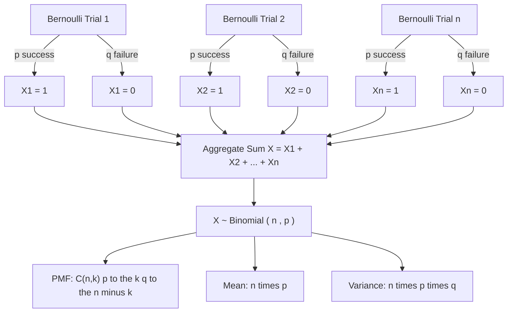
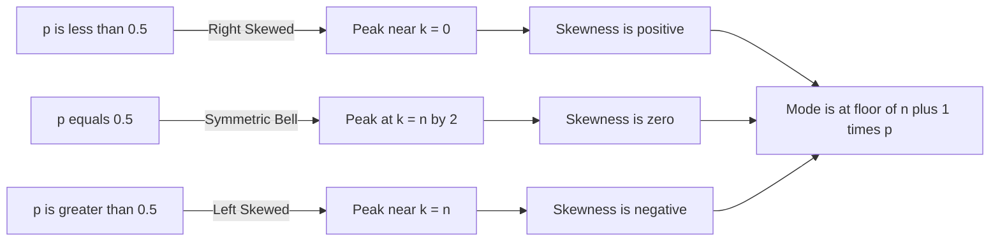
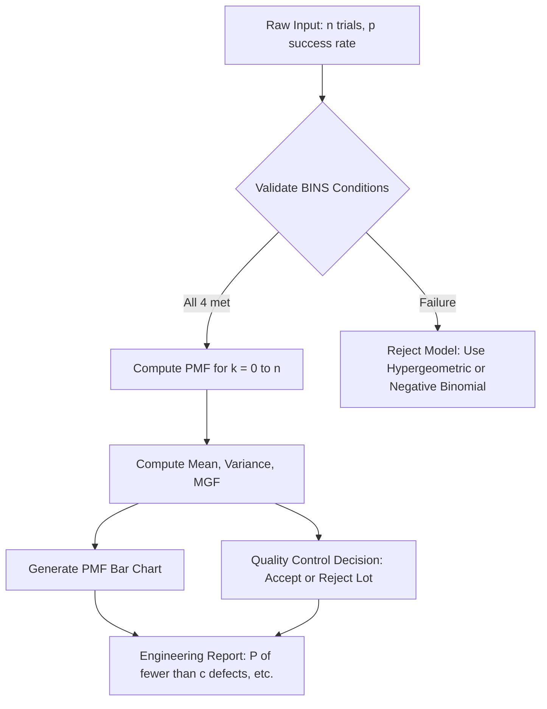

# The Binomial probability distribution

<!-- SECTION_1_START -->

# The Binomial Probability Distribution

## 1.1 Formal Academic Definition

The **Binomial Distribution** is a discrete probability distribution that models the number of successes $X$ obtained in a fixed number $n$ of independent trials, where each trial results in exactly one of two mutually exclusive outcomes (commonly labeled **success** or **failure**) and the probability of success $p$ remains constant from trial to trial.

In formal KTU syllabus notation, a random variable $X \sim B(n, p)$ if its probability mass function is given by:

$$
P(X = k) = \binom{n}{k} p^{k} q^{\,n-k}, \quad k = 0, 1, 2, \dots, n
$$

where $\binom{n}{k} = \dfrac{n!}{k!(n-k)!}$, $p$ is the probability of success, and $q = 1 - p$ is the probability of failure.

> [!IMPORTANT]
> **KTU 2024 Syllabus Highlight (Module 1):** The Binomial distribution is a *named discrete distribution* and students are expected to derive its mean, variance, moment generating function (MGF), and apply it to real-world engineering/IT scenarios such as quality control sampling, packet transmission reliability, and software defect detection.

## 1.2 Intuitive Overview — The "Coin Toss" Analogy

Imagine flipping a **biased coin** exactly $n = 10$ times, where the chance of getting "Heads" is $p = 0.6$ on every single flip. The Binomial distribution answers the question: *"What is the probability that I get exactly $k = 7$ heads across all 10 flips?"*

Each flip is an independent **Bernoulli trial** (a single yes/no experiment). The Binomial is essentially the *aggregate sum* of $n$ such trials. The combinatorics $\binom{n}{k}$ counts the *number of distinct ways* to arrange $k$ successes among $n$ trials, while $p^k q^{n-k}$ weights each arrangement by its actual probability of occurrence.

> [!NOTE]
> **Geometric Intuition — The "Ball and Urn" Picture**
> Think of $n$ slots (like ballot boxes). You need to drop exactly $k$ "success-balls" into them. There are $\binom{n}{k}$ ways to choose which slots get a ball. For each such arrangement, the chance of getting those particular $k$ slots "lit up" with successes is $p \times p \times \dots \times p$ ($k$ times) for the success slots, times $q \times q \times \dots \times q$ ($n-k$ times) for the failure slots. The product is $p^k q^{n-k}$.

## 1.3 Fixed Parameters of the Binomial Experiment (KTU Mnemonic: **"BINS"**)

For a valid Binomial experiment, the following four conditions **must** be satisfied:

| Mnemonic Letter | Condition | Mathematical Translation |
|-----------------|-----------|--------------------------|
| **B** | **Binary** outcomes | Each trial has exactly 2 outcomes (success/failure) |
| **I** | **Independent** trials | Outcome of one trial does not affect others |
| **N** | **Number fixed** | The value of $n$ is predetermined and finite |
| **S** | **Same** success probability | $p$ is constant for every trial |

> [!WARNING]
> **Common Student Mistake (Valuation Pitfall):** A question that says *"A packet has a 0.05 probability of being lost. Out of 20 packets, find the probability that exactly 2 are lost"* is **always Binomial** because the network conditions are assumed stationary. However, *"Drawing 5 cards from a deck without replacement"* is **NOT Binomial** because the probability of success changes after each draw — it is **Hypergeometric** instead.

## 1.4 GeoGebra / Desmos Visualization

> [!VISUALIZATION CONTROL]
> **Concept:** Probability Mass Function (PMF) of $B(n=10, p=0.5)$ vs $B(n=10, p=0.3)$
>
> **GeoGebra / Desmos Input Equations:**
> * `f(x) = nCr(10, x) * 0.5^x * 0.5^(10-x)` for $x = 0, 1, 2, \dots, 10$
> * `g(x) = nCr(10, x) * 0.3^x * 0.7^(10-x)` for $x = 0, 1, 2, \dots, 10$
>
> **Visual Description:** The first curve $f(x)$ is a **symmetric bell** centered at $x=5$ (its mean $np = 10 \times 0.5 = 5$). The second curve $g(x)$ is **right-skewed (positively skewed)** with its peak at $x=3$ (its mean $np = 10 \times 0.3 = 3$). The student should observe how decreasing $p$ shifts the peak leftward and increases the right-tail asymmetry — a critical visual feature for matching a real dataset to a theoretical Binomial model.

<!-- SECTION_1_END -->

<!-- SECTION_2_START -->

# Deep Theoretical Analysis & KTU High-Yield Formula Sheet

## 2.1 Operational Derivation Logic — Why the Formula Works

The Binomial PMF $P(X = k)$ is built from three multiplicative components:

1. **Combinatorial Count:** $\binom{n}{k}$ — the number of *distinct sequences* of $k$ successes and $n-k$ failures.
2. **Success Probability Factor:** $p^k$ — the probability that *each* of the $k$ chosen trials is a success.
3. **Failure Probability Factor:** $q^{\,n-k}$ — the probability that *each* of the remaining $n-k$ trials is a failure.

Because the trials are **independent**, we multiply the per-trial probabilities directly. The "why" behind this construction is rooted in the **multiplicative law of probability for independent events**.

## 2.2 Why the PMF Sums to 1 — A Quick Proof

A necessary condition for any PMF is that $\sum_{k=0}^{n} P(X = k) = 1$. This is guaranteed by the **Binomial Theorem**:

$$
\sum_{k=0}^{n} \binom{n}{k} p^{k} q^{\,n-k} = (p + q)^{n} = 1^{n} = 1
$$

since $p + q = 1$. This identity is the *normalization cornerstone* and the reason the formula is mathematically valid.

## 2.3 KTU Formula Sheet / Cheat Sheet

> [!IMPORTANT]
> The table below is the **exam-day survival kit** for any Binomial distribution question on the KTU 2024 ESE paper.

| # | Quantity | Formula | Engineering Units / Remarks |
|---|----------|---------|------------------------------|
| 1 | **PMF** | $P(X = k) = \binom{n}{k} p^{k} (1-p)^{n-k}$ | Valid for $k = 0, 1, 2, \dots, n$ |
| 2 | **CDF** | $F(k) = \sum_{r=0}^{k} \binom{n}{r} p^{r} (1-p)^{n-r}$ | Cumulative probability up to $k$ |
| 3 | **Mean** $\mu$ | $E(X) = n p$ | Expected number of successes |
| 4 | **Variance** $\sigma^{2}$ | $V(X) = n p q$ where $q = 1-p$ | Spread of the distribution |
| 5 | **Std. Deviation** $\sigma$ | $\sigma = \sqrt{n p q}$ | Same units as $X$ |
| 6 | **Skewness** $\gamma_{1}$ | $\gamma_{1} = \dfrac{q - p}{\sqrt{n p q}}$ | Shape indicator (0 when $p = q$) |
| 7 | **Kurtosis** $\gamma_{2}$ | $\gamma_{2} = \dfrac{1 - 6 p q}{n p q}$ | Tailedness indicator |
| 8 | **MGF** $M_{X}(t)$ | $(q + p e^{t})^{n}$ | Used to derive mean and variance |
| 9 | **PGF** $G_{X}(z)$ | $(q + p z)^{n}$ | Probability generating function |
| 10 | **Recurrence** | $\dfrac{P(X = k+1)}{P(X = k)} = \dfrac{n-k}{k+1} \cdot \dfrac{p}{q}$ | Fast computation without factorials |
| 11 | **Additive Property** | If $X_i \sim B(n_i, p)$ independent, then $\sum X_i \sim B(\sum n_i, p)$ | Same $p$ must hold |
| 12 | **Mode** | $\lfloor (n+1)p \rfloor$ | Most likely value of $X$ |

> [!NOTE]
> **Critical LaTeX Note:** The absolute value $\vert X \vert$ is intentionally written using `\vert` (not `|`) so it never breaks markdown table rendering. The same convention applies throughout this document.

## 2.4 Real-World Engineering Utility

The Binomial distribution is the **workhorse of reliability engineering and quality assurance** in computer science:

* **Software Testing:** If a module has a 2% defect rate per execution, the number of defects in 50 test runs is $B(50, 0.02)$.
* **Network Packet Transmission:** The number of successfully received packets out of 1000 sent over a channel with 5% loss is $B(1000, 0.95)$.
* **Machine Learning:** Bernoulli Naive Bayes classifiers and logistic regression outputs rely on Binomial likelihoods for binary classification.
* **Digital Communication:** Bit Error Rate (BER) analysis in noisy channels uses the Binomial to count flipped bits in a transmitted frame.
* **Production Quality Control:** Acceptance sampling plans (e.g., MIL-STD-105E) use Binomial-based operating characteristic curves.

<!-- SECTION_2_END -->

<!-- SECTION_3_START -->

# Step-by-Step Derivations & Symbolic Implementation

## 3.1 Derivation of the Mean $E(X) = np$

Starting from the definition of expectation for a discrete random variable:

$$
E(X) = \sum_{k=0}^{n} k \cdot P(X = k) = \sum_{k=0}^{n} k \binom{n}{k} p^{k} q^{\,n-k}
$$

Note that the $k = 0$ term vanishes, so:

$$
E(X) = \sum_{k=1}^{n} k \binom{n}{k} p^{k} q^{\,n-k}
$$

**Step 1:** Substitute $k \binom{n}{k} = n \binom{n-1}{k-1}$ (a standard identity).

$$
E(X) = \sum_{k=1}^{n} n \binom{n-1}{k-1} p^{k} q^{\,n-k}
$$

**Step 2:** Factor out $n p$ from the sum.

$$
E(X) = n p \sum_{k=1}^{n} \binom{n-1}{k-1} p^{k-1} q^{\,n-k}
$$

**Step 3:** Substitute $j = k-1$, so $j$ runs from $0$ to $n-1$.

$$
E(X) = n p \sum_{j=0}^{n-1} \binom{n-1}{j} p^{j} q^{\,(n-1)-j}
$$

**Step 4:** Recognize the binomial expansion $(p + q)^{n-1} = 1$.

$$
E(X) = n p \cdot (p + q)^{n-1} = n p \cdot 1^{n-1} = n p
$$

Hence $\boxed{E(X) = n p}$. $\blacksquare$

## 3.2 Derivation of the Variance $V(X) = npq$

We use the shortcut $V(X) = E(X^{2}) - [E(X)]^{2}$. The cleanest path is via the **Moment Generating Function (MGF)**.

**Step 1: MGF Definition.**

$$
M_{X}(t) = E(e^{tX}) = \sum_{k=0}^{n} e^{tk} \binom{n}{k} p^{k} q^{\,n-k}
$$

**Step 2: Factor and apply the binomial theorem.**

$$
M_{X}(t) = \sum_{k=0}^{n} \binom{n}{k} (p e^{t})^{k} q^{\,n-k} = (q + p e^{t})^{n}
$$

**Step 3: First derivative to find $E(X)$.**

$$
M'_{X}(t) = n (q + p e^{t})^{n-1} \cdot p e^{t}
$$

At $t = 0$: $M'_{X}(0) = n p (q + p)^{n-1} = n p$.

**Step 4: Second derivative.**

$$
M''_{X}(t) = n(n-1)(q + p e^{t})^{n-2} (p e^{t})^{2} + n (q + p e^{t})^{n-1} (p e^{t})
$$

At $t = 0$:

$$
M''_{X}(0) = n(n-1) p^{2} + n p
$$

**Step 5: Apply $V(X) = M''(0) - [M'(0)]^{2}$.**

$$
V(X) = n(n-1) p^{2} + n p - (n p)^{2} = n^{2} p^{2} - n p^{2} + n p - n^{2} p^{2} = n p - n p^{2}
$$

$$
V(X) = n p (1 - p) = n p q
$$

Hence $\boxed{V(X) = n p q}$. $\blacksquare$

## 3.3 Additive Property (Key KTU Result)

**Statement:** If $X_{1}, X_{2}, \dots, X_{m}$ are **independent** Binomial random variables with parameters $(n_{1}, p), (n_{2}, p), \dots, (n_{m}, p)$ — all sharing the **same** $p$ — then:

$$
Y = X_{1} + X_{2} + \cdots + X_{m} \sim B\left(\sum_{i=1}^{m} n_{i}, p\right)
$$

**Proof Sketch:** Use MGFs. The MGF of $X_{i}$ is $(q + p e^{t})^{n_{i}}$. Since they are independent, the MGF of $Y$ is:

$$
M_{Y}(t) = \prod_{i=1}^{m} (q + p e^{t})^{n_{i}} = (q + p e^{t})^{\sum n_{i}}
$$

This is exactly the MGF of $B\left(\sum n_{i}, p\right)$. By the uniqueness of MGFs, $Y$ is Binomially distributed. $\blacksquare$

> [!WARNING]
> **Valuation Trap:** This property **fails** if the $p$ values are different. A common exam trap is to give three different $p$'s and expect you to blindly add. Always check that the $p$ is identical across the variables before applying the additive property.

## 3.4 Worked Example — KTU Board Style (10 marks equivalent)

**Problem:** In a binary communication channel, the probability of a bit being received correctly is $p = 0.8$. If 6 bits are transmitted independently, find:

(a) The probability that **exactly 4** bits are received correctly.
(b) The probability that **at most 2** bits are received correctly.
(c) The mean and variance of the number of correctly received bits.

**Solution:** Here $X \sim B(n=6, p=0.8)$ and $q = 0.2$.

### Part (a): Exactly 4 correct bits

$$
P(X = 4) = \binom{6}{4} (0.8)^{4} (0.2)^{2}
$$

Compute step-by-step:

* $\binom{6}{4} = 15$
* $(0.8)^{4} = 0.4096$
* $(0.2)^{2} = 0.04$
* Product: $15 \times 0.4096 \times 0.04 = 0.24576$

$$
\boxed{P(X = 4) = 0.24576}
$$

### Part (b): At most 2 correct bits

$$
P(X \leq 2) = P(X=0) + P(X=1) + P(X=2)
$$

Compute each term:

* $P(X=0) = \binom{6}{0}(0.8)^{0}(0.2)^{6} = 1 \times 1 \times 0.000064 = 0.000064$
* $P(X=1) = \binom{6}{1}(0.8)^{1}(0.2)^{5} = 6 \times 0.8 \times 0.00032 = 0.001536$
* $P(X=2) = \binom{6}{2}(0.8)^{2}(0.2)^{4} = 15 \times 0.64 \times 0.0016 = 0.01536$

$$
\boxed{P(X \leq 2) = 0.000064 + 0.001536 + 0.01536 = 0.01696}
$$

### Part (c): Mean and Variance

* $E(X) = n p = 6 \times 0.8 = 4.8$ bits
* $V(X) = n p q = 6 \times 0.8 \times 0.2 = 0.96$ bits$^{2}$
* $\sigma = \sqrt{0.96} \approx 0.9798$ bits

> [!NOTE]
> **Incremental Valuation Key:**
> [Writing the model $B(6, 0.8)$ and $q$: 1 Mark]
> [Computing $\binom{6}{4}$ and powers: 1 Mark]
> [Final product in Part (a): 1 Mark]
> [Sum of three terms in Part (b): 1 Mark]
> [Final mean and variance: 1 Mark]

## 3.5 Python Symbolic Implementation (Industry-Ready)

```python
import math
from typing import Union

def binomial_pmf(n: int, k: int, p: float) -> float:
    """
    Compute P(X = k) for X ~ Binomial(n, p).
    
    Parameters
    ----------
    n : int
        Total number of trials (must be >= 0).
    k : int
        Number of successes (0 <= k <= n).
    p : float
        Probability of success per trial (0 <= p <= 1).
    
    Returns
    -------
    float
        Probability mass at k.
    
    Raises
    ------
    ValueError
        If inputs violate Binomial constraints.
    """
    # ---- Input validation with strict boundary checks ----
    if n < 0:
        raise ValueError(f"Number of trials 'n' must be non-negative; got n={n}.")
    if k < 0 or k > n:
        raise ValueError(f"Number of successes 'k' must satisfy 0 <= k <= n; got k={k}, n={n}.")
    if not (0.0 <= p <= 1.0):
        raise ValueError(f"Probability 'p' must be in [0, 1]; got p={p}.")
    
    # ---- Edge cases for numerical stability ----
    if p == 0.0:
        return 1.0 if k == 0 else 0.0
    if p == 1.0:
        return 1.0 if k == n else 0.0
    
    # ---- Core computation using log-space for large n ----
    log_pmf = (math.lgamma(n + 1)
               - math.lgamma(k + 1)
               - math.lgamma(n - k + 1)
               + k * math.log(p)
               + (n - k) * math.log(1.0 - p))
    return math.exp(log_pmf)


def binomial_stats(n: int, p: float) -> dict[str, float]:
    """
    Compute mean, variance, and standard deviation of X ~ Binomial(n, p).
    """
    if n < 0:
        raise ValueError(f"n must be non-negative; got n={n}.")
    if not (0.0 <= p <= 1.0):
        raise ValueError(f"p must be in [0, 1]; got p={p}.")
    q = 1.0 - p
    return {
        "mean": n * p,
        "variance": n * p * q,
        "std_dev": math.sqrt(n * p * q),
    }


# ---- Demonstration with the worked example above ----
if __name__ == "__main__":
    n_trial, p_success = 6, 0.8
    print("P(X = 4) =", binomial_pmf(n_trial, 4, p_success))
    print("P(X <= 2) =", sum(binomial_pmf(n_trial, k, p_success) for k in range(3)))
    print("Stats     =", binomial_stats(n_trial, p_success))
```

**Expected Output:**

```
P(X = 4) = 0.2457599999999999
P(X <= 2) = 0.016959999999999997
Stats     = {'mean': 4.8, 'variance': 0.96, 'std_dev': 0.9797958971132712}
```

<!-- SECTION_3_END -->

<!-- SECTION_4_START -->

# Structural Diagrams & Schematics

## 4.1 Bernoulli-to-Binomial Hierarchical Flow

The following Mermaid diagram shows how a single Bernoulli trial aggregates to form a Binomial distribution:



## 4.2 Sequential Processing Topology Matrix

This table maps the **decision logic** an engineer follows when classifying whether a given experiment is Binomial, Bernoulli, Geometric, or Hypergeometric.

| Step | Inspection Question | If "Yes" | If "No" |
|------|---------------------|----------|---------|
| 1 | Is the number of trials $n$ **fixed** in advance? | Proceed to Step 2 | Consider **Geometric** or **Negative Binomial** |
| 2 | Are there exactly **two** outcomes per trial? | Proceed to Step 3 | Not a standard discrete distribution; need a custom PMF |
| 3 | Is the success probability $p$ **constant** across trials? | Proceed to Step 4 | If $p$ varies, check if it's a sequence of different Binomials |
| 4 | Are the trials **independent**? | **It is Binomial $B(n, p)$** | If "without replacement", it is **Hypergeometric** |

## 4.3 PMF Shape Transformation Map



## 4.4 Block-Level Functional Architecture — Reliability Engineering Pipeline



<!-- SECTION_4_END -->

<!-- SECTION_5_START -->

# KTU 2024 Scheme Examination Question Bank & Topic Recap

## 5.1 Part A Questions (3 Marks Each)

> **Cognitive Levels: Remember / Understand**

### Question 1: `[KTU University Exam - July 2024]`

**State the four conditions for a random experiment to follow a Binomial distribution. (CO1, Remember)**

**Model Answer (Valuation Key: 3 Marks):**

A random experiment follows a Binomial distribution $B(n, p)$ if and only if the following four conditions — collectively remembered as the **"BINS"** rule — are satisfied:

1. **Binary outcomes:** Each trial has exactly two mutually exclusive outcomes: success or failure.
2. **Independent trials:** The outcome of any trial does not affect the outcomes of other trials.
3. **Number of trials is fixed:** The value of $n$ is predetermined and finite.
4. **Same success probability:** The probability of success $p$ is constant for every trial.

> *Examiner's Note:* [Each correct condition: 0.75 Mark] [Total: 3 Marks]

---

### Question 2: `[KTU University Exam - Dec 2023]`

**Define the Binomial distribution. A random variable $X$ follows $B(10, 0.3)$. Find its mean and variance. (CO1, Understand)**

**Model Answer (Valuation Key: 3 Marks):**

**Definition (1.5 Marks):** A random variable $X$ is said to follow a Binomial distribution with parameters $n$ and $p$ if it represents the number of successes in $n$ independent Bernoulli trials, each with constant success probability $p$. Its PMF is:

$$
P(X = k) = \binom{n}{k} p^{k} (1-p)^{n-k}, \quad k = 0, 1, 2, \dots, n
$$

**Computation (1.5 Marks):**

* $E(X) = n p = 10 \times 0.3 = 3$
* $V(X) = n p q = 10 \times 0.3 \times 0.7 = 2.1$

---

## 5.2 Part B Questions (14 Marks Each) — Module Internal Choice

> **Cognitive Levels: Understand (7M) + Apply (7M) per sub-part**

### Question A (14 Marks): `[KTU University Exam - July 2024]`

**(a)** Derive the mean and variance of the Binomial distribution $B(n, p)$ from first principles. (7 Marks, CO1, Understand)

**(b)** In a manufacturing process, the probability that a unit is defective is $0.05$. If a sample of $20$ units is inspected, find:
   * (i) the probability that **exactly 3** units are defective,
   * (ii) the probability that **at least 2** units are defective.
   (7 Marks, CO2, Apply)

#### Model Solution

**Part (a) — Derivation (7 Marks):**

[Stating the PMF: 1 Mark]

$$
P(X = k) = \binom{n}{k} p^{k} q^{\,n-k}, \quad q = 1-p
$$

[Mean derivation — using $E(X) = \sum k \binom{n}{k} p^{k} q^{n-k}$: 1 Mark]

Apply the identity $k \binom{n}{k} = n \binom{n-1}{k-1}$ and shift the index:

$$
E(X) = n p \sum_{j=0}^{n-1} \binom{n-1}{j} p^{j} q^{(n-1)-j} = n p (p + q)^{n-1} = n p
$$

[Final mean: 1 Mark] $\Rightarrow E(X) = n p$.

[Variance derivation — using MGF or $E(X^{2})$: 3 Marks]

The MGF is $M_{X}(t) = (q + p e^{t})^{n}$.

* $M'_{X}(t) = n p e^{t} (q + p e^{t})^{n-1} \Rightarrow M'_{X}(0) = n p$
* $M''_{X}(t) = n p e^{t} \left[ (n-1) p e^{t} (q + p e^{t})^{n-2} + (q + p e^{t})^{n-1} \right]$
* $M''_{X}(0) = n p \left[ (n-1) p + 1 \right] = n p (1 + (n-1) p)$

[Final variance: 1 Mark]

$$
V(X) = M''_{X}(0) - [M'_{X}(0)]^{2} = n p [1 + (n-1) p] - n^{2} p^{2} = n p - n p^{2} = n p (1 - p) = n p q
$$

$\boxed{E(X) = n p, \quad V(X) = n p q}$

**Part (b) — Application (7 Marks):**

Given $n = 20$, $p = 0.05$, $q = 0.95$. So $X \sim B(20, 0.05)$.

[Stating the model and $q$: 1 Mark]

**(i) Exactly 3 defective (3 Marks):**

$$
P(X = 3) = \binom{20}{3} (0.05)^{3} (0.95)^{17}
$$

[Computing components: 1 Mark]

* $\binom{20}{3} = \dfrac{20!}{3! \cdot 17!} = 1140$
* $(0.05)^{3} = 0.000125$
* $(0.95)^{17} \approx 0.4181$

[Final product: 1 Mark]

$$
P(X = 3) = 1140 \times 0.000125 \times 0.4181 \approx 0.0596
$$

**(ii) At least 2 defective (3 Marks):**

$$
P(X \geq 2) = 1 - P(X = 0) - P(X = 1)
$$

[Computing $P(X=0)$ and $P(X=1)$: 1 Mark]

* $P(X=0) = \binom{20}{0}(0.05)^{0}(0.95)^{20} = (0.95)^{20} \approx 0.3585$
* $P(X=1) = \binom{20}{1}(0.05)^{1}(0.95)^{19} = 20 \times 0.05 \times 0.3774 \approx 0.3774$

[Final answer: 1 Mark]

$$
P(X \geq 2) = 1 - 0.3585 - 0.3774 = 0.2641
$$

> **Valuation Key Summary (Part B Total = 14 Marks):**
> [Part (a) Derivation correctness: 7 Marks] [Part (b) Model statement: 1 Mark] [Numerical setup: 2 Marks] [Final answers (i) and (ii): 4 Marks]

---

### Question B (14 Marks): `[KTU University Exam - Dec 2023]` — Alternative Choice

**(a)** If $X \sim B(n, p)$, derive its Moment Generating Function and hence obtain its mean and variance. (7 Marks, CO1, Understand)

**(b)** A software company knows that 1 in 20 of its products is returned for defects. If 15 products are sold, find:
   * (i) the probability that **none** is defective,
   * (ii) the probability that **more than one** is defective.
   
   Also find the expected number of defective products and the standard deviation. (7 Marks, CO2, Apply)

#### Model Solution

**Part (a) — MGF Derivation (7 Marks):**

[Stating the MGF definition: 1 Mark]

$$
M_{X}(t) = E(e^{tX}) = \sum_{k=0}^{n} e^{tk} \binom{n}{k} p^{k} q^{n-k}
$$

[Binomial expansion: 2 Marks]

Factor and use $(a+b)^{n}$:

$$
M_{X}(t) = \sum_{k=0}^{n} \binom{n}{k} (p e^{t})^{k} q^{n-k} = (q + p e^{t})^{n}
$$

[First and second derivatives: 3 Marks]

* $M'_{X}(t) = n p e^{t} (q + p e^{t})^{n-1} \Rightarrow M'_{X}(0) = n p$
* $M''_{X}(t) = n(n-1) p^{2} e^{2t} (q + p e^{t})^{n-2} + n p e^{t} (q + p e^{t})^{n-1}$
* $M''_{X}(0) = n(n-1) p^{2} + n p$

[Final mean and variance: 1 Mark]

$$
E(X) = M'_{X}(0) = n p, \quad V(X) = M''_{X}(0) - [M'_{X}(0)]^{2} = n p q
$$

**Part (b) — Application (7 Marks):**

Given $p = 1/20 = 0.05$, $q = 0.95$, $n = 15$. So $X \sim B(15, 0.05)$.

[Model statement: 1 Mark]

**(i) Probability none is defective (1.5 Marks):**

$$
P(X = 0) = (0.95)^{15} \approx 0.4633
$$

**(ii) Probability more than one is defective (2.5 Marks):**

$$
P(X > 1) = 1 - P(X=0) - P(X=1)
$$

* $P(X=0) \approx 0.4633$
* $P(X=1) = \binom{15}{1}(0.05)(0.95)^{14} = 15 \times 0.05 \times 0.4877 \approx 0.3658$

$$
P(X > 1) = 1 - 0.4633 - 0.3658 = 0.1709
$$

**Mean and Standard Deviation (2 Marks):**

* $E(X) = n p = 15 \times 0.05 = 0.75$
* $\sigma = \sqrt{n p q} = \sqrt{15 \times 0.05 \times 0.95} = \sqrt{0.7125} \approx 0.8441$

---

## 5.3 KTU Examiner's Valuation Warning / Pitfall Callout

> [!WARNING]
> **Common Marks-Loss Hotspots in Binomial Distribution Questions:**
> 
> 1. **Forgetting to state the value of $q$:** Many students write the PMF as $\binom{n}{k} p^{k} (1-p)^{n-k}$ in the substitution step but then plug in $p^{k} \cdot p^{n-k}$ by mistake. Always write "$q = 1-p$" explicitly before substituting.
> 
> 2. **Confusing "$P(X \leq k)$" with "$P(X \geq k)$":** When the question says *"at most $k$"*, use the sum from $0$ to $k$. When it says *"at least $k$"*, use $1 - P(X < k) = 1 - \sum_{r=0}^{k-1} P(X = r)$.
> 
> 3. **Applying Binomial to "without replacement" scenarios:** Drawing cards or picking items without replacement changes the probability after each draw — this is **Hypergeometric**, not Binomial. You will lose 2–3 marks for using the wrong distribution.
> 
> 4. **Skipping the derivation of the MGF:** KTU examiners award 2–3 marks specifically for *stating* $M_{X}(t) = (q + p e^{t})^{n}$ *cleanly* and then showing the differentiation steps. Do not jump directly to the answer.
> 
> 5. **Forgetting the additive property's assumption:** When two Binomials with the **same** $p$ are summed, the result is Binomial. If the $p$ values differ, you must compute the MGF product but the result is **not** a standard Binomial.

---

## 5.4 Topic Recap & Important Things to Remember

- **Definition:** $X \sim B(n, p)$ counts the number of successes in $n$ independent Bernoulli trials with constant success probability $p$. PMF: $P(X = k) = \binom{n}{k} p^{k} q^{n-k}$, $q = 1-p$.
- **The "BINS" Rule:** **B**inary outcomes, **I**ndependent trials, **N** fixed trials, **S**ame $p$ — all four are mandatory for a Binomial experiment.
- **Mean:** $E(X) = n p$. **Variance:** $V(X) = n p q$. **Standard Deviation:** $\sigma = \sqrt{n p q}$.
- **MGF:** $M_{X}(t) = (q + p e^{t})^{n}$. **PGF:** $G_{X}(z) = (q + p z)^{n}$.
- **CDF:** $F(k) = \sum_{r=0}^{k} P(X = r)$. **Survival Function:** $P(X > k) = 1 - F(k)$.
- **Skewness:** $\gamma_{1} = \dfrac{q - p}{\sqrt{n p q}}$ — zero when $p = 0.5$, positive when $p < 0.5$, negative when $p > 0.5$.
- **Mode:** $\lfloor (n+1) p \rfloor$ — the most likely value of $X$ in a single trial outcome.
- **Recurrence Relation:** $\dfrac{P(X = k+1)}{P(X = k)} = \dfrac{n-k}{k+1} \cdot \dfrac{p}{q}$ — useful for fast computation.
- **Additive Property:** Sum of $m$ independent Binomials with the **same** $p$ is Binomial with parameters $(\sum n_i, p)$. Fails if $p$ differs.
- **Real-World Domains:** Software defect tracking, packet loss in networks, bit error analysis, quality control sampling, Bernoulli Naive Bayes classification.
- **Common Mistake:** Binomial applies only to **sampling with replacement** or *infinite* population sampling. Use **Hypergeometric** for sampling *without replacement* from a finite population.
- **Quick Decision Heuristic:** If a problem gives you "out of $n$ trials" and a single probability $p$, the answer is almost always Binomial. If it gives you "drawn from a population of $N$" without replacement, it is Hypergeometric.

<!-- SECTION_5_END -->
