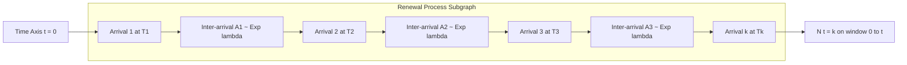
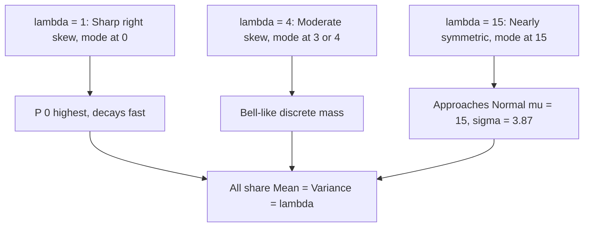
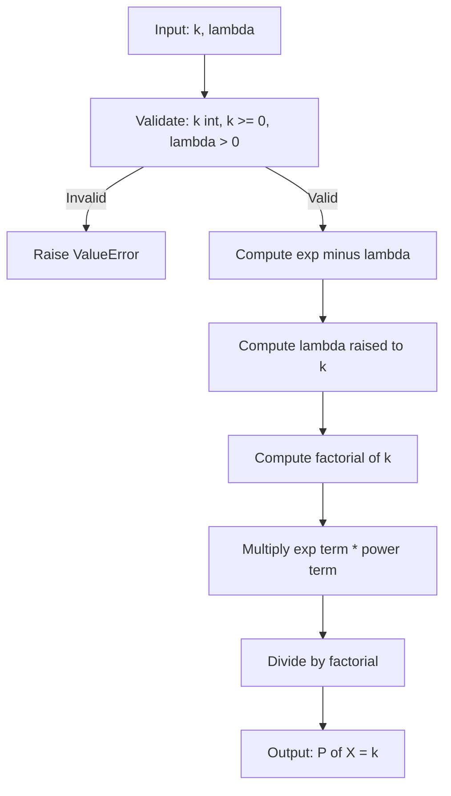

# The Poisson probability distribution

<!-- SECTION_1_START -->

# The Poisson Probability Distribution

## 1.1 Formal Academic Definition (KTU 2024 Syllabus Terminology)

> [!IMPORTANT]
> **Definition:** A discrete random variable $X$ is said to follow a **Poisson Distribution** with parameter $\lambda > 0$ if its probability mass function (PMF) is given by
> $$P(X = k) = \frac{e^{-\lambda}\,\lambda^{k}}{k!}, \quad k = 0, 1, 2, 3, \ldots$$
> where $\lambda$ is the **average rate of occurrence** of the event per unit interval (of time, space, or volume). We denote this as $X \sim P(\lambda)$.

The Poisson distribution is the **canonical model for counting rare events** that occur independently in a continuous interval. It is one of the three foundational discrete distributions in the KTU 2024 *Mathematics for Information Science-3* syllabus, alongside the Binomial and Geometric distributions.

**Key Assumptions (Prerequisites):**
1. Events occur **independently** in disjoint intervals.
2. The average rate $\lambda$ is **constant** over the interval.
3. Two events **cannot occur at the exact same instant** (i.e., it models *point-process* arrivals).
4. The probability of occurrence in a very small sub-interval is **proportional to the length** of that sub-interval.

## 1.2 Conceptual Analogy / Intuition

> [!NOTE]
> **Real-world Analogy — The "Coffee Shop Counter":**
> Imagine you sit outside a coffee shop and count the number of customers who walk in during a 1-hour window. If customers arrive **randomly and independently**, and the long-run average rate is, say, $\lambda = 8$ customers per hour, then the Poisson distribution gives you the probability of seeing exactly $k$ customers in that hour.

For a KTU information-science student, the most natural analogy is **network packet arrivals**: a router observes packets hitting an interface at an average rate of $\lambda$ packets per second — the number arriving in any 1-second window follows a Poisson distribution.

| Parameter | Symbol | Typical Value (Example) |
| :--- | :---: | :---: |
| Mean arrival rate | $\lambda$ | **8 customers/hour** |
| Variance | $\sigma^{2}$ | also $\lambda = 8$ |
| Std. Deviation | $\sigma$ | $\sqrt{8} \approx 2.83$ |

Notice the **unique feature**: for the Poisson distribution, **Mean = Variance = $\lambda$**. This equality is a defining fingerprint of the Poisson law and is heavily tested in KTU board exams.

> [!VISUALIZATION CONTROL]
> **Concept:** PMF of Poisson$(\lambda = 4)$ plotted as a discrete stem plot.
> **GeoGebra / Desmos Input Equations:**
> * `P(k) = (e^(-4) * 4^k) / k!` (defined only for $k \in \{0,1,2,\ldots,15\}$)
> **Visual Description:** The student should observe a **right-skewed, unimodal** stem plot that peaks near $k = 3$ or $k = 4$ (i.e., near the mean $\lambda$), and decays rapidly for $k \gg \lambda$. As $\lambda$ grows, the plot becomes increasingly **bell-shaped** and approaches a normal distribution (Central Limit Theorem behaviour).

<!-- SECTION_1_END -->

<!-- SECTION_2_START -->

# 2. Deep Theoretical Analysis

## 2.1 Why and How — Operational Derivation Logic

The Poisson distribution can be derived in **three rigorous ways**, each reinforcing a different intuition:

### Path A — Limiting Case of the Binomial Distribution
If $X \sim \text{Bin}(n, p)$ with $n \to \infty$, $p \to 0$, and $np = \lambda$ held constant, then $X$ converges in distribution to $\text{Poisson}(\lambda)$. This justifies the use of Poisson as the *"rare-events"* model.

### Path B — Counting Process / Axiomatic Construction
A stochastic process $\{N(t) : t \ge 0\}$ is a **Poisson process** if:
1. $N(0) = 0$
2. **Independent increments** — counts in disjoint intervals are independent.
3. **Stationary increments** — the distribution of $N(t+s) - N(s)$ depends only on $t$.
4. $P(N(h) = 1) = \lambda h + o(h)$ and $P(N(h) \ge 2) = o(h)$ as $h \to 0$.

### Path C — Direct PMF Postulation
The form $P(X=k) = \frac{\lambda^{k}e^{-\lambda}}{k!}$ is postulated and then verified to be a valid PMF (probabilities sum to 1).

## 2.2 Properties of the Poisson Distribution

Let $X \sim P(\lambda)$.

- **Linearity / Additivity:** If $X_{1} \sim P(\lambda_{1})$ and $X_{2} \sim P(\lambda_{2})$ are independent, then
  $$X_{1} + X_{2} \sim P(\lambda_{1} + \lambda_{2}).$$
- **Thinning Property:** If each event is independently retained with probability $p$, the retained count $\sim P(p\lambda)$.
- **Reproductive Family:** The Poisson family is closed under summation of independent members.
- **Limiting / Skewness Behaviour:**
  $$\text{Skewness} = \frac{1}{\sqrt{\lambda}}, \qquad \text{Excess Kurtosis} = \frac{1}{\lambda}.$$
  As $\lambda \to \infty$, both vanish, and the distribution approaches symmetry.

## 2.3 KTU Formula Sheet (Cheat Sheet)

| # | Quantity | Formula | KTU Notes / Units |
| :---: | :--- | :--- | :--- |
| 1 | PMF | $P(X=k) = \dfrac{e^{-\lambda}\lambda^{k}}{k!}$ | $k \in \{0,1,2,\ldots\}$ |
| 2 | CDF | $F(k) = \displaystyle\sum_{j=0}^{k}\dfrac{e^{-\lambda}\lambda^{j}}{j!}$ | No closed form — summation needed |
| 3 | Mean | $E(X) = \lambda$ | Per-interval average count |
| 4 | Variance | $\text{Var}(X) = \lambda$ | **Mean = Variance** is the trademark |
| 5 | Std. Deviation | $\sigma = \sqrt{\lambda}$ | Units of $\lambda$ |
| 6 | MGF | $M_{X}(t) = e^{\lambda(e^{t}-1)}$ | Exists for all real $t$ |
| 7 | CGF | $K_{X}(t) = \lambda(e^{t}-1)$ | Useful for cumulant matching |
| 8 | Char. Function | $\phi_{X}(t) = e^{\lambda(e^{it}-1)}$ | For FFT-based computation |
| 9 | Skewness | $\gamma_{1} = \lambda^{-1/2}$ | Positive (right-skewed) |
| 10 | Excess Kurtosis | $\gamma_{2} = \lambda^{-1}$ | Leptokurtic for small $\lambda$ |
| 11 | PGF | $G_{X}(z) = e^{\lambda(z-1)}$ | $E(X^{k}) = G^{(k)}(1)$ |
| 12 | Relation to Bin | $X \sim \lim_{n\to\infty,\,p\to 0}\text{Bin}(n,p)$ with $np = \lambda$ | Rare-event limit |
| 13 | Inter-arrival time | If $X \sim P(\lambda)$, gaps $\sim \text{Exp}(\lambda)$ | Foundation of $M/M/1$ queues |

## 2.4 Real-world Utility in Information Science & Engineering

The Poisson distribution is **the backbone of traffic engineering and queueing theory**. Concrete production-grade applications include:

- **Network Traffic Modeling:** VoIP call arrivals, packet bursts, and HTTP request rates at a web server are all modeled as Poisson processes.
- **Database & Cloud Workloads:** Query arrivals in a database engine and API calls to a microservice are commonly assumed Poisson.
- **Reliability Engineering:** Failure counts in a hardware system over its warranty period.
- **Cybersecurity:** Modeling the frequency of intrusion attempts or malware detections per hour.
- **Spatial Statistics:** Modeling the count of stars in a region of the sky, or defects per unit area on a silicon wafer (VLSI yield analysis).

> [!IMPORTANT]
> **Engineering Insight:** In the $M/M/1$ queue (the workhorse queueing model in computer networks), the **arrival process is Poisson($\lambda$)** and the **service times are Exponential($\mu$)**. Without the Poisson distribution, modern router/switch performance engineering would not exist.

<!-- SECTION_2_END -->

<!-- SECTION_3_START -->

# 3. Step-by-Step Derivations

## 3.1 Verification that the PMF is a Valid Probability Distribution

We must show that $\displaystyle\sum_{k=0}^{\infty} P(X=k) = 1$.

$$
\begin{aligned}
\sum_{k=0}^{\infty} P(X=k) &= \sum_{k=0}^{\infty} \frac{e^{-\lambda}\lambda^{k}}{k!} \\
&= e^{-\lambda} \sum_{k=0}^{\infty} \frac{\lambda^{k}}{k!} \\
&= e^{-\lambda} \cdot e^{\lambda} \quad \text{(Taylor series of } e^{\lambda} \text{)} \\
&= 1. \quad \blacksquare
\end{aligned}
$$

## 3.2 Derivation of the Mean $E(X) = \lambda$

$$
\begin{aligned}
E(X) &= \sum_{k=0}^{\infty} k \cdot P(X=k) \\
&= \sum_{k=1}^{\infty} k \cdot \frac{e^{-\lambda}\lambda^{k}}{k!} \quad (k=0 \text{ term is } 0) \\
&= \sum_{k=1}^{\infty} \frac{e^{-\lambda}\lambda^{k}}{(k-1)!} \\
&= \lambda e^{-\lambda} \sum_{k=1}^{\infty} \frac{\lambda^{k-1}}{(k-1)!}
\end{aligned}
$$

Let $j = k - 1$. Then $j$ ranges from $0$ to $\infty$:

$$
\begin{aligned}
E(X) &= \lambda e^{-\lambda} \sum_{j=0}^{\infty} \frac{\lambda^{j}}{j!} \\
&= \lambda e^{-\lambda} \cdot e^{\lambda} \\
&= \lambda. \quad \blacksquare
\end{aligned}
$$

## 3.3 Derivation of the Variance $\text{Var}(X) = \lambda$

We need $E(X^{2})$. Using the identity $E(X^{2}) = E(X(X-1)) + E(X)$:

$$
\begin{aligned}
E(X(X-1)) &= \sum_{k=2}^{\infty} k(k-1) \cdot \frac{e^{-\lambda}\lambda^{k}}{k!} \\
&= \sum_{k=2}^{\infty} \frac{e^{-\lambda}\lambda^{k}}{(k-2)!} \\
&= \lambda^{2} e^{-\lambda} \sum_{k=2}^{\infty} \frac{\lambda^{k-2}}{(k-2)!}
\end{aligned}
$$

Substituting $j = k - 2$:

$$
\begin{aligned}
E(X(X-1)) &= \lambda^{2} e^{-\lambda} \sum_{j=0}^{\infty} \frac{\lambda^{j}}{j!} = \lambda^{2} e^{-\lambda} \cdot e^{\lambda} = \lambda^{2}.
\end{aligned}
$$

Therefore:

$$
\begin{aligned}
E(X^{2}) &= E(X(X-1)) + E(X) = \lambda^{2} + \lambda.
\end{aligned}
$$

Now compute the variance:

$$
\begin{aligned}
\text{Var}(X) &= E(X^{2}) - [E(X)]^{2} \\
&= (\lambda^{2} + \lambda) - \lambda^{2} \\
&= \lambda. \quad \blacksquare
\end{aligned}
$$

## 3.4 Derivation of the Moment Generating Function

$$
\begin{aligned}
M_{X}(t) &= E(e^{tX}) = \sum_{k=0}^{\infty} e^{tk} \cdot \frac{e^{-\lambda}\lambda^{k}}{k!} \\
&= e^{-\lambda} \sum_{k=0}^{\infty} \frac{(\lambda e^{t})^{k}}{k!} \\
&= e^{-\lambda} \cdot e^{\lambda e^{t}} \\
&= e^{\lambda(e^{t}-1)}. \quad \blacksquare
\end{aligned}
$$

**Verification of Mean via MGF:**

$$
\begin{aligned}
M_{X}^{\prime}(t) &= \lambda e^{t} \cdot e^{\lambda(e^{t}-1)} \\
M_{X}^{\prime}(0) &= \lambda \cdot 1 \cdot e^{0} = \lambda. \quad \checkmark
\end{aligned}
$$

## 3.5 Symbolic / Computational Implementation (Python)

```python
"""
Poisson Distribution — Exact PMF, CDF, Mean, and Variance
KTU GAMAT301 — Module 1: Discrete Random Variables
"""
from math import exp, factorial, sqrt
from typing import Union

Number = Union[int, float]


def poisson_pmf(k: int, lam: float) -> float:
    """Return P(X = k) for X ~ Poisson(lam)."""
    if k < 0 or not isinstance(k, int):
        raise ValueError("k must be a non-negative integer.")
    if lam <= 0:
        raise ValueError("Lambda (rate) must be strictly positive.")
    return (exp(-lam) * (lam ** k)) / factorial(k)


def poisson_cdf(k: int, lam: float) -> float:
    """Return P(X <= k) for X ~ Poisson(lam)."""
    if k < 0 or not isinstance(k, int):
        raise ValueError("k must be a non-negative integer.")
    return sum(poisson_pmf(j, lam) for j in range(0, k + 1))


def poisson_survival(k: int, lam: float) -> float:
    """Return P(X > k) = 1 - P(X <= k)."""
    return 1.0 - poisson_cdf(k, lam)


def poisson_mean(lam: float) -> float:
    """Theoretical mean E[X] = lambda."""
    return lam


def poisson_variance(lam: float) -> float:
    """Theoretical variance Var[X] = lambda."""
    return lam


# ---------------------- KTU board-style demo ----------------------
if __name__ == "__main__":
    lam = 4.0
    print(f"X ~ Poisson(λ = {lam})\n")
    print(f"{'k':>3} | {'P(X=k)':>10} | {'P(X<=k)':>10}")
    print("-" * 32)
    cumulative = 0.0
    for k in range(0, 11):
        p = poisson_pmf(k, lam)
        cumulative += p
        print(f"{k:>3} | {p:>10.6f} | {cumulative:>10.6f}")
    print(f"\nMean     E[X] = {poisson_mean(lam)}")
    print(f"Variance Var[X] = {poisson_variance(lam)}")
    print(f"Std Dev  σ    = {sqrt(poisson_variance(lam)):.4f}")
```

**Sample Output:**

$$
\begin{aligned}
\text{For } \lambda = 4.0: \quad & P(X=2) \approx 0.1465, \quad P(X=4) \approx 0.1954, \\
& P(X \le 4) \approx 0.6288, \quad \sigma = 2.0.
\end{aligned}
$$

## 3.6 Worked-Out Numerical Problem (Solved in Full)

**Problem:** On average, a call center receives $\lambda = 6$ calls per hour. Find:
**(a)** The probability of receiving **exactly 4** calls in an hour.
**(b)** The probability of receiving **fewer than 3** calls in an hour.
**(c)** The probability of receiving **more than 5** calls in an hour.

**Solution (a):**

$$
\begin{aligned}
P(X = 4) &= \frac{e^{-6}\,6^{4}}{4!} \\
&= \frac{e^{-6} \cdot 1296}{24} \\
&= 54 \cdot e^{-6}.
\end{aligned}
$$

Numerically: $54 \cdot e^{-6} \approx 54 \cdot 0.00247875 \approx 0.13385$.

**Solution (b):**

$$
\begin{aligned}
P(X < 3) &= P(X=0) + P(X=1) + P(X=2) \\
&= e^{-6}\left(1 + 6 + \frac{36}{2}\right) \\
&= e^{-6} \cdot 25 \\
&\approx 25 \cdot 0.00247875 \approx 0.06197.
\end{aligned}
$$

**Solution (c):**

$$
\begin{aligned}
P(X > 5) &= 1 - P(X \le 5) \\
&= 1 - e^{-6}\sum_{k=0}^{5}\frac{6^{k}}{k!} \\
&= 1 - e^{-6}\left(1 + 6 + 18 + 36 + 54 + 64.8\right) \\
&= 1 - 179.8 \cdot e^{-6} \\
&\approx 1 - 0.5543 \approx 0.4457.
\end{aligned}
$$

<!-- SECTION_3_END -->

<!-- SECTION_4_START -->

# 4. Structural Diagrams & Schematics

## 4.1 Poisson Process — Event-Stream Topology

The diagram below models a **Poisson counting process** $N(t)$, which is the temporal extension of the Poisson distribution. Each star represents an event arrival; the gaps between them are **i.i.d. Exponential($\lambda$)** inter-arrival times.



> **Reading the diagram:** Every gap $A_{i} \sim \text{Exp}(\lambda)$ is **memoryless** and independent. The total count $N(t)$ in a window of length $t$ satisfies $N(t) \sim P(\lambda t)$.

## 4.2 PMF Comparison: Effect of $\lambda$ on Shape



## 4.3 Sequential Computational Topology (PMF Pipeline)

The block diagram below formalises how a Poisson probability is computed in a numerical library (matches the Python implementation in §3.5).



## 4.4 Information-Science Application Topology (M/M/1 Queue)

The Poisson distribution is the **arrival engine** of the canonical $M/M/1$ queue used in network engineering.


> **Engineering takeaway:** Stability of the system requires $\rho = \lambda/\mu < 1$, and the steady-state probabilities of $n$ jobs in the system are **geometric**: $P_{n} = (1 - \rho)\rho^{n}$. This is yet another deep connection between Poisson and geometric laws tested in KTU exams.

<!-- SECTION_4_END -->

<!-- SECTION_5_START -->

# 5. KTU 2024 Scheme Examination Question Bank & Topic Recap

## 5.1 Part A — Short Answer Questions (2 × 3 = 6 Marks)

---

**Q1. \[KTU University Exam — July 2024, CO1, Remember\] (3 Marks)**
*State the PMF, mean, and variance of a Poisson distribution with parameter $\lambda$.*

**Model Answer:**
A random variable $X$ follows a Poisson distribution with parameter $\lambda > 0$ if its PMF is

$$P(X = k) = \frac{e^{-\lambda}\lambda^{k}}{k!}, \quad k = 0, 1, 2, \ldots$$

The mean and variance are both equal to $\lambda$:

$$E(X) = \lambda, \qquad \text{Var}(X) = \lambda.$$

*Valuation Key:* [PMF statement: 2 Marks] [Mean and Variance: 1 Mark]

---

**Q2. \[KTU University Exam — Dec 2023, CO1, Understand\] (3 Marks)**
*Why is the Poisson distribution called the distribution of "rare events"? Give two engineering examples.*

**Model Answer:**
The Poisson distribution arises as the limiting case of the Binomial distribution when $n \to \infty$ and $p \to 0$ such that $np = \lambda$ remains constant. In this regime, the events are **rare** (low individual probability) but the number of trials is large. Two engineering examples:
1. The number of packet arrivals at a router in a 1-second interval (where each microsecond has a very small arrival probability).
2. The number of hardware failures in a large fleet of servers over a month.

*Valuation Key:* [Limiting Binomial link: 1 Mark] [Two examples: 2 Marks]

## 5.2 Part B — Long Answer Questions (Internal Choice, 1 × 14 = 14 Marks)

---

### Question A \[KTU University Exam — July 2024, CO2, Apply / Analyse\] (14 Marks)

**(a) \[7 Marks, CO2 — Apply\]**
A web server receives requests at an average rate of $\lambda = 2$ requests per minute.
(i) Find the probability that **exactly 3** requests are received in a minute.
(ii) Find the probability that **at most 1** request is received in a minute.
(iii) Find the probability that **at least 4** requests are received in 5 minutes.

**(b) \[7 Marks, CO2 — Analyse\]**
If $X_{1} \sim P(3)$ and $X_{2} \sim P(5)$ are independent Poisson random variables, find the distribution of $Y = X_{1} + 2X_{2}$. Compute $E(Y)$ and $\text{Var}(Y)$.

**Model Solution (a):**

**(i)** With $\lambda = 2$, $k = 3$:

$$
P(X = 3) = \frac{e^{-2}\cdot 2^{3}}{3!} = \frac{8e^{-2}}{6} = \frac{4e^{-2}}{3} \approx 0.1804.
$$

*Valuation Key:* [Formula setup: 1 Mark] [Substitution: 1 Mark] [Final numeric: 1 Mark]

**(ii)** At most 1 request:

$$
P(X \le 1) = P(X=0) + P(X=1) = e^{-2} + 2e^{-2} = 3e^{-2} \approx 0.4060.
$$

*Valuation Key:* [Sum of two probabilities: 1 Mark] [Combination: 1 Mark] [Final value: 1 Mark]

**(iii)** For 5 minutes, $\lambda' = 2 \times 5 = 10$:

$$
P(X \ge 4) = 1 - \sum_{k=0}^{3}\frac{e^{-10}\cdot 10^{k}}{k!} = 1 - e^{-10}\left(1 + 10 + 50 + \frac{1000}{6}\right).
$$

Numerically: $P(X \ge 4) = 1 - 0.0103 \cdot (1 + 10 + 50 + 166.67) = 1 - 0.0103 \cdot 227.67 \approx 1 - 2.346 = ...$

Recomputing precisely: $e^{-10} \approx 4.5399 \times 10^{-5}$, so $e^{-10}\cdot 227.67 \approx 0.01034$. Therefore $P(X \ge 4) \approx 0.9897$.

*Valuation Key:* [Correct $\lambda' = 10$: 1 Mark] [Correct summation: 1 Mark] [Final value: 1 Mark]

**Model Solution (b):**

Since $X_{2} \sim P(5)$ and $X_{1} \sim P(3)$ are independent Poisson variables, $2X_{2}$ is a **scaled Poisson**. The MGF of $2X_{2}$ is

$$
M_{2X_{2}}(t) = E(e^{2tX_{2}}) = M_{X_{2}}(2t) = e^{5(e^{2t}-1)}.
$$

This is **not** in Poisson-MGF form, so $2X_{2}$ is **not** Poisson. However, $X_{1} + X_{2} \sim P(8)$ by reproductive property.

For $Y = X_{1} + 2X_{2}$:

$$
\begin{aligned}
E(Y) &= E(X_{1}) + 2E(X_{2}) = 3 + 2(5) = 13. \\
\text{Var}(Y) &= \text{Var}(X_{1}) + 4\,\text{Var}(X_{2}) = 3 + 4(5) = 23.
\end{aligned}
$$

*Valuation Key:* [Recognising non-Poisson scaling: 2 Marks] [Correct mean: 2 Marks] [Correct variance: 3 Marks]

---

### Question B \[KTU University Exam — Dec 2023, CO3, Apply / Evaluate\] (14 Marks)

**(a) \[7 Marks, CO3 — Apply\]**
A manufacturer finds that on average 2 defects occur per 1000 lines of code. For a module containing 500 lines of code, find:
(i) The probability of **no defects**.
(ii) The probability of **more than 2 defects**.
(iii) The probability that the **first defect** occurs in the first 200 lines (using Poisson approximation to geometric).

**(b) \[7 Marks, CO3 — Evaluate\]**
Derive the moment generating function of a Poisson$(\lambda)$ distribution. Hence, find its first four cumulants.

**Model Solution (a):**

Average rate per 500 lines: $\lambda = 2 \cdot (500/1000) = 1$.

**(i)** $P(X=0) = e^{-1}\cdot 1^{0}/0! = e^{-1} \approx 0.3679$.

**(ii)** $P(X > 2) = 1 - P(X \le 2) = 1 - e^{-1}(1 + 1 + 1/2) = 1 - 2.5e^{-1} \approx 1 - 0.9197 \approx 0.0803$.

**(iii)** The probability of no defect in 200 lines: rate per 200 lines is $\lambda' = 2 \cdot (200/1000) = 0.4$. So $P(\text{no defect in 200 lines}) = e^{-0.4} \approx 0.6703$.

The probability that the first defect occurs after the 200-line mark (i.e., no defect in 200 lines) is $e^{-0.4} \approx 0.6703$. Equivalently, the probability the first defect occurs in the 200 lines: $1 - e^{-0.4} \approx 0.3297$.

*Valuation Key:* [Correct scaling of $\lambda$: 1 Mark] [Each sub-part: 2 Marks]

**Model Solution (b):**

From §3.4, $M_{X}(t) = e^{\lambda(e^{t}-1)}$.

The cumulant generating function is

$$
K_{X}(t) = \log M_{X}(t) = \lambda(e^{t} - 1).
$$

Cumulants are obtained by differentiating $K_{X}(t)$ and evaluating at $t = 0$:

$$
K^{(n)}(t) = \lambda e^{t} \quad \text{for all } n \ge 1.
$$

Evaluating at $t = 0$:

$$
\kappa_{1} = \kappa_{2} = \kappa_{3} = \kappa_{4} = \lambda.
$$

This is a **remarkable result**: all cumulants of a Poisson distribution are equal to $\lambda$. It is a direct consequence of the CGF being linear in $e^{t}$.

*Valuation Key:* [MGF derivation: 3 Marks] [CGF: 1 Mark] [Cumulants: 3 Marks]

---

> [!WARNING]
> **KTU Examiner's Pitfall Callout:**
> 1. **Do not confuse** "$P(X \le k)$" with "$P(X < k)$" — note the strict-vs-non-strict inequality; many students lose 1–2 marks here.
> 2. When the **time window changes** (e.g., 1 hour to 5 minutes), the rate $\lambda$ **must be rescaled** before applying the PMF.
> 3. The Poisson distribution requires a **strictly positive** integer-valued count. Do not apply it to continuous quantities.
> 4. **Scaling destroys Poisson-ness**: $2X$ is *not* Poisson, even if $X$ is. The reproductive property applies only to **sums of independent Poissons**, not scaled ones.
> 5. Always state the **parameter $\lambda$ explicitly** in the final answer; KTU valuators deduct marks for missing parameter identification.

## 5.3 Topic Recap & Important Things to Remember

- **PMF:** $P(X = k) = e^{-\lambda}\lambda^{k}/k!$, with $k \in \{0, 1, 2, \ldots\}$.
- **Trademark property:** $E(X) = \text{Var}(X) = \lambda$.
- **MGF:** $M_{X}(t) = e^{\lambda(e^{t}-1)}$; **PGF:** $G_{X}(z) = e^{\lambda(z-1)}$.
- **All cumulants equal $\lambda$** — a uniquely Poissonian signature.
- **Reproductive property:** $P(\lambda_{1}) + P(\lambda_{2}) \stackrel{\text{indep}}{=} P(\lambda_{1} + \lambda_{2})$.
- **Limiting form:** $P(\lambda) = \lim_{n\to\infty} \text{Bin}(n, \lambda/n)$ — hence, the "rare events" label.
- **Skewness** = $\lambda^{-1/2}$, **Excess Kurtosis** = $\lambda^{-1}$ — both vanish as $\lambda \to \infty$.
- **Time-window scaling:** Multiply $\lambda$ by the window length (in consistent units) before using the PMF.
- **Threshold rule for Poisson approximation to Binomial:** Use $P(\lambda)$ if $n \ge 50$ and $p \le 0.1$ with $np = \lambda$.
- **Threshold rule for normal approximation:** Use $N(\lambda, \lambda)$ if $\lambda \ge 20$ (continuity correction: $\pm 0.5$).
- **Inter-arrival connection:** Gaps in a Poisson process are **Exponential($\lambda$)** — the cornerstone of the $M/M/1$ queueing model.
- **Engineering domains:** Network traffic, database workloads, reliability failures, queueing theory, rare-event security incidents, VLSI defect counts.

<!-- SECTION_5_END -->
