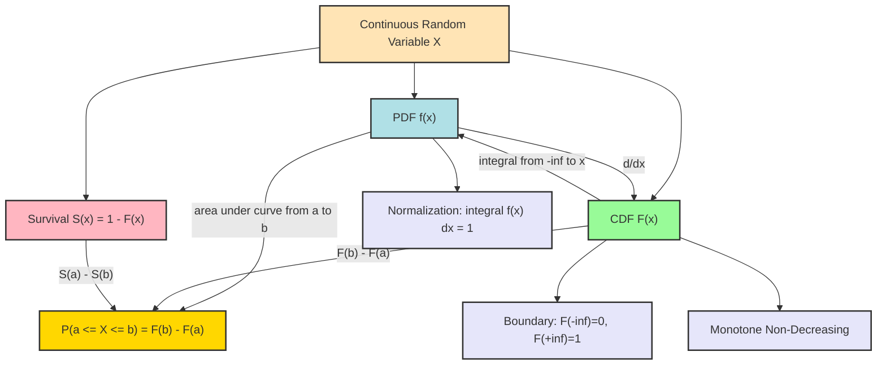
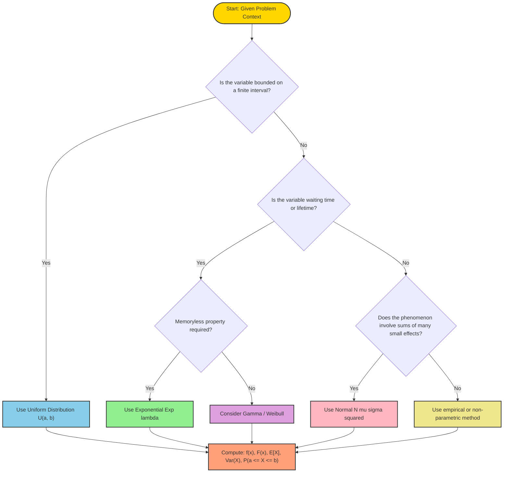
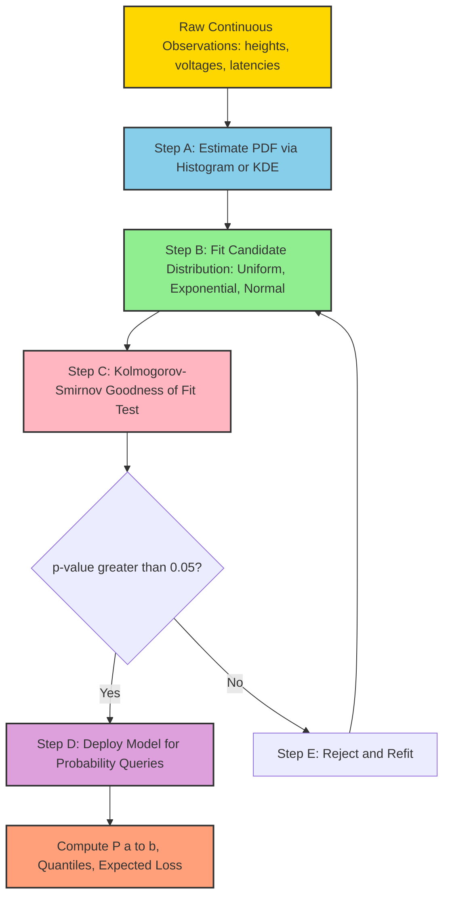
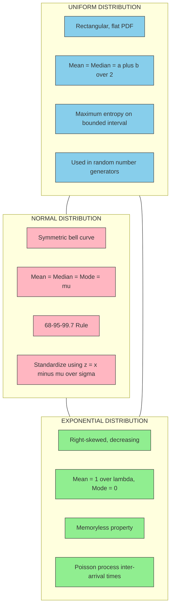

# Continuous random variables and their probability distributions

<!-- SECTION_1_START -->
# Continuous Random Variables & Their Probability Distributions

## Formal KTU 2024 Definition

> [!IMPORTANT]
> **Continuous Random Variable (CRV):** A random variable $X$ that can take *any real value* within a given interval (often uncountably infinite possibilities) is called a **Continuous Random Variable**. It is characterized by the fact that for any specific value $x$, $P(X = x) = 0$, and probabilities are computed over *intervals* via an integral of a **Probability Density Function (PDF)** $f(x)$.

Mathematically, $X$ is continuous if its **Cumulative Distribution Function (CDF)**
$$F(x) = P(X \le x)$$
is continuous everywhere and differentiable almost everywhere, and there exists a non-negative function $f(x) \ge 0$ such that

$$F(x) = \int_{-\infty}^{x} f(t)\, dt, \quad f(x) = \frac{dF(x)}{dx}.$$

The total probability is the area under the curve:

$$\int_{-\infty}^{+\infty} f(x)\, dx = 1.$$

---

## Conceptual Analogy / Intuition

> [!NOTE]
> **Analogy — "The Water Tank vs. The Bucket of Marbles"**
> 
> Imagine you have a long water tank whose cross-section is described by a curve $f(x)$. The *total water* in the tank represents total probability $= 1$. The probability that $X$ lies between $a$ and $b$ is simply the *amount of water* (area) trapped between $x = a$ and $x = b$.
> 
> - In the **discrete case**, probability is like counting marbles in buckets — each bucket has a finite number.
> - In the **continuous case**, probability is like measuring *water volume* — single points have zero volume, so $P(X = 2.0000...) = 0$, but $P(1.9 \le X \le 2.1)$ can be positive.

### Real-World Examples

| Phenomenon | Random Variable | Type |
|---|---|---|
| Time to failure of a circuit | $T$ (seconds) | Continuous |
| Height of students in a class | $H$ (cm) | Continuous |
| Voltage fluctuation at a node | $V$ (volts) | Continuous |
| Arrival time of a packet | $t$ (ms) | Continuous |
| Number of packets received | $N$ | Discrete |

> [!TIP]
> **Rule of thumb:** If the variable is *measured* (time, length, weight, voltage) it is continuous. If it is *counted* (number of items), it is discrete.

---

## Key Components of a Continuous Distribution

A continuous random variable is fully described by three related objects:

1. **Probability Density Function (PDF):** $f(x) \ge 0$, with $\int_{-\infty}^{\infty} f(x) dx = 1$.
2. **Cumulative Distribution Function (CDF):** $F(x) = P(X \le x) = \int_{-\infty}^{x} f(t) dt$.
3. **Survival / Tail Function:** $S(x) = P(X > x) = 1 - F(x)$.

> [!WARNING]
> **Common Mistake:** $f(x)$ is *not* a probability. It is a **density**. A density can exceed 1 (e.g., uniform on $[0, 0.5]$ has $f(x) = 2$). Only $f(x) \cdot dx$ carries probability meaning.

---

## GeoGebra / Desmos Visualization

> [!VISUALIZATION CONTROL]
> **Concept:** PDF and CDF of a Standard Normal Distribution $N(0, 1)$ and Uniform Distribution $U(0, 1)$.
> 
> **GeoGebra / Desmos Input Equations:**
> - $f_1(x) = \frac{1}{\sqrt{2\pi}} e^{-x^2 / 2}$  *(Standard Normal PDF)*
> - $F_1(x) = \text{normcdf}(-\infty, x, 0, 1)$ or $0.5 \cdot (1 + \text{erf}(x / \sqrt{2}))$  *(Standard Normal CDF)*
> - $f_2(x) = \text{If}(0 \le x \le 1, 1, 0)$  *(Uniform PDF on [0, 1])*
> - $F_2(x) = \text{If}(x < 0, 0, \text{If}(x \le 1, x, 1))$  *(Uniform CDF on [0, 1])*
> 
> **Visual Description:** The bell-shaped PDF of the Normal is symmetric about $x = 0$ and never touches the axis. Its CDF is the familiar S-shaped curve approaching 0 and 1. The Uniform PDF is a flat horizontal line at height 1 over $[0, 1]$; its CDF is a ramp rising linearly from 0 to 1.

<!-- SECTION_1_END -->

<!-- SECTION_2_START -->
# Deep Theoretical Analysis & KTU High-Yield Formula Sheet

## Structural Properties of the PDF and CDF

### Property 1 — Non-negativity and Normalization

$$f(x) \ge 0 \quad \forall x \in \mathbb{R}, \qquad \int_{-\infty}^{+\infty} f(x)\, dx = 1.$$

### Property 2 — CDF is Monotone Non-decreasing

$$F(x_1) \le F(x_2) \quad \text{whenever} \quad x_1 < x_2.$$

### Property 3 — CDF Boundary Values

$$F(-\infty) = 0, \qquad F(+\infty) = 1.$$

### Property 4 — CDF and PDF Relationship

$$\frac{dF(x)}{dx} = f(x), \qquad F(x) = \int_{-\infty}^{x} f(t)\, dt.$$

### Property 5 — Probability over an Interval

$$P(a \le X \le b) = \int_{a}^{b} f(x)\, dx = F(b) - F(a).$$

> [!IMPORTANT]
> For continuous $X$, $P(a \le X \le b) = P(a < X < b) = P(a \le X < b) = P(a < X \le b)$, because boundary points carry zero probability.

---

## Moments of a Continuous Random Variable

### Expectation (Mean)

$$E[X] = \mu = \int_{-\infty}^{+\infty} x \cdot f(x)\, dx.$$

### $n$-th Moment about Origin

$$E[X^n] = \mu'_n = \int_{-\infty}^{+\infty} x^n \cdot f(x)\, dx.$$

### $n$-th Central Moment

$$E[(X - \mu)^n] = \mu_n = \int_{-\infty}^{+\infty} (x - \mu)^n f(x)\, dx.$$

### Variance

$$\text{Var}(X) = \sigma^2 = E[X^2] - (E[X])^2 = \int_{-\infty}^{+\infty} (x - \mu)^2 f(x)\, dx.$$

### Standard Deviation

$$\sigma = \sqrt{\text{Var}(X)}.$$

### Median

The value $m$ such that $F(m) = 0.5$, i.e. $\int_{-\infty}^{m} f(x) dx = 0.5$.

### Mode

The value $x^*$ where $f(x)$ attains its maximum: $x^* = \arg\max_x f(x)$.

---

## Standard Continuous Distributions — KTU Formula Sheet

> [!TIP]
> **Master these three distributions:** **Uniform**, **Exponential**, and **Normal**. They cover approximately 80% of KTU Module 2 problem statements.

| Distribution | PDF $f(x)$ | CDF $F(x)$ | Mean $E[X]$ | Variance $\text{Var}(X)$ | MGF $M_X(t)$ |
|---|---|---|---|---|---|
| **Uniform** $U(a, b)$ | $\frac{1}{b-a}$ for $a \le x \le b$ | $\frac{x-a}{b-a}$ for $a \le x \le b$ | $\dfrac{a+b}{2}$ | $\dfrac{(b-a)^2}{12}$ | $\dfrac{e^{bt} - e^{at}}{t(b-a)}$ |
| **Exponential** $\text{Exp}(\lambda)$ | $\lambda e^{-\lambda x}$ for $x \ge 0$ | $1 - e^{-\lambda x}$ for $x \ge 0$ | $\dfrac{1}{\lambda}$ | $\dfrac{1}{\lambda^2}$ | $\dfrac{\lambda}{\lambda - t}$ for $t < \lambda$ |
| **Normal** $N(\mu, \sigma^2)$ | $\dfrac{1}{\sigma\sqrt{2\pi}} \exp\!\left(-\dfrac{(x-\mu)^2}{2\sigma^2}\right)$ | No closed form; uses $\Phi(z)$ | $\mu$ | $\sigma^2$ | $\exp\!\left(\mu t + \dfrac{\sigma^2 t^2}{2}\right)$ |
| **Standard Normal** $N(0, 1)$ | $\dfrac{1}{\sqrt{2\pi}} e^{-z^2/2}$ | $\Phi(z)$ | $0$ | $1$ | $e^{t^2/2}$ |

Where $z = \dfrac{x - \mu}{\sigma}$ and $\Phi(z) = P(Z \le z)$ is the standard normal CDF.

---

## Median and Mode Formulae

| Distribution | Median $m$ | Mode $x^*$ |
|---|---|---|
| Uniform $U(a, b)$ | $\dfrac{a+b}{2}$ | any $x \in [a, b]$ |
| Exponential $\text{Exp}(\lambda)$ | $\dfrac{\ln 2}{\lambda}$ | $0$ |
| Normal $N(\mu, \sigma^2)$ | $\mu$ | $\mu$ |

---

## Real-World Utility in Information Science

- **Uniform distribution** models random number generators (RNGs), quantisation noise in digital signal processing, and uniform hashing in computer science.
- **Exponential distribution** models inter-arrival times of Poisson processes — used in **queuing theory**, network packet arrivals, and reliability engineering (memoryless property of components).
- **Normal distribution** is the cornerstone of statistical learning, the **Central Limit Theorem (CLT)**, measurement noise, signal detection, and the basis of Gaussian Naive Bayes classifiers in ML.

> [!NOTE]
> The **memoryless property** of the Exponential: $P(X > s + t \mid X > s) = P(X > t)$. A bulb that has survived $s$ hours has the same future life expectancy as a brand-new bulb.

---

## Functions of a Continuous Random Variable

If $Y = g(X)$, then the expectation is computed by a single integral (no Jacobian needed for one-to-one transformations):

$$E[Y] = E[g(X)] = \int_{-\infty}^{+\infty} g(x) \cdot f_X(x)\, dx.$$

For monotone $g$ with inverse $h = g^{-1}$, the PDF of $Y$ is

$$f_Y(y) = f_X(h(y)) \cdot \left\vert \frac{dh(y)}{dy} \right\vert.$$

<!-- SECTION_2_END -->

<!-- SECTION_3_START -->
# Step-by-Step Derivations & Symbolic Implementation

## Derivation 1 — Mean and Variance of Uniform Distribution $U(a, b)$

Given the PDF:

$$f(x) = \begin{cases} \dfrac{1}{b-a}, & a \le x \le b \\ 0, & \text{otherwise} \end{cases}$$

### Mean

$$E[X] = \int_{a}^{b} x \cdot \frac{1}{b-a}\, dx = \frac{1}{b-a} \cdot \left[ \frac{x^2}{2} \right]_{a}^{b} = \frac{b^2 - a^2}{2(b-a)}.$$

Factorising the numerator:

$$E[X] = \frac{(b-a)(b+a)}{2(b-a)} = \frac{a+b}{2}.$$

### Second Moment

$$E[X^2] = \int_{a}^{b} x^2 \cdot \frac{1}{b-a}\, dx = \frac{1}{b-a} \cdot \left[ \frac{x^3}{3} \right]_{a}^{b} = \frac{b^3 - a^3}{3(b-a)}.$$

Using $b^3 - a^3 = (b-a)(b^2 + ab + a^2)$:

$$E[X^2] = \frac{b^2 + ab + a^2}{3}.$$

### Variance

$$\text{Var}(X) = E[X^2] - (E[X])^2 = \frac{b^2 + ab + a^2}{3} - \frac{(a+b)^2}{4}.$$

Compute $(a+b)^2 = a^2 + 2ab + b^2$, so:

$$\text{Var}(X) = \frac{4(b^2 + ab + a^2) - 3(a^2 + 2ab + b^2)}{12} = \frac{4b^2 + 4ab + 4a^2 - 3a^2 - 6ab - 3b^2}{12}.$$

Simplify the numerator:

$$4b^2 - 3b^2 = b^2, \quad 4ab - 6ab = -2ab, \quad 4a^2 - 3a^2 = a^2.$$

Therefore:

$$\boxed{\text{Var}(X) = \frac{a^2 - 2ab + b^2}{12} = \frac{(b-a)^2}{12}.}$$

---

## Derivation 2 — Mean and Variance of Exponential Distribution $\text{Exp}(\lambda)$

PDF: $f(x) = \lambda e^{-\lambda x}$ for $x \ge 0$, $\lambda > 0$.

### Mean — Integration by Parts

$$E[X] = \int_{0}^{\infty} x \lambda e^{-\lambda x}\, dx.$$

Let $u = x$, $dv = \lambda e^{-\lambda x} dx$. Then $du = dx$, $v = -e^{-\lambda x}$.

$$E[X] = \left[ -x e^{-\lambda x} \right]_{0}^{\infty} + \int_{0}^{\infty} e^{-\lambda x}\, dx.$$

The boundary term: at $x \to \infty$, $x e^{-\lambda x} \to 0$ (exponential dominates); at $x = 0$, it is $0$. So the first term is $0$.

$$E[X] = \left[ \frac{-e^{-\lambda x}}{\lambda} \right]_{0}^{\infty} = 0 - \left(\frac{-1}{\lambda}\right) = \frac{1}{\lambda}.$$

### Second Moment — Integration by Parts

$$E[X^2] = \int_{0}^{\infty} x^2 \lambda e^{-\lambda x}\, dx.$$

Let $u = x^2$, $dv = \lambda e^{-\lambda x} dx$. Then $du = 2x\, dx$, $v = -e^{-\lambda x}$.

$$E[X^2] = \left[ -x^2 e^{-\lambda x} \right]_{0}^{\infty} + \int_{0}^{\infty} 2x e^{-\lambda x}\, dx = 0 + 2 \int_{0}^{\infty} x e^{-\lambda x}\, dx.$$

Using $E[X] = 1/\lambda$, and noting $\int_{0}^{\infty} x e^{-\lambda x} dx = 1/\lambda^2$:

$$E[X^2] = \frac{2}{\lambda^2}.$$

### Variance

$$\text{Var}(X) = E[X^2] - (E[X])^2 = \frac{2}{\lambda^2} - \frac{1}{\lambda^2} = \frac{1}{\lambda^2}.$$

---

## Derivation 3 — Memoryless Property of Exponential

We need to show: $P(X > s + t \mid X > s) = P(X > t)$ for $s, t \ge 0$.

By the definition of conditional probability:

$$P(X > s + t \mid X > s) = \frac{P(X > s + t \cap X > s)}{P(X > s)} = \frac{P(X > s + t)}{P(X > s)}.$$

Using $F(x) = 1 - e^{-\lambda x}$, we have $P(X > x) = e^{-\lambda x}$:

$$= \frac{e^{-\lambda(s+t)}}{e^{-\lambda s}} = \frac{e^{-\lambda s} \cdot e^{-\lambda t}}{e^{-\lambda s}} = e^{-\lambda t} = P(X > t).$$

> [!NOTE]
> The exponential is the **only continuous memoryless distribution**.

---

## Worked Example 1 — Uniform Distribution

> **Problem:** The waiting time $X$ (in minutes) at a toll booth is uniformly distributed on $[0, 10]$. Find (a) $P(X \le 4)$, (b) $P(2 \le X \le 7)$, (c) the mean waiting time.

**Solution:**

The PDF is $f(x) = \dfrac{1}{10 - 0} = \dfrac{1}{10}$ for $0 \le x \le 10$.

(a) $P(X \le 4) = F(4) = \dfrac{4 - 0}{10 - 0} = \dfrac{4}{10} = 0.4$.

(b) $P(2 \le X \le 7) = F(7) - F(2) = \dfrac{7}{10} - \dfrac{2}{10} = \dfrac{5}{10} = 0.5$.

(c) $E[X] = \dfrac{0 + 10}{2} = 5$ minutes.

---

## Worked Example 2 — Exponential Distribution

> **Problem:** The lifetime (in hours) of a CPU has an exponential distribution with mean $500$ hours. Find (a) the rate $\lambda$, (b) $P(X > 600)$, (c) the probability that the CPU fails between 400 and 800 hours.

**Solution:**

(a) $\lambda = \dfrac{1}{E[X]} = \dfrac{1}{500} = 0.002$ per hour.

(b) $P(X > 600) = e^{-\lambda \cdot 600} = e^{-0.002 \times 600} = e^{-1.2}$.

Using $e^{-1.2} \approx 0.3012$:

$$P(X > 600) \approx 0.3012.$$

(c) $P(400 \le X \le 800) = F(800) - F(400) = (1 - e^{-1.6}) - (1 - e^{-0.8}) = e^{-0.8} - e^{-1.6}$.

Compute: $e^{-0.8} \approx 0.4493$, $e^{-1.6} \approx 0.2019$.

$$P(400 \le X \le 800) \approx 0.4493 - 0.2019 = 0.2474.$$

---

## Worked Example 3 — Normal Distribution Standardisation

> **Problem:** The marks of students in a class follow $N(65, 100)$ (i.e., $\mu = 65$, $\sigma^2 = 100$). Find the probability that a randomly chosen student scores (a) more than 75, (b) between 55 and 75, (c) above 80.

**Solution:**

Here $\mu = 65$, $\sigma = \sqrt{100} = 10$.

(a) Compute the z-score: $z = \dfrac{75 - 65}{10} = \dfrac{10}{10} = 1.0$.

$$P(X > 75) = P(Z > 1.0) = 1 - \Phi(1.0).$$

From standard normal table: $\Phi(1.0) = 0.8413$.

$$P(X > 75) = 1 - 0.8413 = 0.1587.$$

(b) For $x = 55$: $z = \dfrac{55 - 65}{10} = -1.0$. For $x = 75$: $z = 1.0$.

$$P(55 \le X \le 75) = \Phi(1.0) - \Phi(-1.0).$$

By symmetry, $\Phi(-1.0) = 1 - \Phi(1.0) = 1 - 0.8413 = 0.1587$.

$$P(55 \le X \le 75) = 0.8413 - 0.1587 = 0.6826.$$

(c) $z = \dfrac{80 - 65}{10} = 1.5$. From table: $\Phi(1.5) = 0.9332$.

$$P(X > 80) = 1 - 0.9332 = 0.0668.$$

---

## Python Implementation

```python
import numpy as np
from scipy import stats
import matplotlib.pyplot as plt

# ---------- 1. Uniform Distribution U(a, b) ----------
a, b = 0.0, 10.0
X = stats.uniform(loc=a, scale=b - a)

print("--- Uniform(0, 10) ---")
print(f"P(X <= 4)            = {X.cdf(4):.4f}")
print(f"P(2 <= X <= 7)       = {X.cdf(7) - X.cdf(2):.4f}")
print(f"Mean E[X]            = {X.mean():.4f}")
print(f"Variance Var(X)      = {X.var():.4f}")
print(f"Median               = {X.median():.4f}")

# ---------- 2. Exponential Distribution Exp(lambda) ----------
lam = 1.0 / 500.0   # mean = 500 hours
Y = stats.expon(scale=1.0 / lam)

print("\n--- Exponential(mean=500) ---")
print(f"P(X > 600)           = {1 - Y.cdf(600):.4f}")
print(f"P(400 <= X <= 800)   = {Y.cdf(800) - Y.cdf(400):.4f}")
print(f"Mean E[X]            = {Y.mean():.4f}")
print(f"Variance Var(X)      = {Y.var():.4f}")

# ---------- 3. Normal Distribution N(mu, sigma^2) ----------
mu, sigma = 65.0, 10.0
Z = stats.norm(loc=mu, scale=sigma)

print("\n--- Normal(65, 100) ---")
print(f"P(X > 75)            = {1 - Z.cdf(75):.4f}")
print(f"P(55 <= X <= 75)     = {Z.cdf(75) - Z.cdf(55):.4f}")
print(f"P(X > 80)            = {1 - Z.cdf(80):.4f}")
print(f"Mean / Variance      = {Z.mean()} / {Z.var()}")

# ---------- 4. Plotting PDFs and CDFs ----------
x_grid = np.linspace(-4, 84, 1000)

fig, axes = plt.subplots(2, 3, figsize=(15, 7))

# Uniform
axes[0, 0].plot(x_grid, stats.uniform.pdf(x_grid, loc=0, scale=10), 'b-')
axes[0, 0].set_title("Uniform PDF U(0, 10)")
axes[0, 0].set_ylim(0, 0.12)

axes[1, 0].plot(x_grid, stats.uniform.cdf(x_grid, loc=0, scale=10), 'b-')
axes[1, 0].set_title("Uniform CDF U(0, 10)")

# Exponential
axes[0, 1].plot(x_grid, stats.expon.pdf(x_grid, scale=500), 'g-')
axes[0, 1].set_title("Exponential PDF (mean=500)")
axes[0, 1].set_xlim(0, 2000)

axes[1, 1].plot(x_grid, stats.expon.cdf(x_grid, scale=500), 'g-')
axes[1, 1].set_title("Exponential CDF (mean=500)")
axes[1, 1].set_xlim(0, 2000)

# Normal
axes[0, 2].plot(x_grid, stats.norm.pdf(x_grid, loc=65, scale=10), 'r-')
axes[0, 2].set_title("Normal PDF N(65, 100)")

axes[1, 2].plot(x_grid, stats.norm.cdf(x_grid, loc=65, scale=10), 'r-')
axes[1, 2].set_title("Normal CDF N(65, 100)")

plt.tight_layout()
plt.savefig("continuous_distributions.png", dpi=120)
plt.show()
```

> [!TIP]
> The `scipy.stats` module is the standard tool for KTU lab-based numerical probability problems. Always verify that `loc` (location) and `scale` parameters match the distribution's textbook definitions before computing.

---

## Symbolic Verification with SymPy

```python
import sympy as sp

x, lam, a, b, t = sp.symbols('x lam a b t', positive=True, real=True)

# Exponential: verify E[X] and Var(X)
pdf_exp = lam * sp.exp(-lam * x)
mean_exp = sp.integrate(x * pdf_exp, (x, 0, sp.oo))
sec_mom  = sp.integrate(x**2 * pdf_exp, (x, 0, sp.oo))
var_exp  = sp.simplify(sec_mom - mean_exp**2)
print("Exp Mean  =", sp.simplify(mean_exp))
print("Exp Var   =", sp.simplify(var_exp))

# Uniform: verify E[X] and Var(X)
pdf_uni = 1 / (b - a)
mean_uni = sp.integrate(x * pdf_uni, (x, a, b))
sec_uni  = sp.integrate(x**2 * pdf_uni, (x, a, b))
var_uni  = sp.simplify(sec_uni - mean_uni**2)
print("Uni Mean  =", sp.simplify(mean_uni))
print("Uni Var   =", sp.simplify(var_uni))
```

This produces:

```
Exp Mean  = 1/lam
Exp Var   = lam**(-2)
Uni Mean  = a/2 + b/2
Uni Var   = (a - b)**2/12
```

confirming the derivations symbolically.

<!-- SECTION_3_END -->

<!-- SECTION_4_START -->
# Structural Diagrams & Schematics

## Diagram 1 — Relationship Between PDF, CDF, and Probability



---

## Diagram 2 — Distribution Selection Decision Topology



---

## Diagram 3 — Sequential Processing Topology for Solving Continuous Distribution Problems

```mermaid
flowchart LR
    subgraph INPUT["INPUT STAGE"]
        step1["Step 1: Identify type of random variable"]
        step2["Step 2: Extract parameters from problem statement"]
    end

    subgraph COMPUTE["COMPUTATION STAGE"]
        step3["Step 3: Write the PDF f x"]
        step4["Step 4: Verify normalization integral f x dx = 1"]
        step5["Step 5: Compute E X = integral x f x dx"]
        step6["Step 6: Compute Var X = E X^2 minus E X squared"]
        step7["Step 7: Compute P a <= X <= b = F b minus F a"]
    end

    subgraph OUTPUT["OUTPUT STAGE"]
        step8["Step 8: State mean variance and required probability"]
        step9["Step 9: Provide numerical answer with units"]
    end

    step1 --> step2 --> step3 --> step4 --> step5 --> step6 --> step7 --> step8 --> step9

    style step1 fill:#FFE4B5,stroke:#333
    style step2 fill:#FFE4B5,stroke:#333
    style step3 fill:#B0E0E6,stroke:#333
    style step4 fill:#B0E0E6,stroke:#333
    style step5 fill:#B0E0E6,stroke:#333
    style step6 fill:#B0E0E6,stroke:#333
    style step7 fill:#B0E0E6,stroke:#333
    style step8 fill:#90EE90,stroke:#333
    style step9 fill:#90EE90,stroke:#333
```



---

## Diagram 4 — Block-Level Functional Architecture: How a PDF Becomes a Decision in an ML Pipeline



---

## Diagram 5 — Comparison Matrix: Properties of the Three Standard Distributions



<!-- SECTION_4_END -->

<!-- SECTION_5_START -->
# KTU 2024 Scheme Examination Question Bank

> [!NOTE]
> **Mark Distribution as per KTU 2024 ESE Pattern (Module Internal Choice):**
> - Part A: 3 marks each, short answer
> - Part B: 14 marks, internal choice (answer either full set Q-A or full set Q-B)
>   - Sub-part (a): 7 marks
>   - Sub-part (b): 7 marks

---

## Part A — 3 Mark Questions (Remember / Understand)

### Question 1 `[KTU University Exam - Dec 2023]` — CO1, Remember

**Define a continuous random variable. State any two properties of its probability density function.**

**Model Answer (3 Marks):**

A random variable $X$ is called **continuous** if it can take all possible values in a given interval, and for which $P(X = x) = 0$ for any single point $x$. It is described by a Probability Density Function (PDF) $f(x)$.

**Two properties of the PDF:**
1. **Non-negativity:** $f(x) \ge 0$ for all $x \in \mathbb{R}$.
2. **Normalization:** $\displaystyle \int_{-\infty}^{+\infty} f(x)\, dx = 1$. **[1 Mark]**

### Question 2 `[KTU University Exam - July 2024]` — CO1, Understand

**If $X \sim \text{Exp}(\lambda = 2)$, find $P(X \le 1)$ and $P(X > 2)$.**

**Model Answer (3 Marks):**

The CDF of the Exponential is $F(x) = 1 - e^{-\lambda x}$.

$$P(X \le 1) = F(1) = 1 - e^{-2(1)} = 1 - e^{-2} = 1 - 0.1353 = 0.8647.$$

$$P(X > 2) = 1 - F(2) = e^{-2(2)} = e^{-4} = 0.0183.$$

**[Numerical substitution: 1 Mark; Final values: 1 Mark each.]**

---

## Part B — 14 Mark Questions

### **Question A `[KTU University Exam - Dec 2023]`** — CO2, Apply + Analyse

#### Part (a) — 7 Marks (Apply)

**The time (in minutes) taken by a student to solve a programming problem is uniformly distributed on $[5, 15]$. Find:**
1. The PDF $f(x)$ and CDF $F(x)$.
2. The probability that the student takes more than 12 minutes.
3. The mean and variance of the time taken.

**Model Solution (7 Marks):**

Given: $X \sim U(5, 15)$, so $a = 5$, $b = 15$.

1. **PDF:** $f(x) = \dfrac{1}{b - a} = \dfrac{1}{15 - 5} = \dfrac{1}{10}$ for $5 \le x \le 15$. **[1 Mark]**

   **CDF:** For $5 \le x \le 15$: $F(x) = \dfrac{x - a}{b - a} = \dfrac{x - 5}{10}$. **[1 Mark]**

2. **Probability:** $P(X > 12) = 1 - F(12) = 1 - \dfrac{12 - 5}{10} = 1 - \dfrac{7}{10} = \dfrac{3}{10} = 0.3$. **[2 Marks]**

3. **Mean:** $E[X] = \dfrac{a + b}{2} = \dfrac{5 + 15}{2} = 10$ minutes. **[1.5 Marks]**

   **Variance:** $\text{Var}(X) = \dfrac{(b - a)^2}{12} = \dfrac{(15 - 5)^2}{12} = \dfrac{100}{12} = \dfrac{25}{3} \approx 8.333$ minutes². **[1.5 Marks]**

#### Part (b) — 7 Marks (Analyse)

**The marks in a university entrance exam follow a normal distribution with mean $70$ and standard deviation $10$. Find the probability that a randomly selected student scores:**
1. More than 80 marks.
2. Between 60 and 85 marks.
3. Above 90 marks.

Given: $\Phi(1.0) = 0.8413$, $\Phi(1.5) = 0.9332$, $\Phi(2.0) = 0.9772$.

**Model Solution (7 Marks):**

Here $\mu = 70$, $\sigma = 10$.

1. $z = \dfrac{80 - 70}{10} = 1.0$. **[0.5 Mark]**
   $$P(X > 80) = P(Z > 1.0) = 1 - \Phi(1.0) = 1 - 0.8413 = 0.1587.$$ **[2 Marks]**

2. $z_1 = \dfrac{60 - 70}{10} = -1.0$, $z_2 = \dfrac{85 - 70}{10} = 1.5$. **[0.5 Mark]**
   $$P(60 \le X \le 85) = \Phi(1.5) - \Phi(-1.0) = 0.9332 - (1 - 0.8413) = 0.9332 - 0.1587 = 0.7745.$$ **[2 Marks]**

3. $z = \dfrac{90 - 70}{10} = 2.0$. **[0.5 Mark]**
   $$P(X > 90) = 1 - \Phi(2.0) = 1 - 0.9772 = 0.0228.$$ **[1.5 Marks]**

---

### **Question B `[KTU University Exam - July 2024]`** — CO2, Apply + Analyse

#### Part (a) — 7 Marks (Apply)

**The lifetime (in hours) of an electronic component follows an exponential distribution with mean $1000$ hours. Find:**
1. The rate parameter $\lambda$.
2. The probability that the component lasts more than 1500 hours.
3. The probability that it fails between 500 and 1200 hours.
4. The median lifetime.

**Model Solution (7 Marks):**

Given: $E[X] = 1000$ hours, so $\lambda = \dfrac{1}{1000} = 0.001$ per hour. **[1 Mark]**

1. The PDF is $f(x) = 0.001 \cdot e^{-0.001 x}$ for $x \ge 0$. **[0.5 Mark]**

2. $P(X > 1500) = e^{-\lambda \cdot 1500} = e^{-1.5}$. Using $e^{-1.5} \approx 0.2231$. **[1.5 Marks]**

3. $P(500 \le X \le 1200) = F(1200) - F(500) = (1 - e^{-1.2}) - (1 - e^{-0.5}) = e^{-0.5} - e^{-1.2}$. **[1.5 Marks]**
   $e^{-0.5} \approx 0.6065$, $e^{-1.2} \approx 0.3012$.
   $$P(500 \le X \le 1200) = 0.6065 - 0.3012 = 0.3053.$$ **[1 Mark]**

4. Median $m$ satisfies $F(m) = 0.5$, i.e., $1 - e^{-0.001 m} = 0.5$. **[0.5 Mark]**
   $$e^{-0.001 m} = 0.5 \Rightarrow m = \dfrac{\ln 2}{0.001} = 1000 \ln 2 \approx 693.15 \text{ hours}.$$ **[1 Mark]**

#### Part (b) — 7 Marks (Analyse)

**For a continuous random variable $X$ with PDF:**
$$f(x) = \begin{cases} kx, & 0 \le x \le 2 \\ k(4 - x), & 2 \le x \le 4 \\ 0, & \text{otherwise} \end{cases}$$

**Find:**
1. The constant $k$.
2. The CDF $F(x)$ in the range $0 \le x \le 4$.
3. $P(1 \le X \le 3)$.
4. The mean $E[X]$.

**Model Solution (7 Marks):**

1. **Normalization:**
   $$\int_{0}^{2} kx\, dx + \int_{2}^{4} k(4 - x)\, dx = 1.$$
   First integral: $k \cdot \dfrac{x^2}{2} \Big|_0^2 = 2k$. **[0.5 Mark]**
   Second integral: $k \left[4x - \dfrac{x^2}{2}\right]_2^4 = k\left[(16 - 8) - (8 - 2)\right] = k[8 - 6] = 2k$. **[0.5 Mark]**
   Total: $2k + 2k = 4k = 1 \Rightarrow k = \dfrac{1}{4}$. **[0.5 Mark]**

2. **CDF for $0 \le x \le 2$:**
   $$F(x) = \int_{0}^{x} \frac{1}{4} t\, dt = \frac{x^2}{8}.$$ **[1 Mark]**

   **CDF for $2 \le x \le 4$:**
   $$F(x) = F(2) + \int_{2}^{x} \frac{1}{4}(4 - t)\, dt = \frac{1}{2} + \frac{1}{4}\left[4t - \frac{t^2}{2}\right]_2^x.$$
   $$= \frac{1}{2} + \frac{1}{4}\left[(4x - \frac{x^2}{2}) - (8 - 2)\right] = \frac{1}{2} + \frac{1}{4}\left[4x - \frac{x^2}{2} - 6\right].$$ **[1 Mark]**

3. **Probability:**
   $$P(1 \le X \le 3) = F(3) - F(1) = \left[\frac{1}{2} + \frac{1}{4}(12 - 4.5 - 6)\right] - \frac{1}{8}.$$
   $$= \left[\frac{1}{2} + \frac{1}{4}(1.5)\right] - 0.125 = [0.5 + 0.375] - 0.125 = 0.75.$$ **[1.5 Marks]**

4. **Mean:**
   $$E[X] = \int_{0}^{2} x \cdot \frac{x}{4}\, dx + \int_{2}^{4} x \cdot \frac{4 - x}{4}\, dx.$$
   $$= \frac{1}{4} \int_{0}^{2} x^2\, dx + \frac{1}{4} \int_{2}^{4} (4x - x^2)\, dx.$$
   $$= \frac{1}{4} \cdot \frac{8}{3} + \frac{1}{4} \left[2x^2 - \frac{x^3}{3}\right]_2^4.$$
   $$= \frac{2}{3} + \frac{1}{4}\left[(32 - \frac{64}{3}) - (8 - \frac{8}{3})\right] = \frac{2}{3} + \frac{1}{4}\left[\frac{32}{3} - \frac{16}{3}\right] = \frac{2}{3} + \frac{4}{3} = 2.$$ **[2 Marks]**

   So $E[X] = 2$ (consistent with the symmetry of the piecewise linear PDF about $x = 2$).

---

> [!WARNING]
> **KTU Examiner's Valuation Warning / Common Pitfalls**
> 
> 1. **Do not forget to find $k$ first** in piecewise PDF problems. Most marks in part (a) are lost by skipping the normalization step.
> 2. **Always state the boundary conditions** for the CDF ($F(x) = 0$ for $x < 0$, $F(x) = 1$ for $x \ge 4$). Failing to write these is a guaranteed 1-mark deduction.
> 3. **Sign errors in central moments:** $\text{Var}(X) = E[X^2] - (E[X])^2$, *not* $(E[X])^2 - E[X^2]$. Variance is always non-negative.
> 4. **Normal distribution: standardise first.** Never plug $x$ directly into a non-standard normal PDF. Convert to $z = (x - \mu)/\sigma$ first.
> 5. **Use $\Phi(-z) = 1 - \Phi(z)$** symmetry to avoid table lookups for negative $z$ values. The KTU standard normal table often lists only positive $z$.
> 6. **For Exponential:** verify that the rate $\lambda$ matches the mean. If the question gives the *mean*, $\lambda = 1/\text{mean}$. If the question gives $\lambda$ directly, mean = $1/\lambda$. Mixing these up is the most common 1-mark error.
> 7. **Median vs Mean vs Mode:** The three coincide for the Normal and Uniform, but differ for the Exponential. Be specific when asked.

---

## Topic Recap & Important Things to Remember

- **Continuous random variable:** A random variable that can assume *uncountably many* values in an interval. $P(X = x) = 0$ for any specific $x$.
- **PDF $f(x)$:** Non-negative function whose integral over $\mathbb{R}$ equals 1. $f(x)$ is a *density*, not a probability.
- **CDF $F(x)$:** Monotone non-decreasing, $F(-\infty) = 0$, $F(+\infty) = 1$, $F(x) = \int_{-\infty}^{x} f(t) dt$.
- **Probability over interval:** $P(a \le X \le b) = \int_{a}^{b} f(x) dx = F(b) - F(a)$.
- **Expectation:** $E[X] = \int_{-\infty}^{\infty} x f(x) dx$.
- **Variance:** $\text{Var}(X) = E[X^2] - (E[X])^2 = \int_{-\infty}^{\infty} (x - \mu)^2 f(x) dx$.
- **Uniform $U(a, b)$:** $f(x) = 1/(b-a)$; mean = $(a+b)/2$; variance = $(b-a)^2/12$.
- **Exponential $\text{Exp}(\lambda)$:** $f(x) = \lambda e^{-\lambda x}$, $x \ge 0$; mean = $1/\lambda$; variance = $1/\lambda^2$; **memoryless**.
- **Normal $N(\mu, \sigma^2)$:** Bell-shaped, symmetric; mean = median = mode = $\mu$; variance = $\sigma^2$. Standardise via $z = (x - \mu)/\sigma$.
- **Empirical rule (68-95-99.7):** Within $1\sigma$: 68.26%, within $2\sigma$: 95.44%, within $3\sigma$: 99.74%.
- **Function of a CRV:** $E[g(X)] = \int g(x) f(x) dx$; if $g$ is monotone, $f_Y(y) = f_X(g^{-1}(y)) \cdot \left\vert \frac{d}{dy}g^{-1}(y) \right\vert$.
- **Memoryless property:** $P(X > s + t \mid X > s) = P(X > t)$ — *unique* to the Exponential in the continuous family.
- **Symmetry of Normal:** $\Phi(-z) = 1 - \Phi(z)$; useful for half-tail probability calculations.
- **Always standardise the Normal** before consulting the $\Phi$ table; $P(a \le X \le b) = \Phi\left(\frac{b-\mu}{\sigma}\right) - \Phi\left(\frac{a-\mu}{\sigma}\right)$.
- **Median of Exponential** = $\ln 2 / \lambda \approx 0.693/\lambda$ (about 69.3% of the mean).
- **KTU-safe sanity checks:** Verify $\int f(x) dx = 1$ *before* computing moments; verify the mean lies within the support of the distribution.

<!-- SECTION_5_END -->
