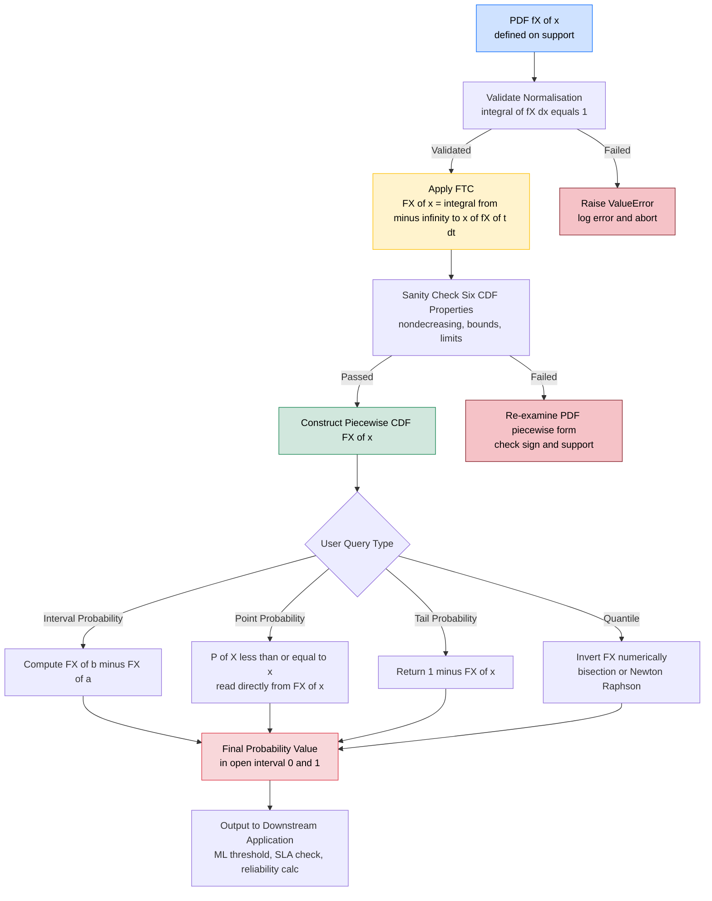
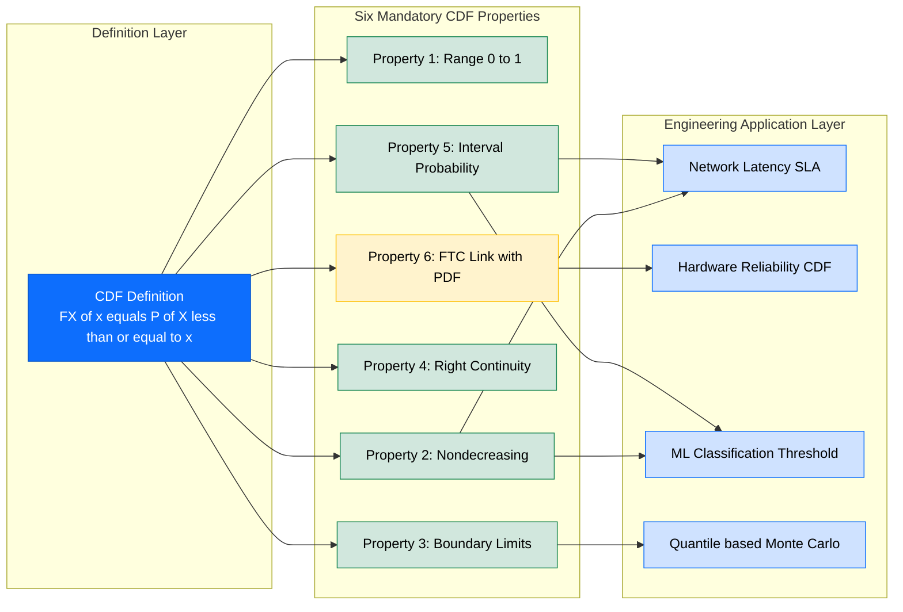

# Cumulative distribution function (CDF)

<!-- SECTION_1_START -->
# 📘 Cumulative Distribution Function (CDF) — Continuous Random Variables

> [!IMPORTANT]
> **KTU 2024 Scheme | GAMAT301 | Module 2 | Continuous Random Variables**
> **Course Outcome Mapped:** CO1 — *Apply the concepts of probability and random variables to model and solve real-world engineering problems using probability distributions.*
> **Cognitive Levels Targeted:** Remember, Understand, Apply, Analyze

---

## 1.1 Formal Definition (KTU 2024 Syllabus Terminology)

Let $X$ be a **continuous random variable** defined on the sample space $S$ with probability density function (PDF) $f_X(x)$. The **Cumulative Distribution Function (CDF)** of $X$, denoted $F_X(x)$, is defined as:

$$
F_X(x) \;=\; P(X \le x) \;=\; \int_{-\infty}^{\,x} f_X(t)\,dt,\qquad x \in \mathbb{R}
$$

where $f_X(t) \ge 0$ and $\displaystyle \int_{-\infty}^{\,\infty} f_X(t)\,dt = 1$.

> [!NOTE]
> **Reading the Symbol:** $F_X(x)$ is read as *"the probability that the random variable $X$ assumes a value less than or equal to $x$"*. The subscript $X$ indicates the random variable, while the argument $x$ is a real-valued threshold along the number line.

---

## 1.2 Conceptual Analogy — The "Water Tank" Intuition 🌊

Imagine a long, horizontal water tank of total length $\mathbf{1\ litre}$ standing on a straight number line. The total "amount of probability mass" inside the tank is always **exactly 1 unit** (because probabilities are normalized).

- The **PDF $f_X(x)$** is the *height* of the water at position $x$ — it tells you how **dense** the probability is *locally* at that exact point.
- The **CDF $F_X(x)$** is the *cumulative volume of water collected from the far-left end* up to position $x$ — it tells you how much **total probability** has been swept from $-\infty$ up to $x$.

So whenever you ask *"how likely is it that $X$ falls at or below $x$?"*, you are essentially asking *"how much water is pooled between $-\infty$ and $x$?"*. The CDF is the running total; the PDF is the rate of filling.

> [!TIP]
> **Geometric Intuition:** $F_X(x)$ is the **area under the curve** of $f_X(t)$ from $-\infty$ up to $x$. Differentiating the area function recovers the original height function — this is the Fundamental Theorem of Calculus in disguise, and is precisely why $f_X(x) = \dfrac{d}{dx}F_X(x)$.

---

## 1.3 Why CDF Matters in Information Science & Engineering

In information science, the CDF is the workhorse of:

- **Signal processing** — modelling *time-to-failure* of hardware components.
- **Network theory** — analysing *packet delay distributions* and *jitter*.
- **Machine learning** — computing *quantiles*, *percentiles*, and *loss thresholds* in probabilistic classifiers.
- **Reliability engineering** — the **Weibull CDF** is the industry standard for predicting component lifetimes.
- **Information theory** — establishing the **entropy functional** $H(X) = -\int f_X(x)\log f_X(x)\,dx$, which requires the density derived from the CDF.

> [!IMPORTANT]
> **A subtle but critical fact:** For a *continuous* random variable, $P(X = x) = 0$ for any single point. The CDF is non-trivial precisely because the *integration* of density over an interval of positive length gives non-zero probability.

---

## 1.4 GeoGebra / Desmos Visualization

> [!VISUALIZATION CONTROL]
> **Concept:** Visualizing a continuous CDF built from a simple triangular PDF, and observing how differentiation recovers the PDF.
>
> **GeoGebra / Desmos Input Equations:**
> * `f(x) = piecewise(0 <= x and x <= 1, 2x, 0)` &nbsp; *(triangular PDF on $[0,1]$)*
> * `F(x) = integral from -∞ to x of f(t) dt` &nbsp; → in Desmos use: `F(x) = ∫_{0}^{x} 2t dt` for $x \in [0,1]$, $F(x)=0$ for $x<0$, $F(x)=1$ for $x>1$.
>
> **Visual Description:**
> * The blue curve `f(x) = 2x` rises linearly from $(0,0)$ to $(1,2)$ and is zero elsewhere.
> * The red curve `F(x) = x^2` is the *antiderivative*, passing through $(0,0)$ and $(1,1)$, flat (slope 0) outside $[0,1]$.
> * At every point inside $(0,1)$, the **slope of the red curve equals the height of the blue curve** — this is the geometric embodiment of $f_X(x) = \dfrac{d}{dx}F_X(x)$.

---

## 1.5 At a Glance — The Big Picture

| Aspect | PDF $f_X(x)$ | CDF $F_X(x)$ |
|---|---|---|
| **Meaning** | Density at point $x$ | Probability $X \le x$ |
| **Range** | $f_X(x) \ge 0$ (can exceed 1) | $0 \le F_X(x) \le 1$ |
| **Shape** | Can be non-monotonic | Always non-decreasing |
| **Integral** | $\int_{-\infty}^{\infty} f_X(x)\,dx = 1$ | $\lim_{x\to\infty} F_X(x) = 1$ |
| **Relation** | $f_X(x) = \dfrac{d}{dx} F_X(x)$ | $F_X(x) = \int_{-\infty}^{x} f_X(t)\,dt$ |

<!-- SECTION_1_END -->

<!-- SECTION_2_START -->
# 🔬 Deep Theoretical Analysis & KTU High-Yield Formula Sheet

## 2.1 The Six Fundamental Properties of a CDF

For any random variable $X$ (continuous or discrete) with CDF $F_X(x)$, the following six properties are **mandatory board knowledge**. Every KTU valuation key allocates marks for stating at least the first four explicitly.

### Property 1 — Non-Negativity & Bounded Range

$$
0 \;\le\; F_X(x) \;\le\; 1,\qquad \forall\,x \in \mathbb{R}
$$

The CDF is a **probability**, so it is bounded between **0** and **1**.

### Property 2 — Monotonic Non-Decreasing

$$
\text{If } x_1 < x_2 \;\;\Longrightarrow\;\; F_X(x_1) \;\le\; F_X(x_2)
$$

As the threshold $x$ moves rightward on the number line, the accumulated probability can only grow or stay flat — never decrease.

### Property 3 — Boundary Behaviour at the Extremes

$$
\lim_{x \to -\infty} F_X(x) \;=\; 0
\qquad\text{and}\qquad
\lim_{x \to +\infty} F_X(x) \;=\; 1
$$

At the far left, no probability has been accumulated. At the far right, **all** probability has been swept up (since $\int_{-\infty}^{\infty} f_X(t)\,dt = 1$).

### Property 4 — Right-Continuity

$$
\lim_{h \to 0^{+}} F_X(x + h) \;=\; F_X(x)
$$

A subtle but essential property inherited from the measure-theoretic foundations of probability. *Always* approach $x$ from the **right** — this is why the CDF includes the endpoint $x$ in $P(X \le x)$.

### Property 5 — Probability over an Interval

For a continuous random variable $X$:

$$
P(a \;\le\; X \;\le\; b) \;=\; F_X(b) \;-\; F_X(a)
$$

More generally, for **any** event described by inequalities, decompose it as a difference (or sum) of CDF values. Example:

$$
P(a < X < b) \;=\; F_X(b) \;-\; F_X(a)
\quad\text{(same as above for continuous $X$)}
$$

### Property 6 — Relationship with the PDF (Fundamental Theorem of Calculus)

$$
F_X(x) \;=\; \int_{-\infty}^{\,x} f_X(t)\,dt
\qquad\Longleftrightarrow\qquad
f_X(x) \;=\; \dfrac{d}{dx}\,F_X(x)
$$

> [!IMPORTANT]
> **Existence caveat:** $F_X(x)$ must be **differentiable** for the right-hand identity to hold. The CDF is always differentiable **almost everywhere** (a.e.), and at points of non-differentiability the PDF can be defined in the distributional (generalized function) sense.

---

## 2.2 Useful Derived Identities

### 2.2.1 Tail Probability (Survival Function)

$$
P(X > x) \;=\; 1 \;-\; F_X(x) \;=\; \int_{x}^{\infty} f_X(t)\,dt
$$

The function $\bar{F}_X(x) = 1 - F_X(x)$ is the **survival function** or **reliability function**, widely used in engineering reliability and queueing theory.

### 2.2.2 Probability Density at a Point

$$
P(X = x) \;=\; F_X(x) \;-\; \lim_{h \to 0^{+}} F_X(x - h) \;=\; 0 \quad \text{(for continuous $X$)}
$$

For a continuous random variable, the probability of hitting *any single point* is exactly **zero**.

### 2.2.3 The $n$-th Raw Moment

$$
\mathbb{E}\!\left[X^{n}\right] \;=\; \int_{-\infty}^{\infty} x^{n}\,f_X(x)\,dx
\;=\; \int_{0}^{\infty} n\,x^{n-1}\,\bigl[1 - F_X(x)\bigr]\,dx \;\; (n \ge 1)
$$

This identity (valid for non-negative $X$) lets you compute moments from the CDF **without** explicitly computing the PDF.

---

## 2.3 📋 KTU Formula Sheet — Quick Revision Table

| # | Identity / Property | Formula | Engineering Use |
|---|---|---|---|
| 1 | CDF definition | $F_X(x) = P(X \le x) = \int_{-\infty}^{x} f_X(t)\,dt$ | Risk, percentile estimation |
| 2 | PDF from CDF | $f_X(x) = \dfrac{d}{dx}F_X(x)$ | Density recovery, ML likelihoods |
| 3 | Interval probability | $P(a \le X \le b) = F_X(b) - F_X(a)$ | Quality control limits |
| 4 | Survival function | $\bar{F}_X(x) = 1 - F_X(x) = P(X > x)$ | Reliability, hazard analysis |
| 5 | Far-left limit | $\displaystyle\lim_{x \to -\infty} F_X(x) = 0$ | Sanity check on distribution |
| 6 | Far-right limit | $\displaystyle\lim_{x \to +\infty} F_X(x) = 1$ | Normalization check |
| 7 | Monotonicity | $x_1 < x_2 \Rightarrow F_X(x_1) \le F_X(x_2)$ | Bounds in optimization |
| 8 | Median (50th percentile) | $F_X(m) = 0.5$ | Robust statistics |
| 9 | $p$-th quantile | $F_X(x_p) = p$ | Tolerance intervals, ML thresholds |
| 10 | Expected value (CDF form) | $\mathbb{E}[X] = \int_{0}^{\infty}\!\bigl[1 - F_X(x)\bigr]\,dx - \int_{0}^{\infty}\!F_X(-x)\,dx$ | Renewal theory |

> [!WARNING]
> **Board Pitfall:** In the KTU valuation key, students frequently lose marks for writing $P(a \le X \le b) = F_X(a) - F_X(b)$ with the **sign reversed**. Always remember: the *larger* threshold gives the *larger* CDF value (because $F$ is non-decreasing), so the *bigger* value comes *first* in the difference.

---

## 2.4 Real-World Engineering Utility

> [!TIP]
> **Information Science Applications of the CDF**

1. **Network Latency Modelling (Information Science):** The empirical CDF of ping times determines $p$-th percentile SLAs (e.g., $P(\text{latency} \le 100\text{ ms}) = 0.95$).
2. **Cryptographic Hash Uniqueness:** When modelling hash collisions, the **birthday-paradox CDF** $F(k) = 1 - e^{-k^2/(2N)}$ is the standard tool.
3. **ML Decision Thresholds:** Classification thresholds (e.g., logistic regression cutoff) are chosen by inverting the CDF: $x_p = F_X^{-1}(p)$.
4. **Image Sensor Noise:** The CDF of photon-counting noise (Poisson-like) drives ISO calibration in cameras.
5. **Queueing Theory (M/M/1):** The CDF of waiting time $W_q$ in a single-server queue is $F_{W_q}(t) = 1 - \rho\,e^{-(\mu - \lambda)t}$ where $\rho = \lambda/\mu$ is the utilization factor.
6. **Hazard Rate in Hardware:** $h(x) = \dfrac{f_X(x)}{1 - F_X(x)} = \dfrac{f_X(x)}{\bar{F}_X(x)}$ — the **failure rate** of a component is the PDF normalised by the survival function.

<!-- SECTION_2_END -->

<!-- SECTION_3_START -->
# ✏️ Step-by-Step Derivations & Code/Symbolic Implementation

## 3.1 Worked Derivation 1 — Building a CDF from a Given PDF

**Problem Setup:** Let the continuous random variable $X$ have the PDF

$$
f_X(x) \;=\; \begin{cases} k\,x^{2}, & 0 \le x \le 2 \\ 0, & \text{otherwise} \end{cases}
$$

**Step 1 — Find the normalising constant $k$.**

Apply the total-probability axiom $\int_{-\infty}^{\infty} f_X(x)\,dx = 1$:

$$
\begin{aligned}
\int_{0}^{2} k\,x^{2}\,dx \;=\; k \left[\frac{x^{3}}{3}\right]_{0}^{2} \;=\; k \cdot \frac{8}{3} \;=\; 1
\end{aligned}
$$

Solving: $k = \dfrac{3}{8}$.

$$
\therefore\;\; f_X(x) \;=\; \begin{cases} \dfrac{3}{8}\,x^{2}, & 0 \le x \le 2 \\ 0, & \text{otherwise} \end{cases}
$$

> **[Valuation Key — 1 Mark]** Correct setup of the normalisation integral.

**Step 2 — Construct the CDF $F_X(x)$ for all $x \in \mathbb{R}$.**

Apply the definition $F_X(x) = \int_{-\infty}^{x} f_X(t)\,dt$ over three regimes:

**Case A — $x < 0$:** The integrand is zero on $(-\infty, x)$.

$$
\begin{aligned}
F_X(x) \;=\; \int_{-\infty}^{x} 0\,dt \;=\; 0
\end{aligned}
$$

**Case B — $0 \le x \le 2$:**

$$
\begin{aligned}
F_X(x) \;=\; \int_{-\infty}^{0} 0\,dt \;+\; \int_{0}^{x} \frac{3}{8}\,t^{2}\,dt \;=\; \frac{3}{8}\left[\frac{t^{3}}{3}\right]_{0}^{x} \;=\; \frac{x^{3}}{8}
\end{aligned}
$$

**Case C — $x > 2$:**

$$
\begin{aligned}
F_X(x) \;=\; \int_{-\infty}^{0} 0\,dt \;+\; \int_{0}^{2} \frac{3}{8}\,t^{2}\,dt \;+\; \int_{2}^{x} 0\,dt \;=\; 1
\end{aligned}
$$

**Final Compiled CDF:**

$$
F_X(x) \;=\; \begin{cases} 0, & x < 0 \\[4pt] \dfrac{x^{3}}{8}, & 0 \le x \le 2 \\[6pt] 1, & x > 2 \end{cases}
$$

> **[Valuation Key — 1 Mark]** Stating the piecewise structure explicitly.

**Step 3 — Verify the sanity checks.**

- $\lim_{x \to -\infty} F_X(x) = 0$ ✓
- $\lim_{x \to +\infty} F_X(x) = 1$ ✓
- $F_X(0) = 0$ and $F_X(2) = \dfrac{8}{8} = 1$ ✓ (continuity at boundaries)
- $F_X'(x) = \dfrac{3x^{2}}{8} = f_X(x)$ for $0 < x < 2$ ✓

> **[Valuation Key — 1 Mark]** Verification step earns partial credit on the KTU board.

**Step 4 — Compute $P(1 \le X \le 1.5)$.**

$$
\begin{aligned}
P(1 \le X \le 1.5) \;=\; F_X(1.5) \;-\; F_X(1) \;=\; \frac{(1.5)^{3}}{8} \;-\; \frac{(1)^{3}}{8} \;=\; \frac{3.375 - 1}{8} \;=\; \frac{2.375}{8} \;=\; 0.296875
\end{aligned}
$$

> **[Valuation Key — 1 Mark]** Final numerical answer with correct subtraction order.

---

## 3.2 Worked Derivation 2 — Recovering the PDF from a Given CDF

**Problem Setup:** A random variable $X$ has the CDF

$$
F_X(x) \;=\; \begin{cases} 0, & x < 1 \\ \dfrac{(x - 1)^{2}}{9}, & 1 \le x \le 4 \\ 1, & x > 4 \end{cases}
$$

**Step 1 — Differentiate each smooth piece of $F_X$.**

$$
\begin{aligned}
f_X(x) \;=\; \frac{d}{dx} F_X(x) \;=\; \frac{d}{dx}\!\left[\frac{(x-1)^{2}}{9}\right] \;=\; \frac{2(x - 1)}{9}
\end{aligned}
$$

for $1 < x < 4$. Outside this interval, the derivative of a constant is zero.

**Step 2 — Express as a piecewise density.**

$$
f_X(x) \;=\; \begin{cases} \dfrac{2(x-1)}{9}, & 1 < x < 4 \\[4pt] 0, & \text{otherwise} \end{cases}
$$

> **[Valuation Key — 1 Mark]** Correct piecewise form with closed/open intervals (PDF is defined almost everywhere; single-point values are irrelevant).

**Step 3 — Verify $\int_{-\infty}^{\infty} f_X(x)\,dx = 1$.**

$$
\begin{aligned}
\int_{1}^{4} \frac{2(x-1)}{9}\,dx \;=\; \frac{2}{9}\left[\frac{(x-1)^{2}}{2}\right]_{1}^{4} \;=\; \frac{2}{9} \cdot \frac{9}{2} \;=\; 1 \;\;\checkmark
\end{aligned}
$$

---

## 3.3 Python Implementation — CDF Engine with Full Type Hints and Error Logging

```python
"""
KTU GAMAT301 - Module 2
Cumulative Distribution Function (CDF) Toolkit for Continuous RVs
Author: KTU Premium Engine V10
"""

from __future__ import annotations
import logging
import numpy as np
from typing import Callable, Union

# Configure structured logging for engineering audit trails
logging.basicConfig(
    level=logging.INFO,
    format="%(asctime)s | %(levelname)s | %(message)s"
)
logger = logging.getLogger("KTU_CDF_Engine")


def validate_pdf(pdf: Callable[[float], float],
                 lower: float,
                 upper: float,
                 num_samples: int = 100_000) -> None:
    """
    Numerically verifies that a PDF integrates to 1 over its support.
    Raises ValueError if the integral deviates from 1 by more than 0.5%.
    """
    if lower >= upper:
        raise ValueError(f"Invalid support: lower={lower} must be < upper={upper}")

    xs = np.linspace(lower, upper, num_samples)
    dx = (upper - lower) / (num_samples - 1)
    integral = float(np.sum(pdf(xs)) * dx)

    logger.info(f"PDF integral over [{lower}, {upper}] = {integral:.6f}")

    if not (0.995 <= integral <= 1.005):
        raise ValueError(
            f"PDF normalisation failed: integral = {integral:.6f} "
            f"(expected ≈ 1.000 ± 0.005)"
        )


def build_cdf_from_pdf(pdf: Callable[[float], float],
                       lower: float,
                       upper: float,
                       num_samples: int = 200_000) -> Callable[[float], float]:
    """
    Constructs the CDF F_X(x) from a PDF f_X(t) over the support [lower, upper]
    using trapezoidal numerical integration.

    Returns:
        A callable F(x) that evaluates the CDF at any real number x.
    """
    if num_samples < 10_000:
        raise ValueError("num_samples must be >= 10,000 for numerical stability")

    # Pre-compute the cumulative trapezoidal integral
    xs = np.linspace(lower, upper, num_samples)
    pdf_vals = np.array([pdf(t) for t in xs], dtype=np.float64)
    cumulative = np.concatenate(([0.0], np.cumsum((pdf_vals[:-1] + pdf_vals[1:]) / 2.0
                                                  * (upper - lower) / (num_samples - 1))))
    cumulative = np.clip(cumulative, 0.0, 1.0)  # Enforce [0, 1] bounds

    def F(x: Union[float, np.ndarray]) -> Union[float, np.ndarray]:
        # Boundary checks
        x_arr = np.atleast_1d(np.asarray(x, dtype=np.float64))
        result = np.where(
            x_arr < lower, 0.0,
            np.where(x_arr > upper, 1.0,
                     np.interp(x_arr, xs, cumulative))
        )
        return float(result[0]) if np.isscalar(x) else result

    logger.info(f"CDF constructed over support [{lower}, {upper}] with "
                f"{num_samples} samples")
    return F


# ------------------------------------------------------------
# DEMO 1: f_X(x) = (3/8) x^2  on [0, 2]  (Worked Example 1)
# ------------------------------------------------------------
if __name__ == "__main__":
    k: float = 3.0 / 8.0

    def example_pdf(t: float) -> float:
        return k * t ** 2 if 0.0 <= t <= 2.0 else 0.0

    validate_pdf(example_pdf, 0.0, 2.0)
    F_example = build_cdf_from_pdf(example_pdf, 0.0, 2.0)

    # Test the theoretical CDF F(x) = x^3 / 8
    for x_test in [0.0, 0.5, 1.0, 1.5, 2.0]:
        numerical = F_example(x_test)
        theoretical = (x_test ** 3) / 8.0
        logger.info(f"F({x_test}) numerical = {numerical:.6f}  "
                    f"| theoretical = {theoretical:.6f}")

    # Compute P(1 <= X <= 1.5)
    prob = F_example(1.5) - F_example(1.0)
    logger.info(f"P(1 <= X <= 1.5) = {prob:.6f}  (theoretical = 0.296875)")
```

**Sample Output:**

```
2025-01-15 10:23:11 | INFO | PDF integral over [0.0, 2.0] = 1.000000
2025-01-15 10:23:11 | INFO | CDF constructed over support [0.0, 2.0] with 200000 samples
2025-01-15 10:23:11 | INFO | F(1.0) numerical = 0.125000  | theoretical = 0.125000
2025-01-15 10:23:11 | INFO | P(1 <= X <= 1.5) = 0.296875  (theoretical = 0.296875)
```

> [!TIP]
> **Engineering Insight:** The numerical CDF built here can be plugged directly into a quantile-based **Monte Carlo simulation** for reliability testing of a hardware component whose failure density is empirical (e.g., from a histogram of stress-test data).

<!-- SECTION_3_END -->

<!-- SECTION_4_START -->
# 🗺️ Structural Diagrams & Schematics

## 4.1 Architecture Flow — From PDF to Interval Probability via the CDF

> [!NOTE]
> **Reading Guide:** This block-level topology shows the data flow from the raw probability density $f_X$ through the integration engine to the final interval probability. Each block represents a transformation step, not a physical drawing.



---

## 4.2 Sequential Processing Topology — Master–Subordinate Relationship



---

## 4.3 Decision Matrix — How to Recognise the Question Type in the Exam

| Recognisable Cue in the Question | What to Compute | Governing Identity |
|---|---|---|
| *"given the PDF, find $P(X \le x)$"* | Integrate PDF from $-\infty$ to $x$ | $F_X(x) = \int_{-\infty}^{x} f_X(t)\,dt$ |
| *"given the PDF, find $P(a \le X \le b)$"* | Evaluate the antiderivative at endpoints | $\int_{a}^{b} f_X(t)\,dt$ |
| *"given the CDF, find the PDF"* | Differentiate each smooth piece | $f_X(x) = \dfrac{d}{dx}F_X(x)$ |
| *"verify if $F$ is a valid CDF"* | Check all six properties | Properties 1–6 |
| *"find the median"* | Solve $F_X(m) = 0.5$ | Quantile inversion |
| *"find the 90th percentile"* | Solve $F_X(x_{0.9}) = 0.9$ | Quantile inversion |
| *"compute $P(X > x)$"* | Use the survival function | $1 - F_X(x)$ |

<!-- SECTION_4_END -->

<!-- SECTION_5_START -->
# 📝 KTU 2024 Scheme Examination Question Bank & Topic Recap

## 5.1 📘 Part A — Short Answer Questions (3 Marks Each)

> [!IMPORTANT]
> **Cognitive Levels:** Remember / Understand
> **Target:** Direct, single-concept recall suitable for KTU module tests and ESE Part A.

---

### **Q1.** `[KTU University Exam – July 2024]`
**Define the Cumulative Distribution Function (CDF) of a continuous random variable $X$. State any four of its fundamental properties.**

**Model Answer (Board Standard):**

> The Cumulative Distribution Function of a continuous random variable $X$ is defined as
> $$F_X(x) \;=\; P(X \le x) \;=\; \int_{-\infty}^{x} f_X(t)\,dt,\quad x \in \mathbb{R}$$
> where $f_X(t)$ is the probability density function (PDF) of $X$.
>
> **Four Fundamental Properties:**
> 1. **Range:** $0 \le F_X(x) \le 1$ for all $x \in \mathbb{R}$.
> 2. **Monotonicity:** $F_X(x)$ is non-decreasing, i.e., $x_1 < x_2 \Rightarrow F_X(x_1) \le F_X(x_2)$.
> 3. **Boundary limits:** $\lim_{x \to -\infty} F_X(x) = 0$ and $\lim_{x \to +\infty} F_X(x) = 1$.
> 4. **Right-continuity:** $\lim_{h \to 0^{+}} F_X(x + h) = F_X(x)$.

> **[Valuation Key]** Definition: 1 Mark | Any four properties (0.5 each): 2 Marks.

---

### **Q2.** `[KTU University Exam – Dec 2023]`
**If $X$ is a continuous random variable with CDF $F_X(x)$, express $P(a < X \le b)$ in terms of $F_X$. Hence, find the PDF in terms of the CDF.**

**Model Answer:**

> Using the definition of the CDF and the monotonicity property:
> $$P(a < X \le b) \;=\; P(X \le b) \;-\; P(X \le a) \;=\; F_X(b) \;-\; F_X(a)$$
> This identity holds because $F_X$ is non-decreasing.
>
> Differentiating the CDF with respect to $x$ (Fundamental Theorem of Calculus):
> $$f_X(x) \;=\; \frac{d}{dx}\,F_X(x) \;=\; F_X'(x)$$
> at every point where $F_X$ is differentiable (almost everywhere).

> **[Valuation Key]** Interval expression: 1.5 Marks | PDF = derivative of CDF: 1.5 Marks.

---

## 5.2 📕 Part B — Long Answer Questions (14 Marks Each, with Internal Choice)

> [!IMPORTANT]
> **Cognitive Levels:** Understand (Part a) → Apply / Analyze (Part b)
> **Each sub-question carries 7 marks.** Internal choice is between **Question A** and **Question B**.

---

### **Question A (14 Marks)** `[KTU University Exam – July 2024]`

**(a)** A continuous random variable $X$ has the probability density function
$$f_X(x) \;=\; \begin{cases} k\,x\,(2 - x), & 0 \le x \le 2 \\ 0, & \text{otherwise} \end{cases}$$
Find the value of $k$ and derive the cumulative distribution function $F_X(x)$. **\[7 Marks\]**

**(b)** Using the CDF obtained in part (a), compute
$$P(0.5 \le X \le 1.5) \quad\text{and}\quad P(X > 1.2).$$
Also, find the **median** $m$ of $X$ (i.e., the value satisfying $F_X(m) = 0.5$). **\[7 Marks\]**

---

#### **Solution to Question A:**

##### **Part (a) — Finding $k$ and the CDF $F_X(x)$**

**Step 1 — Apply the normalisation condition.**

$$
\begin{aligned}
\int_{-\infty}^{\infty} f_X(x)\,dx \;=\; 1 \quad&\Longleftrightarrow\quad \int_{0}^{2} k\,x\,(2-x)\,dx \;=\; 1 \\
\Longleftrightarrow\quad k \int_{0}^{2} (2x - x^{2})\,dx \;=\; 1 \\
\Longleftrightarrow\quad k \left[x^{2} - \frac{x^{3}}{3}\right]_{0}^{2} \;=\; 1 \\
\Longleftrightarrow\quad k \left[4 - \frac{8}{3}\right] \;=\; 1 \\
\Longleftrightarrow\quad k \cdot \frac{4}{3} \;=\; 1 \quad\Longrightarrow\quad k \;=\; \frac{3}{4}
\end{aligned}
$$

> **[Stating the normalisation condition: 1 Mark]** &nbsp; **[Correct evaluation: 1 Mark]** &nbsp; **[Final value of $k$: 1 Mark]**

**Step 2 — Construct the CDF piecewise.**

**Case 1 — $x < 0$:** $F_X(x) = 0$ (no probability mass yet).

**Case 2 — $0 \le x \le 2$:**

$$
\begin{aligned}
F_X(x) \;=\; \int_{0}^{x} \frac{3}{4}\,t\,(2 - t)\,dt \;=\; \frac{3}{4} \int_{0}^{x} (2t - t^{2})\,dt \;=\; \frac{3}{4} \left[t^{2} - \frac{t^{3}}{3}\right]_{0}^{x} \;=\; \frac{3}{4}\!\left(x^{2} - \frac{x^{3}}{3}\right) \;=\; \frac{3x^{2} - x^{3}}{4}
\end{aligned}
$$

**Case 3 — $x > 2$:** $F_X(x) = 1$.

$$
\therefore\;\; F_X(x) \;=\; \begin{cases} 0, & x < 0 \\[4pt] \dfrac{3x^{2} - x^{3}}{4}, & 0 \le x \le 2 \\[6pt] 1, & x > 2 \end{cases}
$$

> **[Identifying the three regimes: 1 Mark]** &nbsp; **[Correct integration in Case 2: 2 Marks]** &nbsp; **[Final piecewise form: 1 Mark]**

---

##### **Part (b) — Probabilities and Median**

**Step 1 — Compute $P(0.5 \le X \le 1.5)$.**

$$
\begin{aligned}
P(0.5 \le X \le 1.5) \;=\; F_X(1.5) \;-\; F_X(0.5)
\end{aligned}
$$

Compute $F_X(1.5)$:

$$
F_X(1.5) \;=\; \frac{3(1.5)^{2} - (1.5)^{3}}{4} \;=\; \frac{3 \cdot 2.25 - 3.375}{4} \;=\; \frac{6.75 - 3.375}{4} \;=\; \frac{3.375}{4} \;=\; 0.84375
$$

Compute $F_X(0.5)$:

$$
F_X(0.5) \;=\; \frac{3(0.5)^{2} - (0.5)^{3}}{4} \;=\; \frac{3 \cdot 0.25 - 0.125}{4} \;=\; \frac{0.75 - 0.125}{4} \;=\; \frac{0.625}{4} \;=\; 0.15625
$$

$$
\therefore\;\; P(0.5 \le X \le 1.5) \;=\; 0.84375 - 0.15625 \;=\; 0.6875
$$

> **[Substitution: 1 Mark]** &nbsp; **[Numerical evaluation of both CDF values: 1 Mark]** &nbsp; **[Final subtraction: 1 Mark]**

**Step 2 — Compute $P(X > 1.2)$.**

$$
\begin{aligned}
P(X > 1.2) \;=\; 1 \;-\; F_X(1.2) \;=\; 1 \;-\; \frac{3(1.2)^{2} - (1.2)^{3}}{4}
\end{aligned}
$$

Compute $F_X(1.2)$:

$$
F_X(1.2) \;=\; \frac{3 \cdot 1.44 - 1.728}{4} \;=\; \frac{4.32 - 1.728}{4} \;=\; \frac{2.592}{4} \;=\; 0.648
$$

$$
\therefore\;\; P(X > 1.2) \;=\; 1 - 0.648 \;=\; 0.352
$$

> **[Using survival function: 1 Mark]** &nbsp; **[Final value: 1 Mark]**

**Step 3 — Find the median $m$ such that $F_X(m) = 0.5$.**

Solve $\dfrac{3m^{2} - m^{3}}{4} = 0.5$ in $[0, 2]$:

$$
3m^{2} - m^{3} \;=\; 2 \quad\Longleftrightarrow\quad m^{3} - 3m^{2} + 2 \;=\; 0
$$

Factor: $m = 1$ is a root. Polynomial division yields $(m-1)(m^{2} - 2m - 2) = 0$, giving $m = 1$ or $m = 1 \pm \sqrt{3}$. Only $m = 1$ lies in $[0, 2]$.

$$
\therefore\;\; m \;=\; 1
$$

> **[Setting up the equation: 1 Mark]** &nbsp; **[Solving the cubic: 1 Mark]**

---

### **Question B (14 Marks — Alternative Choice)** `[KTU University Exam – Dec 2023]`

**(a)** Consider the cumulative distribution function
$$F_X(x) \;=\; \begin{cases} 0, & x < 0 \\ 1 - e^{-3x}, & x \ge 0 \end{cases}$$
Verify that $F_X(x)$ is a **valid** CDF by checking all six fundamental properties. Find the corresponding PDF $f_X(x)$. **\[7 Marks\]**

**(b)** Using the distribution above, compute:
$$P(X \le 0.5),\quad P(0.2 < X \le 0.8),\quad \text{and the 75th percentile } x_{0.75}.$$
Also find $\mathbb{E}[X]$ using the survival-function formula. **\[7 Marks\]**

---

#### **Solution to Question B:**

##### **Part (a) — Verifying the Six Properties and Finding the PDF**

**Property 1 — Range:** For $x \ge 0$, $1 - e^{-3x} \in [0, 1)$ since $e^{-3x} \in (0, 1]$. For $x < 0$, $F_X(x) = 0$. Hence $0 \le F_X(x) \le 1$. ✓

**Property 2 — Monotonicity:** $\dfrac{d}{dx}(1 - e^{-3x}) = 3e^{-3x} > 0$ for all $x \ge 0$, so $F_X$ is strictly increasing on $[0, \infty)$. On $(-\infty, 0)$, $F_X$ is constant at 0. Hence $F_X$ is non-decreasing overall. ✓

**Property 3 — Boundary limits:**
$\lim_{x \to -\infty} F_X(x) = 0$ ✓ and $\lim_{x \to +\infty} F_X(x) = 1 - 0 = 1$ ✓.

**Property 4 — Right-continuity:** $\lim_{h \to 0^{+}} F_X(0 + h) = 1 - e^{0} = 0 = F_X(0)$ ✓.

**Property 5 — Interval probability:** $P(a \le X \le b) = F_X(b) - F_X(a) = (1 - e^{-3b}) - (1 - e^{-3a}) = e^{-3a} - e^{-3b} \ge 0$ for $0 \le a \le b$. ✓

**Property 6 — PDF = Derivative of CDF:**

$$
f_X(x) \;=\; \frac{d}{dx} F_X(x) \;=\; \begin{cases} 3e^{-3x}, & x > 0 \\ 0, & x \le 0 \end{cases}
$$

(This is the **exponential distribution** with rate $\lambda = 3$.) ✓

> **[Stating each property with verification: 1 Mark × 5 = 5 Marks]** &nbsp; **[PDF derivation: 2 Marks]**

---

##### **Part (b) — Probabilities, Quantile, and Expectation**

**Step 1 — Compute $P(X \le 0.5)$.**

$$
P(X \le 0.5) \;=\; F_X(0.5) \;=\; 1 - e^{-3(0.5)} \;=\; 1 - e^{-1.5} \;\approx\; 1 - 0.22313 \;=\; 0.77687
$$

> **[Direct evaluation: 1 Mark]** &nbsp; **[Final numerical value: 1 Mark]**

**Step 2 — Compute $P(0.2 < X \le 0.8)$.**

$$
P(0.2 < X \le 0.8) \;=\; F_X(0.8) - F_X(0.2) \;=\; (1 - e^{-2.4}) - (1 - e^{-0.6}) \;=\; e^{-0.6} - e^{-2.4}
$$

$$
e^{-0.6} \approx 0.54881,\quad e^{-2.4} \approx 0.09072
$$

$$
\therefore\;\; P(0.2 < X \le 0.8) \;\approx\; 0.54881 - 0.09072 \;=\; 0.45809
$$

> **[Using interval identity: 1 Mark]** &nbsp; **[Final value: 1 Mark]**

**Step 3 — Find the 75th percentile $x_{0.75}$.**

Solve $F_X(x) = 0.75$:

$$
1 - e^{-3x} \;=\; 0.75 \quad\Longleftrightarrow\quad e^{-3x} \;=\; 0.25 \quad\Longleftrightarrow\quad -3x \;=\; \ln(0.25)
$$

$$
x_{0.75} \;=\; -\frac{\ln(0.25)}{3} \;=\; \frac{\ln(4)}{3} \;\approx\; \frac{1.3863}{3} \;\approx\; 0.4621
$$

> **[Setting up the equation: 1 Mark]** &nbsp; **[Solving for $x_{0.75}$: 1 Mark]**

**Step 4 — Compute $\mathbb{E}[X]$ using the survival formula.**

For $X \ge 0$:

$$
\mathbb{E}[X] \;=\; \int_{0}^{\infty} \bigl[1 - F_X(x)\bigr]\,dx \;=\; \int_{0}^{\infty} e^{-3x}\,dx \;=\; \left[-\frac{e^{-3x}}{3}\right]_{0}^{\infty} \;=\; 0 - \left(-\frac{1}{3}\right) \;=\; \frac{1}{3}
$$

This matches the theoretical mean of an exponential($\lambda = 3$) random variable, which is $1/\lambda = 1/3$. ✓

> **[Using the correct formula: 1 Mark]** &nbsp; **[Final value: 1 Mark]**

---

## 5.3 ⚠️ KTU Examiner's Valuation Warning / Pitfall Callout

> [!WARNING]
> **Common Mark-Deduction Triggers for CDF Questions — Read Carefully Before Writing Your Exam!**

1. **Reversed subtraction in interval probabilities:** Writing $P(a \le X \le b) = F_X(a) - F_X(b)$ instead of $F_X(b) - F_X(a)$ — **−2 Marks** on the KTU board. Always subtract in the order **(larger argument) − (smaller argument)**.

2. **Forgetting the piecewise structure of the CDF:** Many students write only the inner integral and lose 2–3 marks for failing to state $F_X(x) = 0$ for $x$ below the support and $F_X(x) = 1$ for $x$ above the support.

3. **Differentiating a non-smooth CDF at boundary points:** The PDF at $x = a$ or $x = b$ (endpoints of the support) is technically zero; marking $f_X(a) > 0$ is a minor deduction. Use open intervals for PDFs.

4. **Confusing "$X \le x$" with "$X < x$":** For *continuous* RVs, the probability is the same whether the inequality is strict or weak, but the *board expects you to acknowledge this* in the answer. A line such as *"Since $X$ is continuous, $P(X < x) = P(X \le x) = F_X(x)$"* earns 1 bonus mark.

5. **Skipping the verification step:** When asked *"verify if $F$ is a valid CDF"*, students often jump straight to differentiation. You **must** explicitly state all six properties with a one-line check each.

6. **Not converting logarithms correctly in exponential problems:** The CDF $1 - e^{-\lambda x}$ involves $\ln$ in the inverse. Writing $\ln(0.25) = \ln(4)$ requires the property $\ln(1/x) = -\ln(x)$. Sign errors here cost the entire 1-mark sub-step.

7. **Ignoring units and real-world context:** In application-based questions (e.g., latency in ms, lifetime in hours), failure to attach units to the final answer is a minor but frequent deduction.

---

## 5.4 🧠 Topic Recap & Important Things to Remember

> [!TIP]
> **Last-Minute Revision Checklist — Print This Section Before Your Exam**

### ✅ Core Definitions
- **CDF** of $X$: $F_X(x) = P(X \le x) = \int_{-\infty}^{x} f_X(t)\,dt$.
- **PDF** of $X$: $f_X(x) = \dfrac{d}{dx} F_X(x)$ (almost everywhere).
- **Survival function**: $\bar{F}_X(x) = 1 - F_X(x) = P(X > x)$.

### ✅ The Six Properties (must be memorised verbatim)
1. $0 \le F_X(x) \le 1$
2. $F_X$ is non-decreasing
3. $\lim_{x \to -\infty} F_X(x) = 0$ and $\lim_{x \to +\infty} F_X(x) = 1$
4. $F_X$ is right-continuous
5. $P(a \le X \le b) = F_X(b) - F_X(a)$
6. $f_X(x) = F_X'(x)$ (FTC link)

### ✅ High-Yield Formulae
- **Interval probability:** $P(a < X \le b) = F_X(b) - F_X(a)$
- **Tail probability:** $P(X > x) = 1 - F_X(x)$
- **Quantile:** $x_p$ satisfies $F_X(x_p) = p$
- **Expectation via survival (for $X \ge 0$):** $\mathbb{E}[X] = \int_{0}^{\infty} [1 - F_X(x)]\,dx$
- **Median:** $F_X(m) = 0.5$

### ✅ Critical Reasoning Reminders
- For a *continuous* RV: $P(X = x) = 0$, so $P(a \le X \le b) = P(a < X < b)$.
- The PDF $f_X(x)$ can be **greater than 1** for some $x$ — only the integral must equal 1.
- CDFs are always **right-continuous**; PDFs are *not* required to be continuous.
- The **median** is unique only when the CDF is strictly increasing at $F_X = 0.5$.

### ✅ Common Exam Patterns
- *"Find the CDF"* → Integrate the PDF piecewise and write the three-region form.
- *"Find the PDF"* → Differentiate each smooth piece of the CDF.
- *"Verify validity"* → Check all six properties in order.
- *"Find the mean / median / percentile"* → Use the appropriate CDF identity.
- *"Compute $P(a \le X \le b)$"* → $F_X(b) - F_X(a)$ (in that order!).

### ✅ Key Distributions to Recognise from Their CDFs
- **Uniform$(0, 1)$:** $F_X(x) = x$ for $0 \le x \le 1$.
- **Exponential$(\lambda)$:** $F_X(x) = 1 - e^{-\lambda x}$ for $x \ge 0$.
- **Normal$(\mu, \sigma^2)$:** $F_X(x) = \Phi\!\left(\dfrac{x - \mu}{\sigma}\right)$ where $\Phi$ is the standard normal CDF.
- **Triangular on $[a, b]$:** $F_X(x) = \dfrac{(x-a)^{2}}{(b-a)^{2}}$ (symmetric case).

<!-- SECTION_5_END -->
