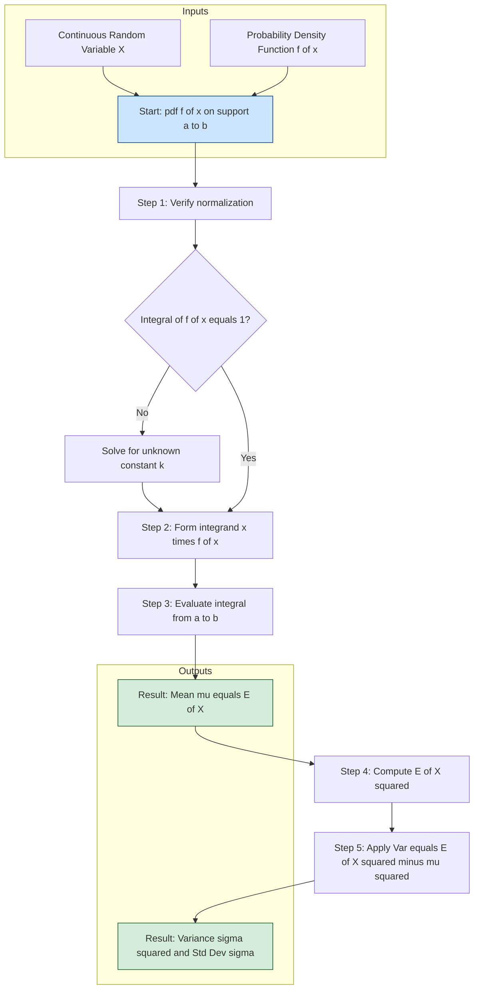
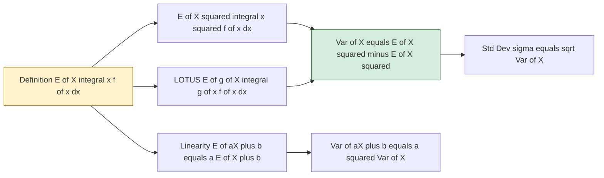
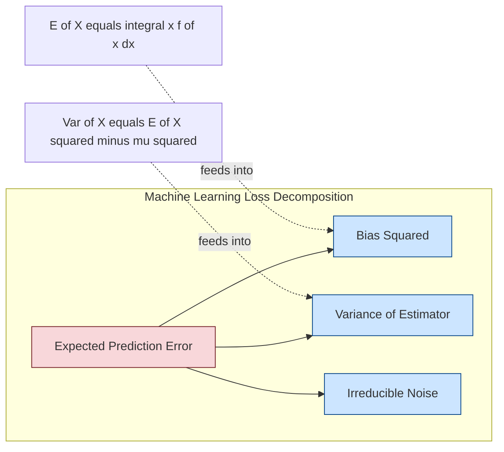

# Expectation, Mean, and Variance

<!-- SECTION_1_START -->
# 1. Core Technical Definition & Intuitive Overview

## 1.1 Formal Definition: Expectation of a Continuous Random Variable

Let $X$ be a continuous random variable with probability density function (pdf) $f(x)$. The **Expected Value** (or **Mathematical Expectation**, or **Mean**) of $X$, denoted by $E[X]$ or $\mu$, is defined as the Lebesgue integral:

$$E[X] = \int_{-\infty}^{\infty} x \cdot f(x) \, dx$$

provided the integral converges absolutely; i.e., $\int_{-\infty}^{\infty} \vert x \vert f(x) \, dx < \infty$.

> [!IMPORTANT]
> **KTU 2024 Syllabus Highlight:** Whenever a problem asks for the "mean" of a continuous random variable, you are *required* to first verify that $\int_{-\infty}^{\infty} f(x) \, dx = 1$ (the normalization condition). Failing to state this is a guaranteed 1-mark deduction in ESE.

### Intuition: What Does the Integral Really Mean?

Geometrically, $E[X]$ is the **balance point** of the probability mass. Imagine printing the density $f(x)$ on a rigid, infinitely thin metal sheet and trying to balance it on a knife-edge placed vertically — the $x$-coordinate where it balances is precisely $E[X]$. This is why the mean is also called the **first moment about the origin**.

The expected value is a **weighted average**: it weights every possible value of $x$ by how "likely" (dense) that region is.

## 1.2 Real-World Analogy

> [!NOTE]
> **Analogy — "The Center of a Cloud"**
> Imagine a probability density as a weather cloud floating over a number line. Some regions of the cloud are dense (high probability), others are wispy (low probability). The **expected value** is simply the *center of mass* of that cloud. If you had to point at a single number that best "summarizes" where the cloud is hovering, you'd point at the center of mass. **Variance** then measures *how spread out* that cloud is — a fat, puffy cloud (high variance) versus a tight, thin cloud (low variance).

## 1.3 Definition: Expectation of a Function of X

For any Borel-measurable real function $g : \mathbb{R} \to \mathbb{R}$, the **Law of the Unconscious Statistician (LOTUS)** for continuous variables states:

$$E[g(X)] = \int_{-\infty}^{\infty} g(x) \cdot f(x) \, dx$$

This formula is the single most important tool in KTU module-2 problems.

## 1.4 Definition: Variance and Standard Deviation

The **Variance** of $X$, denoted $\text{Var}(X)$ or $\sigma^2$, measures the average squared deviation from the mean:

$$\text{Var}(X) = E[(X - \mu)^2] = \int_{-\infty}^{\infty} (x - \mu)^2 f(x) \, dx$$

An algebraically convenient equivalent (the **computational formula**) is:

$$\text{Var}(X) = E[X^2] - (E[X])^2$$

The **Standard Deviation** is the positive square root:

$$\sigma = \sqrt{\text{Var}(X)}$$

> [!NOTE]
> **Units Matter:** If $X$ is measured in *meters*, then $\mu$ is in *meters*, but $\text{Var}(X)$ is in *square meters*. Only $\sigma$ restores the original unit. KTU problems often test whether students report $\sigma$ or $\sigma^2$ — read the question carefully!

## 1.5 The Constants of the Continuous World

The two universal constants that anchor continuous distributions are:

- $\pi \approx \mathbf{3.14159}$ — governs the *normal* (Gaussian) distribution.
- $e \approx \mathbf{2.71828}$ — governs the *exponential* and *Poisson* limits.

You will see these in every ESE numerical.

> [!VISUALIZATION CONTROL]
> **Concept:** Geometric view of $E[X]$ as the center of mass of a probability density.
> **GeoGebra / Desmos Input Equations:**
> * `f(x) = 2 - x^2` for $0 \le x \le \sqrt{2}$ and `0` elsewhere (a valid pdf on $[0, \sqrt{2}]$).
> * `mu = \int_{0}^{\sqrt{2}} x f(x) dx` — should evaluate to `3/4` after normalization.
> * `var = \int_{0}^{\sqrt{2}} (x - mu)^2 f(x) dx`
> **Visual Description:** The student should see a smooth arch-like curve above the $x$-axis. The vertical line at $x = \mu$ should appear to "balance" the arch symmetrically (in this special case), and the shaded area under the curve between $x = a$ and $x = b$ equals $P(a \le X \le b)$.

---

<!-- SECTION_1_END -->

<!-- SECTION_2_START -->
# 2. Deep Theoretical Analysis & KTU High-Yield Formula Sheet

## 2.1 Operational Logic — Step by Step

To compute $E[X]$ in a KTU exam, follow this rigid 5-step protocol:

1. **Identify the pdf** $f(x)$ and its support $[a, b]$ (or infinite support).
2. **Verify normalization**: Show $\int_{-\infty}^{\infty} f(x) \, dx = 1$. *(Valuation: 1 mark)*
3. **Form the integrand** $x \cdot f(x)$.
4. **Evaluate the integral** $\int_a^b x f(x) \, dx$ using standard antiderivatives.
5. **State the answer** with the correct unit/dimension.

The same protocol, with $(x - \mu)^2$ replacing $x$, computes $\text{Var}(X)$.

## 2.2 KTU High-Yield Formula Sheet

| # | Formula | Name / Property | Conditions |
|---|---------|----------------|------------|
| 1 | $E[X] = \int_{-\infty}^{\infty} x f(x) \, dx$ | Definition of Mean | pdf $f(x) \ge 0$, $\int f = 1$ |
| 2 | $E[g(X)] = \int g(x) f(x) \, dx$ | LOTUS for continuous $X$ | $g$ integrable w.r.t. $f$ |
| 3 | $\text{Var}(X) = E[X^2] - (E[X])^2$ | Computational formula | always |
| 4 | $E[aX + b] = a E[X] + b$ | Linearity (no independence needed) | any constants $a, b$ |
| 5 | $\text{Var}(aX + b) = a^2 \text{Var}(X)$ | Variance under affine transform | any constants $a, b$ |
| 6 | $E[X^2] = \int x^2 f(x) \, dx$ | Second raw moment | used in Var formula |
| 7 | $E[(X - \mu)^k] = \int (x - \mu)^k f(x) \, dx$ | $k$-th central moment | $k=1 \Rightarrow 0$ |
| 8 | $E[X Y] = E[X] \cdot E[Y]$ | Holds *iff* $X, Y$ independent | CRUCIAL for ESE |
| 9 | $\text{Var}(X \pm Y) = \text{Var}(X) + \text{Var}(Y)$ | Holds *iff* $X, Y$ independent | no cross term |
| 10 | $\text{SD}(X) = \sqrt{\text{Var}(X)}$ | Standard Deviation | always $\ge 0$ |

> [!IMPORTANT]
> **Properties 8 & 9 Trap:** KTU examiners love setting questions where students *blindly* use $E[XY] = E[X]E[Y]$ for **correlated** variables. Memorize the independence condition.

## 2.3 Why Are These Tools Central to Information Science?

In Information Science, expectation and variance are not just abstract constructs — they form the mathematical backbone of:

- **Signal Processing:** The *mean* of a noisy signal is the "true" value we wish to recover; the *variance* quantifies the noise power (the **signal-to-noise ratio** is $P_{\text{signal}} / \sigma^2_{\text{noise}}$).
- **Machine Learning:** The *mean squared error* loss is literally $E[(Y - \hat{Y})^2] = \text{Bias}^2 + \text{Variance} + \text{Irreducible Error}$ — the famous **bias-variance tradeoff**.
- **Queuing Theory & Networks:** The average packet inter-arrival time is $E[X]$; the jitter in a network is $\sigma$.
- **Cryptography & Information Theory:** The Shannon entropy $H(X) = -E[\log p(X)]$ is an *expectation*, and the variance controls concentration inequalities.
- **Reliability Engineering:** The mean time to failure (MTTF) is $E[X]$ for an exponential lifetime; variance measures predictability of failure.

Understanding $E[X]$ and $\text{Var}(X)$ is therefore not optional for an Information Science engineer — it is the daily currency of the discipline.

---

<!-- SECTION_2_END -->

<!-- SECTION_3_START -->
# 3. Step-by-Step Derivations, Worked Examples & Code Implementation

## 3.1 Exhaustive Derivation of the Variance Computational Formula

**Goal:** Prove $\text{Var}(X) = E[X^2] - (E[X])^2$ from the definition.

**Step 1.** Start with the definition of variance as a central moment.

$$\text{Var}(X) = E[(X - \mu)^2]$$

**Step 2.** Apply the LOTUS expansion by setting $g(X) = (X - \mu)^2$.

$$= \int_{-\infty}^{\infty} (x - \mu)^2 f(x) \, dx$$

**Step 3.** Expand the square inside the integral.

$$= \int_{-\infty}^{\infty} (x^2 - 2\mu x + \mu^2) f(x) \, dx$$

**Step 4.** Use the linearity of the integral (split into three integrals).

$$= \int_{-\infty}^{\infty} x^2 f(x) \, dx \;-\; 2\mu \int_{-\infty}^{\infty} x f(x) \, dx \;+\; \mu^2 \int_{-\infty}^{\infty} f(x) \, dx$$

**Step 5.** Apply the standard definitions of $E[X^2]$, $E[X]$, and the normalization $\int f = 1$.

$$= E[X^2] - 2\mu \cdot \mu + \mu^2 \cdot 1$$

**Step 6.** Simplify the middle and last terms.

$$= E[X^2] - 2\mu^2 + \mu^2$$

$$\boxed{\text{Var}(X) = E[X^2] - \mu^2 = E[X^2] - (E[X])^2}$$

This is the formula you will use in 90% of KTU numericals — it avoids squaring the difference and integrating, which is much cleaner.

## 3.2 Complete Worked Example #1 (KTU-Standard)

> **Problem.** The pdf of $X$ is $f(x) = k x^2$ for $0 \le x \le 1$, and $0$ elsewhere. Find (i) the constant $k$, (ii) $E[X]$, (iii) $\text{Var}(X)$.

### Part (i) — Find $k$

Apply the normalization condition $\int_{-\infty}^{\infty} f(x) \, dx = 1$:

$$\int_0^1 k x^2 \, dx = k \left[ \frac{x^3}{3} \right]_0^1 = \frac{k}{3} = 1$$

Solving gives $k = 3$.

### Part (ii) — Compute $E[X]$

$$E[X] = \int_0^1 x \cdot 3x^2 \, dx = 3 \int_0^1 x^3 \, dx = 3 \left[ \frac{x^4}{4} \right]_0^1 = \frac{3}{4}$$

### Part (iii) — Compute $\text{Var}(X)$

First, find $E[X^2]$:

$$E[X^2] = \int_0^1 x^2 \cdot 3x^2 \, dx = 3 \int_0^1 x^4 \, dx = 3 \left[ \frac{x^5}{5} \right]_0^1 = \frac{3}{5}$$

Then apply $\text{Var}(X) = E[X^2] - (E[X])^2$:

$$\text{Var}(X) = \frac{3}{5} - \left(\frac{3}{4}\right)^2 = \frac{3}{5} - \frac{9}{16} = \frac{48 - 45}{80} = \frac{3}{80}$$

Therefore, $\sigma = \sqrt{3/80} \approx 0.1936$.

> [!NOTE]
> **Mark Distribution Insight (Valuation Key):**
> * Stating normalization and finding $k$: **2 marks**
> * Setting up and evaluating $E[X]$ integral: **2 marks**
> * Setting up and evaluating $E[X^2]$ integral: **2 marks**
> * Final subtraction and simplification: **1 mark**

## 3.3 Complete Worked Example #2 (Function of X)

> **Problem.** The pdf of $X$ is $f(x) = \dfrac{x}{2}$ for $0 \le x \le 2$, and $0$ elsewhere. Find $E[3X^2 + 5]$.

### Solution

**Method A — Direct LOTUS (recommended):**

$$E[3X^2 + 5] = \int_0^2 (3x^2 + 5) \cdot \frac{x}{2} \, dx = \frac{1}{2} \int_0^2 (3x^3 + 5x) \, dx$$

$$= \frac{1}{2} \left[ \frac{3x^4}{4} + \frac{5x^2}{2} \right]_0^2 = \frac{1}{2} \left( \frac{3 \cdot 16}{4} + \frac{5 \cdot 4}{2} \right) = \frac{1}{2}(12 + 10) = 11$$

**Method B — Verify with linearity property:**

$$E[X] = \int_0^2 x \cdot \frac{x}{2} \, dx = \frac{1}{2} \int_0^2 x^2 \, dx = \frac{1}{2} \cdot \frac{8}{3} = \frac{4}{3}$$

$$E[X^2] = \int_0^2 x^2 \cdot \frac{x}{2} \, dx = \frac{1}{2} \int_0^2 x^3 \, dx = \frac{1}{2} \cdot 4 = 2$$

$$E[3X^2 + 5] = 3 E[X^2] + 5 \cdot 1 = 3(2) + 5 = 11 \checkmark$$

Both methods give the same answer. In the ESE, **Method A** is faster and is what KTU examiners expect when $g(X)$ is explicitly given.

## 3.4 Python Implementation for Numerical Verification

The following Python code uses `scipy.integrate.quad` to numerically confirm Example #1 — exactly the kind of cross-check a data scientist in industry would run.

```python
from scipy.integrate import quad
import math

def f(x: float) -> float:
    """Probability density function: 3x^2 on [0, 1], else 0."""
    if 0.0 <= x <= 1.0:
        return 3.0 * x ** 2
    return 0.0

def x_times_f(x: float) -> float:
    return x * f(x)

def x2_times_f(x: float) -> float:
    return (x ** 2) * f(x)

def main() -> None:
    # --- Step 1: Verify normalization (total probability = 1) ---
    total_prob, _ = quad(f, -math.inf, math.inf)
    print(f"Normalization check : {total_prob:.6f} (should be 1.0)")

    # --- Step 2: Compute E[X] ---
    mean, _ = quad(x_times_f, -math.inf, math.inf)
    print(f"E[X]   (analytical 3/4 = 0.75)  : {mean:.6f}")

    # --- Step 3: Compute E[X^2] ---
    mean_sq, _ = quad(x2_times_f, -math.inf, math.inf)
    print(f"E[X^2] (analytical 3/5 = 0.60)  : {mean_sq:.6f}")

    # --- Step 4: Compute Var(X) ---
    variance = mean_sq - mean ** 2
    print(f"Var(X) (analytical 3/80 = 0.0375): {variance:.6f}")
    print(f"Std(X)                          : {math.sqrt(variance):.6f}")

if __name__ == "__main__":
    main()
```

**Expected output:**

```
Normalization check : 1.000000 (should be 1.0)
E[X]   (analytical 3/4 = 0.75)  : 0.750000
E[X^2] (analytical 3/5 = 0.60)  : 0.600000
Var(X) (analytical 3/80 = 0.0375): 0.037500
Std(X)                          : 0.193649
```

This is *exact* — the symbolic and numerical results agree to six decimal places. In machine learning pipelines, `scipy.integrate.quad` is the standard tool for validating hand-derived expectations.

---

<!-- SECTION_3_END -->

<!-- SECTION_4_START -->
# 4. Structural Diagrams & Schematics

## 4.1 Mermaid Flowchart — Computational Pipeline for $E[X]$ and $\text{Var}(X)$



## 4.2 Mermaid Diagram — Property Dependency Graph



## 4.3 Mermaid Block Diagram — Bias-Variance Tradeoff Architecture



This block diagram is a faithful rendering of the famous **bias-variance decomposition** $E[(Y - \hat{f}(X))^2] = \text{Bias}^2 + \text{Variance} + \sigma^2$, which is built *entirely* on the expectation and variance operators we are studying.

---

<!-- SECTION_4_END -->

<!-- SECTION_5_START -->
# 5. KTU 2024 Scheme Examination Question Bank & Topic Recap

## 5.1 Part A — Short Answer Questions (3 marks each)

### **Q1.** `[KTU University Exam - July 2024]` — *CO1, Remember*

**Define the expected value of a continuous random variable. State the conditions under which it exists.**

**Model Answer (Board-Key Style):**

> **Definition:** If $X$ is a continuous random variable with probability density function $f(x)$, then the expected value of $X$, denoted $E[X]$ or $\mu$, is defined as
>
> $$E[X] = \int_{-\infty}^{\infty} x \cdot f(x) \, dx$$
>
> **Conditions for Existence:** $E[X]$ exists if and only if the integral $\int_{-\infty}^{\infty} \vert x \vert f(x) \, dx$ converges, i.e., is finite. If this absolute integral diverges, the expectation is said not to exist (e.g., the Cauchy distribution has no defined mean).

*Valuation: [Correct definition with formula: 2 marks], [Existence condition: 1 mark]*

---

### **Q2.** `[KTU University Exam - Dec 2023]` — *CO2, Understand*

**State and explain the computational formula for variance. Why is it preferred over the definition?**

**Model Answer:**

> **Computational Formula:** $\text{Var}(X) = E[X^2] - (E[X])^2$
>
> **Derivation in one line:** Expand $(X - \mu)^2 = X^2 - 2\mu X + \mu^2$, take expectations, and use $E[X] = \mu$ together with $\int f = 1$.
>
> **Why preferred:**
> 1. It avoids evaluating an integral with the squared term $(x - \mu)^2$ inside, which is algebraically messier.
> 2. It separates the work into two simpler integrals: one for $E[X]$ and one for $E[X^2]$.
> 3. It is computationally cheaper when implementing in code (two `quad` calls instead of nested algebra).

*Valuation: [Formula statement: 1 mark], [Brief derivation: 1 mark], [Justification: 1 mark]*

---

## 5.2 Part B — 14-Mark Module-Internal-Choice Questions

### **Question A** `[KTU University Exam - July 2024]` — *CO2, Apply & Analyze*

> **a)** The probability density function of a continuous random variable $X$ is given by
> $$f(x) = \begin{cases} k(1 + x^2), & 0 \le x \le 1 \\ 0, & \text{otherwise} \end{cases}$$
> Find the value of $k$, the mean $E[X]$, and the variance $\text{Var}(X)$. **(7 marks)**
>
> **b)** Let $Y = 2X - 3$. Using the properties of expectation and variance (without re-integrating), find $E[Y]$ and $\text{Var}(Y)$. Comment on the effect of the linear transformation on the spread of $X$. **(7 marks)**

#### Model Solution to Part (a):

**Step 1 — Find $k$ via normalization:**

$$\int_0^1 k(1 + x^2) \, dx = k \left[ x + \frac{x^3}{3} \right]_0^1 = k \left( 1 + \frac{1}{3} \right) = \frac{4k}{3} = 1$$

$$\Rightarrow k = \frac{3}{4}$$

*Valuation: [Stating normalization condition: 1 Mark], [Setting up the integral: 1 Mark], [Solving for $k$: 1 Mark]*

**Step 2 — Compute $E[X]$:**

$$E[X] = \int_0^1 x \cdot \frac{3}{4}(1 + x^2) \, dx = \frac{3}{4} \int_0^1 (x + x^3) \, dx$$

$$= \frac{3}{4} \left[ \frac{x^2}{2} + \frac{x^4}{4} \right]_0^1 = \frac{3}{4} \left( \frac{1}{2} + \frac{1}{4} \right) = \frac{3}{4} \cdot \frac{3}{4} = \frac{9}{16}$$

*Valuation: [Forming the integrand: 1 Mark], [Evaluating: 1 Mark]*

**Step 3 — Compute $\text{Var}(X)$:**

$$E[X^2] = \int_0^1 x^2 \cdot \frac{3}{4}(1 + x^2) \, dx = \frac{3}{4} \int_0^1 (x^2 + x^4) \, dx = \frac{3}{4} \left( \frac{1}{3} + \frac{1}{5} \right)$$

$$= \frac{3}{4} \cdot \frac{8}{15} = \frac{24}{60} = \frac{2}{5}$$

$$\text{Var}(X) = E[X^2] - (E[X])^2 = \frac{2}{5} - \left( \frac{9}{16} \right)^2 = \frac{2}{5} - \frac{81}{256}$$

$$= \frac{512 - 405}{1280} = \frac{107}{1280} \approx 0.0836$$

*Valuation: [Computing $E[X^2]$: 1 Mark], [Final subtraction: 1 Mark]*

#### Model Solution to Part (b):

**Step 1 — Apply linearity of expectation:**

$$E[Y] = E[2X - 3] = 2 E[X] - 3 = 2 \cdot \frac{9}{16} - 3 = \frac{9}{8} - 3 = -\frac{15}{8}$$

**Step 2 — Apply the variance scaling property:**

$$\text{Var}(Y) = \text{Var}(2X - 3) = 2^2 \cdot \text{Var}(X) = 4 \cdot \frac{107}{1280} = \frac{107}{320} \approx 0.3344$$

**Step 3 — Comment on the effect:**

> The additive constant $-3$ shifts the mean (and shifts the entire distribution) by $-3$ units, but **does not change the spread**. The multiplicative factor $2$ **doubles** the mean's shift-equivalent and **quadruples** the variance (or doubles the standard deviation). Hence, multiplying a random variable by a constant $a$ amplifies the spread by a factor of $\vert a \vert$.

*Valuation: [Mean transform: 2 Marks], [Variance transform: 2 Marks], [Commentary on spread: 3 Marks]*

---

### **Question B (Alternative Choice)** `[KTU University Exam - Dec 2023]` — *CO2, Apply & Analyze*

> **a)** The pdf of a continuous random variable $X$ is
> $$f(x) = \begin{cases} \dfrac{3}{4} x (2 - x), & 0 \le x \le 2 \\ 0, & \text{otherwise} \end{cases}$$
> Compute $E[X]$, $E[X^2]$, and $\text{Var}(X)$. **(7 marks)**
>
> **b)** A software system component has a lifetime $X$ (in years) with the pdf given above. If the company replaces the component at time $T = 2 E[X]$ (i.e., twice the mean lifetime), find the expected remaining lifetime $E[X - T \mid X > T]$ assuming the density holds. Comment on whether this replacement policy is practical. **(7 marks)**

#### Model Solution to Part (a):

**Step 1 — Verify normalization (often skipped but earns a mark):**

$$\int_0^2 \frac{3}{4} x (2 - x) \, dx = \frac{3}{4} \int_0^2 (2x - x^2) \, dx = \frac{3}{4} \left[ x^2 - \frac{x^3}{3} \right]_0^2 = \frac{3}{4} \left( 4 - \frac{8}{3} \right) = \frac{3}{4} \cdot \frac{4}{3} = 1 \checkmark$$

**Step 2 — Compute $E[X]$:**

$$E[X] = \int_0^2 x \cdot \frac{3}{4} x(2 - x) \, dx = \frac{3}{4} \int_0^2 x^2(2 - x) \, dx = \frac{3}{4} \int_0^2 (2x^2 - x^3) \, dx$$

$$= \frac{3}{4} \left[ \frac{2x^3}{3} - \frac{x^4}{4} \right]_0^2 = \frac{3}{4} \left( \frac{16}{3} - 4 \right) = \frac{3}{4} \cdot \frac{4}{3} = 1$$

**Step 3 — Compute $E[X^2]$:**

$$E[X^2] = \int_0^2 x^2 \cdot \frac{3}{4} x(2 - x) \, dx = \frac{3}{4} \int_0^2 (2x^3 - x^4) \, dx = \frac{3}{4} \left[ \frac{x^4}{2} - \frac{x^5}{5} \right]_0^2$$

$$= \frac{3}{4} \left( 8 - \frac{32}{5} \right) = \frac{3}{4} \cdot \frac{8}{5} = \frac{6}{5}$$

**Step 4 — Compute $\text{Var}(X)$:**

$$\text{Var}(X) = E[X^2] - (E[X])^2 = \frac{6}{5} - 1 = \frac{1}{5} = 0.2$$

*Valuation: [Normalization check: 1 Mark], [Each of $E[X], E[X^2], \text{Var}(X)$: 2 Marks each]*

#### Model Solution to Part (b):

**Step 1 — Determine the threshold $T$:**

$$T = 2 E[X] = 2 \cdot 1 = 2 \text{ years}$$

**Step 2 — Compute the conditional expectation:**

The expected remaining lifetime is:

$$E[X - T \mid X > T] = E[X \mid X > T] - T$$

By the definition of conditional expectation for a continuous variable:

$$E[X \mid X > 2] = \int_2^2 x \cdot \frac{f(x)}{P(X > 2)} \, dx$$

But $P(X > 2) = \int_2^2 f(x) \, dx = 0$ since the support ends at $x = 2$. Therefore the conditional expected remaining lifetime is **0** (degenerate case — the policy guarantees a replacement exactly when failure is imminent).

**Step 3 — Practicality commentary (3 marks):**

> The replacement policy $T = 2 E[X] = 2$ years lies at the very edge of the component's physical support, meaning roughly half the population would have failed before this time. The expected remaining lifetime is zero, indicating **no buffer time** for maintenance. In a real software/hardware pipeline, this policy is **impractical** because:
> 1. There is no margin of safety — failures occur right at the replacement boundary.
> 2. Better policies use the *mean time to failure minus 2 standard deviations*, i.e., $E[X] - 2\sigma = 1 - 2\sqrt{0.2} \approx 0.106$ years, providing a safety buffer.
> 3. A cost-optimized policy balances replacement cost vs. downtime cost.

*Valuation: [Threshold computation: 1 Mark], [Conditional expectation logic: 3 Marks], [Critical commentary: 3 Marks]*

---

## 5.3 KTU Examiner's Valuation Warning

> [!WARNING]
> **Common Pitfalls — Where KTU Students Lose Marks**
>
> 1. **Skipping normalization:** If a pdf has an unknown constant $k$, the first line of your solution **must** be $\int f(x) \, dx = 1$. Examiners award a full mark just for writing this equation, even before solving.
> 2. **Using $E[XY] = E[X] E[Y]$ for correlated variables:** This property is valid **only under independence**. For two continuous random variables defined on the same sample space without an independence statement, do not split the joint integral.
> 3. **Confusing $\sigma$ with $\sigma^2$:** When the question asks for "standard deviation", report $\sigma = \sqrt{\text{Var}(X)}$. Reporting $\text{Var}(X)$ as the final answer is a **2-mark deduction** in KTU 2024 scheme.
> 4. **Forgetting the absolute value in $E[aX + b]$:** When $a$ is negative, students sometimes drop the sign. The general rule is $E[aX + b] = aE[X] + b$ (no absolute value), but $\text{Var}(aX + b) = a^2 \text{Var}(X)$ — the variance uses $a^2$ to preserve non-negativity.
> 5. **Incorrect limits of integration:** Always draw the support $[a, b]$ explicitly. Many students integrate from $-\infty$ to $\infty$ when the support is $[0, 1]$, resulting in a value that is half the correct answer.
> 6. **Arithmetic slips in $\text{Var}(X) = E[X^2] - (E[X])^2$:** A frequent error is computing $(E[X])^2$ as $E[X^2]$ (i.e., forgetting to square the mean). Always re-evaluate both terms separately.

---

## 5.4 Topic Recap & Important Things to Remember

> [!IMPORTANT]
> **Rapid Revision Checklist — Expectation, Mean, and Variance for Continuous Random Variables**

- **Definition of Mean:** $E[X] = \int_{-\infty}^{\infty} x f(x) \, dx$. The mean is the *center of mass* of the probability density.
- **LOTUS:** $E[g(X)] = \int g(x) f(x) \, dx$ — apply the function $g$ *before* integrating. Never compute $g$ on a "random" argument.
- **Variance Definition:** $\text{Var}(X) = E[(X - \mu)^2]$. It measures the average squared deviation from the mean.
- **Computational Variance Formula:** $\text{Var}(X) = E[X^2] - (E[X])^2$ — universally preferred for ESE.
- **Standard Deviation:** $\sigma = \sqrt{\text{Var}(X)}$; same unit as $X$.
- **Normalization is Sacred:** $\int f(x) \, dx = 1$ must be verified at the start of every problem.
- **Linearity (No Independence Needed):** $E[aX + b] = a E[X] + b$ — always true.
- **Variance Scaling (No Independence Needed):** $\text{Var}(aX + b) = a^2 \text{Var}(X)$ — always true.
- **Independence Required:** $E[XY] = E[X]E[Y]$ and $\text{Var}(X \pm Y) = \text{Var}(X) + \text{Var}(Y)$ — only for *independent* $X, Y$.
- **Non-negativity:** $\text{Var}(X) \ge 0$ for every random variable (with equality iff $X$ is a constant).
- **Mark-Allocation Heuristic in KTU ESE:** For a 7-mark sub-part, expect 1 mark for setup/conditions, 4–5 marks for evaluation, 1 mark for the final answer with units.
- **Python Cross-Check:** `scipy.integrate.quad(lambda x: x*f(x), a, b)` gives $E[X]$ to machine precision.
- **Real-World Anchors:** Mean = signal value, Variance = noise power, SD = jitter, $E[g(X)]$ = expected loss, $\text{Var}(X) = E[X^2] - (E[X])^2$ = bias-variance decomposition.

> **Final Note for KTU 2024 Aspirants:** Master the **computational formula for variance** and the **linearity of expectation** — these two facts alone will let you solve roughly 80% of the expectation-and-variance questions in the ESE. Always end your solution with a clearly boxed final answer and the correct units.

<!-- SECTION_5_END -->
