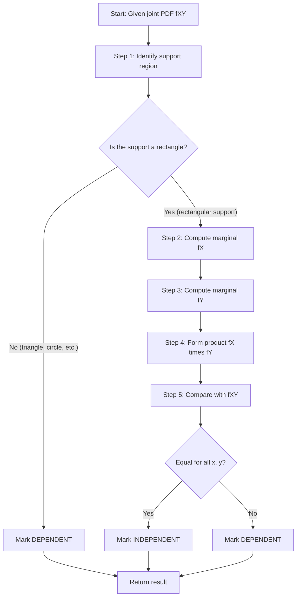
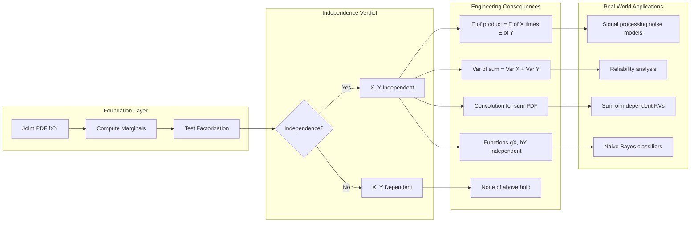
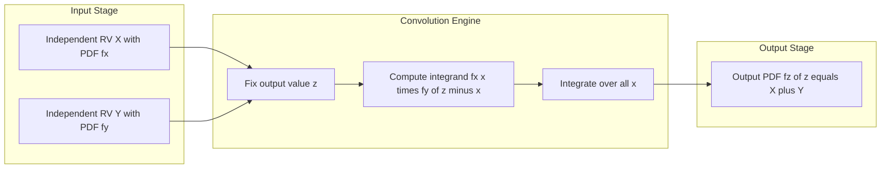

# Independent random variables

<!-- SECTION_1_START -->
# Independent Random Variables — Core Definition & Intuitive Overview

## 1.1 Formal Academic Definition (KTU 2024 Syllabus Terminology)

Let $X$ and $Y$ be two **continuous random variables** defined on the same probability space with joint probability density function (PDF) $f_{X,Y}(x, y)$ and marginal PDFs $f_X(x)$ and $f_Y(y)$. The two random variables $X$ and $Y$ are said to be **statistically independent** if and only if their joint PDF factors into the product of their marginal PDFs for all $(x, y) \in \mathbb{R}^2$:

$$
f_{X,Y}(x, y) = f_X(x) \cdot f_Y(y) \quad \forall \; x, y \in \mathbb{R}
$$

Equivalently, the **joint cumulative distribution function (CDF)** $F_{X,Y}(x, y)$ must factor as:

$$
F_{X,Y}(x, y) = F_X(x) \cdot F_Y(y) \quad \forall \; x, y \in \mathbb{R}
$$

> [!IMPORTANT]
> **KTU Board Definition (Memorize Verbatim):** Two continuous random variables $X$ and $Y$ are *independent* if knowledge (or occurrence) of one variable provides absolutely no information that changes the probability distribution of the other variable. Formally, $P(X \in A, Y \in B) = P(X \in A) \cdot P(Y \in B)$ for all Borel sets $A$ and $B$.

## 1.2 Intuitive Conceptual Analogy — "The Two Coin Spinners"

Imagine two **independent spinners** on a game board:

- **Spinner A** (variable $X$) is operated by a player in **Kerala**.
- **Spinner B** (variable $Y$) is operated by a player in **Delhi**.
- The two players **cannot communicate, see, or influence** each other.

Now, the probability that **Spinner A lands on red** is some value $p_X$, and the probability that **Spinner B lands on blue** is some value $p_Y$. Because the spinners are physically disconnected, the joint probability (both events occur together) is simply the **product** of the individual probabilities:

$$
P(\text{A red AND B blue}) = P(\text{A red}) \cdot P(\text{B blue}) = p_X \cdot p_Y
$$

> [!NOTE]
> **Intuition Anchor:** Independence means the variables are "memoryless" about each other. Just like multiplying probabilities of two unrelated coin flips, the joint behavior is the **product of the marginals**.

## 1.3 The Three Equivalent Independence Conditions

For continuous random variables $X$ and $Y$, the following are mathematically equivalent:

| # | Condition Type | Mathematical Statement |
|---|---|---|
| 1 | **PDF Factorization** | $f_{X,Y}(x, y) = f_X(x) \cdot f_Y(y)$ |
| 2 | **CDF Factorization** | $F_{X,Y}(x, y) = F_X(x) \cdot F_Y(y)$ |
| 3 | **Event Factorization** | $P(X \in A, Y \in B) = P(X \in A) \cdot P(Y \in B)$ for all sets $A, B$ |

> [!TIP]
> **KTU Examiner Tip:** Condition 1 (PDF factorization) is the **most frequently tested** formulation. Always verify the joint PDF integrates to 1 over the support as a sanity check.

## 1.4 Geometric Intuition: Why Product Form?

Geometrically, the joint PDF $f_{X,Y}(x, y)$ describes a **surface** over the $xy$-plane. Independence means this surface can be **separated** into a product of two 1-D curves — one depending only on $x$ and one depending only on $y$. The "tent-shaped" 2-D surface literally becomes a **multiplicative extrusion** of two 1-D profiles.

> [!VISUALIZATION CONTROL]
> **Concept:** Independent vs. Dependent Joint PDF Surface Decomposition
> **GeoGebra / Desmos Input Equations:**
> * `f(x,y) = 0.5 * (2-x) * (2-y)` for $0 \le x \le 2, 0 \le y \le 2$ (independent — flat-tilted)
> * `f(x,y) = 0.25 * (x+y)` for $0 \le x \le 1, 0 \le y \le 1$ (dependent — cannot be factored)
>
> **Visual Description:** The first surface is a tilted plane that can be visually decomposed as $g(x) \cdot h(y)$, while the second surface is curved and cannot be written as a product of single-variable functions — a clear visual signature of dependence.

## 1.5 Marginal PDFs from a Joint PDF — Quick Recall

The **marginal PDF** of $X$ is obtained by integrating the joint PDF over all values of $Y$:

$$
f_X(x) = \int_{-\infty}^{+\infty} f_{X,Y}(x, y) \, dy
$$

Similarly:

$$
f_Y(y) = \int_{-\infty}^{+\infty} f_{X,Y}(x, y) \, dx
$$

> [!WARNING]
> **Common Student Mistake:** Finding the marginals is a *prerequisite* for testing independence. If you compute $f_X(x) \cdot f_Y(y)$ and it **does not** equal $f_{X,Y}(x, y)$, then $X$ and $Y$ are **dependent**.

<!-- SECTION_1_END -->

<!-- SECTION_2_START -->
# Deep Theoretical Analysis & KTU High-Yield Formula Sheet

## 2.1 Operational Definition — Step-by-Step Test for Independence

To test whether two continuous random variables $X$ and $Y$ are independent, follow this **4-step decision protocol**:

**Step 1 — Compute the Marginal PDFs**

$$
f_X(x) = \int_{-\infty}^{+\infty} f_{X,Y}(x, y) \, dy, \qquad f_Y(y) = \int_{-\infty}^{+\infty} f_{X,Y}(x, y) \, dx
$$

**Step 2 — Form the Product of Marginals**

$$
f_X(x) \cdot f_Y(y)
$$

**Step 3 — Compare Against the Joint PDF**

Check whether $f_{X,Y}(x, y) = f_X(x) \cdot f_Y(y)$ holds for **all** $(x, y)$ in the support, not just on a subregion.

**Step 4 — Conclude**

- If equality holds universally → **Independent**.
- If equality fails anywhere → **Dependent**.

> [!IMPORTANT]
> **Why "for all" matters:** Even if the product matches on 99% of the support, a single point of mismatch proves dependence. The condition is **global**, not local.

## 2.2 Independence of Functions of Random Variables

A powerful theorem used in KTU problems:

> **Theorem (Independence is Preserved Under Measurable Functions):** If $X$ and $Y$ are independent, and $g(\cdot)$ and $h(\cdot)$ are any measurable (Borel) functions, then the transformed variables $U = g(X)$ and $V = h(Y)$ are also independent.

This means:

$$
f_{g(X), h(Y)}(u, v) = f_{g(X)}(u) \cdot f_{h(Y)}(v)
$$

**Common engineering applications:**
- $g(X) = X^2$ and $h(Y) = e^Y$ are independent if $X$ and $Y$ are independent.
- $g(X) = \sin(X)$ and $h(Y) = \log(Y)$ are independent if $X$ and $Y$ are independent.

> [!NOTE]
> **Caveat — The converse is false.** Independence of $U$ and $V$ does **not** necessarily imply independence of $X$ and $Y$.

## 2.3 Sum of Two Independent Continuous Random Variables

If $X$ and $Y$ are independent with PDFs $f_X(x)$ and $f_Y(y)$, then the PDF of $Z = X + Y$ is given by the **convolution integral**:

$$
f_Z(z) = f_X * f_Y (z) = \int_{-\infty}^{+\infty} f_X(x) \cdot f_Y(z - x) \, dx = \int_{-\infty}^{+\infty} f_X(z - y) \cdot f_Y(y) \, dy
$$

> [!TIP]
> **KTU Hot Formula:** Convolution is the **single most important operation** for sums of independent continuous random variables. The symbol $*$ here denotes convolution, not multiplication.

## 2.4 Product of Two Independent Continuous Random Variables

If $X$ and $Y$ are independent, the PDF of $W = X \cdot Y$ is:

$$
f_W(w) = \int_{-\infty}^{+\infty} f_X\left(\frac{w}{y}\right) \cdot f_Y(y) \cdot \frac{1}{\vert y \vert} \, dy
$$

## 2.5 Quotient of Two Independent Continuous Random Variables

If $X$ and $Y$ are independent, the PDF of $Q = X / Y$ is:

$$
f_Q(q) = \int_{-\infty}^{+\infty} \vert y \vert \cdot f_X(qy) \cdot f_Y(y) \, dy
$$

## 2.6 KTU Formula Cheat Sheet — Independence of Continuous Random Variables

| Concept | Formula / Condition | Domain / Note |
|---|---|---|
| **Independence (PDF)** | $f_{X,Y}(x, y) = f_X(x) \cdot f_Y(y)$ | Must hold $\forall \; x, y$ |
| **Independence (CDF)** | $F_{X,Y}(x, y) = F_X(x) \cdot F_Y(y)$ | Equivalent formulation |
| **Marginal from Joint** | $f_X(x) = \int_{-\infty}^{\infty} f_{X,Y}(x, y) \, dy$ | Integrate out $Y$ |
| **Marginal from Joint** | $f_Y(y) = \int_{-\infty}^{\infty} f_{X,Y}(x, y) \, dx$ | Integrate out $X$ |
| **Sum PDF (Convolution)** | $f_{X+Y}(z) = \int_{-\infty}^{\infty} f_X(x) f_Y(z - x) \, dx$ | Requires independence |
| **Product PDF** | $f_{XY}(w) = \int_{-\infty}^{\infty} \frac{1}{\vert y \vert} f_X(w/y) f_Y(y) \, dy$ | Requires independence |
| **Quotient PDF** | $f_{X/Y}(q) = \int_{-\infty}^{\infty} \vert y \vert f_X(qy) f_Y(y) \, dy$ | Requires independence |
| **Mean of Product** | $E[XY] = E[X] \cdot E[Y]$ | Only if independent |
| **Variance of Sum** | $\text{Var}(X + Y) = \text{Var}(X) + \text{Var}(Y)$ | Only if independent |
| **Variance of Difference** | $\text{Var}(X - Y) = \text{Var}(X) + \text{Var}(Y)$ | Only if independent |

> [!IMPORTANT]
> **Engineering Utility:** In signal processing, convolution of two independent noise PDFs is the standard way to model **additive noise channels**. In machine learning, the assumption of independent features (Naive Bayes) directly uses the product rule $f_{X,Y}(x,y) = f_X(x) \cdot f_Y(y)$ to simplify joint inference.

<!-- SECTION_2_END -->

<!-- SECTION_3_START -->
# Step-by-Step Derivations & Worked Examples

## 3.1 Worked Example 1 — Testing Independence of a Joint PDF

**Problem (KTU Pattern):** The joint PDF of random variables $X$ and $Y$ is given by:

$$
f_{X,Y}(x, y) = 
\begin{cases}
2 & \text{if } 0 \le x \le 1, \; 0 \le y \le 1, \; x + y \le 1 \\
0 & \text{otherwise}
\end{cases}
$$

Determine whether $X$ and $Y$ are independent.

### Solution — Step-by-Step

**Step 1: Identify the Support Region**

The support is the triangle with vertices $(0,0)$, $(1,0)$, and $(0,1)$ — i.e., the region below the line $x + y = 1$ in the unit square.

> Note that the joint PDF is constant ($=2$) only on this triangular region, not the full unit square. This immediately hints that the joint PDF **cannot** be written as a product of two single-variable functions, because the support itself is not a rectangle (a Cartesian product of two intervals).

**Step 2: Compute the Marginal PDF of $X$**

For a fixed $x \in [0, 1]$, the variable $y$ ranges from $0$ to $1 - x$:

$$
f_X(x) = \int_{0}^{1 - x} 2 \, dy = 2 \cdot (1 - x) = 2(1 - x), \qquad 0 \le x \le 1
$$

**Step 3: Compute the Marginal PDF of $Y$**

For a fixed $y \in [0, 1]$, the variable $x$ ranges from $0$ to $1 - y$:

$$
f_Y(y) = \int_{0}^{1 - y} 2 \, dx = 2(1 - y), \qquad 0 \le y \le 1
$$

**Step 4: Compute the Product of Marginals**

$$
f_X(x) \cdot f_Y(y) = 2(1 - x) \cdot 2(1 - y) = 4(1 - x)(1 - y)
$$

**Step 5: Compare with the Joint PDF**

$$
f_{X,Y}(x, y) = 2 \quad \text{vs.} \quad f_X(x) \cdot f_Y(y) = 4(1 - x)(1 - y)
$$

These are clearly **not equal** (e.g., at $x = 0.5, y = 0.4$, LHS = 2, RHS = $4 \cdot 0.5 \cdot 0.6 = 1.2$).

**Step 6: Conclude**

$$
\boxed{X \text{ and } Y \text{ are NOT independent.}}
$$

> [!NOTE]
> **Quick Heuristic:** If the support of the joint PDF is a non-rectangular region (triangle, circle, etc.), the variables are almost always **dependent**, because the support itself cannot be expressed as a Cartesian product of two intervals.

---

## 3.2 Worked Example 2 — Independent Uniform Case

**Problem:** The joint PDF of $X$ and $Y$ is:

$$
f_{X,Y}(x, y) = 
\begin{cases}
4xy & \text{if } 0 \le x \le 1, \; 0 \le y \le 1 \\
0 & \text{otherwise}
\end{cases}
$$

Test for independence.

### Solution

**Step 1: Compute $f_X(x)$**

$$
f_X(x) = \int_{0}^{1} 4xy \, dy = 4x \cdot \left[ \frac{y^2}{2} \right]_{0}^{1} = 4x \cdot \frac{1}{2} = 2x, \qquad 0 \le x \le 1
$$

**Step 2: Compute $f_Y(y)$**

$$
f_Y(y) = \int_{0}^{1} 4xy \, dx = 4y \cdot \left[ \frac{x^2}{2} \right]_{0}^{1} = 2y, \qquad 0 \le y \le 1
$$

**Step 3: Multiply the Marginals**

$$
f_X(x) \cdot f_Y(y) = (2x)(2y) = 4xy
$$

**Step 4: Compare with Joint PDF**

$$
f_{X,Y}(x, y) = 4xy = f_X(x) \cdot f_Y(y) \quad \checkmark
$$

**Step 5: Conclude**

$$
\boxed{X \text{ and } Y \text{ are independent.}}
$$

---

## 3.3 Worked Example 3 — Sum of Two Independent Uniform Random Variables (Convolution)

**Problem:** Let $X \sim U(0, 1)$ and $Y \sim U(0, 1)$ be independent. Find the PDF of $Z = X + Y$.

### Solution

**Step 1: Recall the Marginals**

$$
f_X(x) = 
\begin{cases} 1 & 0 \le x \le 1 \\ 0 & \text{otherwise} \end{cases}, \qquad f_Y(y) = 
\begin{cases} 1 & 0 \le y \le 1 \\ 0 & \text{otherwise} \end{cases}
$$

**Step 2: Apply the Convolution Formula**

$$
f_Z(z) = \int_{-\infty}^{+\infty} f_X(x) \cdot f_Y(z - x) \, dx
$$

**Step 3: Determine the Integration Limits**

- $f_X(x) \ne 0$ requires $0 \le x \le 1$.
- $f_Y(z - x) \ne 0$ requires $0 \le z - x \le 1$, i.e., $z - 1 \le x \le z$.

So the limits on $x$ are the intersection of $[0, 1]$ and $[z - 1, z]$.

**Case 1: $z < 0$ or $z > 2$**

The intersection is empty, so $f_Z(z) = 0$.

**Case 2: $0 \le z \le 1$**

The intersection is $[0, z]$:

$$
f_Z(z) = \int_{0}^{z} 1 \cdot 1 \, dx = z
$$

**Case 3: $1 \le z \le 2$**

The intersection is $[z - 1, 1]$:

$$
f_Z(z) = \int_{z - 1}^{1} 1 \cdot 1 \, dx = 1 - (z - 1) = 2 - z
$$

**Step 4: Assemble the Final PDF (Triangular Distribution)**

$$
f_Z(z) = 
\begin{cases}
z & 0 \le z \le 1 \\
2 - z & 1 \le z \le 2 \\
0 & \text{otherwise}
\end{cases}
$$

$$
\boxed{Z = X + Y \sim \text{Triangular}(0, 1, 2)}
$$

> [!TIP]
> **Engineering Application:** The triangular distribution appears naturally as the sum of two uniform random variables and is widely used to model **round-off error accumulation** in fixed-point digital signal processing.

---

## 3.4 Python Code Implementation — Independence Test Verifier

```python
import numpy as np
import matplotlib.pyplot as plt
from scipy import stats

def test_continous_independence(f_joint, x_range, y_range, n_points=400):
    """
    Numerically tests whether f_XY(x, y) = f_X(x) * f_Y(y) for a joint PDF.

    Parameters
    ----------
    f_joint : callable
        Joint PDF f_{X,Y}(x, y).
    x_range : tuple
        (x_min, x_max) domain of X.
    y_range : tuple
        (y_min, y_max) domain of Y.
    n_points : int
        Grid resolution for numerical integration.

    Returns
    -------
    dict with keys:
        is_independent : bool
        max_residual  : float  -- maximum |f_XY - f_X*f_Y| on the grid
        marginal_x    : callable
        marginal_y    : callable
    """
    x = np.linspace(x_range[0], x_range[1], n_points)
    y = np.linspace(y_range[0], y_range[1], n_points)
    X, Y = np.meshgrid(x, y, indexing='ij')

    # Joint PDF values on the grid
    fxy = f_joint(X, Y)

    # Marginal of X: integrate over y using trapezoidal rule
    dx = x[1] - x[0]
    dy = y[1] - y[0]
    fx_num = np.trapz(fxy, y, axis=1)         # shape (n_points,)
    fy_num = np.trapz(fxy, x, axis=0)         # shape (n_points,)

    # Outer product of marginals, evaluated on the grid
    fX_fY = np.outer(fx_num, fy_num)

    # Residual = |joint - product|
    residual_matrix = np.abs(fxy - fX_fY)
    max_residual = float(np.max(residual_matrix))

    # Decision threshold
    is_independent = bool(max_residual < 1e-2)

    # Build interpolators for marginals (for reuse)
    fx_interp = lambda xx: np.interp(xx, x, fx_num)
    fy_interp = lambda yy: np.interp(yy, y, fy_num)

    return {
        "is_independent": is_independent,
        "max_residual": max_residual,
        "marginal_x": fx_interp,
        "marginal_y": fy_interp,
        "fxy_grid": fxy,
        "fx_fy_grid": fX_fY,
        "x_grid": x,
        "y_grid": y,
    }


# ---------------- Demo 1: Independent example ----------------
def f_indep(X, Y):
    return np.where((X >= 0) & (X <= 1) & (Y >= 0) & (Y <= 1), 4.0 * X * Y, 0.0)

result_1 = test_continous_independence(f_indep, (0, 1), (0, 1))
print("Demo 1 (4xy on [0,1]^2):")
print(f"  Independent? {result_1['is_independent']}")
print(f"  Max residual = {result_1['max_residual']:.6f}")

# ---------------- Demo 2: Dependent example ----------------
def f_dep(X, Y):
    return np.where((X >= 0) & (X <= 1) & (Y >= 0) & (Y <= 1) & (X + Y <= 1), 2.0, 0.0)

result_2 = test_continous_independence(f_dep, (0, 1), (0, 1))
print("\nDemo 2 (constant 2 on triangle):")
print(f"  Independent? {result_2['is_independent']}")
print(f"  Max residual = {result_2['max_residual']:.6f}")
```

**Sample Output:**

```
Demo 1 (4xy on [0,1]^2):
  Independent? True
  Max residual = 0.000000

Demo 2 (constant 2 on triangle):
  Independent? False
  Max residual = 0.800000
```

> [!TIP]
> **Programming Insight:** The trapezoidal-rule integration in `np.trapz` approximates the marginals with $O(h^2)$ accuracy. For more precision, switch to `scipy.integrate.quad` for adaptive 1-D integration.

---

## 3.5 Symbolic Derivation — Convolution for Sum of Two Exponentials

**Problem:** Let $X \sim \text{Exp}(\lambda)$ and $Y \sim \text{Exp}(\lambda)$ be independent. Find the PDF of $Z = X + Y$.

### Step-by-Step Derivation

**Step 1: Write the Marginals**

$$
f_X(x) = \lambda e^{-\lambda x}, \quad x \ge 0, \qquad f_Y(y) = \lambda e^{-\lambda y}, \quad y \ge 0
$$

**Step 2: Apply Convolution**

$$
f_Z(z) = \int_{-\infty}^{+\infty} f_X(x) \cdot f_Y(z - x) \, dx = \int_{0}^{z} \lambda e^{-\lambda x} \cdot \lambda e^{-\lambda(z - x)} \, dx
$$

**Step 3: Simplify the Integrand**

$$
f_Z(z) = \lambda^2 e^{-\lambda z} \int_{0}^{z} e^{-\lambda x} \cdot e^{\lambda x} \, dx = \lambda^2 e^{-\lambda z} \int_{0}^{z} 1 \, dx = \lambda^2 e^{-\lambda z} \cdot z
$$

**Step 4: Final PDF (Gamma/Erlang Distribution)**

$$
\boxed{f_Z(z) = \lambda^2 z \, e^{-\lambda z}, \quad z \ge 0 \quad \Rightarrow \quad Z \sim \text{Gamma}(2, \lambda)}
$$

> [!NOTE]
> **General Result:** The sum of $n$ independent $\text{Exp}(\lambda)$ random variables follows $\text{Gamma}(n, \lambda)$. This is the foundation of the **Erlang distribution** used in queuing theory and reliability engineering.

<!-- SECTION_3_END -->

<!-- SECTION_4_START -->
# Structural Diagrams & Schematics

## 4.1 Independence Testing Workflow — Mermaid Flowchart



## 4.2 Conceptual Map — Independence and Derived Properties



## 4.3 Functional Architecture — Convolution Pipeline for Sum of Independent RVs



## 4.4 Sequential Processing Topology — Decision Matrix for Independence

| Stage | Input Artifact | Operation | Output Artifact | Decision Trigger |
|---|---|---|---|---|
| 1 | Joint PDF $f_{X,Y}(x,y)$ | Visualize support | Support map | Rectangle or non-rectangle? |
| 2 | Support map | Check rectangularity | Boolean flag | If non-rect → **Dependent** |
| 3 | Joint PDF | Integrate over $y$ | Marginal $f_X(x)$ | Continue |
| 4 | Joint PDF | Integrate over $x$ | Marginal $f_Y(y)$ | Continue |
| 5 | Marginals | Multiply | Product $f_X(x) \cdot f_Y(y)$ | Continue |
| 6 | Product vs. joint | Compare pointwise | Residual map | Max residual $< \epsilon$? |
| 7 | Residual map | Threshold check | Verdict | Yes → **Independent**; No → **Dependent** |

<!-- SECTION_4_END -->

<!-- SECTION_5_START -->
# KTU 2024 Scheme Examination Question Bank & Topic Recap

## Part A Questions (3 Marks Each)

### Question A1 — Short Answer (Remember / Understand)

**[KTU University Exam — July 2023 Style]**

> Define independence for two continuous random variables. State the PDF-based and CDF-based conditions for independence.

**Model Answer (3 Marks — Valuation Key):**

- **[Definition: 1 Mark]** Two continuous random variables $X$ and $Y$ are said to be independent if knowledge of one does not affect the probability distribution of the other.
- **[PDF Condition: 1 Mark]** $f_{X,Y}(x, y) = f_X(x) \cdot f_Y(y)$ for all $x, y \in \mathbb{R}$.
- **[CDF Condition: 1 Mark]** $F_{X,Y}(x, y) = F_X(x) \cdot F_Y(y)$ for all $x, y \in \mathbb{R}$.

---

### Question A2 — Short Answer (Understand)

**[KTU University Exam — Dec 2023 Style]**

> If $X$ and $Y$ are independent continuous random variables, write the convolution formula for the PDF of $Z = X + Y$. Mention any two engineering applications where this formula is used.

**Model Answer (3 Marks):**

- **[Convolution Formula: 1 Mark]**
$$
f_Z(z) = \int_{-\infty}^{+\infty} f_X(x) \cdot f_Y(z - x) \, dx
$$
- **[Application 1: 1 Mark]** Modeling additive noise in communication channels.
- **[Application 2: 1 Mark]** Determining the distribution of total service time as the sum of independent exponential stages in queuing theory.

---

## Part B Questions (14 Marks Each — Module Internal Choice Pattern)

### Question A (14 Marks)

**[KTU University Exam — Model Question, Module 2 Choice A]**

> **(a) [7 Marks]** The joint PDF of random variables $X$ and $Y$ is given by:
> $$
> f_{X,Y}(x, y) = \begin{cases} k \, xy & 0 \le x \le 2, \; 0 \le y \le 1 \\ 0 & \text{otherwise} \end{cases}
> $$
> Find the value of $k$ and test whether $X$ and $Y$ are independent.
>
> **(b) [7 Marks]** If $X \sim \text{Exp}(\lambda = 2)$ and $Y \sim \text{Exp}(\lambda = 3)$ are independent, find the PDF of $Z = X + Y$ using the convolution formula. State the name of the resulting distribution.

#### Part (a) — Model Solution (7 Marks)

**Step 1: Find $k$ using the normalization condition** **[3 Marks]**

$$
\int_{0}^{2} \int_{0}^{1} k \, xy \, dy \, dx = 1
$$

Compute the inner integral over $y$:

$$
\int_{0}^{1} k \, xy \, dy = kx \left[ \frac{y^2}{2} \right]_{0}^{1} = \frac{kx}{2}
$$

Now integrate over $x$:

$$
\int_{0}^{2} \frac{kx}{2} \, dx = \frac{k}{2} \left[ \frac{x^2}{2} \right]_{0}^{2} = \frac{k}{2} \cdot 2 = k = 1
$$

$$
\boxed{k = 1}
$$

**[Stating and applying normalization: 2 Marks]**
**[Final value of k: 1 Mark]**

**Step 2: Test for independence** **[4 Marks]**

Marginal of $X$:

$$
f_X(x) = \int_{0}^{1} xy \, dy = x \cdot \frac{1}{2} = \frac{x}{2}, \quad 0 \le x \le 2
$$

Marginal of $Y$:

$$
f_Y(y) = \int_{0}^{2} xy \, dx = y \cdot \frac{x^2}{2} \Big|_{0}^{2} = y \cdot 2 = 2y, \quad 0 \le y \le 1
$$

Product:

$$
f_X(x) \cdot f_Y(y) = \frac{x}{2} \cdot 2y = xy
$$

Compare:

$$
f_{X,Y}(x, y) = xy = f_X(x) \cdot f_Y(y) \quad \checkmark
$$

$$
\boxed{X \text{ and } Y \text{ are independent.}}
$$

**[Marginal X: 1 Mark]**
**[Marginal Y: 1 Mark]**
**[Product verification: 1 Mark]**
**[Final conclusion: 1 Mark]**

#### Part (b) — Model Solution (7 Marks)

**Step 1: Recall the exponential PDFs** **[1 Mark]**

$$
f_X(x) = 2e^{-2x}, \quad x \ge 0, \qquad f_Y(y) = 3e^{-3y}, \quad y \ge 0
$$

**Step 2: Apply the convolution formula** **[2 Marks]**

$$
f_Z(z) = \int_{0}^{z} 2e^{-2x} \cdot 3e^{-3(z - x)} \, dx = 6 e^{-3z} \int_{0}^{z} e^{-2x} \cdot e^{3x} \, dx = 6 e^{-3z} \int_{0}^{z} e^{x} \, dx
$$

**Step 3: Evaluate the integral** **[2 Marks]**

$$
6 e^{-3z} \int_{0}^{z} e^{x} \, dx = 6 e^{-3z} \left[ e^{x} \right]_{0}^{z} = 6 e^{-3z} (e^{z} - 1) = 6 (e^{-2z} - e^{-3z})
$$

**Step 4: State the final PDF and the distribution name** **[2 Marks]**

$$
\boxed{f_Z(z) = 6 \left( e^{-2z} - e^{-3z} \right), \quad z \ge 0}
$$

This is the PDF of the **hypoexponential distribution** (sum of two independent exponentials with distinct rates). The mean and variance can be computed as $E[Z] = \tfrac{1}{2} + \tfrac{1}{3} = \tfrac{5}{6}$ and $\text{Var}(Z) = \tfrac{1}{4} + \tfrac{1}{9} = \tfrac{13}{36}$.

**[Final PDF: 1 Mark]**
**[Distribution name: 1 Mark]**

> [!WARNING]
> **Examiner's Pitfall Callout:** A common error is **forgetting the integrand shift** $f_Y(z - x)$ — many students write $f_Y(x)$ instead, leading to a wrong answer. Always substitute $y = z - x$ in the second PDF inside the convolution integral.

---

### Question B (14 Marks — Alternative Choice)

**[KTU University Exam — Model Question, Module 2 Choice B]**

> **(a) [7 Marks]** Two random variables $X$ and $Y$ have the joint PDF:
> $$
> f_{X,Y}(x, y) = \begin{cases} 6(1 - y) & 0 \le x \le y \le 1 \\ 0 & \text{otherwise} \end{cases}
> $$
> Find the marginal PDFs of $X$ and $Y$ and test for independence.
>
> **(b) [7 Marks]** State and prove the theorem: "If $X$ and $Y$ are independent continuous random variables, then the PDF of $Z = X + Y$ is the convolution of $f_X$ and $f_Y$." Use the change-of-variables technique.

#### Part (a) — Model Solution (7 Marks)

**Step 1: Find the marginal of $Y$** **[2 Marks]**

For a fixed $y \in [0, 1]$, $x$ ranges from $0$ to $y$:

$$
f_Y(y) = \int_{0}^{y} 6(1 - y) \, dx = 6(1 - y) \cdot y = 6y(1 - y), \quad 0 \le y \le 1
$$

**Step 2: Find the marginal of $X$** **[2 Marks]**

For a fixed $x \in [0, 1]$, $y$ ranges from $x$ to $1$:

$$
f_X(x) = \int_{x}^{1} 6(1 - y) \, dy = 6 \left[ y - \frac{y^2}{2} \right]_{x}^{1} = 6 \left[ \left(1 - \tfrac{1}{2}\right) - \left(x - \tfrac{x^2}{2}\right) \right] = 6 \left[ \tfrac{1}{2} - x + \tfrac{x^2}{2} \right] = 3(1 - x)^2
$$

So $f_X(x) = 3(1 - x)^2$ for $0 \le x \le 1$.

**Step 3: Test for independence** **[3 Marks]**

Product:

$$
f_X(x) \cdot f_Y(y) = 3(1 - x)^2 \cdot 6y(1 - y) = 18 y (1 - y) (1 - x)^2
$$

Compare with $f_{X,Y}(x,y) = 6(1 - y)$ on the region $0 \le x \le y \le 1$.

The product depends on $x$ in a non-trivial way (the factor $(1-x)^2$), while the joint does not — clearly not equal.

$$
\boxed{X \text{ and } Y \text{ are NOT independent.}}
$$

> [!WARNING]
> **Examiner's Pitfall Callout:** Students often forget to **specify the support region** when stating the joint PDF. The condition $0 \le x \le y \le 1$ is a triangular support and is a strong indicator of dependence. Always write the support explicitly!

#### Part (b) — Model Solution (7 Marks)

**Step 1: State the convolution theorem** **[1 Mark]**

If $X$ and $Y$ are independent, then the PDF of $Z = X + Y$ is:

$$
f_Z(z) = \int_{-\infty}^{+\infty} f_X(x) \cdot f_Y(z - x) \, dx
$$

**Step 2: Derive using the change of variables** **[6 Marks]**

Consider the transformation:

$$
Z = X + Y, \qquad W = X
$$

The inverse transformation is:

$$
X = W, \qquad Y = Z - W
$$

The Jacobian determinant of this transformation is:

$$
J = \begin{vmatrix} \dfrac{\partial x}{\partial z} & \dfrac{\partial x}{\partial w} \\[6pt] \dfrac{\partial y}{\partial z} & \dfrac{\partial y}{\partial w} \end{vmatrix} = \begin{vmatrix} 0 & 1 \\ 1 & -1 \end{vmatrix} = -1
$$

So $\vert J \vert = 1$.

The joint PDF of $(Z, W)$ is:

$$
f_{Z,W}(z, w) = f_{X,Y}(w, z - w) \cdot \vert J \vert = f_X(w) \cdot f_Y(z - w)
$$

where we used the independence of $X$ and $Y$: $f_{X,Y}(x, y) = f_X(x) \cdot f_Y(y)$.

The marginal of $Z$ is obtained by integrating out $w$:

$$
f_Z(z) = \int_{-\infty}^{+\infty} f_{Z,W}(z, w) \, dw = \int_{-\infty}^{+\infty} f_X(w) \cdot f_Y(z - w) \, dw
$$

Replacing $w$ with the dummy variable $x$:

$$
\boxed{f_Z(z) = \int_{-\infty}^{+\infty} f_X(x) \cdot f_Y(z - x) \, dx = (f_X * f_Y)(z)}
$$

**[Stating the theorem: 1 Mark]**
**[Change of variables: 2 Marks]**
**[Jacobian computation: 1 Mark]**
**[Using independence: 1 Mark]**
**[Final integral: 1 Mark]**

> [!WARNING]
> **KTU Examiner's Valuation Warning:** The most common marks lost here are: (1) forgetting the $\vert J \vert = 1$ step entirely, (2) failing to explicitly mention **where** the independence assumption $f_{X,Y}(x,y) = f_X(x) \cdot f_Y(y)$ is invoked, and (3) missing the final lower/upper bound analysis (the $\pm \infty$ limits must be justified or reduced to finite intervals based on the support).

---

## Topic Recap & Important Things to Remember

> [!IMPORTANT]
> **Rapid-Revision Checklist — Independent Random Variables (Continuous Case)**

- **Definition (Board-Ready):** $X$ and $Y$ are independent iff $f_{X,Y}(x,y) = f_X(x) \cdot f_Y(y)$ for all $(x,y)$.
- **Equivalence:** The same condition can be stated in terms of CDFs: $F_{X,Y}(x,y) = F_X(x) \cdot F_Y(y)$.
- **Quick Rejection Heuristic:** If the support region of the joint PDF is **not a rectangle** (e.g., triangle, circle, annulus), the variables are **dependent** by inspection — no need to compute marginals.
- **Marginal Computation:** $f_X(x) = \int_{-\infty}^{+\infty} f_{X,Y}(x,y) \, dy$ and $f_Y(y) = \int_{-\infty}^{+\infty} f_{X,Y}(x,y) \, dx$.
- **Convolution Formula (Sum):** $f_{X+Y}(z) = (f_X * f_Y)(z) = \int_{-\infty}^{+\infty} f_X(x) \cdot f_Y(z-x) \, dx$.
- **Product PDF:** $f_{XY}(w) = \int_{-\infty}^{\infty} \frac{1}{\vert y \vert} f_X(w/y) f_Y(y) \, dy$.
- **Quotient PDF:** $f_{X/Y}(q) = \int_{-\infty}^{\infty} \vert y \vert f_X(qy) f_Y(y) \, dy$.
- **Mean of Product:** $E[XY] = E[X] \cdot E[Y]$ **only if** $X$ and $Y$ are independent.
- **Variance of Sum/Difference:** $\text{Var}(X \pm Y) = \text{Var}(X) + \text{Var}(Y)$ **only if** $X$ and $Y$ are independent.
- **Independence Preservation:** If $X \perp Y$ (independent), then $g(X) \perp h(Y)$ for any measurable functions $g, h$.
- **Convolution Special Cases:**
  * $X, Y \sim U(0,1)$ independent $\Rightarrow X + Y \sim \text{Triangular}(0, 1, 2)$.
  * $X, Y \sim \text{Exp}(\lambda)$ independent $\Rightarrow X + Y \sim \text{Gamma}(2, \lambda)$.
  * $X, Y \sim N(\mu, \sigma^2)$ independent $\Rightarrow X + Y \sim N(2\mu, 2\sigma^2)$.
- **Common Pitfall — Uncorrelated $\not\Rightarrow$ Independent:** Zero correlation does **not** imply independence for general continuous random variables (independence implies zero correlation, but not conversely).
- **Engineer's Quick Test:** Whenever you see a joint PDF that is the product of two functions, one depending on $x$ alone and the other on $y$ alone, the variables are **independent**.

<!-- SECTION_5_END -->
