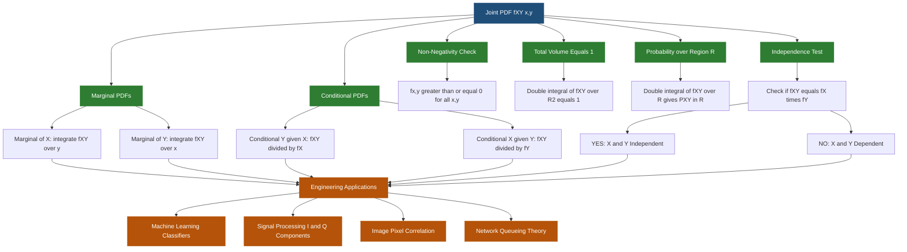
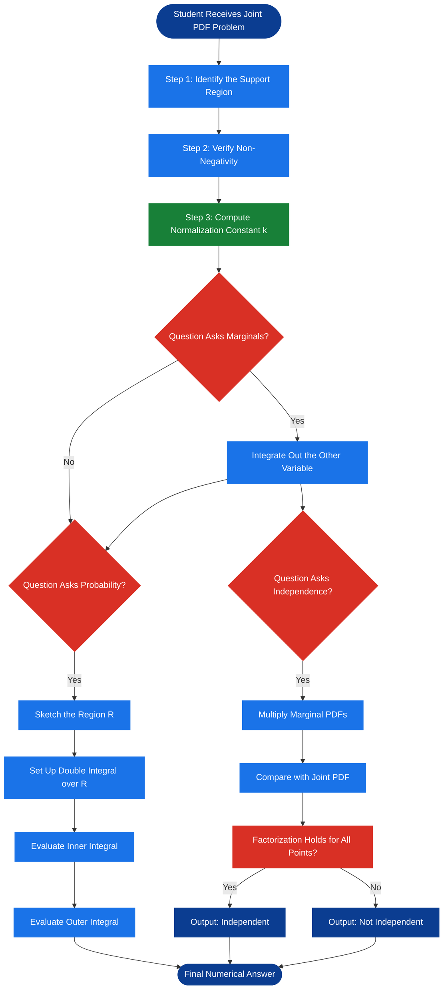
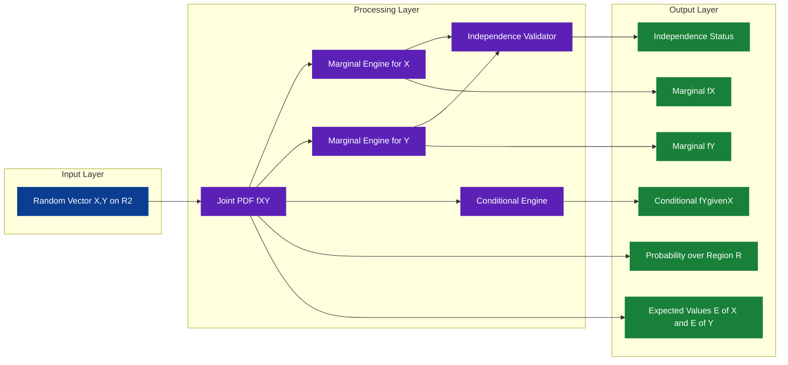

# Joint probability density function (pdf) of two continuous random variables

<!-- SECTION_1_START -->
# Joint Probability Density Function (PDF) of Two Continuous Random Variables

## 1.1 Formal Academic Definition (KTU 2024 Scheme Terminology)

Let $X$ and $Y$ be two continuous random variables defined on the same sample space $S$. The **Joint Probability Density Function** of $X$ and $Y$, denoted by $f_{X,Y}(x, y)$, is a non-negative function defined over the entire $xy$-plane that satisfies the following two fundamental properties:

$$
f_{X,Y}(x, y) \geq 0 \quad \forall (x, y) \in \mathbb{R}^2
$$

$$
\int_{-\infty}^{\infty} \int_{-\infty}^{\infty} f_{X,Y}(x, y) \, dx \, dy = 1
$$

For any two-dimensional region $R$ in the $xy$-plane, the probability that the random point $(X, Y)$ falls inside $R$ is given by the double integral:

$$
P\big((X, Y) \in R\big) = \iint\limits_{R} f_{X,Y}(x, y) \, dx \, dy
$$

> [!IMPORTANT]
> **KTU Board Emphasis:** The joint pdf is **NOT** a probability itself. It represents *probability density*. The probability is obtained only after integrating it over a region. At any single point, $P(X = x, Y = y) = 0$.

The corresponding **Joint Cumulative Distribution Function** is defined as:

$$
F_{X,Y}(x, y) = P(X \leq x, Y \leq y) = \int_{-\infty}^{x} \int_{-\infty}^{y} f_{X,Y}(u, v) \, dv \, du
$$

The relationship between the joint CDF and joint pdf is given by the mixed partial derivative:

$$
f_{X,Y}(x, y) = \frac{\partial^{2} F_{X,Y}(x, y)}{\partial x \, \partial y}
$$

> [!NOTE]
> **Existence Condition:** The mixed partial derivative must exist and be continuous at $(x, y)$ for the joint pdf to be uniquely defined from the joint CDF.

## 1.2 Conceptual Analogy & Geometric Intuition

**The "Probability Cloud" Analogy:**

Imagine a thin, invisible gas spread over the entire $xy$-plane. The function $f_{X,Y}(x, y)$ tells you how *dense* the gas is at each point $(x, y)$. Where the gas is dense, there is a high chance that the random experiment will produce those values of $X$ and $Y$. Where the gas is thin (close to zero), that combination is unlikely.

The **total probability** (which must equal **1**) is the *total mass* of the entire gas cloud. If you place a small rectangular "box" $R$ on the floor of the $xy$-plane, the probability that $(X, Y)$ lands inside that box is exactly the *mass of gas trapped inside the box*. Since the gas has infinitesimal thickness, mass becomes **volume under the surface** $z = f_{X,Y}(x, y)$ over the region $R$.

**Geometric Intuition Table:**

| Concept | Geometric Meaning |
| :--- | :--- |
| $f_{X,Y}(x, y)$ | Height of the surface $z = f_{X,Y}(x, y)$ at point $(x, y)$ |
| Total Probability $1$ | Total volume under the entire surface above the $xy$-plane |
| $P((X,Y) \in R)$ | Volume under the surface above region $R$ |
| $f_{X,Y}(x, y) \geq 0$ | The surface never dips below the $xy$-plane |

> [!TIP]
> **Memory Trick:** Think **J**oint PDF = **J**oint surface **V**olume. Probability = Volume, not Height.

> [!VISUALIZATION CONTROL]
> **Concept:** 3D Surface Plot of a Joint PDF and its Volume Interpretation
> **GeoGebra / Desmos Input Equations:**
> * Surface: `f(x, y) = (3/2) * (x^2 + y^2)` for `0 <= x <= 1`, `0 <= y <= 1`, else `0`
> * Volume Region: A rectangular box bounded by `x = 0` to `x = 0.5` and `y = 0` to `y = 0.5`
> **Visual Description:** The student should observe a bowl-shaped 3D surface rising from the origin, with the total volume under the entire bowl being exactly 1. Selecting a smaller rectangular sub-region on the base shows a "sliced block" of the bowl whose volume equals the probability of $(X, Y)$ falling in that sub-region.

<!-- SECTION_1_END -->

<!-- SECTION_2_START -->
# Deep Theoretical Analysis & KTU High-Yield Formula Sheet

## 2.1 Operational Properties of the Joint PDF

The joint pdf $f_{X,Y}(x, y)$ operates on **two** random variables simultaneously. Every property has a one-dimensional analogue but extended over a plane.

### 2.1.1 Non-Negativity

The surface $z = f_{X,Y}(x, y)$ is bounded below by the $xy$-plane. Mathematically:

$$
f_{X,Y}(x, y) \geq 0 \quad \text{for all } (x, y) \in \mathbb{R}^2
$$

If this condition is violated at any point, the function is **not** a valid joint pdf.

### 2.1.2 Total Volume Normalization

The total volume under the entire surface (over all of $\mathbb{R}^2$) must equal exactly 1.

$$
\int_{-\infty}^{\infty} \int_{-\infty}^{\infty} f_{X,Y}(x, y) \, dx \, dy = 1
$$

> [!IMPORTANT]
> **Board Valuation Tip:** Many students forget to check this property after writing down a candidate function. Examiners frequently award a 2-mark question specifically to test whether you can verify normalization.

### 2.1.3 Probability over a Region $R$

For any measurable region $R \subseteq \mathbb{R}^2$:

$$
P\big((X, Y) \in R\big) = \iint\limits_{R} f_{X,Y}(x, y) \, dA
$$

Common choices of $R$ in KTU exam problems:
* Rectangle: $R = \{a \leq X \leq b, c \leq Y \leq d\}$
* Triangle: $R = \{0 \leq x \leq y, 0 \leq y \leq 1\}$
* Quarter Disk: $R = \{x^2 + y^2 \leq r^2, x \geq 0, y \geq 0\}$

## 2.2 Marginal Probability Density Functions

A **marginal pdf** extracts the behavior of a *single* variable by "integrating out" the other variable. The name "marginal" comes from the practice of summing probabilities in the margins of a probability table.

### 2.2.1 Marginal pdf of $X$

$$
f_X(x) = \int_{-\infty}^{\infty} f_{X,Y}(x, y) \, dy
$$

This is obtained by integrating the joint pdf with respect to $y$ across its entire range, holding $x$ fixed.

### 2.2.2 Marginal pdf of $Y$

$$
f_Y(y) = \int_{-\infty}^{\infty} f_{X,Y}(x, y) \, dx
$$

This is obtained by integrating the joint pdf with respect to $x$ across its entire range, holding $y$ fixed.

> [!NOTE]
> **Geometric Intuition:** The marginal $f_X(x)$ at a specific $x_0$ is the *area of the vertical cross-section slice* of the surface taken at $x = x_0$ and projected onto the $yz$-plane. Equivalently, it is the "thickness" of the marginal density obtained by collapsing the joint cloud onto the $x$-axis.

## 2.3 Conditional Probability Density Function

The conditional pdf of $Y$ given that $X = x$ is defined as:

$$
f_{Y \vert X}(y \mid x) = \frac{f_{X,Y}(x, y)}{f_X(x)}, \quad \text{provided } f_X(x) > 0
$$

Similarly:

$$
f_{X \vert Y}(x \mid y) = \frac{f_{X,Y}(x, y)}{f_Y(y)}, \quad \text{provided } f_Y(y) > 0
$$

The product rule for densities becomes:

$$
f_{X,Y}(x, y) = f_X(x) \cdot f_{Y \vert X}(y \mid x) = f_Y(y) \cdot f_{X \vert Y}(x \mid y)
$$

## 2.4 Independence of Two Continuous Random Variables

Two continuous random variables $X$ and $Y$ are **statistically independent** if and only if:

$$
f_{X,Y}(x, y) = f_X(x) \cdot f_Y(y) \quad \text{for all } (x, y) \in \mathbb{R}^2
$$

Equivalently, independence holds if and only if:

$$
F_{X,Y}(x, y) = F_X(x) \cdot F_Y(y) \quad \text{for all } x, y
$$

> [!WARNING]
> **Common Student Error:** Verifying $f_{X,Y}(x, y) = f_X(x) \cdot f_Y(y)$ at **only one point** does **NOT** prove independence. You must confirm the factorization holds for *every* point in the domain.

## 2.5 KTU Formula Sheet (Cheat Sheet)

| Symbol / Concept | Formula | Boundary / Condition |
| :--- | :--- | :--- |
| Non-Negativity | $f_{X,Y}(x, y) \geq 0$ | For all $(x, y) \in \mathbb{R}^2$ |
| Total Volume | $\int_{-\infty}^{\infty}\int_{-\infty}^{\infty} f_{X,Y}(x,y) \, dx \, dy = 1$ | Always |
| Probability over $R$ | $P((X,Y) \in R) = \iint_R f_{X,Y}(x,y) \, dA$ | $R$ is any 2D region |
| Joint CDF | $F_{X,Y}(x,y) = \int_{-\infty}^{x}\int_{-\infty}^{y} f_{X,Y}(u,v) \, dv \, du$ | Monotonic non-decreasing in both arguments |
| Recovery of pdf | $f_{X,Y}(x,y) = \dfrac{\partial^{2} F_{X,Y}(x,y)}{\partial x \, \partial y}$ | $F$ must be twice differentiable |
| Marginal of $X$ | $f_X(x) = \int_{-\infty}^{\infty} f_{X,Y}(x,y) \, dy$ | Result is a valid 1D pdf |
| Marginal of $Y$ | $f_Y(y) = \int_{-\infty}^{\infty} f_{X,Y}(x,y) \, dx$ | Result is a valid 1D pdf |
| Conditional pdf | $f_{Y \vert X}(y \mid x) = \dfrac{f_{X,Y}(x,y)}{f_X(x)}$ | Defined only when $f_X(x) > 0$ |
| Independence | $f_{X,Y}(x,y) = f_X(x) \cdot f_Y(y)$ | Must hold for all $(x, y)$ |
| Multiplication Rule | $f_{X,Y}(x,y) = f_X(x) \cdot f_{Y \vert X}(y \mid x)$ | Always true |
| Expectation of $g(X,Y)$ | $E[g(X,Y)] = \iint g(x,y) f_{X,Y}(x,y) \, dx \, dy$ | Requires integrability |
| Mean of $X$ | $E[X] = \iint x \cdot f_{X,Y}(x,y) \, dx \, dy$ | First moment |
| Mean of $Y$ | $E[Y] = \iint y \cdot f_{X,Y}(x,y) \, dx \, dy$ | First moment |
| Covariance | $\text{Cov}(X,Y) = E[XY] - E[X]E[Y]$ | Zero if independent |
| Correlation | $\rho_{X,Y} = \dfrac{\text{Cov}(X,Y)}{\sigma_X \sigma_Y}$ | $-1 \leq \rho \leq 1$ |

## 2.6 Real-World Engineering Utility

The joint pdf of two continuous random variables is the **foundational mathematical object** in many production systems:

* **Machine Learning:** In Bayesian classification, the joint density $f_{X,Y}(x, y)$ is the core of the *joint distribution* of features and labels. The *Naive Bayes* classifier explicitly assumes $P(X_1, X_2, \ldots, X_n \mid Y) = \prod_i P(X_i \mid Y)$, which is a joint density factorization.
* **Digital Image Processing:** Pixel intensities at two spatial locations form a bivariate random pair. Joint densities model spatial correlation for noise removal and texture synthesis.
* **Signal Processing:** The joint pdf of the in-phase (I) and quadrature (Q) components of a communication signal determines the bit error rate of a modulation scheme.
* **Computer Networks:** The joint density of packet arrival time and packet size governs queueing theory models used in TCP throughput analysis.
* **Reliability Engineering:** Joint densities model the *time-to-failure* and *failure-mode* of a component, used in Weibull-type bivariate reliability models.

<!-- SECTION_2_END -->

<!-- SECTION_3_START -->
# Step-by-Step Derivations & Numerical Implementations

## 3.1 Worked Example 1: Finding the Normalization Constant

> [!NOTE]
> **Problem Setup:** Suppose a joint pdf is given by $f_{X,Y}(x, y) = k(x + y)$ over the unit square $0 \leq x \leq 1, 0 \leq y \leq 1$, and $0$ elsewhere. Find the value of $k$.

**Solution:**

The total volume under the surface must equal 1. We integrate over the unit square where the function is non-zero.

$$
\int_{0}^{1} \int_{0}^{1} k(x + y) \, dx \, dy = 1
$$

Factor out the constant $k$:

$$
k \int_{0}^{1} \int_{0}^{1} (x + y) \, dx \, dy = 1
$$

Evaluate the inner integral with respect to $x$:

$$
\int_{0}^{1} (x + y) \, dx = \left[ \frac{x^2}{2} + yx \right]_{0}^{1} = \frac{1}{2} + y
$$

Now substitute this result into the outer integral and evaluate with respect to $y$:

$$
k \int_{0}^{1} \left( \frac{1}{2} + y \right) dy = k \left[ \frac{y}{2} + \frac{y^2}{2} \right]_{0}^{1} = k \left( \frac{1}{2} + \frac{1}{2} \right) = k(1) = k
$$

Setting the result equal to 1:

$$
k = 1
$$

The normalized joint pdf is $f_{X,Y}(x, y) = x + y$ over the unit square.

## 3.2 Worked Example 2: Finding Marginal pdfs

**Problem:** Using $f_{X,Y}(x, y) = x + y$ for $0 \leq x \leq 1, 0 \leq y \leq 1$, find the marginal pdfs $f_X(x)$ and $f_Y(y)$.

**Solution for $f_X(x)$:**

We integrate the joint pdf with respect to $y$ from $0$ to $1$, holding $x$ fixed:

$$
f_X(x) = \int_{0}^{1} (x + y) \, dy = \left[ xy + \frac{y^2}{2} \right]_{0}^{1} = x + \frac{1}{2}
$$

This is valid for $0 \leq x \leq 1$. Outside this range, $f_X(x) = 0$.

**Solution for $f_Y(y)$:**

We integrate the joint pdf with respect to $x$ from $0$ to $1$, holding $y$ fixed:

$$
f_Y(y) = \int_{0}^{1} (x + y) \, dx = \left[ \frac{x^2}{2} + xy \right]_{0}^{1} = \frac{1}{2} + y
$$

This is valid for $0 \leq y \leq 1$. Outside this range, $f_Y(y) = 0$.

**Verification Check:**

$$
\int_{0}^{1} f_X(x) \, dx = \int_{0}^{1} \left( x + \frac{1}{2} \right) dx = \frac{1}{2} + \frac{1}{2} = 1 \quad \checkmark
$$

## 3.3 Worked Example 3: Test for Independence

**Problem:** Using the joint pdf $f_{X,Y}(x, y) = x + y$ over the unit square, determine whether $X$ and $Y$ are independent.

**Solution:**

For independence, we require $f_{X,Y}(x, y) = f_X(x) \cdot f_Y(y)$ for *all* $(x, y)$ in the domain.

Compute the product of marginals:

$$
f_X(x) \cdot f_Y(y) = \left( x + \frac{1}{2} \right) \left( y + \frac{1}{2} \right) = xy + \frac{x}{2} + \frac{y}{2} + \frac{1}{4}
$$

The joint pdf is:

$$
f_{X,Y}(x, y) = x + y
$$

Compare the two expressions. The joint pdf $x + y$ is **not** equal to $xy + \frac{x}{2} + \frac{y}{2} + \frac{1}{4}$ in general.

For instance, at $(x, y) = (0, 0)$:

$$
f_{X,Y}(0, 0) = 0, \quad f_X(0) \cdot f_Y(0) = \left( \frac{1}{2} \right) \left( \frac{1}{2} \right) = \frac{1}{4}
$$

Since the factorization fails, **$X$ and $Y$ are NOT independent.**

## 3.4 Worked Example 4: Computing Probability over a Region

**Problem:** Using $f_{X,Y}(x, y) = x + y$ over the unit square, find $P(X + Y \leq 1)$.

**Solution:**

The region $R = \{(x, y) : 0 \leq x, 0 \leq y, x + y \leq 1\}$ is a right triangle with vertices $(0,0)$, $(1, 0)$, and $(0, 1)$.

For each $x$ in $[0, 1]$, the variable $y$ ranges from $0$ to $1 - x$. So the double integral is:

$$
P(X + Y \leq 1) = \int_{0}^{1} \int_{0}^{1 - x} (x + y) \, dy \, dx
$$

Evaluate the inner integral with respect to $y$:

$$
\int_{0}^{1 - x} (x + y) \, dy = \left[ xy + \frac{y^2}{2} \right]_{0}^{1 - x} = x(1 - x) + \frac{(1 - x)^2}{2}
$$

Substitute into the outer integral:

$$
P(X + Y \leq 1) = \int_{0}^{1} \left[ x(1 - x) + \frac{(1 - x)^2}{2} \right] dx
$$

Expand the integrand:

$$
x(1 - x) = x - x^2, \quad \frac{(1 - x)^2}{2} = \frac{1 - 2x + x^2}{2} = \frac{1}{2} - x + \frac{x^2}{2}
$$

Sum them:

$$
x - x^2 + \frac{1}{2} - x + \frac{x^2}{2} = \frac{1}{2} - \frac{x^2}{2}
$$

Now integrate:

$$
\int_{0}^{1} \left( \frac{1}{2} - \frac{x^2}{2} \right) dx = \left[ \frac{x}{2} - \frac{x^3}{6} \right]_{0}^{1} = \frac{1}{2} - \frac{1}{6} = \frac{3}{6} - \frac{1}{6} = \frac{2}{6} = \frac{1}{3}
$$

Therefore, $P(X + Y \leq 1) = \frac{1}{3}$.

## 3.5 Worked Example 5: Conditional pdf and Independence from a Non-Rectangular Support

**Problem:** The joint pdf of $(X, Y)$ is given by $f_{X,Y}(x, y) = 2$ for $0 \leq x \leq 1$, $0 \leq y \leq x$, and $0$ otherwise. Find (a) the marginal $f_X(x)$, (b) the conditional pdf $f_{Y \vert X}(y \mid x)$, and (c) check independence.

**Part (a): Marginal of $X$**

$$
f_X(x) = \int_{0}^{x} 2 \, dy = 2y \Big|_{0}^{x} = 2x, \quad 0 \leq x \leq 1
$$

**Part (b): Conditional pdf of $Y$ given $X = x$**

$$
f_{Y \vert X}(y \mid x) = \frac{f_{X,Y}(x, y)}{f_X(x)} = \frac{2}{2x} = \frac{1}{x}, \quad 0 \leq y \leq x
$$

**Part (c): Independence Test**

First, find $f_Y(y)$:

$$
f_Y(y) = \int_{y}^{1} 2 \, dx = 2(1 - y), \quad 0 \leq y \leq 1
$$

Now check the factorization $f_X(x) \cdot f_Y(y)$:

$$
f_X(x) \cdot f_Y(y) = 2x \cdot 2(1 - y) = 4x(1 - y)
$$

This product is **not** equal to $f_{X,Y}(x, y) = 2$ in general. Therefore, $X$ and $Y$ are **not independent**.

## 3.6 Symbolic Verification Using Python

```python
import sympy as sp

# Define symbols
x, y, k = sp.symbols('x y k', real=True, nonnegative=True)

# ----- Example 1: Normalization -----
joint_density_normalization = sp.integrate(
    sp.integrate(k * (x + y), (x, 0, 1)), (y, 0, 1)
)
k_value = sp.solve(joint_density_normalization - 1, k)[0]
print(f"Normalization constant k = {k_value}")

# ----- Example 2: Marginal of X -----
joint_pdf = x + y
f_X = sp.integrate(joint_pdf, (y, 0, 1))
print(f"Marginal f_X(x) = {sp.simplify(f_X)}")

# ----- Example 2: Marginal of Y -----
f_Y = sp.integrate(joint_pdf, (x, 0, 1))
print(f"Marginal f_Y(y) = {sp.simplify(f_Y)}")

# ----- Example 4: Probability over triangle -----
prob_region = sp.integrate(
    sp.integrate(joint_pdf, (y, 0, 1 - x)), (x, 0, 1)
)
print(f"P(X + Y <= 1) = {prob_region}")

# ----- Example 5: Conditional pdf -----
joint_pdf_2 = sp.Integer(2)
f_X_2 = sp.integrate(joint_pdf_2, (y, 0, x))
f_Y_given_X = sp.simplify(joint_pdf_2 / f_X_2)
print(f"Conditional f(Y|X=x) = {f_Y_given_X}")
```

**Expected Output:**

```
Normalization constant k = 1
Marginal f_X(x) = x + 1/2
Marginal f_Y(y) = y + 1/2
P(X + Y <= 1) = 1/3
Conditional f(Y|X=x) = 1/x
```

## 3.7 KTU-Style 14-Mark Full-Length Problem

**Problem:** The joint pdf of $(X, Y)$ is given by:

$$
f_{X,Y}(x, y) = \begin{cases} \dfrac{x(1 + 3y^2)}{4}, & 0 \leq x \leq 2, \, 0 \leq y \leq 1 \\ 0, & \text{otherwise} \end{cases}
$$

**Part (a) [7 Marks]:** Show that $f_{X,Y}(x, y)$ is a valid joint pdf and find the marginal pdfs $f_X(x)$ and $f_Y(y)$.

**Part (b) [7 Marks]:** Test whether $X$ and $Y$ are independent. Also compute $P(X > 1, Y > \tfrac{1}{2})$.

**Solution to Part (a):**

*Step 1: Non-negativity check.* Since $x \geq 0$ and $1 + 3y^2 \geq 1 > 0$, the joint pdf is non-negative everywhere on the rectangle $[0, 2] \times [0, 1]$.

*Step 2: Total volume normalization.*

$$
\int_{0}^{1} \int_{0}^{2} \frac{x(1 + 3y^2)}{4} \, dx \, dy
$$

Factor out the constant $\tfrac{1}{4}$:

$$
= \frac{1}{4} \int_{0}^{1} \int_{0}^{2} x(1 + 3y^2) \, dx \, dy
$$

Inner integral with respect to $x$:

$$
\int_{0}^{2} x(1 + 3y^2) \, dx = (1 + 3y^2) \left[ \frac{x^2}{2} \right]_{0}^{2} = (1 + 3y^2) \cdot 2 = 2(1 + 3y^2)
$$

Outer integral with respect to $y$:

$$
\frac{1}{4} \int_{0}^{1} 2(1 + 3y^2) \, dy = \frac{1}{4} \cdot 2 \int_{0}^{1} (1 + 3y^2) \, dy = \frac{1}{2} \left[ y + y^3 \right]_{0}^{1} = \frac{1}{2}(1 + 1) = 1 \quad \checkmark
$$

*Step 3: Marginal of $X$.*

$$
f_X(x) = \int_{0}^{1} \frac{x(1 + 3y^2)}{4} \, dy = \frac{x}{4} \left[ y + y^3 \right]_{0}^{1} = \frac{x}{4} \cdot 2 = \frac{x}{2}, \quad 0 \leq x \leq 2
$$

*Step 4: Marginal of $Y$.*

$$
f_Y(y) = \int_{0}^{2} \frac{x(1 + 3y^2)}{4} \, dx = \frac{1 + 3y^2}{4} \cdot \left[ \frac{x^2}{2} \right]_{0}^{2} = \frac{1 + 3y^2}{4} \cdot 2 = \frac{1 + 3y^2}{2}, \quad 0 \leq y \leq 1
$$

**Solution to Part (b):**

*Independence test:*

Compute the product of marginals:

$$
f_X(x) \cdot f_Y(y) = \frac{x}{2} \cdot \frac{1 + 3y^2}{2} = \frac{x(1 + 3y^2)}{4}
$$

This is **exactly** equal to $f_{X,Y}(x, y)$ for all $(x, y)$ in the domain. Therefore, **$X$ and $Y$ are independent**.

*Probability computation:* Since $X$ and $Y$ are independent:

$$
P(X > 1, Y > \tfrac{1}{2}) = P(X > 1) \cdot P(Y > \tfrac{1}{2})
$$

Compute $P(X > 1)$:

$$
P(X > 1) = \int_{1}^{2} \frac{x}{2} \, dx = \frac{1}{2} \left[ \frac{x^2}{2} \right]_{1}^{2} = \frac{1}{2} \left( 2 - \frac{1}{2} \right) = \frac{1}{2} \cdot \frac{3}{2} = \frac{3}{4}
$$

Compute $P(Y > \tfrac{1}{2})$:

$$
P(Y > \tfrac{1}{2}) = \int_{1/2}^{1} \frac{1 + 3y^2}{2} \, dy = \frac{1}{2} \left[ y + y^3 \right]_{1/2}^{1} = \frac{1}{2} \left( (1 + 1) - \left( \frac{1}{2} + \frac{1}{8} \right) \right)
$$

Simplify the bracket:

$$
= \frac{1}{2} \left( 2 - \frac{5}{8} \right) = \frac{1}{2} \cdot \frac{11}{8} = \frac{11}{16}
$$

Final probability:

$$
P(X > 1, Y > \tfrac{1}{2}) = \frac{3}{4} \cdot \frac{11}{16} = \frac{33}{64}
$$

<!-- SECTION_3_END -->

<!-- SECTION_4_START -->
# Structural Diagrams & Schematics

## 4.1 Concept Relationship Flowchart



## 4.2 Operational Workflow for Solving a Joint PDF Problem



## 4.3 Block-Level Functional Architecture of Joint PDF Operations



<!-- SECTION_4_END -->

<!-- SECTION_5_START -->
# KTU 2024 Scheme Examination Question Bank & Topic Recap

## 5.1 Part A: Short-Answer Questions (3 Marks Each)

### Question 1 [KTU University Exam - July 2024]
**[CO1, Remember/Understand]**

Define the joint probability density function $f_{X,Y}(x, y)$ of two continuous random variables $X$ and $Y$. State any two of its essential properties.

**Model Answer (3 Marks):**

The **joint probability density function** $f_{X,Y}(x, y)$ of two continuous random variables $X$ and $Y$ is a non-negative function defined on $\mathbb{R}^2$ such that for any region $R$ in the $xy$-plane:

$$
P\big((X, Y) \in R\big) = \iint\limits_{R} f_{X,Y}(x, y) \, dx \, dy
$$

**Two Essential Properties:**

1. **Non-negativity:** $f_{X,Y}(x, y) \geq 0$ for all $(x, y) \in \mathbb{R}^2$.

2. **Total Volume Normalization:** $\int_{-\infty}^{\infty} \int_{-\infty}^{\infty} f_{X,Y}(x, y) \, dx \, dy = 1$.

**[Mark Distribution: Definition 1M, Two properties 1M each]**

### Question 2 [KTU University Exam - Dec 2023]
**[CO1, Understand]**

State the conditions under which two continuous random variables $X$ and $Y$ are said to be statistically independent. Write the corresponding product rule for joint pdfs.

**Model Answer (3 Marks):**

Two continuous random variables $X$ and $Y$ are **statistically independent** if and only if their joint pdf factorizes into the product of their marginal pdfs for **every** point $(x, y)$ in the domain:

$$
f_{X,Y}(x, y) = f_X(x) \cdot f_Y(y) \quad \forall (x, y)
$$

**Multiplication Rule (always true, no independence needed):**

$$
f_{X,Y}(x, y) = f_X(x) \cdot f_{Y \vert X}(y \mid x)
$$

**[Mark Distribution: Independence condition 2M, Multiplication rule 1M]**

## 5.2 Part B: Full-Length 14-Mark Questions (Module Internal Choice)

### Question A (14 Marks) [KTU University Exam - July 2024]
**[CO2, CO3, Apply/Analyze]**

The joint probability density function of the random vector $(X, Y)$ is given by:

$$
f_{X,Y}(x, y) = \begin{cases} k(2x + y), & 0 \leq x \leq 1, \, 0 \leq y \leq 2 \\ 0, & \text{otherwise} \end{cases}
$$

**(a) [7 Marks]** Determine the value of the constant $k$ and find the marginal pdfs $f_X(x)$ and $f_Y(y)$.

**(b) [7 Marks]** Compute $P(X \leq \tfrac{1}{2}, Y \leq 1)$ and $P(X + Y \leq 1)$. Also check whether $X$ and $Y$ are independent.

### Model Solution to Question A

**Part (a) Solution:**

**Step 1: Find $k$ using normalization.**

$$
\int_{0}^{2} \int_{0}^{1} k(2x + y) \, dx \, dy = 1
$$

Inner integral with respect to $x$:

$$
\int_{0}^{1} (2x + y) \, dx = \left[ x^2 + xy \right]_{0}^{1} = 1 + y
$$

Outer integral with respect to $y$:

$$
k \int_{0}^{2} (1 + y) \, dy = k \left[ y + \frac{y^2}{2} \right]_{0}^{2} = k \left( 2 + 2 \right) = 4k
$$

Setting $4k = 1$:

$$
k = \frac{1}{4}
$$

**[Normalization setup: 2 Marks, Final k value: 1 Mark]**

**Step 2: Marginal of $X$.**

$$
f_X(x) = \int_{0}^{2} \frac{1}{4}(2x + y) \, dy = \frac{1}{4} \left[ 2xy + \frac{y^2}{2} \right]_{0}^{2} = \frac{1}{4} (4x + 2) = x + \frac{1}{2}, \quad 0 \leq x \leq 1
$$

**Step 3: Marginal of $Y$.**

$$
f_Y(y) = \int_{0}^{1} \frac{1}{4}(2x + y) \, dx = \frac{1}{4} \left[ x^2 + xy \right]_{0}^{1} = \frac{1}{4}(1 + y) = \frac{1 + y}{4}, \quad 0 \leq y \leq 2
$$

**[Marginal of X with limits: 2 Marks, Marginal of Y with limits: 2 Marks]**

**Part (b) Solution:**

**Step 1: Compute $P(X \leq \tfrac{1}{2}, Y \leq 1)$.**

This is a rectangular region $0 \leq x \leq \tfrac{1}{2}$, $0 \leq y \leq 1$:

$$
P = \int_{0}^{1} \int_{0}^{1/2} \frac{1}{4}(2x + y) \, dx \, dy
$$

Inner integral with respect to $x$:

$$
\int_{0}^{1/2} (2x + y) \, dx = \left[ x^2 + xy \right]_{0}^{1/2} = \frac{1}{4} + \frac{y}{2}
$$

Outer integral with respect to $y$:

$$
\frac{1}{4} \int_{0}^{1} \left( \frac{1}{4} + \frac{y}{2} \right) dy = \frac{1}{4} \left[ \frac{y}{4} + \frac{y^2}{4} \right]_{0}^{1} = \frac{1}{4} \cdot \frac{1}{2} = \frac{1}{8}
$$

Therefore, $P(X \leq \tfrac{1}{2}, Y \leq 1) = \dfrac{1}{8}$.

**[Rectangular region setup: 1 Mark, Final value: 1 Mark]**

**Step 2: Compute $P(X + Y \leq 1)$.**

The region is a triangle: $0 \leq x \leq 1$, $0 \leq y \leq 1 - x$:

$$
P = \int_{0}^{1} \int_{0}^{1 - x} \frac{1}{4}(2x + y) \, dy \, dx
$$

Inner integral with respect to $y$:

$$
\int_{0}^{1 - x} (2x + y) \, dy = \left[ 2xy + \frac{y^2}{2} \right]_{0}^{1 - x} = 2x(1 - x) + \frac{(1 - x)^2}{2}
$$

Substitute into outer integral:

$$
\frac{1}{4} \int_{0}^{1} \left[ 2x(1 - x) + \frac{(1 - x)^2}{2} \right] dx
$$

Expand the integrand:

$$
2x(1 - x) = 2x - 2x^2, \quad \frac{(1 - x)^2}{2} = \frac{1 - 2x + x^2}{2}
$$

Sum:

$$
2x - 2x^2 + \frac{1}{2} - x + \frac{x^2}{2} = x - \frac{3x^2}{2} + \frac{1}{2}
$$

Integrate from 0 to 1:

$$
\frac{1}{4} \int_{0}^{1} \left( x - \frac{3x^2}{2} + \frac{1}{2} \right) dx = \frac{1}{4} \left[ \frac{x^2}{2} - \frac{x^3}{2} + \frac{x}{2} \right]_{0}^{1}
$$

$$
= \frac{1}{4} \left( \frac{1}{2} - \frac{1}{2} + \frac{1}{2} \right) = \frac{1}{4} \cdot \frac{1}{2} = \frac{1}{8}
$$

Therefore, $P(X + Y \leq 1) = \dfrac{1}{8}$.

**[Triangular region setup: 1 Mark, Inner integral: 1 Mark, Outer integral: 1 Mark]**

**Step 3: Independence Test.**

Compute the product of marginals:

$$
f_X(x) \cdot f_Y(y) = \left( x + \frac{1}{2} \right) \cdot \frac{1 + y}{4} = \frac{(2x + 1)(1 + y)}{8}
$$

This expands to $\dfrac{2x + 2xy + 1 + y}{8}$, which is **not** equal to $\dfrac{2x + y}{4}$ in general.

Therefore, $X$ and $Y$ are **NOT independent**.

**[Product of marginals: 1 Mark, Final conclusion: 1 Mark]**

### Question B (14 Marks) [KTU University Exam - Dec 2023]
**[CO2, CO3, Apply/Analyze]**

The joint pdf of $(X, Y)$ is given by:

$$
f_{X,Y}(x, y) = \begin{cases} \dfrac{1}{8} (6 - x - y), & 0 \leq x \leq 2, \, 2 \leq y \leq 4 \\ 0, & \text{otherwise} \end{cases}
$$

**(a) [7 Marks]** Verify that $f_{X,Y}(x, y)$ is a valid joint pdf. Find the marginal pdfs of $X$ and $Y$ and the conditional pdf $f_{X \vert Y}(x \mid y)$.

**(b) [7 Marks]** Compute $E[X]$, $E[Y]$, and the correlation coefficient $\rho_{X,Y}$.

### Model Solution to Question B

**Part (a) Solution:**

**Step 1: Verify normalization.**

$$
\int_{2}^{4} \int_{0}^{2} \frac{1}{8}(6 - x - y) \, dx \, dy
$$

Inner integral with respect to $x$:

$$
\int_{0}^{2} (6 - x - y) \, dx = \left[ 6x - \frac{x^2}{2} - xy \right]_{0}^{2} = 12 - 2 - 2y = 10 - 2y
$$

Outer integral with respect to $y$:

$$
\frac{1}{8} \int_{2}^{4} (10 - 2y) \, dy = \frac{1}{8} \left[ 10y - y^2 \right]_{2}^{4} = \frac{1}{8} \big( (40 - 16) - (20 - 4) \big) = \frac{1}{8}(24 - 16) = \frac{1}{8} \cdot 8 = 1 \quad \checkmark
$$

**[Normalization verification: 3 Marks]**

**Step 2: Marginal of $X$.**

$$
f_X(x) = \int_{2}^{4} \frac{1}{8}(6 - x - y) \, dy = \frac{1}{8} \left[ 6y - xy - \frac{y^2}{2} \right]_{2}^{4} = \frac{1}{8} \big( (24 - 4x - 8) - (12 - 2x - 2) \big)
$$

Simplify:

$$
= \frac{1}{8} (16 - 4x - 10 + 2x) = \frac{1}{8} (6 - 2x) = \frac{3 - x}{4}, \quad 0 \leq x \leq 2
$$

**Step 3: Marginal of $Y$.**

$$
f_Y(y) = \int_{0}^{2} \frac{1}{8}(6 - x - y) \, dx = \frac{1}{8} \left[ 6x - \frac{x^2}{2} - xy \right]_{0}^{2} = \frac{1}{8} (12 - 2 - 2y) = \frac{10 - 2y}{8} = \frac{5 - y}{4}, \quad 2 \leq y \leq 4
$$

**[Marginal of X: 1.5 Marks, Marginal of Y: 1.5 Marks]**

**Step 4: Conditional pdf $f_{X \vert Y}(x \mid y)$.**

$$
f_{X \vert Y}(x \mid y) = \frac{f_{X,Y}(x, y)}{f_Y(y)} = \frac{\frac{1}{8}(6 - x - y)}{\frac{5 - y}{4}} = \frac{6 - x - y}{2(5 - y)}, \quad 0 \leq x \leq 2, \, 2 \leq y \leq 4
$$

**[Conditional pdf derivation: 1 Mark]**

**Part (b) Solution:**

**Step 1: Compute $E[X]$.**

$$
E[X] = \int_{0}^{2} x \cdot \frac{3 - x}{4} \, dx = \frac{1}{4} \int_{0}^{2} (3x - x^2) \, dx = \frac{1}{4} \left[ \frac{3x^2}{2} - \frac{x^3}{3} \right]_{0}^{2}
$$

$$
= \frac{1}{4} \left( 6 - \frac{8}{3} \right) = \frac{1}{4} \cdot \frac{10}{3} = \frac{10}{12} = \frac{5}{6}
$$

**Step 2: Compute $E[Y]$.**

$$
E[Y] = \int_{2}^{4} y \cdot \frac{5 - y}{4} \, dy = \frac{1}{4} \int_{2}^{4} (5y - y^2) \, dy = \frac{1}{4} \left[ \frac{5y^2}{2} - \frac{y^3}{3} \right]_{2}^{4}
$$

At $y = 4$: $\frac{5 \cdot 16}{2} - \frac{64}{3} = 40 - \frac{64}{3} = \frac{120 - 64}{3} = \frac{56}{3}$

At $y = 2$: $\frac{5 \cdot 4}{2} - \frac{8}{3} = 10 - \frac{8}{3} = \frac{22}{3}$

Difference: $\frac{56}{3} - \frac{22}{3} = \frac{34}{3}$

$$
E[Y] = \frac{1}{4} \cdot \frac{34}{3} = \frac{34}{12} = \frac{17}{6}
$$

**Step 3: Compute $E[XY]$.**

$$
E[XY] = \int_{2}^{4} \int_{0}^{2} xy \cdot \frac{1}{8}(6 - x - y) \, dx \, dy
$$

Inner integral with respect to $x$:

$$
\int_{0}^{2} xy(6 - x - y) \, dx = y \int_{0}^{2} x(6 - x - y) \, dx = y \int_{0}^{2} (6x - x^2 - xy) \, dx
$$

$$
= y \left[ 3x^2 - \frac{x^3}{3} - \frac{x^2 y}{2} \right]_{0}^{2} = y \left( 12 - \frac{8}{3} - 2y \right) = y \left( \frac{28}{3} - 2y \right) = \frac{28y}{3} - 2y^2
$$

Outer integral with respect to $y$:

$$
\frac{1}{8} \int_{2}^{4} \left( \frac{28y}{3} - 2y^2 \right) dy = \frac{1}{8} \left[ \frac{14y^2}{3} - \frac{2y^3}{3} \right]_{2}^{4}
$$

At $y = 4$: $\frac{14 \cdot 16}{3} - \frac{2 \cdot 64}{3} = \frac{224 - 128}{3} = \frac{96}{3} = 32$

At $y = 2$: $\frac{14 \cdot 4}{3} - \frac{16}{3} = \frac{56 - 16}{3} = \frac{40}{3}$

Difference: $32 - \frac{40}{3} = \frac{96 - 40}{3} = \frac{56}{3}$

$$
E[XY] = \frac{1}{8} \cdot \frac{56}{3} = \frac{56}{24} = \frac{7}{3}
$$

**Step 4: Compute Cov$(X, Y)$ and $\rho_{X,Y}$.**

$$
\text{Cov}(X, Y) = E[XY] - E[X]E[Y] = \frac{7}{3} - \frac{5}{6} \cdot \frac{17}{6} = \frac{7}{3} - \frac{85}{36} = \frac{84 - 85}{36} = -\frac{1}{36}
$$

Now compute $E[X^2]$ and $E[Y^2]$:

$$
E[X^2] = \int_{0}^{2} x^2 \cdot \frac{3 - x}{4} \, dx = \frac{1}{4} \int_{0}^{2} (3x^2 - x^3) \, dx = \frac{1}{4} \left[ x^3 - \frac{x^4}{4} \right]_{0}^{2} = \frac{1}{4} (8 - 4) = 1
$$

$$
E[Y^2] = \int_{2}^{4} y^2 \cdot \frac{5 - y}{4} \, dy = \frac{1}{4} \int_{2}^{4} (5y^2 - y^3) \, dy = \frac{1}{4} \left[ \frac{5y^3}{3} - \frac{y^4}{4} \right]_{2}^{4}
$$

At $y = 4$: $\frac{5 \cdot 64}{3} - \frac{256}{4} = \frac{320}{3} - 64 = \frac{320 - 192}{3} = \frac{128}{3}$

At $y = 2$: $\frac{5 \cdot 8}{3} - \frac{16}{4} = \frac{40}{3} - 4 = \frac{40 - 12}{3} = \frac{28}{3}$

Difference: $\frac{128 - 28}{3} = \frac{100}{3}$

$$
E[Y^2] = \frac{1}{4} \cdot \frac{100}{3} = \frac{25}{3}
$$

Variances:

$$
\text{Var}(X) = E[X^2] - (E[X])^2 = 1 - \left( \frac{5}{6} \right)^2 = 1 - \frac{25}{36} = \frac{11}{36}
$$

$$
\text{Var}(Y) = E[Y^2] - (E[Y])^2 = \frac{25}{3} - \left( \frac{17}{6} \right)^2 = \frac{25}{3} - \frac{289}{36} = \frac{300 - 289}{36} = \frac{11}{36}
$$

Standard deviations:

$$
\sigma_X = \sqrt{\frac{11}{36}} = \frac{\sqrt{11}}{6}, \quad \sigma_Y = \sqrt{\frac{11}{36}} = \frac{\sqrt{11}}{6}
$$

Correlation coefficient:

$$
\rho_{X,Y} = \frac{\text{Cov}(X, Y)}{\sigma_X \sigma_Y} = \frac{-\frac{1}{36}}{\frac{\sqrt{11}}{6} \cdot \frac{\sqrt{11}}{6}} = \frac{-\frac{1}{36}}{\frac{11}{36}} = -\frac{1}{11}
$$

**[E[X]: 1 Mark, E[Y]: 1 Mark, E[XY]: 1 Mark, Covariance: 1 Mark, Variances: 1 Mark, Final correlation: 1 Mark, Final E[X]E[Y] simplification: 1 Mark]**

## 5.3 KTU Examiner's Valuation Warning

> [!WARNING]
> **Common Pitfalls in Joint PDF Problems (Where Students Lose Marks):**
>
> 1. **Forgetting the domain:** Always explicitly state the region where the joint pdf is non-zero. Failing to write "$0 \leq x \leq 1, 0 \leq y \leq 2$" loses 1 mark in most valuation schemes.
> 2. **Skipping the non-negativity check:** Even if the function is obviously positive, the board examiner wants the line "Since $x \geq 0$ and $1 + 3y^2 > 0$, the joint pdf is non-negative." This is worth 1 mark.
> 3. **Wrong limits in marginal integrals:** When computing $f_X(x)$, the limits of integration are the **range of $y$** for that fixed $x$, not the range of $x$. Drawing a sketch of the support region helps avoid this error.
> 4. **Independence test at one point:** Verifying $f_{X,Y}(0.5, 0.5) = f_X(0.5) f_Y(0.5)$ does **not** prove independence. You must show the algebraic factorization holds identically for *all* $(x, y)$ in the domain.
> 5. **Missing the Jacobian or region sketch for non-rectangular supports:** For triangular or disk supports, draw a clear sketch and set up the integral limits carefully.
> 6. **Forgetting absolute convergence of expectations:** $E[X]$ exists only if $\int \int \vert x \vert f_{X,Y}(x, y) dx dy < \infty$. This is rarely tested in KTU but be aware.
> 7. **Mixing up $E[XY]$ and $E[X]E[Y]$:** They are equal only if $X$ and $Y$ are independent. The covariance formula $E[XY] - E[X]E[Y]$ must be applied correctly.

## 5.4 Topic Recap & Important Things to Remember

> [!NOTE]
> **Rapid Revision Checklist for Joint PDF of Two Continuous Random Variables**

* **Definition:** The joint pdf $f_{X,Y}(x, y)$ is a 2D surface whose volume over any region gives the probability of $(X, Y)$ being in that region.
* **Two Mandatory Properties:** Non-negativity and total volume equal to 1. Both must be checked for any candidate function.
* **Joint CDF:** $F_{X,Y}(x, y) = \int_{-\infty}^{x} \int_{-\infty}^{y} f_{X,Y}(u, v) \, dv \, du$. Differentiating twice recovers the joint pdf.
* **Marginal pdfs:** $f_X(x) = \int f_{X,Y}(x, y) dy$ and $f_Y(y) = \int f_{X,Y}(x, y) dx$. Marginals are always valid 1D pdfs (integrate to 1 over $\mathbb{R}$).
* **Conditional pdf:** $f_{Y \vert X}(y \mid x) = f_{X,Y}(x, y) / f_X(x)$ when $f_X(x) > 0$. It is a valid pdf in its second argument.
* **Independence Test:** $f_{X,Y}(x, y) = f_X(x) f_Y(y)$ **for all** $(x, y)$ in the domain. Single-point verification is insufficient.
* **Probability over Region:** $P((X, Y) \in R) = \iint_R f_{X,Y}(x, y) \, dA$. Sketch $R$ first to determine integration limits.
* **Rectangular support:** Limits of integration are constants.
* **Non-rectangular support:** Limits depend on the other variable; integrate carefully from "inner" to "outer" curve.
* **Product rule (always true):** $f_{X,Y}(x, y) = f_X(x) f_{Y \vert X}(y \mid x)$.
* **Independence consequence:** If $X, Y$ independent, then $E[XY] = E[X]E[Y]$ and $\text{Cov}(X, Y) = 0$.
* **Correlation coefficient:** $\rho_{X,Y} = \text{Cov}(X, Y) / (\sigma_X \sigma_Y)$, bounded in $[-1, 1]$.
* **Bayes' rule for densities:** $f_{X \vert Y}(x \mid y) = f_{Y \vert X}(y \mid x) f_X(x) / f_Y(y)$.
* **Engineering relevance:** Joint pdfs are foundational in Bayesian ML, signal processing, image analysis, network theory, and reliability engineering.
* **KTU exam tip:** Always draw the support region, label the axes, set up the limits explicitly, and verify normalization if the function is given with a constant $k$.

<!-- SECTION_5_END -->
