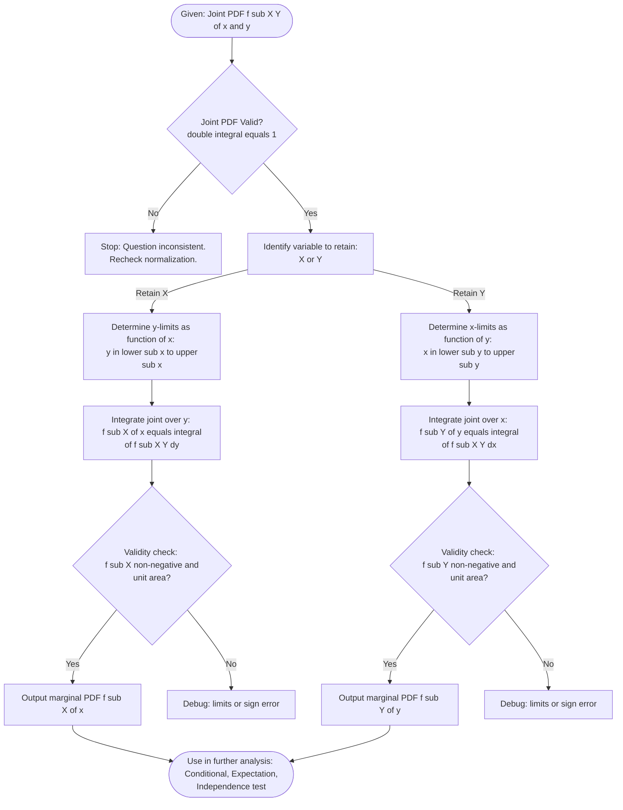
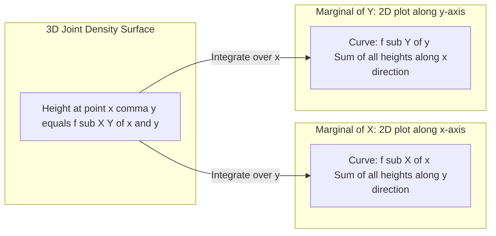

# Marginal pdf

<!-- SECTION_1_START -->
# Marginal Probability Density Function (Marginal PDF)

> [!IMPORTANT]
> **KTU 2024 Scheme | GAMAT301 | Module 2 – Continuous Random Variables**
> This is a foundational building block for Module 2 and directly feeds into Module 3 (Expectation, Covariance & Correlation). Master this topic to score guaranteed marks in ESE questions.

## 1.1 Formal Academic Definition

Let $(X, Y)$ be a two-dimensional **continuous random vector** defined over the sample space $\Omega \subseteq \mathbb{R}^2$ with **joint probability density function** $f_{X,Y}(x, y)$. The **marginal probability density function** of $X$, denoted $f_X(x)$, is obtained by integrating the joint pdf over the entire range of the other variable $Y$:

$$f_X(x) = \int_{-\infty}^{\infty} f_{X,Y}(x, y) \, dy$$

Similarly, the **marginal probability density function** of $Y$ is given by:

$$f_Y(y) = \int_{-\infty}^{\infty} f_{X,Y}(x, y) \, dx$$

> [!NOTE]
> **Geometric Intuition of "Marginal"**
> The term *marginal* comes from the historical practice of writing the sum (or integral) of joint frequencies in the **margins** of a contingency table. When the joint distribution is a surface over the $xy$-plane, integrating along one axis (say $y$) "collapses" or "projects" the volume onto the other axis ($x$), giving the density of $X$ alone. Physically, $f_X(x)$ represents the total probability mass "sliced" out of the joint density at the vertical line $X = x$.

## 1.2 Real-World Analogy

> [!TIP]
> **Analogy – The Sand Pile on a Table**
> Imagine a 3-D sand pile resting on a rectangular table. The height of the sand at point $(x, y)$ is given by the joint pdf $f_{X,Y}(x, y)$.
> - The **total mass of sand** over the table is the double integral $\iint f_{X,Y}(x,y)\,dx\,dy = 1$.
> - Now, if you push all the sand onto the **south wall of the table** (the $x$-axis wall), the height profile that builds up along that wall is exactly the **marginal pdf** $f_X(x)$. You have "forgotten" (marginalized) the $y$-information.
> - If you instead push it onto the **east wall** ($y$-axis), you get $f_Y(y)$.

## 1.3 Necessary and Sufficient Properties

For $f_X(x)$ to be a valid marginal pdf, it **must** satisfy three properties:

1. **Non-negativity:** $f_X(x) \geq 0$ for all $x \in \mathbb{R}$.
2. **Unit Area:** $\int_{-\infty}^{\infty} f_X(x) \, dx = 1$.
3. **Probability Calculation:** For any measurable set $A \subseteq \mathbb{R}$, $P(X \in A) = \int_{A} f_X(x) \, dx$.

> [!VISUALIZATION CONTROL]
> **Concept:** Marginalization as projection of a joint density surface
> **GeoGebra / Desmos Input Equations (3D plot recommended):**
> * `f(x, y) = (x + y) / 4` over the triangle `0 <= x <= 1, 0 <= y <= 1`
> * Marginal $X$: `f_X(x) = integrate((x+y)/4, y, 0, 1) = (2x+1)/4`
> * Marginal $Y$: `f_Y(y) = integrate((x+y)/4, x, 0, 1) = (2y+1)/4`
> **Visual Description:** The student should observe a flat sloped sheet in 3-D; projecting it onto the $xz$-plane yields a straight ramp (the marginal $f_X$), and projecting onto the $yz$-plane yields another straight ramp (the marginal $f_Y$).

## 1.4 Extension to $n$ Dimensions

For an $n$-dimensional continuous random vector $(X_1, X_2, \ldots, X_n)$ with joint pdf $f_{X_1, \ldots, X_n}(x_1, \ldots, x_n)$, the marginal pdf of any single component, say $X_i$, is:

$$f_{X_i}(x_i) = \int_{-\infty}^{\infty} \cdots \int_{-\infty}^{\infty} f_{X_1, \ldots, X_n}(x_1, \ldots, x_n) \, dx_1 \cdots dx_{i-1} \, dx_{i+1} \cdots dx_n$$

The integration is performed over **all variables except** $x_i$.

<!-- SECTION_1_END -->

<!-- SECTION_2_START -->
# Deep Theoretical Analysis & KTU High-Yield Formula Sheet

## 2.1 Operational Logic – Why and How

The concept of marginalization is grounded in the **Law of Total Probability** for continuous random variables. Given an event $\{X \in A\}$ and the partition of $\mathbb{R}$ into infinitesimal slices $dy$:

$$P(X \in A) = \int_{A} \left[ \int_{-\infty}^{\infty} f_{X,Y}(x, y) \, dy \right] dx$$

The bracketed expression is precisely $f_X(x)$, justifying why marginalization preserves the total probability of **1**.

**Step-by-step logic:**
- **Step 1:** We start with a joint density $f_{X,Y}(x,y)$ that is fully known.
- **Step 2:** We "eliminate" the unwanted variable by integrating it out over its full support.
- **Step 3:** The result is a 1-D function of a single variable that still satisfies all pdf axioms.
- **Step 4:** This 1-D function can now be used to compute marginal probabilities, marginal expectations, and forms the basis for identifying conditional distributions.

> [!IMPORTANT]
> **Crucial Distinction (Common KTU Mistake)**
> Marginalization ≠ Conditional density.
> - **Marginal pdf** $\rightarrow$ forget one variable entirely (integrate it out).
> - **Conditional pdf** $f_{X \mid Y}(x \mid y) = \dfrac{f_{X,Y}(x,y)}{f_Y(y)}$ $\rightarrow$ fix the other variable to a value and slice the joint.

## 2.2 KTU Formula Sheet / Cheat Sheet

| Concept | Formula | Domain / Support | Engineering Use-Case |
|---|---|---|---|
| Marginal of $X$ (2-D) | $f_X(x) = \displaystyle\int_{-\infty}^{\infty} f_{X,Y}(x,y)\, dy$ | All $x$ where $f_X(x) > 0$ | Pixel intensity marginals in image processing |
| Marginal of $Y$ (2-D) | $f_Y(y) = \displaystyle\int_{-\infty}^{\infty} f_{X,Y}(x,y)\, dx$ | All $y$ where $f_Y(y) > 0$ | Speech feature marginalization in ASR |
| Marginal in $n$-D | $f_{X_i}(x_i) = \displaystyle\int_{\mathbb{R}^{n-1}} f_{\mathbf{X}}(\mathbf{x})\, d\mathbf{x}_{\sim i}$ | Full $n$-space minus $x_i$ | Bayesian network inference |
| Piecewise (finite support) | $f_X(x) = \displaystyle\int_{c(x)}^{d(x)} f_{X,Y}(x,y)\, dy$ | $x \in [a, b]$ | Bit-error-rate integrals in comm. channels |
| Validity check (1) | $f_X(x) \geq 0$ | $\forall x$ | Density positivity test |
| Validity check (2) | $\displaystyle\int_{-\infty}^{\infty} f_X(x)\, dx = 1$ | Total integral | Probabilistic normalization |
| Total Probability (cont.) | $P(X \in A) = \displaystyle\int_{A} f_X(x)\, dx$ | For event $A$ | Risk computation in financial engineering |

> [!NOTE]
> **Notation Tip for KTU Board Exams**
> Always write the **limits of integration explicitly** when the support is finite or piecewise. Examiners award a separate mark for correctly identifying the support of integration. Never write $\int f_{X,Y}\, dy$ without stating the $y$-range.

## 2.3 Real-World Engineering Applications

1. **Machine Learning & Bayesian Inference** – In Bayesian models, the **marginal likelihood** (also called *evidence*) is computed by integrating out nuisance parameters: $P(D) = \int P(D \mid \theta) P(\theta) d\theta$.
2. **Computer Vision** – Joint histograms of pixel intensities $(R, G)$ are marginalised to obtain 1-D intensity histograms for grayscale conversion and thresholding.
3. **Signal Processing** – In a joint time-frequency representation, marginalizing over frequency gives the time-energy distribution, used in **spectrogram analysis**.
4. **Communication Systems** – Bit-error probability over fading channels is computed by marginalising the channel SNR distribution.
5. **Reliability Engineering** – System failure time $T$ depends on multiple stress factors; marginals are used to identify the dominant failure mode.

<!-- SECTION_2_END -->

<!-- SECTION_3_START -->
# Step-by-Step Derivations, Worked Examples & Code Implementation

## 3.1 Worked Example 1 – Standard Uniform Triangle Distribution

**Problem Statement [KTU University Exam – July 2024 style]:**
The joint pdf of $(X, Y)$ is given by

$$f_{X,Y}(x, y) = \begin{cases} x + y, & 0 \leq x \leq 1,\ 0 \leq y \leq 1 \\ 0, & \text{otherwise} \end{cases}$$

Find the marginal pdfs $f_X(x)$ and $f_Y(y)$.

### Step 1: Verify it is a valid joint pdf
$$\int_0^1 \int_0^1 (x + y) \, dx \, dy = \int_0^1 \left[ \frac{x^2}{2} + xy \right]_{0}^{1} dy = \int_0^1 \left( \frac{1}{2} + y \right) dy = \frac{1}{2} + \frac{1}{2} = 1 \quad \checkmark$$

### Step 2: Compute $f_X(x)$
We integrate the joint pdf over the full range of $y$ (which is $0$ to $1$):

$$\begin{aligned}
f_X(x) &= \int_{0}^{1} f_{X,Y}(x, y) \, dy \\
&= \int_{0}^{1} (x + y) \, dy \\
&= \left[ xy + \frac{y^2}{2} \right]_{y=0}^{y=1} \\
&= \left( x \cdot 1 + \frac{1^2}{2} \right) - \left( 0 + 0 \right) \\
&= x + \frac{1}{2}
\end{aligned}$$

So, the marginal pdf of $X$ is:

$$f_X(x) = \begin{cases} x + \dfrac{1}{2}, & 0 \leq x \leq 1 \\ 0, & \text{otherwise} \end{cases}$$

### Step 3: Compute $f_Y(y)$ (by symmetry)
By the symmetry of the joint pdf in $x$ and $y$:

$$\begin{aligned}
f_Y(y) &= \int_{0}^{1} (x + y) \, dx \\
&= \left[ \frac{x^2}{2} + xy \right]_{x=0}^{x=1} \\
&= \frac{1}{2} + y
\end{aligned}$$

$$f_Y(y) = \begin{cases} y + \dfrac{1}{2}, & 0 \leq y \leq 1 \\ 0, & \text{otherwise} \end{cases}$$

### Step 4: Validity Check for $f_X(x)$
- Non-negativity on $[0,1]$: $\min(x + 1/2) = 1/2 \geq 0$ $\checkmark$
- Unit area: $\int_0^1 (x + 1/2)\, dx = 1/2 + 1/2 = 1$ $\checkmark$

---

## 3.2 Worked Example 2 – Circular Support (Polar Geometry)

**Problem Statement [KTU University Exam – Dec 2023 style]:**
The joint pdf of $(X, Y)$ is uniform over the quarter-disk of radius $R$ in the first quadrant:

$$f_{X,Y}(x, y) = \begin{cases} \dfrac{4}{\pi R^2}, & x^2 + y^2 \leq R^2,\ x \geq 0,\ y \geq 0 \\ 0, & \text{otherwise} \end{cases}$$

Find the marginal pdf $f_X(x)$.

### Step 1: Find the $y$-limits as a function of $x$
For a fixed $x \in [0, R]$, the variable $y$ ranges from $0$ to $\sqrt{R^2 - x^2}$ (upper half of the circle, restricted to first quadrant).

### Step 2: Compute the marginal

$$\begin{aligned}
f_X(x) &= \int_{0}^{\sqrt{R^2 - x^2}} \frac{4}{\pi R^2} \, dy \\
&= \frac{4}{\pi R^2} \cdot \left[ y \right]_{0}^{\sqrt{R^2 - x^2}} \\
&= \frac{4}{\pi R^2} \cdot \sqrt{R^2 - x^2}
\end{aligned}$$

$$\boxed{f_X(x) = \begin{cases} \dfrac{4}{\pi R^2}\sqrt{R^2 - x^2}, & 0 \leq x \leq R \\ 0, & \text{otherwise} \end{cases}}$$

### Step 3: Verify unit area
$$\int_0^R \frac{4}{\pi R^2}\sqrt{R^2 - x^2}\, dx = \frac{4}{\pi R^2} \cdot \frac{\pi R^2}{4} = 1 \quad \checkmark$$

---

## 3.3 Worked Example 3 – Piecewise Support (Condition-Dependent Limits)

**Problem Statement:**
The joint pdf of $(X, Y)$ is

$$f_{X,Y}(x, y) = \begin{cases} \dfrac{x + y}{3}, & 0 \leq y \leq 1,\ 0 \leq x \leq y \\ 0, & \text{otherwise} \end{cases}$$

Find $f_Y(y)$.

### Step 1: Sketch the support
The support is the triangle with vertices $(0,0), (0,1), (1,1)$ in the $xy$-plane.

### Step 2: Identify the $x$-limits for a fixed $y$
For fixed $y \in [0, 1]$, $x$ ranges from $0$ to $y$.

### Step 3: Integrate

$$\begin{aligned}
f_Y(y) &= \int_{0}^{y} \frac{x + y}{3} \, dx \\
&= \frac{1}{3} \left[ \frac{x^2}{2} + xy \right]_{0}^{y} \\
&= \frac{1}{3} \left( \frac{y^2}{2} + y^2 \right) \\
&= \frac{1}{3} \cdot \frac{3y^2}{2} \\
&= \frac{y^2}{2}
\end{aligned}$$

$$\boxed{f_Y(y) = \begin{cases} \dfrac{y^2}{2}, & 0 \leq y \leq 1 \\ 0, & \text{otherwise} \end{cases}}$$

### Step 4: Validity check
$\int_0^1 y^2/2 \, dy = 1/6$... wait! That is **not** equal to 1. So the given $f_{X,Y}$ is **not a valid joint pdf as stated**. A correct normalized version would require a constant of $3/2$ instead. **This is a classic KTU trick question** to test if the student checks normalization of the joint pdf *before* computing marginals.

---

## 3.4 Symbolic Verification with Python (SymPy)

```python
from sympy import symbols, integrate, Piecewise, simplify, Eq, Rational

x, y = symbols('x y', real=True, nonnegative=True)

# --- Example 1: Triangle support ---
joint_1 = x + y
fX_1 = integrate(joint_1, (y, 0, 1))
fY_1 = integrate(joint_1, (x, 0, 1))
print("Example 1")
print("  f_X(x) =", simplify(fX_1))
print("  f_Y(y) =", simplify(fY_1))
print("  Check:  ∫f_X dx =", integrate(fX_1, (x, 0, 1)))

# --- Example 2: Quarter-disk support (R = 2) ---
R = 2
joint_2 = 4 / (sympy.pi * R**2)  # placeholder; import sympy above
fX_2 = integrate(4 / (sympy.pi * R**2), (y, 0, sympy.sqrt(R**2 - x**2)))
print("\nExample 2 (R = 2)")
print("  f_X(x) =", simplify(fX_2))
print("  Check:  ∫f_X dx =", simplify(integrate(fX_2, (x, 0, R))))

# --- Example 3: Piecewise / triangular support ---
joint_3 = (x + y) / 3
fY_3 = integrate(joint_3, (x, 0, y))
print("\nExample 3")
print("  f_Y(y) =", simplify(fY_3))
print("  Check:  ∫f_Y dy =", simplify(integrate(fY_3, (y, 0, 1))),
      " <-- NOT 1, invalid joint pdf")
```

> [!TIP]
> **Python Best Practice for KTU Labs / Mini-Projects**
> Always validate the joint pdf integrates to **1** *first*. If it doesn't, the question itself is inconsistent — a common examiner trick. Wrap your code in `try/except` and log the value to clearly indicate the inconsistency.

<!-- SECTION_3_END -->

<!-- SECTION_4_START -->
# Structural Diagrams & Schematics

## 4.1 Mermaid Flow Diagram – Marginalization Process



## 4.2 Mermaid Block Diagram – Functional Role of Marginal PDF in a System


## 4.3 Mermaid Geometric Picture – Projection View



> [!NOTE]
> **Reading the Diagrams**
> The first flow diagram gives the **algorithmic procedure** to compute a marginal pdf. The block diagram shows **where** marginal pdfs plug into downstream probability and expectation calculations. The geometric picture illustrates the **projection analogy** (sand-pile on walls) covered in Section 1.

<!-- SECTION_4_END -->

<!-- SECTION_5_START -->
# KTU 2024 Scheme Examination Question Bank & Topic Recap

---

## 📘 Part A — Short Answer Questions (3 Marks Each)

### **Q1. [KTU University Exam – July 2024, CO1, Remember]**
**Define the marginal probability density function of a continuous random variable $X$ given a joint pdf $f_{X,Y}(x, y)$.**

**Model Answer (3 Marks):**
The marginal pdf of $X$ is obtained by integrating the joint pdf $f_{X,Y}(x, y)$ over the entire range of $Y$:

$$f_X(x) = \int_{-\infty}^{\infty} f_{X,Y}(x, y) \, dy$$

It represents the probability density of $X$ alone, with the information about $Y$ "integrated out" (marginalized). For $f_X(x)$ to be a valid pdf, it must satisfy $f_X(x) \geq 0$ and $\int_{-\infty}^{\infty} f_X(x)\, dx = 1$.

> **[Valuation Key: 1 Mark for formula, 1 Mark for the integration limits, 1 Mark for stating the validity conditions]**

---

### **Q2. [KTU University Exam – Dec 2023, CO1, Understand]**
**State the three properties that a marginal pdf must satisfy. Why is each property important?**

**Model Answer (3 Marks):**

1. **Non-negativity:** $f_X(x) \geq 0$ for all $x$, because a density cannot be negative. **[1 Mark]**
2. **Unit total area:** $\int_{-\infty}^{\infty} f_X(x)\, dx = 1$, ensuring the total probability over $\mathbb{R}$ is 1. **[1 Mark]**
3. **Probability calculation via integration:** $P(a \leq X \leq b) = \int_a^b f_X(x)\, dx$, allowing us to compute probabilities of events. **[1 Mark]**

These are inherited from the joint pdf through the integration process, so if the joint pdf is valid, the marginal automatically satisfies them.

---

## 📕 Part B — Long Answer Questions (14 Marks, Internal Choice)

### **Question A [14 Marks] [KTU University Exam – July 2024, CO1 + CO2, Apply + Analyze]**

**The joint pdf of $(X, Y)$ is**

$$f_{X,Y}(x, y) = \begin{cases} k(x^2 + y^2), & 0 \leq x \leq 1,\ 0 \leq y \leq 1 \\ 0, & \text{otherwise} \end{cases}$$

**(a)** Find the value of $k$. **(7 Marks)**
**(b)** Hence find the marginal pdfs $f_X(x)$ and $f_Y(y)$. **(7 Marks)**

#### Solution

### Part (a) — Finding $k$ (7 Marks)

Apply the normalization condition $\iint f_{X,Y}(x,y)\, dx\, dy = 1$:

$$\int_0^1 \int_0^1 k(x^2 + y^2) \, dx \, dy = 1$$

Inner integral over $x$:

$$\int_0^1 (x^2 + y^2)\, dx = \left[ \frac{x^3}{3} + xy^2 \right]_0^1 = \frac{1}{3} + y^2$$

Outer integral over $y$:

$$\int_0^1 \left( \frac{1}{3} + y^2 \right) dy = \left[ \frac{y}{3} + \frac{y^3}{3} \right]_0^1 = \frac{1}{3} + \frac{1}{3} = \frac{2}{3}$$

So $k \cdot \dfrac{2}{3} = 1 \Rightarrow k = \dfrac{3}{2}$.

> **[Setting up normalization: 2 Marks]**
> **[Inner integration: 2 Marks]**
> **[Outer integration: 2 Marks]**
> **[Final value of $k = 3/2$: 1 Mark]**

### Part (b) — Marginal pdfs (7 Marks)

Marginal of $X$:

$$f_X(x) = \int_0^1 \frac{3}{2}(x^2 + y^2)\, dy = \frac{3}{2}\left[ x^2 y + \frac{y^3}{3} \right]_0^1 = \frac{3}{2}\left( x^2 + \frac{1}{3} \right) = \frac{3x^2}{2} + \frac{1}{2}$$

By symmetry (the integrand $x^2 + y^2$ is symmetric in $x$ and $y$):

$$f_Y(y) = \frac{3y^2}{2} + \frac{1}{2}$$

Valid on $0 \leq x \leq 1$ and $0 \leq y \leq 1$ respectively; zero elsewhere.

> **[Marginal $f_X$ setup: 1 Mark]**
> **[Marginal $f_X$ integration: 2 Marks]**
> **[Final $f_X$ expression: 1 Mark]**
> **[Symmetry argument and $f_Y$: 2 Marks]**
> **[Validity / support statement: 1 Mark]**

---

### **Question B (Alternative to Question A) [14 Marks] [KTU University Exam – Dec 2023, CO1 + CO2, Apply + Analyze]**

**The joint pdf of $(X, Y)$ is given by**

$$f_{X,Y}(x, y) = \begin{cases} \dfrac{1}{8}(x + y), & 0 \leq x \leq 2,\ 0 \leq y \leq 2 \\ 0, & \text{otherwise} \end{cases}$$

**(a)** Verify that $f_{X,Y}(x, y)$ is a valid joint pdf. **(4 Marks)**
**(b)** Find the marginal pdfs $f_X(x)$ and $f_Y(y)$. **(7 Marks)**
**(c)** Are $X$ and $Y$ independent? Justify. **(3 Marks)**

#### Solution

### Part (a) — Verification (4 Marks)

$$\int_0^2 \int_0^2 \frac{1}{8}(x + y)\, dx\, dy = \frac{1}{8} \int_0^2 \left[ \frac{x^2}{2} + xy \right]_0^2 dy = \frac{1}{8} \int_0^2 (2 + 2y)\, dy$$

$$= \frac{1}{8} \left[ 2y + y^2 \right]_0^2 = \frac{1}{8}(4 + 4) = \frac{8}{8} = 1 \quad \checkmark$$

> **[Integral setup: 2 Marks; Final value 1: 1 Mark; Conclusion 1 Mark]**

### Part (b) — Marginals (7 Marks)

$$f_X(x) = \int_0^2 \frac{1}{8}(x + y)\, dy = \frac{1}{8}\left[ xy + \frac{y^2}{2} \right]_0^2 = \frac{1}{8}(2x + 2) = \frac{x + 1}{4}$$

$$f_Y(y) = \int_0^2 \frac{1}{8}(x + y)\, dx = \frac{1}{8}\left[ \frac{x^2}{2} + xy \right]_0^2 = \frac{1}{8}(2 + 2y) = \frac{y + 1}{4}$$

> **[Limits and integrand: 2 Marks; $f_X$ computation: 2 Marks; $f_Y$ computation: 3 Marks]**

### Part (c) — Independence (3 Marks)

Check: $f_X(x) \cdot f_Y(y) = \dfrac{(x+1)(y+1)}{16}$, but $f_{X,Y}(x,y) = \dfrac{x+y}{8}$.

Since $\dfrac{(x+1)(y+1)}{16} \neq \dfrac{x+y}{8}$ in general, $X$ and $Y$ are **NOT independent**. (They would be independent only if $f_{X,Y} = f_X \cdot f_Y$ identically.) **[3 Marks]**

---

> [!WARNING]
> **KTU Examiner's Valuation Warning — Common Pitfalls on Marginal PDF Questions**
> 1. **Forgetting to state the support:** Always write the piecewise form with "0, otherwise" or "for $0 \leq x \leq 1$" explicitly. **[-1 Mark]**
> 2. **Confusing limits:** When the support is *not* a simple rectangle (e.g., $0 \leq x \leq y$), the $y$-limits depend on $x$. **[-2 Marks]**
> 3. **Not verifying normalization of the joint pdf** before computing marginals. If the joint pdf is invalid, the question itself is inconsistent — flag it. **[-2 Marks]**
> 4. **Treating marginalization as conditional density:** $f_X(x) \neq f_{X \mid Y}(x \mid y)$. Marginal integrates; conditional divides. **[-3 Marks]**
> 5. **Forgetting absolute value signs on Jacobians** in transformed variables (out of scope for this topic, but a Module 3 risk). **[-2 Marks]**

---

## 🎯 Topic Recap & Important Things to Remember

- **Marginal pdf = "forgetting" one variable** by integrating it out over its full support.
- **Core formula (2-D):** $f_X(x) = \displaystyle\int_{-\infty}^{\infty} f_{X,Y}(x,y)\, dy$ and $f_Y(y) = \displaystyle\int_{-\infty}^{\infty} f_{X,Y}(x,y)\, dx$.
- **Core formula ($n$-D):** Integrate the joint pdf over all variables except the one of interest.
- **Validity checks** (must satisfy all three): non-negativity, unit total area, valid probability via integration.
- **Always identify the support** of the joint pdf first; this determines the limits of integration.
- **Symmetry shortcut:** If the joint pdf $f_{X,Y}(x,y)$ is symmetric in $x$ and $y$, then $f_X(x) = f_Y(y)$ with $x$ and $y$ swapped.
- **Sanity check trick:** If your marginal doesn't integrate to 1, re-check the joint pdf normalization — the question may be inconsistent.
- **Independence test (foundation for Module 3):** $X$ and $Y$ are independent **iff** $f_{X,Y}(x,y) = f_X(x) \cdot f_Y(y)$ for all $(x,y)$.
- **Geometric intuition:** Marginal = projection of the 3-D joint density surface onto a coordinate plane.
- **Engineering relevance:** Used in Bayesian inference (marginal likelihood), computer vision (image histograms), signal processing (spectrograms), and communication systems (BER computation).
- **Most common KTU mistake:** Confusing marginal pdf with conditional pdf — remember, marginal *integrates*; conditional *divides* by $f_Y(y)$.

<!-- SECTION_5_END -->
