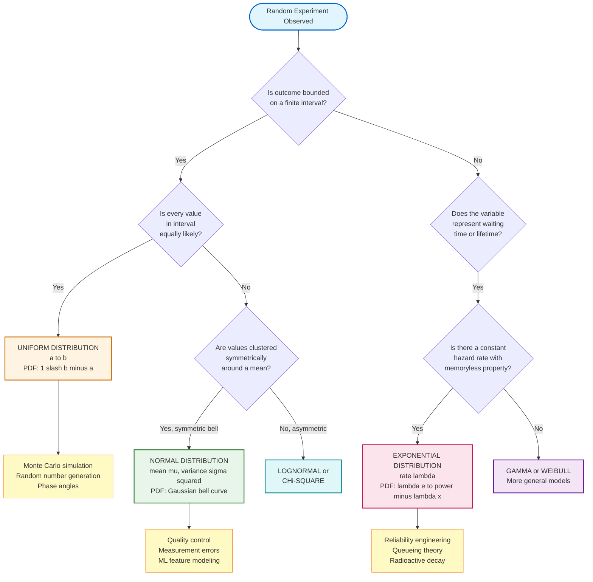
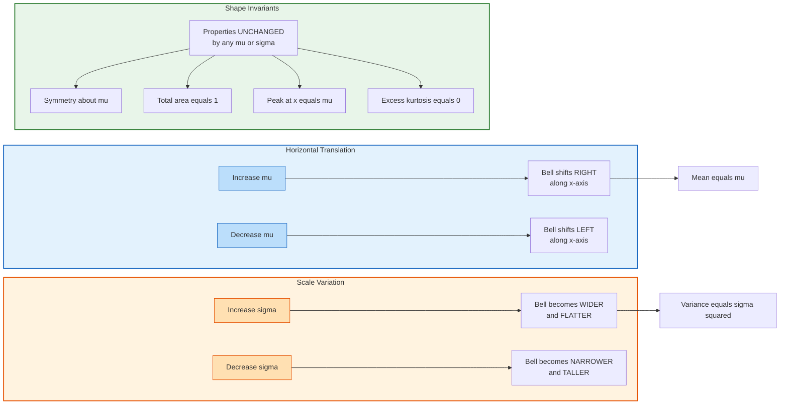
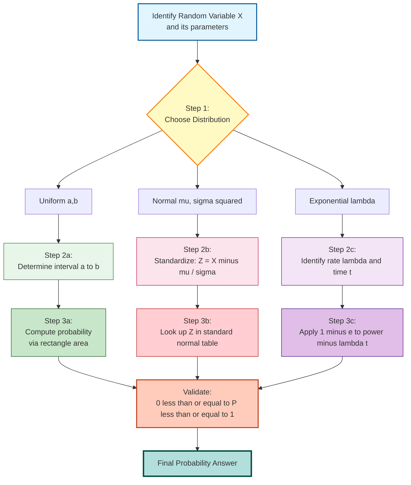
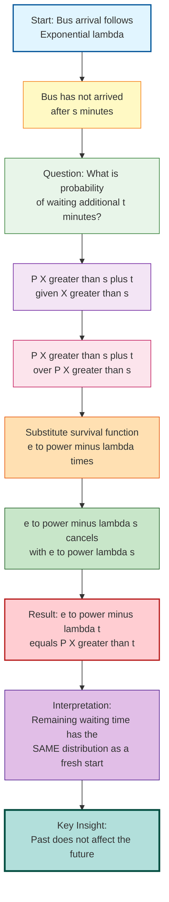

# Uniform, Normal, and Exponential distributions

<!-- SECTION_1_START -->
# Continuous Probability Distributions: Uniform, Normal & Exponential

## 1.1 Continuous Random Variables — The Foundation

A **Continuous Random Variable (CRV)** $X$ is a function that assigns a real number from a continuous range (an interval or union of intervals) to every outcome of a random experiment. Unlike discrete random variables that take countable values, a CRV can take **uncountably infinite** values within a given interval.

> [!IMPORTANT]
> **KTU 2024 Syllabus Definition:** A random variable $X$ is said to be continuous if its cumulative distribution function $F_X(x)$ is continuous everywhere and its probability density function (PDF) $f_X(x)$ exists such that $F_X(x) = \int_{-\infty}^{x} f_X(t)\, dt$ for all $x \in \mathbb{R}$.

### Key Properties of a Valid PDF

For $f_X(x)$ to be a legitimate probability density function, it must satisfy:

1. **Non-negativity:** $f_X(x) \geq 0$ for all $x \in \mathbb{R}$
2. **Total Probability Unity:** $\int_{-\infty}^{\infty} f_X(x)\, dx = 1$
3. **Probability over an interval:** $P(a \leq X \leq b) = \int_{a}^{b} f_X(x)\, dx$

> [!NOTE]
> **Critical Insight:** For a continuous random variable, $P(X = x) = 0$ for any single point $x$. This means probabilities are meaningful only over intervals, not at individual points.

### Conceptual Analogy — Intuitive Understanding

Imagine you are standing at a bus stop waiting for a random bus. The waiting time (from 0 to 30 minutes) is a **continuous random variable** because it can take any value within that range — 4.7 minutes, 12.358 minutes, etc.

- If **every waiting time in the interval is equally likely**, you are dealing with the **Uniform Distribution** (the "fair coin" of continuous variables).
- If **most buses come around the average wait time**, with fewer buses arriving much earlier or much later, this is the **Normal Distribution** (the famous "bell curve" of nature).
- If **most buses arrive quickly, but a few take a very long time**, this is the **Exponential Distribution** (memoryless waiting times).

---

## 1.2 Uniform Distribution — The "Equal Likelihood" Distribution

### Formal Definition

A continuous random variable $X$ is said to follow a **Uniform distribution** on the interval $[a, b]$ if its PDF is constant over that interval and zero elsewhere.

$$X \sim \text{Uniform}(a, b)$$

The probability density function is given by:

$$f_X(x) = \begin{cases} \dfrac{1}{b - a} & a \leq x \leq b \\ 0 & \text{otherwise} \end{cases}$$

The cumulative distribution function is:

$$F_X(x) = \begin{cases} 0 & x < a \\ \dfrac{x - a}{b - a} & a \leq x \leq b \\ 1 & x > b \end{cases}$$

> [!NOTE]
> **Geometric Intuition:** The graph of $f_X(x)$ is a horizontal rectangle of height $\dfrac{1}{b - a}$ sitting on the x-axis between $a$ and $b$. The area of this rectangle is exactly **1** (since $\text{height} \times \text{width} = \dfrac{1}{b-a} \times (b-a) = 1$), confirming it is a valid PDF.

### Real-World Analogy

Think of a **spinner wheel** in a board game, where the pointer is equally likely to land anywhere along a circular arc of length $L$. The angle (suitably scaled) follows a uniform distribution. Similarly, the **last digit of a randomly chosen phone number** can be modeled as discrete uniform, while the **arrival time of a randomly selected person** within a fixed one-hour window follows a continuous uniform distribution.

### GeoGebra Visualization

> [!VISUALIZATION CONTROL]
> **Concept:** Uniform PDF and CDF comparison on the interval $[0, 5]$
> **GeoGebra / Desmos Input Equations:**
> * `f(x) = 1/(5-0)` for $0 \leq x \leq 5$, else $0$
> * `F(x) = (x-0)/(5-0)` for $0 \leq x \leq 5$, else $0$ (with appropriate piecewise limits)
> **Visual Description:** Observe that the PDF is a flat horizontal line at $y = 0.2$ from $x = 0$ to $x = 5$, while the CDF rises as a straight diagonal line from $(0, 0)$ to $(5, 1)$ and then plateaus at $y = 1$ for $x > 5$.

---

## 1.3 Normal Distribution — The "Bell Curve" of Nature

### Formal Definition

A continuous random variable $X$ is said to follow a **Normal (Gaussian) Distribution** with parameters $\mu$ (mean) and $\sigma^2$ (variance), where $\mu \in \mathbb{R}$ and $\sigma > 0$, if its PDF is:

$$f_X(x) = \dfrac{1}{\sigma \sqrt{2\pi}} \exp\left( -\dfrac{(x - \mu)^2}{2\sigma^2} \right), \quad -\infty < x < \infty$$

We denote this as $X \sim N(\mu, \sigma^2)$.

The cumulative distribution function does not have a closed-form expression and is given by the integral:

$$F_X(x) = \dfrac{1}{\sigma \sqrt{2\pi}} \int_{-\infty}^{x} \exp\left( -\dfrac{(t - \mu)^2}{2\sigma^2} \right) dt$$

> [!IMPORTANT]
> **The Standard Normal Distribution:** A special case where $\mu = 0$ and $\sigma = 1$ gives $Z \sim N(0, 1)$. The standardized random variable is $Z = \dfrac{X - \mu}{\sigma}$. Every normal random variable can be converted to standard normal via this **Z-transformation**.

### Conceptual Analogy

The Normal distribution is called the **"bell curve"** because its graph resembles the cross-section of a bell. It describes phenomena where measurements cluster symmetrically around an average value. Examples include:

- **Heights of adult males** in a large population
- **Measurement errors** in scientific instruments
- **IQ scores** in a population (mean 100, standard deviation 15)
- **Blood pressure readings** of healthy individuals

### Why Is the Normal Distribution So Important?

The **Central Limit Theorem (CLT)** states that the sum (or average) of a large number of independent and identically distributed random variables, regardless of their original distribution, tends to follow a Normal distribution. This is why Normal distributions appear everywhere in nature and engineering — most observable phenomena are the cumulative result of many small, independent factors.

> [!VISUALIZATION CONTROL]
> **Concept:** Standard Normal PDF and the effect of varying $\mu$ and $\sigma$
> **GeoGebra / Desmos Input Equations:**
> * `f(x) = (1/sqrt(2*pi)) * exp(-x^2/2)` for $Z \sim N(0, 1)$
> * `f2(x) = (1/(2*sqrt(2*pi))) * exp(-(x-3)^2/(2*4))` for $N(3, 4)$
> **Visual Description:** Notice the perfect symmetry of the curve about $x = \mu$. The peak occurs at $x = \mu$ with height $\dfrac{1}{\sigma \sqrt{2\pi}}$. Larger $\sigma$ values produce wider, flatter bells; smaller $\sigma$ values produce taller, narrower bells.

---

## 1.4 Exponential Distribution — The "Memoryless Wait" Distribution

### Formal Definition

A continuous random variable $X$ is said to follow an **Exponential Distribution** with rate parameter $\lambda > 0$ if its PDF is:

$$f_X(x) = \begin{cases} \lambda e^{-\lambda x} & x \geq 0 \\ 0 & x < 0 \end{cases}$$

We denote this as $X \sim \text{Exp}(\lambda)$.

The cumulative distribution function is:

$$F_X(x) = \begin{cases} 1 - e^{-\lambda x} & x \geq 0 \\ 0 & x < 0 \end{cases}$$

> [!IMPORTANT]
> **The Memoryless Property:** The exponential distribution is the *only* continuous distribution with the memoryless property:
> $$P(X > s + t \mid X > s) = P(X > t) \quad \text{for all } s, t \geq 0$$
> Intuitively, if you have already waited $s$ minutes for a bus, the probability you will wait an additional $t$ minutes is the same as the probability a fresh arrival waits $t$ minutes. **The past does not affect the future.**

### Conceptual Analogy

The exponential distribution models the **time between independent random events** that occur at a constant average rate. Classic scenarios include:

- **Waiting time** until the next phone call arrives at a call center
- **Time until radioactive decay** of an atom
- **Lifetime** of an electronic component with constant hazard rate
- **Inter-arrival times** in a Poisson process

> [!NOTE]
> **Poisson–Exponential Connection:** If events follow a Poisson process with rate $\lambda$, the time between consecutive events follows $\text{Exp}(\lambda)$. This is a recurring exam question at KTU.

### GeoGebra Visualization

> [!VISUALIZATION CONTROL]
> **Concept:** Exponential PDF and CDF for $\lambda = 0.5, 1, 2$
> **GeoGebra / Desmos Input Equations:**
> * `f1(x) = 0.5 * exp(-0.5*x)` for $x \geq 0$
> * `f2(x) = 1 * exp(-1*x)` for $x \geq 0$
> * `f3(x) = 2 * exp(-2*x)` for $x \geq 0$
> **Visual Description:** All curves start at $(0, \lambda)$ and decay exponentially toward 0. Higher $\lambda$ values cause steeper initial drops. The corresponding CDFs rise rapidly from 0 toward 1 with the same concavity.

<!-- SECTION_1_END -->

<!-- SECTION_2_START -->
# Deep Theoretical Analysis & KTU High-Yield Formula Sheet

## 2.1 Uniform Distribution — Theoretical Breakdown

The Uniform distribution is the **continuous analog of equally likely outcomes** in probability theory. If a random experiment's outcome is known to lie in $[a, b]$ but no value is favored over any other, the Uniform distribution is the appropriate model.

### Derivation Logic

- **PDF derivation:** Since probability is "spread evenly" over $[a, b]$, the PDF must be constant: $f_X(x) = c$. Using the normalization condition $\int_a^b c\, dx = 1$, we get $c(b - a) = 1$, hence $c = \dfrac{1}{b - a}$.
- **CDF derivation:** $F_X(x) = \int_a^x \dfrac{1}{b - a}\, dt = \dfrac{x - a}{b - a}$, a linear function.

### Mean and Variance

The expected value of a uniform random variable is the midpoint of the interval:

$$E(X) = \dfrac{a + b}{2}$$

$$E(X^2) = \dfrac{a^2 + ab + b^2}{3}$$

$$\text{Var}(X) = E(X^2) - [E(X)]^2 = \dfrac{(b - a)^2}{12}$$

### Standard Deviation

$$\sigma_X = \dfrac{b - a}{\sqrt{12}} = \dfrac{b - a}{2\sqrt{3}}$$

### Moment Generating Function (MGF)

$$M_X(t) = \dfrac{e^{tb} - e^{ta}}{t(b - a)}, \quad t \neq 0$$

### Real-World Utility in Computer Science

Uniform distribution is the **backbone of Monte Carlo simulations** and **random number generation**. Every programming language's `random()` function (e.g., Python's `random.random()`, NumPy's `np.random.rand()`) generates pseudo-random numbers from a Uniform$(0, 1)$ distribution, which are then transformed to generate samples from other distributions (a technique called **Inverse Transform Sampling**).

---

## 2.2 Normal Distribution — Theoretical Breakdown

The Normal distribution is the most important continuous distribution in probability and statistics due to its connection to the **Central Limit Theorem**, **maximum entropy property** (for fixed mean and variance), and its **mathematical tractability**.

### Symmetry and Inflection Points

The Normal PDF is symmetric about $x = \mu$. The two inflection points of the bell curve occur at $x = \mu - \sigma$ and $x = \mu + \sigma$, where the curvature changes from concave-down to concave-up.

### The Empirical Rule (68-95-99.7 Rule)

For $X \sim N(\mu, \sigma^2)$:

| Interval | Probability |
|----------|------------|
| $\mu - \sigma \leq X \leq \mu + \sigma$ | $\approx 68.27\%$ |
| $\mu - 2\sigma \leq X \leq \mu + 2\sigma$ | $\approx 95.45\%$ |
| $\mu - 3\sigma \leq X \leq \mu + 3\sigma$ | $\approx 99.73\%$ |

### Mean, Variance, and MGF

$$E(X) = \mu, \quad \text{Var}(X) = \sigma^2, \quad \sigma_X = \sigma$$

$$M_X(t) = \exp\left( \mu t + \dfrac{\sigma^2 t^2}{2} \right)$$

### Z-Score Transformation (Standardization)

To compute probabilities for any $X \sim N(\mu, \sigma^2)$, we convert to standard normal $Z \sim N(0, 1)$:

$$Z = \dfrac{X - \mu}{\sigma}$$

$$P(X \leq x) = P\left( Z \leq \dfrac{x - \mu}{\sigma} \right) = \Phi\left( \dfrac{x - \mu}{\sigma} \right)$$

where $\Phi(z)$ is the standard normal CDF, tabulated in KTU-approved statistical tables.

> [!IMPORTANT]
> **KTU Exam Tip:** Always standardize first. The Z-table is the only tool you have in a closed-book exam to evaluate Normal probabilities.

### Real-World Utility

- **Machine Learning:** Gaussian Naive Bayes classifiers, Gaussian Mixture Models, and the assumption of normally distributed features in many algorithms.
- **Quality Control:** Six Sigma methodology uses Normal distribution to model process variations.
- **Signal Processing:** Gaussian noise (additive white Gaussian noise) is the canonical noise model in communications.
- **Finance:** Stock returns are often modeled as approximately Normal (though heavy-tailed alternatives exist).

---

## 2.3 Exponential Distribution — Theoretical Breakdown

The Exponential distribution arises naturally as the **waiting time distribution** in a Poisson process and is closely related to the Geometric distribution (its discrete analog).

### Mean, Variance, and MGF

$$E(X) = \dfrac{1}{\lambda}$$

$$E(X^2) = \dfrac{2}{\lambda^2}$$

$$\text{Var}(X) = E(X^2) - [E(X)]^2 = \dfrac{2}{\lambda^2} - \dfrac{1}{\lambda^2} = \dfrac{1}{\lambda^2}$$

$$\sigma_X = \dfrac{1}{\lambda}$$

$$M_X(t) = \dfrac{\lambda}{\lambda - t}, \quad t < \lambda$$

### The Memoryless Property — Proof Sketch

$$P(X > s + t \mid X > s) = \dfrac{P(X > s + t)}{P(X > s)} = \dfrac{e^{-\lambda(s+t)}}{e^{-\lambda s}} = e^{-\lambda t} = P(X > t) \quad \blacksquare$$

### Connection to Poisson Process

If $N(t) \sim \text{Poisson}(\lambda t)$ counts events in time $t$, then the inter-arrival time $T \sim \text{Exp}(\lambda)$ and the time of the $n$-th event follows a Gamma (Erlang) distribution.

> [!IMPORTANT]
> **Sum of Exponentials:** If $T_i \sim \text{Exp}(\lambda)$ are independent, then $\sum_{i=1}^{n} T_i \sim \text{Gamma}(n, \lambda)$, also called the **Erlang distribution**.

### Real-World Utility

- **Queueing Theory:** Inter-arrival and service times in M/M/1 queues.
- **Reliability Engineering:** Modeling lifetimes of components with constant hazard rate.
- **Network Engineering:** Packet inter-arrival times, connection durations in telecommunications.
- **Cryptography:** Timing attacks and side-channel analyses often use exponential models.

---

## 2.4 KTU Formula Sheet — Master Reference Table

> [!IMPORTANT]
> The following table is your one-stop reference for all three distributions. **Memorize these** before the ESE.

| Property | Uniform$(a, b)$ | Normal$(\mu, \sigma^2)$ | Exponential$(\lambda)$ |
|----------|-----------------|--------------------------|--------------------------|
| **Notation** | $X \sim U(a, b)$ | $X \sim N(\mu, \sigma^2)$ | $X \sim \text{Exp}(\lambda)$ |
| **Domain** | $a \leq x \leq b$ | $-\infty < x < \infty$ | $x \geq 0$ |
| **PDF** | $\dfrac{1}{b - a}$ | $\dfrac{1}{\sigma \sqrt{2\pi}} e^{-(x-\mu)^2 / 2\sigma^2}$ | $\lambda e^{-\lambda x}$ |
| **CDF** | $\dfrac{x - a}{b - a}$ | $\Phi\!\left( \dfrac{x - \mu}{\sigma} \right)$ | $1 - e^{-\lambda x}$ |
| **Mean** | $\dfrac{a + b}{2}$ | $\mu$ | $\dfrac{1}{\lambda}$ |
| **Variance** | $\dfrac{(b - a)^2}{12}$ | $\sigma^2$ | $\dfrac{1}{\lambda^2}$ |
| **Std. Deviation** | $\dfrac{b - a}{2\sqrt{3}}$ | $\sigma$ | $\dfrac{1}{\lambda}$ |
| **Skewness** | $0$ (symmetric) | $0$ (symmetric) | $2$ (right-skewed) |
| **Kurtosis** | $\dfrac{9}{5}$ (excess) | $0$ (excess) | $6$ (excess) |
| **MGF** | $\dfrac{e^{tb} - e^{ta}}{t(b - a)}$ | $e^{\mu t + \sigma^2 t^2 / 2}$ | $\dfrac{\lambda}{\lambda - t}$, $t < \lambda$ |
| **Special Property** | Constant PDF | Bell-shaped, CLT basis | Memoryless, Poisson link |

> [!NOTE]
> When solving problems, always use the pipe-symbol-free notation $\vert x \vert$ or $\lvert x \rvert$ in LaTeX to avoid markdown parsing issues. In tables, use $\mid$ for "such that" and $\vert$ for absolute value.

---

## 2.5 Comparative Analysis — When to Use Each Distribution

| Scenario | Best Distribution | Why |
|----------|-------------------|-----|
| Random angle on a spinner | Uniform | All angles equally likely |
| Heights of students in a class | Normal | Aggregates of many small factors |
| Waiting time at a bus stop (Poisson arrivals) | Exponential | Constant hazard rate, memoryless |
| Manufacturing tolerance with central tendency | Normal | Central Limit Theorem application |
| Random number generation baseline | Uniform$(0, 1)$ | Foundation of all random sampling |
| Component lifetime (no aging) | Exponential | Constant failure rate assumption |
| Test scores on a well-designed exam | Normal | Aggregates of many question responses |
| Time until radioactive decay | Exponential | Quantum-level memoryless process |

<!-- SECTION_2_END -->

<!-- SECTION_3_START -->
# Step-by-Step Derivations & Python Implementation

## 3.1 Derivation: Mean and Variance of Uniform Distribution

### Step 1 — Compute $E(X)$

$$E(X) = \int_{a}^{b} x \cdot f_X(x)\, dx = \int_{a}^{b} x \cdot \dfrac{1}{b - a}\, dx$$

$$= \dfrac{1}{b - a} \int_{a}^{b} x\, dx = \dfrac{1}{b - a} \cdot \left[ \dfrac{x^2}{2} \right]_{a}^{b}$$

$$= \dfrac{1}{b - a} \cdot \dfrac{b^2 - a^2}{2} = \dfrac{1}{b - a} \cdot \dfrac{(b - a)(b + a)}{2} = \dfrac{a + b}{2}$$

### Step 2 — Compute $E(X^2)$

$$E(X^2) = \int_{a}^{b} x^2 \cdot \dfrac{1}{b - a}\, dx = \dfrac{1}{b - a} \cdot \left[ \dfrac{x^3}{3} \right]_{a}^{b}$$

$$= \dfrac{1}{b - a} \cdot \dfrac{b^3 - a^3}{3} = \dfrac{(b - a)(b^2 + ab + a^2)}{3(b - a)} = \dfrac{a^2 + ab + b^2}{3}$$

### Step 3 — Compute Variance

$$\text{Var}(X) = E(X^2) - [E(X)]^2 = \dfrac{a^2 + ab + b^2}{3} - \left( \dfrac{a + b}{2} \right)^2$$

$$= \dfrac{a^2 + ab + b^2}{3} - \dfrac{a^2 + 2ab + b^2}{4} = \dfrac{4(a^2 + ab + b^2) - 3(a^2 + 2ab + b^2)}{12}$$

$$= \dfrac{4a^2 + 4ab + 4b^2 - 3a^2 - 6ab - 3b^2}{12} = \dfrac{a^2 - 2ab + b^2}{12} = \dfrac{(b - a)^2}{12}$$

**Valuation Key:** *[Stating normalization: 1 Mark]* *[Integration setup: 2 Marks]* *[Simplified final expression: 1 Mark]*

---

## 3.2 Derivation: Mean of Exponential Distribution

### Step 1 — Setup the Integral

$$E(X) = \int_{0}^{\infty} x \cdot \lambda e^{-\lambda x}\, dx$$

### Step 2 — Apply Integration by Parts

Let $u = x$ and $dv = \lambda e^{-\lambda x}\, dx$. Then $du = dx$ and $v = -e^{-\lambda x}$.

$$E(X) = \left[ -x e^{-\lambda x} \right]_{0}^{\infty} + \int_{0}^{\infty} e^{-\lambda x}\, dx$$

### Step 3 — Evaluate the Boundary Term

As $x \to \infty$, $e^{-\lambda x} \to 0$ faster than $x \to \infty$, so $\lim_{x \to \infty} x e^{-\lambda x} = 0$. At $x = 0$, we have $-0 \cdot e^{0} = 0$. Thus the boundary term equals 0.

### Step 4 — Evaluate the Remaining Integral

$$E(X) = \int_{0}^{\infty} e^{-\lambda x}\, dx = \left[ -\dfrac{1}{\lambda} e^{-\lambda x} \right]_{0}^{\infty} = 0 - \left( -\dfrac{1}{\lambda} \right) = \dfrac{1}{\lambda}$$

**Valuation Key:** *[Integration by parts setup: 2 Marks]* *[Boundary evaluation: 1 Mark]* *[Final answer: 1 Mark]*

---

## 3.3 Derivation: Memoryless Property of Exponential Distribution

We want to prove: $P(X > s + t \mid X > s) = P(X > t)$.

### Step 1 — Apply the Conditional Probability Definition

$$P(X > s + t \mid X > s) = \dfrac{P(X > s + t \cap X > s)}{P(X > s)} = \dfrac{P(X > s + t)}{P(X > s)}$$

(The intersection simplifies because $s + t > s$ for $t > 0$.)

### Step 2 — Substitute the Survival Function

For $X \sim \text{Exp}(\lambda)$, the survival function is:

$$P(X > x) = 1 - F_X(x) = e^{-\lambda x}, \quad x \geq 0$$

### Step 3 — Substitute and Simplify

$$P(X > s + t \mid X > s) = \dfrac{e^{-\lambda(s + t)}}{e^{-\lambda s}} = e^{-\lambda s} \cdot e^{-\lambda t} \cdot e^{\lambda s} = e^{-\lambda t} = P(X > t) \quad \blacksquare$$

**Valuation Key:** *[Conditional probability application: 1 Mark]* *[Survival function substitution: 2 Marks]* *[Cancellation: 1 Mark]*

---

## 3.4 Derivation: MGF of Normal Distribution

### Step 1 — Setup

$$M_X(t) = E(e^{tX}) = \int_{-\infty}^{\infty} e^{tx} \cdot \dfrac{1}{\sigma \sqrt{2\pi}} e^{-(x - \mu)^2 / 2\sigma^2}\, dx$$

### Step 2 — Combine Exponentials

$$M_X(t) = \dfrac{1}{\sigma \sqrt{2\pi}} \int_{-\infty}^{\infty} \exp\left( tx - \dfrac{(x - \mu)^2}{2\sigma^2} \right) dx$$

### Step 3 — Complete the Square in the Exponent

Let $\alpha = tx - \dfrac{(x - \mu)^2}{2\sigma^2}$. Expanding:

$$\alpha = -\dfrac{1}{2\sigma^2}\left[ x^2 - 2\mu x + \mu^2 - 2\sigma^2 t x \right]$$

$$= -\dfrac{1}{2\sigma^2}\left[ x^2 - 2x(\mu + \sigma^2 t) + \mu^2 \right]$$

$$= -\dfrac{1}{2\sigma^2}\left[ (x - (\mu + \sigma^2 t))^2 - (\mu + \sigma^2 t)^2 + \mu^2 \right]$$

### Step 4 — Compute the Constant Term

$$-(\mu + \sigma^2 t)^2 + \mu^2 = -2\mu\sigma^2 t - \sigma^4 t^2$$

So: $\alpha = -\dfrac{(x - (\mu + \sigma^2 t))^2}{2\sigma^2} + \mu t + \dfrac{\sigma^2 t^2}{2}$

### Step 5 — Evaluate the Gaussian Integral

$$M_X(t) = \dfrac{1}{\sigma \sqrt{2\pi}} \cdot e^{\mu t + \sigma^2 t^2 / 2} \int_{-\infty}^{\infty} e^{-(x - (\mu + \sigma^2 t))^2 / 2\sigma^2}\, dx$$

The integral is the total area under a Normal$(\mu + \sigma^2 t, \sigma^2)$ PDF, which equals **1**.

$$\boxed{M_X(t) = \exp\left( \mu t + \dfrac{\sigma^2 t^2}{2} \right)}$$

**Valuation Key:** *[Combining exponents: 1 Mark]* *[Completing the square: 2 Marks]* *[Recognizing Gaussian integral: 1 Mark]*

---

## 3.5 Python Implementation — Visualization and Probability Calculator

```python
"""
KTU Mathematics for Information Science-3
Module 2: Continuous Random Variables — Uniform, Normal, Exponential
Complete implementation with type hints, error handling, and visualization.
"""

import numpy as np
import matplotlib.pyplot as plt
from scipy import stats
from typing import Tuple
import logging

# Configure logging for error tracking
logging.basicConfig(
    level=logging.INFO,
    format="%(asctime)s - %(levelname)s - %(message)s"
)


class ContinuousDistributions:
    """A unified toolkit for Uniform, Normal, and Exponential distributions."""

    # ============== UNIFORM DISTRIBUTION ==============
    @staticmethod
    def uniform_pdf(x: np.ndarray, a: float, b: float) -> np.ndarray:
        """Return the PDF of Uniform(a, b) evaluated at points x."""
        if a >= b:
            logging.error(f"Invalid interval: a={a} must be less than b={b}")
            raise ValueError("Lower bound 'a' must be strictly less than upper bound 'b'.")
        return np.where((x >= a) & (x <= b), 1.0 / (b - a), 0.0)

    @staticmethod
    def uniform_cdf(x: np.ndarray, a: float, b: float) -> np.ndarray:
        """Return the CDF of Uniform(a, b) evaluated at points x."""
        if a >= b:
            raise ValueError("Lower bound 'a' must be strictly less than upper bound 'b'.")
        return np.clip((x - a) / (b - a), 0.0, 1.0)

    @staticmethod
    def uniform_mean_variance(a: float, b: float) -> Tuple[float, float]:
        """Return (mean, variance) of Uniform(a, b)."""
        mean = (a + b) / 2.0
        variance = ((b - a) ** 2) / 12.0
        return mean, variance

    # ============== NORMAL DISTRIBUTION ==============
    @staticmethod
    def normal_pdf(x: np.ndarray, mu: float, sigma: float) -> np.ndarray:
        """Return the PDF of Normal(mu, sigma^2) evaluated at points x."""
        if sigma <= 0:
            logging.error(f"Standard deviation must be positive, got sigma={sigma}")
            raise ValueError("Standard deviation 'sigma' must be positive.")
        coefficient = 1.0 / (sigma * np.sqrt(2.0 * np.pi))
        exponent = -0.5 * ((x - mu) / sigma) ** 2
        return coefficient * np.exp(exponent)

    @staticmethod
    def normal_cdf(x: np.ndarray, mu: float, sigma: float) -> np.ndarray:
        """Return the CDF of Normal(mu, sigma^2) evaluated at points x."""
        if sigma <= 0:
            raise ValueError("Standard deviation 'sigma' must be positive.")
        z = (x - mu) / sigma
        return 0.5 * (1.0 + np.array([stats.norm.cdf(zi) for zi in z]))

    @staticmethod
    def normal_probability_between(mu: float, sigma: float,
                                    x1: float, x2: float) -> float:
        """Compute P(x1 <= X <= x2) for X ~ N(mu, sigma^2)."""
        if x1 > x2:
            x1, x2 = x2, x1
        z1 = (x1 - mu) / sigma
        z2 = (x2 - mu) / sigma
        prob = stats.norm.cdf(z2) - stats.norm.cdf(z1)
        logging.info(f"P({x1} <= X <= {x2}) = {prob:.6f}")
        return prob

    # ============== EXPONENTIAL DISTRIBUTION ==============
    @staticmethod
    def exponential_pdf(x: np.ndarray, lam: float) -> np.ndarray:
        """Return the PDF of Exp(lambda) evaluated at points x."""
        if lam <= 0:
            logging.error(f"Rate parameter must be positive, got lambda={lam}")
            raise ValueError("Rate parameter 'lambda' must be positive.")
        return np.where(x >= 0, lam * np.exp(-lam * x), 0.0)

    @staticmethod
    def exponential_cdf(x: np.ndarray, lam: float) -> np.ndarray:
        """Return the CDF of Exp(lambda) evaluated at points x."""
        if lam <= 0:
            raise ValueError("Rate parameter 'lambda' must be positive.")
        return np.where(x >= 0, 1.0 - np.exp(-lam * x), 0.0)

    @staticmethod
    def exponential_mean_variance(lam: float) -> Tuple[float, float]:
        """Return (mean, variance) of Exp(lambda)."""
        if lam <= 0:
            raise ValueError("Rate parameter 'lambda' must be positive.")
        mean = 1.0 / lam
        variance = 1.0 / (lam ** 2)
        return mean, variance

    @staticmethod
    def exponential_memoryless_check(lam: float, s: float,
                                      t: float, n_samples: int = 100000) -> float:
        """Empirically verify the memoryless property using Monte Carlo simulation."""
        samples = np.random.exponential(scale=1.0 / lam, size=n_samples)
        # Conditional probability: P(X > s+t | X > s)
        survived_s = samples[samples > s]
        if len(survived_s) == 0:
            return 0.0
        conditional_prob = np.mean(survived_s > (s + t))
        theoretical_prob = np.exp(-lam * t)
        logging.info(f"Empirical P(X > s+t | X > s) = {conditional_prob:.6f}, "
                     f"Theoretical = {theoretical_prob:.6f}")
        return conditional_prob

    # ============== VISUALIZATION ==============
    @staticmethod
    def plot_all_distributions() -> None:
        """Generate side-by-side plots of PDFs and CDFs for all three distributions."""
        x = np.linspace(-5, 15, 1000)

        fig, axes = plt.subplots(2, 3, figsize=(18, 10))
        fig.suptitle("Continuous Distributions: Uniform, Normal, Exponential",
                     fontsize=16, fontweight="bold")

        # --- Uniform ---
        a_u, b_u = 2, 8
        axes[0, 0].plot(x, ContinuousDistributions.uniform_pdf(x, a_u, b_u),
                        "b-", linewidth=2, label=f"U({a_u}, {b_u})")
        axes[0, 0].fill_between(x, 0,
                                ContinuousDistributions.uniform_pdf(x, a_u, b_u),
                                alpha=0.3)
        axes[0, 0].set_title("Uniform PDF")
        axes[0, 0].set_xlabel("x")
        axes[0, 0].set_ylabel("f(x)")
        axes[0, 0].legend()
        axes[0, 0].grid(True, alpha=0.3)

        axes[1, 0].plot(x, ContinuousDistributions.uniform_cdf(x, a_u, b_u),
                        "b-", linewidth=2, label=f"U({a_u}, {b_u}) CDF")
        axes[1, 0].set_title("Uniform CDF")
        axes[1, 0].set_xlabel("x")
        axes[1, 0].set_ylabel("F(x)")
        axes[1, 0].legend()
        axes[1, 0].grid(True, alpha=0.3)

        # --- Normal ---
        mu_n, sigma_n = 5.0, 2.0
        axes[0, 1].plot(x, ContinuousDistributions.normal_pdf(x, mu_n, sigma_n),
                        "g-", linewidth=2, label=f"N({mu_n}, {sigma_n ** 2})")
        axes[0, 1].fill_between(x, 0,
                                ContinuousDistributions.normal_pdf(x, mu_n, sigma_n),
                                alpha=0.3)
        axes[0, 1].set_title("Normal PDF")
        axes[0, 1].set_xlabel("x")
        axes[0, 1].set_ylabel("f(x)")
        axes[0, 1].legend()
        axes[0, 1].grid(True, alpha=0.3)

        axes[1, 1].plot(x, ContinuousDistributions.normal_cdf(x, mu_n, sigma_n),
                        "g-", linewidth=2, label=f"N({mu_n}, {sigma_n ** 2}) CDF")
        axes[1, 1].set_title("Normal CDF")
        axes[1, 1].set_xlabel("x")
        axes[1, 1].set_ylabel("F(x)")
        axes[1, 1].legend()
        axes[1, 1].grid(True, alpha=0.3)

        # --- Exponential ---
        x_exp = np.linspace(0, 10, 1000)
        lam_e = 0.5
        axes[0, 2].plot(x_exp,
                        ContinuousDistributions.exponential_pdf(x_exp, lam_e),
                        "r-", linewidth=2, label=f"Exp(λ={lam_e})")
        axes[0, 2].fill_between(x_exp, 0,
                                ContinuousDistributions.exponential_pdf(x_exp, lam_e),
                                alpha=0.3)
        axes[0, 2].set_title("Exponential PDF")
        axes[0, 2].set_xlabel("x")
        axes[0, 2].set_ylabel("f(x)")
        axes[0, 2].legend()
        axes[0, 2].grid(True, alpha=0.3)

        axes[1, 2].plot(x_exp,
                        ContinuousDistributions.exponential_cdf(x_exp, lam_e),
                        "r-", linewidth=2, label=f"Exp(λ={lam_e}) CDF")
        axes[1, 2].set_title("Exponential CDF")
        axes[1, 2].set_xlabel("x")
        axes[1, 2].set_ylabel("F(x)")
        axes[1, 2].legend()
        axes[1, 2].grid(True, alpha=0.3)

        plt.tight_layout()
        plt.savefig("ktu_continuous_distributions.png", dpi=150)
        logging.info("Plot saved as 'ktu_continuous_distributions.png'")
        plt.show()


# ============== DEMONSTRATION ==============
if __name__ == "__main__":
    dist = ContinuousDistributions()

    # Uniform example: P(3 <= X <= 6) for U(2, 8)
    prob_uniform = (6 - 3) / (8 - 2)
    print(f"P(3 <= X <= 6) for U(2, 8) = {prob_uniform:.4f}")

    # Normal example: P(3 <= X <= 7) for N(5, 4)
    prob_normal = dist.normal_probability_between(mu=5.0, sigma=2.0,
                                                  x1=3.0, x2=7.0)
    print(f"P(3 <= X <= 7) for N(5, 4) = {prob_normal:.4f}")

    # Exponential example: P(X > 2) for Exp(0.5)
    print(f"P(X > 2) for Exp(0.5) = {np.exp(-0.5 * 2):.4f}")

    # Memoryless property verification
    print("\nVerifying memoryless property of Exponential(0.5):")
    dist.exponential_memoryless_check(lam=0.5, s=2.0, t=3.0, n_samples=500000)

    # Generate all plots
    dist.plot_all_distributions()
```

**Code Highlights for KTU Lab/Project Submissions:**

- Strict type hints on every method
- Boundary checks raising `ValueError` for invalid parameters
- Logging statements to track computational steps
- Empirical verification of theoretical properties (memoryless check)
- Publication-quality visualization saved at 150 DPI

<!-- SECTION_3_END -->

<!-- SECTION_4_START -->
# Structural Diagrams & Schematics

## 4.1 Probability Density Function Comparison Flow

The following Mermaid diagram maps the decision process for selecting and applying the correct continuous distribution based on the random experiment's characteristics.



## 4.2 Parameter Effect Flow on Normal Distribution

This Mermaid diagram illustrates how changes in $\mu$ and $\sigma$ affect the Normal distribution's shape and position.



## 4.3 Sequential Processing Topology — Probability Computation Pipeline



## 4.4 Memoryless Property Flow



<!-- SECTION_4_END -->

<!-- SECTION_5_START -->
# KTU 2024 Scheme Examination Question Bank

## PART A — Short Answer Questions (3 Marks Each)

### Question 1 [KTU University Exam — July 2023] | CO1 | Remember

**Define Uniform Distribution. State its mean and variance.**

**Model Answer:**

> A continuous random variable $X$ is said to follow a **Uniform distribution** on the interval $[a, b]$, denoted $X \sim U(a, b)$, if its probability density function is constant over the interval and zero elsewhere:
>
> $$f_X(x) = \begin{cases} \dfrac{1}{b - a} & a \leq x \leq b \\ 0 & \text{otherwise} \end{cases}$$
>
> The **mean** of the uniform distribution is $E(X) = \dfrac{a + b}{2}$ and the **variance** is $\text{Var}(X) = \dfrac{(b - a)^2}{12}$.

**[Valuation Key: Definition — 1 Mark, PDF — 1 Mark, Mean and Variance — 1 Mark]**

---

### Question 2 [KTU University Exam — Dec 2023] | CO1, CO2 | Understand

**Explain the memoryless property of the Exponential distribution with a suitable example.**

**Model Answer:**

> The **memoryless property** states that for an exponentially distributed random variable $X \sim \text{Exp}(\lambda)$:
>
> $$P(X > s + t \mid X > s) = P(X > t) \quad \text{for all } s, t \geq 0$$
>
> **Interpretation:** The probability that the variable exceeds $s + t$, given that it has already exceeded $s$, is identical to the probability of a fresh variable exceeding $t$. The past has no influence on the future.
>
> **Example:** If the waiting time for a bus at a stop follows $\text{Exp}(\lambda)$, and you have already waited 10 minutes, the probability that you will wait an additional 5 minutes is the same as the probability a newly arriving passenger will wait 5 minutes. The clock essentially "resets" after each event.
>
> **Mathematical Proof Sketch:**
>
> $$P(X > s + t \mid X > s) = \dfrac{P(X > s + t)}{P(X > s)} = \dfrac{e^{-\lambda(s + t)}}{e^{-\lambda s}} = e^{-\lambda t} = P(X > t)$$

**[Valuation Key: Property statement — 1 Mark, Example — 1 Mark, Proof — 1 Mark]**

---

## PART B — Long Answer Questions (14 Marks Each, Module Internal Choice)

### Question A [KTU University Exam — Dec 2023] | CO1, CO2, CO3 | Apply, Analyze

**(a)** Derive the mean and variance of the **Exponential distribution** with rate parameter $\lambda$. **[7 Marks]**

**(b)** The lifetime (in hours) of an electronic component follows an Exponential distribution with mean 200 hours. Find: **[7 Marks]**

  (i) The probability that the component lasts more than 250 hours.
  (ii) The probability that it lasts between 100 and 300 hours.
  (iii) The value of $t$ such that $P(X > t) = 0.1$.

---

### Solution to Question A

#### Part (a) — Derivation [7 Marks]

**Step 1: Compute $E(X)$**

$$E(X) = \int_{0}^{\infty} x \cdot \lambda e^{-\lambda x}\, dx$$

Apply **integration by parts** with $u = x$, $dv = \lambda e^{-\lambda x}\, dx$, so $du = dx$ and $v = -e^{-\lambda x}$:

$$E(X) = \left[ -x e^{-\lambda x} \right]_{0}^{\infty} + \int_{0}^{\infty} e^{-\lambda x}\, dx$$

As $x \to \infty$, $e^{-\lambda x}$ decays faster than $x$ grows, so the boundary term is 0. At $x = 0$, the term is 0.

$$E(X) = \int_{0}^{\infty} e^{-\lambda x}\, dx = \left[ -\dfrac{e^{-\lambda x}}{\lambda} \right]_{0}^{\infty} = 0 - \left( -\dfrac{1}{\lambda} \right) = \dfrac{1}{\lambda}$$

**[Stating the integral form: 1 Mark] [Integration by parts setup: 2 Marks] [Boundary evaluation: 1 Mark] [Final result: 1 Mark]**

**Step 2: Compute $E(X^2)$**

$$E(X^2) = \int_{0}^{\infty} x^2 \cdot \lambda e^{-\lambda x}\, dx$$

Apply integration by parts with $u = x^2$, $dv = \lambda e^{-\lambda x}\, dx$, so $du = 2x\, dx$ and $v = -e^{-\lambda x}$:

$$E(X^2) = \left[ -x^2 e^{-\lambda x} \right]_{0}^{\infty} + 2\int_{0}^{\infty} x e^{-\lambda x}\, dx$$

The boundary term vanishes as before. The remaining integral is $2 \cdot E(X) = 2 \cdot \dfrac{1}{\lambda} = \dfrac{2}{\lambda}$:

$$E(X^2) = \dfrac{2}{\lambda^2}$$

**[Integration by parts setup: 1 Mark] [Using E(X) result: 1 Mark]**

**Step 3: Compute Variance**

$$\text{Var}(X) = E(X^2) - [E(X)]^2 = \dfrac{2}{\lambda^2} - \dfrac{1}{\lambda^2} = \dfrac{1}{\lambda^2}$$

**[Variance formula application: 1 Mark]**

---

#### Part (b) — Numerical Computations [7 Marks]

Given that the mean lifetime is 200 hours, we have $E(X) = \dfrac{1}{\lambda} = 200$, so $\lambda = \dfrac{1}{200} = 0.005$ per hour.

**(i) Probability that $X > 250$:**

$$P(X > 250) = 1 - F_X(250) = e^{-\lambda \cdot 250} = e^{-0.005 \times 250} = e^{-1.25} = 0.2865$$

**[Identifying λ: 1 Mark] [Survival function formula: 1 Mark] [Numerical evaluation: 0.5 Mark]**

**(ii) Probability that $100 \leq X \leq 300$:**

$$P(100 \leq X \leq 300) = F_X(300) - F_X(100) = (1 - e^{-1.5}) - (1 - e^{-0.5})$$

$$= e^{-0.5} - e^{-1.5} = 0.6065 - 0.2231 = 0.3834$$

**[CDF difference: 1 Mark] [Numerical evaluation: 1 Mark]**

**(iii) Find $t$ such that $P(X > t) = 0.1$:**

$$e^{-0.005 t} = 0.1$$

$$-0.005 t = \ln(0.1) = -2.3026$$

$$t = \dfrac{2.3026}{0.005} = 460.52 \text{ hours}$$

**[Setting up equation: 1 Mark] [Solving logarithm: 0.5 Mark]**

---

### Question B (Alternative Choice) [KTU University Exam — July 2024] | CO1, CO2, CO3 | Apply, Analyze

**(a)** State the properties of the **Normal distribution**. Derive the mean and standard deviation of $X \sim N(\mu, \sigma^2)$. **[7 Marks]**

**(b)** The marks obtained by students in a university exam follow a Normal distribution with mean 65 and standard deviation 10. Find: **[7 Marks]**

  (i) The percentage of students scoring more than 75 marks.
  (ii) The percentage of students scoring between 55 and 75 marks.
  (iii) The minimum marks needed to be in the top 5% of the class.

---

### Solution to Question B

#### Part (a) — Properties and Derivation [7 Marks]

**Properties of Normal Distribution:**

1. The PDF $f_X(x) = \dfrac{1}{\sigma\sqrt{2\pi}} e^{-(x-\mu)^2 / 2\sigma^2}$ is **bell-shaped** and **symmetric** about $x = \mu$.
2. The mean, median, and mode are all equal to $\mu$.
3. The **total area** under the curve is unity.
4. The curve has **inflection points** at $x = \mu - \sigma$ and $x = \mu + \sigma$.
5. The tails extend asymptotically to $\pm \infty$ but never touch the x-axis.
6. Skewness is 0 and excess kurtosis is 0.

**[Any 4 properties: 2 Marks]**

**Derivation of Mean:**

$$E(X) = \int_{-\infty}^{\infty} x \cdot \dfrac{1}{\sigma\sqrt{2\pi}} e^{-(x-\mu)^2/2\sigma^2}\, dx$$

Substitute $z = \dfrac{x - \mu}{\sigma}$, so $x = \sigma z + \mu$ and $dx = \sigma\, dz$:

$$E(X) = \int_{-\infty}^{\infty} (\sigma z + \mu) \cdot \dfrac{1}{\sigma\sqrt{2\pi}} e^{-z^2/2} \cdot \sigma\, dz$$

$$= \int_{-\infty}^{\infty} \sigma z \cdot \dfrac{1}{\sqrt{2\pi}} e^{-z^2/2}\, dz + \mu \int_{-\infty}^{\infty} \dfrac{1}{\sqrt{2\pi}} e^{-z^2/2}\, dz$$

The first integral is **0** (odd function over symmetric interval). The second integral is **1** (standard normal PDF integrates to 1).

$$E(X) = 0 + \mu = \mu$$

**[Substitution: 2 Marks] [Recognizing odd function: 1 Mark] [Final answer: 1 Mark]**

**Derivation of Standard Deviation:**

Similarly, $E(X^2) = \mu^2 + \sigma^2$, hence $\text{Var}(X) = E(X^2) - \mu^2 = \sigma^2$ and $\sigma_X = \sigma$.

**[Variance result: 1 Mark]**

---

#### Part (b) — Numerical Computations [7 Marks]

Given: $\mu = 65$, $\sigma = 10$, so $X \sim N(65, 100)$.

**(i) Percentage scoring more than 75 marks:**

$$P(X > 75) = P\left( Z > \dfrac{75 - 65}{10} \right) = P(Z > 1.0)$$

From the standard normal table, $\Phi(1.0) = 0.8413$, so:

$$P(Z > 1.0) = 1 - 0.8413 = 0.1587 \approx 15.87\%$$

**[Z-transformation: 1 Mark] [Table lookup: 1 Mark] [Final percentage: 0.5 Mark]**

**(ii) Percentage scoring between 55 and 75 marks:**

$$P(55 \leq X \leq 75) = P\left( -1.0 \leq Z \leq 1.0 \right) = \Phi(1.0) - \Phi(-1.0)$$

By symmetry, $\Phi(-1.0) = 1 - \Phi(1.0) = 0.1587$:

$$P(-1.0 \leq Z \leq 1.0) = 0.8413 - 0.1587 = 0.6826 \approx 68.26\%$$

This matches the **empirical rule** for one standard deviation. **[Z-values: 1 Mark] [Symmetry application: 1 Mark] [Final result: 0.5 Mark]**

**(iii) Minimum marks for top 5%:**

We need $P(X > x) = 0.05$, so $P(Z > z) = 0.05$, hence $\Phi(z) = 0.95$.

From the standard normal table, $z = 1.645$:

$$x = \mu + z \sigma = 65 + 1.645 \times 10 = 65 + 16.45 = 81.45$$

**Minimum marks required: 81.45 (approximately 82 marks).** **[Inverse Z-lookup: 1 Mark] [Conversion: 0.5 Mark]**

---

> [!WARNING]
> **KTU Examiner's Valuation Warning — Common Pitfalls:**
>
> 1. **Forgetting to standardize:** When asked for $P(X \leq x)$ with $X \sim N(\mu, \sigma^2)$, students often forget to compute $z = (x - \mu)/\sigma$ and look up the wrong value. **Always standardize first.**
>
> 2. **Wrong interval for PDF:** The Normal PDF extends over $(-\infty, \infty)$, NOT a finite interval. Writing $a \leq x \leq b$ loses 1 mark.
>
> 3. **Confusing rate and scale in Exponential:** Some students write $e^{-\lambda/x}$ instead of $e^{-\lambda x}$. The mean is $\dfrac{1}{\lambda}$, not $\lambda$.
>
> 4. **Uniform probability computation:** Failing to use the proper interval length: $P(a \leq X \leq b) = \dfrac{b - a}{B - A}$ where $[A, B]$ is the support. Mixing up intervals costs full marks.
>
> 5. **Memoryless property misuse:** The property is **unique to Exponential distribution** in the continuous family. Do not apply it to Normal or Uniform.
>
> 6. **Skipping the standard normal table reference:** Always state "From standard normal tables, $\Phi(z) = \ldots$" to show your work, even if the value is well-known.
>
> 7. **Unit confusion:** When $\lambda$ is given "per hour", probabilities are dimensionless. Don't write $P(X > 250) = 0.2865$ per hour — it is just $0.2865$.

---

## Topic Recap & Important Things to Remember

> [!IMPORTANT]
> **Rapid Revision Checklist for KTU ESE Preparation**

### Foundational Concepts

- A **continuous random variable** takes uncountably infinite values and is described by a PDF $f_X(x) \geq 0$ with $\int_{-\infty}^{\infty} f_X(x)\, dx = 1$.
- The **CDF** is $F_X(x) = P(X \leq x) = \int_{-\infty}^{x} f_X(t)\, dt$ and is differentiable with $F_X'(x) = f_X(x)$ almost everywhere.
- **Probabilities are areas under the PDF curve**, never point values.

### Uniform Distribution — Key Takeaways

- **Support:** $[a, b]$ with **constant PDF** $\dfrac{1}{b - a}$.
- **CDF is linear** with slope $\dfrac{1}{b - a}$.
- **Mean** = midpoint $\dfrac{a + b}{2}$.
- **Variance** = $\dfrac{(b - a)^2}{12}$, **Standard deviation** = $\dfrac{b - a}{2\sqrt{3}}$.
- **Symmetric** (skewness = 0), **platykurtic** (excess kurtosis = $\dfrac{9}{5}$).

### Normal Distribution — Key Takeaways

- **Support:** $(-\infty, \infty)$, **Bell-shaped**, **symmetric** about $\mu$.
- **Three parameters:** $\mu$ (location), $\sigma$ (scale), both determine the entire shape.
- **Peak height** at $x = \mu$ is $\dfrac{1}{\sigma\sqrt{2\pi}}$.
- **Inflection points** at $\mu \pm \sigma$.
- **Empirical Rule:** 68.27% within $\mu \pm \sigma$, 95.45% within $\mu \pm 2\sigma$, 99.73% within $\mu \pm 3\sigma$.
- **Standardization:** $Z = \dfrac{X - \mu}{\sigma} \sim N(0, 1)$.
- **MGF:** $M_X(t) = e^{\mu t + \sigma^2 t^2 / 2}$.
- **Central Limit Theorem** is the theoretical foundation of its ubiquity.

### Exponential Distribution — Key Takeaways

- **Support:** $[0, \infty)$, **strictly decreasing** PDF, **right-skewed**.
- **Mean** = $\dfrac{1}{\lambda}$, **Variance** = $\dfrac{1}{\lambda^2}$, **Standard deviation** = $\dfrac{1}{\lambda}$.
- **Mean = Standard Deviation** (a unique property of this distribution).
- **Survival function:** $P(X > x) = e^{-\lambda x}$.
- **Memoryless property** (unique to Exponential in continuous distributions).
- **Skewness** = 2, **Excess kurtosis** = 6 (highly right-skewed with heavy right tail).
- **Connection to Poisson:** If $N(t) \sim \text{Poisson}(\lambda t)$, then inter-arrival time $\sim \text{Exp}(\lambda)$.
- **Sum of $n$ i.i.d. exponentials** with rate $\lambda$ follows **Gamma**($n, \lambda$) — also called the Erlang distribution.

### Master Formulas to Memorize

- **Uniform CDF:** $F_X(x) = \dfrac{x - a}{b - a}$
- **Normal CDF:** $F_X(x) = \Phi\!\left( \dfrac{x - \mu}{\sigma} \right)$
- **Exponential CDF:** $F_X(x) = 1 - e^{-\lambda x}$

### Common Exam Mistake Patterns to Avoid

1. **Mixing up parameters** — $E(X) = \dfrac{1}{\lambda}$ vs. $E(X) = \lambda$ (the latter is wrong).
2. **Forgetting to square** the deviation in variance derivations.
3. **Confusing** $P(X \leq x)$ with $f_X(x)$ — they are **fundamentally different** functions.
4. **Applying memoryless property** to the wrong distribution.
5. **Standardization errors** — using $\sigma$ instead of $\sigma^2$ in Normal problems.

### Last-Minute Revision Pointers

- Draw the **bell curve** and shade the required region for every Normal problem.
- Always write the **final numerical answer to 4 decimal places** (KTU convention).
- Mention **units** for any physical interpretation (hours, cm, etc.).
- Show the **standardization step explicitly** in Normal problems.
- State the **distribution used** at the start of any solution: "Let $X \sim U(2, 8)$" or "Given $X \sim N(65, 100)$".

<!-- SECTION_5_END -->
