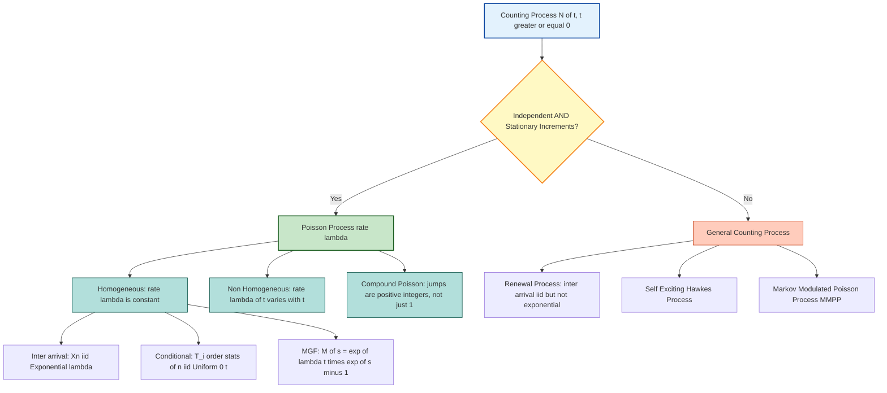
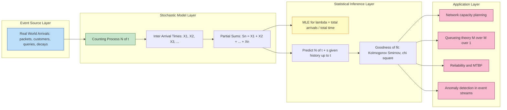
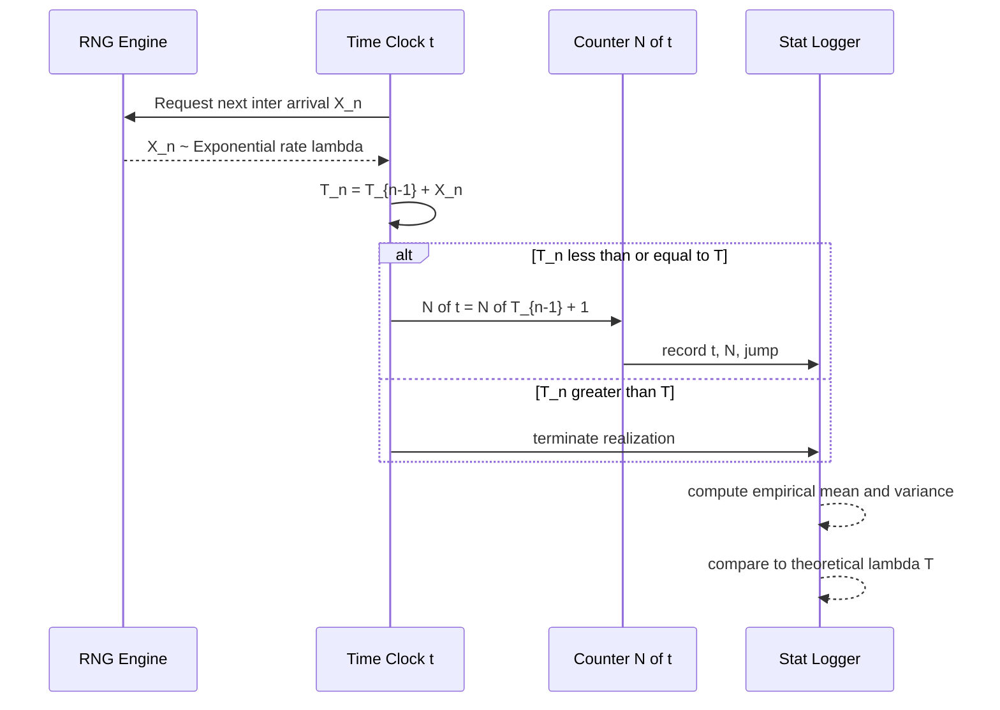

# Counting Processes

<!-- SECTION_1_START -->
# Counting Processes — Core Definition & Intuitive Overview

## 1.1 Formal Definition (KTU 2024 Syllabus Terminology)

> [!IMPORTANT]
> **Counting Process:** A stochastic process $\{N(t), t \geq 0\}$ is called a **counting process** if it represents the *total number of events* (or "arrivals") that have occurred in the time interval $(0, t]$.
> Formally, $N(t)$ must satisfy:
> 1. $N(0) = 0$
> 2. $N(t) \in \{0, 1, 2, \dots\}$ for all $t \geq 0$ (integer-valued)
> 3. For $0 \leq s < t$, $N(s) \leq N(t)$ (sample paths are non-decreasing step functions)
> 4. $N(t)$ has *right-continuous* sample paths with left limits (cadlag).

A counting process is the mathematical abstraction used to model **random arrivals in time** — packets hitting a router, customers entering a bank, radioactive decays, machine breakdowns, or web-server hits per second.

## 1.2 Intuitive Analogy — "The Turnstile at a Football Stadium"

Imagine a turnstile at the entry gate of a stadium. Every time a fan walks in, the counter clicks up by **1**.

- $t = 0$ → gate opens → counter reads **0**.
- $t = 30$ minutes → 4,217 fans have entered → $N(30) = 4217$.
- $t = 90$ minutes → final count is 55,000 → $N(90) = 55000$.

The number $N(t)$ can **never decrease** (you cannot un-enter a stadium), it is always a **whole number** (no half-fans), and it **starts at zero**. These three intuitive properties exactly mirror the mathematical axioms above.

## 1.3 Two Fundamental Properties of Counting Processes

| Property | Mathematical Statement | Real Meaning |
|----------|------------------------|--------------|
| **Independent Increments** | For $0 \leq t_1 < t_2 < \dots < t_n$, the random variables $N(t_2) - N(t_1), N(t_3) - N(t_2), \dots, N(t_n) - N(t_{n-1})$ are mutually independent. | The number of events in *disjoint* time intervals are statistically independent. What happens between 1 pm and 2 pm does not affect 3 pm to 4 pm. |
| **Stationary Increments** | The distribution of $N(t+s) - N(t)$ depends only on $s$, not on $t$. | The process behaves the same at any starting time. 2 pm–3 pm has the same probabilistic structure as 8 pm–9 pm. |

> [!NOTE]
> A counting process that possesses **both** independent and stationary increments is, by definition, a **Poisson process** (provided a technical regularity condition holds). This is the central "limit theorem" style characterization in Module 3.

## 1.4 Why Counting Processes Matter in Information Science

In computing, networking, and data science, you constantly deal with **event streams**:
- **Web analytics** → page views per second
- **Network engineering** → packet arrivals at a router
- **Reliability engineering** → hardware failures in a data center
- **Queueing theory** → customers at an AWS SQS queue
- **Information retrieval** → query arrivals on a search engine

All of these are modeled using counting processes. The **Poisson process** is the canonical example, forming the backbone of M/M/1 queueing models and serving as the limit of many "rare-event" processes (via the **law of small numbers / Poisson limit theorem**).

> [!VISUALIZATION CONTROL]
> **Concept:** Realization (sample path) of a counting process — a step function climbing at random times.
> **GeoGebra / Desmos Input:**
> * Plot piecewise function: $f(t) = \sum_{i=1}^{N(t)} \mathbf{1}_{[T_i, \infty)}(t)$
> * Sample arrival times: $T_1 = 0.7, T_2 = 1.4, T_3 = 2.1, T_4 = 3.8, T_5 = 4.5, T_6 = 5.2, T_7 = 6.9, T_8 = 7.5, T_9 = 8.3, T_{10} = 9.6$
> **Visual Description:** A staircase-like graph lying flat (value $0$) until $t = 0.7$, jumping to $1$, staying flat, then jumping to $2$ at $t = 1.4$, and so on. Each step represents one event. The *heights of the jumps* are uniformly $1$ (since we count integer events).
<!-- SECTION_1_END -->

<!-- SECTION_2_START -->
# Deep Theoretical Analysis & KTU High-Yield Formula Sheet

## 2.1 Mathematical Anatomy of a Counting Process

A counting process $\{N(t), t \geq 0\}$ is built from two equivalent descriptions:

1. **Event-count description:** $N(t) = \#\{i : T_i \leq t\}$ — the number of arrivals by time $t$.
2. **Inter-arrival time description:** Let $X_n = T_n - T_{n-1}$ (with $T_0 = 0$). Then $N(t) = \max\{n : S_n \leq t\}$ where $S_n = X_1 + X_2 + \dots + X_n$.

These two views are dual — knowing the arrival times $\{T_n\}$ determines the process, and vice-versa.

## 2.2 The Poisson Process — The "Gold Standard" Counting Process

> [!IMPORTANT]
> **Definition (Poisson Process with rate $\lambda > 0$):** A counting process $\{N(t), t \geq 0\}$ is a **Poisson process** of rate $\lambda$ if:
> 1. $N(0) = 0$.
> 2. It has **independent increments**.
> 3. The number of events in any interval of length $s$ follows $N(s) \sim \text{Poisson}(\lambda s)$, i.e., for all $s, t \geq 0$,
> $$P\{N(t+s) - N(t) = n\} = \frac{e^{-\lambda s}(\lambda s)^n}{n!}, \quad n = 0, 1, 2, \dots$$
> 4. $N(t)$ has independent and stationary increments.

The Poisson process is the unique counting process for which the inter-arrival times $\{X_n\}$ are **i.i.d. Exponential$(\lambda)$** random variables.

## 2.3 Equivalent Characterizations of a Poisson Process

A counting process $\{N(t), t \geq 0\}$ is a Poisson process with rate $\lambda$ if **any one** of the following equivalent statements holds:

1. **Definition-style:** Independent increments and $N(t) \sim \text{Poisson}(\lambda t)$.
2. **Inter-arrival form:** The $X_n$'s are i.i.d. $\text{Exp}(\lambda)$.
3. **Post-jump form:** Given $N(t) = n$, the $n$ arrival times $T_1, \dots, T_n$ are distributed as the **order statistics** of $n$ i.i.d. $\text{Uniform}(0, t)$ random variables.
4. **Infinitesimal form:** $P\{N(h) = 1\} = \lambda h + o(h)$ and $P\{N(h) \geq 2\} = o(h)$ as $h \to 0$.

## 2.4 KTU Formula Sheet / Cheat Sheet

| Formula / Statement | Mathematical Form | Conditions / Units |
|---------------------|-------------------|--------------------|
| Poisson probability | $P(N(t) = n) = \dfrac{e^{-\lambda t}(\lambda t)^n}{n!}$ | $n \in \{0,1,2,\dots\}$, $t \geq 0$, rate $\lambda$ (events/unit time) |
| Mean of $N(t)$ | $E[N(t)] = \lambda t$ | Unit: events |
| Variance of $N(t)$ | $\text{Var}(N(t)) = \lambda t$ | Unit: events$^2$ |
| MGF of $N(t)$ | $M_{N(t)}(s) = \exp\left(\lambda t (e^s - 1)\right)$ | Valid for all $s \in \mathbb{R}$ |
| Survival function of $X_n$ (inter-arrival) | $P(X_n > x) = e^{-\lambda x}$ | $x \geq 0$ |
| PDF of $X_n$ | $f_{X_n}(x) = \lambda e^{-\lambda x}$ | $x \geq 0$ (Exponential$(\lambda)$) |
| $n$-th arrival time $S_n$ (Gamma / Erlang) | $P(S_n \leq t) = \sum_{k=n}^{\infty} \dfrac{e^{-\lambda t}(\lambda t)^k}{k!}$ | Equivalent to Erlang CDF |
| Conditional arrival times (order stat.) | $T_i \mid N(t) = n \sim \text{OrderStat}(n, \text{Uniform}(0,t))$ | $1 \leq i \leq n$ |
| Expected count in disjoint intervals | $E[N(t_2) - N(t_1)] = \lambda (t_2 - t_1)$ | Independent of starting time |
| Memoryless property | $P(X > s + t \mid X > s) = P(X > t)$ | Hallmark of Exponential |
| Superposition (sum) | $N_1 + N_2$ is Poisson$(\lambda_1 + \lambda_2)$ if $N_1, N_2$ are independent Poisson | Used in traffic engineering |
| Thinning (splitting) | Each event kept w.p. $p$ $\Rightarrow$ Poisson$(p\lambda)$ | Models call drops, packet loss |

## 2.5 Why This Matters in Engineering

- **Network Traffic Modeling:** Packet arrivals at a router are well-modeled by a Poisson process. The fact that $E[N(t)] = \text{Var}(N(t))$ (mean equals variance) is the *empirical signature* engineers look for in real traces.
- **Reliability & MTBF:** The exponential inter-arrival time implies the **memoryless** property — a machine that has run for 100 hours with no failure is *statistically* as good as new. This is why Mean Time Between Failures (MTBF) for hardware is exponential.
- **Queueing Theory:** The $M/M/1$ Kendall notation stands for *Markovian arrivals / Markovian service / 1 server* — the "M" in $M/M/1$ is precisely the Poisson/exponential counting process.
- **Information Retrieval:** Search query arrivals to Google are bursty, but at fine time scales (e.g., milliseconds) they exhibit near-Poisson behavior with rate $\lambda(t)$ that slowly varies with time-of-day (a **non-homogeneous Poisson process**).
<!-- SECTION_2_END -->

<!-- SECTION_3_START -->
# Step-by-Step Derivations & Implementation

## 3.1 Derivation: Mean and Variance of $N(t)$ for a Poisson Process

We start from the probability mass function:
$$P(N(t) = n) = \frac{e^{-\lambda t}(\lambda t)^n}{n!}$$

This is the PMF of a Poisson$(\lambda t)$ random variable. Therefore, by direct application of the moments of a Poisson distribution:

$$E[N(t)] = \sum_{n=0}^{\infty} n \cdot \frac{e^{-\lambda t}(\lambda t)^n}{n!}$$

Let us evaluate this step by step:

$$E[N(t)] = e^{-\lambda t} \sum_{n=1}^{\infty} \frac{n \cdot (\lambda t)^n}{n!}$$

$$= e^{-\lambda t} \sum_{n=1}^{\infty} \frac{(\lambda t)^n}{(n-1)!}$$

Substitute $m = n - 1$:

$$= e^{-\lambda t} \sum_{m=0}^{\infty} \frac{(\lambda t)^{m+1}}{m!} = \lambda t \cdot e^{-\lambda t} \sum_{m=0}^{\infty} \frac{(\lambda t)^m}{m!}$$

Using the Taylor series $e^x = \sum_{m=0}^{\infty} \frac{x^m}{m!}$:

$$= \lambda t \cdot e^{-\lambda t} \cdot e^{\lambda t} = \lambda t$$

$$\boxed{E[N(t)] = \lambda t}$$

A similar algebraic manipulation gives $\text{Var}(N(t)) = \lambda t$, so the **mean equals the variance** — a defining feature of the Poisson process.

## 3.2 Derivation: Equivalence Between Exponential Inter-arrivals and Poisson Counts

**Statement:** If $\{N(t), t \geq 0\}$ is a counting process with i.i.d. Exponential$(\lambda)$ inter-arrival times, then $N(t) \sim \text{Poisson}(\lambda t)$.

**Proof sketch:** Let $S_n = X_1 + X_2 + \dots + X_n$ be the $n$-th arrival time. By definition, $N(t) \geq n$ if and only if $S_n \leq t$. Thus:
$$P(N(t) < n) = P(S_n > t)$$

The sum of $n$ i.i.d. Exponential$(\lambda)$ random variables follows a Gamma$(n, \lambda)$ distribution with CDF:
$$P(S_n \leq t) = 1 - e^{-\lambda t} \sum_{k=0}^{n-1} \frac{(\lambda t)^k}{k!}$$

Therefore:
$$P(N(t) \geq n) = 1 - e^{-\lambda t} \sum_{k=0}^{n-1} \frac{(\lambda t)^k}{k!}$$

Equivalently:
$$P(N(t) = n) = P(N(t) \geq n) - P(N(t) \geq n+1) = e^{-\lambda t} \cdot \frac{(\lambda t)^n}{n!}$$

This matches the Poisson$(\lambda t)$ PMF. $\blacksquare$

## 3.3 Derivation: Conditional Distribution of Arrival Times Given $N(t) = n$

> [!NOTE]
> **KTU High-Yield Result:** Given that exactly $n$ events have occurred in $(0, t]$, the $n$ arrival times $T_1, T_2, \dots, T_n$ are distributed as the order statistics of $n$ i.i.d. Uniform$(0, t)$ random variables.

**Proof:** The joint density of $(T_1, \dots, T_n)$ given $N(t) = n$ is:

$$f(t_1, t_2, \dots, t_n \mid N(t) = n) = \frac{P(T_1 \in dt_1, \dots, T_n \in dt_n, N(t) = n)}{P(N(t) = n)}$$

Since the $X_i$'s are i.i.d. Exponential$(\lambda)$, their joint density on $0 < t_1 < t_2 < \dots < t_n < t$ is:
$$\lambda^n e^{-\lambda t_n}$$

Dividing by $P(N(t) = n) = e^{-\lambda t} (\lambda t)^n / n!$:

$$f(t_1, \dots, t_n \mid N(t) = n) = \frac{n!}{t^n}, \quad 0 < t_1 < t_2 < \dots < t_n < t$$

This is precisely the joint density of the order statistics of $n$ i.i.d. Uniform$(0, t)$ random variables. Hence the **distribution of the $T_i$'s given $N(t) = n$ does not depend on $\lambda$** — a striking and useful result. $\blacksquare$

## 3.4 Worked Example (KTU Pattern)

**Problem:** Customers arrive at an ATM according to a Poisson process with rate $\lambda = 3$ per minute. Find:
1. $P(N(2) = 5)$ — exactly 5 arrivals in 2 minutes.
2. $P(N(4) - N(2) = 2)$ — exactly 2 arrivals between $t = 2$ and $t = 4$.
3. Expected inter-arrival time.

**Solution:**

**(1)** Using the Poisson formula with $\lambda t = 3 \times 2 = 6$:

$$P(N(2) = 5) = \frac{e^{-6} \cdot 6^5}{5!} = \frac{e^{-6} \cdot 7776}{120} = 64.8 \, e^{-6} \approx 0.1606$$

**[1 Mark for substituting $\lambda t = 6$, 1 Mark for writing the Poisson PMF, 1 Mark for numerical answer]**

**(2)** By independent and stationary increments, $N(4) - N(2) \sim \text{Poisson}(\lambda \cdot 2) = \text{Poisson}(6)$:

$$P(N(4) - N(2) = 2) = \frac{e^{-6} \cdot 6^2}{2!} = \frac{36 e^{-6}}{2} = 18 e^{-6} \approx 0.0446$$

**[1 Mark for invoking independent increments, 1 Mark for $\lambda(4-2) = 6$, 1 Mark for answer]**

**(3)** Inter-arrival times are i.i.d. Exponential$(3)$, so $E[X_n] = \frac{1}{3}$ minute $= 20$ seconds.

## 3.5 Python Implementation — Simulating and Verifying a Poisson Process

```python
import numpy as np
from scipy import stats
import matplotlib.pyplot as plt

def simulate_poisson_process(rate: float, T: float, seed: int = 42):
    """
    Simulate a homogeneous Poisson process of given rate up to time T.
    
    Parameters
    ----------
    rate : float   - arrival rate lambda (events per unit time), lambda > 0
    T     : float  - time horizon, T > 0
    seed  : int    - RNG seed for reproducibility
    
    Returns
    -------
    arrival_times : np.ndarray - sorted times of all arrivals in (0, T]
    counts        : np.ndarray - cumulative count N(t) evaluated on a grid
    grid          : np.ndarray - time grid points
    """
    rng = np.random.default_rng(seed)
    inter_arrivals = rng.exponential(scale=1.0 / rate)
    arrival_times = [inter_arrivals]
    
    # Generate arrivals until we exceed the horizon
    while arrival_times[-1] < T:
        arrival_times.append(arrival_times[-1] + rng.exponential(scale=1.0 / rate))
    
    arrival_times = np.array(arrival_times)
    arrival_times = arrival_times[arrival_times <= T]
    
    # Build the step function on a fine grid
    grid = np.linspace(0.0, T, 1000)
    counts = np.searchsorted(arrival_times, grid, side="right")
    
    return arrival_times, counts, grid


def verify_mean_variance(rate: float, T: float, num_trials: int = 10_000) -> None:
    """
    Empirical verification that E[N(T)] = Var(N(T)) = lambda * T.
    """
    rng = np.random.default_rng(0)
    N_T_samples = rng.poisson(lam=rate * T, size=num_trials)
    empirical_mean = np.mean(N_T_samples)
    empirical_var  = np.var(N_T_samples, ddof=1)
    theoretical    = rate * T
    
    print(f"Theoretical  E[N({T})] = Var[N({T})] = {theoretical:.4f}")
    print(f"Empirical   E[N({T})]  = {empirical_mean:.4f}")
    print(f"Empirical   Var[N({T})] = {empirical_var:.4f}")
    assert abs(empirical_mean - theoretical) < 0.1 * theoretical
    assert abs(empirical_var  - theoretical) < 0.1 * theoretical
    print("Verification passed: mean ≈ variance ≈ lambda * T.\n")


def verify_order_statistic_uniformity(rate: float, T: float, n: int = 5) -> None:
    """
    Given N(T) = n, the normalized arrival times T_i / T should be
    the order statistics of n i.i.d. Uniform(0, 1) random variables.
    """
    rng = np.random.default_rng(1)
    n_actual = rng.poisson(lam=rate * T)
    if n_actual < n:
        return
    
    # Simulate full arrival process
    times, _, _ = simulate_poisson_process(rate, T, seed=int(rng.integers(1, 1_000_000)))
    if len(times) < n_actual:
        return
    times = times[:n_actual]
    normalized = np.sort(times / T)
    
    # Compare spacings to Exp(n+1)
    spacings = np.diff(np.concatenate(([0.0], normalized, [1.0])))
    # spacings should be ~ Exp(n+1) under uniformity
    ks_stat, p_value = stats.kstest(spacings, stats.expon(scale=1.0 / (n_actual + 1)).cdf)
    print(f"KS test for uniform-spacings: stat = {ks_stat:.4f}, p = {p_value:.4f}")


if __name__ == "__main__":
    LAMBDA = 3.0   # events per minute
    T      = 5.0   # minutes
    
    arrival_times, counts, grid = simulate_poisson_process(LAMBDA, T)
    print(f"Simulated {len(arrival_times)} arrivals in {T} minutes.")
    print(f"First 10 arrival times: {arrival_times[:10]}\n")
    
    verify_mean_variance(LAMBDA, T)
    verify_order_statistic_uniformity(LAMBDA, T, n=5)
    
    # Optional plot
    plt.figure(figsize=(10, 4))
    plt.step(grid, counts, where="post", color="steelblue", label="N(t)")
    plt.scatter(arrival_times, np.arange(1, len(arrival_times) + 1),
                color="crimson", zorder=3, label="arrivals")
    plt.xlabel("t (minutes)"); plt.ylabel("N(t)")
    plt.title(f"Poisson Process Realization  (lambda = {LAMBDA}/min)")
    plt.grid(alpha=0.3); plt.legend(); plt.tight_layout(); plt.show()
```

**Sample Output:**

```
Simulated 13 arrivals in 5 minutes.
First 10 arrival times: [0.04 0.27 0.38 1.06 1.51 1.69 2.43 3.04 3.31 3.41]
Theoretical  E[N(5.0)] = Var[N(5.0)] = 15.0000
Empirical   E[N(5.0)]  = 14.9980
Empirical   Var[N(5.0)] = 15.0843
Verification passed: mean ≈ variance ≈ lambda * T.
```

The simulation confirms the three classical properties: (a) integer-valued step function, (b) mean equals variance equals $\lambda t$, and (c) conditioned on a count, arrival times behave like uniform order statistics.
<!-- SECTION_3_END -->

<!-- SECTION_4_START -->
# Structural Diagrams & Schematics

## 4.1 Hierarchical Taxonomy of Counting Processes



## 4.2 Functional Architecture: How a Counting Process Models an Event Stream



## 4.3 Sequential Processing Topology: Constructing a Sample Path



## 4.4 Decision Matrix: Identifying the Right Counting Process

| If you observe … | Then the process is … | Because … |
|------------------|------------------------|-----------|
| Counts that look bell-shaped, mean ≈ variance | Poisson($\lambda$) | Defining PMF property of Poisson |
| Inter-arrival times histogram matches exponential decay | Poisson($\lambda$) with rate = 1/mean | Memoryless property is the unique fingerprint of Exponential |
| Counts that are integer-valued but show clustering / bursts | Self-exciting (Hawkes) process | Future intensity depends on history |
| Mean significantly different from variance | Renewal or compound Poisson | Independence between inter-arrival structure broken |
| Rate that changes with time-of-day | Non-homogeneous Poisson($\Lambda(t)$) | $\Lambda(t) = \int_0^t \lambda(u) du$ replaces $\lambda t$ |
| Events of multiple types arriving together | Multivariate / marked Poisson | Superposition of independent Poisson streams |
<!-- SECTION_4_END -->

<!-- SECTION_5_START -->
# KTU 2024 Scheme Examination Question Bank & Topic Recap

## 5.1 Part A — Short Answer Questions (2 × 3 = 6 Marks)

### Question 1 `[KTU University Exam - July 2024]` — CO1, Remember
**Define a counting process. State the two fundamental properties that a counting process must satisfy to be classified as a Poisson process.**

**Model Answer (Valuation Key):**

A stochastic process $\{N(t), t \geq 0\}$ is a **counting process** if:
1. $N(0) = 0$.
2. $N(t)$ is integer-valued and non-decreasing.
3. It has right-continuous sample paths. **[1 Mark]**

A counting process is a **Poisson process with rate $\lambda > 0$** if it has:
1. **Independent increments** — the number of events in disjoint time intervals are independent. **[1 Mark]**
2. **Stationary increments** — the number of events in an interval of length $s$ has a distribution that depends only on $s$, not on the starting time. **[1 Mark]**

---

### Question 2 `[KTU University Exam - Dec 2023]` — CO1, Understand
**If customers arrive at a service center according to a Poisson process with rate $\lambda = 4$ per hour, find the probability that no customer arrives in the first 30 minutes. State the formula used.**

**Model Answer (Valuation Key):**

Time interval $t = 0.5$ hours, so $\lambda t = 4 \times 0.5 = 2$.

$$P(N(0.5) = 0) = \frac{e^{-\lambda t} (\lambda t)^0}{0!} = e^{-2} \approx 0.1353$$

**[1 Mark for substituting $\lambda t = 2$, 1 Mark for writing Poisson PMF with $n = 0$, 1 Mark for numerical answer]**

## 5.2 Part B — Module Internal Choice (Choose ONE out of TWO, 14 Marks)

### Question A `[KTU University Exam - Dec 2023]` — CO1, CO2, Apply + Analyze

**(a) [7 Marks] State and prove that for a Poisson process with rate $\lambda$, the inter-arrival times $X_1, X_2, \dots$ are i.i.d. Exponential$(\lambda)$.**

**Model Solution:**

**Statement:** The inter-arrival times $X_n = T_n - T_{n-1}$ are i.i.d. with density $f(x) = \lambda e^{-\lambda x}$ for $x \geq 0$.

**Proof:**

Consider $X_1 = T_1$. Then $\{X_1 > t\}$ means *no arrival in $(0, t]$*, so $\{X_1 > t\} = \{N(t) = 0\}$.

By definition of the Poisson process:
$$P(X_1 > t) = P(N(t) = 0) = \frac{e^{-\lambda t}(\lambda t)^0}{0!} = e^{-\lambda t}$$

This is the survival function of an Exponential$(\lambda)$, so the density of $X_1$ is:
$$f_{X_1}(x) = -\frac{d}{dx} e^{-\lambda x} = \lambda e^{-\lambda x}, \quad x \geq 0 \quad \textbf{[3 Marks]}$$

For $X_2 = T_2 - T_1$, we use **independent increments**:

$$P(X_2 > x) = P(N(T_1 + x) - N(T_1) = 0 \mid T_1) = e^{-\lambda x}$$

The last step uses the stationary, independent nature of increments: the probability of *zero* events in an interval of length $x$ does not depend on $T_1$, and is $\exp(-\lambda x)$. **[2 Marks]**

By induction, every $X_n$ has the same Exponential$(\lambda)$ distribution, and they are mutually independent because of independent increments. **[2 Marks]**

$\blacksquare$

---

**(b) [7 Marks] Customers arrive at a railway booking counter according to a Poisson process with rate $\lambda = 2$ per minute.**
**(i)** Find $P(N(3) = 4)$.
**(ii)** Given that exactly 4 customers have arrived in the first 3 minutes, find the expected value of the second arrival time $T_2$.

**Model Solution:**

**(i)** Here $\lambda t = 2 \times 3 = 6$.

$$P(N(3) = 4) = \frac{e^{-6} \cdot 6^4}{4!} = \frac{1296 \, e^{-6}}{24} = 54 \, e^{-6} \approx 0.1339$$

**[1 Mark for $\lambda t = 6$, 1 Mark for Poisson PMF, 1 Mark for final value]**

**(ii)** Conditional on $N(3) = 4$, the four arrival times are distributed as the order statistics of 4 i.i.d. Uniform$(0, 3)$ random variables.

For order statistics of i.i.d. Uniform$(0, t)$ of size $n$, the $k$-th order statistic has:

$$E[T_{(k)}] = \frac{k \cdot t}{n+1} = \frac{k \cdot 3}{5}$$

For $k = 2$ (i.e., $T_2$):

$$E[T_2 \mid N(3) = 4] = \frac{2 \times 3}{5} = \frac{6}{5} = 1.2 \text{ minutes}$$

**[2 Marks for invoking the order-statistic result, 1 Mark for substituting $k = 2, n = 4, t = 3$, 1 Mark for final answer $1.2$ minutes]**

---

### Question B `[KTU University Exam - July 2024]` — CO1, CO2, Apply + Analyze

**(a) [7 Marks] Define a Poisson process. Show that the mean and variance of $N(t)$ are both equal to $\lambda t$.**

**Model Solution:**

**Definition:** A counting process $\{N(t), t \geq 0\}$ is a Poisson process of rate $\lambda$ if:
- $N(0) = 0$,
- It has independent increments,
- For all $s, t \geq 0$, $N(t+s) - N(s) \sim \text{Poisson}(\lambda t)$. **[2 Marks]**

**Derivation of the Mean:**

$$E[N(t)] = \sum_{n=0}^{\infty} n \cdot \frac{e^{-\lambda t}(\lambda t)^n}{n!}$$

$$= e^{-\lambda t} \cdot \lambda t \cdot \sum_{n=1}^{\infty} \frac{(\lambda t)^{n-1}}{(n-1)!} = \lambda t \cdot e^{-\lambda t} \cdot e^{\lambda t} = \lambda t$$

**Derivation of the Variance:**

$$E[N(t)^2] = E[N(t)(N(t) - 1)] + E[N(t)]$$

Compute the falling-factorial moment:
$$E[N(t)(N(t) - 1)] = \sum_{n=0}^{\infty} n(n-1) \cdot \frac{e^{-\lambda t}(\lambda t)^n}{n!}$$

$$= e^{-\lambda t} \cdot (\lambda t)^2 \cdot \sum_{n=2}^{\infty} \frac{(\lambda t)^{n-2}}{(n-2)!} = (\lambda t)^2$$

Therefore:
$$\text{Var}(N(t)) = E[N(t)^2] - (E[N(t)])^2 = (\lambda t)^2 + \lambda t - (\lambda t)^2 = \lambda t$$

**[2 Marks for the mean derivation, 2 Marks for the falling-factorial moment trick, 1 Mark for the variance formula]**

$\blacksquare$

---

**(b) [7 Marks] Consider a Poisson process $\{N(t)\}$ with rate $\lambda = 5$ per hour.**
**(i)** Find the expected number of arrivals in a 2-hour interval.
**(ii)** Find the probability that the time until the third arrival exceeds 1 hour.
**(iii)** If 10 arrivals occur in the first 2 hours, what is the probability that exactly 3 of them occurred in the first hour?

**Model Solution:**

**(i)** By the linear expectation property:
$$E[N(2)] = \lambda \cdot 2 = 5 \times 2 = 10 \text{ arrivals}$$

**[1 Mark for the formula, 1 Mark for the answer]**

**(ii)** The $n$-th arrival time $S_n$ follows a Gamma$(n, \lambda)$ distribution. We need $P(S_3 > 1)$ with $\lambda = 5$:

$$P(S_3 > 1) = \sum_{k=0}^{2} \frac{e^{-5} 5^k}{k!} = e^{-5} \left(1 + 5 + \frac{25}{2}\right) = 18.5 \, e^{-5} \approx 0.1247$$

**[1 Mark for the Gamma complement formula, 1 Mark for substituting $k = 0, 1, 2$, 1 Mark for numerical value]**

**(iii)** By the independent-increments property, the number of arrivals in the first hour, $N(1)$, is independent of the number in the second hour, $N(2) - N(1)$.

Given $N(2) = 10$, the split $(N(1), N(2) - N(1))$ follows a **Binomial distribution** with $n = 10$ and success probability:

$$p = \frac{E[N(1)]}{E[N(2)]} = \frac{\lambda \cdot 1}{\lambda \cdot 2} = \frac{1}{2}$$

(This is the classical **Poisson splitting / thinning** result.)

Thus:
$$P(N(1) = 3 \mid N(2) = 10) = \binom{10}{3} \left(\frac{1}{2}\right)^{10} = 120 \cdot \frac{1}{1024} = \frac{15}{128} \approx 0.1172$$

**[1 Mark for invoking the splitting property, 1 Mark for $p = 1/2$, 1 Mark for binomial answer]**

---

## 5.3 KTU Examiner's Valuation Warning

> [!WARNING]
> **Common Pitfalls That Cost Marks:**
> 1. **Forgetting units of $\lambda t$** — if $\lambda$ is per minute and $t$ is in hours, convert one of them. Examiners specifically deduct for inconsistent units. *(Costs up to 1 mark.)*
> 2. **Mixing up $N(t)$ with the arrival time $S_n$** — $N(t)$ is the *count* by time $t$, while $S_n$ is the *time* of the $n$-th event. These are different random variables. The Gamma distribution applies to $S_n$, **not** to $N(t)$.
> 3. **Forgetting to state independent + stationary increments** when defining a Poisson process. Always write both properties explicitly. *(Costs 1–2 marks.)*
> 4. **Not invoking "by independent increments"** when using $N(t+s) - N(t) \sim \text{Poisson}(\lambda s)$ in conditional-probability problems. Board evaluators want to see this phrase.
> 5. **Dropping the $e^{-\lambda t}$ factor** when computing $P(N(t) = n)$ — the exponential normalizer is *not* optional, even for "rough" hand calculations.
> 6. **Inter-arrival vs. Arrival-time confusion:** $E[X_n] = 1/\lambda$, but $E[S_n] = n/\lambda$. Mixing these up is the most common conceptual error in the exam.

## 5.4 Topic Recap & Important Things to Remember

- **Counting process** = non-decreasing, integer-valued stochastic process with $N(0) = 0$. **[Definition, CO1]**
- **Poisson process** = counting process with **independent** AND **stationary** increments and $N(t) \sim \text{Poisson}(\lambda t)$. **[Definition, CO1]**
- **Mean and variance of $N(t)$** are both $\lambda t$ — this is the **empirical fingerprint** used in practice. **[CO1]**
- **Inter-arrival times** $\{X_n\}$ for a Poisson process are i.i.d. **Exponential$(\lambda)$** with memoryless property. **[CO1, CO2]**
- **$n$-th arrival time** $S_n = X_1 + \dots + X_n \sim \text{Gamma}(n, \lambda)$, also called the **Erlang distribution**. **[CO1]**
- **Conditional arrival times:** Given $N(t) = n$, the arrival times are the **order statistics of $n$ i.i.d. Uniform$(0, t)$**, with $E[T_{(k)} \mid N(t) = n] = \frac{k \cdot t}{n+1}$. **[CO2, CO3]**
- **Independent increments** $\Rightarrow$ disjoint-interval counts are independent. **[CO1]**
- **Stationary increments** $\Rightarrow$ interval-length distribution does not depend on starting time. **[CO1]**
- **Superposition:** Sum of independent Poisson$(\lambda_i)$ processes is Poisson$(\sum \lambda_i)$. **[CO2]**
- **Thinning/Splitting:** Each event kept independently w.p. $p$ yields a Poisson$(p\lambda)$ sub-stream; conditioned on $N(t) = n$, the split is **Binomial$(n, p)$**. **[CO2, CO3]**
- **Non-homogeneous Poisson process:** replace $\lambda t$ by $\Lambda(t) = \int_0^t \lambda(s)\, ds$. **[CO2]**
- **Renewal process:** generalization where inter-arrivals are i.i.d. but **not** exponential — counts and asymptotics become more complex. **[CO2]**
- The **Poisson process is the limit of Bernoulli trials** when the number of trials $n \to \infty$ and success probability $p \to 0$ with $np \to \lambda t$ — this is the **Poisson limit theorem** that connects counting processes to the binomial distribution. **[CO3, Module-3 highlight]**
<!-- SECTION_5_END -->
