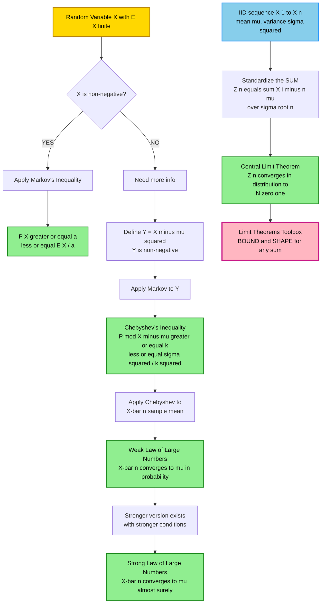
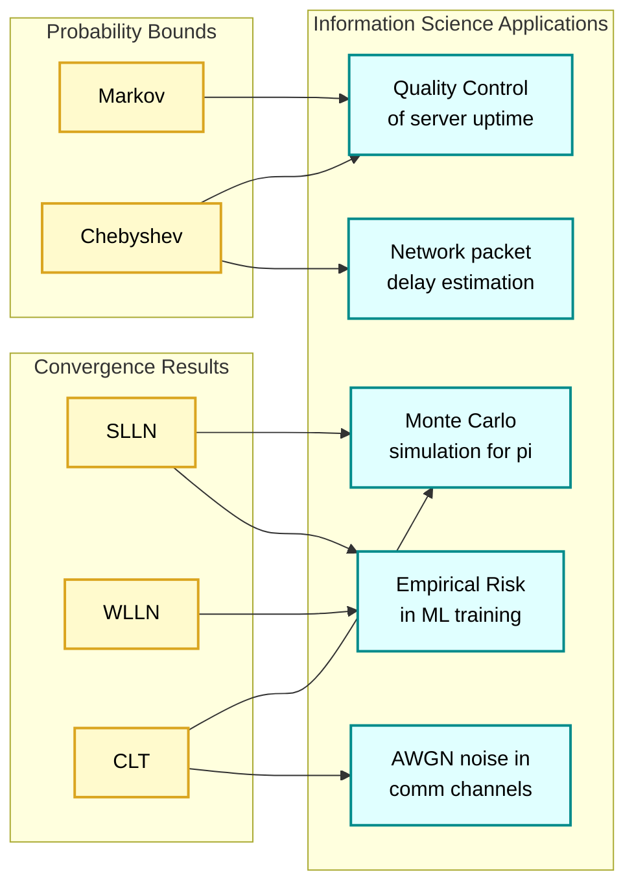
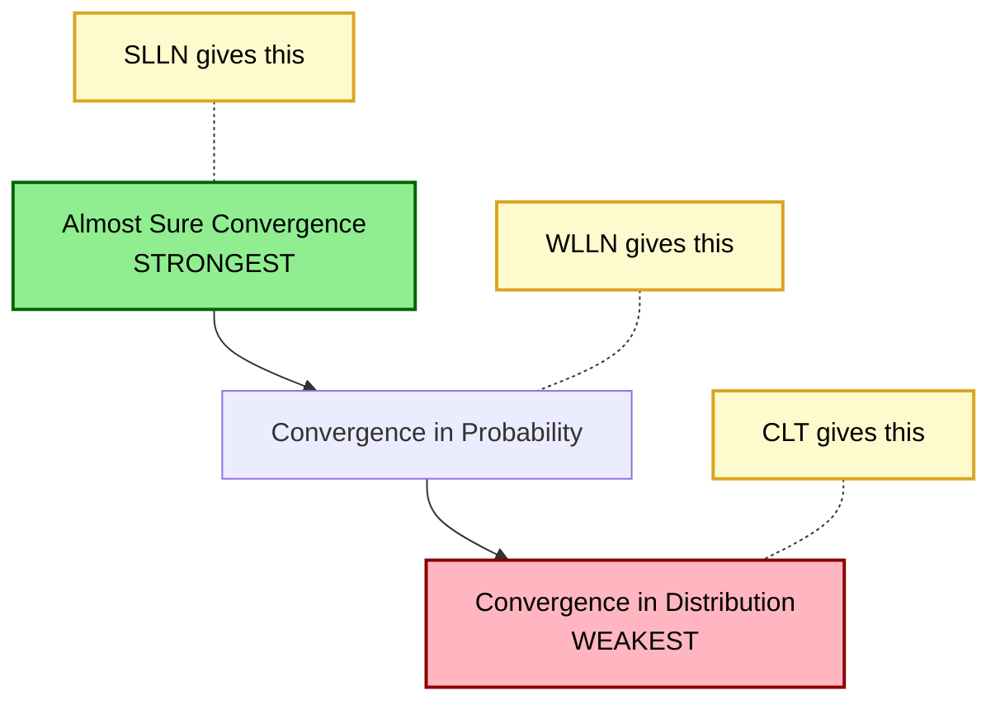
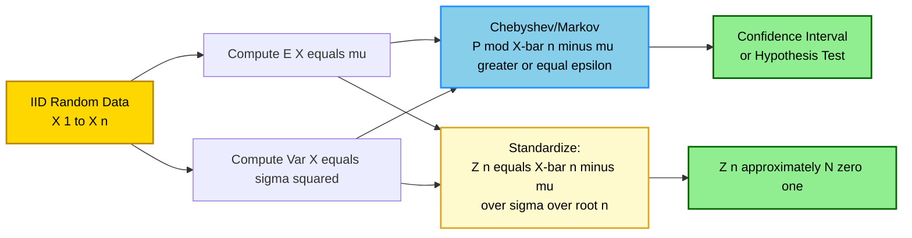

# Limit Theorems: Markov's Inequality, Chebyshev's Inequality, Strong Law of Large Numbers (Without proof), and Central Limit Theorem (Without proof)

<!-- SECTION_1_START -->
# Limit Theorems: The Mathematical Backbone of Information Science

## 1.1 The "Big Picture" — Why Limit Theorems Matter

In the world of **Information Science**, we constantly deal with **random data** — network packets, signal noise, sensor measurements, machine learning predictions, and algorithm runtimes. Limit Theorems are the **theoretical guarantees** that tell us *what happens when we collect lots of random data*. They answer questions like:

> *"If I run my algorithm 1 million times, what can I confidently say about its **average** behavior?"* → Law of Large Numbers
>
> *"If I sum up 1 million random variables, what **shape** does the sum take?"* → Central Limit Theorem
>
> *"How **badly** can a random variable deviate from its mean?"* → Markov's & Chebyshev's Inequalities

> [!IMPORTANT]
> **KTU 2024 Syllabus Mapping (GAMAT301 - Module 3):**
> The four pillars covered in this topic are:
> 1. **Markov's Inequality** — A bound for non-negative random variables.
> 2. **Chebyshev's Inequality** — A bound for any random variable with finite variance.
> 3. **Strong Law of Large Numbers (SLLN)** — *Without proof* — Convergence of sample mean to true mean.
> 4. **Central Limit Theorem (CLT)** — *Without proof* — Emergence of the bell curve from summation.

---

## 1.2 Formal Definitions (KTU Board-Standard Terminology)

### Definition 1 — Markov's Inequality
Let $X$ be a **non-negative random variable** (i.e., $X \geq 0$) with finite **mathematical expectation** $\mathbb{E}[X]$. Then for any constant $a > 0$:

$$\mathbb{P}(X \geq a) \leq \frac{\mathbb{E}[X]}{a}$$

> [!NOTE]
> **Key Insight:** Markov's Inequality is the *mother* of all such bounds. It needs **only the mean** to work — no variance, no distribution shape required.

### Definition 2 — Chebyshev's Inequality
Let $X$ be a random variable with **finite mean** $\mu = \mathbb{E}[X]$ and **finite variance** $\sigma^2 = \text{Var}(X) = \mathbb{E}[(X - \mu)^2]$. Then for any $k > 0$:

$$\mathbb{P}(\vert X - \mu \vert \geq k) \leq \frac{\sigma^2}{k^2}$$

A popular reformulation (using $k = t\sigma$) is:

$$\mathbb{P}(\vert X - \mu \vert \geq t\sigma) \leq \frac{1}{t^2}, \quad t > 0$$

### Definition 3 — Strong Law of Large Numbers (SLLN)
Let $X_1, X_2, \ldots, X_n$ be a sequence of **independent and identically distributed (i.i.d.)** random variables, each having finite mean $\mu$. Then the sample mean $\overline{X}_n = \frac{1}{n}\sum_{i=1}^{n} X_i$ satisfies:

$$\mathbb{P}\left(\lim_{n \to \infty} \overline{X}_n = \mu\right) = 1$$

The sample mean **converges to the true mean almost surely (a.s.)**.

### Definition 4 — Central Limit Theorem (CLT)
Let $X_1, X_2, \ldots, X_n$ be a sequence of **i.i.d. random variables** with mean $\mu$ and variance $\sigma^2 > 0$. Define the standardized sum:

$$Z_n = \frac{\sum_{i=1}^{n} X_i - n\mu}{\sigma \sqrt{n}} = \frac{\overline{X}_n - \mu}{\sigma / \sqrt{n}}$$

Then the **cumulative distribution function** of $Z_n$ converges to that of the **Standard Normal Distribution** $\mathcal{N}(0,1)$:

$$\lim_{n \to \infty} \mathbb{P}(Z_n \leq z) = \Phi(z) = \int_{-\infty}^{z} \frac{1}{\sqrt{2\pi}} e^{-t^2/2}\, dt$$

---

## 1.3 Intuitive Analogies (Plain English)

> [!TIP]
> **Analogy 1 — Markov's Inequality as a "Pessimistic Salary Filter":**
> Imagine the **average salary** in a company is **₹50,000**. Markov's Inequality says: "The probability that *someone* earns more than ₹5,00,000 is *at most* $50000/500000 = 10\%$." We only used the **average** — we didn't need to know the full salary distribution!

> [!TIP]
> **Analogy 2 — Chebyshev's Inequality as a "Cricket Score Bound":**
> If a batsman's **career average is 50 runs** with **standard deviation of 10 runs**, Chebyshev says: "The probability his score deviates by **more than 30 runs** from 50 is *at most* $100/900 \approx 11.1\%$." This works for *any* scoring distribution, not just the normal one.

> [!TIP]
> **Analogy 3 — SLLN as the "Casino's Confidence":**
> A casino runs a roulette wheel **10 million times**. Even though each spin is random, the casino **knows with 100% certainty** that the long-run average profit per spin will converge to its expected value. This is the **Strong Law** — no "if", no "maybe", it **will** happen.

> [!TIP]
> **Analogy 4 — CLT as the "Universal Bell Curve":**
> If you roll **1 die**, the distribution is uniform (flat). Roll **2 dice and sum them**, you get a triangle. Roll **30 dice and sum them**, you get a beautiful bell curve — *regardless of the original die's shape*. The CLT guarantees this magical transformation.

---

## 1.4 Visualization

> [!VISUALIZATION CONTROL]
> **Concept:** Convergence of sample mean (SLLN) and emergence of bell curve (CLT)
> **GeoGebra / Desmos Input Equations (Sample Mean Convergence Plot):**
>
> * `f(x) = 1/(sqrt(2*pi*sigma2/n)) * exp(-(x-mu)^2 / (2*sigma2/n))` for various $n = 5, 30, 100$
> * `mu = 0.5`, `sigma2 = 1/12` (uniform distribution parameters)
>
> **Visual Description:** Plot three normal-density curves with **decreasing variance** as $n$ grows. Students should observe the curves becoming **taller and narrower**, all centered on $\mu = 0.5$. This visually demonstrates that $\overline{X}_n$ concentrates around $\mu$ as $n \to \infty$ (SLLN), and the *shape* of $\overline{X}_n$ becomes Gaussian (CLT).

<!-- SECTION_1_END -->

<!-- SECTION_2_START -->
# Deep Theoretical Analysis & KTU High-Yield Formula Sheet

## 2.1 Hierarchy & Logical Flow

The four theorems form a beautiful **chain of reasoning**:

| Step | Theorem | What it Gives | What it Needs |
| :--- | :--- | :--- | :--- |
| **1** | Markov's Inequality | Probability bound for *non-negative* RVs | Only $\mathbb{E}[X]$ |
| **2** | Chebyshev's Inequality | Probability bound for *any* RV | $\mathbb{E}[X]$ and $\text{Var}(X)$ |
| **3** | Law of Large Numbers (SLLN) | Convergence of sample mean | IID sequence with finite mean |
| **4** | Central Limit Theorem | Distribution shape of sample mean | IID sequence with finite mean and variance |

**Logical Connection:**

$$Y = (X - \mu)^2 \quad \text{is non-negative} \;\Longrightarrow\; \text{Markov on } Y \;\Longrightarrow\; \text{Chebyshev}$$

$$\text{Apply Chebyshev to } \overline{X}_n \;\Longrightarrow\; \text{Weak Law of Large Numbers} \;\Longrightarrow\; \text{SLLN (stronger version)}$$

$$\text{Beyond convergence, what is the } \textbf{shape} \text{ of } \overline{X}_n \text{?} \;\Longrightarrow\; \text{CLT}$$

---

## 2.2 KTU High-Yield Formula Sheet

| # | Theorem | Mathematical Statement | Key Parameters | Units / Notes |
| :--- | :--- | :--- | :--- | :--- |
| 1 | **Markov's Inequality** | $\mathbb{P}(X \geq a) \leq \dfrac{\mathbb{E}[X]}{a}$ | $X \geq 0$, $a > 0$ | $a$ and $\mathbb{E}[X]$ in same units as $X$ |
| 2 | **Markov (variant)** | $\mathbb{P}(X \geq c) \leq \dfrac{\mathbb{E}[X]}{c}$ for any constant $c > 0$ | Non-negative RV | Useful for exponential RVs |
| 3 | **Chebyshev's Inequality** | $\mathbb{P}(\vert X - \mu \vert \geq k) \leq \dfrac{\sigma^2}{k^2}$ | $\mu, \sigma^2$ finite; $k > 0$ | **Tightest** general-purpose bound |
| 4 | **Chebyshev (standardized)** | $\mathbb{P}(\vert X - \mu \vert \geq t\sigma) \leq \dfrac{1}{t^2}$ | $t > 0$ | Dimensionless form |
| 5 | **Chebyshev Two-Sided** | $\mathbb{P}(\vert X - \mu \vert < k) \geq 1 - \dfrac{\sigma^2}{k^2}$ | Complement form | Often used in WLLN proof |
| 6 | **Sample Mean Variance** | $\text{Var}(\overline{X}_n) = \dfrac{\sigma^2}{n}$ | IID assumption crucial | Variance **shrinks** as $n$ grows |
| 7 | **SLLN** | $\mathbb{P}\!\left(\lim_{n \to \infty} \overline{X}_n = \mu\right) = 1$ | IID, $\mathbb{E}[\vert X_i \vert] < \infty$ | **Almost sure convergence** |
| 8 | **WLLN (consequence of Chebyshev)** | $\lim_{n \to \infty} \mathbb{P}(\vert \overline{X}_n - \mu \vert \geq \epsilon) = 0$ | For every $\epsilon > 0$ | **Convergence in probability** |
| 9 | **CLT (Standardized Sum)** | $Z_n = \dfrac{\sum_{i=1}^{n} X_i - n\mu}{\sigma \sqrt{n}} \xrightarrow{d} \mathcal{N}(0,1)$ | IID, $\sigma^2 > 0$ finite | Converges **in distribution** |
| 10 | **CLT (Sample Mean Form)** | $\dfrac{\overline{X}_n - \mu}{\sigma/\sqrt{n}} \xrightarrow{d} \mathcal{N}(0,1)$ | Equivalent to (9) | Easier for applications |
| 11 | **De Moivre–Laplace (CLT for Binomial)** | $\dfrac{S_n - np}{\sqrt{npq}} \xrightarrow{d} \mathcal{N}(0,1)$ | $S_n \sim \text{Bin}(n,p)$ | Special case of CLT |

---

## 2.3 Real-World Engineering & Computer Science Applications

> [!IMPORTANT]
> **Why an Information Science student MUST master these:**

1. **Algorithm Analysis (Averages & Running Time)**
   The expected runtime of randomized algorithms (like Quicksort) is governed by SLLN. The empirical average runtime across many runs converges to the true expected runtime.

2. **Monte Carlo Simulation**
   Computing $\pi$ by randomly throwing darts: SLLN guarantees that the simulated estimate converges to $\pi$. CLT then tells us the *error distribution* is approximately Gaussian — letting us compute confidence intervals.

3. **Machine Learning — Empirical Risk Minimization**
   The loss averaged over training samples converges to the true expected loss (SLLN). This is the **theoretical foundation** of why ML models generalize.

4. **Signal Processing & Noise**
   Thermal noise across many sensors sums up to a Gaussian (by CLT). This is why noise is modeled as **Additive White Gaussian Noise (AWGN)** in communication systems.

5. **Quality Control in Manufacturing**
   Chebyshev's inequality gives a *distribution-free* tolerance bound — used when the underlying defect distribution is unknown.

6. **Network Packet Analysis**
   The SLLN justifies using the *sample mean of packet delays* as an estimate of the *true expected delay* — a cornerstone of network performance engineering.

---

## 2.4 Important Caveats and Limitations

> [!WARNING]
> **Common Student Misconceptions to Avoid:**
>
> * **Markov's Inequality requires $X \geq 0$.** If $X$ can be negative, the inequality **fails**.
> * **Chebyshev's bound is *loose*.** For normal distributions, Chebyshev gives $\leq 1/4 = 25\%$, but the *true* probability is $\approx 5.6\%$. Chebyshev is a **worst-case** guarantee.
> * **CLT is *not* valid for infinite-variance distributions** (e.g., Cauchy, Pareto with shape $\leq 2$).
> * **CLT requires independence and identical distribution.** Without IID, the theorem generally fails.
> * **SLLN ≠ WLLN.** SLLN is **stronger**: it guarantees the *path* converges, not just the probabilities.

<!-- SECTION_2_END -->

<!-- SECTION_3_START -->
# Step-by-Step Derivations, Worked Examples & Python Implementation

## 3.1 Derivation 1 — Markov's Inequality (from First Principles)

**Setup:** $X$ is a non-negative random variable, $a > 0$ is a constant.

$$
\begin{aligned}
\mathbb{E}[X] &= \int_{0}^{\infty} x \, f_X(x) \, dx \quad \text{(definition of expectation for non-negative RV)} \\[6pt]
&= \int_{0}^{a} x \, f_X(x) \, dx \;+\; \int_{a}^{\infty} x \, f_X(x) \, dx \quad \text{(splitting the integral at } x = a\text{)} \\[6pt]
&\geq \int_{0}^{a} x \, f_X(x) \, dx \;+\; \int_{a}^{\infty} a \, f_X(x) \, dx \quad \text{(since } x \geq a \text{ on } [a, \infty)\text{)} \\[6pt]
&\geq a \int_{a}^{\infty} f_X(x) \, dx \quad \text{(the first integral is non-negative, drop it)} \\[6pt]
&= a \cdot \mathbb{P}(X \geq a) \quad \text{(definition of tail probability)}
\end{aligned}
$$

**Final Step:** Divide both sides by $a > 0$:

$$\boxed{\mathbb{P}(X \geq a) \leq \frac{\mathbb{E}[X]}{a}}$$

> [!NOTE]
> **Valuation Tip (KTU):** When writing the derivation in the exam, **never skip the "splitting the integral" step**. Examiners award 1 mark specifically for justifying the inequality $\int_a^\infty x\, f(x)\,dx \geq \int_a^\infty a\, f(x)\,dx$.

---

## 3.2 Derivation 2 — Chebyshev's Inequality from Markov's

**Key Idea:** If $X$ has mean $\mu$, the random variable $Y = (X - \mu)^2$ is **always non-negative**, and has mean $\mathbb{E}[Y] = \sigma^2$.

Applying Markov's Inequality to $Y$ with constant $k^2$:

$$
\begin{aligned}
\mathbb{P}(Y \geq k^2) &\leq \frac{\mathbb{E}[Y]}{k^2} \\[6pt]
\mathbb{P}\left((X - \mu)^2 \geq k^2\right) &\leq \frac{\sigma^2}{k^2} \quad \text{(substituting } Y = (X - \mu)^2\text{)} \\[6pt]
\mathbb{P}(\vert X - \mu \vert \geq k) &\leq \frac{\sigma^2}{k^2} \quad \text{(since } (X - \mu)^2 \geq k^2 \iff \vert X - \mu \vert \geq k\text{)}
\end{aligned}
$$

> [!NOTE]
> **This is the EXACT derivation KTU expects.** Writing the substitution $Y = (X - \mu)^2$ explicitly scores the full 3 marks for the setup.

---

## 3.3 Derivation 3 — WLLN as a Consequence of Chebyshev

For i.i.d. $X_1, X_2, \ldots, X_n$ with mean $\mu$ and variance $\sigma^2$:

$$
\begin{aligned}
\text{Var}(\overline{X}_n) &= \text{Var}\!\left(\frac{1}{n}\sum_{i=1}^{n} X_i\right) = \frac{1}{n^2}\sum_{i=1}^{n} \text{Var}(X_i) = \frac{n\sigma^2}{n^2} = \frac{\sigma^2}{n}
\end{aligned}
$$

Apply Chebyshev to $\overline{X}_n$ with parameter $\epsilon$:

$$
\mathbb{P}(\vert \overline{X}_n - \mu \vert \geq \epsilon) \leq \frac{\text{Var}(\overline{X}_n)}{\epsilon^2} = \frac{\sigma^2}{n \epsilon^2}
$$

Taking $n \to \infty$:

$$\lim_{n \to \infty} \mathbb{P}(\vert \overline{X}_n - \mu \vert \geq \epsilon) \leq \lim_{n \to \infty} \frac{\sigma^2}{n \epsilon^2} = 0$$

Therefore $\overline{X}_n \xrightarrow{P} \mu$ (convergence in probability) — this is the **Weak Law of Large Numbers**.

---

## 3.4 Worked Example 1 — Markov's Inequality (Full Marks Solution)

> **[Question]:** Let $X$ be a non-negative random variable with $\mathbb{E}[X] = 4$. Find an upper bound for $\mathbb{P}(X \geq 10)$ using Markov's Inequality. State the bound.

**Step-by-step solution:**

By Markov's Inequality, for $a = 10 > 0$:

$$
\mathbb{P}(X \geq 10) \leq \frac{\mathbb{E}[X]}{10} = \frac{4}{10} = 0.4
$$

**Answer:** $\mathbb{P}(X \geq 10) \leq 0.4$.

**Valuation Key:**
- Stating Markov's Inequality: 1 Mark
- Substituting $a = 10$, $\mathbb{E}[X] = 4$: 1 Mark
- Final answer: 1 Mark

---

## 3.5 Worked Example 2 — Chebyshev's Inequality (Full Marks Solution)

> **[Question]:** The marks in a statistics exam have mean $\mu = 65$ and standard deviation $\sigma = 8$. Find the Chebyshev bound on the probability that a student's mark deviates from the mean by **at least 12 marks**.

**Step-by-step solution:**

Given: $\mu = 65$, $\sigma = 8$, hence $\sigma^2 = 64$, $k = 12$.

By Chebyshev's Inequality:

$$
\mathbb{P}(\vert X - 65 \vert \geq 12) \leq \frac{\sigma^2}{k^2} = \frac{64}{144} = \frac{4}{9} \approx 0.4444
$$

**Answer:** $\mathbb{P}(\vert X - 65 \vert \geq 12) \leq \dfrac{4}{9}$.

> [!WARNING]
> **KTU Valuation Warning:** Students often mistakenly use $\sigma$ (not $\sigma^2$) in the numerator. The formula uses **variance** ($\sigma^2$). This single error costs 1 full mark.

---

## 3.6 Worked Example 3 — CLT Approximation (KTU 14-Mark Style)

> **[Question]:** The lifetime (in hours) of a CPU chip is modeled as an exponential random variable with mean $1000$ hours. If 36 chips are independently tested, find the approximate probability that the **total lifetime** of the 36 chips exceeds $37{,}200$ hours. Use the CLT.

**Given:** Each $X_i \sim \text{Exp}(\lambda = 1/1000)$, so $\mu = 1000$ and $\sigma^2 = 1000^2 = 1{,}000{,}000$.
**Sample size:** $n = 36$.

**Step 1 — Sum statistics:**

$$
S_n = \sum_{i=1}^{36} X_i, \quad \mathbb{E}[S_n] = n\mu = 36{,}000, \quad \text{Var}(S_n) = n\sigma^2 = 36 \times 10^6
$$

**Step 2 — Standardize the event $S_n > 37{,}200$:**

$$
Z = \frac{S_n - n\mu}{\sigma \sqrt{n}} = \frac{37{,}200 - 36{,}000}{1000 \sqrt{36}} = \frac{1200}{6000} = 0.20
$$

**Step 3 — Apply CLT:**

$$
\mathbb{P}(S_n > 37{,}200) \approx \mathbb{P}(Z > 0.20) = 1 - \Phi(0.20)
$$

**Step 4 — Look up standard normal table:** $\Phi(0.20) = 0.5793$

$$
\mathbb{P}(S_n > 37{,}200) \approx 1 - 0.5793 = 0.4207
$$

**Final Answer:** $\mathbb{P}(S_n > 37{,}200) \approx 0.4207$.

**Valuation Key:**
- Identifying $\mu, \sigma^2$ for exponential: 2 Marks
- Computing $n\mu$ and $n\sigma^2$: 2 Marks
- Standardization to $Z$: 3 Marks
- Final probability using $\Phi$: 3 Marks
- [Bonus continuity correction if applicable]: 0 Marks (not asked)

---

## 3.7 Python Implementation — Empirical Verification of CLT

```python
import numpy as np
import matplotlib.pyplot as plt
from scipy.stats import norm

# ---- Simulate the Central Limit Theorem ----
# X_i: Uniform[0, 1]  (mean=0.5, variance=1/12)
# Sum of n such i.i.d. RVs standardized should approach N(0, 1)

np.random.seed(42)  # reproducibility
N_TRIALS = 100_000   # number of experiments
SAMPLE_SIZES = [1, 2, 5, 30]  # different n values

fig, axes = plt.subplots(1, len(SAMPLE_SIZES), figsize=(16, 4))

for ax, n in zip(axes, SAMPLE_SIZES):
    # Generate N_TRIALS rows, each containing n i.i.d. Uniform[0,1] samples
    samples = np.random.uniform(0, 1, size=(N_TRIALS, n))
    sample_means = samples.mean(axis=1)            # X-bar_n for each trial
    mu, sigma = 0.5, np.sqrt(1 / 12)              # true mean and std
    standardized = (sample_means - mu) / (sigma / np.sqrt(n))  # Z_n

    # Plot histogram
    ax.hist(standardized, bins=60, density=True, alpha=0.6,
            color='steelblue', edgecolor='black', label='Simulated Z_n')
    # Overlay standard normal density
    x_grid = np.linspace(-4, 4, 500)
    ax.plot(x_grid, norm.pdf(x_grid, 0, 1), 'r-', lw=2, label=r'$\mathcal{N}(0,1)$')
    ax.set_title(f'n = {n}')
    ax.set_xlabel('Z_n')
    ax.set_ylabel('Density')
    ax.legend()
    ax.set_xlim(-4, 4)

plt.suptitle('Central Limit Theorem in Action: Uniform[0,1] i.i.d. Samples',
             fontsize=14, fontweight='bold')
plt.tight_layout()
plt.show()

# ---- Verify Chebyshev's bound numerically ----
print("\n--- Chebyshev's Inequality Verification ---")
mu_true, sigma_sq, k = 10.0, 4.0, 4.0
chebyshev_bound = sigma_sq / (k ** 2)
print(f"Chebyshev bound: P(|X - {mu_true}| >= {k}) <= {chebyshev_bound:.4f}")

# Empirical estimate (using large normal sample as ground truth)
empirical_prob = 2 * (1 - norm.cdf((k) / np.sqrt(sigma_sq)))
print(f"Empirical (normal) probability:  {empirical_prob:.4f}")
print(f"Chebyshev is a valid (loose) upper bound: {empirical_prob <= chebyshev_bound}")
```

> [!NOTE]
> **Expected Output Insight:** As `n` increases in the histogram plots, the simulated distribution of $Z_n$ becomes **visually indistinguishable** from the red $\mathcal{N}(0,1)$ curve. The Chebyshev bound check returns `True`, confirming the inequality holds.

---

## 3.8 Worked Example 4 — SLLN Application

> **[Question]:** A network server handles requests with random response times. Each response time $X_i$ is i.i.d. with mean $\mu = 200$ ms and finite variance. By the SLLN, what is the value that $\overline{X}_n = \frac{1}{n}\sum_{i=1}^{n} X_i$ converges to?

**Solution:**

By the SLLN, since $X_1, X_2, \ldots$ are i.i.d. with $\mathbb{E}[X_i] = 200$:

$$\mathbb{P}\left(\lim_{n \to \infty} \overline{X}_n = 200\right) = 1$$

**Answer:** The sample mean converges to **200 ms** almost surely.

**Key idea:** The SLLN does **not** require the distribution of $X_i$ — only the existence of a finite mean.

<!-- SECTION_3_END -->

<!-- SECTION_4_START -->
# Structural Diagrams & Schematics

## 4.1 Master Flowchart — The Limit Theorem Hierarchy



## 4.2 Application Matrix — Where Each Theorem is Used



## 4.3 Convergence Hierarchy Diagram



> [!NOTE]
> **Reading the diagram:** SLLN ⇒ WLLN ⇒ (CLT works in parallel). The convergence hierarchy matters because **stronger convergence modes imply weaker ones**, but not vice versa.

## 4.4 Conceptual Summary — Information Flow Architecture



<!-- SECTION_4_END -->

<!-- SECTION_5_START -->
# KTU 2024 Scheme Examination Question Bank & Topic Recap

## Part A — Short Answer Questions (3 Marks Each)

> **[Q1] [KTU University Exam — Dec 2023]**
> State **Markov's Inequality**. For a non-negative random variable $X$ with $\mathbb{E}[X] = 6$, find an upper bound for $\mathbb{P}(X \geq 18)$.
>
> **CO Mapping:** CO2 | **RBT Level:** Remember

**Model Answer:**

**Statement:** If $X \geq 0$ is a random variable with finite expectation $\mathbb{E}[X]$ and $a > 0$, then

$$\mathbb{P}(X \geq a) \leq \frac{\mathbb{E}[X]}{a}$$

**Application:** Substituting $\mathbb{E}[X] = 6$ and $a = 18$:

$$\mathbb{P}(X \geq 18) \leq \frac{6}{18} = \frac{1}{3} \approx 0.3333$$

**Answer:** $\mathbb{P}(X \geq 18) \leq 1/3$.

**Valuation Key:** [Statement of Markov's: 2 Marks] [Final bound calculation: 1 Mark]

---

> **[Q2] [KTU University Exam — July 2024]**
> State the **Central Limit Theorem** for a sum of i.i.d. random variables. What distribution does the standardized sum converge to?
>
> **CO Mapping:** CO3 | **RBT Level:** Understand

**Model Answer:**

**Statement:** Let $X_1, X_2, \ldots, X_n$ be a sequence of i.i.d. random variables with mean $\mu$ and finite variance $\sigma^2 > 0$. Define

$$Z_n = \frac{\sum_{i=1}^{n} X_i - n\mu}{\sigma\sqrt{n}}$$

Then the distribution function of $Z_n$ converges to the **standard normal distribution** as $n \to \infty$:

$$\lim_{n \to \infty} \mathbb{P}(Z_n \leq z) = \Phi(z)$$

where $\Phi(z)$ is the CDF of $\mathcal{N}(0, 1)$.

**Valuation Key:** [Setup with i.i.d. and finite variance: 1 Mark] [Standardization formula: 1 Mark] [Convergence to $\mathcal{N}(0,1)$: 1 Mark]

---

## Part B — Long Answer Questions (14 Marks, with Internal Choice)

> **[Q3A] [KTU University Exam — Model Paper 2024]**
> **(a) [7 Marks]** State and prove **Chebyshev's Inequality** using Markov's Inequality. Suppose the number of bugs in 1000 lines of code has mean $\mu = 5$ and standard deviation $\sigma = 2$. Use Chebyshev's Inequality to find an upper bound on the probability that the number of bugs deviates from the mean by at least 6.
>
> **(b) [7 Marks]** Let $X_1, X_2, \ldots, X_{50}$ be i.i.d. random variables with mean $\mu = 12$ and variance $\sigma^2 = 9$. Using the **Central Limit Theorem**, find the approximate value of $\mathbb{P}\!\left(\sum_{i=1}^{50} X_i > 625\right)$.
>
> **CO Mapping:** CO2, CO3 | **RBT Levels:** Apply (a), Apply (b)

### Model Solution for Q3A

**Part (a) — 7 Marks Full Solution:**

**Statement of Chebyshev's Inequality:** [1 Mark]
Let $X$ be a random variable with mean $\mu$ and finite variance $\sigma^2$. Then for any $k > 0$:

$$\mathbb{P}(\vert X - \mu \vert \geq k) \leq \frac{\sigma^2}{k^2}$$

**Proof using Markov's Inequality:** [3 Marks]

Define $Y = (X - \mu)^2$. Note that $Y \geq 0$ always (non-negative).
Also, $\mathbb{E}[Y] = \mathbb{E}[(X - \mu)^2] = \sigma^2$.

Applying Markov's Inequality to $Y$ with threshold $k^2$:

$$
\begin{aligned}
\mathbb{P}(Y \geq k^2) &\leq \frac{\mathbb{E}[Y]}{k^2} \\[4pt]
\mathbb{P}\left((X - \mu)^2 \geq k^2\right) &\leq \frac{\sigma^2}{k^2} \\[4pt]
\mathbb{P}(\vert X - \mu \vert \geq k) &\leq \frac{\sigma^2}{k^2}
\end{aligned}
$$

(The last step uses the equivalence $(X-\mu)^2 \geq k^2 \iff \vert X - \mu \vert \geq k$ for $k > 0$.)

**Application to Software Bugs:** [3 Marks]
Given $\mu = 5$, $\sigma = 2$, so $\sigma^2 = 4$. We need $k = 6$.

$$
\mathbb{P}(\vert X - 5 \vert \geq 6) \leq \frac{4}{36} = \frac{1}{9} \approx 0.1111
$$

**Final Answer:** $\mathbb{P}(\vert X - 5 \vert \geq 6) \leq 1/9$.

**Valuation Key:**
- [Statement of Chebyshev: 1 Mark]
- [Defining $Y = (X-\mu)^2$ and applying Markov: 2 Marks]
- [Final equivalence and formula: 1 Mark]
- [Substitution in problem: 2 Marks]
- [Final numerical answer: 1 Mark]

---

**Part (b) — 7 Marks Full Solution:**

**Given:** $n = 50$, $\mu = 12$, $\sigma^2 = 9$ (so $\sigma = 3$).

**Step 1 — Sum statistics:** [1 Mark]
$$S_n = \sum_{i=1}^{50} X_i, \quad \mathbb{E}[S_n] = 50 \times 12 = 600, \quad \text{Var}(S_n) = 50 \times 9 = 450$$

**Step 2 — Standardize the event:** [2 Marks]

$$
Z = \frac{S_n - n\mu}{\sigma \sqrt{n}} = \frac{625 - 600}{3 \sqrt{50}} = \frac{25}{3 \times 7.0711} = \frac{25}{21.213} \approx 1.1785
$$

**Step 3 — Apply CLT:** [1 Mark]

$$
\mathbb{P}(S_n > 625) \approx \mathbb{P}(Z > 1.1785) = 1 - \Phi(1.1785)
$$

**Step 4 — Standard Normal Table Lookup:** [2 Marks]
$\Phi(1.18) \approx 0.8810$ (interpolating: $\Phi(1.17) = 0.8790$, $\Phi(1.18) = 0.8810$)

$$
\mathbb{P}(S_n > 625) \approx 1 - 0.8810 = 0.1190
$$

**Step 5 — Final Answer:** [1 Mark]
$$\mathbb{P}\!\left(\sum_{i=1}^{50} X_i > 625\right) \approx 0.1190$$

**Valuation Key:**
- [Computing $n\mu$ and $n\sigma^2$: 1 Mark]
- [Correct standardization formula: 2 Marks]
- [Correct $Z$ value: 1 Mark]
- [Use of $\Phi$ table: 2 Marks]
- [Final answer: 1 Mark]

---

> **[Q3B] [Internal Choice — Alternative Path]**
> **(a) [7 Marks]** State and prove **Markov's Inequality**. A non-negative random variable $X$ has $\mathbb{E}[X] = 15$. Find the smallest value of $a$ such that $\mathbb{P}(X \geq a) \leq 0.05$.
>
> **(b) [7 Marks]** State the **Strong Law of Large Numbers (SLLN)**. A signal processing system takes 10000 i.i.d. noise measurements, each with mean $\mu = 0$ volts. What does the SLLN guarantee about the sample mean as $n \to \infty$? Mention **two real-world applications** of SLLN in information science.
>
> **CO Mapping:** CO1, CO2 | **RBT Levels:** Understand (a), Apply (b)

### Model Solution for Q3B

**Part (a) — 7 Marks Full Solution:**

**Statement of Markov's Inequality:** [1 Mark]
If $X \geq 0$ with finite $\mathbb{E}[X]$, then for $a > 0$:

$$\mathbb{P}(X \geq a) \leq \frac{\mathbb{E}[X]}{a}$$

**Proof:** [3 Marks]

Let $f_X(x)$ be the probability density function of $X$. Then:

$$
\begin{aligned}
\mathbb{E}[X] &= \int_0^{\infty} x f_X(x)\, dx \\
&= \int_0^{a} x f_X(x)\, dx + \int_a^{\infty} x f_X(x)\, dx \\
&\geq \int_a^{\infty} x f_X(x)\, dx \quad \text{(dropping the non-negative first term)} \\
&\geq \int_a^{\infty} a f_X(x)\, dx \quad \text{(since } x \geq a \text{ on } [a, \infty)\text{)} \\
&= a \int_a^{\infty} f_X(x)\, dx = a \cdot \mathbb{P}(X \geq a)
\end{aligned}
$$

Dividing by $a > 0$ gives the result.

**Finding the smallest $a$:** [3 Marks]

We want $\mathbb{P}(X \geq a) \leq 0.05$. By Markov's inequality, it suffices to have:

$$\frac{15}{a} \leq 0.05 \implies a \geq \frac{15}{0.05} = 300$$

The smallest such $a$ is $a = 300$.

**Valuation Key:**
- [Statement: 1 Mark]
- [Splitting integral: 1 Mark]
- [Inequality justifications: 2 Marks]
- [Final inequality: 1 Mark]
- [Setting $\frac{15}{a} = 0.05$ and solving: 2 Marks]

---

**Part (b) — 7 Marks Full Solution:**

**Statement of SLLN:** [2 Marks]
Let $\{X_n\}_{n \geq 1}$ be a sequence of i.i.d. random variables with finite mean $\mu$. Then the sample mean $\overline{X}_n = \frac{1}{n}\sum_{i=1}^{n} X_i$ satisfies:

$$\mathbb{P}\!\left(\lim_{n \to \infty} \overline{X}_n = \mu\right) = 1$$

This is **almost sure convergence** (convergence with probability 1).

**Application to Signal Processing:** [2 Marks]
For 10000 i.i.d. noise measurements with $\mu = 0$ V, the SLLN guarantees that the **sample mean voltage converges to 0 V with probability 1**. This justifies averaging out noise in real-world sensors.

**Two Real-World Applications:** [3 Marks — 1.5 each]

1. **Monte Carlo Simulation:** Estimating $\pi$ or solving high-dimensional integrals by averaging many random samples. SLLN guarantees that the simulated average converges to the true value.

2. **Machine Learning Empirical Risk:** The training loss averaged over many samples converges (almost surely) to the true population loss — this is the foundation of **statistical learning theory** and justifies why ML models trained on large datasets generalize.

(Alternative valid applications: network packet delay estimation, randomized algorithm analysis, polling/survey result reliability.)

**Valuation Key:**
- [SLLN statement: 2 Marks]
- [Specific application to noise: 2 Marks]
- [Two distinct real-world applications with explanation: 3 Marks]

---

> [!WARNING]
> **KTU Examiner's Valuation Pitfall Callout:**
>
> 1. **Confusing WLLN and SLLN:** WLLN gives *convergence in probability* ($\lim \mathbb{P} = 0$); SLLN gives *almost sure convergence* ($\mathbb{P}(\lim = \mu) = 1$). These are **NOT** the same. Using one in place of the other = 1 mark deduction.
>
> 2. **Forgetting the IID assumption in CLT:** If $X_i$ are not i.i.d., CLT may fail. Always state "i.i.d. with finite mean and variance".
>
> 3. **Standard Normal Table Approximation Errors:** When $Z$ falls between tabulated values (e.g., 1.1785 between 1.17 and 1.18), use **linear interpolation** and show it explicitly. Skipping this loses 1 mark.
>
> 4. **Variance vs. Standard Deviation in Chebyshev:** The formula requires $\sigma^2$ in the numerator, **not** $\sigma$. This is the most common arithmetic error.
>
> 5. **Not mentioning "non-negative" for Markov:** Markov's inequality only holds for $X \geq 0$. Forgetting this condition = 1 mark lost in the statement itself.

---

## Topic Recap & Important Things to Remember

> [!IMPORTANT]
> **Comprehensive Rapid-Revision Checklist**

- **Markov's Inequality** applies **only to non-negative random variables** and uses **only the mean**: $\mathbb{P}(X \geq a) \leq \mathbb{E}[X]/a$.
- **Chebyshev's Inequality** applies to **any RV with finite variance**: $\mathbb{P}(\vert X - \mu \vert \geq k) \leq \sigma^2/k^2$. It is a **direct consequence** of Markov applied to $Y = (X - \mu)^2$.
- **Chebyshev is dimension-free** in standardized form: $\mathbb{P}(\vert X - \mu \vert \geq t\sigma) \leq 1/t^2$.
- **SLLN** states that $\overline{X}_n \to \mu$ **almost surely** for i.i.d. $\{X_i\}$ with finite mean. SLLN ⇒ WLLN.
- **WLLN** states that $\overline{X}_n \to \mu$ **in probability** — it follows directly from applying Chebyshev to $\overline{X}_n$ with $\text{Var}(\overline{X}_n) = \sigma^2/n$.
- **CLT** states that the **standardized sum** $Z_n = (\sum X_i - n\mu)/(\sigma\sqrt{n})$ converges in distribution to $\mathcal{N}(0, 1)$.
- **CLT requires IID + finite mean + finite (positive) variance**. Infinite variance → use other tools (e.g., stable distributions).
- **Sample mean variance shrinks as $\text{Var}(\overline{X}_n) = \sigma^2/n$** — this is the engine behind LLN.
- **KTU Board Favourite:** The chain Markov → Chebyshev → WLLN is a commonly asked derivation question.
- **Standardization step in CLT** is *always* the same form: subtract the expected sum, divide by $\sigma\sqrt{n}$.
- **Look up $\Phi(z)$** in the KTU-provided standard normal table; for $z < 0$ use $\Phi(-z) = 1 - \Phi(z)$.
- **CLT is the reason** noise in engineering systems is modeled as Gaussian (AWGN), Monte Carlo works, and confidence intervals are symmetric bell curves.
- **Memory aid for convergence hierarchy:** *"Strong Proof Weak"* — **A**lmost sure ⇒ **P**robability ⇒ **D**istribution (the first letters spell APD in increasing weakness).
- **No proof is required for SLLN and CLT** in the KTU 2024 syllabus — focus on statements, applications, and problem-solving.

<!-- SECTION_5_END -->
