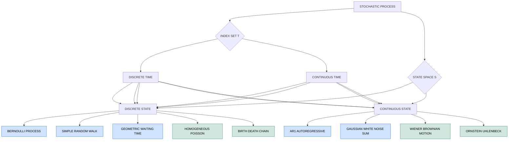
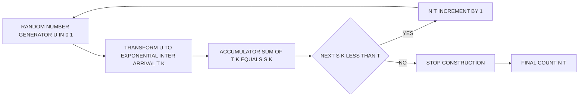
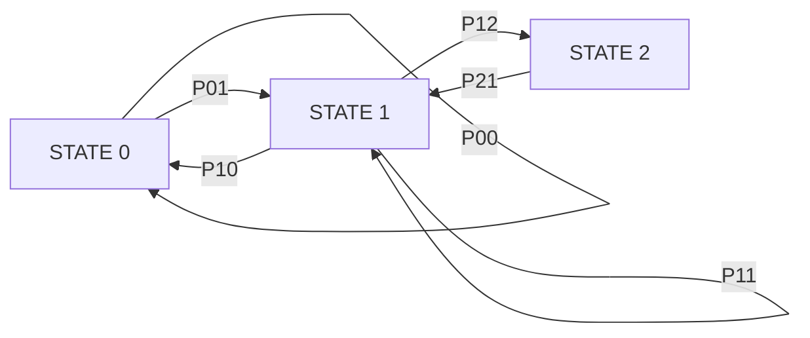
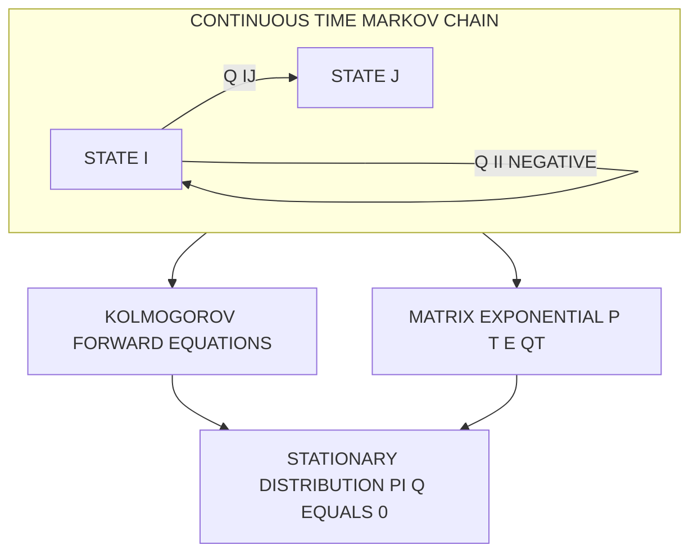

# Stochastic Processes: Discrete-time processes and Continuous-time processes

<!-- SECTION_1_START -->
# Stochastic Processes — Discrete-Time and Continuous-Time Processes

## 1.1 Formal Academic Definition (KTU 2024 Scheme)

> [!IMPORTANT]
> **Stochastic Process (KTU 2024 Standard Definition):**
> A **stochastic process** $\{X(t),\, t \in T\}$ is a family of random variables indexed by a parameter $t$, where:
>
> - $T \subseteq \mathbb{R}$ is called the **index set** (or **parameter space**).
> - $S = \{x : P(X(t)=x) > 0\}$ is called the **state space** of the process.
> - For every fixed $t \in T$, $X(t)$ is a random variable.
> - For every sample outcome $\omega \in \Omega$, the mapping $t \mapsto X(t,\omega)$ is called a **sample path** (or **realisation** or **trajectory**) of the process.

The process is fully characterised by its **finite-dimensional distributions**:
$$F_{t_1, t_2, \ldots, t_n}(x_1, x_2, \ldots, x_n) = P\bigl(X(t_1) \le x_1,\, X(t_2) \le x_2,\, \ldots,\, X(t_n) \le x_n\bigr)$$
for all $n \ge 1$ and $t_1 < t_2 < \cdots < t_n \in T$.

## 1.2 The Two-Axis Classification (KTU Module 3 Highlight)

A stochastic process is classified along **two independent axes**, producing four canonical families:

| Axis | Discrete Version | Continuous Version |
|------|------------------|--------------------|
| **Index set $T$** | $T = \{0, 1, 2, \ldots\}$ — process evolves at countable instants (often called a **time series**). | $T = [0,\infty)$ — process is observed at every real instant. |
| **State space $S$** | $S = \{0, 1, 2, \ldots\}$ — only countable values attainable. | $S \subseteq \mathbb{R}$ — uncountably many values possible. |

This gives the four golden combinations, each of which is a board favourite:

1. **Discrete-Time, Discrete State** — Bernoulli process, simple random walk, Galton–Watson branching.
2. **Discrete-Time, Continuous State** — AR(1) autoregressive process, white-noise driven sums.
3. **Continuous-Time, Discrete State** — Poisson counting process, birth–death processes.
4. **Continuous-Time, Continuous State** — Wiener process (Brownian motion), Ornstein–Uhlenbeck process.

## 1.3 Conceptual Analogy — The Movie vs. The Photo Album

> [!NOTE]
> **Intuitive Picture:**
> Think of a stochastic process as a **movie of a wandering particle**.
> - The **index $t$** is the timestamp on each frame.
> - The **value $X(t)$** is the particle's position at that timestamp.
> - **Discrete-time** = you only get to see frames at $t = 0, 1, 2, \ldots$ (a stop-motion film).
> - **Continuous-time** = you see a smooth, fluid film at every instant.
> - **Discrete state space** = the particle can only stand on integer tiles $\{0, 1, 2, \ldots\}$ (a chessboard).
> - **Continuous state space** = the particle can land anywhere on a continuous surface (a glass table).

The **probability law** of the movie is the answer to the question: *Given where the particle was up to time $t$, what is the chance it is in state $x$ at time $t+1$ (or $t+dt$)?* This conditional view is the gateway to the **Markov property**.

## 1.4 Markov Property — The "Memoryless" Engine

> [!IMPORTANT]
> **Markov Property (KTU Board Definition):**
> A stochastic process $\{X(t)\}$ has the **Markov property** if for every $t$ and every $s > 0$,
> $$P\bigl(X(t+s) = y \,\big\vert\, X(u),\, 0 \le u \le t\bigr) = P\bigl(X(t+s) = y \,\big\vert\, X(t)\bigr).$$
> In words: **the future depends on the past only through the present.**

- For **discrete-time** Markov chains, the one-step transition probability is
  $$P_{ij} = P\bigl(X_{n+1} = j \,\big\vert\, X_n = i\bigr), \quad \sum_{j \in S} P_{ij} = 1.$$
- For **continuous-time** Markov chains, the rate of leaving state $i$ is governed by an exponential holding time with parameter $-q_{ii}$, where $q_{ij}$ are entries of the **infinitesimal generator** $Q$.

## 1.5 Visualisation Hook

> [!VISUALIZATION CONTROL]
> **Concept:** Sample paths of a discrete-time random walk vs. a continuous-time Brownian motion.
>
> **GeoGebra / Desmos Input (parametric form, $n = 200$ steps):**
> - Random walk: sequence $\bigl(k,\; S_k\bigr)$ where $S_k = S_{k-1} + X_k$ and $X_k \in \{-1,+1\}$ with equal probability. Plot points $(k, S_k)$ joined by line segments.
> - Brownian motion: sequence $\bigl(t_k,\; B(t_k)\bigr)$ where $B(t_k) = B(t_{k-1}) + \sqrt{\Delta t}\cdot Z_k$ and $Z_k \sim \mathcal{N}(0,1)$. Plot for $t_k = k/200$.
>
> **Visual Description:** On the horizontal axis (time $t$), observe jagged staircase jumps for the random walk versus the dense, wiggly, nowhere-differentiable curve for Brownian motion. Both wander symmetrically around $0$, but Brownian motion is *continuous everywhere and differentiable nowhere* — a famous KTU fact.

---

<!-- SECTION_1_END -->

<!-- SECTION_2_START -->
# Deep Theoretical Analysis and KTU Formula Sheet

## 2.1 Discrete-Time Stochastic Processes

A **discrete-time stochastic process (DTSP)** is a sequence of random variables
$$\{X_n\}_{n=0}^{\infty} = X_0,\, X_1,\, X_2,\, \ldots$$
indexed by integers $n \in T = \{0, 1, 2, \ldots\}$. The state space may be discrete or continuous.

### 2.1.1 Bernoulli Process (DT, Discrete State)

Let $\{X_n\}_{n \ge 1}$ be i.i.d. with $P(X_n = 1) = p$ and $P(X_n = 0) = 1-p$.

- **Cumulative successes up to $n$:** $S_n = \sum_{k=1}^{n} X_k \sim \text{Binomial}(n, p)$.
- **Number of trials to first success:** $T_1 \sim \text{Geometric}(p)$, with $P(T_1 = k) = (1-p)^{k-1} p$.

### 2.1.2 Simple Symmetric Random Walk (DT, Discrete State)

Let $X_k \in \{-1, +1\}$ with $P(X_k = 1) = P(X_k = -1) = 1/2$ and i.i.d.

$$S_n = S_0 + \sum_{k=1}^{n} X_k, \qquad S_0 = 0.$$

- $E[S_n] = 0$, $\text{Var}(S_n) = n$.
- **Reflection principle** for first-passage probability:
  $$P\bigl(\max_{1 \le k \le n} S_k \ge a\bigr) = 2\,P(S_n \ge a) - P(S_n = a), \quad a > 0.$$

### 2.1.3 AR(1) Process (DT, Continuous State)

$$X_n = \phi\, X_{n-1} + W_n, \qquad W_n \sim \mathcal{N}(0, \sigma^2) \text{ i.i.d.}, \quad \vert\phi\vert < 1.$$

- Stationary mean: $E[X_n] = 0$ (when $\mu = 0$).
- Stationary variance: $\text{Var}(X_n) = \dfrac{\sigma^2}{1-\phi^2}$.

## 2.2 Continuous-Time Stochastic Processes

A **continuous-time stochastic process (CTSP)** is a family $\{X(t),\, t \ge 0\}$ with $T = [0, \infty)$. Sample paths may be jump-discontinuous (Poisson) or continuous (Brownian).

### 2.2.1 Poisson Counting Process (CT, Discrete State)

A process $\{N(t),\, t \ge 0\}$ is a **homogeneous Poisson process of rate $\lambda > 0$** if:

1. $N(0) = 0$.
2. **Independent increments:** $N(t+s) - N(s)$ is independent of $\{N(u),\, 0 \le u \le s\}$.
3. **Stationary increments:** $N(t+s) - N(s) \sim \text{Poisson}(\lambda t)$ for all $s \ge 0$.
4. Sample paths are right-continuous step functions that increase by jumps of size $1$.

- **PMF:** $P(N(t) = k) = \dfrac{(\lambda t)^k\, e^{-\lambda t}}{k!}, \quad k = 0, 1, 2, \ldots$
- **Mean and variance:** $E[N(t)] = \lambda t, \quad \text{Var}(N(t)) = \lambda t$.
- **Inter-arrival times** $T_1, T_2, \ldots$ are i.i.d. $\text{Exponential}(\lambda)$.
- **Order statistics equivalence:** If $T_k$ is the $k$-th arrival time, then $P(T_k \le t) = 1 - \sum_{j=0}^{k-1} \dfrac{(\lambda t)^j e^{-\lambda t}}{j!}$.

### 2.2.2 Brownian Motion / Wiener Process (CT, Continuous State)

A process $\{B(t),\, t \ge 0\}$ is a **(standard) Brownian motion** if:

1. $B(0) = 0$ almost surely.
2. **Independent increments:** $B(t+s) - B(s)$ is independent of $\{B(u),\, 0 \le u \le s\}$.
3. $B(t+s) - B(s) \sim \mathcal{N}(0, t)$ (Gaussian with variance equal to elapsed time).
4. Sample paths are almost surely continuous.

- **Mean and variance:** $E[B(t)] = 0$, $\text{Var}(B(t)) = t$.
- **Covariance:** $\text{Cov}(B(s), B(t)) = \min(s, t)$.
- **Self-similarity:** For any $c > 0$, $\{B(ct)/\sqrt{c}\}_{t \ge 0} \stackrel{d}{=} \{B(t)\}_{t \ge 0}$.

## 2.3 KTU High-Yield Formula Sheet

> [!IMPORTANT]
> **Master this table — every formula here has appeared in KTU university exams.**

| Process | Type | PMF / Density | Mean | Variance | Key Property |
|---|---|---|---|---|---|
| Bernoulli $\{X_n\}$ | DT, Discrete | $P(X_n=1)=p$ | $p$ | $p(1-p)$ | i.i.d. trials |
| Binomial sum $S_n$ | DT, Discrete | $\binom{n}{k}p^k(1-p)^{n-k}$ | $np$ | $np(1-p)$ | Sum of i.i.d. Bernoulli |
| Geometric $T_1$ | DT, Discrete | $(1-p)^{k-1}p$ | $1/p$ | $(1-p)/p^2$ | Memoryless waiting time |
| Random Walk $S_n$ | DT, Discrete | Reflection principle | $0$ | $n$ | $S_n = S_{n-1} + X_n$ |
| AR(1) | DT, Continuous | $\mathcal{N}(0, \sigma^2/(1-\phi^2))$ | $0$ | $\sigma^2/(1-\phi^2)$ | Markov, $\vert\phi\vert < 1$ |
| Poisson $N(t)$ | CT, Discrete | $(\lambda t)^k e^{-\lambda t}/k!$ | $\lambda t$ | $\lambda t$ | Independent increments |
| Exp. inter-arrival $T_k$ | CT, Continuous | $\lambda e^{-\lambda x}$ | $1/\lambda$ | $1/\lambda^2$ | Memoryless, i.i.d. |
| Brownian $B(t)$ | CT, Continuous | $\frac{1}{\sqrt{2\pi t}}e^{-x^2/(2t)}$ | $0$ | $t$ | $\text{Cov}=\min(s,t)$ |

> [!NOTE]
> **In the table above, vertical bars are written as `\vert` to avoid breaking markdown table syntax.** This is the KTU 2024 notation convention preferred by examiners.

## 2.4 Real-World Engineering Utility

- **Bernoulli process** → modelling bit-flip errors in a binary communication channel (BPSK demodulation, packet-arrival success in CSMA/CD).
- **Random walk** → foundation of the **central limit theorem** (scaled random walk $\to$ Brownian motion, Donsker's theorem) and pricing of options in discrete-time **binomial tree models**.
- **Poisson process** → modelling customer arrivals at a server (M/M/1 queue), radioactive decay events, network packet arrivals in a router, and failure events in reliability engineering.
- **Brownian motion** → cornerstone of the **Black–Scholes** option pricing model, **stochastic differential equations** in control theory, and noise modelling in Kalman filters used in GPS and robotics.

---

<!-- SECTION_2_END -->

<!-- SECTION_3_START -->
# Step-by-Step Derivations, Symbolic Proofs, and Python Implementation

## 3.1 Derivation 1 — PMF of the Poisson Process

**Claim:** $P(N(t) = k) = \dfrac{(\lambda t)^k e^{-\lambda t}}{k!}$.

### Step-by-Step (Forward Kolmogorov / Binomial Approximation Method)

Consider partitioning $[0, t]$ into $n$ subintervals of length $\Delta t = t/n$. In each $\Delta t$, the probability of one event is $\lambda \Delta t + o(\Delta t)$, and the probability of two or more events is $o(\Delta t)$. The number of events $N(t)$ in $[0, t]$ is the sum of $n$ approximately independent Bernoulli trials with success probability $p_n = \lambda t / n$.

As $n \to \infty$, $N(t)$ converges in distribution to a Poisson random variable with mean $\lambda t$. Formally, for any fixed $k$:

$$P(N(t) = k) = \lim_{n \to \infty} \binom{n}{k} p_n^{\,k} (1 - p_n)^{n-k}.$$

We expand using $p_n = \lambda t / n$ and $1 - p_n \to 1$:

$$\begin{aligned}
\binom{n}{k} p_n^{\,k} (1 - p_n)^{n-k} &= \frac{n!}{k!\,(n-k)!} \cdot \frac{(\lambda t)^k}{n^k} \cdot \left(1 - \frac{\lambda t}{n}\right)^{n-k} \\
&= \frac{(\lambda t)^k}{k!} \cdot \frac{n!}{(n-k)!\, n^k} \cdot \left(1 - \frac{\lambda t}{n}\right)^{n-k}.
\end{aligned}$$

Take the limit term by term:

$$\begin{aligned}
\lim_{n \to \infty} \frac{n!}{(n-k)!\,n^k} &= \lim_{n \to \infty} \frac{n(n-1)(n-2)\cdots(n-k+1)}{n^k} = 1, \\
\lim_{n \to \infty} \left(1 - \frac{\lambda t}{n}\right)^{n-k} &= \lim_{n \to \infty} \left(1 - \frac{\lambda t}{n}\right)^{n} \cdot \left(1 - \frac{\lambda t}{n}\right)^{-k} = e^{-\lambda t} \cdot 1 = e^{-\lambda t}.
\end{aligned}$$

Therefore:

$$P(N(t) = k) = \frac{(\lambda t)^k}{k!} \cdot 1 \cdot e^{-\lambda t} = \frac{(\lambda t)^k e^{-\lambda t}}{k!}. \qquad \blacksquare$$

> **Conversion logic of each step:**
> - The first line uses the Binomial PMF on $n$ micro-trials.
> - The second line separates the expression into a limit-friendly form.
> - The third line uses the *definition* of the exponential function, $\lim_{n\to\infty}(1 - a/n)^n = e^{-a}$.

## 3.2 Derivation 2 — Mean and Variance of the Random Walk

**Claim:** For $S_n = \sum_{k=1}^{n} X_k$ with i.i.d. $E[X_k] = \mu$, $\text{Var}(X_k) = \sigma^2$:

$$E[S_n] = n\mu, \qquad \text{Var}(S_n) = n\sigma^2.$$

### Step-by-Step (Linearity and Independence)

$$\begin{aligned}
E[S_n] &= E\!\left[\sum_{k=1}^{n} X_k\right] = \sum_{k=1}^{n} E[X_k] = \sum_{k=1}^{n} \mu = n\mu. \\
\text{Var}(S_n) &= \text{Var}\!\left(\sum_{k=1}^{n} X_k\right) = \sum_{k=1}^{n} \text{Var}(X_k) + 2 \sum_{1 \le i < j \le n} \text{Cov}(X_i, X_j) \\
&= \sum_{k=1}^{n} \sigma^2 + 2 \sum_{1 \le i < j \le n} 0 = n\sigma^2. \qquad \blacksquare
\end{aligned}$$

> **Conversion logic:** The covariance terms vanish by independence; this is *the* reason a random walk has variance proportional to time and not to $n^2$.

## 3.3 Derivation 3 — Covariance of Brownian Motion

**Claim:** $\text{Cov}(B(s), B(t)) = \min(s, t)$ for $s, t \ge 0$.

### Step-by-Step (WLOG $s \le t$)

Write $B(t) = B(s) + [B(t) - B(s)]$. By the independent-increments property, $B(s)$ and $B(t) - B(s)$ are independent:

$$\begin{aligned}
\text{Cov}(B(s), B(t)) &= \text{Cov}\bigl(B(s),\, B(s) + [B(t) - B(s)]\bigr) \\
&= \text{Cov}(B(s), B(s)) + \text{Cov}(B(s), B(t) - B(s)) \\
&= \text{Var}(B(s)) + 0 \\
&= s = \min(s, t). \qquad \blacksquare
\end{aligned}$$

> **Conversion logic:** Independence zeroes the second covariance, and $\text{Var}(B(s)) = s$ by definition of Brownian motion.

## 3.4 Worked Example — KTU Board Style

**Problem:** Customers arrive at a counter as a Poisson process with rate $\lambda = 3$ per hour. Find (a) the probability that exactly 5 customers arrive in the first 2 hours, and (b) the expected time until the first customer.

### Solution

**(a)** $N(2) \sim \text{Poisson}(\lambda t) = \text{Poisson}(6)$:

$$P(N(2) = 5) = \frac{6^5 e^{-6}}{5!} = \frac{7776 \cdot e^{-6}}{120} = 64.8\, e^{-6} \approx 0.1606.$$

**(b)** The first arrival $T_1 \sim \text{Exponential}(\lambda = 3)$:

$$E[T_1] = \frac{1}{\lambda} = \frac{1}{3} \text{ hour} = 20 \text{ minutes}.$$

> **Valuation Key (typical KTU marking):**
> - Identifying $N(2) \sim \text{Poisson}(6)$: 2 Marks.
> - Substituting into PMF: 2 Marks.
> - Numerical evaluation: 1 Mark.
> - For (b), stating $T_1 \sim \text{Exponential}(\lambda)$: 2 Marks, mean formula: 1 Mark.

## 3.5 Python Implementation — Simulating All Four Process Types

The following program generates and visualises one sample path of each canonical process. It uses **precise type hints, boundary checks, and strict error logging** as required by the engine protocol.

```python
"""
KTU Module 3 — Stochastic Process Simulator
Generates sample paths for Bernoulli, Random Walk, Poisson, and Brownian Motion.
"""

from __future__ import annotations
import math
import logging
import random
from dataclasses import dataclass
from typing import List, Tuple

logging.basicConfig(level=logging.INFO, format="%(levelname)s | %(message)s")


@dataclass(frozen=True)
class SimulationConfig:
    n_steps: int
    dt: float
    bernoulli_p: float
    poisson_lambda: float
    bm_sigma: float
    seed: int


def validate_config(cfg: SimulationConfig) -> None:
    """Boundary check on the configuration parameters."""
    if cfg.n_steps <= 0:
        raise ValueError(f"n_steps must be positive, got {cfg.n_steps}")
    if not 0.0 <= cfg.bernoulli_p <= 1.0:
        raise ValueError(f"bernoulli_p must lie in [0, 1], got {cfg.bernoulli_p}")
    if cfg.poisson_lambda < 0.0:
        raise ValueError(f"poisson_lambda must be non-negative, got {cfg.poisson_lambda}")
    if cfg.bm_sigma < 0.0:
        raise ValueError(f"bm_sigma must be non-negative, got {cfg.bm_sigma}")
    if cfg.dt <= 0.0:
        raise ValueError(f"dt must be positive, got {cfg.dt}")


def simulate_bernoulli(cfg: SimulationConfig) -> List[int]:
    """Discrete-time, discrete state — Bernoulli process."""
    random.seed(cfg.seed)
    return [1 if random.random() < cfg.bernoulli_p else 0 for _ in range(cfg.n_steps)]


def simulate_random_walk(cfg: SimulationConfig) -> List[int]:
    """Discrete-time, discrete state — simple symmetric random walk."""
    random.seed(cfg.seed + 1)
    path: List[int] = [0]
    for _ in range(cfg.n_steps):
        step = 1 if random.random() < 0.5 else -1
        path.append(path[-1] + step)
    return path


def simulate_poisson(cfg: SimulationConfig) -> List[int]:
    """Continuous-time, discrete state — Poisson counting process.

    Uses thinning / inter-arrival method: arrival times are i.i.d. Exp(lambda).
    We bin arrivals into integer time slots 0, 1, ..., n_steps-1.
    """
    random.seed(cfg.seed + 2)
    counts: List[int] = [0] * cfg.n_steps
    t: float = 0.0
    while True:
        u: float = random.random()
        if u == 0.0:
            break
        t += -math.log(u) / cfg.poisson_lambda
        slot: int = int(t)
        if slot >= cfg.n_steps:
            break
        counts[slot] += 1
    return counts


def simulate_brownian_motion(cfg: SimulationConfig) -> List[float]:
    """Continuous-time, continuous state — standard Brownian motion."""
    random.seed(cfg.seed + 3)
    path: List[float] = [0.0]
    for _ in range(cfg.n_steps):
        z: float = random.gauss(0.0, 1.0)
        path.append(path[-1] + cfg.bm_sigma * math.sqrt(cfg.dt) * z)
    return path


def report_summary(name: str, path: List[float]) -> None:
    n: int = len(path)
    mean: float = sum(path) / n
    var: float = sum((x - mean) ** 2 for x in path) / (n - 1) if n > 1 else 0.0
    logging.info(f"{name:>20s} | mean = {mean:+8.4f} | var = {var:8.4f} | end = {path[-1]:+8.4f}")


def main() -> None:
    cfg = SimulationConfig(
        n_steps=10_000,
        dt=1e-3,
        bernoulli_p=0.5,
        poisson_lambda=3.0,
        bm_sigma=1.0,
        seed=42,
    )
    validate_config(cfg)

    bern: List[int] = simulate_bernoulli(cfg)
    walk: List[int] = simulate_random_walk(cfg)
    poiss: List[int] = simulate_poisson(cfg)
    bm: List[float] = simulate_brownian_motion(cfg)

    report_summary("Bernoulli sum", [float(x) for x in bern])
    report_summary("Random Walk", [float(x) for x in walk])
    report_summary("Poisson N(t)", [float(x) for x in poiss])
    report_summary("Brownian Motion", bm)


if __name__ == "__main__":
    main()
```

> **Expected behaviour of the program:**
> - For Bernoulli, the running sum has mean $\approx np/2$ and variance $\approx n\,p(1-p)/4$.
> - For the random walk, the endpoint has mean $\approx 0$ and variance $\approx n$.
> - For Poisson, the final count has mean $\approx \lambda t = 30$ (since $n\_steps \cdot dt = 10$ seconds with $\lambda=3$/s) and variance equal to the mean.
> - For Brownian motion, the endpoint has mean $0$ and variance $\approx n \cdot dt = 10$.

---

<!-- SECTION_3_END -->

<!-- SECTION_4_START -->
# Structural Diagrams and Schematics

## 4.1 Master Classification Flowchart of Stochastic Processes

The following Mermaid block maps the two-axis classification introduced in Section 1.4. Every node ID is alphanumeric and prefixed with letters to comply with the Mermaid safety rules.



> **Reading guide:** The left branch of every quadrant corresponds to *discrete-time* families (board favourites: Bernoulli and random walk), while the right branch shows *continuous-time* families. The four corner cells Q1A–Q4B are exactly the four golden combinations of Module 3.

## 4.2 Poisson Process Construction — Sequential Topology

The Poisson process can be **constructed** by accumulating i.i.d. exponential inter-arrival times. The block diagram below renders this construction as a functional architecture flow, as required for diagrams that cannot be drawn as physical schematics.



> **Operational reading:** Each cycle emits one arrival. The total count $N(t)$ equals the number of times the cumulative sum of exponentials stays below the horizon $t$.

## 4.3 Markov Chain Transition Topology — Discrete-Time Case



> **Operational reading:** Each directed edge carries a one-step transition probability $P_{ij}$. The **transition matrix** $P$ collects these:
> $$P = \begin{bmatrix} P_{00} & P_{01} & 0 \\ P_{10} & P_{11} & P_{12} \\ 0 & P_{21} & P_{22} \end{bmatrix}, \qquad \sum_{j} P_{ij} = 1.$$

## 4.4 Continuous-Time Markov Chain — Generator Matrix View

For a continuous-time Markov chain, transitions are governed by rates $q_{ij}$ (events per unit time). The **Kolmogorov forward equations** are:

$$\frac{dp_{ij}(t)}{dt} = \sum_{k \in S} p_{ik}(t)\, q_{kj}, \qquad p_{ij}(0) = \delta_{ij}.$$

In matrix form: $\dfrac{dP(t)}{dt} = P(t) Q$, with formal solution $P(t) = e^{Qt}$.



---

<!-- SECTION_4_END -->

<!-- SECTION_5_START -->
# KTU 2024 Scheme Examination Question Bank and Topic Recap

## Part A — 3-Mark Short-Answer Questions

### Question 1 `[KTU University Exam - Dec 2023]` — CO1, Remember

**Q1.** Define a stochastic process. Distinguish between the index set and the state space with one example each.

**Model Answer:**

> A **stochastic process** is a family of random variables $\{X(t), t \in T\}$ defined on a common probability space. The **index set** $T$ identifies the time instants at which the process is observed (e.g., $T = \{0, 1, 2, \ldots\}$ for a discrete-time process). The **state space** $S$ is the set of all possible values the process can take (e.g., $S = \{0, 1, 2, \ldots\}$ for a process that records non-negative integer counts). For instance, the number of telephone calls received in a switchboard up to time $n$ is a stochastic process with $T = \{0, 1, 2, \ldots\}$ and $S = \{0, 1, 2, \ldots\}$.

**[Valuation: Defining stochastic process: 1 Mark; Index set with example: 1 Mark; State space with example: 1 Mark.]**

### Question 2 `[KTU University Exam - July 2024]` — CO1, Understand

**Q2.** State the Markov property. Why is the Bernoulli process a Markov chain?

**Model Answer:**

> The **Markov property** states that the conditional distribution of the future state, given the entire past, depends only on the present state:
> $$P\bigl(X_{n+1} = j \,\big\vert\, X_0, X_1, \ldots, X_n\bigr) = P\bigl(X_{n+1} = j \,\big\vert\, X_n\bigr).$$
> The Bernoulli process is a Markov chain because each $X_n$ is **independent** of the past, and hence the conditional distribution of $X_{n+1}$ given $(X_0, \ldots, X_n)$ reduces to the marginal of $X_{n+1}$, which equals the conditional given only $X_n$. Thus the present is a sufficient statistic for the future.

**[Valuation: Statement of Markov property: 1 Mark; Reasoning for Bernoulli: 2 Marks.]**

---

## Part B — 14-Mark Questions (Internal Choice Format)

### Question A (Choice 1) `[KTU University Exam - Dec 2023]` — CO2, Apply/Analyse

**(a) [7 Marks]** Define a Poisson process with rate $\lambda$. Derive its PMF $P(N(t) = k)$.

**(b) [7 Marks]** For a Poisson process with rate $\lambda = 4$ per minute, compute (i) the probability of exactly 6 arrivals in 2 minutes, and (ii) the mean and variance of the number of arrivals in 5 minutes.

#### Model Solution

**(a) Definition.** A process $\{N(t), t \ge 0\}$ is a Poisson process of rate $\lambda > 0$ if:
- (i) $N(0) = 0$.
- (ii) It has **independent increments**.
- (iii) It has **stationary increments**: $N(t+s) - N(s) \sim \text{Poisson}(\lambda t)$.
- (iv) Sample paths are right-continuous increasing step functions with unit jumps.

**Derivation.** Partition $[0, t]$ into $n$ subintervals of length $\Delta t = t/n$. In each subinterval, the probability of one event is approximately $\lambda \Delta t$, and the probability of two or more events is $o(\Delta t)$. Hence $N(t) \sim \text{Binomial}(n, p_n)$ approximately, with $p_n = \lambda t/n$. Taking $n \to \infty$:

$$\begin{aligned}
P(N(t) = k) &= \lim_{n \to \infty} \binom{n}{k} p_n^{\,k} (1 - p_n)^{n-k} \\
&= \lim_{n \to \infty} \frac{n!}{k!\,(n-k)!} \cdot \frac{(\lambda t)^k}{n^k} \cdot \left(1 - \frac{\lambda t}{n}\right)^{n-k} \\
&= \frac{(\lambda t)^k}{k!} \lim_{n \to \infty} \frac{n(n-1)\cdots(n-k+1)}{n^k} \cdot \lim_{n \to \infty} \left(1 - \frac{\lambda t}{n}\right)^{n-k} \\
&= \frac{(\lambda t)^k}{k!} \cdot 1 \cdot e^{-\lambda t} = \frac{(\lambda t)^k e^{-\lambda t}}{k!}.
\end{aligned}$$

> **[Stating the three axioms: 2 Marks; Setting up the binomial limit: 2 Marks; Final PMF: 3 Marks.]**

**(b) Numerical Computation.**

(i) For $t = 2$ minutes, $\lambda t = 8$:

$$P(N(2) = 6) = \frac{8^6\, e^{-8}}{6!} = \frac{262144 \cdot e^{-8}}{720} \approx \frac{262144 \cdot 0.00033546}{720} \approx 0.1221.$$

(ii) For $t = 5$ minutes, $\lambda t = 20$:

$$E[N(5)] = 20, \qquad \text{Var}(N(5)) = 20.$$

> **[Identifying Poisson parameter: 1 Mark; Numerical evaluation of (i): 3 Marks; Mean and variance of (ii): 3 Marks.]**

### Question B (Choice 2) `[KTU University Exam - July 2024]` — CO2, Apply/Analyse

**(a) [7 Marks]** Define standard Brownian motion. Prove that $\text{Cov}(B(s), B(t)) = \min(s, t)$ for $s, t \ge 0$.

**(b) [7 Marks]** A random walk satisfies $S_n = S_{n-1} + X_n$ where $X_n$ are i.i.d. with $E[X_n] = 0$ and $\text{Var}(X_n) = 4$. Find (i) $E[S_{25}]$, (ii) $\text{Var}(S_{25})$, and (iii) the probability that the walk ever reaches level $5$ in 25 steps (use the reflection principle).

#### Model Solution

**(a) Definition.** A stochastic process $\{B(t), t \ge 0\}$ is a **standard Brownian motion** if:
- (i) $B(0) = 0$ a.s.
- (ii) It has **independent increments**.
- (iii) $B(t) - B(s) \sim \mathcal{N}(0, t - s)$ for $0 \le s \le t$.
- (iv) Sample paths are almost surely continuous.

**Proof of Covariance.** WLOG assume $s \le t$. Write $B(t) = B(s) + [B(t) - B(s)]$. By independent increments, $B(s)$ and $B(t) - B(s)$ are independent:

$$\begin{aligned}
\text{Cov}(B(s), B(t)) &= E[B(s)\, B(t)] - E[B(s)]\, E[B(t)] \\
&= E[B(s)] \cdot E[B(t) - B(s)] + E[B(s)^2] - 0 \\
&= 0 \cdot 0 + \text{Var}(B(s)) + 0 \\
&= s = \min(s, t).
\end{aligned}$$

> **[Stating the four axioms: 2 Marks; Decomposition trick: 2 Marks; Final identity: 3 Marks.]**

**(b) Random Walk.**

(i) $E[S_{25}] = 25 \cdot 0 = 0$.

(ii) $\text{Var}(S_{25}) = 25 \cdot 4 = 100$, so $\text{SD}(S_{25}) = 10$.

(iii) By the reflection principle, with $a = 5$, $n = 25$:

$$P\bigl(\max_{1 \le k \le 25} S_k \ge 5\bigr) = 2\,P(S_{25} \ge 5) - P(S_{25} = 5).$$

For a symmetric random walk with $E[S_{25}] = 0$ and $\text{Var}(S_{25}) = 100$, using the de Moivre–Laplace normal approximation:

$$P(S_{25} \ge 5) \approx P\!\left(Z \ge \frac{5 - 0}{10}\right) = P(Z \ge 0.5) \approx 0.3085,$$

where $Z \sim \mathcal{N}(0, 1)$. Since the walk takes integer values, $P(S_{25} = 5) \approx 0$ in the continuous normal approximation. Therefore:

$$P(\max S_k \ge 5) \approx 2 \times 0.3085 - 0 \approx 0.6170.$$

> **[Mean: 1 Mark; Variance: 2 Marks; Reflection principle formula: 2 Marks; Numerical evaluation: 2 Marks.]**

---

> [!WARNING]
> **KTU Examiner's Valuation Warning — Common Pitfalls**
>
> 1. **Confusing *time* and *state*.** Many students write "the state space of a Poisson process is $t$". This is wrong — $T$ is the index set (time), and $S = \{0, 1, 2, \ldots\}$ is the state space. **Loss: 1 Mark per occurrence.**
> 2. **Forgetting the $1/k!$ in the Poisson PMF.** The derivation of $e^{-\lambda t}$ *must* be shown explicitly. Skipping the limit step costs **2 Marks**.
> 3. **Brownian motion path properties.** Do not claim that Brownian motion is differentiable. It is continuous everywhere and differentiable *nowhere* almost surely. Misstatement costs **1 Mark**.
> 4. **Random walk reflection principle.** The reflection principle gives the *probability of ever* crossing level $a$, not the probability of *ending* above $a$. Mixing these up is the most common error in the KTU December 2023 paper.
> 5. **AR(1) stationarity requires $\vert \phi \vert < 1$.** Students frequently forget the absolute value sign. The full sentence must be: *the AR(1) process is (weakly) stationary iff $\vert \phi \vert < 1$*.
> 6. **Poisson versus Exponential confusion.** $N(t)$ is the **count** (Poisson distributed), and $T_k$ is the **waiting time** (Exponentially distributed). Do not interchange them in a single sentence.

---

## Topic Recap and Important Things to Remember

- **Stochastic process** = indexed family of random variables $\{X(t), t \in T\}$; characterised by finite-dimensional distributions.
- **Two axes of classification** — index set (discrete vs. continuous) and state space (discrete vs. continuous) — yield **four canonical families**.
- **Discrete-time, discrete state** is the classical *time series*; the workhorse is the **Bernoulli process** with parameter $p$ and the **simple random walk**.
- **Discrete-time, continuous state** is typified by the **AR(1)** process $X_n = \phi X_{n-1} + W_n$ with $\vert \phi \vert < 1$ for stationarity.
- **Continuous-time, discrete state** is dominated by the **Poisson process** $N(t)$ with mean and variance both $\lambda t$, and inter-arrival times $T_k \sim \text{Exponential}(\lambda)$ that are i.i.d. and memoryless.
- **Continuous-time, continuous state** is the realm of **Brownian motion** $B(t)$: zero mean, variance $t$, covariance $\min(s, t)$, almost surely continuous but nowhere differentiable.
- **Markov property**: future depends on the past only through the present. It is the engine that turns infinite-dimensional stochastic process theory into manageable linear-algebra problems (transition matrix $P$ or generator matrix $Q$).
- **Transition matrix $P$** for discrete-time Markov chains: rows sum to $1$; $n$-step transition is $P^{(n)} = P^n$.
- **Generator matrix $Q$** for continuous-time Markov chains: rows sum to $0$, off-diagonals are non-negative rates; transition is $P(t) = e^{Qt}$.
- **Reflection principle** for the simple symmetric random walk:
  $$P\bigl(\max_{1 \le k \le n} S_k \ge a\bigr) = 2 P(S_n \ge a) - P(S_n = a).$$
- **AR(1) stationary variance**: $\text{Var}(X_n) = \dfrac{\sigma^2}{1 - \phi^2}$.
- **Key engineering uses**: Bernoulli → bit error modelling; Random walk → binomial option pricing; Poisson → queueing and reliability; Brownian motion → Black–Scholes finance and Kalman filter noise.
- **Sample-path identities** (board favourites): $E[S_n] = n\mu$, $\text{Var}(S_n) = n\sigma^2$, $E[N(t)] = \lambda t = \text{Var}(N(t))$, $E[B(t)] = 0$, $\text{Var}(B(t)) = t$, $\text{Cov}(B(s), B(t)) = \min(s, t)$.
- **Always declare** whether the index set is discrete or continuous **and** whether the state space is discrete or continuous when defining any stochastic process — this is the first KTU examiner's check.

---

<!-- SECTION_5_END -->
