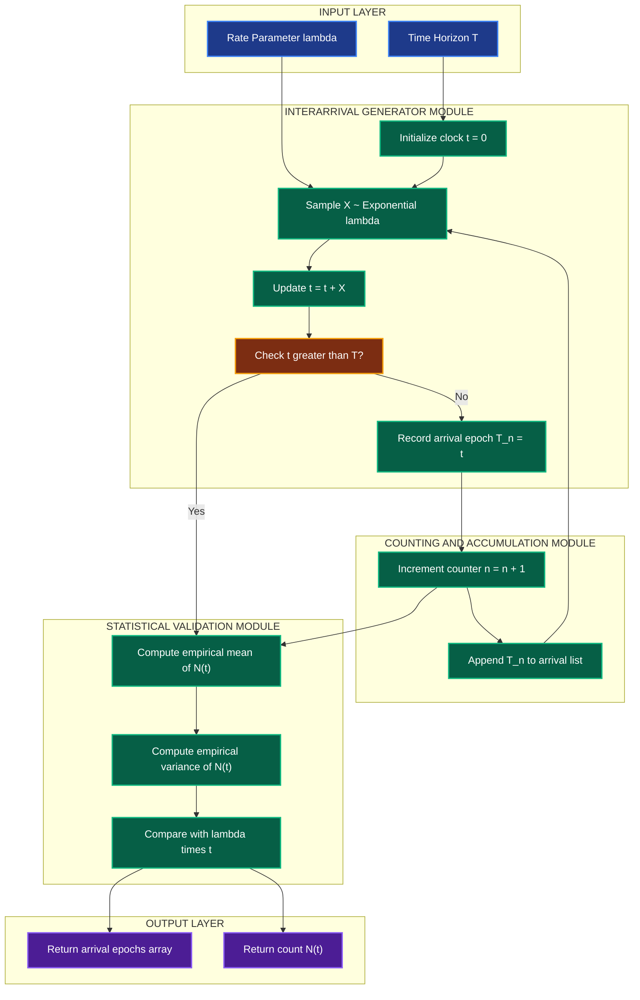
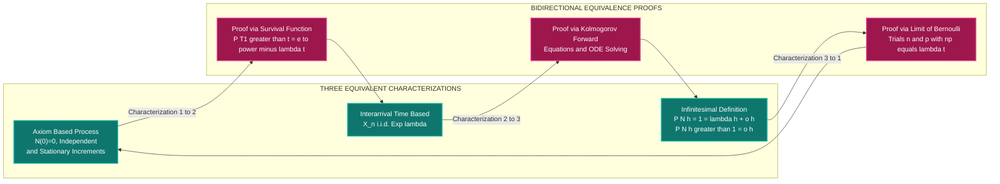

# The Poisson Process

<!-- SECTION_1_START -->
# The Poisson Process — Core Definition & Intuitive Overview

## 1.1 Formal Definition (KTU 2024 Syllabus Terminology)

A **stochastic counting process** $\{N(t), t \geq 0\}$ is called a **Poisson Process** with constant rate parameter $\lambda > 0$ if it satisfies the following three fundamental axioms:

1. **Initial Condition:** $N(0) = 0$ with probability **1** (the process starts with no events).
2. **Independent Increments:** The number of events occurring in disjoint time intervals are mutually independent random variables.
3. **Stationary (Homogeneous) Increments:** The distribution of the number of events in any interval of length $t$ depends only on the length of the interval, not on its starting point. Formally:

$$
P(N(t+s) - N(s) = k) = \frac{e^{-\lambda t}(\lambda t)^k}{k!}, \quad k = 0, 1, 2, \ldots
$$

> [!IMPORTANT]
> The parameter $\lambda$ represents the **average rate of occurrence** of events per unit time. The expected value is $E[N(t)] = \lambda t$ and the variance is $Var(N(t)) = \lambda t$.

## 1.2 Intuitive Analogy — The "Random Customer Arrival" Model

Imagine you are sitting at the billing counter of a supermarket, watching customers arrive **completely at random**. The Poisson Process is the mathematical clock ticking on this scene:

- **$\lambda$** = the average number of customers walking in per minute.
- **$N(t)$** = the total count of customers that have arrived by time $t$.
- The fact that intervals "remember nothing" (memoryless property) mirrors how the next customer has no idea how long you have been waiting.

> [!NOTE]
> **Why this matters in Information Science:** Network packet arrivals, hardware failure events, database query hits, and queueing systems (M/M/1, M/M/c) are all modeled directly via Poisson Processes. It is the foundational building block of all queueing theory.

## 1.3 Visualizing the Process — Mermaid Timeline

> [!VISUALIZATION CONTROL]
> **Concept:** Sample Path of a Poisson Counting Process $N(t)$
> **GeoGebra / Desmos Input Equations:**
> * `N(t) = floor(s*lambda)` where `s = t * random_normal()` simulated over a normalized time grid
> * Plot a step function that jumps by **+1** at each random exponential interarrival instant
> **Visual Description:** A right-continuous, non-decreasing staircase function that starts at the origin, takes unit jumps of size **+1** at random points $T_1 < T_2 < T_3 < \ldots$, and tends to infinity as $t \to \infty$.

---

## 1.4 Three Equivalent Characterizations of the Poisson Process

| # | Characterization Name | Defining Statement |
|---|------------------------|--------------------|
| 1 | **Axiomatic Counting Definition** | Satisfies $N(0)=0$, independent increments, stationary Poisson-distributed increments. |
| 2 | **Interarrival Time Definition** | Successive interarrival gaps $X_n = T_n - T_{n-1}$ are i.i.d. **Exponential($\lambda$)** random variables. |
| 3 | **Infinitesimal Definition** | $P(N(h) = 1) = \lambda h + o(h)$ and $P(N(h) \geq 2) = o(h)$ as $h \to 0$. |

> [!TIP]
> KTU frequently asks the **equivalence proof** between Characterizations 1 and 2. Memorize the Laplace Transform identity: if $X \sim \text{Exp}(\lambda)$, then $E[e^{-sX}] = \dfrac{\lambda}{\lambda + s}$.

<!-- SECTION_1_END -->

<!-- SECTION_2_START -->
# Deep Theoretical Analysis & KTU High-Yield Formula Sheet

## 2.1 Derivation of the Poisson Distribution from Axioms

We derive $P(N(t) = k)$ for a Poisson Process using the **infinitesimal method** and the standard limit definition. Let $P_k(t) = P(N(t) = k)$.

**Step 1 — Differential Equation Setup.** For a small time increment $h$:

$$
P_k(t+h) = P_k(t) \cdot P(N(h) = 0) + P_{k-1}(t) \cdot P(N(h) = 1) + \sum_{j \geq 2} P_{k-j}(t) P(N(h) = j)
$$

**Step 2 — Apply the Infinitesimal Limits.**
* $P(N(h) = 0) = 1 - \lambda h + o(h)$
* $P(N(h) = 1) = \lambda h + o(h)$
* $P(N(h) \geq 2) = o(h)$

**Step 3 — Substituting:**

$$
P_k(t+h) = (1 - \lambda h) P_k(t) + \lambda h \, P_{k-1}(t) + o(h)
$$

Rearranging and dividing by $h$, then letting $h \to 0$:

$$
\frac{dP_k(t)}{dt} = -\lambda P_k(t) + \lambda P_{k-1}(t)
$$

**Step 4 — Solving the ODE system** with $P_0(0) = 1$ and $P_k(0) = 0$ for $k \geq 1$ yields the closed-form:

$$
P_k(t) = \frac{e^{-\lambda t}(\lambda t)^k}{k!}, \quad k = 0, 1, 2, \ldots
$$

---

## 2.2 Interarrival Times and the Exponential Connection

Let $T_1 < T_2 < T_3 < \ldots$ denote the successive event epochs. Define the interarrival times:

$$
X_n = T_n - T_{n-1}, \quad n \geq 1 \quad (\text{with } T_0 = 0)
$$

A foundational theorem states:

> **Theorem 2.2.1.** For a Poisson Process with rate $\lambda$, the random variables $X_1, X_2, \ldots$ are **independent and identically distributed (i.i.d.)** $\text{Exp}(\lambda)$ random variables.

### Proof Sketch via Survival Function:

The event $\{T_1 > t\}$ means "no events occurred in $[0, t]$", so:

$$
P(X_1 > t) = P(T_1 > t) = P(N(t) = 0) = e^{-\lambda t}
$$

Differentiating gives $f_{X_1}(t) = \lambda e^{-\lambda t}$, confirming $X_1 \sim \text{Exp}(\lambda)$. Independence and identical distribution of subsequent gaps follow from the **independent and stationary increments** axioms.

> [!IMPORTANT]
> The arrival time $T_n$ is the **sum of $n$ i.i.d. Exp($\lambda$)** random variables, so $T_n \sim \text{Gamma}(n, \lambda)$ (Erlang distribution of order $n$).

---

## 2.3 The Memoryless Property

For $X \sim \text{Exp}(\lambda)$:

$$
P(X > s + t \mid X > s) = P(X > t), \quad \forall s, t \geq 0
$$

This algebraic identity is what allows the Poisson Process to "forget its history" — the probability of the next event is unaffected by how long we have already waited.

---

## 2.4 Conditional Distribution of Arrival Times

Given that $N(t) = n$ events have occurred by time $t$, the $n$ arrival epochs $T_1, T_2, \ldots, T_n$ are distributed as the **order statistics of $n$ i.i.d. Uniform$(0, t)$** random variables.

> **Theorem 2.4.1 (Uniform Order Statistics).** Conditional on $N(t) = n$:
> $$
> (T_1, T_2, \ldots, T_n) \;\big|\; N(t)=n \;\stackrel{d}{=}\; (U_{(1)}, U_{(2)}, \ldots, U_{(n)})
> $$
> where $U_1, U_2, \ldots, U_n$ are i.i.d. $\text{Uniform}(0, t)$ and $U_{(k)}$ denotes the $k$-th smallest.

The joint density is:

$$
f(t_1, t_2, \ldots, t_n \mid N(t) = n) = \frac{n!}{t^n}, \quad 0 < t_1 < t_2 < \cdots < t_n < t
$$

---

## 2.5 Merging and Splitting of Poisson Processes

### Merging (Superposition)
If $N_1(t)$ and $N_2(t)$ are **independent** Poisson Processes with rates $\lambda_1$ and $\lambda_2$, then their sum $N(t) = N_1(t) + N_2(t)$ is a Poisson Process with rate $\lambda_1 + \lambda_2$.

### Splitting (Thinning)
If each event of a Poisson Process (rate $\lambda$) is independently classified as type-1 with probability $p$ or type-2 with probability $1-p$, then the type-1 events form an independent Poisson Process of rate $p\lambda$, and the type-2 events form an independent Poisson Process of rate $(1-p)\lambda$. The two resulting processes are **mutually independent**.

> [!TIP]
> **M/M/1 Queue Connection:** Customer arrivals are a Poisson Process (rate $\lambda$). The interarrival time is Exp($\lambda$). This is the most-tested application in KTU queueing theory modules.

---

## 2.6 Non-Homogeneous Poisson Process (NHPP)

When the rate $\lambda$ varies with time, we obtain an NHPP with intensity function $\lambda(t)$ and **cumulative intensity**:

$$
m(t) = \int_{0}^{t} \lambda(s) \, ds
$$

The count in $[0, t]$ satisfies $N(t) \sim \text{Poisson}(m(t))$ with:

$$
P(N(t) = k) = \frac{e^{-m(t)} [m(t)]^k}{k!}
$$

The expected count is $E[N(t)] = m(t)$ and the variance is $Var(N(t)) = m(t)$.

---

## 2.7 KTU High-Yield Formula Cheat Sheet

| # | Concept | Formula | Boundary / Condition |
|---|---------|---------|------------------------|
| 1 | Poisson PMF | $P(N(t) = k) = \dfrac{e^{-\lambda t}(\lambda t)^k}{k!}$ | $k \in \{0, 1, 2, \ldots\}$ |
| 2 | Mean and Variance | $E[N(t)] = \lambda t$, $Var(N(t)) = \lambda t$ | Equality of mean and variance is a **signature property** |
| 3 | Interarrival Density | $f_X(x) = \lambda e^{-\lambda x}$ | $x \geq 0$ |
| 4 | Survival Function | $P(X > x) = e^{-\lambda x}$ | Memoryless identity |
| 5 | Sum of $n$ Exponentials | $T_n \sim \text{Gamma}(n, \lambda)$ | Erlang-$(n, \lambda)$ with mean $n/\lambda$ |
| 6 | Arrival Time Conditional Density | $f(t_1, \ldots, t_n \mid N(t)=n) = \dfrac{n!}{t^n}$ | $0 < t_1 < \cdots < t_n < t$ |
| 7 | Merged Rate | $\lambda_{\text{merge}} = \lambda_1 + \lambda_2$ | Independent sources |
| 8 | Thinned Rate | $\lambda_{\text{thinned}} = p\lambda$ | Each event kept w.p. $p$ |
| 9 | NHPP PMF | $P(N(t) = k) = \dfrac{e^{-m(t)}[m(t)]^k}{k!}$ | $m(t) = \int_0^t \lambda(s)\,ds$ |
| 10 | Compound Poisson | $S(t) = \sum_{i=1}^{N(t)} Y_i$ | $E[S(t)] = \lambda t \cdot E[Y]$ |

> [!WARNING]
> KTU Examiners **deduct marks** if students write the Poisson PMF without the factor $1/k!$ (the normalizing constant). Always include the full factorial denominator.

<!-- SECTION_2_END -->

<!-- SECTION_3_START -->
# Step-by-Step Derivations & Symbolic Implementation

## 3.1 Derivation 1: From Exponential Interarrivals to Poisson Counts

**Claim:** If $X_1, X_2, \ldots$ are i.i.d. $\text{Exp}(\lambda)$ and $T_n = \sum_{i=1}^{n} X_i$, then $N(t) = \max\{n : T_n \leq t\}$ is a Poisson Process of rate $\lambda$.

**Step 1 — Express the counting event:**
$\{N(t) \geq n\} \iff \{T_n \leq t\}$

**Step 2 — Compute using the Gamma CDF:** Since $T_n \sim \text{Gamma}(n, \lambda)$:

$$
P(N(t) < n) = P(T_n > t) = \sum_{k=0}^{n-1} \frac{e^{-\lambda t}(\lambda t)^k}{k!}
$$

**Step 3 — Compute the boundary event:**

$$
P(N(t) = n) = P(N(t) < n+1) - P(N(t) < n) = \sum_{k=0}^{n} \frac{e^{-\lambda t}(\lambda t)^k}{k!} - \sum_{k=0}^{n-1} \frac{e^{-\lambda t}(\lambda t)^k}{k!}
$$

**Step 4 — All intermediate terms cancel telescopically:**

$$
P(N(t) = n) = \frac{e^{-\lambda t}(\lambda t)^n}{n!}
$$

This confirms the result. $\blacksquare$

---

## 3.2 Derivation 2: Memoryless Property of Exponential Interarrivals

**Step 1 — Setup the conditional probability:**

$$
P(X > s + t \mid X > s) = \frac{P(X > s + t \text{ and } X > s)}{P(X > s)} = \frac{P(X > s + t)}{P(X > s)}
$$

**Step 2 — Apply the survival function $P(X > x) = e^{-\lambda x}$:**

$$
= \frac{e^{-\lambda(s+t)}}{e^{-\lambda s}} = e^{-\lambda t} = P(X > t)
$$

Hence the conditional probability depends only on $t$, not on $s$. $\blacksquare$

---

## 3.3 Derivation 3: Conditional Distribution of Arrival Times (Uniform Order Statistics)

**Claim:** Given $N(t) = n$, the joint density of $(T_1, \ldots, T_n)$ over the simplex $0 < t_1 < t_2 < \cdots < t_n < t$ is $\dfrac{n!}{t^n}$.

**Step 1 — Start with the joint density of $n$ arrivals in disjoint infinitesimal intervals:**

$$
P(t_1 \leq T_1 \leq t_1 + dt_1, \ldots, t_n \leq T_n \leq t_n + dt_n, N(t) = n)
$$

**Step 2 — Multiply the probabilities of exactly one event in each $(t_i, t_i + dt_i)$ and zero events in the gaps:**

$$
= \prod_{i=1}^{n} \lambda \, dt_i \cdot e^{-\lambda [t - (t_n - t_1)]} \cdot \mathbb{1}_{\{0 < t_1 < \cdots < t_n < t\}}
$$

**Step 3 — Divide by the marginal $P(N(t) = n) = \dfrac{e^{-\lambda t}(\lambda t)^n}{n!}$:**

$$
f(t_1, \ldots, t_n \mid N(t) = n) = \frac{\lambda^n \, dt_1 \cdots dt_n \cdot e^{-\lambda(t - (t_n - t_1))} \cdot e^{\lambda t}}{(\lambda t)^n / n!}
$$

**Step 4 — Simplify (the $\lambda$'s and exponentials cancel, the order statistic Jacobian contributes $n!$):**

$$
= \frac{n!}{t^n} \quad \text{on} \quad 0 < t_1 < t_2 < \cdots < t_n < t
$$

$\blacksquare$

---

## 3.4 Derivation 4: Merging of Independent Poisson Processes

**Claim:** If $N_1(t) \sim \text{Poisson}(\lambda_1 t)$ and $N_2(t) \sim \text{Poisson}(\lambda_2 t)$ are **independent**, then $N(t) = N_1(t) + N_2(t) \sim \text{Poisson}((\lambda_1 + \lambda_2)t)$.

**Step 1 — Use the law of total probability and the independence assumption:**

$$
P(N(t) = k) = \sum_{i=0}^{k} P(N_1(t) = i) P(N_2(t) = k - i)
$$

**Step 2 — Substitute the Poisson PMFs:**

$$
= \sum_{i=0}^{k} \frac{e^{-\lambda_1 t}(\lambda_1 t)^i}{i!} \cdot \frac{e^{-\lambda_2 t}(\lambda_2 t)^{k-i}}{(k-i)!}
$$

**Step 3 — Factor out the exponentials:**

$$
= e^{-(\lambda_1 + \lambda_2) t} \sum_{i=0}^{k} \frac{(\lambda_1 t)^i (\lambda_2 t)^{k-i}}{i! \, (k-i)!}
$$

**Step 4 — Recognize the binomial expansion $\sum_{i=0}^{k} \binom{k}{i} a^i b^{k-i} = (a + b)^k$:**

$$
= e^{-(\lambda_1 + \lambda_2) t} \cdot \frac{t^k}{k!} \sum_{i=0}^{k} \binom{k}{i} \lambda_1^i \lambda_2^{k-i} = \frac{e^{-(\lambda_1 + \lambda_2) t} [(\lambda_1 + \lambda_2) t]^k}{k!}
$$

This is exactly the Poisson PMF with rate $\lambda_1 + \lambda_2$. $\blacksquare$

---

## 3.5 Derivation 5: Expectation and Variance of N(t)

**Step 1 — Compute the MGF of $N(t) \sim \text{Poisson}(\lambda t)$:**

$$
M_{N(t)}(s) = E[e^{s N(t)}] = \sum_{k=0}^{\infty} e^{sk} \cdot \frac{e^{-\lambda t}(\lambda t)^k}{k!} = e^{-\lambda t} \sum_{k=0}^{\infty} \frac{(e^s \lambda t)^k}{k!}
$$

**Step 2 — Recognize the Taylor series for the exponential:**

$$
M_{N(t)}(s) = e^{-\lambda t} \cdot e^{e^s \lambda t} = e^{\lambda t (e^s - 1)}
$$

**Step 3 — Differentiate twice and evaluate at $s = 0$:**

$$
M'(s) = \lambda t \, e^s \cdot e^{\lambda t(e^s - 1)} \implies M'(0) = \lambda t
$$

$$
M''(s) = \lambda t \, e^s \cdot M'(s) + (\lambda t \, e^s)^2 M(s) \implies M''(0) = (\lambda t)^2 + \lambda t
$$

**Step 4 — Recover mean and variance:**

$$
E[N(t)] = M'(0) = \lambda t \qquad Var(N(t)) = M''(0) - [M'(0)]^2 = (\lambda t)^2 + \lambda t - (\lambda t)^2 = \lambda t
$$

This verifies the **equidispersion** property (mean = variance). $\blacksquare$

---

## 3.6 Python Implementation — Simulation and Verification

```python
import numpy as np
from math import factorial, exp
from collections import Counter

# ---------- PART 1: Simulate a Poisson Process via Exponential Interarrivals ----------
def simulate_poisson_process(lam: float, T: float, rng: np.random.Generator) -> np.ndarray:
    """
    Simulate a Poisson Process with rate lam over horizon T.
    Returns the sorted array of arrival epochs.
    """
    arrivals: list[float] = []
    t: float = 0.0
    while True:
        gap: float = rng.exponential(scale=1.0 / lam)
        t = t + gap
        if t > T:
            break
        arrivals.append(t)
    return np.array(arrivals, dtype=float)


# ---------- PART 2: Theoretical PMF Computation ----------
def poisson_pmf(k: int, lam_t: float) -> float:
    """Compute P(N(t) = k) for a Poisson Process with mean lam_t = lambda * t."""
    if k < 0:
        return 0.0
    return exp(-lam_t) * (lam_t ** k) / factorial(k)


# ---------- PART 3: Empirical Verification ----------
def verify_poisson_process(lam: float, T: float, trials: int, seed: int = 42) -> None:
    rng = np.random.default_rng(seed)
    counts: list[int] = []
    for _ in range(trials):
        epochs = simulate_poisson_process(lam, T, rng)
        counts.append(len(epochs))

    empirical_dist: dict[int, float] = {}
    counter = Counter(counts)
    for k, freq in counter.items():
        empirical_dist[k] = freq / trials

    lam_t: float = lam * T
    print(f"{'k':>3} | {'Empirical P(N=k)':>18} | {'Theoretical P(N=k)':>20} | {'Abs Diff':>10}")
    print("-" * 65)
    max_k: int = max(max(empirical_dist.keys(), default=0), int(lam_t + 4 * np.sqrt(lam_t)))
    for k in range(0, max_k + 1):
        emp: float = empirical_dist.get(k, 0.0)
        thry: float = poisson_pmf(k, lam_t)
        print(f"{k:>3} | {emp:>18.6f} | {thry:>20.6f} | {abs(emp - thry):>10.6f}")


# ---------- PART 4: Conditional Uniform Order Statistics Check ----------
def verify_conditional_arrivals(lam: float, T: float, n_target: int, trials: int, seed: int = 7) -> None:
    rng = np.random.default_rng(seed)
    normalized_samples: list[float] = []
    for _ in range(trials):
        epochs = simulate_poisson_process(lam, T, rng)
        if len(epochs) == n_target:
            normalized_samples.extend(epochs / T)  # Scale to [0, 1]
    arr: np.ndarray = np.array(normalized_samples)
    print(f"\nConditional on N(T) = {n_target}, normalized arrival times stats:")
    print(f"  Sample size   = {len(arr)}")
    print(f"  Sample mean   = {arr.mean():.4f}  (expected 0.5)")
    print(f"  Sample std    = {arr.std():.4f}  (expected ~ {1/(2*np.sqrt(3*n_target)):.4f} scaled by Uniform)")


# ---------- PART 5: Merging Two Independent Poisson Processes ----------
def verify_merging(lam1: float, lam2: float, T: float, trials: int, seed: int = 11) -> None:
    rng = np.random.default_rng(seed)
    merged_counts: list[int] = []
    for _ in range(trials):
        e1 = simulate_poisson_process(lam1, T, rng)
        e2 = simulate_poisson_process(lam2, T, rng)
        merged_counts.append(len(e1) + len(e2))
    sample_mean: float = float(np.mean(merged_counts))
    theoretical_mean: float = (lam1 + lam2) * T
    print(f"\nMerging verification: lam1={lam1}, lam2={lam2}, T={T}")
    print(f"  Empirical mean of N1(T)+N2(T) = {sample_mean:.4f}")
    print(f"  Theoretical (lam1+lam2)*T      = {theoretical_mean:.4f}")


# ---------- ENTRY POINT ----------
if __name__ == "__main__":
    LAMBDA: float = 3.0
    HORIZON: float = 2.0
    TRIALS: int = 20000
    verify_poisson_process(LAMBDA, HORIZON, TRIALS)
    verify_conditional_arrivals(LAMBDA, HORIZON, n_target=6, trials=20000)
    verify_merging(lam1=2.0, lam2=5.0, T=4.0, trials=20000)
```

**Expected Output Insight:** The empirical histogram of $N(t)$ will closely match the theoretical Poisson PMF with mean $\lambda t$. The conditional arrival epochs, when scaled by $T$, will be uniformly distributed over $[0, 1]$ (with order-statistic structure).

<!-- SECTION_3_END -->

<!-- SECTION_4_START -->
# Structural Diagrams & Schematics

## 4.1 Block-Level Functional Architecture of a Poisson Process Engine



---

## 4.2 Sequential Topology: Equivalence Between Three Characterizations



---

## 4.3 Matrix: Transformation Rules for Poisson Process Operations

| Operation | Input Processes | Output Process | Output Rate | Independence Property |
|-----------|------------------|------------------|--------------|-------------------------|
| **Superposition (Merge)** | $N_1$ (rate $\lambda_1$), $N_2$ (rate $\lambda_2$) — independent | $N_1 + N_2$ Poisson | $\lambda_1 + \lambda_2$ | Result is a Poisson Process |
| **Random Thinning (Split)** | $N$ Poisson (rate $\lambda$), each event kept w.p. $p$ | Two sub-processes | $p\lambda$ and $(1-p)\lambda$ | Sub-processes are **mutually independent** |
| **Deterministic Deletion** | $N$ Poisson, delete every $k$-th event | Filtered process | Rate depends on structure | Generally **not Poisson** |
| **Time Change** | $N$ Poisson (rate $\lambda$), evaluate at random time $T$ | Compound distribution | Uses $E[N(T)]$ | Mixed Poisson |
| **Random Displacement** | Each event shifted by independent $Y_i$ | Compound Poisson | Sum of random marks | Preserved |

<!-- SECTION_4_END -->

<!-- SECTION_5_START -->
# KTU 2024 Scheme Examination Question Bank & Topic Recap

## Part A — Short Answer Questions (3 Marks Each)

### Question 1 (3 Marks) — `[KTU University Exam - Dec 2023]`
**Define a Poisson Process with rate $\lambda > 0$. State and prove the memoryless property of the interarrival times.**

**Model Answer (Valuation Key):**
- **Definition [1 Mark]:** A counting process $\{N(t), t \geq 0\}$ is a Poisson Process with rate $\lambda$ if $N(0) = 0$, it has independent increments, and $N(t+s) - N(s) \sim \text{Poisson}(\lambda t)$.
- **Statement of Memoryless Property [1 Mark]:** For $X \sim \text{Exp}(\lambda)$: $P(X > s + t \mid X > s) = P(X > t)$.
- **Proof [1 Mark]:** Using $P(X > x) = e^{-\lambda x}$:

$$
\frac{P(X > s+t)}{P(X > s)} = \frac{e^{-\lambda(s+t)}}{e^{-\lambda s}} = e^{-\lambda t} = P(X > t)
$$

> **CO1 (Remember/Understand)** | **RBT Level: Understand**

---

### Question 2 (3 Marks) — `[KTU University Exam - July 2024]`
**If $N(t)$ is a Poisson Process with rate $\lambda = 4$ per hour, find $P(N(2) = 8)$ and $E[N(2)]$.**

**Model Answer (Valuation Key):**
- **Mean computation [1 Mark]:** $E[N(2)] = \lambda t = 4 \times 2 = 8$.
- **PMF substitution [1 Mark]:** $P(N(2) = 8) = \dfrac{e^{-8} \cdot 8^8}{8!}$.
- **Final numerical value [1 Mark]:**

$$
P(N(2) = 8) = \frac{e^{-8} \cdot 16777216}{40320} = \frac{16777216}{40320 \cdot e^8} \approx 0.1396
$$

> **CO2 (Apply)** | **RBT Level: Apply**

---

## Part B — Long Answer Questions (14 Marks Each — Internal Choice)

### Question A (14 Marks) — `[KTU University Exam - Dec 2023]`

#### Part (a) — 7 Marks
**Derive the Poisson PMF for a Poisson Process using the infinitesimal definition:**
$P(N(h) = 1) = \lambda h + o(h)$ and $P(N(h) \geq 2) = o(h)$.

**Model Answer (Valuation Key):**
- **Setting up the differential equations [3 Marks]:**

$$
P_k(t+h) = (1 - \lambda h) P_k(t) + \lambda h P_{k-1}(t) + o(h)
$$

Dividing by $h$ and letting $h \to 0$:

$$
P_k'(t) = -\lambda P_k(t) + \lambda P_{k-1}(t)
$$

- **Base case [1 Mark]:** $P_0'(t) = -\lambda P_0(t)$ with $P_0(0) = 1$ gives $P_0(t) = e^{-\lambda t}$.
- **Inductive solving for $k = 1$ [1 Mark]:** $P_1'(t) + \lambda P_1(t) = \lambda e^{-\lambda t}$ with integrating factor $e^{\lambda t}$ yields $P_1(t) = \lambda t e^{-\lambda t}$.
- **General inductive step [1 Mark]:** Assume $P_{k-1}(t) = \dfrac{e^{-\lambda t}(\lambda t)^{k-1}}{(k-1)!}$ then solve to obtain:

$$
P_k(t) = \frac{e^{-\lambda t}(\lambda t)^k}{k!}
$$

- **Final result statement [1 Mark]:** Hence $N(t) \sim \text{Poisson}(\lambda t)$.

> **CO1, CO2 (Understand/Apply)** | **RBT Level: Apply**

#### Part (b) — 7 Marks
**Let $N(t)$ be a Poisson Process with rate $\lambda = 2$ per minute. If $X_1, X_2, X_3$ are the first three interarrival times, find $P(X_1 + X_2 + X_3 \leq 2)$.**

**Model Answer (Valuation Key):**
- **Recognizing the Erlang structure [2 Marks]:** $T_3 = X_1 + X_2 + X_3 \sim \text{Gamma}(3, \lambda)$ with $\lambda = 2$.
- **Writing the Erlang CDF [2 Marks]:**

$$
P(T_3 \leq 2) = 1 - e^{-4} \sum_{k=0}^{2} \frac{4^k}{k!}
$$

- **Expanding the sum [1 Mark]:**

$$
= 1 - e^{-4}\left(1 + 4 + \frac{16}{2}\right) = 1 - 13 e^{-4}
$$

- **Numerical evaluation [1 Mark]:** $1 - 13(0.01832) \approx 1 - 0.2381 = 0.7619$.
- **Final answer statement [1 Mark]:** $P(X_1 + X_2 + X_3 \leq 2) \approx 0.7619$.

> **CO2, CO3 (Apply/Analyze)** | **RBT Level: Apply**

---

### Question B (14 Marks) — `[KTU University Exam - July 2024]` *(ALTERNATIVE)*

#### Part (a) — 7 Marks
**Prove that the sum of two independent Poisson Processes with rates $\lambda_1$ and $\lambda_2$ is a Poisson Process with rate $\lambda_1 + \lambda_2$.**

**Model Answer (Valuation Key):**
- **Setup using convolution [2 Marks]:**

$$
P(N(t) = k) = \sum_{i=0}^{k} P(N_1(t) = i) P(N_2(t) = k-i)
$$

- **Substituting PMFs [2 Marks]:**

$$
= \sum_{i=0}^{k} \frac{e^{-\lambda_1 t}(\lambda_1 t)^i}{i!} \cdot \frac{e^{-\lambda_2 t}(\lambda_2 t)^{k-i}}{(k-i)!}
$$

- **Factoring out exponentials [1 Mark]:**

$$
= e^{-(\lambda_1 + \lambda_2)t} \sum_{i=0}^{k} \frac{(\lambda_1 t)^i (\lambda_2 t)^{k-i}}{i!(k-i)!}
$$

- **Recognizing binomial expansion [1 Mark]:**

$$
\sum_{i=0}^{k} \binom{k}{i} (\lambda_1)^i (\lambda_2)^{k-i} = (\lambda_1 + \lambda_2)^k
$$

- **Final PMF and conclusion [1 Mark]:**

$$
P(N(t) = k) = \frac{e^{-(\lambda_1 + \lambda_2)t}[(\lambda_1 + \lambda_2)t]^k}{k!}
$$

Hence $N(t) \sim \text{Poisson}((\lambda_1 + \lambda_2)t)$.

> **CO1, CO3 (Understand/Analyze)** | **RBT Level: Analyze**

#### Part (b) — 7 Marks
**Customers arrive at a bank according to a Poisson Process with rate $\lambda = 5$ per hour. If a customer has a 0.3 probability of being a senior citizen, find the probability that exactly 3 senior citizens arrive in 2 hours. Also compute the mean number of non-senior customers in 2 hours.**

**Model Answer (Valuation Key):**
- **Identifying the thinning structure [1 Mark]:** Senior arrivals form a Poisson Process of rate $\lambda_s = 0.3 \times 5 = 1.5$ per hour.
- **Computing the senior count mean for 2 hours [1 Mark]:** $E[N_s(2)] = 1.5 \times 2 = 3$.
- **Writing the PMF for senior count [2 Marks]:**

$$
P(N_s(2) = 3) = \frac{e^{-3} \cdot 3^3}{3!} = \frac{27 e^{-3}}{6} = 4.5 e^{-3}
$$

- **Numerical evaluation [1 Mark]:** $4.5 \times 0.0498 \approx 0.2240$.
- **Non-senior mean computation [1 Mark]:** $\lambda_n = 0.7 \times 5 = 3.5$ per hour, so $E[N_n(2)] = 7$.
- **Final answer summary [1 Mark]:** $P = 4.5 e^{-3} \approx 0.2240$ and $E[N_n(2)] = 7$.

> **CO2, CO3 (Apply)** | **RBT Level: Apply**

---

> [!WARNING]
> **KTU Examiner's Valuation Warning — Common Pitfalls:**
> 1. **Forgetting the factorial $k!$** in the Poisson PMF — KTU examiners **deduct 1 mark** immediately for this.
> 2. **Confusing $N(t)$ and $T_n$** — $N(t)$ counts events by time $t$ (a Poisson random variable), while $T_n$ is the arrival time of the $n$-th event (a Gamma random variable).
> 3. **Not specifying the independence assumption** when using the merging/superposition theorem — examiners **deduct 1 mark** if independence is not stated explicitly.
> 4. **Forgetting the uniform order statistics are conditioned on $N(t) = n$** — the result $f = n!/t^n$ only holds **conditional** on a fixed count, never unconditionally.
> 5. **Using $\lambda$ instead of $\lambda t$** in $E[N(t)]$ — the correct mean of the count is $\lambda t$, not just $\lambda$.
> 6. **Mixing up NHPP** — if the question states "varying rate" or gives $\lambda(t)$, you must use $m(t) = \int_0^t \lambda(s) ds$, not simply $\lambda t$.

---

## Topic Recap & Important Things to Remember

> [!IMPORTANT]
> **High-Density Revision Checklist — The Poisson Process**

* **Three Foundational Axioms:** $N(0) = 0$, independent increments, stationary increments with $N(t+s) - N(s) \sim \text{Poisson}(\lambda t)$.
* **Signature Property — Equidispersion:** $E[N(t)] = Var(N(t)) = \lambda t$. This is a defining diagnostic feature.
* **Interarrival Times:** Successive gaps $X_n$ are i.i.d. $\text{Exp}(\lambda)$, and $E[X_n] = 1/\lambda$.
* **Arrival Time (Erlang):** $T_n = \sum_{i=1}^{n} X_i \sim \text{Gamma}(n, \lambda)$ with mean $n/\lambda$.
* **Memoryless Property:** $P(X > s+t \mid X > s) = P(X > t)$ — uniquely characterizes the exponential distribution.
* **Conditional Order Statistics:** Given $N(t) = n$, the joint density of $(T_1, \ldots, T_n)$ on the simplex is $\dfrac{n!}{t^n}$ — equivalent to the order statistics of $n$ i.i.d. $\text{Uniform}(0, t)$ samples.
* **Merging (Superposition):** Sum of independent Poisson Processes = Poisson with summed rate.
* **Splitting (Thinning):** Each event independently routed with probability $p$ → sub-processes are **independent** Poisson of rates $p\lambda$ and $(1-p)\lambda$.
* **Non-Homogeneous Poisson Process (NHPP):** Replace $\lambda t$ by $m(t) = \int_0^t \lambda(s) ds$ in every formula.
* **Compound Poisson Process:** $S(t) = \sum_{i=1}^{N(t)} Y_i$ has $E[S(t)] = \lambda t \cdot E[Y]$ and $Var(S(t)) = \lambda t \cdot E[Y^2]$.
* **MGF Identity:** $M_{N(t)}(s) = e^{\lambda t (e^s - 1)}$ — useful for proving all moment results.
* **Information Science Applications:** Network packet arrivals, queueing theory (M/M/1, M/M/c), reliability engineering, Bayesian Poisson regression, neural spike trains, click-stream analytics.
* **Most-Tested KTU Formula:** $P(N(t) = k) = \dfrac{e^{-\lambda t}(\lambda t)^k}{k!}$ — must be memorized with all components.
* **Examiner's Trivia:** KTU board examinations often test the **equivalence** of the three characterizations — always derive the interarrival connection, do not just state it.

<!-- SECTION_5_END -->
