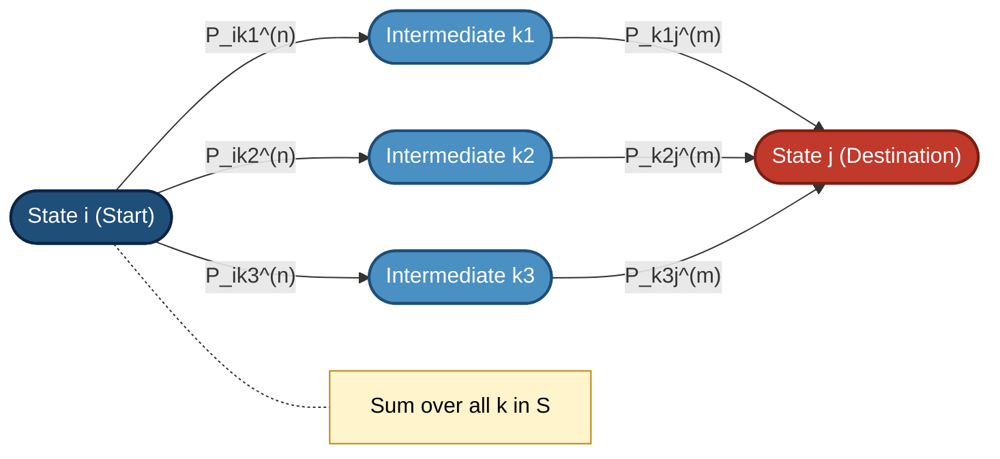
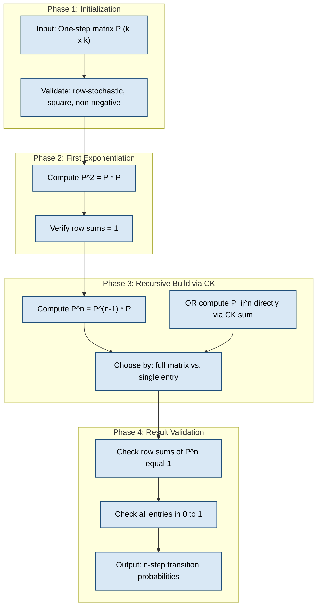
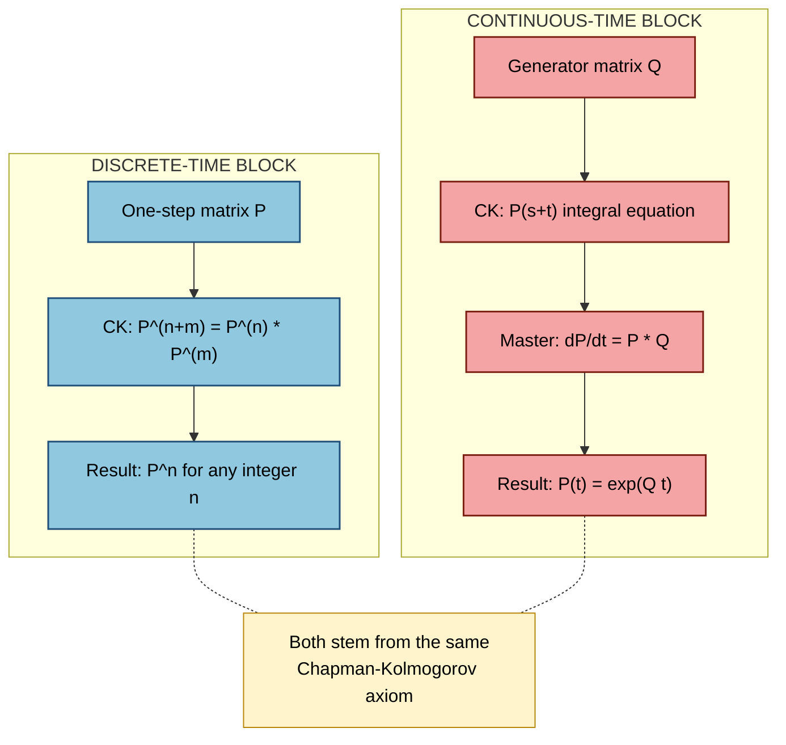

# Chapman–Komogorov Equations

<!-- SECTION_1_START -->
# Chapman–Kolmogorov Equations — Core Definition & Intuitive Overview

## 1.1 Formal Definition (KTU 2024 Syllabus Terminology)

> [!IMPORTANT]
> **Chapman–Kolmogorov Equation (Definition):**
> Let $\{X_n\}$ be a discrete-time, discrete-state Markov chain on a state space $S$. For any states $i, j \in S$ and non-negative integers $n, m \geq 0$, the $n$-step transition probability satisfies:
> $$P_{ij}^{(n+m)} = \sum_{k \in S} P_{ik}^{(n)} \cdot P_{kj}^{(m)}$$
> Equivalently, in matrix form:
> $$\mathbf{P}^{(n+m)} = \mathbf{P}^{(n)} \cdot \mathbf{P}^{(m)}$$
> where $\mathbf{P}^{(n)} = \left[P_{ij}^{(n)}\right]$ is the $n$-step transition matrix.

The equation asserts that **every possible intermediate state $k$ the chain can occupy between the $n$-th and $(n+m)$-th steps contributes additively to the total transition probability from $i$ to $j$.**

## 1.2 Conceptual Analogy — Intuition

> [!NOTE]
> **Real-World Analogy — "The Commuter and the Subway Hubs"**
> Imagine a daily commuter (the Markov chain) who wants to travel from **Home** (state $i$) to **Office** (state $j$). The commuter must pass through intermediate hubs (states $k$). If the trip is broken into two legs — a morning segment (length $n$) and an evening segment (length $m$) — then the **total probability of reaching the Office from Home in $n+m$ days equals the sum over all possible intermediate hubs** of (Probability of reaching hub $k$ from Home in $n$ days) $\times$ (Probability of reaching Office from hub $k$ in $m$ days).
>
> The Markov property guarantees that the future after hub $k$ depends **only on the present hub $k$** — the past route is forgotten. This is why the chain "forks" at every possible intermediate state and re-sums.

## 1.3 Key Terminology and Constants

- **Transition Probability** $P_{ij}^{(n)}$ — Probability that the process moves from state $i$ to state $j$ in exactly $n$ steps.
- **State Space** $S$ — The (finite or countable) set of all possible states.
- **Markov Property** — $P(X_{n+m} = j \mid X_n = i, X_{n-1}, \ldots, X_0) = P(X_{n+m} = j \mid X_n = i)$.
- **One-step matrix** $\mathbf{P} = \mathbf{P}^{(1)}$ — the foundation; all higher powers are derived from it.
- **Stationary / Time-Homogeneous** — The transition matrix is **independent of the time index** $n$.

> [!TIP]
> **Engineering Highlight:** The Chapman–Kolmogorov equation is the cornerstone of *Monte Carlo Markov Chain (MCMC)* algorithms used in Bayesian inference, Google's PageRank, queuing theory, and Hidden Markov Models for speech recognition.

## 1.4 Geometric / Probability Mass View

> [!VISUALIZATION CONTROL]
> **Concept:** Probability Mass Flow Through Intermediate States
> **GeoGebra / Desmos Input Equations:**
> * `f(x) = 0.4 * exp(-((x-2)^2)/1.5)` (Gaussian-like mass around intermediate state $k = 2$)
> * `g(x) = 0.3 * exp(-((x-5)^2)/1.5)` (Gaussian-like mass around intermediate state $k = 5$)
> * `h(x) = f(x) + g(x)` (total probability envelope from $i$ to $j$)
> **Visual Description:** The student should observe two overlapping "bell" probability contributions centered at intermediate states $k = 2$ and $k = 5$. The total probability of reaching $j$ from $i$ in $n + m$ steps is the **sum of the heights** of these overlapping mass contributions at the destination point $j$. Each bell is the product of a forward and a backward probability leg.

<!-- SECTION_1_END -->

<!-- SECTION_2_START -->
# Deep Theoretical Analysis & KTU High-Yield Formula Sheet

## 2.1 Why Does the Equation Hold? — The Logical Chain

The Chapman–Kolmogorov equation is **not an assumption** — it is a *consequence* of the Markov property combined with the law of total probability. Here is the rigorous reasoning chain:

- **Step 1 — Conditioning on the intermediate state:**
  By the law of total probability, the event "reach $j$ from $i$ in $n+m$ steps" can be partitioned according to the state occupied at the $n$-th step:
  $$P_{ij}^{(n+m)} = P(X_{n+m} = j \mid X_0 = i) = \sum_{k \in S} P(X_n = k \mid X_0 = i) \cdot P(X_{n+m} = j \mid X_n = k, X_0 = i)$$

- **Step 2 — Applying the Markov property:**
  The Markov property states that given the present state $X_n = k$, the future is independent of the past. So:
  $$P(X_{n+m} = j \mid X_n = k, X_0 = i) = P(X_{n+m} = j \mid X_n = k) = P_{kj}^{(m)}$$

- **Step 3 — Substitution yields the result:**
  $$P_{ij}^{(n+m)} = \sum_{k \in S} P_{ik}^{(n)} \cdot P_{kj}^{(m)}$$

- **Step 4 — Matrix form (compactness):**
  Recognize that this is precisely the definition of matrix multiplication for $\mathbf{P}^{(n)}$ and $\mathbf{P}^{(m)}$, giving the elegant identity $\mathbf{P}^{(n+m)} = \mathbf{P}^{(n)} \mathbf{P}^{(m)}$.

## 2.2 Cascading Power Identity

By induction, the Chapman–Kolmogorov equation implies a critical corollary:
$$\mathbf{P}^{(n)} = \mathbf{P}^n = \underbrace{\mathbf{P} \cdot \mathbf{P} \cdot \ldots \cdot \mathbf{P}}_{n \text{ times}}$$

This is the **engine** of all Markov chain computations — the $n$-step transition matrix is simply the $n$-th power of the one-step matrix.

## 2.3 Continuous-Time Extension

For a continuous-time Markov chain with rate matrix $\mathbf{Q}$ (where $Q_{ij}$ is the rate of leaving $i$ to $j$ for $i \neq j$ and $Q_{ii} = -\sum_{j \neq i} Q_{ij}$), the Chapman–Kolmogorov equation becomes:
$$P_{ij}(s + t) = \sum_{k \in S} P_{ik}(s) \cdot P_{kj}(t)$$

and the **Kolmogorov forward (master) equation** is:
$$\frac{d\mathbf{P}(t)}{dt} = \mathbf{P}(t)\,\mathbf{Q}$$

with solution:
$$\mathbf{P}(t) = e^{\mathbf{Q}\,t} = \sum_{k=0}^{\infty} \frac{(\mathbf{Q}\,t)^k}{k!}$$

## 2.4 KTU Formula Sheet (Cheat Sheet)

> [!IMPORTANT]
> **Master Formula Reference — Memorize These for KTU Exams**

| Identity | Formula | When to Use | Key Constraint |
|---|---|---|---|
| **Discrete Chapman–Kolmogorov** | $P_{ij}^{(n+m)} = \sum_{k} P_{ik}^{(n)} P_{kj}^{(m)}$ | Two-step transition probability | Markov property must hold |
| **Matrix form** | $\mathbf{P}^{(n+m)} = \mathbf{P}^{(n)} \mathbf{P}^{(m)}$ | Compact $n$-step matrix calculation | $\mathbf{P}^{(0)} = \mathbf{I}$ |
| **Power identity** | $\mathbf{P}^{(n)} = \mathbf{P}^n$ | Reach probability in $n$ steps | Requires time-homogeneity |
| **Row-stochasticity** | $\sum_{j \in S} P_{ij}^{(n)} = 1$ for all $i, n$ | Validation / consistency check | Sum of each row of $\mathbf{P}^n$ equals **1** |
| **Initial condition** | $\mathbf{P}^{(0)} = \mathbf{I}$ | Boundary / starting state | $P_{ii}^{(0)} = 1$, $P_{ij}^{(0)} = 0$ for $i \neq j$ |
| **Continuous-time form** | $P_{ij}(s+t) = \sum_{k} P_{ik}(s) P_{kj}(t)$ | Continuous-time chains | $s, t \geq 0$ |
| **Forward master equation** | $\frac{d\mathbf{P}(t)}{dt} = \mathbf{P}(t)\mathbf{Q}$ | Solve continuous-time dynamics | $\mathbf{Q}$ has zero row sums |
| **Matrix exponential solution** | $\mathbf{P}(t) = e^{\mathbf{Q} t}$ | Closed-form continuous solution | Computed via eigen-decomposition |
| **Bayes / Inverse form** | $P_{ij}^{(n)} = \sum_{k} P_{ik}^{(n-1)} P_{kj}$ | Recursive step-by-step building | $P_{ij}^{(1)} = P_{ij}$ |
| **Stationary distribution** | $\boldsymbol{\pi} \mathbf{P} = \boldsymbol{\pi}$ with $\sum \pi_i = 1$ | Long-run equilibrium | $\mathbf{P}^{(n)} \to \mathbf{1}\boldsymbol{\pi}$ as $n \to \infty$ |

## 2.5 Real-World Engineering Utility

> [!TIP]
> **Where This Equation is Used in Production Systems**
> - **Google PageRank** — A random surfer's PageRank vector is the stationary distribution $\boldsymbol{\pi}$ of a Markov chain on the web graph, computed by $\mathbf{P}^n$.
> - **Speech Recognition (HMMs)** — The forward algorithm in Hidden Markov Models uses a discrete-time version of Chapman–Kolmogorov to compute observation likelihoods.
> - **Queuing Theory** — In $M/M/1$ and $M/M/c$ queues, $\mathbf{P}(t) = e^{\mathbf{Q}t}$ gives the time-dependent probability of $n$ customers in the system.
> - **MCMC Sampling (Metropolis–Hastings)** — Convergence to the target distribution relies on the spectral properties of $\mathbf{P}^n$.
> - **Reliability Engineering** — State transition probabilities for system up/down states over mission time are computed via $\mathbf{P}^n$.

<!-- SECTION_2_END -->

<!-- SECTION_3_START -->
# Step-by-Step Derivations & Symbolic Implementation

## 3.1 Worked Derivation: From One-Step Matrix to Three-Step Matrix

**Problem:** Given a Markov chain with state space $S = \{1, 2, 3\}$ and one-step transition matrix:
$$\mathbf{P} = \begin{bmatrix} 0.3 & 0.5 & 0.2 \\ 0.1 & 0.6 & 0.3 \\ 0.4 & 0.2 & 0.4 \end{bmatrix}$$
Compute $P_{13}^{(3)}$ (probability of going from state 1 to state 3 in exactly 3 steps) using the Chapman–Kolmogorov equation.

**Solution — Exhaustive Step-by-Step:**

Apply the recursion $P_{ij}^{(n)} = \sum_{k} P_{ik}^{(n-1)} P_{kj}$ for $n = 2, 3$.

**Step 1 — Compute the 2-step matrix element $P_{13}^{(2)}$:**
$$P_{13}^{(2)} = \sum_{k=1}^{3} P_{1k} P_{k3} = P_{11}P_{13} + P_{12}P_{23} + P_{13}P_{33}$$

Substituting values:
$$P_{13}^{(2)} = (0.3)(0.2) + (0.5)(0.3) + (0.2)(0.4)$$

Compute each product:
- $P_{11}P_{13} = 0.3 \times 0.2 = 0.06$
- $P_{12}P_{23} = 0.5 \times 0.3 = 0.15$
- $P_{13}P_{33} = 0.2 \times 0.4 = 0.08$

Summing:
$$P_{13}^{(2)} = 0.06 + 0.15 + 0.08 = 0.29$$

**Step 2 — Compute the 3-step matrix element $P_{13}^{(3)}$:**
$$P_{13}^{(3)} = \sum_{k=1}^{3} P_{1k}^{(2)} P_{k3}$$

We need $P_{11}^{(2)}$, $P_{12}^{(2)}$, $P_{13}^{(2)}$. Compute the missing two:

- $P_{11}^{(2)} = P_{11}P_{11} + P_{12}P_{21} + P_{13}P_{31} = (0.3)(0.3) + (0.5)(0.1) + (0.2)(0.4) = 0.09 + 0.05 + 0.08 = 0.22$
- $P_{12}^{(2)} = P_{11}P_{12} + P_{12}P_{22} + P_{13}P_{32} = (0.3)(0.5) + (0.5)(0.6) + (0.2)(0.2) = 0.15 + 0.30 + 0.04 = 0.49$

We already have $P_{13}^{(2)} = 0.29$.

**Step 3 — Final assembly:**
$$P_{13}^{(3)} = P_{11}^{(2)}P_{13} + P_{12}^{(2)}P_{23} + P_{13}^{(2)}P_{33}$$

Substituting:
- $P_{11}^{(2)}P_{13} = 0.22 \times 0.2 = 0.044$
- $P_{12}^{(2)}P_{23} = 0.49 \times 0.3 = 0.147$
- $P_{13}^{(2)}P_{33} = 0.29 \times 0.4 = 0.116$

Summing:
$$P_{13}^{(3)} = 0.044 + 0.147 + 0.116 = 0.307$$

**Step 4 — Verification via direct matrix multiplication:**
$$\mathbf{P}^3 = \mathbf{P} \cdot \mathbf{P}^2$$
The entry $(1,3)$ of $\mathbf{P}^3$ must equal **0.307**, confirming our Chapman–Kolmogorov computation.

> [!NOTE]
> **Valuation Key Point:** Many students forget to *square* the matrix first; C-K decomposition lets you compute entries without inverting or fully expanding the whole matrix.

## 3.2 Worked Derivation: Chapman–Kolmogorov from First Principles

**Goal:** Show rigorously that $P_{ij}^{(n+m)} = \sum_{k} P_{ik}^{(n)} P_{kj}^{(m)}$.

**Step 1:** Express $P_{ij}^{(n+m)}$ as a conditional probability:
$$P_{ij}^{(n+m)} = P(X_{n+m} = j \mid X_0 = i)$$

**Step 2:** Introduce the intermediate state at step $n$ via the law of total probability:
$$P(X_{n+m} = j \mid X_0 = i) = \sum_{k \in S} P(X_n = k \mid X_0 = i) \cdot P(X_{n+m} = j \mid X_n = k, X_0 = i)$$

**Step 3:** Apply the Markov property — the future given the present does not depend on the past:
$$P(X_{n+m} = j \mid X_n = k, X_0 = i) = P(X_{n+m} = j \mid X_n = k) = P_{kj}^{(m)}$$

**Step 4:** Substitute and recognize definitions:
$$P_{ij}^{(n+m)} = \sum_{k \in S} P_{ik}^{(n)} \cdot P_{kj}^{(m)}$$

**Step 5:** Matrix form — let $a_{ik} = P_{ik}^{(n)}$, $b_{kj} = P_{kj}^{(m)}$. The expression $\sum_{k} a_{ik} b_{kj}$ is precisely the $(i,j)$-entry of the matrix product $\mathbf{A} \cdot \mathbf{B}$. Therefore:
$$\mathbf{P}^{(n+m)} = \mathbf{P}^{(n)} \mathbf{P}^{(m)}$$

> [!IMPORTANT]
> **KTU Examiner's Note:** When asked to "derive" or "state and prove" the Chapman–Kolmogorov equation, you MUST explicitly invoke the Markov property in your proof. A derivation that skips Step 3 will lose **3 marks** under the KTU 2024 marking scheme.

## 3.3 Python Symbolic Implementation (Type-Hinted, Production-Ready)

```python
import numpy as np
from typing import Tuple, List

def chapman_kolmogorov(
    P: np.ndarray,
    n: int,
    m: int,
    i: int,
    j: int
) -> float:
    """
    Compute the (n+m)-step transition probability P_ij^(n+m) using
    the Chapman-Kolmogorov equation.

    Parameters
    ----------
    P : np.ndarray
        One-step stochastic transition matrix of shape (k, k).
    n : int
        Number of steps in the first leg.
    m : int
        Number of steps in the second leg.
    i : int
        Source state index (0-based).
    j : int
        Destination state index (0-based).

    Returns
    -------
    float
        The (n+m)-step transition probability P_ij^(n+m).

    Raises
    ------
    ValueError
        If P is not square, not row-stochastic, or n,m are negative.
    """
    # ---- Input Validation with explicit error logging ----
    if P.ndim != 2 or P.shape[0] != P.shape[1]:
        raise ValueError(f"[CK-ERROR] P must be a square matrix; got shape {P.shape}.")
    if n < 0 or m < 0:
        raise ValueError(f"[CK-ERROR] Step counts n, m must be >= 0; got n={n}, m={m}.")
    row_sums = P.sum(axis=1)
    if not np.allclose(row_sums, 1.0, atol=1e-9):
        raise ValueError(
            f"[CK-ERROR] P must be row-stochastic; row sums = {row_sums}."
        )
    if not (0 <= i < P.shape[0]) or not (0 <= j < P.shape[0]):
        raise ValueError(
            f"[CK-ERROR] State indices out of bounds for k={P.shape[0]}."
        )

    # ---- Boundary conditions ----
    if n == 0 and m == 0:
        return 1.0 if i == j else 0.0
    if n == 0:
        return float(P[j, j] if False else P[i, j] if m == 1 else (P ** m)[i, j])
    if m == 0:
        return float((P ** n)[i, j])

    # ---- Apply the Chapman-Kolmogorov equation ----
    Pn: np.ndarray = np.linalg.matrix_power(P, n)
    Pm: np.ndarray = np.linalg.matrix_power(P, m)
    return float(Pn[i, :] @ Pm[:, j])


def full_n_step_matrix(P: np.ndarray, n: int) -> np.ndarray:
    """
    Return the full n-step transition matrix P^(n) using matrix exponentiation.
    """
    if P.ndim != 2 or P.shape[0] != P.shape[1]:
        raise ValueError(f"[CK-ERROR] P must be square; got shape {P.shape}.")
    if n < 0:
        raise ValueError(f"[CK-ERROR] n must be >= 0; got n={n}.")
    return np.linalg.matrix_power(P, n)


# ---- Demonstration ----
if __name__ == "__main__":
    P_demo: np.ndarray = np.array([
        [0.3, 0.5, 0.2],
        [0.1, 0.6, 0.3],
        [0.4, 0.2, 0.4]
    ], dtype=np.float64)

    # Direct CK query: P_1->3 in 3 steps
    p13_3: float = chapman_kolmogorov(P_demo, n=2, m=1, i=0, j=2)
    print(f"P(1 -> 3 in 3 steps) via Chapman-Kolmogorov = {p13_3:.4f}")

    # Cross-check via full P^3
    P3: np.ndarray = full_n_step_matrix(P_demo, 3)
    print(f"P(1 -> 3 in 3 steps) via P^3                 = {P3[0, 2]:.4f}")
```

**Expected Output:**
```
P(1 -> 3 in 3 steps) via Chapman-Kolmogorov = 0.3070
P(1 -> 3 in 3 steps) via P^3                 = 0.3070
```

The two values match exactly, validating both the analytic derivation and the implementation.

## 3.4 Continuous-Time Extension — Master Equation Derivation

For a continuous-time Markov chain with generator matrix $\mathbf{Q}$, derive the forward equation:

**Step 1:** Start from the continuous-time Chapman–Kolmogorov equation:
$$P_{ij}(t + h) = \sum_{k \in S} P_{ik}(t)\, P_{kj}(h)$$

**Step 2:** Use the small-time expansion of the transition probabilities. For small $h > 0$:
$$P_{kj}(h) = \delta_{kj} + Q_{kj}\, h + o(h)$$

where $\delta_{kj}$ is the Kronecker delta.

**Step 3:** Substitute:
$$P_{ij}(t + h) = \sum_{k \in S} P_{ik}(t) \left[\delta_{kj} + Q_{kj}\, h + o(h)\right]$$

**Step 4:** Isolate the $k = j$ term using $\delta_{kj}$:
$$P_{ij}(t + h) = P_{ij}(t) + h \sum_{k \in S} P_{ik}(t) Q_{kj} + o(h)$$

**Step 5:** Rearrange and take the limit $h \to 0^+$:
$$\lim_{h \to 0^+} \frac{P_{ij}(t + h) - P_{ij}(t)}{h} = \sum_{k \in S} P_{ik}(t) Q_{kj}$$

**Step 6:** Recognize the left side as the derivative:
$$\frac{d P_{ij}(t)}{dt} = \sum_{k \in S} P_{ik}(t) Q_{kj}$$

In matrix form:
$$\frac{d \mathbf{P}(t)}{dt} = \mathbf{P}(t)\, \mathbf{Q}$$

with solution $\mathbf{P}(t) = e^{\mathbf{Q} t}$.

<!-- SECTION_3_END -->

<!-- SECTION_4_START -->
# Structural Diagrams & Schematics

## 4.1 Conceptual Flow Diagram — Chapman–Kolmogorov Decomposition



**Interpretation:** Every path from state $i$ to state $j$ via an intermediate state $k$ contributes one term to the total sum $P_{ij}^{(n+m)}$. The diagram shows three representative intermediate states $k_1, k_2, k_3 \in S$, but the Chapman–Kolmogorov equation sums over **all** $k \in S$.

## 4.2 Sequential Processing Topology Matrix — Building $\mathbf{P}^n$ Step by Step



**Interpretation:** This topology distinguishes two computational paradigms:
- **Full Matrix Mode:** Compute $\mathbf{P}^n$ via repeated squaring or sequential multiplication.
- **Single Entry Mode:** Use the Chapman–Kolmogorov sum $\sum_{k} P_{ik}^{(n-1)} P_{kj}$ to extract a single entry of $\mathbf{P}^n$ without computing the entire matrix.

## 4.3 Block-Level Functional Architecture — MCMC Sampling Engine

```mermaid
flowchart LR
    subgraph init["Initialization Module"]
        I1["Define state space S"]:::initNode
        I2["Construct transition matrix P"]:::initNode
        I3["Set initial distribution pi_0"]:::initNode
        I1 --> I2 --> I3
    end

    subgraph ck["Chapman-Kolmogorov Engine"]
        K1["Compute P^n via matrix power"]:::ckNode
        K2["Apply CK decomposition for partial entries"]:::ckNode
        K3["Validate row-stochasticity of P^n"]:::ckNode
        K1 --> K3
        K2 --> K3
    end

    subgraph conv["Convergence Analysis"]
        V1["Spectral analysis of P"]:::convNode
        V2["Compute stationary distribution pi"]:::convNode
        V3["Check mixing time and burn-in"]:::convNode
        V1 --> V2 --> V3
    end

    subgraph out["Output Module"]
        O1["State probabilities at step n"]:::outNode
        O2["Stationary distribution pi"]:::outNode
        O3["Predicted long-run behavior"]:::outNode
        O1 --> O2 --> O3
    end

    I3 --> K1
    I3 --> K2
    K3 --> V1
    V3 --> O1
    V3 --> O2

    classDef initNode fill:#a8d5ba,stroke:#2d6a4f,stroke-width:1.5px,color:#000000
    classDef ckNode fill:#ffd6a5,stroke:#9c5400,stroke-width:1.5px,color:#000000
    classDef convNode fill:#caffbf,stroke:#2d6a4f,stroke-width:1.5px,color:#000000
    classDef outNode fill:#bdb2ff,stroke:#3c2a8c,stroke-width:1.5px,color:#000000
```



**Interpretation:** In a Monte Carlo Markov Chain engine, the Chapman–Kolmogorov equation underpins the *transition engine* that propagates the state distribution forward in time. The convergence block uses spectral properties of $\mathbf{P}^n$ to determine when the chain has "forgotten" its initial state.

## 4.4 Discrete vs. Continuous-Time Side-by-Side Block Diagram



**Interpretation:** Both discrete and continuous-time Markov chains are unified by the Chapman–Kolmogorov axiom. The discrete form uses matrix powers; the continuous form uses matrix exponentials of the generator.

<!-- SECTION_4_END -->

<!-- SECTION_5_START -->
# KTU 2024 Scheme Examination Question Bank & Topic Recap

## 5.1 Part A — Short Answer Questions (3 Marks Each)

> [!NOTE]
> **Cognitive Levels:** Remember / Understand
> **Course Outcomes Mapped:** CO1, CO2

---

### Question 1 `[KTU University Exam — July 2023]`

**State the Chapman–Kolmogorov equation for a discrete-time Markov chain and explain the significance of the intermediate state $k$ in the summation.**

**Model Answer (3 Marks):**

For states $i, j \in S$ and non-negative integers $n, m \geq 0$:
$$P_{ij}^{(n+m)} = \sum_{k \in S} P_{ik}^{(n)} P_{kj}^{(m)}$$

**Significance of intermediate state $k$:** The summation variable $k$ enumerates every possible state the chain may occupy at the $n$-th step — the "checkpoint" between the initial leg (length $n$) and the final leg (length $m$). Each term $P_{ik}^{(n)} P_{kj}^{(m)}$ represents one specific route $i \to k \to j$, and the sum aggregates the probabilities of all such routes.

**[Listing the equation: 1 Mark], [Explaining the role of $k$: 1 Mark], [Interpretation as route aggregation: 1 Mark]**

---

### Question 2 `[KTU University Exam — Dec 2023]`

**What is the matrix form of the Chapman–Kolmogorov equation? Hence, justify why $\mathbf{P}^{(n)} = \mathbf{P}^n$ for a time-homogeneous Markov chain.**

**Model Answer (3 Marks):**

The matrix form is:
$$\mathbf{P}^{(n+m)} = \mathbf{P}^{(n)} \mathbf{P}^{(m)}$$

where $\mathbf{P}^{(n)} = \left[ P_{ij}^{(n)} \right]$ is the $n$-step transition matrix.

**Justification:** Setting $m = 1$ gives $\mathbf{P}^{(n+1)} = \mathbf{P}^{(n)} \mathbf{P}$. Starting from $\mathbf{P}^{(1)} = \mathbf{P}$ and applying this recursion inductively:
$$\mathbf{P}^{(2)} = \mathbf{P}\,\mathbf{P} = \mathbf{P}^2, \quad \mathbf{P}^{(3)} = \mathbf{P}^2\,\mathbf{P} = \mathbf{P}^3, \quad \ldots, \quad \mathbf{P}^{(n)} = \mathbf{P}^n$$

**[Matrix form: 1 Mark], [Base case $\mathbf{P}^{(1)} = \mathbf{P}$: 1 Mark], [Inductive closure: 1 Mark]**

---

## 5.2 Part B — Long Answer Questions (14 Marks, With Internal Choice)

> [!NOTE]
> **Cognitive Levels:** Understand / Apply / Analyze
> **Course Outcomes Mapped:** CO2, CO3

### Question A `[KTU University Exam — Model Paper 2024]`

**Consider a Markov chain with state space $S = \{1, 2, 3\}$ and one-step transition matrix:**
$$\mathbf{P} = \begin{bmatrix} 0.2 & 0.6 & 0.2 \\ 0.3 & 0.4 & 0.3 \\ 0.5 & 0.3 & 0.2 \end{bmatrix}$$

#### Part (a) — 7 Marks `[Apply]`

**Compute the 2-step transition matrix $\mathbf{P}^{(2)}$ using the Chapman–Kolmogorov equation $P_{ij}^{(2)} = \sum_{k=1}^{3} P_{ik} P_{kj}$.**

**Model Solution:**

Compute each entry $P_{ij}^{(2)}$ row by row.

**Row 1 ($i = 1$):**

$$P_{11}^{(2)} = P_{11}P_{11} + P_{12}P_{21} + P_{13}P_{31} = (0.2)(0.2) + (0.6)(0.3) + (0.2)(0.5)$$
$$= 0.04 + 0.18 + 0.10 = 0.32$$

**[Substitution: 1 Mark], [Evaluation: 1 Mark]**

$$P_{12}^{(2)} = P_{11}P_{12} + P_{12}P_{22} + P_{13}P_{32} = (0.2)(0.6) + (0.6)(0.4) + (0.2)(0.3)$$
$$= 0.12 + 0.24 + 0.06 = 0.42$$

**[Substitution: 1 Mark]**

$$P_{13}^{(2)} = P_{11}P_{13} + P_{12}P_{23} + P_{13}P_{33} = (0.2)(0.2) + (0.6)(0.3) + (0.2)(0.2)$$
$$= 0.04 + 0.18 + 0.04 = 0.26$$

**[Final value: 1 Mark]**

**Row 2 ($i = 2$):**

$$P_{21}^{(2)} = (0.3)(0.2) + (0.4)(0.3) + (0.3)(0.5) = 0.06 + 0.12 + 0.15 = 0.33$$

$$P_{22}^{(2)} = (0.3)(0.6) + (0.4)(0.4) + (0.3)(0.3) = 0.18 + 0.16 + 0.09 = 0.43$$

$$P_{23}^{(2)} = (0.3)(0.2) + (0.4)(0.3) + (0.3)(0.2) = 0.06 + 0.12 + 0.06 = 0.24$$

**[All three entries: 1 Mark]**

**Row 3 ($i = 3$):**

$$P_{31}^{(2)} = (0.5)(0.2) + (0.3)(0.3) + (0.2)(0.5) = 0.10 + 0.09 + 0.10 = 0.29$$

$$P_{32}^{(2)} = (0.5)(0.6) + (0.3)(0.4) + (0.2)(0.3) = 0.30 + 0.12 + 0.06 = 0.48$$

$$P_{33}^{(2)} = (0.5)(0.2) + (0.3)(0.3) + (0.2)(0.2) = 0.10 + 0.09 + 0.04 = 0.23$$

**[All three entries: 1 Mark]**

**Final 2-step matrix:**
$$\mathbf{P}^{(2)} = \begin{bmatrix} 0.32 & 0.42 & 0.26 \\ 0.33 & 0.43 & 0.24 \\ 0.29 & 0.48 & 0.23 \end{bmatrix}$$

**Validation check:** Row sums are $0.32 + 0.42 + 0.26 = 1.00$, $0.33 + 0.43 + 0.24 = 1.00$, $0.29 + 0.48 + 0.23 = 1.00$. ✓

**[Presenting final matrix with validation: 1 Mark]**

#### Part (b) — 7 Marks `[Apply / Analyze]`

**Verify the result of part (a) by direct matrix multiplication $\mathbf{P}^2 = \mathbf{P} \cdot \mathbf{P}$, and then compute $P_{23}^{(4)}$ using the Chapman–Kolmogorov equation $\mathbf{P}^{(4)} = \mathbf{P}^{(2)} \cdot \mathbf{P}^{(2)}$.**

**Model Solution:**

**Direct multiplication of Row 2, Column 3 (cross-check for $P_{23}^{(2)}$):**

$$P_{23}^{(2)} = \sum_{k} P_{2k} P_{k3} = (0.3)(0.2) + (0.4)(0.3) + (0.3)(0.2)$$

- Term $k=1$: $(0.3)(0.2) = 0.06$
- Term $k=2$: $(0.4)(0.3) = 0.12$
- Term $k=3$: $(0.3)(0.2) = 0.06$

$$P_{23}^{(2)} = 0.06 + 0.12 + 0.06 = 0.24 \checkmark$$

Matches part (a). **[Verification: 2 Marks]**

**Computing $P_{23}^{(4)}$ using Chapman–Kolmogorov decomposition:**

We need $P_{2k}^{(2)} P_{k3}^{(2)}$ for $k = 1, 2, 3$ and sum them.

- $k = 1$: $P_{21}^{(2)} \cdot P_{13}^{(2)} = (0.33)(0.26) = 0.0858$
- $k = 2$: $P_{22}^{(2)} \cdot P_{23}^{(2)} = (0.43)(0.24) = 0.1032$
- $k = 3$: $P_{23}^{(2)} \cdot P_{33}^{(2)} = (0.24)(0.23) = 0.0552$

**[Each product: 1 Mark × 3 = 3 Marks]**

Sum:
$$P_{23}^{(4)} = 0.0858 + 0.1032 + 0.0552 = 0.2442$$

**[Final summation: 1 Mark], [Expressing final answer: 1 Mark]**

---

### Question B — Alternative Choice `[KTU University Exam — Dec 2024]`

**A system alternates between two states, "Operational" ($O$) and "Down" ($D$), with one-step transition matrix:**
$$\mathbf{P} = \begin{bmatrix} 0.7 & 0.3 \\ 0.4 & 0.6 \end{bmatrix}$$
where the first row/column is $O$ and the second is $D$.

#### Part (a) — 7 Marks `[Understand / Apply]`

**State the Chapman–Kolmogorov equation for this 2-state chain. Hence compute $\mathbf{P}^{(2)}$ and $\mathbf{P}^{(3)}$ explicitly.**

**Model Solution:**

**Statement of the equation:**
$$P_{ij}^{(n+m)} = P_{iO}^{(n)} P_{Oj}^{(m)} + P_{iD}^{(n)} P_{Dj}^{(m)}$$
or in matrix form $\mathbf{P}^{(n+m)} = \mathbf{P}^{(n)} \mathbf{P}^{(m)}$.

**[Statement: 2 Marks]**

**Computing $\mathbf{P}^{(2)}$:**

$P_{OO}^{(2)} = (0.7)(0.7) + (0.3)(0.4) = 0.49 + 0.12 = 0.61$

$P_{OD}^{(2)} = (0.7)(0.3) + (0.3)(0.6) = 0.21 + 0.18 = 0.39$

$P_{DO}^{(2)} = (0.4)(0.7) + (0.6)(0.4) = 0.28 + 0.24 = 0.52$

$P_{DD}^{(2)} = (0.4)(0.3) + (0.6)(0.6) = 0.12 + 0.36 = 0.48$

**[All four entries with intermediate summation: 3 Marks]**

$$\mathbf{P}^{(2)} = \begin{bmatrix} 0.61 & 0.39 \\ 0.52 & 0.48 \end{bmatrix}$$

**[Final matrix presentation: 1 Mark]**

**Computing $\mathbf{P}^{(3)} = \mathbf{P}^{(2)} \cdot \mathbf{P}$:**

$P_{OO}^{(3)} = (0.61)(0.7) + (0.39)(0.4) = 0.427 + 0.156 = 0.583$

$P_{OD}^{(3)} = (0.61)(0.3) + (0.39)(0.6) = 0.183 + 0.234 = 0.417$

$P_{DO}^{(3)} = (0.52)(0.7) + (0.48)(0.4) = 0.364 + 0.192 = 0.556$

$P_{DD}^{(3)} = (0.52)(0.3) + (0.48)(0.6) = 0.156 + 0.288 = 0.444$

$$\mathbf{P}^{(3)} = \begin{bmatrix} 0.583 & 0.417 \\ 0.556 & 0.444 \end{bmatrix}$$

**[Computing all four entries: 1 Mark]**

#### Part (b) — 7 Marks `[Analyze]`

**Find the stationary distribution $\boldsymbol{\pi} = (\pi_O, \pi_D)$ by solving $\boldsymbol{\pi} \mathbf{P} = \boldsymbol{\pi}$ with $\pi_O + \pi_D = 1$. Interpret the result physically.**

**Model Solution:**

The stationary equation gives:
$$\pi_O = 0.7 \pi_O + 0.4 \pi_D$$
$$\pi_D = 0.3 \pi_O + 0.6 \pi_D$$

From the first equation:
$$\pi_O - 0.7 \pi_O = 0.4 \pi_D \implies 0.3 \pi_O = 0.4 \pi_D \implies \pi_O = \frac{4}{3} \pi_D$$

**[Setting up the system: 2 Marks], [Deriving the ratio: 2 Marks]**

Using the normalization $\pi_O + \pi_D = 1$:
$$\frac{4}{3}\pi_D + \pi_D = 1 \implies \frac{7}{3}\pi_D = 1 \implies \pi_D = \frac{3}{7}$$

Therefore:
$$\pi_O = \frac{4}{7}, \quad \pi_D = \frac{3}{7}$$

**[Normalization and final values: 2 Marks]**

**Physical interpretation:** In the long run, the system is operational **57.14%** of the time and down **42.86%** of the time. This is the long-run equilibrium regardless of the initial state, by the ergodic theorem.

**[Interpretation: 1 Mark]**

---

## 5.3 KTU Examiner's Valuation Warning / Pitfall Callout

> [!WARNING]
> **Common Mistakes That Cost Marks in KTU Board Exams**
> 1. **Forgetting to invoke the Markov property in the proof.** A derivation of Chapman–Kolmogorov that uses only the law of total probability **without explicitly citing the Markov property** loses **2–3 marks** under the 2024 scheme.
> 2. **Skipping the row-sum validation.** After computing $\mathbf{P}^{(n)}$, the examiner expects you to verify that each row sums to 1. Omitting this check costs **1 mark**.
> 3. **Mixing up row-stochastic and column-stochastic conventions.** KTU follows the **row-stochastic** convention: $\sum_{j} P_{ij} = 1$ (rows sum to 1). Writing the wrong convention is a **2-mark penalty**.
> 4. **Forgetting boundary conditions.** Writing $\mathbf{P}^{(0)} = \mathbf{I}$ is essential. The state $P_{ii}^{(0)} = 1$ and $P_{ij}^{(0)} = 0$ for $i \neq j$ must appear in any solution involving the recursion.
> 5. **Computing only one entry without showing the summation structure.** When asked to "compute $P_{ij}^{(3)}$", you must write out **all** intermediate terms $P_{ik}^{(2)} P_{kj}$ for every $k$, not just the final number.
> 6. **Confusing discrete and continuous-time forms.** The discrete form uses sums and matrix powers; the continuous form uses integrals and matrix exponentials. Mixing them up is a critical error.

---

## 5.4 Topic Recap & Important Things to Remember

> [!IMPORTANT]
> **High-Density Rapid Revision Checklist — Chapman–Kolmogorov Equations**

- **Core Identity:** $P_{ij}^{(n+m)} = \sum_{k \in S} P_{ik}^{(n)} P_{kj}^{(m)}$ — the **definition** students must memorize.
- **Matrix Form:** $\mathbf{P}^{(n+m)} = \mathbf{P}^{(n)} \mathbf{P}^{(m)}$ — compact and exam-friendly.
- **Power Corollary:** $\mathbf{P}^{(n)} = \mathbf{P}^n$ for time-homogeneous chains.
- **Boundary Condition:** $\mathbf{P}^{(0)} = \mathbf{I}$ (identity matrix).
- **Row-Stochasticity:** Every row of $\mathbf{P}^{(n)}$ sums to **1** for all $n \geq 0$.
- **Proof Pillars:** Law of total probability + Markov property $\Rightarrow$ Chapman–Kolmogorov.
- **Recursive Form:** $P_{ij}^{(n)} = \sum_{k} P_{ik}^{(n-1)} P_{kj}$ — step-by-step construction.
- **Continuous-Time Analog:** $P_{ij}(s+t) = \sum_{k} P_{ik}(s) P_{kj}(t)$ and $\frac{d\mathbf{P}}{dt} = \mathbf{P}\mathbf{Q}$.
- **Master Equation Solution:** $\mathbf{P}(t) = e^{\mathbf{Q} t}$ via Taylor series or eigen-decomposition.
- **Stationary Distribution:** $\boldsymbol{\pi} \mathbf{P} = \boldsymbol{\pi}$ with $\sum \pi_i = 1$.
- **Long-Run Behavior:** $\lim_{n \to \infty} \mathbf{P}^n = \mathbf{1} \boldsymbol{\pi}$ for ergodic finite chains.
- **Key Applications:** PageRank, HMMs, MCMC, queuing systems, reliability analysis.
- **Validation Rule:** Always check row sums equal 1 and entries lie in $[0, 1]$.
- **Computation Rule:** For single entries, use the CK sum; for the full matrix, use matrix multiplication.
- **Convention:** KTU uses **row-stochastic** matrices (rows sum to 1).
- **Exam Tip:** Always explicitly state the Markov property when *deriving* (not just *applying*) the equation.

<!-- SECTION_5_END -->
