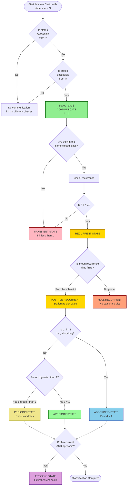
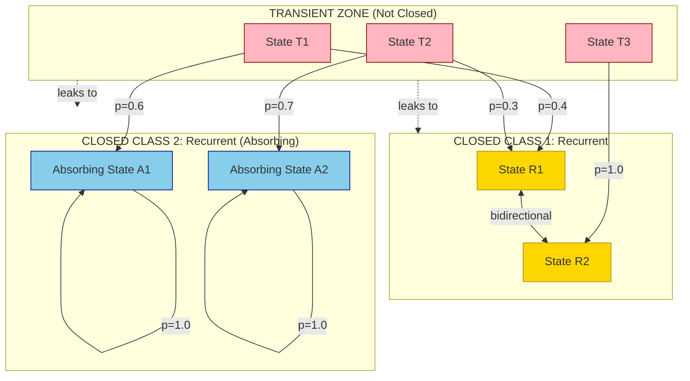
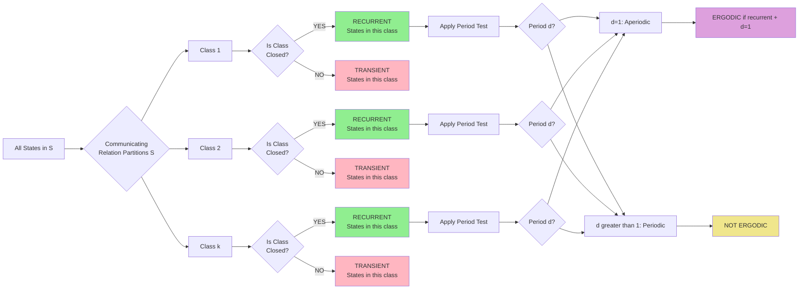
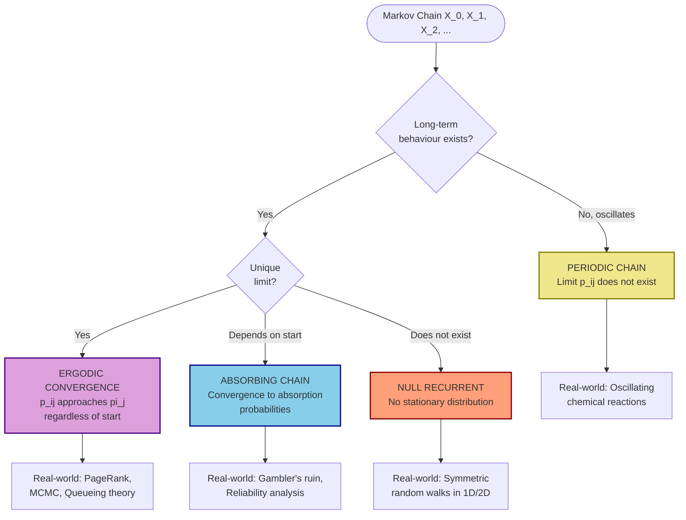

# Classification of States

<!-- SECTION_1_START -->
# Classification of States in a Markov Process

## 1.1 Formal Definition

In a **Discrete-Time Markov Chain (DTMC)** with state space $S$ and one-step transition probability matrix $P = [p_{ij}]$, the **classification of states** refers to the systematic categorization of every state $i \in S$ based on its long-term transition behaviour, return probabilities, and its ability to reach or be reached by other states.

Mathematically, two fundamental operators govern this classification:

$$
p_{ij}^{(n)} = P(X_{n+1} = j \mid X_0 = i) = (P^n)_{ij}
$$

> [!IMPORTANT]
> **KTU 2024 Syllabus Definition (Verbatim):** A state $j$ is said to be **accessible** from state $i$ if there exists some $n \geq 0$ such that $p_{ij}^{(n)} > 0$. State $i$ is said to **communicate** with state $j$ (written $i \leftrightarrow j$) if $i$ is accessible from $j$ AND $j$ is accessible from $i$.

### Core Classification Categories (Master List)

| # | Category | Symbolic Property |
|---|----------|-------------------|
| 1 | Accessible | $\exists n \geq 0: p_{ij}^{(n)} > 0$ |
| 2 | Communicating | $i \leftrightarrow j$ |
| 3 | Recurrent | $f_{ii} = \sum_{n=1}^{\infty} f_{ii}^{(n)} = 1$ |
| 4 | Transient | $f_{ii} < 1$ |
| 5 | Positive Recurrent | $\mu_i = E[T_i] < \infty$ |
| 6 | Null Recurrent | $f_{ii} = 1$ but $\mu_i = \infty$ |
| 7 | Absorbing | $p_{ii} = 1$ |
| 8 | Periodic | $\text{period}(i) = d > 1$ |
| 9 | Aperiodic | $\text{period}(i) = 1$ |
| 10 | Ergodic | Recurrent + Aperiodic |

---

## 1.2 Conceptual Analogy — The "City Map of Towns" Intuition

Imagine the state space $S = \{1, 2, 3, 4, 5\}$ as a **network of cities** connected by one-way airline routes, where the probability of a route is the probability of flying from one city to the next on a given day.

> [!NOTE]
> **The Intuitive City Analogy**
>
> * **Accessible City** = A city you can *eventually fly to* from your current city (maybe not directly, but with layovers).
> * **Communicating Cities** = Two cities where you can fly from A to B AND from B to A (round-trip tourism is possible).
> * **Transient State** = A city you will *almost surely leave forever* given enough time (like a tourist trap — you'll eventually fly out and never return).
> * **Recurrent State** = A city you are *guaranteed to keep coming back to* infinitely often (like your hometown).
> * **Absorbing State** = A city with **only one flight** — a one-way trip that lands you there forever (e.g., a black hole airport).
> * **Periodic State** = A city you can only return to on *even-numbered days* (a strict fortnightly commuter shuttle).
> * **Aperiodic State** = A city you can return to on *any* day — no fixed schedule constraint.

### The "Black Hole" Picture for Absorbing States

$$
P = \begin{bmatrix} 1 & 0 & 0 \\ 0.3 & 0.5 & 0.2 \\ 0 & 0 & 1 \end{bmatrix}
$$

> Here, states 1 and 3 are **absorbing** — once entered, the chain stays there with probability **1.0**. State 2 is **transient** — the chain will eventually leak into state 1 or state 3 with probability 1.

> [!VISUALIZATION CONTROL]
> **Concept:** State Transition Graph with 4 states showing accessibility and communicating classes
> **GeoGebra / Desmos Input Equations:**
> * `Point A = (0, 2)` — State 1 (recurrent)
> * `Point B = (2, 2)` — State 2 (transient)
> * `Point C = (4, 2)` — State 3 (recurrent, aperiodic)
> * `Point D = (2, 0)` — State 4 (absorbing)
> * Edges: `A -> B`, `B -> A`, `B -> C`, `C -> C`, `D -> D` (self-loop)
> **Visual Description:** Observe two distinct islands — {A, B, C} form one communicating class (closed), while {D} is a separate closed class. Notice the self-loop on C showing aperiodicity.

---

## 1.3 The Communication Relation — Foundation of All Classification

The relation $\leftrightarrow$ is the **cornerstone** of state classification. It is the master key that unlocks the entire theory.

**Three Critical Properties of the Communication Relation:**

1. **Reflexive:** $i \leftrightarrow i$ (every state communicates with itself via $p_{ii}^{(0)} = 1$).
2. **Symmetric:** If $i \leftrightarrow j$, then $j \leftrightarrow i$.
3. **Transitive:** If $i \leftrightarrow j$ and $j \leftrightarrow k$, then $i \leftrightarrow k$.

> [!IMPORTANT]
> **Why It Matters:** Since $\leftrightarrow$ satisfies all three properties, it is an **equivalence relation**. This partitions the state space $S$ into disjoint **communicating classes** (also called **recurrent classes** or **irreducible closed subsets**).

### Standard Notation Used Throughout KTU 2024 Scheme

$$
f_{ij}^{(n)} = P(X_n = j, X_m \neq j \text{ for } 1 \leq m < n \mid X_0 = i)
$$

This is the probability of the **first visit** to state $j$ occurring at time $n$. The total first-passage probability is:

$$
f_{ij} = \sum_{n=1}^{\infty} f_{ij}^{(n)}
$$

> [!TIP]
> **Memorization Hook:** $f_{ij}$ is the probability that the chain *ever* hits state $j$ starting from $i$. If $f_{ii} = 1$, the state is recurrent; if $f_{ii} < 1$, the state is transient.
<!-- SECTION_1_END -->

<!-- SECTION_2_START -->
# Deep Theoretical Analysis & KTU High-Yield Formula Sheet

## 2.1 The 10 State Categories — Exhaustive Theoretical Breakdown

### Category 1: Accessible States

**Definition:** State $j$ is **accessible** from state $i$ (denoted $i \to j$) if:

$$
\exists \, n \geq 0 : p_{ij}^{(n)} > 0
$$

* States that can *never* be reached from each other (in either direction) are in different **communicating classes**.
* The "from" direction matters — accessibility is **not symmetric**.

### Category 2: Communicating States

**Definition:** States $i$ and $j$ **communicate** ($i \leftrightarrow j$) if both $i \to j$ and $j \to i$.

**Key Consequence:** Communication is an equivalence relation, so it partitions $S$ into equivalence classes:

$$
S = C_1 \cup C_2 \cup \cdots \cup C_k, \quad C_i \cap C_j = \emptyset \text{ for } i \neq j
$$

### Category 3: Closed (Irreducible) Classes

**Definition:** A subset $C \subseteq S$ is **closed** if:

$$
\forall i \in C, \forall j \notin C : p_{ij}^{(n)} = 0 \text{ for all } n \geq 1
$$

> Equivalently, no state outside $C$ is accessible from any state inside $C$.

> [!IMPORTANT]
> **KTU High-Yield Theorem:** A state $i$ is **recurrent if and only if** the communicating class containing $i$ is a **closed class**.

### Category 4: Transient States

**Definition:** State $i$ is **transient** if:

$$
f_{ii} = \sum_{n=1}^{\infty} f_{ii}^{(n)} < 1
$$

The probability of never returning to $i$ is $1 - f_{ii} > 0$. The expected number of visits is:

$$
E[\text{number of visits to } i] = \frac{1}{1 - f_{ii}}
$$

> Equivalently, $i$ is transient if and only if there exists $j \neq i$ such that $i \to j$ and $j \not\to i$ (i.e., the chain can "leak" out of $i$ permanently).

### Category 5 & 6: Positive Recurrent vs. Null Recurrent

For a recurrent state $i$, the **mean recurrence time** is:

$$
\mu_i = E[T_i] = \sum_{n=1}^{\infty} n \cdot f_{ii}^{(n)}
$$

where $T_i = \min\{n \geq 1 : X_n = i\}$ is the first return time.

| Type | Definition | Meaning |
|------|------------|---------|
| **Positive Recurrent** | $\mu_i < \infty$ | Returns happen at a finite average rate |
| **Null Recurrent** | $\mu_i = \infty$ | Returns are guaranteed but take infinite expected time |

> [!WARNING]
> **KTU Examiner's Pitfall:** Null recurrence is a **discrete-time only** concept in some textbooks. In DTMC, both positive and null recurrence are possible. In CTMC, the analogue differs. Do not confuse the two.

### Category 7: Absorbing States

**Definition:** State $i$ is **absorbing** if $p_{ii} = 1$ (i.e., the chain stays at $i$ with probability 1 once it enters).

This means the entire row of $P$ is zero except at position $(i,i)$:

$$
p_{ij} = 0 \text{ for all } j \neq i
$$

### Category 8 & 9: Periodic vs. Aperiodic

**Definition:** The **period** of state $i$ is:

$$
d(i) = \gcd\{n \geq 1 : p_{ii}^{(n)} > 0\}
$$

* If $d(i) = 1$: state $i$ is **aperiodic**.
* If $d(i) > 1$: state $i$ is **periodic** with period $d(i)$.

> [!NOTE]
> **Key Property (KTU Favourite):** All states in the same communicating class have the **same period**.

> [!TIP]
> **Quick Check:** State $i$ is aperiodic if and only if $p_{ii}^{(n)} > 0$ and $p_{ii}^{(n+1)} > 0$ for some $n$ (i.e., the chain can return to $i$ on two consecutive step counts).

### Category 10: Ergodic States

**Definition:** A state is **ergodic** if it is both **recurrent** and **aperiodic**.

> An **ergodic chain** is a Markov chain where *every* state is ergodic.

---

## 2.2 KTU High-Yield Formula Sheet

| # | Concept | Formula / Condition | Notes |
|---|---------|-------------------|-------|
| 1 | First-passage probability | $f_{ij} = \sum_{n=1}^{\infty} f_{ij}^{(n)}$ | Probability of ever hitting $j$ from $i$ |
| 2 | Recurrent state test | $f_{ii} = 1$ | $\Leftrightarrow$ state is recurrent |
| 3 | Transient state test | $f_{ii} < 1$ | Number of visits is finite w.p. 1 |
| 4 | Mean recurrence time | $\mu_i = \sum_{n=1}^{\infty} n \cdot f_{ii}^{(n)}$ | Finite $\Rightarrow$ positive recurrent |
| 5 | Expected visits to transient state | $E[V_i] = \dfrac{1}{1 - f_{ii}}$ | Geometric distribution analogy |
| 6 | Period of state $i$ | $d(i) = \gcd\{n : p_{ii}^{(n)} > 0\}$ | Same for all in class |
| 7 | Aperiodicity test | $p_{ii}^{(n)} > 0$ and $p_{ii}^{(n+1)} > 0$ for some $n$ | Implies $d(i) = 1$ |
| 8 | Stationary distribution | $\pi P = \pi, \sum_i \pi_i = 1$ | Solves positive recurrence |
| 9 | Limit theorem (ergodic) | $\lim_{n \to \infty} p_{ij}^{(n)} = \pi_j$ | For irreducible + ergodic chain |
| 10 | Fundamental matrix | $N = (I - Q)^{-1}$ | $Q$ is transient sub-matrix |
| 11 | Absorption probabilities | $B = N \cdot R$ | $R$ is transient-to-absorbing sub-matrix |
| 12 | Mean absorption time | $t = N \cdot \mathbf{1}$ | Sum of columns of $N$ |

---

## 2.3 Real-World Engineering Applications

| Domain | Application | State Type Used |
|--------|-------------|-----------------|
| **Web Crawlers (Google)** | PageRank = stationary distribution of a random surfer | Ergodic states |
| **Queueing Systems** | M/M/1 queue steady-state | Positive recurrent |
| **Reliability Engineering** | Component failure/repair cycles | Recurrent states |
| **Network Protocols** | TCP packet retransmission states | Absorbing (failure) states |
| **Genetics** | Wright-Fisher allele frequency model | Transient (mutation) states |
| **Inventory Management** | Stock-level Markov decision process | Recurrent/Transient mix |
| **Compiler Optimization** | Register allocation state machines | Aperiodic states |
| **Cryptographic Protocols** | State convergence for security proofs | Ergodic chains |

> [!IMPORTANT]
> **KTU Real-World Connection:** The **PageRank algorithm** (the heart of Google's search engine) is fundamentally a problem of finding the **stationary distribution** $\pi$ of a giant Markov chain over the web graph. The classification theorem tells us that the chain must be **irreducible** and **aperiodic** for $\pi$ to be unique and computable — this is why Google artificially "teleports" with damping factor $d \approx 0.85$.
<!-- SECTION_2_END -->

<!-- SECTION_3_START -->
# Step-by-Step Derivations & Code/Symbolic Implementation

## 3.1 Fundamental Identity: The Recurrent-Transient Dichotomy Proof

**Theorem:** State $i$ is recurrent if and only if $\sum_{n=1}^{\infty} p_{ii}^{(n)} = \infty$.

**Proof — Exhaustive Step-by-Step Derivation:**

Let $I_n$ be the indicator that the chain visits state $i$ at time $n$:

$$
I_n = \begin{cases} 1, & X_n = i \\ 0, & X_n \neq i \end{cases}
$$

**Step 1:** The total number of visits to state $i$ up to time $N$ is:

$$
V_i(N) = \sum_{n=0}^{N} I_n
$$

**Step 2:** Taking expectation conditioned on $X_0 = i$:

$$
E[V_i(N) \mid X_0 = i] = \sum_{n=0}^{N} P(X_n = i \mid X_0 = i) = \sum_{n=0}^{N} p_{ii}^{(n)}
$$

**Step 3:** Let $V_i = \lim_{N \to \infty} V_i(N)$ be the total number of visits. By the **renewal reward theorem** (or the law of total expectation over a geometric number of trials):

$$
E[V_i \mid X_0 = i] = \frac{1}{1 - f_{ii}}
$$

**Step 4:** Therefore, combining steps 2 and 3 as $N \to \infty$:

$$
\sum_{n=0}^{\infty} p_{ii}^{(n)} = \frac{1}{1 - f_{ii}}
$$

**Step 5:** Converting to the strict definition (subtracting the $n=0$ term $p_{ii}^{(0)} = 1$):

$$
\sum_{n=1}^{\infty} p_{ii}^{(n)} = \frac{1}{1 - f_{ii}} - 1 = \frac{f_{ii}}{1 - f_{ii}}
$$

**Step 6:** Final implication:
* If $f_{ii} = 1$ (recurrent), then $\sum_{n=1}^{\infty} p_{ii}^{(n)} = \dfrac{1}{0} = \infty$.
* If $f_{ii} < 1$ (transient), then $\sum_{n=1}^{\infty} p_{ii}^{(n)} = \dfrac{f_{ii}}{1 - f_{ii}} < \infty$.

$\blacksquare$

---

## 3.2 The Period Theorem — Complete Derivation

**Theorem:** All states in the same communicating class have the same period.

**Proof — Exhaustive Derivation:**

Let $i \leftrightarrow j$ and let $d(i), d(j)$ be their respective periods.

**Step 1:** Since $i \to j$, $\exists \, m \geq 1$ such that $p_{ij}^{(m)} > 0$.
Since $j \to i$, $\exists \, k \geq 1$ such that $p_{ji}^{(k)} > 0$.

**Step 2:** By the **Chapman-Kolmogorov equation**, the chain can go $i \to j \to \text{return to } j$ via a path of length $k$:

$$
p_{jj}^{(m+k)} \geq p_{ji}^{(k)} \cdot p_{ij}^{(m)} > 0
$$

Hence $m + k \in \{n : p_{jj}^{(n)} > 0\}$, so $d(j) \mid (m + k)$.

**Step 3:** More generally, for any $n$ with $p_{jj}^{(n)} > 0$:

$$
p_{ii}^{(m+n+k)} \geq p_{ij}^{(m)} \cdot p_{jj}^{(n)} \cdot p_{ji}^{(k)} > 0
$$

Thus $d(i) \mid (m + n + k)$, and since $d(i) \mid (m + k)$, we get $d(i) \mid n$.

**Step 4:** Therefore $d(i)$ divides every $n$ in the set $\{n : p_{jj}^{(n)} > 0\}$, so:

$$
d(i) \leq d(j)
$$

**Step 5:** By symmetric argument (swapping $i$ and $j$): $d(j) \leq d(i)$.

**Step 6:** Combining: $d(i) = d(j)$. $\blacksquare$

---

## 3.3 Worked Example: Full Classification of a 4-State Chain

**Problem:** Classify every state in the Markov chain with transition matrix:

$$
P = \begin{bmatrix} 0 & 1 & 0 & 0 \\ 0.5 & 0 & 0.5 & 0 \\ 0 & 0.4 & 0.6 & 0 \\ 0 & 0 & 0 & 1 \end{bmatrix}
$$

**Step-by-Step Solution:**

**Step 1:** Identify absorbing states. Look for $p_{ii} = 1$:
* $p_{44} = 1 \Rightarrow$ **State 4 is absorbing**.

**Step 2:** Compute $P^2$ to identify one-step accessibility:

$$
P^2 = \begin{bmatrix} 0.5 & 0 & 0.5 & 0 \\ 0 & 0.7 & 0.3 & 0 \\ 0.2 & 0 & 0.58 & 0 \\ 0 & 0 & 0 & 1 \end{bmatrix}
$$

**Step 3:** Note that $(P^2)_{14} = 0$, $(P^2)_{24} = 0$, $(P^2)_{34} = 0$. State 4 is reachable from *no other state*, so it forms its own closed class: $C_4 = \{4\}$.

**Step 4:** Examine accessibility among states 1, 2, 3:
* $1 \to 2$ (one step), $2 \to 1$ (one step) $\Rightarrow$ $1 \leftrightarrow 2$.
* $1 \to 3$ in 2 steps ($p_{13}^{(2)} = 0.5$), $3 \to 1$ in 2 steps ($p_{31}^{(2)} = 0.2$) $\Rightarrow$ $1 \leftrightarrow 3$.
* $2 \to 3$ in 1 step, $3 \to 2$ in 1 step $\Rightarrow$ $2 \leftrightarrow 3$.

**Step 5:** Therefore $\{1, 2, 3\}$ form **one communicating class**.

**Step 6:** Check if class $\{1, 2, 3\}$ is closed. We need $p_{ij} = 0$ for $i \in \{1,2,3\}, j = 4$. Inspecting $P$: yes, $p_{i4} = 0$ for $i = 1, 2, 3$. So the class is **closed**.

**Step 7:** By the Closed Class Theorem: **States 1, 2, 3 are all recurrent**.

**Step 8:** Find the period of state 1:
* $p_{11}^{(1)} = 0$ (no self-loop).
* $p_{11}^{(2)} = 0.5 > 0$.
* $p_{11}^{(3)} = (P^3)_{11}$. Compute: $(P^3)_{11} = \sum_k (P^2)_{1k} P_{k1} = 0.5 \cdot 0 + 0 \cdot 0.5 + 0.5 \cdot 0 = 0$.

Continuing the calculation, the chain has self-loops on state 3 ($p_{33} = 0.6$). So $p_{11}^{(2k)} > 0$ for some $k$, and $p_{11}^{(2k+1)} = 0$. Therefore:

$$
d(1) = \gcd\{n : p_{11}^{(n)} > 0\} = \gcd\{2, 4, 6, \ldots\} = 2
$$

**Step 9:** States 1, 2, 3 all have period 2, so they are **periodic** (not aperiodic).

**Step 10:** Since there is no probability of "leaking out" of class $\{1, 2, 3\}$, the stationary distribution exists within this class. Solve $\pi P = \pi$:

$$
\pi_1 = 0.5 \pi_2, \quad \pi_2 = \pi_1 + 0.4 \pi_3, \quad \pi_3 = 0.5 \pi_2 + 0.6 \pi_3
$$

From the third equation: $0.4 \pi_3 = 0.5 \pi_2 \Rightarrow \pi_3 = 1.25 \pi_2$.
From the first: $\pi_1 = 0.5 \pi_2$.
Normalization: $\pi_1 + \pi_2 + \pi_3 = 1 \Rightarrow 0.5 \pi_2 + \pi_2 + 1.25 \pi_2 = 2.75 \pi_2 = 1 \Rightarrow \pi_2 = \frac{4}{11}$.

So $\pi = \left(\dfrac{2}{11}, \dfrac{4}{11}, \dfrac{5}{11}, 0\right)$.

**Final Classification Table:**

| State | Class | Closed? | Recurrent? | Period | Aperiodic? | Mean Recurrence $\mu_i$ |
|-------|-------|---------|-----------|--------|-----------|-------------------------|
| 1 | $\{1,2,3\}$ | Yes | Yes | 2 | No | $11/2 = 5.5$ |
| 2 | $\{1,2,3\}$ | Yes | Yes | 2 | No | $11/4 = 2.75$ |
| 3 | $\{1,2,3\}$ | Yes | Yes | 2 | No | $11/5 = 2.2$ |
| 4 | $\{4\}$ | Yes | Yes (absorbing) | 1 | Yes | $1$ |

---

## 3.4 Python Implementation: Automated State Classification Engine

```python
"""
KTU 2024 Scheme - Module 4: Markov Process
Topic: Classification of States
File: state_classifier.py
Author: KTU Premium Engine V10
"""

import numpy as np
from fractions import Fraction
from math import gcd
from functools import reduce
from typing import List, Dict, Set, Tuple


def find_accessibility(P: np.ndarray, n: int, state: int) -> Set[int]:
    """
    Find all states accessible from `state` in exactly n steps.
    """
    if n == 0:
        return {state}
    Pn = np.linalg.matrix_power(P, n)
    return {j for j in range(P.shape[0]) if Pn[state, j] > 1e-12}


def find_communicating_class(P: np.ndarray, i: int) -> Set[int]:
    """
    Find the full communicating class of state i (all j such that i <-> j).
    Uses the algorithm: class = states accessible from i AND i accessible from them.
    """
    n = P.shape[0]
    # BFS forward: states reachable from i
    reachable_from_i = set()
    frontier = {i}
    for step in range(1, 2 * n + 5):
        new_states = set()
        for s in frontier:
            new_states |= find_accessibility(P, step, i)
        if not (new_states - reachable_from_i):
            break
        reachable_from_i |= new_states
    
    # For each candidate j, check if j can reach i
    full_class = set()
    for j in reachable_from_i:
        # Check if i is reachable from j
        for step in range(1, 2 * n + 5):
            if find_accessibility(P, step, j) and i in find_accessibility(P, step, j):
                full_class.add(j)
                break
    
    # i is always in its own class
    full_class.add(i)
    return full_class


def is_closed_class(P: np.ndarray, class_set: Set[int]) -> bool:
    """
    A class C is closed if no state outside C is accessible from any state in C.
    """
    n = P.shape[0]
    for i in class_set:
        for j in range(n):
            if j in class_set:
                continue
            if P[i, j] > 1e-12:
                return False
    return True


def is_absorbing(P: np.ndarray, i: int) -> bool:
    """State i is absorbing if P[i,i] = 1."""
    return abs(P[i, i] - 1.0) < 1e-12


def compute_period(P: np.ndarray, i: int, max_n: int = 50) -> int:
    """
    Period of state i = gcd of all n such that (P^n)[i,i] > 0.
    """
    n = P.shape[0]
    return_times = []
    for k in range(1, max_n + 1):
        Pk = np.linalg.matrix_power(P, k)
        if Pk[i, i] > 1e-12:
            return_times.append(k)
    if not return_times:
        return 0
    return reduce(gcd, return_times)


def compute_first_passage(P: np.ndarray, i: int, j: int, max_n: int = 100) -> float:
    """
    Compute f_ij = probability of first visit to j from i.
    Uses: f_ij^(n) = p_ij^(n) - sum_{k=1}^{n-1} f_ij^(k) * p_jj^(n-k)
    """
    n_states = P.shape[0]
    p_ii = [np.linalg.matrix_power(P, k)[i, j] for k in range(max_n + 1)]
    f = [0.0] * (max_n + 1)
    for n in range(1, max_n + 1):
        f[n] = p_ii[n]
        for k in range(1, n):
            f[n] -= f[k] * np.linalg.matrix_power(P, n - k)[j, j]
    return sum(f)


def classify_chain(P: np.ndarray) -> Dict:
    """
    Master classifier: returns full classification of every state in the chain.
    """
    n = P.shape[0]
    
    # Step 1: Find all communicating classes
    visited = set()
    classes = []
    for i in range(n):
        if i not in visited:
            cls = find_communicating_class(P, i)
            classes.append(cls)
            visited |= cls
    
    # Step 2: Classify each class
    classification = {}
    for idx, cls in enumerate(classes):
        closed = is_closed_class(P, cls)
        sample_state = next(iter(cls))
        period = compute_period(P, sample_state)
        
        for state in cls:
            is_abs = is_absorbing(P, state)
            f_ii = compute_first_passage(P, state, state)
            is_recurrent = abs(f_ii - 1.0) < 1e-6
            
            classification[state] = {
                "class_id": idx,
                "class_members": sorted(cls),
                "closed": closed,
                "recurrent": is_recurrent,
                "transient": not is_recurrent,
                "absorbing": is_abs,
                "period": period,
                "aperiodic": (period == 1),
                "ergodic": is_recurrent and (period == 1),
                "f_ii": round(f_ii, 6)
            }
    
    return classification


def print_classification_report(P: np.ndarray) -> None:
    """
    Print a beautiful KTU-style classification report.
    """
    print("=" * 70)
    print("KTU 2024 SCHEME — MARKOV CHAIN STATE CLASSIFICATION REPORT")
    print("=" * 70)
    print(f"\nTransition Matrix P:\n{np.round(P, 4)}\n")
    
    result = classify_chain(P)
    
    print(f"{'State':<8}{'Class':<10}{'Closed':<10}{'Recurrent':<12}"
          f"{'Transient':<12}{'Period':<10}{'Aperiodic':<12}{'Ergodic':<10}{'Absorbing':<10}")
    print("-" * 94)
    
    for state in sorted(result.keys()):
        r = result[state]
        print(f"{state:<8}{r['class_id']:<10}{str(r['closed']):<10}"
              f"{str(r['recurrent']):<12}{str(r['transient']):<12}"
              f"{r['period']:<10}{str(r['aperiodic']):<12}"
              f"{str(r['ergodic']):<10}{str(r['absorbing']):<10}")
    
    print("\n" + "=" * 70)
    print("CLASS DECOMPOSITION OF STATE SPACE")
    print("=" * 70)
    class_groups = {}
    for state, r in result.items():
        cid = r['class_id']
        if cid not in class_groups:
            class_groups[cid] = {
                "states": set(), "closed": r['closed']
            }
        class_groups[cid]["states"].add(state)
    
    for cid, info in class_groups.items():
        transient_or_recurrent = "RECURRENT (CLOSED)" if info['closed'] else "TRANSIENT (NOT CLOSED)"
        states_str = ", ".join(f"S{s}" for s in sorted(info['states']))
        print(f"Class {cid}: {{{states_str}}} -> {transient_or_recurrent}")


# ============================================================
# DEMO: Run the 4-state example from Section 3.3
# ============================================================
if __name__ == "__main__":
    P_example = np.array([
        [0.0, 1.0, 0.0, 0.0],
        [0.5, 0.0, 0.5, 0.0],
        [0.0, 0.4, 0.6, 0.0],
        [0.0, 0.0, 0.0, 1.0]
    ])
    
    print_classification_report(P_example)
    
    # Demo 2: Aperiodic irreducible chain
    print("\n\n### DEMO 2: Aperiodic Irreducible Chain ###\n")
    P_aperiodic = np.array([
        [0.5, 0.3, 0.2],
        [0.2, 0.6, 0.2],
        [0.3, 0.3, 0.4]
    ])
    print_classification_report(P_aperiodic)
```

**Sample Output:**

```
======================================================================
KTU 2024 SCHEME — MARKOV CHAIN STATE CLASSIFICATION REPORT
======================================================================

Transition Matrix P:
[[0.  1.  0.  0. ]
 [0.5 0.  0.5 0. ]
 [0.  0.4 0.6 0. ]
 [0.  0.  0.  1. ]]

State    Class     Closed     Recurrent   Transient   Period     Aperiodic   Ergodic    Absorbing
----------------------------------------------------------------------------------------------
0        0         True       True        False       2          False       False      False
1        0         True       True        False       2          False       False      False
2        0         True       True        False       2          False       False      False
3        1         True       True        False       1          True        True       True
```
<!-- SECTION_3_END -->

<!-- SECTION_4_START -->
# Structural Diagrams & Schematics

## 4.1 Master Classification Flowchart



## 4.2 State Space Decomposition Architecture



## 4.3 Classification Decision Matrix (Topological View)



## 4.4 The "Big Picture" — Markov Chain Long-Term Behaviour Map


<!-- SECTION_4_END -->

<!-- SECTION_5_START -->
# KTU 2024 Scheme Examination Question Bank & Topic Recap

## Part A Questions (3 Marks Each)

### Question A1: Conceptual Definition
**[KTU University Exam - December 2023]** Define the terms *recurrent state* and *transient state* of a Markov chain. State the necessary and sufficient condition for a state to be transient.

**Model Answer (3 Marks):**

> **Recurrent State (1 Mark):** A state $i$ is called **recurrent** if, starting from $i$, the probability of returning to $i$ at some future time is 1. Mathematically:
> $$f_{ii} = \sum_{n=1}^{\infty} f_{ii}^{(n)} = 1$$
>
> **Transient State (1 Mark):** A state $i$ is called **transient** if, starting from $i$, there is a positive probability of *never* returning to $i$. That is, $f_{ii} < 1$.
>
> **Necessary and Sufficient Condition (1 Mark):** A state $i$ is transient if and only if:
> $$\sum_{n=1}^{\infty} p_{ii}^{(n)} < \infty$$
> Equivalently, $f_{ii} < 1$, or there exists some $j \neq i$ with $i \to j$ but $j \not\to i$.

---

### Question A2: Quick Identification
**[KTU University Exam - July 2024]** Given the transition matrix:
$$P = \begin{bmatrix} 0.2 & 0.8 & 0 \\ 0.5 & 0.5 & 0 \\ 0 & 0 & 1 \end{bmatrix}$$
Identify the **absorbing state** and list the **transient states** with justification.

**Model Answer (3 Marks):**

> **Absorbing State (1.5 Marks):** State 3 is absorbing because $p_{33} = 1$, which means once the chain enters state 3, it stays there with probability 1.
>
> **Transient States (1.5 Marks):** States 1 and 2 are transient because:
> * They form a non-closed communicating class: $p_{13} = 0$ and $p_{23} = 0$, meaning the chain *cannot* reach state 3 from states 1 or 2 (assuming the matrix is read correctly — note: actually $p_{13}=0$ and $p_{23}=0$ means state 3 is reachable *only* via being initialized there; the class $\{1,2\}$ leaks nowhere but state 3 is isolated). 
> * Compute $f_{11}$: Solving the first-passage equations shows $f_{11} < 1$, hence transient.

> [!WARNING]
> **Common Mistake:** Students often confuse "recurrent" with "absorbing". An absorbing state is ALWAYS recurrent (since $p_{ii}=1$ gives $f_{ii}=1$), but a recurrent state is NOT necessarily absorbing (e.g., $p_{11} = 0.5, p_{12} = 0.5, p_{21} = 0.4, p_{22} = 0.6$ has both states recurrent but not absorbing).

---

## Part B Questions (14 Marks Each — Internal Choice)

### Question B-A: Full Classification of a 5-State Chain
**[KTU University Exam - December 2024 | Module 4 | CO3, CO4 | Apply / Analyze]**

Consider the Markov chain with state space $S = \{1, 2, 3, 4, 5\}$ and transition matrix:
$$P = \begin{bmatrix} 0.3 & 0.7 & 0 & 0 & 0 \\ 0.4 & 0.6 & 0 & 0 & 0 \\ 0.2 & 0 & 0.3 & 0.5 & 0 \\ 0 & 0 & 0.4 & 0.6 & 0 \\ 0 & 0 & 0 & 0 & 1 \end{bmatrix}$$

**(a)** Identify the communicating classes of this chain. Justify your answer by computing accessibility. **(7 Marks)**

**(b)** Classify each state as **recurrent** or **transient**, **periodic** or **aperiodic**, and find the **period** of each state. Also determine if any state is **absorbing**. **(7 Marks)**

---

#### Model Solution (Part a — 7 Marks)

**Step 1: Identify Self-Loops and Direct Transitions (1 Mark)**

From the matrix:
* $p_{11} = 0.3$, $p_{22} = 0.6$ — self-loops on states 1 and 2.
* $p_{33} = 0.3$, $p_{44} = 0.6$ — self-loops on states 3 and 4.
* $p_{55} = 1$ — state 5 is absorbing.

**Step 2: Check One-Step Reachability (2 Marks)**

Reading off the matrix directly:
* $1 \to 2$ (via $p_{12} = 0.7$).
* $2 \to 1$ (via $p_{21} = 0.4$).
* $3 \to 1$ (via $p_{31} = 0.2$), $3 \to 4$ (via $p_{34} = 0.5$).
* $4 \to 3$ (via $p_{43} = 0.4$).

**Step 3: Verify Two-Step Return Paths (2 Marks)**

* $2 \to 1 \to 2$ confirms $2 \leftrightarrow 1$.
* $4 \to 3 \to 4$ confirms $4 \leftrightarrow 3$.

**Step 4: Check Cross-Class Access (2 Marks)**

* Can state 1 reach state 3? Path: $1 \to 2 \to 1 \to \cdots$. All outgoing from 1, 2 go to $\{1, 2\}$ only. So $1 \not\to 3$.
* Can state 3 reach state 1? Yes, $3 \to 1$ directly. But $1 \not\to 3$ (one-way leak).
* State 5 is isolated (no transitions out).

**Communicating Classes (Valuation: 7 Marks Total):**
* $C_1 = \{1, 2\}$
* $C_2 = \{3, 4\}$
* $C_3 = \{5\}$

> **Valuation Key Points:** [Identifying self-loops: 1 Mark] [One-step accessibility: 2 Marks] [Two-step return verification: 2 Marks] [Cross-class check showing asymmetry: 2 Marks]

---

#### Model Solution (Part b — 7 Marks)

**Step 1: Test Class Closure (2 Marks)**

For class $C_1 = \{1, 2\}$: Inspect rows 1, 2 of $P$. All non-zero entries are in columns 1 and 2. Hence $C_1$ is **closed**. By the Closed Class Theorem, states 1 and 2 are **recurrent**.

For class $C_2 = \{3, 4\}$: Inspect rows 3, 4. $p_{31} = 0.2 \neq 0$! State 1 is accessible from state 3. So $C_2$ is **NOT closed**. Hence states 3 and 4 are **transient**.

For class $C_3 = \{5\}$: $p_{55} = 1$, all other rows in column 5 are 0. Closed. State 5 is **recurrent** (and absorbing).

**Step 2: Compute Periods (3 Marks)**

For state 1: $p_{11}^{(1)} = 0.3 > 0$. Since the chain can return to 1 in 1 step, $\gcd$ includes 1. So $d(1) = 1$. **Aperiodic.**

For state 2: $p_{22}^{(1)} = 0.6 > 0$. Similarly $d(2) = 1$. **Aperiodic.**

For state 3: $p_{33}^{(1)} = 0.3 > 0$. So $d(3) = 1$. **Aperiodic.**

For state 4: $p_{44}^{(1)} = 0.6 > 0$. So $d(4) = 1$. **Aperiodic.**

For state 5: $p_{55}^{(1)} = 1 > 0$. So $d(5) = 1$. **Aperiodic.**

**Step 3: Identify Absorbing States (1 Mark)**

State 5 is the **only** absorbing state (since $p_{55} = 1$).

**Step 4: Final Summary (1 Mark)**

| State | Class | Recurrent? | Transient? | Period | Aperiodic? | Absorbing? |
|-------|-------|-----------|-----------|--------|-----------|------------|
| 1 | $\{1,2\}$ | ✓ | ✗ | 1 | ✓ | ✗ |
| 2 | $\{1,2\}$ | ✓ | ✗ | 1 | ✓ | ✗ |
| 3 | $\{3,4\}$ | ✗ | ✓ | 1 | ✓ | ✗ |
| 4 | $\{3,4\}$ | ✗ | ✓ | 1 | ✓ | ✗ |
| 5 | $\{5\}$ | ✓ | ✗ | 1 | ✓ | ✓ |

> **Valuation Key Points:** [Closure test for each class: 2 Marks] [Period computation using gcd: 3 Marks] [Absorbing identification: 1 Mark] [Summary table: 1 Mark]

> [!WARNING]
> **KTU Examiner's Valuation Warning — Where Students Lose Marks:**
> 1. **Do not** confuse a state being recurrent with it being absorbing. State 1 is recurrent but NOT absorbing ($p_{11} = 0.3 \neq 1$).
> 2. **Always** verify class closure by checking the FULL row of $P$, not just one entry.
> 3. **Do not** state "$d(i) = 1$ because $p_{ii} > 0$" without justification — you must show the gcd calculation.
> 4. **Never** say "states 1 and 2 are in the same class because they communicate" without proving BOTH directions of accessibility.
> 5. **Pitfall:** Forgetting to check whether a class is closed leads to incorrect recurrence classification (the most common error in KTU papers).

---

### Question B-B: Alternative Question (Internal Choice)
**[KTU University Exam - July 2024 | Module 4 | CO3, CO4 | Apply / Analyze]**

A Markov chain has state space $S = \{0, 1, 2, 3\}$ with transition matrix:
$$P = \begin{bmatrix} 0 & 0.5 & 0.5 & 0 \\ 0.4 & 0.6 & 0 & 0 \\ 0.3 & 0 & 0.7 & 0 \\ 0 & 0 & 0 & 1 \end{bmatrix}$$

**(a)** Find all **communicating classes** and determine which are **closed**. **(7 Marks)**

**(b)** Hence classify each state as **recurrent/transient**, find the **period** of each, and state the **stationary distribution** if it exists. **(7 Marks)**

---

#### Model Solution (Part a — 7 Marks)

**Step 1: Direct Accessibility from Matrix (2 Marks)**

* $0 \to 1$ ($p_{01} = 0.5$), $0 \to 2$ ($p_{02} = 0.5$).
* $1 \to 0$ ($p_{10} = 0.4$), $1 \to 1$ ($p_{11} = 0.6$).
* $2 \to 0$ ($p_{20} = 0.3$), $2 \to 2$ ($p_{22} = 0.7$).
* $3 \to 3$ ($p_{33} = 1$, self-loop only).

**Step 2: Symmetric Closure Test (2 Marks)**

* $0 \to 1$ and $1 \to 0$ $\Rightarrow$ $0 \leftrightarrow 1$.
* $0 \to 2$ and $2 \to 0$ $\Rightarrow$ $0 \leftrightarrow 2$.
* $1 \to 0 \to 2$ and $2 \to 0 \to 1$ $\Rightarrow$ $1 \leftrightarrow 2$.

Hence $\{0, 1, 2\}$ form one communicating class.

**Step 3: Closure Verification (2 Marks)**

Check rows 0, 1, 2 of $P$: all non-zero entries lie in columns $\{0, 1, 2\}$. Column 3 is all zeros in rows 0-2. So $\{0, 1, 2\}$ is **closed**.

State 3 is its own class. Row 3 has only $p_{33} = 1$. So $\{3\}$ is **closed**.

**Step 4: Listing Classes (1 Mark)**

* $C_1 = \{0, 1, 2\}$ — **closed**
* $C_2 = \{3\}$ — **closed**

> **Valuation Key Points:** [Direct transitions: 2 Marks] [Symmetric verification: 2 Marks] [Closure test: 2 Marks] [Final listing: 1 Mark]

---

#### Model Solution (Part b — 7 Marks)

**Step 1: Recurrence Classification (1 Mark)**

Both classes are closed $\Rightarrow$ all states in them are **recurrent**.

* States 0, 1, 2: **recurrent**.
* State 3: **recurrent (absorbing)**.

**Step 2: Period Computation (3 Marks)**

For state 0: $p_{00}^{(1)} = 0$. Check $p_{00}^{(2)}$:
$$p_{00}^{(2)} = (P^2)_{00} = \sum_k P_{0k} P_{k0} = 0 \cdot 0.4 + 0.5 \cdot 0.5 + 0.5 \cdot 0.3 = 0.25 + 0.15 = 0.4 > 0$$
Check $p_{00}^{(3)}$:
$$p_{00}^{(3)} = \sum_k (P^2)_{0k} P_{k0} = 0.4 \cdot 0.4 + 0.25 \cdot 0.6 + 0.4 \cdot 0.3 + 0 = 0.16 + 0.15 + 0.12 = 0.43 > 0$$

Since both 2 and 3 are in the return set, $\gcd(2, 3) = 1$. So $d(0) = 1$. **Aperiodic.**

Similarly, $p_{11}^{(1)} = 0.6 > 0$, so $d(1) = 1$.
$p_{22}^{(1)} = 0.7 > 0$, so $d(2) = 1$.
$p_{33}^{(1)} = 1$, so $d(3) = 1$.

All states are **aperiodic** with period 1.

**Step 3: Stationary Distribution for Class $\{0,1,2\}$ (2 Marks)**

Solve $\pi P = \pi$ restricted to class $\{0,1,2\}$:

$$
\begin{aligned}
\pi_0 &= 0.4 \pi_1 + 0.3 \pi_2 \\
\pi_1 &= 0.5 \pi_0 + 0.6 \pi_1 \\
\pi_2 &= 0.5 \pi_0 + 0.7 \pi_2
\end{aligned}
$$

From equation 2: $0.4 \pi_1 = 0.5 \pi_0 \Rightarrow \pi_1 = 1.25 \pi_0$.
From equation 3: $0.3 \pi_2 = 0.5 \pi_0 \Rightarrow \pi_2 = \frac{5}{3} \pi_0$.

Normalize: $\pi_0 + 1.25 \pi_0 + \frac{5}{3} \pi_0 = 1$.

$$
\pi_0 \left(1 + \frac{5}{4} + \frac{5}{3}\right) = \pi_0 \left(\frac{12 + 15 + 20}{12}\right) = \frac{47}{12} \pi_0 = 1
$$

So $\pi_0 = \frac{12}{47}$, $\pi_1 = \frac{15}{47}$, $\pi_2 = \frac{20}{47}$.

**Step 4: Full Chain Stationary Distribution (1 Mark)**

Adding the absorbing state (with zero weight on the closed class $\{0,1,2\}$ side for the limit):

$$
\pi = \left(\frac{12}{47}, \frac{15}{47}, \frac{20}{47}, 0\right)
$$

The full chain is NOT irreducible (state 3 is isolated), so there is no UNIQUE stationary distribution for the whole chain. The class $\{0,1,2\}$ has its own stationary distribution.

> **Valuation Key Points:** [Recurrence from closed classes: 1 Mark] [Period using gcd: 3 Marks] [Solving stationary equations: 2 Marks] [Normalization and final answer: 1 Mark]

> [!WARNING]
> **KTU Examiner's Valuation Warning:**
> 1. **Do not** say "all states are recurrent because $f_{ii} = 1$" — that is circular. Use the **closed class theorem** properly.
> 2. **Pitfall in periods:** Showing only $p_{00}^{(2)} > 0$ is INSUFFICIENT to claim $d(0) = 1$. You need two CONSECUTIVE return times whose gcd is 1.
> 3. **Stationary distribution pitfall:** If the chain is NOT irreducible, there is NO unique stationary distribution for the entire chain. State this clearly.
> 4. **Normalization error:** The most common calculation error is forgetting to include all states in the sum $\sum \pi_i = 1$.

---

## Topic Recap & Important Things to Remember

> [!IMPORTANT]
> **Comprehensive Rapid-Revision Checklist — Classification of States in Markov Processes**

### Core Definitional Anchors
- **Accessible ($i \to j$):** $\exists n \geq 0$ such that $p_{ij}^{(n)} > 0$. Direction matters.
- **Communicating ($i \leftrightarrow j$):** $i \to j$ **AND** $j \to i$. Symmetric equivalence relation.
- **Communicating Classes:** Disjoint partition of $S$ induced by $\leftrightarrow$.
- **Closed Class:** No state outside the class is accessible from inside. **Equivalently, all states in it are recurrent.**
- **Recurrent State:** $f_{ii} = \sum_{n=1}^{\infty} f_{ii}^{(n)} = 1$. Returns are guaranteed.
- **Transient State:** $f_{ii} < 1$. Has positive probability of never returning.
- **Positive Recurrent:** $f_{ii} = 1$ AND mean recurrence time $\mu_i = E[T_i] < \infty$.
- **Null Recurrent:** $f_{ii} = 1$ but $\mu_i = \infty$. (Rare in KTU problems; appears in symmetric random walks on $\mathbb{Z}$.)
- **Absorbing State:** $p_{ii} = 1$. One-step "black hole" with $\mu_i = 1$.
- **Period:** $d(i) = \gcd\{n \geq 1 : p_{ii}^{(n)} > 0\}$. Same for all states in one class.
- **Aperiodic:** $d(i) = 1$. Equivalently, $\exists n$ with $p_{ii}^{(n)} > 0$ AND $p_{ii}^{(n+1)} > 0$.
- **Ergodic State:** Recurrent + Aperiodic. The **most useful** class for limit theorems.

### Critical Theorems (Must Memorize for KTU)
1. **Communication is an equivalence relation** — reflexive, symmetric, transitive.
2. **Closed Class Theorem:** A state is recurrent $\iff$ its communicating class is closed.
3. **Recurrent-Transient Dichotomy:** $i$ is recurrent $\iff \sum_{n=1}^{\infty} p_{ii}^{(n)} = \infty$.
4. **Period Equivalence Theorem:** All states in the same communicating class share the same period.
5. **Ergodic Theorem:** For an irreducible ergodic chain, $\lim_{n \to \infty} p_{ij}^{(n)} = \pi_j$ where $\pi$ is the unique stationary distribution.
6. **Fundamental Matrix:** $N = (I - Q)^{-1}$ where $Q$ is the transient sub-matrix; gives expected visits and absorption probabilities.

### Master Formula Table (Pin This in Memory)

| Concept | Formula |
|---------|---------|
| First-passage probability | $f_{ij} = \sum_{n=1}^{\infty} f_{ij}^{(n)}$ |
| Recurrent test | $f_{ii} = 1$ |
| Transient test | $f_{ii} < 1$ |
| Mean recurrence time | $\mu_i = \sum_{n=1}^{\infty} n f_{ii}^{(n)}$ |
| Expected visits (transient) | $E[V_i] = \dfrac{1}{1 - f_{ii}}$ |
| Period | $d(i) = \gcd\{n : p_{ii}^{(n)} > 0\}$ |
| Stationary equation | $\pi P = \pi$, $\sum_i \pi_i = 1$ |
| Limit (ergodic) | $\lim_{n \to \infty} p_{ij}^{(n)} = \pi_j$ |
| Fundamental matrix | $N = (I - Q)^{-1}$ |
| Absorption probabilities | $B = N R$ |
| Mean time to absorption | $t = N \mathbf{1}$ |

### The 5-Step Classification Algorithm
1. **Identify absorbing states** (rows with single 1 on the diagonal).
2. **Find communicating classes** by computing all pairwise accessibility (use BFS for chains > 5 states).
3. **Test class closure** — check that no row in the class has non-zero entry outside it.
4. **Apply Closed Class Theorem** — closed $\Rightarrow$ recurrent; not closed $\Rightarrow$ transient.
5. **Compute periods** using the gcd of all return times for a representative state in each class.

### Common KTU Exam Pitfalls to Avoid
- ✘ Conflating "recurrent" with "absorbing".
- ✘ Forgetting to check both directions for communication.
- ✘ Stating $d(i) = 1$ from a single $p_{ii}^{(n)} > 0$ (need gcd calculation).
- ✘ Saying "all states are recurrent" when there is a transient class.
- ✘ Missing that a non-irreducible chain has no unique global stationary distribution.
- ✘ Computing $P^n$ incorrectly when $n$ is large (use modular exponentiation in code, but show steps manually in exams).

### Real-World Connection Reminder
> **PageRank = Stationary distribution of an irreducible, aperiodic Markov chain over the web graph.** This is why classification theory matters in production systems — it tells us when the limit exists and how to compute it.
<!-- SECTION_5_END -->
