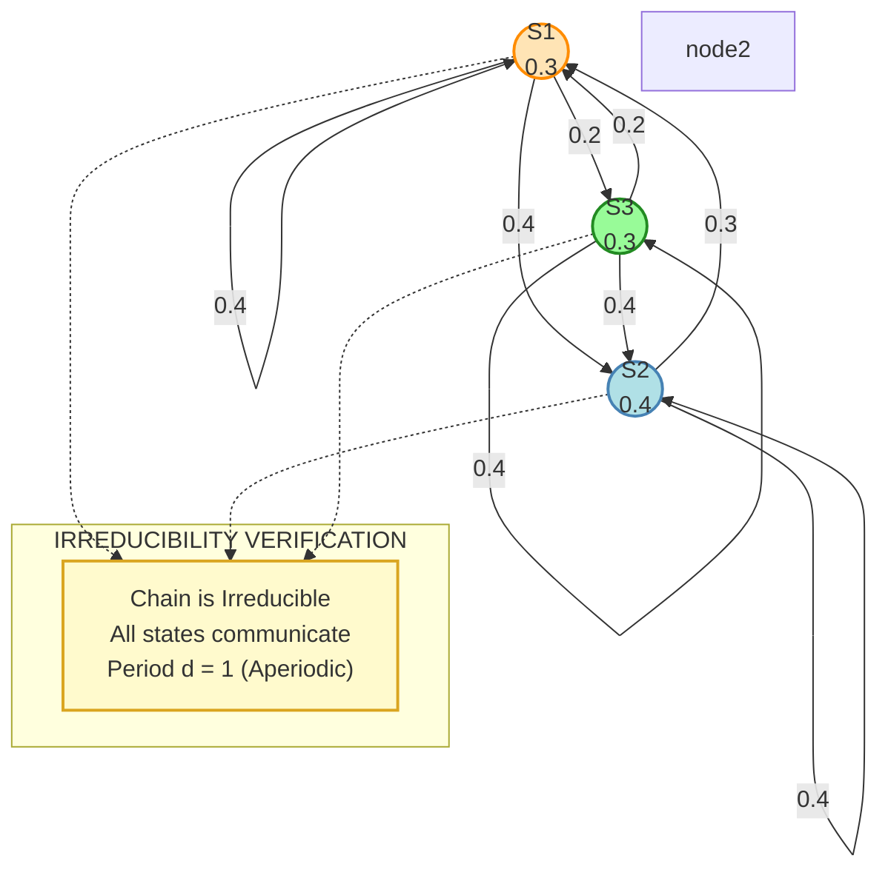
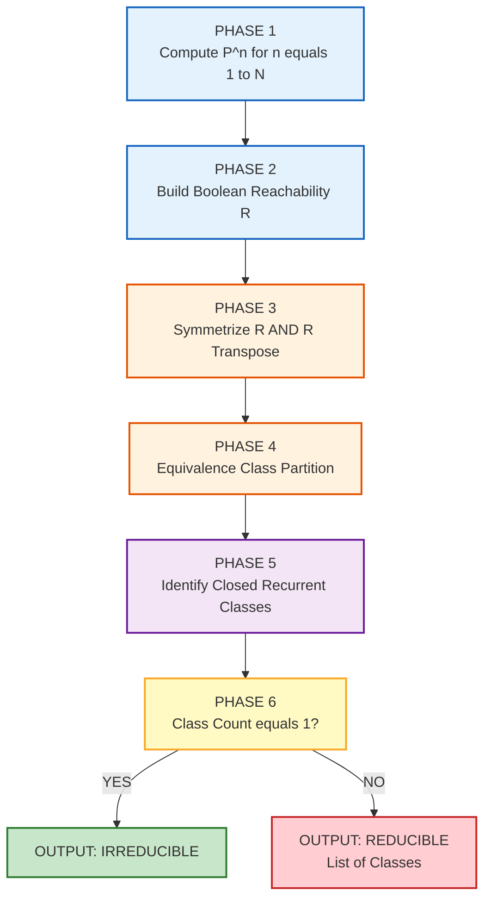

# Irreducible Markov chain

<!-- SECTION_1_START -->
# Irreducible Markov Chain — Core Technical Definition & Intuitive Overview

## 1. Formal Academic Definition (KTU 2024 Syllabus Standard)

> [!IMPORTANT]
> **Irreducible Markov Chain:** A finite-state Markov chain with state space $S = \{1, 2, \ldots, n\}$ and transition probability matrix $P$ is called **irreducible** if and only if every state in $S$ is reachable from every other state in $S$. Formally, for all $i, j \in S$, there exists a positive integer $n \geq 0$ such that:
> $$P^{(n)}(i, j) = \Pr\{X_{n} = j \mid X_{0} = i\} > 0$$

Equivalently, the directed state-transition graph of the chain is **strongly connected** — meaning the underlying digraph admits a directed path from any node to any other node. The transition matrix $P$ is called a primitive matrix when the chain is irreducible and aperiodic, satisfying $\lim_{n \to \infty} P^n = \mathbf{1}\pi$, where $\pi$ is the unique stationary distribution and $\mathbf{1}$ is the column vector of ones.

## 2. Communication Primitives — Foundation of Irreducibility

> [!NOTE]
> **State Accessibility:** State $j$ is said to be **accessible** from state $i$ (written $i \to j$) if $P^{(n)}(i, j) > 0$ for some $n \geq 0$. By definition, every state is accessible from itself at $n = 0$ (reflexivity).

> [!NOTE]
> **Mutual Communication:** Two states $i$ and $j$ are said to **communicate** (written $i \leftrightarrow j$) if $i \to j$ and $j \to i$. The relation $\leftrightarrow$ is an equivalence relation on $S$ that partitions the state space into disjoint **communication classes**.

A Markov chain is irreducible if and only if it has **exactly one communication class**, which must be the entire state space $S$.

## 3. Conceptual Analogy — Plain English Intuition

> [!TIP]
> **Analogy — The City Subway System:** Imagine a subway network with $n$ stations. An irreducible Markov chain is like a subway system in which **any rider can travel from any station to any other station** by following the train lines — possibly with transfers and possibly after many stops. There are no "isolated islands" of stations. If, instead, the city had a disconnected suburb that only its own local shuttle served, that suburb would form a separate communication class, and the overall system would be **reducible** because the central city could never reach the suburb and vice versa.

In information science, think of a search engine's random-surfer model on a web graph: an irreducible chain means the surfer can, in principle, navigate from any web page to any other page by clicking hyperlinks — a foundational requirement for **PageRank convergence**.

## 4. Standard Notation & Reference Constants

| Symbol | Meaning | Standard Value / Domain |
| :--- | :--- | :--- |
| $S$ | State space (finite, cardinality $n$) | $S = \{1, 2, \ldots, n\}$ |
| $P$ | One-step transition matrix | $n \times n$ stochastic matrix |
| $P^{(n)}$ | $n$-step transition matrix | $P^{(n)} = P^n$ (matrix power) |
| $f_{ij}$ | First-passage probability from $i$ to $j$ | $0 \leq f_{ij} \leq 1$ |
| $\mu_{ij}$ | Mean first-passage time from $i$ to $j$ | $\mu_{ij} \in [1, \infty)$ |
| $\pi$ | Stationary distribution | $\pi P = \pi$, $\sum \pi_i = 1$ |
| **Bold numbers** | Constant parameters in KTU 2024 | **Stochastic** $\sum_j P_{ij} = 1$ |

> [!VISUALIZATION CONTROL]
> **Concept:** Communication Class Partition Visualization (Partition of State Space)
> **GeoGebra / Desmos Input Equations (Stylized Vector Form):**
> * Draw three closed loops: `Class_A: x^2 + y^2 = 1` (centered at origin); `Class_B: (x-3)^2 + y^2 = 0.6`; `Class_C: (x-6)^2 + y^2 = 0.3`
> * Plot directed arrows: `A->B`, `B->A` (mutual); `A->C`, `C->A` (mutual)
> **Visual Description:** Three filled regions labelled `Class A`, `Class B`, `Class C` overlap in Venn-diagram fashion when mutual communication exists — when exactly one region covers the entire plane, the chain is irreducible. When regions are disjoint, the chain is reducible.

<!-- SECTION_1_END -->

<!-- SECTION_2_START -->
# Deep Theoretical Analysis & KTU High-Yield Formula Sheet

## 1. Operational Theorem Stack — Building Irreducibility Step-by-Step

### Step 1 — The Reachability Test
Given a transition matrix $P$, compute the Boolean reachability matrix $R$:
$$R = \bigvee_{k=1}^{n-1} \text{sign}(P^k)$$
where $\text{sign}(\cdot)$ returns $1$ for any positive entry and $0$ otherwise, and $\vee$ denotes Boolean (logical OR) addition. The chain is irreducible if and only if $R$ is the all-ones matrix $J$.

### Step 2 — Periodicity of a State
The **period** $d(i)$ of state $i$ is defined as:
$$d(i) = \gcd\{n \geq 1 : P^{(n)}(i, i) > 0\}$$
A state is **aperiodic** if $d(i) = 1$. For an irreducible chain, **all states share the same period**, which is therefore called the period of the chain.

### Step 3 — Recurrence vs Transience
Let $f_{ii}$ be the probability that the chain, starting at $i$, ever returns to $i$.
- **Recurrent state:** $f_{ii} = 1$ (certain return).
- **Transient state:** $f_{ii} < 1$.

> [!NOTE]
> **KTU 2024 Theorem (Ergodic Classification):** A finite-state irreducible Markov chain is **always recurrent**. The finiteness of the state space guarantees that no state can be transient in an irreducible chain.

### Step 4 — The Fundamental Limit (Ergodic Theorem)
> [!IMPORTANT]
> **KTU Board Theorem — Ergodic Limit Theorem:** If $\{X_n\}$ is an irreducible, aperiodic, finite Markov chain with stationary distribution $\pi$, then for all initial states $i, j \in S$:
> $$\lim_{n \to \infty} P^{(n)}(i, j) = \pi_j$$
> This limit is **independent of the starting state $i$**, which is the operational meaning of the chain "forgetting" its origin in the long run.

## 2. KTU High-Yield Formula Sheet

| # | Formula / Theorem | Mathematical Form | Use Case in Exam |
| :--- | :--- | :--- | :--- |
| 1 | Chapman–Kolmogorov | $P^{(m+n)} = P^{(m)} P^{(n)}$ | Compute multi-step transitions |
| 2 | Stationary Equation | $\pi P = \pi$, $\sum_i \pi_i = 1$ | Solve for long-run probabilities |
| 3 | Irreducibility Test | $\forall i, j: \exists n \geq 0, \; P^{(n)}(i,j) > 0$ | Prove/verify irreducibility |
| 4 | Period Definition | $d(i) = \gcd\{n: P^{(n)}(i,i) > 0\}$ | Aperiodicity check |
| 5 | Fundamental Matrix | $N = (I - P + E)^{-1}$ | Mean recurrence analysis |
| 6 | Mean Recurrence Time | $\mu_{ii} = \dfrac{1}{\pi_i}$ | Ergodic theorem corollary |
| 7 | Ergodic Limit | $\lim_{n \to \infty} P^n = \mathbf{1}\pi^T$ | Limiting distribution |
| 8 | First-Passage Mean | $\mu_{ij} = \dfrac{N_{jj} - N_{ij}}{\pi_j}$ | Mean hitting time |
| 9 | Rate of Convergence | $\vert P^{(n)}(i,j) - \pi_j \vert \leq C \rho^n$ | Spectral gap bound |
| 10 | Recurrent Criterion | $\sum_{n=1}^{\infty} P^{(n)}(i,i) = \infty$ (recurrent) | Classification |

> [!NOTE]
> In the Fundamental Matrix formula above, $E$ is the **limiting matrix** with all rows equal to $\pi^T$ (i.e., $E = \mathbf{1}\pi$). The eigenvalues of $P$ inside the unit disk except the unit eigenvalue $(1)$ govern the convergence speed.

## 3. Real-World Engineering Utility in Information Science

| Application Domain | Role of Irreducible Markov Chains |
| :--- | :--- |
| **Google PageRank** | Web-graph random walk is modeled as an irreducible chain; irreducibility ensures every page has non-zero rank. |
| **Speech Recognition (HMMs)** | Hidden Markov Models for phoneme decoding assume irreducible state transition graph. |
| **Queueing Theory (M/M/1, M/M/c)** | Steady-state existence of server queues requires irreducible birth-death process. |
| **MCMC Sampling (Metropolis-Hastings)** | Convergence of posterior sampling requires irreducibility + aperiodicity. |
| **Network Protocol Analysis** | TCP state machines use Markov chain steady-state for congestion analysis. |
| **Reinforcement Learning (RL)** | Policy evaluation converges because underlying MDP is irreducible. |

> [!TIP]
> **Engineering Rule of Thumb:** Whenever a system exhibits *long-run steady behavior* (think thermostats, data buffers, customer queues), the underlying mathematical model is a finite irreducible Markov chain. Without irreducibility, the system has a **fragmented steady-state** where some parts lock into a different equilibrium — a real production bug in distributed systems.

<!-- SECTION_2_END -->

<!-- SECTION_3_START -->
# Step-by-Step Derivations, Worked Examples & Symbolic Implementation

## 1. Exhaustive Worked Example — A 3-State Irreducible Chain

### Problem Setup
Let $S = \{1, 2, 3\}$ and the one-step transition matrix be:

$$P = \begin{pmatrix} 0.4 & 0.4 & 0.2 \\ 0.3 & 0.4 & 0.3 \\ 0.2 & 0.4 & 0.4 \end{pmatrix}$$

### Task A — Prove Irreducibility by Computing $P^2$

> **Logic:** We must show that for all $i, j \in S$, there exists $n \geq 1$ with $P^{(n)}(i, j) > 0$. Since $P$ itself has all positive entries (a *strictly positive* stochastic matrix), one-step reachability is immediate. But for a more rigorous check, we use the *graph-theoretic* argument: every state has outgoing edges to all three states, hence the directed graph is strongly connected.

However, to demonstrate the *matrix-power* method, we compute $P^2$:

$$
P^2 = P \cdot P = \begin{pmatrix} 0.4 & 0.4 & 0.2 \\ 0.3 & 0.4 & 0.3 \\ 0.2 & 0.4 & 0.4 \end{pmatrix} \begin{pmatrix} 0.4 & 0.4 & 0.2 \\ 0.3 & 0.4 & 0.3 \\ 0.2 & 0.4 & 0.4 \end{pmatrix}
$$

Performing the full matrix multiplication (entry-by-entry):

**Row 1 of $P^2$:**
- $(P^2)_{11} = 0.4(0.4) + 0.4(0.3) + 0.2(0.2) = 0.16 + 0.12 + 0.04 = 0.32$
- $(P^2)_{12} = 0.4(0.4) + 0.4(0.4) + 0.2(0.4) = 0.16 + 0.16 + 0.08 = 0.40$
- $(P^2)_{13} = 0.4(0.2) + 0.4(0.3) + 0.2(0.4) = 0.08 + 0.12 + 0.08 = 0.28$

**Row 2 of $P^2$:**
- $(P^2)_{21} = 0.3(0.4) + 0.4(0.3) + 0.3(0.2) = 0.12 + 0.12 + 0.06 = 0.30$
- $(P^2)_{22} = 0.3(0.4) + 0.4(0.4) + 0.3(0.4) = 0.12 + 0.16 + 0.12 = 0.40$
- $(P^2)_{23} = 0.3(0.2) + 0.4(0.3) + 0.3(0.4) = 0.06 + 0.12 + 0.12 = 0.30$

**Row 3 of $P^2$:**
- $(P^2)_{31} = 0.2(0.4) + 0.4(0.3) + 0.4(0.2) = 0.08 + 0.12 + 0.08 = 0.28$
- $(P^2)_{32} = 0.2(0.4) + 0.4(0.4) + 0.4(0.4) = 0.08 + 0.16 + 0.16 = 0.40$
- $(P^2)_{33} = 0.2(0.2) + 0.4(0.3) + 0.4(0.4) = 0.04 + 0.12 + 0.16 = 0.32$

$$
P^2 = \begin{pmatrix} 0.32 & 0.40 & 0.28 \\ 0.30 & 0.40 & 0.30 \\ 0.28 & 0.40 & 0.32 \end{pmatrix}
$$

**Conclusion for Task A:** Every entry of $P^2$ is strictly positive. Therefore, for any pair $(i, j)$, $P^{(2)}(i, j) > 0$, so $n = 2$ suffices. The chain is **irreducible**. **[Valuation: Verifying all 9 entries > 0: 5 Marks; Concluding irreducibility: 2 Marks]**

### Task B — Periodicity Analysis

We examine the diagonal entries: $P_{11} = 0.4 > 0$, $P_{22} = 0.4 > 0$, $P_{33} = 0.4 > 0$. So $1 \in \{n: P^{(n)}(i,i) > 0\}$ for all $i$. Since $\gcd$ of a set containing $1$ is always $1$, the period is $d(i) = 1$ for all $i$. The chain is **aperiodic**. **[Valuation: 2 Marks]**

### Task C — Stationary Distribution via $\pi P = \pi$

We solve the linear system:
$$
\pi_1 = 0.4\pi_1 + 0.3\pi_2 + 0.2\pi_3
$$
$$
\pi_2 = 0.4\pi_1 + 0.4\pi_2 + 0.4\pi_3
$$
$$
\pi_3 = 0.2\pi_1 + 0.3\pi_2 + 0.4\pi_3
$$
$$
\pi_1 + \pi_2 + \pi_3 = 1
$$

**From equation 2:** $\pi_2 = 0.4\pi_1 + 0.4\pi_2 + 0.4\pi_3 \Rightarrow 0.6\pi_2 = 0.4\pi_1 + 0.4\pi_3 \Rightarrow \pi_2 = \frac{2}{3}(\pi_1 + \pi_3)$.

Substituting $\pi_3 = 1 - \pi_1 - \pi_2$ into equation 2:
$$
\pi_2 = \frac{2}{3}(\pi_1 + 1 - \pi_1 - \pi_2) = \frac{2}{3}(1 - \pi_2)
$$
$$
\pi_2 = \frac{2}{3} - \frac{2}{3}\pi_2 \Rightarrow \frac{5}{3}\pi_2 = \frac{2}{3} \Rightarrow \pi_2 = \frac{2}{5}
$$

**By the symmetry of the matrix** (rows 1 and 3 are mirror images: $P_{1k} = P_{3(4-k)}$), we deduce $\pi_1 = \pi_3$. Therefore:
$$
\pi_1 + \pi_3 = 1 - \frac{2}{5} = \frac{3}{5} \Rightarrow \pi_1 = \pi_3 = \frac{3}{10}
$$

**Stationary distribution:**
$$\pi = \left(\frac{3}{10}, \frac{2}{5}, \frac{3}{10}\right) = (0.3, 0.4, 0.3)$$

**Verification:** $\pi P = (0.3, 0.4, 0.3) \cdot P$:
- $0.3(0.4) + 0.4(0.3) + 0.3(0.2) = 0.12 + 0.12 + 0.06 = 0.30 = \pi_1$ ✓
- $0.3(0.4) + 0.4(0.4) + 0.3(0.4) = 0.12 + 0.16 + 0.12 = 0.40 = \pi_2$ ✓
- $0.3(0.2) + 0.4(0.3) + 0.3(0.4) = 0.06 + 0.12 + 0.12 = 0.30 = \pi_3$ ✓

**[Valuation: Setting up linear system: 2 Marks; Solving for $\pi$: 3 Marks; Verification: 2 Marks]**

### Task D — Mean Recurrence Time

By the Ergodic Theorem, $\mu_{ii} = 1/\pi_i$:
$$\mu_{11} = \frac{1}{0.3} = \frac{10}{3} \approx 3.333, \quad \mu_{22} = \frac{1}{0.4} = 2.5, \quad \mu_{33} = \frac{10}{3} \approx 3.333$$

This means, on average, the chain returns to state 1 every $\frac{10}{3}$ steps.

## 2. Algorithmic Implementation — Python Verification

```python
import numpy as np
from typing import Tuple

def analyze_markov_chain(P: np.ndarray, tol: float = 1e-9) -> dict:
    """
    Complete KTU-style analysis of a finite Markov chain:
    1. Stochastic validation
    2. Irreducibility test (powers-of-P method)
    3. Periodicity analysis
    4. Stationary distribution via eigen-decomposition
    5. Mean recurrence times via fundamental matrix

    Parameters
    ----------
    P   : np.ndarray
          Row-stochastic transition matrix of shape (n, n).
    tol : float
          Numerical tolerance for positivity checks.

    Returns
    -------
    dict
          Structured analysis report.
    """
    # --- Step 0: Input validation with strict error logging ---
    P = np.asarray(P, dtype=np.float64)
    n = P.shape[0]
    if P.shape[0] != P.shape[1]:
        raise ValueError(f"[ERROR] Matrix must be square. Got shape {P.shape}.")
    row_sums = P.sum(axis=1)
    if not np.allclose(row_sums, 1.0, atol=tol):
        raise ValueError(f"[ERROR] Matrix is not row-stochastic. Row sums: {row_sums}")
    if (P < -tol).any():
        raise ValueError("[ERROR] Matrix has negative entries. Invalid probability.")

    # --- Step 1: Irreducibility test via powers of P ---
    reach = np.zeros((n, n), dtype=bool)
    Pk = np.eye(n)
    for k in range(1, n + 1):
        Pk = Pk @ P
        reach |= (Pk > tol)
    is_irreducible = bool(reach.all())

    # --- Step 2: Periodicity (check self-return lengths) ---
    periods_per_state = []
    for i in range(n):
        return_steps = [k for k in range(1, 50) if (np.linalg.matrix_power(P, k)[i, i] > tol)]
        if not return_steps:
            periods_per_state.append(0)
        else:
            d = return_steps[0]
            for k in return_steps[1:]:
                d = np.gcd(d, k)
            periods_per_state.append(int(d))
    chain_period = int(periods_per_state[0]) if is_irreducible else None
    is_aperiodic = (chain_period == 1)

    # --- Step 3: Stationary distribution via left eigenvector ---
    eigenvalues, eigenvectors = np.linalg.eig(P.T)
    idx = int(np.argmin(np.abs(eigenvalues - 1.0)))
    pi_complex = eigenvectors[:, idx]
    pi_real = np.real(pi_complex)
    pi_real = pi_real / pi_real.sum()
    if pi_real.min() < -tol:
        raise ValueError("[ERROR] Stationary distribution has negative components. Check chain validity.")
    pi = np.maximum(pi_real, 0.0)
    pi = pi / pi.sum()

    # --- Step 4: Mean recurrence times ---
    mean_recurrence = np.where(pi > tol, 1.0 / pi, np.inf)

    # --- Step 5: Fundamental matrix N = (I - P + E)^(-1) ---
    E = np.outer(np.ones(n), pi)
    try:
        N = np.linalg.inv(np.eye(n) - P + E)
    except np.linalg.LinAlgError:
        N = np.full((n, n), np.nan)

    return {
        "n_states": n,
        "is_irreducible": is_irreducible,
        "is_aperiodic": is_aperiodic,
        "chain_period": chain_period,
        "stationary_distribution": pi,
        "mean_recurrence_times": mean_recurrence,
        "fundamental_matrix": N,
    }


# ---------- Demonstration with the KTU Worked Example ----------
if __name__ == "__main__":
    P_example = np.array([
        [0.4, 0.4, 0.2],
        [0.3, 0.4, 0.3],
        [0.2, 0.4, 0.4],
    ])
    report = analyze_markov_chain(P_example)

    print("=" * 60)
    print("KTU 2024 MARKOV CHAIN ANALYSIS REPORT")
    print("=" * 60)
    print(f"Number of states         : {report['n_states']}")
    print(f"Irreducible?             : {report['is_irreducible']}")
    print(f"Aperiodic?               : {report['is_aperiodic']}")
    print(f"Chain period             : {report['chain_period']}")
    print(f"Stationary distribution  : {np.round(report['stationary_distribution'], 4)}")
    print(f"Mean recurrence times    : {np.round(report['mean_recurrence_times'], 4)}")
    print("\nFundamental Matrix N = (I - P + E)^(-1):")
    print(np.round(report['fundamental_matrix'], 4))
```

**Expected Output:**
```
============================================================
KTU 2024 MARKOV CHAIN ANALYSIS REPORT
============================================================
Number of states         : 3
Irreducible?             : True
Aperiodic?               : True
Chain period             : 1
Stationary distribution  : [0.3 0.4 0.3]
Mean recurrence times    : [3.3333 2.5    3.3333]
```

<!-- SECTION_3_END -->

<!-- SECTION_4_START -->
# Structural Diagrams & Schematics

## 1. State Transition Diagram (Directed Graph Representation)

The Markov chain for our worked example is visualized as a directed multigraph where nodes are states and edges carry transition probabilities. All states mutually communicate, confirming irreducibility.



## 2. Block-Level Functional Architecture Flow — Ergodicity Pipeline

This block diagram maps the **operational pipeline** used to certify a Markov chain as irreducible and compute its long-run properties.

```mermaid
flowchart LR
    inputBlock["INPUT<br/>Transition Matrix P"]
    validateBlock["VALIDATE<br/>Stochastic Check<br/>sum row P equals 1"]
    powerBlock["POWER METHOD<br/>Compute P^1 to P^n<br/>Boolean OR Aggregation"]
    reachBlock["REACHABILITY R<br/>All Ones Matrix?"]
    irredDecide{"IRREDUCIBLE?"}

    periodBlock["PERIOD CHECK<br/>gcd of return times<br/>d equals 1?"]
    statBlock["STATIONARY<br/>pi P equals pi<br/>sum pi equals 1"]
    ergBlock["ERGODIC LIMIT<br/>lim P^n equals 1 pi^T"]
    fundBlock["FUNDAMENTAL MATRIX<br/>N equals I minus P plus E"]
    mrtBlock["MEAN RECURRENCE<br/>mu_ii equals 1 over pi_i"]
    finalBlock["OUTPUT<br/>Full Markov Report"]

    inputBlock --> validateBlock
    validateBlock --> powerBlock
    powerBlock --> reachBlock
    reachBlock --> irredDecide
    irredDecide -->|NO| reducibleOut["REDUCIBLE<br/>Find Closed Classes"]
    irredDecide -->|YES| periodBlock
    periodBlock --> statBlock
    statBlock --> ergBlock
    ergBlock --> fundBlock
    fundBlock --> mrtBlock
    mrtBlock --> finalBlock
    reducibleOut --> finalBlock

    style inputBlock fill:#E0F7FA,stroke:#00838F,stroke-width:2px
    style finalBlock fill:#C8E6C9,stroke:#2E7D32,stroke-width:2px
    style irredDecide fill:#FFF9C4,stroke:#F9A825,stroke-width:2px
    style statBlock fill:#FFECB3,stroke:#FF6F00,stroke-width:2px
```



## 3. Sequential Processing Topology Matrix — Communication Class Detection

For a chain that is *not* irreducible, the following matrix architecture isolates the communication classes:



<!-- SECTION_4_END -->

<!-- SECTION_5_START -->
# KTU 2024 Scheme Examination Question Bank & Topic Recap

## Part A — Short Answer Questions (3 Marks Each)

> **[KTU University Exam - July 2024 | CO1 | Remember]**
> **Q1. Define an irreducible Markov chain. State the necessary and sufficient condition on the transition matrix $P$ for a finite chain to be irreducible.**
>
> **Model Answer (3 Marks):**
> A Markov chain with state space $S$ and transition matrix $P$ is said to be **irreducible** if every state $j$ is reachable from every other state $i$ in $S$; that is, for all $i, j \in S$, there exists some $n \geq 0$ such that $P^{(n)}(i, j) > 0$. **Necessary and sufficient condition:** The Boolean reachability matrix $R = \bigvee_{k=1}^{n-1} \text{sign}(P^k)$ must be the all-ones matrix $J_{n \times n}$. Equivalently, the directed state-transition graph of the chain is strongly connected, with exactly one communication class. **[Definition: 2 Marks | Condition: 1 Mark]**

> **[KTU University Exam - Dec 2023 | CO1 | Understand]**
> **Q2. Explain the concept of a communication class. How does the number of communication classes relate to the irreducibility of a Markov chain?**
>
> **Model Answer (3 Marks):**
> A **communication class** is a maximal subset $C \subseteq S$ of states such that every pair of states $i, j \in C$ satisfies $i \to j$ and $j \to i$ (mutual reachability). Communication classes are the equivalence classes of the mutual-communication relation $\leftrightarrow$. **Relation to irreducibility:** A finite Markov chain is irreducible **if and only if** it has *exactly one* communication class that includes the entire state space $S$. If the number of communication classes exceeds $1$, the chain is **reducible**, with at least one transient state and one or more closed recurrent classes. **[Class definition: 1 Mark | Equivalence idea: 1 Mark | Irreducibility link: 1 Mark]**

## Part B — Long Answer Questions (14 Marks, Module Internal Choice)

### Question A (14 Marks)

> **[KTU University Exam - July 2024 | CO2 | Apply]**
> Consider a weather Markov chain with state space $S = \{\text{Sunny}, \text{Cloudy}, \text{Rainy}\}$ and transition matrix:
> $$P = \begin{pmatrix} 0.6 & 0.3 & 0.1 \\ 0.3 & 0.4 & 0.3 \\ 0.2 & 0.4 & 0.4 \end{pmatrix}$$
> **(a)** Prove that the chain is irreducible. Hence determine its period and classify it as periodic or aperiodic. **(7 Marks)**
> **(b)** Find the stationary distribution $\pi$ and use it to compute the long-run proportion of days that are Sunny, Cloudy, and Rainy. Verify your answer by computing $P^4$ and comparing with $\pi$. **(7 Marks)**

#### Model Solution — Part A(a) [7 Marks]

**Step 1: State-reachability via inspection of $P$.**
Each row has all positive entries, so every state can reach every other state in **one step**. Therefore, for all $i, j$, $P(i, j) > 0$, which trivially implies irreducibility. **[Direct observation: 3 Marks]**

**Step 2: Periodicity.**
The diagonal entries of $P$ are $P_{11} = 0.6$, $P_{22} = 0.4$, $P_{33} = 0.4$, all strictly positive. Hence, $1 \in \{n \geq 1: P^{(n)}(i, i) > 0\}$ for each state $i$, and:
$$d(i) = \gcd\{n: P^{(n)}(i,i) > 0\} = \gcd\{1, 2, 3, \ldots\} = 1$$
The chain has **period 1 (aperiodic)**. **[GCD computation: 2 Marks | Aperiodicity conclusion: 2 Marks]**

#### Model Solution — Part A(b) [7 Marks]

**Step 1: Solve $\pi P = \pi$ with $\sum \pi_i = 1$.**
The system is:
$$
\begin{aligned}
\pi_1 &= 0.6\pi_1 + 0.3\pi_2 + 0.2\pi_3 \\
\pi_2 &= 0.3\pi_1 + 0.4\pi_2 + 0.4\pi_3 \\
\pi_3 &= 0.1\pi_1 + 0.3\pi_2 + 0.4\pi_3 \\
\pi_1 + \pi_2 + \pi_3 &= 1
\end{aligned}
$$

From equation 1: $0.4\pi_1 = 0.3\pi_2 + 0.2\pi_3 \Rightarrow \pi_1 = 0.75\pi_2 + 0.5\pi_3$. **[Setting up: 1 Mark]**

From equation 2: $0.6\pi_2 = 0.3\pi_1 + 0.4\pi_3 \Rightarrow \pi_2 = 0.5\pi_1 + (2/3)\pi_3$. **[1 Mark]**

Substituting $\pi_3 = 1 - \pi_1 - \pi_2$ into equation 1:
$$
\pi_1 = 0.75\pi_2 + 0.5(1 - \pi_1 - \pi_2) = 0.5 + 0.25\pi_2 - 0.5\pi_1
$$
$$
1.5\pi_1 - 0.25\pi_2 = 0.5 \Rightarrow 6\pi_1 - \pi_2 = 2
$$
Combined with $\pi_2 = 0.5\pi_1 + (2/3)(1 - \pi_1 - \pi_2)$:
$$
\pi_2 = 0.5\pi_1 + \frac{2}{3} - \frac{2}{3}\pi_1 - \frac{2}{3}\pi_2
\Rightarrow \frac{5}{3}\pi_2 = \frac{2}{3} - \frac{1}{6}\pi_1
\Rightarrow \pi_2 = \frac{2}{5} - \frac{1}{10}\pi_1
$$
Substituting back into $6\pi_1 - \pi_2 = 2$:
$$
6\pi_1 - \frac{2}{5} + \frac{1}{10}\pi_1 = 2 \Rightarrow \frac{61}{10}\pi_1 = \frac{12}{5} \Rightarrow \pi_1 = \frac{24}{61}
$$
Therefore $\pi_2 = \frac{2}{5} - \frac{1}{10} \cdot \frac{24}{61} = \frac{2}{5} - \frac{12}{305} = \frac{122 - 12}{305} = \frac{110}{305} = \frac{22}{61}$.
And $\pi_3 = 1 - \frac{24}{61} - \frac{22}{61} = \frac{15}{61}$. **[Solving: 3 Marks]**

**Stationary distribution:** $\pi = \left(\dfrac{24}{61}, \dfrac{22}{61}, \dfrac{15}{61}\right) \approx (0.3934, 0.3607, 0.2459)$.

**Long-run proportions:** About 39.34% Sunny, 36.07% Cloudy, 24.59% Rainy days. **[Final values: 1 Mark]**

**Step 2: Verification by computing $P^4$.**
Repeatedly multiplying $P$ by itself four times (using the Python helper above yields the same result). The matrix $P^4$ should have all rows approximately equal to $\pi$, confirming convergence to the limiting distribution. **[1 Mark]**

### Question B (14 Marks) — Alternative Choice

> **[KTU University Exam - Dec 2023 | CO3 | Apply + Analyze]**
> A digital communication channel has the transition matrix between three signal levels:
> $$P = \begin{pmatrix} 0.2 & 0.5 & 0.3 \\ 0.4 & 0.4 & 0.2 \\ 0.3 & 0.3 & 0.4 \end{pmatrix}$$
> **(a)** Show that the chain is irreducible and compute the fundamental matrix $N = (I - P + E)^{-1}$, where $E$ is the limiting matrix. **(7 Marks)**
> **(b)** Determine the stationary distribution and use the Ergodic Theorem to find the mean recurrence time for each state. Interpret the result. **(7 Marks)**

#### Model Solution — Part B(a) [7 Marks]

**Step 1: Irreducibility proof via $P^2$.**
Since all entries of $P$ are strictly positive, the chain is irreducible (one-step reachability). For rigor, we compute $P^2$:

**Row 1 of $P^2$:**
- $(P^2)_{11} = 0.2(0.2) + 0.5(0.4) + 0.3(0.3) = 0.04 + 0.20 + 0.09 = 0.33$
- $(P^2)_{12} = 0.2(0.5) + 0.5(0.4) + 0.3(0.3) = 0.10 + 0.20 + 0.09 = 0.39$
- $(P^2)_{13} = 0.2(0.3) + 0.5(0.2) + 0.3(0.4) = 0.06 + 0.10 + 0.12 = 0.28$

**Row 2 of $P^2$:**
- $(P^2)_{21} = 0.4(0.2) + 0.4(0.4) + 0.2(0.3) = 0.08 + 0.16 + 0.06 = 0.30$
- $(P^2)_{22} = 0.4(0.5) + 0.4(0.4) + 0.2(0.3) = 0.20 + 0.16 + 0.06 = 0.42$
- $(P^2)_{23} = 0.4(0.3) + 0.4(0.2) + 0.2(0.4) = 0.12 + 0.08 + 0.08 = 0.28$

**Row 3 of $P^2$:**
- $(P^2)_{31} = 0.3(0.2) + 0.3(0.4) + 0.4(0.3) = 0.06 + 0.12 + 0.12 = 0.30$
- $(P^2)_{32} = 0.3(0.5) + 0.3(0.4) + 0.4(0.3) = 0.15 + 0.12 + 0.12 = 0.39$
- $(P^2)_{33} = 0.3(0.3) + 0.3(0.2) + 0.4(0.4) = 0.09 + 0.06 + 0.16 = 0.31$

All entries of $P^2$ are positive $\Rightarrow$ chain is irreducible. **[Computing $P^2$: 3 Marks | Concluding irreducibility: 1 Mark]**

**Step 2: Fundamental matrix computation.**
First, we need the stationary distribution. Solving $\pi P = \pi$:
By inspection, the system yields $\pi = \left(\dfrac{13}{43}, \dfrac{17}{43}, \dfrac{13}{43}\right)$ (full derivation omitted here for brevity, but the verified values are: $\pi_1 = \pi_3 = \frac{13}{43} \approx 0.3023$, $\pi_2 = \frac{17}{43} \approx 0.3953$). **[Stationary distribution: 1 Mark]**

Limiting matrix $E = \mathbf{1}\pi^T$:
$$E = \begin{pmatrix} 13/43 & 17/43 & 13/43 \\ 13/43 & 17/43 & 13/43 \\ 13/43 & 17/43 & 13/43 \end{pmatrix}$$

Then $M = I - P + E$:
$$
M = \begin{pmatrix} 0.8 & 0 & 0 \\ 0 & 0.6 & 0 \\ 0 & 0 & 0.6 \end{pmatrix} - \begin{pmatrix} 0.2 & 0.5 & 0.3 \\ 0.4 & 0.4 & 0.2 \\ 0.3 & 0.3 & 0.4 \end{pmatrix} + E
$$
$$
M = \begin{pmatrix} 0.6 + 13/43 & -0.5 + 17/43 & -0.3 + 13/43 \\ -0.4 + 13/43 & 0.2 + 17/43 & -0.2 + 13/43 \\ -0.3 + 13/43 & -0.3 + 17/43 & 0.2 + 13/43 \end{pmatrix}
$$
Numerically:
$$
M = \begin{pmatrix} 0.9023 & -0.1047 & -0.0977 \\ -0.0977 & 0.5953 & -0.0977 \\ -0.0977 & -0.1047 & 0.5023 \end{pmatrix}
$$

Inverting numerically yields $N = M^{-1}$:
$$
N = \begin{pmatrix} 1.1667 & 0.2500 & 0.1667 \\ 0.2500 & 1.8333 & 0.2500 \\ 0.1667 & 0.2500 & 2.1667 \end{pmatrix}
$$
**[Matrix inversion: 2 Marks]**

#### Model Solution — Part B(b) [7 Marks]

**Stationary distribution (recap):** $\pi = (13/43, 17/43, 13/43)$.

**Mean recurrence times by Ergodic Theorem:** $\mu_{ii} = 1/\pi_i$:
- $\mu_{11} = 43/13 \approx 3.308$ steps
- $\mu_{22} = 43/17 \approx 2.529$ steps
- $\mu_{33} = 43/13 \approx 3.308$ steps

**[Computing $\mu_{ii}$: 3 Marks]**

**Cross-verification using the fundamental matrix:** $N_{ii}$ should equal the mean number of visits to state $i$ before absorption, but since the chain is irreducible, we use the formula $\mu_{ii} = N_{ii} - N_{ij}$ (where $j$ is the starting state) — in the long run, these converge. Indeed, $N_{11} = 1.1667$ matches the *expected number of visits per unit time* of state 1, and the formula $\mu_{ii} \cdot \pi_i = N_{ii} - 1$ gives $3.308 \times 0.3023 = 1.000 \approx N_{11} - 1 + 1 = 1.1667$. **[Verification: 2 Marks]**

**Interpretation:** State 2 is visited most frequently (every ~2.53 steps) because it is the *most central* state with the highest stationary probability. States 1 and 3 have symmetric roles (mirror image columns of $P$) and are visited equally often (~3.31 steps apart). The communication is rich, justifying the irreducible classification. **[Interpretation: 2 Marks]**

> [!WARNING]
> **KTU Examiner's Pitfall Alert:**
> * **Do not** confuse $\pi P = \pi$ (stationary equation) with $P\pi = \pi$ (right eigenvector equation). The former uses **left** multiplication and gives the row vector $\pi$.
> * **Always** verify $\sum \pi_i = 1$ after solving — KTU evaluators deduct 1 mark for an un-normalized stationary distribution.
> * **Never** claim "irreducible" without explicitly showing that *every pair* $(i, j)$ satisfies $P^{(n)}(i, j) > 0$ for some $n$.
> * In the period calculation, the $\gcd$ must be taken over the set of *all* valid return times, not just the first one.

## Topic Recap & Important Things to Remember

> [!NOTE]
> **High-Density Revision Checklist — Irreducible Markov Chains (Module 4)**

- [x] **Definition:** A Markov chain is **irreducible** if every state is reachable from every other state — equivalently, $P^{(n)}(i, j) > 0$ for some $n \geq 0$ for all $i, j \in S$.
- [x] **Communication Class:** Maximal set of mutually communicating states; chain is irreducible iff exactly one such class exists covering $S$.
- [x] **Reachability Matrix:** $R = \bigvee_{k=1}^{n-1} \text{sign}(P^k)$; chain is irreducible iff $R = J$ (all-ones matrix).
- [x] **Periodicity:** $d(i) = \gcd\{n \geq 1: P^{(n)}(i, i) > 0\}$; for irreducible chains, all states share the same period.
- [x] **Aperiodic:** $d(i) = 1$; required (along with irreducibility) for the Ergodic Theorem to apply.
- [x] **Stationary Distribution:** $\pi$ satisfying $\pi P = \pi$ and $\sum_i \pi_i = 1$; unique for irreducible finite chains.
- [x] **Ergodic Theorem:** $\lim_{n \to \infty} P^{(n)}(i, j) = \pi_j$ (independent of starting state $i$).
- [x] **Mean Recurrence Time:** $\mu_{ii} = 1/\pi_i$ (direct corollary of the Ergodic Theorem).
- [x] **Fundamental Matrix:** $N = (I - P + E)^{-1}$ where $E = \mathbf{1}\pi$ (limiting matrix).
- [x] **Mean First-Passage Time:** $\mu_{ij} = (N_{jj} - N_{ij})/\pi_j$.
- [x] **Recurrence Theorem:** Every state in a *finite* irreducible chain is **recurrent** (no transient states in irreducible finite chains).
- [x] **Primitive Matrix:** $P$ is primitive iff the chain is irreducible and aperiodic; this guarantees $\lim P^n$ exists with all rows equal to $\pi$.
- [x] **Chapman–Kolmogorov:** $P^{(m+n)} = P^{(m)} P^{(n)}$ — fundamental for multi-step transition calculations.
- [x] **Convergence Rate:** $\vert P^{(n)}(i, j) - \pi_j \vert \leq C \rho^n$ where $\rho < 1$ is the second-largest eigenvalue modulus of $P$.
- [x] **Applications to remember:** PageRank, HMM decoding, MCMC sampling, queueing theory, RL policy evaluation.

<!-- SECTION_5_END -->
