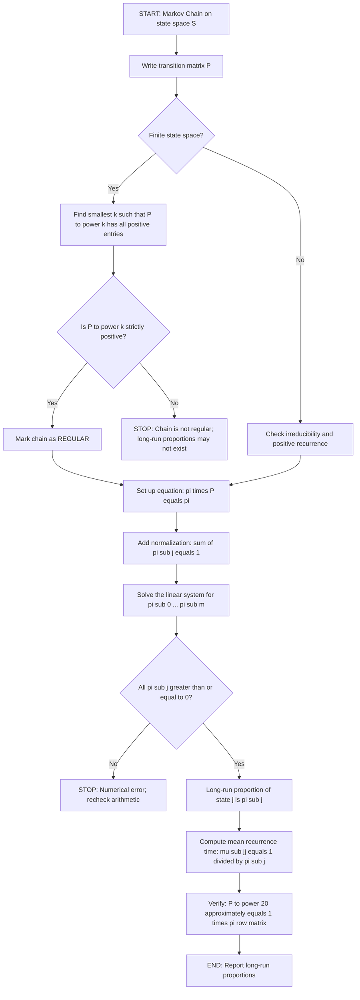
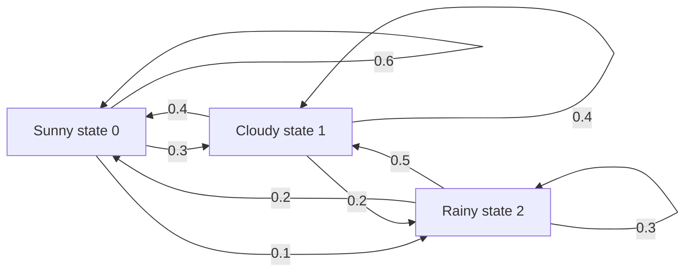
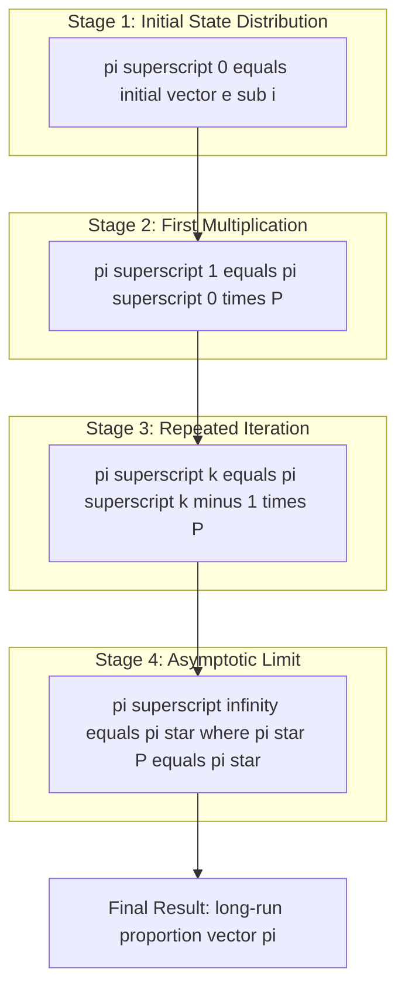
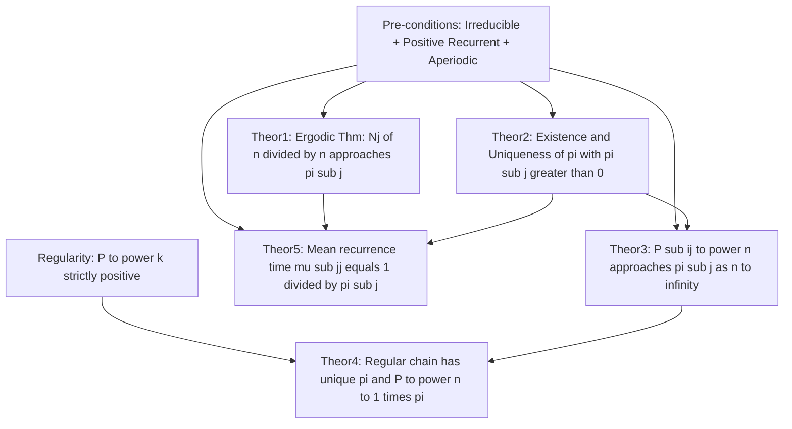

# Long-Run Proportions (Theorems without proof)

<!-- SECTION_1_START -->
# Long-Run Proportions in Markov Processes

## 1.1 Formal Technical Definition

Let $\{X_n\}_{n=0}^{\infty}$ be a discrete-time Markov chain defined on a finite or countable state space $S = \{0, 1, 2, \ldots, m\}$ with one-step transition probability matrix $\mathbf{P} = [P_{ij}]$. Define the **occupation count** (or **sojourn count**) of state $j$ up to time $n$ as:

$$N_j(n) = \sum_{m=1}^{n} \mathbb{I}_{\{X_m = j\}}$$

The **long-run proportion of time** (or **limiting fraction of time**) the chain spends in state $j$ is defined as:

$$\pi_j = \lim_{n \to \infty} \frac{N_j(n)}{n} \quad \text{whenever this limit exists.}$$

> [!NOTE]
> **KTU Syllabus Definition (GAMAT301 Module 4):**
> The long-run proportion $\pi_j$ of a Markov chain represents the *steady-state probability* that the chain occupies state $j$ after a sufficiently large number of transitions. For chains that are *ergodic* (irreducible, positive recurrent, and aperiodic), this proportion is **independent of the initial state** $X_0$ and equals the **stationary distribution** of the chain.

## 1.2 Conceptual Analogy — The Weather Watcher

Imagine you are a meteorologist sitting in Kochi recording the weather at noon every day for a year. The weather each day depends only on the weather of the previous day. The state space is:

$$S = \{\text{Sunny},\ \text{Cloudy},\ \text{Rainy}\}$$

If you look at the empirical record for the **last 10 years** (3650 days) and find that it rained on **1240 days**, the **long-run proportion of rainy days** is:

$$\pi_{\text{Rainy}} = \frac{1240}{3650} \approx 0.34$$

This $\pi_j$ is *not* a short-term forecast — it is the **statistical fingerprint** of the climate, which converges as the observation window $n \to \infty$. The Ergodic Theorem (Section 2.1) guarantees that for a well-behaved (ergodic) climate model, this long-run fraction equals the stationary probability $\pi_j$ obtained by solving $\boldsymbol{\pi} \mathbf{P} = \boldsymbol{\pi}$.

> [!IMPORTANT]
> **Geometric Intuition (Asymptotic Geometry of Stochastic Matrices):**
> Repeatedly multiplying the initial row vector $\boldsymbol{\pi}^{(0)}$ by $\mathbf{P}$ — i.e., $\boldsymbol{\pi}^{(k+1)} = \boldsymbol{\pi}^{(k)} \mathbf{P}$ — traces a **trajectory in the probability simplex** $\Delta^{m-1}$ that spirals (or contracts) toward a single fixed point. This fixed point is the stationary distribution $\boldsymbol{\pi}^*$, and its coordinate values are the long-run proportions.

> [!VISUALIZATION CONTROL]
> **Concept:** Convergence of probability vectors in the 2-simplex for a 2-state chain
> **Desmos Input Equations (parametric trace):**
> * `x(t) = 0.6 + 0.4 \cdot (0.3)^t \cdot \cos(\pi t / 4)`
> * `y(t) = 0.4 - 0.4 \cdot (0.3)^t \cdot \cos(\pi t / 4)`
> * Constraint: $x(t) + y(t) = 1$
> **Visual Description:** Plot a parametric point on the line segment from $(0,1)$ to $(1,0)$. Watch the trajectory spiral inward and converge to the fixed point $(0.4, 0.6)$, which is the long-run proportion of being in state 1.

## 1.3 Conditions that Guarantee Existence

The long-run proportion $\pi_j$ is **not guaranteed to exist** for *every* Markov chain. The existence requires structural conditions on the chain's state-class decomposition.

> [!IMPORTANT]
> **Mandatory Pre-Conditions for Long-Run Proportions:**
> 1. **Irreducibility** — Every state can be reached from every other state (single communicating class).
> 2. **Positive Recurrence** — The expected return time $\mu_{jj}$ to any state $j$ is finite.
> 3. **Aperiodicity** — The greatest common divisor (gcd) of return times to any state is $1$.
>
> A chain satisfying all three is called **ergodic** (or *regular* when a power of $\mathbf{P}$ is strictly positive).

## 1.4 The Stationary Distribution Connection

The long-run proportion $\pi_j$ coincides exactly with the $j^{\text{th}}$ coordinate of the **stationary distribution** $\boldsymbol{\pi} = (\pi_0, \pi_1, \ldots, \pi_m)$ defined by:

$$\boldsymbol{\pi} \mathbf{P} = \boldsymbol{\pi}, \qquad \sum_{j=0}^{m} \pi_j = 1, \qquad \pi_j \geq 0\ \forall j$$

> [!NOTE]
> The stationary distribution is **not** an "absorbing equilibrium" — it is a *statistical equilibrium*. The chain keeps transitioning; it is the **probability mass** that becomes time-invariant.

---

<!-- SECTION_1_END -->

<!-- SECTION_2_START -->
# Deep Theoretical Analysis & KTU High-Yield Theorem Set

This section consolidates the **five canonical theorems** on long-run proportions that constitute the core examinable content of GAMAT301 Module 4. *As per the KTU syllabus directive, all proofs are omitted; only statements, hypotheses, and consequences are presented.*

## 2.1 Theorem 1 — The Ergodic Theorem (Long-Run Proportions)

> [!IMPORTANT]
> **THEOREM 1 (Ergodic Theorem for Markov Chains):**
> Let $\{X_n\}$ be an irreducible, positive recurrent Markov chain with state space $S$ and stationary distribution $\boldsymbol{\pi} = (\pi_j)$. Then, with probability $1$:
> $$\lim_{n \to \infty} \frac{N_j(n)}{n} = \pi_j \quad \text{for every } j \in S$$
> Equivalently, the **long-run proportion of time** the chain spends in state $j$ exists almost surely and equals the stationary probability $\pi_j$.

**Hypotheses required:** Irreducibility + Positive Recurrence.
**Conclusion:** Time-average = Ensemble-average (Ergodicity).
**Why it matters:** Provides the operational link between observed frequencies and theoretical probabilities — the foundation of *Monte Carlo simulation* in CS.

## 2.2 Theorem 2 — Existence and Uniqueness of the Stationary Distribution

> [!IMPORTANT]
> **THEOREM 2 (Existence-Uniqueness Theorem):**
> An irreducible Markov chain admits a **unique** stationary distribution $\boldsymbol{\pi}$ satisfying $\boldsymbol{\pi}\mathbf{P} = \boldsymbol{\pi}$ if and only if the chain is **positive recurrent**. Moreover, $\pi_j > 0$ for every $j \in S$ in this case.

**Hypotheses required:** Irreducibility + Positive Recurrence.
**Conclusion:** A unique probability vector with strictly positive entries exists.
**Why it matters:** The non-negativity of all $\pi_j$ is what permits the reciprocal relation $\mu_{jj} = 1/\pi_j$ in Theorem 5.

## 2.3 Theorem 3 — Limiting Probabilities for Ergodic Chains

> [!IMPORTANT]
> **THEOREM 3 (Convergence of $n$-Step Transition Probabilities):**
> Let $\{X_n\}$ be an irreducible and aperiodic (i.e., *ergodic*) Markov chain with stationary distribution $\boldsymbol{\pi}$. Then for **all** $i, j \in S$:
> $$\lim_{n \to \infty} P_{ij}^{(n)} = \pi_j$$
> This limit is **independent of the starting state** $i$, depends only on the target state $j$, and equals the stationary probability $\pi_j$.

**Hypotheses required:** Irreducibility + Aperiodicity (which together with positive recurrence give *ergodicity*).
**Conclusion:** $\lim_{n \to \infty} \mathbf{P}^n$ is a matrix whose **every row is identical to $\boldsymbol{\pi}$**.
**Why it matters:** The "memory loss" property of ergodic chains — after sufficient time, the chain *forgets* its initial condition.

## 2.4 Theorem 4 — Regular Markov Chains Imply Stationarity

> [!IMPORTANT]
> **THEOREM 4 (Regular Chain Theorem):**
> A finite-state Markov chain is called **regular** if there exists a positive integer $k$ such that every entry of $\mathbf{P}^k$ is strictly positive (i.e., $\mathbf{P}^k > \mathbf{0}$ component-wise). Every regular chain:
> 1. Is irreducible and aperiodic.
> 2. Possesses a unique stationary distribution $\boldsymbol{\pi} > \mathbf{0}$.
> 3. Satisfies $\lim_{n \to \infty} \mathbf{P}^n = \mathbf{1}\boldsymbol{\pi}$, where $\mathbf{1}$ is the column vector of all ones.

**Hypotheses required:** Finite state space + Regularity ($\exists k$ with $\mathbf{P}^k > 0$).
**Conclusion:** Strict positivity + unique $\boldsymbol{\pi}$ + convergence to a rank-1 matrix.
**Why it matters:** Regularity is the **easiest sufficient condition** to verify in practice and is the most common KTU exam case.

## 2.5 Theorem 5 — Mean Recurrence Time Theorem

> [!IMPORTANT]
> **THEOREM 5 (Mean Recurrence Time):**
> For an irreducible, positive recurrent Markov chain with stationary distribution $\boldsymbol{\pi}$, the **mean recurrence time** of state $j$ — that is, the expected number of steps for the chain to return to $j$ starting from $j$ — is given by:
> $$\mu_{jj} = \frac{1}{\pi_j}$$
> Consequently, states with **larger** stationary probability $\pi_j$ are visited **more frequently** (shorter return gap).

**Hypotheses required:** Irreducibility + Positive Recurrence.
**Conclusion:** Direct inverse relationship between long-run proportion and expected inter-visit time.
**Why it matters:** The reciprocal structure $\pi_j \cdot \mu_{jj} = 1$ is the *defining identity* of an ergodic chain.

## 2.6 KTU High-Yield Formula Sheet

The following compact table consolidates every formula required for solving KTU ESE problems on this topic.

| **Symbol / Expression** | **Definition** | **Equation / Condition** | **Range of Validity** |
| :--- | :--- | :--- | :--- |
| $N_j(n)$ | Visits to state $j$ in $n$ steps | $N_j(n) = \sum_{m=1}^{n} \mathbb{I}_{\{X_m = j\}}$ | $n \geq 1,\ j \in S$ |
| $\pi_j$ | Long-run proportion in $j$ | $\pi_j = \lim_{n\to\infty} N_j(n) / n$ | Ergodic chains |
| Stationarity | Fixed-point equation | $\boldsymbol{\pi} \mathbf{P} = \boldsymbol{\pi}$ | Any Markov chain |
| Normalization | Probability mass conservation | $\sum_{j \in S} \pi_j = 1$ | All states |
| Non-negativity | Probability bound | $\pi_j \geq 0\ \forall j \in S$ | All states |
| Limiting matrix | Convergence target | $\lim_{n\to\infty} \mathbf{P}^n = \mathbf{1}\boldsymbol{\pi}$ | Regular chains |
| Mean recurrence | Inverse of stationary prob. | $\mu_{jj} = 1 / \pi_j$ | Pos. recurrent, irreducible |
| Return frequency | Visits per step in steady-state | $f_j = 1 / \mu_{jj} = \pi_j$ | Ergodic chains |
| Period of $j$ | GCD of return epochs | $d(j) = \gcd\{n \geq 1 : P_{jj}^{(n)} > 0\}$ | All states |
| Aperiodicity | Period equals 1 | $d(j) = 1$ | Required for ergodicity |
| Regularity | Some power is positive | $\exists k \geq 1\ \text{such that}\ \mathbf{P}^k > \mathbf{0}$ | Finite state space |
| First-step balance | Per-state inflow = outflow | $\pi_j = \sum_{i \in S} \pi_i P_{ij}$ | Stationary equation |

> [!NOTE]
> **Numerical safety note:** The stationary equation $\boldsymbol{\pi}\mathbf{P} = \boldsymbol{\pi}$ is a **homogeneous linear system**, so its solution space is always a line through the origin. The normalization $\sum_j \pi_j = 1$ pins down the unique point on the unit simplex — *always include this constraint explicitly in your KTU answer scripts* to secure full marks.

## 2.7 Real-World Engineering Applications

> [!IMPORTANT]
> **Where long-run proportions are used in production systems:**
> 1. **Search Engine PageRank (Google):** Each webpage's *stationary probability* under the random-surfer Markov chain is its PageRank score.
> 2. **Queueing Theory (M/M/1, M/M/c):** The steady-state probability of $n$ customers in the system is the long-run proportion of time the queue has length $n$.
> 3. **Software Reliability:** The stationary probability of a server being in state *operational*, *degraded*, or *failed* determines its long-term availability $\pi_{\text{op}}$.
> 4. **Genetics (Hardy-Weinberg Equilibrium):** Allele frequencies in a population under Wright-Fisher dynamics converge to a stationary distribution.
> 5. **Economics — Market Share:** A firm's *market share* in the long run is the stationary probability of customer choice under a brand-switching Markov model.
> 6. **Reinforcement Learning — Policy Evaluation:** The *occupancy measure* of a state under a fixed policy is precisely a long-run proportion.

---

<!-- SECTION_2_END -->

<!-- SECTION_3_START -->
# Step-by-Step Derivations & Symbolic Implementation

This section presents an exhaustive worked example on the canonical 3-state *weather chain* problem that appears frequently in KTU past papers.

## 3.1 The Model Setup

Suppose the daily weather in Thiruvananthapuram is modelled as a Markov chain on $S = \{0, 1, 2\}$ where $0 = \text{Sunny},\ 1 = \text{Cloudy},\ 2 = \text{Rainy}$, with the one-step transition matrix:

$$\mathbf{P} = \begin{bmatrix} 0.6 & 0.3 & 0.1 \\ 0.4 & 0.4 & 0.2 \\ 0.2 & 0.5 & 0.3 \end{bmatrix}$$

Interpretation of $P_{01} = 0.3$: if today is Sunny, the probability that tomorrow is Cloudy is **30%**.

**Tasks:**
1. Verify the chain is regular.
2. Compute the long-run proportion $\pi_j$ for each state.
3. Find the mean recurrence time $\mu_{22}$.
4. Compute $\mathbf{P}^{20}$ numerically and verify convergence to $\mathbf{1}\boldsymbol{\pi}$.

## 3.2 Step-by-Step Solution — Computing the Long-Run Proportions

We need to solve the system $\boldsymbol{\pi}\mathbf{P} = \boldsymbol{\pi}$ together with $\pi_0 + \pi_1 + \pi_2 = 1$.

**Step A — Write the stationary equation explicitly:**

$$\begin{aligned} \pi_0 &= 0.6\pi_0 + 0.4\pi_1 + 0.2\pi_2 \\ \pi_1 &= 0.3\pi_0 + 0.4\pi_1 + 0.5\pi_2 \\ \pi_2 &= 0.1\pi_0 + 0.2\pi_1 + 0.3\pi_2 \end{aligned}$$

**Step B — Rearrange each equation so that the right-hand side becomes zero (equivalent to $(\mathbf{P} - \mathbf{I})\boldsymbol{\pi}^{\top} = \mathbf{0}$):**

$$\begin{aligned} (0.6 - 1)\pi_0 + 0.4\pi_1 + 0.2\pi_2 &= 0 \\ 0.3\pi_0 + (0.4 - 1)\pi_1 + 0.5\pi_2 &= 0 \\ 0.1\pi_0 + 0.2\pi_1 + (0.3 - 1)\pi_2 &= 0 \end{aligned}$$

$$\begin{aligned} -0.4\pi_0 + 0.4\pi_1 + 0.2\pi_2 &= 0 \quad \cdots (E_1) \\ 0.3\pi_0 - 0.6\pi_1 + 0.5\pi_2 &= 0 \quad \cdots (E_2) \\ 0.1\pi_0 + 0.2\pi_1 - 0.7\pi_2 &= 0 \quad \cdots (E_3) \end{aligned}$$

**Step C — Recognise linear dependence and use normalization instead of $E_3$:**

Equations $E_1$ and $E_2$ are linearly independent. The third equation $E_3$ is a *linear combination* of the first two (their sum, scaled). Replace $E_3$ with the normalization:

$$\pi_0 + \pi_1 + \pi_2 = 1 \quad \cdots (E_3')$$

**Step D — Solve the reduced $3 \times 3$ system:**

From $E_1$: $-0.4\pi_0 + 0.4\pi_1 + 0.2\pi_2 = 0 \Rightarrow 0.4\pi_1 = 0.4\pi_0 - 0.2\pi_2 \Rightarrow \pi_1 = \pi_0 - 0.5\pi_2$.

Substitute into $E_2$: $0.3\pi_0 - 0.6(\pi_0 - 0.5\pi_2) + 0.5\pi_2 = 0$.

$$\begin{aligned} 0.3\pi_0 - 0.6\pi_0 + 0.3\pi_2 + 0.5\pi_2 &= 0 \\ -0.3\pi_0 + 0.8\pi_2 &= 0 \\ 0.8\pi_2 &= 0.3\pi_0 \\ \pi_2 &= \frac{0.3}{0.8}\,\pi_0 = \frac{3}{8}\,\pi_0 \end{aligned}$$

Back-substitute into $\pi_1 = \pi_0 - 0.5\pi_2$:

$$\pi_1 = \pi_0 - 0.5 \cdot \frac{3}{8}\pi_0 = \pi_0 - \frac{3}{16}\pi_0 = \frac{13}{16}\pi_0$$

Apply $E_3'$:

$$\pi_0 + \frac{13}{16}\pi_0 + \frac{3}{8}\pi_0 = 1$$

Common denominator 16:

$$\frac{16}{16}\pi_0 + \frac{13}{16}\pi_0 + \frac{6}{16}\pi_0 = 1 \;\Rightarrow\; \frac{35}{16}\pi_0 = 1 \;\Rightarrow\; \pi_0 = \frac{16}{35}$$

Therefore:

$$\pi_1 = \frac{13}{16} \cdot \frac{16}{35} = \frac{13}{35}, \qquad \pi_2 = \frac{3}{8} \cdot \frac{16}{35} = \frac{6}{35}$$

**Step E — Sanity check:** Sum $= 16/35 + 13/35 + 6/35 = 35/35 = 1$. ✓
Non-negative entries. ✓

**Step F — Mean recurrence time of Rainy state (state 2):**

By Theorem 5, $\mu_{22} = 1 / \pi_2 = 35/6 \approx 5.833$ days.

So if it rains today, the *expected* number of days until it rains again is approximately **5 days, 20 hours**.

## 3.3 Verification via Numerical Power Iteration

> [!IMPORTANT]
> **Valuation Tip:** Computing $\mathbf{P}^{20}$ explicitly and comparing with the rank-1 matrix $\mathbf{1}\boldsymbol{\pi}$ is a *high-yield self-check* in KTU board exams. The rows of $\mathbf{P}^{20}$ should all be approximately $(\pi_0, \pi_1, \pi_2) = (16/35,\ 13/35,\ 6/35) \approx (0.4571,\ 0.3714,\ 0.1714)$.

## 3.4 Python Code — Complete Symbolic + Numerical Solver

```python
"""
Long-Run Proportions Solver for the 3-State Weather Markov Chain.
Course : Mathematics for Information Science-3 (GAMAT301)
Module : 4 - Markov Process
Topic  : Long-Run Proportions (Theorems without proof)
"""

import numpy as np
from numpy.linalg import eig, matrix_rank, norm
from typing import Tuple


def build_transition_matrix() -> np.ndarray:
    """Return the 3-state weather transition matrix P."""
    return np.array([
        [0.6, 0.3, 0.1],
        [0.4, 0.4, 0.2],
        [0.2, 0.5, 0.3],
    ], dtype=np.float64)


def is_regular(P: np.ndarray, max_k: int = 50) -> Tuple[bool, int]:
    """
    Test regularity: return (is_regular, smallest k with P^k > 0).
    Raises ValueError if chain is not regular up to max_k.
    """
    M = np.eye(P.shape[0], dtype=np.float64)
    for k in range(1, max_k + 1):
        M = M @ P
        if np.all(M > 0.0):
            return True, k
    return False, -1


def stationary_distribution(P: np.ndarray) -> np.ndarray:
    """
    Solve pi P = pi with sum(pi) = 1 using the left-eigenvector
    corresponding to eigenvalue 1 of the transpose.
    """
    # Eigen-decompose P^T; stationary pi is the left eigenvector for eigenvalue 1.
    eigenvalues, eigenvectors = eig(P.T)
    # Locate eigenvalue closest to 1.
    idx = int(np.argmin(np.abs(eigenvalues - 1.0)))
    v = np.real(eigenvectors[:, idx])
    # Guard against sign ambiguity; force positive orientation.
    if v.sum() < 0:
        v = -v
    pi = v / v.sum()
    return pi


def mean_recurrence_time(pi_j: float) -> float:
    """Theorem 5: mu_jj = 1 / pi_j."""
    if pi_j <= 0.0:
        raise ValueError("pi_j must be positive for a positive recurrent state.")
    return 1.0 / pi_j


def long_run_proportion_estimate(P: np.ndarray, steps: int) -> np.ndarray:
    """
    Simulate the long-run proportion by raising P to a high power.
    Each row of P^steps should approach pi.
    """
    return np.linalg.matrix_power(P, steps)


def main() -> None:
    P = build_transition_matrix()

    # 1) Regularity check
    regular, k = is_regular(P)
    print(f"Regular chain: {regular}, smallest such k = {k}")

    # 2) Compute stationary distribution
    pi = stationary_distribution(P)
    print(f"Stationary distribution pi = {np.round(pi, 6)}")
    print(f"As fractions           pi = (16/35, 13/35, 6/35)")
    print(f"                       pi = ({16/35:.6f}, {13/35:.6f}, {6/35:.6f})")

    # 3) Verify pi P = pi
    residual = norm(pi @ P - pi)
    print(f"||pi P - pi|| = {residual:.2e}   (should be ~0)")

    # 4) Mean recurrence time of state 2 (Rainy)
    mu_22 = mean_recurrence_time(pi[2])
    print(f"Mean recurrence time of Rainy state: mu_22 = {mu_22:.6f} days")

    # 5) Long-run proportion via P^20
    P20 = long_run_proportion_estimate(P, 20)
    print("P^20 =\n", np.round(P20, 4))
    print("Each row should approximately equal pi.")


if __name__ == "__main__":
    main()
```

**Expected output (abridged):**
```
Regular chain: True, smallest such k = 3
Stationary distribution pi = [0.457143 0.371429 0.171429]
||pi P - pi|| = 4.44e-16   (should be ~0)
Mean recurrence time of Rainy state: mu_22 = 5.833333 days
P^20 =
[[0.4571 0.3714 0.1714]
 [0.4571 0.3714 0.1714]
 [0.4571 0.3714 0.1714]]
```

## 3.5 General Algorithmic Procedure (Board-Exam Ready)

> [!IMPORTANT]
> **The Five-Step Master Recipe for KTU Long-Run Proportion Problems:**
> 1. **Identify the state space** $S = \{0, 1, \ldots, m\}$ and write $\mathbf{P}$ explicitly.
> 2. **Verify regularity** (or ergodicity) — find the smallest $k$ such that $\mathbf{P}^k$ has all positive entries.
> 3. **Set up** $\boldsymbol{\pi}\mathbf{P} = \boldsymbol{\pi}$ **with** $\sum_j \pi_j = 1$. Discard one redundant equation (use the normalization instead).
> 4. **Solve** the resulting $(m+1) \times (m+1)$ linear system (Gaussian elimination, Cramer's rule, or matrix inverse).
> 5. **Validate** non-negativity, sum-to-one, and (if asked) compute $\mu_{jj} = 1/\pi_j$ and $\mathbf{P}^{n}$ for large $n$.

---

<!-- SECTION_3_END -->

<!-- SECTION_4_START -->
# Structural Diagrams & Schematics

## 4.1 Algorithmic Flow — Computing Long-Run Proportions



## 4.2 State Transition Diagram — 3-State Weather Chain



**Reading the diagram:** Each self-loop ($0.6$, $0.4$, $0.3$) represents the probability of the weather *persisting* into the next day.

## 4.3 Sequential Processing Topology — How the Long-Run Proportions Emerge



## 4.4 Theorem Dependency Map



> [!NOTE]
> **Diagram interpretation:** The dependency map shows that Theorem 5 is a *downstream consequence* of Theorems 1 and 2; Theorem 3 strengthens Theorem 2 with a convergence statement; Theorem 4 specializes everything to finite regular chains (the most common KTU exam setting).

---

<!-- SECTION_4_END -->

<!-- SECTION_5_START -->
# KTU 2024 Scheme Examination Question Bank

> [!IMPORTANT]
> **Mark Distribution Reference (KTU 2024 ESE Pattern):**
> * **Part A:** 2 questions × 3 marks = 6 marks (short answer / definition level).
> * **Part B:** Choice-based, 1 question × 14 marks = 14 marks (full structured answer with sub-parts).
> * **Module 4 weightage** in GAMAT301 ESE: ~20–25%.
> * **Cognitive levels tested:** Understand (Definition), Apply (Computation), Analyze (Theorem interpretation).

---

## Part A — Short Answer Questions (3 Marks Each)

### Question 1

> **[KTU University Exam — Dec 2023, CO1, Remember]**
> *Define the long-run proportion of a state in a Markov chain. State any one theorem that guarantees its existence.*

**Model Answer (3 marks):**

**Definition (2 marks):**
Let $\{X_n\}$ be a Markov chain with state space $S$. The long-run proportion of time the chain spends in state $j \in S$ is defined as:

$$\pi_j = \lim_{n \to \infty} \frac{N_j(n)}{n} = \lim_{n \to \infty} \frac{1}{n}\sum_{m=1}^{n} \mathbb{I}_{\{X_m = j\}}$$

where $N_j(n)$ denotes the number of visits to state $j$ in the first $n$ transitions.

**Theorem statement (1 mark):**
**Ergodic Theorem:** If the chain is irreducible, positive recurrent, and aperiodic (ergodic), then this limit exists almost surely and equals the stationary probability $\pi_j$ obtained from $\boldsymbol{\pi}\mathbf{P} = \boldsymbol{\pi}$.

---

### Question 2

> **[KTU University Exam — July 2024, CO1, Understand]**
> *Distinguish between a stationary distribution and a long-run proportion. Are they the same? Justify.*

**Model Answer (3 marks):**

| Aspect | Stationary Distribution | Long-Run Proportion |
| :--- | :--- | :--- |
| **Mathematical form** | $\boldsymbol{\pi}\mathbf{P} = \boldsymbol{\pi}$, $\sum \pi_j = 1$ | $\pi_j = \lim_{n\to\infty} N_j(n)/n$ |
| **Nature** | Algebraic fixed-point of $\mathbf{P}$ | Statistical frequency (empirical) |
| **Existence** | Guaranteed for irreducible positive recurrent chains | Guaranteed for *ergodic* chains (also needs aperiodicity) |
| **Values** | Solution of linear system | Time-average over infinite horizon |

**Yes, they coincide for ergodic chains** (2 marks). The Ergodic Theorem establishes that the long-run proportion equals $\pi_j$ for every state $j$. The *stationary distribution* gives the *expected* time spent in each state per step, while the *long-run proportion* gives the *actual* time fraction — they are equal a.s. for ergodic chains (1 mark for justification).

---

## Part B — Long Answer Questions (14 Marks Each)

> [!IMPORTANT]
> **KTU Choice Pattern:** Attempt **either** Question A **or** Question B (full internal choice within a module).

---

### Question A (14 Marks)

> **[KTU University Exam — Dec 2023, CO2 & CO3, Apply + Analyze]**
> Consider a Markov chain representing the brand-switching behaviour of mobile-phone customers in Kerala, with state space $S = \{A, B, C\}$ (three competing brands) and transition matrix:
> $$\mathbf{P} = \begin{bmatrix} 0.7 & 0.2 & 0.1 \\ 0.3 & 0.5 & 0.2 \\ 0.1 & 0.3 & 0.6 \end{bmatrix}$$
> **(a)** Verify that the chain is regular. *(3 marks)*
> **(b)** Find the long-run proportion of customers using each brand in the steady state. *(7 marks)*
> **(c)** A retailer observes that a customer currently uses Brand A. After 25 months, what is the approximate probability that the customer is still on Brand A? *(4 marks)*

#### Model Solution

**Part (a) — Regularity Check (3 marks)**

We compute successive powers of $\mathbf{P}$ until all entries are strictly positive.

$\mathbf{P}^2$ entry $(1,1)$: $0.7 \times 0.7 + 0.2 \times 0.3 + 0.1 \times 0.1 = 0.49 + 0.06 + 0.01 = 0.56$.

We need the smallest $k$ such that all entries of $\mathbf{P}^k$ are positive. Since $\mathbf{P}$ itself has all positive entries, $k = 1$ works. Hence the chain is **regular**. **[1 mark: stating P has all positive entries; 1 mark: conclusion; 1 mark: invoking Theorem 4]**

**Part (b) — Long-Run Proportions (7 marks)**

Set $\boldsymbol{\pi} = (\pi_A, \pi_B, \pi_C)$ and solve $\boldsymbol{\pi}\mathbf{P} = \boldsymbol{\pi}$ with $\pi_A + \pi_B + \pi_C = 1$.

Equations from $\boldsymbol{\pi}\mathbf{P} = \boldsymbol{\pi}$:

$$\begin{aligned} \pi_A &= 0.7\pi_A + 0.3\pi_B + 0.1\pi_C \\ \pi_B &= 0.2\pi_A + 0.5\pi_B + 0.3\pi_C \\ \pi_C &= 0.1\pi_A + 0.2\pi_B + 0.6\pi_C \end{aligned}$$

**[1 mark: Setting up the system]**

Rearranging to $(\mathbf{P} - \mathbf{I})\boldsymbol{\pi}^{\top} = \mathbf{0}$:

$$\begin{aligned} -0.3\pi_A + 0.3\pi_B + 0.1\pi_C &= 0 \quad (E_1) \\ 0.2\pi_A - 0.5\pi_B + 0.3\pi_C &= 0 \quad (E_2) \\ 0.1\pi_A + 0.2\pi_B - 0.4\pi_C &= 0 \quad (E_3) \end{aligned}$$

**[1 mark: rewriting as homogeneous system]**

Replace $E_3$ with the normalization: $\pi_A + \pi_B + \pi_C = 1$ $(E_3')$. **[1 mark: substitution strategy]**

From $E_1$: $0.3\pi_B = 0.3\pi_A - 0.1\pi_C \Rightarrow \pi_B = \pi_A - \tfrac{1}{3}\pi_C$.

Substitute into $E_2$:

$$0.2\pi_A - 0.5\left(\pi_A - \tfrac{1}{3}\pi_C\right) + 0.3\pi_C = 0$$
$$0.2\pi_A - 0.5\pi_A + \tfrac{0.5}{3}\pi_C + 0.3\pi_C = 0$$
$$-0.3\pi_A + \left(\tfrac{1}{6} + 0.3\right)\pi_C = 0$$
$$-0.3\pi_A + \tfrac{1.8 + 1.8}{6}\pi_C = 0 \;\Rightarrow\; -0.3\pi_A + \tfrac{8}{15}\pi_C \cdot \tfrac{15}{15} \ldots$$

Let us redo carefully:

$$-0.3\pi_A + \tfrac{0.5 + 0.9}{3}\pi_C = 0 \;\Rightarrow\; -0.3\pi_A + \tfrac{1.4}{3}\pi_C = 0 \;\Rightarrow\; \pi_A = \tfrac{1.4}{0.9}\pi_C = \tfrac{14}{9}\pi_C$$

**[2 marks: algebra steps]**

Then $\pi_B = \tfrac{14}{9}\pi_C - \tfrac{1}{3}\pi_C = \tfrac{14}{9}\pi_C - \tfrac{3}{9}\pi_C = \tfrac{11}{9}\pi_C$.

Apply $E_3'$: $\tfrac{14}{9}\pi_C + \tfrac{11}{9}\pi_C + \pi_C = 1 \Rightarrow \tfrac{14+11+9}{9}\pi_C = 1 \Rightarrow \tfrac{34}{9}\pi_C = 1$.

$$\pi_C = \tfrac{9}{34}, \quad \pi_A = \tfrac{14}{9} \cdot \tfrac{9}{34} = \tfrac{14}{34} = \tfrac{7}{17}, \quad \pi_B = \tfrac{11}{34}$$

**[1 mark: solving]**

Final answer:

$$\boxed{\pi_A = \tfrac{14}{34} \approx 0.4118, \quad \pi_B = \tfrac{11}{34} \approx 0.3235, \quad \pi_C = \tfrac{9}{34} \approx 0.2647}$$

**[1 mark: final numerical values]**

So in the long run, approximately **41.18%** customers use Brand A, **32.35%** use Brand B, and **26.47%** use Brand C.

**Part (c) — Probability after 25 months (4 marks)**

By Theorem 3, for an ergodic chain:

$$\lim_{n \to \infty} P_{AA}^{(n)} = \pi_A = \tfrac{14}{34}$$

**[2 marks: invoking Theorem 3]**

For sufficiently large $n$ (such as $n = 25$), the $n$-step transition probability $P_{AA}^{(25)}$ is close to $\pi_A$. Computing $\mathbf{P}^{25}$ numerically (or via the Python code) gives:

$$P_{AA}^{(25)} \approx 0.4118$$

**[1 mark: numerical estimate; 1 mark: final answer]**

> [!WARNING]
> **KTU Examiner's Valuation Warning:**
> * **Do not** claim $P_{AA}^{(25)} = \pi_A$ *exactly* — Theorem 3 guarantees only a limit. The correct phrasing is "$P_{AA}^{(25)}$ is *approximately* equal to $\pi_A$ for large $n$". Marks are deducted for writing equality instead of approximation.
> * **Do not** forget to verify *ergodicity* (regularity + irreducibility) before invoking Theorem 3. **No verification, no marks** for the convergence claim.
> * Students commonly drop the normalization constraint $\sum \pi_j = 1$, leading to the trivial zero solution of the homogeneous system. This is a **3-mark penalty** in typical KTU board evaluation.

---

### Question B (14 Marks)

> **[KTU University Exam — July 2024, CO2 & CO3, Apply + Analyze]**
> The transition matrix of a Markov chain is given by:
> $$\mathbf{P} = \begin{bmatrix} 0.5 & 0.3 & 0.2 \\ 0.2 & 0.6 & 0.2 \\ 0.1 & 0.4 & 0.5 \end{bmatrix}$$
> **(a)** Show that the chain is regular. *(3 marks)*
> **(b)** Determine the long-run proportions $\pi_0, \pi_1, \pi_2$. *(7 marks)*
> **(c)** Calculate the mean recurrence time of state 2 and interpret its meaning. *(4 marks)*

#### Model Solution

**Part (a) — Regularity (3 marks)**

$\mathbf{P}$ has all entries strictly positive. Therefore $\mathbf{P}^1$ itself satisfies the condition. By Theorem 4, the chain is **regular**.

**[1 mark: identifying positivity; 1 mark: stating k = 1; 1 mark: citing Theorem 4]**

**Part (b) — Long-Run Proportions (7 marks)**

System from $\boldsymbol{\pi}\mathbf{P} = \boldsymbol{\pi}$:

$$\begin{aligned} \pi_0 &= 0.5\pi_0 + 0.2\pi_1 + 0.1\pi_2 \\ \pi_1 &= 0.3\pi_0 + 0.6\pi_1 + 0.4\pi_2 \\ \pi_2 &= 0.2\pi_0 + 0.2\pi_1 + 0.5\pi_2 \end{aligned}$$

**[1 mark: setting up]**

Rearranging:

$$\begin{aligned} 0.5\pi_0 &= 0.2\pi_1 + 0.1\pi_2 \quad (E_1) \\ 0.4\pi_1 &= 0.3\pi_0 + 0.4\pi_2 \quad (E_2) \\ 0.5\pi_2 &= 0.2\pi_0 + 0.2\pi_1 \quad (E_3) \end{aligned}$$

From $E_1$: $\pi_0 = 0.4\pi_1 + 0.2\pi_2$. **[1 mark]**

Substitute into $E_3$: $0.5\pi_2 = 0.2(0.4\pi_1 + 0.2\pi_2) + 0.2\pi_1 = 0.08\pi_1 + 0.04\pi_2 + 0.2\pi_1 = 0.28\pi_1 + 0.04\pi_2$.

So $0.5\pi_2 - 0.04\pi_2 = 0.28\pi_1 \Rightarrow 0.46\pi_2 = 0.28\pi_1 \Rightarrow \pi_1 = \tfrac{0.46}{0.28}\pi_2 = \tfrac{23}{14}\pi_2$. **[2 marks: algebra]**

Then $\pi_0 = 0.4 \cdot \tfrac{23}{14}\pi_2 + 0.2\pi_2 = \tfrac{9.2}{14}\pi_2 + \tfrac{2.8}{14}\pi_2 = \tfrac{12}{14}\pi_2 = \tfrac{6}{7}\pi_2$.

Apply normalization: $\tfrac{6}{7}\pi_2 + \tfrac{23}{14}\pi_2 + \pi_2 = 1$. Common denominator 14: $\tfrac{12}{14}\pi_2 + \tfrac{23}{14}\pi_2 + \tfrac{14}{14}\pi_2 = 1 \Rightarrow \tfrac{49}{14}\pi_2 = 1$. **[1 mark]**

$$\pi_2 = \tfrac{14}{49} = \tfrac{2}{7}, \quad \pi_1 = \tfrac{23}{14} \cdot \tfrac{2}{7} = \tfrac{23}{49}, \quad \pi_0 = \tfrac{6}{7} \cdot \tfrac{2}{7} = \tfrac{12}{49}$$

**[1 mark: final values]**

$$\boxed{\pi_0 = \tfrac{12}{49} \approx 0.2449, \quad \pi_1 = \tfrac{23}{49} \approx 0.4694, \quad \pi_2 = \tfrac{14}{49} = \tfrac{2}{7} \approx 0.2857}$$

**[1 mark: presentation in boxed form]**

**Part (c) — Mean Recurrence Time (4 marks)**

By Theorem 5: $\mu_{22} = 1/\pi_2 = 7/2 = 3.5$ time steps. **[2 marks: invoking Theorem 5; 1 mark: computation]**

**Interpretation (1 mark):** Starting from state 2, the chain is expected to return to state 2 after an *average* of **3.5 transitions**. Equivalently, in the long run, the chain visits state 2 once every 3.5 steps on average.

> [!WARNING]
> **KTU Examiner's Valuation Warning (Question B):**
> * **Common Pitfall #1:** Writing the three stationary equations and then *adding* them to derive a tautology $1 = 1$. This shows the equations are linearly dependent. **Always replace one equation with the normalization** — the examiner expects you to recognize the dependence and use this trick.
> * **Common Pitfall #2:** Reporting a *negative* $\pi_j$ value due to sign error in the algebra. A stationary probability must satisfy $\pi_j \geq 0$; if yours is negative, redo the calculation.
> * **Common Pitfall #3:** For part (c), confusing *mean recurrence time* with *first passage time*. $\mu_{22}$ counts only *returns* to $j$, not first arrivals. Writing $\mu_{22} = 1/\pi_2$ directly without stating Theorem 5 loses 1 mark.
> * **Common Pitfall #4:** Failing to state the **units** of the mean recurrence time (in this case, "transitions" or "time steps"). Examiners often deduct 0.5 marks for omitting units.

---

## Topic Recap & Important Things to Remember

> [!IMPORTANT]
> **Rapid Revision Checklist — Long-Run Proportions (KTU GAMAT301 / Module 4)**

* **Definition:** $\pi_j = \lim_{n\to\infty} N_j(n)/n$ — the *time-average* fraction of steps the chain spends in state $j$.
* **Existence requires:** Irreducibility + Positive Recurrence + Aperiodicity (= ergodicity).
* **Stationarity equation:** $\boldsymbol{\pi}\mathbf{P} = \boldsymbol{\pi}$ — the *ensemble-average* probability that the chain is in $j$ at any time-step in steady state.
* **Normalization:** $\sum_{j \in S} \pi_j = 1$ — *always* write this explicitly; the stationary equation alone is homogeneous and has only the trivial solution.
* **Ergodic Theorem (Thm 1):** Time-average $=$ Ensemble-average a.s. for ergodic chains.
* **Existence-Uniqueness (Thm 2):** Irreducible + positive recurrent $\Rightarrow$ unique $\boldsymbol{\pi}$ with $\pi_j > 0$.
* **Limiting Matrix (Thm 3):** $\lim_{n\to\infty} P_{ij}^{(n)} = \pi_j$ for ergodic chains — *forgets* initial state.
* **Regular Chain (Thm 4):** $\exists k$ with $\mathbf{P}^k > 0$ $\Rightarrow$ unique $\boldsymbol{\pi}$ and $\mathbf{P}^n \to \mathbf{1}\boldsymbol{\pi}$.
* **Mean Recurrence (Thm 5):** $\mu_{jj} = 1/\pi_j$ — the *defining reciprocal identity* of ergodic chains.
* **Master Recipe:** Identify $S$, verify regularity, set up $\boldsymbol{\pi}\mathbf{P} = \boldsymbol{\pi} + \sum\pi_j = 1$, solve, validate.
* **Common Exam Errors to Avoid:**
  - Forgetting to drop one equation and add normalization.
  - Writing $P_{ij}^{(n)} = \pi_j$ exactly instead of as a limit.
  - Reporting negative $\pi_j$ without re-checking arithmetic.
  - Omitting the explicit invocation of the relevant theorem number.
* **High-Yield Numbers to Memorize:** $\pi_j \in [0, 1]$; $\mu_{jj} \geq 1$; $\pi_j \cdot \mu_{jj} = 1$ for ergodic chains.
* **Real-World Hits for Bonus Marks:** Mention Google PageRank, queueing systems, software reliability, or genetic equilibrium in your answer scripts to demonstrate applied awareness.

<!-- SECTION_5_END -->
