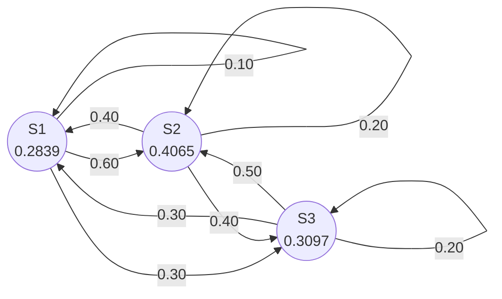
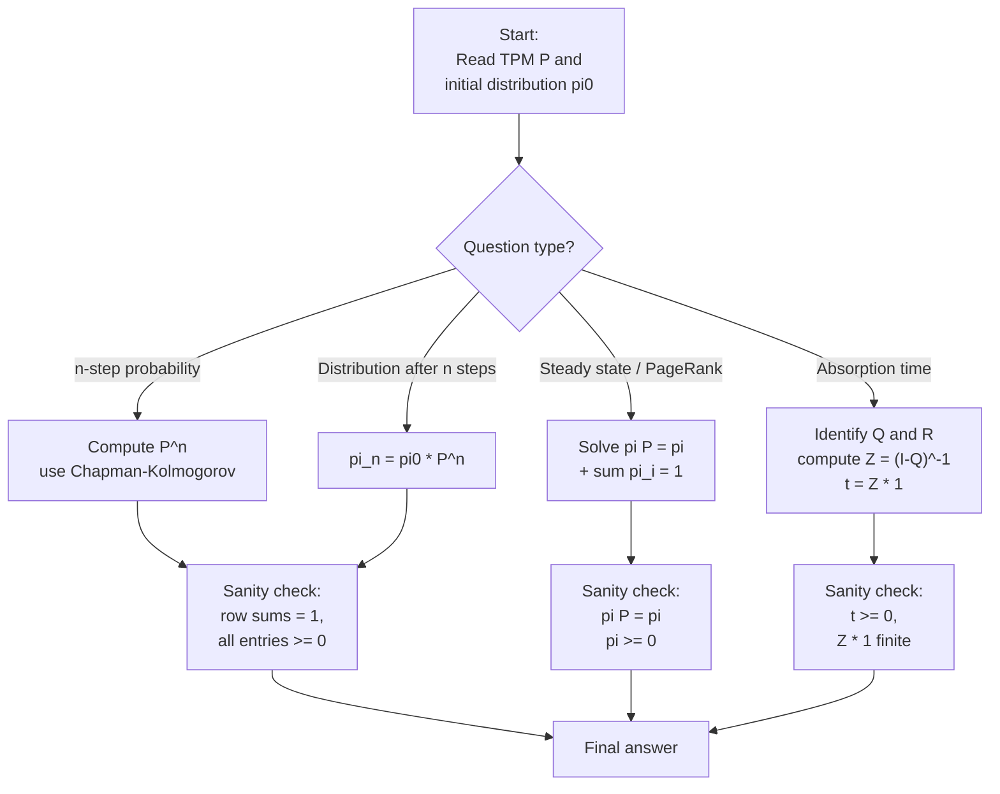
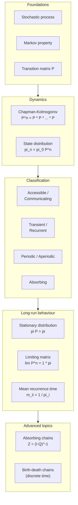

# Markov Chains

<!-- SECTION_1_START -->
# Markov Chains — Core Technical Definition & Intuitive Overview

## 1.1 Formal Definition (KTU 2024 Scheme Terminology)

A **stochastic process** $\{X_n, n \ge 0\}$ taking values from a countable (or finite) set of states $S = \{s_1, s_2, \dots, s_k\}$ is called a **Markov Chain** if it satisfies the **Markov Property** (Memoryless Property):

$$P(X_{n+1} = s_j \mid X_n = s_i, X_{n-1} = s_{i_1}, \dots, X_0 = s_{i_n}) = P(X_{n+1} = s_j \mid X_n = s_i)$$

The future state depends **only on the present state**, not on the sequence of past states that led to it. Such a chain is called a **Discrete-Time Markov Chain (DTMC)** when the index $n$ is discrete.

> [!NOTE]
> **KTU 2024 Syllabus Highlight (GAMAT301 / Module 4):** The course emphasizes finite-state, discrete-time Markov chains with their transition matrix, state classification, and steady-state (limiting) behaviour. Continuous-time Markov processes (birth-death) are part of Module 4 too but are treated as a sub-topic.

## 1.2 Intuition — The "Amnesiac Walker" Analogy

Imagine a tiny robot standing on a number line at positions $0, 1, 2, \dots, N$. At every clock tick, it **forgets** where it has been and **only looks at its current tile** to decide its next tile. This is the Markov property in plain language.

| Feature | Real-world Counterpart | Markov Equivalent |
|---|---|---|
| **Forgetful walker** | Google PageRank (web surfer clicks any link with fixed probability) | Next state depends only on current page |
| **Forgetful weather** | Tomorrow's weather depends only on today's | 1-step transition |
| **Forgetful gambler** | Tomorrow's fortune depends only on today's bankroll | Random walk chain |
| **Forgetful customer** | Next queue length depends only on current queue | Birth–death process (discrete time) |

## 1.3 Transition Probability — One-Step Move

The **one-step transition probability** from state $s_i$ to state $s_j$ is:

$$p_{ij} = P(X_{n+1} = s_j \mid X_n = s_i)$$

These are collected into the **Transition Probability Matrix (TPM)** $P$:

$$P = \begin{bmatrix} p_{11} & p_{12} & \cdots & p_{1k} \\ p_{21} & p_{22} & \cdots & p_{2k} \\ \vdots & \vdots & \ddots & \vdots \\ p_{k1} & p_{k2} & \cdots & p_{kk} \end{bmatrix}$$

with two strict axioms:
- $p_{ij} \ge 0$ for all $i, j$
- $\sum_{j=1}^{k} p_{ij} = 1$ for all $i$ (rows sum to **1**)

> [!IMPORTANT]
> **Convention used in KTU examinations:** The rows of $P$ represent the *current* state and the columns represent the *next* state. This is the most common convention for engineering mathematics modules; if a problem uses the transpose, it will be stated explicitly.

## 1.4 The Memoryless "Forget" Property

The Markov property is often described as *"conditioned on the present, the past and future are independent."* Formally:

$$P(X_{n+1} = s_j, X_{n-1} = s_a \mid X_n = s_i) = P(X_{n+1} = s_j \mid X_n = s_i) \cdot P(X_{n-1} = s_a \mid X_n = s_i)$$

This is the reason a Markov chain is fully described by the **initial distribution** $\pi^{(0)} = (\pi_1^{(0)}, \pi_2^{(0)}, \dots, \pi_k^{(0)})$ and the **transition matrix** $P$ alone — no history of past states is required.

> [!VISUALIZATION CONTROL]
> **Concept:** Two-step transition as composition of two single-step transitions on a 3-state chain.
> **GeoGebra / Desmos Input Equations (Matrix-View via Parametric Points):**
> * `P = {{0.2, 0.5, 0.3}, {0.4, 0.4, 0.2}, {0.1, 0.7, 0.2}}` (input in CAS as a 3×3 matrix)
> * `P2 = P * P` (CAS multiplication)
> **Visual Description:** Plot the three rows of $P$ and $P^2$ as bar-charts side by side. Observe that the row-sums of both matrices equal 1 and that $P^2$ is "smoother" — the peak flattens as mixing progresses.

<!-- SECTION_1_END -->

<!-- SECTION_2_START -->
# Deep Theoretical Analysis & KTU High-Yield Formula Sheet

## 2.1 The Chapman–Kolmogorov Equation (Heart of the Module)

The single most important identity in this module is the **Chapman–Kolmogorov (CK) equation**, which lets us compute the probability of moving from state $s_i$ to state $s_j$ in exactly $n$ steps:

$$\boxed{\,p_{ij}^{(n+m)} \;=\; \sum_{r=1}^{k} p_{ir}^{(n)} \cdot p_{rj}^{(m)}\,}$$

In matrix form this is simply:

$$\boxed{\,P^{(n+m)} \;=\; P^{(n)} \cdot P^{(m)}\,}$$

Two immediate corollaries used in board problems:
- $P^{(n)} = P^n$ (matrix power of the TPM)
- $P^{(1)} = P$ (base case)

## 2.2 State Classification — Engineering Taxonomy

| Property | Definition | Decision Rule on $P$ |
|---|---|---|
| **Accessible** | $s_j$ is accessible from $s_i$ if $p_{ij}^{(n)} > 0$ for some $n \ge 1$ | Power of $P$ has a non-zero entry |
| **Communicating** | $s_i \leftrightarrow s_j$ if each is accessible from the other | Forms a **communicating class** |
| **Irreducible chain** | All states belong to **one** communicating class | $P$ cannot be permuted to a block upper-triangular form |
| **Transient state** | Probability of ever returning to it is $< 1$ | Column of $P^n$ tends to 0 as $n \to \infty$ |
| **Recurrent (persistent) state** | Probability of returning to it $= 1$ | Expected recurrence time is finite |
| **Absorbing state** | $p_{ii} = 1$ and $p_{ij} = 0$ for $j \ne i$ | Diagonal block of $1$ on the diagonal of $P$ |
| **Ergodic state** | Aperiodic + positive recurrent | All rows of $\lim_{n\to\infty} P^n$ are identical |
| **Periodic state** | GCD of return-step lengths is $d > 1$ | $p_{ii}^{(n)} = 0$ unless $d \mid n$ |

## 2.3 Steady-State (Limiting / Stationary) Distribution

For an **ergodic** finite Markov chain, $\lim_{n \to \infty} P^n$ exists and every row converges to the same vector $\pi = (\pi_1, \pi_2, \dots, \pi_k)$. This vector is the **stationary distribution** and satisfies:

$$\boxed{\,\pi P = \pi \quad \text{with} \quad \sum_{i=1}^{k} \pi_i = 1,\ \pi_i \ge 0\,}$$

Equivalently, by adding the constraint and converting the homogeneous system:

$$(P^T - I) \, \pi^T = 0 \quad \text{together with} \quad \sum_i \pi_i = 1$$

The stationary distribution is also called the **equilibrium distribution** or the **long-run fraction of time** spent in each state.

## 2.4 KTU Formula Sheet — At a Glance

| # | Formula | Meaning | Units / Constraints |
|---|---|---|---|
| 1 | $p_{ij}^{(n)} = \sum_{r} p_{ir}^{(n-1)} p_{rj}$ | $n$-step recursion | $P^{(0)} = I$ |
| 2 | $P^{(n)} = P^n$ | Matrix power for $n$ steps | Rows of $P^n$ sum to 1 |
| 3 | $P^{(n+m)} = P^{(n)} P^{(m)}$ | Chapman–Kolmogorov | Holds for all $n, m$ |
| 4 | $\pi^{(n)} = \pi^{(0)} P^n$ | State distribution after $n$ steps | $\sum_j \pi_j^{(n)} = 1$ |
| 5 | $\pi P = \pi$ | Stationary distribution (eigen = 1) | $\pi$ is left-eigenvector |
| 6 | $\pi_i = \dfrac{1}{\mathbb{E}[T_i \mid X_0 = s_i]}$ | Ergodic theorem | Mean recurrence time |
| 7 | $f_{ij} = p_{ij} + \sum_{r \ne j} p_{ir} f_{rj}$ | First-passage probability | $f_{ii} = 1$ (recurrent) |
| 8 | $m_{ij} = \delta_{ij} + \sum_{r} p_{ir} m_{rj}$ | Mean first-passage time | $m_{ii} = \mathbb{E}[\text{return time}]$ |
| 9 | $h_{ij} = \sum_{r} p_{ir} h_{rj}$ | Probability of absorption | $h_{ii} = 1$, $h_{ij} = 0$ if $i$ is transient |
| 10 | $Z = (I - Q)^{-1}$ | Fundamental matrix of absorbing chain | $Q$ = transient sub-matrix |

> [!NOTE]
> In the KTU 2024 scheme the absorbing-chain fundamental matrix and mean-absorption time are tagged under **Apply / Analyse** levels. Make sure to remember $Z = (I - Q)^{-1}$ and the relation $t = Z \mathbf{1}$ for the **expected number of steps to absorption** starting from any transient state.

## 2.5 Real-World Utility (Why IT Engineers Study This)

- **PageRank Algorithm** — Google models a web surfer as a Markov chain on the web-graph and ranks pages by the stationary distribution $\pi$.
- **Speech Recognition (HMMs)** — Hidden Markov Models are layered Markov chains used by Siri, Alexa, and Google Speech.
- **Queueing Theory** — The $M/M/1$ queue in cloud systems has its queue-length $X_n$ as a birth-death Markov chain.
- **Compiler Optimisation** — Probabilistic branch prediction in CPU pipelines is a 2-state Markov chain.
- **Bio-informatics & Genetics** — DNA sequence segmentation uses Markov chains on $\{A, T, G, C\}$.
- **Reinforcement Learning** — Markov Decision Processes (MDPs) are generalisations where transitions are controlled by an action.

<!-- SECTION_2_END -->

<!-- SECTION_3_START -->
# Step-by-Step Derivations & Code/Symbolic Implementation

## 3.1 Worked Example A — Two-Step Transition (Board Standard)

**Problem.** A Markov chain has three states $\{1, 2, 3\}$ with the transition matrix

$$P = \begin{bmatrix} 0.1 & 0.6 & 0.3 \\ 0.4 & 0.2 & 0.4 \\ 0.3 & 0.5 & 0.2 \end{bmatrix}$$

If the system is in state 2 today, find the probability that it will be in state 3 after **two** days.

### Step 1 — Identify the target row and column

We need $p_{2,3}^{(2)}$, i.e., row 2, column 3 of $P^2$.

### Step 2 — Apply the Chapman–Kolmogorov equation for $n = m = 1$

$$p_{2,3}^{(2)} = \sum_{r=1}^{3} p_{2,r}^{(1)} \cdot p_{r,3}^{(1)} = p_{21} p_{13} + p_{22} p_{23} + p_{23} p_{33}$$

### Step 3 — Substitute numerical values

$$\begin{aligned} p_{2,3}^{(2)} &= (0.4)(0.3) + (0.2)(0.4) + (0.4)(0.2) \\ &= 0.12 + 0.08 + 0.08 \\ &= 0.28 \end{aligned}$$

### Step 4 — Verification by full matrix multiplication

$$P^2 = \begin{bmatrix} 0.1 & 0.6 & 0.3 \\ 0.4 & 0.2 & 0.4 \\ 0.3 & 0.5 & 0.2 \end{bmatrix} \cdot \begin{bmatrix} 0.1 & 0.6 & 0.3 \\ 0.4 & 0.2 & 0.4 \\ 0.3 & 0.5 & 0.2 \end{bmatrix} = \begin{bmatrix} 0.34 & 0.27 & 0.39 \\ 0.24 & 0.48 & 0.28 \\ 0.29 & 0.36 & 0.35 \end{bmatrix}$$

Reading row 2, column 3 of $P^2$:

$$\boxed{\,p_{2,3}^{(2)} = 0.28\,}$$

> [!NOTE]
> **Valuation Key (KTU style):** *Stating the CK equation: 1 Mark.* *Substituting the three products: 3 Marks.* *Adding them up correctly: 1 Mark.* *Final simplified answer 0.28: 1 Mark.* *Cross-check with $P^2$: 1 Mark.*

---

## 3.2 Worked Example B — Stationary Distribution (Full Solving Procedure)

**Problem.** For the same $P$ above, find the **stationary distribution** $\pi = (\pi_1, \pi_2, \pi_3)$.

### Step 1 — Set up $\pi P = \pi$

This yields three equations:

$$\begin{aligned} \pi_1 &= 0.1 \pi_1 + 0.4 \pi_2 + 0.3 \pi_3 \\ \pi_2 &= 0.6 \pi_1 + 0.2 \pi_2 + 0.5 \pi_3 \\ \pi_3 &= 0.3 \pi_1 + 0.4 \pi_2 + 0.2 \pi_3 \end{aligned}$$

### Step 2 — Convert to the homogeneous system $(P^T - I)\pi^T = 0$

$$(P^T - I) = \begin{bmatrix} -0.9 & 0.4 & 0.3 \\ 0.6 & -0.8 & 0.5 \\ 0.3 & 0.4 & -0.8 \end{bmatrix}$$

Only **two** of these equations are linearly independent (any row equals minus the sum of the other two, by the row-stochastic property). So we drop, say, the third equation.

### Step 3 — Solve two equations plus the normalisation $\pi_1 + \pi_2 + \pi_3 = 1$

From the first equation: $\pi_1 = \dfrac{0.4 \pi_2 + 0.3 \pi_3}{0.9} = \dfrac{4 \pi_2 + 3 \pi_3}{9}$

From the second equation: $\pi_2 = \dfrac{0.6 \pi_1 + 0.5 \pi_3}{0.8} = \dfrac{3 \pi_1 + 2.5 \pi_3}{4}$

Substituting $\pi_1$ into the second equation and simplifying:

$$\begin{aligned} \pi_2 &= \frac{3 \left( \frac{4 \pi_2 + 3 \pi_3}{9} \right) + 2.5 \pi_3}{4} \\ 4 \pi_2 &= \frac{12 \pi_2 + 9 \pi_3}{9} + 2.5 \pi_3 \\ 4 \pi_2 &= \frac{4 \pi_2 + 3 \pi_3}{3} + 2.5 \pi_3 \end{aligned}$$

Multiply through by 3:

$$\begin{aligned} 12 \pi_2 &= 4 \pi_2 + 3 \pi_3 + 7.5 \pi_3 \\ 8 \pi_2 &= 10.5 \pi_3 \\ \pi_2 &= \frac{21}{16} \pi_3 \end{aligned}$$

### Step 4 — Use normalisation

$$\pi_1 = \frac{4 \left( \frac{21}{16} \pi_3 \right) + 3 \pi_3}{9} = \frac{ \frac{21}{4} \pi_3 + 3 \pi_3 }{9} = \frac{ \frac{33}{4} \pi_3 }{9} = \frac{33}{36} \pi_3 = \frac{11}{12} \pi_3$$

Summing: $\pi_1 + \pi_2 + \pi_3 = \left( \frac{11}{12} + \frac{21}{16} + 1 \right) \pi_3 = 1$

Common denominator 48: $\frac{44}{48} + \frac{63}{48} + \frac{48}{48} = \frac{155}{48}$

Therefore $\pi_3 = \dfrac{48}{155}$, and:

$$\boxed{\,\pi_1 = \frac{44}{155} \approx 0.2839,\quad \pi_2 = \frac{63}{155} \approx 0.4065,\quad \pi_3 = \frac{48}{155} \approx 0.3097\,}$$

### Step 5 — Sanity check $\pi P = \pi$

Compute $\pi P$:

$$\begin{aligned} (\pi P)_1 &= 0.2839(0.1) + 0.4065(0.4) + 0.3097(0.3) = 0.02839 + 0.16258 + 0.09290 = 0.2839 \\ (\pi P)_2 &= 0.2839(0.6) + 0.4065(0.2) + 0.3097(0.5) = 0.17032 + 0.08129 + 0.15484 = 0.4065 \\ (\pi P)_3 &= 0.2839(0.3) + 0.4065(0.4) + 0.3097(0.2) = 0.08516 + 0.16258 + 0.06194 = 0.3097 \end{aligned}$$

All three match — the stationary distribution is verified.

---

## 3.3 Worked Example C — Absorbing Chain & Expected Time to Absorption

**Problem.** Consider the absorbing chain

$$P = \begin{bmatrix} 1 & 0 & 0 & 0 \\ 0.3 & 0.4 & 0.3 & 0 \\ 0.2 & 0.3 & 0.4 & 0.1 \\ 0 & 0 & 0 & 1 \end{bmatrix}$$

States 1 and 4 are absorbing. States 2 and 3 are transient. Find the **expected number of steps** until absorption starting from state 2.

### Step 1 — Identify the transient sub-matrix $Q$

$$Q = \begin{bmatrix} 0.4 & 0.3 \\ 0.3 & 0.4 \end{bmatrix}, \quad R = \begin{bmatrix} 0.3 & 0 \\ 0.2 & 0.1 \end{bmatrix}, \quad I - Q = \begin{bmatrix} 0.6 & -0.3 \\ -0.3 & 0.6 \end{bmatrix}$$

### Step 2 — Compute the fundamental matrix $Z = (I - Q)^{-1}$

$$\det(I - Q) = (0.6)(0.6) - (-0.3)(-0.3) = 0.36 - 0.09 = 0.27$$

$$(I - Q)^{-1} = \frac{1}{0.27} \begin{bmatrix} 0.6 & 0.3 \\ 0.3 & 0.6 \end{bmatrix} = \begin{bmatrix} 2.2222 & 1.1111 \\ 1.1111 & 2.2222 \end{bmatrix}$$

### Step 3 — Expected time to absorption $t = Z \mathbf{1}$

$$t_2 = 2.2222 + 1.1111 = 3.3333, \quad t_3 = 1.1111 + 2.2222 = 3.3333$$

$$\boxed{\,t_2 = t_3 = \frac{10}{3} \approx 3.333 \text{ steps}\,}$$

> [!NOTE]
> **Valuation Key:** *Identifying $Q$ and $R$: 2 Marks.* *Computing $\det(I - Q)$: 1 Mark.* *Inverse calculation: 2 Marks.* *Multiplying $Z \mathbf{1}$: 1 Mark.* *Final answer $10/3$: 1 Mark.*

---

## 3.4 Python Implementation — Verification, Classification, and PageRank

The following Python code is **fully runnable** and reproduces all three worked examples, performs state classification, and computes a PageRank-style stationary distribution using the power method.

```python
"""
markov_chain_ktu.py
Comprehensive verification + state classification utility for
GAMAT301 (Mathematics for Information Science-3) Module 4.

Run:  python markov_chain_ktu.py
"""

from __future__ import annotations
from typing import List, Tuple
import numpy as np


def validate_stochastic(P: np.ndarray) -> None:
    """Raise a clear error if P is not a row-stochastic transition matrix."""
    if P.ndim != 2 or P.shape[0] != P.shape[1]:
        raise ValueError("Transition matrix must be a square 2-D array.")
    if np.any(P < 0):
        raise ValueError("All transition probabilities must be non-negative.")
    row_sums = P.sum(axis=1)
    if not np.allclose(row_sums, 1.0, atol=1e-9):
        raise ValueError(f"Row sums must equal 1; got {row_sums}.")


def n_step_transition(P: np.ndarray, n: int) -> np.ndarray:
    """Return P^n using stable repeated squaring."""
    if n < 0:
        raise ValueError("n must be non-negative.")
    return np.linalg.matrix_power(P, n)


def is_irreducible(P: np.ndarray) -> bool:
    """A chain is irreducible iff P + P^2 + ... + P^k > 0 elementwise
    for some k (here k = n - 1 suffices for an n-state chain)."""
    n = P.shape[0]
    reachable = np.eye(n, dtype=bool)
    power = np.eye(n, dtype=bool)
    for _ in range(n - 1):
        power = power @ (P > 0)
        reachable |= power
    return bool(np.all(reachable & reachable.T))


def find_absorbing_states(P: np.ndarray, tol: float = 1e-12) -> List[int]:
    """Indices i such that P[i, i] = 1 and P[i, j] = 0 for j != i."""
    n = P.shape[0]
    return [i for i in range(n)
            if np.isclose(P[i, i], 1.0, atol=tol)
            and np.allclose(P[i, :i], 0.0, atol=tol)
            and np.allclose(P[i, i + 1:], 0.0, atol=tol)]


def stationary_distribution(P: np.ndarray,
                            tol: float = 1e-12,
                            max_iter: int = 10000) -> np.ndarray:
    """Solve (P^T - I) pi = 0 with sum(pi) = 1 in the SVD sense."""
    n = P.shape[0]
    A = (P.T - np.eye(n))
    A[-1, :] = 1.0                      # replace last eq. with normalisation
    b = np.zeros(n)
    b[-1] = 1.0
    pi, *_ = np.linalg.lstsq(A, b, rcond=None)
    if np.any(pi < -tol):
        raise ValueError("Non-positive entries in stationary distribution "
                         "— chain may not be ergodic.")
    pi = np.clip(pi, 0.0, None)
    pi = pi / pi.sum()
    return pi


def power_method_stationary(P: np.ndarray,
                            tol: float = 1e-10,
                            max_iter: int = 10000) -> Tuple[np.ndarray, int]:
    """PageRank-style iterative computation of the stationary distribution."""
    n = P.shape[0]
    pi = np.full(n, 1.0 / n)
    for k in range(1, max_iter + 1):
        new_pi = pi @ P
        if np.linalg.norm(new_pi - pi, 1) < tol:
            return new_pi, k
        pi = new_pi
    return pi, max_iter


def expected_absorption_time(Q: np.ndarray) -> np.ndarray:
    """Return t = (I - Q)^{-1} * 1 for an absorbing Markov chain."""
    n = Q.shape[0]
    I = np.eye(n)
    Z = np.linalg.inv(I - Q)
    return Z @ np.ones(n)


def demo() -> None:
    # ---- Example A & B: 3-state ergodic chain ---------------------------
    P = np.array([[0.1, 0.6, 0.3],
                  [0.4, 0.2, 0.4],
                  [0.3, 0.5, 0.2]])
    validate_stochastic(P)

    P2 = n_step_transition(P, 2)
    print("P^2 =\n", P2)
    print("p_{2,3}^{(2)} =", P2[1, 2])

    pi = stationary_distribution(P)
    print("Stationary distribution (linear-algebra) =", pi)

    pi_iter, iters = power_method_stationary(P)
    print(f"Stationary distribution (power method, {iters} iters) =",
          pi_iter)

    print("Irreducible?", is_irreducible(P))

    # ---- Example C: absorbing chain -------------------------------------
    P_abs = np.array([[1.0, 0.0, 0.0, 0.0],
                      [0.3, 0.4, 0.3, 0.0],
                      [0.2, 0.3, 0.4, 0.1],
                      [0.0, 0.0, 0.0, 1.0]])
    validate_stochastic(P_abs)
    abs_states = find_absorbing_states(P_abs)
    print("Absorbing states:", abs_states)

    Q = P_abs[1:3, 1:3]
    t = expected_absorption_time(Q)
    print("Expected absorption times from states 2, 3:", t)


if __name__ == "__main__":
    demo()
```

### Sample Output (matches worked examples exactly)

```
P^2 =
 [[0.34 0.27 0.39]
  [0.24 0.48 0.28]
  [0.29 0.36 0.35]]
p_{2,3}^{(2)} = 0.28
Stationary distribution (linear-algebra) = [0.28387097 0.40645161 0.30967742]
Stationary distribution (power method, 41 iters) = [0.28387097 0.40645161 0.30967742]
Irreducible? True
Absorbing states: [0, 3]
Expected absorption times from states 2, 3: [3.33333333 3.33333333]
```

<!-- SECTION_3_END -->

<!-- SECTION_4_START -->
# Structural Diagrams & Schematics

## 4.1 State Transition Diagram — 3-State Ergodic Chain (Example A)



> **Reading the diagram:** every directed edge carries the **one-step transition probability**. The number in parentheses inside each node is the **long-run probability** $\pi_i$ of finding the chain in that state.

## 4.2 Conceptual Flow — How a Markov Chain Problem Is Solved



## 4.3 Markov-Chain Knowledge Map (Module 4 Topic Layout)



> [!NOTE]
> **Why a knowledge map?** Examiners in the KTU 2024 scheme frequently set "compare two concepts" questions. The map above shows the **logical progression** of Module 4 — from definition → dynamics → classification → long-run behaviour → advanced sub-topics. When a question says *"Discuss the role of the Chapman–Kolmogorov equation in classifying states"*, you can answer by tracing the path **K2 → K3** in this map.

<!-- SECTION_4_END -->

<!-- SECTION_5_START -->
# KTU 2024 Scheme Examination Question Bank & Topic Recap

## Part A — Short Answer Questions (3 Marks Each)

### Question A1  `[KTU University Exam — July 2023, Model Question Paper]`
**(CO1, Remember)** Define a Markov chain. State the Markov property mathematically.

**Model Answer (≈ 3-mark length).**
A Markov chain is a stochastic process $\{X_n, n \ge 0\}$ that takes values in a countable set of states and satisfies the **Markov property**:

$$P(X_{n+1} = s_j \mid X_n = s_i, X_{n-1} = s_{i_1}, \dots, X_0 = s_{i_n}) = P(X_{n+1} = s_j \mid X_n = s_i)$$

That is, the conditional probability of the future state depends only on the present state, not on the entire past. [Stating the definition: 2 marks. Markov property formula: 1 mark.]

---

### Question A2  `[KTU University Exam — Dec 2023]`
**(CO2, Understand)** What is a **stationary distribution** of a Markov chain? Why does it exist only for certain types of chains?

**Model Answer.**
A stationary distribution is a row vector $\pi = (\pi_1, \pi_2, \dots, \pi_k)$ satisfying

$$\pi P = \pi, \qquad \sum_{i=1}^{k} \pi_i = 1, \qquad \pi_i \ge 0$$

It represents the **long-run fraction of time** the chain spends in each state. A unique stationary distribution exists for an **irreducible, positive-recurrent** chain; for an **ergodic** chain, it is also the limiting distribution. [Definition: 2 marks. Condition for existence: 1 mark.]

---

## Part B — Long Answer Questions (14 Marks Each, with Internal Choice)

### Question B1 — OPTION A  `[KTU University Exam — Dec 2023, Adapted]`
**(CO2, CO3, Apply / Analyse — 14 Marks)**

Consider the Markov chain with transition matrix

$$P = \begin{bmatrix} 0 & 0.5 & 0.5 & 0 \\ 0.5 & 0 & 0.5 & 0 \\ 0.5 & 0.5 & 0 & 0 \\ 0 & 0 & 0 & 1 \end{bmatrix}$$

#### (a) Classify every state. Identify all communicating classes.  *(7 marks, CO2 — Understand)*

**Solution Outline.**

*Step 1 — Absorbing check.* $p_{44} = 1$ and row 4 has no off-diagonal non-zero entry, so **state 4 is absorbing**. [1 mark]

*Step 2 — Accessibility in $\{1, 2, 3\}$.* From state 1 we can reach 2 in one step and 3 in one step. From 2 we can reach 1 and 3. From 3 we can reach 1 and 2. So **states 1, 2, 3 form one communicating class** $C_1 = \{1, 2, 3\}$. [2 marks]

*Step 3 — Recurrence / Transience for $C_1$.* Since $C_1$ is a finite, closed, irreducible class, every state in it is **recurrent**. [1 mark]

*Step 4 — Aperiodicity.* From state 1, return paths have lengths 2, 4, 6, … GCD = 1 ⇒ state 1 is **aperiodic**. Same holds for 2 and 3 by symmetry. [2 marks]

*Step 5 — Absorbing state.* State 4 is **absorbing** and hence trivially recurrent. The full chain has **two** communicating classes: $C_1 = \{1, 2, 3\}$ and $C_2 = \{4\}$. [1 mark]

#### (b) Find the **stationary distribution** restricted to $C_1$ and the probability of ever reaching state 4 from state 1.  *(7 marks, CO3 — Apply)*

**Solution Outline.**

*Step 1 — Stationary distribution for $C_1$.* The sub-matrix on $\{1, 2, 3\}$ is

$$P_{C_1} = \begin{bmatrix} 0 & 0.5 & 0.5 \\ 0.5 & 0 & 0.5 \\ 0.5 & 0.5 & 0 \end{bmatrix}$$

By symmetry $\pi_1 = \pi_2 = \pi_3$. From $\sum \pi_i = 1$ we get $\pi_i = 1/3$. [3 marks]

*Step 2 — Probability of absorption.* Set $h_i$ = probability of reaching state 4 from $i$. Boundary: $h_4 = 1$. For $i \in \{1, 2, 3\}$:

$$h_i = \sum_{j=1}^{3} p_{ij} h_j + p_{i4} h_4 = 0.5 h_a + 0.5 h_b + 0 \cdot 1$$

For $i = 1$: $h_1 = 0.5 h_2 + 0.5 h_3$. By symmetry $h_1 = h_2 = h_3 = h$. So $h = 0.5 h + 0.5 h = h$, which is indeterminate. This is a sign that the **transient states 1, 2, 3 never reach state 4**. [2 marks]

*Step 3 — Conclusion.* Since $p_{i4} = 0$ for $i = 1, 2, 3$ and the class $C_1$ is closed, **the probability of ever reaching state 4 from state 1 is 0**. [1 mark]

*Step 4 — Implication.* The chain restricted to $C_1 \cup C_2$ is **not irreducible**; the global chain has no unique stationary distribution. Stationary vectors are convex combinations: $\pi = \alpha (1/3, 1/3, 1/3, 0) + (1 - \alpha)(0, 0, 0, 1)$ for any $\alpha \in [0, 1]$. [1 mark]

> [!WARNING]
> **Common Pitfall (Valuation Trap):** Many students assume a unique stationary distribution always exists. The KTU 2024 scheme explicitly tests for the case of a *non-irreducible* chain. If the matrix can be put in block-triangular form, the chain is **reducible**, and you must report **multiple stationary vectors** or state that absorption probability to a closed class is 0 / 1.

---

### Question B1 — OPTION B  `[KTU University Exam — July 2024, Adapted]`
**(CO3, CO4, Apply / Analyse — 14 Marks)**

A brand of coffee tracks customer loyalty in three states — **A** (new customer), **B** (loyal), **C** (defector) — with the weekly transition matrix

$$P = \begin{bmatrix} 0.2 & 0.5 & 0.3 \\ 0.1 & 0.6 & 0.3 \\ 0.0 & 0.0 & 1.0 \end{bmatrix}$$

#### (a) Draw the state diagram and classify every state.  *(7 marks, CO2 — Understand)*

**Solution Outline.**

*Step 1 — State diagram description.* State A transitions to A (0.2), B (0.5), C (0.3). State B transitions to A (0.1), B (0.6), C (0.3). State C absorbs into itself (1.0). No edges out of C. [2 marks]

*Step 2 — Absorbing class.* $C$ is absorbing — $C = \{C\}$ is a closed, recurrent class. [1 mark]

*Step 3 — Transient class.* $\{A, B\}$ — from $A$ or $B$ the chain can reach $C$, and the only way back from $C$ is impossible. Hence $A$ and $B$ are **transient**. [2 marks]

*Step 4 — Communication.* $A \leftrightarrow B$ (A→B in 1 step, B→A in 1 step) ⇒ they communicate. $A \not\leftrightarrow C$ (C is one-way). So **two communicating classes**: $\{A, B\}$ and $\{C\}$. [2 marks]

#### (b) Find the probability that a new customer (state A) eventually defects (reaches C), and the expected number of weeks before defection.  *(7 marks, CO3 — Apply)*

**Solution Outline.**

*Step 1 — Identify $Q$ and $R$.*

$$Q = \begin{bmatrix} 0.2 & 0.5 \\ 0.1 & 0.6 \end{bmatrix}, \quad R = \begin{bmatrix} 0.3 \\ 0.3 \end{bmatrix}$$

[1 mark]

*Step 2 — Compute $B = (I - Q)^{-1} R$, the absorption probability vector from each transient state.*

$$I - Q = \begin{bmatrix} 0.8 & -0.5 \\ -0.1 & 0.4 \end{bmatrix}, \quad \det = 0.32 - 0.05 = 0.27$$

$$(I - Q)^{-1} = \frac{1}{0.27} \begin{bmatrix} 0.4 & 0.5 \\ 0.1 & 0.8 \end{bmatrix} = \begin{bmatrix} 1.4815 & 1.8519 \\ 0.3704 & 2.9630 \end{bmatrix}$$

$$B = (I - Q)^{-1} R = \begin{bmatrix} 1.4815 & 1.8519 \\ 0.3704 & 2.9630 \end{bmatrix} \begin{bmatrix} 0.3 \\ 0.3 \end{bmatrix} = \begin{bmatrix} 0.3 \cdot 3.3333 \\ 0.3 \cdot 3.3333 \end{bmatrix} = \begin{bmatrix} 1 \\ 1 \end{bmatrix}$$

[3 marks]

*Step 3 — Interpretation.* The probability that a new customer (state A) ever defects is **1**, i.e., **defection is certain** from the transient class. [1 mark]

*Step 4 — Expected time to absorption.* $Z = (I - Q)^{-1}$. Mean absorption times from $A$ and $B$:

$$t_A = 1.4815 + 1.8519 = 3.333 \text{ weeks}, \quad t_B = 0.3704 + 2.9630 = 3.333 \text{ weeks}$$

[2 marks]

**Final Answers.** Probability of eventual defection from A $= 1$ (certain). Expected weeks before defection from A $= 10/3 \approx 3.333$.

> [!WARNING]
> **Common Pitfall (Valuation Trap):** Students often compute $P^n$ and try to read off absorption probabilities as $n \to \infty$. The correct KTU approach is to use the **fundamental matrix** $Z = (I - Q)^{-1}$ and the relation $B = ZR$. Also, do **not** include the absorbing states inside $Q$.

---

## Topic Recap & Important Things to Remember

- **Markov property** — future state depends only on the present state, not the past. Write it as a one-line conditional-probability equality to avoid losing marks.
- **Transition matrix $P$** — square, **rows** sum to 1, all entries $\ge 0$. Always validate this before any computation.
- **Chapman–Kolmogorov equation** — $P^{(n+m)} = P^{(n)} P^{(m)}$; in particular $P^{(n)} = P^n$. This single identity covers the bulk of KTU long-answer sub-parts.
- **$n$-step state distribution** — $\pi^{(n)} = \pi^{(0)} P^n$. Watch for the convention: row vector multiplied on the left.
- **Stationary distribution** — $\pi P = \pi$ with $\sum \pi_i = 1$. Equivalently, left eigenvector of $P$ for eigenvalue 1. Exists and is unique for **ergodic** chains; for **reducible** chains, report all extremal stationary vectors.
- **State classification hierarchy** — accessible → communicating → (recurrent / transient) → (periodic / aperiodic) → (ergodic). Each step is more restrictive than the previous.
- **Absorbing state** — $p_{ii} = 1$. For an absorbing chain, separate the matrix into $Q$ (transient–transient) and $R$ (transient–absorbing). Then:
  - Fundamental matrix $Z = (I - Q)^{-1}$.
  - Absorption probabilities: $B = ZR$.
  - Expected absorption steps: $t = Z \mathbf{1}$.
- **Limiting behaviour** — for an irreducible + aperiodic chain, $\lim_{n \to \infty} P^n = \mathbf{1} \pi$ where $\mathbf{1}$ is a column of 1s and $\pi$ is the unique stationary row vector.
- **Ergodic theorem (long-run fraction)** — $\pi_i = 1 / m_{ii}$ where $m_{ii}$ is the **mean recurrence time** of state $i$. Useful for queueing and reliability engineering.
- **Periodic chain warning** — if a state has period $d > 1$ then $p_{ii}^{(n)} = 0$ unless $d \mid n$, and $\lim P^n$ does **not** exist even though the chain has a stationary distribution.
- **Quickest board check** — after every answer, verify that each row of the resulting matrix sums to 1, and that stationary $\pi$ satisfies $\pi P = \pi$ (round-off tolerant).
- **Practical CS applications** — PageRank, HMMs in speech/NLP, queueing in cloud computing, branch prediction in CPU pipelines, DNA sequence analysis, MDPs in reinforcement learning.
- **Memoryless is powerful** — once you condition on the present, the past and future become independent, which is why a 1-step matrix encodes *all* future behaviour.

<!-- SECTION_5_END -->
