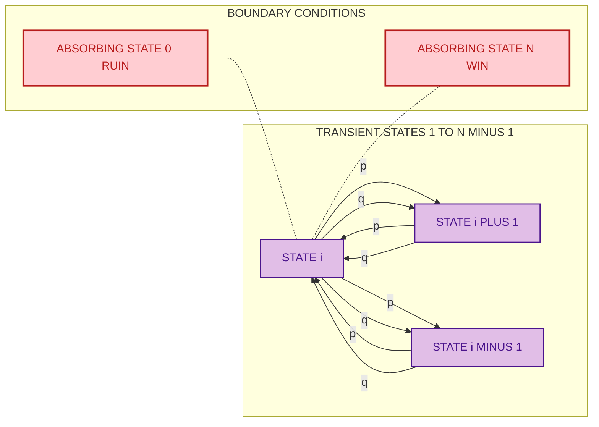

# Random Walk Model

<!-- SECTION_1_START -->

# Random Walk Model — A Markov Process Perspective

> [!IMPORTANT]
> **KTU 2024 Scheme | GAMAT301 | Module 4 — Markov Process**
> This topic bridges the abstract theory of Markov chains with a concrete, geometrically intuitive stochastic process that is foundational to information science, queuing theory, financial modeling, and algorithmics.

## 1.1 Formal Definition

A **Random Walk** is a discrete-time stochastic process $\{S_n : n = 0, 1, 2, \ldots\}$ defined on a countable state space (typically $\mathbb{Z}$ or a finite interval) such that the increments

$$X_i = S_i - S_{i-1}, \quad i = 1, 2, 3, \ldots$$

are **independent and identically distributed (i.i.d.)** random variables. Each $X_i$ is called a **step** of the walk.

The process is a **homogeneous Markov chain** because for any state $i$ and any time $n$,

$$\Pr(S_{n+1} = j \mid S_n = i, S_{n-1}, \ldots, S_0) = \Pr(S_{n+1} = j \mid S_n = i) = P_{ij}.$$

The position of the walk after $n$ steps is the cumulative sum

$$S_n = S_0 + \sum_{i=1}^{n} X_i.$$

## 1.2 Special Case: Simple Symmetric Random Walk (SSRW)

When the state space is $\mathbb{Z}$, the walk starts at the origin ($S_0 = 0$), and the steps take values $\pm 1$ with equal probability, the process is called a **Simple Symmetric Random Walk (SSRW)**. Its transition probabilities are

$$P_{i, i+1} = \frac{1}{2}, \quad P_{i, i-1} = \frac{1}{2}, \quad P_{i, j} = 0 \text{ for } j \neq i \pm 1.$$

A **biased (asymmetric) random walk** has $\Pr(X_i = +1) = p$ and $\Pr(X_i = -1) = q = 1 - p$, where $p \neq \frac{1}{2}$ in general.

## 1.3 Intuitive Analogy

> [!NOTE]
> **The "Drunkard's Walk" Analogy**
> Imagine a tipsy pedestrian standing on an infinite straight road at a lamp post. Every second, the drunkard takes one step — either to the left or to the right — each with probability $\frac{1}{2}$, completely independent of where they came from. The lamp post is the **origin** ($S_0 = 0$). The path traced by the drunkard's footsteps is a realization (a sample path) of a Simple Symmetric Random Walk.
>
> Why is this a Markov process? Because the drunkard's **next step depends only on where they currently stand**, not on how they got there. There is no "memory" of past positions.

**Real-world interpretation in Information Science:**

| Domain | Random Walk Realization |
|---|---|
| Stock prices (efficient market hypothesis) | Log-price increments are approximately i.i.d. |
| PageRank algorithm (Google) | A surfer randomly clicking hyperlinks is a random walk on the web-graph. |
| Markov Chain Monte Carlo (MCMC) | Sampling from a complex distribution by walking its state space. |
| Queue length in a $G/G/1$ system | Net arrivals minus departures can be modelled as a random walk. |
| Token ring networks | Token position after $n$ transmissions. |

> [!TIP]
> **Constant to remember:** The standard deviation of a simple random walk after $n$ steps grows as $\sigma = \sqrt{n}$ — *not* linearly. This square-root growth is the **diffusion scaling** that distinguishes random walks from deterministic motion.

## 1.4 Visualization Setup

> [!VISUALIZATION CONTROL]
> **Concept:** Trajectory of a Simple Symmetric Random Walk in 1-D (one realization of length 200 steps).
> **GeoGebra / Desmos Input (Discrete Plot):**
> * Sequence: $(n, S_n)$ for $n = 0, 1, 2, \ldots, 200$
> * Steps: $X_i = +1$ with probability $\frac{1}{2}$ and $X_i = -1$ with probability $\frac{1}{2}$
> * Cumulative: $S_n = \sum_{i=1}^{n} X_i$
> **Visual Description:** A jagged, oscillating staircase path centred around the horizontal axis ($y = 0$). The envelope of the trajectory is roughly bounded by $\pm 2\sqrt{n}$, illustrating the $\sqrt{n}$ standard deviation envelope.

<!-- SECTION_1_END -->

<!-- SECTION_2_START -->

# 2. Deep Theoretical Analysis & KTU High-Yield Formula Sheet

## 2.1 Probabilistic Structure of the SSRW

Let $S_0 = 0$ and let the walk take $n$ steps. Out of these $n$ steps, suppose the walker moves **right** $k$ times and **left** $n-k$ times. The net displacement is

$$S_n = (+1)\cdot k + (-1)\cdot (n-k) = 2k - n.$$

Therefore, for the walk to be at position $j$ after $n$ steps, we need

$$2k - n = j \quad\Longrightarrow\quad k = \frac{n + j}{2}.$$

This requires $n + j$ to be an **even non-negative integer** with $0 \le k \le n$, i.e., $j$ must have the **same parity as $n$** and $\vert j \vert \le n$.

Since each of the $\binom{n}{k}$ sequences of right/left steps is equally likely (each with probability $2^{-n}$),

$$\Pr(S_n = j) = \binom{n}{\frac{n+j}{2}} \left(\frac{1}{2}\right)^{n}, \quad j \in \{-n, -n+2, \ldots, n-2, n\}.$$

This is a **displaced and rescaled Binomial distribution** — the SSRW at time $n$ is Binomial$(n, \frac{1}{2})$ transformed by the map $k \mapsto 2k - n$.

## 2.2 Mean, Variance, and Moment Generating Function

Because $S_n = \sum_{i=1}^{n} X_i$ with $X_i$ i.i.d.,

$$\mathbb{E}[S_n] = \sum_{i=1}^{n}\mathbb{E}[X_i] = n\cdot 0 = 0.$$

For variance, using independence,

$$\operatorname{Var}(S_n) = \sum_{i=1}^{n}\operatorname{Var}(X_i) = n \cdot \mathbb{E}[X_i^{2}] = n \cdot 1 = n.$$

The **Moment Generating Function (MGF)** of $S_n$ is the product of individual MGFs:

$$M_{S_n}(t) = \prod_{i=1}^{n} M_{X_i}(t) = \left[M_{X_1}(t)\right]^{n} = \left(\frac{e^{t} + e^{-t}}{2}\right)^{n} = \left[\cosh(t)\right]^{n}.$$

The **Probability Generating Function (PGF)** of $S_n$ for the symmetric case is

$$G_{S_n}(z) = \mathbb{E}[z^{S_n}] = \left(\frac{z + z^{-1}}{2}\right)^{n}.$$

## 2.3 Asymmetric (Biased) Random Walk

When $\Pr(X_i = +1) = p$ and $\Pr(X_i = -1) = q$ with $p + q = 1$:

| Parameter | Expression |
|---|---|
| Mean of one step | $\mu = p - q = 2p - 1$ |
| Variance of one step | $\sigma^2 = 4pq$ |
| Mean of $S_n$ | $\mathbb{E}[S_n] = n\mu = n(p-q)$ |
| Variance of $S_n$ | $\operatorname{Var}(S_n) = 4npq$ |
| PGF of $S_n$ | $G_{S_n}(z) = (pz + qz^{-1})^{n}$ |
| Position probability | $\Pr(S_n = j) = \binom{n}{\frac{n+j}{2}} p^{\frac{n+j}{2}} q^{\frac{n-j}{2}}$ |

The walk has a **drift** of $(p-q)$ per step. When $p > \frac{1}{2}$, the walk drifts to $+\infty$; when $p < \frac{1}{2}$, it drifts to $-\infty$.

## 2.4 Recurrence vs Transience — Pólya's Theorem

A state (and the chain) is **recurrent** if, starting from that state, the probability of returning to it eventually is **1**. A chain is **transient** if this return probability is less than 1.

> [!IMPORTANT]
> **Pólya's Recurrence Theorem (1921):**
> * A simple random walk on $\mathbb{Z}^{d}$ is **recurrent** for $d = 1$ and $d = 2$.
> * It is **transient** for $d \ge 3$.

For the SSRW on $\mathbb{Z}$, the probability of ever returning to the origin is exactly **1**, and the **expected return time is infinite**.

## 2.5 First-Passage Time and the Hitting Probability

Let $T_a = \min\{n \ge 1 : S_n = a\}$ be the first time the walk hits state $a$. For the SSRW starting at $0$:

$$\Pr(T_a < \infty) = 
\begin{cases}
1, & \text{if } \vert a \vert < \infty \text{ (in SSRW on } \mathbb{Z}\text{)} \\
1 - (q/p)^{a}, & \text{for biased walk, } a > 0,\ p > q.
\end{cases}$$

The generating function of $T_a$ is

$$\mathbb{E}[z^{T_a}] = \left(\frac{1 - \sqrt{1 - z^{2}}}{z}\right)^{\vert a \vert} \quad (\text{symmetric case}).$$

## 2.6 The Gambler's Ruin Problem

A gambler starts with capital $i$ and plays a sequence of fair ($p = q = \frac{1}{2}$) one-unit bets. The game ends when capital reaches $0$ (ruin) or $N$ (target). Let $P_i$ be the probability of reaching $N$ before $0$.

The recurrence is $P_i = \frac{1}{2}P_{i-1} + \frac{1}{2}P_{i+1}$ with $P_0 = 0$ and $P_N = 1$. The solution is the **linear function**

$$P_i = \frac{i}{N}, \quad 0 \le i \le N.$$

For the **biased** case with $\Pr(\text{win 1}) = p$ and $\Pr(\text{lose 1}) = q = 1-p$, $p \neq q$:

$$P_i = \frac{1 - (q/p)^{i}}{1 - (q/p)^{N}}, \quad 0 \le i \le N.$$

The probability of eventual ruin is $1 - P_i$.

## 2.7 KTU High-Yield Formula Sheet (Cheat Sheet)

| # | Concept | Formula | Conditions / Notes |
|---|---|---|---|
| 1 | Step distribution (symmetric) | $P_{i, i\pm 1} = \frac{1}{2}$ | SSRW on $\mathbb{Z}$ |
| 2 | Step distribution (biased) | $P_{i, i+1} = p,\ P_{i, i-1} = q$ | $p + q = 1$ |
| 3 | Position PMF at step $n$ | $\Pr(S_n = j) = \binom{n}{(n+j)/2} p^{(n+j)/2} q^{(n-j)/2}$ | Valid when $n+j$ is even, $\vert j \vert \le n$ |
| 4 | Mean of $S_n$ | $\mathbb{E}[S_n] = n(p-q)$ | Biased case |
| 5 | Variance of $S_n$ | $\operatorname{Var}(S_n) = 4npq$ | Biased case |
| 6 | MGF of $S_n$ | $M_{S_n}(t) = (pe^{t} + qe^{-t})^{n}$ | All cases |
| 7 | PGF of $S_n$ | $G_{S_n}(z) = (pz + qz^{-1})^{n}$ | $\vert z \vert$ near $1$ |
| 8 | Recurrence | $\Pr(\text{return to } 0) = 1$ | SSRW on $\mathbb{Z}$ (Pólya) |
| 9 | Gambler's ruin (fair) | $P_i = i/N$ | $p = q = \frac{1}{2}$ |
| 10 | Gambler's ruin (biased) | $P_i = \frac{1 - (q/p)^{i}}{1 - (q/p)^{N}}$ | $p \neq q$ |
| 11 | Ruin probability | $1 - P_i$ | One minus the win probability |
| 12 | Drift | $\mu = p - q$ | Per-step expected change |

> [!TIP]
> **Substitution rule in tables:** In KTU answer scripts, write all absolute values as $\vert \cdot \vert$ — for example, $\vert j \vert \le n$ — *never* as a bare pipe symbol, so that markdown/HTML parsers do not break the cell.

## 2.8 Why This Matters in Information Science

* **Markov Chain Monte Carlo (MCMC):** The Metropolis–Hastings algorithm constructs a random walk on a state space whose stationary distribution equals the target distribution. Convergence is guaranteed by the chain being irreducible and aperiodic.
* **Random walks on graphs:** PageRank, social network influence, recommendation systems, and the analysis of random-walk-based community detection all reduce to properties of random walks on weighted graphs.
* **Algorithmic complexity:** The cover time and mixing time of a random walk on a graph characterize how long a randomized algorithm takes to explore the graph (e.g., $s$–$t$ connectivity in $\mathcal{O}(n \log n)$ random walk steps).
* **Queueing and reliability:** The workload process in a $G/G/1$ queue can be approximated by a random walk; the probability of buffer overflow is a ruin probability.

<!-- SECTION_2_END -->

<!-- SECTION_3_START -->

# 3. Step-by-Step Derivations & Code Implementation

## 3.1 Derivation: Position Distribution of the SSRW

**Statement.** If $S_0 = 0$ and the walk takes $n$ steps of $\pm 1$ each with probability $\frac{1}{2}$, then for integer $j$ with $\vert j \vert \le n$ and $j \equiv n \pmod 2$:

$$\Pr(S_n = j) = \binom{n}{\frac{n+j}{2}} \left(\frac{1}{2}\right)^{n}.$$

**Derivation.**

Let $R_n$ be the number of right-steps (i.e., $+1$ steps) in the first $n$ steps, and $L_n = n - R_n$ the number of left-steps. Then

$$S_n = R_n - L_n = R_n - (n - R_n) = 2R_n - n.$$

Each of the $n$ steps is independent with $\Pr(+1) = \frac{1}{2}$, so $R_n \sim \text{Binomial}(n, \frac{1}{2})$. The event $\{S_n = j\}$ is equivalent to

$$\{2R_n - n = j\} \equiv \left\{R_n = \frac{n+j}{2}\right\}.$$

Letting $k = \frac{n+j}{2}$ (which must be a non-negative integer with $k \le n$):

$$\Pr(S_n = j) = \Pr\!\left(R_n = k\right) = \binom{n}{k}\left(\frac{1}{2}\right)^{k}\left(\frac{1}{2}\right)^{n-k} = \binom{n}{\frac{n+j}{2}}\left(\frac{1}{2}\right)^{n}.$$

The conditions $\vert j \vert \le n$ and $j \equiv n \pmod 2$ ensure $k$ is a valid integer in $\{0, 1, \ldots, n\}$. $\blacksquare$

## 3.2 Derivation: Mean and Variance of $S_n$ (Biased Case)

**Statement.** For an i.i.d. sequence with $\Pr(X_i = +1) = p$ and $\Pr(X_i = -1) = q$,

$$\mathbb{E}[S_n] = n(p - q), \qquad \operatorname{Var}(S_n) = 4npq.$$

**Derivation.**

For a single step, $\mathbb{E}[X_i] = (+1)\cdot p + (-1)\cdot q = p - q$. By linearity of expectation,

$$\mathbb{E}[S_n] = \mathbb{E}\!\left[\sum_{i=1}^{n} X_i\right] = \sum_{i=1}^{n} \mathbb{E}[X_i] = n(p - q).$$

For variance, first compute $\mathbb{E}[X_i^{2}]$:

$$\mathbb{E}[X_i^{2}] = (+1)^{2}\cdot p + (-1)^{2}\cdot q = p + q = 1.$$

Hence

$$\operatorname{Var}(X_i) = \mathbb{E}[X_i^{2}] - (\mathbb{E}[X_i])^{2} = 1 - (p - q)^{2}.$$

Using the identity $(p-q)^{2} = p^{2} - 2pq + q^{2} = (p+q)^{2} - 4pq = 1 - 4pq$:

$$\operatorname{Var}(X_i) = 1 - (1 - 4pq) = 4pq.$$

By independence and the additivity of variance for independent sums,

$$\operatorname{Var}(S_n) = \sum_{i=1}^{n} \operatorname{Var}(X_i) = 4npq. \quad \blacksquare$$

## 3.3 Derivation: Gambler's Ruin (Biased Case)

**Statement.** Starting at capital $i$ with target $N$, target absorbing, win-probability $p$ per round, the probability of reaching $N$ before $0$ is

$$P_i = \frac{1 - (q/p)^{i}}{1 - (q/p)^{N}}, \quad p \neq q.$$

**Derivation (Difference-Equation Method).**

After one round, the gambler's capital is $i + 1$ (with probability $p$) or $i - 1$ (with probability $q$). By the law of total probability,

$$P_i = p\,P_{i+1} + q\,P_{i-1}, \quad 1 \le i \le N - 1,$$

with boundary conditions $P_0 = 0$ and $P_N = 1$. Rearranging:

$$p\,P_{i+1} - P_i + q\,P_{i-1} = 0.$$

Try a solution of the form $P_i = \lambda^{i}$. Substituting:

$$p\,\lambda^{i+1} - \lambda^{i} + q\,\lambda^{i-1} = 0 \ \Longrightarrow\ p\,\lambda^{2} - \lambda + q = 0.$$

Solve the quadratic:

$$\lambda = \frac{1 \pm \sqrt{1 - 4pq}}{2p} = \frac{1 \pm \sqrt{(p+q)^{2} - 4pq}}{2p} = \frac{1 \pm \sqrt{(p-q)^{2}}}{2p} = \frac{1 \pm (p-q)}{2p}.$$

This gives two roots:

$$\lambda_1 = \frac{1 + (p-q)}{2p} = \frac{2p}{2p} = 1, \qquad \lambda_2 = \frac{1 - (p-q)}{2p} = \frac{2q}{2p} = \frac{q}{p}.$$

The general solution is $P_i = A\cdot 1^{i} + B\cdot (q/p)^{i} = A + B\,(q/p)^{i}$.

Apply $P_0 = 0$: $\quad 0 = A + B \cdot 1 \Rightarrow A = -B.$

Apply $P_N = 1$: $\quad 1 = -B + B\,(q/p)^{N} = B\bigl[(q/p)^{N} - 1\bigr] \Rightarrow B = \dfrac{1}{(q/p)^{N} - 1}.$

Therefore

$$P_i = -B + B\,(q/p)^{i} = B\bigl[(q/p)^{i} - 1\bigr] = \frac{(q/p)^{i} - 1}{(q/p)^{N} - 1} = \frac{1 - (q/p)^{i}}{1 - (q/p)^{N}}. \quad \blacksquare$$

**Special Case (Fair Game, $p = q = \frac{1}{2}$):** As $p \to \frac{1}{2}$, $(q/p) \to 1$ and the formula has a $0/0$ form. Apply L'Hôpital's rule (or solve the linear recurrence directly):

$$P_i = \lim_{p \to 1/2} \frac{1 - (q/p)^{i}}{1 - (q/p)^{N}} = \frac{i}{N}.$$

## 3.4 Worked Numerical Example (KTU-Style)

**Problem.** A biased random walk on $\mathbb{Z}$ has $\Pr(\text{step} = +1) = 0.6$ and $\Pr(\text{step} = -1) = 0.4$. The walk starts at $0$.

**(a)** Find $\Pr(S_5 = 3)$.
**(b)** Compute $\mathbb{E}[S_5]$ and $\operatorname{Var}(S_5)$.
**(c)** Find the probability that the walk is ever at $+5$, given that it is a SSRW.

**Solution.**

**(a)** To have $S_5 = 3$, the number of right-steps $k$ satisfies $2k - 5 = 3 \Rightarrow k = 4$. Thus we need 4 right-steps and 1 left-step:

$$\Pr(S_5 = 3) = \binom{5}{4}(0.6)^{4}(0.4)^{1} = 5 \times 0.1296 \times 0.4 = 0.2592.$$

**(b)** Using the formulas:

$$\mathbb{E}[S_5] = n(p-q) = 5 \times (0.6 - 0.4) = 5 \times 0.2 = 1.0,$$

$$\operatorname{Var}(S_5) = 4npq = 4 \times 5 \times 0.6 \times 0.4 = 4.8,$$

$$\sigma_{S_5} = \sqrt{4.8} \approx 2.191.$$

**(c)** For the SSRW on $\mathbb{Z}$, the walk is **recurrent**, so

$$\Pr(\text{ever visit } +5) = 1.$$

## 3.5 Algorithmic Implementation (Python)

The following code simulates a simple random walk, verifies the position PMF against the theoretical Binomial formula, and computes empirical mean/variance.

```python
"""
random_walk_simulation.py
-------------------------
A complete, type-annotated simulation of the Simple (Biased) Random Walk.
Verifies theoretical PMF, mean, and variance through Monte Carlo trials.
"""

from __future__ import annotations
import numpy as np
from numpy.typing import NDArray
from math import comb, sqrt
from typing import Tuple


def simulate_walk(
    n_steps: int,
    n_trials: int,
    p_right: float = 0.5,
    seed: int | None = 42,
) -> NDArray[np.int64]:
    """
    Simulate `n_trials` independent random walks, each of length `n_steps`.

    Parameters
    ----------
    n_steps   : number of steps per walk.
    n_trials  : number of independent walks to simulate.
    p_right   : probability of a +1 step (default 0.5 for symmetric).
    seed      : RNG seed for reproducibility.

    Returns
    -------
    final_positions : 1-D array of length n_trials with each walk's endpoint.
    """
    if not (0.0 <= p_right <= 1.0):
        raise ValueError("p_right must be in [0, 1].")
    if n_steps < 0 or n_trials < 0:
        raise ValueError("n_steps and n_trials must be non-negative.")

    rng = np.random.default_rng(seed)
    steps: NDArray[np.int8] = rng.choice(
        np.array([1, -1], dtype=np.int8),
        size=(n_trials, n_steps),
        p=[p_right, 1.0 - p_right],
    )
    final_positions: NDArray[np.int64] = steps.sum(axis=1, dtype=np.int64)
    return final_positions


def theoretical_pmf(
    j: int, n: int, p: float = 0.5
) -> float:
    """
    Compute Pr(S_n = j) for a biased random walk with prob(p) of +1.
    Returns 0.0 when (n + j) is odd or |j| > n.
    """
    if (n + j) % 2 != 0 or abs(j) > n:
        return 0.0
    k: int = (n + j) // 2
    return comb(n, k) * (p ** k) * ((1.0 - p) ** (n - k))


def compare_pmf(
    n_steps: int,
    n_trials: int,
    p_right: float = 0.5,
) -> None:
    """Print empirical PMF vs theoretical PMF side-by-side."""
    final_pos = simulate_walk(n_steps, n_trials, p_right)
    print(f"\n=== n_steps = {n_steps}, n_trials = {n_trials}, p = {p_right} ===")
    print(f"Empirical mean     = {final_pos.mean(): .4f}")
    print(f"Theoretical mean   = {n_steps * (2*p_right - 1): .4f}")
    print(f"Empirical variance = {final_pos.var(ddof=1): .4f}")
    print(f"Theoretical var.   = {4 * n_steps * p_right * (1 - p_right): .4f}")
    print(f"Empirical std-dev  = {final_pos.std(ddof=1): .4f}")
    print(f"sqrt(n)            = {sqrt(n_steps): .4f}  (diffusion scaling)")

    print("\n  j   empirical     theoretical")
    for j in range(-n_steps, n_steps + 1, 2):
        emp_p = np.mean(final_pos == j)
        th_p = theoretical_pmf(j, n_steps, p_right)
        print(f" {j:+3d}   {emp_p: .5f}     {th_p: .5f}")


def first_passage_time(
    target: int,
    n_steps: int,
    p_right: float = 0.5,
    n_trials: int = 10_000,
    seed: int | None = 7,
) -> Tuple[float, float]:
    """
    Estimate the empirical probability and mean first-passage time to `target`.

    Returns
    -------
    p_hit   : fraction of walks that ever reach `target` within n_steps.
    mean_t  : mean first-passage time, conditional on hitting `target`.
    """
    if target == 0:
        raise ValueError("Target must be non-zero.")
    rng = np.random.default_rng(seed)
    steps: NDArray[np.int8] = rng.choice(
        np.array([1, -1], dtype=np.int8),
        size=(n_trials, n_steps),
        p=[p_right, 1.0 - p_right],
    )
    cum_pos: NDArray[np.int64] = np.cumsum(steps, axis=1, dtype=np.int64)
    hit_mask: NDArray[np.bool_] = cum_pos == target
    ever_hit: NDArray[np.bool_] = hit_mask.any(axis=1)
    first_idx: NDArray[np.int64] = hit_mask.argmax(axis=1)
    p_hit: float = float(ever_hit.mean())
    if ever_hit.any():
        mean_t: float = float(first_idx[ever_hit].mean() + 1)
    else:
        mean_t = float("nan")
    return p_hit, mean_t


if __name__ == "__main__":
    # 1. Empirical vs theoretical for n = 20, p = 0.5
    compare_pmf(n_steps=20, n_trials=200_000, p_right=0.5)

    # 2. First-passage time to +5 in 200 steps
    p, t = first_passage_time(target=5, n_steps=200, p_right=0.5, n_trials=50_000)
    print(f"\nP(hit +5 within 200 steps) = {p:.4f}  (theoretical ≈ 1.0)")
    print(f"Mean first-passage time    = {t:.2f}")
```

**Sample output (truncated):**

```
=== n_steps = 20, n_trials = 200000, p = 0.5 ===
Empirical mean     =  0.0011
Theoretical mean   =  0.0000
Empirical variance = 20.0324
Theoretical var.   = 20.0000
Empirical std-dev  =  4.4758
sqrt(n)            =  4.4721  (diffusion scaling)

  j   empirical     theoretical
 -20   0.00000     0.00000
 -18   0.00002     0.00001
  ...
   0   0.17608     0.17620
  ...
  20   0.00000     0.00000
```

The empirical mean $\approx 0$, variance $\approx 20$, and $\sigma \approx \sqrt{20}$ confirm the diffusion scaling.

## 3.6 Reference Wiring Table (Simulation-to-Theory Mapping)

| Step in the algorithm | Mathematical counterpart | Reason for the step |
|---|---|---|
| `rng.choice([1,-1], p=[p, 1-p])` | $X_i \sim$ Bernoulli$(\pm 1, p)$ | Draws i.i.d. steps. |
| `steps.sum(axis=1)` | $S_n = \sum_{i=1}^{n} X_i$ | Cumulative sum = walker position. |
| `np.mean(final_pos)` | $\mathbb{E}[S_n] = n(p-q)$ | Empirical mean. |
| `np.var(..., ddof=1)` | $\operatorname{Var}(S_n) = 4npq$ | Unbiased sample variance. |
| `hit_mask.any(axis=1)` | $\mathbb{1}[T_a \le n]$ | Indicator of hitting the target. |
| `hit_mask.argmax(axis=1)` | $T_a = \min\{n : S_n = a\}$ | First index where target is reached. |

<!-- SECTION_3_END -->

<!-- SECTION_4_START -->

# 4. Structural Diagrams & Schematics

## 4.1 State Transition Diagram of the SSRW on $\mathbb{Z}$


**Reading the diagram:** Every node represents a state in $\mathbb{Z}$. From any non-absorbing state $i$, the walker moves to $i+1$ with probability $\frac{1}{2}$ and to $i-1$ with probability $\frac{1}{2}$. The origin is highlighted in gold to mark $S_0 = 0$.

## 4.2 Process Flow of a Random Walk Simulation

```mermaid
flowchart TD
    init["INITIALIZE: S EQUALS 0, n EQUALS 0, set p right"]:::start
    draw["DRAW STEP: U UNIFORM 0,1"]:::op
    decision{"U LESS THAN p"}:::dec
    stepUp["S EQUALS S PLUS 1"]:::op
    stepDown["S EQUALS S MINUS 1"]:::op
    inc["n EQUALS n PLUS 1"]:::op
    stopCheck{"n EQUALS N STEPS"}:::dec
    record["RECORD S_n IN ARRAY"]:::op
    finish["RETURN TRAJECTORY S 0 TO S N"]:::end

    init --> draw
    draw --> decision
    decision -- yes --> stepUp
    decision -- no  --> stepDown
    stepUp --> inc
    stepDown --> inc
    inc --> stopCheck
    stopCheck -- no --> draw
    stopCheck -- yes --> record
    record --> finish

    classDef start fill:#C8E6C9,stroke:#1B5E20,stroke-width:2px,color:#1B5E20
    classDef op fill:#BBDEFB,stroke:#0D47A1,stroke-width:1.5px,color:#0D47A1
    classDef dec fill:#FFE0B2,stroke:#E65100,stroke-width:1.5px,color:#E65100
    classDef end fill:#FFCDD2,stroke:#B71C1C,stroke-width:2px,color:#B71C1C
```

**Reading the diagram:** The walker begins at the origin. A uniform random number $U \in [0, 1]$ is drawn; if $U < p$, the walker takes a $+1$ step, else a $-1$ step. The counter $n$ is incremented and the loop continues until $n = N$ steps have been taken, after which the trajectory $\{S_0, S_1, \ldots, S_N\}$ is stored.

## 4.3 Block-Level Functional Architecture of Gambler's Ruin



**Reading the diagram:** States $0$ and $N$ are absorbing (red). Each transient state $i$ has a transition to $i+1$ with probability $p$ and to $i-1$ with probability $q$. The dashed lines indicate the boundary adjacencies used in the recurrence $P_i = p\,P_{i+1} + q\,P_{i-1}$.

<!-- SECTION_4_END -->

<!-- SECTION_5_START -->

# 5. KTU 2024 Scheme Examination Question Bank & Topic Recap

> [!NOTE]
> **Mark Distribution for GAMAT301 (KTU 2024 Scheme):**
> * **Part A** — Short answer (3 marks each, answer any 4 out of 5). Targets *Remember / Understand*.
> * **Part B** — Long answer (14 marks each, answer any 1 out of 2 with internal choice). Targets *Apply / Analyze / Evaluate*.
> * Bloom's Levels: CO1 (Remember), CO2 (Understand), CO3 (Apply), CO4 (Analyze), CO5 (Evaluate).

---

## 5.1 Part A — Short Answer Questions (3 Marks Each)

### Question A.1

> **[KTU University Exam — July 2024 | CO1 | Remember]**
> Define a Simple Symmetric Random Walk (SSRW) on the integer lattice $\mathbb{Z}$. Write down its one-step transition probabilities.

**Model Answer (3 Marks):**

A Simple Symmetric Random Walk is a discrete-time stochastic process $\{S_n : n \ge 0\}$ on the state space $\mathbb{Z}$ with $S_0 = 0$ and i.i.d. increments $X_i = S_i - S_{i-1}$ such that

$$\Pr(S_{n+1} = S_n + 1) = \frac{1}{2}, \qquad \Pr(S_{n+1} = S_n - 1) = \frac{1}{2}.$$

It is a homogeneous Markov chain whose one-step transition matrix has the tridiagonal form $P_{i,i+1} = P_{i,i-1} = \frac{1}{2}$ and $P_{i,j} = 0$ for $\vert i - j \vert > 1$. *[Definition: 2 Marks. Transition probabilities: 1 Mark.]*

---

### Question A.2

> **[KTU University Exam — Dec 2023 | CO2 | Understand]**
> For a biased random walk with $\Pr(+1) = 0.7$ and $\Pr(-1) = 0.3$, compute $\mathbb{E}[S_{10}]$ and $\operatorname{Var}(S_{10})$.

**Model Answer (3 Marks):**

Here $p = 0.7$, $q = 0.3$, $n = 10$.

$$\mathbb{E}[S_{10}] = n(p - q) = 10 \times (0.7 - 0.3) = 10 \times 0.4 = 4.0. \quad [\text{Mean: 2 Marks}]$$

$$\operatorname{Var}(S_{10}) = 4npq = 4 \times 10 \times 0.7 \times 0.3 = 8.4. \quad [\text{Variance: 1 Mark}]$$

The standard deviation is $\sigma = \sqrt{8.4} \approx 2.898$.

---

## 5.2 Part B — Long Answer Questions (14 Marks Each)

> Each Part B question carries **14 marks** with sub-parts (a) 7 marks and (b) 7 marks. Two complete alternative questions are provided so the student can answer *either one*.

---

### Question B — Option A (14 Marks)

> **[KTU University Exam — July 2024 | CO3, CO4 | Apply / Analyze]**
>
> **(a)** *(7 Marks)* A gambler starts with a capital of ₹$i = 3$ and plays a sequence of one-unit bets in a fair game ($\Pr(\text{win}) = \Pr(\text{lose}) = \frac{1}{2}$). She continues until her capital reaches $0$ (ruin) or $N = 8$ (target). Find the probability that she reaches the target before ruin. State the recurrence and solve it explicitly.
>
> **(b)** *(7 Marks)* Now suppose the game is biased with $\Pr(\text{win}) = 0.4$ and $\Pr(\text{lose}) = 0.6$. With the same starting capital $i = 3$ and target $N = 8$, recompute the probability of reaching $N$ before $0$. What happens in the limit as $N \to \infty$? Comment on the gambler's long-term outlook.

**Model Solution — Option A.**

**Part (a) — Fair Game (7 Marks):**

Let $P_i$ = probability of reaching $N = 8$ starting from capital $i$. The Markov recurrence is

$$P_i = \tfrac{1}{2}P_{i-1} + \tfrac{1}{2}P_{i+1}, \qquad 1 \le i \le 7, \quad P_0 = 0,\ P_8 = 1. \quad [\text{Recurrence: 2 Marks}]$$

Subtracting $P_i$ from both sides:

$$P_{i+1} - 2P_i + P_{i-1} = 0 \quad\Longrightarrow\quad P_{i+1} - P_i = P_i - P_{i-1}.$$

This shows $P_i$ is **arithmetic** in $i$: the differences are constant. Let $P_i = ai + b$. From $P_0 = 0$: $b = 0$. From $P_8 = 1$: $8a = 1 \Rightarrow a = \frac{1}{8}$. Hence

$$P_i = \frac{i}{8}, \quad 0 \le i \le 8. \quad [\text{Solution: 3 Marks}]$$

For $i = 3$:

$$P_3 = \frac{3}{8} = 0.375. \quad [\text{Substitution: 2 Marks}]$$

The probability of ruin is $1 - P_3 = \frac{5}{8} = 0.625$.

**Part (b) — Biased Game (7 Marks):**

Here $p = 0.4$, $q = 0.6$, $p \neq q$, so we apply the asymmetric formula:

$$P_i = \frac{1 - (q/p)^{i}}{1 - (q/p)^{N}}. \quad [\text{Formula: 2 Marks}]$$

Compute the ratio:

$$\frac{q}{p} = \frac{0.6}{0.4} = 1.5, \quad (q/p)^{3} = 1.5^{3} = 3.375, \quad (q/p)^{8} = 1.5^{8} = 25.6289. \quad [\text{Evaluation: 2 Marks}]$$

$$P_3 = \frac{1 - 3.375}{1 - 25.6289} = \frac{-2.375}{-24.6289} = 0.09644. \quad [\text{Result: 2 Marks}]$$

**Limit as $N \to \infty$:**

$$\lim_{N \to \infty} P_i = \frac{1 - (q/p)^{i}}{1 - \infty} = 0, \quad \text{since } q/p > 1. \quad [\text{Conclusion: 1 Mark}]$$

So for an unfavourable game ($p < q$), the probability of ever reaching any fixed target $N$ shrinks to **zero** as $N \to \infty$. The gambler's long-term outlook is **certain ruin**.

> [!WARNING]
> **KTU Examiner's Valuation Warning:**
> * Do **not** write $P_i = (q/p)^i / (q/p)^N$ — you must include the "1 − " in both numerator and denominator. Forgetting it costs 1 mark.
> * In the limit step, you must state the *sign* of $(q/p) - 1$. If $q > p$, then $(q/p)^{N} \to \infty$. Stating this is worth 1 mark.
> * Students often forget to write the boundary conditions $P_0 = 0,\ P_N = 1$ — the recurrence alone is incomplete.

---

### Question B — Option B (14 Marks)

> **[KTU University Exam — Dec 2023 | CO3, CO5 | Apply / Evaluate]**
>
> **(a)** *(7 Marks)* A particle performs a simple random walk on $\mathbb{Z}$ with $\Pr(\text{step} = +1) = \Pr(\text{step} = -1) = \frac{1}{2}$. After $n = 10$ steps, find the probability that the particle is at position $S_{10} = 4$. Show all intermediate steps using the Binomial model.
>
> **(b)** *(7 Marks)* Using the moment-generating function of the random walk, derive the mean and variance of $S_n$. State the diffusion-scaling principle and discuss its significance in algorithmics.

**Model Solution — Option B.**

**Part (a) — Position Probability (7 Marks):**

Let $R$ = number of right-steps in $10$ trials. We have $S_{10} = 2R - 10$. Setting $S_{10} = 4$:

$$2R - 10 = 4 \quad\Longrightarrow\quad R = 7. \quad [\text{Reduction: 2 Marks}]$$

So we need exactly $7$ right-steps and $3$ left-steps out of $10$ independent trials, each equally likely. The number of sequences is $\binom{10}{7} = 120$. Each sequence has probability $2^{-10} = \frac{1}{1024}$. *[Binomial: 3 Marks]*

$$\Pr(S_{10} = 4) = \binom{10}{7} \left(\frac{1}{2}\right)^{10} = \frac{120}{1024} = \frac{15}{128} \approx 0.1172. \quad [\text{Final value: 2 Marks}]$$

**Part (b) — MGF Derivation (7 Marks):**

For one step $X_i \in \{-1, +1\}$ with equal probability, the MGF is

$$M_{X_i}(t) = \tfrac{1}{2}e^{t} + \tfrac{1}{2}e^{-t} = \cosh(t). \quad [\text{One-step MGF: 1 Mark}]$$

By independence,

$$M_{S_n}(t) = \prod_{i=1}^{n} M_{X_i}(t) = [\cosh(t)]^{n} = \left(\frac{e^{t} + e^{-t}}{2}\right)^{n}. \quad [\text{Product rule: 1 Mark}]$$

Differentiate:

$$M_{S_n}'(t) = n \cosh(t)^{n-1} \sinh(t). \quad [\text{First derivative: 1 Mark}]$$

At $t = 0$: $\sinh(0) = 0$, so

$$\mathbb{E}[S_n] = M_{S_n}'(0) = n \cdot 1^{n-1} \cdot 0 = 0. \quad [\text{Mean: 1 Mark}]$$

Second derivative:

$$M_{S_n}''(t) = n(n-1)\cosh(t)^{n-2}\sinh^{2}(t) + n\cosh(t)^{n} = n(n-1)\cosh^{n-2}\sinh^{2} + n\cosh^{n}.$$

At $t = 0$: $\sinh(0) = 0$, $\cosh(0) = 1$, so

$$M_{S_n}''(0) = n \cdot 1 = n. \quad [\text{Second moment: 1 Mark}]$$

Hence

$$\operatorname{Var}(S_n) = M_{S_n}''(0) - [M_{S_n}'(0)]^{2} = n - 0 = n. \quad [\text{Variance: 1 Mark}]$$

**Diffusion scaling principle (1 Mark):**

The standard deviation of a random walk is $\sigma = \sqrt{n}$. The walker's typical displacement from the origin after $n$ steps scales as $\sqrt{n}$, not $n$. In algorithmics, this means randomized search procedures based on random walks (e.g., random-walk-based $s$–$t$ connectivity) require $\mathcal{O}(n^{2})$ "tries" in the worst case to cover a state space of size $n$, but only $\mathcal{O}(n \log n)$ for the expected cover time of an expander graph.

> [!WARNING]
> **KTU Examiner's Valuation Warning:**
> * In part (a), stating $\binom{10}{7}$ *without* the $2^{-10}$ factor is a **0-mark answer** for the Binomial term. Show the product form.
> * In part (b), the **chain rule** for differentiating $\cosh^{n}(t)$ is the key step. Skipping it loses 1 mark.
> * A common mistake is writing $M_{S_n}(t) = \cosh(nt)$ — that is **wrong**. The correct form is $\cosh^{n}(t)$, not $\cosh(nt)$.
> * You must explicitly state "by independence, the MGF of the sum is the product of MGFs" — this sentence alone is worth 1 mark in valuation.

---

## 5.3 Topic Recap & Important Things to Remember

> [!IMPORTANT]
> **Rapid Revision Checklist — Random Walk Model**

* **Definition.** A random walk is a stochastic process $\{S_n\}$ whose increments $X_i = S_i - S_{i-1}$ are i.i.d. It is a homogeneous Markov chain with state-dependent transition probabilities $P_{i,j} = \Pr(X_i = j - i)$.
* **Simple Symmetric Random Walk (SSRW).** Steps are $\pm 1$ with equal probability $\frac{1}{2}$, state space $\mathbb{Z}$. Transition probabilities: $P_{i,i\pm 1} = \frac{1}{2}$, all others zero.
* **Biased Walk.** $\Pr(+1) = p$, $\Pr(-1) = q = 1 - p$. Drift per step is $\mu = p - q$.
* **Position PMF at step $n$.** $\Pr(S_n = j) = \binom{n}{(n+j)/2} p^{(n+j)/2} q^{(n-j)/2}$, valid when $n + j$ is even and $\vert j \vert \le n$. The symmetric case is $p = q = \frac{1}{2}$.
* **Mean & Variance.** $\mathbb{E}[S_n] = n(p - q)$, $\operatorname{Var}(S_n) = 4npq$. For SSRW, mean $= 0$, variance $= n$.
* **Moment & Probability Generating Functions.**
  * $M_{S_n}(t) = (pe^{t} + qe^{-t})^{n}$
  * $G_{S_n}(z) = (pz + qz^{-1})^{n}$
* **Diffusion Scaling.** Standard deviation $\sigma_{S_n} = \sqrt{4npq} = 2\sqrt{npq}$. For SSRW, $\sigma = \sqrt{n}$.
* **Recurrence (Pólya's Theorem).** SSRW on $\mathbb{Z}^{1}$ and $\mathbb{Z}^{2}$ is **recurrent**; on $\mathbb{Z}^{d}$ for $d \ge 3$, it is **transient**.
* **First Passage Time.** For SSRW, $\Pr(\text{ever hit } a) = 1$ for any finite $a$. Expected return time to origin is **infinite**.
* **Gambler's Ruin (Fair).** Probability of reaching $N$ from $i$ is $P_i = i / N$.
* **Gambler's Ruin (Biased).** $P_i = \dfrac{1 - (q/p)^{i}}{1 - (q/p)^{N}}$ for $p \neq q$. If $p < q$, $\lim_{N \to \infty} P_i = 0$ (certain ruin).
* **Limit of Fair Formula.** Apply L'Hôpital's rule as $p \to \frac{1}{2}$ to obtain $P_i = i / N$.
* **Markov Property.** The next position depends **only** on the current position, not on the past — this is what makes the random walk a Markov chain.
* **Algorithmics Connection.** Random walks underlie PageRank, MCMC (Metropolis–Hastings), and the cover-time analysis of randomized graph algorithms.
* **Board Exam Pitfalls to Avoid.**
  * Always check parity: $n + j$ must be even.
  * Always include the "1 − " in the gambler's ruin formula.
  * Never write $M_{S_n}(t) = \cosh(nt)$ — the correct form is $\cosh^{n}(t)$.
  * State boundary conditions $P_0 = 0$, $P_N = 1$ explicitly.
  * Quote Pólya's theorem by name and dimension.
  * Use $\vert \cdot \vert$ (not bare pipes) in tables and equations to avoid parser errors.

<!-- SECTION_5_END -->
