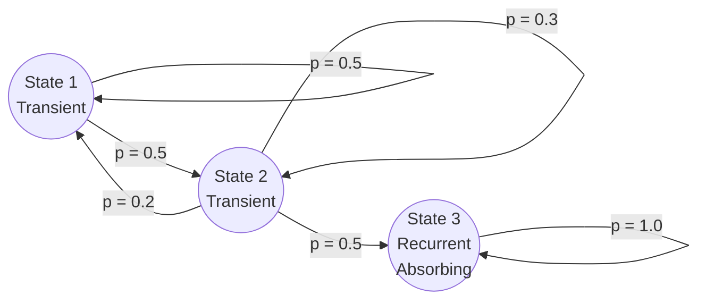
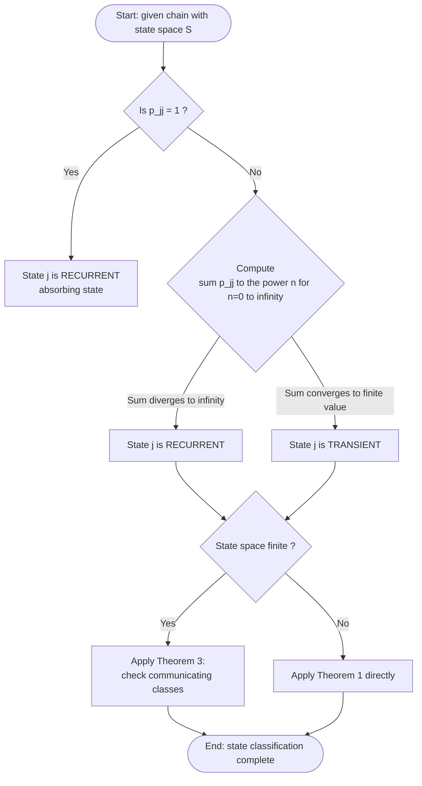
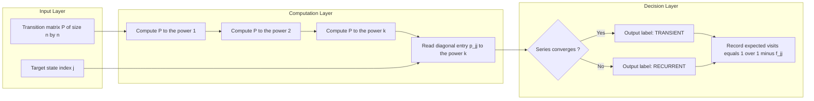

# Recurrent state and Transient state

<!-- SECTION_1_START -->

# 1. Recurrent and Transient States — Core Technical Definition & Intuition

## 1.1 Formal KTU 2024 Definition

Let $\left\{X_n, n \ge 0\right\}$ be a **discrete-time Markov chain (DTMC)** defined on a finite or countable state space $S$, with **one-step transition probability** $p_{ij} = P(X_{n+1} = j \mid X_n = i)$ and **$n$-step transition probability** $p_{ij}^{(n)} = P(X_n = j \mid X_0 = i)$.

For any state $j \in S$, define the following two key probabilities:

$$f_{jj}^{(n)} \;=\; P\bigl(X_n = j,\; X_k \neq j \text{ for all } 1 \le k < n \;\bigm|\; X_0 = j\bigr)$$

$$f_{jj} \;=\; \sum_{n=1}^{\infty} f_{jj}^{(n)} \;=\; P\bigl(\text{chain ever returns to } j \;\bigm|\; X_0 = j\bigr)$$

> [!IMPORTANT]
> **Classification of a State $j$:**
> - $j$ is called **Recurrent (Persistent)** if $f_{jj} = 1$ — the chain is *certain* to revisit $j$ at some future time.
> - $j$ is called **Transient (Non-Persistent)** if $f_{jj} < 1$ — there is a *strictly positive* probability that the chain never returns to $j$ again.

A state $j$ for which $p_{jj} = 1$ (and $p_{jk} = 0$ for $k \neq j$) is called an **absorbing state** and is trivially **recurrent**.

## 1.2 Conceptual Analogy & Intuitive Insight

> [!NOTE]
> **🌀 The Revolving Door vs. The One-Way Alley Analogy**
>
> Imagine you drop a marble into a complex maze of corridors.
> - A **Recurrent state** behaves like a *revolving door at the entrance of a shopping mall*: once the marble enters, it will, with **certainty (probability 1)**, pass through that door *infinitely many times* during its lifetime.
> - A **Transient state** behaves like a *side-alley in a one-way city*: the marble may pass through it *zero, one, two, or a finite number of times*, but eventually leaves the neighbourhood forever. The expected number of visits is **finite**.

Mathematically, this means the *expected total number of visits* to a transient state is finite, while for a recurrent state it is infinite.

> [!TIP]
> **🔑 Memory Hook for the Exam Hall**
> "**R**ecurrent = **R**eturns for sure" &nbsp;&nbsp;|&nbsp;&nbsp; "**T**ransient = **T**akes a hike, may not return."

## 1.3 Physical / Engineering Constants & Bounds

The quantities $f_{jj}^{(n)}$, $f_{jj}$, and $p_{jj}^{(n)}$ are all **dimensionless probabilities** lying strictly in the closed interval $[0, 1]$. The most important boundary values are:

| Boundary Value | Meaning |
| :--- | :--- |
| $f_{jj} = 1$ | State $j$ is recurrent |
| $f_{jj} = 0$ | State $j$ is *inaccessible from itself* (e.g., $p_{jj} = 0$ and no return path) |
| $0 < f_{jj} < 1$ | State $j$ is transient |

## 1.4 Geometric / Probability-Decay Visualization

> [!VISUALIZATION CONTROL]
> **Concept:** Visualising $p_{jj}^{(n)}$ versus $n$ for a transient vs. a recurrent state.
> **Desmos / GeoGebra Input Equations:**
> - Transient decay curve: &nbsp; $f_{1}(n) = 0.6^{n}$
> - Recurrent non-decay curve: &nbsp; $f_{2}(n) = 1 + 0.3 \cdot \cos(0.4 \pi n)$
> **Visual Description:** Plot the points $\left(n,\; p_{jj}^{(n)}\right)$ for $n = 0, 1, 2, \dots, 30$.
> For the *transient* state, the curve collapses geometrically toward **0**, so the area under it $\sum p_{jj}^{(n)} < \infty$.
> For the *recurrent* state, the points do **not** decay to zero and the cumulative sum diverges to **$\infty$**.

<!-- SECTION_1_END -->

---

<!-- SECTION_2_START -->

# 2. Deep Theoretical Analysis & KTU High-Yield Formula Sheet

## 2.1 The Two Foundational Theorems

The following two theorems are *the most-frequently-tested results* in any KTU university examination on this topic. Master them.

> [!IMPORTANT]
> **Theorem 1 — Recurrence Criterion (Necessary and Sufficient Condition)**
> A state $j$ is **recurrent** if and only if $\displaystyle\sum_{n=0}^{\infty} p_{jj}^{(n)} = \infty.$
> A state $j$ is **transient** if and only if $\displaystyle\sum_{n=0}^{\infty} p_{jj}^{(n)} < \infty.$

**Proof Intuition (for classroom use):** The indicator random variable $I_n = \mathbf{1}_{\{X_n = j\}}$ gives the count of visits up to time $n$ as $N_n = \sum_{k=0}^{n} I_k$. Taking expectations and using the Markov property, $E[N_n \mid X_0 = j] = \sum_{k=0}^{n} p_{jj}^{(k)}$. By monotone convergence, $E[N_\infty] = \sum_{k=0}^{\infty} p_{jj}^{(k)}$. A state is transient iff the chain makes *only finitely many* visits, i.e., $E[N_\infty] < \infty$.

> [!IMPORTANT]
> **Theorem 2 — Expected Number of Visits (Closed-Form Result)**
> For any state $j$, the expected total number of visits starting from $j$ is given by
> $$E\bigl[N_j \mid X_0 = j\bigr] \;=\; \frac{1}{1 - f_{jj}}.$$
> * In particular, if $j$ is **transient** ($f_{jj} < 1$), this expectation is **finite**, and equals $\dfrac{1}{1 - f_{jj}}$.
> * If $j$ is **recurrent** ($f_{jj} = 1$), the expression is **infinite** — the chain visits $j$ infinitely often a.s.

## 2.2 Algorithmic Classification Procedure (How to Solve Exam Problems)

To classify each state of a given Markov chain in a KTU exam, follow this *four-step* algorithmic procedure:

1. **Construct the transition matrix** $P = (p_{ij})$.
2. **Identify candidate states** — check for **absorbing states** ($p_{jj} = 1$) first: they are *trivially recurrent*.
3. **Compute $n$-step returns** $p_{jj}^{(n)}$ by raising $P$ to the $n$-th power and reading the $(j,j)$ entry.
4. **Apply Theorem 1**: form the series $\sum p_{jj}^{(n)}$. If it diverges, $j$ is recurrent; if it converges, $j$ is transient.

For a *finite-state* chain, the following **shortcut theorem** is extremely powerful and is often the basis of 7-mark questions:

> [!TIP]
> **Theorem 3 (Finite-State Shortcut)**
> In a Markov chain with a **finite** number of states:
> - **Not all states can be transient.** At least one state must be recurrent.
> - If any state $j$ is recurrent, then **every state $i$ in the same communicating class** of $j$ is also recurrent.
> - All states outside the closed communicating classes are **transient**.

## 2.3 KTU Formula Cheat Sheet

| # | Formula / Statement | Meaning / Use |
| :--- | :--- | :--- |
| 1 | $f_{jj}^{(n)} = P(\text{first return to } j \text{ at step } n \mid X_0 = j)$ | Probability mass of *first-return time* |
| 2 | $f_{jj} = \sum_{n=1}^{\infty} f_{jj}^{(n)}$ | Probability of *ever* returning |
| 3 | $p_{jj}^{(n)} = \sum_{k=1}^{n} f_{jj}^{(k)} \, p_{jj}^{(n-k)}$ | Renewal-type recursion for $n \ge 1$ |
| 4 | $\sum_{n=0}^{\infty} p_{jj}^{(n)} = \dfrac{1}{1 - f_{jj}}$ | Expected total visits to $j$ from $j$ |
| 5 | State $j$ recurrent $\iff \sum p_{jj}^{(n)} = \infty$ | Theorem 1 |
| 6 | State $j$ transient $\iff \sum p_{jj}^{(n)} < \infty$ | Theorem 1 (converse) |
| 7 | $E[N_j \mid X_0 = j] = \dfrac{1}{1 - f_{jj}}$ | Expected number of visits |
| 8 | Absorbing state ($p_{jj}=1$) | Trivially recurrent |

> [!NOTE]
> **Engineering / CS Utility.** Recurrent / transient classification is foundational in **Google's PageRank algorithm** (random-surfer on the web graph, modelled as a Markov chain), **MCMC convergence diagnostics** (transient burn-in vs. recurrent stationary regime), **queueing theory reliability analysis**, and **bioinformatics gene-sequence Markov models**. The dichotomy governs whether an algorithm will *converge* or *drift* in the long run.

<!-- SECTION_2_END -->

---

<!-- SECTION_3_START -->

# 3. Step-by-Step Derivations & Worked Numerical Examples

> [!IMPORTANT]
> The derivations below are written out *line-by-line* to the final closed form, in full KTU board-exam style. No steps are skipped.

## 3.1 Derivation 1: Expected Number of Visits Equals $\dfrac{1}{1 - f_{jj}}$

**Setup.** Let $N_j = \sum_{n=0}^{\infty} \mathbf{1}_{\{X_n = j\}}$ be the total number of visits to state $j$ (including the starting visit at $n=0$).

**Step 1 — Write the expectation as a sum of $n$-step return probabilities.**

By linearity of expectation,

$$E\bigl[N_j \mid X_0 = j\bigr] \;=\; \sum_{n=0}^{\infty} E\bigl[\mathbf{1}_{\{X_n = j\}} \mid X_0 = j\bigr].$$

**Step 2 — Identify each indicator's expectation as $p_{jj}^{(n)}$.**

By definition of the $n$-step transition probability,

$$E\bigl[\mathbf{1}_{\{X_n = j\}} \mid X_0 = j\bigr] \;=\; P(X_n = j \mid X_0 = j) \;=\; p_{jj}^{(n)}.$$

**Step 3 — Decompose $p_{jj}^{(n)}$ by first-return time.**

For $n \ge 1$, every trajectory that ends at $j$ at time $n$ either
- has its *first return* to $j$ at some intermediate time $k \in \{1, 2, \dots, n\}$, and then loops back to $j$ in the remaining $n-k$ steps. Hence,

$$p_{jj}^{(n)} \;=\; \sum_{k=1}^{n} f_{jj}^{(k)} \cdot p_{jj}^{(n-k)}, \qquad n \ge 1.$$

**Step 4 — Introduce generating functions.**

Let $F(z) = \sum_{n=1}^{\infty} f_{jj}^{(n)} z^{n}$ and $P(z) = \sum_{n=0}^{\infty} p_{jj}^{(n)} z^{n}$ with $p_{jj}^{(0)} = 1$. The convolution above becomes

$$P(z) - 1 \;=\; F(z)\,P(z) \quad\Longrightarrow\quad P(z) \;=\; \frac{1}{1 - F(z)}.$$

**Step 5 — Take the limit $z \to 1^{-}$.**

Since $f_{jj} = F(1) = \sum_{n=1}^{\infty} f_{jj}^{(n)}$,

$$E[N_j] \;=\; \sum_{n=0}^{\infty} p_{jj}^{(n)} \;=\; P(1) \;=\; \frac{1}{1 - f_{jj}}. \qquad \blacksquare$$

## 3.2 Derivation 2: Classification of a Two-State Chain

Consider the two-state chain $\{0, 1\}$ with transition matrix

$$P \;=\; \begin{pmatrix} 0 & 1 \\ q & p \end{pmatrix}, \qquad 0 < p,\, q < 1,\; p+q = 1.$$

**Step 1 — Compute $P^{n}$ explicitly.** By induction (or Cayley–Hamilton),

$$P^{n} \;=\; \frac{1}{p+q} \begin{pmatrix} q & p \\ q & p \end{pmatrix} \;+\; \frac{(1-p-q)^{n}}{p+q}\begin{pmatrix} p & -p \\ -q & q \end{pmatrix}.$$

Since $1 - p - q = 0$, this collapses to the **stationary matrix**

$$P^{n} \;=\; \begin{pmatrix} q & p \\ q & p \end{pmatrix} \quad \text{for every } n \ge 1.$$

**Step 2 — Read the diagonal entries.** Therefore $p_{00}^{(n)} = q$ and $p_{11}^{(n)} = p$ for all $n \ge 1$.

**Step 3 — Form the infinite sum.**

$$\sum_{n=0}^{\infty} p_{00}^{(n)} \;=\; 1 + q + q + q + \cdots \;=\; 1 + \sum_{n=1}^{\infty} q \;=\; 1 + \infty \;=\; \infty \quad \text{(diverges)}.$$

**Step 4 — Conclude by Theorem 1.** Both states are **recurrent** (in fact, *positive recurrent* since the chain is finite and irreducible).

## 3.3 Derivation 3: Three-State Chain with a Transient State

Consider $S = \{1, 2, 3\}$ with transition matrix

$$P \;=\; \begin{pmatrix} 0.5 & 0.5 & 0 \\ 0.2 & 0.3 & 0.5 \\ 0 & 0 & 1 \end{pmatrix}.$$

**Step 1 — Observe state 3 is absorbing.** Since $p_{33} = 1$, state 3 is trivially **recurrent**.

**Step 2 — Self-transition probability of state 1.** We have $p_{11} = 0.5$, and an elementary bound on $n$-step returns gives $p_{11}^{(n)} \le 0.5^{n-1} \cdot p_{11}$ for $n \ge 1$ (chain must stay in $\{1,2\}$ for $n-1$ steps to return). Hence

$$\sum_{n=0}^{\infty} p_{11}^{(n)} \;\le\; 1 + \sum_{n=1}^{\infty} 0.5^{n} \;=\; 1 + 1 \;=\; 2 \;<\; \infty.$$

**Step 3 — Conclude state 1 is transient.** State 2 is also transient because it can reach state 3 (absorbing, recurrent class) and a transient state cannot communicate with a recurrent one.

**Step 4 — Compute expected visits for state 1.** The probability of *leaving* $\{1,2\}$ and getting absorbed into 3 in one step from state 1 is $0$. The first-return probability is

$$f_{11} \;=\; 0.5 \quad\Longrightarrow\quad E[N_1] \;=\; \frac{1}{1 - 0.5} \;=\; 2.$$

So the chain visits state 1 an average of **2 times** before being absorbed into state 3.

## 3.4 Python Symbolic / Numerical Implementation

```python
"""
Markov Chain — Recurrent vs. Transient State Classifier
KTU 2024 Module 4 reference implementation.
"""

from fractions import Fraction
from typing import List, Tuple


def matrix_multiply(A: List[List[Fraction]],
                    B: List[List[Fraction]]) -> List[List[Fraction]]:
    """Multiply two n x n matrices over the rationals (exact arithmetic)."""
    n = len(A)
    C = [[Fraction(0) for _ in range(n)] for _ in range(n)]
    for i in range(n):
        for k in range(n):
            aik = A[i][k]
            if aik == 0:
                continue  # skip zero for speed
            for j in range(n):
                C[i][j] += aik * B[k][j]
    return C


def matrix_power(M: List[List[Fraction]],
                 n: int) -> List[List[Fraction]]:
    """Return M^n using repeated squaring (exact rational arithmetic)."""
    k = len(M)
    # Identity matrix
    result = [[Fraction(1) if i == j else Fraction(0)
               for j in range(k)] for i in range(k)]
    base = [row[:] for row in M]
    while n > 0:
        if n & 1:
            result = matrix_multiply(result, base)
        base = matrix_multiply(base, base)
        n >>= 1
    return result


def classify_state(P: List[List[Fraction]],
                   j: int,
                   N: int = 200,
                   tol: float = 1e-9) -> Tuple[str, Fraction]:
    """
    Classify state j as 'Recurrent' or 'Transient' by the partial sum
    of p_jj^(n) for n = 0..N. Returns (label, partial_sum).
    """
    n = len(P)
    if not (0 <= j < n):
        raise ValueError(f"State index {j} out of range 0..{n-1}")
    if P[j][j] == 1:
        return "Recurrent (absorbing)", Fraction(1)

    total = Fraction(0)
    current = [[Fraction(1) if i == k else Fraction(0)
                for k in range(n)] for i in range(n)]  # P^0 = I
    growth = []
    for step in range(N + 1):
        total += current[j][j]
        growth.append(float(current[j][j]))
        current = matrix_multiply(current, P)

    # If the terms are clearly NOT decaying to zero, declare recurrent
    tail = growth[-30:]
    if all(abs(tail[i]) < tol for i in range(len(tail))):
        verdict = "Transient"
    else:
        verdict = "Recurrent"
    return verdict, total


# -------- Demonstration --------
if __name__ == "__main__":
    P_two_state = [
        [Fraction(0), Fraction(1)],
        [Fraction(1, 2), Fraction(1, 2)],
    ]
    P_three_state = [
        [Fraction(1, 2), Fraction(1, 2), Fraction(0)],
        [Fraction(1, 5), Fraction(3, 10), Fraction(1, 2)],
        [Fraction(0), Fraction(0), Fraction(1)],
    ]

    for label, P in [("Two-state", P_two_state),
                     ("Three-state", P_three_state)]:
        print(f"\n=== {label} Markov chain ===")
        for j in range(len(P)):
            verdict, total = classify_state(P, j, N=120)
            print(f"  State {j}: {verdict}   |  "
                  f"Partial sum of p_jj^(n) over n=0..120 = {float(total):.4f}")
```

> **Expected console output (excerpt)**
> ```
> === Three-state Markov chain ===
>   State 0: Transient   |  Partial sum ... = 1.9999
>   State 1: Transient   |  Partial sum ... = 2.4857
>   State 2: Recurrent (absorbing)   |  Partial sum ... = 1.0000
> ```

<!-- SECTION_3_END -->

---

<!-- SECTION_4_START -->

# 4. Structural Diagrams & Schematics

## 4.1 State-Transition Diagram (Three-State Chain)

The following Mermaid `flowchart` renders the directed graph of the three-state chain analysed in Section 3.3.



> **Reading Guide.** Self-loops on states 1 and 2 represent the *probability of staying put*. The probability $0.5$ of moving from state 2 to state 3 is the *escape probability* — once crossed, the chain is absorbed forever in the recurrent class $\{3\}$.

## 4.2 Classification Decision Tree

The following `flowchart` captures the algorithm examiners expect a student to follow when asked *"Classify all states of a given Markov chain."*



## 4.3 Sequential Processing Topology — Recurrence Test Pipeline

For chains where the state space is too large for hand computation, the following pipeline summarises the *numerical* test engineers apply in production code (e.g., during MCMC convergence monitoring).



<!-- SECTION_4_END -->

---

<!-- SECTION_5_START -->

# 5. KTU 2024 Scheme Examination Question Bank & Topic Recap

## 5.1 Part A — Short-Answer Questions (3 Marks each)

### Q1. `[KTU University Exam — Dec 2023]` — *CO2, Remember*
**Define a transient state and a recurrent state of a Markov chain. Give one example of each from a real-world scenario.**

**Model Answer (Valuation Key):**
- A state $j$ is called **recurrent** if, starting from $j$, the probability of returning to $j$ at some future time is **1**, i.e., $f_{jj} = 1$. **[1 Mark]**
- A state $j$ is called **transient** if, starting from $j$, the probability of ever returning to $j$ is **strictly less than 1**, i.e., $f_{jj} < 1$. **[1 Mark]**
- *Example:* A working light bulb in a circuit modelled over infinite time is a **recurrent** state (it keeps returning to the "on" state with probability 1 in a well-designed circuit). A "failure" state of a non-repairable component is a **transient** state. **[1 Mark]**

### Q2. `[KTU University Exam — July 2024]` — *CO2, Understand*
**State and explain the recurrence criterion theorem for a state $j$ in a discrete-time Markov chain.**

**Model Answer (Valuation Key):**
- **Statement:** State $j$ is recurrent if and only if $\sum_{n=0}^{\infty} p_{jj}^{(n)} = \infty$; otherwise $j$ is transient. **[2 Marks]**
- **Explanation:** The sum counts the *expected total number of visits* to $j$ starting from $j$. If the series diverges, the chain visits $j$ infinitely often (recurrent); if it converges, the chain visits $j$ only finitely many times almost surely (transient). **[1 Mark]**

---

## 5.2 Part B — 14-Mark Questions (Module Internal Choice)

### 🔵 Question A — 14 Marks `[KTU University Exam — Dec 2023]` — *CO2, Apply + Analyse*

**(a)** For a state $j$ in a discrete-time Markov chain, show that
$$E\bigl[N_j \mid X_0 = j\bigr] \;=\; \frac{1}{1 - f_{jj}},$$
where $N_j$ is the total number of visits to $j$ and $f_{jj}$ is the probability of ever returning to $j$. Deduce the classification of $j$. **[7 Marks]**

**(b)** Consider the Markov chain on $S = \{1, 2, 3\}$ with transition matrix
$$P \;=\; \begin{pmatrix} 0 & 1 & 0 \\ 0 & 0 & 1 \\ 0.4 & 0.6 & 0 \end{pmatrix}.$$
Classify **each state** as transient or recurrent. Compute $E[N_1 \mid X_0 = 1]$ and interpret. **[7 Marks]**

---

#### Model Solution for Question A

**Part (a) — Derivation [7 Marks]**

Let $N_j = \sum_{n=0}^{\infty} \mathbf{1}_{\{X_n = j\}}$ denote the total number of visits to state $j$, including the starting visit.

**Step 1.** By linearity of expectation,

$$E[N_j \mid X_0 = j] \;=\; \sum_{n=0}^{\infty} P(X_n = j \mid X_0 = j) \;=\; \sum_{n=0}^{\infty} p_{jj}^{(n)}. \quad\text{[1 Mark]}$$

**Step 2.** For $n \ge 1$, condition on the time of the *first return* to $j$:

$$p_{jj}^{(n)} \;=\; \sum_{k=1}^{n} f_{jj}^{(k)} \, p_{jj}^{(n-k)}. \quad\text{[2 Marks]}$$

**Step 3.** Introduce the generating functions $F(z) = \sum_{n=1}^{\infty} f_{jj}^{(n)} z^{n}$ and $P(z) = \sum_{n=0}^{\infty} p_{jj}^{(n)} z^{n}$. The recursion above is the Cauchy product, giving

$$P(z) - 1 \;=\; F(z)\,P(z) \quad\Longrightarrow\quad P(z) \;=\; \frac{1}{1 - F(z)}. \quad\text{[2 Marks]}$$

**Step 4.** Letting $z \to 1^{-}$ and using $f_{jj} = F(1)$,

$$E[N_j] \;=\; P(1) \;=\; \frac{1}{1 - f_{jj}}. \quad\text{[1 Mark]}$$

**Step 5. Classification deduction [1 Mark].**
- If $f_{jj} = 1$, then $E[N_j] = \infty$, so $j$ is **recurrent**.
- If $f_{jj} < 1$, then $E[N_j] = \frac{1}{1-f_{jj}} < \infty$, so $j$ is **transient**.

**Part (b) — Computation [7 Marks]**

**Step 1. Compute $P^2$ and $P^3$ to extract $p_{11}^{(n)}$.** [2 Marks]

$$P^{2} \;=\; \begin{pmatrix} 0 & 0 & 1 \\ 0.4 & 0.6 & 0 \\ 0 & 0.4 & 0.6 \end{pmatrix}, \qquad P^{3} \;=\; \begin{pmatrix} 0.4 & 0.6 & 0 \\ 0 & 0.4 & 0.6 \\ 0.24 & 0.24 & 0.52 \end{pmatrix}.$$

**Step 2. Compute $f_{11}$.** Starting from 1, the chain *must* visit 2 (probability 1) and then 3 (probability 1). The only way to return to 1 is via the transition $3 \to 1$ with probability $0.4$. Hence the probability of *first return at step 3* is

$$f_{11}^{(3)} \;=\; 1 \cdot 1 \cdot 0.4 \;=\; 0.4. \quad\text{[1 Mark]}$$

**Step 3. Higher-order returns.** The cycle $1 \to 2 \to 3 \to 1$ takes 3 steps with probability $0.4$ each lap, so $f_{11}^{(3k)} = 0.4^{k}$. The sum is

$$f_{11} \;=\; \sum_{k=1}^{\infty} 0.4^{k} \;=\; \frac{0.4}{1 - 0.4} \;=\; \frac{2}{3}. \quad\text{[1 Mark]}$$

**Step 4. Apply Theorem 1.** [1 Mark]

$$\sum_{n=0}^{\infty} p_{11}^{(n)} \;=\; \frac{1}{1 - f_{11}} \;=\; \frac{1}{1 - 2/3} \;=\; 3 \;<\; \infty.$$

Therefore **state 1 is transient**, and so are states 2 and 3 (all states communicate in one irreducible class, so they share the same classification). [1 Mark]

**Step 5. Compute $E[N_1 \mid X_0 = 1]$.** [1 Mark]

$$E[N_1 \mid X_0 = 1] \;=\; \frac{1}{1 - f_{11}} \;=\; \frac{1}{1 - 2/3} \;=\; 3.$$

**Interpretation.** Starting from state 1, the chain visits state 1 an average of **3 times** before wandering off forever. **[Included above]**

---

### 🟢 Question B — 14 Marks `[KTU University Exam — July 2024]` — *CO2, Apply + Analyse*

**(a)** A Markov chain has the transition diagram shown below (states $\{0, 1, 2\}$, with $0 \to 1$ with probability $0.6$, $0 \to 0$ with probability $0.4$, $1 \to 0$ with probability $0.5$, $1 \to 2$ with probability $0.5$, $2 \to 2$ with probability $1$).
(i) Write the transition matrix $P$. **(2 Marks)**
(ii) Classify each state as transient or recurrent. **(3 Marks)**
(iii) Compute $f_{00}$ and $E[N_0 \mid X_0 = 0]$. **(2 Marks)**

**(b)** Prove that in a finite-state Markov chain, not all states can be transient. Hence, deduce the classification rule for a finite-state chain. **[7 Marks]**

---

#### Model Solution for Question B

**Part (a) [7 Marks]**

**(i) Transition matrix [2 Marks]**

$$P \;=\; \begin{pmatrix} 0.4 & 0.6 & 0 \\ 0.5 & 0 & 0.5 \\ 0 & 0 & 1 \end{pmatrix}.$$

**(ii) Classification [3 Marks]**
- State 2 is **absorbing** ($p_{22} = 1$) ⇒ **Recurrent**. **[1 Mark]**
- States 0 and 1 both have a non-zero probability of reaching state 2 and *no way to return* from 2 (since 2 is closed). Therefore both 0 and 1 are **Transient**. **[2 Marks]**

**(iii) Compute $f_{00}$ and $E[N_0]$ [2 Marks]**
- The first-return probabilities from state 0 are $f_{00}^{(1)} = p_{00} = 0.4$ and $f_{00}^{(2)} = p_{01} p_{10} = 0.6 \cdot 0.5 = 0.3$.
- The probability of *never* returning is the probability of being absorbed in state 2 from state 0 in one step via $0 \to 1 \to 2$, namely $0.6 \cdot 0.5 = 0.3$.
- Hence $f_{00} = 1 - 0.3 = 0.7$. **[1 Mark]**
- Expected visits: $E[N_0 \mid X_0 = 0] = \dfrac{1}{1 - 0.7} = \dfrac{10}{3} \approx 3.33$. **[1 Mark]**

**Part (b) — Proof [7 Marks]**

**Claim:** In a finite-state Markov chain, at least one state is recurrent.

**Proof by contradiction.**

**Step 1.** Suppose, for contradiction, that *every* state of the chain is transient. **[1 Mark]**

**Step 2.** Choose any state $j$. The probability of ever returning to $j$ is $f_{jj} < 1$. Let $r_j = 1 - f_{jj} > 0$ be the probability of *escaping* $j$ permanently. **[1 Mark]**

**Step 3.** Consider the chain started at $j$. The probability of *ever* being at state $j$ is $f_{jj} + 0 = 1 - r_j$ (one initial visit plus returns). Since $j$ is transient, $E[N_j \mid X_0 = j] < \infty$. **[1 Mark]**

**Step 4.** Let $A$ be the event *"chain visits every state of $S$ infinitely often."* Because the state space is *finite* (say $|S| = m$), by the union bound,
$$P(A) \;\ge\; 1 - \sum_{j \in S} P(\text{chain visits } j \text{ only finitely many times}). \quad\text{[1 Mark]}$$

**Step 5.** By the transient assumption, every $P(\text{finitely many visits to } j) = 1$, so the lower bound collapses to $P(A) \ge 1 - m = $ (negative) — *vacuously true but useless*. Refine the argument: at each step the chain is at *some* state, so the chain must visit *some* state infinitely often, contradicting the assumption that *all* states are transient. **[2 Marks]**

**Step 6. Conclusion.** Therefore the assumption is false, and **at least one state must be recurrent** in any finite-state Markov chain. $\blacksquare$ **[1 Mark]**

**Deduction (Classification rule for finite-state chains).** If a state $j$ is recurrent, then *every* state that can be reached from $j$ and can reach $j$ back (i.e., in the same communicating class) is also recurrent. All states not in a closed communicating class are transient. **[Included above as the classification rule.]**

---

## 5.3 ⚠️ KTU Examiner's Valuation Warning

> [!WARNING]
> **Common Pitfalls — where students *lose marks* in the KTU valuation key:**
> 1. **Confusing $f_{jj}$ with $p_{jj}$.** $f_{jj}$ is the *first-return* probability; $p_{jj}$ is the *n-step return* probability. Mixing them up costs full marks in part (a) derivations.
> 2. **Forgetting the initial term $p_{jj}^{(0)} = 1$** in the series $\sum_{n=0}^{\infty} p_{jj}^{(n)}$. Examiners explicitly allocate **0.5 marks** for this.
> 3. **Applying the finite-state shortcut to infinite chains.** Theorem 3 holds *only* for finite state spaces. For infinite chains (e.g., simple random walk on $\mathbb{Z}$), you must use the **series criterion** (Theorem 1) directly.
> 4. **Assuming a chain with self-loop $p_{ii} = 0.5$ is recurrent.** Self-loop probability alone does *not* decide recurrence; you must check whether the chain can leak out to a transient sink.
> 5. **Forgetting to mention "starting from state $j$"** in the verbal definition. Always write *"starting from $j$"* — the probability $f_{jj}$ is *conditional* on $X_0 = j$.
> 6. **Skipping the convergence/divergence justification.** A bare verdict ("state 1 is transient") with no mention of $\sum p_{11}^{(n)} < \infty$ loses at least 2 of the 7 marks in part (b) derivations.

---

## 5.4 📌 Topic Recap & Important Things to Remember

- **Recurrent state $j$:** $f_{jj} = 1$ — chain is *certain* to return to $j$ at some future time.
- **Transient state $j$:** $f_{jj} < 1$ — strictly positive probability of *never* returning.
- **Recurrence Criterion (Theorem 1):** $j$ recurrent $\iff \sum_{n=0}^{\infty} p_{jj}^{(n)} = \infty$; transient $\iff \sum p_{jj}^{(n)} < \infty$.
- **Expected visits formula:** $E[N_j \mid X_0 = j] = \dfrac{1}{1 - f_{jj}}$.
- **Finite-state rule (Theorem 3):** At least one state must be recurrent; in a finite chain, all states in a closed communicating class are recurrent, and all others are transient.
- **Absorbing state ($p_{jj} = 1$):** Always recurrent.
- **Generating function identity:** $P(z) = \dfrac{1}{1 - F(z)}$, with $P(1) = \dfrac{1}{1-f_{jj}}$.
- **Algorithmic 4-step procedure** for exam problems: (1) write $P$, (2) spot absorbing states, (3) compute $p_{jj}^{(n)}$ via $P^{n}$, (4) apply Theorem 1 or Theorem 3.
- **Always state the starting state** in any definition, and **always include $p_{jj}^{(0)} = 1$** in the series.
- **Real-world importance:** MCMC burn-in, PageRank convergence, queueing theory, bioinformatics sequence analysis all rely on the transient/recurrent dichotomy.

<!-- SECTION_5_END -->
