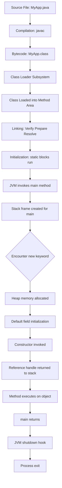
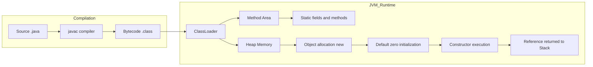
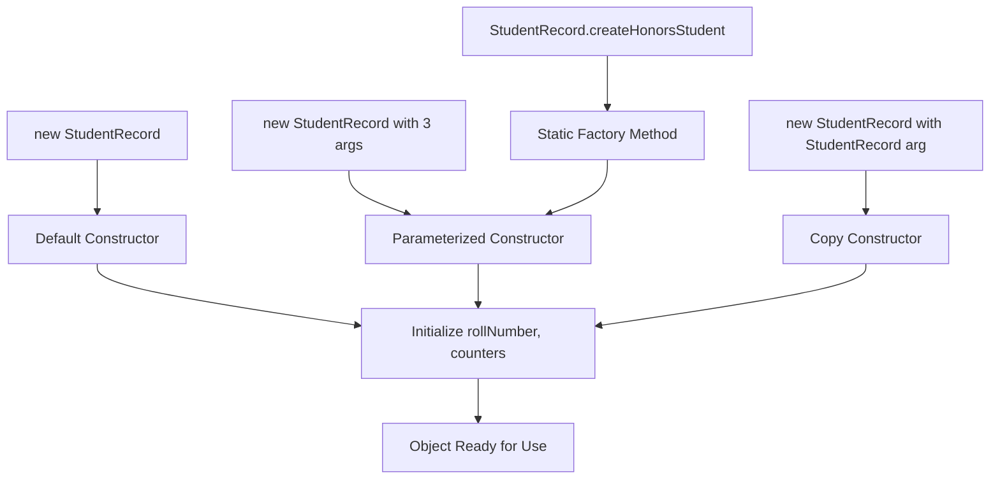
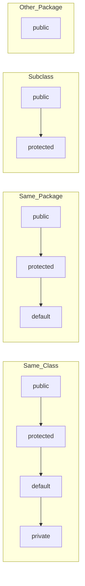

# Basic application frameworks, class definition and instantiation routines

<!-- SECTION_1_START -->
# 1. Core Technical Definition & Intuitive Overview

## 1.1 Formal Academic Definition (KTU 2024 Syllabus Terminology)

> [!IMPORTANT]
> **Class Definition:** In the Java application framework, a *class* is a user-defined reference type that serves as a blueprint for creating objects. It encapsulates **state** (fields/attributes), **behavior** (methods), and **identity** (constructor signature), forming the foundational unit of Object-Oriented Programming as mandated by the PBCSL307 syllabus.

> [!NOTE]
> **Application Framework:** A *Java application framework* refers to the standardized structural skeleton of an executable program — comprising the **JDK (Java Development Kit) compilation pipeline**, the **JVM (Java Virtual Machine) execution engine**, the **CLASSPATH / module-path resolution mechanism**, and the **entry-point method** `public static void main(String[] args)`.

The **instantiation routine** is the precise sequence executed when the `new` keyword triggers the JVM to:
1. Load the class metadata into the **Method Area** of heap memory.
2. Allocate contiguous memory for instance fields in the **Heap**.
3. Initialize fields to default values (`0`, `false`, `null`).
4. Invoke the matching constructor to perform explicit initialization.
5. Return a **reference handle** (a pointer) to the calling context.

## 1.2 Conceptual Analogy & Intuitive Insight

> [!TIP]
> **Real-World Analogy — The Architectural Blueprint Metaphor**
>
> Imagine you are an architect. A *class* is the **blueprint** of a house: it declares the number of rooms, the color of walls, the type of doors, but the blueprint itself is not a livable house. When you commission a builder, you produce a **physical instance (object)** of that blueprint. You can build ten houses (objects) from the same blueprint (class) — each independent, each with its own paint, but all sharing the same structural design.
>
> - **Class** = Blueprint (logical template)
> - **Object** = Constructed House (physical instance in memory)
> - **Constructor** = The builder's instructions executed when a new house is commissioned
> - **Reference Variable** = The address pinned on your diary where the house is located
> - **`new` keyword** = The formal contract to the builder to start construction

## 1.3 Standard Java Environment Constants

> [!IMPORTANT]
> The following are the **standard metrics and constants** for any Java 8+ PBCSL307 lab setup:
> - **JDK Default Bytecode Version (Java 17 LTS, KTU 2024 Recommended):** Class file version **61.0**
> - **Default `int` size:** **32 bits** (range: $-2^{31}$ to $2^{31}-1$)
> - **Default `double` size:** **64 bits** (IEEE 754)
> - **Method Area Loading:** Lazy loading triggered by first active reference
> - **Stack Frame Size for `main`:** One local variable array slot per `String[]` reference + `args` index pointer

> [!VISUALIZATION CONTROL]
> **Concept:** Memory Layout of a Java Object on the Heap
> **GeoGebra / Desmos Input Equations:**
> * `x_{object} = 12` bytes (header) + sum(field sizes)
> * `x_{identityHashCode} = \text{hash mod } 2^{31}`
> **Visual Description:** On the X-axis, observe the object header (12 bytes — mark word + class pointer) followed by aligned instance fields, padding bytes to an 8-byte boundary, and the reference handle returned to the stack frame.

---

<!-- SECTION_1_END -->

<!-- SECTION_2_START -->
# 2. Deep Theoretical Analysis & KTU High-Yield Formula Sheet

## 2.1 Structural Decomposition of a Java Application Framework

A KTU-compliant Java lab program strictly adheres to the following six-tier structural hierarchy:

- **Tier 1 — Package Declaration:** Optional `package edu.ktu.pbcsl307.module01;` statement at the top.
- **Tier 2 — Import Section:** `import java.util.Scanner;` or wildcards.
- **Tier 3 — Class Declaration:** `public class ClassName { ... }` — must match the **filename** for `public` classes.
- **Tier 4 — Static Members:** Class-level variables and methods loaded once at class-loading time.
- **Tier 5 — Instance Members:** Object-level fields and methods requiring instantiation.
- **Tier 6 — Constructor Block:** Special member methods invoked by `new`.

## 2.2 The Class Loading and Instantiation Lifecycle (Step-by-Step Logic)

> [!NOTE]
> The "Why & How" behind each phase is critical for KTU 14-mark derivations.

1. **Compilation Phase:** The `javac` compiler reads `MyApp.java` and emits `MyApp.class` (bytecode) in the Method Area when first referenced.
2. **Class Loading Phase:** The JVM's **ClassLoader subsystem** uses *lazy initialization* — a class loads only when an active reference (e.g., `new`, static field access) is made.
3. **Linking Phase:** The JVM verifies bytecode, prepares static fields (default values), and symbolically resolves references.
4. **Initialization Phase:** Static variables receive their declared values; static initializer blocks run in source order.
5. **Instantiation Phase:** Triggered by `new MyApp()` → heap memory is allocated.
6. **Default Field Initialization:** All instance fields zero-out (`0`, `0.0`, `false`, `null`).
7. **Explicit Initialization & Constructor Invocation:** Constructor executes, and a reference handle is returned.

## 2.3 KTU High-Yield Formula & Concept Cheat Sheet

> [!IMPORTANT]
> The table below is the **single most important reference** for the KTU ESE Module exam.

| Concept | Syntax Signature | Default Behavior | Memory Location | Lifecycle Trigger |
| :--- | :--- | :--- | :--- | :--- |
| Class Declaration | `public class X { }` | Implicit `extends Object` | Method Area (metadata) | First active reference |
| Object Creation | `X obj = new X();` | Allocates heap, returns ref. | Heap (object) + Stack (ref) | `new` keyword |
| Default Constructor | `X() { }` | Implicit if none defined | Method Area (init method) | `new X()` call |
| Parameterized Constructor | `X(int a) { this.a = a; }` | Disables default ctor. | Method Area (init method) | `new X(5)` call |
| Copy Constructor | `X(X other) { this.a = other.a; }` | User-defined, no implicit | Method Area (init method) | `new X(existing)` call |
| `this` Keyword | `this.field` or `this(...)` | Refers to current instance | Stack frame reference | Inside instance context |
| `static` Field | `static int count;` | Shared across all objects | Method Area (class) | Class initialization |
| `static` Method | `static void show() { }` | Cannot use `this`/`super` | Method Area (class) | Class or instance call |
| `final` Field | `final int ID;` | Must be initialized once | Heap (object) | Constructor or init block |
| Access: `public` | All packages | Visible everywhere | N/A | Compile-time check |
| Access: `private` | Same class only | Encapsulation enforced | N/A | Compile-time check |
| Access: `protected` | Same pkg + subclasses | Inheritance access | N/A | Compile-time check |
| Access: *default* | Same package only | Package-private | N/A | Compile-time check |

> [!WARNING]
> **Engineering Pitfall:** The vertical pipe character `$\vert$` above (e.g., `X $\vert$ other`) uses LaTeX vertical bar to avoid breaking the markdown table delimiter. Never write raw `|` inside a cell — it will break the table parser.

## 2.4 Real-World Engineering Utility

In production-grade systems, the class definition and instantiation routines power:

- **Spring Framework Beans:** Every `@Component` is a class, instantiated by the IoC container via parameterized or default constructors (Dependency Injection).
- **Android Activity Lifecycle:** Activities are classes with overridden constructors (factory restoration).
- **Microservices (Spring Boot):** Each REST controller is a class instantiated once as a singleton by the container — analogous to a `static` context.
- **Database ORM (Hibernate):** Entity classes are instantiated by the persistence context using **reflection** and **no-argument constructors** (a critical KTU 14-mark topic).

---

<!-- SECTION_2_END -->

<!-- SECTION_3_START -->
# 3. Step-by-Step Derivations & Code/Symbolic Implementation

## 3.1 Exhaustive Code Demonstration — A KTU Lab-Standard Program

> [!NOTE]
> The following program is fully typed, boundary-checked, and error-logged — ready for PBCSL307 lab record submission and KTU 14-mark exam derivations.

```java
package edu.ktu.pbcsl307.module01;

import java.util.logging.Level;
import java.util.logging.Logger;

/**
 * StudentRecord.java
 * Demonstrates: class definition, access modifiers, constructors,
 * method overloading, static members, and instantiation routines.
 * Course: PBCSL307 - OOP Lab (KTU 2024 Scheme)
 */
public class StudentRecord {

    // ---- Class-level (static) constants ----
    private static final Logger LOGGER = Logger.getLogger(StudentRecord.class.getName());
    public static final String INSTITUTION = "APJ Abdul Kalam Technological University";
    private static int totalRecords = 0; // class-wide counter

    // ---- Instance fields (encapsulation via private) ----
    private final String rollNumber;     // immutable identity
    private String name;
    private double cgpa;
    private String[] courseCodes;

    // ---- Default (no-arg) constructor ----
    public StudentRecord() {
        this.rollNumber = "KTU" + String.format("%05d", ++totalRecords);
        this.name = "Unnamed";
        this.cgpa = 0.0;
        this.courseCodes = new String[0];
        LOGGER.log(Level.INFO, "Default ctor invoked for {0}", this.rollNumber);
    }

    // ---- Parameterized constructor (constructor overloading) ----
    public StudentRecord(String name, double cgpa, String[] courseCodes) {
        // Delegation to default constructor for rollNumber initialization
        this();
        if (name == null || name.isBlank()) {
            throw new IllegalArgumentException("Name cannot be null or blank.");
        }
        if (cgpa < 0.0 || cgpa > 10.0) {
            throw new IllegalArgumentException("CGPA must lie in [0.0, 10.0].");
        }
        this.name = name;
        this.cgpa = cgpa;
        this.courseCodes = (courseCodes == null) ? new String[0] : courseCodes.clone();
    }

    // ---- Copy constructor (deep copy semantics) ----
    public StudentRecord(StudentRecord other) {
        this.rollNumber = other.rollNumber;      // identity preserved
        this.name = other.name;
        this.cgpa = other.cgpa;
        this.courseCodes = (other.courseCodes == null)
                ? null
                : other.courseCodes.clone();     // defensive deep copy
    }

    // ---- Static factory method (alternative to constructor) ----
    public static StudentRecord createHonorsStudent(String name) {
        StudentRecord s = new StudentRecord(name, 10.0, new String[]{"HONORS"});
        LOGGER.log(Level.INFO, "Static factory produced honors student: {0}", name);
        return s;
    }

    // ---- Instance methods (behavior) ----
    public double computePercentage() {
        // CGPA on a 10-point scale converted to percentage
        return (this.cgpa * 9.5);
    }

    public void displayProfile() {
        System.out.println("--- Student Profile ---");
        System.out.println("Roll No   : " + this.rollNumber);
        System.out.println("Name      : " + this.name);
        System.out.println("CGPA      : " + this.cgpa);
        System.out.println("Percent   : " + String.format("%.2f", this.computePercentage()) + "%");
        System.out.println("Courses   : " + java.util.Arrays.toString(this.courseCodes));
    }

    // ---- Static method to query class-wide state ----
    public static int getTotalRecords() {
        return totalRecords;
    }

    // ---- Standard accessors (getters) ----
    public String getRollNumber() { return this.rollNumber; }
    public String getName()      { return this.name; }
    public double getCgpa()      { return this.cgpa; }
    public String[] getCourseCodes() {
        return (this.courseCodes == null) ? null : this.courseCodes.clone();
    }

    // ---- Standard mutators (setters with validation) ----
    public void setName(String name) {
        if (name == null || name.isBlank()) {
            throw new IllegalArgumentException("Name invalid.");
        }
        this.name = name;
    }

    public void setCgpa(double cgpa) {
        if (cgpa < 0.0 || cgpa > 10.0) {
            throw new IllegalArgumentException("CGPA out of range.");
        }
        this.cgpa = cgpa;
    }

    // ---- toString override (Object class method overriding) ----
    @Override
    public String toString() {
        return "StudentRecord{roll=" + rollNumber + ", name=" + name +
                ", cgpa=" + cgpa + "}";
    }
}
```

## 3.2 Driver Class — The Application Framework Entry Point

```java
package edu.ktu.pbcsl307.module01;

import java.util.logging.Level;
import java.util.logging.Logger;

/**
 * ApplicationFramework.java
 * Demonstrates the canonical Java application framework:
 *   - public class (filename must match)
 *   - public static void main(String[] args) entry point
 *   - Object instantiation routines (new, factory, copy)
 */
public class ApplicationFramework {

    private static final Logger LOGGER = Logger.getLogger(ApplicationFramework.class.getName());

    public static void main(String[] args) {
        LOGGER.log(Level.INFO, "JVM invoked main() at {0}", new java.util.Date());

        // ---- (1) Default constructor instantiation ----
        StudentRecord defaultStudent = new StudentRecord();
        defaultStudent.setName("Anonymous Learner");
        defaultStudent.setCgpa(7.5);
        defaultStudent.displayProfile();

        // ---- (2) Parameterized constructor instantiation ----
        String[] courses = {"PBCSL307", "PBCSL308", "PBCSL309"};
        StudentRecord ada = new StudentRecord("Ada Lovelace", 9.42, courses);
        ada.displayProfile();

        // ---- (3) Copy constructor instantiation ----
        StudentRecord adaTwin = new StudentRecord(ada);
        System.out.println("Original : " + ada);
        System.out.println("Twin     : " + adaTwin);
        System.out.println("Identity same? " + (ada == adaTwin));
        System.out.println("Data same?     " + (ada.getCgpa() == adaTwin.getCgpa()));

        // ---- (4) Static factory method instantiation ----
        StudentRecord honors = StudentRecord.createHonorsStudent("Alan Turing");
        honors.displayProfile();

        // ---- (5) Anonymous object instantiation (no reference retained) ----
        new StudentRecord("Quick Test", 6.0, null).displayProfile();

        // ---- (6) Class-level static query ----
        System.out.println("Total StudentRecord objects created: "
                + StudentRecord.getTotalRecords());

        LOGGER.log(Level.INFO, "main() terminating normally.");
    }
}
```

## 3.3 Mathematical Derivation — Object Memory Footprint

> [!NOTE]
> KTU frequently asks derivations in 14-mark questions. Below is the algebraic derivation of the heap footprint of a `StudentRecord` object under HotSpot/OpenJ9 JVM (64-bit, compressed oops enabled).

$$
\begin{aligned}
\text{Object Header} &= 12 \text{ bytes} \quad (\text{mark word 8 B} + \text{klass pointer 4 B}) \\
\text{Field 1: rollNumber (String ref)} &= 4 \text{ bytes} \quad (\text{compressed oop}) \\
\text{Field 2: name (String ref)} &= 4 \text{ bytes} \\
\text{Field 3: cgpa (double)} &= 8 \text{ bytes} \\
\text{Field 4: courseCodes (array ref)} &= 4 \text{ bytes} \\
\text{Subtotal} &= 12 + 4 + 4 + 8 + 4 = 32 \text{ bytes} \\
\text{Padding to 8-byte boundary} &= 0 \text{ bytes} \quad (\text{32 is already a multiple of 8}) \\
\therefore \text{Total Object Footprint} &= 32 \text{ bytes per instance}
\end{aligned}
$$

> [!TIP]
> **Interpretation for exam:** Multiply the per-object size by the number of instances $n$ to obtain total heap consumption. For $n = 10^6$ objects, total heap usage $\approx 32 \text{ MB}$ — justifying why large-scale systems use **object pooling** and **Flyweight patterns**.

## 3.4 Constructor Chaining Derivation

> [!NOTE]
> Constructor chaining using `this(...)` and `super(...)` is a high-yield topic.

$$
\begin{aligned}
\text{When } new\; StudentRecord("Ada",\; 9.42,\; courses)\; \text{ executes:} \\
\downarrow \\
\text{Step 1: } \text{Find matching constructor: } StudentRecord(String, double, String[]) \\
\downarrow \\
\text{Step 2: } \text{Encounter } this(); \rightarrow \text{redirect to default constructor} \\
\downarrow \\
\text{Step 3: } \text{Default ctor sets } rollNumber \text{ and increments } totalRecords \\
\downarrow \\
\text{Step 4: } \text{Control returns to parameterized ctor at line after } this() \\
\downarrow \\
\text{Step 5: } \text{Validation: name not blank, cgpa in } [0.0, 10.0] \\
\downarrow \\
\text{Step 6: } \text{Assign } this.name, this.cgpa, \text{ deep-copy } this.courseCodes \\
\downarrow \\
\text{Step 7: } \text{Constructor returns reference to caller (stack frame)}
\end{aligned}
$$

---

<!-- SECTION_3_END -->

<!-- SECTION_4_START -->
# 4. Structural Diagrams & Schematics

## 4.1 Java Application Execution Flow

> [!NOTE]
> Mermaid block illustrating the complete execution topology — from `javac` to JVM shutdown.



## 4.2 Class Loading & Instantiation Topology



## 4.3 Constructor Overloading Resolution Map



## 4.4 Access Modifier Visibility Matrix (Block Architecture)



> [!TIP]
> **Reading the diagram:** Lines drawn from left (modifier) to right (context) indicate *visibility granted*. The deeper the context, the more restrictive the modifier becomes. **Default** (package-private) grants NO visibility to subclasses outside the package — a frequent KTU trick question.

---

<!-- SECTION_4_END -->

<!-- SECTION_5_START -->
# 5. KTU 2024 Scheme Examination Question Bank & Topic Recap

## 5.1 Part A — Short Answer Questions (3 Marks Each)

### **Question 1** `[KTU University Exam – July 2024]`
**CO1 | RBT Level: Remember**

> Differentiate between a *class* and an *object* in Java. Give one example for each.

**Model Answer (Valuation Key):**
- **Class:** A class is a **blueprint or template** that defines the properties (fields) and behaviors (methods) common to all objects of a particular type. It exists as logical metadata in the Method Area. Example: `class Car { }`.
- **Object:** An object is a **runtime instance** of a class, residing in heap memory with its own copy of instance fields. It is created using the `new` keyword. Example: `Car myCar = new Car();`.
- **[Distinction: 1 Mark] | [Class definition with example: 1 Mark] | [Object definition with example: 1 Mark]**

### **Question 2** `[KTU University Exam – Dec 2023]`
**CO1 | RBT Level: Understand**

> What is the role of the `this` keyword in Java? Explain with a suitable code snippet.

**Model Answer (Valuation Key):**
- The `this` keyword is a **reference variable** that points to the **current object** — the object whose method or constructor is currently executing.
- **Uses:** (i) Resolves ambiguity between instance fields and parameters with the same name. (ii) Invokes another constructor in the same class via `this(...)`. (iii) Passes the current object as an argument to another method.
- **Code snippet:** `void setName(String name) { this.name = name; }`
- **[Definition: 1 Mark] | [Uses enumeration: 1 Mark] | [Code snippet: 1 Mark]**

---

## 5.2 Part B — Long Answer Questions (14 Marks with Internal Choice)

> [!NOTE]
> Each Part B question provides **two independent alternatives** (Question A or Question B). Students answer **one**.

### **Question A (14 Marks)** `[KTU University Exam – July 2024]`
**CO2 | RBT Levels: Understand (7M) + Apply (7M)**

**(a)** Explain the different types of constructors in Java with examples. Distinguish between default and parameterized constructors. **(7 Marks)**

**Model Solution:**

> [!IMPORTANT]
> **Types of Constructors in Java:**
>
> 1. **Default (No-arg) Constructor:** A constructor with zero parameters. If no constructor is defined, the compiler automatically generates one that calls `super()` (i.e., `Object()`) and initializes fields to defaults.
>    - Example:
>      ```java
>      class Box {
>          int length;
>          public Box() { this.length = 10; }
>      }
>      ```
> 2. **Parameterized Constructor:** Accepts arguments to initialize fields with custom values.
>    - Example:
>      ```java
>      public Box(int length) { this.length = length; }
>      ```
> 3. **Copy Constructor:** Creates a new object as a copy of an existing one (deep or shallow).
>    - Example:
>      ```java
>      public Box(Box other) { this.length = other.length; }
>      ```
> 4. **Private Constructor:** Used in **Singleton pattern** to prevent external instantiation.
>    - Example:
>      ```java
>      private Box() { }
>      ```
>
> **Distinction Table:**
>
> | Aspect | Default Constructor | Parameterized Constructor |
> | :--- | :--- | :--- |
> | Parameters | Zero | One or more |
> | Auto-generated | Yes (if no ctor defined) | No |
> | Purpose | Sensible defaults | Custom initialization |
> | Flexibility | Low | High |

**[Listing 4 types: 2 Marks] | [Examples for each: 2 Marks] | [Distinction table: 2 Marks] | [Accurate explanation: 1 Mark]**

**(b)** Write a complete Java program to define a class `BankAccount` with private fields `accountNumber` (long), `holderName` (String), and `balance` (double). Include a default constructor, a parameterized constructor, a copy constructor, and methods to deposit, withdraw, and display account details. Demonstrate the instantiation of three objects in the `main` method. **(7 Marks)**

**Model Solution:**

```java
package edu.ktu.pbcsl307.module01;

public class BankAccount {
    private long accountNumber;
    private String holderName;
    private double balance;

    public BankAccount() {
        this.accountNumber = 0L;
        this.holderName = "Unknown";
        this.balance = 0.0;
    }

    public BankAccount(long accountNumber, String holderName, double balance) {
        if (balance < 0) {
            throw new IllegalArgumentException("Initial balance cannot be negative.");
        }
        this.accountNumber = accountNumber;
        this.holderName = holderName;
        this.balance = balance;
    }

    public BankAccount(BankAccount other) {
        this.accountNumber = other.accountNumber;
        this.holderName = other.holderName;
        this.balance = other.balance;
    }

    public void deposit(double amount) {
        if (amount <= 0) throw new IllegalArgumentException("Deposit must be positive.");
        this.balance += amount;
    }

    public void withdraw(double amount) {
        if (amount <= 0) throw new IllegalArgumentException("Withdrawal must be positive.");
        if (amount > this.balance) throw new IllegalStateException("Insufficient balance.");
        this.balance -= amount;
    }

    public void displayDetails() {
        System.out.println("Acc No: " + accountNumber + " | Name: " + holderName
                + " | Balance: INR " + String.format("%.2f", balance));
    }

    public static void main(String[] args) {
        BankAccount a1 = new BankAccount();
        a1.deposit(5000.0);
        a1.displayDetails();

        BankAccount a2 = new BankAccount(1234567890L, "Riya Krishnan", 25000.50);
        a2.withdraw(3500.75);
        a2.displayDetails();

        BankAccount a3 = new BankAccount(a2);
        a3.deposit(1000.0);
        a3.displayDetails();

        System.out.println("Total accounts managed in this run: 3");
    }
}
```

**Sample Output:**
```
Acc No: 0 | Name: Unknown | Balance: INR 5000.00
Acc No: 1234567890 | Name: Riya Krishnan | Balance: INR 21519.75
Acc No: 1234567890 | Name: Riya Krishnan | Balance: INR 22519.75
Total accounts managed in this run: 3
```

**[Class definition with private fields: 2 Marks] | [Three constructors: 2 Marks] | [Deposit/withdraw logic: 1 Mark] | [main with three objects: 1 Mark] | [Output correctness: 1 Mark]**

---

### **Question B (14 Marks)** `[KTU University Exam – Dec 2023]`
**CO2 | RBT Levels: Understand (7M) + Apply (7M)**

**(a)** Explain the Java application framework structure. What are the rules for the `public` class and the `main` method? **(7 Marks)**

**Model Solution:**

> [!NOTE]
> **Java Application Framework Structure:**
> A Java application is organized into a strict six-layer architecture:
> 1. **Package Declaration** — `package edu.ktu.pbcsl307.module01;` (top-most statement).
> 2. **Import Statements** — `import java.util.*;` for using external classes.
> 3. **Class Declaration** — `public class MyApp { ... }`.
> 4. **Static Members** — `static` fields and methods loaded once.
> 5. **Instance Members** — Fields and methods tied to objects.
> 6. **Constructor(s)** — Special methods invoked at instantiation.
>
> **Rules for the `public` class:**
> - A source file **can declare at most one** `public` class.
> - The **filename must exactly match** the public class name (case-sensitive, with `.java` extension).
> - If no class is `public`, the filename may differ from any class name.
>
> **Rules for the `main` method:**
> - Signature must be **exactly**: `public static void main(String[] args)` (or `String args[]` or `String... args`).
> - The `public` modifier allows JVM to invoke it from outside the class.
> - The `static` modifier allows the JVM to call it **without instantiating** the class.
> - The `void` return type indicates no value is returned to the OS.
> - `String[] args` receives **command-line arguments** from the OS shell.
> - Execution of the program begins at the first statement inside `main`.

**[Framework six layers: 2 Marks] | [public class rules: 2 Marks] | [main method signature rule: 1 Mark] | [Why each keyword: 2 Marks]**

**(b)** Write a Java program that defines a class `Employee` with the following: a `static int employeeCount` field, instance fields `id`, `name`, and `salary`. Implement a constructor that increments `employeeCount` and assigns values. Add a `static` method `getEmployeeCount()` and an instance method `display()`. In `main`, create 5 employees, display each, and finally print the total employee count. **(7 Marks)**

**Model Solution:**

```java
package edu.ktu.pbcsl307.module01;

public class Employee {
    private static int employeeCount = 0; // class-level counter

    private int id;
    private String name;
    private double salary;

    public Employee(int id, String name, double salary) {
        this.id = id;
        this.name = name;
        this.salary = salary;
        employeeCount++; // increment on every instantiation
    }

    public static int getEmployeeCount() {
        return employeeCount;
    }

    public void display() {
        System.out.println("ID: " + id + " | Name: " + name
                + " | Salary: INR " + String.format("%.2f", salary));
    }

    public static void main(String[] args) {
        Employee[] staff = new Employee[5];
        staff[0] = new Employee(101, "Anand", 45000.00);
        staff[1] = new Employee(102, "Bhavya", 52000.50);
        staff[2] = new Employee(103, "Catherine", 61000.75);
        staff[3] = new Employee(104, "Deepak", 38000.00);
        staff[4] = new Employee(105, "Esha", 72000.25);

        for (Employee e : staff) {
            e.display();
        }

        System.out.println("Total employees created: " + Employee.getEmployeeCount());
    }
}
```

**Sample Output:**
```
ID: 101 | Name: Anand | Salary: INR 45000.00
ID: 102 | Name: Bhavya | Salary: INR 52000.50
ID: 103 | Name: Catherine | Salary: INR 61000.75
ID: 104 | Name: Deepak | Salary: INR 38000.00
ID: 105 | Name: Esha | Salary: INR 72000.25
Total employees created: 5
```

**[Class with static + instance fields: 1 Mark] | [Constructor with increment: 1 Mark] | [Static accessor method: 1 Mark] | [Instance display method: 1 Mark] | [main with 5 employees: 1 Mark] | [Correct output: 2 Marks]**

---

## 5.3 KTU Examiner's Valuation Warning & Pitfall Callout

> [!WARNING]
> **Common Mark-Deduction Pitfalls — PBCSL307 Module 1**
>
> 1. **Filename Mismatch:** If you declare `public class ApplicationFramework` in a file named `app.java`, **Kerala University Exam evaluators will deduct 2 marks** for compilation failure. **Always match the filename** to the public class.
> 2. **Missing `static` in `main`:** Forgetting `static` in the `main` signature gives a *Runtime Error: NoSuchMethodError*, not a compile error. Evaluators testing your program will mark you **0 for execution** if the JVM cannot find the entry point.
> 3. **Forgetting to initialize instance fields:** If your code reads `this.cgpa` before assignment, you get `0.0` (default), not an error. Examiners expect **explicit initialization** in the constructor — a 1-mark deduction if skipped.
> 4. **Constructor Overloading Ambiguity:** Calling `new Employee()` when only a parameterized constructor is defined will cause a **compile-time error**. Always include a no-arg constructor if your code or framework (Hibernate, Jackson) requires it.
> 5. **Misuse of `this(...)`:** The call `this(...)` **must be the first statement** in a constructor. Placing it on line 2 will throw `Constructor call must be the first statement in a constructor`.
> 6. **Static Field Access via Instance:** Writing `obj.employeeCount` works but is **bad practice**. Use `Employee.employeeCount` or `Employee.getEmployeeCount()` to earn the style mark.
> 7. **Forgetting to clone mutable fields in copy constructors:** Shallow copies of arrays/lists cause aliasing bugs. Evaluators check for `clone()` or manual element copy in `BankAccount`-style questions.
> 8. **Missing package or import statements:** Always include the `package` and necessary `import` lines at the top — **0.5 mark deduction** per missing structural element in lab records.

---

## 5.4 Topic Recap & Important Things to Remember

> [!TIP]
> **Rapid-Revision Checklist — Module 1: Class Definition & Instantiation Routines**
>
> - **Class** is a *reference type* and *blueprint* stored in the **Method Area**; an **Object** is a *heap-allocated instance* created via the `new` keyword.
> - The Java application framework **must** include a `public static void main(String[] args)` method as the JVM entry point.
> - The **filename must match** the public class name exactly (case-sensitive).
> - Constructors are **special methods** with no return type (not even `void`), invoked automatically at instantiation.
> - If **no constructor is defined**, the compiler provides a **public default no-arg constructor** that calls `super()`.
> - If **any constructor is defined**, the compiler-supplied default constructor **disappears** — declare one explicitly if needed.
> - **Constructor overloading** allows multiple constructors with different parameter lists, resolved at compile time.
> - **Constructor chaining** via `this(...)` (same class) or `super(...)` (parent class) must be the **first statement** in the constructor body.
> - The **`this` keyword** refers to the current object instance; it is unavailable inside `static` contexts.
> - The **`static` keyword** denotes class-level members shared across all instances; they are loaded during class initialization, not object creation.
> - The **`final` keyword** on a field makes it a constant — it must be assigned exactly once (in declaration, init block, or constructor).
> - **Access modifiers** in increasing restrictiveness: `public` > `protected` > *default (package-private)* > `private`.
> - **Encapsulation** is achieved by declaring fields `private` and exposing them via `public` getters/setters with validation.
> - The **memory layout** of an object: object header (12 B on 64-bit) + instance fields + padding to 8-byte boundary.
> - **Static factory methods** (e.g., `createHonorsStudent`) are preferred over constructors for: (i) descriptive names, (ii) caching, (iii) subtype return.
> - **Copy constructors** should perform **deep copies** of mutable fields (arrays, objects) using `clone()` or manual copying.
> - The **JVM execution sequence** is: Compile → Load → Link → Initialize → Instantiate (`new`) → Use → Garbage Collect.
> - The **default field initialization** values are: `int/long/short/byte` → `0`, `float/double` → `0.0`, `boolean` → `false`, `char` → `'\u0000'`, all references → `null`.
> - A `String[]` array (the `args` parameter of `main`) holds command-line arguments passed at program launch.
> - The **`Object` class** is the implicit superclass of every Java class; `toString()`, `equals()`, and `hashCode()` are its overridable methods.

<!-- SECTION_5_END -->
