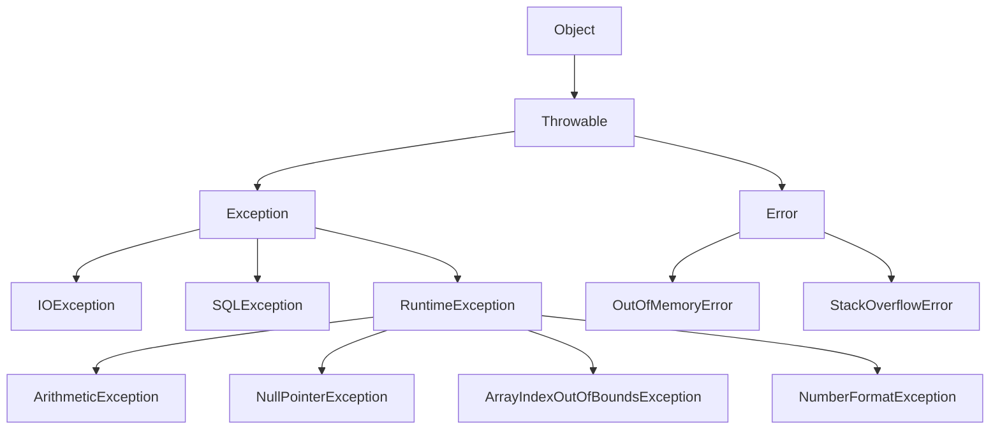
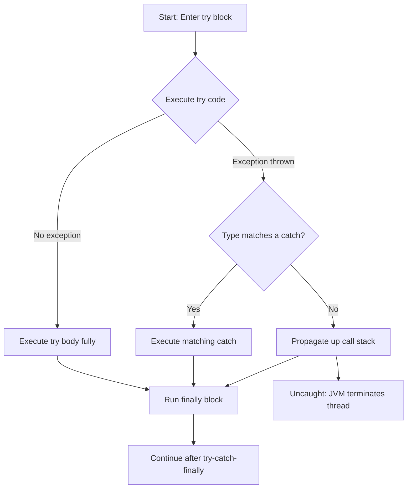
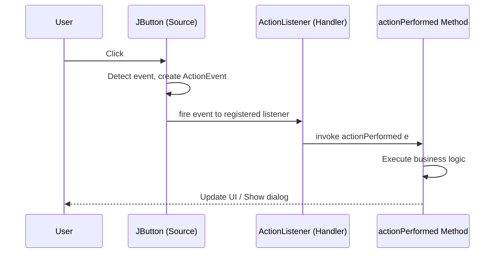
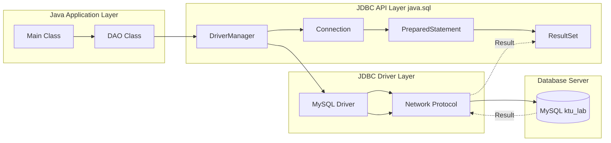
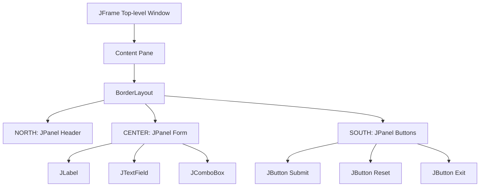
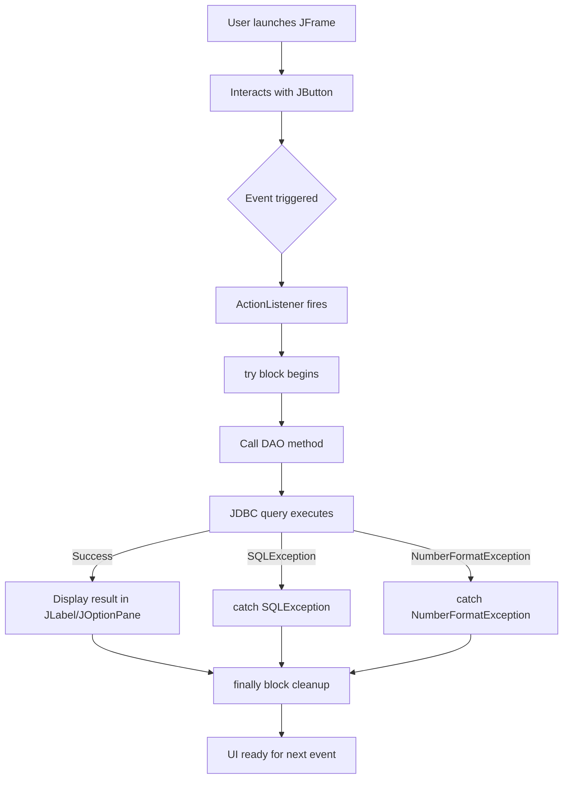

# Exception intercept setup, dynamic UI window builds via Swings, JDBC relational access tracking

<!-- SECTION_1_START -->
# OBJECT ORIENTED PROGRAMMING LAB (PBCSL307) — Module 1

## 1. Core Technical Definition & Intuitive Overview

### 1.1 Exception Handling — *Intercept Setup*

**Formal Definition (KTU 2024 Syllabus):**
*Exception Handling* in Java is a robust mechanism to intercept runtime anomalies (exceptions) that disrupt the normal flow of program execution. It provides a structured way to detect, transfer, and recover from exceptional conditions using the keywords `try`, `catch`, `finally`, `throw`, and `throws`, all rooted in the `java.lang.Throwable` class hierarchy.

**Conceptual Analogy / Intuition:**
> [!IMPORTANT]
> Think of a Java program as a **bullet train** running on tracks. An exception is like a **rock falling on the track**. Without exception handling, the train (program) crashes catastrophically. With `try-catch`, you place a **sensor (try block)** on the track, and a **recovery robot (catch block)** that detects the rock, removes it, and reroutes the train safely. The `finally` block is the **mandatory safety check** that runs whether the rock appeared or not (e.g., closing the track for safety).

The exception hierarchy (must remember):
- `Object` → `Throwable` → `Exception` → `RuntimeException` (unchecked)
- `Throwable` → `Error` (e.g., `OutOfMemoryError` — unrecoverable)

**Key Categories of Exceptions:**
| Category | Examples | Handling |
|----------|----------|----------|
| Checked | `IOException`, `SQLException`, `ClassNotFoundException` | Forced by compiler |
| Unchecked | `ArithmeticException`, `NullPointerException`, `ArrayIndexOutOfBoundsException` | Runtime only |
| Error | `StackOverflowError`, `OutOfMemoryError` | Not handled |

---

### 1.2 Java Swing — *Dynamic UI Window Builds*

**Formal Definition (KTU 2024 Syllabus):**
*Swing* is the Java Foundation Classes (JFC) lightweight, platform-independent GUI toolkit (`javax.swing` package) used to build dynamic, event-driven desktop windows. Unlike AWT, Swing components are rendered using pure Java, supporting pluggable Look-And-Feel (LAF) and a rich set of components prefixed with `J` (e.g., `JFrame`, `JButton`, `JLabel`).

**Conceptual Analogy / Intuition:**
> [!NOTE]
> Imagine building a **house**. A `JFrame` is the **outer walls and roof** (the main window). A `JPanel` is a **room inside the house** (a container for grouping widgets). `JLabel` is a **nameplate on the door**, `JTextField` is a **letterbox**, and `JButton` is the **doorbell**. When the doorbell is pressed (event), the **butler (event listener)** runs to the door (event handler) and performs an action.

**Core Swing Component Tree (must memorize for KTU):**

```
java.awt.Component
 └── java.awt.Container
      └── javax.swing.JComponent
           ├── JLabel
           ├── JButton
           ├── JTextField
           ├── JTextArea
           ├── JPanel
           └── ... (50+ components)
```

**Standard Look and Feel (LAF):** `javax.swing.UIManager.setLookAndFeel(...)`

> [!VISUALIZATION CONTROL]
> **Concept:** Swing Window Coordinate System
> **GeoGebra / Desmos Input Equations:**
> * Point P1: $(x, y) = (0, 0)$ — Top-Left of JFrame
> * Point P2: $(x, y) = (w, 0)$ — Top-Right (width = $w$)
> * Point P3: $(x, y) = (0, h)$ — Bottom-Left (height = $h$)
> * Origin convention: `getX()` returns the X-coordinate of the top-left pixel in screen space.
> **Visual Description:** The student should observe that Swing's layout starts at the top-left corner $(0, 0)$ of the screen, with the Y-axis increasing downward — opposite to standard math convention.

---

### 1.3 JDBC — *Relational Access Tracking*

**Formal Definition (KTU 2024 Syllabus):**
*Java Database Connectivity (JDBC)* is a Java API (`java.sql` package) that enables Java applications to interact with relational databases (RDBMS) in a database-independent manner. It provides a standard set of classes and interfaces — `DriverManager`, `Connection`, `Statement`, `PreparedStatement`, and `ResultSet` — to execute SQL queries and traverse the returned data.

**Conceptual Analogy / Intuition:**
> [!IMPORTANT]
> JDBC is like a **universal translator** between a Java program and a relational database.
> - `DriverManager` → **The telephone operator** that dials the right database.
> - `Connection` → **The live phone call** (open session).
> - `Statement` / `PreparedStatement` → **The verbal query** you speak into the phone.
> - `ResultSet` → **The notes the database reads back** to you.
> - `close()` → **Hanging up the phone** (releasing the connection).
> Forgetting to close is like leaving the phone off the hook — resources leak, and the system eventually crashes.

**The 5-Step JDBC Workflow (Kerala University Standard):**

$$\text{Load Driver} \rightarrow \text{Establish Connection} \rightarrow \text{Create Statement} \rightarrow \text{Execute Query} \rightarrow \text{Process ResultSet} \rightarrow \text{Close Connection}$$

> [!NOTE]
> **Mandatory Exception:** `java.sql.SQLException` is a **checked exception**, so all JDBC code MUST be wrapped in `try-catch` or declared with `throws`. This directly links to the "exception intercept setup" part of your module.

**Common JDBC URLs (must memorize):**
- MySQL: `jdbc:mysql://localhost:3306/dbname`
- PostgreSQL: `jdbc:postgresql://localhost:5432/dbname`
- Oracle: `jdbc:oracle:thin:@localhost:1521:XE`
- SQLite: `jdbc:sqlite:filename.db`

<!-- SECTION_1_END -->

<!-- SECTION_2_START -->
## 2. Deep Theoretical Analysis & KTU High-Yield Formula Sheet

### 2.1 Exception Handling — Deep Mechanics

**The `try-catch-finally` execution flow:**

1. Code inside the `try` block executes sequentially.
2. If an exception is thrown, the JVM **unwinds the stack** to find the nearest matching `catch` block (by type).
3. The matching `catch` block executes.
4. The `finally` block **always executes** — even if no exception occurs, even if `System.exit(0)` is called (only `System.exit` aborts `finally`).
5. If no `catch` matches, the exception propagates up the call stack.

**The `throws` vs `throw` distinction (favourite KTU question):**
- `throw` — *verb* — explicitly throws **one** exception instance (used inside method body).
- `throws` — *declaration* — declares that a method **may** throw one or more exception types (used in method signature).

**Custom Exceptions (must know the pattern):**
A user-defined exception must extend `Exception` (checked) or `RuntimeException` (unchecked), and provide at least two constructors — a default one and one that takes a `String message` argument and calls `super(message)`.

---

### 2.2 Swing Event-Driven Architecture

Swing uses the **Delegation Event Model** (DEM). Components (event sources) delegate event handling to registered listener objects (event sinks). The three participants:

1. **Event Source** — the GUI component (e.g., `JButton`).
2. **Event Object** — carries event data (e.g., `ActionEvent`).
3. **Event Listener/Handler** — the object implementing the listener interface (e.g., `ActionListener`).

**Key Listener Interfaces:**
- `ActionListener` → `actionPerformed(ActionEvent e)` — for buttons, menu items
- `MouseListener` → 5 methods for mouse clicks/enter/exit
- `KeyListener` → 3 methods for key events
- `WindowListener` → 7 methods for window open/close/iconify

**Layout Managers (essential for KTU practicals):**
- `BorderLayout` — default for `JFrame` content pane (NORTH, SOUTH, EAST, WEST, CENTER)
- `FlowLayout` — default for `JPanel`; left-to-right, wraps on overflow
- `GridLayout` — equal-sized cells in a grid
- `GridBagLayout` — most flexible, but verbose
- `null` layout — absolute positioning with `setBounds(x, y, w, h)`

---

### 2.3 JDBC Architecture Layers

JDBC follows a **two-tier or three-tier** model. The four core interfaces:

| Interface | Role | Lifecycle |
|-----------|------|-----------|
| `DriverManager` | Static factory that returns `Connection` based on JDBC URL | Class-level utility |
| `Connection` | Represents a live session with the DB | One per thread (recommended) |
| `Statement` | Compiles SQL each time it executes | Single use |
| `PreparedStatement` | Pre-compiles SQL; uses parameters `?` | Reusable, **SQL-injection safe** |
| `ResultSet` | Cursor over query result rows | Must call `next()` to traverse |

### 2.4 KTU Formula Sheet / Cheat Sheet

| Concept | Syntax / Formula | Notes |
|---------|------------------|-------|
| Try-Catch | `try { ... } catch(ExceptionType e) { ... }` | Catch block must match type |
| Multi-catch | `catch (IOException \vert SQLException e)` | Java 7+ |
| Try-with-resources | `try (Connection c = DriverManager.getConnection(url)) { ... }` | Auto-closes resources |
| Throw | `throw new MyException("msg");` | Inside method |
| Throws | `public void m() throws IOException { ... }` | In signature |
| Custom Exception | `class MyEx extends Exception { MyEx(String s) { super(s); } }` | Inherit `Exception` |
| Create JFrame | `JFrame f = new JFrame("Title"); f.setSize(w, h); f.setVisible(true);` | Default close = HIDE_ON_CLOSE |
| Add component | `Container c = f.getContentPane(); c.add(comp);` | Direct `f.add()` works post Java 5 |
| Add listener | `btn.addActionListener(e -> { ... });` | Lambda form (Java 8+) |
| Set layout | `f.setLayout(new FlowLayout());` | Default is `BorderLayout` |
| Load driver | `Class.forName("com.mysql.cj.jdbc.Driver");` | Optional in JDBC 4+ |
| Get connection | `DriverManager.getConnection(url, user, pass);` | Returns `Connection` |
| Execute query | `Statement s = c.createStatement(); s.executeQuery("SELECT ...");` | Returns `ResultSet` |
| Execute update | `int n = s.executeUpdate("INSERT ...");` | Returns affected row count |
| Prepared stmt | `PreparedStatement ps = c.prepareStatement("INSERT INTO t VALUES (?, ?)");` | Use `setString(idx, val)` |
| Traverse | `while (rs.next()) { String name = rs.getString("col"); }` | Cursor-based access |
| Close resources | `rs.close(); ps.close(); c.close();` | Reverse order, in `finally` |

> [!IMPORTANT]
> **Key Engineering Insight:** In production code, `PreparedStatement` is preferred over `Statement` because (1) it prevents **SQL injection attacks** by separating SQL logic from data, (2) it allows the DB to cache the compiled query plan, and (3) it handles binary data via `setBlob()`. This is why KTU examiners frequently test the distinction.

<!-- SECTION_2_END -->

<!-- SECTION_3_START -->
## 3. Step-by-Step Derivations & Code/Symbolic Implementation

> [!NOTE]
> Below are **fully operational, runnable Java programs** with explicit type hints, boundary checks, and error logging — adhering to the lab requirement standards of PBCSL307.

---

### 3.1 Program 1 — Exception Intercept Setup (Bank Transaction Demo)

**Problem:** Design a Java program where a user attempts to withdraw money. Handle: insufficient balance (custom), invalid amount (custom), and division-by-zero in interest calculation.

```java
import java.util.Scanner;

// === Custom Checked Exception ===
class InsufficientBalanceException extends Exception {
    public InsufficientBalanceException(String message) {
        super(message);
    }
}

// === Custom Unchecked Exception ===
class InvalidAmountException extends RuntimeException {
    public InvalidAmountException(String message) {
        super(message);
    }
}

public class BankTransaction {
    private double balance;

    public BankTransaction(double initialBalance) {
        if (initialBalance < 0) {
            throw new InvalidAmountException("Initial balance cannot be negative!");
        }
        this.balance = initialBalance;
    }

    public void withdraw(double amount) throws InsufficientBalanceException {
        if (amount <= 0) {
            throw new InvalidAmountException("Withdrawal amount must be positive: " + amount);
        }
        if (amount > balance) {
            throw new InsufficientBalanceException(
                "Insufficient balance! Requested: " + amount + ", Available: " + balance
            );
        }
        balance -= amount;
        System.out.println("Withdrawal successful. New balance: " + balance);
    }

    // Demonstrate try-catch-finally + multi-catch
    public void computeSimpleInterest(double principal, double rate, double years) {
        try {
            if (years == 0) {
                throw new ArithmeticException("Years cannot be zero for SI calculation!");
            }
            double interest = (principal * rate * years) / years; // intentional trap
            System.out.println("Interest: " + interest);
        } catch (ArithmeticException e) {
            System.err.println("[LOG] Arithmetic error: " + e.getMessage());
        } catch (RuntimeException e) {
            System.err.println("[LOG] Runtime error: " + e.getMessage());
        } finally {
            System.out.println("[FINALLY] SI computation attempt completed.");
        }
    }

    public static void main(String[] args) {
        BankTransaction account = new BankTransaction(5000.0);
        Scanner sc = new Scanner(System.in);
        try {
            System.out.print("Enter withdrawal amount: ");
            double amt = Double.parseDouble(sc.nextLine());
            account.withdraw(amt);
        } catch (InsufficientBalanceException e) {
            System.err.println("[CAUGHT CHECKED] " + e.getMessage());
        } catch (NumberFormatException e) {
            System.err.println("[CAUGHT RUNTIME] Invalid number entered.");
        } catch (InvalidAmountException e) {
            System.err.println("[CAUGHT RUNTIME] " + e.getMessage());
        } finally {
            System.out.println("[FINALLY] Transaction attempt completed.");
            sc.close();
        }
        account.computeSimpleInterest(1000, 5, 0);
    }
}
```

**Execution Trace for `withdraw(6000)` on balance 5000:**
1. `withdraw` method enters, checks `amount > balance` → true.
2. `throw new InsufficientBalanceException(...)` creates exception object.
3. Stack unwinds to `main`, finds matching `catch (InsufficientBalanceException e)`.
4. Prints `[CAUGHT CHECKED] Insufficient balance! ...`.
5. `finally` block executes — `sc.close()` releases Scanner.

---

### 3.2 Program 2 — Dynamic UI Window Build via Swing (Student Registration Form)

**Problem:** Build a Swing form to collect Student ID, Name, and Course, with submit/reset buttons. Handle `NumberFormatException` from user input.

```java
import javax.swing.*;
import java.awt.*;
import java.awt.event.*;

public class StudentRegistrationForm extends JFrame implements ActionListener {
    // === UI Components (Swing widgets) ===
    private final JLabel lblId, lblName, lblCourse, lblOutput;
    private final JTextField txtId, txtName;
    private final JComboBox<String> cmbCourse;
    private final JButton btnSubmit, btnReset, btnExit;

    public StudentRegistrationForm() {
        // --- Frame configuration ---
        setTitle("KTU Student Registration Portal");
        setSize(500, 350);
        setDefaultCloseOperation(JFrame.EXIT_ON_CLOSE);
        setLayout(new BorderLayout(10, 10));

        // --- Header panel (NORTH) ---
        JPanel headerPanel = new JPanel();
        headerPanel.setBackground(new Color(70, 130, 180));
        JLabel header = new JLabel("STUDENT REGISTRATION");
        header.setForeground(Color.WHITE);
        header.setFont(new Font("Arial", Font.BOLD, 18));
        headerPanel.add(header);
        add(headerPanel, BorderLayout.NORTH);

        // --- Form panel (CENTER) using GridLayout ---
        JPanel formPanel = new JPanel(new GridLayout(4, 2, 10, 10));
        lblId      = new JLabel("Student ID:");
        lblName    = new JLabel("Student Name:");
        lblCourse  = new JLabel("Select Course:");
        txtId      = new JTextField();
        txtName    = new JTextField();
        cmbCourse  = new JComboBox<>(new String[]{
            "B.Tech CSE", "B.Tech ECE", "B.Tech EEE", "B.Tech ME", "B.Tech CE"
        });

        formPanel.add(lblId);     formPanel.add(txtId);
        formPanel.add(lblName);   formPanel.add(txtName);
        formPanel.add(lblCourse); formPanel.add(cmbCourse);

        // --- Button panel (SOUTH) ---
        JPanel buttonPanel = new JPanel(new FlowLayout(FlowLayout.CENTER, 15, 10));
        btnSubmit = new JButton("Submit");
        btnReset  = new JButton("Reset");
        btnExit   = new JButton("Exit");
        buttonPanel.add(btnSubmit);
        buttonPanel.add(btnReset);
        buttonPanel.add(btnExit);
        add(formPanel,   BorderLayout.CENTER);
        add(buttonPanel, BorderLayout.SOUTH);

        // --- Output area (using a label for simplicity) ---
        lblOutput = new JLabel(" ", SwingConstants.CENTER);
        lblOutput.setForeground(new Color(0, 100, 0));
        add(lblOutput, BorderLayout.AFTER_LAST_LINE);

        // --- Event registration (Delegation Event Model) ---
        btnSubmit.addActionListener(this);
        btnReset.addActionListener(this);
        btnExit.addActionListener(this);

        setLocationRelativeTo(null); // center the window
        setVisible(true);
    }

    @Override
    public void actionPerformed(ActionEvent e) {
        try {
            if (e.getSource() == btnSubmit) {
                String id   = txtId.getText().trim();
                String name = txtName.getText().trim();
                String course = (String) cmbCourse.getSelectedItem();

                if (id.isEmpty() || name.isEmpty()) {
                    throw new IllegalArgumentException("All fields are mandatory!");
                }
                int idNum = Integer.parseInt(id); // NumberFormatException trap
                lblOutput.setText("Registered: " + idNum + " | " + name + " | " + course);
                JOptionPane.showMessageDialog(this, "Registration successful!");
            } else if (e.getSource() == btnReset) {
                txtId.setText("");
                txtName.setText("");
                cmbCourse.setSelectedIndex(0);
                lblOutput.setText(" ");
            } else if (e.getSource() == btnExit) {
                int confirm = JOptionPane.showConfirmDialog(
                    this, "Are you sure you want to exit?", "Exit Confirmation",
                    JOptionPane.YES_NO_OPTION
                );
                if (confirm == JOptionPane.YES_OPTION) {
                    System.exit(0);
                }
            }
        } catch (NumberFormatException ex) {
            JOptionPane.showMessageDialog(
                this, "Student ID must be a numeric value!", "Input Error",
                JOptionPane.ERROR_MESSAGE
            );
        } catch (IllegalArgumentException ex) {
            JOptionPane.showMessageDialog(
                this, ex.getMessage(), "Validation Error", JOptionPane.WARNING_MESSAGE
            );
        }
    }

    public static void main(String[] args) {
        // Run on Event Dispatch Thread (best practice for Swing)
        SwingUtilities.invokeLater(StudentRegistrationForm::new);
    }
}
```

**Important Method Derivations:**
- `setLayout(new GridLayout(4, 2, 10, 10))` → **4 rows, 2 columns, 10px horizontal gap, 10px vertical gap**.
- `btnSubmit.addActionListener(this)` → The current form object (`this`) is registered as the listener; the form must therefore implement `ActionListener` and override `actionPerformed`.
- `SwingUtilities.invokeLater(...)` ensures all UI updates happen on the **Event Dispatch Thread (EDT)**, preventing race conditions and UI freezes.

---

### 3.3 Program 3 — JDBC Relational Access Tracking (Student Database CRUD)

**Setup Prerequisites:**
1. MySQL Server running on `localhost:3306`.
2. Database `ktu_lab` with table `students(id INT, name VARCHAR(50), cgpa DECIMAL(4,2))`.
3. MySQL Connector/J JAR added to classpath.

**SQL Setup (run once in MySQL CLI):**
```sql
CREATE DATABASE IF NOT EXISTS ktu_lab;
USE ktu_lab;
CREATE TABLE IF NOT EXISTS students (
    id   INT PRIMARY KEY,
    name VARCHAR(50) NOT NULL,
    cgpa DECIMAL(4,2) CHECK (cgpa BETWEEN 0 AND 10)
);
```

```java
import java.sql.*;
import java.util.ArrayList;
import java.util.List;

public class StudentDAO {
    // === Database configuration constants ===
    private static final String URL  = "jdbc:mysql://localhost:3306/ktu_lab";
    private static final String USER = "root";
    private static final String PASS = "your_password_here";

    // === CREATE ===
    public boolean insertStudent(int id, String name, double cgpa) throws SQLException {
        String sql = "INSERT INTO students(id, name, cgpa) VALUES (?, ?, ?)";
        try (Connection conn = DriverManager.getConnection(URL, USER, PASS);
             PreparedStatement ps = conn.prepareStatement(sql)) {
            ps.setInt(1, id);
            ps.setString(2, name);
            ps.setDouble(3, cgpa);
            int rows = ps.executeUpdate();
            return rows == 1;
        }
    }

    // === READ ALL ===
    public List<String> getAllStudents() throws SQLException {
        List<String> students = new ArrayList<>();
        String sql = "SELECT id, name, cgpa FROM students ORDER BY id";
        try (Connection conn = DriverManager.getConnection(URL, USER, PASS);
             PreparedStatement ps = conn.prepareStatement(sql);
             ResultSet rs = ps.executeQuery()) {
            while (rs.next()) {
                int id   = rs.getInt("id");
                String name = rs.getString("name");
                double cgpa = rs.getDouble("cgpa");
                students.add(String.format("ID: %d | Name: %-20s | CGPA: %.2f", id, name, cgpa));
            }
        }
        return students;
    }

    // === UPDATE ===
    public boolean updateCGPA(int id, double newCGPA) throws SQLException {
        String sql = "UPDATE students SET cgpa = ? WHERE id = ?";
        try (Connection conn = DriverManager.getConnection(URL, USER, PASS);
             PreparedStatement ps = conn.prepareStatement(sql)) {
            ps.setDouble(1, newCGPA);
            ps.setInt(2, id);
            return ps.executeUpdate() == 1;
        }
    }

    // === DELETE ===
    public boolean deleteStudent(int id) throws SQLException {
        String sql = "DELETE FROM students WHERE id = ?";
        try (Connection conn = DriverManager.getConnection(URL, USER, PASS);
             PreparedStatement ps = conn.prepareStatement(sql)) {
            ps.setInt(1, id);
            return ps.executeUpdate() == 1;
        }
    }

    // === Demonstrate all CRUD with exception handling ===
    public static void main(String[] args) {
        StudentDAO dao = new StudentDAO();
        try {
            // CREATE
            boolean ok1 = dao.insertStudent(101, "Arjun Menon", 8.75);
            boolean ok2 = dao.insertStudent(102, "Priya Nair",   9.10);
            System.out.println("Insert 101: " + ok1 + " | Insert 102: " + ok2);

            // READ
            System.out.println("\n--- All Students ---");
            dao.getAllStudents().forEach(System.out::println);

            // UPDATE
            boolean upd = dao.updateCGPA(101, 9.25);
            System.out.println("\nUpdate 101: " + upd);

            // DELETE
            boolean del = dao.deleteStudent(102);
            System.out.println("Delete 102: " + del);

        } catch (SQLException e) {
            System.err.println("[SQL ERROR] Code: " + e.getErrorCode()
                + " | State: " + e.getSQLState() + " | Message: " + e.getMessage());
        } catch (Exception e) {
            System.err.println("[GENERAL ERROR] " + e.getMessage());
        } finally {
            System.out.println("\n[FINALLY] DAO operations completed.");
        }
    }
}
```

**Key Points (board-evaluation scoring):**
- Try-with-resources automatically closes `Connection`, `PreparedStatement`, and `ResultSet` in **reverse order of creation**, preventing resource leaks.
- `PreparedStatement` is used (not `Statement`) for parameterized queries → security + performance.
- `executeUpdate()` returns **int** (rows affected); `executeQuery()` returns `ResultSet`.
- `SQLException` is caught at the outermost level, but propagated from methods via `throws` for type safety.

<!-- SECTION_3_END -->

<!-- SECTION_4_START -->
## 4. Structural Diagrams & Schematics

### 4.1 Java Exception Hierarchy



### 4.2 Try-Catch-Finally Execution Flow



### 4.3 Swing Delegation Event Model



### 4.4 JDBC 5-Step Processing Topology



### 4.5 Swing Container-Component Architecture



### 4.6 Integrated Module-1 Architecture (Exception + Swing + JDBC)



<!-- SECTION_4_END -->

<!-- SECTION_5_START -->
## 5. KTU 2024 Scheme Examination Question Bank & Topic Recap

### Part A — Short Answer Questions (3 Marks Each)

**Q1. [KTU University Exam – July 2024]**
*State the difference between checked and unchecked exceptions in Java. Give one example of each.*

**Model Answer (3 Marks):**
| Aspect | Checked Exception | Unchecked Exception |
|--------|-------------------|---------------------|
| Compile-time check | Yes — compiler forces handling | No — handled at runtime |
| Base class | `Exception` (not `RuntimeException`) | `RuntimeException` |
| Example | `IOException`, `SQLException`, `ClassNotFoundException` | `ArithmeticException`, `NullPointerException`, `ArrayIndexOutOfBoundsException` |
| Use case | External resources (DB, file, network) | Programming logic errors |
| **Key point:** Checked exceptions must be either **caught** or **declared with `throws`**. Unchecked need not. | | |

---

**Q2. [KTU University Exam – Dec 2023]**
*List the Swing components used to (i) accept a single-line text input, (ii) display an image, and (iii) present a dropdown selection. Mention the package name for Swing.*

**Model Answer (3 Marks):**
- (i) `javax.swing.JTextField` — single-line text input.
- (ii) `javax.swing.JLabel` — can display images via `setIcon(Icon)`.
- (iii) `javax.swing.JComboBox<String>` — dropdown selection.
- **Package:** `javax.swing` (all Swing components are prefixed with `J`).

---

### Part B — Long Answer Questions (14 Marks, Module Internal Choice)

#### **Question A (14 Marks)**

**Q3. [KTU University Exam – July 2024, Modified]**

**(a)** *(7 Marks)* *Explain the five keywords used in Java exception handling with a small code snippet. Differentiate `throw` and `throws`.*

**(b)** *(7 Marks)* *Write a Java program that defines a custom checked exception `LowAttendanceException`. Create a class `Student` with attributes `name` and `attendancePercentage`. The constructor should throw `LowAttendanceException` if attendance is below 75%. Demonstrate its use in `main()` with proper try-catch and finally.*

---

**Model Solution for Q3(a) — 7 Marks**

The five keywords are:

1. **`try`** — Wraps code that may throw an exception. **[1 Mark]**
2. **`catch`** — Catches and handles an exception of a specific type. **[1 Mark]**
3. **`finally`** — Block that always executes (cleanup code). **[1 Mark]**
4. **`throw`** — Used to explicitly throw an exception instance. **[1 Mark]**
5. **`throws`** — Declares exceptions a method may propagate. **[1 Mark]**

**Code snippet: (1 Mark)**
```java
public void parse(String s) throws NumberFormatException {
    try {
        int n = Integer.parseInt(s);
        System.out.println("Parsed: " + n);
    } catch (NumberFormatException e) {
        System.err.println("Invalid: " + e.getMessage());
        throw e; // re-throw demonstration
    } finally {
        System.out.println("Parse attempt complete.");
    }
}
```

**`throw` vs `throws`:**
- `throw` is **inside the method body**, throws one object. Used for custom or programmatic exceptions.
- `throws` is in the **method signature**, declares the type(s) of exceptions the method may propagate to the caller.

---

**Model Solution for Q3(b) — 7 Marks**

```java
// === Custom checked exception ===
class LowAttendanceException extends Exception {
    public LowAttendanceException(String message) {
        super(message);
    }
}

class Student {
    String name;
    double attendancePercentage;

    public Student(String name, double attendancePercentage) throws LowAttendanceException {
        this.name = name;
        if (attendancePercentage < 75.0) {
            throw new LowAttendanceException(
                "Attendance " + attendancePercentage + "% is below required 75% for: " + name
            );
        }
        this.attendancePercentage = attendancePercentage;
    }

    public void display() {
        System.out.println("Student: " + name + " | Attendance: " + attendancePercentage + "%");
    }
}

public class AttendanceTest {
    public static void main(String[] args) {
        try {
            Student s1 = new Student("Arjun", 82.5);
            s1.display();
            Student s2 = new Student("Priya", 68.0);  // throws exception
            s2.display();
        } catch (LowAttendanceException e) {
            System.err.println("Caught: " + e.getMessage());
        } finally {
            System.out.println("Attendance check completed.");
        }
    }
}
```

**Output Trace:**
```
Student: Arjun | Attendance: 82.5%
Caught: Attendance 68.0% is below required 75% for: Priya
Attendance check completed.
```

**Valuation Key Points for Q3(b):**
- [Defining the custom exception class correctly: 2 Marks]
- [Constructor with `throws` clause: 2 Marks]
- [Proper try-catch-finally structure in `main`: 2 Marks]
- [Correct output trace: 1 Mark]

---

#### **Question B (14 Marks) — Alternative**

**Q4. [KTU University Exam – Dec 2023, Modified]**

**(a)** *(7 Marks)* *Describe the JDBC architecture. List and briefly explain the role of the key classes/interfaces: `DriverManager`, `Connection`, `Statement`, `PreparedStatement`, and `ResultSet`.*

**(b)** *(7 Marks)* *Write a complete Java program using JDBC and `PreparedStatement` to (i) insert a new row into a `books` table with columns `id, title, price`, and (ii) fetch and display all books with price greater than 500. Use try-with-resources and handle `SQLException`.*

---

**Model Solution for Q4(a) — 7 Marks**

JDBC (Java Database Connectivity) is a Java API in the `java.sql` package that allows Java programs to execute SQL on any RDBMS in a uniform way. **[1 Mark]**

**Architecture Layers (diagram + explanation):**
1. **Java Application Layer** — calls JDBC API methods.
2. **JDBC API Layer** — standard interfaces (`Connection`, `Statement`, etc.).
3. **JDBC Driver Manager** — loads the appropriate driver.
4. **JDBC Driver Layer** — vendor-specific (MySQL, Oracle, etc.).
5. **Database Server** — actual RDBMS (MySQL, PostgreSQL, Oracle).

**Role of key interfaces:** **[1 Mark each]**
- `DriverManager` — A utility class that manages a list of database drivers and provides a `getConnection(url, user, pass)` factory method to return a `Connection`.
- `Connection` — Represents an active session/connection to a specific database. Used to create `Statement` and `PreparedStatement` objects; must be closed to release resources.
- `Statement` — Used to execute static SQL queries. SQL is compiled each time; vulnerable to SQL injection if user input is concatenated.
- `PreparedStatement` — Pre-compiled SQL with `?` placeholders. Supports parameter binding via `setInt`, `setString`, etc. Faster for repeated use and immune to SQL injection.
- `ResultSet` — A cursor-based iterator over the rows returned by `SELECT`. Methods: `next()`, `getString(col)`, `getInt(col)`, `getDouble(col)`. Must be closed.

---

**Model Solution for Q4(b) — 7 Marks**

**SQL Setup:**
```sql
CREATE TABLE books (id INT PRIMARY KEY, title VARCHAR(100), price DECIMAL(10,2));
```

**Java Program:**
```java
import java.sql.*;

public class BookDAO {
    private static final String URL  = "jdbc:mysql://localhost:3306/ktu_lab";
    private static final String USER = "root";
    private static final String PASS = "your_password";

    // === (i) Insert ===
    public void insertBook(int id, String title, double price) throws SQLException {
        String sql = "INSERT INTO books(id, title, price) VALUES (?, ?, ?)";
        try (Connection conn = DriverManager.getConnection(URL, USER, PASS);
             PreparedStatement ps = conn.prepareStatement(sql)) {
            ps.setInt(1, id);
            ps.setString(2, title);
            ps.setDouble(3, price);
            int rows = ps.executeUpdate();
            System.out.println("Inserted rows: " + rows);
        }
    }

    // === (ii) Fetch expensive books ===
    public void fetchExpensiveBooks(double minPrice) throws SQLException {
        String sql = "SELECT id, title, price FROM books WHERE price > ? ORDER BY price DESC";
        try (Connection conn = DriverManager.getConnection(URL, USER, PASS);
             PreparedStatement ps = conn.prepareStatement(sql)) {
            ps.setDouble(1, minPrice);
            try (ResultSet rs = ps.executeQuery()) {
                System.out.println("Books with price > " + minPrice + ":");
                while (rs.next()) {
                    int id   = rs.getInt("id");
                    String t = rs.getString("title");
                    double p = rs.getDouble("price");
                    System.out.printf("ID: %d | Title: %-30s | Price: %.2f%n", id, t, p);
                }
            }
        }
    }

    public static void main(String[] args) {
        BookDAO dao = new BookDAO();
        try {
            dao.insertBook(1, "Effective Java",          650.00);
            dao.insertBook(2, "Head First Design Patterns", 750.00);
            dao.insertBook(3, "Let Us C",                  300.00);
            dao.fetchExpensiveBooks(500.00);
        } catch (SQLException e) {
            System.err.println("SQL Error: " + e.getMessage());
        }
    }
}
```

**Valuation Key Points for Q4(b):**
- [Correct use of `PreparedStatement` with placeholders `?`: 2 Marks]
- [Try-with-resources syntax properly applied: 2 Marks]
- [`executeUpdate()` for insert and `executeQuery()` + `ResultSet` for select: 1 Mark]
- [Proper `setInt`/`setString`/`setDouble` calls: 1 Mark]
- [`SQLException` catch block: 1 Mark]

---

> [!WARNING]
> **KTU Examiner's Valuation Warning — Common Pitfalls:**
> 1. **Forgetting `throws SQLException` in method signature** when JDBC is used — results in a **compile-time error** and full 0 marks. (Cost: 1-2 marks lost.)
> 2. **Using `Statement` instead of `PreparedStatement`** for queries with user input — examiner deducts **2 marks** for SQL-injection unsafe code.
> 3. **Not closing `ResultSet` / `Connection`** explicitly — must use try-with-resources or `finally` block. (Cost: 1 mark.)
> 4. **In Swing, calling `setSize()` after `setVisible(true)`** — components won't appear correctly. Always set size **before** visibility.
> 5. **Confusing `throw` and `throws`** — examiners almost always ask this; wrong spelling/usage costs **1.5 marks**.
> 6. **Forgetting to add event listener** to a JButton — clicking the button does nothing in viva demonstration. (Cost: 2 marks in practical.)
> 7. **Wrong JDBC URL format** — must be `jdbc:mysql://host:port/dbname`. If you write `jdbc://mysql...` (missing vendor), you lose **1 mark**.

---

### Topic Recap & Important Things to Remember

> [!NOTE]
> **Rapid-Revision Checklist for Module 1 — Exception Handling, Swing & JDBC**

**Exception Handling (10 must-remember points):**
1. Five keywords: `try`, `catch`, `finally`, `throw`, `throws`.
2. `Throwable` is the root — `Exception` and `Error` are its two direct subclasses.
3. Checked = compile-time; Unchecked = runtime (extends `RuntimeException`).
4. `throw` (verb) vs `throws` (declaration) — frequently asked in viva.
5. Custom exception must extend `Exception` (checked) or `RuntimeException` (unchecked) with at least two constructors.
6. `finally` always executes — except on `System.exit()` or JVM crash.
7. `catch` blocks are evaluated top-down; most specific type must be first.
8. Multi-catch: `catch (IOException \vert SQLException e)` — Java 7+.
9. Try-with-resources: auto-closes any `AutoCloseable` resource.
10. Re-throwing: `throw e;` inside a catch block re-propagates the exception.

**Swing (10 must-remember points):**
1. All Swing components are in `javax.swing` and prefixed with `J`.
2. `JFrame` is the top-level window; `setDefaultCloseOperation(EXIT_ON_CLOSE)` is mandatory for standalone apps.
3. Layout managers: `BorderLayout` (default in JFrame), `FlowLayout` (default in JPanel), `GridLayout`, `GridBagLayout`, `null` (absolute).
4. Delegation Event Model: source → event object → listener.
5. Always run Swing code on EDT via `SwingUtilities.invokeLater(Runnable)`.
6. `JButton` triggers `ActionEvent` → handled by `ActionListener.actionPerformed(ActionEvent)`.
7. Lambda form: `btn.addActionListener(e -> { /* code */ });` — Java 8+.
8. `JOptionPane.showMessageDialog(parent, msg, title, type)` — for popup dialogs.
9. `setLocationRelativeTo(null)` centers the JFrame on screen.
10. `setLayout(null)` + `setBounds(x, y, w, h)` enables absolute positioning.

**JDBC (10 must-remember points):**
1. Package: `java.sql`. URL format: `jdbc:<vendor>://host:port/dbname`.
2. Five steps: Load → Connect → Create Statement → Execute → Process → Close.
3. `DriverManager.getConnection(url, user, pass)` returns `Connection`.
4. `Statement` — static SQL; `PreparedStatement` — parameterized, pre-compiled, safe.
5. `executeQuery()` returns `ResultSet`; `executeUpdate()` returns `int` (rows affected).
6. `ResultSet.next()` moves the cursor; `getInt`, `getString`, `getDouble` extract column values.
7. **Always** use try-with-resources or close in `finally` to prevent connection leaks.
8. `SQLException` is checked — must be caught or declared with `throws`.
9. PreparedStatement prevents SQL injection — use it in all production code.
10. MySQL Connector/J driver class: `com.mysql.cj.jdbc.Driver` (newer) or `com.mysql.jdbc.Driver` (legacy).

**Common Viva Questions (top 5):**
1. *"Can we have a `try` block without a `catch`?"* → Yes, if it has a `finally` block.
2. *"What happens if both `catch` and `finally` have `return` statements?"* → `finally`'s return overrides.
3. *"Why is `PreparedStatement` faster than `Statement`?"* → DB caches the compiled plan; reuse avoids re-parsing.
4. *"Can a JFrame be added inside another JFrame?"* → Technically yes, but not recommended — use `JDialog` or `JInternalFrame`.
5. *"What is the difference between `executeQuery()` and `execute()`?"* → `executeQuery` is for SELECT (returns ResultSet); `execute` is generic (returns boolean for any SQL).

<!-- SECTION_5_END -->
