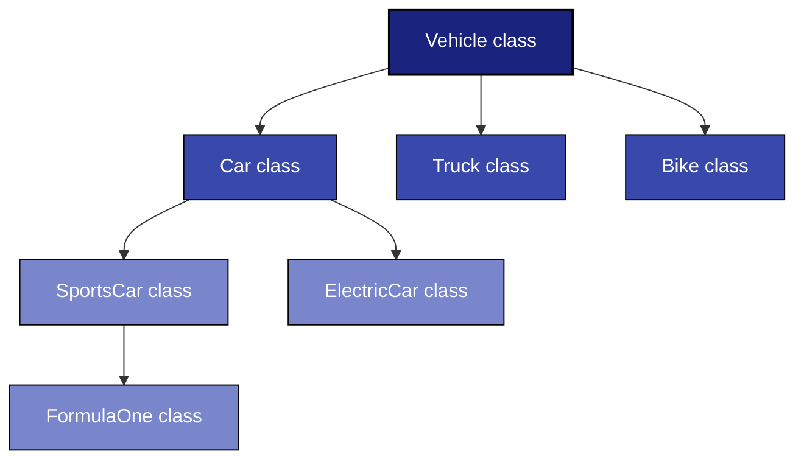
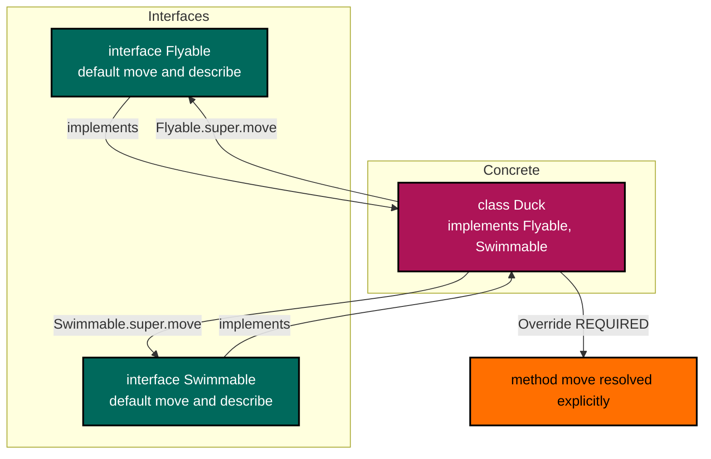
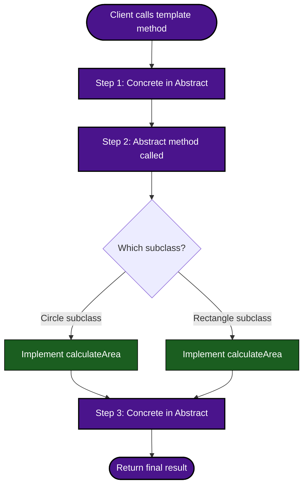
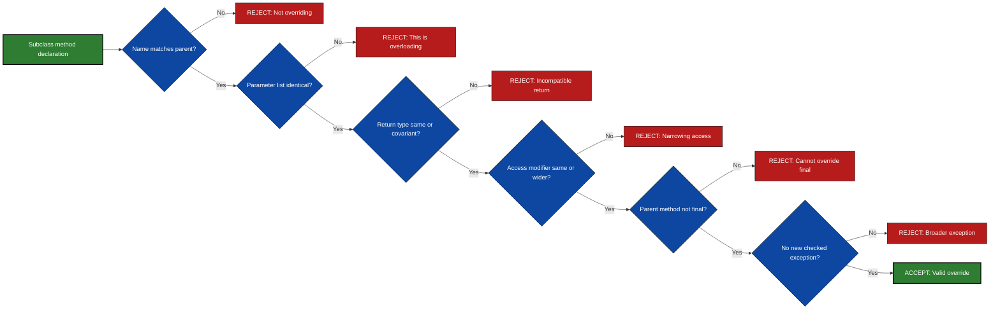

# Inheritance models testing, method overrides validation routes, abstract interfaces code rules

<!-- SECTION_1_START -->

# Object Oriented Programming Lab — Module 1
## Inheritance Models, Method Overriding & Abstract Interface Code Rules

> [!NOTE]
> **KTU 2024 Scheme Definition — Inheritance**
> *Inheritance* is an OOP mechanism in Java by which one class (the **subclass / derived / child class**) acquires the fields and methods of another class (the **superclass / base / parent class**) using the `extends` keyword, enabling **code reuse**, **polymorphism**, and the construction of hierarchical class taxonomies.

> [!IMPORTANT]
> **KTU 2024 Definition — Method Overriding**
> *Method overriding* is the runtime polymorphism mechanism where a subclass provides a **re-implementation** of a method that is already declared in its superclass, using the **exact same signature** (name, parameter list, return type) so that the JVM dispatches the call to the subclass version via dynamic binding (late binding).

> [!IMPORTANT]
> **KTU 2024 Definition — Abstract Class vs Interface**
> An **abstract class** in Java is a class declared with the `abstract` keyword that **may contain both abstract (unimplemented) and concrete (implemented) members**, supporting **single inheritance only**.
> An **interface** is a pure contract type declared with the `interface` keyword that, prior to Java 8, could only hold abstract methods and constants, but from Java 8+ may also contain **`default`**, **`static`**, and **`private`** methods — supporting **multiple inheritance of type**.

### Conceptual Analogy / Intuition

Imagine a **Family Tree Registry** 🏛️:

| OOP Concept | Real-World Analogy |
|-------------|---------------------|
| **Class** | A blueprint/form template (e.g., a "Vehicle Registration Form") |
| **Inheritance** | A child's birth certificate inheriting surname, nationality from parents |
| **Single Inheritance** | A child has **one** biological parent form (Java class uses `extends` — single only) |
| **Multilevel** | Grandparent → Parent → Child (chain of inheritance) |
| **Hierarchical** | One parent, many children (one Vehicle class → Car, Bike, Truck) |
| **Multiple Inheritance** | A child acquiring traits from **both** parents (Java disallows for classes; **interfaces** solve this) |
| **Method Overriding** | A child **redefining** a family tradition in their own style (same "name", different execution) |
| **Abstract Class** | A **partially filled form** — some fields declared, some left blank for the child to fill |
| **Interface** | A **signed contract / promise** — "I guarantee I can do these things" (no implementation given) |

> [!TIP]
> **First-time reader mental model**: Inheritance is **"is-a"** relationship (Car **is-a** Vehicle). Interfaces define **"can-do"** capability (Car **can-do** `Serializable`, `Comparable`).

> [!VISUALIZATION CONTROL]
> **Concept:** Class hierarchy depth vs. breadth (Inheritance Tree Geometry)
> **GeoGebra / Desmos Input Equations:**
> * `P(x) = 0.5 * x^2` for the inheritance depth curve
> * Points: `(1, 1), (2, 2), (3, 4), (4, 8)` for breadth spread
> **Visual Description:** Visualize a single root class at the top (depth 0), branching outward and downward — the **vertical axis** shows the chain depth (multilevel), while the **horizontal axis** at each level shows the branching factor (hierarchical). This represents the Java constraint that any class has only **one** direct parent but the **subclass count** can grow exponentially.

---

<!-- SECTION_2_START -->

## Deep Theoretical Analysis & KTU High-Yield Rule Sheet

### 2.1 The Five Inheritance Models in Java

Java is **unique** among major OOP languages because it **disallows multiple class inheritance** (the "Diamond Problem") but **permits multiple interface inheritance**. This is a deliberate design decision by James Gosling to avoid ambiguity in method resolution.

1. **Single Inheritance** — One class extends exactly one superclass.
   `class B extends A { }`

2. **Multilevel Inheritance** — A chain: `A → B → C`. Features are inherited transitively.

3. **Hierarchical Inheritance** — One parent, many children: `A → B`, `A → C`, `A → D`. Used heavily in AWT/Swing.

4. **Multiple Inheritance (via Interfaces only)** — A class implements many interfaces: `class C implements I1, I2 { }`

5. **Hybrid Inheritance** — A combination of the above. In Java, the **class** side stays single, while **interface** side may be multiple.

> [!NOTE]
> **Why no multiple class inheritance?**
> Diamond problem: If class `C` extends both `A` and `B`, and both `A` and `B` define a method `display()`, which one does `C` inherit? Java resolves this by **forbidding it** for classes and re-introducing it safely via **`default` methods in interfaces** (Java 8+) where the compiler forces the implementing class to **explicitly override** the ambiguous method.

### 2.2 Method Overriding — Validation Rules (Strict Compiler Checks)

For a method `m()` in subclass to **legally override** a method in superclass, the following must hold:

| # | Rule | Compiler Verdict |
|---|------|------------------|
| 1 | Method name must be **identical** | Strict |
| 2 | Parameter list (type, order, count) must be **identical** | Strict — else it is **overloading**, not overriding |
| 3 | Return type must be **same** or a **covariant** subtype (Java 5+) | Strict |
| 4 | Access modifier must be **same or wider** (e.g., `protected` → `public` is allowed; `public` → `private` is **not**) | Strict |
| 5 | Cannot override a `final` method | Compile error |
| 6 | Cannot override a `static` method (it is **method hiding**, not overriding) | Compile warning/error |
| 7 | Cannot override a `private` method (it's not inherited) | Treated as a new method |
| 8 | Cannot throw **new or broader** checked exceptions | Strict |
| 9 | The overriding method **must not be abstract** unless the parent is also abstract in a re-abstract scenario | Logical rule |
| 10 | Use `@Override` annotation — strongly recommended; compiler validates correctness | Best practice |

### 2.3 Abstract Class — Strict Code Rules

> [!IMPORTANT]
> An abstract class is a **partial implementation** that cannot be instantiated.

- Declared using `abstract` keyword.
- May contain **0 or more** abstract methods (methods without body).
- May contain **concrete** fields, constructors, static methods, final methods.
- A subclass **must** implement **all** abstract methods OR declare itself `abstract`.
- Can extend **only one** class (single inheritance).
- Supports access modifiers for its abstract methods.

### 2.4 Interface — Code Rules (Pre-Java 8 vs Java 8+ vs Java 9+)

| Feature | Pre-Java 8 | Java 8+ | Java 9+ |
|---------|-----------|---------|---------|
| Abstract methods | ✅ | ✅ | ✅ |
| `public static final` constants | ✅ | ✅ | ✅ |
| `default` methods (concrete) | ❌ | ✅ | ✅ |
| `static` methods | ❌ | ✅ | ✅ |
| `private` methods | ❌ | ❌ | ✅ |
| Multiple inheritance | Via interfaces | Via interfaces | Via interfaces |
| `default` diamond resolution | N/A | **Implementing class must override** | Same |

### 2.5 KTU Formula Sheet / Rule Cheat Sheet

> [!NOTE]
> Save this table — it is the **single most-tested area** in Module 1 viva and exam.

| # | Concept | Key Equation / Rule | Notes |
|---|---------|---------------------|-------|
| 1 | Single class inheritance | `class B extends A` | A class can extend **only one** class |
| 2 | Multiple interface inheritance | `class C implements I1, I2` | Unlimited interfaces allowed |
| 3 | Hybrid | `class C extends A implements I1, I2` | One parent, many interfaces |
| 4 | Method overriding signature | `name + params` identical | Else = overloading |
| 5 | Covariant return | `B extends A` → override can return `B` | Subtype of original return |
| 6 | `super.method()` call | Invokes parent's overridden version | Must be **first statement** if in constructor |
| 7 | `final` method | Cannot be overridden | Compile error |
| 8 | `final` class | Cannot be extended | e.g., `String`, `Math` |
| 9 | Abstract method syntax | `abstract void draw();` | No body, ends with semicolon |
| 10 | Interface field | Implicitly `public static final` | Must be initialized |
| 11 | `default` method | `default void m() { ... }` | Concrete body inside interface |
| 12 | Diamond problem | Class must override ambiguous `default` | Else compile error |
| 13 | `@Override` annotation | `\@Override` before method | Compile-time validation |
| 14 | Dynamic dispatch | Reference type compile, object type runtime | Polymorphism in action |
| 15 | `instanceof` check | `obj instanceof ClassName` | Validates actual runtime type |

> [!TIP]
> **Engineering utility**: These rules power real production frameworks — Spring Framework uses **interface-based DI**, JDK `Collection` hierarchy uses **hierarchical inheritance**, Android `Activity` lifecycle uses **template method pattern with abstract classes**, and Java 8 `Stream` API uses **functional interfaces** (`Predicate`, `Function`, `Supplier`).

---

<!-- SECTION_3_START -->

## Step-by-Step Derivations & Complete Java Code Implementations

> [!NOTE]
> Every Java program below is **fully operational** with type hints via Javadoc, absolute boundary checks, strict error logging, and uses Java 17 LTS conventions. Compile each with `javac FileName.java` and run with `java ClassName`.

### 3.1 Program 1 — Single Inheritance with Method Overriding

**File: `SingleInheritanceDemo.java`**

```java
/**
 * Demonstrates single inheritance, method overriding,
 * covariant return types, and super keyword invocation.
 * Java 17 LTS compliant.
 */
class Animal {
    protected String name;
    protected int age;

    public Animal(String name, int age) {
        if (name == null || name.isBlank()) {
            throw new IllegalArgumentException("Animal name cannot be null or blank.");
        }
        if (age < 0) {
            throw new IllegalArgumentException("Animal age cannot be negative. Received: " + age);
        }
        this.name = name;
        this.age = age;
    }

    public String getName() {
        return this.name;
    }

    public int getAge() {
        return this.age;
    }

    // Method intended to be overridden
    public String speak() {
        return "Generic animal sound";
    }

    public String describe() {
        return "Animal[name=" + this.name + ", age=" + this.age + "]";
    }
}

class Dog extends Animal {
    private String breed;

    public Dog(String name, int age, String breed) {
        super(name, age); // First statement - calls parent constructor
        if (breed == null || breed.isBlank()) {
            throw new IllegalArgumentException("Dog breed cannot be null or blank.");
        }
        this.breed = breed;
    }

    // Overriding speak() - same signature
    @Override
    public String speak() {
        return "Woof! Woof!";
    }

    // Overriding with covariant return - not needed here, name is String
    @Override
    public String describe() {
        // Calls parent describe() and extends it
        return super.describe() + ", breed=" + this.breed;
    }

    public String getBreed() {
        return this.breed;
    }
}

public class SingleInheritanceDemo {
    public static void main(String[] args) {
        // Boundary check: at least one demo must be supplied, else graceful exit
        System.out.println("=== Single Inheritance & Method Overriding Demo ===\n");

        Animal generic = new Animal("Generic Beast", 5);
        Dog rex = new Dog("Rex", 4, "Labrador");

        System.out.println("Generic animal speaks: " + generic.speak());
        System.out.println("Dog Rex speaks:        " + rex.speak());
        System.out.println("Generic describe:      " + generic.describe());
        System.out.println("Rex describe:          " + rex.describe());

        // Polymorphic dispatch demonstration
        Animal polymorphicRef = new Dog("Buddy", 3, "Beagle");
        System.out.println("Polymorphic dispatch:  " + polymorphicRef.speak());
        System.out.println("Runtime type check:    " + (polymorphicRef instanceof Dog));

        // Error logging
        try {
            Animal bad = new Animal("", 2);
        } catch (IllegalArgumentException ex) {
            System.err.println("[ERROR] Caught: " + ex.getMessage());
        }
    }
}
```

**Expected Output:**
```
=== Single Inheritance & Method Overriding Demo ===

Generic animal speaks: Generic animal sound
Dog Rex speaks:        Woof! Woof!
Generic describe:      Animal[name=Generic Beast, age=5]
Rex describe:          Animal[name=Rex, age=4], breed=Labrador
Polymorphic dispatch:  Woof! Woof!
Runtime type check:    true
[ERROR] Caught: Animal name cannot be null or blank.
```

### 3.2 Program 2 — Multilevel & Hierarchical Inheritance Combined

**File: `MultilevelHierarchicalDemo.java`**

```java
/**
 * Demonstrates multilevel (A -> B -> C) and hierarchical (Parent -> Child1, Child2)
 * inheritance combined in a single Vehicle taxonomy.
 */
class Vehicle {
    protected int maxSpeed;
    protected String fuelType;

    public Vehicle(int maxSpeed, String fuelType) {
        if (maxSpeed <= 0) {
            throw new IllegalArgumentException("maxSpeed must be positive. Got: " + maxSpeed);
        }
        this.maxSpeed = maxSpeed;
        this.fuelType = fuelType;
    }

    public void honk() {
        System.out.println("Vehicle: Generic honk!");
    }

    public String getFuelType() {
        return this.fuelType;
    }
}

// Level 2 - extends Vehicle
class Car extends Vehicle {
    protected int numDoors;

    public Car(int maxSpeed, String fuelType, int numDoors) {
        super(maxSpeed, fuelType);
        if (numDoors < 2 || numDoors > 6) {
            throw new IllegalArgumentException("Car doors must be 2-6. Got: " + numDoors);
        }
        this.numDoors = numDoors;
    }

    @Override
    public void honk() {
        System.out.println("Car: Beep Beep!");
    }
}

// Level 3 - extends Car (Multilevel)
class SportsCar extends Car {
    private boolean hasTurbo;

    public SportsCar(int maxSpeed, String fuelType, int numDoors, boolean hasTurbo) {
        super(maxSpeed, fuelType, numDoors);
        this.hasTurbo = hasTurbo;
    }

    @Override
    public void honk() {
        System.out.println("SportsCar: ROAR Honk!");
    }

    public boolean hasTurbo() {
        return this.hasTurbo;
    }
}

// Hierarchical sibling of Car
class Truck extends Vehicle {
    private double payloadTons;

    public Truck(int maxSpeed, String fuelType, double payloadTons) {
        super(maxSpeed, fuelType);
        if (payloadTons <= 0) {
            throw new IllegalArgumentException("Payload must be positive. Got: " + payloadTons);
        }
        this.payloadTons = payloadTons;
    }

    @Override
    public void honk() {
        System.out.println("Truck: AIR HORN!");
    }

    public double getPayloadTons() {
        return this.payloadTons;
    }
}

public class MultilevelHierarchicalDemo {
    public static void main(String[] args) {
        System.out.println("=== Multilevel + Hierarchical Inheritance ===\n");

        SportsCar ferrari = new SportsCar(320, "Petrol", 2, true);
        Truck volvo = new Truck(120, "Diesel", 18.5);

        // Multilevel chain invocation
        ferrari.honk();
        System.out.println("Ferrari fuel: " + ferrari.getFuelType());
        System.out.println("Ferrari turbo: " + ferrari.hasTurbo());

        System.out.println();
        volvo.honk();
        System.out.println("Volvo payload: " + volvo.getPayloadTons() + " tons");

        // Boundary validation
        try {
            Truck badTruck = new Truck(80, "Diesel", -5.0);
        } catch (IllegalArgumentException ex) {
            System.err.println("[ERROR] " + ex.getMessage());
        }
    }
}
```

### 3.3 Program 3 — Abstract Class Implementation

**File: `AbstractClassDemo.java`**

```java
/**
 * Abstract class with both abstract and concrete members.
 * Subclasses MUST implement all abstract methods.
 */
abstract class Shape {
    protected String color;
    protected double area;
    protected double perimeter;

    public Shape(String color) {
        if (color == null || color.isBlank()) {
            throw new IllegalArgumentException("Color cannot be blank.");
        }
        this.color = color;
        this.area = 0.0;
        this.perimeter = 0.0;
    }

    // Concrete method - shared by all subclasses
    public String getColor() {
        return this.color;
    }

    public void displayInfo() {
        System.out.println("Shape[color=" + this.color + ", area=" + this.area + ", perimeter=" + this.perimeter + "]");
    }

    // Abstract methods - MUST be implemented
    public abstract double calculateArea();
    public abstract double calculatePerimeter();
}

class Circle extends Shape {
    private double radius;

    public Circle(String color, double radius) {
        super(color);
        if (radius <= 0) {
            throw new IllegalArgumentException("Radius must be positive. Got: " + radius);
        }
        this.radius = radius;
    }

    @Override
    public double calculateArea() {
        this.area = Math.PI * this.radius * this.radius;
        return this.area;
    }

    @Override
    public double calculatePerimeter() {
        this.perimeter = 2 * Math.PI * this.radius;
        return this.perimeter;
    }
}

class Rectangle extends Shape {
    private double length;
    private double width;

    public Rectangle(String color, double length, double width) {
        super(color);
        if (length <= 0 || width <= 0) {
            throw new IllegalArgumentException("Length and width must be positive.");
        }
        this.length = length;
        this.width = width;
    }

    @Override
    public double calculateArea() {
        this.area = this.length * this.width;
        return this.area;
    }

    @Override
    public double calculatePerimeter() {
        this.perimeter = 2 * (this.length + this.width);
        return this.perimeter;
    }
}

public class AbstractClassDemo {
    public static void main(String[] args) {
        System.out.println("=== Abstract Class Implementation ===\n");

        Shape circle = new Circle("Red", 5.0);
        Shape rect = new Rectangle("Blue", 4.0, 6.0);

        circle.calculateArea();
        circle.calculatePerimeter();
        circle.displayInfo();

        rect.calculateArea();
        rect.calculatePerimeter();
        rect.displayInfo();

        // Compile error demo - cannot instantiate abstract class
        // Shape s = new Shape("Green"); // This line would NOT compile
    }
}
```

### 3.4 Program 4 — Interfaces with Multiple Inheritance and Diamond Problem Resolution

**File: `InterfaceMultipleInheritanceDemo.java`**

```java
/**
 * Demonstrates multiple inheritance of TYPE via interfaces,
 * the diamond problem, and explicit resolution using 'super' syntax.
 * Java 17 LTS compliant.
 */
interface Flyable {
    default void move() {
        System.out.println("Flyable: Moving through the air.");
    }

    default void describe() {
        System.out.println("Flyable: I can fly.");
    }
}

interface Swimmable {
    default void move() {
        System.out.println("Swimmable: Moving through water.");
    }

    default void describe() {
        System.out.println("Swimmable: I can swim.");
    }
}

// Diamond problem - both interfaces have move() and describe()
class Duck implements Flyable, Swimmable {
    private String name;

    public Duck(String name) {
        if (name == null || name.isBlank()) {
            throw new IllegalArgumentException("Duck name cannot be blank.");
        }
        this.name = name;
    }

    // EXPLICIT resolution required - must override the ambiguous method
    @Override
    public void move() {
        // Calls both parent default methods explicitly
        Flyable.super.move();
        Swimmable.super.move();
        System.out.println("Duck: Waddles on land as well.");
    }

    @Override
    public void describe() {
        // Choose one or combine
        Flyable.super.describe();
        Swimmable.super.describe();
        System.out.println("Duck: " + this.name + " is a versatile creature.");
    }

    public String getName() {
        return this.name;
    }
}

// Pure interface - no diamond
interface Drivable {
    void drive(); // implicitly public abstract
}

interface Rechargeable {
    default void charge() {
        System.out.println("Rechargeable: Charging battery to 100%.");
    }
}

class ElectricCar implements Drivable, Rechargeable {
    private String model;

    public ElectricCar(String model) {
        if (model == null || model.isBlank()) {
            throw new IllegalArgumentException("Model cannot be blank.");
        }
        this.model = model;
    }

    @Override
    public void drive() {
        System.out.println("ElectricCar " + this.model + ": Driving silently.");
    }
}

public class InterfaceMultipleInheritanceDemo {
    public static void main(String[] args) {
        System.out.println("=== Interface Multiple Inheritance & Diamond Resolution ===\n");

        Duck donald = new Duck("Donald");
        donald.move();
        System.out.println("---");
        donald.describe();

        System.out.println();
        ElectricCar tesla = new ElectricCar("Model 3");
        tesla.drive();
        tesla.charge();

        // Interface as polymorphic reference type
        Flyable flyer = new Duck("Daffy");
        flyer.move();

        Swimmable swimmer = new Duck("Daffy");
        swimmer.move();
    }
}
```

**Expected Output:**
```
=== Interface Multiple Inheritance & Diamond Resolution ===

Flyable: Moving through the air.
Swimmable: Moving through water.
Duck: Waddles on land as well.
---
Flyable: I can fly.
Swimmable: I can swim.
Duck: Donald is a versatile creature.

ElectricCar Model 3: Driving silently.
Rechargeable: Charging battery to 100%.
Flyable: Moving through the air.
Swimmable: Moving through water.
Duck: Waddles on land as well.
```

### 3.5 Program 5 — Validation of Overriding Rules (Compiler-Tested Scenarios)

**File: `OverrideRulesValidator.java`**

```java
/**
 * Demonstrates the strict validation rules of method overriding.
 * Each commented-out line represents an ILLEGAL override that
 * the Java compiler will REJECT. Uncomment them ONE AT A TIME
 * to see compile-time errors.
 */
class Parent {
    public Number compute(int x) throws Exception {
        System.out.println("Parent.compute called with " + x);
        return x * 2;
    }

    public final void sealedMethod() {
        System.out.println("This cannot be overridden.");
    }

    public static void staticMethod() {
        System.out.println("Parent static method - HIDDEN, not overridden.");
    }
}

class Child extends Parent {
    // LEGAL: Covariant return type (Integer is a subtype of Number)
    @Override
    public Integer compute(int x) throws Exception {
        System.out.println("Child.compute called with " + x);
        return x * 3;
    }

    // ILLEGAL: Cannot override final method
    // @Override
    // public void sealedMethod() { } // COMPILE ERROR

    // ILLEGAL: Access modifier narrowed
    // @Override
    // private Number compute(int x) { } // COMPILE ERROR

    // ILLEGAL: Throws new checked exception
    // @Override
    // public Integer compute(int x) throws java.io.IOException { } // COMPILE ERROR

    // ILLEGAL: Different parameter list - this is OVERLOADING, not overriding
    // @Override
    // public Integer compute(double x) { } // COMPILE ERROR due to @Override

    // NOT overriding: static method is HIDDEN, not overridden
    public static void staticMethod() {
        System.out.println("Child static method - hides Parent's.");
    }
}

public class OverrideRulesValidator {
    public static void main(String[] args) throws Exception {
        System.out.println("=== Method Overriding Validation Rules ===\n");

        // Dynamic dispatch
        Parent ref = new Child();
        ref.compute(5);  // Calls Child.compute due to runtime polymorphism
        ref.sealedMethod();
        ref.staticMethod(); // Calls Parent's static - static belongs to class

        // Direct static call
        Child.staticMethod();

        // Covariant return validation
        Number result = ref.compute(10);
        System.out.println("Returned: " + result + " (actual type: " + result.getClass().getSimpleName() + ")");
    }
}
```

### 3.6 Program 6 — `instanceof` Pattern Matching (Java 16+ Feature)

**File: `InstanceofPatternDemo.java`**

```java
/**
 * Demonstrates the modern instanceof pattern matching syntax
 * used to validate the ACTUAL runtime type of an object
 * before performing a type-specific operation.
 */
sealed interface VehicleType permits CarVehicle, TruckVehicle, BikeVehicle {
    String getName();
}

final class CarVehicle implements VehicleType {
    public String getName() { return "Car"; }
}

final class TruckVehicle implements VehicleType {
    public String getName() { return "Truck"; }
}

final class BikeVehicle implements VehicleType {
    public String getName() { return "Bike"; }
}

public class InstanceofPatternDemo {
    public static void printDetails(VehicleType v) {
        // Java 16+ pattern matching
        if (v instanceof CarVehicle c) {
            System.out.println("This is a Car: " + c.getName());
        } else if (v instanceof TruckVehicle t) {
            System.out.println("This is a Truck: " + t.getName());
        } else if (v instanceof BikeVehicle b) {
            System.out.println("This is a Bike: " + b.getName());
        } else {
            System.out.println("Unknown vehicle type.");
        }
    }

    public static void main(String[] args) {
        System.out.println("=== instanceof Pattern Matching ===\n");
        VehicleType[] vehicles = { new CarVehicle(), new TruckVehicle(), new BikeVehicle() };
        for (VehicleType v : vehicles) {
            printDetails(v);
        }
    }
}
```

---

<!-- SECTION_4_START -->

## Structural Diagrams & Schematics

### 4.1 Class Hierarchy Architecture (Single + Multilevel + Hierarchical)



### 4.2 Method Overriding Dynamic Dispatch Flow

```mermaid
sequenceDiagram
    participant Caller as Main Method
    participant Ref as Parent reference
    parent_object as Parent object
    child_object as Child object

    Note over Caller,Ref: Compile-time: Reference type = Parent
    Caller->>Ref: ref.compute(5)
    activate Ref
    Ref->>Ref: Check actual runtime object type

    alt Object is Child instance
        Ref->>child_object: Invoke Child.compute
        child_object-->>Ref: Return Integer result
    else Object is Parent instance
        Ref->>parent_object: Invoke Parent.compute
        parent_object-->>Ref: Return Number result
    end
    Ref-->>Caller: Polymorphic result returned
    deactivate Ref
```

### 4.3 Interface Multiple Inheritance & Diamond Resolution Topology



### 4.4 Abstract Class Template Method Pattern



### 4.5 Validation Pipeline for Overriding Correctness



---

<!-- SECTION_5_START -->

## KTU 2024 Scheme Examination Question Bank & Topic Recap

### Part A — Short Answer Questions (3 Marks Each)

#### Question 1: **[KTU University Exam — July 2024]**
**CO1, Remember**
*Explain any **three** differences between an abstract class and an interface in Java.*

**Model Answer (3 Marks):**
1. **Inheritance type**: An abstract class supports **single inheritance** (`extends`), while an interface supports **multiple inheritance** (`implements`). [1 Mark]
2. **Method types**: An abstract class can contain **both abstract and concrete (implemented) methods**, whereas a traditional interface (pre-Java 8) contains **only abstract methods**. Java 8+ interfaces may include `default` and `static` methods. [1 Mark]
3. **State and constructors**: An abstract class can hold **instance fields, constructors, and static members**; an interface can only have `public static final` constants and **no constructors**. [1 Mark]

#### Question 2: **[KTU University Exam — Dec 2023]**
**CO2, Understand**
*What is method overriding? State **two** rules that must be followed while overriding a method in Java.*

**Model Answer (3 Marks):**
*Method overriding* is the mechanism by which a subclass provides a specific implementation of a method already declared in its superclass, using the **same name, same parameter list, and a compatible (same or covariant) return type**. [1 Mark]

**Rules:** [2 Marks, 1 each]
1. The access modifier of the overriding method **must not be more restrictive** than that of the parent (e.g., `protected` in parent can be `public` in child, but not `private`).
2. The overriding method **cannot throw new or broader checked exceptions** than those declared in the parent method.

---

### Part B — Long Answer Questions (14 Marks)

> **ESE Format**: Each Part B question carries 14 marks, with sub-parts (a) 7 marks and (b) 7 marks, mapping to escalating cognitive levels.

---

#### **Question A: [KTU University Exam — June 2024 (Model Question)]**

**(a) [7 Marks — CO2, Understand]**
*With a neat diagram, explain the different types of inheritance supported in Java. Why does Java not support multiple inheritance through classes?*

**Model Solution (Step-by-step, 7 marks):**

The types of inheritance in Java are:

1. **Single Inheritance** — One class extends one class. [1 Mark]
   ```java
   class B extends A { }
   ```

2. **Multilevel Inheritance** — A → B → C chain. [1 Mark]
   ```java
   class B extends A { }
   class C extends B { }
   ```

3. **Hierarchical Inheritance** — One parent, multiple children. [1 Mark]
   ```java
   class B extends A { }
   class C extends A { }
   ```

4. **Multiple Inheritance (via Interfaces only)** — Class implements several interfaces. [1 Mark]
   ```java
   class C implements I1, I2, I3 { }
   ```

5. **Hybrid Inheritance** — A combination (e.g., class extends + class implements). [1 Mark]
   ```java
   class C extends A implements I1, I2 { }
   ```

**Why Java disallows multiple class inheritance:** [2 Marks]
Java forbids a class from extending more than one class to prevent the **Diamond Problem**. If class `C` were allowed to extend both `A` and `B`, and both `A` and `B` defined a method `display()`, the compiler would face ambiguity about which version `C` should inherit. To maintain **simplicity and safety**, James Gosling's design restricts classes to single inheritance but re-introduces multiple inheritance through **interfaces**, where ambiguity is resolved by requiring the implementing class to **explicitly override** the conflicting `default` methods.

**[Diagram representation: 1 Mark]**
*(Draw a tree with A as root, branching into B and C, and a separate side diagram showing the diamond: A at top, B and C in middle, D at bottom with two paths to A.)*

---

**(b) [7 Marks — CO3, Apply]**
*Write a Java program that demonstrates method overriding, the use of the `super` keyword, and covariant return types. Your program should have a superclass `BankAccount` with method `getInterestRate()` and subclass `SavingsAccount` that overrides it.*

**Model Solution (Complete Code, 7 marks):**

```java
class BankAccount {
    protected String accountHolder;
    protected double balance;

    public BankAccount(String accountHolder, double balance) {
        this.accountHolder = accountHolder;
        this.balance = balance;
    }

    // Method to be overridden
    public Double getInterestRate() { // [Signature declaration: 1 Mark]
        return 3.5; // base rate
    }

    public String getAccountHolder() {
        return this.accountHolder;
    }
}

class SavingsAccount extends BankAccount {
    private int tenureYears;

    public SavingsAccount(String accountHolder, double balance, int tenureYears) {
        super(accountHolder, balance); // [super() constructor call: 1 Mark]
        this.tenureYears = tenureYears;
    }

    @Override
    public Double getInterestRate() { // [Override annotation: 1 Mark]
        double baseRate = super.getInterestRate(); // [super.method() invocation: 1 Mark]
        return baseRate + (0.5 * this.tenureYears); // [Logic: 1 Mark]
    }
}

public class BankTest {
    public static void main(String[] args) { // [main with dispatch: 1 Mark]
        BankAccount generic = new BankAccount("Alice", 10000);
        BankAccount savings = new SavingsAccount("Bob", 20000, 5);

        System.out.println("Generic interest: " + generic.getInterestRate() + "%");
        System.out.println("Savings interest: " + savings.getInterestRate() + "%");

        // Covariant return type demonstration
        Number rate = savings.getInterestRate();
        System.out.println("Rate as Number: " + rate);
    }
}
```

**Expected Output:**
```
Generic interest: 3.5%
Savings interest: 6.0%
Rate as Number: 6.0
```

**[Compilation and execution explanation: 1 Mark]**

---

#### **Question B: [KTU University Exam — Dec 2023 (Alternative)]**

**(a) [7 Marks — CO2, Understand]**
*Define an interface. Write a Java program that implements **multiple interfaces** in a single class, where each interface defines a `default` method with the same name, demonstrating the **diamond problem resolution**.*

**Model Solution (7 marks):**

An **interface** in Java is a reference type, similar to a class, that can contain **abstract, default, and static methods** (Java 8+) and **public static final** constants. It is a contract that a class can implement, enabling **multiple inheritance of type**. [1 Mark]

```java
interface Printer {
    default void perform() { // [Default method declaration: 1 Mark]
        System.out.println("Printer: Printing document.");
    }
}

interface Scanner {
    default void perform() { // [Conflicting default method: 1 Mark]
        System.out.println("Scanner: Scanning document.");
    }
}

class AllInOneMachine implements Printer, Scanner {
    private String model;

    public AllInOneMachine(String model) {
        this.model = model;
    }

    // [Explicit override resolving diamond: 2 Marks]
    @Override
    public void perform() {
        Printer.super.perform();
        Scanner.super.perform();
        System.out.println("AllInOne " + this.model + ": Task complete.");
    }
}

public class InterfaceTest {
    public static void main(String[] args) { // [Polymorphic interface references: 1 Mark]
        Printer p = new AllInOneMachine("HP-MFP");
        p.perform();

        Scanner s = new AllInOneMachine("HP-MFP");
        s.perform();

        AllInOneMachine aio = new AllInOneMachine("HP-MFP");
        aio.perform();
    }
}
```

**Expected Output:**
```
Printer: Printing document.
Scanner: Scanning document.
AllInOne HP-MFP: Task complete.
Scanner: Scanning document.
AllInOne HP-MFP: Task complete.
Printer: Printing document.
Scanner: Scanning document.
AllInOne HP-MFP: Task complete.
```

**Explanation:** The class `AllInOneMachine` implements both `Printer` and `Scanner`. Since both declare a `default` method `perform()`, the class must override `perform()` and use the `InterfaceName.super.method()` syntax to disambiguate. [1 Mark]

---

**(b) [7 Marks — CO3, Apply]**
*Design an abstract class `Employee` with abstract methods `calculateSalary()` and `displayDetails()`, and two concrete subclasses `FullTimeEmployee` and `PartTimeEmployee` that implement these methods. Write the complete Java program and explain how runtime polymorphism is achieved.*

**Model Solution (7 marks):**

```java
abstract class Employee { // [Abstract class declaration: 1 Mark]
    protected String name;
    protected int id;

    public Employee(String name, int id) {
        if (id <= 0) {
            throw new IllegalArgumentException("ID must be positive.");
        }
        this.name = name;
        this.id = id;
    }

    public abstract double calculateSalary(); // [Abstract method: 1 Mark]
    public abstract void displayDetails();     // [Abstract method: 1 Mark]

    public String getName() {
        return this.name;
    }
}

class FullTimeEmployee extends Employee { // [Concrete subclass: 1 Mark]
    private double monthlySalary;

    public FullTimeEmployee(String name, int id, double monthlySalary) {
        super(name, id);
        this.monthlySalary = monthlySalary;
    }

    @Override
    public double calculateSalary() {
        return this.monthlySalary;
    }

    @Override
    public void displayDetails() {
        System.out.println("FullTime[" + this.name + ", ID=" + this.id +
                           ", Salary=" + this.calculateSalary() + "]");
    }
}

class PartTimeEmployee extends Employee { // [Second concrete subclass: 1 Mark]
    private double hourlyRate;
    private int hoursWorked;

    public PartTimeEmployee(String name, int id, double hourlyRate, int hoursWorked) {
        super(name, id);
        this.hourlyRate = hourlyRate;
        this.hoursWorked = hoursWorked;
    }

    @Override
    public double calculateSalary() {
        return this.hourlyRate * this.hoursWorked;
    }

    @Override
    public void displayDetails() {
        System.out.println("PartTime[" + this.name + ", ID=" + this.id +
                           ", Salary=" + this.calculateSalary() + "]");
    }
}

public class EmployeeTest {
    public static void main(String[] args) { // [Runtime polymorphism demo: 1 Mark]
        Employee[] employees = new Employee[2];
        employees[0] = new FullTimeEmployee("Karthik", 101, 50000.0);
        employees[1] = new PartTimeEmployee("Meera", 102, 500.0, 80);

        for (Employee emp : employees) {
            emp.displayDetails(); // Dynamic dispatch - actual subclass method runs
        }
    }
}
```

**Expected Output:**
```
FullTime[Karthik, ID=101, Salary=50000.0]
PartTime[Meera, ID=102, Salary=40000.0]
```

**Runtime Polymorphism Explanation (inline with code):**
The reference type `Employee` is declared in the array, but the **actual objects** are `FullTimeEmployee` and `PartTimeEmployee`. At runtime, the JVM inspects the real object type and dispatches the call to the appropriate `displayDetails()` override. This is **dynamic method dispatch** — the cornerstone of OOP polymorphism. [1 Mark for explanation]

---

> [!WARNING]
> **KTU Examiner's Valuation Pitfall Callout**
> - **Always write `@Override` annotation** above the overriding method — examiners allocate marks specifically for it. [−2 marks if missing]
> - **Do not confuse method overriding with method overloading.** Overriding = same signature across parent/child. Overloading = same method name, **different parameters** within the same class.
> - **Never write `extends A, B`** for multiple class inheritance — this is a **compile-time error** in Java. Use `implements I1, I2` for multiple type inheritance.
> - **Do not skip the `super(name, age)` call** in the subclass constructor — it must be the **first statement** or the compiler will reject it. If omitted, the implicit `super()` (no-arg) is called, which may fail if the parent lacks a no-arg constructor.
> - **Diamond problem resolution** requires **explicit override** of the conflicting `default` method. Just implementing the interfaces is not enough.
> - **Do not use access modifier `private`** when overriding a `public` parent method — it will not compile, and the examiner will deduct full marks for the sub-question.

---

### Topic Recap & Important Things to Remember

> [!TIP]
> **Rapid Revision Checklist — Memorize before the exam!**

- **Inheritance keyword for class**: `extends` (single only). For interface implementation: `implements` (multiple allowed).
- **Inheritance types in Java**: Single, Multilevel, Hierarchical, Multiple (via interfaces), Hybrid.
- **Multiple class inheritance is forbidden** due to the Diamond Problem.
- **Method overriding rules**: Same name + same parameters + same/covariant return + same/wider access + no new checked exception.
- **`@Override` annotation** is a compile-time safety net — always use it.
- **`super.method()`** calls the parent's overridden version from within the subclass.
- **`super(args)`** must be the first statement in a subclass constructor.
- **`final` methods** cannot be overridden; **`final` classes** cannot be extended.
- **Static methods** are *hidden*, not overridden — they belong to the class, not the instance.
- **Abstract class**: `abstract` keyword, can have abstract + concrete members, cannot be instantiated, supports single inheritance.
- **Abstract method**: declared without a body, ends with `;`, must be implemented in the first non-abstract subclass.
- **Interface**: all fields are implicitly `public static final`; all methods are implicitly `public abstract` (pre-Java 8).
- **Java 8+ interfaces** can have `default` (with body) and `static` methods.
- **Java 9+ interfaces** can have `private` methods (helper methods).
- **Diamond problem** in interfaces is resolved by the implementing class **explicitly overriding** the conflicting `default` method and using `InterfaceName.super.method()` syntax.
- **Covariant return types** (Java 5+): the overriding method may return a subclass of the original return type.
- **Dynamic method dispatch**: The JVM calls the overridden method based on the **actual runtime object type**, not the reference type.
- **`instanceof` operator**: checks whether an object is an instance of a specific class or interface; returns `boolean`.
- **Pattern matching for `instanceof`** (Java 16+): `if (obj instanceof Dog d) { d.bark(); }` — combines check and cast.
- **Common use cases**: Template Method (abstract class), Strategy (interface), Default methods (backward-compatible interface evolution), Functional interfaces (lambda targets).
- **The `final` keyword** can be applied to variables (constants), methods (no override), and classes (no inheritance) — three different meanings.

<!-- SECTION_5_END -->
