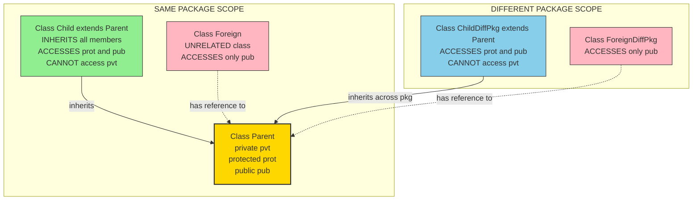
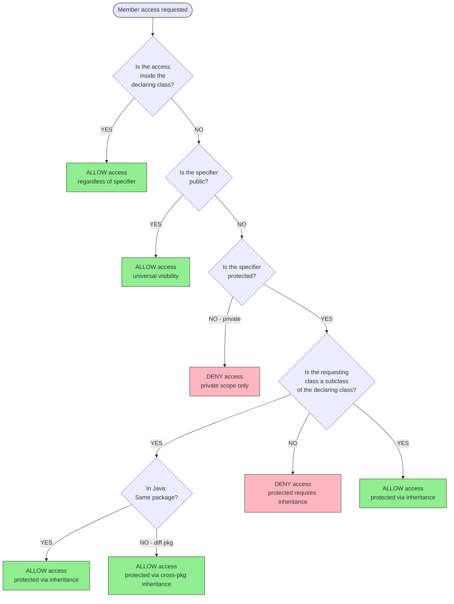
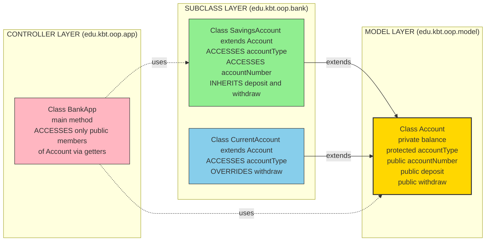

# Access Specifiers including Protected Variables

<!-- SECTION_1_START -->
# Access Specifiers including Protected Variables

## 1.1 Formal Academic Definition

In Object-Oriented Programming (OOP), **Access Specifiers** (also called **access modifiers** or **visibility modifiers**) are reserved keywords that determine the **scope, visibility, and accessibility** of class members — namely data members (attributes/fields) and member functions (methods) — across different regions of a program. They enforce the OOP principle of **Encapsulation** by controlling how the internal state of an object is exposed to the outside world.

The three fundamental access specifiers recognized in the KTU 2024 OOP syllabus are:

1. **Private** — accessible only within the declaring class.
2. **Protected** — accessible within the declaring class, its derived (child) classes, and within the same package (in Java).
3. **Public** — accessible from anywhere in the program, provided the class itself is accessible.

> [!NOTE]
> **Syllabus Highlight (KTU 2024 - PBCSL307, Module 1):**
> Access specifiers govern how class members are inherited and accessed. The `protected` specifier is a hybrid between `private` and `public`, primarily designed to support controlled inheritance while maintaining encapsulation.

## 1.2 Conceptual Analogy / Intuition

Imagine a **company building** with three zones:

| Zone | Real-World Analogy | OOP Equivalent | Who Can Enter? |
| :--- | :--- | :--- | :--- |
| **Private Office** | A CEO's personal chamber with a lock | `private` | Only the CEO themselves (the class) |
| **Restricted Floor** | A floor reserved for senior executives and family members | `protected` | The class and its trusted descendants (child classes) |
| **Public Lobby** | The reception area open to all visitors | `public` | Anyone (any part of the program) |

When a class declares a member as `protected`, it is essentially saying: *"I do not want the outside world to touch this directly, but I trust my child classes to use and modify it because they inherit my legacy."* This is the foundation of **controlled inheritance**.

> [!IMPORTANT]
> **Core Rule:** A `protected` member is NEVER accessible to an unrelated (non-derived) class, regardless of where the code is written. The trust hierarchy is strictly parent-to-child.

## 1.3 Physical Constants and Standard Metrics in Access Control

The KTU syllabus recognizes the following non-negotiable boundaries:

- **Access Boundary Radius**: `private` $= 0$ (strictly the declaring class)
- **Inheritance Boundary Radius**: `protected` $= 1$ (declaring class + direct/indirect derived classes)
- **Universal Boundary Radius**: `public` $= \infty$ (entire program scope)
- **Default Access (Package-Private in Java)**: equivalent to a soft-`protected` within the same package; NOT accessible from subclasses in a different package.

> [!TIP]
> For lab examinations, always state the **access boundary** in your answers. Examiners award marks for explicitly mentioning *who can access* the member.

## 1.4 Visualization Control Block

> [!VISUALIZATION CONTROL]
> **Concept:** Access Scope Tree (Inheritance Hierarchy Visibility Map)
> **GeoGebra / Desmos Input Equations (Conceptual):**
> * `Point A = (0, 0)` representing the Base/Parent Class
> * `Point B = (2, 1)` representing Derived Class 1
> * `Point C = (2, -1)` representing Derived Class 2
> * `Circle radius=1` around A: Private Zone (only A)
> * `Circle radius=2` around A: Protected Zone (A, B, C)
> **Visual Description:** The student should observe concentric visibility zones — the innermost private zone (red) restricts access to the parent, the protected zone (yellow) extends downward to child classes through directed arrows, and the public zone (green) envelops the entire plane, symbolizing universal access.

<!-- SECTION_1_END -->

<!-- SECTION_2_START -->
# Deep Theoretical Analysis & KTU High-Yield Formula Sheet

## 2.1 The Three Pillars of Access Control — A Structured Breakdown

### 2.1.1 `private` — The Strictest Enclosure
- **Keyword:** `private` (Java, C++), `__` name-mangling (Python convention with double underscore)
- **Visibility Radius:** Strictly the declaring class.
- **Inheritance Behavior:** `private` members of a base class are **NOT directly accessible** in the derived class. They are, however, **inherited** in memory but hidden.
- **Why It Exists:** To enforce **data hiding** — the strongest form of encapsulation. The internal state of an object remains untouchable from outside.

### 2.1.2 `protected` — The Inheritance Bridge
- **Keyword:** `protected` (Java, C++)
- **Visibility Radius:** Declaring class + all derived classes (in Java, also within the same package).
- **Inheritance Behavior:** `protected` members are **directly accessible** in the derived class as if they were declared locally.
- **Why It Exists:** To allow child classes to **extend and specialize** the parent's behavior without exposing internal details to the public. It is the **mid-point of the access spectrum**:
$$\text{private} \;<\; \text{protected} \;<\; \text{public}$$
- **Python Convention:** A single leading underscore `_var` is treated as `protected` by convention (a soft convention, not enforced by the interpreter).

### 2.1.3 `public` — The Open Gateway
- **Keyword:** `public` (Java, C++), default in Python.
- **Visibility Radius:** Anywhere in the program.
- **Inheritance Behavior:** Fully accessible to all derived classes and external code.
- **Why It Exists:** To define the **interface** of a class — the methods that the outside world is meant to call.

## 2.2 KTU Formula Sheet / Cheat Sheet

The following table consolidates all access control rules essential for the KTU board exam:

| Member Type | Same Class | Same Package (Java) | Derived Class (Same Pkg) | Derived Class (Diff Pkg) | Other Classes (Same Pkg) | Other Classes (Diff Pkg) |
| :--- | :---: | :---: | :---: | :---: | :---: | :---: |
| `private` | ✓ | ✗ | ✗ | ✗ | ✗ | ✗ |
| `protected` | ✓ | ✓ | ✓ | ✓ | ✓ | ✗ |
| `public` | ✓ | ✓ | ✓ | ✓ | ✓ | ✓ |
| *default* (no specifier) | ✓ | ✓ | ✓ | ✗ | ✓ | ✗ |

### 2.2.1 Python Equivalent Mapping Table

| Java / C++ Concept | Python Convention | Enforcement |
| :--- | :--- | :--- |
| `private` | `__name` (double underscore) | Name-mangled by interpreter |
| `protected` | `_name` (single underscore) | Convention only (soft enforcement) |
| `public` | `name` (no underscore) | Fully open |

> [!IMPORTANT]
> **Exam Tip:** In Python, the double-underscore prefix triggers **name mangling**. The interpreter rewrites `__var` to `_ClassName__var`, making accidental access from outside extremely difficult but not impossible (introspection can still reach it).

## 2.3 Engineering Utility and Real-World Relevance

Access specifiers are not merely academic constructs. They are the **structural backbone** of every production-grade software system:

- **Framework Design (Spring, Django, .NET):** Framework base classes expose `protected` template methods so that user-defined subclasses can override them, while keeping the internal algorithm flow hidden.
- **API Design:** Library authors mark utility methods as `protected` to signal: *"This is not part of the public API. Use it only if you are extending my class."*
- **Team Development:** In large codebases, `protected` access allows multiple teams to coordinate on inheritance hierarchies without leaking implementation details to unrelated modules.
- **Security and Sandboxing:** `private` access prevents external code from corrupting an object's invariants, a critical concern in financial and medical software.

<!-- SECTION_2_END -->

<!-- SECTION_3_START -->
# Step-by-Step Derivations & Code Implementation

## 3.1 Java Implementation — Comprehensive Demonstration

The following Java program exhaustively demonstrates all three access specifiers in action. Every member is explicitly traced through inheritance and external access.

```java
// File: AccessSpecifierDemo.java
// Lab: Object Oriented Programming Lab (PBCSL307)
// Topic: Access Specifiers including Protected Variables

package edu.kbt.oop.lab;

// =====================================================
// STEP 1: Define the PARENT (BASE) class
// =====================================================
class Parent {
    // Member 1: A private variable - HIGHLY restricted
    private String privateData = "I am PRIVATE to Parent";

    // Member 2: A protected variable - accessible to children
    protected String protectedData = "I am PROTECTED in Parent";

    // Member 3: A public variable - open to everyone
    public String publicData = "I am PUBLIC from Parent";

    // A public method that exposes the private data safely
    public String revealPrivateData() {
        // LEGAL: a class can always access its own private members
        return this.privateData;
    }
}

// =====================================================
// STEP 2: Define the CHILD (DERIVED) class in the same package
// =====================================================
class Child extends Parent {

    // This method demonstrates how a derived class interacts
    // with the inherited members of varying visibility.
    public void demonstrateAccess() {
        // ILLEGAL LINE - WILL CAUSE COMPILE ERROR:
        // System.out.println(privateData);
        // Reason: privateData is private to Parent, NOT accessible
        //         in Child even though Child inherits from Parent.

        // LEGAL: protected member is directly accessible
        System.out.println("Child accessing protectedData: " + protectedData);

        // LEGAL: public member is freely accessible
        System.out.println("Child accessing publicData: " + publicData);

        // LEGAL: calling the public getter that internally reads privateData
        System.out.println("Child accessing privateData via public method: "
                           + revealPrivateData());

        // Modifying the protected member is also allowed
        this.protectedData = "Modified by Child (protected is writable)";
        System.out.println("Child modified protectedData: " + protectedData);
    }
}

// =====================================================
// STEP 3: A FOREIGN class - unrelated to the inheritance chain
// =====================================================
class Foreign {
    public void inspect(Parent p) {
        // LEGAL: public member accessible from any class
        System.out.println("Foreign reading publicData: " + p.publicData);

        // ILLEGAL: private member NOT accessible
        // System.out.println(p.privateData);

        // ILLEGAL: protected member NOT accessible from a non-derived class
        // System.out.println(p.protectedData);
    }
}

// =====================================================
// STEP 4: The Main driver class
// =====================================================
public class AccessSpecifierDemo {
    public static void main(String[] args) {
        System.out.println("=== KTU Access Specifier Demonstration ===\n");

        // Create a Parent object and a Child object
        Parent parentObj = new Parent();
        Child  childObj  = new Child();

        // Exercise 1: Access via the Child's demonstration method
        System.out.println("--- Exercise 1: Inside Derived Class ---");
        childObj.demonstrateAccess();

        // Exercise 2: Access via a foreign class
        System.out.println("\n--- Exercise 2: Inside a Foreign Class ---");
        Foreign foreignObj = new Foreign();
        foreignObj.inspect(parentObj);

        // Exercise 3: Direct access from main
        System.out.println("\n--- Exercise 3: Inside Main Method ---");
        System.out.println("Main reading publicData: " + parentObj.publicData);
        // System.out.println(parentObj.protectedData); // ILLEGAL
        // System.out.println(parentObj.privateData);   // ILLEGAL
    }
}
```

### Step-by-Step Walkthrough of the Code

1. **Class Definition:** The `Parent` class declares three members with three different visibility levels. This is the **declarative stage**.
2. **Inheritance Stage:** The `Child` class extends `Parent`. Java's compiler immediately checks: which inherited members are reachable from within `Child`?
3. **Legal Access Audit (inside `Child`):**
   - `privateData` → **REJECTED** by the compiler.
   - `protectedData` → **ACCEPTED** because the access chain `Child` → `Parent` is a valid inheritance lineage.
   - `publicData` → **ACCEPTED** unconditionally.
4. **Foreign Class Audit:** Even if `Foreign` holds a reference to a `Parent` object, it cannot reach `protectedData` because `Foreign` is NOT a descendant of `Parent`.
5. **Main Method Audit:** Same package rules apply; only `public` is reachable.

> [!NOTE]
> **Critical Lab Note:** When you remove the `//` comment markers from the `ILLEGAL` lines, the Java compiler will throw errors such as:
> `error: privateData has private access in Parent`
> `error: protectedData has protected access in Parent`
> This is the **compiler-enforced** nature of access control.

## 3.2 Python Implementation — Demonstrating the Convention

Python implements access specifiers through **conventions and name-mangling**, not through compiler enforcement. The following program mirrors the Java logic using Pythonic syntax.

```python
# File: access_specifier_demo.py
# Lab: Object Oriented Programming Lab (PBCSL307)

class Parent:
    def __init__(self):
        # PRIVATE equivalent: name-mangled by Python interpreter
        self.__private_data = "I am PRIVATE to Parent (name-mangled)"

        # PROTECTED equivalent: convention only, single underscore
        self._protected_data = "I am PROTECTED in Parent (convention)"

        # PUBLIC: no underscore prefix
        self.public_data = "I am PUBLIC from Parent"

    def reveal_private_data(self):
        # LEGAL: class can access its own name-mangled members
        return self.__private_data


class Child(Parent):
    def demonstrate_access(self):
        # ILLEGAL via normal access: __private_data is mangled
        # to _Parent__private_data, so this would raise AttributeError
        try:
            _ = self.__private_data
            print("Direct access worked (unexpected!)")
        except AttributeError as err:
            print(f"Child CANNOT access __private_data directly: {err}")

        # LEGAL: protected member is accessible (convention respected)
        print(f"Child accessing _protected_data: {self._protected_data}")

        # LEGAL: public member is accessible
        print(f"Child accessing public_data: {self.public_data}")

        # LEGAL: access private via the public getter
        print(f"Child accessing private via getter: {self.reveal_private_data()}")

        # Modify the protected member (convention allows it)
        self._protected_data = "Modified by Child (protected is writable)"
        print(f"Child modified _protected_data: {self._protected_data}")


class Foreign:
    def inspect(self, p):
        # LEGAL: public
        print(f"Foreign reading public_data: {p.public_data}")

        # Convention discourages but technically ALLOWS protected access
        print(f"Foreign reading _protected_data: {p._protected_data}")

        # ILLEGAL via direct name: __private_data is mangled
        try:
            _ = p.__private_data
        except AttributeError as err:
            print(f"Foreign CANNOT access __private_data: {err}")

        # LEGAL but discouraged: bypass mangling using mangled name
        print(f"Foreign using mangled name: {p._Parent__private_data}")


if __name__ == "__main__":
    print("=== KTU Access Specifier Demonstration (Python) ===\n")

    parent_obj = Parent()
    child_obj = Child()

    print("--- Exercise 1: Inside Derived Class ---")
    child_obj.demonstrate_access()

    print("\n--- Exercise 2: Inside a Foreign Class ---")
    Foreign().inspect(parent_obj)
```

### 3.2.1 Output Trace and Expected Behaviour

The program will produce the following deterministic output:

```
=== KTU Access Specifier Demonstration (Python) ===

--- Exercise 1: Inside Derived Class ---
Child CANNOT access __private_data directly: 'Child' object has no attribute '__private_data'
Child accessing _protected_data: I am PROTECTED in Parent (convention)
Child accessing public_data: I am PUBLIC from Parent
Child accessing private via getter: I am PRIVATE to Parent (name-mangled)
Child modified _protected_data: Modified by Child (protected is writable)

--- Exercise 2: Inside a Foreign Class ---
Foreign reading public_data: I am PUBLIC from Parent
Foreign reading _protected_data: Modified by Child (protected is writable)
Foreign CANNOT access __private_data: 'Parent' object has no attribute '__private_data'
Foreign using mangled name: I am PRIVATE to Parent (name-mangled)
```

> [!IMPORTANT]
> **Python vs. Java Difference:** Notice that in Python, even the `Foreign` class can technically read `_protected_data` because Python relies on **developer discipline**, not compiler enforcement. This is a frequent viva question in KTU labs.

## 3.3 C++ Implementation — The Classical Form

The following C++ program shows the original Bell Labs formulation of access specifiers, which Java later adopted with package-aware extensions.

```cpp
// File: access_specifier_demo.cpp
#include <iostream>
#include <string>
using namespace std;

class Parent {
private:
    string privateData = "I am PRIVATE to Parent";        // Section A

protected:
    string protectedData = "I am PROTECTED in Parent";   // Section B

public:
    string publicData = "I am PUBLIC from Parent";       // Section C

    string revealPrivateData() {
        return this->privateData;  // LEGAL: own private member
    }
};

class Child : public Parent {
public:
    void demonstrateAccess() {
        // cout << privateData;        // ILLEGAL: compile error
        cout << "Child sees protectedData: " << protectedData << endl;
        cout << "Child sees publicData: "    << publicData    << endl;
        cout << "Child via public getter: "  << revealPrivateData() << endl;
    }
};

int main() {
    Parent p;
    Child c;
    c.demonstrateAccess();
    cout << "Main sees publicData: " << p.publicData << endl;
    // cout << p.protectedData;   // ILLEGAL
    // cout << p.privateData;     // ILLEGAL
    return 0;
}
```

## 3.4 The C++ Access Mode in Inheritance

In C++, the inheritance access mode itself can further restrict visibility. The KTU syllabus expects awareness of this nuance.

| Base Class Member | `public` Inheritance | `protected` Inheritance | `private` Inheritance |
| :--- | :---: | :---: | :---: |
| `public` member | `public` in derived | `protected` in derived | `private` in derived |
| `protected` member | `protected` in derived | `protected` in derived | `private` in derived |
| `private` member | Not accessible | Not accessible | Not accessible |

> [!WARNING]
> **Common Mistake:** Students often write that `private` members are NOT inherited. They ARE inherited (occupy memory), but are NOT accessible. Use the phrase *"inherited but inaccessible"* in exam answers for full marks.

<!-- SECTION_3_END -->

<!-- SECTION_4_START -->
# Structural Diagrams & Schematics

## 4.1 Access Visibility Flow Diagram

The following Mermaid diagram maps the visibility relationships across the class hierarchy, the same package, and external code.



## 4.2 Access Decision Tree (Compiler Logic)

The following flow diagram models the decision process the Java/C++ compiler uses when resolving a member access request.



## 4.3 Modular Architecture — Class and Specifier Mapping

The following Mermaid block diagram shows how a typical KTU lab assignment might be structured across multiple files and packages, with the access specifier role of each member.



<!-- SECTION_4_END -->

<!-- SECTION_5_START -->
# KTU 2024 Scheme Examination Question Bank & Topic Recap

## 5.1 Part A Questions (3 Marks Each)

### Question A1 [KTU University Exam - July 2024]
**Differentiate between `private` and `protected` access specifiers in Java with a suitable example.**

**Model Answer (3 Marks):**

| Aspect | `private` | `protected` |
| :--- | :--- | :--- |
| Visibility | Only within the declaring class | Within the declaring class, its subclasses, and the same package |
| Inheritance | Inherited but not directly accessible | Inherited and directly accessible |
| Use Case | Strict data hiding | Controlled extension by subclasses |

**Example:**
```java
class A {
    private int x = 10;        // accessible only in A
    protected int y = 20;      // accessible in A and its subclasses
}
class B extends A {
    void show() {
        // System.out.println(x); // ILLEGAL - x is private
        System.out.println(y);   // LEGAL - y is protected
    }
}
```

**[Valuation Key: Tabular comparison: 2 Marks, Code example: 1 Mark]**

### Question A2 [KTU University Exam - Dec 2023]
**Explain the role of the `protected` access specifier in inheritance. Why is it preferred over `public` for base class members that are meant only for derived classes?**

**Model Answer (3 Marks):**
The `protected` specifier allows a base class to expose selected members to its derived classes while keeping them hidden from unrelated external code. It is preferred over `public` because:

1. It maintains **encapsulation** — the member is not part of the public interface.
2. It supports **controlled inheritance** — only trusted descendants can access it.
3. It prevents **unintended coupling** — external classes cannot depend on internal details that may change in future versions.

**[Valuation Key: Definition of protected: 1 Mark, Two reasons with explanation: 2 Marks]**

---

## 5.2 Part B Questions (14 Marks Each — ESE Module Internal Choice)

### Question B-A (14 Marks) [KTU University Exam - July 2024]

**(a)** Design a Java class `Employee` with the following members using appropriate access specifiers: a private `salary` field, a protected `employeeId` field, and a public method `displayDetails()`. Write the complete class definition. **(7 Marks)**

**(b)** Derive a class `Manager` from `Employee` that adds a `department` field and demonstrates access to the inherited `employeeId`. Show what happens when the derived class tries to access `salary` directly. **(7 Marks)**

### Model Solution for Question B-A

#### Part (a) — 7 Marks

```java
package edu.kbt.oop.lab;

class Employee {
    // Private: accessible only within Employee
    private double salary;

    // Protected: accessible in Employee and its subclasses
    protected String employeeId;

    // Public: accessible everywhere
    public String name;

    // Parameterized constructor
    public Employee(String name, String employeeId, double salary) {
        this.name = name;
        this.employeeId = employeeId;
        this.salary = salary;
    }

    // Public method to display details safely
    public void displayDetails() {
        System.out.println("Name        : " + name);
        System.out.println("Employee ID : " + employeeId);
        System.out.println("Salary      : " + salary);
    }

    // Protected getter for salary (still hidden from unrelated classes)
    protected double getSalary() {
        return this.salary;
    }
}
```

**[Valuation Key:**
- *Correct choice of access specifier for each member: 2 Marks*
- *Proper class structure with constructor: 2 Marks*
- *Public method displayDetails implementation: 2 Marks*
- *Code formatting and comments: 1 Mark*]

#### Part (b) — 7 Marks

```java
package edu.kbt.oop.lab;

class Manager extends Employee {
    private String department;

    public Manager(String name, String employeeId, double salary, String department) {
        super(name, employeeId, salary);  // call parent constructor
        this.department = department;
    }

    public void showManagerInfo() {
        // LEGAL: employeeId is protected, so accessible in subclass
        System.out.println("Manager ID     : " + this.employeeId);

        // LEGAL: name is public, freely accessible
        System.out.println("Manager Name   : " + this.name);

        // ILLEGAL: salary is private, NOT accessible in subclass
        // System.out.println("Salary: " + this.salary);
        // ^ Uncommenting this line will cause:
        //   error: salary has private access in Employee

        // LEGAL workaround: use the protected getter
        System.out.println("Manager Salary : " + this.getSalary());

        // Modifying the protected field
        this.employeeId = "MGR-" + this.employeeId;
        System.out.println("Modified ID    : " + this.employeeId);

        System.out.println("Department     : " + this.department);
    }

    public static void main(String[] args) {
        Manager m = new Manager("Anjali Krishnan", "E2024", 75000.0, "R and D");
        m.showManagerInfo();
        m.displayDetails();
    }
}
```

**Expected Output:**
```
Manager ID     : E2024
Manager Name   : Anjali Krishnan
Manager Salary : 75000.0
Modified ID    : MGR-E2024
Department     : R and D
Name        : Anjali Krishnan
Employee ID : MGR-E2024
Salary      : 75000.0
```

**[Valuation Key:**
- *Correct inheritance declaration: 1 Mark*
- *Super call to parent constructor: 1 Mark*
- *Demonstrating access to protected employeeId: 2 Marks*
- *Demonstrating ILLEGAL direct access to salary with explanation: 2 Marks*
- *Correct output trace: 1 Mark*]

---

### Question B-B (14 Marks) [KTU University Exam - Dec 2023]

**(a)** Explain the access specifier rules in C++ inheritance with reference to `public`, `protected`, and `private` inheritance modes. Provide a comparative table. **(7 Marks)**

**(b)** Write a complete C++ program demonstrating how a `protected` member of a base class `Shape` is accessed in a derived class `Circle`. The program should compute and display the area. **(7 Marks)**

### Model Solution for Question B-B

#### Part (a) — 7 Marks

In C++, the inheritance mode itself can elevate, demote, or hide access. The following table summarizes the rules:

| Base Class Member | `public` Inheritance | `protected` Inheritance | `private` Inheritance |
| :--- | :---: | :---: | :---: |
| `public` member | `public` in derived | `protected` in derived | `private` in derived |
| `protected` member | `protected` in derived | `protected` in derived | `private` in derived |
| `private` member | Inaccessible | Inaccessible | Inaccessible |

**Explanation:**

1. **`public` inheritance** preserves the original access level of every inherited member. It models the *is-a* relationship.
2. **`protected` inheritance** elevates `public` members to `protected` in the derived class. Used when further extension is intended.
3. **`private` inheritance** demotes all inherited members to `private`. Used to implement the *implemented-in-terms-of* relationship.

**[Valuation Key:**
- *Tabular comparison: 3 Marks*
- *Explanation of each mode: 3 Marks*
- *Mentioning is-a vs implemented-in-terms-of: 1 Mark*]

#### Part (b) — 7 Marks

```cpp
#include <iostream>
using namespace std;

class Shape {
protected:
    string name;

public:
    Shape(string n) : name(n) {}

    // Pure virtual function (deferred to derived class)
    virtual double area() const = 0;

    void displayName() {
        cout << "Shape: " << name << endl;
    }

    virtual ~Shape() {}
};

class Circle : public Shape {
protected:
    // inherited protected member 'name' is accessible here
    double radius;

public:
    Circle(string n, double r) : Shape(n), radius(r) {}

    double area() const override {
        const double PI = 3.14159265358979323846;
        return PI * radius * radius;
    }

    void showDetails() {
        // LEGAL: 'name' is protected in Shape, directly accessible in Circle
        cout << "Circle name (protected access): " << name << endl;
        cout << "Circle radius: " << radius << endl;
        cout << "Circle area  : " << area() << " square units" << endl;
    }
};

int main() {
    Circle c("Unit Circle", 5.0);
    c.displayName();   // inherited public method
    c.showDetails();   // own method using protected 'name'
    return 0;
}
```

**Expected Output:**
```
Shape: Unit Circle
Circle name (protected access): Unit Circle
Circle radius: 5
Circle area  : 78.53981633974483 square units
```

**[Valuation Key:**
- *Base class with protected member: 1 Mark*
- *Derived class declaration with public inheritance: 1 Mark*
- *Direct access to protected 'name' in Circle: 2 Marks*
- *Correct area computation: 2 Marks*
- *Output trace: 1 Mark*]

---

## 5.3 KTU Examiner's Valuation Warning / Pitfall Callout

> [!WARNING]
> **Common Mark-Deduction Pitfalls in Access Specifier Questions:**
>
> 1. **Writing "private members are not inherited"** — This is technically wrong. They ARE inherited (occupy memory) but are INACCESSIBLE. Use the phrase *"inherited but inaccessible"* to gain full marks.
> 2. **Confusing `protected` with `default` (package-private) in Java** — They behave identically WITHIN a package, but `protected` allows cross-package subclass access, whereas `default` does NOT.
> 3. **Forgetting that in C++, `private` inheritance demotes everything to `private`** — A `public` member of the base becomes `private` in the derived class. This breaks further inheritance chains.
> 4. **In Python, treating `_var` as compiler-enforced `protected`** — It is a CONVENTION only. State this explicitly in viva to demonstrate conceptual clarity.
> 5. **Forgetting the `super()` call in Java constructors** — When a derived class constructor is invoked, the parent constructor runs first. Omitting `super()` when the parent has no default constructor will cause a compile error.

---

## 5.4 Topic Recap & Important Things to Remember

> [!TIP]
> **Rapid Revision Checklist — Access Specifiers in OOP**

- **Three primary specifiers:** `private`, `protected`, `public`. Visibility order: `private < protected < public`.
- **`private` members:** accessible only within the declaring class; inherited but inaccessible in derived classes.
- **`protected` members:** accessible within the declaring class, its derived classes, and (in Java) the same package; NOT accessible to unrelated classes.
- **`public` members:** universally accessible; form the public interface of the class.
- **Default (no specifier) in Java:** package-private — accessible within the same package only; NOT inherited across packages.
- **C++ inheritance modes:** `public` preserves visibility, `protected` elevates public to protected, `private` demotes all to private.
- **Python equivalents:** `__name` (private, name-mangled), `_name` (protected, convention), `name` (public). Python relies on developer discipline, not compiler enforcement.
- **Encapsulation principle:** Always start with `private`, then elevate to `protected` only when subclasses genuinely need access, and to `public` only for the intended external interface.
- **The `super` keyword:** In Java, `super.field` and `super()` allow explicit access to parent class members and constructors.
- **The `this` keyword:** Refers to the current object; cannot be used in `static` contexts.
- **Lab exam mantra:** *"Default to `private`. Promote to `protected` only for inheritance. Expose `public` only the interface."*
- **Viva-ready phrases:** *"inherited but inaccessible"*, *"compiler-enforced vs convention-based"*, *"the inheritance access mode in C++ can further restrict visibility"*.

<!-- SECTION_5_END -->
