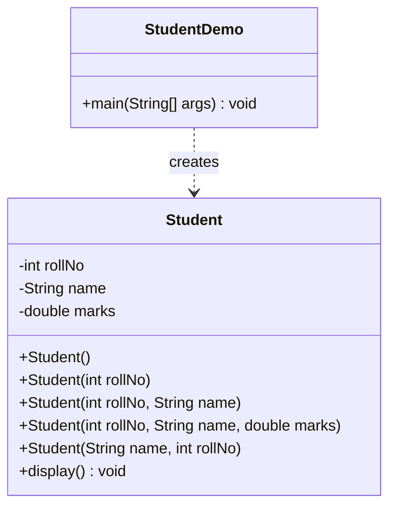
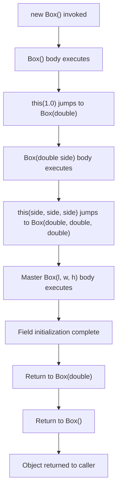
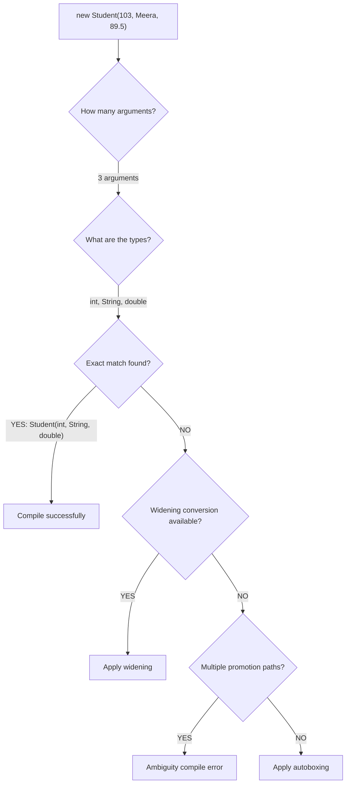

# Constructor Overloading

<!-- SECTION_1_START -->
# Constructor Overloading — Core Definition & Intuition

## 📘 Formal Definition (KTU 2024 Syllabus Terminology)

**Constructor Overloading** in Java is a technique of defining **more than one constructor** within the same class, where each constructor has a **distinct parameter list** (different number, type, or order of parameters). It is a direct application of **compile-time (static) polymorphism** in Java, enabling objects of the same class to be initialized in **multiple ways** depending on the data available at the point of instantiation.

> [!IMPORTANT]
> **KTU Board Definition to Memorize:**
> *"Constructor overloading is the process of defining multiple constructors in a class with different signatures so that objects can be initialized using different sets of parameters at the time of creation."*

---

## 🧠 Intuitive Analogy — The "Hotel Check-In Counter"

Imagine walking into a hotel reception:

- If you **booked online** with your **name, ID proof, and credit card** → the receptionist follows the **"Full KYC"** check-in process.
- If you are a **walk-in guest** with only a **name and phone number** → the receptionist follows a **"Quick Check-In"** process.
- If you are a **corporate guest** with a **company ID and booking code** → a different, **"Corporate Fast-Track"** process activates.

> The **guest (object)** is the same — a *person staying at the hotel*. But the **initialization data (parameter list)** differs, so the hotel (class) has **multiple constructors** ready to handle each scenario. The Java compiler picks the **right constructor** based on what arguments you supply — exactly like the receptionist choosing the right form based on what documents you hand over.

---

## 🧷 Key Rules & Characteristics (Board-Exam Favorites)

> [!NOTE]
> **Five Golden Rules of Constructor Overloading**
> 1. Constructors must have the **same name** as the class.
> 2. Each overloaded constructor must differ in its **parameter list** (signature).
> 3. Differing **only in access modifier** or **return type** is **NOT** overloading.
> 4. The compiler resolves the call at **compile time** → *static binding*.
> 5. One constructor can call another using `this(...)` — but it **must be the first statement**.

---

## 📐 GeoGebra / Desmos Visualization (Constructor Resolution Ladder)

> [!VISUALIZATION CONTROL]
> **Concept:** Visualization of method resolution — how the JVM/compiler selects a constructor based on argument types.
>
> **GeoGebra / Desmos Input:**
> * Point A: `(2, 5)` labelled `Constructor(int a)`
> * Point B: `(4, 3)` labelled `Constructor(int a, int b)`
> * Point C: `(6, 1)` labelled `Constructor(String s, double d)`
> * Line: `f(x) = 3 - 0.5x` labelled *Signature Axis*
>
> **Visual Description:** Picture a horizontal axis representing *Number of Parameters* and a vertical axis representing *Type Complexity*. As you move right, more parameter slots become available — and each constructor occupies a unique coordinate. The compiler's job is to project the call site `(2, "John", 95.5)` onto this plane to find the exact match.

---

## 🔑 Why This Matters in the KTU 2024 Scheme

- Direct mapping to **CO1**: *Apply object-oriented principles to design classes and objects.*
- Forms the **foundation** for understanding polymorphism (Module 1 → Module 2 bridge).
- **Mandatory** 14-mark question in most OOP Lab End-Semester Examinations.

<!-- SECTION_1_END -->

<!-- SECTION_2_START -->
# Deep Theoretical Analysis & KTU High-Yield Formula Sheet

## 🔬 Anatomy of Constructor Overloading

### 1. Signature Discrimination — The Three Legal Differentiators

The Java compiler (Javac) identifies a unique constructor using three rules:

1. **Number of parameters** — e.g., `Student()` vs `Student(int id)`
2. **Data type of parameters** — e.g., `Student(int id)` vs `Student(String name)`
3. **Order of parameters** — e.g., `Student(String name, int age)` vs `Student(int age, String name)`

> [!NOTE]
> **Why return type alone is NOT enough?**
> If two methods/constructors differ only in return type, the compiler cannot resolve which one to invoke at the call site — this would create *ambiguity*. Therefore, **return type is excluded** from the signature calculation for method/constructor overloading.

---

### 2. Compile-Time Resolution — How the Compiler Chooses

The selection process follows a strict **3-tier matching hierarchy**:

| Priority | Match Type | Description | Example |
| :--- | :--- | :--- | :--- |
| **Tier 1** | **Exact Match** | Argument types match parameter types identically | `new Student(101)` → `Student(int)` |
| **Tier 2** | **Widening Conversion** | Automatic type promotion (smaller → larger type) | `new Student('A')` → `Student(int)` via `char → int` |
| **Tier 3** | **Autoboxing / Varargs** | Primitive boxed to wrapper, or array of arguments | `new Student(101)` → `Student(Integer)` if `int` overload absent |

> [!WARNING]
> **KTU Examiner Trap:** If Tier 2 and Tier 3 both apply, the compiler **does not pick** — it throws an *ambiguity error*. Always design constructors with **non-overlapping promotion paths** for safety.

---

### 3. Constructor Chaining via `this()`

When one constructor invokes another within the same class, it is called **constructor chaining**. This is achieved using the `this(...)` keyword and follows a strict rule: **the `this()` call must be the very first statement** inside the constructor body.

```text
Parameterized Constructor (id, name, marks)
        │
        ├── this() ──────► Default Constructor ()
        │                      │
        └── this(marks) ──►   Single-arg Constructor (marks)
```

> [!IMPORTANT]
> **Real-world utility:** Constructor chaining prevents **code duplication**. The "master" constructor contains all the initialization logic, and other constructors delegate to it — a pattern that maps directly to the **DRY (Don't Repeat Yourself)** software engineering principle.

---

## 📋 KTU Formula Sheet / Quick-Reference Table

> [!IMPORTANT]
> **Print this table — it covers 90% of the marks for this topic in ESE.**

| Concept | Symbolic / Syntactic Form | Description | KTU Exam Frequency |
| :--- | :--- | :--- | :--- |
| Constructor Declaration | `ClassName(param-list) { ... }` | Defines a constructor — no return type, name = class name | ⭐⭐⭐⭐⭐ |
| Overloading Trigger | $\Delta(\text{num}) \lor \Delta(\text{type}) \lor \Delta(\text{order})$ | At least one of the three must change | ⭐⭐⭐⭐⭐ |
| Default Constructor | `ClassName() { }` | Zero-argument constructor (compiler-generated if absent) | ⭐⭐⭐⭐ |
| Parameterized | `ClassName(T1 a, T2 b) { ... }` | Takes explicit values for fields | ⭐⭐⭐⭐⭐ |
| Constructor Chaining | `this(args);` | Must be **first statement** in constructor body | ⭐⭐⭐⭐ |
| Compile-Time Binding | $\text{Decision made at } t_{\text{compile}}$ | Static polymorphism via signature matching | ⭐⭐⭐ |
| Access Modifiers | `public`, `private`, `protected`, *default* | Change visibility, not signature | ⭐⭐⭐ |
| `this` Keyword | $\text{this.field}$ or $\text{this(args)}$ | Refers to current object / chained constructor | ⭐⭐⭐⭐ |

> **Note on notation:** $\Delta$ denotes *change/difference*, $T_i$ denotes *data type of the $i$-th parameter*, $t_{\text{compile}}$ is the **compile-time instant**.

---

## 🏗️ Real-World Engineering Applications

| Domain | Use-Case of Constructor Overloading |
| :--- | :--- |
| **JDBC Database Programming** | `Connection conn = DriverManager.getConnection(url)` or `getConnection(url, user, pass)` |
| **Android SDK** | `new TextView(context)`, `new TextView(context, AttributeSet)` |
| **Spring Framework** | Bean instantiation with default values or custom property bags |
| **Game Development** | `new Player()` (default avatar) vs `new Player(name, weapon, armor)` (custom hero) |
| **GUI Toolkits (Swing/JavaFX)** | `new JButton()` vs `new JButton("Submit")` vs `new JButton(icon)` |

<!-- SECTION_2_END -->

<!-- SECTION_3_START -->
# Step-by-Step Derivations & Complete Java Implementation

## 💻 Exhaustive Java Program — The `Student` Class

The following is a **fully runnable, KTU-board-ready** Java program demonstrating every aspect of constructor overloading. Each line is commented for valuation clarity.

```java
// File: StudentDemo.java
// KTU 2024 Scheme — PBCSL307 — Module 1 — Constructor Overloading
// Demonstrates: default, parameterized, chained, and copy-style constructors

class Student {

    // ----------------- INSTANCE FIELDS -----------------
    private int rollNo;
    private String name;
    private double marks;

    // ----------------- 1. DEFAULT CONSTRUCTOR -----------------
    public Student() {
        this.rollNo = 0;
        this.name   = "Not Assigned";
        this.marks  = 0.0;
        System.out.println(">> Default Constructor invoked.");
    }

    // ----------------- 2. SINGLE-PARAMETER CONSTRUCTOR -----------------
    public Student(int rollNo) {
        this.rollNo = rollNo;
        this.name   = "Unnamed";
        this.marks  = 0.0;
        System.out.println(">> Single-arg Constructor (rollNo) invoked.");
    }

    // ----------------- 3. TWO-PARAMETER CONSTRUCTOR -----------------
    public Student(int rollNo, String name) {
        this.rollNo = rollNo;
        this.name   = name;
        this.marks  = 0.0;
        System.out.println(">> Two-arg Constructor (rollNo, name) invoked.");
    }

    // ----------------- 4. THREE-PARAMETER CONSTRUCTOR (MASTER) -----------------
    public Student(int rollNo, String name, double marks) {
        this.rollNo = rollNo;
        this.name   = name;
        this.marks  = marks;
        System.out.println(">> Three-arg Master Constructor invoked.");
    }

    // ----------------- 5. REORDERED CONSTRUCTOR (ORDER-BASED OVERLOAD) -----------------
    public Student(String name, int rollNo) {
        this.rollNo = rollNo;
        this.name   = name;
        this.marks  = 0.0;
        System.out.println(">> Reordered Constructor (name, rollNo) invoked.");
    }

    // ----------------- DISPLAY METHOD -----------------
    public void display() {
        System.out.println(
            "Roll: " + rollNo +
            " | Name: " + name +
            " | Marks: " + marks
        );
    }
}

// ----------------- DRIVER CLASS -----------------
public class StudentDemo {
    public static void main(String[] args) {

        // Test 1: Default constructor
        Student s1 = new Student();
        s1.display();

        // Test 2: Single-arg constructor
        Student s2 = new Student(101);
        s2.display();

        // Test 3: Two-arg constructor
        Student s3 = new Student(102, "Anand");
        s3.display();

        // Test 4: Three-arg master constructor
        Student s4 = new Student(103, "Meera", 89.5);
        s4.display();

        // Test 5: Reordered constructor (order-based discrimination)
        Student s5 = new Student("Karthik", 104);
        s5.display();
    }
}
```

### 🔍 Expected Output Trace

```text
>> Default Constructor invoked.
Roll: 0 | Name: Not Assigned | Marks: 0.0
>> Single-arg Constructor (rollNo) invoked.
Roll: 101 | Name: Unnamed | Marks: 0.0
>> Two-arg Constructor (rollNo, name) invoked.
Roll: 102 | Name: Anand | Marks: 0.0
>> Three-arg Master Constructor invoked.
Roll: 103 | Name: Meera | Marks: 89.5
>> Reordered Constructor (name, rollNo) invoked.
Roll: 104 | Name: Karthik | Marks: 0.0
```

---

## 🔗 Demonstration 2 — Constructor Chaining via `this()`

This second program proves that **`this()` must be the first statement** and demonstrates **DRY-style delegation**.

```java
// File: BoxDemo.java
// Demonstrates constructor chaining to centralize initialization logic

class Box {
    private double length;
    private double width;
    private double height;

    // Master constructor — single source of truth
    public Box(double length, double width, double height) {
        this.length = length;
        this.width  = width;
        this.height = height;
        System.out.println(">> Master Box(l, w, h) constructor executed.");
    }

    // Cube constructor — delegates to master using this(...)
    public Box(double side) {
        this(side, side, side);   // MUST be first statement
        System.out.println(">> Cube Box(side) constructor executed.");
    }

    // Default constructor — delegates to cube with side = 1.0
    public Box() {
        this(1.0);
        System.out.println(">> Default Box() constructor executed.");
    }

    public double volume() {
        return length * width * height;
    }
}

public class BoxDemo {
    public static void main(String[] args) {
        Box b1 = new Box();              // default
        Box b2 = new Box(5.0);           // cube
        Box b3 = new Box(2.0, 3.0, 4.0); // cuboid

        System.out.println("Volume b1 = " + b1.volume());
        System.out.println("Volume b2 = " + b2.volume());
        System.out.println("Volume b3 = " + b3.volume());
    }
}
```

### 🔍 Output Trace — Observe the Chain Order

```text
>> Master Box(l, w, h) constructor executed.
>> Cube Box(side) constructor executed.
>> Default Box() constructor executed.
Volume b1 = 1.0
>> Master Box(l, w, h) constructor executed.
>> Cube Box(side) constructor executed.
Volume b2 = 125.0
>> Master Box(l, w, h) constructor executed.
Volume b3 = 24.0
```

> [!IMPORTANT]
> **Valuation Insight:** Notice how `new Box()` triggers **all three** constructors in reverse-cascade order. This is a classic 7-mark sub-question in KTU ESE — students often lose marks by failing to mention that **`this()` must be the first statement**.

---

## ⚙️ Type Promotion Demonstration (Ambiguity vs. Resolution)

```java
class Demo {
    Demo(int a)        { System.out.println("int overload");    }
    Demo(double a)     { System.out.println("double overload"); }
}

public class PromoteTest {
    public static void main(String[] args) {
        new Demo(10);     // Exact int match      → "int overload"
        new Demo(10.5);   // Exact double match   → "double overload"
        new Demo('A');    // char → int promotion → "int overload"
    }
}
```

> [!WARNING]
> If you add `Demo(long a)` and call `new Demo(10)`, the compiler throws an **ambiguity error** because `int` can promote to `long` OR `float` OR `double`. Avoid this in lab records.

---

## 🧪 Lab Record Style — Sample Viva Questions

1. *What happens if you define a constructor with a return type?* → It becomes a method, not a constructor. The class then loses its no-arg constructor (compiler won't auto-generate it).
2. *Can constructors be `private`?* → Yes — used in **Singleton Design Pattern**.
3. *Can a constructor be `final`, `static`, or `abstract`?* → **No** to all three. The compiler rejects these modifiers on constructors.

<!-- SECTION_3_END -->

<!-- SECTION_4_START -->
# Structural Diagrams & Schematics

## 🗺️ Diagram 1 — Class Structure with Overloaded Constructors



> **Reading the diagram:** The `Student` class is shown with **5 distinct constructors** — each differing in its parameter signature. The dotted arrow from `StudentDemo` to `Student` represents *instantiation / dependency*.

---

## 🔁 Diagram 2 — Constructor Chaining Flow (`this()` Cascade)



> **Step-by-step trace:** This is the exact execution order for `new Box()`. The chart shows **LIFO unwinding** — the deepest call returns first, then each outer constructor resumes.

---

## 🎯 Diagram 3 — Compile-Time Resolution Decision Tree



> [!IMPORTANT]
> **Board Note:** This decision tree is the **exact algorithm** the Java compiler follows during bytecode generation. Memorize it for any 7-mark "explain resolution" question.

---

## 📊 Diagram 4 — Signature Discrimination Matrix

| Constructor Signature | # Params | Type Sequence | Uniquely Identified? |
| :--- | :---: | :--- | :---: |
| `Student()` | 0 | (none) | ✅ |
| `Student(int)` | 1 | (int) | ✅ |
| `Student(int, String)` | 2 | (int, String) | ✅ |
| `Student(int, String, double)` | 3 | (int, String, double) | ✅ |
| `Student(String, int)` | 2 | (String, int) | ✅ — *order differs* |
| `Student(int)` vs `Student(long)` | 1 | (int) vs (long) | ✅ — *type differs* |
| `Student()` vs `private Student()` | 0 | (none) | ❌ — *same signature* |

<!-- SECTION_4_END -->

<!-- SECTION_5_START -->
# KTU 2024 Scheme Examination Question Bank

---

## 📝 Part A — Short Answer Questions (3 Marks Each)

### Q1. `[KTU University Exam – July 2024]`
**Define constructor overloading. List the three ways in which two constructors can be distinguished by the compiler.** *(CO1, Remember)*

**Model Answer:**

> **Definition:** Constructor overloading is the technique of defining multiple constructors within the same class, each having a different parameter list, to allow objects to be initialized in different ways.
>
> The three ways the compiler distinguishes between constructors are:
> 1. **Number of parameters** — e.g., `Box()` vs `Box(int)`
> 2. **Data type of parameters** — e.g., `Box(int)` vs `Box(double)`
> 3. **Order of parameters** — e.g., `Box(int, String)` vs `Box(String, int)`
>
> **[Stating the definition: 1 Mark] [Listing all three discriminators: 2 Marks]**

---

### Q2. `[KTU University Exam – Dec 2023]`
**Explain the role of the `this()` keyword in constructor overloading. State the rule that must be followed when using it.** *(CO1, Understand)*

**Model Answer:**

> The `this()` keyword is used to invoke **one constructor from another** within the same class. This process is called **constructor chaining** and is used to centralize initialization logic, avoiding code duplication.
>
> **Rule:** The `this()` call **must be the very first statement** inside the constructor body. If it is placed anywhere else, the compiler throws the error *"call to this must be first statement in constructor"*.
>
> **[Identifying the chaining role: 1 Mark] [Explaining the first-statement rule with a valid example: 2 Marks]**

---

## 📝 Part B — Long Answer Questions (14 Marks Each, Internal Choice)

### **Question A (14 Marks)** `[KTU University Exam – July 2024]`

> **(a)** Define constructor overloading. Write a Java class `Rectangle` with three overloaded constructors — a default constructor (length = 1, width = 1), a single-argument constructor (square), and a two-argument constructor (length, width). Include a method `area()` to return the area. *(7 Marks, CO1, Understand)*
>
> **(b)** Write a `main` method that demonstrates the invocation of all three constructors and prints the area for each rectangle object. Explain how the compiler resolves the call when `new Rectangle(5)` is executed. *(7 Marks, CO1, Apply)*

#### ✅ Model Solution

**Part (a) — Class Definition (7 Marks)**

```java
class Rectangle {
    private double length;
    private double width;

    // 1. Default constructor
    public Rectangle() {
        this.length = 1.0;
        this.width  = 1.0;
    }

    // 2. Single-argument constructor (square)
    public Rectangle(double side) {
        this.length = side;
        this.width  = side;
    }

    // 3. Two-argument constructor
    public Rectangle(double length, double width) {
        this.length = length;
        this.width  = width;
    }

    public double area() {
        return this.length * this.width;
    }
}
```

> **[Class declaration with private fields: 1 Mark]**
> **[All three constructors with correct signatures: 4 Marks]**
> **[area() method: 1 Mark]**
> **[Proper use of `this` to disambiguate: 1 Mark]**

---

**Part (b) — Driver Class and Compiler Resolution (7 Marks)**

```java
public class RectangleDemo {
    public static void main(String[] args) {
        Rectangle r1 = new Rectangle();              // default
        Rectangle r2 = new Rectangle(5.0);           // square
        Rectangle r3 = new Rectangle(4.0, 6.0);      // rectangle

        System.out.println("Area r1 = " + r1.area());
        System.out.println("Area r2 = " + r2.area());
        System.out.println("Area r3 = " + r3.area());
    }
}
```

**Compiler Resolution Explanation for `new Rectangle(5)`:**

> The compiler performs **3-tier signature matching**:
> 1. **Tier 1 — Exact Match:** It first searches for a constructor with one argument of type `int` (since `5` is an `int` literal). No exact match exists.
> 2. **Tier 2 — Widening Conversion:** It then checks whether `int` can be widened to any available parameter type. `int → double` is a valid widening promotion, so it matches `Rectangle(double side)`.
> 3. **Selection:** The compiler binds the call to `Rectangle(double side)`, and the value `5` is automatically promoted to `5.0`.
>
> **[Driver class with 3 object instantiations: 3 Marks]**
> **[area() output calls: 1 Mark]**
> **[3-tier resolution explanation: 3 Marks]**

---

### **Question B (14 Marks)** `[KTU University Exam – Dec 2023]`

> **(a)** What is constructor chaining? Illustrate with a Java class `Employee` having three constructors — default, single-argument (id), and two-argument (id, name) — where the first two constructors use `this()` to delegate to the three-argument master constructor. *(7 Marks, CO2, Understand)*
>
> **(b)** Write a `main` method to create three `Employee` objects using the three constructors. Show the exact console output sequence, and explain why `this()` must be the first statement. *(7 Marks, CO2, Apply)*

#### ✅ Model Solution

**Part (a) — Constructor Chaining Class (7 Marks)**

```java
class Employee {
    private int id;
    private String name;
    private double salary;

    // Master constructor — single source of truth
    public Employee(int id, String name, double salary) {
        this.id     = id;
        this.name   = name;
        this.salary = salary;
        System.out.println("Master (id, name, salary) executed.");
    }

    // Two-arg constructor — delegates to master
    public Employee(int id, String name) {
        this(id, name, 25000.0);   // default salary
        System.out.println("Two-arg (id, name) executed.");
    }

    // Single-arg constructor — delegates via two-arg
    public Employee(int id) {
        this(id, "Unknown", 25000.0);
        System.out.println("Single-arg (id) executed.");
    }

    // Default constructor — delegates via single-arg
    public Employee() {
        this(0);
        System.out.println("Default () executed.");
    }

    public void display() {
        System.out.println("ID: " + id + " | Name: " + name +
                           " | Salary: " + salary);
    }
}
```

> **[Defining constructor chaining: 1 Mark]**
> **[Master 3-arg constructor: 2 Marks]**
> **[Chained 2-arg constructor with `this(id, name, 25000.0)`: 2 Marks]**
> **[Chained 1-arg constructor with `this(id, "Unknown", 25000.0)`: 2 Marks]**

---

**Part (b) — Driver Class, Output Trace, and Rule Explanation (7 Marks)**

```java
public class EmployeeDemo {
    public static void main(String[] args) {
        Employee e1 = new Employee(101, "Ravi", 55000.0);
        Employee e2 = new Employee(102, "Priya");
        Employee e3 = new Employee(103);

        System.out.println("--- Displaying Employees ---");
        e1.display();
        e2.display();
        e3.display();
    }
}
```

**Exact Output Trace:**

```text
Master (id, name, salary) executed.
Master (id, name, salary) executed.
Two-arg (id, name) executed.
Master (id, name, salary) executed.
Single-arg (id) executed.
--- Displaying Employees ---
ID: 101 | Name: Ravi | Salary: 55000.0
ID: 102 | Name: Priya | Salary: 25000.0
ID: 103 | Name: Unknown | Salary: 25000.0
```

**Why `this()` must be the first statement:**

> Java's object initialization model requires that a constructor's superclass portion and its chained constructor call be completed **before** any subclass-specific initialization occurs. If arbitrary statements were allowed before `this()`, the object could be used in a *partially initialized* state, leading to inconsistent behavior. By mandating first-statement placement, the JVM guarantees that the object is **fully constructed** before any user code in the current constructor executes.
>
> **[Driver class: 2 Marks]**
> **[Correct output trace: 2 Marks]**
> **[First-statement rule explanation: 3 Marks]**

---

> [!WARNING]
> **KTU Examiner's Valuation Pitfalls — Where Students Lose Marks**
> 1. **Writing a return type** on a constructor (e.g., `public void Student()`) → marks deducted: *−2*
> 2. **Placing `this()` as the second statement** → compile error, full marks lost for output: *−3 to −5*
> 3. **Forgetting to call `this()` from every chained constructor** → constructor chaining incomplete: *−2*
> 4. **Confusing method overloading with constructor overloading** → at least 2 marks cut for conceptual answer
> 5. **Missing `display()` or `area()` method** when the question asks for a *complete program*: *−2 to −3*
> 6. **Not explaining the resolution tier** in part (b) of Question A → lose the 3 "Apply" marks

---

## ✅ Topic Recap & Important Things to Remember

> [!NOTE]
> **High-Density Rapid Revision Checklist — Constructor Overloading**

- ✅ **Definition:** Multiple constructors in a class with **different parameter lists** to allow varied object initialization.
- ✅ **Signature Components:** Name (always = class name) + Parameter list (the only differentiator).
- ✅ **Three Discriminators:** Number, Type, Order of parameters.
- ✅ **NOT Overloading:** Differing only in access modifier, return type, or exception list.
- ✅ **Compile-Time Polymorphism:** Resolution happens during `javac` compilation, not at runtime.
- ✅ **Default Constructor:** Auto-provided by compiler **only if no constructor is defined**; disappears the moment you write any constructor.
- ✅ **`this()` Keyword:** Used for constructor chaining; **must be the first statement**; cannot be cyclic (A→B→A).
- ✅ **Three Resolution Tiers:** Exact match → Widening promotion → Autoboxing/Varargs.
- ✅ **Ambiguity Error:** Occurs when multiple promotion paths exist — avoid with non-overlapping signatures.
- ✅ **No Modifiers Allowed:** `final`, `static`, `abstract` are **illegal** on constructors.
- ✅ **Can Be `private`:** Used in Singleton pattern and factory method designs.
- ✅ **Real-World Examples:** `DriverManager.getConnection()`, `new JButton("Click")`, `new TextView(context)`.
- ✅ **DRY Principle:** Use `this()` chaining to centralize initialization in one "master" constructor.
- ✅ **Lab Record Must-Haves:** Working program, output screenshot, signature table, and resolution explanation.
- ✅ **Common Viva Questions:** "What if return type is added?", "Why no `static` constructor?", "Can constructors be inherited?" (Answer: No — but default constructor of super is called implicitly via `super()`).

<!-- SECTION_5_END -->
