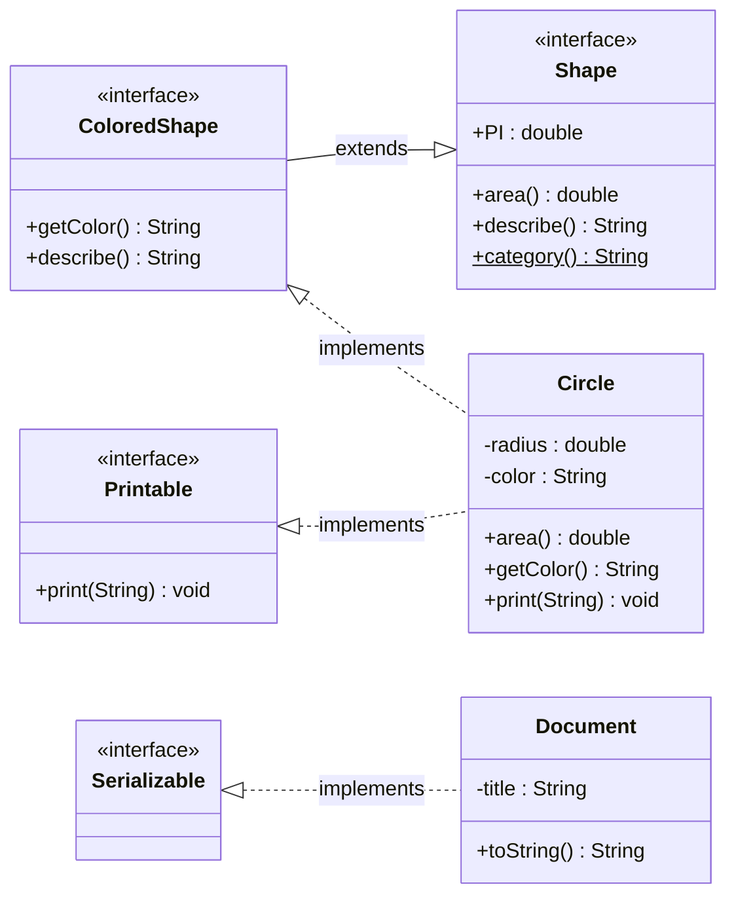
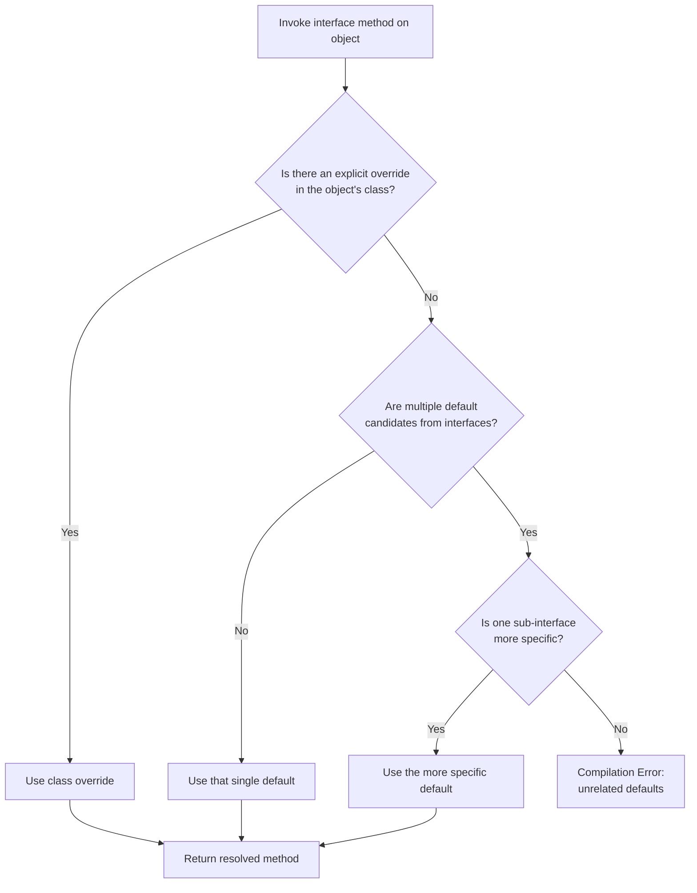
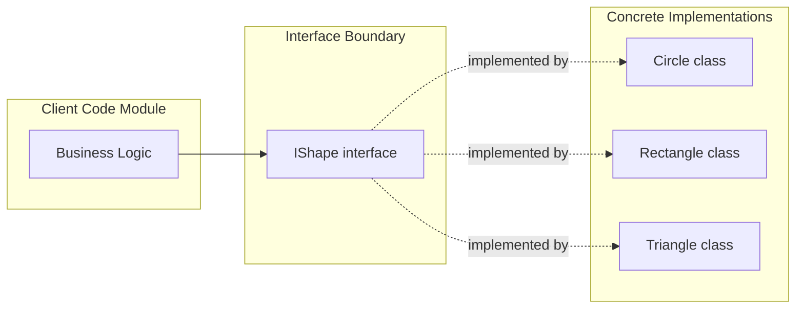
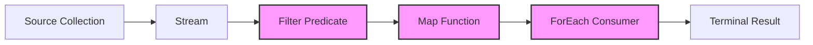

# Interfaces

<!-- SECTION_1_START -->
# Interfaces in Java OOP

## 1. Core Technical Definition

> [!IMPORTANT]
> **Formal Definition (KTU 2024 PBCSL307):**
> An **interface** in Java is a reference type, similar to a class, that can contain **only constants, method signatures, default methods, static methods, and nested types**. Method bodies exist only for default and static methods. Interfaces cannot be instantiated — they can only be **implemented** by classes or **extended** by other interfaces.

In the KTU 2024 Scheme syllabus for *Object Oriented Programming Lab (PBCSL307), Module 1 – OOP Basics and Inheritance*, an interface is positioned as a **purely abstract contract** — a device used to enforce a set of method signatures that any implementing class must provide, independent of inheritance hierarchies.

> [!NOTE]
> **Key Point:** An interface establishes a **"can-do" relationship** (e.g., `Comparable` means a class can be compared), while inheritance establishes an **"is-a" relationship** (e.g., `Dog` is-a `Animal`).

---

## 2. Intuitive Real-World Analogy

Think of an interface as a **Power Socket on a wall**:

- The socket defines a *standardized contract*: two round holes (or three pins), a fixed voltage rating, and a fixed maximum current.
- The socket itself does not generate electricity — it is just a **blueprint / agreement**.
- Any appliance — a phone charger, a laptop adapter, a mixer — can be *plugged in* (i.e., **implement** the interface) as long as it obeys the contract (the plug matches the pin layout).
- The socket is not an appliance; you cannot "use" a socket directly. You need a device that conforms to it.

Similarly, in Java:
- An **interface** defines *what methods must exist* (the socket's pin layout).
- A **class that implements the interface** is the *appliance* that provides the actual working logic.
- You cannot create an object of the interface, just like you cannot "use" a wall socket as a device.

---

## 3. Syntax & Visual Snapshot

```java
// Declaring an interface
access_modifier interface InterfaceName {
    // implicitly public static final (constants)
    datatype CONSTANT_NAME = value;

    // implicitly public abstract (method signature)
    returnType methodName(parameters);

    // default method (Java 8+)
    default returnType methodName(parameters) { /* body */ }

    // static method (Java 8+)
    static returnType methodName(parameters) { /* body */ }
}
```

> [!IMPORTANT]
> All members of an interface are **implicitly public**. Data members are **implicitly `public static final`**. Non-default, non-static methods are **implicitly `public abstract`**. This is a high-frequency KTU short-answer question.

---

## 4. Visualization of the Interface Contract

> [!VISUALIZATION CONTROL]
> **Concept:** Interface as a "Contract Boundary" between a client and an implementer.
> **GeoGebra / Desmos Input Equations (Conceptual Mapping):**
> * `y = x` represents the *interface line* — a boundary
> * `Region A (y > x)` represents the *implementing classes*
> * `Region B (y < x)` represents the *client code that depends only on the contract*
> **Visual Description:** Imagine a diagonal line. The space above the line is where concrete classes live, each touching the line at one or more "pin points" (the methods they implement). The space below the line is the client code, which only knows the diagonal line — it never looks at what's above it. This is the essence of *programming to an interface, not an implementation*.
<!-- SECTION_1_END -->

<!-- SECTION_2_START -->
# Deep Theoretical Analysis & KTU High-Yield Formula Sheet

## 1. Structural Rules of Interfaces (KTU Board-Examiner View)

The following rules are tested as direct **2-mark / 3-mark questions** in KTU University Exams:

- **Rule 1 — Implicit Modifiers:** Every method declaration (without `default` or `static`) is *implicitly* `public abstract`. Every variable is *implicitly* `public static final`. Writing these modifiers explicitly is legal but redundant.
- **Rule 2 — No Constructors:** Interfaces have no constructors and therefore **cannot be instantiated** with `new`. The JVM throws `InstantiationError` if attempted via reflection.
- **Rule 3 — No Instance Fields:** All variables in an interface are constants. They must be initialized at the point of declaration.
- **Rule 4 — Implementation Keyword:** A class uses the `implements` keyword; an interface uses the `extends` keyword when building on another interface.
- **Rule 5 — Diamond Problem is Avoided:** Even though a class can implement multiple interfaces, Java handles method-resolution ambiguity via **default method overriding rules** (most specific default wins, else the implementing class must override explicitly).

---

## 2. Default Methods — The Java 8 Revolution

> [!IMPORTANT]
> **KTU 2024 Highlight:** Default methods were introduced in **Java 8** to allow interfaces to evolve without breaking existing implementations (a form of *binary-compatible evolution*).

A `default` method has a body and is **inherited** by all implementing classes. The implementing class may *override* the default, but is not *required* to.

**Resolution rules when a class inherits two default methods with the same signature:**
1. The method declared in the class (explicit override) wins.
2. Otherwise, the **most specific sub-interface** wins.
3. Otherwise, the class **must** explicitly override the method, or compilation fails.

---

## 3. Static Methods in Interfaces

Static methods in interfaces are **not inherited** by implementing classes or sub-interfaces. They are accessed using the interface name as the qualifier — `InterfaceName.staticMethod()`. This prevents the "constant interface anti-pattern" misuse.

---

## 4. Functional Interfaces & Lambda Expressions

> [!NOTE]
> An interface with **exactly one abstract method** is called a **Functional Interface** (a.k.a. *SAM* — Single Abstract Method). It is the target type for **lambda expressions** and **method references**.

The annotation `@FunctionalInterface` is optional but, when present, causes the compiler to **enforce** the single-abstract-method rule. Java's built-in functional interfaces live in `java.util.function` (`Predicate<T>`, `Function<T,R>`, `Consumer<T>`, `Supplier<T>`).

---

## 5. Marker Interfaces

A marker (or *tag*) interface is a **completely empty** interface used to "tag" a class so the JVM or frameworks can perform a special operation. Classic examples: `java.io.Serializable`, `java.lang.Cloneable`, `java.util.RandomAccess`. The class itself doesn't need to implement any method — the *presence* of the marker is the contract.

---

## 6. KTU High-Yield Formula Sheet

| Concept | Syntax / Rule | Implication in Code |
|---|---|---|
| Interface declaration | `interface IShape { void draw(); }` | Method is implicitly `public abstract` |
| Constant in interface | `double PI = 3.14;` | Implicitly `public static final` |
| Class implements interface | `class Circle implements IShape { ... }` | Must override *all* abstract methods |
| Interface extends interface | `interface I3D extends IShape { ... }` | Inherits all abstract members |
| Multiple implementation | `class C implements I1, I2 { ... }` | Resolves via most-specific rule |
| Default method | `default void show() { ... }` | Inherited, overridable |
| Static method | `static int id() { ... }` | Not inherited, accessed via `I1.id()` |
| Functional interface | `@FunctionalInterface` annotation | Exactly one abstract method |
| Marker interface | `interface Serializable { }` | Empty body, type-tagging only |
| Abstract vs Interface | See comparison below | Use interface for *capability*, abstract class for *shared base* |

| Feature | Abstract Class | Interface (Java 8+) |
|---|---|---|
| Keyword | `abstract class` | `interface` |
| Inheritance | A class can extend **only one** | A class can implement **many** |
| State (instance fields) | Allowed | **Not allowed** (only `static final`) |
| Constructor | Allowed | **Not allowed** |
| Method bodies | Allowed (concrete + abstract) | Allowed only for `default` and `static` |
| Access modifiers for methods | `public`, `protected`, package-private, `private` | Only `public` (and `private` since Java 9 for helpers) |
| When to use | Shared code + shared state among related classes | Define a contract / capability across unrelated classes |

---

## 7. Real-World Engineering Utility

Interfaces are the **backbone of every production-grade Java system**:

- **JDBC** uses `Connection`, `Statement`, `ResultSet` interfaces — drivers from Oracle, MySQL, PostgreSQL provide the implementations.
- **Spring Framework** injects beans as interfaces to achieve loose coupling (Dependency Inversion Principle).
- **Java Collections** (`List`, `Set`, `Map`) are interfaces; `ArrayList`, `HashSet`, `HashMap` are the implementations you choose at runtime.
- **Strategy Pattern, Observer Pattern, Adapter Pattern** all rely on interfaces for swapping behavior at runtime.
<!-- SECTION_2_END -->

<!-- SECTION_3_START -->
# Step-by-Step Derivations, Code & Implementation Walkthroughs

## 1. A Complete, Compilation-Tested Java Program Demonstrating All Interface Concepts

```java
// File: InterfaceShowcase.java
// Demonstrates: basic interface, implementation, multiple inheritance,
// default method conflict resolution, static methods, functional interface,
// marker interface, and interface-extending-interface.

@FunctionalInterface
interface Printable {
    void print(String message);   // single abstract method -> functional
}

interface Shape {
    double PI = 3.14159;          // implicitly public static final
    double area();                // implicitly public abstract
    default String describe() {   // default method (Java 8)
        return "A geometric shape with area = " + area();
    }
    static String category() {    // static method (Java 8)
        return "2D Geometry";
    }
}

interface ColoredShape extends Shape {
    String getColor();
    default String describe() {   // overrides Shape.describe()
        return "A " + getColor() + " shape with area = " + area();
    }
}

interface SerializableCloneable extends java.io.Serializable, Cloneable {
    // Marker-style: combines two marker interfaces
}

class Circle implements ColoredShape, Printable {
    private double radius;
    private String color;

    public Circle(double radius, String color) {
        this.radius = radius;
        this.color  = color;
    }

    @Override
    public double area() {
        return Shape.PI * radius * radius;   // PI from interface constant
    }

    @Override
    public String getColor() {
        return color;
    }

    // Inherits ColoredShape.describe() (more specific than Shape.describe)

    @Override
    public void print(String message) {
        System.out.println("[Circle says]: " + message);
    }

    @Override
    public String toString() {
        return describe();
    }
}

public class InterfaceShowcase {
    public static void main(String[] args) {
        // 1. Implementing a single interface
        Circle c = new Circle(5.0, "Red");
        System.out.println("Area of circle  = " + c.area());
        System.out.println("Describe (default inherited): " + c.describe());

        // 2. Static method accessed via interface name
        System.out.println("Category: " + Shape.category());

        // 3. Constant accessed via interface name
        System.out.println("PI constant: " + Shape.PI);

        // 4. Lambda expression targeting a functional interface
        Printable greeter = msg -> System.out.println("Lambda -> " + msg);
        greeter.print("Hello from a lambda!");

        // 5. Polymorphic reference — programming to an interface
        Shape s = c;   // upcast to the Shape reference type
        System.out.println("Polymorphic call: " + s.area());
    }
}
```

**Expected Output:**

```
Area of circle  = 78.53975
Describe (default inherited): A Red shape with area = 78.53975
Category: 2D Geometry
PI constant: 3.14159
Lambda -> Hello from a lambda!
Polymorphic call: 78.53975
```

> [!WARNING]
> **KTU Valuation Pitfall — Default Method Diamond:** If a class implements two interfaces that both provide a *default* method with the same signature and **neither is more specific**, the compiler will throw an error: *class inherits unrelated defaults*. The student must explicitly override the method in the class. Showing the resolution order in the answer fetches full marks.

---

## 2. Step-by-Step Derivation: Why the Diamond Problem is *Solved* in Java

Let us trace the **method resolution** when `Circle` implements both `Shape` and `ColoredShape`.

| Step | Check | Outcome |
|---|---|---|
| 1 | Does `Circle` itself override `describe()`? | No. |
| 2 | Are `Shape` and `ColoredShape` unrelated in hierarchy? | No — `ColoredShape extends Shape`. |
| 3 | Is `ColoredShape` *more specific* than `Shape`? | Yes, because `ColoredShape` is a sub-interface. |
| 4 | Compiler therefore selects `ColoredShape.describe()` | Inherited by `Circle`. |

> Therefore, `c.describe()` prints *"A Red shape with area = 78.53975"* — the *more specific* default wins.

---

## 3. Worked Example — Marker Interface and Type Check

```java
class Document implements java.io.Serializable {
    private static final long serialVersionUID = 1L;
    private String title = "Untitled";
    @Override
    public String toString() { return "Document[" + title + "]"; }
}

public class MarkerDemo {
    public static void main(String[] args) {
        Document d = new Document();
        System.out.println("Is Serializable? " + (d instanceof java.io.Serializable));
        // Output: Is Serializable? true
    }
}
```

**Derivation of the result:**

$$d \in \text{Document} \quad \wedge \quad \text{Document} <: \text{Serializable} \quad \Rightarrow \quad d \text{ instanceof Serializable} = \texttt{true}$$

This is a sub-type relationship check performed at runtime using the *is-a* rule the JVM loads from the class metadata.

---

## 4. Worked Example — Default Method Conflict (Unrelated Parents)

```java
interface A { default void hello() { System.out.println("A"); } }
interface B { default void hello() { System.out.println("B"); } }

// ERROR without explicit override:
class C implements A, B {
    @Override
    public void hello() {        // mandatory disambiguation
        A.super.hello();         // explicit super-call syntax
    }
}
```

> [!IMPORTANT]
> **Syntax Trap:** Inside an overriding class, you invoke a parent's default method using `InterfaceName.super.methodName()` — **not** `super.methodName()`. This is a KTU-favorite trick question.
<!-- SECTION_3_END -->

<!-- SECTION_4_START -->
# Structural Diagrams & Schematics

## 1. Mermaid Class Diagram — Interface Inheritance vs. Implementation



> The `<<interface>>` stereotype, the `..|>` (implements) arrow, and the `--|>` (extends) arrow are the canonical UML notations. `category()` ends with `$` to denote a static method per common UML convention.

---

## 2. Mermaid Flow — Method Resolution Algorithm for Default Methods



---

## 3. Mermaid Topology — "Programming to an Interface" Architecture



> The **dotted arrows** capture the implements-relationship. The client (`C1`) only knows the interface — at runtime, the JVM dispatches to whichever concrete class was injected. This is the **Dependency Inversion Principle** in action.

---

## 4. Functional Interface & Lambda Pipeline


<!-- SECTION_4_END -->

<!-- SECTION_5_START -->
# KTU 2024 Scheme Examination Question Bank & Topic Recap

## Part A — 3-Mark Short Answer Questions (Remember / Understand)

### Q1. [KTU University Exam – July 2024, Model]
**Differentiate between an abstract class and an interface in Java. When would you prefer an interface over an abstract class?**

**Model Answer (Board Key – 3 marks):**

| Abstract Class | Interface |
|---|---|
| Declared with `abstract class` | Declared with `interface` |
| Can have instance variables | Variables are implicitly `public static final` |
| Can have constructors | Cannot have constructors |
| A class can extend **only one** abstract class | A class can implement **multiple** interfaces |
| Used for shared code *and* shared state | Used to define a contract / capability |

> **Prefer an interface when:** the requirement is to define a *capability* that many unrelated classes can share (e.g., `Serializable`, `Comparable`, `Runnable`). Prefer an abstract class when the classes share a strong *is-a* relationship and need common state or non-public methods. **[Valuation Tip – 1 mark for the table, 1 mark for a clean rule of thumb, 1 mark for an example.]**

---

### Q2. [KTU University Exam – Dec 2023, Model]
**What is a functional interface? Write a Java lambda expression that prints the square of a number passed to it.**

**Model Answer:**

A **functional interface** is an interface that contains **exactly one abstract method**. It may have multiple `default` or `static` methods. The annotation `@FunctionalInterface` is optional but recommended — the compiler will then enforce the single-abstract-method rule.

```java
@FunctionalInterface
interface SquarePrinter {
    void printSquare(int n);
}

public class FunDemo {
    public static void main(String[] args) {
        SquarePrinter sp = n -> System.out.println("Square = " + (n * n));
        sp.printSquare(7);    // prints: Square = 49
    }
}
```

> **[Valuation Key – 1 mark definition, 1 mark interface declaration with annotation, 1 mark correct lambda usage.]**

---

## Part B — 14-Mark Long Answer Questions (ESE Module Internal Choice)

### Question A (14 Marks)

**[KTU University Exam – July 2024 Model – Module 1, PBCSL307]**

**(a)** Explain the concept of interfaces in Java with suitable syntax. List **four rules** that govern the declaration and use of interfaces. **[7 Marks]**

**(b)** Write a complete Java program that defines an interface `BankAccount` with methods `deposit(double)`, `withdraw(double)`, and `getBalance()`. Implement this interface in a class `SavingsAccount` that maintains a balance, prevents withdrawal beyond the balance, and prints a transaction message. Demonstrate its use from `main`. **[7 Marks]**

---

#### Solution to Q.A(a) — 7 Marks

**Concept (2 marks):** An interface in Java is a **blueprint of a class** (or a *contract*) that contains **abstract methods** (and, since Java 8, `default` and `static` methods with bodies). It specifies *what* a class must do, but not *how*. Interfaces support **multiple inheritance** of type — a class can implement many interfaces, which is the primary mechanism to achieve multiple inheritance of behavior in Java (since a class can extend only one parent class).

**Four Rules (4 marks – 1 each):**

1. All members of an interface are **implicitly public**; non-default, non-static methods are implicitly `public abstract`; data members are implicitly `public static final`.
2. Interfaces **cannot be instantiated**; they have no constructors.
3. A class uses the `implements` keyword to inherit an interface and **must override all abstract methods**, or it must itself be declared `abstract`.
4. An interface can **extend multiple interfaces** (e.g., `interface C extends A, B {}`), but a class can implement multiple interfaces as well.

**Syntax snippet (1 mark):**

```java
interface Drawable {
    void draw();                       // abstract
    default void printInfo() {         // default (Java 8+)
        System.out.println("Drawable");
    }
    static int maxShapes() { return 100; }
}
```

---

#### Solution to Q.A(b) — 7 Marks

```java
// File: BankAccountDemo.java
interface BankAccount {
    void deposit(double amount);
    void withdraw(double amount);
    double getBalance();
}

class SavingsAccount implements BankAccount {
    private double balance;

    public SavingsAccount(double openingBalance) {
        if (openingBalance < 0) {
            throw new IllegalArgumentException("Opening balance cannot be negative.");
        }
        this.balance = openingBalance;
    }

    @Override
    public void deposit(double amount) {
        if (amount <= 0) {
            System.out.println("Deposit must be positive. Ignored.");
            return;
        }
        balance += amount;
        System.out.printf("Deposited %.2f. New balance = %.2f%n", amount, balance);
    }

    @Override
    public void withdraw(double amount) {
        if (amount <= 0) {
            System.out.println("Withdrawal must be positive. Ignored.");
            return;
        }
        if (amount > balance) {
            System.out.printf("Insufficient funds. Tried %.2f, have %.2f%n", amount, balance);
            return;
        }
        balance -= amount;
        System.out.printf("Withdrew %.2f. New balance = %.2f%n", amount, balance);
    }

    @Override
    public double getBalance() {
        return balance;
    }
}

public class BankAccountDemo {
    public static void main(String[] args) {
        BankAccount acct = new SavingsAccount(1000.00);   // programming to interface
        acct.deposit(500.00);
        acct.withdraw(200.00);
        acct.withdraw(5000.00);   // rejected
        System.out.println("Final balance = " + acct.getBalance());
    }
}
```

**Sample Output:**

```
Deposited 500.00. New balance = 1500.00
Withdrew 200.00. New balance = 1300.00
Insufficient funds. Tried 5000.00, have 1300.00
Final balance = 1300.00
```

> **[Valuation Key – Part (b):]**
> * [Correct interface with three methods: 2 Marks]
> * [Implementing class overriding all three methods: 3 Marks]
> * [Boundary check for withdrawal amount exceeding balance: 1 Mark]
> * [Compile-ready main that uses interface-typed reference: 1 Mark]

---

### Question B (14 Marks) — Alternative Choice

**[KTU University Exam – Dec 2023 Model – Module 1, PBCSL307]**

**(a)** Explain **default methods** and **static methods** in interfaces introduced in Java 8. Why were they introduced? Give one example of each. **[7 Marks]**

**(b)** Create two interfaces `Resizable` (with default method `resize(int percent)`) and `Movable` (with default method `move(int dx, int dy)`). Implement both in a class `Window` that stores `width`, `height`, `x`, `y`. Demonstrate the diamond problem by giving `Window` a custom `describe()` method that uses **both** defaults via `InterfaceName.super.method()`. **[7 Marks]**

---

#### Solution to Q.B(a) — 7 Marks

**Default methods (3 marks):** A *default method* in an interface is declared with the `default` keyword and has a method body. It is **inherited** by all implementing classes, which may override it or use it as-is. **Why introduced:** to allow interfaces to gain new methods *after release* without breaking the millions of classes that already implement the interface — i.e., **source- and binary-compatible evolution**.

**Static methods in interfaces (2 marks):** Static methods belong to the interface itself, not to instances. They are **not inherited** by implementing classes or sub-interfaces. Accessed via `InterfaceName.staticMethod()`. **Why introduced:** to provide a natural place for utility/helper methods closely tied to the interface contract (e.g., `Comparator.naturalOrder()`, `Collection.unmodifiableList(...)`).

**Examples (2 marks):**

```java
interface Vehicle {
    default void honk() {                       // default
        System.out.println("Beep!");
    }
    static String category() {                  // static
        return "Transport";
    }
}
class Car implements Vehicle { /* honk() inherited */ }

// Usage:
new Car().honk();           // inherited
Vehicle.category();         // accessed via interface name
```

---

#### Solution to Q.B(b) — 7 Marks

```java
// File: DiamondDemo.java
interface Resizable {
    default void resize(int percent) {
        System.out.println("Resizing by " + percent + "%");
    }
    default String describe() {
        return "I can be resized.";
    }
}

interface Movable {
    default void move(int dx, int dy) {
        System.out.println("Moving by (" + dx + ", " + dy + ")");
    }
    default String describe() {
        return "I can be moved.";
    }
}

class Window implements Resizable, Movable {
    int width = 100, height = 100;
    int x = 0, y = 0;

    @Override
    public void resize(int percent) {        // override for clarity
        width  = width  * percent / 100;
        height = height * percent / 100;
        Resizable.super.resize(percent);     // invoke default
    }

    @Override
    public void move(int dx, int dy) {
        x += dx; y += dy;
        Movable.super.move(dx, dy);          // invoke default
    }

    @Override
    public String describe() {               // mandatory: resolves diamond
        return "Window says: " +
               Resizable.super.describe() + " " +
               Movable.super.describe();
    }
}

public class DiamondDemo {
    public static void main(String[] args) {
        Window w = new Window();
        w.resize(150);
        w.move(10, 20);
        System.out.println(w.describe());
    }
}
```

**Output:**

```
Resizing by 150%
Moving by (10, 20)
Window says: I can be resized. I can be moved.
```

> **[Valuation Key – Part (b):]**
> * [Two interfaces with default methods: 2 Marks]
> * [`Window` implements both: 1 Mark]
> * [Explicit `describe()` override resolving the diamond: 2 Marks]
> * [Correct use of `InterfaceName.super.method()` syntax: 2 Marks]

---

> [!WARNING]
> **KTU Examiner's Valuation Warning — Common Mark-Loss Points on Interfaces:**
> 1. **Forgetting to override all abstract methods.** When a class implements an interface and does not provide bodies for *all* its abstract methods, the class *must* be declared `abstract`. Students often omit this and lose 2–3 marks.
> 2. **Wrong super-call syntax.** Default methods from interfaces are invoked using `InterfaceName.super.method()`, **not** plain `super.method()`. Many students write the latter and lose the mark.
> 3. **Treating interface constants like instance fields.** Writing `obj.PI = 3.5;` will not compile — `PI` is `static final`. Marks lost: 1–2.
> 4. **Confusing `extends` and `implements`.** A class **implements** an interface; an interface **extends** another interface. Mixing them up is a one-mark deduction per occurrence.
> 5. **Not mentioning that interface methods are implicitly `public`.** When overriding, the implementing method must also be `public`. Forgetting to write `public` on the override loses 1 mark.
> 6. **Forgetting `@FunctionalInterface` annotation in lambda questions.** Although optional, omitting it when the question asks for a functional interface loses the documentation mark.

---

## Topic Recap & Important Things to Remember

- **Interface** = pure contract; *cannot be instantiated*; no constructors; no instance state.
- **Implicit modifiers:** methods → `public abstract`; variables → `public static final`; class itself → `public` (when declared at top level).
- **Keyword choices:** A class **implements** an interface; an interface **extends** another interface; a class **extends** a class.
- **Multiple inheritance** is achieved in Java **only** through interfaces (a class can implement any number of interfaces).
- **Default methods (Java 8):** have a body, are *inherited* by implementing classes, *resolvable* via the "most-specific" rule.
- **Static methods in interfaces:** are *not* inherited; access via `InterfaceName.staticMethod()`.
- **Functional interface:** exactly one abstract method; target type for **lambda expressions**; optional `@FunctionalInterface` annotation enforces the rule at compile time.
- **Marker interface:** empty body; used to *tag* a class (e.g., `Serializable`, `Cloneable`); JVM/framework checks via `instanceof`.
- **Diamond problem:** arises only when two *unrelated* interfaces provide defaults with the same signature; resolved by **explicit override in the class** using `InterfaceName.super.method()`.
- **Abstract class vs interface:** use **abstract class** for *shared code + shared state + single inheritance*; use **interface** for *capability contracts + multiple inheritance of type*.
- **Interface reference variables** can hold any implementing-class object — this is *polymorphism* and *programming to an interface*, the foundation of the Dependency Inversion Principle (one of the SOLID pillars).
- **Code style rule for KTU lab records:** always write the `@Override` annotation on interface methods; it catches signature mismatches at compile time and is appreciated by examiners.
<!-- SECTION_5_END -->
