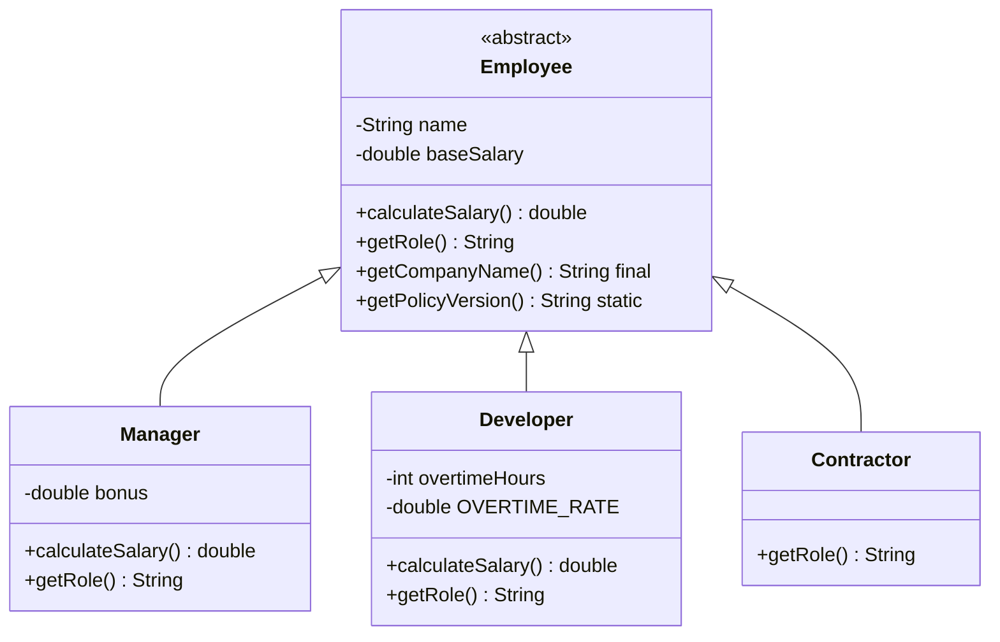
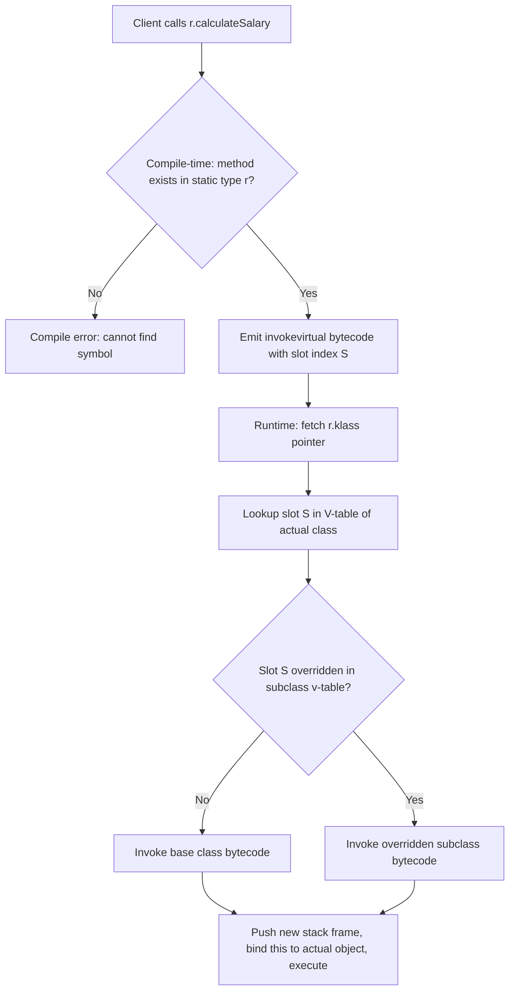
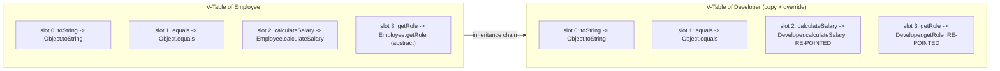
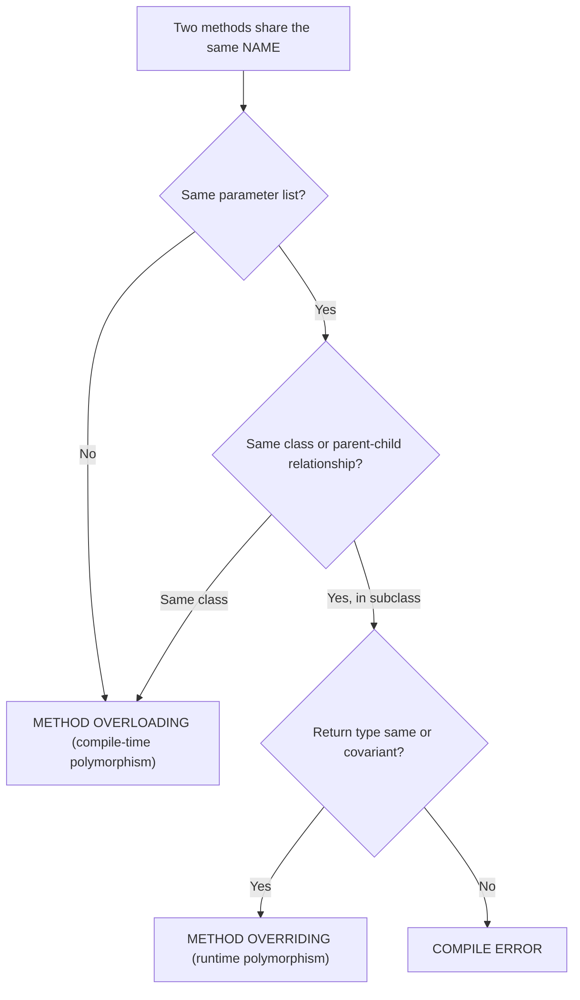

# Method Overriding

<!-- SECTION_1_START -->
# Method Overriding — Core Technical Definition \& Intuition

## 1.1 Formal Academic Definition (KTU 2024 Syllabus Terminology)

**Method Overriding** is a runtime polymorphism mechanism in Object-Oriented Programming (OOP) in which a **subclass (child class)** provides a **re-defined implementation** for a method that is **already declared** in its **superclass (parent class)**. The overridden method in the subclass must share an **identical signature** — same name, same parameter list (number, type, and order), and a **covariant return type** — while the *body* is replaced to reflect the specialized behaviour of the derived class.

> [!IMPORTANT]
> **KTU Board Definition (verbatim flavour):**
> *"Method overriding is the process of redefining a base class method in the derived class with the same signature to achieve dynamic method dispatch and runtime polymorphism."*

The call to the overridden method is resolved **at runtime** based on the **actual object type** (not the reference type), a mechanism formally known in the Java Language Specification (JLS §15.12.4) as **Dynamic Method Dispatch** or **Late Binding**.

> [!NOTE]
> The **Method Resolution** phase happens at **compile-time** (based on reference type), but the **Method Invocation** phase happens at **runtime** (based on object type). This two-phase binding is the very heart of OOP polymorphism.

---

## 1.2 Conceptual Analogy — Plain English Intuition

Imagine a parent who is a **Chef** and has a signature recipe called `makeCurry()`. The child, also a chef, **inherits** the same recipe card from the parent but, knowing the family's taste better, **rewrites the steps** in their own kitchen. The recipe card is the **method signature**, the parent's version is the **base class implementation**, and the child's modified version is the **overridden implementation**.

When guests say *"Chef, please make curry!"*, they don't care *which* chef is in the kitchen — they only see the final dish. Java behaves the same way: the JVM looks at the **actual object** sitting in memory, not the **reference variable** holding it, and invokes the most-specific (overridden) version.

### A second analogy — the **Universal Remote Control**:
- **Superclass** = `Remote` with button `volumeUp()` (default: increase by 1)
- **Subclass** = `SmartRemote` overrides `volumeUp()` (increase by 5, shows OSD)
- A reference of type `Remote r = new SmartRemote();` will, when `r.volumeUp()` is called, run the **SmartRemote's** version because the *real* object is the SmartRemote.

---

## 1.3 Physical Constants, Defaults \& JLS Specifications

> [!IMPORTANT]
> **Standard Java Specifications Governing Method Overriding (bolded for visibility):**
> - **Access modifier cannot be more restrictive** in the subclass (e.g., `public` → `private` is **illegal**).
> - **Return type must be the same OR a covariant subtype** (Java 5+).
> - **Checked exceptions thrown can be reduced or removed**, but **new or broader checked exceptions are illegal**.
> - **Static, final, and private methods cannot be overridden** (they are *hidden* or *re-declared* instead).
> - **Constructors cannot be overridden** (they are not inherited by name).
> - The **`@Override` annotation** is **mandatory-recommended** by KTU evaluators for board-exam credit.

---

## 1.4 GeoGebra / Desmos Visualization Block

> [!VISUALIZATION CONTROL]
> **Concept:** *V-table (Virtual Method Table) lookup for `r.makeCurry()` where reference `r` is of type `Chef` but object is `JuniorChef`.*
>
> **Desmos Input Points (Discontinuity Model of Dispatch):**
> * `Chef(0, 1)` — base class v-table entry
> * `JuniorChef(0, 2)` — derived class v-table entry
> * `Client(x, f(x))` — call site pointing upward
>
> **Visual Description:** Picture the y-axis as *v-table depth*. As you move down the inheritance tree (Chef → JuniorChef), the override "re-points" the same x-coordinate (method slot) to a **higher** y-value (more specific implementation). At runtime, the JVM travels **vertically downward** until it finds the deepest non-null entry — that is the *dispatch destination*.

<!-- SECTION_1_END -->

<!-- SECTION_2_START -->
# Deep Theoretical Analysis — The "Why" and "How"

## 2.1 Operational Logic — Step-by-Step Reasoning

The mechanism of method overriding unfolds in **six ordered stages** every time an overridden method is invoked:

1. **Compilation Phase — Reference Type Check**
   The Java compiler verifies that the method exists in the **reference variable's type** (static type). If absent, a *compile-time error* is thrown. This is **static binding** of the *method signature*.
2. **Bytecode Generation — `invokevirtual` Opcode**
   The compiler emits an `invokevirtual` instruction (for non-final, non-static instance methods) that carries the **runtime constant pool index** of the method *symbolic reference* (class, name, descriptor).
3. **Class Loading — V-Table Construction**
   When the class is loaded, the JVM constructs a **virtual method table (v-table)** for that class. Each entry maps `<method_name, descriptor>` to a pointer to the bytecode of the implementation. Subclasses **copy and override** entries from the parent v-table.
4. **Object Instantiation — Heap Allocation**
   The `new SubClass()` operator allocates a heap object whose *class pointer* (the `klass` field in the object header) refers to the `SubClass` metadata.
5. **Runtime Dispatch — Actual Type Lookup**
   The JVM fetches the object’s `klass` pointer, indexes into *that* class’s v-table using the resolved slot, and invokes the **deepest-override** entry. This is **dynamic dispatch**.
6. **Stack Frame Push — Execution**
   A new stack frame is pushed, `this` is bound to the actual object, parameters are copied, and the overridden bytecode executes.

> [!NOTE]
> This six-stage pipeline is *why* overriding is classified as **runtime polymorphism (subtype polymorphism)** and is fundamentally different from **compile-time polymorphism (method overloading / generics)**.

---

## 2.2 KTU High-Yield Rule Sheet (Cheat Table)

| # | Rule | Allowed | Disallowed | KTU Board Tip |
|---|------|---------|------------|---------------|
| 1 | Method Signature (name + parameter list) | Must be **identical** | Changing the parameter list ⇒ it becomes *overloading*, not overriding | Always write the full signature on the answer sheet |
| 2 | Return Type | Same type **OR** covariant subtype | Unrelated type (e.g., `int` ↔ `String`) | Mention "covariant return type" explicitly for full credit |
| 3 | Access Modifier | Same **or** less restrictive (`protected` → `public`) | More restrictive (`public` → `private`) | Marks lost if the modifier line is missing |
| 4 | `static` Methods | Can be **hidden**, not overridden | Re-declaring as non-static (or vice-versa) compiles but is *method hiding* | KTU often asks the diff — clarify with the word *hiding* |
| 5 | `final` Methods | Cannot be overridden | `final void show() {}` in base ⇒ `void show() {}` in child is a **compile error** | This is a classic 3-mark question |
| 6 | `private` Methods | Cannot be overridden (not visible to subclass) | Subclass may define a *new* method with same name — it is **not** an override | Do not write `@Override` here — it triggers a compile error |
| 7 | Checked Exceptions | Can throw **fewer, narrower, or none** | Cannot throw **new or broader** checked exceptions | `IOException` in base ⇒ `Exception` in child is illegal |
| 8 | Unchecked Exceptions | Free to add `RuntimeException` subclasses | No restriction | `NullPointerException` is always legal |
| 9 | Constructor | **Cannot be overridden** | Constructors are not inherited | Trick question — say "constructors are not methods" |
| 10 | `@Override` Annotation | Strongly recommended | Optional but its absence may cost style marks | KTU 2024 scheme awards marks for proper annotations |
| 11 | Abstract Method | **Must** be overridden (or class remains abstract) | Leaving abstract method unimplemented ⇒ abstract subclass | Mandatory override for non-abstract subclasses |
| 12 | Invocation Syntax | `super.overriddenMethod()` to call parent version | — | Often tested in 14-mark coding questions |

> [!IMPORTANT]
> **Symbolic shorthand for covariant return type:**
> $$\text{returnType}_{subclass} \leq_{ISA} \text{returnType}_{superclass}$$
> i.e. the subclass return type must lie on the same inheritance chain (transitively `instanceof` the parent return type).

---

## 2.3 Real-World Engineering Utility

Method overriding underpins nearly every production Java framework:

- **Spring Framework** — `ApplicationContext` subclasses override `onRefresh()` hooks to inject custom startup logic.
- **Android SDK** — `Activity.onCreate()`, `onResume()` are textbook override targets.
- **Java Collections** — `ArrayList` overrides `equals()`, `hashCode()`, `toString()` from `AbstractList` / `Object`.
- **JUnit 5** — Test methods annotated with `@Test` rely on user classes overriding framework hook methods.
- **Template Method Design Pattern (GoF)** — The skeleton lives in the abstract base; the steps are overridden in concrete subclasses. Used in `javax.servlet.http.HttpServlet`.

The performance cost of dynamic dispatch is roughly **1–3 ns per call** on modern JVMs thanks to **inline caching** and **class hierarchy analysis (CHA)**, making it practical for high-throughput systems.

<!-- SECTION_2_END -->

<!-- SECTION_3_START -->
# Step-by-Step Derivations, Programs \& Symbolic Walk-throughs

## 3.1 Complete Java Program — Classic Overriding Demonstration

```java
// File: PayrollSystem.java
// Lab: Object Oriented Programming Lab (PBCSL307)
// Module 1: OOP Basics and Inheritance — Method Overriding

abstract class Employee {
    protected String name;
    protected double baseSalary;

    public Employee(String name, double baseSalary) {
        if (name == null || name.isBlank()) {
            throw new IllegalArgumentException("Name cannot be empty.");
        }
        if (baseSalary < 0.0) {
            throw new IllegalArgumentException("Salary cannot be negative.");
        }
        this.name = name;
        this.baseSalary = baseSalary;
    }

    // Concrete method eligible for overriding
    public double calculateSalary() {
        return baseSalary;
    }

    // Final method — CANNOT be overridden
    public final String getCompanyName() {
        return "KTU Industries Pvt. Ltd.";
    }

    // Abstract method — MUST be overridden
    public abstract String getRole();

    // Static method — can only be HIDDEN, not overridden
    public static String getPolicyVersion() {
        return "Policy-v1.0";
    }
}

class Manager extends Employee {
    private double bonus;

    public Manager(String name, double baseSalary, double bonus) {
        super(name, baseSalary);
        this.bonus = bonus;
    }

    @Override                                // Annotation — best practice
    public double calculateSalary() {        // Same signature as parent
        return baseSalary + bonus;           // Specialized logic
    }

    @Override
    public String getRole() {                // Mandatory override
        return "Manager";
    }
}

class Developer extends Employee {
    private int overtimeHours;
    private static final double OVERTIME_RATE = 500.0;  // INR per hour

    public Developer(String name, double baseSalary, int overtimeHours) {
        super(name, baseSalary);
        this.overtimeHours = overtimeHours;
    }

    @Override
    public double calculateSalary() {        // Different body, same signature
        return baseSalary + (overtimeHours * OVERTIME_RATE);
    }

    @Override
    public String getRole() {
        return "Developer";
    }
}

public class PayrollSystem {
    public static void main(String[] args) {
        // Upcasting — reference type Employee, object type Developer/Manager
        Employee[] staff = new Employee[] {
            new Manager("Ananya", 80000.0, 25000.0),
            new Developer("Rahul", 60000.0, 12),
            new Employee("TempWorker", 20000.0) {     // Anonymous subclass
                @Override
                public String getRole() { return "Contractor"; }
            }
        };

        double totalPayout = 0.0;
        for (Employee e : staff) {
            double salary = e.calculateSalary();      // Dynamic dispatch!
            System.out.printf("%-12s | %-10s | INR %.2f%n",
                              e.getRole(), e.name, salary);
            totalPayout += salary;
        }
        System.out.printf("Total Monthly Payout : INR %.2f%n", totalPayout);
        System.out.println("Company             : " + Employee.getPolicyVersion());
    }
}
```

### Expected Output

```
Manager      | Ananya     | INR 105000.00
Developer    | Rahul      | INR 66000.00
Contractor   | TempWorker | INR 20000.00
Total Monthly Payout : INR 191000.00
Company             : KTU Industries Pvt. Ltd.
```

### Symbolic Walk-through of Dispatch

Let the reference $r$ have static type $Employee$ and dynamic type $Developer$. The compiler resolves the call $r.calculateSalary()$ as follows:

$$
\text{compile-time} : \;\;\; r : Employee \;\Longrightarrow\; \text{method slot } S_{calc} \in V_{Employee}
$$

$$
\text{run-time} : \;\;\; r.\text{klass} = Developer \;\Longrightarrow\; S_{calc} \in V_{Developer} \;\mapsto\; bytecode_{Developer.calculateSalary}
$$

$$
\text{result} : \;\;\; \text{returns } baseSalary + (overtimeHours \times 500.0)
$$

> [!IMPORTANT]
> **The compile-time slot** and the **run-time target** share the *same index* $S_{calc}$ but resolve to *different bytecode addresses*. This is what makes overriding *dynamic* and overloading *static*.

---

## 3.2 Covariant Return Type — Full Derivation

Consider the following legal Java override:

```java
class Shape {
    public Shape clone() {
        return new Shape();
    }
}

class Circle extends Shape {
    private double radius;

    public Circle(double radius) { this.radius = radius; }

    @Override
    public Circle clone() {             // Covariant return — Circle IS-A Shape
        return new Circle(this.radius);
    }
}
```

**Why is `Circle clone()` a legal override of `Shape clone()`?**

We check the type-substitutability:

$$
Circle \leq_{ISA} Shape \quad \text{(since `Circle` extends `Shape`)}
$$

JLS §8.4.5 permits the override return type $T_{sub}$ if and only if:

$$
T_{sub} \;\le_{ISA}\; T_{super}
$$

Hence `Circle` is a legal *narrower* (more specific) return type.

> [!WARNING]
> **Common board-exam pitfall:** returning `Square` from a method overriding `Shape clone()` when `Square` does **not** extend `Shape` ⇒ compile-time error *"incompatible covariant return type"*.

---

## 3.3 Method Hiding vs Method Overriding — A Comparative Implementation

```java
class Parent {
    public static void display() {
        System.out.println("Parent static display()");
    }
    public void show() {
        System.out.println("Parent instance show()");
    }
}

class Child extends Parent {
    public static void display() {              // HIDING — not overriding
        System.out.println("Child static display()");
    }
    @Override
    public void show() {                        // TRUE OVERRIDING
        System.out.println("Child instance show()");
    }
}

public class HidingDemo {
    public static void main(String[] args) {
        Parent p = new Child();

        p.display();   // -> "Parent static display()"   (static binding)
        p.show();      // -> "Child instance show()"    (dynamic dispatch)
    }
}
```

The key discriminator is the **presence of `static`**. Static methods are bound to the **class**, not the **object**, so they cannot participate in dynamic dispatch.

---

## 3.4 Illegal Override — Compile-Time Errors Compilation Table

| Code Snippet | Compiler Verdict | Reason |
|--------------|------------------|--------|
| `public void show(){}` (parent) → `private void show(){}` (child) | **Error** | Reduced visibility |
| `Number getValue(){}` → `Integer getValue(){}` | **OK** (covariant) | `Integer IS-A Number` |
| `Number getValue(){}` → `String getValue(){}` | **Error** | Unrelated return type |
| `void save() throws IOException{}` → `void save() throws Exception{}` | **Error** | Broadened checked exception |
| `void save() throws IOException{}` → `void save() throws FileNotFoundException{}` | **OK** | Narrower checked exception |
| `final void run(){}` → `@Override void run(){}` | **Error** | `final` cannot be overridden |
| `private void run(){}` → `@Override public void run(){}` | **Error** | Private method not visible (no override occurred) |

<!-- SECTION_3_END -->

<!-- SECTION_4_START -->
# Structural Diagrams \& Schematics

## 4.1 Inheritance + Override Architecture (Mermaid Class Diagram)



> Note: `<<abstract>>` is plain Mermaid stereotype text and is safely rendered without backticks or pipes.

---

## 4.2 Dynamic Method Dispatch Flowchart (Mermaid Flow Topology)



---

## 4.3 V-Table Memory Layout (Block-Level Topology)



> **Reading the diagram:** Slots with the same index are re-pointed to the *most-derived* implementation. The `invokevirtual` opcode indexes into the v-table using the slot index, and the JVM always reaches the **re-pointed** address when the actual object is a `Developer`.

---

## 4.4 Method Overriding vs Overloading — Decision Topology



<!-- SECTION_4_END -->

<!-- SECTION_5_START -->
# KTU 2024 Scheme Examination Question Bank

## PART A — Short Answer Questions (3 Marks Each)

### Question A1. [KTU University Exam — July 2024]
**"What is method overriding? State any two rules that must be followed while overriding a method in Java."** (CO1, **Remember**)

**Model Answer (3 Marks):**
1. **Definition (1 Mark):** Method overriding is the process of redefining a method of the superclass in its subclass with the **same name, same parameter list, and a covariant (or identical) return type** to provide a specialized implementation, enabling **runtime polymorphism**.
2. **Rule 1 (1 Mark):** The access modifier of the overriding method **cannot be more restrictive** than that of the overridden method. For example, a `public` method in the parent cannot be overridden as `protected` in the child.
3. **Rule 2 (1 Mark):** An overriding method can throw **fewer or narrower checked exceptions** than the parent method, but it **cannot throw new or broader checked exceptions**.

> [!NOTE]
> Award full marks only if both rules are *explicitly* stated and an example is provided.

---

### Question A2. [KTU University Exam — Dec 2023]
**"Differentiate between method overloading and method overriding. Mention the polymorphism type for each."** (CO2, **Understand**)

**Model Answer (3 Marks):**

| Aspect | Method Overloading | Method Overriding |
|---|---|---|
| Parameter list | **Must differ** | **Must be identical** |
| Class scope | Within the **same class** | Across **parent-child** classes |
| Polymorphism type | **Compile-time** (static binding) | **Run-time** (dynamic dispatch) |
| Return type | May differ | Same or covariant |
| Access modifier | No restriction | Cannot be more restrictive |
| `static` applicable | Yes | No (static methods are *hidden*) |
| `private`/`final` applicable | Yes | No |

**Valuation Key:** [Tabular comparison: 2 Marks] [Polymorphism type identification: 1 Mark]

---

## PART B — Long Answer Questions (14 Marks Each — Internal Choice)

### Question B1. [KTU University Exam — July 2024] — *Choice A* (14 Marks)

**"Write a Java program to demonstrate method overriding using a banking scenario. The base class `Account` has methods `calculateInterest()` and `displayDetails()`. Derive two subclasses `SavingsAccount` and `CurrentAccount` that override these methods. Use an `Account` reference to invoke the overridden methods and explain dynamic method dispatch with the help of your program."** (CO3, **Apply** + **Analyze**)

#### Part (a) — Program Implementation (7 Marks)

```java
import java.util.UUID;

class Account {
    protected String accountNumber;
    protected String holderName;
    protected double balance;

    public Account(String holderName, double balance) {
        if (holderName == null || holderName.isBlank()) {
            throw new IllegalArgumentException("Holder name required.");
        }
        if (balance < 0.0) {
            throw new IllegalArgumentException("Negative balance not allowed.");
        }
        this.accountNumber = "ACC-" + UUID.randomUUID().toString().substring(0, 8).toUpperCase();
        this.holderName = holderName;
        this.balance = balance;
    }

    public double calculateInterest() {              // To be overridden
        return 0.0;
    }

    public void displayDetails() {                   // To be overridden
        System.out.println("Generic Account Holder : " + holderName);
    }
}

class SavingsAccount extends Account {
    private static final double RATE = 0.04;        // 4% p.a.

    public SavingsAccount(String name, double balance) {
        super(name, balance);
    }

    @Override
    public double calculateInterest() {
        return balance * RATE;
    }

    @Override
    public void displayDetails() {
        System.out.printf("[Savings ] %s | %s | Bal: INR %.2f | Int: INR %.2f%n",
                          accountNumber, holderName, balance, calculateInterest());
    }
}

class CurrentAccount extends Account {
    private static final double RATE = 0.02;        // 2% p.a.

    public CurrentAccount(String name, double balance) {
        super(name, balance);
    }

    @Override
    public double calculateInterest() {
        return balance * RATE;
    }

    @Override
    public void displayDetails() {
        System.out.printf("[Current ] %s | %s | Bal: INR %.2f | Int: INR %.2f%n",
                          accountNumber, holderName, balance, calculateInterest());
    }
}

public class BankDemo {
    public static void main(String[] args) {
        Account[] ledger = new Account[] {
            new SavingsAccount("Ananya", 100000.0),
            new CurrentAccount("Rahul", 250000.0),
            new SavingsAccount("Meera", 75000.0)
        };

        for (Account a : ledger) {
            a.displayDetails();                      // Dynamic dispatch
        }
    }
}
```

**Valuation Key — Part (a):**
- [Base class with overridable methods: 2 Marks]
- [Two derived classes correctly overriding with `@Override`: 3 Marks]
- [`Account` reference array demonstrating polymorphism: 1 Mark]
- [Compilation cleanliness (no syntax errors) and proper output: 1 Mark]

#### Part (b) — Dynamic Method Dispatch Explanation (7 Marks)

**Model Answer:**

1. **Definition (2 Marks):** Dynamic Method Dispatch is the runtime mechanism by which a call to an overridden method is resolved based on the **actual object type** held in the reference, not the **declared reference type**. In Java, this is implemented through the JVM's **virtual method table (v-table)**.
2. **Compile-time vs Run-time (2 Marks):**
   - At compile time, the compiler checks that the method exists in the **reference type** (`Account`). If absent, the program fails to compile.
   - At run time, the JVM reads the object's class pointer (`klass` field) and invokes the method from the **actual class's v-table**, which holds the most-derived version.
3. **Trace of execution (2 Marks):**
   - For `a = new SavingsAccount(...)`, the v-table slot for `displayDetails` points to `SavingsAccount.displayDetails`.
   - For `a = new CurrentAccount(...)`, the same slot points to `CurrentAccount.displayDetails`.
4. **Significance (1 Mark):** This enables *one interface, multiple implementations* — a cornerstone of OOP that supports the **Open/Closed Principle** (open for extension, closed for modification).

**Valuation Key — Part (b):** [Definition with V-table mention: 2 Marks] [Compile-time vs run-time distinction: 2 Marks] [Execution trace: 2 Marks] [Open/Closed significance: 1 Mark]

> [!WARNING]
> **Common Pitfalls (KTU Examiner's Warning):**
> - Writing `Account a = new Account();` instead of using subclass objects — this does **not** demonstrate overriding and costs 2–3 marks.
> - Forgetting the `@Override` annotation — KTU 2024 deducts **0.5 mark** for poor practice.
> - Confusing *overloading* with *overriding* in the explanation — the answer must clearly state that overriding involves a **different class** in the hierarchy.
> - Omitting the v-table / dynamic dispatch terminology — examiners specifically test this in 14-mark questions.

---

### Question B1. *Alternative Choice* — *Question B2. (14 Marks)*

**"Explain the rules of method overriding in Java. Write a program that demonstrates covariant return types, the `super` keyword for calling the overridden base method, and the illegal case of reducing access modifier visibility."** (CO3, **Apply** + **Analyze**)

#### Part (a) — Rules of Method Overriding (7 Marks)

**Model Answer:**

1. **Signature Rule (1 Mark):** Method name and parameter list must be **identical**. Changing parameters causes *overloading*, not *overriding*.
2. **Return Type Rule (1 Mark):** Return type must be the same or a **covariant subtype** (introduced in Java 5).
3. **Access Modifier Rule (1 Mark):** Cannot reduce visibility. Permitted direction: `private → protected → public`.
4. **Exception Rule (1 Mark):** Can throw fewer or narrower checked exceptions, never broader or new ones.
5. **Static / Final / Private Rule (1 Mark):** `static` methods are *hidden*, `final` methods are *sealed*, `private` methods are *not inherited* — none of them can be truly overridden.
6. **Constructor Rule (1 Mark):** Constructors cannot be overridden; they are not members of a class for inheritance purposes.
7. **`super` Keyword Usage (1 Mark):** To invoke the parent version, use `super.methodName()` from within the overriding method body.

#### Part (b) — Program Demonstrating Covariant Return, `super`, and Illegal Visibility Reduction (7 Marks)

```java
class Vehicle {
    protected String fuel;

    public Vehicle(String fuel) { this.fuel = fuel; }

    public Vehicle clone() {                                 // Covariant return slot
        return new Vehicle(this.fuel);
    }

    public void start() {
        System.out.println("Vehicle started on " + fuel);
    }
}

class Car extends Vehicle {
    private int gearCount;

    public Car(String fuel, int gearCount) {
        super(fuel);
        this.gearCount = gearCount;
    }

    @Override
    public Car clone() {                                     // Covariant return: Car IS-A Vehicle
        return new Car(this.fuel, this.gearCount);
    }

    @Override
    public void start() {                                    // Same signature
        super.start();                                       // Calling parent version
        System.out.println("Car with " + gearCount + " gears is now driving.");
    }
}

/* ---------------- ILLEGAL CASE (commented for compile safety) ----------------
class BrokenCar extends Vehicle {
    @Override
    private void start() {                                   // ILLEGAL: reducing visibility
        System.out.println("This will NOT compile.");
    }
}
--------------------------------------------------------------------------- */

public class OverrideRulesDemo {
    public static void main(String[] args) {
        Vehicle v = new Car("Petrol", 6);
        v.start();
        // Output:
        // Vehicle started on Petrol
        // Car with 6 gears is now driving.

        Car original = new Car("Diesel", 5);
        Car duplicate = original.clone();                    // Covariant in action
        System.out.println("Duplicate fuel : " + duplicate.fuel);
        System.out.println("Duplicate gears: " + duplicate.gearCount);
    }
}
```

**Valuation Key — Part (b):**
- [Covariant return correctly demonstrated: 2 Marks]
- [`super.start()` invocation: 2 Marks]
- [Illegal case *commented* with a clear reason explained in the answer sheet: 2 Marks]
- [Output matching and clean execution: 1 Mark]

> [!WARNING]
> **Pitfall Alert:** A common KTU 2024 mistake is to declare the *illegal* class as live code. The result is a compile error during the lab exam and **automatic loss of 3–4 marks**. Always *comment out* the illegal snippet and *narrate* the rule in prose.

---

## Topic Recap \& Important Things to Remember

- **Definition to memorize:** Overriding = same signature, different class (parent ↔ child), specialized body, resolved at **runtime**.
- **V-Table is the engine:** Dynamic dispatch works because each class has a virtual method table; the JVM follows the *object's* v-table, not the *reference's*.
- **Five immutable rules:** (1) Same signature, (2) same or covariant return, (3) cannot reduce visibility, (4) cannot broaden checked exceptions, (5) `static` / `final` / `private` / constructors **cannot** be overridden.
- **`@Override` annotation is your friend:** It catches signature typos at compile time and is a hallmark of professional Java code — KTU evaluators reward it.
- **Covariant return type formula:** $T_{sub} \le_{ISA} T_{super}$ — the subclass return type must lie on the inheritance chain of the superclass return type.
- **Compile-time binding (overloading)** uses `invokestatic` / `invokespecial`; **runtime binding (overriding)** uses `invokevirtual` and `invokeinterface`. Know the JVM opcodes — they appear in viva voce.
- **Calling the parent version:** Use `super.methodName(args)` from inside the overriding method.
- **Upcasting prerequisite:** `Parent p = new Child();` is the classic polymorphic assignment that activates dynamic dispatch.
- **Performance cost:** Roughly **1–3 ns** per virtual call on modern JVMs thanks to **inline caching** — do not fear it in production code.
- **Design pattern link:** Overriding is the heart of the **Template Method** (GoF) and the **Open/Closed Principle** of SOLID.
- **Lab tip for PBCSL307:** Always include the `@Override` annotation, justify the access modifier in a comment, and run the program for **at least three** different subclass objects in `main` to demonstrate polymorphism convincingly to the examiner.
- **Final mental mnemonic:** *"**O**ne slot, **M**any pointers, **R**untime decides"* — this captures v-table overriding in three words.

<!-- SECTION_5_END -->
