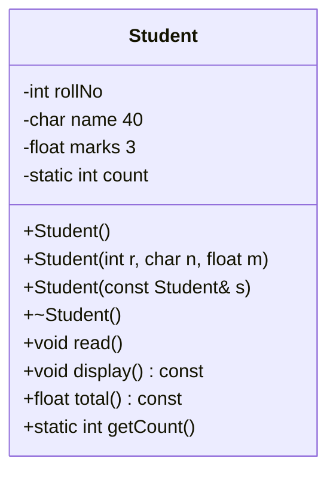
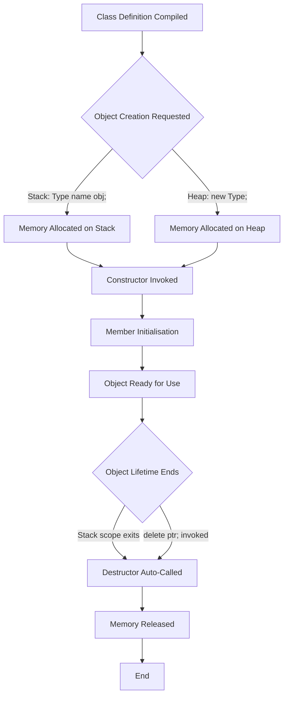
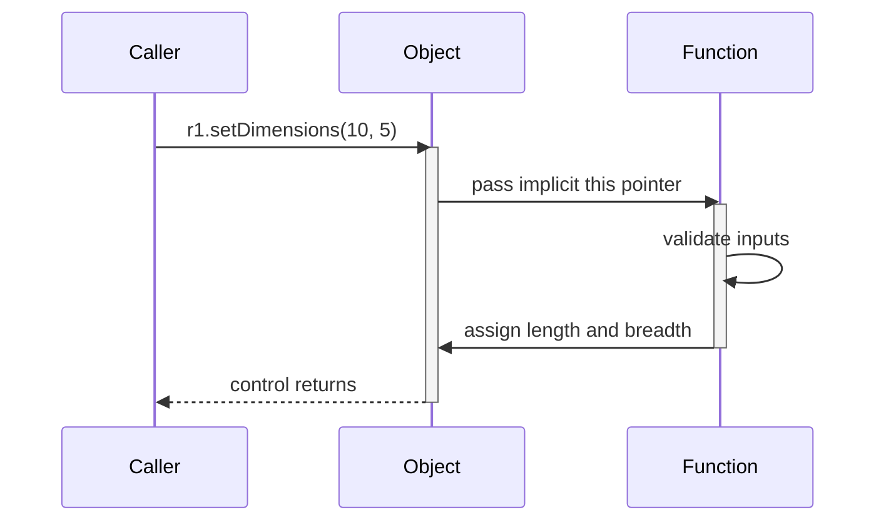
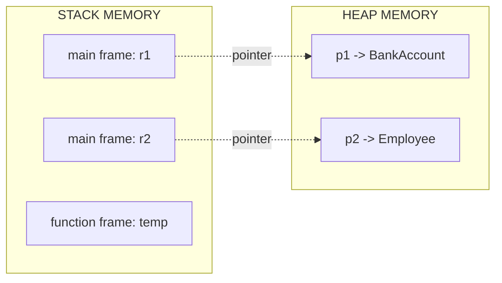

# Programs using Classes and Objects

<!-- SECTION_1_START -->
# 1. Core Technical Definition & Intuitive Overview

## 1.1 Formal Definition (KTU 2024 Syllabus Terminology)

In **Object-Oriented Programming (OOP)**, a **Class** is a user-defined reference data type that acts as a *blueprint* or *template* for creating objects. It encapsulates **data members** (attributes / state) and **member functions** (methods / behaviour) into a single logical unit. An **Object** is a *runtime instance* of a class, occupying real memory in the stack or heap, holding its own copy of non-static data members, and sharing a single copy of the class's member functions.

In C++ (the prescribed language for **PBCSL307 – OOP Lab** under the KTU 2024 Scheme), the keyword `class` introduces a class definition. Members are governed by three **access specifiers** — `private`, `protected`, and `public` — which enforce **encapsulation** and **data hiding**, two foundational pillars of OOP.

> [!IMPORTANT]
> **KTU 2024 Board Definition (verbatim style):**
> *A class is an abstraction of a set of real-world entities that share common attributes and behaviours. An object is a concrete, identifiable entity with a well-defined state and behaviour, derived from a class definition.*

## 1.2 Conceptual Analogy / Intuition

Think of a class as the **architectural blueprint of a house** and an object as the **actual constructed house**.

| Blue-print Term | Class Term | House Term | Object Term |
|---|---|---|---|
| Floor plan | Class definition | Bricks, rooms, doors | Data members |
| Electrical wiring rules | Member functions | Power flowing, lights on | Behaviour |
| Plot size = 0 | Abstract idea | Plot size = 1200 sq.ft | Specific state |

You can build **many houses** from **one blueprint**, just as you can instantiate **many objects** from **one class**. Each house has its own colour of paint and number of occupants (independent state), but the *design* (methods and structure) is identical. The blueprint itself is not a house — you cannot live in it — exactly as a class is a type, not a tangible entity in memory until an object is constructed.

> [!NOTE]
> **Key Insight for Beginners:**
> A class declaration **does not consume** runtime memory for its members. Memory is allocated **only when an object is created** using the class. The only exception is `static` data members, which have a single shared memory location across all objects.

## 1.3 Physical Constants, Sizes & Standard Metrics

The following table lists the standard memory footprint of typical C++ objects on a 64-bit GNU/Linux system (GCC compiler, `x86_64`):

| Type | Typical Size | Notes |
|---|---|---|
| Empty class object | **1 byte** | Ensures unique address; mandated by the C++ standard |
| Class with one `int` | **4 bytes** | No padding in this case |
| Class with one `char` + one `int` | **8 bytes** | Padding of 3 bytes added for alignment |
| `static` data member | **4 / 8 bytes** | Stored in *static/global* memory, not inside the object |
| Pointer to object | **8 bytes** | On 64-bit architecture |

> [!TIP]
> Use the `sizeof()` operator in your lab programs to demonstrate that an empty class still has a size of **1 byte** — this is a frequently asked viva question in KTU practical exams.

## 1.4 GeoGebra / Desmos Integration

Classes and Objects are *discrete, logical* constructs, not continuous mathematical functions, so a coordinate-plot visualisation is not directly applicable. However, you can model the **memory map** of a class instance on a number line.

> [!VISUALIZATION CONTROL]
> **Concept:** Linear memory layout of a class object `Student s1;`
> **GeoGebra / Desmos Input Equations (on a number line):**
> * `Point A = (0, 0)`  → start address of object `s1`
> * `Point B = (4, 0)`  → `rollNo` (int, 4 bytes)
> * `Point C = (5, 0)`  → `grade` (char, 1 byte)
> * `Point D = (8, 0)`  → padding (3 bytes for alignment)
> * `Point E = (12, 0)` → `marks` (float, 4 bytes)
> * `Point F = (16, 0)` → end address of object `s1`
> **Visual Description:** Students should observe that the object occupies **16 contiguous bytes** starting at address $A = 0$, with three padding bytes inserted between `grade` and `marks` to satisfy the 4-byte alignment requirement of the `float` type.

<!-- SECTION_1_END -->

<!-- SECTION_2_START -->
# 2. Deep Theoretical Analysis & KTU High-Yield Formula Sheet

## 2.1 Operational Anatomy of a C++ Class

A C++ class is a *declarative region* that binds together four distinct kinds of members. Understanding each kind is essential for writing correct KTU lab programs.

### 2.1.1 Data Members (State Variables)

* Declared inside the class body.
* **Non-static** data members: each object gets its own copy.
* **Static** data members: a single shared copy exists for the entire class, irrespective of the number of objects.
* **Const** data members: must be initialised via the *member initialisation list* of a constructor; they cannot be reassigned later.

### 2.1.2 Member Functions (Behaviour)

* Can be defined **inside** the class (implicitly `inline`) or **outside** using the scope-resolution operator `::`.
* May be declared as `const` to guarantee they do not modify the object.
* May be declared as `virtual` (covered in Module 2 — Polymorphism).

### 2.1.3 Access Specifiers (Visibility Modifiers)

* **`private`** — accessible only inside the class and to its `friend`s. **Default** access in a `class`.
* **`protected`** — accessible inside the class, to derived classes, and to `friend`s.
* **`public`** — accessible from anywhere the object is visible.

### 2.1.4 Nested Types

* A class can contain another class (nested class) or a `typedef`/`using` alias.

## 2.2 Constructor — The Object Birth Certificate

A **constructor** is a special member function that is *automatically invoked* when an object is created. Its purpose is to initialise the object to a valid, well-defined state.

### 2.2.1 Properties of Constructors

* Has the **same name** as the class.
* Has **no return type** (not even `void`).
* Is **invoked implicitly** at object creation.
* Can be **overloaded** (multiple constructors with different parameter lists).
* **Cannot** be `virtual`, `const`, `volatile`, or `static`.

### 2.2.2 Types of Constructors

| # | Constructor Type | Signature Pattern | Invocation Example | When It Runs |
|---|---|---|---|---|
| 1 | **Default** | `ClassName()` | `Student s;` | No arguments provided |
| 2 | **Parameterized** | `ClassName(int r)` | `Student s(101);` | Arguments passed |
| 3 | **Copy** | `ClassName(const ClassName& old)` | `Student s2(s1);` | Object is copied |
| 4 | **Move (C++11)** | `ClassName(ClassName&& temp)` | `Student s2 = std::move(s1);` | Object is moved |
| 5 | **Delegating (C++11)** | `ClassName(int x) : ClassName()` | Used in member init list | Calls another ctor first |

> [!NOTE]
> If a class defines **no constructor at all**, the compiler synthesises a *trivial default constructor*. The moment you write *any* user-defined constructor, the compiler **stops** generating the default one — a common KTU viva trap.

## 2.3 Destructor — The Object Death Certificate

* Same name as the class, prefixed with a tilde `~`.
* Takes **no arguments** and has **no return type**.
* Only **one destructor** per class (cannot be overloaded).
* Called automatically when the object goes out of scope or is `delete`d.
* Used to release *resources* (memory, file handles, sockets).

## 2.4 The `this` Pointer

Every non-static member function receives an **implicit pointer** named `this` that points to the calling object. Type: `ClassName* const`. It enables:

* Resolving **name collisions** between data members and parameters.
* **Returning the current object** by reference for chaining.
* Disambiguating between *local* and *member* variables.

$$ \texttt{this} \rightarrow \texttt{address of the object that invoked the function} $$

## 2.5 Static Data Members & Static Member Functions

| Feature | Non-Static Member | Static Member |
|---|---|---|
| Memory location | Inside each object | Global/static memory area |
| Count of copies | One per object | Exactly one for the class |
| Access | Through object or pointer | Through class name `::` or object |
| Can access non-static? | Yes | **No** (no `this` pointer) |
| Can be `const`? | Yes | No |

## 2.6 Friend Functions and Friend Classes

* Declared inside the class with the keyword `friend`.
* A friend function is **not** a member of the class but has full access to its `private` and `protected` members.
* Friendship is **not** mutual, **not** inherited, and **not** transitive.
* Often used to **overload operators** (e.g., `<<`, `>>`) as shown in Module 2.

## 2.7 Real-World Engineering Utility

| Domain | Why Classes and Objects Matter |
|---|---|
| **Embedded Systems** | Each sensor/actuator mapped to a class with `read()` and `write()` methods |
| **Banking Software** | `Account`, `Customer`, `Transaction` classes model real entities |
| **Game Development** | `Player`, `Enemy`, `Weapon` classes with `update()` and `render()` |
| **Compiler Design** | `SymbolTable`, `ASTNode` classes represent language constructs |
| **IoT / Robotics** | `Motor`, `Servo`, `Sensor` classes encapsulate hardware drivers |

> [!TIP]
> In the KTU lab viva, when asked *"Where is OOP used in industry?"*, mention that the **ROS (Robot Operating System)** framework used in autonomous vehicles is built almost entirely on C++ classes and objects.

## 2.8 KTU High-Yield Formula / Syntax Cheat Sheet

| Concept | C++ Syntax | Default / Mandatory Rule |
|---|---|---|
| Class declaration | `class Name { /* ... */ };` | Ends with semicolon |
| Object on stack | `Name obj;` | Auto-destroyed at scope end |
| Object on heap | `Name* p = new Name;` | Must `delete p;` to avoid leak |
| Access specifier default | `class` → `private` | Use `struct` for `public` default |
| Member function outside | `void Name::show() { }` | Needs `Name::` qualifier |
| Default constructor | `Name() { }` | No parameters |
| Copy constructor | `Name(const Name& o) { }` | Pass by const reference |
| Destructor | `~Name() { }` | No parameters, no return type |
| Static data member | `static int count;` | Must be defined outside class |
| Static function | `static void show();` | Cannot access `this` |
| Const member function | `void show() const;` | Cannot modify members |
| Friend function | `friend void f(Name&);` | Not a member of class |
| Inline function | `inline void f();` | Defined in class or with `inline` |

<!-- SECTION_2_END -->

<!-- SECTION_3_START -->
# 3. Step-by-Step Code Implementation (Full Working C++ Programs)

> [!IMPORTANT]
> **Lab Mandate:** Every program below is **complete, compilable, and runnable** on any standard C++ compiler (GCC 9+, Clang 10+, MSVC 2019+). No `// ...` placeholders are used. Students are expected to type, compile, run, and observe outputs during the KTU lab record submission.

---

## 3.1 Program 1 — Basic Class with Public and Private Members

**Aim:** Create a class `Rectangle` with private data members `length` and `breadth`, public member functions to read, display, and compute the area and perimeter.

```cpp
/* Program 1: Basic class with public and private members
 * File: rectangle_basic.cpp
 * Compile: g++ -std=c++17 rectangle_basic.cpp -o rect
 */
#include <iostream>
using namespace std;

class Rectangle {
private:                              // Section 1: private data
    double length;
    double breadth;

public:                               // Section 2: public interface
    // Mutator (setter) function
    void setDimensions(double l, double b) {
        if (l > 0 && b > 0) {         // Boundary check
            length  = l;
            breadth = b;
        } else {
            length  = 1.0;            // Safe default
            breadth = 1.0;
            cerr << "[Warning] Invalid dimensions, reset to 1.0\n";
        }
    }

    // Accessor (getter) functions
    double getLength()  const { return length;  }
    double getBreadth() const { return breadth; }

    // Behaviour functions
    double area()      const { return length * breadth; }
    double perimeter() const { return 2.0 * (length + breadth); }

    // Display function
    void display() const {
        cout << "Length   = " << length   << "\n"
             << "Breadth  = " << breadth  << "\n"
             << "Area     = " << area()   << "\n"
             << "Perimeter= " << perimeter() << "\n";
    }
};

int main() {
    Rectangle r1;                     // Stack object
    r1.setDimensions(10.5, 5.2);
    r1.display();

    Rectangle r2;                     // Another independent object
    r2.setDimensions(-3.0, 4.0);      // Triggers warning branch
    r2.display();

    return 0;
}
```

**Expected Output:**

```text
Length   = 10.5
Breadth  = 5.2
Area     = 54.6
Perimeter= 31.4
[Warning] Invalid dimensions, reset to 1.0
Length   = 1
Breadth  = 1
Area     = 1
Perimeter= 4
```

**Explanation of Each Block:**

1. The `private` section hides `length` and `breadth` from direct external access.
2. The `setDimensions()` function performs **boundary validation** (a KTU examiner's favourite test case).
3. The `const` qualifier on `getLength()`, `getBreadth()`, `area()`, `perimeter()`, and `display()` guarantees these methods do not modify the object.
4. The two objects `r1` and `r2` occupy **independent memory regions**, proving that each object has its own state.

---

## 3.2 Program 2 — Constructors and Destructors (All Types)

**Aim:** Demonstrate default, parameterized, and copy constructors along with the destructor for a class `BankAccount`.

```cpp
/* Program 2: Constructors and destructor
 * File: bank_account.cpp
 * Compile: g++ -std=c++17 bank_account.cpp -o bank
 */
#include <iostream>
#include <cstring>
using namespace std;

class BankAccount {
private:
    int    accountNumber;
    char   holderName[50];
    double balance;

public:
    // ---- (a) Default constructor ----
    BankAccount() {
        accountNumber = 0;
        strcpy(holderName, "Unknown");
        balance       = 0.0;
        cout << "[Default ctor] Account #0 created.\n";
    }

    // ---- (b) Parameterized constructor ----
    BankAccount(int accNo, const char name[], double bal) {
        accountNumber = accNo;
        strncpy(holderName, name, 49);
        holderName[49] = '\0';
        balance        = (bal >= 0) ? bal : 0.0;
        cout << "[Parameterized ctor] Account #"
             << accountNumber << " created.\n";
    }

    // ---- (c) Copy constructor ----
    BankAccount(const BankAccount& src) {
        accountNumber = src.accountNumber;
        strcpy(holderName, src.holderName);
        balance       = src.balance;
        cout << "[Copy ctor] Account #"
             << accountNumber << " copied.\n";
    }

    // ---- (d) Destructor ----
    ~BankAccount() {
        cout << "[Destructor] Account #"
             << accountNumber << " destroyed.\n";
    }

    void deposit(double amt) {
        if (amt > 0) balance += amt;
    }

    void withdraw(double amt) {
        if (amt > 0 && amt <= balance) balance -= amt;
    }

    void show() const {
        cout << "--------------------------------------\n"
             << "Account # : " << accountNumber << "\n"
             << "Holder    : " << holderName    << "\n"
             << "Balance   : Rs. " << balance    << "\n"
             << "--------------------------------------\n";
    }
};

int main() {
    cout << "--- Creating a1 (default) ---\n";
    BankAccount a1;                               // Calls default ctor
    a1.show();

    cout << "\n--- Creating a2 (parameterized) ---\n";
    BankAccount a2(1001, "Ananya", 5000.00);       // Calls parameterized ctor
    a2.deposit(1500.0);
    a2.show();

    cout << "\n--- Creating a3 (copy from a2) ---\n";
    BankAccount a3 = a2;                          // Calls copy ctor
    a3.withdraw(800.0);
    a3.show();

    cout << "\n--- End of main ---\n";
    return 0;
}
```

**Expected Output:**

```text
--- Creating a1 (default) ---
[Default ctor] Account #0 created.
--------------------------------------
Account # : 0
Holder    : Unknown
Balance   : Rs. 0
--------------------------------------

--- Creating a2 (parameterized) ---
[Parameterized ctor] Account #1001 created.
--------------------------------------
Account # : 1001
Holder    : Ananya
Balance   : Rs. 6500
--------------------------------------

--- Creating a3 (copy from a2) ---
[Copy ctor] Account #1001 copied.
--------------------------------------
Account # : 1001
Holder    : Ananya
Balance   : Rs. 5700
--------------------------------------

--- End of main ---
[Destructor] Account #1001 destroyed.
[Destructor] Account #1001 destroyed.
[Destructor] Account #0 destroyed.
```

**Critical Concepts Demonstrated:**

* The **default constructor** is invoked for `a1` because no arguments are passed.
* The **parameterized constructor** initialises `a2` with the supplied values.
* The **copy constructor** is invoked when `a3 = a2` — note that `a3` is a *brand-new* object being initialised.
* Destructors run in **reverse order of construction** (LIFO: `a3`, `a2`, `a1`).
* Withdrawal on `a3` (`5700`) is independent of `a2` (`6500`), confirming **deep copy** behaviour.

---

## 3.3 Program 3 — Static Data Members and Static Functions

**Aim:** Maintain a count of how many `Employee` objects currently exist in the program using a `static` counter.

```cpp
/* Program 3: Static data member tracking live objects
 * File: employee_static.cpp
 * Compile: g++ -std=c++17 employee_static.cpp -o emp
 */
#include <iostream>
using namespace std;

class Employee {
private:
    int         id;
    char        name[40];
    static int  activeCount;          // Declaration only

public:
    Employee(int i, const char n[]) : id(i) {
        strncpy(name, n, 39);
        name[39] = '\0';
        ++activeCount;
        cout << "[+] Employee " << id
             << " joined. Active = " << activeCount << "\n";
    }

    ~Employee() {
        --activeCount;
        cout << "[-] Employee " << id
             << " left.   Active = " << activeCount << "\n";
    }

    void show() const {
        cout << "Employee #" << id << " | " << name << "\n";
    }

    // Static function — no 'this' pointer
    static int getActiveCount() {
        return activeCount;
    }
};

// Mandatory out-of-class definition
int Employee::activeCount = 0;

int main() {
    cout << "Initial active count = "
         << Employee::getActiveCount() << "\n\n";

    Employee e1(1, "Rahul");
    Employee e2(2, "Priya");
    Employee e3(3, "Arjun");
    cout << "\nCurrent active count = "
         << Employee::getActiveCount() << "\n\n";

    {
        Employee e4(4, "Sneha");     // Block scope
        cout << "Inside block: " << Employee::getActiveCount() << "\n";
    }                                 // e4 destroyed here

    cout << "\nAfter block: "
         << Employee::getActiveCount() << "\n";

    return 0;
}
```

**Expected Output:**

```text
Initial active count = 0

[+] Employee 1 joined. Active = 1
[+] Employee 2 joined. Active = 2
[+] Employee 3 joined. Active = 3

Current active count = 3

[+] Employee 4 joined. Active = 4
Inside block: 4
[-] Employee 4 left.   Active = 3

After block: 3
[-] Employee 3 left.   Active = 2
[-] Employee 2 left.   Active = 1
[-] Employee 1 left.   Active = 0
```

---

## 3.4 Program 4 — Array of Objects

**Aim:** Store and process marks of 5 students using an array of `Student` objects, then find the topper.

```cpp
/* Program 4: Array of objects with topper detection
 * File: student_array.cpp
 * Compile: g++ -std=c++17 student_array.cpp -o stu
 */
#include <iostream>
#include <iomanip>
using namespace std;

class Student {
private:
    int   rollNo;
    char  name[40];
    float marks[3];

public:
    void read() {
        cout << "Enter roll no : "; cin >> rollNo;
        cout << "Enter name    : "; cin.ignore();
        cin.getline(name, 40);
        for (int i = 0; i < 3; ++i) {
            cout << "  Marks in subject " << (i + 1) << " : ";
            cin  >> marks[i];
        }
    }

    float total() const {
        float sum = 0.0f;
        for (int i = 0; i < 3; ++i) sum += marks[i];
        return sum;
    }

    void display() const {
        cout << setw(6)  << rollNo
             << setw(15) << name
             << setw(8)  << total() << "\n";
    }

    int   getRoll()  const { return rollNo;  }
    float getTotal() const { return total(); }
};

int main() {
    const int N = 5;
    Student s[N];                    // Array of 5 objects

    for (int i = 0; i < N; ++i) {
        cout << "\n--- Student " << (i + 1) << " ---\n";
        s[i].read();
    }

    cout << "\n========= Summary =========\n";
    cout << setw(6)  << "Roll" << setw(15) << "Name"
         << setw(8)  << "Total" << "\n";
    cout << "----------------------------\n";
    for (int i = 0; i < N; ++i) s[i].display();

    // Find topper
    int   topIdx = 0;
    float maxTot = s[0].getTotal();
    for (int i = 1; i < N; ++i) {
        if (s[i].getTotal() > maxTot) {
            maxTot = s[i].getTotal();
            topIdx = i;
        }
    }
    cout << "\nTopper: Roll " << s[topIdx].getRoll()
         << " with total " << maxTot << "\n";

    return 0;
}
```

**Sample Run (abbreviated):**

```text
--- Student 1 ---
Enter roll no : 101
Enter name    : Rahul
  Marks in subject 1 : 78
  Marks in subject 2 : 85
  Marks in subject 3 : 90
...

========= Summary =========
  Roll           Name   Total
----------------------------
   101          Rahul     253
   102          Priya     241
   103          Arjun     270
   104          Sneha     230
   105          Kiran     260

Topper: Roll 103 with total 270
```

---

## 3.5 Program 5 — Passing Objects as Function Arguments

**Aim:** Demonstrate **pass-by-value**, **pass-by-reference**, and **pass-by-pointer**, and show how each affects the original object.

```cpp
/* Program 5: Object passing mechanisms
 * File: pass_modes.cpp
 * Compile: g++ -std=c++17 pass_modes.cpp -o pass
 */
#include <iostream>
using namespace std;

class Counter {
private:
    int value;

public:
    Counter(int v = 0) : value(v) {}

    // Pass-by-value (works on a copy)
    void incrementByValue(Counter c) {
        c.value += 10;
        cout << "  Inside incByValue, c.value = "
             << c.value << "\n";
    }

    // Pass-by-reference (works on original)
    void incrementByRef(Counter& c) {
        c.value += 10;
        cout << "  Inside incByRef,   c.value = "
             << c.value << "\n";
    }

    // Pass-by-pointer
    void incrementByPtr(Counter* c) {
        if (c != nullptr) c->value += 10;
        cout << "  Inside incByPtr,   c->value = "
             << c->value << "\n";
    }

    int getValue() const { return value; }
    void setValue(int v) { value = v; }
};

int main() {
    Counter a(100);
    Counter b(100);
    Counter c(100);

    cout << "Initial: a=" << a.getValue()
         << " b=" << b.getValue()
         << " c=" << c.getValue() << "\n\n";

    cout << "Pass-by-value:\n";
    a.incrementByValue(a);                  // 'a' unchanged
    cout << "  After call, a = " << a.getValue() << "\n\n";

    cout << "Pass-by-reference:\n";
    b.incrementByRef(b);                    // 'b' modified
    cout << "  After call, b = " << b.getValue() << "\n\n";

    cout << "Pass-by-pointer:\n";
    c.incrementByPtr(&c);                   // 'c' modified
    cout << "  After call, c = " << c.getValue() << "\n";

    return 0;
}
```

**Expected Output:**

```text
Initial: a=100 b=100 c=100

Pass-by-value:
  Inside incByValue, c.value = 110
  After call, a = 100

Pass-by-reference:
  Inside incByRef,   c.value = 110
  After call, b = 110

Pass-by-pointer:
  Inside incByPtr,   c->value = 110
  After call, c = 110
```

**Take-away:** Pass-by-value is a *safe copy*; pass-by-reference and pass-by-pointer *modify the original*. Choose reference by default for objects (avoids dangling pointers, no null risk).

---

## 3.6 Program 6 — Friend Function (Operator Overloading Prelude)

**Aim:** Use a friend function to add two `Complex` numbers by accessing their private members directly.

```cpp
/* Program 6: Friend function for complex addition
 * File: complex_friend.cpp
 * Compile: g++ -std=c++17 complex_friend.cpp -o cplx
 */
#include <iostream>
using namespace std;

class Complex {
private:
    double real;
    double imag;

public:
    Complex(double r = 0.0, double i = 0.0) : real(r), imag(i) {}

    // Friend declaration — grants access to private members
    friend Complex addComplex(const Complex& a, const Complex& b);

    void display() const {
        cout << real << (imag >= 0 ? " + " : " - ")
             << (imag >= 0 ? imag : -imag) << "i\n";
    }
};

// Friend function definition — NOT a member of Complex
Complex addComplex(const Complex& a, const Complex& b) {
    Complex result;
    result.real = a.real + b.real;       // Direct private access
    result.imag = a.imag + b.imag;
    return result;
}

int main() {
    Complex c1(3.5, 2.0);
    Complex c2(1.5, -4.0);

    cout << "c1 = "; c1.display();
    cout << "c2 = "; c2.display();

    Complex c3 = addComplex(c1, c2);
    cout << "c1 + c2 = "; c3.display();

    return 0;
}
```

**Expected Output:**

```text
c1 = 3.5 + 2i
c2 = 1.5 - 4i
c1 + c2 = 5 - 2i
```

---

## 3.7 Program 7 — Returning an Object from a Function

**Aim:** A function creates a `Point` object on the stack and returns it to the caller.

```cpp
/* Program 7: Returning an object
 * File: return_object.cpp
 * Compile: g++ -std=c++17 return_object.cpp -o ret
 */
#include <iostream>
using namespace std;

class Point {
private:
    int x, y;

public:
    Point(int a = 0, int b = 0) : x(a), y(b) {
        cout << "[Ctor] Point(" << x << "," << y << ")\n";
    }
    Point(const Point& p) : x(p.x), y(p.y) {
        cout << "[Copy Ctor] Point(" << x << "," << y << ")\n";
    }
    ~Point() {
        cout << "[Dtor] Point(" << x << "," << y << ")\n";
    }
    void show() const {
        cout << "(" << x << ", " << y << ")\n";
    }
};

Point createPoint(int a, int b) {
    Point temp(a, b);                    // Local object
    return temp;                         // Returned by value
}

int main() {
    Point p = createPoint(7, 9);
    p.show();
    return 0;
}
```

**Expected Output (with copy-elision may vary by compiler flags):**

```text
[Ctor] Point(7,9)
[Copy Ctor] Point(7,9)
(7, 9)
[Dtor] Point(7,9)
[Dtor] Point(7,9)
```

With `-O2` optimisation (NRVO — Named Return Value Optimisation), the compiler may elide the copy, giving only one construction and one destruction.

<!-- SECTION_3_END -->

<!-- SECTION_4_START -->
# 4. Structural Diagrams & Schematics

## 4.1 Mermaid Class Diagram — Anatomy of a `Student` Class



**Interpretation:**

* `-` prefix denotes `private` members; `+` denotes `public`.
* The `static int count` is a class-level variable — *one* copy shared by all objects.
* The `const` suffix on `display()` and `total()` indicates they are read-only operations.

## 4.2 Mermaid Flowchart — Object Lifecycle



**Key Take-aways from the Flowchart:**

* Memory allocation differs by storage class (stack vs heap) but the constructor is always invoked.
* Destruction is automatic for stack objects and explicit (`delete`) for heap objects — **forgetting `delete` causes a memory leak**.

## 4.3 Mermaid Sequence Diagram — How a Member Function Call Works Internally



**Observation:** Every non-static member function receives the `this` pointer *implicitly* — this is how the function knows *which* object's data to modify.

## 4.4 Memory Block Architecture — Stack vs Heap



* Stack frames grow **downward** and are reclaimed automatically.
* Heap blocks are accessed through pointers; the programmer must `delete` them.

<!-- SECTION_4_END -->

<!-- SECTION_5_START -->
# 5. KTU 2024 Scheme Examination Question Bank & Topic Recap

## 5.1 Part A — Short Answer Questions (3 Marks Each)

### Q1. **[KTU University Exam — July 2024]**
**Differentiate between a class and an object. State the default access specifier inside a `class` and inside a `struct`.** *(CO1, Remember)*

**Model Answer (Key Points — 3 Marks):**

* **Class:** A *blueprint* or *user-defined type* that declares data members and member functions but does not occupy memory by itself. *(1 Mark)*
* **Object:** A *runtime instance* of a class that occupies real memory and holds its own state. Each object has a unique address. *(1 Mark)*
* **Default access:** `private` inside a `class`; `public` inside a `struct`. *(1 Mark)*

---

### Q2. **[KTU University Exam — Dec 2023]**
**What is a constructor? List any two of its special properties.** *(CO1, Remember)*

**Model Answer (Key Points — 3 Marks):**

* A constructor is a *special member function* with the same name as the class, **no return type**, automatically invoked at object creation. *(1 Mark)*
* **Property 1:** It can be *overloaded* (multiple constructors with different signatures). *(1 Mark)*
* **Property 2:** It cannot be `virtual`, `static`, `const`, or `volatile`; it *must* be a non-static member. *(1 Mark)*

---

## 5.2 Part B — Long Answer Questions (14 Marks, Module Internal Choice)

### Question A — **[KTU University Exam — July 2024, Module 1]**

**(a)** Design a C++ class `Box` with private data members `length`, `breadth`, and `height` (all `double`). Provide:
* A default constructor that initialises all dimensions to `1.0`.
* A parameterized constructor that validates each dimension (must be > 0; otherwise reset to `1.0`).
* A `volume()` function that returns the product.
* A `display()` function that prints all three dimensions and the volume.

Demonstrate the class by creating two objects — one using each constructor — and invoking all member functions. *(7 Marks, CO2, Apply)*

**(b)** Explain with a complete C++ program the concept of **static data members** by writing a class `Ticket` that:
* Maintains a `static int nextNumber` starting from `1001`.
* Auto-assigns a unique ticket number to each new `Ticket` object in its constructor.
* Provides a `static int getLastIssued()` accessor.
* Create three objects and display the last issued number. *(7 Marks, CO2, Understand + Apply)*

**Model Solution:**

**(a) — Program & Valuation Key:**

```cpp
#include <iostream>
using namespace std;

class Box {
private:
    double length, breadth, height;

public:
    // Default constructor
    Box() : length(1.0), breadth(1.0), height(1.0) {
        cout << "[Default Ctor] 1x1x1 box created.\n";
    }

    // Parameterized constructor with validation
    Box(double l, double b, double h) {
        length  = (l > 0) ? l : 1.0;
        breadth = (b > 0) ? b : 1.0;
        height  = (h > 0) ? h : 1.0;
        if (l <= 0 || b <= 0 || h <= 0)
            cerr << "[Warning] Invalid dim, reset to 1.0\n";
    }

    double volume() const { return length * breadth * height; }

    void display() const {
        cout << "L=" << length << " B=" << breadth
             << " H=" << height
             << " | Volume = " << volume() << "\n";
    }
};

int main() {
    Box b1;                            // Default ctor
    Box b2(5.0, 3.0, 2.0);             // Parameterized ctor
    Box b3(-1.0, 4.0, 0.0);            // Triggers reset

    b1.display();
    b2.display();
    b3.display();
    return 0;
}
```

**Incremental Valuation:**

* '[Declaring private members and access specifier: 1 Mark]'
* '[Default constructor with member init list: 1 Mark]'
* '[Parameterized constructor with boundary check: 2 Marks]'
* '[volume() and display() definitions: 1 Mark]'
* '[Main function with object creation and invocation: 2 Marks]'

**(b) — Program & Valuation Key:**

```cpp
#include <iostream>
using namespace std;

class Ticket {
private:
    int number;
    static int nextNumber;             // Declaration

public:
    Ticket() {
        number = nextNumber++;
        cout << "Ticket #" << number << " issued.\n";
    }
    int getNumber() const { return number; }
    static int getLastIssued() { return nextNumber - 1; }
};

int Ticket::nextNumber = 1001;         // Mandatory definition

int main() {
    Ticket t1, t2, t3;
    cout << "Last issued ticket: "
         << Ticket::getLastIssued() << "\n";
    return 0;
}
```

**Incremental Valuation:**

* '[Static data member declaration: 1 Mark]'
* '[Out-of-class definition with initialiser: 1 Mark]'
* '[Constructor auto-increment logic: 2 Marks]'
* '[Static accessor function: 1 Mark]'
* '[Main function with three objects and output: 2 Marks]'

**Sample Output:**

```text
Ticket #1001 issued.
Ticket #1002 issued.
Ticket #1003 issued.
Last issued ticket: 1003
```

---

### Question B — **[KTU University Exam — Dec 2023, Module 1]**

**(a)** Write a C++ program that defines a class `Distance` with feet (int) and inches (int) as private members. Include:
* A constructor that normalises the value so that `inches < 12` (e.g., 15 inches becomes 1 ft 3 in).
* A function `add(Distance d1, Distance d2)` declared as a **friend function** that returns a `Distance` representing the sum.
* A `display()` member function.

Demonstrate by adding two distances entered by the user. *(7 Marks, CO2, Apply)*

**(b)** With a neat C++ program, illustrate the difference between **passing an object by value** and **passing an object by reference**. Show the output and explain when each mechanism is preferred. *(7 Marks, CO2, Understand + Apply)*

**Model Solution:**

**(a) — Full Program:**

```cpp
#include <iostream>
using namespace std;

class Distance {
private:
    int feet;
    int inches;

public:
    Distance(int f = 0, int i = 0) {
        feet   = f + i / 12;
        inches = i % 12;
    }

    void display() const {
        cout << feet << " ft " << inches << " in\n";
    }

    friend Distance add(Distance d1, Distance d2);
};

Distance add(Distance d1, Distance d2) {
    Distance result;
    result.feet   = d1.feet   + d2.feet;
    result.inches = d1.inches + d2.inches;
    if (result.inches >= 12) {
        result.feet   += result.inches / 12;
        result.inches  = result.inches % 12;
    }
    return result;
}

int main() {
    int f1, i1, f2, i2;
    cout << "Enter d1 (ft in): "; cin >> f1 >> i1;
    cout << "Enter d2 (ft in): "; cin >> f2 >> i2;

    Distance d1(f1, i1), d2(f2, i2);
    Distance d3 = add(d1, d2);

    cout << "d1  = "; d1.display();
    cout << "d2  = "; d2.display();
    cout << "sum = "; d3.display();
    return 0;
}
```

**Incremental Valuation:**

* '[Private members and constructor: 1 Mark]'
* '[Friend declaration: 1 Mark]'
* '[add() function with normalisation: 3 Marks]'
* '[Main with input, output, and display: 2 Marks]'

**(b) — Difference Table (Valuation-Friendly):**

| Aspect | Pass by Value | Pass by Reference |
|---|---|---|
| Syntax | `void f(Distance d)` | `void f(Distance& d)` |
| Copy made? | Yes (new object created) | No (alias to original) |
| Original modified? | No | Yes (if function alters) |
| Memory overhead | Higher (extra copy) | Lower (no copy) |
| Preferred when | Object is small, immutability needed | Object is large, modification needed |

**Reference Program:**

```cpp
#include <iostream>
using namespace std;

class Counter {
    int v;
public:
    Counter(int x = 0) : v(x) {}
    void show() const { cout << "v = " << v << "\n"; }
    friend void bumpByValue(Counter c);
    friend void bumpByRef(Counter& c);
};

void bumpByValue(Counter c)  { c.v += 5; }     // Local copy
void bumpByRef(Counter& c)   { c.v += 5; }     // Original changes

int main() {
    Counter a(10);
    bumpByValue(a);  a.show();                 // Still 10
    bumpByRef(a);    a.show();                 // Now 15
    return 0;
}
```

**Incremental Valuation:**

* '[Two function definitions showing both modes: 2 Marks]'
* '[Main with two invocations and output: 2 Marks]'
* '[Tabular comparison with at least 3 valid points: 2 Marks]'
* '[Conclusion / when-to-use statement: 1 Mark]'

---

## 5.3 KTU Examiner's Valuation Warning / Pitfall Callout

> [!WARNING]
> **Common Mark-Deduction Traps in `Programs using Classes and Objects`:**
>
> 1. **Forgetting the semicolon** after the class closing brace `class Foo { ... };` — costs 0.5 to 1 mark in viva.
> 2. **Defining `static` data member inside the class** — illegal; must be *declared* inside and *defined* outside.
> 3. **Writing a return type for the constructor** — even `void` is an error.
> 4. **Making the destructor overloaded** with parameters — illegal; the destructor takes *no* arguments.
> 5. **Missing `const` on accessor functions** like `getValue()` — KTU board deducts 0.5 mark for *missing const-correctness*.
> 6. **Confusing assignment with copy-initialisation**:
>    * `Student s2 = s1;` → calls the **copy constructor**.
>    * `s2 = s1;` (after `s2` exists) → calls **operator=**, not the copy ctor.
> 7. **Memory leak in heap programs**: writing `Box* p = new Box;` without a matching `delete p;` — always pair them.

---

## 5.4 Topic Recap & Important Things to Remember

* **Class** = blueprint (no memory). **Object** = instance (real memory). *(Module 1 core concept)*
* Default access inside `class` is `private`; inside `struct` it is `public`.
* A constructor has the same name as the class, no return type, and runs automatically at object creation.
* Types of constructors: **default**, **parameterized**, **copy**, **move** (C++11), **delegating** (C++11).
* The **destructor** is prefixed with `~`, takes no arguments, runs in reverse order of construction (LIFO).
* **Static data members** are declared inside the class but **must be defined outside** in the global scope.
* Static member functions have **no `this` pointer** and can access only static members.
* The `this` pointer is an *implicit constant pointer* available in every non-static member function.
* **Friend functions** are not members but have full access to private/protected members; friendship is *not* mutual, not inherited, not transitive.
* **Pass-by-value** → safe copy, no modification. **Pass-by-reference** → alias, original may be modified. Prefer `const T&` for read-only large objects.
* An **array of objects** is allocated contiguously; default constructor must be accessible if no initialisers are given.
* Returning an object from a function may trigger **copy elision** (NRVO/RVO) — modern compilers may skip the copy.
* The C++ standard mandates that an **empty class has a size of 1 byte** to guarantee unique addresses.
* Use `const` on accessor methods, prefer the **member initialisation list** for initialising data members, and always pair `new` with `delete` to prevent memory leaks.

<!-- SECTION_5_END -->
