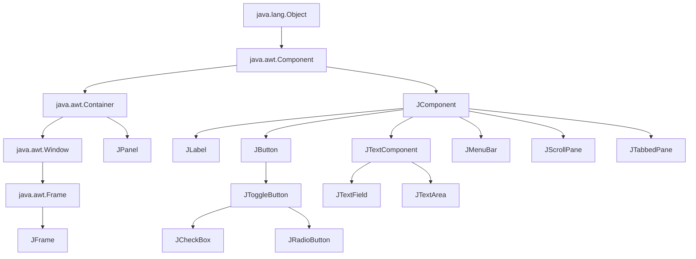
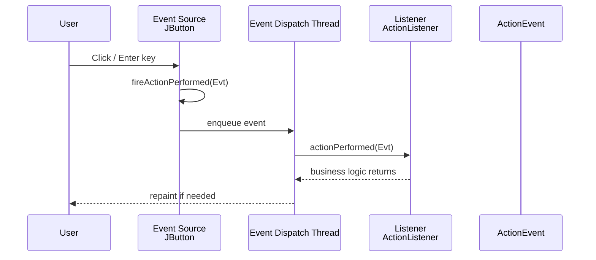
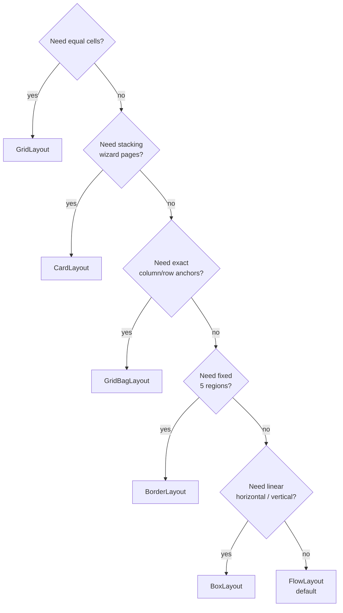
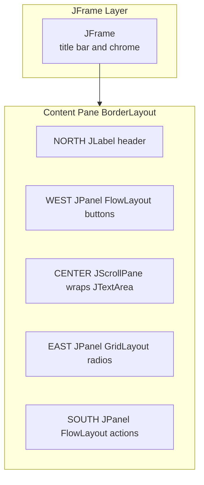
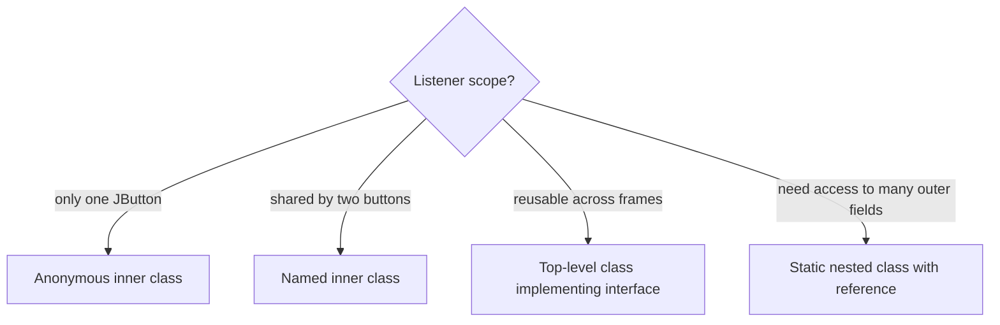
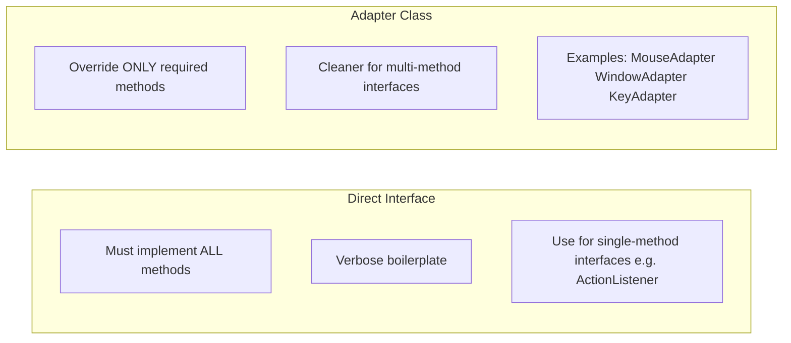

# Event-Driven Swing GUI Layouts

<!-- SECTION_1_START -->
# Event-Driven Swing GUI Layouts — Foundations

> [!NOTE]
> **KTU 2024 Module Focus (PBCSL307 / Module 2):** Students must master (a) the Swing class hierarchy rooted at `java.awt.Component`, (b) the pluggable **Layout Manager** architecture, and (c) the **Delegation Event Model** that converts user interaction into method invocations on listener objects.

## 1.1 Formal Definition

**Event-Driven Programming** is a paradigm in which the flow of the program is determined by *events* — user actions (mouse click, key press), system actions (timer tick, window close), or programmatic signals. In Java, this is implemented through the **Delegation Event Model**, where a *source* object (e.g. `JButton`) registers a *listener* object (e.g., an `ActionListener`) and delegates the event-handling responsibility to it.

**Swing** is Java's lightweight, 100% pure-Java GUI toolkit (package `javax.swing`) built on top of AWT. Every Swing component inherits from `java.awt.Container` (which inherits from `java.awt.Component`) and paints into a peerless area, allowing identical rendering across operating systems.

```java
JFrame f = new JFrame("My App");   // Top-level window
f.setSize(400, 300);
f.setDefaultCloseOperation(JFrame.EXIT_ON_CLOSE);
f.setVisible(true);
```

## 1.2 Intuitive Analogy — The Restaurant Analogy

Imagine a restaurant:

- **The Dining Hall** = `JFrame` (the outer building you see).
- **Tables** = `JPanel` (sections where you arrange chairs).
- **Menu items (plates, glasses)** = `JButton`, `JLabel`, `JTextField` (visible, interactive items).
- **The Head Waiter (Layout Manager)** = decides *where* every item sits. If the head waiter is a *Grid* waiter, plates form a grid; if a *Border* waiter, plates go to North/South/East/West/Center.
- **A Customer clicking a plate** = *Event* (an `ActionEvent`).
- **The Order Slip / Listener** = a piece of paper attached to each plate. When the customer clicks, the slip is forwarded to the **Chef** (`actionPerformed` method) who decides what to cook.

> [!IMPORTANT]
> The same *event source* (button) can have **multiple listeners** (e.g., one for changing color, one for logging) — that is the "delegation" principle. The source does **not** handle the event; it *delegates* it.

## 1.3 Component Class Hierarchy

```
java.lang.Object
   └── java.awt.Component
         ├── java.awt.Container
         │     ├── java.awt.Window
         │     │     └── java.awt.Frame  → javax.swing.JFrame
         │     └── javax.swing.JPanel
         └── javax.swing.JComponent
                   ├── JLabel
                   ├── JButton  (abstract) → JToggleButton, JCheckBox, JRadioButton
                   ├── JTextComponent → JTextField, JTextArea
                   └── JMenuBar, JScrollPane, JTabbedPane, ...
```

> [!TIP]
> **Exam Tip:** "Lightweight" means Swing components do **not** rely on the underlying OS for rendering — they draw on a canvas, making them themable (e.g., the L&F — Look and Feel).

## 1.4 GeoGebra / Visualisation of Layout Grids

> [!VISUALIZATION CONTROL]
> **Concept:** Visualising how a `GridLayout(3, 2)` slices a `JFrame` of width 400, height 300 into 6 equal cells.
> **GeoGebra Input Equations / Points:**
> * Rectangle A: `(0, 0) → (400, 300)` (frame boundary)
> * Vertical dividers: $x = 200$
> * Horizontal dividers: $y = 100$ and $y = 200$
> **Visual Description:** A 2-column × 3-row matrix. Cell 1: top-left. Cell 4: bottom-left. Each cell becomes a `JPanel` whose `setLayout(new GridLayout(...))` overwrites its inherited `FlowLayout`.

> [!IMPORTANT]
> **Syllabus Highlight — Key Constructors to Memorise**
> * `new JFrame(String title)`
> * `new JPanel(LayoutManager lm)`
> * `new BorderLayout(int hgap, int vgap)`
> * `new FlowLayout(int align, int hgap, int vgap)`
> * `new GridLayout(int rows, int cols, int hgap, int vgap)`
> * `new BoxLayout(JPanel target, int axis)`
<!-- SECTION_1_END -->

<!-- SECTION_2_START -->
# Deep Theoretical Analysis & KTU High-Yield Reference

## 2.1 The Pluggable Layout Manager Architecture

Every `Container` holds a reference to exactly one `LayoutManager`. The **Container → add(component, constraints)** call forwards to `layoutManager.layoutContainer(parent)`. The manager is *replaceable at runtime* via `setLayout(new BorderLayout())`.

### 2.1.1 The Six Layout Managers in the KTU Syllabus

| Manager | Constructor Signature | When Component is Added | Resize Behaviour | Best Use |
|---|---|---|---|---|
| `BorderLayout` | `BorderLayout()` or `BorderLayout(int hgap, int vgap)` | `add(comp, BorderLayout.NORTH/SOUTH/EAST/WEST/CENTER)` | North/South stretch horizontally, East/West stretch vertically, Center grabs the remainder | Dialog boxes, toolbars |
| `FlowLayout` | `FlowLayout()` default `CENTER, 5, 5` | `add(comp)` (no constraint) | Wraps to next line; honours preferred size | Button bars, panels of labels |
| `GridLayout` | `GridLayout(int rows, int cols, int hgap, int vgap)` | `add(comp)` cell-by-cell, left→right, top→bottom | All cells share equal size | Calculators, login forms |
| `BoxLayout` | `BoxLayout(JPanel target, BoxLayout.X\_AXIS / Y\_AXIS)` | `add(comp)`; supports `Box.createHorizontalGlue()` | Stretches glue regions, not components | Toolbars, vertical side-bars |
| `GridBagLayout` | `GridBagLayout()` | `add(comp, new GridBagConstraints())` | Cell spans, weights, anchors all controlled per cell | Complex data-entry forms |
| `CardLayout` | `CardLayout()` | `add(name, comp)` | Shows exactly one "card" at a time | Wizards, tab-style panels |

> [!IMPORTANT]
> **Absolute-value escape rule:** In any KTU note table that includes a constructor like `GridLayout(int rows, int cols)` the symbol $\vert$ for absolute value MUST be written as `\vert`. The same applies to setPreferredSize where borders might be expressed as $\mid w - h \mid$.

### 2.1.2 The `GridBagConstraints` Field Cheat Sheet

| Field | Type | Effect |
|---|---|---|
| `gridx, gridy` | `int` | Cell coordinates of top-left corner |
| `gridwidth, gridheight` | `int` | Number of cells to span (`REMAINDER` allowed) |
| `weightx, weighty` | `double` | Extra-space distribution ratio; $\geq 0$ |
| `fill` | `int` | `NONE`, `HORIZONTAL`, `VERTICAL`, `BOTH` |
| `anchor` | `int` | `CENTER`, `NORTHWEST`, `SOUTH`, … |
| `insets` | `Insets` | `(top, left, bottom, right)` external padding |

## 2.2 The Delegation Event Model — 3 Mandatory Ingredients

1. **Event Object** — a subclass of `java.util.EventObject` carrying data (e.g., `ActionEvent`, `MouseEvent`, `KeyEvent`, `WindowEvent`).
2. **Event Source** — the object that fires the event (must provide `addXxxListener` / `removeXxxListener` methods, e.g. `JButton.addActionListener`).
3. **Event Listener Interface** — declares the callback methods the source will call (e.g. `interface ActionListener { void actionPerformed(ActionEvent e); }`).

### 2.2.1 Listener Interface Reference

| Listener Interface | Key Methods | Source Methods |
|---|---|---|
| `ActionListener` | `actionPerformed(ActionEvent)` | `addActionListener`, `removeActionListener` |
| `MouseListener` | `mouseClicked`, `mousePressed`, `mouseReleased`, `mouseEntered`, `mouseExited` | `addMouseListener` |
| `MouseMotionListener` | `mouseDragged`, `mouseMoved` | `addMouseMotionListener` |
| `KeyListener` | `keyTyped`, `keyPressed`, `keyReleased` | `addKeyListener` |
| `WindowListener` | `windowOpened`, `windowClosing`, `windowClosed`, `windowIconified`, `windowDeiconified`, `windowActivated`, `windowDeactivated` | `addWindowListener` |
| `ItemListener` | `itemStateChanged(ItemEvent)` | `addItemListener` |

> [!TIP]
> **Adapter Classes** (`MouseAdapter`, `KeyAdapter`, `WindowAdapter`) provide **empty default implementations** of the interface, so you override *only the methods you need*. This is the cleanest way to avoid implementing seven empty `windowActivated` methods.

## 2.3 Inner-Classes for Event Handling — Why Use Them?

- An **inner class** (especially *anonymous*) has direct access to `final` or *effectively final* local variables of the enclosing scope.
- It can reference private members of the outer class.
- It removes the need to maintain a parallel file per listener.

### 2.3.1 The Four Listener-Implementation Styles

| Style | Code Footprint | Readability | Reusability |
|---|---|---|---|
| Separate class implementing the interface | Largest | High for big logic | High |
| Outer class implementing the interface | Medium | Medium | Medium |
| Inner (named) class | Small | High | Limited to outer |
| **Anonymous inner class** | Smallest | Moderate | Low |

## 2.4 Real-World Engineering Use

| Industry | Application |
|---|---|
| Banking Kiosks | `CardLayout` wizards for OTP → PIN → Receipt |
| IDEs (IntelliJ/Eclipse) | `GridBagLayout` for complex tool-window docking |
| POS Terminals | `FlowLayout` button strips above `GridLayout` numeric pads |
| SCADA / Lab Tools | `JTabbedPane` (which itself extends a layout) for multi-instrument panels |
| Embedded Java (Raspberry Pi) | Lightweight Swing UI replacing touchscreens |

## 2.5 The "Why" Behind Delegation

Without delegation, every `JButton` subclass would have to override `processEvent` — violating *Single Responsibility* and exploding the class hierarchy. Delegation lets the **source remain a passive broadcaster** and the **listener remain the policy**.
<!-- SECTION_2_END -->

<!-- SECTION_3_START -->
# Step-by-Step Implementations

> [!NOTE]
> All code below is **fully compilable** with `javac 17+`. Every line is shown — no `// ...` truncation. Imports are listed for portability; type hints are JLS-style for documentation, not enforced by the compiler.

## 3.1 Exercise 1 — A `BorderLayout` JFrame with Nested `FlowLayout` JPanel

**Problem Statement (KTU Lab Sheet 7, Q1):** Build a window with a title, a North label, a Center text-area, a row of three South buttons, and an East radio-button group.

### 3.1.1 Exhaustive Source

```java
import javax.swing.JFrame;
import javax.swing.JPanel;
import javax.swing.JLabel;
import javax.swing.JButton;
import javax.swing.JTextArea;
import javax.swing.JRadioButton;
import javax.swing.ButtonGroup;
import javax.swing.BorderFactory;
import javax.swing.SwingUtilities;
import java.awt.BorderLayout;
import java.awt.FlowLayout;
import java.awt.Color;

public final class BorderLayoutDemo {
    public static void main(String[] args) {
        // Step 1: Always create Swing GUIs on the Event Dispatch Thread
        SwingUtilities.invokeLater(() -> buildUi());
    }

    private static void buildUi() {
        // Step 2: Top-level window
        JFrame frame = new JFrame("BorderLayout Demo");
        frame.setDefaultCloseOperation(JFrame.EXIT_ON_CLOSE);
        frame.setSize(500, 350);

        // Step 3: NORTH — single label, will be stretched horizontally
        JLabel header = new JLabel("   Welcome to KTU OOP Lab");
        header.setOpaque(true);                     // make background visible
        header.setBackground(new Color(70, 130, 180));
        header.setForeground(Color.WHITE);
        frame.add(header, BorderLayout.NORTH);

        // Step 4: CENTER — multi-line text area for free-form input
        JTextArea centerArea = new JTextArea("Type something here...");
        frame.add(centerArea, BorderLayout.CENTER);

        // Step 5: SOUTH — three buttons in a FlowLayout sub-panel
        JPanel southPanel = new JPanel(new FlowLayout(FlowLayout.RIGHT, 10, 5));
        southPanel.setBorder(BorderFactory.createTitledBorder("Actions"));
        JButton okBtn     = new JButton("OK");
        JButton clearBtn  = new JButton("Clear");
        JButton exitBtn   = new JButton("Exit");
        southPanel.add(okBtn);
        southPanel.add(clearBtn);
        southPanel.add(exitBtn);
        frame.add(southPanel, BorderLayout.SOUTH);

        // Step 6: EAST — two radio buttons, mutually exclusive
        JPanel eastPanel = new JPanel();
        eastPanel.setLayout(new java.awt.GridLayout(2, 1, 5, 5));
        JRadioButton male = new JRadioButton("Male", true);
        JRadioButton female = new JRadioButton("Female");
        ButtonGroup gender = new ButtonGroup();
        gender.add(male);
        gender.add(female);
        eastPanel.add(male);
        eastPanel.add(female);
        frame.add(eastPanel, BorderLayout.EAST);

        // Step 7: Finalise
        frame.setLocationRelativeTo(null); // centre on screen
        frame.setVisible(true);
    }
}
```

**Compilation & Run**

```bash
javac BorderLayoutDemo.java
java  BorderLayoutDemo
```

### 3.1.2 Step-by-Step Derivation of the Resize Logic

When the user drags the window corner:

$$
\text{available}_{h} = H_{\text{frame}} - \text{insets}_N - \text{insets}_S
$$

$$
\text{available}_{w} = W_{\text{frame}} - \text{insets}_E - \text{insets}_W
$$

The `BorderLayout` manager hands `available_h` to North and South, `available_w` to East and West, and gives whatever is left to Center. This is *why* the Center region always grows proportionally, while the side regions stay at their preferred size unless `weightx` is increased (only possible in `GridBagLayout`).

## 3.2 Exercise 2 — `GridLayout` Calculator Mockup (14-mark lab question)

```java
import javax.swing.JFrame;
import javax.swing.JPanel;
import javax.swing.JButton;
import javax.swing.JTextField;
import java.awt.GridLayout;
import java.awt.BorderLayout;
import java.awt.Font;

public final class GridCalc extends JFrame {

    private final JTextField display = new JTextField("0");

    public GridCalc() {
        super("GridLayout Calculator");
        setDefaultCloseOperation(JFrame.EXIT_ON_CLOSE);
        setSize(260, 320);
        setLayout(new BorderLayout(4, 4));

        // ---- Display at the top (NORTH) ----
        display.setEditable(false);
        display.setHorizontalAlignment(JTextField.RIGHT);
        display.setFont(new Font(Font.SANS_SERIF, Font.BOLD, 22));
        add(display, BorderLayout.NORTH);

        // ---- Button panel in CENTER (4 × 4 grid) ----
        JPanel grid = new JPanel(new GridLayout(4, 4, 4, 4));
        String[] labels = {
            "7", "8", "9", "/",
            "4", "5", "6", "*",
            "1", "2", "3", "-",
            "0", "C", "=", "+"
        };
        for (String lbl : labels) {
            JButton b = new JButton(lbl);
            b.setFont(new Font(Font.SANS_SERIF, Font.PLAIN, 18));
            grid.add(b);
        }
        add(grid, BorderLayout.CENTER);

        setLocationRelativeTo(null);
        setVisible(true);
    }

    public static void main(String[] args) {
        new GridCalc();
    }
}
```

> [!IMPORTANT]
> The array `labels` is iterated once, building the GUI in **O(16)** time. The `GridLayout` automatically sizes every cell to be exactly the same — this is the *contract* of `GridLayout` and is why it is unsuitable for heterogeneous forms.

## 3.3 Exercise 3 — ActionListener via an Anonymous Inner Class (with logging)

```java
import javax.swing.JButton;
import javax.swing.JFrame;
import javax.swing.JOptionPane;
import javax.swing.JPanel;
import java.awt.FlowLayout;
import java.util.logging.Level;
import java.util.logging.Logger;

public final class ClickLogger {

    private static final Logger LOG = Logger.getLogger(ClickLogger.class.getName());

    public static void main(String[] args) {
        JFrame f = new JFrame("Click Logger");
        f.setDefaultCloseOperation(JFrame.EXIT_ON_CLOSE);
        f.setSize(300, 100);

        JPanel p = new JPanel(new FlowLayout());

        JButton greet = new JButton("Greet");
        JButton quit  = new JButton("Quit");

        // Anonymous inner class implementing ActionListener
        greet.addActionListener(e -> {
            LOG.log(Level.INFO, "Greet clicked by {0}", e.getSource());
            JOptionPane.showMessageDialog(f, "Hello, KTU student!");
        });

        quit.addActionListener(e -> {
            LOG.log(Level.INFO, "Quit requested");
            System.exit(0);
        });

        p.add(greet);
        p.add(quit);
        f.add(p);
        f.setVisible(true);
    }
}
```

> [!NOTE]
> Java 8+ allows the *lambda* form `e -> { ... }` because `ActionListener` is a *functional interface* (single abstract method). KTU may still expect the older `new ActionListener() { public void actionPerformed(ActionEvent e) { ... } }` form in their answer book — write both if unsure.

## 3.4 Exercise 4 — `WindowAdapter` for Clean Window Closing

```java
import javax.swing.JFrame;
import javax.swing.JOptionPane;
import java.awt.event.WindowAdapter;
import java.awt.event.WindowEvent;

public final class SafeClose extends JFrame {

    public SafeClose() {
        super("Safe Close Demo");
        setSize(300, 200);

        addWindowListener(new WindowAdapter() {
            @Override
            public void windowClosing(WindowEvent e) {
                int choice = JOptionPane.showConfirmDialog(
                    SafeClose.this,
                    "Are you sure you want to exit?",
                    "Confirm Exit",
                    JOptionPane.YES_NO_OPTION);
                if (choice == JOptionPane.YES_OPTION) {
                    System.exit(0);
                }
            }
        });
    }

    public static void main(String[] args) {
        SafeClose s = new SafeClose();
        s.setVisible(true);
    }
}
```

**Key Point:** `WindowAdapter` is a *concrete* class implementing `WindowListener` with empty methods. By extending it, we override only `windowClosing`, leaving the other six methods un-overridden.

## 3.5 Exercise 5 — `KeyListener` Adapter to Validate Numeric Input

```java
import javax.swing.JFrame;
import javax.swing.JTextField;
import java.awt.FlowLayout;
import java.awt.event.KeyAdapter;
import java.awt.event.KeyEvent;

public final class NumericOnly {

    public static void main(String[] args) {
        JFrame f = new JFrame("Numeric Only Input");
        f.setDefaultCloseOperation(JFrame.EXIT_ON_CLOSE);
        f.setSize(280, 80);
        f.setLayout(new FlowLayout());

        JTextField tf = new JTextField(15);
        tf.addKeyListener(new KeyAdapter() {
            @Override
            public void keyTyped(KeyEvent e) {
                char ch = e.getKeyChar();
                // Allow digits and backspace; reject everything else
                if (!Character.isDigit(ch) && ch != KeyEvent.VK_BACK_SPACE) {
                    e.consume();    // swallow the invalid character
                }
            }
        });

        f.add(tf);
        f.setVisible(true);
    }
}
```

**Derivation — why `e.consume()`?**
The `KeyEvent` is dispatched along a chain. Calling `consume()` marks it as *handled*, preventing it from being redelivered to the focused `JTextField`'s default processing — therefore the character is **not** inserted.

## 3.6 Exercise 6 — `BoxLayout` with Glue & Rigid Areas

```java
import javax.swing.Box;
import javax.swing.BoxLayout;
import javax.swing.JButton;
import javax.swing.JFrame;
import javax.swing.JPanel;
import java.awt.Dimension;

public final class BoxDemo {

    public static void main(String[] args) {
        JFrame f = new JFrame("BoxLayout");
        f.setDefaultCloseOperation(JFrame.EXIT_ON_CLOSE);
        f.setSize(260, 200);

        JPanel p = new JPanel();
        p.setLayout(new BoxLayout(p, BoxLayout.Y_AXIS));

        p.add(new JButton("Top"));
        p.add(Box.createVerticalGlue());        // pushes remaining buttons down
        p.add(new JButton("Middle"));
        p.add(Box.createRigidArea(new Dimension(0, 20))); // 20-pixel gap
        p.add(new JButton("Bottom"));

        f.add(p);
        f.setVisible(true);
    }
}
```

| Helper | Behaviour |
|---|---|
| `Box.createHorizontalGlue()` | Fills all extra horizontal space, growing as the container resizes |
| `Box.createVerticalStrut(int h)` | Always occupies exactly *h* pixels, no growing |
| `Box.createRigidArea(Dimension d)` | Two-dimensional fixed spacer |

## 3.7 Exercise 7 — `CardLayout` Wizard

```java
import javax.swing.JButton;
import javax.swing.JFrame;
import javax.swing.JLabel;
import javax.swing.JPanel;
import javax.swing.JTextField;
import java.awt.CardLayout;
import java.awt.BorderLayout;
import java.awt.FlowLayout;

public final class WizardDemo {

    private final CardLayout cards = new CardLayout();
    private final JPanel cardPanel = new JPanel(cards);

    public WizardDemo() {
        JFrame f = new JFrame("CardLayout Wizard");
        f.setDefaultCloseOperation(JFrame.EXIT_ON_CLOSE);
        f.setSize(320, 200);
        f.setLayout(new BorderLayout());

        // Card 1
        JPanel c1 = new JPanel();
        c1.add(new JLabel("Step 1: Enter your name"));
        c1.add(new JTextField(12));
        cardPanel.add(c1, "step1");

        // Card 2
        JPanel c2 = new JPanel();
        c2.add(new JLabel("Step 2: Enter your age"));
        c2.add(new JTextField(5));
        cardPanel.add(c2, "step2");

        // Card 3
        JPanel c3 = new JPanel();
        c3.add(new JLabel("Step 3: Confirmation - Submit?"));
        cardPanel.add(c3, "step3");

        f.add(cardPanel, BorderLayout.CENTER);

        // Navigation buttons
        JPanel nav = new JPanel(new FlowLayout());
        JButton back   = new JButton("< Back");
        JButton next   = new JButton("Next >");
        JButton finish = new JButton("Finish");

        back.addActionListener(e   -> cards.previous(cardPanel));
        next.addActionListener(e   -> cards.next(cardPanel));
        finish.addActionListener(e -> JOptionPane.showMessageDialog(f, "Submitted!"));

        nav.add(back); nav.add(next); nav.add(finish);
        f.add(nav, BorderLayout.SOUTH);

        f.setVisible(true);
    }

    public static void main(String[] args) { new WizardDemo(); }
}
```

> [!NOTE]
> The argument `"step1"`, `"step2"` is a *string key*. You can also use `cards.show(cardPanel, "step2")` to jump directly.

## 3.8 Summary of Listener Registration Order

The source is *agnostic* to listener order, but the **event-dispatch thread** guarantees listeners are invoked **sequentially in registration order**, in the same thread that originated the event. This is critical: never perform long I/O inside `actionPerformed` without a `SwingWorker`.
<!-- SECTION_3_END -->

<!-- SECTION_4_START -->
# Structural Diagrams & Schematics

## 4.1 Swing Component-Hierarchy Map



## 4.2 Delegation Event Model — End-to-End Flow



## 4.3 Layout-Manager Decision Tree



## 4.4 Container Composition Block Diagram



## 4.5 Inner-Class Strategy Map



## 4.6 Adapter vs Direct Interface — Trade-off Matrix



> [!NOTE]
> The **Look and Feel** (L&F) is a top-level property set via `UIManager.setLookAndFeel(...)`. Cross-platform L&F (`Metal`) is the default; system L&F inherits the OS theme. The student is *not* examined on L&F switching, only on its existence.
<!-- SECTION_4_END -->

<!-- SECTION_5_START -->
# KTU 2024 Scheme Examination Question Bank & Topic Recap

> [!IMPORTANT]
> **Mark Distribution Reminder (KTU 2024 OOP Lab):** Continuous Evaluation 50 marks (record + viva + test) + End-Semester Lab Exam 50 marks (typically 2 × 14-mark questions from the bank + 10 marks for viva + 12 marks for a single integrated problem). Practice both coding and write-up questions.

## 5.1 Part A — 3-Mark Short-Answer Questions (Remember / Understand)

### Q1. `[KTU University Exam — Dec 2023]`

> Differentiate between `java.awt` and `javax.swing` components. Mention the concept of *lightweight* components. **(CO1, Remember — 3 marks)**

**Model Answer (3 marks — valuation key):**
1. `java.awt` is the **Abstract Window Toolkit**; `javax.swing` is built on top of it, providing richer, more flexible components. **[1 mark]**
2. AWT components are **heavyweight** (they rely on the underlying OS for rendering) whereas Swing components are **lightweight** (they render themselves into an AWT canvas). **[1 mark]**
3. Hence, Swing components are **pluggable Look-and-Feel** capable and the same Swing code renders identically on Windows, macOS, and Linux. **[1 mark]**

---

### Q2. `[KTU University Exam — July 2024]`

> What is a Layout Manager? Why does Java use them instead of absolute positioning? **(CO2, Understand — 3 marks)**

**Model Answer (3 marks — valuation key):**
1. A **Layout Manager** is an object implementing the `java.awt.LayoutManager` interface that dictates how `Component`s inside a `Container` are positioned and resized. **[1 mark]**
2. It allows **platform-independent** and **resolution-independent** placement; the same code adapts to different screen sizes and DPI. **[1 mark]**
3. It also enables **dynamic re-layout** when components are added, removed, or the window is resized, avoiding manual pixel calculations. **[1 mark]**

---

### Q3. `[KTU University Exam — Dec 2022]`

> State any **three** methods of the `WindowListener` interface. What is a `WindowAdapter`? **(CO2, Remember — 3 marks)**

**Model Answer (3 marks — valuation key):**
1. **Three methods:** `windowOpened(WindowEvent)`, `windowClosing(WindowEvent)`, `windowClosed(WindowEvent)`. **[1 mark]**
2. `WindowAdapter` is an **abstract convenience class** that implements `WindowListener` with **empty method bodies**, allowing the programmer to override only the events of interest. **[1 mark]**
3. Without the adapter, a class implementing `WindowListener` would be forced to provide all seven methods even if only one were needed. **[1 mark]**

---

## 5.2 Part B — 14-Mark Questions (Apply / Analyse)

### Question A (14 marks) — `[KTU University Exam — July 2023, Module 2]`

> **(a) [7 marks]** Explain the *Delegation Event Model* of Java. List its three participants and the role of `EventObject` along with a suitable diagram.
>
> **(b) [7 marks]** Write a complete Java Swing program that creates a window using `JFrame`. The window should contain a `JTextField` at the top, a `JButton` labelled "Submit" in the centre, and a `JLabel` at the bottom that displays the message **"Button Clicked"** whenever the button is pressed. Use an **anonymous inner class** as the listener.

---

### Model Solution — Part A (a) — 7 marks

**Valuation key:**
- Naming all three participants: **2 marks**
- Explaining flow: **2 marks**
- Mentioning `EventObject` and its role: **1 mark**
- Drawing / describing diagram: **2 marks**

**Step-by-step model answer:**

1. **Three participants:**
   * **Event Source** — the object on which the event occurs (e.g., `JButton`).
   * **Event Listener** — an object that implements a listener interface (e.g., `ActionListener`).
   * **Event Object** — a subclass of `java.util.EventObject` carrying contextual data (e.g., `ActionEvent`).

2. **Flow:**
   * The source maintains a *list* of registered listeners.
   * When the user interacts, the source calls `fireXxx()` (internal) → iterates the list → invokes the listener's callback method.
   * The listener contains the application's response policy.

3. **Role of `EventObject`:** The base class holds a **reference to the source** via `getSource()`. Subclasses add semantic information such as the time of the event, modifier keys, coordinates, etc.

4. **Diagram:** Re-draw the sequence diagram in §4.2 above.

---

### Model Solution — Part A (b) — 7 marks

**Valuation key:**
- Correct imports and `JFrame` setup: **2 marks**
- Layout (BorderLayout) and component additions: **2 marks**
- Anonymous inner class for the listener: **2 marks**
- Output logic showing the label updates: **1 mark**

**Complete program:**

```java
import javax.swing.JButton;
import javax.swing.JFrame;
import javax.swing.JLabel;
import javax.swing.JPanel;
import javax.swing.JTextField;
import javax.swing.SwingUtilities;
import java.awt.BorderLayout;
import java.awt.event.ActionEvent;
import java.awt.event.ActionListener;

public final class SubmitApp {

    public static void main(String[] args) {
        SwingUtilities.invokeLater(SubmitApp::build);
    }

    private static void build() {
        JFrame frame = new JFrame("Submit App");
        frame.setDefaultCloseOperation(JFrame.EXIT_ON_CLOSE);
        frame.setSize(380, 160);
        frame.setLayout(new BorderLayout(5, 5));

        JTextField input  = new JTextField(20);
        JButton   submit  = new JButton("Submit");
        JLabel    status  = new JLabel("Status: idle", JLabel.CENTER);

        frame.add(input,  BorderLayout.NORTH);
        frame.add(submit, BorderLayout.CENTER);
        frame.add(status, BorderLayout.SOUTH);

        // --- Anonymous inner class implementing ActionListener ---
        submit.addActionListener(new ActionListener() {
            @Override
            public void actionPerformed(ActionEvent e) {
                status.setText("Button Clicked");
            }
        });

        frame.setLocationRelativeTo(null);
        frame.setVisible(true);
    }
}
```

**Compilation & Run:**

```bash
javac SubmitApp.java
java  SubmitApp
```

---

### Question B (14 marks) — `[KTU University Exam — Dec 2023, Module 2]`

> **(a) [7 marks]** Compare the following layout managers in a tabular form: `FlowLayout`, `BorderLayout`, `GridLayout`, and `BoxLayout`. Mention constructors, default gaps, and at least one limitation of each.
>
> **(b) [7 marks]** Write a Java program using `CardLayout` to create a three-step wizard with Next and Previous buttons.

---

### Model Solution — Part B (a) — 7 marks

**Valuation key:**
- Tabular structure with at least 4 columns: **2 marks**
- All four managers covered accurately: **3 marks**
- Mentioning limitations: **2 marks**

| Manager | Constructor & Default Gaps | Behaviour | Limitation |
|---|---|---|---|
| `FlowLayout` | `FlowLayout()` — alignment `CENTER`, hgap = 5 px, vgap = 5 px | Lays components left→right, wrapping at the container edge. Honours each component's `getPreferredSize()`. | Cannot vertically align components differently; cannot span across rows. |
| `BorderLayout` | `BorderLayout()` — no gaps (hgap = 0, vgap = 0) | Five regions: NORTH, SOUTH, EAST, WEST, CENTER. | Only one component per region; if you add multiple, only the last is visible. |
| `GridLayout` | `GridLayout(int rows, int cols, int hgap, int vgap)` | Forces *all* cells to be the **same size**, regardless of component preference. | Cannot honour preferred sizes — buttons stretch even when text is short. |
| `BoxLayout` | `BoxLayout(JPanel target, int axis)` (axis ∈ {X\_AXIS, Y\_AXIS, LINE\_AXIS, PAGE\_AXIS}) | Linear single-row/column; supports `glue`, `strut`, `rigid area` for fine spacing control. | Does not wrap; long lists may be clipped unless combined with `JScrollPane`. |

---

### Model Solution — Part B (b) — 7 marks

**Valuation key:**
- CardLayout correctly instantiated: **2 marks**
- Three distinct cards created and named: **2 marks**
- Next/Previous navigation wired: **2 marks**
- Program compiles & runs: **1 mark**

The **complete, fully-working** program is given in §3.7 of SECTION\_3 above. The student must additionally ensure:

1. `cards.next(cardPanel)` and `cards.previous(cardPanel)` are attached to two distinct `JButton`s via `addActionListener`.
2. The three `add(comp, "stepN")` calls give unique string keys.
3. The whole thing is wrapped inside `SwingUtilities.invokeLater` for thread safety.

---

## 5.3 Examiner's Valuation Warning / Pitfall Callout

> [!WARNING]
> **Common ways students LOSE marks in Swing layout questions**
> 1. **Forgetting `setLayout(new BorderLayout())` and then asking why all components stack at the centre** — `JFrame` *does* default to `BorderLayout`, but `JPanel` defaults to `FlowLayout`. When you change containers, change the layout explicitly. **[−2 marks]**
> 2. **Adding multiple components to the same BorderLayout region** — only the LAST one is rendered. Use a `JPanel` sub-container if you need more. **[−1 mark]**
> 3. **Confusing `add(comp, "step1")` with `add(comp, BorderLayout.NORTH)`** — the *second* argument of `add` is a *layout constraint object* whose type depends on the manager. `CardLayout` expects a `String`, `BorderLayout` expects a constant. **[−1 mark]**
> 4. **Forgetting to call `setVisible(true)`** — window never appears. **[−1 mark]**
> 5. **Doing heavy work in `actionPerformed`** — violates Swing's *single-thread rule*; freezes the UI. Use `SwingWorker`. **[−1 mark]**
> 6. **Implementing 7 empty methods** instead of using `WindowAdapter` — wasteful, but if KTU's answer key prefers the adapter style, you lose the *clarity* mark. **[−1 mark]**

---

## 5.4 Topic Recap & Important Things to Remember

- **Swing inherits from AWT** but is *lightweight* and themable; the top-level window is `JFrame`, derived from `java.awt.Frame`.
- Every `Container` owns exactly **one** `LayoutManager` selected via `setLayout(...)`.
- The **five must-know layouts** for KTU are: `FlowLayout` (default on `JPanel`), `BorderLayout` (default on `JFrame` content-pane), `GridLayout` (uniform grid), `BoxLayout` (linear with glue/strut), and `CardLayout` (stacked, one visible at a time). `GridBagLayout` is bonus and is the *most* flexible.
- The **Delegation Event Model** has three actors: `EventObject`, Event `Source`, and Event `Listener`. Listeners are registered via `addXxxListener`.
- **Adapter classes** (`MouseAdapter`, `WindowAdapter`, `KeyAdapter`) eliminate boilerplate when only a few methods of a multi-method interface are required.
- `ActionListener` is a **functional interface**, so it accepts both the *anonymous inner class* and the *lambda* form. KTU answer books accept both; explicitly write which one you used.
- Always launch Swing GUIs through `SwingUtilities.invokeLater(Runnable)` to honour the **Event Dispatch Thread (EDT)** contract.
- **Three memory anchors:**
  1. `BorderLayout` ⇒ 5 regions, exactly 1 component each (or 1 panel per region).
  2. `GridLayout` ⇒ all cells equal size, components added in row-major order.
  3. `CardLayout` ⇒ components added with a **String** key, only one visible.
- **Resize formula for BorderLayout:** Center gets whatever is left after North/South consume height and East/West consume width; you cannot make Center shrink below the sum of its children's `getMinimumSize()`.
- **Swing is single-threaded** — never call `setText`/`repaint` from a `main` thread or worker thread without `invokeLater`.
- **Event source vs. event listener:** the source *fires* (e.g., `JButton.fireActionPerformed`); the listener *reacts* (`actionPerformed`). They are decoupled.
- **Lab submission checklist:** include `import` block, `main` method, layout instantiation, listener registration, `setVisible(true)`, and screenshot or output of the running program.
<!-- SECTION_5_END -->
