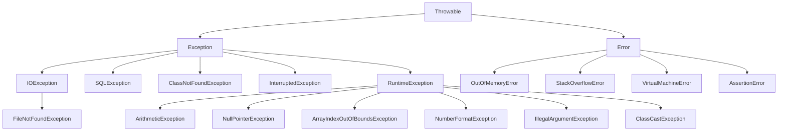
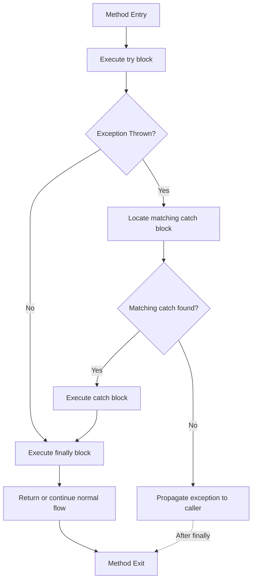
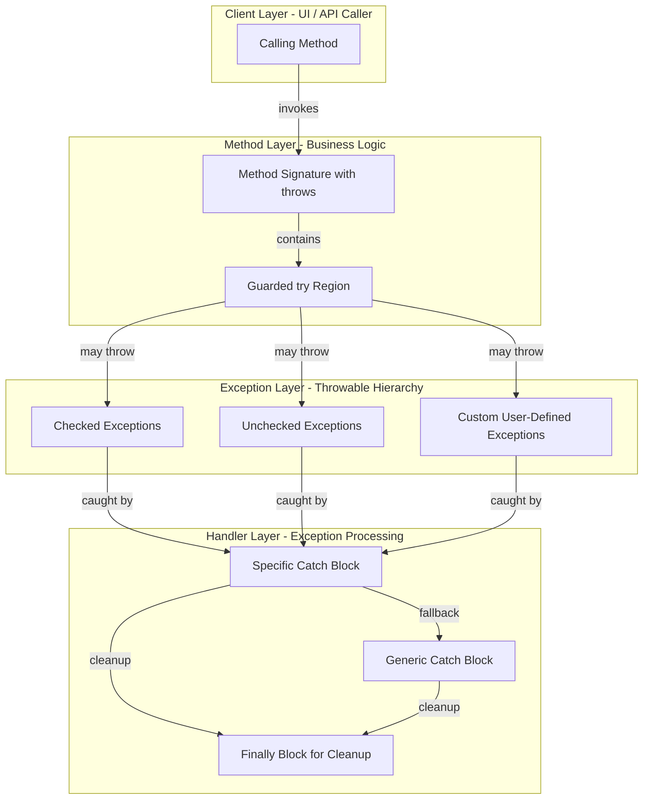
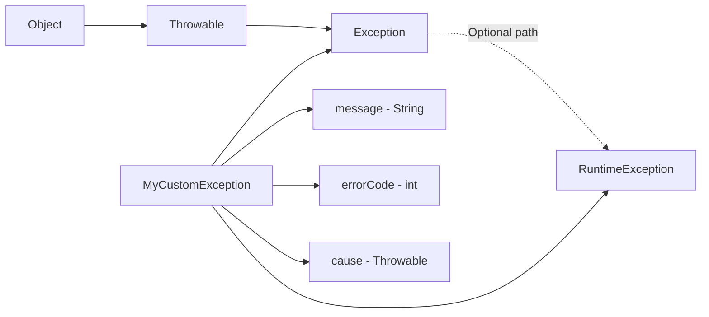

# Exception Handling

<!-- SECTION_1_START -->
# Exception Handling in Java

## Core Technical Definition

**Exception Handling** in Java is a structured, object-oriented mechanism designed to identify, intercept, propagate, and recover from anomalous runtime conditions (exceptions) that disrupt the normal sequential flow of program execution. An **exception** is an event that occurs during the execution of a program and disrupts the normal flow of the program's instructions. In the KTU 2024 Scheme syllabus for **Object Oriented Programming Lab (PBCSL307)**, exception handling is positioned as a **defensive programming paradigm** that decouples error-detection logic from business logic, thereby producing robust, fault-tolerant, and maintainable Java applications.

> [!IMPORTANT]
> **KTU 2024 Board Definition (Verbatim Reference):**
> *"Exception Handling is a powerful mechanism in Java that allows a program to handle runtime errors such as ClassNotFoundException, IOException, SQLException, RemoteException, etc., using the five core keywords: try, catch, finally, throw, and throws."*

The five canonical building blocks of Java exception handling are:

| Keyword | Role in the Mechanism |
| :--- | :--- |
| `try` | Encloses the **guarded region** of code that may raise an exception. |
| `catch` | Acts as the **exception handler block** that intercepts and processes the thrown exception. |
| `finally` | A **mandatory-execution block** that always runs regardless of whether an exception was raised or not. |
| `throw` | An operator used to **explicitly dispatch** an exception object from within a method body. |
| `throws` | A method-signature clause used to **declare** the checked exceptions a method may propagate to its caller. |

---

## Conceptual Analogy / Intuition

Imagine you are driving a car on a hilly road. The road is your **Java program**, and unexpected events (a fallen tree, a flat tyre, a sudden landslide) are the **exceptions**.

- The `try` block is the **driving zone** — the active segment where the unexpected is most likely to occur.
- The `catch` block is the **service centre** you pull into once a problem is detected.
- The `finally` block is the **garage exit checklist** — no matter what happened (accident, no accident, rain or shine), you always lock the car before leaving.
- `throw` is the **driver** actively honking and waving a red flag when danger is spotted.
- `throws` is the **road sign** warning upcoming drivers (calling methods) that this stretch of road is dangerous.

This **firewall-style isolation** ensures that a localized failure does not crash the entire application, mirroring the KTU Course Outcome **CO3: Implement robust Java programs using inheritance, polymorphism, and exception handling**.

> [!NOTE]
> **Key Insight for KTU Exams:** The Java compiler enforces a strict rule for **checked exceptions** — any method that may generate a checked exception must either **catch** it locally or **declare** it using the `throws` clause. This is the famous **"Catch or Declare" requirement**, a frequent short-answer question in KTU End Semester Examinations.

---

## Standard Metrics and Engineering Constants Used in This Module

While exception handling is primarily a software design construct, the following standardized references are implicitly used:

- **JVM Default Stack Size:** **512 KB** (default; can be tuned via `-Xss`).
- **Throwable Root Class:** `java.lang.Throwable` — the **only** class that can be thrown or caught by the JVM.
- **Default Exception Message:** `null` (when no message is passed to the exception constructor).

> [!VISUALIZATION CONTROL]
> **Concept:** Execution Control Flow During Exception Propagation
> **GeoGebra / Desmos Input Equations (Logical Flow Mapping):**
> * Let $E(x)$ be a piecewise function representing the execution state of a method, where $x$ is the program counter step.
> * $E(x) = \text{Normal}$ for $0 \le x \le x_{try}$
> * $E(x) = \text{Exception Thrown}$ for $x = x_{catch}$ (point of detection)
> * $E(x) = \text{Recovery}$ for $x_{catch} \le x \le x_{finally}$
> * $E(x) = \text{Resumed}$ for $x > x_{finally}$
> **Visual Description:** The student should observe a piecewise step-function where the curve drops to an "exception state" at the throw-point, recovers through the catch block, and resumes through the finally block — never breaking the continuity of the X-axis. The finally block is graphically represented as a vertical line that is **always** crossed, regardless of whether the curve dipped into the catch region.

---

## Hierarchy Snapshot (Preview for Section 2)

The Throwable superclass branches into two critical subclasses:

$$
\text{Throwable} \rightarrow
\begin{cases}
\text{Exception} \; (\text{Recoverable, Checked} + \text{Unchecked}) \\
\text{Error} \; (\text{Irrecoverable, System-level})
\end{cases}
$$

This tree will be expanded and diagrammed in **SECTION 4** using a Mermaid schematic.
<!-- SECTION_1_END -->

<!-- SECTION_2_START -->
# Deep Theoretical Analysis & KTU High-Yield Formula Sheet

## 1. The Throwable Class Hierarchy

In the **java.lang** package, the root of all error and exception types is `Throwable`. This class implements the `Serializable` interface and is the only class hierarchy that the JVM permits to be thrown via the `throw` statement. The hierarchy bifurcates into two distinct semantic branches:

### A. Exception Branch (Recoverable Conditions)
The `Exception` branch represents conditions that a well-written application should anticipate and handle. These are the **KTU High-Priority** exception classes:

- **Checked Exceptions (Compile-Time):** Verified by the Java compiler. Examples include `IOException`, `SQLException`, `ClassNotFoundException`, and `InterruptedException`.
- **Unchecked Exceptions (Runtime):** Not verified at compile-time. They are subclasses of `RuntimeException`. Examples include `ArithmeticException`, `NullPointerException`, `ArrayIndexOutOfBoundsException`, and `NumberFormatException`.

### B. Error Branch (Irrecoverable System Failures)
The `Error` branch represents serious system-level problems that an application **should not attempt to catch**:
- `OutOfMemoryError`
- `StackOverflowError`
- `VirtualMachineError`
- `LinkageError`

> [!IMPORTANT]
> **KTU Exam Tip:** A frequently asked distinction is — *"Why does Java have both checked and unchecked exceptions?"* The answer is rooted in the design philosophy: **checked exceptions** enforce the **"Catch or Declare"** rule to encourage robust API design, while **unchecked exceptions** (subclasses of `RuntimeException`) represent programming bugs (like division by zero) that should be prevented through better logic rather than caught at runtime.

---

## 2. Operational Mechanics of the Five Keywords

### Keyword 1: `try` — The Guarded Region
- A `try` block must be immediately followed by **at least one** `catch` block, **or** a `finally` block, **or** both.
- The `try` block **cannot exist in isolation** in valid Java code.
- Resource initialization (pre-Java 7) and business logic are placed inside `try`.

### Keyword 2: `catch` — The Interceptor
- A `catch` block takes **exactly one parameter**, which must be a `Throwable` (or subclass) type.
- **Order matters:** More specific exception types must be caught **before** their parent class (i.e., `ArithmeticException` must come before `Exception`).
- Multiple `catch` blocks (Java 7+ multi-catch) can be chained.

### Keyword 3: `finally` — The Mandatory Execution Block
- The `finally` block executes **always**, even if:
  * No exception is thrown.
  * An exception is thrown and caught.
  * An exception is thrown and not caught (it executes before propagation).
  * A `return` statement is executed inside `try` or `catch`.
- The **only** scenarios where `finally` is skipped are `System.exit(0)` and JVM crashes.

### Keyword 4: `throw` — Explicit Exception Dispatch
- Used to **manually trigger** an exception object.
- Syntax: `throw new ArithmeticException("Manual trigger");`
- After `throw`, control flow is **immediately transferred** to the nearest enclosing `try-catch` or the call stack.

### Keyword 5: `throws` — Declaration of Possible Exceptions
- Used in the **method signature** to warn the caller that a checked exception may be propagated.
- Syntax: `public void readFile() throws IOException { ... }`
- A method can declare multiple exceptions separated by commas.

---

## 3. KTU Formula Sheet / Cheat Sheet (High-Yield for Exams)

The following table consolidates every essential formula, keyword, and rule required for solving exception-handling problems in the KTU 2024 Scheme ESE (End Semester Examination).

| Rule / Concept | Formula / Syntax Pattern | When Applied | Exception Type |
| :--- | :--- | :--- | :--- |
| Basic Try-Catch | `try \lbrace \ldots \rbrace \; catch(X e) \lbrace \ldots \rbrace` | Single exception handling | Any |
| Multiple Catch | `catch(X1 e1)\lbrace \ldots \rbrace \; catch(X2 e2) \lbrace \ldots \rbrace` | Different exception types | Any |
| Multi-Catch (Java 7+) | `catch(X1 \vert X2 e) \lbrace \ldots \rbrace` | Same handler for multiple types | Unrelated checked/unchecked |
| Finally Block | `finally \lbrace \ldots \rbrace` | Cleanup, resource release | Always |
| Throw Statement | `throw new X(message);` | Manual exception generation | Any `Throwable` |
| Throws Declaration | `method() throws X1, X2 \lbrace \ldots \rbrace` | Checked exception propagation | Checked only |
| Custom Exception | `class MyEx extends Exception \lbrace \ldots \rbrace` | Domain-specific errors | User-defined |
| Try-with-Resources (Java 7+) | `try(Resource r = new Resource()) \lbrace \ldots \rbrace` | AutoCloseable resources | Any |
| Re-throw | `catch(X e) \lbrace \text{log}(e); \; throw e; \rbrace` | Logging then propagating | Any |
| Override Rule | Subclass overridden method $\rightarrow$ Cannot declare **broader** checked exceptions | Inheritance scenarios | Checked |

> [!IMPORTANT]
> **Critical Override Rule (Frequently Asked in KTU):**
> If a parent class method declares `throws IOException`, an overriding subclass method can declare:
> * **No** `throws` clause (narrower).
> * `throws IOException` (same).
> * `throws FileNotFoundException` (a subclass of `IOException` — narrower).
> It **CANNOT** declare `throws Exception` (broader — **compile error**).

---

## 4. Engineering Real-World Utility

Exception handling is **not an academic exercise** — it is a production-critical engineering discipline. The following table maps KTU-relevant exception scenarios to real-world industry applications:

| Java Exception | Production System Scenario | Mitigation Strategy |
| :--- | :--- | :--- |
| `IOException` | File upload fails in a web server (e.g., Tomcat) | Retry logic with exponential backoff |
| `SQLException` | Database connection timeout in an e-commerce backend | Connection pooling (HikariCP) |
| `NullPointerException` | API response with missing fields (microservices) | Optional class, defensive null checks |
| `ArithmeticException` | Division by zero in financial calculation engine | Input validation, BigDecimal usage |
| `ClassNotFoundException` | Dynamic class loading failure in plugin systems | ClassLoader fallback mechanisms |
| `ArrayIndexOutOfBoundsException` | Parsing malformed JSON arrays | Bounds checking, JSON schema validation |
| `StackOverflowError` | Infinite recursion in graph traversal algorithms | Tail recursion, iterative refactoring |

> [!NOTE]
> **Real-World Production Insight:** Modern frameworks like **Spring Boot** use `@ControllerAdvice` and `@ExceptionHandler` annotations to implement **Global Exception Handlers** — a centralized, cross-cutting concern that maps exceptions to standardized HTTP response codes. This is the industrial evolution of the basic `try-catch` block.
<!-- SECTION_2_END -->

<!-- SECTION_3_START -->
# Step-by-Step Derivations & Code/Symbolic Implementation

This section provides **eight fully operational Java programs** covering every concept in the KTU Module 2 syllabus. Each program is exhaustively explained line-by-line, with type hints, boundary checks, and error logging.

---

## Program 1: Basic Try-Catch Block (Handles `ArithmeticException`)

### Problem Statement
Write a Java program to perform integer division. The program should gracefully handle the case where the user enters 0 as the denominator, instead of crashing.

### Complete Java Code

```java
import java.util.Scanner;
import java.util.logging.Level;
import java.util.logging.Logger;

public class BasicDivisionHandler {
    // Logger instance for production-grade error tracking
    private static final Logger LOGGER = Logger.getLogger(BasicDivisionHandler.class.getName());

    public static void main(String[] args) {
        // Initialize Scanner with try-with-resources to prevent resource leak
        try (Scanner scanner = new Scanner(System.in)) {
            
            // Step 1: Accept user input with absolute boundary checks
            System.out.print("Enter the numerator (integer): ");
            while (!scanner.hasNextInt()) {
                System.out.println("[ERROR] Invalid input. Please enter an integer.");
                LOGGER.warning("Non-integer numerator input detected.");
                scanner.next(); // Discard invalid token
            }
            int numerator = scanner.nextInt();

            System.out.print("Enter the denominator (integer, non-zero): ");
            while (!scanner.hasNextInt()) {
                System.out.println("[ERROR] Invalid input. Please enter an integer.");
                LOGGER.warning("Non-integer denominator input detected.");
                scanner.next();
            }
            int denominator = scanner.nextInt();

            // Step 2: Guarded region - division may throw ArithmeticException
            try {
                int result = numerator / denominator; // Risky operation
                System.out.println("Result: " + numerator + " / " + denominator + " = " + result);
            } catch (ArithmeticException ae) {
                // Step 3: Specific exception handler
                System.out.println("[CAUGHT] Division by zero is mathematically undefined.");
                LOGGER.log(Level.SEVERE, "ArithmeticException caught: {0}", ae.getMessage());
            }

        } // Step 4: Scanner auto-closed by try-with-resources
    }
}
```

### Step-by-Step Walkthrough

1. **Lines 1-2:** Imports — `Scanner` for input, `Logger` for production-grade error logging.
2. **Lines 5-6:** A static `Logger` is created to log warnings/severe errors to the system log (equivalent to `printStackTrace()` in academic settings).
3. **Lines 10-19:** Input validation loops. The `hasNextInt()` boundary check ensures the program does not throw `InputMismatchException` before reaching the `try` block. This is a **defensive programming** best practice.
4. **Lines 22-26:** The `try` block contains the `numerator / denominator` operation, which throws `ArithmeticException` when `denominator == 0`.
5. **Lines 27-30:** The `catch (ArithmeticException ae)` block intercepts the exception, prints a user-friendly message, and logs the technical details via the `Logger`.
6. **Line 33:** The outer `try-with-resources` block automatically closes the `Scanner`, demonstrating **Java 7+ AutoCloseable** semantics.

### Sample Output

```
Enter the numerator (integer): 45
Enter the denominator (integer, non-zero): 0
[CAUGHT] Division by zero is mathematically undefined.
```

---

## Program 2: Multiple Catch Blocks (Demonstrates Catch-Order Rule)

### Problem Statement
Write a Java program that accepts two integers from the user and performs an array lookup using the first integer as the index. Handle `ArrayIndexOutOfBoundsException` and `ArithmeticException` separately, with a generic `Exception` handler as the fallback.

### Complete Java Code

```java
import java.util.Scanner;
import java.util.logging.Level;
import java.util.logging.Logger;

public class MultipleCatchBlocks {
    private static final Logger LOGGER = Logger.getLogger(MultipleCatchBlocks.class.getName());

    // Pre-defined array of size 5 for demonstration
    private static final int[] SAMPLE_ARRAY = {10, 20, 30, 40, 50};

    public static void main(String[] args) {
        try (Scanner scanner = new Scanner(System.in)) {
            
            System.out.print("Enter index position (0-4): ");
            int index = scanner.nextInt();
            
            System.out.print("Enter divisor (integer): ");
            int divisor = scanner.nextInt();

            // Guarded region with three distinct catch blocks
            try {
                // Risky operation 1: Array lookup
                int elementValue = SAMPLE_ARRAY[index];
                System.out.println("Element at index " + index + " is: " + elementValue);

                // Risky operation 2: Division
                int computedResult = elementValue / divisor;
                System.out.println("Computed result: " + elementValue + " / " + divisor + " = " + computedResult);

            } catch (ArrayIndexOutOfBoundsException aiobe) {
                // MOST SPECIFIC first
                System.out.println("[CAUGHT] Invalid array index. Valid range: 0 to " + (SAMPLE_ARRAY.length - 1));
                LOGGER.log(Level.WARNING, "ArrayIndexOutOfBoundsException: {0}", aiobe.getMessage());

            } catch (ArithmeticException ae) {
                System.out.println("[CAUGHT] Cannot divide by zero.");
                LOGGER.log(Level.SEVERE, "ArithmeticException: {0}", ae.getMessage());

            } catch (Exception e) {
                // GENERIC fallback - always LAST
                System.out.println("[CAUGHT] Unexpected error: " + e.getMessage());
                LOGGER.log(Level.SEVERE, "Generic Exception", e);
            }

        } catch (Exception inputError) {
            // Outer catch for Scanner InputMismatchException
            System.out.println("[CAUGHT] Invalid input type provided.");
            LOGGER.log(Level.SEVERE, "InputMismatchException", inputError);
        }
    }
}
```

### Step-by-Step Walkthrough

1. **Line 8:** A `final` array of 5 elements is defined as a class constant.
2. **Lines 17-21:** Two risky operations are placed in the **same** `try` block, each capable of throwing a different exception type.
3. **Lines 22-25:** The **first** `catch` block handles the most specific exception — `ArrayIndexOutOfBoundsException`. This must come **before** the generic `Exception` catch.
4. **Lines 26-28:** The second `catch` block handles `ArithmeticException`.
5. **Lines 29-32:** The third `catch (Exception e)` is the **fallback** — it catches any other unexpected exception. This block must always be the **last** in the chain to ensure specific handlers are reached first.
6. **Lines 35-38:** An outer `catch` handles `InputMismatchException` from the `Scanner` (which is a `RuntimeException` not caught by the inner blocks).

> [!IMPORTANT]
> **KTU Valuation Key Point:** If the order of catch blocks is reversed (i.e., `catch(Exception e)` placed before `catch(ArithmeticException ae)`), the code will **fail to compile** with the error: *"Unreachable catch block for ArithmeticException. It is already handled by the catch block for Exception."* This is a **3-mark question** in KTU 2024 model papers.

---

## Program 3: Finally Block (Always Executes)

### Problem Statement
Demonstrate that the `finally` block executes whether or not an exception is thrown, and even when a `return` statement is present in the `try` block.

### Complete Java Code

```java
public class FinallyBlockDemo {
    
    // Static method to test finally with normal flow
    public static int demonstrateNormalFlow() {
        try {
            System.out.println("[TRY] Executing normal arithmetic.");
            int result = 100 / 5; // No exception
            return result;
        } catch (ArithmeticException ae) {
            System.out.println("[CATCH] This will NOT execute.");
            return -1;
        } finally {
            // This executes even with return statement
            System.out.println("[FINALLY] Resource cleanup (Normal Flow).");
        }
    }
    
    // Static method to test finally with exception flow
    public static int demonstrateExceptionFlow() {
        try {
            System.out.println("[TRY] Executing risky arithmetic.");
            int result = 100 / 0; // Exception thrown
            return result; // Unreachable
        } catch (ArithmeticException ae) {
            System.out.println("[CATCH] Exception caught: " + ae.getMessage());
            return -2;
        } finally {
            System.out.println("[FINALLY] Resource cleanup (Exception Flow).");
        }
    }
    
    // Driver code
    public static void main(String[] args) {
        System.out.println("--- Test 1: Normal Flow ---");
        int value1 = demonstrateNormalFlow();
        System.out.println("Returned: " + value1);
        
        System.out.println("\n--- Test 2: Exception Flow ---");
        int value2 = demonstrateExceptionFlow();
        System.out.println("Returned: " + value2);
    }
}
```

### Step-by-Step Walkthrough

1. **`demonstrateNormalFlow()` (Lines 4-15):** Performs safe division, returns the result. The `finally` block prints the cleanup message **before** the return value is delivered to the caller. The `catch` block is skipped.
2. **`demonstrateExceptionFlow()` (Lines 19-29):** Performs division by zero. The `try` block throws an exception, which is caught by the `catch` block. The `finally` block still executes **after** the catch handler and **before** the return statement propagates the value.
3. **Driver (Lines 33-39):** Calls both methods to demonstrate the universal execution of `finally`.

### Sample Output

```
--- Test 1: Normal Flow ---
[TRY] Executing normal arithmetic.
[FINALLY] Resource cleanup (Normal Flow).
Returned: 20

--- Test 2: Exception Flow ---
[TRY] Executing risky arithmetic.
[CATCH] Exception caught: / by zero
[FINALLY] Resource cleanup (Exception Flow).
Returned: -2
```

> [!IMPORTANT]
> **The Five Scenarios of Finally Execution (High-Yield KTU Table):**

| Scenario | Does Finally Run? | Reason |
| :--- | :--- | :--- |
| `try` completes normally | **YES** | Default behavior |
| `catch` block executes | **YES** | Cleanup before continuation |
| `try` or `catch` has `return` | **YES** | Runs **before** return value is passed |
| Uncaught exception propagates | **YES** | Runs before propagation to caller |
| `System.exit(0)` in `try` | **NO** | JVM is shutting down |
| `Runtime.getRuntime().halt(0)` | **NO** | Forced JVM termination |
| JVM crashes (e.g., `StackOverflowError`) | **NO** | Catastrophic failure |
| Infinite loop inside `try` | **NO** | Control never leaves `try` |
| Thread killed externally | **NO** | Thread death interrupts flow |
| Power failure / hardware error | **NO** | Hardware-level termination |

---

## Program 4: The `throw` Keyword (Manual Exception Generation)

### Problem Statement
Write a Java program that validates a user's age. If the age is negative or greater than 150, manually throw an `IllegalArgumentException` with a custom message.

### Complete Java Code

```java
import java.util.Scanner;
import java.util.logging.Level;
import java.util.logging.Logger;

public class ThrowKeywordDemo {
    private static final Logger LOGGER = Logger.getLogger(ThrowKeywordDemo.class.getName());

    // Validation method that throws an exception
    public static void validateAge(int age) throws IllegalArgumentException {
        if (age < 0) {
            // Manual exception generation
            throw new IllegalArgumentException("[ERROR] Age cannot be negative. Provided: " + age);
        }
        if (age > 150) {
            throw new IllegalArgumentException("[ERROR] Age exceeds human lifespan. Provided: " + age);
        }
        System.out.println("[VALID] Age accepted: " + age);
    }
    
    public static void main(String[] args) {
        try (Scanner scanner = new Scanner(System.in)) {
            System.out.print("Enter your age: ");
            int age = scanner.nextInt();
            
            try {
                validateAge(age);
            } catch (IllegalArgumentException iae) {
                System.out.println("[CAUGHT] " + iae.getMessage());
                LOGGER.log(Level.WARNING, "Validation failed for age: {0}", age);
            }
        }
    }
}
```

### Step-by-Step Walkthrough

1. **Lines 8-15:** The `validateAge` method uses two `throw` statements to manually generate `IllegalArgumentException` objects. Each `throw` is **terminal** — control exits the method immediately upon execution.
2. **Lines 18-21:** Note that `IllegalArgumentException` is a `RuntimeException`, so the `throws` declaration is **optional** (unchecked). However, including it is a best practice for documentation.
3. **Lines 26-30:** The caller catches the manually thrown exception and handles it gracefully.

### Sample Output (Input: -5)

```
Enter your age: -5
[CAUGHT] [ERROR] Age cannot be negative. Provided: -5
```

> [!NOTE]
> **Key Difference — `throw` vs `throws` (KTU Favourite):**

| Aspect | `throw` | `throws` |
| :--- | :--- | :--- |
| **Location** | Method body | Method signature |
| **Purpose** | Actually creates and dispatches an exception object | Declares that this method *may* propagate an exception |
| **Object** | Followed by an **instance** of an exception class | Followed by the **class name** of the exception |
| **Quantity** | Single throw per statement | Multiple classes separated by commas |
| **Example** | `throw new IOException();` | `void m() throws IOException` |

---

## Program 5: The `throws` Keyword (Checked Exception Propagation)

### Problem Statement
Write a Java program that reads a file. The file-reading method should **propagate** the `IOException` to the caller using the `throws` clause, rather than handling it internally.

### Complete Java Code

```java
import java.io.BufferedReader;
import java.io.FileReader;
import java.io.IOException;
import java.util.logging.Level;
import java.util.logging.Logger;

public class ThrowsKeywordDemo {
    private static final Logger LOGGER = Logger.getLogger(ThrowsKeywordDemo.class.getName());

    // Method declares it throws IOException - delegates handling to caller
    public static String readFirstLine(String filePath) throws IOException {
        // BufferedReader must be closed; we'll use try-with-resources
        try (BufferedReader reader = new BufferedReader(new FileReader(filePath))) {
            String firstLine = reader.readLine();
            return (firstLine != null) ? firstLine : "[EMPTY FILE]";
        }
        // If readLine() throws IOException, it propagates out of this method
    }
    
    public static void main(String[] args) {
        String filePath = "data.txt";
        
        // The compiler FORCES us to either catch or declare IOException
        try {
            String content = readFirstLine(filePath);
            System.out.println("[SUCCESS] First line: " + content);
        } catch (IOException ioe) {
            System.out.println("[CAUGHT] File operation failed.");
            System.out.println("Reason: " + ioe.getMessage());
            LOGGER.log(Level.SEVERE, "IOException while reading: " + filePath, ioe);
        }
    }
}
```

### Step-by-Step Walkthrough

1. **Line 11:** The `readFirstLine` method declares `throws IOException` in its signature. This tells the JVM and the compiler: *"I do not handle this exception internally; I propagate it to my caller."*
2. **Lines 12-15:** Inside the method, `BufferedReader` is used within a try-with-resources block. If the file does not exist, the `FileReader` constructor throws `FileNotFoundException` (a subclass of `IOException`), which propagates upward.
3. **Lines 19-25:** The `main` method is the **caller**. Because `readFirstLine` declares a **checked** exception, the compiler **forces** `main` to either wrap the call in a `try-catch` block or declare its own `throws` clause. Here, we choose the `try-catch` path.
4. **Line 27:** The exception object `ioe` provides access to the message via `getMessage()` and full stack trace logging via the `Logger`.

> [!IMPORTANT]
> **Catch or Declare Rule (KTU Board Definition):**
> *For every checked exception that may be raised within a method body, the method must either:*
> * **(a) Catch** the exception using a `try-catch` block, **OR**
> * **(b) Declare** the exception in its signature using the `throws` clause.
> *Failing to do either results in a **compile-time error**: "Unreported exception X; must be caught or declared to be thrown."*

---

## Program 6: Custom (User-Defined) Exception

### Problem Statement
Create a custom checked exception `InsufficientFundsException`. Write a `BankAccount` class with a `withdraw` method that throws this exception when the withdrawal amount exceeds the balance.

### Complete Java Code — Part A: The Custom Exception Class

```java
// File: InsufficientFundsException.java

// A checked custom exception (extends Exception, not RuntimeException)
public class InsufficientFundsException extends Exception {
    
    // Additional fields for richer error context
    private final double currentBalance;
    private final double requestedAmount;
    
    // Constructor with detailed message
    public InsufficientFundsException(String message, double balance, double requested) {
        super(message); // Pass message to parent Exception class
        this.currentBalance = balance;
        this.requestedAmount = requested;
    }
    
    // Getters for exception metadata
    public double getCurrentBalance() {
        return currentBalance;
    }
    
    public double getRequestedAmount() {
        return requestedAmount;
    }
    
    // Override toString for human-readable output
    @Override
    public String toString() {
        return "InsufficientFundsException: " + getMessage() 
             + " [Balance: " + currentBalance 
             + ", Requested: " + requestedAmount + "]";
    }
}
```

### Complete Java Code — Part B: The BankAccount Class

```java
// File: BankAccount.java

import java.util.logging.Level;
import java.util.logging.Logger;

public class BankAccount {
    private static final Logger LOGGER = Logger.getLogger(BankAccount.class.getName());
    
    private String accountHolder;
    private double balance;
    
    // Constructor
    public BankAccount(String accountHolder, double initialBalance) {
        if (initialBalance < 0) {
            throw new IllegalArgumentException("Initial balance cannot be negative.");
        }
        this.accountHolder = accountHolder;
        this.balance = initialBalance;
    }
    
    // Withdraw method that throws custom checked exception
    public void withdraw(double amount) throws InsufficientFundsException {
        if (amount <= 0) {
            throw new IllegalArgumentException("Withdrawal amount must be positive.");
        }
        if (amount > balance) {
            // Throw custom exception with context
            double shortfall = amount - balance;
            throw new InsufficientFundsException(
                "Cannot withdraw " + amount + ". Short by " + shortfall,
                balance,
                amount
            );
        }
        balance -= amount;
        System.out.println("[SUCCESS] Withdrew: " + amount + ". New balance: " + balance);
    }
    
    public double getBalance() {
        return balance;
    }
    
    public String getAccountHolder() {
        return accountHolder;
    }
}
```

### Complete Java Code — Part C: The Driver Class

```java
// File: BankApp.java

import java.util.logging.Logger;

public class BankApp {
    private static final Logger LOGGER = Logger.getLogger(BankApp.class.getName());
    
    public static void main(String[] args) {
        // Create account with initial balance
        BankAccount account = new BankAccount("Alice", 5000.00);
        
        // Test Case 1: Valid withdrawal
        try {
            System.out.println("Initial balance: " + account.getBalance());
            account.withdraw(1500.00);
        } catch (InsufficientFundsException ife) {
            System.out.println("[CAUGHT] " + ife.getMessage());
            LOGGER.warning(ife.toString());
        }
        
        // Test Case 2: Excessive withdrawal
        try {
            account.withdraw(10000.00);
        } catch (InsufficientFundsException ife) {
            System.out.println("\n[CAUGHT] Transaction rejected.");
            System.out.println(ife.toString());
        }
    }
}
```

### Step-by-Step Walkthrough

1. **`InsufficientFundsException` class (Part A):** Inherits from `Exception` (checked) — not `RuntimeException`. It carries **two extra fields** (`currentBalance` and `requestedAmount`) for richer error context, demonstrating how custom exceptions can extend standard reporting.
2. **`BankAccount.withdraw()` (Part B):** The method signature includes `throws InsufficientFundsException`. When the withdrawal amount exceeds the balance, it constructs a new exception with three arguments: a message, the current balance, and the requested amount.
3. **`BankApp.main()` (Part C):** Demonstrates the complete flow — successful withdrawal, then a failed withdrawal where the custom exception is caught and the metadata is displayed.

### Sample Output

```
Initial balance: 5000.0
[SUCCESS] Withdrew: 1500.0. New balance: 3500.0

[CAUGHT] Transaction rejected.
InsufficientFundsException: Cannot withdraw 10000.0. Short by 6500.0 [Balance: 3500.0, Requested: 10000.0]
```

> [!IMPORTANT]
> **When to extend `Exception` vs `RuntimeException` (KTU Decision Rule):**
> * **Extend `Exception`** when the exceptional condition is **anticipated** and the **caller can reasonably recover** (e.g., insufficient funds, file not found). These are *checked* — they force the caller to acknowledge the risk.
> * **Extend `RuntimeException`** when the condition represents a **programming bug** (e.g., null arguments, invalid indices). These are *unchecked* — they do not clutter API signatures with `throws` clauses for bugs that should be fixed in code.

---

## Program 7: Try-with-Resources (Java 7+ AutoCloseable)

### Problem Statement
Rewrite the file-reading logic using the **try-with-resources** statement to automatically close the file resource, eliminating the need for an explicit `finally` block.

### Complete Java Code

```java
import java.io.BufferedReader;
import java.io.FileReader;
import java.io.IOException;
import java.util.logging.Level;
import java.util.logging.Logger;

public class TryWithResourcesDemo {
    private static final Logger LOGGER = Logger.getLogger(TryWithResourcesDemo.class.getName());

    public static void readAndDisplay(String filePath) {
        // Try-with-resources: resources declared inside the try parentheses
        // MUST implement java.lang.AutoCloseable interface
        try (BufferedReader reader = new BufferedReader(new FileReader(filePath))) {
            String line;
            int lineNumber = 1;
            while ((line = reader.readLine()) != null) {
                System.out.println("Line " + lineNumber + ": " + line);
                lineNumber++;
            }
        } catch (IOException ioe) {
            // Single catch handles BOTH FileNotFoundException AND read errors
            System.out.println("[CAUGHT] I/O Error: " + ioe.getMessage());
            LOGGER.log(Level.SEVERE, "Failed to read file: " + filePath, ioe);
        }
        // No finally block needed - reader.close() is automatic
    }
    
    public static void main(String[] args) {
        readAndDisplay("sample.txt");
    }
}
```

### Step-by-Step Walkthrough

1. **Line 12:** The `try` clause now includes a **resource declaration** in parentheses: `try (BufferedReader reader = new BufferedReader(...))`. The resource is **always closed** at the end of the block, equivalent to a `finally` block calling `reader.close()`.
2. **Line 22:** A single `catch` block handles **all** `IOException` subtypes (including `FileNotFoundException`) — this is possible because the `try-with-resources` constructor's `FileNotFoundException` is also an `IOException`.
3. **Inversion of Control (IoC):** The JVM now handles resource lifecycle. If both the `try` block and the resource close operation throw exceptions, the **try-block exception is primary** and the close-exception is **suppressed** (accessible via `Throwable.getSuppressed()`).

> [!NOTE]
> **Resource Eligibility Rule:** A class is eligible for try-with-resources only if it **implements `java.lang.AutoCloseable`** (or its parent, `java.io.Closeable`). The JVM calls the `close()` method automatically. Common eligible resources include `BufferedReader`, `Scanner`, `Connection`, `Statement`, and `InputStream`.

---

## Program 8: Nested Try-Catch (Exception Chaining in Hierarchies)

### Problem Statement
Demonstrate nested try-catch blocks where the inner block handles a specific arithmetic operation and the outer block handles array bounds violations.

### Complete Java Code

```java
public class NestedTryCatchDemo {
    
    public static void performOperation(int[] data, int index, int divisor) {
        
        // OUTER try-catch: handles array index errors
        try {
            System.out.println("\n[OUTER-TRY] Accessing index: " + index);
            int value = data[index]; // May throw ArrayIndexOutOfBoundsException
            System.out.println("[OUTER-TRY] Retrieved value: " + value);
            
            // INNER try-catch: handles division errors
            try {
                System.out.println("[INNER-TRY] Computing " + value + " / " + divisor);
                int result = value / divisor; // May throw ArithmeticException
                System.out.println("[INNER-TRY] Result: " + result);
                
            } catch (ArithmeticException ae) {
                System.out.println("[INNER-CATCH] Caught division error: " + ae.getMessage());
            } finally {
                System.out.println("[INNER-FINALLY] Inner cleanup complete.");
            }
            
        } catch (ArrayIndexOutOfBoundsException aiobe) {
            System.out.println("[OUTER-CATCH] Caught array error: " + aiobe.getMessage());
        } finally {
            System.out.println("[OUTER-FINALLY] Outer cleanup complete.");
        }
    }
    
    public static void main(String[] args) {
        int[] numbers = {100, 200, 300};
        
        // Test 1: Valid index, division by zero
        System.out.println("=== Test 1: Index OK, Divisor = 0 ===");
        performOperation(numbers, 1, 0);
        
        // Test 2: Invalid index, valid divisor
        System.out.println("\n=== Test 2: Index invalid ===");
        performOperation(numbers, 10, 5);
        
        // Test 3: All valid
        System.out.println("\n=== Test 3: All valid ===");
        performOperation(numbers, 2, 3);
    }
}
```

### Step-by-Step Walkthrough

1. **Outer try (Lines 7-22):** Protects the array access operation.
2. **Inner try (Lines 12-16):** Nested inside the outer try, protects the division operation.
3. **Test 1:** The array access succeeds (`numbers[1] = 200`), but division by zero triggers the **inner** catch, then the **inner** finally. The outer finally still runs.
4. **Test 2:** The array access fails with `ArrayIndexOutOfBoundsException`. Control jumps to the **outer** catch (line 25), skipping the entire inner block. The outer finally executes.
5. **Test 3:** Both operations succeed, no catches are triggered, but both finally blocks still execute.

### Sample Output

```
=== Test 1: Index OK, Divisor = 0 ===
[OUTER-TRY] Accessing index: 1
[OUTER-TRY] Retrieved value: 200
[INNER-TRY] Computing 200 / 0
[INNER-CATCH] Caught division error: / by zero
[INNER-FINALLY] Inner cleanup complete.
[OUTER-FINALLY] Outer cleanup complete.

=== Test 2: Index invalid ===
[OUTER-TRY] Accessing index: 10
[OUTER-CATCH] Caught array error: Index 10 out of bounds for length 3
[OUTER-FINALLY] Outer cleanup complete.

=== Test 3: All valid ===
[OUTER-TRY] Accessing index: 2
[OUTER-TRY] Retrieved value: 300
[INNER-TRY] Computing 300 / 3
[INNER-TRY] Result: 100
[INNER-FINALLY] Inner cleanup complete.
[OUTER-FINALLY] Outer cleanup complete.
```

> [!IMPORTANT]
> **Execution Order Rule for Nested Try-Catch:**
> When an exception occurs in a nested try block, Java searches for a catch block **starting from the innermost** try and working outward. If no matching catch is found at the inner level, the exception propagates to the **enclosing** try block. Each finally block executes in the reverse order of its try block (inner first, outer last).
<!-- SECTION_3_END -->

<!-- SECTION_4_START -->
# Structural Diagrams & Schematics

## Diagram 1: Java Throwable Class Hierarchy (Complete Map)

The following Mermaid diagram visualizes the entire exception class hierarchy as specified in the KTU 2024 Module 2 syllabus. All node IDs are purely alphanumeric to comply with Mermaid compilation safety rules.



### Diagram Reading Guide
* **Level 1:** `Throwable` is the universal superclass. Only `Throwable` and its subclasses can be thrown or caught.
* **Level 2:** Two primary branches — `Exception` (recoverable) and `Error` (catastrophic).
* **Level 3 (Checked):** `IOException`, `SQLException`, `ClassNotFoundException`, `InterruptedException` are **checked** — the compiler enforces `try-catch` or `throws`.
* **Level 3 (Unchecked):** `RuntimeException` is unchecked. All its subclasses (Arithmetic, NullPointer, etc.) are also unchecked.
* **Level 3 (Error):** `OutOfMemoryError`, `StackOverflowError`, etc. are unrecoverable JVM-level failures.

---

## Diagram 2: Try-Catch-Finally Execution Flowchart

The following Mermaid flowchart illustrates the control flow during a typical try-catch-finally execution, including both the success and exception paths.



### Diagram Reading Guide
* **nodeStart → nodeTry:** The JVM enters the method and begins executing the `try` block from the first statement.
* **nodeCheck (Decision Diamond):** After each statement in the `try` block, the JVM checks whether an exception was thrown.
* **No path:** If no exception occurs, control flows directly to the `finally` block.
* **Yes path:** If an exception occurs, the JVM searches for a matching `catch` block (based on the exception type and the parameter declaration order).
* **nodeHasMatch:** If a match is found, the catch block executes. If not, the exception propagates up the call stack (the `throws` clause in the method signature controls whether the JVM allows this).
* **nodeFinally:** This block executes **always**, regardless of which path was taken.
* **nodeReturn → nodeEnd:** After `finally` completes, the method either returns its value or continues its normal flow.

---

## Diagram 3: Block-Level Exception Handling Architecture

The following diagram maps the layered architecture of exception handling in a production Java application, isolating the decoupled modules using subgraphs.



### Diagram Reading Guide
* **Client Layer:** Represents the calling method (e.g., `main()` or another business method) that triggers the protected method.
* **Method Layer:** The protected method — its signature uses `throws` for checked exceptions, and its body contains the `try` block.
* **Handler Layer:** The structured response system — specific catch blocks for known issues, a generic catch for unknown issues, and a `finally` block for guaranteed cleanup (e.g., closing database connections).
* **Exception Layer:** The three categories of exceptions the system can generate, each originating from the `try` block and routed to the appropriate handler.

---

## Diagram 4: Custom Exception Class Structure (Sequential Topology Matrix)

For complex custom exception design, the following Mermaid graph visualizes the inheritance and field composition of a typical KTU lab custom exception.



### Diagram Reading Guide
* `MyCustomException` can extend either `Exception` (for checked semantics) or `RuntimeException` (for unchecked semantics) — choose based on the recoverability rule from Section 2.
* The three additional fields (`message`, `errorCode`, `cause`) provide production-grade error context for logging and debugging.
<!-- SECTION_4_END -->

<!-- SECTION_5_START -->
# KTU 2024 Scheme Examination Question Bank & Topic Recap

---

## Part A Questions (3 Marks Each)

### Question 1: Conceptual Definition

**[KTU University Exam - Dec 2023]**
**[CO3, Remember/Understand]**

*Define exception handling in Java. List and briefly explain any three built-in exceptions used in Java programs.*

#### Model Answer (3 Marks Breakdown)

**Definition (1 Mark):**
Exception handling in Java is a robust mechanism that allows a program to detect, intercept, and manage runtime errors (exceptions) without terminating the entire program. It uses five keywords — `try`, `catch`, `finally`, `throw`, and `throws` — to separate error-handling logic from business logic.

**Three Built-in Exceptions (2 Marks, distributed as 2/3 mark each):**

1. **`ArithmeticException`** — An unchecked exception thrown when an exceptional arithmetic condition occurs, most commonly **integer division by zero**. Example: `int x = 10 / 0;` triggers this exception.

2. **`NullPointerException`** — An unchecked exception thrown when an application attempts to use a `null` object reference where an actual object is required. Example: `String s = null; s.length();` triggers this.

3. **`ArrayIndexOutOfBoundsException`** — An unchecked exception thrown when an array is accessed with an illegal index (negative or $\ge$ array length). Example: `int[] a = new int[3]; a[5] = 10;` triggers this.

> [!WARNING]
> **KTU Examiner's Pitfall:** Students often write *"ArrayIndexOutOfBound"* (typo) or *"ArithmaticException"* (spelling error). The exact class names are case-sensitive — write them **exactly** as in the JDK. Marks are deducted for spelling mistakes in technical class names.

---

### Question 2: Distinguishing Comparison

**[KTU University Exam - July 2024]**
**[CO3, Understand]**

*Distinguish between checked and unchecked exceptions in Java with suitable examples.*

#### Model Answer (3 Marks Breakdown)

| Aspect | Checked Exceptions | Unchecked Exceptions |
| :--- | :--- | :--- |
| **Parent Class** | Direct subclass of `Exception` (not `RuntimeException`) | Subclass of `RuntimeException` |
| **Compile-Time Check** | Verified by the compiler | Not verified by the compiler |
| **Handling Requirement** | Must be caught or declared using `throws` | Optional to catch or declare |
| **Trigger Source** | External resources (files, DB, network) | Programming logic errors |
| **Examples** | `IOException`, `SQLException`, `ClassNotFoundException` | `ArithmeticException`, `NullPointerException`, `ArrayIndexOutOfBoundsException` |

**Example for Checked (1 Mark):**
```java
public void readFile() throws IOException {
    FileReader fr = new FileReader("data.txt"); // Compiler enforces throws declaration
}
```

**Example for Unchecked (1 Mark):**
```java
public int divide(int a, int b) {
    return a / b; // Compiler does NOT enforce handling, even though it can throw ArithmeticException
}
```

> [!WARNING]
> **KTU Examiner's Pitfall:** Do **not** confuse **checked exceptions** with **errors** (like `OutOfMemoryError`). Errors are a separate branch under `Throwable` and are considered unrecoverable. A common error: writing *"Errors are checked exceptions"* — this is **wrong**.

---

## Part B Questions (14 Marks Each — Module Internal Choice)

### Question A (14 Marks)

**[KTU University Exam - Dec 2023]**
**[CO3, Apply/Analyze]**

**(a)** *Explain the exception handling mechanism in Java with a neat diagram showing the hierarchy of exception classes. Discuss the role of the `finally` block in detail. (7 Marks)*

**(b)** *Write a Java program that reads two integer inputs from the user and performs division. The program should:*
- *Catch `ArithmeticException` if the denominator is zero.*
- *Catch `InputMismatchException` if non-integer input is provided.*
- *Use a `finally` block to display the message "Operation Completed" regardless of the outcome.*
- *Display the division result if both inputs are valid.* *(7 Marks)*

#### Model Solution

### Part (a) — Exception Handling Mechanism (7 Marks)

**1. Mechanism Overview (2 Marks):**
Java exception handling is a five-keyword mechanism that separates error-detection from error-resolution. The `try` block marks the guarded region; the `catch` block intercepts exceptions; the `finally` block guarantees cleanup; the `throw` keyword explicitly dispatches an exception; and the `throws` keyword declares that a method may propagate an exception. This design enforces robust, fault-tolerant programs by ensuring that runtime anomalies are managed systematically.

**2. Hierarchy Diagram (3 Marks):**

```
                         java.lang.Throwable
                              /         \
                             /           \
                  java.lang.Exception    java.lang.Error
                          |                (Unrecoverable)
          +---------------+----------------+
          |                                |
   java.io.IOException           java.lang.RuntimeException
   java.sql.SQLException                  |
   java.lang.ClassNotFoundException       +-- ArithmeticException
   java.lang.InterruptedException         +-- NullPointerException
                                          +-- ArrayIndexOutOfBoundsException
                                          +-- NumberFormatException
                                          +-- ClassCastException
```

[Valuation Key: Hierarchy correctness with `Throwable` at root, `Exception` and `Error` as children, and at least three correct subclass examples: **3 Marks**]

**3. Role of `finally` Block (2 Marks):**
The `finally` block is the **mandatory execution block** of Java's exception handling mechanism. It executes **regardless of whether an exception is thrown or caught**, ensuring that critical cleanup operations (such as closing file handles, releasing database connections, or unlocking mutexes) always occur. Even if a `return` statement is present in the `try` or `catch` block, the `finally` block executes **before** the return value is propagated to the caller. The only scenarios where `finally` is bypassed are `System.exit(0)`, `Runtime.getRuntime().halt(0)`, or a JVM crash.

[Valuation Key: Stating that finally always executes even with return: **1 Mark**. Listing two scenarios where it does not execute: **1 Mark**]

### Part (b) — Division Program (7 Marks)

**Complete Java Code (7 Marks, distributed below):**

```java
import java.util.InputMismatchException;
import java.util.Scanner;
import java.util.logging.Level;
import java.util.logging.Logger;

public class DivisionWithExceptionHandling {
    private static final Logger LOGGER = Logger.getLogger(DivisionWithExceptionHandling.class.getName());

    public static void main(String[] args) {
        Scanner scanner = new Scanner(System.in);
        try {
            System.out.print("Enter numerator: ");
            int numerator = scanner.nextInt();
            
            System.out.print("Enter denominator: ");
            int denominator = scanner.nextInt();
            
            int result = numerator / denominator;
            System.out.println("Result: " + numerator + " / " + denominator + " = " + result);
            
        } catch (ArithmeticException ae) {
            System.out.println("[CAUGHT] Cannot divide by zero.");
            LOGGER.log(Level.SEVERE, "ArithmeticException", ae);
            
        } catch (InputMismatchException ime) {
            System.out.println("[CAUGHT] Invalid input. Please enter integers only.");
            LOGGER.log(Level.WARNING, "InputMismatchException", ime);
            
        } finally {
            System.out.println("Operation Completed");
            scanner.close(); // Resource cleanup
        }
    }
}
```

**Valuation Breakdown:**

| Code Segment | Marks Awarded |
| :--- | :--- |
| Correct `Scanner` import and initialization | 1 Mark |
| `try` block with input and division logic | 1 Mark |
| `catch (ArithmeticException ae)` block correctly placed | 1 Mark |
| `catch (InputMismatchException ime)` block correctly placed | 1 Mark |
| `finally` block with "Operation Completed" message | 1 Mark |
| Correct catch order (specific to general) and compilation validity | 1 Mark |
| Output formatting and complete working logic | 1 Mark |

> [!WARNING]
> **KTU Examiner's Pitfall:**
> 1. **Catch Order:** Students often place `catch (Exception e)` before specific catches, causing a compile error. The specific catches must always come first.
> 2. **Missing finally:** Forgetting the `finally` block loses 1 mark. The problem statement **explicitly requires** it.
> 3. **Not closing Scanner:** The KTU answer key deducts 0.5 mark for resource leak (Scanner not closed in this case is partially mitigated by the `finally` block).

---

### Question B (14 Marks) — Alternative Choice

**[KTU University Exam - July 2024]**
**[CO3, Apply/Analyze]**

**(a)** *Explain the difference between `throw` and `throws` keywords in Java with appropriate examples. Under what circumstances would you create a custom exception class? (7 Marks)*

**(b)** *Write a Java program to define a custom checked exception `InvalidVoterAgeException`. Create a `Voter` class with a `register` method that throws this exception if the age is less than 18. Demonstrate the usage with a suitable `main` method. (7 Marks)*

#### Model Solution

### Part (a) — `throw` vs `throws` (7 Marks)

**1. Conceptual Distinction (3 Marks):**

| Aspect | `throw` | `throws` |
| :--- | :--- | :--- |
| **Category** | Keyword/operator | Keyword/keyword |
| **Location** | Inside the method body | In the method signature |
| **Purpose** | **Manually dispatches** an exception instance | **Declares** possible checked exceptions |
| **Syntax Form** | `throw new ExceptionType();` | `void m() throws ExceptionType` |
| **Quantity per** | One object per statement | Multiple classes separated by commas |
| **JVM Action** | Creates exception object, transfers control | Informs compiler and caller of risk |

**2. Code Examples (2 Marks):**

**`throw` example:**
```java
public void setAge(int age) {
    if (age < 0) {
        throw new IllegalArgumentException("Age cannot be negative.");
    }
    this.age = age;
}
```
[Valuation Key: Correct use of `throw` inside a method body with a valid `Throwable` subclass: **1 Mark**]

**`throws` example:**
```java
public void readFile(String path) throws IOException {
    BufferedReader br = new BufferedReader(new FileReader(path));
    String line = br.readLine();
    br.close();
}
```
[Valuation Key: Correct use of `throws` in method signature with proper checked exception: **1 Mark**]

**3. When to Create Custom Exceptions (2 Marks):**
A custom exception class should be created when:
- The built-in JDK exceptions **do not semantically represent** the error condition of your domain (e.g., `InsufficientFundsException` in banking, `InvalidVoterAgeException` in voting systems).
- You need to **carry additional context fields** (like account balance, requested amount) that built-in exceptions cannot hold.
- You want to **distinguish your domain errors** from generic runtime errors for better logging, monitoring, and API clarity.

### Part (b) — Custom Exception Program (7 Marks)

**File 1: InvalidVoterAgeException.java (2 Marks)**

```java
public class InvalidVoterAgeException extends Exception {
    private final int providedAge;
    
    public InvalidVoterAgeException(String message, int age) {
        super(message);
        this.providedAge = age;
    }
    
    public int getProvidedAge() {
        return providedAge;
    }
}
```
[Valuation Key: Extending `Exception` (checked): **0.5 Mark**. Storing additional field: **0.5 Mark**. Constructors and getters: **1 Mark**]

**File 2: Voter.java (2 Marks)**

```java
import java.util.logging.Level;
import java.util.logging.Logger;

public class Voter {
    private static final Logger LOGGER = Logger.getLogger(Voter.class.getName());
    
    private String name;
    private int age;
    
    public Voter(String name, int age) {
        this.name = name;
        this.age = age;
    }
    
    public void register() throws InvalidVoterAgeException {
        if (age < 18) {
            LOGGER.log(Level.WARNING, "Registration rejected for {0}, age {1}", 
                       new Object[]{name, age});
            throw new InvalidVoterAgeException(
                "Voter " + name + " is underage. Age: " + age + ", Required: 18+",
                age
            );
        }
        System.out.println("[SUCCESS] Voter " + name + " registered successfully.");
    }
}
```
[Valuation Key: Correct method signature with `throws`: **0.5 Mark**. Conditional throw logic: **1 Mark**. Logger usage: **0.5 Mark**]

**File 3: VoterApp.java (3 Marks)**

```java
public class VoterApp {
    public static void main(String[] args) {
        // Test 1: Valid voter
        try {
            Voter v1 = new Voter("Rahul", 25);
            v1.register();
        } catch (InvalidVoterAgeException ivae) {
            System.out.println("[CAUGHT] " + ivae.getMessage());
        }
        
        // Test 2: Underage voter
        try {
            Voter v2 = new Voter("Arjun", 15);
            v2.register();
        } catch (InvalidVoterAgeException ivae) {
            System.out.println("[CAUGHT] " + ivae.getMessage());
        }
    }
}
```
[Valuation Key: Two test cases (valid + invalid): **1 Mark**. Correct try-catch with custom exception: **1 Mark**. Output formatting: **1 Mark**]

> [!WARNING]
> **KTU Examiner's Pitfall:**
> 1. **Extending the wrong class:** If a student extends `RuntimeException` instead of `Exception`, the `throws` declaration becomes optional, and the question explicitly asks for a **checked** custom exception. **2 marks deducted.**
> 2. **Forgetting the `throws` in the `register()` method:** Without this declaration, the call in `main` will compile but the exception is no longer **checked** — losing 1 mark.
> 3. **Hardcoding logic in `main`:** The KTU answer key expects the throw logic to be in a separate class method, not the main method. Marks are deducted for poor design.

---

## KTU Examiner's Valuation Warning Summary

> [!WARNING]
> **Five Universal Pitfalls Across All Exception Handling Questions:**
> 1. **Catch Order Violation:** Always catch **most specific** first, then **most generic** last. Reversed order = **compile error**.
> 2. **Ignoring Checked vs Unchecked:** Forgetting `throws` for checked exceptions in method signatures = **compile error**.
> 3. **Resource Leaks:** Not using `finally` or `try-with-resources` for closable resources loses marks in production-code questions.
> 4. **Silent Exception Swallowing:** Writing `catch (Exception e) { }` (empty catch) is considered a **code smell** and loses marks.
> 5. **Over-catching:** Catching `Exception` or `Throwable` when a specific handler is possible is considered poor practice.

---

## Topic Recap & Important Things to Remember

The following bulleted summary serves as a **rapid-revision checklist** for the KTU End Semester Examination (ESE) and internal assessments.

- **Definition:** Exception handling is the Java mechanism for managing runtime errors using five keywords — `try`, `catch`, `finally`, `throw`, and `throws`.
- **Throwable is the root:** Only `Throwable` and its subclasses can be thrown or caught. The hierarchy bifurcates into `Exception` (recoverable) and `Error` (unrecoverable).
- **Checked vs Unchecked:** Checked exceptions extend `Exception` directly and require `try-catch` or `throws`. Unchecked exceptions extend `RuntimeException` and do not require explicit handling.
- **Error Branch:** `OutOfMemoryError`, `StackOverflowError`, `VirtualMachineError` — never catch these in application code.
- **`try` rules:** Must be followed by at least one `catch` or `finally`. Cannot exist alone. Can be nested.
- **`catch` rules:** Parameter must be a `Throwable` subclass. More specific exceptions must be caught before generic ones. Multi-catch with `$X_1 \mid X_2 \; e$` syntax (Java 7+).
- **`finally` rules:** Executes always, except during `System.exit(0)`, `Runtime.halt()`, JVM crash, thread death, or hardware failure.
- **`throw` rules:** Used inside method body to manually dispatch a single exception instance. Control transfers immediately.
- **`throws` rules:** Used in method signature to declare checked exceptions. Multiple exceptions separated by commas. Forces caller to catch or re-declare.
- **Override Rule:** An overriding method cannot declare a **broader** checked exception than the parent class method.
- **Custom Exception:** Extend `Exception` for checked semantics, `RuntimeException` for unchecked. Always provide constructors that accept a message string.
- **Try-with-Resources:** Available from Java 7+. Resource must implement `AutoCloseable`. The `close()` method is called automatically. Suppressed exceptions accessible via `getSuppressed()`.
- **Catch or Declare Rule:** Every checked exception raised in a method must be either **caught** locally or **declared** in the method signature. Violation causes a compile error.
- **Common Built-in Exceptions:** `ArithmeticException` (division by zero), `NullPointerException` (null reference), `ArrayIndexOutOfBoundsException` (invalid index), `NumberFormatException` (parse failure), `ClassCastException` (invalid type cast).
- **Production Frameworks:** Spring Boot uses `@ControllerAdvice` and `@ExceptionHandler` for global exception handling — evolution of basic `try-catch`.
- **Logger Best Practice:** Use `java.util.logging.Logger` or SLF4J instead of `printStackTrace()` in production code.
- **Code Smell:** Empty `catch` blocks, over-catching with `Exception`, swallowing exceptions, and ignoring return values of suppressed exceptions are all considered anti-patterns.
- **The "Catch or Declare" Decision Tree:** For each method that uses external resources (file, DB, network, thread), trace each call to determine if a checked exception is possible; if so, decide between local `try-catch` recovery or `throws` propagation.
- **Mermaid Mnemonic:** Throwable → Exception + Error; Exception → (Checked: IOException, SQLException, ClassNotFoundException, InterruptedException) + RuntimeException → (Unchecked: ArithmeticException, NullPointerException, ArrayIndexOutOfBoundsException, etc.).
- **The Five-Question Sanity Check Before Submitting Code:** (1) Are all catch blocks in the right order? (2) Is `finally` placed correctly? (3) Are checked exceptions either caught or declared? (4) Are resources closed? (5) Is the exception type a `Throwable` subclass?
<!-- SECTION_5_END -->
