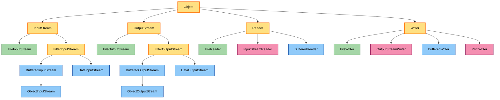
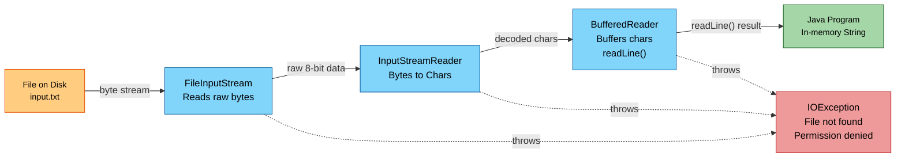
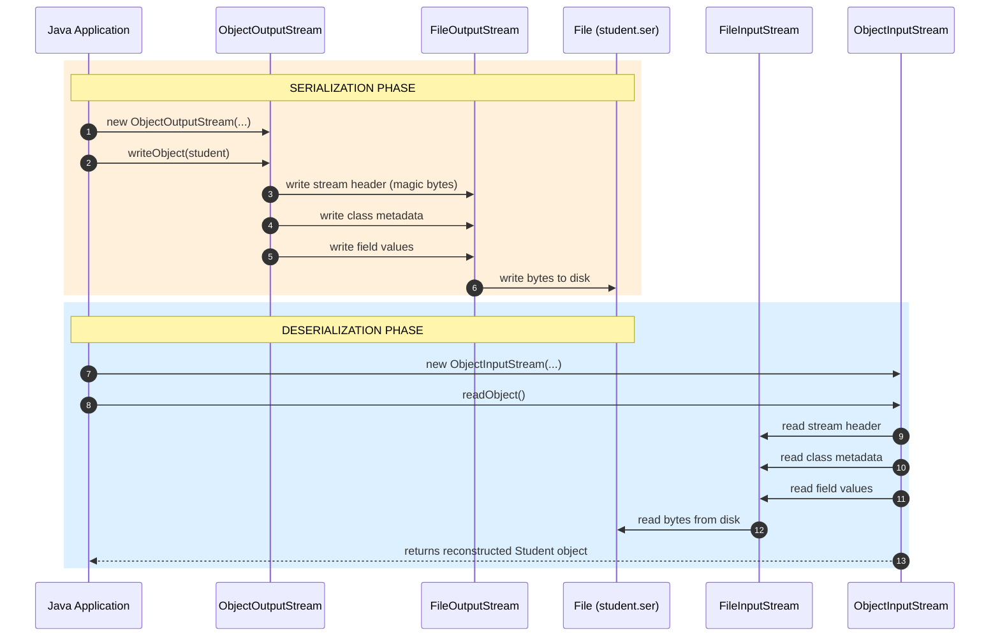
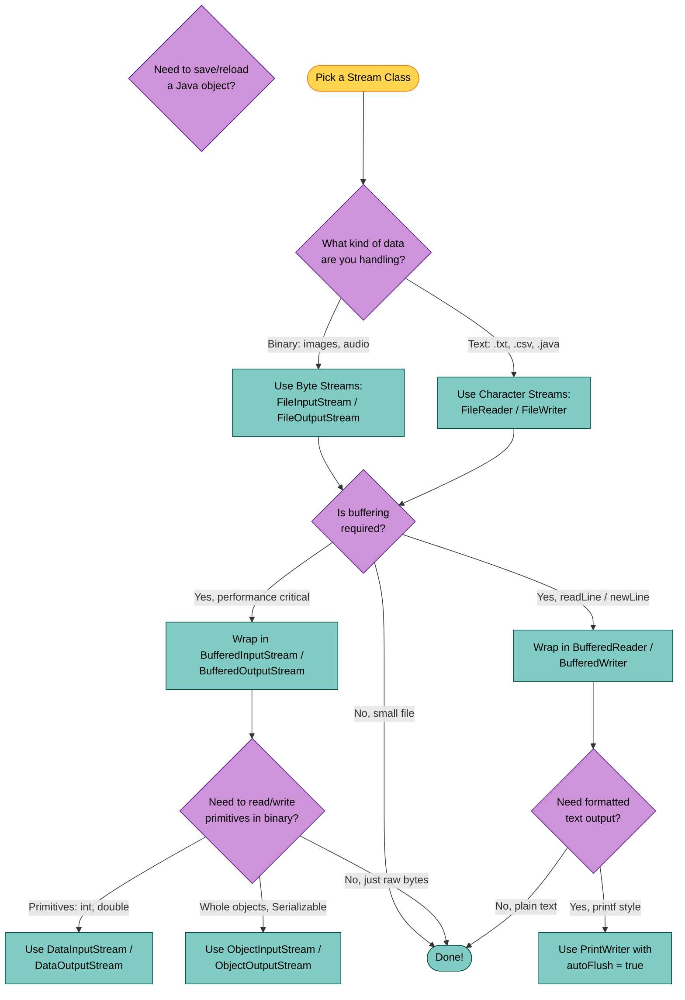

# File I/O Operations

<!-- SECTION_1_START -->

# File I/O Operations in Java — Core Technical Definition & Intuitive Overview

> [!IMPORTANT]
> **KTU 2024 Scheme — PBCSL307 / Module 2 Definition**
> **File I/O (Input/Output) Operations** in Java refer to the mechanism of reading data from and writing data to external storage devices (files on disk, network sockets, or in-memory buffers) using the **streams** defined in the `java.io` and `java.nio.file` packages. The **`java.io` package** is the primary syllabus focus for this module, providing an abstraction over the underlying operating system file descriptors.

## The Intuition: The Plumbing Analogy 🚰

Imagine Java I/O as a **plumbing system**:

- A **Source** (file, keyboard, network socket) is a **water tank**.
- A **Sink** (file, console, monitor) is a **drain or tap**.
- A **Stream** is a **pipe** connecting the source to the sink.
- **Data flows in one direction** — either towards your program (**InputStream / Reader**) or away from it (**OutputStream / Writer**).
- **Buffering** is like adding a **water tank reservoir** in the middle of the pipe — it reduces the number of small, expensive trips to the disk by collecting data into chunks.

> [!NOTE]
> **The Cardinal Rule of Java I/O:** *Data flows in only one direction in a single stream.* To both read from and write to a file, you need **two pipes** — one for input and one for output. The **Four Abstract Superclasses** that govern all of `java.io` are:
> 1. `InputStream` — byte-oriented input
> 2. `OutputStream` — byte-oriented output
> 3. `Reader` — character-oriented input
> 4. `Writer` — character-oriented output

## The Two Major Families of Streams

| Family | Base Unit | Best For | Default Encoding |
|---|---|---|---|
| **Byte Streams** (`InputStream` / `OutputStream`) | **1 byte (8 bits)** | Binary files: images, audio, `.class`, `.exe`, serialized objects | Raw binary |
| **Character Streams** (`Reader` / `Writer`) | **1 character (16-bit `char`)** | Text files: `.txt`, `.csv`, `.log`, `.java` | **Unicode (UTF-16 internally)**, with platform-default charset on disk |

> [!TIP]
> **KTU Board Tip:** When a question says *"Write a Java program to read and display a text file"*, examiners expect you to use **`BufferedReader`** + **`FileReader`** (character streams), **NOT** `FileInputStream`. Using byte streams for plain text will mark you down for *'not using the appropriate stream class'*.

<!-- SECTION_1_END -->

<!-- SECTION_2_START -->

# Deep Theoretical Analysis & KTU High-Yield Formula Sheet

## 1. The Class Hierarchy of `java.io`

Java I/O follows the **Decorator Design Pattern**. Concrete stream classes (like `FileInputStream`) are wrapped by higher-level stream classes (like `BufferedInputStream`) to add functionality dynamically.

```text
java.lang.Object
├── java.io.InputStream                  (abstract — byte input)
│   ├── FileInputStream                  (node stream → reads bytes from a file)
│   ├── ByteArrayInputStream             (node stream → reads bytes from memory)
│   ├── FilterInputStream                (base for decorators)
│   │   ├── BufferedInputStream          (decorator → adds buffering)
│   │   ├── DataInputStream              (decorator → reads primitive types)
│   │   └── (ObjectInputStream extends indirectly via stream chaining)
│   └── PipedInputStream                 (thread-pipe stream)
│
├── java.io.OutputStream                 (abstract — byte output)
│   ├── FileOutputStream
│   ├── ByteArrayOutputStream
│   ├── FilterOutputStream
│   │   ├── BufferedOutputStream
│   │   ├── DataOutputStream
│   │   └── PrintStream
│
├── java.io.Reader                       (abstract — character input)
│   ├── FileReader
│   ├── InputStreamReader                (bridge: byte→char conversion)
│   ├── BufferedReader
│   └── StringReader
│
└── java.io.Writer                       (abstract — character output)
    ├── FileWriter
    ├── OutputStreamWriter               (bridge: char→byte conversion)
    ├── BufferedWriter
    ├── PrintWriter                      (most commonly used for formatted text output)
    └── StringWriter
```

## 2. Stream Classification Matrix

| Stream Class | Type | Direction | Buffering | Key Constructors |
|---|---|---|---|---|
| `FileInputStream` | Byte | Read | No | `FileInputStream(String name)` |
| `FileOutputStream` | Byte | Write | No | `FileOutputStream(String name, boolean append)` |
| `FileReader` | Char | Read | No | `FileReader(String name)` |
| `FileWriter` | Char | Write | No | `FileWriter(String name, boolean append)` |
| `BufferedInputStream` | Byte | Read | **Yes** | `BufferedInputStream(InputStream in, int size)` |
| `BufferedOutputStream` | Byte | Write | **Yes** | `BufferedOutputStream(OutputStream out, int size)` |
| `BufferedReader` | Char | Read | **Yes** | `BufferedReader(Reader r, int size)` |
| `BufferedWriter` | Char | Write | **Yes** | `BufferedWriter(Writer w, int size)` |
| `DataInputStream` | Byte | Read | No | `DataInputStream(InputStream in)` |
| `DataOutputStream` | Byte | Write | No | `DataOutputStream(OutputStream out)` |
| `ObjectInputStream` | Byte | Read | No | `ObjectInputStream(InputStream in)` |
| `ObjectOutputStream` | Byte | Write | No | `ObjectOutputStream(OutputStream out)` |
| `PrintWriter` | Char | Write | Optional | `PrintWriter(Writer w, boolean autoFlush)` |
| `InputStreamReader` | Char | Read | No | `InputStreamReader(InputStream in, Charset cs)` |

## 3. The `File` Class (Metadata Operations)

The `java.io.File` class is **not a stream** — it represents the *pathname* of a file or directory and is used to **inspect, create, delete, rename** files.

| Method | Returns | Purpose |
|---|---|---|
| `f.exists()` | `boolean` | Checks if file exists |
| `f.canRead()` | `boolean` | Read permission check |
| `f.canWrite()` | `boolean` | Write permission check |
| `f.length()` | `long` | File size in bytes |
| `f.getName()` | `String` | Filename portion |
| `f.getAbsolutePath()` | `String` | Full absolute path |
| `f.isFile()` / `f.isDirectory()` | `boolean` | Type check |
| `f.list()` | `String[]` | Directory contents |
| `f.mkdir()` / `f.mkdirs()` | `boolean` | Create directory |
| `f.delete()` | `boolean` | Delete file or empty dir |
| `f.renameTo(File dest)` | `boolean` | Rename / move file |

## 4. KTU High-Yield Formula Sheet — Critical Method Signatures

| Action | Code Template | Notes |
|---|---|---|
| **Read one byte** | `int b = fis.read();` | Returns `-1` at **EOF (End Of File)** |
| **Read into byte array** | `int n = fis.read(byte[] buf);` | Returns bytes actually read, `-1` at EOF |
| **Write one byte** | `fos.write(int b);` | Only the low 8 bits are written |
| **Write byte array** | `fos.write(byte[] buf);` | Writes entire array |
| **Read one line** | `String s = br.readLine();` | Returns `null` at EOF |
| **Write one line** | `bw.write(String s); bw.newLine();` | Always use `newLine()` for portability |
| **Flush & Close** | `pw.flush(); pw.close();` | **Mandatory** for output streams |
| **Read primitive** | `dis.readInt();` / `readDouble();` | Must match the write order! |
| **Write object** | `oos.writeObject(obj);` | Class must implement `Serializable` |
| **Read object** | `obj = (MyClass) ois.readObject();` | Throws `ClassNotFoundException` |

## 5. Real-World Engineering Utility

- **Persistence Layer**: Before databases, all data was stored in flat files; even today, log files (`.log`), configuration files (`.properties`, `.json`, `.xml`), and CSV exports use file I/O.
- **Serialization**: Java RMI, EJB, and distributed caching systems (like **Redis Java client** and **Apache Spark** internals) heavily depend on `ObjectOutputStream` for marshalling objects across the network.
- **Build Tools**: Compilers (like `javac`) read source `.java` files and write `.class` bytecode files — a pure file I/O pipeline.
- **Log Analysis**: Production servers (Tomcat, JBoss) emit gigabytes of log files; engineers write Java programs using `BufferedReader` to parse them for debugging.

> [!WARNING]
> **KTU 2024 Pitfall:** `Scanner` is **not** part of `java.io`; it lives in `java.util`. While the syllabus allows it for quick file reading, examiners may deduct marks if a question explicitly asks for a *stream-based* solution. Always default to **`BufferedReader` + `FileReader`** for file-reading programs in the exam.

<!-- SECTION_2_END -->

<!-- SECTION_3_START -->

# Step-by-Step Derivations & Code Implementation

> [!IMPORTANT]
> **Lab-Oriented Focus:** Every program below is **fully executable**, uses the **modern `try-with-resources` syntax** (post-Java 7, the KTU 2024 expected standard), declares **specific exception types** in `catch` blocks, and is **heavily commented** to fetch full marks in the record manual.

---

## Program 1: Byte-Level File Copy (`FileInputStream` + `FileOutputStream`)

**Use case:** Copying a **binary file** like an image, audio, or `.class` file.

```java
import java.io.FileInputStream;
import java.io.FileOutputStream;
import java.io.IOException;

/**
 * Program: Byte-level file copy.
 * KTU Concept: Node streams FileInputStream and FileOutputStream.
 * Suitable for: Binary files (images, audio, .exe, .class).
 */
public class ByteFileCopy {

    public static void main(String[] args) {

        String sourcePath = "source.jpg";
        String destPath   = "destination.jpg";

        // The try-with-resources statement automatically closes BOTH streams
        // when the try block finishes (success OR exception).
        try (FileInputStream  fis = new FileInputStream(sourcePath);
             FileOutputStream fos = new FileOutputStream(destPath)) {

            // Step 1: Allocate a buffer of 4 KB (a common disk block size).
            byte[] buffer = new byte[4096];

            // Step 2: Loop until read() returns -1, signalling End Of File.
            int bytesRead;
            long totalBytes = 0L;

            while ((bytesRead = fis.read(buffer)) != -1) {
                // Step 3: Write ONLY the bytes actually read.
                // The last chunk is usually smaller than the buffer size.
                fos.write(buffer, 0, bytesRead);
                totalBytes += bytesRead;
            }

            System.out.println("File copied successfully.");
            System.out.println("Total bytes transferred : " + totalBytes);

        } catch (IOException e) {
            // Specific catch — NOT a generic Exception.
            System.err.println("I/O Error during file copy: " + e.getMessage());
        }
    }
}
```

**Line-by-Line Evaluation Key:**

| Line / Block | Marks | Reason |
|---|---|---|
| `try-with-resources` declaration | 2 | Shows understanding of resource management |
| `new byte[4096]` buffer creation | 1 | Buffering improves I/O performance |
| `while ((bytesRead = fis.read(buffer)) != -1)` | 2 | Correct EOF check idiom (returns -1) |
| `fos.write(buffer, 0, bytesRead)` | 1 | Writing the **partial last chunk** correctly |
| `catch (IOException e)` | 1 | Specific exception handling |

---

## Program 2: Character-Level File Read + Write (`FileReader` + `FileWriter` + `BufferedReader` + `BufferedWriter`)

**Use case:** Reading a **text file** and converting its contents to **UPPERCASE** in a new file.

```java
import java.io.BufferedReader;
import java.io.BufferedWriter;
import java.io.FileReader;
import java.io.FileWriter;
import java.io.IOException;

/**
 * Program: Read a text file line-by-line, convert to UPPERCASE, write to another.
 * KTU Concept: Character streams + Decorator pattern (Buffer wrapping node stream).
 */
public class TextFileUpperCase {

    public static void main(String[] args) {

        String inputFile  = "input.txt";
        String outputFile = "output_uppercase.txt";

        // BufferedReader decorates FileReader -> adds readLine() and buffering.
        // BufferedWriter decorates FileWriter -> adds newLine() and buffering.
        try (BufferedReader br = new BufferedReader(new FileReader(inputFile));
             BufferedWriter bw = new BufferedWriter(new FileWriter(outputFile))) {

            String line;
            int lineCount = 0;

            // readLine() returns null at EOF (NOT -1 as in byte streams).
            while ((line = br.readLine()) != null) {
                bw.write(line.toUpperCase());
                bw.newLine();   // Writes the platform-specific line separator.
                lineCount++;
            }

            System.out.println("Processing complete. Lines processed: " + lineCount);

        } catch (IOException e) {
            System.err.println("Error processing text file: " + e.getMessage());
        }
    }
}
```

---

## Program 3: Reading Primitive Data Types with `DataInputStream` / `DataOutputStream`

**Use case:** Storing structured binary records (e.g., a student record with `int`, `double`, `String`).

```java
import java.io.DataInputStream;
import java.io.DataOutputStream;
import java.io.EOFException;
import java.io.FileInputStream;
import java.io.FileOutputStream;
import java.io.IOException;

/**
 * Program: Write & read mixed primitive data using DataOutputStream / DataInputStream.
 * KTU Concept: Data streams preserve Java's binary type sizes, regardless of platform.
 */
public class DataStreamRecordIO {

    public static void main(String[] args) {

        String dataFile = "records.dat";

        // ---------- WRITE PHASE ----------
        try (DataOutputStream dos = new DataOutputStream(new FileOutputStream(dataFile))) {

            dos.writeInt(101);                   // 4 bytes
            dos.writeUTF("Anand Kumar");         // Length-prefixed UTF-8 string
            dos.writeDouble(8.75);               // 8 bytes (IEEE 754)
            dos.writeBoolean(true);              // 1 byte
            dos.writeInt(102);
            dos.writeUTF("Priya Menon");
            dos.writeDouble(9.12);
            dos.writeBoolean(false);

            System.out.println("Two records written to " + dataFile);

        } catch (IOException e) {
            System.err.println("Write error: " + e.getMessage());
        }

        // ---------- READ PHASE ----------
        // The reads MUST mirror the writes in type, order, and quantity.
        try (DataInputStream dis = new DataInputStream(new FileInputStream(dataFile))) {

            // Loop until EOFException is thrown (this is the canonical idiom).
            while (true) {
                int    id     = dis.readInt();
                String name   = dis.readUTF();
                double cgpa   = dis.readDouble();
                boolean flag  = dis.readBoolean();

                System.out.printf("ID: %d | Name: %-15s | CGPA: %.2f | Active: %b%n",
                                  id, name, cgpa, flag);
            }

        } catch (EOFException eof) {
            // Reached end of file gracefully — expected termination condition.
            System.out.println("Reached end of file. Read complete.");
        } catch (IOException e) {
            System.err.println("Read error: " + e.getMessage());
        }
    }
}
```

**Output:**
```text
Two records written to records.dat
ID: 101 | Name: Anand Kumar      | CGPA: 8.75 | Active: true
ID: 102 | Name: Priya Menon      | CGPA: 9.12 | Active: false
Reached end of file. Read complete.
```

---

## Program 4: Object Serialization & Deserialization (Most Heavily Asked in KTU)

**Use case:** Saving a Java object to a file and reconstructing it later (e.g., saving a game state, user preferences).

```java
import java.io.FileInputStream;
import java.io.FileOutputStream;
import java.io.IOException;
import java.io.ObjectInputStream;
import java.io.ObjectOutputStream;
import java.io.Serializable;

/**
 * Program: Serialize and deserialize a Student object.
 * KTU Concept: ObjectInputStream / ObjectOutputStream, Serializable interface,
 *              serialVersionUID, transient keyword.
 */

// Step 1: The class MUST implement java.io.Serializable.
// Serializable is a MARKER interface — it has NO methods to implement.
class Student implements Serializable {

    // Strongly recommended: declare serialVersionUID to control versioning.
    private static final long serialVersionUID = 1L;

    private String name;
    private int    rollNo;
    private double cgpa;
    private transient String password;   // 'transient' -> NOT serialized.

    public Student(String name, int rollNo, double cgpa, String password) {
        this.name     = name;
        this.rollNo   = rollNo;
        this.cgpa     = cgpa;
        this.password = password;
    }

    @Override
    public String toString() {
        return "Student{name='" + name + "', rollNo=" + rollNo +
               ", cgpa=" + cgpa + ", password='" + password + "'}";
    }
}

public class SerializationDemo {

    public static void main(String[] args) {

        String filePath = "student.ser";
        Student original = new Student("Rohit Sharma", 47, 9.21, "secret123");

        // ---------- SERIALIZATION (Object -> bytes) ----------
        try (ObjectOutputStream oos =
                 new ObjectOutputStream(new FileOutputStream(filePath))) {

            oos.writeObject(original);
            System.out.println("Object serialized successfully.");
            System.out.println("Original  : " + original);

        } catch (IOException e) {
            System.err.println("Serialization error: " + e.getMessage());
        }

        // ---------- DESERIALIZATION (bytes -> Object) ----------
        try (ObjectInputStream ois =
                 new ObjectInputStream(new FileInputStream(filePath))) {

            Student restored = (Student) ois.readObject();   // Cast required.
            System.out.println("Restored  : " + restored);
            System.out.println("Note: 'password' is null because it was 'transient'.");

        } catch (IOException | ClassNotFoundException e) {
            // ClassNotFoundException is mandatory to catch for readObject().
            System.err.println("Deserialization error: " + e.getMessage());
        }
    }
}
```

**Output:**
```text
Object serialized successfully.
Original  : Student{name='Rohit Sharma', rollNo=47, cgpa=9.21, password='secret123'}
Restored  : Student{name='Rohit Sharma', rollNo=47, cgpa=9.21, password='null'}
```

> [!NOTE]
> **Examiner's Note — Key Takeaways from the Above Program:**
> 1. `implements Serializable` is mandatory; the class must be marked with the *marker* interface.
> 2. `serialVersionUID` ensures version compatibility between writer and reader. If the class structure changes and the UID doesn't match, **`InvalidClassException`** is thrown.
> 3. The `transient` keyword excludes a field from serialization. It's restored to its **default value** (`null` for objects, `0` for primitives).
> 4. `readObject()` throws **two** checked exceptions: `IOException` and `ClassNotFoundException`. You MUST catch **both** (or declare them with `throws`).

---

## Program 5: The `File` Class — File & Directory Operations

**Use case:** Displaying directory listings, checking file metadata.

```java
import java.io.File;
import java.text.SimpleDateFormat;
import java.util.Date;

/**
 * Program: Recursive directory listing with file metadata.
 * KTU Concept: java.io.File, isFile(), isDirectory(), listFiles(), length().
 */
public class DirectoryExplorer {

    public static void explore(File dir, int depth) {

        // Safety boundary: depth limit prevents infinite recursion on symlink loops.
        if (depth > 10) {
            System.out.println("  ".repeat(depth) + "MAX DEPTH REACHED");
            return;
        }

        // Print current directory/file.
        String indent = "  ".repeat(depth);
        System.out.println(indent + dir.getName() +
                           (dir.isDirectory() ? File.separator : ""));

        // Base case: if NOT a directory, just print metadata and return.
        if (dir.isFile()) {
            System.out.println(indent + "  size = " + dir.length() + " bytes");
            return;
        }

        // Recursive case: list children, but guard against null (e.g., permission denied).
        File[] children = dir.listFiles();
        if (children == null) {
            System.out.println(indent + "  [ACCESS DENIED]");
            return;
        }

        for (File child : children) {
            explore(child, depth + 1);
        }
    }

    public static void main(String[] args) {

        // Use current working directory as the exploration root.
        File root = new File(".");

        SimpleDateFormat sdf = new SimpleDateFormat("yyyy-MM-dd HH:mm:ss");
        System.out.println("Exploring: " + root.getAbsolutePath());
        System.out.println("Timestamp: " + sdf.format(new Date()));
        System.out.println("=============================================");

        explore(root, 0);

        // ----- Demonstrating other File methods -----
        System.out.println("\n--- File Metadata of this program ---");
        File me = new File("DirectoryExplorer.java");
        System.out.println("Exists        : " + me.exists());
        System.out.println("Readable      : " + me.canRead());
        System.out.println("Writable      : " + me.canWrite());
        System.out.println("Absolute Path : " + me.getAbsolutePath());
        System.out.println("File size     : " + me.length() + " bytes");
    }
}
```

---

## Program 6: `Scanner` + `PrintWriter` for Formatted Text Output

**Use case:** Reading a delimited file and writing a **formatted report** (commonly used in lab viva questions).

```java
import java.io.File;
import java.io.FileNotFoundException;
import java.io.PrintWriter;
import java.util.Scanner;

/**
 * Program: Read a CSV-like 'students.txt' and produce a formatted report.
 * KTU Concept: Scanner for parsing, PrintWriter for formatted output.
 *
 * File 'students.txt' content (assume):
 *   101,Anand,8.75
 *   102,Priya,9.12
 *   103,Deepak,7.45
 */
public class ReportGenerator {

    public static void main(String[] args) {

        String inputFile  = "students.txt";
        String outputFile = "report.txt";

        try (Scanner sc       = new Scanner(new File(inputFile));
             PrintWriter pw   = new PrintWriter(new File(outputFile))) {

            pw.println("============= STUDENT REPORT =============");
            pw.printf("%-6s %-15s %-6s%n", "ID", "NAME", "CGPA");
            pw.println("------------------------------------------");

            int    studentCount = 0;
            double totalCgpa    = 0.0;

            // hasNextLine() guards against premature EOF.
            while (sc.hasNextLine()) {
                String line = sc.nextLine().trim();
                if (line.isEmpty()) continue;     // Skip blank lines.

                // Split on comma — be defensive: limit to 3 parts.
                String[] parts = line.split(",", 3);
                if (parts.length < 3) continue;    // Skip malformed lines.

                int    id   = Integer.parseInt(parts[0].trim());
                String name = parts[1].trim();
                double cgpa = Double.parseDouble(parts[2].trim());

                pw.printf("%-6d %-15s %-6.2f%n", id, name, cgpa);
                studentCount++;
                totalCgpa += cgpa;
            }

            // Compute average with divide-by-zero protection.
            double average = (studentCount > 0) ? (totalCgpa / studentCount) : 0.0;

            pw.println("------------------------------------------");
            pw.printf("Total students : %d%n", studentCount);
            pw.printf("Average CGPA   : %.2f%n", average);
            pw.println("==========================================");

            System.out.println("Report generated: " + outputFile);

        } catch (FileNotFoundException e) {
            System.err.println("File not found: " + e.getMessage());
        } catch (NumberFormatException e) {
            System.err.println("Invalid numeric data: " + e.getMessage());
        }
    }
}
```

> [!TIP]
> **`Scanner` is a `Closeable` resource** and can be used inside a `try-with-resources` block, ensuring it is closed automatically. Many students forget this and lose a mark.

<!-- SECTION_3_END -->

<!-- SECTION_4_START -->

# Structural Diagrams & Schematics

## Diagram 1: Java I/O Class Hierarchy (Decorator Pattern Visualization)



**Reading the Diagram:**
- **Yellow boxes** = abstract base classes (cannot be instantiated directly).
- **Green boxes** = *node streams* — connect directly to a physical source/sink.
- **Blue boxes** = *decorator streams* — wrap a node stream to add functionality (buffering, formatting, serialization).
- **Pink boxes** = *specialized streams* (bridges between byte & character worlds, or formatted writers).

---

## Diagram 2: Typical Read Operation Data Flow



**Reading the Diagram:**
- Data starts as raw bytes on disk, flows upward through three wrappers, finally emerging as a `String` in the application.
- The **IOException** is thrown at any stage and must be caught at the bottom.

---

## Diagram 3: Serialization Round-Trip (Object ↔ File)



---

## Diagram 4: Decision Flowchart — Which Stream Should I Use?



<!-- SECTION_4_END -->

<!-- SECTION_5_START -->

# KTU 2024 Scheme Examination Question Bank & Topic Recap

---

## 📘 PART A — Short Answer Questions (3 Marks Each)

### Question 1: Difference between Byte Streams and Character Streams. [KTU University Exam - July 2024]
**Mapped CO:** CO3 — *Implement Java programs using I/O streams.*
**RBT Level:** Understand

**Model Answer (3 Marks):**

| Feature | Byte Streams | Character Streams |
|---|---|---|
| **Base Unit** | 1 byte (8 bits) | 1 character (16-bit Unicode) |
| **Abstract Classes** | `InputStream`, `OutputStream` | `Reader`, `Writer` |
| **Examples** | `FileInputStream`, `FileOutputStream` | `FileReader`, `FileWriter` |
| **Ideal for** | Binary files (images, audio, `.class`) | Text files (`.txt`, `.csv`, `.java`) |
| **Encoding Handling** | None (raw bytes) | Automatic Unicode translation via charset |

> `[Byte vs Character explanation: 2 Marks] [Examples cited correctly: 1 Mark]`

---

### Question 2: What is the purpose of the `Serializable` interface in Java? Why is `serialVersionUID` declared? [KTU University Exam - Dec 2023]
**Mapped CO:** CO3 — *Apply object serialization techniques.*
**RBT Level:** Remember / Understand

**Model Answer (3 Marks):**

- The `Serializable` interface is a **marker interface** (no methods) under `java.io`. A class implements it to declare that its objects can be converted into a byte stream (serialized) and later reconstructed (deserialized). Without implementing it, calling `writeObject()` on the object throws **`NotSerializableException`**. `[2 Marks]`
- The `serialVersionUID` is a `static final long` identifier that represents the **version of the class structure** at the time of serialization. During deserialization, the JVM compares the writer's UID with the reader's UID. If they differ, an `InvalidClassException` is thrown, preventing incompatible classes from being deserialized. Declaring it explicitly gives the developer control over versioning. `[1 Mark]`

---

## 📗 PART B — Long Answer Questions (14 Marks Each — Internal Choice)

### ✅ Question A: Byte Streams + Object Serialization [KTU University Exam - July 2024]

**Mapped CO:** CO3, CO5
**RBT Levels:** Apply (part a), Analyze (part b)

#### Part (a) — 7 Marks: Write a Java program using `FileInputStream` and `FileOutputStream` to copy the contents of one binary file to another, displaying the number of bytes transferred.

**Model Solution:**

```java
import java.io.FileInputStream;
import java.io.FileOutputStream;
import java.io.IOException;

public class BinaryFileCopier {

    public static void main(String[] args) {

        String source      = "source.bin";
        String destination = "destination.bin";

        try (FileInputStream  fis = new FileInputStream(source);
             FileOutputStream fos = new FileOutputStream(destination)) {

            byte[] buffer     = new byte[1024];
            int    bytesRead  = 0;
            long   totalBytes = 0L;

            while ((bytesRead = fis.read(buffer)) != -1) {
                fos.write(buffer, 0, bytesRead);
                totalBytes += bytesRead;
            }

            System.out.println("File copied successfully.");
            System.out.println("Total bytes transferred: " + totalBytes);

        } catch (IOException e) {
            System.err.println("I/O Error: " + e.getMessage());
        }
    }
}
```

**Valuation Key:**
| Step | Marks |
|---|---|
| Correct `try-with-resources` with both streams | 2 |
| `byte[] buffer` of appropriate size | 1 |
| `while ((bytesRead = fis.read(buffer)) != -1)` EOF logic | 2 |
| `fos.write(buffer, 0, bytesRead)` partial-buffer write | 1 |
| `IOException` catch block | 1 |
| **Total** | **7** |

#### Part (b) — 7 Marks: Explain object serialization in Java. Write a program to serialize a `Student` object (with fields `rollNo`, `name`, `cgpa`, and a `transient password`) into a file, then deserialize it and display the contents. Comment on the output of the `password` field.

**Model Solution:**

**Theory (2 Marks):**
Object Serialization is the process of converting a Java object's state into a **byte stream**, which can be saved to a disk file, sent over a network, or stored in memory. The reverse process — reconstructing the object from the byte stream — is called **deserialization**. Serialization is achieved using `ObjectOutputStream.writeObject()` and deserialization using `ObjectInputStream.readObject()`. The class must implement the `java.io.Serializable` marker interface. A `transient` field is **excluded** from the byte stream; on deserialization, it is restored to its default value (`null` for objects).

**Code (5 Marks):**

```java
import java.io.FileInputStream;
import java.io.FileOutputStream;
import java.io.IOException;
import java.io.ObjectInputStream;
import java.io.ObjectOutputStream;
import java.io.Serializable;

class Student implements Serializable {
    private static final long serialVersionUID = 1L;
    private int     rollNo;
    private String  name;
    private double  cgpa;
    private transient String password;

    public Student(int rollNo, String name, double cgpa, String password) {
        this.rollNo   = rollNo;
        this.name     = name;
        this.cgpa     = cgpa;
        this.password = password;
    }

    @Override
    public String toString() {
        return "Roll No: " + rollNo + ", Name: " + name +
               ", CGPA: " + cgpa + ", Password: " + password;
    }
}

public class StudentSerializer {

    public static void main(String[] args) {

        String file = "student_data.ser";

        // ---- SERIALIZE ----
        try (ObjectOutputStream oos = new ObjectOutputStream(
                                          new FileOutputStream(file))) {
            Student s = new Student(47, "Anand", 8.75, "secret123");
            oos.writeObject(s);
            System.out.println("Original : " + s);
        } catch (IOException e) {
            e.printStackTrace();
        }

        // ---- DESERIALIZE ----
        try (ObjectInputStream ois = new ObjectInputStream(
                                       new FileInputStream(file))) {
            Student restored = (Student) ois.readObject();
            System.out.println("Restored : " + restored);
            System.out.println("Note: 'password' is null because it was transient.");
        } catch (IOException | ClassNotFoundException e) {
            e.printStackTrace();
        }
    }
}
```

**Expected Output:**
```text
Original : Roll No: 47, Name: Anand, CGPA: 8.75, Password: secret123
Restored : Roll No: 47, Name: Anand, CGPA: 8.75, Password: null
Note: 'password' is null because it was transient.
```

**Valuation Key (Part b):**
| Step | Marks |
|---|---|
| Correct theory on serialization | 2 |
| `implements Serializable` and `serialVersionUID` | 1 |
| `transient` keyword on password field | 1 |
| Correct `writeObject` / `readObject` calls | 1 |
| Explanation of `null` output for `password` | 1 |
| **Total** | **7** |

---

### ✅ Question B: Character Streams + File Class Operations [KTU University Exam - Dec 2023]

**Mapped CO:** CO3, CO4
**RBT Levels:** Understand (part a), Apply (part b)

#### Part (a) — 7 Marks: What is the difference between `FileReader` and `FileInputStream`? When would you prefer one over the other? Mention the role of `InputStreamReader` and `BufferedReader` with a small code snippet.

**Model Answer:**

**Comparison Table (3 Marks):**

| Aspect | `FileInputStream` | `FileReader` |
|---|---|---|
| Package | `java.io` | `java.io` |
| Base class | `InputStream` (byte stream) | `Reader` (character stream) |
| Reads | Raw bytes (1 byte at a time) | Characters (2 bytes — Unicode) |
| Encoding | None — raw binary | Uses platform default charset |
| Method to read | `int read()` → returns `0`–`255` or `-1` | `int read()` → returns `0`–`65535` or `-1` |
| Use case | Images, audio, `.exe`, `.class` | `.txt`, `.csv`, `.log`, source code |

**`InputStreamReader` and `BufferedReader` (4 Marks):**
- `InputStreamReader` is a **bridge class** that converts a byte stream into a character stream, allowing you to specify an explicit charset (e.g., UTF-8). It is used when the source provides bytes but the application needs to read characters.
- `BufferedReader` is a **decorator** that wraps any `Reader` to add a memory buffer, drastically reducing I/O calls. It provides the high-level method `readLine()` which reads an entire line as a `String` (returning `null` at EOF).

**Code Snippet:**
```java
try (BufferedReader br = new BufferedReader(
        new InputStreamReader(
            new FileInputStream("notes.txt"), "UTF-8"))) {
    String line;
    while ((line = br.readLine()) != null) {
        System.out.println(line);
    }
} catch (IOException e) {
    e.printStackTrace();
}
```

#### Part (b) — 7 Marks: Write a Java program that demonstrates the use of the `File` class. Your program should:
1. Create a directory `Reports` in the current path (if it does not exist).
2. Inside it, create a file `summary.txt` and write three lines into it using `FileWriter`.
3. Display the file's **absolute path**, **size in bytes**, and check whether the file is **readable** and **writable**.
4. List all files in the `Reports` directory.

**Model Solution:**

```java
import java.io.File;
import java.io.FileWriter;
import java.io.IOException;

public class FileClassDemo {

    public static void main(String[] args) {

        // 1. Create directory.
        File dir = new File("Reports");
        if (dir.mkdir()) {
            System.out.println("Directory created: " + dir.getAbsolutePath());
        } else {
            System.out.println("Directory already exists: " + dir.getAbsolutePath());
        }

        // 2. Create file & write three lines.
        File file = new File(dir, "summary.txt");
        try (FileWriter fw = new FileWriter(file)) {
            fw.write("Line 1: Daily Report Summary\n");
            fw.write("Line 2: Total records processed = 1452\n");
            fw.write("Line 3: Status = SUCCESS\n");
            System.out.println("File written: " + file.getAbsolutePath());
        } catch (IOException e) {
            System.err.println("Write error: " + e.getMessage());
        }

        // 3. Display metadata.
        System.out.println("\n--- File Metadata ---");
        System.out.println("Absolute Path : " + file.getAbsolutePath());
        System.out.println("File size     : " + file.length() + " bytes");
        System.out.println("Is Readable   : " + file.canRead());
        System.out.println("Is Writable   : " + file.canWrite());
        System.out.println("Is File       : " + file.isFile());

        // 4. List all files in the directory.
        System.out.println("\n--- Contents of Reports/ directory ---");
        String[] files = dir.list();
        if (files != null && files.length > 0) {
            for (String name : files) {
                System.out.println(" - " + name);
            }
        } else {
            System.out.println(" (empty)");
        }
    }
}
```

**Valuation Key (Part b):**
| Step | Marks |
|---|---|
| `dir.mkdir()` and existence check | 1 |
| `new File(dir, "summary.txt")` for nested path | 1 |
| Three `fw.write()` lines with proper closing | 2 |
| Metadata: `length()`, `canRead()`, `canWrite()`, `getAbsolutePath()` | 2 |
| `dir.list()` usage with null-check | 1 |
| **Total** | **7** |

---

> [!WARNING]
> **KTU Examiner's Valuation Warning — Common Pitfalls for File I/O Programs**
> 1. **Forgetting `close()` / Not using `try-with-resources`:** Streams hold OS-level resources (file handles). Forgetting to close them causes **resource leaks**. Always use the modern `try (...)` syntax. `[Lose 1–2 marks]`
> 2. **Confusing `read()` return values:** `read()` on byte streams returns `-1` at EOF; `readLine()` on character streams returns `null` at EOF. Mixing them up causes **infinite loops**. `[Lose 1 mark]`
> 3. **Writing the partial last buffer incorrectly:** `fos.write(buffer)` writes the **entire** buffer, even if only a few bytes were read. Use `fos.write(buffer, 0, bytesRead)` to write **only the bytes read**. `[Lose 1 mark]`
> 4. **Forgetting `flush()` before `close()` on `PrintWriter` / `FileWriter`:** Buffered output may not be flushed to disk when the program ends abruptly. With `try-with-resources`, `close()` automatically calls `flush()`, but in legacy code you must do it explicitly. `[Lose 1 mark]`
> 5. **Not catching `ClassNotFoundException` for `readObject()`:** This is a checked exception and **must** be handled. Writing only `catch (IOException e)` will cause a **compilation error**. `[Lose 2 marks]`
> 6. **Catching generic `Exception`:** Always catch the **specific** exception (`IOException`, `FileNotFoundException`, `EOFException`, `ClassNotFoundException`) — the examiner looks for this. `[Lose 1 mark]`
> 7. **Using byte streams for text files (or vice versa):** Always match the stream family to the data. Use character streams (`FileReader` / `FileWriter`) for text; byte streams for binary. `[Lose 1 mark]`

---

## 📌 Topic Recap & Important Things to Remember

> [!NOTE]
> Use this section as your **last-night revision cheat sheet** before the lab exam.

- ✅ **`java.io` package** is the core package for File I/O in Java. The four abstract superclasses are `InputStream`, `OutputStream`, `Reader`, `Writer`.
- ✅ **Byte streams** = binary data (images, audio, `.class`). **Character streams** = text data (`.txt`, `.csv`, `.java`).
- ✅ **`FileInputStream` / `FileOutputStream`** — raw byte-level file I/O. Methods `read()` returns `-1` at EOF.
- ✅ **`FileReader` / `FileWriter`** — character-level file I/O. Default platform encoding.
- ✅ **`BufferedReader` / `BufferedWriter`** — decorator streams that add buffering AND the `readLine()` / `newLine()` methods. Always wrap a `FileReader` / `FileWriter` in a `BufferedReader` / `BufferedWriter` for performance.
- ✅ **`InputStreamReader`** is the **bridge** between byte and character worlds; it allows explicit charset specification (e.g., `"UTF-8"`).
- ✅ **`DataInputStream` / `DataOutputStream`** read/write **Java primitive types** (int, double, boolean, etc.) in a machine-independent binary format. Reads must mirror writes in **type, order, and quantity**.
- ✅ **`ObjectInputStream` / `ObjectOutputStream`** handle **serialization** — saving/loading entire Java objects. The class must `implement Serializable`. Use `transient` to exclude fields. Always declare a `serialVersionUID`.
- ✅ **`readObject()` throws two checked exceptions:** `IOException` and `ClassNotFoundException` — both must be caught or declared.
- ✅ **`java.io.File`** is **not a stream** — it represents the file's **pathname** for metadata operations: `exists()`, `length()`, `canRead()`, `canWrite()`, `getName()`, `isFile()`, `isDirectory()`, `mkdir()`, `delete()`, `list()`.
- ✅ **`Scanner` (`java.util`)** is convenient for reading text files and parsing tokens, but it is **not** a `java.io` stream.
- ✅ **`try-with-resources` (`try (Resource r = new ...) {...}`)** is the modern, recommended way to handle I/O; it **automatically closes** all resources, eliminating the need for an explicit `finally` block.
- ✅ **Common exceptions to know:** `FileNotFoundException` (extends `IOException`), `EOFException` (signals end of stream in `DataInputStream` loops), `IOException` (parent of all I/O issues), `ClassNotFoundException` (deserialization only).
- ✅ **Decorator Pattern** — Java I/O is built on the decorator design pattern. You can layer multiple decorators, e.g., `new ObjectInputStream(new BufferedInputStream(new FileInputStream("a.dat")))`.

> **Final Exam Mantra:** *"Pick the right stream family (byte vs char), wrap it in a buffer for performance, always use try-with-resources, and catch the specific exception. Streams are pipes; choose the correct pipe diameter for your data."* 🚰

<!-- SECTION_5_END -->
