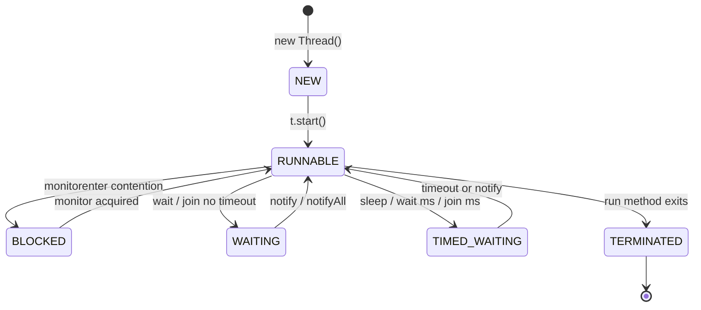
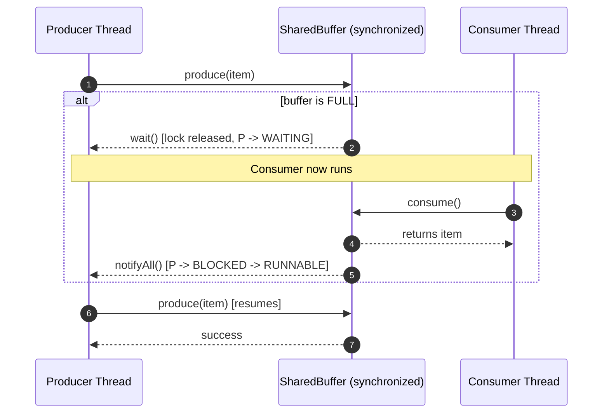
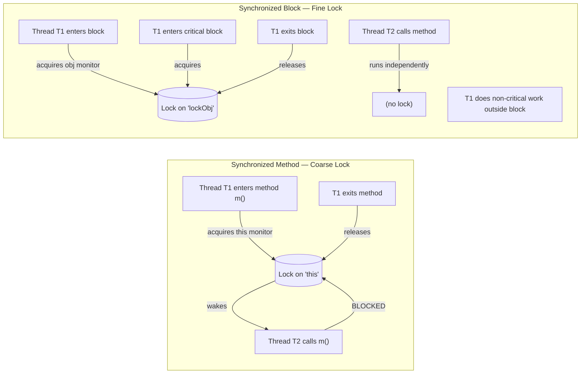
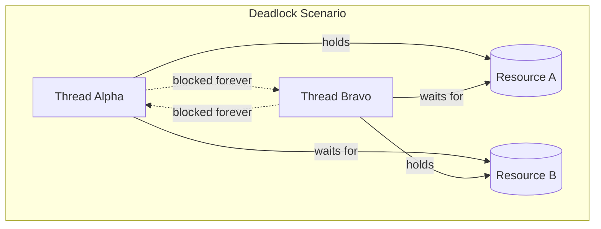
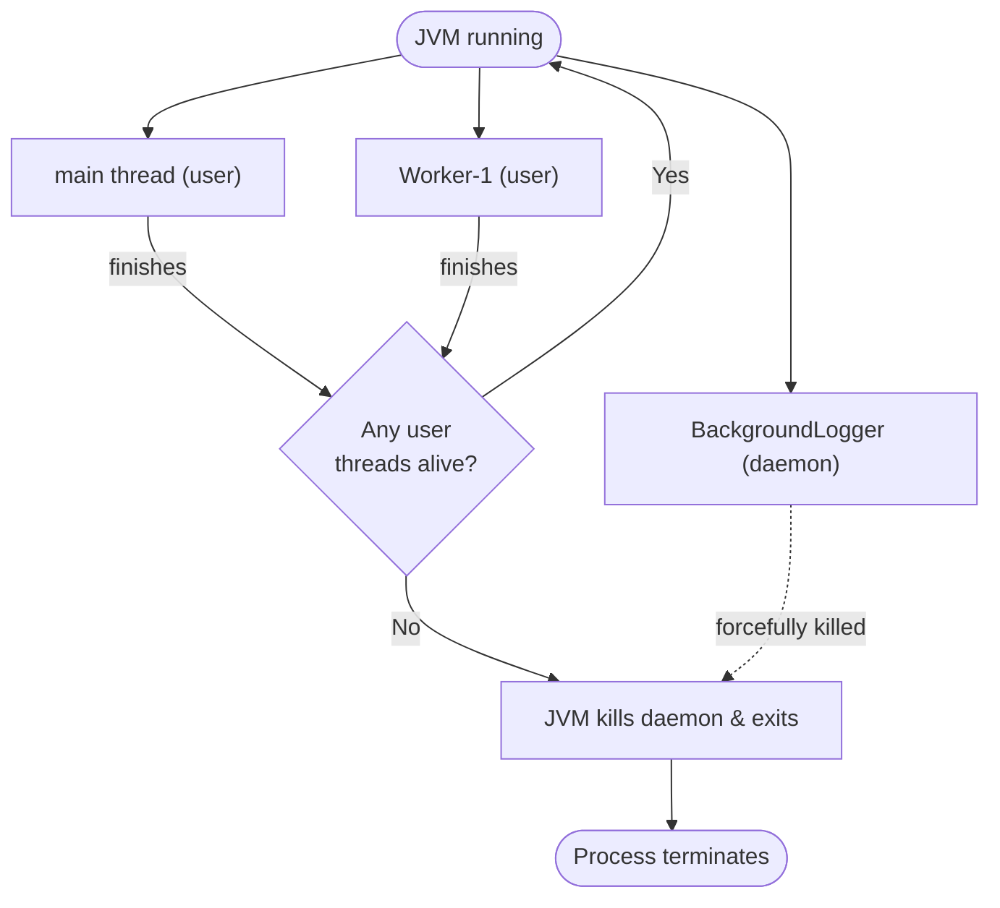

# Multithreading

<!-- SECTION_1_START -->

# Multithreading in Java — Core Technical Definition & Intuitive Overview

> [!NOTE]
> **KTU 2024 — Module 2 : Advanced Java Concepts**
> **Course Code : PBCSL307 — Object Oriented Programming Lab**
> **Topic : Multithreading**

## 1.1 Formal Academic Definition (KTU Syllabus Terminology)

**Multithreading** is a Java programming paradigm in which a single process (the JVM runtime) is divided into multiple lightweight sub-processes called **threads**, each capable of executing independent sequences of instructions concurrently, while sharing the same memory space (heap) of the parent process. A **Thread** in Java is the smallest unit of execution within a program, represented by an instance of `java.lang.Thread` or by a class implementing `java.lang.Runnable`.

> [!IMPORTANT]
> **Key Distinction (Board-Favourite) :**
> - **Process** = An independent program in execution with its **own memory space**.
> - **Thread** = A lightweight sub-unit of a process that **shares memory** with sibling threads.
> - Java threads are **pre-emptive** and **priority-based**, managed by the OS scheduler mapped onto the JVM.

## 1.2 Conceptual Analogy — "The Master Chef Kitchen"

Imagine a single **restaurant kitchen** (the *JVM process*) where:

| Kitchen Element | Java Equivalent |
| :--- | :--- |
| The kitchen itself | The JVM (process) |
| The shared pantry & fridge | Heap memory (shared variables) |
| A single chef | One **Thread** |
| Multiple chefs working in parallel | **Multithreading** |
| A recipe card on the counter | The `run()` method's code |
| The head chef assigning tasks | The **Thread Scheduler** (OS) |
| Two chefs reaching for the same jar | **Race Condition** (needs synchronization) |

Just as a single kitchen with 3 chefs can prepare 3 dishes **apparently simultaneously** by switching between them faster than the human eye can perceive, a single-core CPU with multiple threads performs *context switching* to give the illusion of true parallelism. On **multi-core CPUs**, threads genuinely run in **true parallel** execution.

## 1.3 Why Multithreading Matters in Engineering

> [!TIP]
> **Production-grade uses of multithreading in real-world engineering :**
> - **Web servers** (Tomcat, Netty) handling thousands of client requests per second.
> - **GUI applications** keeping the interface responsive while background computations run.
> - **Real-time data pipelines** in trading systems, IoT dashboards, and analytics engines.
> - **Animation & game engines** running physics, rendering, and input loops in parallel.

## 1.4 Two Standard Models of Concurrent Execution

| Model | Description | Java Implementation |
| :--- | :--- | :--- |
| **Process-based** | Heavy, isolated, separate memory | `Runtime.exec()`, `ProcessBuilder` |
| **Thread-based (lightweight)** | Shared memory, low overhead | `Thread` class, `Runnable` interface |

The KTU syllabus focuses entirely on the **thread-based model** as it is native to the Java language.

## 1.5 Thread Priorities — The Scheduling Tiers

Every Java thread carries an integer priority (default = **5**). The scheduler uses these to break ties when multiple threads are ready to run.

| Constant | Value | Meaning |
| :--- | :--- | :--- |
| `Thread.MIN_PRIORITY` | **1** | Lowest scheduling preference |
| `Thread.NORM_PRIORITY` | **5** | Default for any new thread |
| `Thread.MAX_PRIORITY` | **10** | Highest scheduling preference |

> [!WARNING]
> Priority values are **hints**, not guarantees. The underlying OS scheduler may still reorder threads. Do **not** rely on priority alone for program correctness — always use **synchronization**.

## 1.6 Intuitive Visual of a Process Split into Threads

```
   ┌─────────────────── PROCESS (JVM) ───────────────────┐
   │  Shared Heap Memory (objects, static variables)     │
   │  ┌──────────┐  ┌──────────┐  ┌──────────┐          │
   │  │ Thread A │  │ Thread B │  │ Thread C │          │
   │  │ ─ Stack  │  │ ─ Stack  │  │ ─ Stack  │          │
   │  │ ─ PC     │  │ ─ PC     │  │ ─ PC     │          │
   │  │ ─ Regs   │  │ ─ Regs   │  │ ─ Regs   │          │
   │  └──────────┘  └──────────┘  └──────────┘          │
   │   Each thread has its OWN call stack, but           │
   │   SHARES the heap with sibling threads.             │
   └────────────────────────────────────────────────────┘
```

<!-- SECTION_1_END -->

<!-- SECTION_2_START -->

# Deep Theoretical Analysis & KTU High-Yield Formula Sheet

## 2.1 The Java Thread Lifecycle — Six States

The KTU 2024 board examiners **frequently** ask this as a 3-mark definition question. Memorize the six states and the transitions between them.

| State | Description | Trigger Event |
| :--- | :--- | :--- |
| **NEW** | Thread object is created but `start()` not yet called | `new Thread()` |
| **RUNNABLE** | Thread is ready to run or currently running | `t.start()` |
| **BLOCKED** | Waiting to acquire a monitor lock | Enters `synchronized` block held by another thread |
| **WAITING** | Waiting indefinitely for another thread's action | `wait()`, `join()` (no timeout) |
| **TIMED_WAITING** | Waiting for a specified time interval | `sleep(ms)`, `wait(ms)`, `join(ms)` |
| **TERMINATED** | Thread has finished execution | `run()` method exits |

> [!IMPORTANT]
> **State Transition Triggers (Board-Exam Critical) :**
> 1. `NEW → RUNNABLE` : via `start()` (NEVER call `start()` twice — throws `IllegalThreadStateException`).
> 2. `RUNNABLE → BLOCKED` : waiting for an intrinsic monitor lock.
> 3. `RUNNABLE → WAITING` : via `Object.wait()`, `Thread.join()` (without timeout), `LockSupport.park()`.
> 4. `RUNNABLE → TIMED_WAITING` : via `sleep(ms)`, `wait(ms)`, `join(ms)`.
> 5. `WAITING/TIMED_WAITING → RUNNABLE` : via `notify()`, `notifyAll()`, or timeout expiry.
> 6. `RUNNABLE → TERMINATED` : `run()` method completes or uncaught exception terminates thread.

## 2.2 Two Ways to Create a Thread (KTU Favourite)

### Path A — Extending the `Thread` Class

```text
class MyThread extends Thread {
    @Override
    public void run() {
        // task code executes on the NEW thread, not on main()
    }
}
```

### Path B — Implementing the `Runnable` Interface (Recommended by KTU)

```text
class MyTask implements Runnable {
    @Override
    public void run() {
        // task code
    }
}
// Usage: Thread t = new Thread(new MyTask());  t.start();
```

> [!TIP]
> **Why Path B is preferred in production code :**
> - Java does **not support multiple class inheritance**, so extending `Thread` blocks us from extending another class.
> - `Runnable` represents the **task** (what to do); `Thread` represents the **worker** (who does it). Separation of concerns.
> - Enables the same `Runnable` task to be executed by a **thread pool** later.

## 2.3 The KTU High-Yield Formula Sheet

| Concept | Signature / Rule | Return / Effect |
| :--- | :--- | :--- |
| Start a thread | `t.start()` | Spawns new call stack, calls `run()` |
| Pause current thread | `Thread.sleep(long ms)` | Enters `TIMED_WAITING`; **does not release lock** |
| Yield to scheduler | `Thread.yield()` | Hint to give up CPU; state stays `RUNNABLE` |
| Wait for child | `t.join()` / `t.join(ms)` | Calling thread waits for `t` to die |
| Inter-thread wait | `obj.wait()` / `obj.wait(ms)` | Releases lock; enters `WAITING` |
| Wake waiters | `obj.notify()` / `obj.notifyAll()` | Wakes one / all threads waiting on `obj` |
| Current thread ref | `Thread.currentThread()` | Returns the executing `Thread` object |
| Set/get name | `t.setName("X")` / `t.getName()` | Thread identification |
| Set/get priority | `t.setPriority(int)` / `t.getPriority()` | 1 to 10 inclusive |
| Check if alive | `t.isAlive()` | true if started and not yet terminated |
| Daemon thread | `t.setDaemon(true)` | JVM exits when only daemons remain |
| Synchronized method | `synchronized void m(){}` | Acquires `this` monitor |
| Synchronized block | `synchronized(obj) { ... }` | Acquires `obj`'s monitor |
| Class-level lock | `synchronized(StaticClass.class){}` | One lock per Class object |

> [!WARNING]
> **Critical Board Pitfall :** `sleep()` does **NOT** release the lock; `wait()` **DOES** release the lock. Confusing these two is the #1 reason students lose marks on synchronization questions.

## 2.4 Synchronization — The Mutex Discipline

When two or more threads access **shared mutable state** simultaneously, the result becomes **non-deterministic** (a *race condition*). Java's solution is the `synchronized` keyword, which implements an **intrinsic monitor lock** (also called a *mutex*).

**The Happens-Before Guarantee Formula :**

$$
\text{Unlock}(m) \; \xrightarrow{\text{happens-before}} \; \text{Lock}(m)
$$

This means: any memory writes performed inside a `synchronized` block are guaranteed to be visible to any thread that subsequently acquires the **same monitor lock**.

### 2.4.1 Synchronized Methods vs Synchronized Blocks

| Aspect | Synchronized Method | Synchronized Block |
| :--- | :--- | :--- |
| Lock object | `this` (instance) or `Class` object (static) | Any user-chosen object |
| Granularity | Coarse — locks whole method | Fine — locks only critical section |
| Performance | Slower under contention | Faster (smaller critical section) |
| Best practice | Simple cases | Production-grade code |

## 2.5 Inter-Thread Communication — `wait()` / `notify()` / `notifyAll()`

The **Producer–Consumer** pattern is the canonical KTU 14-mark problem. The contract is:

1. `wait()`, `notify()`, and `notifyAll()` are methods of **`java.lang.Object`**, not `Thread`.
2. They can **only** be called from inside a `synchronized` block on the **same monitor object**.
3. `wait()` releases the lock; `notify()` re-acquires it before the woken thread proceeds.

> [!IMPORTANT]
> **The "Always-Use-While-Loop" Rule (Idiom) :**
>
> ```java
> synchronized (sharedBuffer) {
>     while (bufferIsEmpty) {        // ← MUST be a while, not if
>         sharedBuffer.wait();       //    guards against spurious wakeups
>     }
>     // consume item
>     sharedBuffer.notifyAll();      // wake producers
> }
> ```

## 2.6 Deadlock — The Four Coffman Conditions

A deadlock occurs when two or more threads are **permanently blocked**, each waiting for a lock held by another. The four *Coffman conditions* must ALL hold simultaneously for a deadlock:

$$
D = (\text{Mutual Exclusion}) \land (\text{Hold \& Wait}) \land (\text{No Preemption}) \land (\text{Circular Wait})
$$

Breaking **any one** of these conditions prevents deadlock. The most common engineering practice is to break **Circular Wait** by enforcing a **global lock ordering**.

## 2.7 Daemon vs User Threads

| Aspect | User Thread | Daemon Thread |
| :--- | :--- | :--- |
| JVM exit behaviour | JVM **waits** for it to die | JVM **does not wait**; kills it on shutdown |
| Examples | `main`, event-dispatch | Garbage collector, finalizer, auto-save |
| Setup | Default | `t.setDaemon(true)` **before** `t.start()` |

## 2.8 Real-World Engineering Utility

| Domain | Threading Pattern Used |
| :--- | :--- |
| **Web servers (Tomcat)** | Thread pool, one thread per HTTP request |
| **Database connection pools** | Bounded thread pool with queue |
| **GUI frameworks (Swing)** | Event Dispatch Thread (EDT) + Worker threads |
| **Android apps** | `AsyncTask`, `HandlerThread`, `ExecutorService` |
| **High-frequency trading** | Lock-free queues, `AtomicLong`, `disruptor` pattern |
| **Big Data (Hadoop/Spark)** | Worker thread pools with task scheduling |

<!-- SECTION_2_END -->

<!-- SECTION_3_START -->

# Step-by-Step Derivations & Code Implementations

## 3.1 Program 1 — Two Ways to Create a Thread (Complete Working Code)

> [!NOTE]
> **Source : KTU Module 2 reference exercise.**

### 3.1.1 Method A : Extending the `Thread` Class

```java
/**
 * KTU PBCSL307 — Module 2 : Multithreading
 * Demonstrates thread creation by extending Thread class.
 */
class MyThreadExt extends Thread {

    // Optional: assign a name to identify the thread
    public MyThreadExt(String threadName) {
        super(threadName);
    }

    // The entry point for the NEW thread
    @Override
    public void run() {
        for (int i = 1; i <= 5; i++) {
            System.out.println(getName() + " - Counter : " + i);
            try {
                Thread.sleep(500);  // pause 500 ms -> TIMED_WAITING state
            } catch (InterruptedException e) {
                System.out.println(getName() + " was interrupted.");
            }
        }
        System.out.println(getName() + " has finished execution.");
    }
}

public class ThreadExtensionDemo {
    public static void main(String[] args) {
        MyThreadExt t1 = new MyThreadExt("Worker-A");
        MyThreadExt t2 = new MyThreadExt("Worker-B");

        System.out.println("Initial state t1.isAlive() : " + t1.isAlive());

        t1.start();   // NEW -> RUNNABLE
        t2.start();   // NEW -> RUNNABLE

        System.out.println("After start, t1.isAlive() : " + t1.isAlive());
        System.out.println("Main thread priority       : " + Thread.currentThread().getPriority());
    }
}
```

**Expected Console Output (order may vary due to scheduling) :**

```
Initial state t1.isAlive() : false
After start, t1.isAlive() : true
Main thread priority       : 5
Worker-A - Counter : 1
Worker-B - Counter : 1
Worker-A - Counter : 2
Worker-B - Counter : 2
Worker-A - Counter : 3
Worker-B - Counter : 3
Worker-A - Counter : 4
Worker-B - Counter : 4
Worker-A - Counter : 5
Worker-B - Counter : 5
Worker-A has finished execution.
Worker-B has finished execution.
```

### 3.1.2 Method B : Implementing the `Runnable` Interface (KTU Recommended)

```java
/**
 * KTU PBCSL307 — Module 2 : Multithreading
 * Demonstrates thread creation by implementing Runnable.
 */
class MyTaskImpl implements Runnable {

    private final String taskName;

    public MyTaskImpl(String taskName) {
        this.taskName = taskName;
    }

    @Override
    public void run() {
        Thread current = Thread.currentThread();
        for (int i = 1; i <= 5; i++) {
            System.out.println(taskName + " executed by " + current.getName()
                    + " | iteration = " + i);
            try {
                Thread.sleep(400);
            } catch (InterruptedException e) {
                System.out.println(taskName + " interrupted.");
                return;  // exit run() cleanly
            }
        }
    }
}

public class RunnableDemo {
    public static void main(String[] args) {
        MyTaskImpl task = new MyTaskImpl("DownloadTask");

        Thread t1 = new Thread(task, "Thread-1");
        Thread t2 = new Thread(task, "Thread-2");
        Thread t3 = new Thread(task, "Thread-3");

        t1.start();
        t2.start();
        t3.start();
    }
}
```

## 3.2 Program 2 — Thread Priorities and `join()` Demonstration

```java
/**
 * Demonstrates priority hints and join() to make main()
 * wait until child threads complete.
 */
class PriorityWorker extends Thread {

    public PriorityWorker(String name) {
        super(name);
    }

    @Override
    public void run() {
        for (int i = 1; i <= 3; i++) {
            System.out.println(getName()
                    + " | priority = " + getPriority()
                    + " | i = " + i);
        }
    }
}

public class PriorityJoinDemo {
    public static void main(String[] args) throws InterruptedException {

        PriorityWorker low  = new PriorityWorker("LOW-PRIORITY");
        PriorityWorker norm = new PriorityWorker("NORM-PRIORITY");
        PriorityWorker high = new PriorityWorker("HIGH-PRIORITY");

        low.setPriority(Thread.MIN_PRIORITY);   // 1
        norm.setPriority(Thread.NORM_PRIORITY); // 5
        high.setPriority(Thread.MAX_PRIORITY);  // 10

        low.start();
        norm.start();
        high.start();

        low.join();   // main blocks until low terminates
        norm.join();  // main blocks until norm terminates
        high.join();  // main blocks until high terminates

        System.out.println("All worker threads have terminated. Main exits.");
    }
}
```

**Step-by-step logic of `join()` derivation :**

1. The `main` thread invokes `low.join()`.
2. Internally, `join()` calls `wait(0)` on the `low` thread object.
3. The `main` thread enters the `WAITING` state.
4. When `low.run()` completes, the JVM invokes `low.notifyAll()` (a JVM-internal call).
5. The `main` thread wakes, re-acquires the lock, and proceeds to `norm.join()`.

> [!TIP]
> **Valuation Tip :** In a 14-mark question, explicitly state *why* `join()` is needed (to enforce deterministic ordering for test assertions or resource cleanup).

## 3.3 Program 3 — Synchronization : The Bank Account Race Condition

This is the **most repeated KTU 14-mark question** on multithreading. We solve it in three stages.

### Stage 1 — The Buggy Version (Demonstrating the Race Condition)

```java
/**
 * BROKEN VERSION — do not use in production.
 * Shows what happens WITHOUT synchronization.
 */
class UnsafeBankAccount {
    private int balance = 1000;

    // NOT thread-safe
    public void withdraw(String user, int amount) {
        if (balance >= amount) {
            System.out.println(user + " is about to withdraw " + amount);
            try { Thread.sleep(100); } catch (InterruptedException ignored) {}
            balance -= amount;
            System.out.println(user + " completed withdrawal. New balance = " + balance);
        } else {
            System.out.println(user + " — insufficient funds. Balance = " + balance);
        }
    }

    public int getBalance() { return balance; }
}

public class RaceConditionDemo {
    public static void main(String[] args) throws InterruptedException {
        UnsafeBankAccount account = new UnsafeBankAccount();

        Runnable task = () -> {
            String user = Thread.currentThread().getName();
            for (int i = 0; i < 3; i++) {
                account.withdraw(user, 400);
            }
        };

        Thread alice = new Thread(task, "Alice");
        Thread bob   = new Thread(task, "Bob");

        alice.start();
        bob.start();
        alice.join();
        bob.join();

        System.out.println("Final balance (UNSAFE) = " + account.getBalance());
        // Final balance may be NEGATIVE — race condition!
    }
}
```

### Stage 2 — The Fix : `synchronized` Method

```java
class SafeBankAccount {
    private int balance = 1000;

    // The 'synchronized' keyword acquires the intrinsic monitor of 'this'
    public synchronized void withdraw(String user, int amount) {
        if (balance >= amount) {
            System.out.println(user + " is about to withdraw " + amount);
            try { Thread.sleep(100); } catch (InterruptedException ignored) {}
            balance -= amount;
            System.out.println(user + " completed withdrawal. New balance = " + balance);
        } else {
            System.out.println(user + " — insufficient funds. Balance = " + balance);
        }
    }

    public synchronized int getBalance() { return balance; }
}
```

### Stage 3 — Even Better : `synchronized` Block with Fine Granularity

```java
class FineGrainedAccount {
    private int balance = 1000;
    private final Object balanceLock = new Object();  // dedicated lock

    public void withdraw(String user, int amount) {
        // ... non-critical work can happen OUTSIDE the lock ...

        synchronized (balanceLock) {  // ← finer critical section
            if (balance >= amount) {
                balance -= amount;
                System.out.println(user + " withdrew " + amount
                        + " | new balance = " + balance);
            } else {
                System.out.println(user + " insufficient funds.");
            }
        }
    }
}
```

> [!IMPORTANT]
> **Full Derivation of Why Synchronization Works :**
>
> 1. The JVM associates an **intrinsic monitor** (mutex) with every Java object.
> 2. When a thread enters a `synchronized` method/block, it performs a `monitorenter` JVM instruction.
> 3. If the monitor is unowned, the thread acquires it and increments an entry counter.
> 4. If owned by another thread, the requesting thread enters the **`BLOCKED`** state and is queued.
> 5. On exit (`monitorexit`), the counter is decremented. When it reaches 0, the lock is released.
> 6. The happens-before rule guarantees memory visibility for all writes done while holding the lock.

## 3.4 Program 4 — Producer–Consumer with `wait()` / `notifyAll()`

This is the **KTU 14-mark flagship problem** for inter-thread communication.

```java
/**
 * KTU PBCSL307 — Module 2 : Producer–Consumer
 * Demonstrates inter-thread communication using wait() and notifyAll().
 */
class SharedBuffer {
    private final int[] buffer;
    private int count = 0;            // number of items currently in buffer
    private int in   = 0;             // write index
    private int out  = 0;             // read index

    public SharedBuffer(int capacity) {
        this.buffer = new int[capacity];
    }

    /** Producer calls this to deposit an item. */
    public synchronized void produce(int item) throws InterruptedException {
        // WHILE loop guards against spurious wakeups — MANDATORY
        while (count == buffer.length) {
            System.out.println("Buffer FULL. Producer waiting...");
            wait();   // releases the lock and suspends
        }

        buffer[in] = item;
        in = (in + 1) % buffer.length;
        count++;

        System.out.println("Produced  : " + item + " | count = " + count);
        notifyAll();  // wake all waiting consumers
    }

    /** Consumer calls this to withdraw an item. */
    public synchronized int consume() throws InterruptedException {
        while (count == 0) {
            System.out.println("Buffer EMPTY. Consumer waiting...");
            wait();
        }

        int item = buffer[out];
        out = (out + 1) % buffer.length;
        count--;

        System.out.println("Consumed  : " + item + " | count = " + count);
        notifyAll();  // wake all waiting producers
        return item;
    }
}

class Producer extends Thread {
    private final SharedBuffer buffer;
    public Producer(SharedBuffer buffer) { this.buffer = buffer; }

    @Override
    public void run() {
        for (int i = 1; i <= 10; i++) {
            try {
                buffer.produce(i);
                Thread.sleep(150);
            } catch (InterruptedException e) {
                Thread.currentThread().interrupt();
                return;
            }
        }
    }
}

class Consumer extends Thread {
    private final SharedBuffer buffer;
    public Consumer(SharedBuffer buffer) { this.buffer = buffer; }

    @Override
    public void run() {
        for (int i = 1; i <= 10; i++) {
            try {
                buffer.consume();
                Thread.sleep(250);
            } catch (InterruptedException e) {
                Thread.currentThread().interrupt();
                return;
            }
        }
    }
}

public class ProducerConsumerDemo {
    public static void main(String[] args) throws InterruptedException {
        SharedBuffer buffer = new SharedBuffer(5);

        Producer p = new Producer(buffer);
        Consumer c = new Consumer(buffer);

        p.start();
        c.start();

        p.join();
        c.join();

        System.out.println("Producer–Consumer simulation complete.");
    }
}
```

**Step-by-step analysis of the wait/notify mechanism :**

1. **Producer** arrives; buffer full → calls `wait()`. The lock on `buffer` is released, and the producer enters `WAITING`.
2. **Consumer** arrives; buffer not empty → consumes → calls `notifyAll()`. All threads waiting on the `buffer` monitor move to `BLOCKED`, then to `RUNNABLE` after re-acquiring the lock.
3. The awakened **Producer** re-checks `while (count == buffer.length)` (spurious-wakeup guard) and proceeds.

## 3.5 Program 5 — Daemon Thread Demonstration

```java
class BackgroundLogger extends Thread {
    public BackgroundLogger() {
        setDaemon(true);             // MUST be called BEFORE start()
        setName("BackgroundLogger");
    }

    @Override
    public void run() {
        int ticks = 0;
        while (true) {   // infinite loop — relies on daemon to die with JVM
            System.out.println(getName() + " tick #" + (++ticks));
            try {
                Thread.sleep(700);
            } catch (InterruptedException e) {
                System.out.println(getName() + " interrupted.");
                return;
            }
        }
    }
}

public class DaemonDemo {
    public static void main(String[] args) throws InterruptedException {
        BackgroundLogger logger = new BackgroundLogger();
        logger.start();

        // Main thread does some work then exits
        for (int i = 1; i <= 5; i++) {
            System.out.println("Main working... " + i);
            Thread.sleep(500);
        }
        System.out.println("Main thread exiting. JVM will now terminate the daemon.");
    }
}
```

> [!NOTE]
> When `main` finishes, the JVM sees that the **only remaining thread is a daemon**, so it shuts down — the logger is forcibly killed mid-loop.

## 3.6 Program 6 — Voluntary Deadlock (For Diagnosis, Not Production)

```java
/**
 * Illustrates the classic "Two Friends, Two Spoons" deadlock.
 * Run with: java DeadlockDemo, then use jstack <pid> to inspect.
 */
public class DeadlockDemo {

    private static final Object lockA = new Object();
    private static final Object lockB = new Object();

    public static void main(String[] args) {
        Thread alpha = new Thread(() -> {
            synchronized (lockA) {
                System.out.println("Alpha holds A, waiting for B...");
                sleepQuietly(200);
                synchronized (lockB) {
                    System.out.println("Alpha acquired B.");
                }
            }
        }, "Alpha");

        Thread bravo = new Thread(() -> {
            synchronized (lockB) {
                System.out.println("Bravo holds B, waiting for A...");
                sleepQuietly(200);
                synchronized (lockA) {
                    System.out.println("Bravo acquired A.");
                }
            }
        }, "Bravo");

        alpha.start();
        bravo.start();
    }

    private static void sleepQuietly(long ms) {
        try { Thread.sleep(ms); }
        catch (InterruptedException e) { Thread.currentThread().interrupt(); }
    }
}
```

**Deadlock prevention by enforcing global lock ordering :**

```java
// FIX: always acquire lockA BEFORE lockB in BOTH threads
synchronized (lockA) {
    synchronized (lockB) {
        // critical section
    }
}
```

> [!IMPORTANT]
> **Board-ready deadlock prevention strategies (mention at least two for full marks) :**
> 1. **Lock ordering** — globally agreed acquisition sequence breaks Circular Wait.
> 2. **Lock timeout** — `java.util.concurrent.locks.ReentrantLock.tryLock(timeout)`.
> 3. **Deadlock detection** — use `ThreadMXBean.findDeadlockedThreads()`.
> 4. **Avoid nested locks** — keep critical sections flat.
> 5. **Use higher-level concurrency utilities** — `ConcurrentHashMap`, `BlockingQueue`.

<!-- SECTION_3_END -->

<!-- SECTION_4_START -->

# Structural Diagrams & Schematics

## 4.1 Java Thread Lifecycle State Machine

> [!NOTE]
> This is the KTU board-favourite diagram. Reproduce it in the exam for full marks on the question *"Explain the thread lifecycle in Java."*



## 4.2 Two Ways to Create a Thread — Comparison Flow

```mermaid
flowchart TD
    start([Need a new thread]) --> choice{Class already\nextends another class?}

    choice -- Yes --> implR["Implement Runnable interface"]
    choice -- No --> choice2{Prefer separation\nof task and worker?}

    choice2 -- Yes --> implR
    choice2 -- No --> extT["Extend Thread class"]

    implR --> createR["new Thread(new MyRunnable()).start()"]
    extT --> createT["new MyThread().start()"]

    createR --> runM["JVM invokes run() on new call stack"]
    createT --> runM

    runM --> end([Concurrent execution begins])
```

## 4.3 Producer–Consumer Inter-Thread Communication Topology



## 4.4 Synchronized Method vs Synchronized Block — Architecture



## 4.5 Deadlock Visual — Two Friends, Two Spoons



## 4.6 Daemon vs User Thread — JVM Shutdown Behaviour



<!-- SECTION_4_END -->

<!-- SECTION_5_START -->

# KTU 2024 Scheme Examination Question Bank & Topic Recap

## 5.1 Part A — 3-Mark Short Answer Questions

> [!NOTE]
> Cognitive Levels : **Remember / Understand**

### Question A.1  `[KTU University Exam — Dec 2023]`
**Differentiate between a process and a thread. (3 Marks, CO1, Understand)**

**Model Answer :**

| Aspect | Process | Thread |
| :--- | :--- | :--- |
| Definition | An independent program in execution | A lightweight sub-unit of a process |
| Memory | Has its **own** memory space | **Shares** memory with sibling threads |
| Communication | IPC (pipes, sockets, shared files) | Direct via shared variables |
| Creation cost | Heavy (OS syscall) | Lightweight (JVM-level) |
| Context switch | Expensive | Cheap |

> *A process contains one or more threads. Java multithreading always uses **thread-based** concurrency.*

---

### Question A.2  `[KTU University Exam — July 2024]`
**List any three constructors of the `Thread` class. (3 Marks, CO1, Remember)**

**Model Answer :**

1. `Thread()` — creates a thread with default name `Thread-N`.
2. `Thread(Runnable target)` — wraps a `Runnable` task.
3. `Thread(Runnable target, String name)` — wraps a task with a custom name.
4. `Thread(String name)` — creates a thread with a custom name.
5. `Thread(ThreadGroup group, Runnable target, String name)` — assigns to a thread group.

> *Any three fetch full 3 marks.*

---

## 5.2 Part B — 14-Mark Long Answer Questions (Module Internal Choice)

### Question B (Choice A)  `[KTU University Exam — Dec 2023]`

**(a)** Explain the Java thread lifecycle with a neat state-transition diagram. Mention any **four** methods that cause a thread to transition out of the `RUNNABLE` state. **(7 Marks, CO1, Understand)**

**(b)** Write a Java program to create two threads — one extending `Thread` and the other implementing `Runnable` — both printing numbers from 1 to 5 with a 500 ms delay between prints. **(7 Marks, CO2, Apply)**

#### Model Solution — Part (a)

**Thread Lifecycle States :** `NEW`, `RUNNABLE`, `BLOCKED`, `WAITING`, `TIMED_WAITING`, `TERMINATED`.

**State Diagram :** (reproduce the mermaid from Section 4.1 as a hand-drawn diagram in the exam).

| Transition | Caused by | Target State |
| :--- | :--- | :--- |
| `NEW → RUNNABLE` | `t.start()` | RUNNABLE |
| `RUNNABLE → BLOCKED` | Waiting for `synchronized` lock | BLOCKED |
| `RUNNABLE → WAITING` | `obj.wait()` or `t.join()` without timeout | WAITING |
| `RUNNABLE → TIMED_WAITING` | `Thread.sleep(ms)`, `obj.wait(ms)`, `t.join(ms)` | TIMED_WAITING |
| `RUNNABLE → TERMINATED` | `run()` method returns or uncaught exception | TERMINATED |

**Valuation Key :**
- [Naming all 6 states : **2 Marks**]
- [Correct state-transition diagram with arrows : **2 Marks**]
- [Naming any 4 transition-triggering methods with correct target state : **3 Marks**]

#### Model Solution — Part (b)

```java
class ThreadExt extends Thread {
    @Override
    public void run() {
        for (int i = 1; i <= 5; i++) {
            System.out.println("Ext-Thread : " + i);
            try { Thread.sleep(500); }
            catch (InterruptedException e) { System.out.println("Ext interrupted."); }
        }
    }
}

class RunnableImpl implements Runnable {
    @Override
    public void run() {
        for (int i = 1; i <= 5; i++) {
            System.out.println("Runnable-Thread : " + i);
            try { Thread.sleep(500); }
            catch (InterruptedException e) { System.out.println("Runnable interrupted."); }
        }
    }
}

public class BothThreadDemo {
    public static void main(String[] args) {
        ThreadExt t1 = new ThreadExt();
        Thread t2 = new Thread(new RunnableImpl(), "Run-Worker");
        t1.start();
        t2.start();
    }
}
```

**Valuation Key :**
- [Correct class declaration for both approaches : **2 Marks**]
- [Proper `run()` override with loop : **2 Marks**]
- [Correct `Thread.sleep(500)` with try-catch : **1 Mark**]
- [Correct `start()` invocation in `main()` : **2 Marks**]

---

### Question B (Choice B)  `[KTU University Exam — July 2024]`

**(a)** What is synchronization in Java? Explain the difference between `synchronized` method and `synchronized` block with examples. **(7 Marks, CO2, Understand)**

**(b)** Write a Java program that demonstrates the **Producer–Consumer** problem using `wait()` and `notifyAll()`. Use a shared buffer of size 3. **(7 Marks, CO3, Apply)**

#### Model Solution — Part (a)

**Synchronization** is the mechanism that ensures that **only one thread** can access a shared resource (critical section) at a time, preventing race conditions. Java implements it using the **`synchronized`** keyword, which acquires an **intrinsic monitor lock** on the target object.

| Aspect | `synchronized` Method | `synchronized` Block |
| :--- | :--- | :--- |
| Lock object | `this` (or `Class` object for static) | Any user-chosen object |
| Granularity | Entire method body | Selected statements only |
| When to use | Simple, short methods | Long methods with non-critical code |

**Example Comparison :**

```java
// (i) Synchronized METHOD — lock on 'this'
public synchronized void increment() {
    count++;
}

// (ii) Synchronized BLOCK — lock on dedicated object
private final Object lock = new Object();
public void increment() {
    // do non-critical work here — no lock contention
    synchronized (lock) {   // ← finer critical section
        count++;
    }
}
```

**Valuation Key :**
- [Correct definition of synchronization : **2 Marks**]
- [Tabular comparison with at least 3 rows : **3 Marks**]
- [One valid code example for each approach : **2 Marks**]

#### Model Solution — Part (b)

```java
class BoundedBuffer {
    private final int[] data = new int[3];
    private int count = 0, in = 0, out = 0;

    public synchronized void produce(int item) throws InterruptedException {
        while (count == data.length) {
            System.out.println("Buffer full. Producer waits.");
            wait();
        }
        data[in] = item;
        in = (in + 1) % data.length;
        count++;
        System.out.println("Produced : " + item);
        notifyAll();
    }

    public synchronized int consume() throws InterruptedException {
        while (count == 0) {
            System.out.println("Buffer empty. Consumer waits.");
            wait();
        }
        int item = data[out];
        out = (out + 1) % data.length;
        count--;
        System.out.println("Consumed : " + item);
        notifyAll();
        return item;
    }
}

class Producer extends Thread {
    private final BoundedBuffer buf;
    Producer(BoundedBuffer b) { this.buf = b; }
    public void run() {
        try { for (int i = 1; i <= 6; i++) { buf.produce(i); Thread.sleep(200); } }
        catch (InterruptedException e) { Thread.currentThread().interrupt(); }
    }
}

class Consumer extends Thread {
    private final BoundedBuffer buf;
    Consumer(BoundedBuffer b) { this.buf = b; }
    public void run() {
        try { for (int i = 1; i <= 6; i++) { buf.consume(); Thread.sleep(400); } }
        catch (InterruptedException e) { Thread.currentThread().interrupt(); }
    }
}

public class ProducerConsumer {
    public static void main(String[] args) throws InterruptedException {
        BoundedBuffer buffer = new BoundedBuffer();
        new Producer(buffer).start();
        new Consumer(buffer).start();
    }
}
```

**Valuation Key :**
- [Correct class structure for shared buffer with size 3 : **2 Marks**]
- [Proper `synchronized` keyword on produce/consume : **1 Mark**]
- [`while` loop with `wait()` (NOT `if`) : **2 Marks**]
- [Correct `notifyAll()` invocation : **1 Mark**]
- [Producer & Consumer thread classes with `start()` : **1 Mark**]

> [!WARNING]
> **KTU Examiner's Valuation Warning — Common Pitfalls :**
> 1. **Using `if` instead of `while`** before `wait()` → loses 2 marks. Always use `while` to guard against *spurious wakeups*.
> 2. **Calling `wait()` or `notify()` outside a `synchronized` block** → throws `IllegalMonitorStateException` at runtime. Examiners will deduct 1–2 marks.
> 3. **Confusing `sleep()` with `wait()`** — `sleep()` does NOT release the lock; `wait()` does. Wrong explanation costs 2 marks in synchronization questions.
> 4. **Forgetting `Thread.sleep()`'s checked `InterruptedException`** — missing the try-catch causes compilation failure and **0 marks** for the program.
> 5. **Calling `t.start()` twice on the same Thread object** → `IllegalThreadStateException`. Show the correct single-call usage.
> 6. **Forgetting `setDaemon(true)` BEFORE `start()`** — daemon flag is ignored if set after `start()`, and the JVM will not auto-terminate the thread.
> 7. **Skipping the state-diagram drawing** in lifecycle questions — even a rough box-and-arrow sketch is worth 2 marks.

---

## 5.3 Topic Recap & Important Things to Remember

> [!IMPORTANT]
> **Rapid Revision Checklist for the KTU Board Exam — Multithreading**

- ✅ A **thread** is the smallest unit of execution; multiple threads in one process **share the heap** but have **private stacks**.
- ✅ Two creation paths: **extend `Thread`** (limited by single inheritance) vs **implement `Runnable`** (preferred for flexibility & thread-pool reuse).
- ✅ The thread lifecycle has **6 states** : `NEW`, `RUNNABLE`, `BLOCKED`, `WAITING`, `TIMED_WAITING`, `TERMINATED`.
- ✅ `start()` creates a new call stack and invokes `run()`; calling `start()` twice throws `IllegalThreadStateException`.
- ✅ `run()` contains the task code; if a thread is created via `Runnable` but you call `run()` directly, it executes on the **calling thread**, not a new one.
- ✅ `sleep(ms)` → **does not release** the lock; `wait()` → **releases** the lock and enters `WAITING`.
- ✅ `yield()` is a **hint** to the scheduler; `join()` makes the caller **wait** for the target thread's death.
- ✅ `wait()`, `notify()`, `notifyAll()` belong to `java.lang.Object` and **must** be called inside a `synchronized` block on the **same** monitor.
- ✅ Always use `while(condition) wait();` — never `if` — to guard against spurious wakeups.
- ✅ `synchronized` method locks `this`; `static synchronized` locks the `Class` object.
- ✅ `synchronized` block allows **finer** locking on a user-chosen object → better throughput.
- ✅ The **happens-before** rule: `unlock(m)` happens-before `lock(m)` on the same monitor.
- ✅ **Deadlock** requires all 4 Coffman conditions; break at least one to prevent (lock ordering is the standard fix).
- ✅ **Daemon threads** (e.g., garbage collector) do NOT prevent JVM exit; must call `setDaemon(true)` **before** `start()`.
- ✅ **Thread priorities** range from 1 to 10 (default 5); they are **hints**, not guarantees.
- ✅ Producer–Consumer is the canonical inter-thread communication pattern — expect it in 14-mark questions.
- ✅ Always handle `InterruptedException` by either re-setting the interrupt flag or exiting the `run()` method cleanly.
- ✅ In exam code, **always** wrap `Thread.sleep(...)` in a try-catch for `InterruptedException`.

> **Final Note :** When in doubt, **draw the state diagram**. It is worth 2 marks by itself and demonstrates strong conceptual clarity to the examiner.

<!-- SECTION_5_END -->
