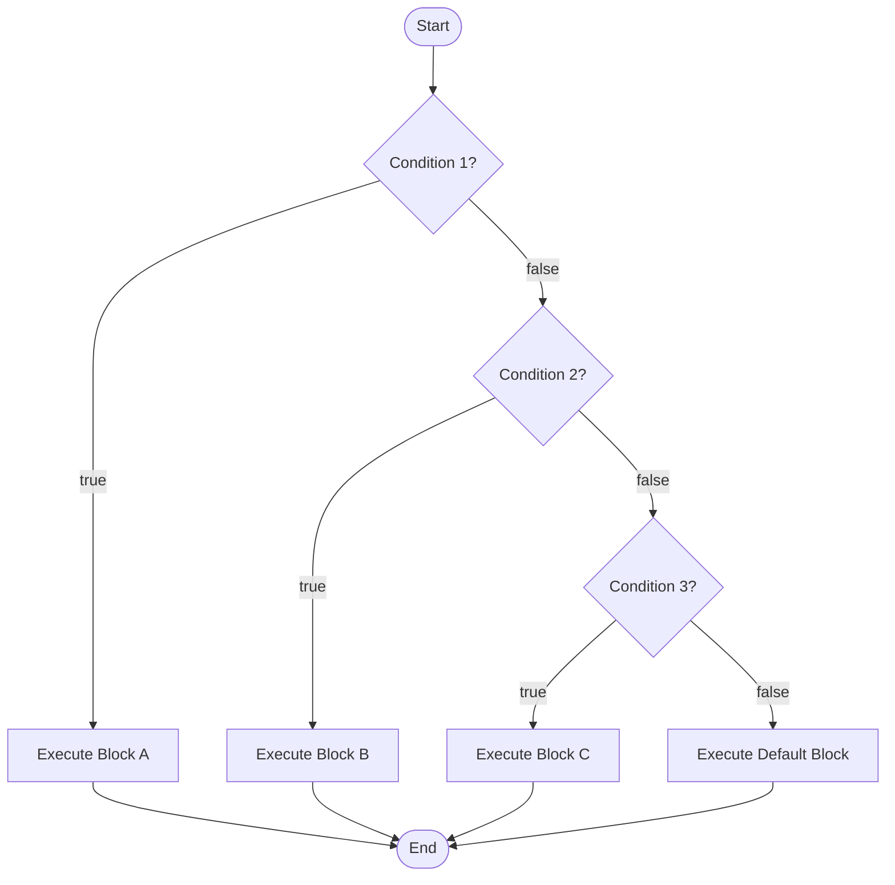
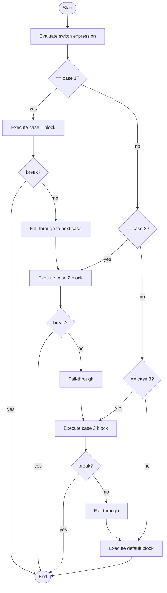
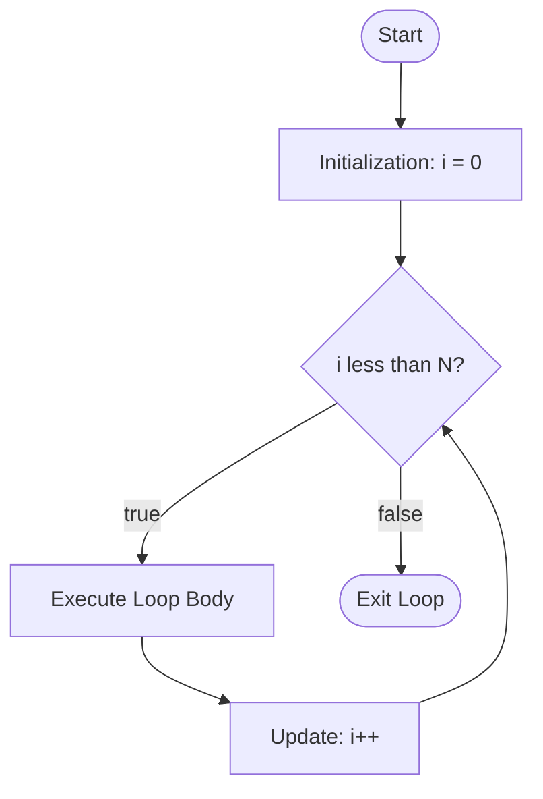
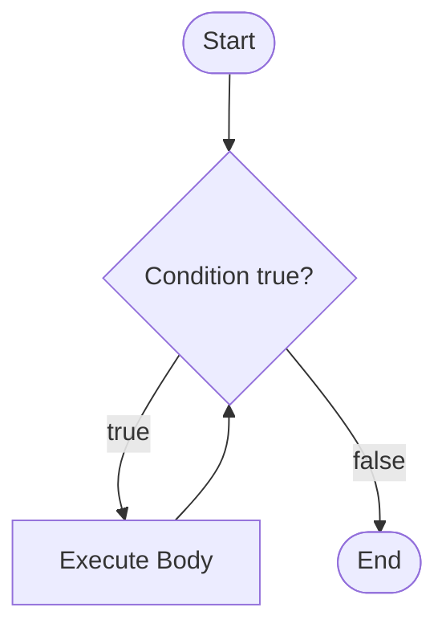
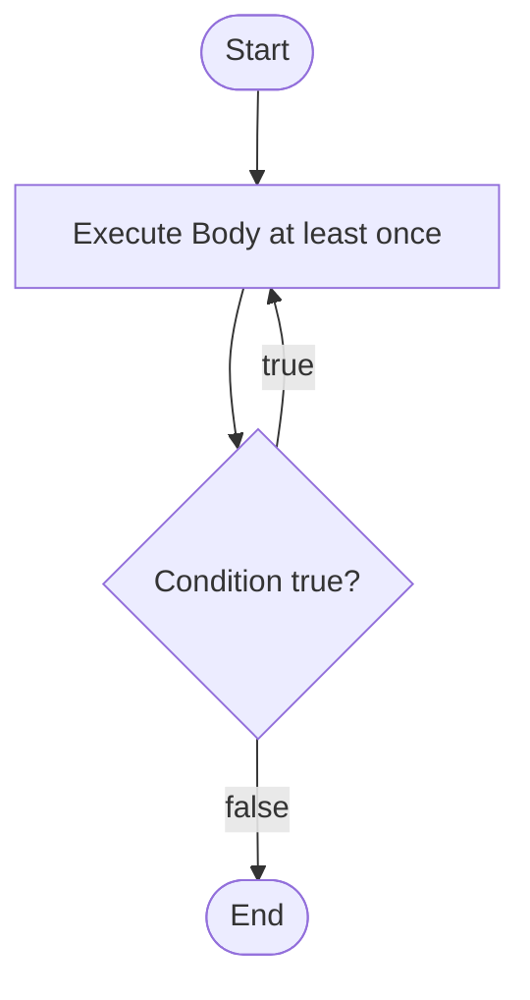
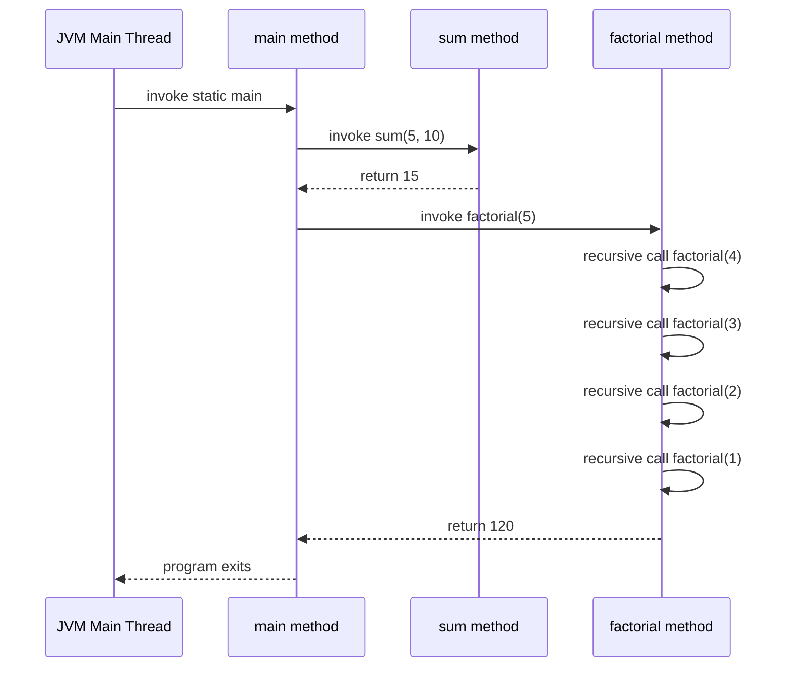
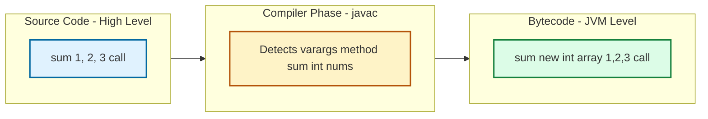
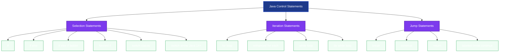

# Control Statements: Selection, Iteration, and Jump Statements, Functions, Command Line/Varargs

<!-- SECTION_1_START -->

# 1. Core Technical Definition & Intuitive Overview

## 1.1 Control Statements — Formal KTU Definition

**Control Statements** in Java are the syntactic constructs that govern the **order of execution** of instructions in a program. According to the KTU 2024 Scheme syllabus (PBCST304, Module 1), control statements are classified into three primary categories:

1. **Selection (Decision) Statements** — `if`, `if-else`, `nested if`, `if-else if-else ladder`, and the `switch` statement.
2. **Iteration (Looping) Statements** — `for`, `while`, `do-while`, and the enhanced `for-each` loop.
3. **Jump (Transfer) Statements** — `break`, `continue`, `return`, and `throw` (treated separately under Exception Handling in Module 4).

> [!IMPORTANT]
> **KTU Syllabus Highlight (PBCST304 — Module 1):** Students *must* understand how Java's **structured control flow** enforces **single-entry, single-exit** block semantics. Unlike C/C++, Java does **not** support `goto`, ensuring disciplined program flow — a deliberate design choice by James Gosling for **robust, maintainable, distributed code** (e.g., embedded in set-top boxes, the original Green Project goal).

### 1.2 Intuitive Analogy — "The Train Switchboard"

Imagine a railway junction with three kinds of switches:

- **Selection** = a **railway signalman** who inspects the train's destination plate and physically diverts it onto Track A, Track B, or Track C. The signalman *decides* based on a condition.
- **Iteration** = a **circular loop track** where the train keeps circling until the number of wagons (the loop counter) is fully emptied.
- **Jump** = an **emergency brake** (`break`) that forces the train to leave the loop early, or a **"skip this wagon"** sign (`continue`) that lets the train ignore one iteration.

**Functions** in this analogy are **standardized train engines** stored in a depot. Each engine has a fixed name (the method name), takes a fixed number of passenger cars (parameters), and may or may not return a cargo (return value). You can summon the same engine again and again with different cargo manifests — this is **code reusability**.

**Command Line Arguments** are **dispatch notes typed into the driver's clipboard** *before* the train leaves the station. The driver reads them from `String[] args` inside the `main` method.

**Varargs** is a **flexible coupling** that allows the engine to pull 1, 5, or 100 cars — the coupling auto-adjusts. Under the hood, the compiler converts the variable list into a **fixed-size array**.

> [!NOTE]
> **Core Java Constants to Memorize for KTU Boards:**
> - Default value of `boolean` = **false**.
> - Default value of numeric primitives = **0** (or **0.0**).
> - `char` default = **'\u0000'** (the null character).
> - The `main` method signature is **strictly** `public static void main(String[] args)` — variations like `String args[]` or `String... args` are *accepted by the compiler* but the **canonical KTU answer** is the former.

### 1.3 Why Java Does NOT Have `goto`

Java intentionally omits the `goto` keyword (it is a **reserved word** but unusable) to enforce the **structured programming theorem** of Böhm and Jacopini (1966), which proved that *any computable function can be expressed using only sequence, selection, and iteration*. The `break` and `continue` statements are the only "escape hatches" that mimic a restricted form of jump.

> [!VISUALIZATION CONTROL]
> **Concept:** Decision branch — the `if-else` bifurcation
> **GeoGebra / Desmos Input Equations (Truth Domain Plot):**
> - `f1(x) = {1 : x >= 60, undefined : x < 60}`  *(Pass branch)*
> - `f2(x) = {1 : x < 60, undefined : x >= 60}`  *(Fail branch)*
> **Visual Description:** A vertical threshold line at $x = 60$ on the X-axis. To the right, the function $y = 1$ (Pass path). To the left, the function $y = 1$ (Fail path). The two domains are mutually exclusive — this is the geometric essence of an `if-else` block.

---

<!-- SECTION_1_END -->

<!-- SECTION_2_START -->

# 2. Deep Theoretical Analysis & KTU High-Yield Formula Sheet

## 2.1 Selection Statements — Granular Mechanics

### 2.1.1 The `if` Statement
The simplest form evaluates a `boolean` expression. **Java requires the condition to be strictly `boolean`** — unlike C/C++, integers do **not** coerce to booleans.

```java
if (condition) {
    // true-block
}
```

### 2.1.2 The `if-else` Statement
Provides a **two-way branch**. The `else` clause binds to the **nearest unmatched** `if` — a classic KTU pitfall.

```java
if (condition1) {
    // block A
} else if (condition2) {
    // block B
} else {
    // block C (default)
}
```

### 2.1.3 The `switch` Statement (Traditional)
Operates on `byte`, `short`, `char`, `int`, **wrapper types** (`Integer`, `Character`, etc.), **enums**, and (since Java 7) **`String`**. Each `case` must be a **compile-time constant expression**.

**Critical Rules (Highly Tested in KTU):**
- Every `case` that is *not the last one* **must end with `break`**, `return`, or `throw` — otherwise **fall-through** occurs.
- The `default` case is **optional** but recommended.
- `case` labels must be **unique literals** — variables are not allowed.

### 2.1.4 The Enhanced `switch` Expression (Java 14+, KTU 2024 expects awareness)
Uses the arrow syntax `case x ->` to eliminate fall-through entirely.

```java
String result = switch (day) {
    case MONDAY, FRIDAY, SUNDAY -> "Fun day";
    case TUESDAY                -> "Meh";
    default                     -> "Midweek";
};
```

> [!IMPORTANT]
> **KTU 2024 Update:** The syllabus mentions "modern switch" — be prepared to write both the **colon-form** (used since Java 1.0) and the **arrow-form** (since Java 14). The arrow-form is **safer** because it implicitly breaks after each case.

## 2.2 Iteration Statements — Operational Logic

### 2.2.1 The `for` Loop (definite — known iteration count)
```java
for (init; condition; update) {
    // body
}
```

**Execution Order:** `init` → `condition` check → `body` → `update` → `condition` check → ...

### 2.2.2 The Enhanced `for` Loop (for-each)
Used exclusively for **iterating over arrays and collections** (e.g., `Iterable`).

```java
for (Type identifier : iterable) {
    // body
}
```

**Limitation:** You **cannot modify the collection's structure** during iteration; you also **cannot access the index** directly.

### 2.2.3 The `while` Loop (indefinite — pre-tested)
```java
while (condition) {
    // body
}
```
The condition is evaluated **before** the body. If false initially, the body **never executes** (zero-trip loop).

### 2.2.4 The `do-while` Loop (indefinite — post-tested)
```java
do {
    // body
} while (condition);
```
The body executes **at least once**, even if the condition is false from the start (one-trip loop).

> [!NOTE]
> **Common KTU Trap:** Placing a semicolon after the `while(condition)` in a `do-while` is **mandatory**; placing one after the `for(...)` header is a **compile-time error** in Java but a "no-op" in C/C++.

## 2.3 Jump Statements — Controlled Escapes

| Statement | Scope of Effect | KTU Use Case |
|---|---|---|
| `break` | Terminates the **innermost** loop or `switch` | Exit a search loop early |
| `continue` | Skips the rest of the **current iteration** | Skip negative numbers in sum |
| `return value;` | Exits the **current method** | Provide the computed result |

**Labeled `break` / `continue`** (Java-exclusive): A `break labelName;` can exit an **outer** loop when nested loops are used.

```java
outer: for (int i = 0; i < 5; i++) {
    for (int j = 0; j < 5; j++) {
        if (i * j > 10) break outer; // exits BOTH loops
    }
}
```

## 2.4 Functions (Methods) in Java

### 2.4.1 Method Signature Anatomy
```java
accessModifier static/non-static returnType methodName(parameterList) throws ExceptionList {
    // method body
}
```

**The KTU-Defined "Signature"** is strictly: `methodName(parameterList)` — the return type and access modifiers are **not** part of the signature (this matters for overloading).

### 2.4.2 The `main` Method — The Program's Entry Point
The JVM looks for:
```java
public static void main(String[] args) { }
```
- `public` — accessible to the JVM from outside the class.
- `static` — can be invoked **without creating an object**.
- `void` — returns nothing to the OS.
- `args` — receives command-line arguments as a `String` array.

### 2.4.3 Parameter Passing — Pass by Value (Always!)
Java passes **all primitives by value** (a copy is made) and **all object references by value of the reference** (the reference itself is copied, not the object). This means a method **cannot reassign the caller's variable** to a new object, but it **can mutate** the fields of the object the reference points to.

## 2.5 Command Line Arguments

When you invoke `java MyClass hello world 42`, the JVM populates `args` as:
- `args[0] = "hello"`
- `args[1] = "world"`
- `args[2] = "42"` ← Note: this is a **String**, not an `int`!

Common KTU operations:
- `Integer.parseInt(args[0])` — convert to `int`
- `args.length` — count of arguments
- `args[i].equals("...")` or `args[i].compareTo(...)` — String comparison

## 2.6 Varargs (Variable-Length Arguments)

Introduced in **Java 5**, allows a method to accept **zero or more arguments** of a specified type.

```java
accessModifier returnType methodName(Type... identifier) { ... }
```

**Strict KTU Rules:**
1. A method can declare **only ONE** varargs parameter.
2. The varargs parameter **must be the last parameter** in the signature.
3. Inside the method, the varargs parameter is treated as an **array** (`Type[] identifier`).
4. Calling the method with **zero arguments** is valid; the parameter becomes an empty array.
5. **Ambiguity pitfall:** Overloading `method(int x)` and `method(int... x)` causes a compile-time ambiguity error if called with `method()`.

> [!NOTE]
> **Compiler Internal View (Important for KTU 2-mark questions):** The compiler rewrites `methodName(Type... x)` calls into `methodName(new Type[]{...})`. This is why the JVM itself has **no concept of varargs** — it is purely a compile-time syntactic sugar.

## 2.7 KTU Formula Sheet — Java Control Flow Cheat Sheet

| Concept | Syntax Skeleton | Key Rule |
|---|---|---|
| `if-else` | `if (cond) { } else { }` | Condition **must** be `boolean` |
| `switch` (classic) | `switch(expr) { case k: ...; break; }` | Case labels must be compile-time constants |
| `switch` (arrow) | `case k -> result;` | Implicit break; multiple labels comma-separated |
| `for` | `for (init; cond; update) { }` | All three parts are **optional**: `for(;;)` is infinite loop |
| `for-each` | `for (T x : array) { }` | Read-only traversal; no index access |
| `while` | `while (cond) { }` | Pre-tested; zero or more iterations |
| `do-while` | `do { } while (cond);` | Post-tested; one or more iterations; **semicolon required** |
| `break` | `break;` or `break label;` | Exits innermost loop or named block |
| `continue` | `continue;` or `continue label;` | Skips rest of current iteration |
| `return` | `return;` or `return value;` | Exits method; `void` methods use bare `return;` |
| Method | `modifiers T name(P1, P2) { }` | Signature = `name(P1, P2)` only |
| Command Line | `java Class arg1 arg2 ...` | Args arrive in `String[] args` |
| Varargs | `T name(T... args)` | Exactly one; must be last; treated as array inside |

> [!IMPORTANT]
> **KTU 2024 Real-World Engineering Utility:**
> - **Selection** drives authentication logic in Spring Security.
> - **Iteration** underpins `Stream.forEach()` and parallel data processing in Spark/Hadoop.
> - **Varargs** is the backbone of `String.format("...", args)` and `System.out.printf(format, args)` — the very APIs used in production logging frameworks like Log4j2 and SLF4J.
> - **Command line arguments** are the foundation of CLI tools like `git`, `mvn`, and `kubectl`.

---

<!-- SECTION_2_END -->

<!-- SECTION_3_START -->

# 3. Step-by-Step Derivations & Code/Symbolic Implementation

## 3.1 Selection Statements — Full Code Walkthroughs

### 3.1.1 Grading System with `if-else if-else Ladder`

```java
public class GradeSystem {
    public static void main(String[] args) {
        int marks = 78;
        char grade;
        if (marks >= 90) {
            grade = 'A';
        } else if (marks >= 80) {
            grade = 'B';
        } else if (marks >= 70) {
            grade = 'C';
        } else if (marks >= 60) {
            grade = 'D';
        } else {
            grade = 'F';
        }
        System.out.println("Marks: " + marks + " | Grade: " + grade);
    }
}
```

**Step-by-step trace for `marks = 78`:**
1. `marks >= 90` → `78 >= 90` → **false** → skip block.
2. `marks >= 80` → `78 >= 80` → **false** → skip block.
3. `marks >= 70` → `78 >= 70` → **true** → `grade = 'C'`.
4. All remaining `else if` blocks are skipped due to ladder semantics.
5. Output: `Marks: 78 | Grade: C`.

### 3.1.2 `switch` Statement — Day of Week (Classic Form)

```java
public class DayClassifier {
    public static void main(String[] args) {
        int day = 3;
        String type;
        switch (day) {
            case 1:
            case 7:
                type = "Weekend";
                break;
            case 2:
            case 3:
            case 4:
            case 5:
            case 6:
                type = "Weekday";
                break;
            default:
                type = "Invalid day";
                break;
        }
        System.out.println("Day " + day + " is a " + type);
    }
}
```

**Trace for `day = 3`:**
1. Control jumps to `case 3:` label.
2. No code in `case 3:` → **fall-through** into `case 4:`, `case 5:`, `case 6:`.
3. `type = "Weekday";` executes.
4. `break;` exits the switch.
5. Output: `Day 3 is a Weekday`.

### 3.1.3 `switch` with `String` (Java 7+ Feature)

```java
public class StringSwitch {
    public static void main(String[] args) {
        String cmd = args.length > 0 ? args[0] : "start";
        switch (cmd) {
            case "start"  -> System.out.println("Starting service...");
            case "stop"   -> System.out.println("Stopping service...");
            case "status" -> System.out.println("Service is running.");
            default       -> System.out.println("Unknown command: " + cmd);
        }
    }
}
```

> [!NOTE]
> **Compile-time check:** Each `case` label in a `switch(String)` must be a **string literal**. A variable, even a `final String` initialized at runtime, will trigger a compile error.

## 3.2 Iteration Statements — Exhaustive Code

### 3.2.1 Nested `for` Loop — Multiplication Table

```java
public class MultiplicationTable {
    public static void main(String[] args) {
        int n = 5;
        for (int i = 1; i <= n; i++) {
            for (int j = 1; j <= n; j++) {
                System.out.printf("%4d", i * j);
            }
            System.out.println();
        }
    }
}
```

**Trace logic:**
- Outer loop fixes `i`; inner loop iterates `j` from 1 to 5.
- Total iterations: $n \times n = 25$.
- The `printf` format specifier `%4d` reserves 4 characters (right-aligned) for clean tabular output.

### 3.2.2 `while` vs `do-while` — Sensor Reading Simulation

```java
public class SensorLoop {
    public static void main(String[] args) {
        int battery = 0;  // Assume battery is dead
        
        // while loop: body NEVER executes
        while (battery > 10) {
            System.out.println("while: Reading sensor...");
            battery--;
        }
        System.out.println("while loop finished, battery = " + battery);
        
        // do-while loop: body executes ONCE
        do {
            System.out.println("do-while: Reading sensor...");
            battery--;
        } while (battery > 10);
        System.out.println("do-while loop finished, battery = " + battery);
    }
}
```

**Output:**
```
while loop finished, battery = 0
do-while: Reading sensor...
do-while loop finished, battery = -1
```

> [!IMPORTANT]
> **KTU Insight:** The `do-while` is the canonical choice for **menu-driven programs** where the menu must be displayed at least once before checking the exit condition.

### 3.2.3 Enhanced `for` (for-each) Loop

```java
public class ForEachDemo {
    public static void main(String[] args) {
        String[] languages = {"Java", "Python", "C++", "JavaScript"};
        for (String lang : languages) {
            System.out.println("Language: " + lang);
        }
    }
}
```

**Compilation detail:** The compiler internally converts this to:
```java
for (int i = 0; i < languages.length; i++) {
    String lang = languages[i];
    // ...
}
```

## 3.3 Jump Statements — Labeled Breaks and Continues

```java
public class LabeledJumpDemo {
    public static void main(String[] args) {
        int[][] matrix = {
            {1, 2, 3},
            {4, 5, 6},
            {7, 8, 9}
        };
        int target = 5;
        boolean found = false;
        
        search:
        for (int i = 0; i < matrix.length; i++) {
            for (int j = 0; j < matrix[i].length; j++) {
                if (matrix[i][j] == target) {
                    System.out.println("Found " + target + " at [" + i + "][" + j + "]");
                    found = true;
                    break search;  // exits BOTH loops
                }
            }
        }
        if (!found) {
            System.out.println(target + " not found in matrix.");
        }
    }
}
```

**Output:** `Found 5 at [1][1]`

## 3.4 Functions / Methods — Full Implementation

### 3.4.1 Method with Multiple Return Paths

```java
public class MethodDemo {
    
    // Method that returns the larger of two numbers
    public static int max(int a, int b) {
        if (a > b) {
            return a;
        } else {
            return b;
        }
    }
    
    // Recursive method — computes factorial
    public static long factorial(int n) {
        if (n < 0) {
            throw new IllegalArgumentException("n must be non-negative");
        }
        if (n == 0 || n == 1) {
            return 1;  // base case
        }
        return n * factorial(n - 1);  // recursive case
    }
    
    // Method demonstrating pass-by-value with primitives
    public static void swap(int x, int y) {
        int temp = x;
        x = y;
        y = temp;
        System.out.println("Inside swap: x=" + x + ", y=" + y);
    }
    
    public static void main(String[] args) {
        System.out.println("max(10, 20) = " + max(10, 20));
        System.out.println("5! = " + factorial(5));
        
        int a = 5, b = 10;
        System.out.println("Before swap: a=" + a + ", b=" + b);
        swap(a, b);
        System.out.println("After swap: a=" + a + ", b=" + b);  // UNCHANGED!
    }
}
```

**Output:**
```
max(10, 20) = 20
5! = 120
Before swap: a=5, b=10
Inside swap: x=10, y=5
After swap: a=5, b=10
```

> [!IMPORTANT]
> **KTU 2-Mark Question Pattern:** "Why is Java strictly pass-by-value?" — Answer: Because even when an object reference is passed, a **copy of the reference** (the memory address) is passed. The method can mutate the object via that copy, but cannot make the caller's reference point to a different object.

### 3.4.2 Method Overloading (Compile-time Polymorphism)

```java
public class OverloadDemo {
    
    public static int add(int a, int b) {
        return a + b;
    }
    
    public static double add(double a, double b) {
        return a + b;
    }
    
    public static int add(int a, int b, int c) {
        return a + b + c;
    }
    
    public static void main(String[] args) {
        System.out.println(add(2, 3));         // calls add(int, int)
        System.out.println(add(2.5, 3.5));     // calls add(double, double)
        System.out.println(add(1, 2, 3));      // calls add(int, int, int)
    }
}
```

**Resolution rules used by the compiler:**
1. **Exact match** wins.
2. **Widening primitive conversion** (e.g., `int` → `long` → `double`) wins.
3. **Autoboxing** (e.g., `int` → `Integer`) is tried next.
4. **Varargs** is the **last resort**.

## 3.5 Command Line Arguments — Exhaustive Example

```java
public class CommandLineCalculator {
    public static void main(String[] args) {
        if (args.length < 3) {
            System.out.println("Usage: java CommandLineCalculator <num1> <op> <num2>");
            return;
        }
        
        try {
            double num1 = Double.parseDouble(args[0]);
            String op   = args[1];
            double num2 = Double.parseDouble(args[2]);
            double result;
            
            switch (op) {
                case "+": result = num1 + num2; break;
                case "-": result = num1 - num2; break;
                case "x":
                case "*": result = num1 * num2; break;
                case "/":
                    if (num2 == 0) {
                        System.out.println("Error: Division by zero.");
                        return;
                    }
                    result = num1 / num2;
                    break;
                default:
                    System.out.println("Unknown operator: " + op);
                    return;
            }
            System.out.printf("%.2f %s %.2f = %.2f%n", num1, op, num2, result);
        } catch (NumberFormatException e) {
            System.out.println("Invalid number format: " + e.getMessage());
        }
    }
}
```

**Invocation and Output:**
```
$ java CommandLineCalculator 12.5 + 7.3
12.50 + 7.30 = 19.80

$ java CommandLineCalculator 10 / 0
Error: Division by zero.

$ java CommandLineCalculator hello + world
Invalid number format: For input string: "hello"
```

## 3.6 Varargs — Compiler Rewriting Demonstration

### 3.6.1 Basic Varargs Method

```java
public class VarargsDemo {
    
    // The compiler treats "int... nums" as "int[] nums"
    public static int sum(int... nums) {
        int total = 0;
        for (int n : nums) {
            total += n;
        }
        return total;
    }
    
    public static void main(String[] args) {
        System.out.println("sum() = " + sum());                    // 0 args
        System.out.println("sum(5) = " + sum(5));                  // 1 arg
        System.out.println("sum(1,2,3,4,5) = " + sum(1,2,3,4,5));  // 5 args
        System.out.println("sum(new int[]{10,20}) = " + sum(new int[]{10, 20}));  // explicit array
    }
}
```

**Output:**
```
sum() = 0
sum(5) = 5
sum(1,2,3,4,5) = 15
sum(new int[]{10,20}) = 30
```

### 3.6.2 Varargs with Mandatory Parameters

```java
public static String buildLog(String level, String... messages) {
    StringBuilder sb = new StringBuilder("[" + level + "] ");
    for (String m : messages) {
        sb.append(m).append(" ");
    }
    return sb.toString().trim();
}
```

**Usage:**
```java
buildLog("INFO");                                  // messages = [] (empty array)
buildLog("INFO", "Server started");
buildLog("ERROR", "DB", "connection", "lost");
```

### 3.6.3 Compiler Rewriting — What Actually Happens

The Java compiler rewrites:

```java
// Source code
sum(1, 2, 3);

// Compiler-generated bytecode equivalent
sum(new int[]{1, 2, 3});
```

This is why:
- Varargs is **purely a compile-time feature** (the JVM bytecode has no varargs opcode).
- You can pass an **explicit array** to a varargs method, and vice versa, varargs calls can be received by `int[]` parameters (with warnings).

> [!WARNING]
> **Common KTU Ambiguity:** Consider the following — what happens?
> ```java
> public static void test(int... x) { System.out.println("varargs"); }
> public static void test(int x)    { System.out.println("single"); }
> 
> test();      // AMBIGUOUS — compile error
> test(5);     // calls test(int x) — single wins (exact match)
> test(5, 6);  // calls test(int... x) — only varargs accepts 2 args
> ```
> **Rule:** When a call can match *both* a fixed-arity method and a varargs method with the *same effective arity*, the **fixed-arity method wins**.

### 3.6.4 Varargs with Overloading — Valid and Invalid

```java
// VALID — different types
public static void print(String label, int... nums) { }
public static void print(String label, double... nums) { }

// VALID — different number of required parameters
public static void log(String level, String msg) { }
public static void log(String level, String... msgs) { }
log("INFO", "Started");        // calls 2-arg version
log("INFO", "a", "b", "c");    // calls varargs version

// INVALID — ambiguity
public static void conflict(int... nums) { }
public static void conflict(int a, int b) { }
conflict(1, 2);  // AMBIGUOUS
```

---

<!-- SECTION_3_END -->

<!-- SECTION_4_START -->

# 4. Structural Diagrams & Schematics

## 4.1 Selection Flow — `if-else if-else` Ladder



## 4.2 Switch Statement — Classic Fall-Through Topology



## 4.3 `for` Loop — Sequential Processing Topology



## 4.4 `while` vs `do-while` — Pre-tested vs Post-tested





## 4.5 Method Execution Stack — Call and Return Sequence



## 4.6 Varargs Compiler Rewriting — Source to Bytecode



## 4.7 Control Statement Classification — Modular Overview



---

<!-- SECTION_4_END -->

<!-- SECTION_5_START -->

# 5. KTU 2024 Scheme Examination Question Bank & Topic Recap

## Part A — Short Answer Questions (3 Marks Each)

### Question A1
**[KTU University Exam — July 2024]** Differentiate between `break` and `continue` statements in Java. Can both be used with labels? (3 Marks) | **CO1, Understand**

**Model Answer:**

| Aspect | `break` | `continue` |
|---|---|---|
| **Effect on loop** | Terminates the loop entirely | Skips the rest of the current iteration |
| **Control resumes at** | Statement immediately after the loop | Update expression, then next condition check |
| **With `switch`** | Used to prevent fall-through | Not used with `switch` |
| **Labeled form** | Yes — `break labelName;` exits the named outer block | Yes — `continue labelName;` jumps to the next iteration of the named outer loop |
| **KTU Example use case** | Stop searching once a value is found | Skip even numbers while summing a list |

Both `break` and `continue` **can** be used with **labels** in Java to act upon an outer (enclosing) loop, which is essential in nested loop scenarios.

---

### Question A2
**[KTU University Exam — Dec 2023]** Explain the term "pass by value" in Java with reference to method parameters. (3 Marks) | **CO1, Understand**

**Model Answer:**

Java is **strictly pass-by-value** for all parameters.

- When a **primitive** (`int`, `double`, etc.) is passed, a **copy of the value** is made. Changes inside the method do **not** affect the caller's variable.
- When an **object reference** is passed, a **copy of the reference** (the memory address) is made. The method can:
  - **Mutate** the object's internal state (fields) via the copied reference — and these changes **are visible** to the caller.
  - **Reassign** the local parameter to point to a new object — this has **no effect** on the caller's reference.

This dual behavior is a frequent source of confusion but is a deliberate JVM design to ensure **predictable memory semantics** and **security in distributed environments**.

---

## Part B — Long Answer Questions (14 Marks Each) — Module Internal Choice

### Question B-A (Choice 1)

**[KTU University Exam — July 2024, Module 1]** 

**(a)** Explain the different types of control statements available in Java with suitable examples. Discuss the significance of the `switch` statement. (7 Marks) | **CO1, Understand**

**(b)** Write a Java program that accepts an integer `N` from the command line and prints whether `N` is a **prime number**, a **perfect number**, or an **Armstrong number** using appropriate control statements. (7 Marks) | **CO2, Apply**

#### Model Solution — Part (a)

Java's control statements are classified into three categories:

**1. Selection Statements** — Used for conditional branching.
- `if`, `if-else`, nested `if`, `if-else if` ladder.
- `switch` — multi-way branch based on a single expression's value.

**Example — Ladder:**
```java
if (score >= 90)      grade = 'A';
else if (score >= 80) grade = 'B';
else if (score >= 70) grade = 'C';
else                  grade = 'F';
```

**2. Iteration Statements** — Used for repetition.
- `for` — known iteration count.
- `while` — pre-tested, zero or more iterations.
- `do-while` — post-tested, one or more iterations.
- Enhanced `for` (for-each) — array/collection traversal.

**3. Jump Statements** — Used for control transfer.
- `break` — exit loop/switch.
- `continue` — skip current iteration.
- `return` — exit method.
- Labeled variants for nested loops.

**Significance of `switch` statement:**
- Replaces lengthy `if-else if` ladders when comparing a **single variable** against multiple **constant values**.
- More **readable** and often compiled to a **jump table** for $O(1)$ dispatch (efficient for many cases).
- Supports `byte`, `short`, `char`, `int`, **enums**, **wrapper types**, and (since Java 7) **`String`**.
- Java 14+ arrow form eliminates fall-through bugs.

**Example:**
```java
switch (month) {
    case 1: case 3: case 5: case 7: case 8: case 10: case 12:
        days = 31; break;
    case 4: case 6: case 9: case 11:
        days = 30; break;
    case 2:
        days = (isLeapYear) ? 29 : 28; break;
    default:
        days = -1; // invalid
}
```

**Valuation Key Points (Part a):**
- [Classification into 3 categories: 2 Marks]
- [Correct examples for each: 2 Marks]
- [Significance of switch with 3 valid points: 3 Marks]

#### Model Solution — Part (b)

```java
public class NumberClassifier {
    
    // Helper: check if N is prime
    static boolean isPrime(int n) {
        if (n < 2) return false;
        for (int i = 2; i <= Math.sqrt(n); i++) {
            if (n % i == 0) return false;
        }
        return true;
    }
    
    // Helper: check if N is a perfect number
    // Perfect number: sum of proper divisors equals the number
    static boolean isPerfect(int n) {
        if (n < 2) return false;
        int sum = 0;
        for (int i = 1; i <= n / 2; i++) {
            if (n % i == 0) sum += i;
        }
        return sum == n;
    }
    
    // Helper: check if N is an Armstrong number
    // Armstrong (3-digit): sum of cubes of digits equals the number
    static boolean isArmstrong(int n) {
        int original = n, sum = 0, digits = 0;
        int temp = n;
        while (temp > 0) {
            digits++;
            temp /= 10;
        }
        temp = n;
        while (temp > 0) {
            int d = temp % 10;
            sum += Math.pow(d, digits);
            temp /= 10;
        }
        return sum == original;
    }
    
    public static void main(String[] args) {
        if (args.length == 0) {
            System.out.println("Usage: java NumberClassifier <N>");
            return;
        }
        int n = Integer.parseInt(args[0]);
        System.out.println("Number: " + n);
        System.out.println("Prime?      " + (isPrime(n)      ? "Yes" : "No"));
        System.out.println("Perfect?    " + (isPerfect(n)    ? "Yes" : "No"));
        System.out.println("Armstrong?  " + (isArmstrong(n)  ? "Yes" : "No"));
    }
}
```

**Sample Output (for `java NumberClassifier 153`):**
```
Number: 153
Prime?      No
Perfect?    No
Armstrong?  Yes
```
(Because $1^3 + 5^3 + 3^3 = 1 + 125 + 27 = 153$.)

**Sample Output (for `java NumberClassifier 28`):**
```
Number: 28
Prime?      No
Perfect?    Yes
Armstrong?  No
```
(Because $1 + 2 + 4 + 7 + 14 = 28$.)

**Valuation Key Points (Part b):**
- [Command line parsing with parseInt and error handling: 2 Marks]
- [Correct prime logic using sqrt optimization: 2 Marks]
- [Perfect number logic with divisor sum: 1 Mark]
- [Armstrong logic with digit extraction and power: 2 Marks]

> [!WARNING]
> **KTU Examiner's Valuation Pitfall — Part (b):**
> 1. **Forgetting to handle the `args.length == 0` case** will cause an `ArrayIndexOutOfBoundsException` at runtime. Examiners will deduct 1 mark if no guard is present.
> 2. **Integer overflow** in `Math.pow(d, digits)` for large digit counts: this is a known Java issue because `Math.pow` returns `double`. For 3-digit Armstrong, it's safe; for larger numbers, cast to `long` or use iterative multiplication.
> 3. **Not declaring helper methods as `static`** will cause a compile error when called from the static `main` method.

---

### Question B-B (Choice 2 — Alternative)

**[KTU University Exam — Dec 2023, Module 1]**

**(a)** What are Varargs in Java? State the rules that must be followed while writing a varargs method. Write a method that uses varargs to find the **maximum of any number of integers**. (7 Marks) | **CO2, Apply**

**(b)** Write a complete Java program that accepts **student names and marks** via command line arguments (e.g., `java StudentReport Anil 89 Beena 72 Cathy 95`) and prints the **class average, highest scorer, and number of students who passed** (pass mark = 50). Use methods and appropriate control statements. (7 Marks) | **CO3, Apply / Analyze**

#### Model Solution — Part (a)

**Definition:** Varargs (variable-length arguments), introduced in **Java 5**, allow a method to accept **zero or more arguments** of a specified type. The syntax uses **three dots** (`...`) after the type.

**Syntax:**
```java
returnType methodName(Type... parameterName) {
    // parameterName is accessible as an array of Type
}
```

**Rules (KTU Board High-Yield):**
1. A method can declare **at most one** varargs parameter.
2. The varargs parameter **must be the last parameter** in the method signature.
3. The varargs parameter is treated as an **array** (`Type[]`) inside the method body.
4. Calling the method with **zero arguments** is allowed (the array is empty).
5. Varargs and fixed-arity methods may coexist; **fixed-arity wins** on a tie.
6. Varargs is **syntactic sugar** — the compiler converts calls to array form.

**Example — Finding Maximum using Varargs:**

```java
public class VarargsMax {
    
    public static int findMax(int... numbers) {
        if (numbers.length == 0) {
            throw new IllegalArgumentException("At least one number required");
        }
        int max = numbers[0];
        for (int i = 1; i < numbers.length; i++) {
            if (numbers[i] > max) {
                max = numbers[i];
            }
        }
        return max;
    }
    
    public static void main(String[] args) {
        System.out.println("Max: " + findMax(10, 20, 5, 87, 33));      // 87
        System.out.println("Max: " + findMax(-1, -5, -2));             // -1
        System.out.println("Max: " + findMax(42));                     // 42
    }
}
```

**Output:**
```
Max: 87
Max: -1
Max: 42
```

**Valuation Key Points (Part a):**
- [Definition of varargs: 1 Mark]
- [At least 4 rules stated correctly: 2 Marks]
- [Working max method with initialization from numbers[0]: 2 Marks]
- [Edge case handling (empty varargs): 1 Mark]
- [Sample outputs: 1 Mark]

#### Model Solution — Part (b)

```java
public class StudentReport {
    
    // Method to compute the average of an int array
    public static double computeAverage(int[] marks) {
        if (marks.length == 0) return 0.0;
        int sum = 0;
        for (int m : marks) {
            sum += m;
        }
        return (double) sum / marks.length;
    }
    
    // Method to find the index of the maximum mark
    public static int findTopperIndex(String[] names, int[] marks) {
        int topIdx = 0;
        for (int i = 1; i < marks.length; i++) {
            if (marks[i] > marks[topIdx]) {
                topIdx = i;
            }
        }
        return topIdx;
    }
    
    // Method to count passing students
    public static int countPass(int[] marks, int passMark) {
        int count = 0;
        for (int m : marks) {
            if (m >= passMark) {
                count++;
            }
        }
        return count;
    }
    
    public static void main(String[] args) {
        // Validate that arguments are in pairs
        if (args.length == 0 || args.length % 2 != 0) {
            System.out.println("Usage: java StudentReport <name1> <mark1> <name2> <mark2> ...");
            return;
        }
        
        int numStudents = args.length / 2;
        String[] names = new String[numStudents];
        int[] marks = new int[numStudents];
        
        try {
            for (int i = 0; i < numStudents; i++) {
                names[i] = args[2 * i];
                marks[i] = Integer.parseInt(args[2 * i + 1]);
            }
        } catch (NumberFormatException e) {
            System.out.println("Error: Marks must be integers.");
            return;
        }
        
        // Compute and display results
        double avg = computeAverage(marks);
        int topper = findTopperIndex(names, marks);
        int passed = countPass(marks, 50);
        
        System.out.println("=== Student Report ===");
        for (int i = 0; i < numStudents; i++) {
            System.out.printf("%-15s : %d%n", names[i], marks[i]);
        }
        System.out.printf("Class Average   : %.2f%n", avg);
        System.out.println("Topper          : " + names[topper] + " (" + marks[topper] + ")");
        System.out.println("Passed (>= 50)  : " + passed + " out of " + numStudents);
    }
}
```

**Invocation and Output:**
```
$ java StudentReport Anil 89 Beena 72 Cathy 95 David 40
=== Student Report ===
Anil            : 89
Beena           : 72
Cathy           : 95
David           : 40
Class Average   : 74.00
Topper          : Cathy (95)
Passed (>= 50)  : 3 out of 4
```

**Valuation Key Points (Part b):**
- [Proper command line parsing with odd/even validation: 2 Marks]
- [NumberFormatException handling: 1 Mark]
- [Separate methods for average, topper, count (modular design): 2 Marks]
- [Correct final formatted output: 2 Marks]

> [!WARNING]
> **KTU Examiner's Valuation Pitfall — Part (b):**
> 1. **Not validating `args.length % 2 != 0`** — a student may run the program with an odd number of arguments, causing either an `ArrayIndexOutOfBoundsException` or silent data loss. Examiners will deduct 1 mark.
> 2. **Integer division trap in average calculation** — using `sum / marks.length` returns an `int` (e.g., `224/4 = 56` but `(double) sum / marks.length = 74.0` if not cast). This is a **classic 1-mark deduction point**.
> 3. **Initializing `topIdx` to 0 (not -1)** when the array is guaranteed non-empty is correct; but if the array could be empty, the method should return -1 or throw an exception. Examiners check for this defensive check.
> 4. **Mixing up indexing** in the for-loop: `args[2 * i]` for name, `args[2 * i + 1]` for mark. A common off-by-one error loses 2 marks.

---

## Topic Recap & Important Things to Remember

> [!IMPORTANT]
> **Rapid Revision Checklist — Java Module 1 Control Flow & Functions**

- **Java has NO `goto`** — it is a reserved but unused keyword to enforce structured programming.
- **Selection Statements:** `if`, `if-else`, `if-else if` ladder, nested `if`, classic `switch` (colon-form), modern `switch` (arrow-form, Java 14+).
- **Switch rules:** Case labels must be **compile-time constants**; missing `break` causes **fall-through**; arrow-form prevents fall-through implicitly; supports `String` since Java 7; supports `enum` always.
- **Iteration Statements:** `for` (definite), `while` (pre-tested, zero or more iterations), `do-while` (post-tested, one or more iterations — **semicolon mandatory**), enhanced `for` (read-only traversal of arrays/Iterables).
- **Enhanced `for` limitation:** No index access, cannot modify the collection structure during traversal (would throw `ConcurrentModificationException` for collections).
- **Jump Statements:** `break` (exits innermost loop/switch), `continue` (skips rest of current iteration), `return` (exits method), labeled `break`/`continue` (acts on outer named loop).
- **Methods in Java:** Signature is `methodName(parameterList)` only — return type and modifiers are **not** part of it (this enables overloading by parameter type/arity).
- **Pass-by-value:** Primitives are copied by value; object references are copied by value of the reference. The method can mutate the object but cannot make the caller's variable point elsewhere.
- **`main` method signature:** `public static void main(String[] args)` — must be exact for JVM to invoke. The `args` array length equals the number of command-line arguments.
- **Command line arguments are always `String`** — convert with `Integer.parseInt`, `Double.parseDouble`, etc. Always handle `NumberFormatException` and `ArrayIndexOutOfBoundsException`.
- **Varargs syntax:** `Type... parameterName` (three dots, no spaces around).
- **Varargs rules:** Only one per method; must be the **last** parameter; treated as an **array** inside the method; compiler rewrites varargs calls into array form (purely a compile-time feature).
- **Varargs overload resolution:** Fixed-arity methods win over varargs on ambiguity; you can pass an explicit array `new int[]{...}` to a varargs method.
- **Performance tip:** Calling a varargs method with an explicit array each time (in a hot loop) can be slower due to compiler-emitted array creation. Cache the array if performance-critical.
- **The `final` keyword in parameter lists:** `final int... x` is legal and prevents reassignment of the array reference inside the method.

<!-- SECTION_5_END -->
