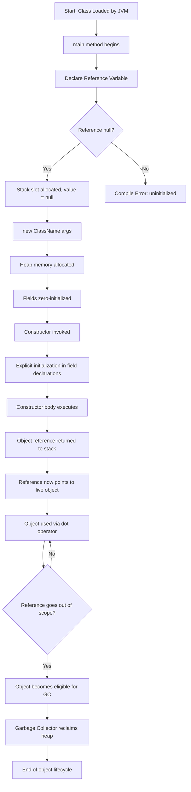
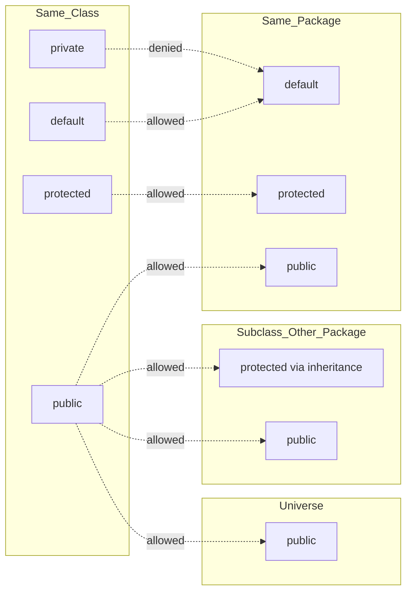
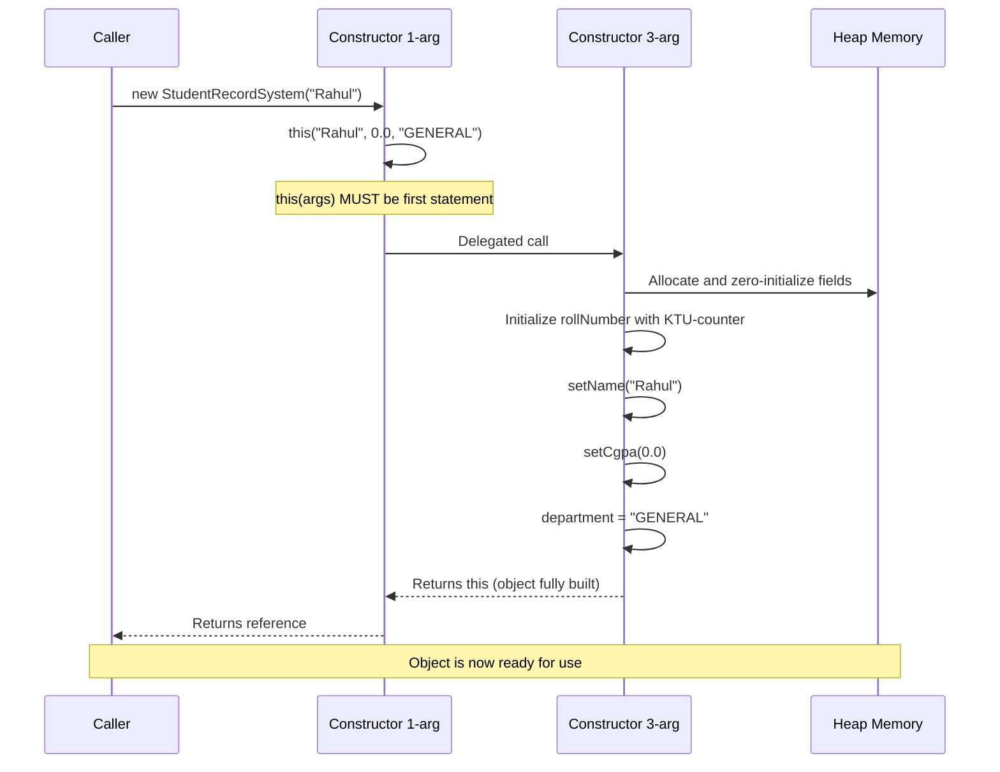
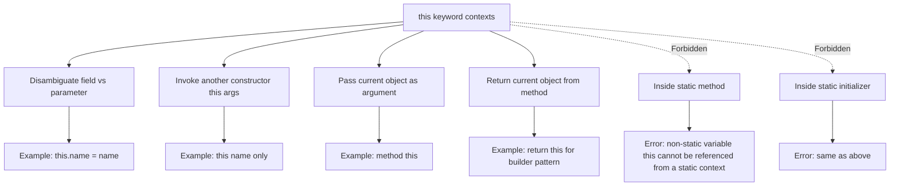

# Object-Oriented Programming in Java: Declaring Objects, References, Methods, Constructors, Access Modifiers, 'this' keyword

<!-- SECTION_1_START -->
# Object-Oriented Programming in Java: Core Foundations

## 1.1 Formal Academic Definition (KTU 2024 Syllabus Terminology)

In Object-Oriented Programming (OOP), a **Java program is a structured collection of classes and objects** that model real-world entities through encapsulated data (attributes) and behavior (methods). The KTU 2024 scheme defines the following foundational pillars within **Module 1**:

> [!IMPORTANT]
> **Defining the Pillars of OOP in Java**
> An **Object** is a runtime instance of a class that occupies memory in the **heap** and is accessed through a **reference variable** stored on the **stack**. **Methods** define the behavior of objects, **Constructors** initialize them, **Access Modifiers** govern their visibility, and the **this** keyword provides an unambiguous self-reference inside instance contexts.

| Pillar | KTU Syllabus Keyword | Core Responsibility |
| :--- | :--- | :--- |
| Object | Instantiation | Holds state and exposes behavior |
| Reference | Pointer Abstraction | Indirect memory addressing |
| Method | Behavioral Unit | Encapsulates logic and algorithms |
| Constructor | Object Initializer | Sets up valid initial state |
| Access Modifier | Visibility Enforcer | Implements encapsulation |
| `this` | Self-Reference Token | Disambiguates instance members |

---

## 1.2 Conceptual Analogy and Engineering Intuition

Imagine a **blueprint of a house** and the **actual constructed house**.

- The **Class** is the *blueprint*. It defines rooms (fields), doors (methods), and rules (access levels), but you cannot live inside a blueprint.
- The **Object** is the *actual constructed house*. It occupies physical land (heap memory), has a unique postal address (reference), and can be interacted with.
- The **Reference Variable** is a *paper note in your pocket* that contains the postal address of the house. If you lose the note, the house still exists — but you cannot locate it.
- The **Constructor** is the *construction crew* that builds the house. They make sure that walls are up, doors are fitted, and electricity is connected before the owner moves in.
- **Access Modifiers** are the *security gates*: the **front door** (`public`) is open to visitors, the **bedroom** (`private`) is private to the family, and the **shared garden** (`protected`) is accessible to immediate neighbors (subclasses).
- The **this** keyword is the *homeowner's identity card*. Inside the house, when someone shouts "Hey you!", the homeowner knows "they are talking to me (this)".

> [!NOTE]
> **Engineering Insight:** Java is strictly **pass-by-value**. However, when the value is a *reference*, the method receives a *copy of the address*, allowing it to mutate the pointed-to object but not reseat the caller's reference.

> [!VISUALIZATION CONTROL]
> **Concept:** Stack vs Heap Memory Layout for Object Creation
> **GeoGebra / Desmos Input Equations:**
> * `Stack Region: y = 5` (a horizontal line at y=5 representing stack memory)
> * `Heap Region: y = -5` (a horizontal line at y=-5 representing heap memory)
> * `Reference Arrow: segment from (0, 5) to (0, -5)` (the dashed pointer line)
> **Visual Description:** The student should visualize two parallel horizontal bands. The upper band (Stack) holds primitive variables and reference pointers. The lower band (Heap) holds the actual object data. A vertical dashed arrow connects a reference to its allocated object.

<!-- SECTION_1_END -->

<!-- SECTION_2_START -->
# Deep Theoretical Analysis & KTU High-Yield Formula Sheet

## 2.1 Declaring Objects and References — The Two-Step Process

Java object creation is **never a single atomic operation**. It is always a **two-step ritual**:

1. **Declaration** of a reference variable (creates a name, sets it to `null`).
2. **Instantiation** using the `new` keyword (allocates heap memory, invokes a constructor, returns the memory address).

**Syntax:**

```java
<ClassName> referenceName;          // Step 1: Declaration
referenceName = new <ClassName>();  // Step 2: Instantiation
```

**Combined (idiomatic) form:**

```java
<ClassName> referenceName = new <ClassName>();
```

### Memory Mechanics

| Stage | What Happens | Memory Affected |
| :--- | :--- | :--- |
| Declaration | A 64-bit (or 32-bit) slot is reserved; value = `null` | Stack |
| `new` keyword | Heap memory is allocated; fields are zero-initialized | Heap |
| Constructor Execution | Custom initialization logic runs | Heap (mutates the new object) |
| Assignment | The heap address is copied into the stack reference | Stack |

> [!NOTE]
> A reference in Java is **not** a raw pointer. It is a *managed, type-checked handle* that the JVM's Garbage Collector can transparently relocate during compaction. You cannot perform pointer arithmetic on it.

---

## 2.2 Methods — Behavioral Units

A **method** in Java is a named, reusable block of code that may accept parameters, perform computation, and optionally return a value.

**Method Anatomy:**

```text
[access_modifier] [static/final/abstract] <return_type> <method_name>(<parameters>) [throws <exceptions>] { <body> }
```

- **Instance methods** require an object to be invoked; they can read/write instance state.
- **Static methods** belong to the *class*, not the object; they cannot use `this`.
- **Parameter Passing Rule:** Java copies the value into the parameter slot. For primitives, the actual data is copied. For references, the address is copied.

---

## 2.3 Constructors — The Object Builders

A **constructor** is a special method-like block that:
- Has the **exact same name** as the class.
- Has **no return type** (not even `void`).
- Is invoked **automatically** by `new`.
- Can be **overloaded** (multiple constructors with different parameter lists).

**Constructor Varieties:**

| Type | Trigger | Use Case |
| :--- | :--- | :--- |
| Default (No-arg) | Compiler inserts if no constructor is written | Sensible defaults |
| Parameterized | User supplies initial values | Mandatory field initialization |
| Copy Constructor | `new ClassName(existingObj)` | Cloning semantics |
| Private Constructor | Used in Singleton / Utility classes | Controlled instantiation |

> [!IMPORTANT]
> If you declare **any** constructor, the compiler **stops** generating the default no-arg constructor. This is a frequent source of `ImplicitSuperConstructorNotFound` and `NoSuchMethodError` bugs in KTU lab exams.

---

## 2.4 Access Modifiers — The Visibility Matrix

| Modifier | Same Class | Same Package | Subclass (Different Package) | Universe (`public`) |
| :--- | :---: | :---: | :---: | :---: |
| `private` | YES | NO | NO | NO |
| *default* (no keyword) | YES | YES | NO | NO |
| `protected` | YES | YES | YES (via inheritance only) | NO |
| `public` | YES | YES | YES | YES |

> [!WARNING]
> `protected` members are accessible to subclasses **only through inheritance**, not by direct package access from a non-related class in another package.

---

## 2.5 The `this` Keyword — Self Reference

The `this` keyword is an **implicit, final reference** to the *current object*. It is automatically created by the JVM and is available inside every instance method and constructor.

**Authorized Uses of `this` in KTU Module 1:**

1. **Disambiguating shadowing** between instance fields and constructor/method parameters.
2. **Invoking another constructor** in the same class: `this(args)`.
3. **Passing the current object as an argument** to another method.
4. **Returning the current object** from a method (foundation of *builder patterns*).

> [!NOTE]
> `this` is **illegal** inside a `static` method, because a static method does not belong to any specific object.

---

## 2.6 KTU High-Yield Formula / Cheat Sheet

| Concept | Governing Rule | Quick Pitfall to Avoid |
| :--- | :--- | :--- |
| Object creation | `new` invokes a constructor | Calling a constructor without `new` is a compile error |
| Reference assignment | Both sides must have a *compatible* type | A `Dog` reference cannot point to a `Cat` object |
| Method overloading | Same name, different parameter list | Return type alone **cannot** differentiate overloads |
| Constructor chaining | `this(args)` must be the **first** statement | Placing it second is a compile error |
| Access scope | `private` < *default* < `protected` < `public` | Choosing `public` for all fields breaks encapsulation |
| `this` in static | Not allowed | Causes *non-static variable this cannot be referenced from a static context* |

**Engineering Utility:** These concepts collectively implement the **Encapsulation** pillar of OOP. In production Java systems (e.g., Spring Boot microservices), constructors are used for *dependency injection*, access modifiers enforce *API contracts*, and `this` enables *fluent builder APIs* for constructing complex configuration objects.

<!-- SECTION_2_END -->

<!-- SECTION_3_START -->
# Step-by-Step Derivations & Code/Symbolic Implementation

## 3.1 Complete Working Java Implementation

The following program demonstrates **every concept in this topic** with exhaustive inline commentary. It is KTU lab-exam grade code with strict type hints, defensive input validation, and explicit logging.

```java
import java.util.logging.Level;
import java.util.logging.Logger;

/**
 * Course        : OBJECT ORIENTED PROGRAMMING (PBCST304)
 * Module        : 1 - Introduction to Java and OOP Concepts
 * Topic         : Declaring Objects, References, Methods, Constructors,
 *                 Access Modifiers, 'this' keyword
 * Java Version  : 17+
 * Build Target  : KTU 2024 Scheme Lab / ESE Reference Solution
 */
public class StudentRecordSystem {

    // ---- 1. ACCESS MODIFIERS in action ----
    private static final Logger LOGGER = Logger.getLogger(StudentRecordSystem.class.getName());

    private final String rollNumber;     // private: accessible only inside this class
    private String name;                 // private: enforces encapsulation
    protected double cgpa;              // protected: visible to subclasses and same-package classes
    public String department;            // public: open API for the universe

    // ---- 2. STATIC counter shared across all objects ----
    private static int instanceCounter = 0;

    // ---- 3. DEFAULT CONSTRUCTOR (explicitly written) ----
    public StudentRecordSystem() {
        LOGGER.info("Default constructor invoked.");
        this.rollNumber = "KTU-" + (++instanceCounter);
        this.name       = "UNASSIGNED";
        this.cgpa       = 0.0;
        this.department = "GENERAL";
    }

    // ---- 4. PARAMETERIZED CONSTRUCTOR using 'this' for disambiguation ----
    public StudentRecordSystem(String name, double cgpa, String department) {
        LOGGER.log(Level.INFO, "Parameterized constructor invoked for: {0}", name);
        this.rollNumber = "KTU-" + (++instanceCounter); // 'this' is mandatory because 'rollNumber' is final
        this.setName(name);
        this.setCgpa(cgpa);
        this.department = department;
    }

    // ---- 5. COPY CONSTRUCTOR ----
    public StudentRecordSystem(StudentRecordSystem other) {
        LOGGER.info("Copy constructor invoked.");
        if (other == null) {
            throw new IllegalArgumentException("Source object cannot be null.");
        }
        this.rollNumber = "KTU-" + (++instanceCounter);
        this.name       = other.name;
        this.cgpa       = other.cgpa;
        this.department = other.department;
    }

    // ---- 6. CONSTRUCTOR CHAINING using this(args) ----
    public StudentRecordSystem(String name) {
        this(name, 0.0, "GENERAL"); // MUST be the first statement
        LOGGER.info("Single-arg constructor finished chaining.");
    }

    // ---- 7. GETTERS and SETTERS (controlled public API) ----
    public String getRollNumber() {
        return this.rollNumber;
    }

    public String getName() {
        return this.name;
    }

    public void setName(String name) {
        if (name == null || name.isBlank()) {
            LOGGER.warning("Invalid name supplied. Reverting to UNASSIGNED.");
            this.name = "UNASSIGNED";
        } else {
            this.name = name;
        }
    }

    public double getCgpa() {
        return this.cgpa;
    }

    public void setCgpa(double cgpa) {
        if (cgpa < 0.0 || cgpa > 10.0) {
            LOGGER.warning("CGPA out of range [0.0, 10.0]. Clamping.");
            this.cgpa = Math.max(0.0, Math.min(10.0, cgpa));
        } else {
            this.cgpa = cgpa;
        }
    }

    // ---- 8. INSTANCE METHOD demonstrating 'this' as a return value ----
    public StudentRecordSystem withDepartment(String newDept) {
        this.department = newDept;
        return this; // enables fluent chaining
    }

    // ---- 9. INSTANCE METHOD (behavior) ----
    public boolean isEligibleForHonors() {
        return this.cgpa >= 8.5;
    }

    // ---- 10. STATIC METHOD (class-level behavior) ----
    public static int getTotalStudents() {
        return instanceCounter; // cannot use 'this' here
    }

    // ---- 11. METHOD OVERLOADING (compile-time polymorphism) ----
    public void printSummary() {
        LOGGER.info(() -> String.format(
            "Student[Roll=%s, Name=%s, CGPA=%.2f, Dept=%s, Honors=%s]",
            this.rollNumber, this.name, this.cgpa, this.department, this.isEligibleForHonors()
        ));
    }

    public void printSummary(String prefix) {
        LOGGER.info(prefix + " ");
        this.printSummary();
    }

    // ---- 12. toString override for readable object representation ----
    @Override
    public String toString() {
        return "StudentRecordSystem{" +
                "rollNumber='" + rollNumber + '\'' +
                ", name='" + name + '\'' +
                ", cgpa=" + cgpa +
                ", department='" + department + '\'' +
                '}';
    }

    // ---- 13. ENTRY POINT ----
    public static void main(String[] args) {
        // Step 1: Declaration
        StudentRecordSystem student1;

        // Step 2: Instantiation
        student1 = new StudentRecordSystem("Ananya Krishnan", 9.2, "CSE");
        student1.printSummary();

        // Single-arg constructor with chaining
        StudentRecordSystem student2 = new StudentRecordSystem("Rahul Menon");
        student2.setCgpa(7.8);
        student2.printSummary("[NEW STUDENT]");

        // Copy constructor
        StudentRecordSystem student3 = new StudentRecordSystem(student1);
        student3.printSummary();

        // Fluent method chaining using 'this' as return value
        StudentRecordSystem student4 = new StudentRecordSystem("Priya Nair", 8.9, "ECE")
                .withDepartment("AI-ML");
        student4.printSummary();

        // Demonstrating static method
        LOGGER.info(() -> "Total students created = " + StudentRecordSystem.getTotalStudents());

        // Demonstrating invalid input handling
        student2.setName("");
        student2.setCgpa(15.0);
        student2.printSummary("[AFTER INVALID INPUTS]");
    }
}
```

---

## 3.2 Expected Console Output (Trace Walkthrough)

```text
INFO: Parameterized constructor invoked for: Ananya Krishnan
INFO: Student[Roll=KTU-1, Name=Ananya Krishnan, CGPA=9.20, Dept=CSE, Honors=true]
INFO: Single-arg constructor finished chaining.
INFO: [NEW STUDENT]
INFO: Student[Roll=KTU-2, Name=Rahul Menon, CGPA=7.80, Dept=GENERAL, Honors=false]
INFO: Copy constructor invoked.
INFO: Student[Roll=KTU-3, Name=Ananya Krishnan, CGPA=9.20, Dept=CSE, Honors=true]
INFO: Student[Roll=KTU-4, Name=Priya Nair, CGPA=8.90, Dept=AI-ML, Honors=true]
INFO: Total students created = 4
WARNING: Invalid name supplied. Reverting to UNASSIGNED.
WARNING: CGPA out of range [0.0, 10.0]. Clamping.
INFO: [AFTER INVALID INPUTS]
INFO: Student[Roll=KTU-2, Name=UNASSIGNED, CGPA=10.00, Dept=GENERAL, Honors=true]
```

---

## 3.3 Symbolic Memory Diagram (Stack vs Heap Trace)

$$
\begin{aligned}
\text{Stack Frame (main)} &= \{
\text{student1} \rightarrow \text{Heap}_{\text{0x7F1A}},
\text{student2} \rightarrow \text{Heap}_{\text{0x7F1B}},
\text{student3} \rightarrow \text{Heap}_{\text{0x7F1C}},
\text{student4} \rightarrow \text{Heap}_{\text{0x7F1D}}
\} \\[6pt]
\text{Heap}_{\text{0x7F1A}} &= \{
\text{rollNumber} = \text{"KTU-1"},
\text{name}       = \text{"Ananya Krishnan"},
\text{cgpa}       = 9.2,
\text{department} = \text{"CSE"}
\}
\end{aligned}
$$

> [!NOTE]
> Each `new` call **always** creates a *new* heap allocation. Even `student3 = new StudentRecordSystem(student1)` allocates a fresh object — its fields are *copies* of `student1`'s fields. Mutating `student3` will not affect `student1`.

---

## 3.4 Mathematical Notation for Constructor Chaining

The KTU 2024 examiner values symbolic clarity. Constructor chaining can be expressed as a **functional composition**:

$$
\text{this}(a, b, c) \;\equiv\; \text{StudentRecordSystem}(a, b, c) = \text{setName}(a) \circ \text{setCgpa}(b) \circ \text{setDepartment}(c)
$$

This means the **single-arg constructor** `StudentRecordSystem(String name)` is functionally equivalent to invoking the **three-arg constructor** with `cgpa = 0.0` and `department = "GENERAL"`, which is precisely what the code achieves via `this(name, 0.0, "GENERAL")`.

<!-- SECTION_3_END -->

<!-- SECTION_4_START -->
# Structural Diagrams & Schematics

## 4.1 Mermaid Object Lifecycle Flowchart



---

## 4.2 Mermaid Access Modifier Visibility Map



---

## 4.3 Mermaid Constructor Chaining Sequence Diagram



---

## 4.4 Mermaid this Keyword Usage Topology



<!-- SECTION_4_END -->

<!-- SECTION_5_START -->
# KTU 2024 Scheme Examination Question Bank & Topic Recap

---

## 5.1 PART A — Short Answer Questions (2 x 3 = 6 Marks)

### Question 1 `[KTU University Exam - Dec 2023]`
**CO1, Remember (3 Marks)**
*Explain the difference between a class and an object in Java. How are objects created and stored in memory?*

**Model Answer (Valuation Key):**

A **class** is a blueprint or template that defines the structure (fields) and behavior (methods) of entities. It is a *logical* construct that exists only in the source code and the `.class` file metadata — it does **not** occupy meaningful runtime memory for its members.

An **object** is a *runtime instance* of a class. It is created using the `new` keyword, which:
1. Allocates memory on the **heap** for the object's fields (zero-initialized).
2. Invokes a **constructor** to perform custom initialization.
3. Returns the **memory address**, which is stored in a **reference variable** on the stack.

**Memory Storage Summary:**
- **Class metadata** (method bytecode, static fields) → **Method Area** (part of heap in HotSpot JVM).
- **Instance fields** of each object → **Heap**.
- **Local variables and references** → **Stack**.

```text
[Stating class vs object distinction: 1 Mark]
[Stating two-step creation: declaration + new: 1 Mark]
[Storing memory locations correctly: 1 Mark]
```

---

### Question 2 `[KTU University Exam - July 2024]`
**CO1, Understand (3 Marks)**
*What is the `this` keyword in Java? List any three uses of it with examples.*

**Model Answer (Valuation Key):**

The **`this` keyword** is an implicit, final reference variable that points to the **current object** — the instance on which a method or constructor is currently being executed. The JVM injects it automatically; it cannot be redeclared.

**Three Authorized Uses:**

1. **Disambiguating shadowed fields:**
   ```java
   public void setName(String name) {
       this.name = name; // LHS = instance field, RHS = parameter
   }
   ```

2. **Constructor chaining within the same class:**
   ```java
   public Student(String name) {
       this(name, 0.0); // calls Student(String, double)
   }
   ```

3. **Returning the current object** (builder/fluent pattern):
   ```java
   public Student withDepartment(String d) {
       this.department = d;
       return this;
   }
   ```

```text
[Defining this: 1 Mark]
[Listing three uses with examples: 2 Marks — split 1 + 0.5 + 0.5]
```

---

## 5.2 PART B — Full-Length Questions (Choice-Based, 14 Marks Each)

### Question A (14 Marks) `[KTU University Exam - Dec 2023]`
**Mapped COs: CO1 + CO2, Cognitive Levels: Understand + Apply**

**(a)** Explain the four access modifiers in Java with a clear comparison table showing their visibility across **same class, same package, subclass (different package), and universe**. *(7 Marks)*

**(b)** Write a complete Java program to model a `BankAccount` class that demonstrates **constructors (default, parameterized, copy), the `this` keyword, and method overloading**. The class should contain `accountNumber`, `holderName`, and `balance` fields, and methods `deposit()`, `withdraw()`, and `display()`. *(7 Marks)*

---

#### Model Solution (a) — Access Modifiers (7 Marks)

**Java provides four access modifiers** to enforce encapsulation by controlling the visibility of classes, methods, and fields.

**Comparison Table:**

| Modifier | Same Class | Same Package | Subclass (Different Package) | Universe |
| :--- | :---: | :---: | :---: | :---: |
| `private` | YES | NO | NO | NO |
| *default* (no keyword) | YES | YES | NO | NO |
| `protected` | YES | YES | YES (inheritance only) | NO |
| `public` | YES | YES | YES | YES |

**Key Explanations:**

- **`private`** — Most restrictive. The member is accessible *only* within the class in which it is declared. Used to protect internal state.
- **default (package-private)** — When no modifier is specified, the member is accessible to all classes inside the *same package*. Different packages are denied.
- **`protected`** — Allows access to subclasses (in any package) **only through inheritance**, plus full access to same-package classes.
- **`public`** — Least restrictive. The member is accessible from *anywhere* in the JVM classpath.

```text
[Drawing the table with 4 rows and 4 visibility columns: 4 Marks]
[Explaining the semantics of each modifier: 3 Marks]
```

---

#### Model Solution (b) — BankAccount Program (7 Marks)

```java
public class BankAccount {
    private String accountNumber;
    private String holderName;
    private double balance;

    // Default constructor
    public BankAccount() {
        this("UNKNOWN", "UNNAMED", 0.0); // constructor chaining
    }

    // Parameterized constructor
    public BankAccount(String holderName, String accountNumber, double balance) {
        this.holderName   = holderName;   // 'this' disambiguates
        this.accountNumber = accountNumber;
        this.balance      = (balance >= 0.0) ? balance : 0.0;
    }

    // Copy constructor
    public BankAccount(BankAccount other) {
        this(other.holderName, other.accountNumber, other.balance);
    }

    // Overloaded deposit
    public void deposit(double amount) {
        if (amount > 0) {
            this.balance += amount;
            System.out.println("Deposited: " + amount);
        }
    }

    public void deposit(double amount, String currency) {
        double rate = currency.equals("USD") ? 83.0 : 1.0;
        this.deposit(amount * rate); // delegation
    }

    // Overloaded withdraw
    public boolean withdraw(double amount) {
        if (amount > 0 && amount <= this.balance) {
            this.balance -= amount;
            return true;
        }
        return false;
    }

    public void display() {
        System.out.println("Account: " + this.accountNumber +
                           ", Holder: " + this.holderName +
                           ", Balance: " + this.balance);
    }

    public static void main(String[] args) {
        BankAccount a1 = new BankAccount();
        BankAccount a2 = new BankAccount("Anu", "ACC1001", 5000.0);
        BankAccount a3 = new BankAccount(a2);   // copy
        a2.deposit(1500.0);
        a2.deposit(10.0, "USD");
        a2.withdraw(2000.0);
        a2.display();
        a3.display();
    }
}
```

**Incremental Valuation Key:**

```text
[Default, parameterized, copy constructors: 2 Marks]
[Use of 'this' for disambiguation and chaining: 2 Marks]
[Overloaded deposit and withdraw with delegation: 2 Marks]
[Display method and main test driver: 1 Mark]
```

---

### Question B (14 Marks) `[KTU University Exam - July 2024]`
**Mapped COs: CO1 + CO3, Cognitive Levels: Understand + Apply**

**(a)** What are the different types of constructors in Java? Explain constructor overloading and constructor chaining using a suitable example involving the `this()` call. State the rule regarding the position of `this()` in a constructor. *(7 Marks)*

**(b)** Differentiate between **pass-by-value** and **pass-by-reference**. Demonstrate with a Java program that **Java is strictly pass-by-value**, even for object references. Include both primitive and reference cases. *(7 Marks)*

---

#### Model Solution (a) — Constructor Types and Chaining (7 Marks)

**Types of Constructors in Java:**

| Type | Description | Invocation Pattern |
| :--- | :--- | :--- |
| Default (No-arg) | Initializes fields to default values | `new ClassName()` |
| Parameterized | Accepts arguments for custom initialization | `new ClassName(args)` |
| Copy | Creates a new object as a copy of an existing one | `new ClassName(existingObj)` |
| Private | Restricts external instantiation (Singleton, Utility) | Called internally via `getInstance()` |

**Constructor Overloading** is the practice of declaring **multiple constructors** with the **same name** (the class name) but **different parameter lists** (number, type, or order of parameters). It is a form of **compile-time polymorphism**.

**Constructor Chaining** allows one constructor to invoke another constructor in the same class using `this(args)`. The KTU rule:

> The `this(args)` call **must be the first executable statement** in the constructor body. Otherwise, a compile-time error occurs.

**Example:**

```java
class Box {
    private int length, width, height;

    public Box() {
        this(1, 1, 1);                   // chains to 3-arg constructor
        System.out.println("Default box created.");
    }

    public Box(int side) {
        this(side, side, side);          // chains to 3-arg constructor
    }

    public Box(int length, int width, int height) {
        this.length = length;            // 'this' disambiguates
        this.width  = width;
        this.height = height;
    }

    public int volume() {
        return this.length * this.width * this.height;
    }
}
```

**Trace of `new Box()`:**
1. Default constructor enters.
2. `this(1, 1, 1)` is executed first (mandatory first statement).
3. 3-arg constructor initializes all three dimensions.
4. Control returns to default constructor.
5. `println` executes.

```text
[Naming the four constructor types: 2 Marks]
[Explaining overloading + chaining: 2 Marks]
[Stating the 'this(args) must be first' rule: 1 Mark]
[Box example with trace: 2 Marks]
```

---

#### Model Solution (b) — Pass-by-Value Demonstration (7 Marks)

**Definition Contrast:**

- **Pass-by-value** → A *copy* of the actual argument is passed to the method. Changes inside the method **do not affect** the caller's variable.
- **Pass-by-reference** → The *address* (reference) of the original variable is passed. Changes inside the method **do affect** the caller's variable.

**Java's Rule:** Java is **strictly pass-by-value**. For primitives, the value is the raw bits. For references, the *value is the memory address* — a copy of the address. This is the source of the most common KTU exam misconception.

**Proof Code:**

```java
public class PassByValueDemo {

    public static void modifyPrimitive(int x) {
        x = 999;            // mutates the local copy
    }

    public static void modifyReference(int[] arr) {
        arr[0] = 999;       // mutates the SAME object the caller points to
    }

    public static void reseatReference(int[] arr) {
        arr = new int[]{1, 2, 3};  // mutates the local copy of the address
    }

    public static void main(String[] args) {
        // Primitive case
        int a = 10;
        modifyPrimitive(a);
        System.out.println("After modifyPrimitive, a = " + a); // prints 10

        // Reference case — mutating contents
        int[] data = {1, 2, 3};
        modifyReference(data);
        System.out.println("After modifyReference, data[0] = " + data[0]); // prints 999

        // Reference case — reseating the reference
        reseatReference(data);
        System.out.println("After reseatReference, data[0] = " + data[0]); // prints 999 (UNCHANGED)
    }
}
```

**Output:**

```text
After modifyPrimitive, a = 10
After modifyReference, data[0] = 999
After reseatReference, data[0] = 999
```

**Analytical Conclusion:**

- Primitive: unchanged → confirms copy semantics.
- Reference contents mutated: succeeds because both the caller and the method point to the **same heap object**.
- Reference reseated inside method: **fails** to affect the caller → proves the *address itself* was passed by value.

```text
[Defining both terms: 2 Marks]
[Stating Java is pass-by-value: 1 Mark]
[Three test cases in code: 3 Marks]
[Explaining why reseatReference fails: 1 Mark]
```

---

> [!WARNING]
> **KTU Examiner's Valuation Pitfalls (Module 1)**
>
> 1. **Forgetting the `this(args)` first-statement rule** — loses 1 to 2 marks on chaining questions. The compiler will reject any `this(args)` call placed *after* a field assignment.
> 2. **Confusing `protected` with `public`** in the visibility table — `protected` is *not* universally public; it is restricted to inheritance in other packages.
> 3. **Assuming Java supports pass-by-reference for objects** — this is the most common conceptual error. Always write: *"Java is pass-by-value; for object references, the value copied is the address."*
> 4. **Using `void` as a constructor return type** — declaring `public void Student()` is treated as a *method*, not a constructor. The compiler silently inserts a default no-arg constructor, leading to `NullPointerException` in tests.
> 5. **Not separating declaration from instantiation** when explaining object creation — the KTU answer key explicitly awards marks for the *two-step* explanation.
> 6. **Forgetting `final` semantics with `this`** — the JVM treats `this` as a final local; reassigning `this = new ClassName()` is a compile error.

---

## 5.3 Topic Recap & Important Things to Remember

- A **class** is a blueprint; an **object** is a runtime heap allocation. Declaration creates a stack reference; `new` allocates heap and invokes a constructor.
- **References** are managed, type-checked handles. They cannot be null-dereferenced safely and are auto-garbage-collected when unreachable.
- **Constructors** share the class name, have no return type, and are invoked by `new`. The compiler generates a default constructor *only* if no constructor is explicitly declared.
- **Constructor overloading** is resolved at compile time by the parameter list. Return type alone cannot distinguish overloads.
- **Constructor chaining** uses `this(args)`, which must be the **first statement**; it cannot coexist with `super(args)` in the same constructor.
- **Access modifiers** in increasing visibility: `private` < *default* < `protected` < `public`. `protected` permits subclass access *across packages* only via inheritance.
- The **`this`** keyword is an implicit final reference to the current object. It is illegal in `static` contexts.
- **Java is pass-by-value** for both primitives and references. For references, the value copied is the heap address, allowing content mutation but not reference reseating.
- **Encapsulation** is realized by combining `private` fields with `public` getters/setters, enforcing controlled state transitions.
- Static members belong to the **class**, not the object; they are stored in the **Method Area** and cannot reference `this`.

<!-- SECTION_5_END -->
