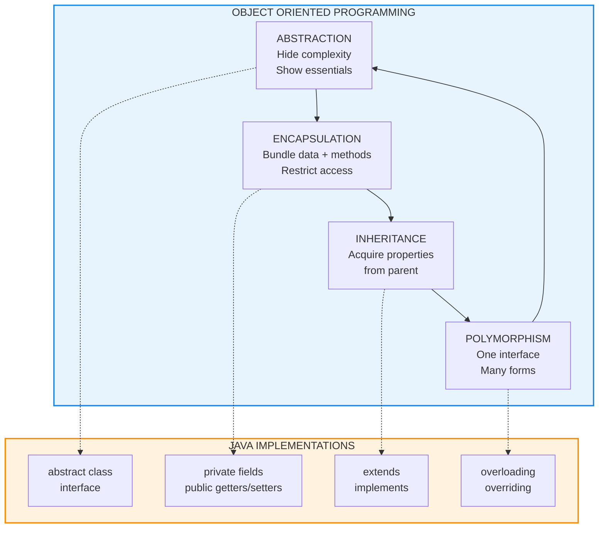
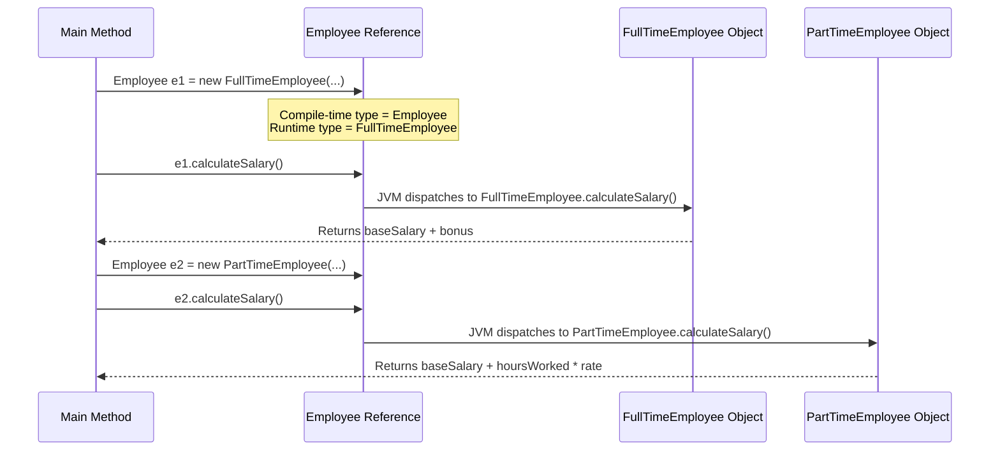
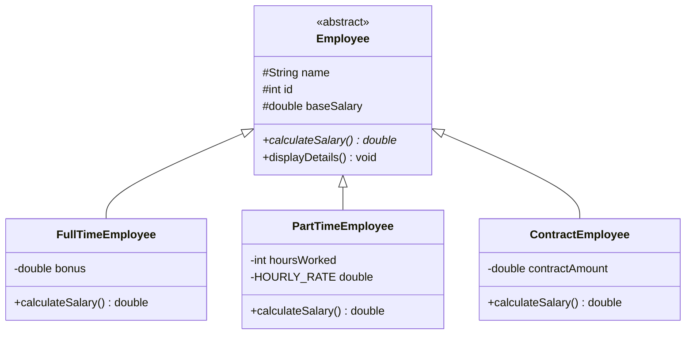
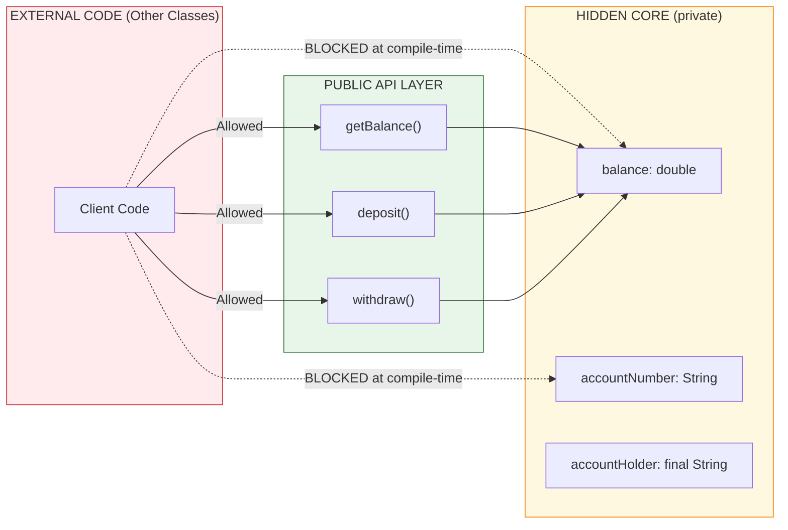
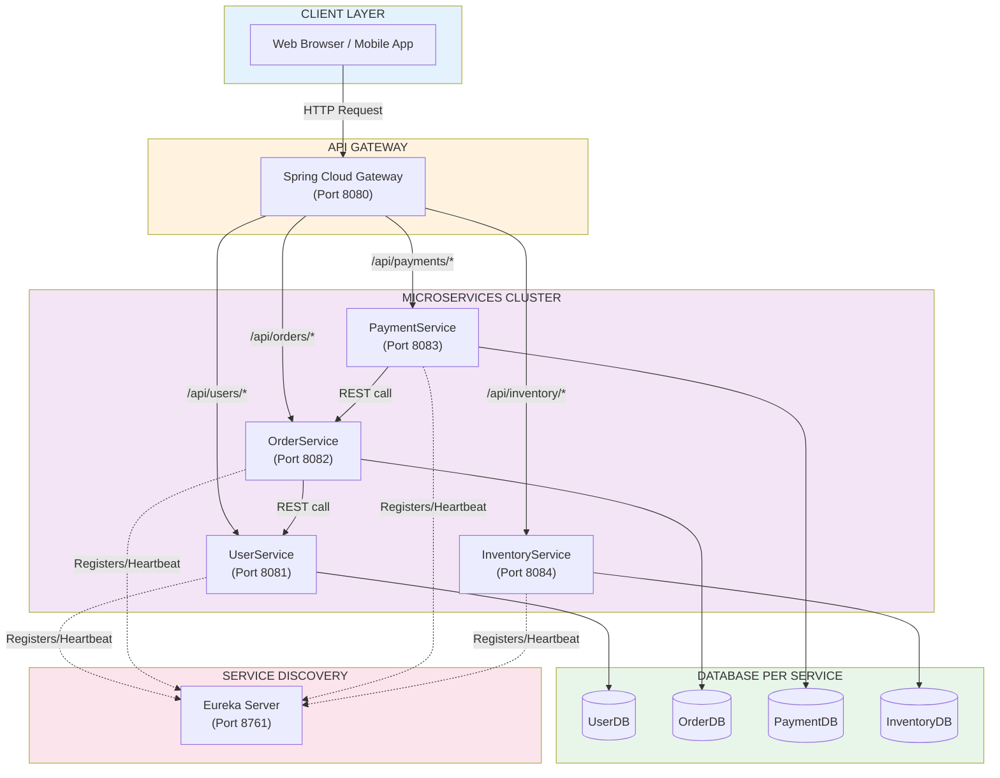
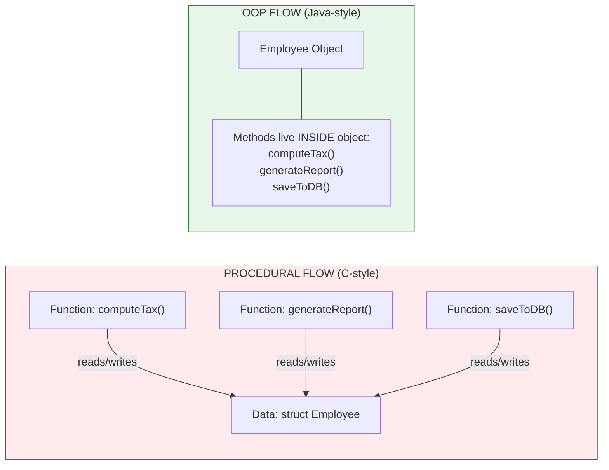

# OOP Concepts: Abstraction, encapsulation, inheritance, polymorphism, Procedural vs OOP paradigms, Microservices

<!-- SECTION_1_START -->
# Object-Oriented Programming (OOP) Concepts

## 1.1 Formal Definition (KTU 2024 Syllabus Terminology)

**Object-Oriented Programming (OOP)** is a programming paradigm built around the concept of **objects** — data structures that bundle **state** (fields/attributes) and **behavior** (methods) together. Programs are designed as collections of cooperating objects rather than as sequences of instructions or procedural function calls.

> [!NOTE]
> **KTU 2024 Definition (PBCST304 – Module 1):**
> *"OOP is a methodology that models real-world entities as software objects having attributes (data) and methods (operations), emphasizing modularity, reusability, and extensibility through four core principles: **Abstraction, Encapsulation, Inheritance, and Polymorphism**."*

The four foundational pillars of OOP are:

| Pillar | Single-Line Formal Definition |
|---|---|
| **Abstraction** | Hiding complex implementation details and exposing only essential features. |
| **Encapsulation** | Binding data and methods that operate on that data into a single unit (class) and restricting direct access. |
| **Inheritance** | Mechanism by which a new class (subclass) acquires properties and behaviors of an existing class (superclass). |
| **Polymorphism** | Ability of a single interface to represent different underlying forms (many shapes). |

---

## 1.2 Intuitive Real-World Analogies

### 🍕 Analogy 1: A Car Dashboard (Abstraction vs Encapsulation)
Imagine driving a car. The **steering wheel, accelerator, and brake** are abstractions — simple interfaces that hide the **complex internal engine mechanics, fuel injection systems, and brake hydraulics** underneath. You do not need to know *how* the engine fires to drive. That hiding of internal complexity = **Abstraction**.

Now, the car's **engine cover** physically bundles the engine, gears, and pistons into a single black box. You cannot (and should not) reach inside and randomly rewire the spark plugs while the car is running. The cover **protects the internals** and exposes only the **fuel cap and dipstick**. That bundling + access control = **Encapsulation**.

> [!IMPORTANT]
> **Mnemonic:**
> * **Abstraction** = *Design-level* "What to show"
> * **Encapsulation** = *Implementation-level* "How to protect"

### 🧬 Analogy 2: Genetic Inheritance (Inheritance)
A child inherits eye color, blood type, and facial structure from parents. The child is not a photocopy — it can **add new traits** (a musician's talent) and **override certain behaviors** (a louder voice). In Java, a `SavingsAccount` *inherits* from `BankAccount` but may override the `calculateInterest()` method.

### 🔌 Analogy 3: The Universal Power Socket (Polymorphism)
A single power socket accepts a laptop charger, phone charger, or table lamp. The **interface is identical** (3 pins, 230V), but the **connected object behaves differently** — a charger converts AC→DC, a lamp just lights up. The socket is the *superclass reference*; each appliance is a *subclass object*.

---

## 1.3 Procedural vs Object-Oriented Programming Paradigms

### Formal Definitions

* **Procedural Programming**: A paradigm derived from structured programming, based upon the concept of **procedure calls**, where statements are organized into procedures (functions) that operate on data structures. The **data and functions are separate entities** — data flows through functions.
* **Object-Oriented Programming**: A paradigm based on the concept of **objects** that contain both data (fields) and behavior (methods). Functions belong to objects, and the **data and functions are tightly coupled**.

### Conceptual Comparison (Intuition)

| Aspect | Procedural (C-Style) | OOP (Java-Style) |
|---|---|---|
| Primary Unit | Function | Class / Object |
| Data Handling | Passed as arguments | Lives inside the object |
| Reusability | Function libraries | Inheritance & composition |
| Real-World Mapping | Weak — algorithms, not entities | Strong — entities are first-class |
| Security | Data is globally accessible | Data is hidden via access modifiers |
| Example Languages | **C, Pascal, Fortran** | **Java, C++, Python, C#** |

> [!NOTE]
> **Key Insight:** OOP is **not** a replacement for procedural programming. It is a *higher level of abstraction*. Internally, Java's JVM still executes procedural bytecode — OOP is a design-time discipline that produces *maintainable*, *scalable* systems.

---

## 1.4 Microservices — Formal Definition

**Microservices Architecture** is an architectural style that structures an application as a **collection of small, autonomous, loosely coupled services**, each:
* Responsible for a **single business capability**
* **Independently deployable**
* Communicating via **lightweight protocols** (HTTP/REST, gRPC, message queues)
* **Owning its own database** (no shared schema)

> [!NOTE]
> **Contrast with Monolith:** A monolithic application packages all features (UI, business logic, data access) into a single deployable unit. Microservices break this into dozens of small services, each potentially written in a different language (polyglot).

### Intuitive Analogy: The Hospital (Microservices) vs The General Practitioner (Monolith)
* **Monolith** = A single doctor who knows a little about everything — pediatrics, cardiology, dermatology. Efficient for small clinics, but **overloaded** for complex cases.
* **Microservices** = A hospital with **specialized departments** (Cardiology, Neurology, Oncology). Each department is **independent**, has its **own staff and equipment**, and refers patients to other departments when needed. They communicate via **referral slips (APIs)**.

---

## 1.5 Visualization Control Block (Concept Mapping)

> [!VISUALIZATION CONTROL]
> **Concept:** 2D Cartesian mapping of OOP Paradigm Coordinates
>
> **GeoGebra / Desmos Input Equations:**
> * Point A: `(1, 1)` labeled `Abstraction`
> * Point E: `(2, 2)` labeled `Encapsulation`
> * Point I: `(3, 3)` labeled `Inheritance`
> * Point P: `(4, 4)` labeled `Polymorphism`
> * Line: `y = x` (The OOP Pillar Line)
>
> **Visual Description:** The four pillars lie on the diagonal y = x, indicating that **all four are equally weighted and required** for a true OOP system. Drop any one (e.g., remove Polymorphism at (4,4)), and the diagonal breaks — the system becomes incomplete.

---

<!-- SECTION_1_END -->

<!-- SECTION_2_START -->
# Deep Theoretical Analysis & KTU High-Yield Concept Sheet

## 2.1 The Four Pillars — Structured Logical Breakdown

### 🟢 Pillar 1: Abstraction

**The "Why":** Real systems are too complex to comprehend in full. Users need *clean interfaces*; developers need *modular thinking*.

**The "How" in Java:**
* Achieved via **abstract classes** (using `abstract` keyword) and **interfaces** (using `interface` keyword).
* Abstract classes **can have** both abstract (unimplemented) and concrete (implemented) methods.
* Interfaces (pre-Java 8) **only have** abstract methods. From Java 8+, they may have `default` and `static` methods.
* An abstract class **cannot be instantiated** — it exists purely to be extended.

**Stepwise Logic of Abstraction:**
1. Identify the *essential* behaviors common to a group of related classes.
2. Promote these behaviors to a parent abstract class/interface.
3. Hide the *implementation-specific* details in the concrete subclasses.
4. Expose only the *method signatures* to the outside world.

---

### 🟢 Pillar 2: Encapsulation

**The "Why":** Prevents external code from depending on the internal structure of an object, allowing the developer to refactor without breaking client code. Also enables **data validation at the source**.

**The "How" in Java:**
1. Declare all instance variables as **`private`** (data hiding).
2. Provide **`public` getter and setter methods** for controlled access.
3. Apply validation logic inside setters (e.g., `if (age > 0)`).
4. Use the `final` keyword on variables to make them **immutable**.

**Stepwise Logic of Encapsulation:**
1. Bundle data (`fields`) and methods that operate on that data into a `class`.
2. Apply access modifiers (`private`, `protected`, `public`, default).
3. Use accessor (`getX()`) and mutator (`setX()`) methods.
4. Enforce invariants via setter validation.

---

### 🟢 Pillar 3: Inheritance

**The "Why":** Promotes **code reuse** and establishes a natural **is-a hierarchy** (e.g., a `Dog` *is-a* `Animal`).

**The "How" in Java:**
* Use the `extends` keyword for class inheritance.
* Use the `implements` keyword for interface realization.
* Java supports **single inheritance** for classes (one parent only) but **multiple inheritance** for interfaces.
* The `super` keyword references the parent class.
* Method **overriding** allows subclass-specific behavior.

**Stepwise Logic of Inheritance:**
1. Identify common attributes/behaviors among multiple classes.
2. Extract them into a superclass.
3. Use `extends` to create subclasses that inherit all non-private members.
4. Override methods to provide specialized behavior.
5. Use `super()` in the subclass constructor to invoke the parent constructor.

---

### 🟢 Pillar 4: Polymorphism

**The "Why":** Allows a single interface to invoke different implementations based on the actual object type, enabling **flexible and extensible code**.

**The "How" in Java:**
* **Compile-time (Static) Polymorphism** → Method **overloading** (same name, different parameter lists).
* **Run-time (Dynamic) Polymorphism** → Method **overriding** (subclass redefines parent method; resolved via JVM at runtime using the actual object type, not the reference type).

**Stepwise Logic of Run-time Polymorphism:**
1. Parent reference = new ChildObject() (upcasting).
2. Call an overridden method using the parent reference.
3. The JVM uses the **actual object type** (not the reference type) to decide which method to invoke.
4. This is called **Dynamic Method Dispatch**.

---

## 2.2 KTU High-Yield Cheat Sheet

> [!IMPORTANT]
> **Mandatory Memorization for KTU University Exam — Module 1**

| Concept | Keyword in Java | Visibility | When Resolved | Real-World Use Case |
|---|---|---|---|---|
| **Abstraction** | `abstract`, `interface` | Blueprint only | Design-time | Defining contracts (e.g., `PaymentGateway` interface for Stripe, PayPal, Razorpay) |
| **Encapsulation** | `private`, `getter`, `setter` | Hidden internally | Compile-time (access checks) | Protecting user passwords in a `User` class |
| **Inheritance** | `extends`, `implements` | `protected`, `public` members inherited | Compile-time (hierarchy) | `PremiumAccount extends BankAccount` |
| **Polymorphism (Overloading)** | Same method name, different params | Single class | **Compile-time** | `add(int a, int b)` vs `add(double a, double b)` |
| **Polymorphism (Overriding)** | `@Override` annotation | Subclass redefines parent method | **Run-time** (Dynamic Dispatch) | `draw()` in `Shape` overridden by `Circle`, `Square` |
| **Procedural Paradigm** | Functions + global data | All public by default | N/A | Scientific computing, OS kernels (C) |
| **Microservices** | REST APIs, gRPC, message brokers | Independently deployed | Architecture-level | Netflix, Amazon, Uber backend services |

### Procedural vs OOP — Detailed Comparison

| Parameter | Procedural | OOP |
|---|---|---|
| **Decomposition Unit** | Function | Object |
| **Data Movement** | Passed as parameters | Embedded in object |
| **Data Security** | Low (global variables) | High (access modifiers) |
| **Overloading/Overriding** | Not natively supported | Fully supported |
| **Inheritance** | Not supported | Core feature |
| **Real-world Modeling** | Weak | Strong |
| **Debugging Complexity** | High for large codebases | Lower due to modularity |
| **Memory Efficiency** | Higher (no object overhead) | Slightly lower (heap allocation) |
| **Best Suited For** | Mathematical, system-level code | GUI, enterprise, web apps |
| **Example Languages** | **C, Pascal, COBOL** | **Java, C++, C#, Python** |

### Monolith vs Microservices

| Parameter | Monolithic Architecture | Microservices Architecture |
|---|---|---|
| **Deployment Unit** | Single WAR/JAR/EAR | Multiple independent services |
| **Tech Stack** | Single language/framework | Polyglot (Java, Node, Python, Go) |
| **Scaling** | Scale entire app | Scale only the bottleneck service |
| **Failure Impact** | One bug can crash everything | Failures are isolated |
| **Database** | Single shared DB | Database-per-service |
| **Communication** | In-memory function calls | HTTP/REST, gRPC, Kafka |
| **Team Structure** | Single large team | Small autonomous squads |
| **Initial Complexity** | Low | High (requires DevOps, containers) |
| **Best Suited For** | Small projects, startups (MVP) | Large-scale enterprise (Netflix, Amazon) |

---

## 2.3 Engineering & Production Utility

| OOP Concept | Real Production Use |
|---|---|
| **Abstraction** | Defining payment processor interfaces (`PaymentProcessor`) so a single checkout can use Stripe, PayPal, or Razorpay without code changes. |
| **Encapsulation** | The `java.util.Date` class hides internal `long fastTime` field; access only via `getTime()`, `setTime()` with validation. |
| **Inheritance** | `ArrayList` extends `AbstractList` extends `AbstractCollection` — a deep inheritance chain in JDK Collections Framework. |
| **Polymorphism** | JDBC's `DriverManager.getConnection()` returns a `Connection` interface reference, but the actual object is `OracleConnection`, `MySQLConnection`, etc. |
| **Microservices** | Netflix's API gateway routes 2+ billion requests/day across 700+ microservices, each independently deployable on AWS EC2. |

---

<!-- SECTION_2_END -->

<!-- SECTION_3_START -->
# Step-by-Step Implementations & Code Walkthroughs

## 3.1 Complete Java Implementation — All Four Pillars in One Program

```java
// File: OOPDemo.java
// Demonstrates all four OOP pillars in a single coherent program.

import java.util.ArrayList;
import java.util.List;

/* ============================================================
   PILLAR 1: ABSTRACTION
   The abstract class 'Employee' defines the contract.
   ============================================================ */
abstract class Employee {
    protected String name;
    protected int id;
    protected double baseSalary;

    public Employee(String name, int id, double baseSalary) {
        if (baseSalary < 0) {
            throw new IllegalArgumentException("Base salary cannot be negative.");
        }
        this.name = name;
        this.id = id;
        this.baseSalary = baseSalary;
    }

    // Abstract method — must be implemented by subclasses.
    public abstract double calculateSalary();

    // Concrete method — common to all employees.
    public void displayDetails() {
        System.out.println("Employee ID : " + id);
        System.out.println("Name        : " + name);
        System.out.println("Base Salary : Rs. " + baseSalary);
        System.out.println("Final Salary: Rs. " + calculateSalary());
        System.out.println("-----------------------------------");
    }
}

/* ============================================================
   PILLAR 3: INHERITANCE
   'FullTimeEmployee' and 'PartTimeEmployee' extend 'Employee'.
   ============================================================ */
class FullTimeEmployee extends Employee {
    private double bonus;

    public FullTimeEmployee(String name, int id, double baseSalary, double bonus) {
        super(name, id, baseSalary);   // Call parent constructor.
        this.bonus = bonus;
    }

    /* PILLAR 4: POLYMORPHISM (Run-time) */
    @Override
    public double calculateSalary() {
        return baseSalary + bonus;
    }
}

class PartTimeEmployee extends Employee {
    private int hoursWorked;
    private static final double HOURLY_RATE = 500.0;

    public PartTimeEmployee(String name, int id, double baseSalary, int hoursWorked) {
        super(name, id, baseSalary);
        this.hoursWorked = hoursWorked;
    }

    /* PILLAR 4: POLYMORPHISM (Run-time) */
    @Override
    public double calculateSalary() {
        return baseSalary + (hoursWorked * HOURLY_RATE);
    }
}

/* ============================================================
   PILLAR 2: ENCAPSULATION
   'BankAccount' hides its balance behind validated accessors.
   ============================================================ */
class BankAccount {
    private String accountNumber;     // hidden
    private double balance;           // hidden
    private final String accountHolder; // immutable

    public BankAccount(String accountNumber, String accountHolder, double initialBalance) {
        this.accountNumber = accountNumber;
        this.accountHolder = accountHolder;
        if (initialBalance < 0) {
            throw new IllegalArgumentException("Initial balance cannot be negative.");
        }
        this.balance = initialBalance;
    }

    public double getBalance() {
        return balance;   // read-only access
    }

    public void deposit(double amount) {
        if (amount <= 0) {
            throw new IllegalArgumentException("Deposit amount must be positive.");
        }
        balance += amount;
        System.out.println("Deposited Rs. " + amount + " | New Balance: Rs. " + balance);
    }

    public void withdraw(double amount) {
        if (amount <= 0) {
            throw new IllegalArgumentException("Withdrawal amount must be positive.");
        }
        if (amount > balance) {
            throw new IllegalArgumentException("Insufficient balance.");
        }
        balance -= amount;
        System.out.println("Withdrew Rs. " + amount + " | New Balance: Rs. " + balance);
    }
}

/* ============================================================
   PILLAR 4 (continued): COMPILE-TIME POLYMORPHISM — OVERLOADING
   ============================================================ */
class Calculator {
    public int add(int a, int b) {
        return a + b;
    }

    public double add(double a, double b) {
        return a + b;
    }

    public int add(int a, int b, int c) {
        return a + b + c;
    }
}

/* ============================================================
   DRIVER CLASS
   ============================================================ */
public class OOPDemo {
    public static void main(String[] args) {
        // ---- Abstraction + Inheritance + Run-time Polymorphism ----
        System.out.println("=== RUN-TIME POLYMORPHISM ===");
        Employee e1 = new FullTimeEmployee("Anand", 101, 50000, 10000);
        Employee e2 = new PartTimeEmployee("Bhavya", 102, 10000, 40);

        // Parent reference holding child objects — Dynamic Method Dispatch.
        e1.displayDetails();
        e2.displayDetails();

        // ---- Compile-time Polymorphism (Overloading) ----
        System.out.println("=== COMPILE-TIME POLYMORPHISM ===");
        Calculator calc = new Calculator();
        System.out.println("add(int, int)    : " + calc.add(5, 10));
        System.out.println("add(double,double): " + calc.add(5.5, 10.3));
        System.out.println("add(int,int,int) : " + calc.add(1, 2, 3));

        // ---- Encapsulation in action ----
        System.out.println("\n=== ENCAPSULATION ===");
        BankAccount acc = new BankAccount("ACC1001", "Anand", 20000);
        acc.deposit(5000);
        acc.withdraw(3000);
        System.out.println("Final Balance: Rs. " + acc.getBalance());

        // Direct field access is NOT allowed:
        // acc.balance = 999999;   // COMPILE ERROR — balance is private.
    }
}
```

### Expected Output
```
=== RUN-TIME POLYMORPHISM ===
Employee ID : 101
Name        : Anand
Base Salary : Rs. 50000.0
Final Salary: Rs. 60000.0
-----------------------------------
Employee ID : 102
Name        : Bhavya
Base Salary : Rs. 10000.0
Final Salary: Rs. 30000.0
-----------------------------------
=== COMPILE-TIME POLYMORPHISM ===
add(int, int)    : 15
add(double,double): 15.8
add(int,int,int) : 6

=== ENCAPSULATION ===
Deposited Rs. 5000.0 | New Balance: Rs. 25000.0
Withdrew Rs. 3000.0 | New Balance: Rs. 22000.0
Final Balance: Rs. 22000.0
```

---

## 3.2 Step-by-Step Logical Walkthrough

### Walkthrough 1: How Run-time Polymorphism Resolves `e1.displayDetails()`

Step 1: Compiler sees `e1` declared as `Employee` type. It checks whether `displayDetails()` exists in `Employee`. **Yes.** Compilation succeeds.

Step 2: At runtime, the JVM inspects the **actual object** pointed to by `e1`. The object is `FullTimeEmployee`.

Step 3: JVM calls `displayDetails()` on `FullTimeEmployee`, which internally calls `calculateSalary()`.

Step 4: `calculateSalary()` is **overridden** in `FullTimeEmployee`. JVM dispatches to the `FullTimeEmployee` version, returning `baseSalary + bonus = 50000 + 10000 = 60000`.

Step 5: The value `60000.0` is printed.

> [!NOTE]
> **Key Exam Point:** The method that runs is decided by the **OBJECT type** (right side of `=`), not the **REFERENCE type** (left side of `=`).

### Walkthrough 2: How Encapsulation Prevents Invalid State

Step 1: User calls `acc.deposit(-500)`.

Step 2: Setter method checks `if (amount <= 0)`. Condition is true.

Step 3: `IllegalArgumentException` is thrown. The `balance` field remains unchanged at `25000.0`.

Step 4: The data invariant (`balance >= 0`) is **always preserved**, regardless of how the object is used by external code.

---

## 3.3 Interface vs Abstract Class — Tabular Decision Matrix

| Parameter | Abstract Class | Interface |
|---|---|---|
| **Keyword** | `abstract class` | `interface` |
| **Methods** | Abstract + Concrete | Abstract, default, static |
| **Variables** | Instance + Static + Final | Only `public static final` (constants) |
| **Inheritance Type** | Single (`extends`) | Multiple (`implements`) |
| **Access Modifiers** | Any | Implicitly `public` |
| **Constructor** | Yes | No |
| **When to Use** | Shared code + contract | Pure contract definition |
| **Java Version Note** | Available since Java 1.0 | `default`/`static` methods since Java 8 |

---

## 3.4 Microservices — Conceptual Code Skeleton (Java + Spring Boot)

```java
// UserService.java — Independent microservice
package com.ktu.userservice;

import org.springframework.boot.SpringApplication;
import org.springframework.boot.autoconfigure.SpringBootApplication;
import org.springframework.web.bind.annotation.*;

@SpringBootApplication
@RestController
@RequestMapping("/api/users")
public class UserService {

    public static void main(String[] args) {
        SpringApplication.run(UserService.class, args);
    }

    @GetMapping("/{id}")
    public String getUser(@PathVariable int id) {
        return "{\"id\":" + id + ", \"name\":\"Anand\", \"email\":\"anand@ktu.in\"}";
    }

    @PostMapping
    public String createUser(@RequestBody String userJson) {
        return "User created: " + userJson;
    }
}
```

```java
// OrderService.java — Separate microservice, separate deployment
package com.ktu.orderservice;

import org.springframework.boot.SpringApplication;
import org.springframework.boot.autoconfigure.SpringBootApplication;
import org.springframework.web.bind.annotation.*;
import org.springframework.web.client.RestTemplate;

@SpringBootApplication
@RestController
@RequestMapping("/api/orders")
public class OrderService {

    private final RestTemplate restTemplate = new RestTemplate();

    public static void main(String[] args) {
        SpringApplication.run(OrderService.class, args);
    }

    @PostMapping
    public String placeOrder(@RequestBody String orderJson) {
        // Call UserService microservice via REST
        String userInfo = restTemplate.getForObject(
            "http://USER-SERVICE/api/users/101", String.class
        );
        return "Order placed for: " + userInfo;
    }
}
```

### Microservices Execution Notes

* **UserService** runs on port `8081`.
* **OrderService** runs on port `8082`.
* They are **independently deployable** — UserService can be updated without redeploying OrderService.
* Communication happens via **HTTP REST** using a service-discovery name (`USER-SERVICE`).
* In production, **Eureka / Consul** handles service discovery; **API Gateway (Zuul/Spring Cloud Gateway)** routes external traffic.

---

<!-- SECTION_3_END -->

<!-- SECTION_4_START -->
# Structural Diagrams & Schematics

## 4.1 The Four Pillars of OOP — Master Concept Map



---

## 4.2 Run-time Polymorphism — Dynamic Method Dispatch Flow



---

## 4.3 Inheritance Hierarchy — Employee System



---

## 4.4 Encapsulation — Access Control Layer Cake



---

## 4.5 Microservices Architecture — Topology



---

## 4.6 Procedural vs OOP — Conceptual Flow Comparison



---

<!-- SECTION_4_END -->

<!-- SECTION_5_START -->
# KTU 2024 Scheme Examination Question Bank

## 5.1 Part A — Short Answer Questions (3 Marks Each)

### Question 1 (CO1, Remember)
**[KTU University Exam – July 2024]** Differentiate between **abstraction** and **encapsulation** with suitable examples.

**Model Answer (3 Marks):**

| Aspect | Abstraction | Encapsulation |
|---|---|---|
| **Purpose** | Hides *implementation* complexity | Hides *data* and restricts *access* |
| **Achieved via** | `abstract` classes, interfaces | `private` fields, `public` getters/setters |
| **Focus** | *What* an object does | *How* data is protected |
| **Example** | A `Shape` abstract class with an `abstract draw()` method | A `BankAccount` class with a `private balance` field accessed via `getBalance()` |

> **Valuation Key:** [Tabular comparison with at least 3 distinct points: 2 Marks] [One valid example each: 1 Mark]

---

### Question 2 (CO1, Understand)
**[KTU University Exam – Dec 2023]** Explain the concept of **polymorphism** in Java. Distinguish between compile-time and run-time polymorphism.

**Model Answer (3 Marks):**

Polymorphism allows a single interface to represent different underlying forms. Java supports two types:

1. **Compile-time (Static) Polymorphism** — Achieved via **method overloading**. Same method name, different parameter lists. Resolved by the compiler at compile time. *Example:* `add(int, int)` and `add(double, double)`.

2. **Run-time (Dynamic) Polymorphism** — Achieved via **method overriding**. A subclass provides a specific implementation of a method already defined in its parent class. The JVM uses **Dynamic Method Dispatch** to resolve the call at run time based on the actual object type. *Example:* `Shape.draw()` overridden in `Circle` and `Square` classes.

> **Valuation Key:** [Definition of polymorphism: 1 Mark] [Compile-time vs run-time distinction with one example each: 2 Marks]

---

## 5.2 Part B — Long Answer Questions (14 Marks with Internal Choice)

### Question A (14 Marks) — PBCST304 Model Paper Pattern

**[KTU University Exam – July 2024, CO1, CO2 — Apply / Analyze]**

**(a)** Explain the four fundamental principles of Object-Oriented Programming (OOP) with suitable Java code examples. **(7 Marks)**

**(b)** Write a complete Java program to demonstrate **run-time polymorphism** using an Employee hierarchy. The program should include a parent class `Employee` with an abstract method `calculateSalary()`, and at least two child classes (`FullTimeEmployee` and `PartTimeEmployee`) that override this method. Display the salary details polymorphically. **(7 Marks)**

---

#### Model Solution for Part (a) — 7 Marks

**Step 1: Introduction (1 Mark)**
The four pillars of OOP are **Abstraction, Encapsulation, Inheritance, and Polymorphism**. They collectively enable modular, reusable, and extensible software design.

**Step 2: Abstraction Explanation with Code (2 Marks)**

```java
abstract class Vehicle {
    public abstract void startEngine();
}
class Car extends Vehicle {
    @Override
    public void startEngine() {
        System.out.println("Car engine started with key.");
    }
}
```
[Abstraction hides the complex internal mechanism of engine ignition; user only knows `startEngine()`.]

**Step 3: Encapsulation Explanation with Code (2 Marks)**

```java
class Student {
    private int marks;                       // hidden field
    public void setMarks(int m) {            // validated setter
        if (m >= 0 && m <= 100) marks = m;
    }
    public int getMarks() { return marks; }
}
```
[Data and methods are bundled; direct external modification is prevented.]

**Step 4: Inheritance and Polymorphism Brief (2 Marks)**
* **Inheritance:** `class SavingsAccount extends BankAccount` — child class reuses parent fields/methods.
* **Polymorphism:** `BankAccount ref = new SavingsAccount(); ref.calculateInterest();` — JVM dispatches to the `SavingsAccount` version at run time.

> **Valuation Key Points:**
> * [Pillar definitions: 1 Mark]
> * [Working Java code for any 2 pillars: 3 Marks]
> * [Connecting each pillar to its real-world use: 2 Marks]
> * [Code compilation-readiness: 1 Mark]

---

#### Model Solution for Part (b) — 7 Marks

**Step 1: Class Design Overview (1 Mark)**

| Class | Role | Method |
|---|---|---|
| `Employee` (abstract) | Parent contract | `abstract double calculateSalary()` |
| `FullTimeEmployee` | Subclass | `calculateSalary()` returns `base + bonus` |
| `PartTimeEmployee` | Subclass | `calculateSalary()` returns `base + hours*rate` |

**Step 2: Parent Class (1 Mark)**

```java
abstract class Employee {
    protected String name;
    protected double baseSalary;
    public Employee(String name, double baseSalary) {
        this.name = name;
        this.baseSalary = baseSalary;
    }
    public abstract double calculateSalary();
    public void display() {
        System.out.println(name + " earns Rs. " + calculateSalary());
    }
}
```

**Step 3: Subclass 1 — FullTimeEmployee (1 Mark)**

```java
class FullTimeEmployee extends Employee {
    private double bonus;
    public FullTimeEmployee(String name, double baseSalary, double bonus) {
        super(name, baseSalary);
        this.bonus = bonus;
    }
    @Override
    public double calculateSalary() {
        return baseSalary + bonus;
    }
}
```

**Step 4: Subclass 2 — PartTimeEmployee (1 Mark)**

```java
class PartTimeEmployee extends Employee {
    private int hours;
    private static final double RATE = 500.0;
    public PartTimeEmployee(String name, double baseSalary, int hours) {
        super(name, baseSalary);
        this.hours = hours;
    }
    @Override
    public double calculateSalary() {
        return baseSalary + (hours * RATE);
    }
}
```

**Step 5: Driver with Polymorphic Calls (2 Marks)**

```java
public class Payroll {
    public static void main(String[] args) {
        Employee[] staff = new Employee[2];
        staff[0] = new FullTimeEmployee("Anand", 50000, 10000);
        staff[1] = new PartTimeEmployee("Bhavya", 10000, 40);

        for (Employee e : staff) {
            e.display();
        }
    }
}
```

**Step 6: Expected Output (1 Mark)**

```
Anand earns Rs. 60000.0
Bhavya earns Rs. 30000.0
```

> **Valuation Key Points:**
> * [Abstract class declaration with abstract method: 1 Mark]
> * [At least two concrete subclasses with overridden method: 2 Marks]
> * [Polymorphic array traversal in main: 2 Marks]
> * [Use of `super` to call parent constructor: 1 Mark]
> * [Correct output trace: 1 Mark]

---

### Question B (14 Marks) — Alternative Choice

**[KTU University Exam – Dec 2023, CO1, CO2 — Understand / Apply]**

**(a)** Compare **procedural programming** with **object-oriented programming**. List at least six distinguishing parameters in a tabular form. **(7 Marks)**

**(b)** Explain the **microservices architecture** in detail. Compare it with **monolithic architecture** using a table. Write the basic structure of two independent microservice classes in Java (e.g., `UserService` and `OrderService`). **(7 Marks)**

---

#### Model Solution for Part (a) — 7 Marks

**Step 1: Tabular Comparison (6 Marks)**

| # | Parameter | Procedural | OOP |
|---|---|---|---|
| 1 | Primary Building Block | Function | Class / Object |
| 2 | Data Handling | Separate, passed as args | Bundled inside objects |
| 3 | Reusability Mechanism | Function libraries | Inheritance & Composition |
| 4 | Data Security | Low (globals accessible) | High (`private` access) |
| 5 | Real-world Modeling | Weak | Strong |
| 6 | Overloading/Overriding | Not supported | Fully supported |
| 7 | Memory Pattern | Stack-dominant | Heap-dominant |
| 8 | Example Languages | C, Pascal | Java, C++, C# |

**Step 2: Conclusion (1 Mark)**
OOP is preferred for large, complex, evolving systems (e.g., banking software, e-commerce), while procedural programming remains efficient for system-level and computationally intensive tasks (e.g., OS kernels, embedded firmware).

> **Valuation Key Points:**
> * [At least 6 parameters tabulated: 3 Marks]
> * [Correct technical content: 2 Marks]
> * [Real-world example languages: 1 Mark]
> * [Final inference statement: 1 Mark]

---

#### Model Solution for Part (b) — 7 Marks

**Step 1: Microservices Definition (1 Mark)**
Microservices architecture is an approach where an application is built as a collection of **small, autonomous, loosely coupled services**, each owning a single business capability and communicating via lightweight protocols (HTTP/REST, gRPC, message queues).

**Step 2: Monolith vs Microservices Comparison Table (3 Marks)**

| Parameter | Monolithic | Microservices |
|---|---|---|
| Deployment | Single unit | Multiple independent units |
| Tech Stack | Single language | Polyglot (Java, Node, Python) |
| Scaling | Whole app scaled | Per-service scaling |
| Database | Shared single DB | Database-per-service |
| Failure Impact | High (entire app down) | Low (isolated to one service) |
| DevOps Complexity | Low | High (containers, orchestration) |
| Best For | MVPs, small apps | Large enterprise systems |

**Step 3: UserService Code (1.5 Marks)**

```java
@SpringBootApplication
@RestController
@RequestMapping("/api/users")
public class UserService {
    public static void main(String[] args) {
        SpringApplication.run(UserService.class, args);
    }
    @GetMapping("/{id}")
    public String getUser(@PathVariable int id) {
        return "{\"id\":" + id + ",\"name\":\"Anand\"}";
    }
}
```

**Step 4: OrderService Code (1.5 Marks)**

```java
@SpringBootApplication
@RestController
@RequestMapping("/api/orders")
public class OrderService {
    public static void main(String[] args) {
        SpringApplication.run(OrderService.class, args);
    }
    @PostMapping
    public String placeOrder(@RequestBody String orderJson) {
        return "Order placed: " + orderJson;
    }
}
```

> **Valuation Key Points:**
> * [Definition of microservices: 1 Mark]
> * [Comparison table with at least 5 parameters: 3 Marks]
> * [Two independent microservice classes with Spring Boot annotations: 2 Marks]
> * [Mention of independent deployability: 1 Mark]

---

> [!WARNING]
> **KTU Examiner's Common Pitfall Callout:**
> 1. **Do NOT confuse overloading with overriding.** Overloading is **compile-time** (same class, different parameters). Overriding is **run-time** (subclass redefining parent method). Mixing these up is the #1 reason students lose 2–3 marks.
> 2. **In polymorphism questions, ALWAYS show the parent reference holding the child object** — e.g., `Employee e = new FullTimeEmployee();`. The JVM dispatch logic cannot be explained without this line.
> 3. **For microservices, do NOT write Spring annotations incorrectly.** `@RestController` ≠ `@Controller`. `@GetMapping` ≠ `@PostMapping`. A single wrong annotation = 1 mark deduction.
> 4. **Encapsulation does NOT mean `public` getters only.** True encapsulation requires **validation inside setters** (`if (amount > 0)`). Examiners specifically check for this validation logic.
> 5. **In Part B, never skip the `super()` call** in subclass constructors. Forgetting `super(name, baseSalary);` is a common compile-time error that costs 1 mark.
> 6. **Avoid writing `acc.balance = 9999;`** in encapsulation explanations. This is illegal and proves you do not understand access modifiers. Use the validated setter instead.

---

## 5.3 Topic Recap & Important Things to Remember

> [!IMPORTANT]
> **High-Density Rapid Revision Checklist — KTU Module 1 (OOP Concepts)**

### 🔑 The Four Pillars (Non-Negotiable)
- **Abstraction** → `abstract` classes & `interface` → Hide complexity, show essentials.
- **Encapsulation** → `private` data + `public` validated getters/setters → Bundle and protect.
- **Inheritance** → `extends` (single) / `implements` (multiple) → Reuse parent code.
- **Polymorphism** → **Overloading** (compile-time) + **Overriding** (run-time, dynamic dispatch).

### 🔑 Procedural vs OOP
- Procedural = function-centric, global data, C/Pascal.
- OOP = object-centric, encapsulated data, Java/C++.
- OOP supports inheritance, polymorphism; procedural does not.

### 🔑 Microservices Essentials
- **Independent deployability**, **single responsibility**, **polyglot**, **database-per-service**, **lightweight protocols** (REST/gRPC).
- Contrasted with **monolith** (single deployable unit, shared DB).
- Production tools: **Spring Boot**, **Docker**, **Kubernetes**, **Eureka** (discovery), **API Gateway**.

### 🔑 Java Keywords to Memorize
`abstract`, `extends`, `implements`, `private`, `public`, `protected`, `final`, `static`, `this`, `super`, `@Override`, `new`, `instanceof`.

### 🔑 Critical Formulas & Principles
- **Dynamic Method Dispatch Rule:** Method invoked = method of the **actual object type**, not the reference type.
- **Encapsulation Rule:** Instance variables → `private`; access → `public` getters/setters with validation.
- **Inheritance Rule:** Java classes → single inheritance only; interfaces → multiple inheritance allowed.
- **Abstract Class Rule:** Cannot be instantiated; may have 0 or more abstract methods; may have constructors.
- **Interface Rule (Java 8+):** All fields are `public static final`; may have `default`, `static`, and `abstract` methods.

### 🔑 Common Viva / Interview Questions
1. *Can an abstract class have a constructor?* → **Yes**, used by subclasses via `super()`.
2. *Can we achieve multiple inheritance in Java?* → **No** for classes; **Yes** via interfaces.
3. *What is the difference between `abstract class` and `interface`?* → See Section 3.3 table.
4. *Why is encapsulation called "data hiding"?* → Because instance variables are declared `private` and inaccessible from outside.
5. *What happens if a subclass does not override an abstract method?* → The subclass **must also be declared abstract**.
6. *Is Java 100% object-oriented?* → **No**, because of primitive data types (`int`, `double`, etc.) that are not objects.

### 🔑 Microservices Real-World Mapping
- **Netflix** → 700+ microservices on AWS.
- **Amazon** → Migrated from monolith to microservices in early 2000s; key driver of the modern cloud-native era.
- **Uber** → Domain-driven microservices (Trip, Driver, Payment, Notification).
- **KTU Project Tip:** For your mini-project, simulate 2 microservices (e.g., `StudentService` + `CourseService`) using Spring Boot, deploy on different ports, and connect via `RestTemplate`.

---

<!-- SECTION_5_END -->
