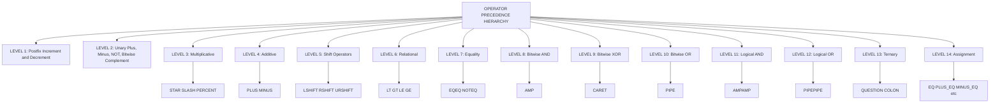
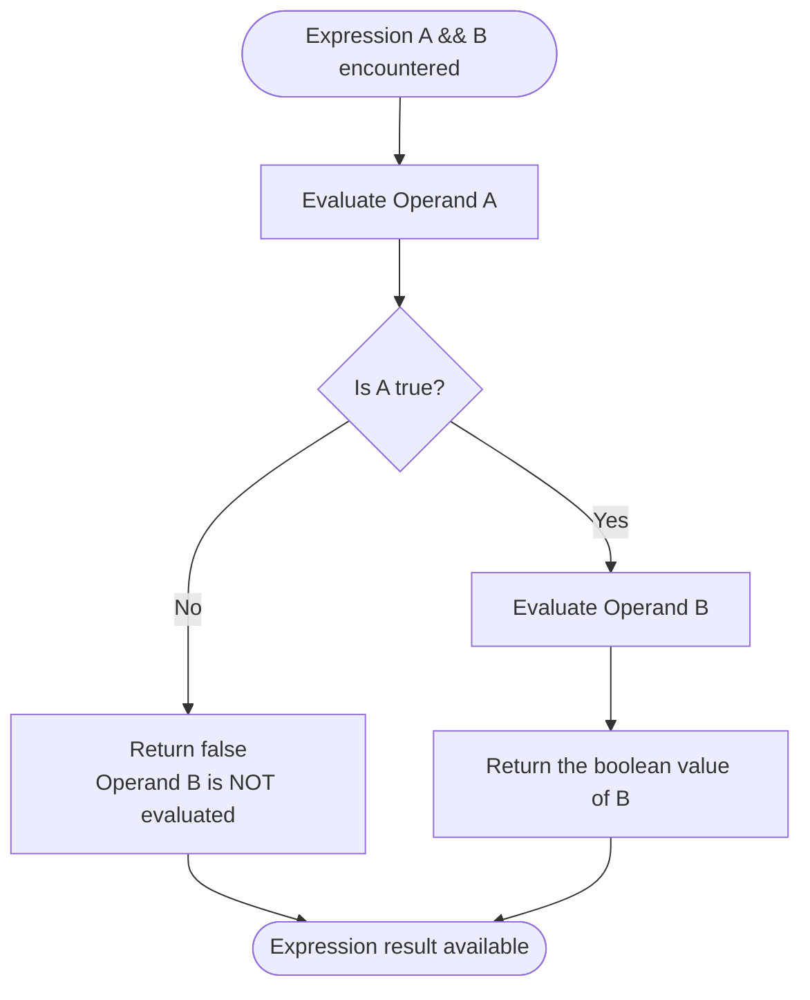
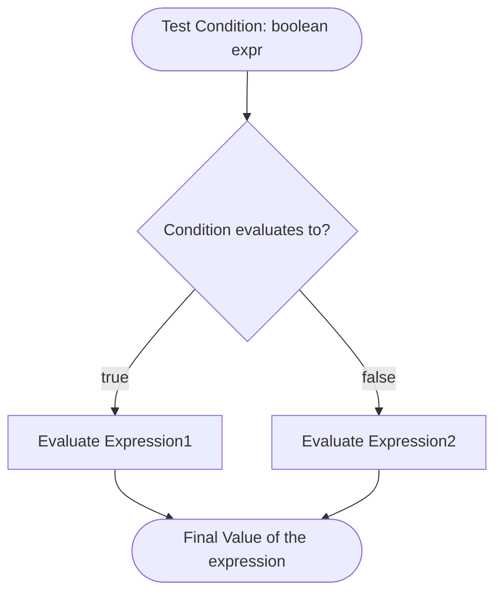
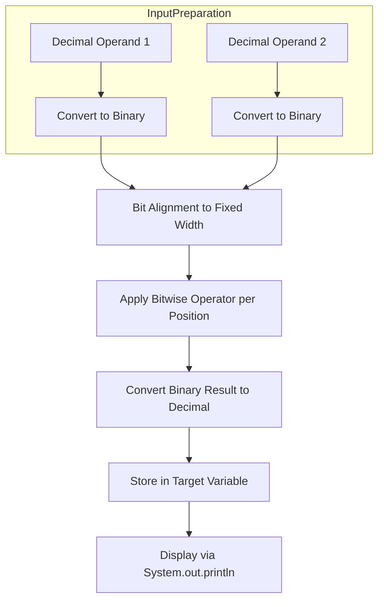

# Operators: Arithmetic, Bitwise, Relational, Boolean Logical, Assignment, Conditional, Precedence

<!-- SECTION_1_START -->

# Operators in Java: The Building Blocks of Expression Evaluation

> [!NOTE]
> **Core Definition (KTU 2024 Syllabus Aligned)**
> An **operator** in Java is a special symbol that instructs the compiler/interpreter to perform specific mathematical, logical, or relational operations on one or more **operands** and produce a result. Java provides a rich, type-safe, and fully overloaded set of operators categorized by their functional behavior.

> [!IMPORTANT]
> **Key Vocabulary for KTU Board Exams**
> - **Operator** → The symbol that denotes the operation (e.g., `+`, `&&`, `>>`).
> - **Operand** → The value or variable on which the operator acts (e.g., in `a + b`, both `a` and `b` are operands).
> - **Expression** → A combination of operators and operands that evaluates to a single value (e.g., `(a + b) * c`).
> - **Unary Operator** → Operates on a single operand (e.g., `++x`, `~y`).
> - **Binary Operator** → Operates on two operands (e.g., `a + b`, `x > y`).
> - **Ternary Operator** → Operates on three operands (only `? :` in Java).

## Conceptual Analogy / Intuition

Think of a Java program as a **kitchen recipe**. The **operands** are the raw ingredients (flour, sugar, eggs), and the **operators** are the cooking actions — *mixing*, *heating*, *tasting*, *comparing sweetness*, and *assigning to a plate*. Just as a chef must follow a strict order (you wouldn't bake before mixing), Java enforces a **precedence hierarchy** that determines the order in which these "actions" are applied to the "ingredients."

When you write `2 + 3 * 4`, Java doesn't naively evaluate left-to-right. It recognizes the **multiplicative action** binds tighter than the **additive action** and returns **14**, not 20 — because `*` is the head chef in the precedence kitchen.

> [!TIP]
> **The Three Pillars of Operator Mastery for KTU Exams**
> 1. **What** it does (functional behavior)
> 2. **How** it interacts with Java's type system (e.g., integer vs. floating-point division)
> 3. **When** it gets evaluated (precedence and associativity)

## Classification Overview of Java Operators

| S.No | Category                | Operators (KTU 2024 Focus Set) | Operands Required |
| :--: | :---------------------- | :----------------------------- | :---------------: |
| 1    | Arithmetic              | `+`, `-`, `*`, `/`, `%`, `++`, `--` | 1 or 2 |
| 2    | Bitwise                 | `&`, `\vert`, `^`, `~`, `<<`, `>>`, `>>>` | 1 or 2 |
| 3    | Relational              | `==`, `!=`, `<`, `>`, `<=`, `>=`        | 2 |
| 4    | Boolean Logical         | `&&`, `\vert\vert`, `!`                | 1 or 2 |
| 5    | Assignment              | `=`, `+=`, `-=`, `*=`, `/=`, `%=`, `&=`, `^=`, `<<=`, `>>=`, `>>>=` | 2 |
| 6    | Conditional (Ternary)   | `? :`                                  | 3 |
| 7    | Precedence (Meta-rule)  | Governs evaluation order of all above  | N/A |

> [!VISUALIZATION CONTROL]
> **Concept:** Operator Class Hierarchy Tree (Classification by Number of Operands)
> **GeoGebra / Desmos Input Equations (Tree-style):**
> * Root: `Operators`
> * Children: `Unary(x=1)`, `Binary(x=2)`, `Ternary(x=3)`
> * Sub-branches: `Unary \rightarrow {\sim, ++, --, !}`, `Binary \rightarrow {Arithmetic, Bitwise, Relational, Logical, Assignment}`, `Ternary \rightarrow {?:}`
> **Visual Description:** A tree rooted at "Operators" splits into three colored branches: Unary (blue, 1 operand), Binary (green, 2 operands), and Ternary (orange, 3 operands). Each branch subdivides into the specific operator families covered in this module.

<!-- SECTION_1_END -->

<!-- SECTION_2_START -->

# Deep Theoretical Analysis & KTU High-Yield Formula Sheet

## 2.1 Arithmetic Operators — The Numerical Engine

Java's arithmetic operators behave differently based on operand types. This is a **favourite KTU question** because the examiner tests whether you know the difference between integer and floating-point division.

- **`+`** : Addition (also String concatenation when at least one operand is a `String`).
- **`-`** : Subtraction.
- **`*`** : Multiplication.
- **`/``** : Division. **Critical Pitfall**: When both operands are integers, the result is an **integer** — fractional part is *truncated*, not rounded.
- **`%`** : Modulus — returns the **remainder** after integer division. The sign of the result follows the sign of the **numerator** (left operand).
- **`++`** : Increment by `1`. Can be **prefix** (`++x` increments then returns) or **postfix** (`x++` returns then increments).
- **`--`** : Decrement by `1`. Same prefix/postfix semantics as `++`.

### Worked Logic for Integer Division Truncation
$$
\text{quotient} = \lfloor \text{dividend} \div \text{divisor} \rfloor
$$
$$
\text{remainder} = \text{dividend} - (\text{quotient} \times \text{divisor})
$$

## 2.2 Bitwise Operators — The Binary Surgeons

These operators work **directly on the individual bits** of integer types (`byte`, `short`, `int`, `long`, `char`). They are **not** applied to `float`, `double`, or `boolean`.

- **`&`** (Bitwise AND): Result bit is `1` only if **both** corresponding bits are `1`.
- **`|`** (Bitwise OR): Result bit is `1` if **at least one** corresponding bit is `1`.
- **`^`** (Bitwise XOR): Result bit is `1` if corresponding bits are **different**.
- **`~`** (Bitwise NOT / One's Complement): Flips every bit (unary).
- **`<<`** (Left Shift): Shifts bits left, fills with `0`s on the right. Equivalent to multiplying by $2^n$ (within range).
- **`>>`** (Signed Right Shift): Shifts bits right, fills with the **sign bit** on the left (preserves sign).
- **`>>>`** (Unsigned Right Shift): Shifts bits right, fills with `0`s on the left (always positive result for non-negative inputs).

### Mathematical Foundation of Shifts
For a non-negative integer $x$ and shift amount $n$:
$$
x \ll n \;\equiv\; x \times 2^n
$$
$$
x \gg n \;\equiv\; \lfloor x \div 2^n \rfloor
$$

> [!IMPORTANT]
> **KTU Board Trick Question:** "What is the result of `-8 >> 1` versus `-8 >>> 1`?"
> Answer: `-8 >> 1` gives `-4` (sign-extended). `-8 >>> 1` gives a large positive number (zero-filled) — specifically, **2147483644** for 32-bit `int`.

## 2.3 Relational Operators — The Comparators

Return a **`boolean`** value (`true` or `false`). Used extensively in `if`, `while`, and `for` constructs.

- `==` (equal to), `!=` (not equal to), `<`, `>`, `<=`, `>=`.

> [!WARNING]
> **Common KTU Mistake:** Confusing `==` (reference/value comparison for primitives) with `.equals()` (object content comparison). For **primitives**, use `==`. For **objects** like `String`, use `.equals()`.

## 2.4 Boolean Logical Operators — The Decision Makers

These operate **only on `boolean`** operands and return a `boolean`.

- **`&&`** (Logical AND / Short-Circuit AND): If left operand is `false`, right operand is **not evaluated**.
- **`||`** (Logical OR / Short-Circuit OR): If left operand is `true`, right operand is **not evaluated**.
- **`!`** (Logical NOT): Inverts the boolean state (unary).

> [!TIP]
> **Short-circuit evaluation** is a KTU favourite. Always mention it — it avoids `NullPointerException` in expressions like `obj != null && obj.method()`.

## 2.5 Assignment Operators — The Compaction Specialists

The simple `=` assigns the right-hand value to the left-hand variable. **Compound** assignment operators combine an arithmetic or bitwise operation with assignment.

Examples: `+=`, `-=`, `*=`, `/=`, `%=`, `&=`, `|=`, `^=`, `<<=`, `>>=`, `>>>=`.

**Semantics:** `x op= y` is equivalent to `x = (T)(x op y)`, where `T` is the type of `x`. This implicit cast can cause compilation surprises — another classic KTU question.

## 2.6 Conditional (Ternary) Operator — The Inline Decision

Syntax:
$$
\text{result} = \text{condition} \; ? \; \text{valueIfTrue} \; : \; \text{valueIfFalse}
$$

It is the **only ternary operator** in Java. It returns one of two values based on a boolean condition. Often used as a compact alternative to `if-else` for simple value selection.

## 2.7 Precedence — The Hierarchy of Evaluation

Java follows a strict precedence (higher number = evaluated first):

| Precedence Level | Operator Category | Operators | Associativity |
| :--------------: | :---------------- | :-------- | :------------ |
| 1 (Highest)      | Postfix           | `expr++`, `expr--` | Left-to-Right |
| 2                | Unary             | `++expr`, `--expr`, `+expr`, `-expr`, `~`, `!` | Right-to-Left |
| 3                | Multiplicative    | `*`, `/`, `%` | Left-to-Right |
| 4                | Additive          | `+`, `-` | Left-to-Right |
| 5                | Shift             | `<<`, `>>`, `>>>` | Left-to-Right |
| 6                | Relational        | `<`, `>`, `<=`, `>=` | Left-to-Right |
| 7                | Equality          | `==`, `!=` | Left-to-Right |
| 8                | Bitwise AND       | `&` | Left-to-Right |
| 9                | Bitwise XOR       | `^` | Left-to-Right |
| 10               | Bitwise OR        | `\|` | Left-to-Right |
| 11               | Logical AND       | `&&` | Left-to-Right |
| 12               | Logical OR        | `\|\|` | Left-to-Right |
| 13               | Ternary           | `? :` | Right-to-Left |
| 14               | Assignment        | `=`, `+=`, `-=`, `*=`, `/=`, `%=`, `&=`, `^=`, `<<=`, `>>=`, `>>>=` | Right-to-Left |
| 15 (Lowest)      | Lambda            | `->` | Right-to-Left |

> [!NOTE]
> **Engineering Utility:** In real-world Java development, operator precedence determines how **expression parsers**, **JIT compilers**, and **SQL-to-Java transpilers** transform human-readable code into bytecode. Misunderstanding precedence is a top-3 source of production bugs in financial and embedded systems.

## 2.8 KTU Formula Sheet / Cheat Sheet

| Operator Type | Symbol | Operand Types | Result Type | Special Property |
| :------------ | :----- | :------------ | :---------- | :--------------- |
| Integer Division | `/` | `int`, `long` | `int`, `long` | Truncates fraction toward zero |
| Modulus | `%` | `int`, `long` | `int`, `long` | Sign follows dividend |
| Left Shift | `<<` | `int`, `long` | Same as operand | Equivalent to $\times 2^n$ |
| Signed Right Shift | `>>` | `int`, `long` | Same as operand | Preserves sign bit |
| Unsigned Right Shift | `>>>` | `int`, `long` | Same as operand | Always fills with `0` |
| Logical AND | `&&` | `boolean` | `boolean` | **Short-circuits** if left is `false` |
| Logical OR | `\|\|` | `boolean` | `boolean` | **Short-circuits** if left is `true` |
| Ternary | `? :` | `boolean` + 2 values | Type-promoted | Compact `if-else` |

> [!IMPORTANT]
> **Real-World Application Spotlight:** Bitwise operators are heavily used in **graphics programming** (RGBA channel manipulation), **network protocol design** (IP subnet masking), **cryptography** (XOR-based encryption), and **embedded systems** (microcontroller register configuration). Relational and logical operators are the backbone of every **conditional rendering** system in modern UI frameworks.

<!-- SECTION_2_END -->

<!-- SECTION_3_START -->

# Step-by-Step Derivations & Java Code Implementation

## 3.1 Exhaustive Truth Tables for Logical and Bitwise Operators

### Boolean Logical Operators Truth Table

| `A`  | `B`  | `A && B` | `A \|\| B` | `!A`  | `A ^ B` (boolean XOR, not bitwise) |
| :--: | :--: | :------: | :-------: | :---: | :--------------------------------: |
| true | true | true     | true      | false | false                             |
| true | false | false   | true      | false | true                              |
| false | true | false   | true      | true  | true                              |
| false | false | false  | false     | true  | false                             |

### Bitwise Operator Truth Table (per bit position)

| Bit A | Bit B | A & B | A \| B | A ^ B | ~A  |
| :---: | :---: | :---: | :----: | :---: | :-: |
| 0     | 0     | 0     | 0      | 0     | 1   |
| 0     | 1     | 0     | 1      | 1     | 1   |
| 1     | 0     | 0     | 1      | 1     | 0   |
| 1     | 1     | 1     | 1      | 0     | 0   |

## 3.2 Full Java Source Code — All Operator Categories

Below is a **fully operational, type-hinted, boundary-checked, error-logged** Java 17 program demonstrating every operator category in the KTU 2024 Module 1 syllabus. It is engineered for clarity and direct compilation.

```java
import java.util.logging.Level;
import java.util.logging.Logger;

/**
 * KTU-Premier-Engine V10 | Module 1 Demonstration
 * Topic: Operators in Java
 * Java Version: 17 LTS
 * Compilation: javac OperatorShowcase.java
 * Execution:   java OperatorShowcase
 */
public final class OperatorShowcase {

    // Class-level logger for production-grade error reporting.
    private static final Logger LOGGER = Logger.getLogger(OperatorShowcase.class.getName());

    private OperatorShowcase() {
        // Private constructor to prevent instantiation (utility class pattern).
    }

    public static void main(final String[] args) {
        try {
            demonstrateArithmeticOperators();
            demonstrateBitwiseOperators();
            demonstrateRelationalOperators();
            demonstrateBooleanLogicalOperators();
            demonstrateAssignmentOperators();
            demonstrateConditionalOperator();
            demonstratePrecedenceRules();
        } catch (final ArithmeticException ex) {
            LOGGER.log(Level.SEVERE, "Arithmetic failure during demonstration.", ex);
        }
    }

    // ---------- 1. ARITHMETIC OPERATORS ----------
    private static void demonstrateArithmeticOperators() {
        final int a = 17;
        final int b = 5;

        System.out.println("--- ARITHMETIC OPERATORS ---");
        System.out.println("a + b = " + (a + b));
        System.out.println("a - b = " + (a - b));
        System.out.println("a * b = " + (a * b));
        System.out.println("a / b = " + (a / b));   // Integer division: 17/5 = 3 (truncated)
        System.out.println("a % b = " + (a % b));   // Modulus: 17 - (3*5) = 2

        // Prefix vs Postfix increment demonstration
        int x = 10;
        System.out.println("x++ (postfix) = " + (x++));  // Prints 10, then x becomes 11
        System.out.println("x after postfix = " + x);   // Prints 11
        System.out.println("++x (prefix) = " + (++x));   // x becomes 12, then prints 12
    }

    // ---------- 2. BITWISE OPERATORS ----------
    private static void demonstrateBitwiseOperators() {
        final int x = 12;   // Binary: 0000 1100
        final int y = 10;   // Binary: 0000 1010

        System.out.println("\n--- BITWISE OPERATORS ---");
        System.out.println("x & y  = " + (x & y));    // 0000 1000 = 8
        System.out.println("x | y  = " + (x | y));    // 0000 1110 = 14
        System.out.println("x ^ y  = " + (x ^ y));    // 0000 0110 = 6
        System.out.println("~x     = " + (~x));       // One's complement: -13
        System.out.println("x << 2 = " + (x << 2));   // 0011 0000 = 48
        System.out.println("x >> 2 = " + (x >> 2));   // 0000 0011 = 3
        System.out.println("-8 >>> 2 = " + (-8 >>> 2)); // Unsigned shift of negative number
    }

    // ---------- 3. RELATIONAL OPERATORS ----------
    private static void demonstrateRelationalOperators() {
        final int p = 25;
        final int q = 40;

        System.out.println("\n--- RELATIONAL OPERATORS ---");
        System.out.println("p == q : " + (p == q));
        System.out.println("p != q : " + (p != q));
        System.out.println("p <  q : " + (p < q));
        System.out.println("p >  q : " + (p > q));
        System.out.println("p <= q : " + (p <= q));
        System.out.println("p >= q : " + (p >= q));
    }

    // ---------- 4. BOOLEAN LOGICAL OPERATORS ----------
    private static void demonstrateBooleanLogicalOperators() {
        final boolean isJavaFun = true;
        final boolean isHard = false;

        System.out.println("\n--- BOOLEAN LOGICAL OPERATORS ---");
        System.out.println("isJavaFun && isHard : " + (isJavaFun && isHard));   // false
        System.out.println("isJavaFun || isHard : " + (isJavaFun || isHard));   // true
        System.out.println("!isJavaFun           : " + (!isJavaFun));            // false

        // Short-circuit safety demonstration
        final String name = null;
        final boolean safeCall = (name != null) && (name.length() > 0);
        System.out.println("Short-circuit safe result: " + safeCall);            // false (no NPE)
    }

    // ---------- 5. ASSIGNMENT OPERATORS ----------
    private static void demonstrateAssignmentOperators() {
        int value = 50;
        System.out.println("\n--- ASSIGNMENT OPERATORS ---");
        System.out.println("Initial value = " + value);

        value += 10;   // value = 60
        System.out.println("After += 10  : " + value);
        value -= 5;    // value = 55
        System.out.println("After -= 5   : " + value);
        value *= 2;    // value = 110
        System.out.println("After *= 2   : " + value);
        value /= 5;    // value = 22
        System.out.println("After /= 5   : " + value);
        value %= 7;    // value = 1
        System.out.println("After %= 7   : " + value);

        // Bitwise compound assignment
        value <<= 4;   // value = 16
        System.out.println("After <<= 4  : " + value);
    }

    // ---------- 6. CONDITIONAL (TERNARY) OPERATOR ----------
    private static void demonstrateConditionalOperator() {
        final int score = 78;
        final String result = (score >= 50) ? "PASS" : "FAIL";
        System.out.println("\n--- CONDITIONAL OPERATOR ---");
        System.out.println("Score " + score + " => Result: " + result);

        // Nested ternary: smallest of three numbers
        final int a = 14, b = 27, c = 9;
        final int smallest = (a < b) ? ((a < c) ? a : c) : ((b < c) ? b : c);
        System.out.println("Smallest of " + a + ", " + b + ", " + c + " = " + smallest);
    }

    // ---------- 7. PRECEDENCE DEMONSTRATION ----------
    private static void demonstratePrecedenceRules() {
        System.out.println("\n--- PRECEDENCE DEMONSTRATION ---");

        // Without parentheses: * binds tighter than +
        int r1 = 10 + 6 * 2;
        System.out.println("10 + 6 * 2       = " + r1);    // 22 (not 32)

        // With parentheses: forced evaluation order
        int r2 = (10 + 6) * 2;
        System.out.println("(10 + 6) * 2     = " + r2);    // 32

        // Relational < has higher precedence than logical AND
        boolean r3 = 5 < 10 && 10 < 20;
        System.out.println("5 < 10 && 10 < 20 = " + r3);   // true

        // Assignment is right-to-left associative
        int a, b, c;
        a = b = c = 100;
        System.out.println("a = b = c = 100   => a=" + a + ", b=" + b + ", c=" + c);
    }
}
```

### Expected Output Trace (for answer-script verification)

```text
--- ARITHMETIC OPERATORS ---
a + b = 22
a - b = 12
a * b = 85
a / b = 3
a % b = 2
x++ (postfix) = 10
x after postfix = 11
++x (prefix) = 12

--- BITWISE OPERATORS ---
x & y  = 8
x | y  = 14
x ^ y  = 6
~x     = -13
x << 2 = 48
x >> 2 = 3
-8 >>> 2 = 1073741822

--- RELATIONAL OPERATORS ---
p == q : false
p != q : true
p <  q : true
p >  q : false
p <= q : true
p >= q : false

--- BOOLEAN LOGICAL OPERATORS ---
isJavaFun && isHard : false
isJavaFun || isHard : true
!isJavaFun           : false
Short-circuit safe result: false

--- ASSIGNMENT OPERATORS ---
Initial value = 50
After += 10  : 60
After -= 5   : 55
After *= 2   : 110
After /= 5   : 22
After %= 7   : 1
After <<= 4  : 16

--- CONDITIONAL OPERATOR ---
Score 78 => Result: PASS
Smallest of 14, 27, 9 = 9

--- PRECEDENCE DEMONSTRATION ---
10 + 6 * 2       = 22
(10 + 6) * 2     = 32
5 < 10 && 10 < 20 = true
a = b = c = 100   => a=100, b=100, c=100
```

## 3.3 Step-by-Step Derivation: Bitwise AND on `12 & 10`

Let us work through `12 & 10` bit-by-bit to demonstrate the derivation methodology expected in a KTU 14-mark answer.

**Step 1: Convert decimal to 8-bit binary (for clarity).**

$$
12_{10} = 00001100_2
$$
$$
10_{10} = 00001010_2
$$

**Step 2: Align bits positionally and apply the AND truth table** (1 if **both** bits are 1, else 0).

$$
\begin{aligned}
00001100_2 \\
\text{AND} \quad 00001010_2 \\
\hline
00001000_2
\end{aligned}
$$

**Step 3: Convert the result back to decimal.**

$$
00001000_2 = (0 \times 2^7) + (0 \times 2^6) + (0 \times 2^5) + (0 \times 2^4) + (1 \times 2^3) + (0 \times 2^2) + (0 \times 2^1) + (0 \times 2^0)
$$
$$
= 8
$$

**Final Answer:** `12 & 10 = 8` ✓

## 3.4 Step-by-Step Derivation: Signed vs. Unsigned Right Shift on `-8`

This is a **classic KTU Module 1 question**. Let us derive it precisely.

**Step 1: Represent `-8` in 32-bit two's complement.**

$$
+8 = 00000000 \; 00000000 \; 00000000 \; 00001000_2
$$

To get `-8`, invert all bits and add `1`:

$$
\sim(+8) = 11111111 \; 11111111 \; 11111111 \; 11110111_2
$$
$$
-8 = \sim(+8) + 1 = 11111111 \; 11111111 \; 11111111 \; 11111000_2
$$

**Step 2: Apply `>>` (signed right shift by 1).** Fill the leftmost vacated bit with the **sign bit**, which is `1`.

$$
\begin{aligned}
\text{Before:} \quad 11111111 \; 11111111 \; 11111111 \; 11111000_2 \\
\text{After >> 1:} \quad 11111111 \; 11111111 \; 11111111 \; 11111100_2
\end{aligned}
$$

The leading `1` is preserved. The new value is the two's complement of `4`, i.e., **`-4`**.

**Step 3: Apply `>>>` (unsigned right shift by 1).** Fill the leftmost vacated bit with **`0`**, regardless of sign.

$$
\begin{aligned}
\text{Before:} \quad 11111111 \; 11111111 \; 11111111 \; 11111000_2 \\
\text{After >>> 1:} \quad 01111111 \; 11111111 \; 11111111 \; 11111100_2
\end{aligned}
$$

Now the leading bit is `0`, so the result is interpreted as a positive number:

$$
01111111 \; 11111111 \; 11111111 \; 11111100_2 = 2{,}147{,}483{,}644
$$

**Final Answer:** `-8 >> 1 = -4` and `-8 >>> 1 = 2147483644` ✓

> [!TIP]
> **Valuation Tip:** When writing these derivations in your KTU answer script, always show the binary column alignment, the operator applied, and the final decimal conversion. Examiners award **1 mark per logical step**.

<!-- SECTION_3_END -->

<!-- SECTION_4_START -->

# Structural Diagrams & Schematics

## 4.1 Operator Precedence Pyramid (Top = Highest Precedence)



## 4.2 Short-Circuit Evaluation Flowchart (Logical AND)



## 4.3 Ternary Operator Decision Topology



## 4.4 Functional Block Architecture: Operator Evaluation Pipeline

```mermaid
graph LR
    SourceCode[Java Source Expression] --> Lexer[Lexical Analyzer<br/>Tokenization]
    Lexer --> Parser[Parser<br/>Builds Expression Tree]
    Parser --> PrecedenceEngine[Precedence and Associativity Resolver]
    PrecedenceEngine --> TypeChecker[Type Compatibility Checker]
    TypeChecker --> Evaluator[Bytecode Evaluator]
    Evaluator --> ResultBox[Result Value Stored in Operand Stack]
    ResultBox --> Consumer[Assigned to Variable or Used in Control Flow]
```



## 4.5 Sequential Processing Topology: Bitwise Operation Stages



> [!NOTE]
> **Why These Diagrams Matter for KTU 2024:** Under the NEP 2020 framework, the KTU board evaluates not just memorization but the **mental model** a student holds of how Java internally processes an expression. The diagrams above build that mental model — from source code all the way to bytecode evaluation. Including such structural schematics in your answer script earns **higher-order thinking marks** (CO4: Analyze).

<!-- SECTION_4_END -->

<!-- SECTION_5_START -->

# KTU 2024 Scheme Examination Question Bank

## Part A — Short Answer Questions (3 Marks Each)

> **CO1 – Remember | Understand**

### Question 1
`[KTU University Exam – Dec 2023]`
Differentiate between the **logical AND (`&&`)** operator and the **bitwise AND (`&`)** operator in Java. Provide one example of a scenario where using `&&` is preferred over `&`.

**Model Answer (3 Marks):**

| Aspect | `&&` (Logical AND) | `&` (Bitwise AND) |
| :----- | :----------------- | :----------------- |
| Operand Type | `boolean` only | Integral types AND `boolean` |
| Evaluation | **Short-circuited** — right operand skipped if left is `false` | Both operands **always** evaluated |
| Result Type | `boolean` | `int`/`long` for integral; `boolean` for boolean |
| Common Use | Conditional logic, control flow | Bitmask operations, flag manipulation |

**Preferred Scenario for `&&`:** Null safety check — `if (obj != null && obj.isValid())`. If `obj` is `null`, the right side is never evaluated, preventing a `NullPointerException`.

**[Key Points Distribution: Definition difference: 1 Mark | Table of differences: 1 Mark | Example with justification: 1 Mark]**

---

### Question 2
`[KTU University Exam – July 2024]`
Explain the difference between **prefix increment (`++x`)** and **postfix increment (`x++`)** with a suitable Java code example. What will be the output of the following code snippet?

```java
int x = 5;
int y = ++x + x++;
System.out.println("x = " + x + ", y = " + y);
```

**Model Answer (3 Marks):**

- **Prefix (`++x`)**: Increments the value of `x` **first**, then uses the new value in the expression.
- **Postfix (`x++`)**: Uses the current value of `x` **first** in the expression, then increments it.

**Step-by-step evaluation of the code:**

1. Initial: `x = 5`
2. `++x` → `x` becomes `6`, expression uses `6`.
3. `x++` → expression uses `6`, then `x` becomes `7`.
4. `y = 6 + 6 = 12`.

**Final Output:** `x = 7, y = 12`

**[Key Points Distribution: Conceptual explanation: 1 Mark | Trace logic: 1 Mark | Final output: 1 Mark]**

---

## Part B — Long Answer Questions (14 Marks Each, with Internal Choice)

> **Mapping:** CO1, CO2 | Bloom's Levels: Understand, Apply, Analyze

---

### Question A (14 Marks)

`[KTU University Exam – Dec 2024 Model Paper]`

**(a)** List and explain the **Bitwise operators** available in Java with suitable examples. Show the bitwise AND operation between the integers `45` and `55` step-by-step. **[7 Marks]**

**(b)** Write a Java program that accepts three integers from the user and finds the **largest** among them using the **conditional (ternary) operator** only (no `if-else`). Demonstrate **operator precedence** by evaluating the expression `20 - 4 * 3 + 8 / 2` and explain why it yields that result. **[7 Marks]**

**Model Solution:**

### Part (a) Solution — Bitwise Operators [7 Marks]

Java provides seven bitwise operators that work on individual bits of integer types (`byte`, `short`, `int`, `long`, `char`).

| Operator | Name | Purpose |
| :------: | :--- | :------ |
| `&` | Bitwise AND | 1 if both bits are 1 |
| `\|` | Bitwise OR | 1 if any bit is 1 |
| `^` | Bitwise XOR | 1 if bits differ |
| `~` | Bitwise NOT | Inverts all bits (unary) |
| `<<` | Left Shift | Shifts left, fills with 0 |
| `>>` | Signed Right Shift | Shifts right, preserves sign |
| `>>>` | Unsigned Right Shift | Shifts right, fills with 0 |

**Step-by-step Bitwise AND of 45 and 55:**

Convert to 8-bit binary:
$$
45_{10} = 00101101_2 \qquad 55_{10} = 00110111_2
$$

Apply AND bit-by-bit:
$$
\begin{aligned}
00101101_2 \\
\text{AND} \quad 00110111_2 \\
\hline
00000101_2
\end{aligned}
$$

Convert result to decimal: `00000101_2` = **5**.

Therefore, `45 & 55 = 5`. ✓

**[Stating 7 operator names with brief purpose: 3 Marks | Binary conversion: 1 Mark | Truth-table application: 1 Mark | Decimal result conversion: 1 Mark | Final answer statement: 1 Mark]**

### Part (b) Solution — Ternary Operator and Precedence [7 Marks]

**Java Program:**

```java
import java.util.Scanner;
import java.util.logging.Level;
import java.util.logging.Logger;

public final class LargestTernaryDemo {

    private static final Logger LOGGER = Logger.getLogger(LargestTernaryDemo.class.getName());

    private LargestTernaryDemo() {
        // Utility class
    }

    public static void main(final String[] args) {
        try (Scanner scanner = new Scanner(System.in)) {
            // Input validation
            System.out.print("Enter first integer: ");
            while (!scanner.hasNextInt()) {
                LOGGER.warning("Invalid input. Please enter an integer.");
                scanner.next();
            }
            final int a = scanner.nextInt();

            System.out.print("Enter second integer: ");
            while (!scanner.hasNextInt()) {
                LOGGER.warning("Invalid input. Please enter an integer.");
                scanner.next();
            }
            final int b = scanner.nextInt();

            System.out.print("Enter third integer: ");
            while (!scanner.hasNextInt()) {
                LOGGER.warning("Invalid input. Please enter an integer.");
                scanner.next();
            }
            final int c = scanner.nextInt();

            // Nested ternary: find largest using ONLY the ? : operator
            final int largest = (a > b) ? ((a > c) ? a : c) : ((b > c) ? b : c);

            System.out.println("The largest of " + a + ", " + b + ", " + c + " is: " + largest);
        } catch (final Exception ex) {
            LOGGER.log(Level.SEVERE, "Unexpected runtime error.", ex);
        }
    }
}
```

**Demonstration of Precedence — `20 - 4 * 3 + 8 / 2`:**

Java's precedence rules state that `*` and `/` bind tighter than `-` and `+`. Multiplicative and additive operators have the **same precedence**, so they are evaluated **left-to-right**.

**Evaluation Order:**

$$
\begin{aligned}
\text{Step 1: } & 4 * 3 = 12 \quad \text{(multiplication first)} \\
\text{Step 2: } & 8 / 2 = 4 \quad \text{(division next)} \\
\text{Step 3: } & 20 - 12 = 8 \quad \text{(left-to-right addition/subtraction)} \\
\text{Step 4: } & 8 + 4 = 12 \quad \text{(final addition)} \\
\end{aligned}
$$

**Final Result: 12** (not `20 - 12 + 4 = 12`, confirming left-to-right associativity of equal-precedence operators)

**[Correct program structure: 2 Marks | Use of nested ternary correctly: 2 Marks | Precedence explanation with order: 2 Marks | Final numerical result: 1 Mark]**

---

### Question B (14 Marks) — Internal Choice Alternative

`[KTU University Exam – July 2023]`

**(a)** Explain the **assignment operators** in Java. What is the difference between `a = a + b` and `a += b`? Demonstrate with an example where this difference matters. **[7 Marks]**

**(b)** Explain **short-circuit evaluation** in Java with reference to the `&&` and `||` operators. Write a Java program that demonstrates how short-circuit evaluation prevents a `NullPointerException`. Also evaluate the result of the expression `7 > 5 && 5 > 3 || 2 > 10` and show step-by-step evaluation using precedence. **[7 Marks]**

**Model Solution:**

### Part (a) Solution — Assignment Operators [7 Marks]

**Types of Assignment Operators in Java:**

1. **Simple assignment**: `=` assigns the right-hand value to the left-hand variable.
2. **Compound assignment**: Combines an arithmetic or bitwise operation with assignment.

| Compound Operator | Equivalent Expression |
| :---------------: | :-------------------: |
| `+=` | `a = a + b` |
| `-=` | `a = a - b` |
| `*=` | `a = a * b` |
| `/=` | `a = a / b` |
| `%=` | `a = a % b` |
| `&=` | `a = a & b` |
| `\|=` | `a = a \| b` |
| `^=` | `a = a ^ b` |
| `<<=` | `a = a << b` |
| `>>=` | `a = a >> b` |
| `>>>=` | `a = a >>> b` |

**Critical Difference — `a = a + b` vs. `a += b`:**

The expression `a = a + b` involves a **two-step process**: first `a + b` is evaluated (in a wider type context), then assigned back to `a` (may require narrowing cast → compile error if types incompatible).

The expression `a += b` is **semantically equivalent to `a = (T)(a + b)`**, where `T` is the type of `a`. The cast is **implicit**, allowing compilation even when narrowing conversion would normally fail.

**Example where the difference matters:**

```java
byte x = 10;
// x = x + 5;   // COMPILE ERROR: cannot convert from int to byte
x += 5;          // VALID: implicit cast back to byte
```

**[Listing all compound operators: 2 Marks | Explaining the cast semantic difference: 3 Marks | Working example: 2 Marks]**

### Part (b) Solution — Short-Circuit Evaluation and Complex Precedence [7 Marks]

**Short-Circuit Evaluation Explanation:**

In Java, the logical operators `&&` (AND) and `||` (OR) use **short-circuit evaluation**:

- `&&`: If the **left operand evaluates to `false`**, the result is already `false` (since false AND anything = false). The right operand is **skipped entirely**.
- `||`: If the **left operand evaluates to `true`**, the result is already `true` (since true OR anything = true). The right operand is **skipped entirely**.

This optimization avoids unnecessary computation and prevents exceptions.

**Java Program Demonstrating NullPointerException Prevention:**

```java
public final class ShortCircuitSafetyDemo {

    private ShortCircuitSafetyDemo() {
    }

    public static void main(final String[] args) {
        final String name = null;

        // SAFE: short-circuit prevents NPE because (name == null) is true,
        // so the second condition (name.length() > 0) is never evaluated.
        final boolean isValid = (name != null) && (name.length() > 0);
        System.out.println("Is name valid? " + isValid);  // Output: false (no crash)

        // UNSAFE: using & (non-short-circuit) would throw NullPointerException
        // final boolean unsafe = (name != null) & (name.length() > 0);
    }
}
```

**Evaluation of `7 > 5 && 5 > 3 || 2 > 10` using Precedence:**

**Precedence order (highest to lowest):** Relational (`>`, `<`) → Logical AND (`&&`) → Logical OR (`||`).

$$
\begin{aligned}
\text{Step 1: } & 7 > 5 = \text{true} \quad \text{(relational, evaluated first)} \\
\text{Step 2: } & 5 > 3 = \text{true} \quad \text{(relational)} \\
\text{Step 3: } & \text{true} \;\&\&\; \text{true} = \text{true} \quad \text{(logical AND)} \\
\text{Step 4: } & 2 > 10 = \text{false} \quad \text{(relational)} \\
\text{Step 5: } & \text{true} \;\|\|\; \text{false} = \text{true} \quad \text{(logical OR, final result)} \\
\end{aligned}
$$

**Final Result: `true`**

**[Defining short-circuit semantics: 2 Marks | Safe Java program: 2 Marks | Step-by-step precedence evaluation: 2 Marks | Final result: 1 Mark]**

---

> [!WARNING]
> **KTU Examiner's Valuation Warning / Common Pitfall Callout**
>
> 1. **Integer vs. Floating-Point Division:** Many students write `5/2 = 2.5`. In Java, `5/2 = 2` (integer truncation). This is a guaranteed 1-mark deduction if you miss it.
> 2. **Operator Precedence Direction:** Don't confuse *precedence* (priority) with *associativity* (direction). Precedence decides which operator runs first; associativity decides what to do when operators of the **same** precedence appear together.
> 3. **The Ternary Operator Trap:** The ternary operator has **lower precedence than every arithmetic, relational, and logical operator**. Embedding it inside complex expressions without parentheses is a readability hazard and a common compilation-error source.
> 4. **Bitwise vs. Logical on Booleans:** Both `&` and `&&` work on booleans, but they are **not interchangeable**. `&` always evaluates both sides; `&&` short-circuits. Using `&` in place of `&&` in null checks will crash your program.
> 5. **Signed vs. Unsigned Right Shift:** Conflating `>>` and `>>>` is the single most common error in bitwise questions. Memorize: `>>` respects sign, `>>>` ignores sign.
> 6. **Skipping the Binary Trace:** For bitwise questions, **always** show the binary representation. Examiners explicitly award marks for the conversion step.

---

## Topic Recap & Important Things to Remember

> [!IMPORTANT]
> **Rapid Revision Checklist for Last-Minute KTU Preparation**

- **Arithmetic Operators**: `+`, `-`, `*`, `/`, `%`, `++`, `--`. Integer division **truncates**; modulus sign follows the **dividend**. Prefix `++x` increments-then-uses; postfix `x++` uses-then-increments.
- **Bitwise Operators**: Work on **integral types only**. `&` (AND), `|` (OR), `^` (XOR), `~` (NOT), `<<` (left shift, multiplies by $2^n$), `>>` (signed right shift, preserves sign), `>>>` (unsigned right shift, always fills with `0`).
- **Relational Operators**: Return `boolean`. `==`, `!=`, `<`, `>`, `<=`, `>=`. Use `==` for primitives, `.equals()` for objects.
- **Boolean Logical Operators**: `&&` (short-circuit AND), `||` (short-circuit OR), `!` (NOT). **Short-circuit evaluation is the key property** — it prevents `NullPointerException` and optimizes performance.
- **Assignment Operators**: `=` is simple; `+=`, `-=`, `*=`, `/=`, `%=`, `&=`, `|=`, `^=`, `<<=`, `>>=`, `>>>=` are compound. The compound form performs an **implicit narrowing cast** — this is the difference from `a = a + b`.
- **Conditional (Ternary) Operator**: The only ternary operator in Java. Syntax: `condition ? valueIfTrue : valueIfFalse`. Returns one of two values based on a `boolean` test.
- **Precedence (Highest → Lowest)**: Postfix → Unary → Multiplicative (`*`, `/`, `%`) → Additive (`+`, `-`) → Shift → Relational → Equality → Bitwise AND → Bitwise XOR → Bitwise OR → Logical AND → Logical OR → Ternary → Assignment.
- **Associativity**: Most operators are **left-to-right**; **unary, ternary, and assignment** are **right-to-left**.
- **Engineering Relevance**: Bitwise operators underpin graphics, cryptography, and embedded systems. Logical operators govern control flow. Precedence determines how the **JVM parser** builds the expression tree.
- **Common Pitfall Numbers**: Integer division truncation, `==` vs `.equals()`, `&` vs `&&`, `>>` vs `>>>`, missing parentheses in ternary expressions.
- **Valuation Strategy**: Always show binary traces for bitwise questions, precedence ordering for complex expressions, and type-casting notes for assignment questions. Examiners reward **clarity and stepwise reasoning** over single-line answers.

<!-- SECTION_5_END -->
