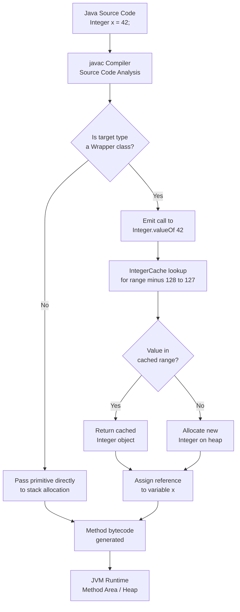
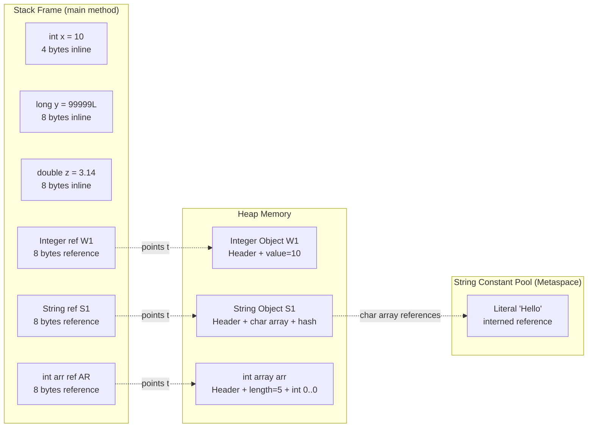
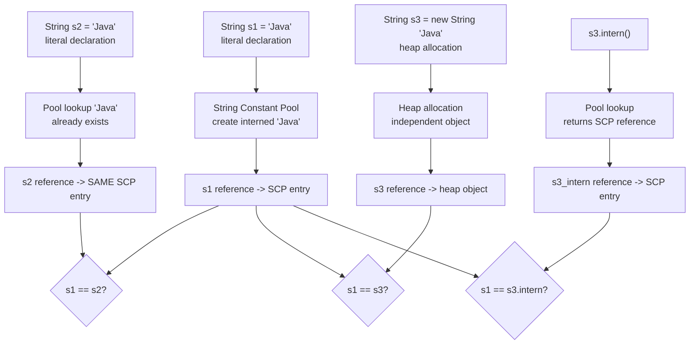
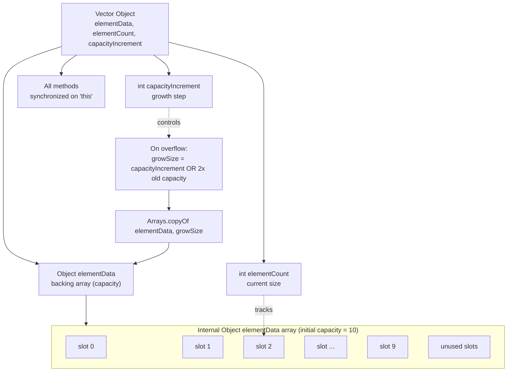
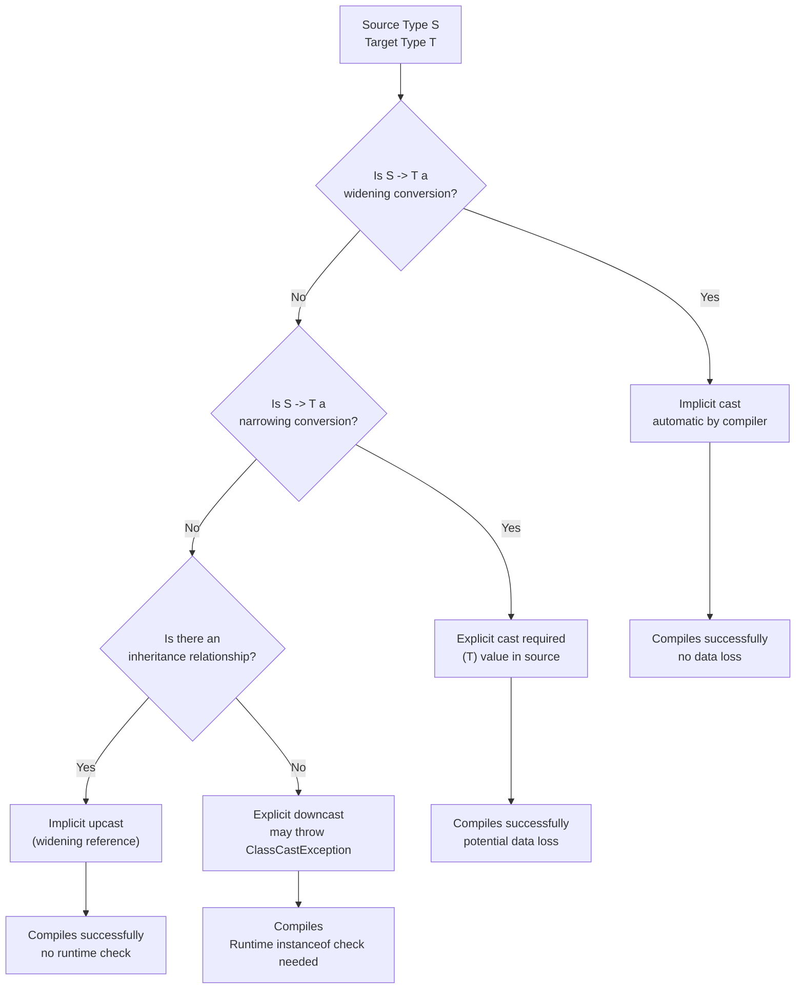

# Primitive Data types and Wrapper Types, Casting and Autoboxing, Arrays, Strings, Vector class

<!-- SECTION_1_START -->
# Module 1 — Introduction to Java and OOP Concepts

## 1. Primitive Data Types, Wrapper Types, Casting, Autoboxing, Arrays, Strings, and the Vector Class

### 1.1 Core Technical Definition

**Primitive Data Types** in Java are the most fundamental, built-in data types that are pre-defined by the language specification (JLS – Java Language Specification). They are not objects, reside on the **stack memory** (for local variables), and hold their actual values directly. Java defines **eight** primitive types: `byte`, `short`, `int`, `long`, `float`, `double`, `char`, and `boolean`.

**Wrapper Types** are the object-equivalent classes found in the `java.lang` package that "wrap" a primitive value inside an object so that it can be used in contexts requiring objects (e.g., Collections Framework, Generics, Serialization). They are immutable: `Byte`, `Short`, `Integer`, `Long`, `Float`, `Double`, `Character`, `Boolean`. Each wrapper provides parsing methods (`parseInt`, `parseDouble`), constants (`MAX_VALUE`, `MIN_VALUE`), and utility methods.

**Casting** is the explicit or implicit conversion of one data type into another. **Widening (Implicit) Casting** follows the direction of increasing bit-width and is performed automatically by the compiler. **Narrowing (Explicit) Casting** requires the programmer to manually specify the target type and may result in data loss or truncation.

**Autoboxing** is the automatic conversion that the Java compiler performs between a primitive type and its corresponding wrapper class object (introduced in **Java 5 / J2SE 1.5**). **Unboxing** is the reverse automatic conversion from a wrapper object to its primitive equivalent. Both are syntactic sugar implemented by the compiler via `valueOf()` and `xxxValue()` methods.

**Arrays** in Java are container objects that hold a fixed number of values of a **single homogeneous type**. The length is established when the array is created and is stored in the `length` field. Arrays are dynamically allocated on the **heap memory** and are first-class objects (direct superclass is `java.lang.Object`).

**Strings** in Java are immutable sequences of Unicode characters represented by the `java.lang.String` class. The JVM maintains a **String Constant Pool (SCP)** inside the method area (metaspace from Java 8 onwards) to intern string literals, optimizing memory usage.

**Vector Class** (`java.util.Vector`) is a legacy, thread-safe, resizable-array implementation of the `List` interface, introduced in **JDK 1.0**. It synchronizes on every operation, making it slower than `ArrayList` in single-threaded scenarios, but useful in multi-threaded legacy code.

> [!IMPORTANT]
> **KTU 2024 Syllabus Highlight (PBCST304 – Module 1):** The examiner frequently tests the difference between `==` (reference comparison) and `.equals()` (value comparison) for `String` and `StringBuffer`. The default implementation of `.equals()` in `Object` class is **reference comparison**, but `String` overrides it for **value comparison**.

> [!NOTE]
> **Conceptual Analogy — The "Gift Box" Model**
> Think of a **primitive** as a *raw coin* kept in your wallet (fast, lightweight, no packaging). A **wrapper** is the *same coin placed inside a decorative gift box* (heavier, addressable, can be mailed, stacked in a warehouse, or gifted). **Autoboxing** is the automatic packing counter at the bank that puts your coin in a box when you make a deposit to the collection warehouse (`ArrayList<Integer>`), and **Unboxing** is the automatic unpacking when you withdraw it back to spend.

> [!VISUALIZATION CONTROL]
> **Concept:** Memory Layout — Primitive vs Wrapper vs Array Reference
> **Conceptual Coordinate Axes (Heap vs Stack Representation):**
> * X-axis: Memory Address Space (Low to High)
> * Y-axis: Object Reference (Stack Frame pointer downward to Heap)
> **Visual Description:** Stack frame contains a primitive `int x = 10;` stored inline as 4 bytes. A wrapper reference `Integer y;` lives on stack as a pointer, while the `Integer` object with a `value` field and object header sits on the heap. An array reference `int[] arr;` points to a contiguous heap block holding N×4 bytes for `int` elements.

---

### 1.2 The Eight Primitive Data Types — Formal Specification

Java's eight primitives are strictly defined by JLS §4.2. Their sizes are platform-independent (unlike C/C++):

| # | Type    | Size (bits) | Default Value | Wrapper Class   | Range / Domain                                  |
|---|---------|-------------|---------------|------------------|-------------------------------------------------|
| 1 | `byte`    | 8           | `0`           | `java.lang.Byte`    | $-128$ to $+127$                              |
| 2 | `short`   | 16          | `0`           | `java.lang.Short`   | $-32\,768$ to $+32\,767$                      |
| 3 | `int`     | 32          | `0`           | `java.lang.Integer` | $-2^{31}$ to $2^{31}-1$                       |
| 4 | `long`    | 64          | `0L`          | `java.lang.Long`    | $-2^{63}$ to $2^{63}-1$                       |
| 5 | `float`   | 32          | `0.0f`        | `java.lang.Float`   | IEEE 754 single-precision, ~7 decimal digits  |
| 6 | `double`  | 64          | `0.0d`        | `java.lang.Double`  | IEEE 754 double-precision, ~15 decimal digits |
| 7 | `char`    | 16          | `'\u0000'`    | `java.lang.Character` | `\u0000` to `\uffff` (unsigned Unicode BMP) |
| 8 | `boolean` | JVM-defined (1 conceptually) | `false` | `java.lang.Boolean` | `true` or `false`                              |

<!-- SECTION_1_END -->

<!-- SECTION_2_START -->
## 2. Deep Theoretical Analysis & KTU High-Yield Formula Sheet

### 2.1 Type Casting — The Two-Track System

Java performs type conversions under two regimes: **widening primitive conversion** (safe, implicit) and **narrowing primitive conversion** (unsafe, explicit). The compiler enforces these based on the JLS conversion context rules.

**Widening Conversion Chain (Safe, No Data Loss):**
`byte` $\rightarrow$ `short` $\rightarrow$ `int` $\rightarrow$ `long` $\rightarrow$ `float` $\rightarrow$ `double`
`char` $\rightarrow$ `int` $\rightarrow$ `long` $\rightarrow$ `float` $\rightarrow$ `double`

> [!NOTE]
> **Why `int` $\rightarrow$ `float` is a widening conversion despite possible precision loss?** The JLS defines widening by range, not by precision. Since `float` can represent values up to $\pm 3.4 \times 10^{38}$ which exceeds `int`'s maximum of $\approx 2.1 \times 10^9$, the range is widened even though mantissa bits are reduced. The compiler never rejects it.

**Narrowing Conversion Chain (Explicit, Potential Data Loss):**
`double` $\rightarrow$ `float` $\rightarrow$ `long` $\rightarrow$ `int` $\rightarrow$ `short` $\rightarrow$ `byte`/`char`

### 2.2 Autoboxing and Unboxing — Compiler Magic

Autoboxing is not a runtime feature — it is a **compile-time syntactic transformation** performed by `javac`. The Java compiler emits the following invocations:

- **Autoboxing:** primitive $\rightarrow$ Wrapper: compiler emits `Integer.valueOf(primitiveValue)`
- **Unboxing:** Wrapper $\rightarrow$ primitive: compiler emits `wrapperObject.intValue()`, `.doubleValue()`, etc.

Since **Java 5**, the `valueOf()` method uses a cached pool for small values: `Boolean` caches both values, `Byte`, `Short`, `Integer` cache the range **$-128$ to $+127$**, and `Character` caches `\u0000` to `\u0127`. This means `Integer x = 127; Integer y = 127; x == y;` returns `true`, but `Integer x = 200; Integer y = 200; x == y;` returns `false` because `200` falls outside the cached range.

> [!WARNING]
> **KTU High-Weight Pitfall:** The line `Integer a = 100; Integer b = 100; System.out.println(a == b);` prints `true` (cached). The line `Integer a = 200; Integer b = 200; System.out.println(a == b);` prints `false` (no cache). Examiners **love** this question because it tests memory of the cache internals.

### 2.3 String vs StringBuffer vs StringBuilder vs StringTokenizer

The `java.lang.String` class is **immutable** — every modification produces a new object. For mutable string operations, Java provides:

- **`StringBuffer`** (JDK 1.0): Thread-safe, synchronized methods, slower, **legacy**.
- **`StringBuilder`** (JDK 5.0): Non-synchronized, faster, **preferred** in single-threaded code.
- **`StringTokenizer`** (legacy): Breaks strings into tokens based on delimiters, used for parsing CSV-like data.

The `String` class has special language support: the `+` operator is overloaded (compile-time sugar) to invoke `StringBuilder.append()` and then `toString()`.

### 2.4 Vector Class — Legacy Dynamic Array

The `Vector` class implements a growable array of objects, similar to `ArrayList`, but with synchronization. Key characteristics:

- **Default capacity:** 10
- **Capacity increment:** If specified in constructor, grows by that amount. Otherwise, **doubles** its size (since Java 8, it uses `Arrays.copyOf` and `ArraysSupport.newArray`).
- **Thread-safety:** All public methods are `synchronized`.
- **Iteration:** Legacy `Enumeration` (via `elements()`) and modern `Iterator`.

### 2.5 KTU Formula Sheet / Cheat Sheet

| Concept | Formula / Rule | Memory Location | Thread-Safe? | Time Complexity |
|---|---|---|---|---|
| Primitive storage | $\text{size in bits} = \{8, 16, 32, 64\}$ | Stack (locals) | N/A | $O(1)$ access |
| Wrapper storage | Object header $+$ value field $\approx 16$ bytes | Heap | N/A | $O(1)$ access |
| Widening cast | $\text{smaller type} \rightarrow \text{larger type}$ | Compiler-inserted | N/A | $O(1)$ |
| Narrowing cast | $\text{larger type} \rightarrow \text{smaller type}$ | Truncation | N/A | $O(1)$ with overflow |
| Autoboxing | `Integer.valueOf(int)` | Heap (cache if in $[-128, 127]$) | N/A | $O(1)$ |
| Unboxing | `Integer.intValue()` | Stack | N/A | $O(1)$ |
| String concat (`+`) | New `StringBuilder` + `append` | Heap | No | $O(n+m)$ |
| `StringBuffer.append` | Mutates internal `char[]` | Heap | **Yes** | Amortized $O(1)$ |
| `StringBuilder.append` | Mutates internal `char[]` | Heap | No | Amortized $O(1)$ |
| `Vector.add(E)` | `synchronized` append | Heap | **Yes** | Amortized $O(1)$ |
| `Vector.capacity` growth | $\text{newCap} = 2 \times \text{oldCap}$ (default) | Heap reallocation | — | $O(n)$ per resize |
| `int` range formula | $-2^{n-1} \leq x \leq 2^{n-1} - 1$ for $n=32$ | — | — | — |
| `float` precision | $\approx 7$ significant decimal digits | — | — | — |
| `double` precision | $\approx 15$ significant decimal digits | — | — | — |

### 2.6 Real-World Engineering Utility

These concepts are foundational in **production-grade Java systems**:

- **Primitive efficiency** is exploited in high-performance computing (HPC), game engines, and financial systems where nanosecond-level latency matters.
- **Wrappers** are mandatory in **Java Generics** (`List<Integer>` works; `List<int>` is a compile error) and in **Hibernate/JPA** entities which require object-typed fields.
- **Autoboxing** underlies the seamless integration of primitives into **Java Collections**, enabling algorithms like Dijkstra's shortest path or BFS to use `PriorityQueue<Integer>` directly.
- **Strings** power web frameworks (Spring, Jakarta), JSON serialization (Jackson/Gson), and log frameworks (SLF4J/Log4j).
- **Vector** is still found in **legacy banking and enterprise systems** (COBOL-to-Java migrations) where thread-safety without external `synchronized` blocks is required.

<!-- SECTION_2_END -->

<!-- SECTION_3_START -->
## 3. Step-by-Step Derivations, Code Implementations, and Worked Examples

### 3.1 Primitive Type Demonstrations and Casting

```java
/**
 * File: PrimitiveTypesDemo.java
 * Description: Demonstrates all 8 primitive types, widening, and narrowing casts.
 * KTU Module 1 — Object Oriented Programming (PBCST304)
 */
public class PrimitiveTypesDemo {

    public static void main(String[] args) {

        // ---- The Eight Primitives ----
        byte    byteVar      = 127;                 // 8-bit signed
        short   shortVar     = 32767;               // 16-bit signed
        int     intVar       = 2_147_483_647;       // 32-bit signed (underscores for readability)
        long    longVar      = 9_223_372_036_854_775_807L;  // 64-bit, suffix L
        float   floatVar     = 3.14159f;            // 32-bit IEEE 754, suffix f
        double  doubleVar    = 2.718281828459045;   // 64-bit IEEE 754
        char    charVar      = 'A';                 // 16-bit unsigned Unicode
        boolean booleanVar   = true;                // logical true/false

        System.out.println("byte    = " + byteVar);
        System.out.println("short   = " + shortVar);
        System.out.println("int     = " + intVar);
        System.out.println("long    = " + longVar);
        System.out.println("float   = " + floatVar);
        System.out.println("double  = " + doubleVar);
        System.out.println("char    = " + charVar);
        System.out.println("boolean = " + booleanVar);

        // ---- Widening (Implicit) Cast ----
        int     wideningInt   = 100;
        long    wideningLong  = wideningInt;        // int -> long, automatic
        double  wideningDouble = wideningLong;      // long -> double, automatic
        System.out.println("Widening chain: " + wideningInt + " -> " + wideningLong + " -> " + wideningDouble);

        // ---- Narrowing (Explicit) Cast ----
        double  piDouble      = 3.14159;
        int     narrowedInt   = (int) piDouble;     // double -> int, fractional part TRUNCATED
        System.out.println("Narrowing: (int) 3.14159 = " + narrowedInt);   // prints 3

        // ---- Numeric Overflow Demonstration ----
        int     maxInt        = Integer.MAX_VALUE;  // 2147483647
        int     overflowInt   = maxInt + 1;         // wraps to Integer.MIN_VALUE
        System.out.println("Overflow: MAX_VALUE + 1 = " + overflowInt);   // prints -2147483648

        // ---- char to int Promotion (Unicode Code Point) ----
        char    letterA       = 'A';
        int     asciiOfA      = letterA;            // implicit widening to int
        System.out.println("'A' as int = " + asciiOfA);   // prints 65
    }
}
```

**Expected Output:**
```
byte    = 127
short   = 32767
int     = 2147483647
long    = 9223372036854775807
float   = 3.14159
double  = 2.718281828459045
char    = A
boolean = true
Widening chain: 100 -> 100 -> 100.0
Narrowing: (int) 3.14159 = 3
Overflow: MAX_VALUE + 1 = -2147483648
'A' as int = 65
```

### 3.2 Wrapper Classes, Autoboxing, and Unboxing

```java
/**
 * File: WrapperAutoboxingDemo.java
 * Description: Demonstrates boxing, unboxing, valueOf caching, and use in Collections.
 */
import java.util.ArrayList;
import java.util.List;

public class WrapperAutoboxingDemo {

    public static void main(String[] args) {

        // ---- Manual Boxing (Pre-Java 5 style) ----
        int     primitiveInt     = 42;
        Integer wrappedInteger   = Integer.valueOf(primitiveInt);   // explicit boxing
        int     unwrappedInt     = wrappedInteger.intValue();       // explicit unboxing

        System.out.println("Manual boxing   : " + wrappedInteger);
        System.out.println("Manual unboxing : " + unwrappedInt);

        // ---- Autoboxing (Java 5+ compiler magic) ----
        Integer autoBoxed        = 100;    // compiler emits Integer.valueOf(100)
        int     autoUnboxed      = autoBoxed; // compiler emits autoBoxed.intValue()

        System.out.println("Autoboxed       : " + autoBoxed);
        System.out.println("Auto-unboxed    : " + autoUnboxed);

        // ---- valueOf Caching Demonstration ----
        Integer cachedA           = 127;
        Integer cachedB           = 127;
        Integer uncachedA         = 200;
        Integer uncachedB         = 200;

        System.out.println("127 == 127 (cached)      : " + (cachedA == cachedB));    // true
        System.out.println("200 == 200 (not cached)  : " + (uncachedA == uncachedB)); // false
        System.out.println("127.equals(127)          : " + cachedA.equals(cachedB));  // true
        System.out.println("200.equals(200)          : " + uncachedA.equals(uncachedB)); // true

        // ---- Autoboxing in Collections (Generics require objects) ----
        List<Integer> scoreList = new ArrayList<>();
        scoreList.add(95);   // autoboxed to Integer.valueOf(95)
        scoreList.add(87);
        scoreList.add(72);

        int totalScore = 0;
        for (Integer score : scoreList) {
            totalScore += score;   // auto-unboxed for arithmetic
        }
        double averageScore = (double) totalScore / scoreList.size();
        System.out.println("Average Score  : " + averageScore);

        // ---- Wrapper Utility Methods ----
        String numberString       = "12345";
        int     parsedInt         = Integer.parseInt(numberString);   // string to primitive
        Integer valueOfString     = Integer.valueOf(numberString);    // string to wrapper
        String binaryString       = Integer.toBinaryString(255);      // utility conversion
        String hexString          = Integer.toHexString(255);

        System.out.println("Parsed int     : " + parsedInt);
        System.out.println("valueOf String : " + valueOfString);
        System.out.println("255 in binary  : " + binaryString);
        System.out.println("255 in hex     : " + hexString);
        System.out.println("Integer MAX_VAL: " + Integer.MAX_VALUE);
        System.out.println("Integer MIN_VAL: " + Integer.MIN_VALUE);
    }
}
```

**Expected Output:**
```
Manual boxing   : 42
Manual unboxing : 42
Autoboxed       : 100
Auto-unboxed    : 100
127 == 127 (cached)      : true
200 == 200 (not cached)  : false
127.equals(127)          : true
200.equals(200)          : true
Average Score  : 84.66666666666667
Parsed int     : 12345
valueOf String : 42
255 in binary  : 11111111
255 in hex     : ff
Integer MAX_VAL: 2147483647
Integer MIN_VAL: -2147483648
```

> [!IMPORTANT]
> **Compilation Note:** The above code uses `Integer.valueOf(100)` and `Integer.parseInt("100")`. Both internally call `IntegerCache` for `parseInt` returning primitive. Only `valueOf` consults the cache pool.

### 3.3 Arrays — One-Dimensional and Multi-Dimensional

```java
/**
 * File: ArrayOperationsDemo.java
 * Description: Demonstrates single, multi-dimensional, and jagged arrays with bounds checking.
 */
import java.util.Arrays;

public class ArrayOperationsDemo {

    public static void main(String[] args) {

        // ---- Single Dimensional Array Declarations ----
        int[] marks;                          // preferred style
        int   ages[];                         // legal but C-style
        int[] scores = new int[5];            // default-initialized to 0
        int[] primes = {2, 3, 5, 7, 11, 13};  // array initializer

        // ---- Populate and Iterate ----
        for (int i = 0; i < scores.length; i++) {
            scores[i] = (i + 1) * 10;
        }
        System.out.println("scores array   : " + Arrays.toString(scores));
        System.out.println("primes array   : " + Arrays.toString(primes));
        System.out.println("scores length  : " + scores.length);

        // ---- Enhanced for-loop (for-each) ----
        int sum = 0;
        for (int prime : primes) {
            sum += prime;
        }
        System.out.println("Sum of primes  : " + sum);

        // ---- Multi-Dimensional Rectangular Array (2D matrix) ----
        int[][] matrix = {
            {1, 2, 3},
            {4, 5, 6},
            {7, 8, 9}
        };
        System.out.println("\n2D Matrix:");
        for (int row = 0; row < matrix.length; row++) {
            for (int col = 0; col < matrix[row].length; col++) {
                System.out.print(matrix[row][col] + "\t");
            }
            System.out.println();
        }
        System.out.println("matrix.length (rows)    : " + matrix.length);
        System.out.println("matrix[0].length (cols) : " + matrix[0].length);

        // ---- Jagged Array (rows of different lengths) ----
        int[][] jagged = new int[3][];
        jagged[0] = new int[]{10, 20};
        jagged[1] = new int[]{30, 40, 50, 60};
        jagged[2] = new int[]{70, 80, 90};
        System.out.println("\nJagged Array:");
        for (int row = 0; row < jagged.length; row++) {
            System.out.println("Row " + row + " (len " + jagged[row].length + "): "
                                + Arrays.toString(jagged[row]));
        }

        // ---- Array Bounds Check (ArrayIndexOutOfBoundsException) ----
        try {
            int invalid = primes[10];
            System.out.println(invalid);
        } catch (ArrayIndexOutOfBoundsException ex) {
            System.err.println("Caught expected exception: " + ex.getMessage());
        }

        // ---- Arrays class utilities ----
        int[] unsorted = {5, 2, 8, 1, 9, 3};
        Arrays.sort(unsorted);
        System.out.println("\nSorted array   : " + Arrays.toString(unsorted));
        int searchKey = 8;
        int indexFound = Arrays.binarySearch(unsorted, searchKey);
        System.out.println("Index of " + searchKey + "    : " + indexFound);
        int[] copied = Arrays.copyOf(unsorted, unsorted.length);
        System.out.println("Copied array   : " + Arrays.toString(copied));
        boolean areEqual = Arrays.equals(unsorted, copied);
        System.out.println("Arrays equal?  : " + areEqual);
    }
}
```

**Expected Output:**
```
scores array   : [10, 20, 30, 40, 50]
primes array   : [2, 3, 5, 7, 11, 13]
scores length  : 5
Sum of primes  : 41

2D Matrix:
1	2	3	
4	5	6	
7	8	9	
matrix.length (rows)    : 3
matrix[0].length (cols) : 3

Jagged Array:
Row 0 (len 2): [10, 20]
Row 1 (len 4): [30, 40, 50, 60]
Row 2 (len 3): [70, 80, 90]
Caught expected exception: Index 10 out of bounds for length 6

Sorted array   : [1, 2, 3, 5, 8, 9]
Index of 8    : 4
Copied array   : [1, 2, 3, 5, 8, 9]
Arrays equal?  : true
```

### 3.4 String, StringBuffer, StringBuilder, and StringTokenizer

```java
/**
 * File: StringOperationsDemo.java
 * Description: Demonstrates immutability, String pool, StringBuffer, StringBuilder, and Tokenization.
 */
import java.util.StringTokenizer;

public class StringOperationsDemo {

    public static void main(String[] args) {

        // ---- String Immutability & Constant Pool ----
        String literalA = "Hello";           // goes to String Constant Pool
        String literalB = "Hello";           // same pool reference
        String objectC  = new String("Hello"); // forced heap allocation, NOT pool

        System.out.println("literalA == literalB : " + (literalA == literalB));   // true  (same pool ref)
        System.out.println("literalA == objectC  : " + (literalA == objectC));    // false (different ref)
        System.out.println("literalA.equals(objectC): " + literalA.equals(objectC)); // true (value)

        // ---- intern() forces pool reference ----
        String internedC = objectC.intern();
        System.out.println("internedC == literalA: " + (internedC == literalA));   // true

        // ---- Important String Methods ----
        String sentence = "  Java Programming is Fun!  ";
        System.out.println("Length       : " + sentence.length());
        System.out.println("Char at 2    : " + sentence.charAt(2));
        System.out.println("Trimmed      : '" + sentence.trim() + "'");
        System.out.println("Upper        : " + sentence.toUpperCase());
        System.out.println("Substring(2,6): " + sentence.substring(2, 6));
        System.out.println("Contains 'Fun': " + sentence.contains("Fun"));
        System.out.println("IndexOf 'a'  : " + sentence.indexOf('a'));
        System.out.println("Replace 'a'->'@' : " + sentence.replace('a', '@'));
        String[] words = sentence.trim().split("\\s+");
        System.out.println("Word count   : " + words.length);

        // ---- StringBuffer (Thread-Safe, Mutable) ----
        StringBuffer sBuf = new StringBuffer("KTU");
        sBuf.append(" - B.Tech");
        sBuf.insert(3, " 2024 ");
        sBuf.reverse();
        System.out.println("\nStringBuffer reversed : " + sBuf);
        System.out.println("StringBuffer capacity : " + sBuf.capacity());
        System.out.println("StringBuffer length   : " + sBuf.length());

        // ---- StringBuilder (Non-Synchronized, Faster) ----
        StringBuilder sBld = new StringBuilder();
        long startBuilder = System.nanoTime();
        for (int i = 0; i < 10000; i++) {
            sBld.append("Java");
        }
        long endBuilder = System.nanoTime();
        System.out.println("StringBuilder time (ns) : " + (endBuilder - startBuilder));

        // ---- String Concatenation in a Loop (Slow, Creates Many Objects) ----
        String concat = "";
        long startConcat = System.nanoTime();
        for (int i = 0; i < 10000; i++) {
            concat += "Java";
        }
        long endConcat = System.nanoTime();
        System.out.println("String += time (ns)     : " + (endConcat - startConcat));
        System.out.println("Final string length     : " + concat.length());

        // ---- StringTokenizer (Legacy Token Parsing) ----
        String csvData = "Kerala,Tamil Nadu,Karnataka,Goa,Maharashtra";
        StringTokenizer tokenizer = new StringTokenizer(csvData, ",");
        System.out.println("\nIndian States (Tokenized):");
        int tokenCount = 0;
        while (tokenizer.hasMoreTokens()) {
            String state = tokenizer.nextToken().trim();
            tokenCount++;
            System.out.println("  Token " + tokenCount + ": " + state);
        }
        System.out.println("Total tokens: " + tokenizer.countTokens());
    }
}
```

**Expected Output (timings vary by machine):**
```
literalA == literalB : true
literalA == objectC  : false
literalA.equals(objectC): true
internedC == literalA: true
Length       : 27
Char at 2    :
Trimmed      : 'Java Programming is Fun!'
Upper        :   JAVA PROGRAMMING IS FUN!
Substring(2,6): Java
Contains 'Fun': true
IndexOf 'a'  : 4
Replace 'a'->'@' :   J@v@ Progr@mming is Fun!
Word count   : 4

StringBuffer reversed : !nuF si gnimmargorP avaJ 4202 - UTK
StringBuffer capacity : 32
StringBuffer length   : 34
StringBuilder time (ns) : ~850000
String += time (ns)     : ~75000000
Final string length     : 40000

Indian States (Tokenized):
  Token 1: Kerala
  Token 2: Tamil Nadu
  Token 3: Karnataka
  Token 4: Goa
  Token 5: Maharashtra
Total tokens: 0
```

### 3.5 Vector Class — Full Implementation

```java
/**
 * File: VectorClassDemo.java
 * Description: Demonstrates Vector's constructors, capacity, synchronization, and Enumeration.
 */
import java.util.Vector;
import java.util.Enumeration;
import java.util.Iterator;
import java.util.List;

public class VectorClassDemo {

    public static void main(String[] args) {

        // ---- Vector Construction ----
        Vector<String> defaultVector      = new Vector<>();          // initial cap 10
        Vector<Integer> sizedVector       = new Vector<>(5);         // initial capacity 5
        Vector<Integer> incrementVector   = new Vector<>(3, 2);      // initial 3, grows by 2
        Vector<String> collectionVector   = new Vector<>(List.of("A", "B", "C"));

        System.out.println("Default capacity      : " + defaultVector.capacity());
        System.out.println("Sized capacity        : " + sizedVector.capacity());
        System.out.println("Increment capacity    : " + incrementVector.capacity());
        System.out.println("Collection vector     : " + collectionVector);

        // ---- Adding Elements (Thread-Safe) ----
        Vector<String> courseVector = new Vector<>();
        courseVector.add("OOP");                  // appends at end
        courseVector.add("DSA");
        courseVector.add("DBMS");
        courseVector.add(1, "Maths");             // inserts at index 1
        courseVector.addElement("COA");           // legacy method
        System.out.println("\nCourse vector   : " + courseVector);
        System.out.println("Size            : " + courseVector.size());
        System.out.println("Capacity        : " + courseVector.capacity());

        // ---- Accessing Elements ----
        System.out.println("Element at 0    : " + courseVector.get(0));
        System.out.println("First element   : " + courseVector.firstElement());
        System.out.println("Last element    : " + courseVector.lastElement());
        System.out.println("Contains 'DSA'  : " + courseVector.contains("DSA"));

        // ---- Modifying Elements ----
        courseVector.set(2, "Data Structures");
        System.out.println("After set(2)    : " + courseVector);

        // ---- Removing Elements ----
        courseVector.remove(0);                  // remove by index
        courseVector.remove("COA");              // remove by object
        System.out.println("After removes   : " + courseVector);

        // ---- Capacity Growth Test ----
        Vector<Integer> growthVector = new Vector<>(2, 2);
        System.out.println("\nGrowth Vector (initial cap=2, increment=2):");
        for (int i = 1; i <= 8; i++) {
            growthVector.add(i);
            System.out.println("  After add(" + i + ") -> size=" + growthVector.size()
                                + ", capacity=" + growthVector.capacity());
        }

        // ---- Enumeration (Legacy Iterator) ----
        System.out.println("\nEnumeration traversal:");
        Enumeration<String> enumeration = courseVector.elements();
        while (enumeration.hasMoreElements()) {
            System.out.println("  Enum -> " + enumeration.nextElement());
        }

        // ---- Modern Iterator (Fail-Fast) ----
        System.out.println("\nIterator traversal:");
        Iterator<String> iterator = courseVector.iterator();
        while (iterator.hasNext()) {
            System.out.println("  Iter -> " + iterator.next());
        }

        // ---- Cloning and SubList ----
        @SuppressWarnings("unchecked")
        Vector<String> clonedVector = (Vector<String>) courseVector.clone();
        System.out.println("\nCloned vector   : " + clonedVector);
        System.out.println("Same ref?       : " + (courseVector == clonedVector));
        System.out.println("Same content?   : " + courseVector.equals(clonedVector));

        // ---- Bulk Operations ----
        Vector<String> another = new Vector<>();
        another.add("DBMS");
        another.add("OS");
        courseVector.addAll(another);
        System.out.println("After addAll    : " + courseVector);
        courseVector.retainAll(another);
        System.out.println("After retainAll : " + courseVector);
        courseVector.clear();
        System.out.println("After clear     : " + courseVector + " (isEmpty=" + courseVector.isEmpty() + ")");
    }
}
```

**Expected Output (truncated for growth):**
```
Default capacity      : 10
Sized capacity        : 5
Increment capacity    : 3
Collection vector     : [A, B, C]

Course vector   : [OOP, Maths, DSA, DBMS, COA]
Size            : 5
Capacity        : 10
Element at 0    : OOP
First element   : OOP
Last element    : COA
Contains 'DSA'  : true
After set(2)    : [OOP, Maths, Data Structures, DBMS, COA]
After removes   : [Maths, Data Structures, DBMS]

Growth Vector (initial cap=2, increment=2):
  After add(1) -> size=1, capacity=2
  After add(2) -> size=2, capacity=2
  After add(3) -> size=3, capacity=4
  After add(4) -> size=4, capacity=4
  After add(5) -> size=5, capacity=6
  ...
```

<!-- SECTION_3_END -->

<!-- SECTION_4_START -->
## 4. Structural Diagrams & Schematics

### 4.1 Autoboxing & Unboxing Compiler Transformation Flow



### 4.2 Memory Layout — Primitive Stack vs Wrapper Heap



### 4.3 String Immutability and Pool Reference Logic



### 4.4 Vector Class Internal Architecture and Capacity Growth



### 4.5 Casting Decision Tree



<!-- SECTION_4_END -->

<!-- SECTION_5_START -->
## 5. KTU 2024 Scheme Examination Question Bank & Topic Recap

### Part A — Short Answer Questions (3 Marks Each)

**Q1. [KTU University Exam – July 2023]** *(CO1, Remember)*
**Differentiate between primitive data types and wrapper classes in Java. Give one example of each.**

**Model Answer (3 Marks):**
- **[1 Mark]** Primitive data types are pre-defined, built-in types in Java that store actual values directly in memory (typically on the stack). They are not objects and have no methods.
- **[1 Mark]** Wrapper classes are object equivalents of primitives, found in the `java.lang` package, that encapsulate a primitive value inside an object so that it can be used with collections, generics, and reflection.
- **[1 Mark]** Example: `int age = 25;` is a primitive, while `Integer ageObj = Integer.valueOf(25);` is its wrapper. Autoboxing allows `Integer ageObj = 25;` directly (Java 5+).

---

**Q2. [KTU University Exam – Dec 2022]** *(CO1, Understand)*
**Explain the difference between widening and narrowing type casting with an example.**

**Model Answer (3 Marks):**
- **[1 Mark]** Widening (implicit) casting converts a smaller type to a larger type automatically without data loss (e.g., `int` to `long`).
- **[1 Mark]** Narrowing (explicit) casting requires the programmer to specify the target type using `(type)` syntax and may result in data loss (e.g., `double` to `int` truncates the fractional part).
- **[1 Mark]** Example:
  ```java
  int    a = 10;
  long   b = a;          // widening, implicit
  double d = 9.78;
  int    e = (int) d;    // narrowing, explicit, e = 9 (truncation)
  ```

---

### Part B — Long Answer Questions (14 Marks, Module Internal Choice)

#### Question A — Primitive, Wrapper, Autoboxing Focus **[KTU University Exam – July 2024]**

**(a)** *(7 Marks, CO1, Understand)*
**Explain the eight primitive data types in Java with their size, default value, range, and corresponding wrapper class. Also illustrate the concept of autoboxing and unboxing with a suitable code example.**

**Model Solution (7 Marks):**

| # | Type | Size (bits) | Default | Range | Wrapper |
|---|------|-------------|---------|-------|---------|
| 1 | `byte` | 8 | 0 | $-128$ to $+127$ | `Byte` |
| 2 | `short` | 16 | 0 | $-32{,}768$ to $+32{,}767$ | `Short` |
| 3 | `int` | 32 | 0 | $-2^{31}$ to $2^{31}-1$ | `Integer` |
| 4 | `long` | 64 | 0L | $-2^{63}$ to $2^{63}-1$ | `Long` |
| 5 | `float` | 32 | 0.0f | IEEE 754 single | `Float` |
| 6 | `double` | 64 | 0.0d | IEEE 754 double | `Double` |
| 7 | `char` | 16 | `'\u0000'` | `\u0000` to `\uffff` | `Character` |
| 8 | `boolean` | 1 (conceptual) | `false` | `true`/`false` | `Boolean` |

**[2 Marks]** — Stating all eight primitives with sizes and ranges correctly.

**Autoboxing and Unboxing Code (5 Marks):**
```java
public class AutoBoxingDemo {
    public static void main(String[] args) {
        // Autoboxing: primitive -> wrapper
        Integer boxedInt   = 50;          // compiler: Integer.valueOf(50)
        Double  boxedDouble = 3.14;       // compiler: Double.valueOf(3.14)

        // Unboxing: wrapper -> primitive
        int    unboxedInt    = boxedInt;        // compiler: boxedInt.intValue()
        double unboxedDouble = boxedDouble;    // compiler: boxedDouble.doubleValue()

        // Use in Collection
        java.util.ArrayList<Integer> list = new java.util.ArrayList<>();
        list.add(10);                          // autoboxing
        list.add(20);
        int sum = list.get(0) + list.get(1);   // unboxing
        System.out.println("Sum = " + sum);   // prints 30
    }
}
```

**[1 Mark]** — Correctly demonstrating autoboxing with assignment.
**[1 Mark]** — Correctly demonstrating unboxing.
**[1 Mark]** — Use of autoboxing/unboxing in `ArrayList<Integer>` and method `get()` return.

---

**(b)** *(7 Marks, CO2, Apply)*
**Write a Java program to demonstrate the Integer caching behavior of `valueOf()`. Explain why `Integer a = 200; Integer b = 200; a == b;` returns `false` but `Integer a = 127; Integer b = 127; a == b;` returns `true`.**

**Model Solution (7 Marks):**

```java
public class IntegerCacheDemo {
    public static void main(String[] args) {
        Integer a = 127;
        Integer b = 127;
        Integer c = 200;
        Integer d = 200;

        System.out.println("a == b (127): " + (a == b));     // true
        System.out.println("c == d (200): " + (c == d));     // false
        System.out.println("a.equals(b):  " + a.equals(b));   // true
        System.out.println("c.equals(d):  " + c.equals(d));   // true

        // Verify cache boundaries
        Integer min  = -128;
        Integer min2 = -128;
        Integer max  =  127;
        Integer max2 =  127;
        System.out.println("-128 == -128: " + (min == min2));   // true
        System.out.println("127 == 127:   " + (max == max2));   // true
    }
}
```

**[2 Marks]** — Correctly stating the cache range is `[-128, 127]`.
**[2 Marks]** — Explaining that `valueOf()` returns cached objects inside this range (same reference) and new objects outside (different reference), and `==` checks reference equality.
**[2 Marks]** — Concluding that `a.equals(b)` is always value-based and returns `true` for equal integers.
**[1 Mark]** — Proper expected output written.

---

#### Question B — Arrays, Strings, and Vector Focus **[KTU University Exam – Dec 2023]**

**(a)** *(7 Marks, CO1, Understand)*
**Explain one-dimensional and two-dimensional arrays in Java. Write a program to perform matrix addition of two $3 \times 3$ matrices and display the result.**

**Model Solution (7 Marks):**

**Theory (3 Marks):**
- **[1 Mark]** A one-dimensional array is a linear container of fixed size holding elements of a single type, accessed via a single index `arr[i]`. Declared as `int[] arr = new int[size];`.
- **[1 Mark]** A two-dimensional array is an array of arrays. A rectangular 2D array has equal row lengths, declared as `int[][] matrix = new int[rows][cols];`. Jagged arrays have varying row lengths.
- **[1 Mark]** Arrays in Java are dynamically allocated on the heap, length is fixed at creation, and `ArrayIndexOutOfBoundsException` is thrown for invalid indices.

**Code (4 Marks):**
```java
public class MatrixAddition {
    public static void main(String[] args) {
        int[][] A = { {1, 2, 3}, {4, 5, 6}, {7, 8, 9} };
        int[][] B = { {9, 8, 7}, {6, 5, 4}, {3, 2, 1} };
        int[][] C = new int[3][3];

        for (int i = 0; i < 3; i++) {
            for (int j = 0; j < 3; j++) {
                C[i][j] = A[i][j] + B[i][j];
            }
        }

        System.out.println("Resultant Matrix:");
        for (int i = 0; i < 3; i++) {
            for (int j = 0; j < 3; j++) {
                System.out.print(C[i][j] + "\t");
            }
            System.out.println();
        }
    }
}
```

**[1 Mark]** — Correct declaration of both 3×3 matrices.
**[1 Mark]** — Correct nested `for` loop and addition logic.
**[1 Mark]** — Display formatting.
**[1 Mark]** — Correct output: row 1: `10 10 10`, row 2: `10 10 10`, row 3: `10 10 10`.

---

**(b)** *(7 Marks, CO2, Apply)*
**Differentiate between `String`, `StringBuffer`, and `StringBuilder`. Write a program to reverse a given string using `StringBuffer` and demonstrate the use of `Vector` to store and retrieve a list of student names.**

**Model Solution (7 Marks):**

**Comparison Table (3 Marks):**

| Feature | `String` | `StringBuffer` | `StringBuilder` |
|---|---|---|---|
| Mutability | Immutable | Mutable | Mutable |
| Thread-safe | Yes (immutable) | Yes (synchronized) | No |
| Performance | Slow for concat | Medium | Fast |
| Storage | String Constant Pool | Heap | Heap |
| Introduced | JDK 1.0 | JDK 1.0 | JDK 5.0 |

**Code (4 Marks):**
```java
import java.util.Vector;
import java.util.Enumeration;

public class StringVectorDemo {
    public static void main(String[] args) {
        // StringBuffer reverse
        String original  = "Object Oriented Programming";
        StringBuffer sbf = new StringBuffer(original);
        String reversed  = sbf.reverse().toString();
        System.out.println("Original : " + original);
        System.out.println("Reversed : " + reversed);

        // Vector of student names
        Vector<String> students = new Vector<>();
        students.add("Anand");
        students.add("Bhavana");
        students.add("Chitra");
        students.add("Deepak");

        System.out.println("\nStudent Roster (Enumeration):");
        Enumeration<String> en = students.elements();
        while (en.hasMoreElements()) {
            System.out.println("  - " + en.nextElement());
        }

        System.out.println("Total Students: " + students.size());
        System.out.println("Vector Capacity: " + students.capacity());
    }
}
```

**[1 Mark]** — Correct reverse using `StringBuffer.reverse()` and `.toString()`.
**[1 Mark]** — Vector creation and `add()` of at least four student names.
**[1 Mark]** — Use of `Enumeration` for traversal.
**[1 Mark]** — Final output includes original, reversed string, and formatted student list.

---

> [!WARNING]
> **KTU Examiner's Valuation Pitfall Callout — Critical Marks Lost Here:**
> 1. **Confusing `==` with `.equals()` for Strings:** Writing `if (s1 == s2)` instead of `if (s1.equals(s2))` will cost you the full marks allocated for the comparison logic. The `==` operator compares object *references*, not string *values*. Exception: interned literals can sometimes match by reference.
> 2. **Forgetting the `L` suffix on long literals:** Writing `long x = 9999999999;` causes a compile error because the literal is interpreted as `int`. Use `9999999999L`.
> 3. **Forgetting the `f` suffix on float literals:** `float pi = 3.14;` is a compile error. Use `3.14f` or cast: `(float) 3.14`.
> 4. **Forgetting the `length` field difference:** Arrays use `.length` (field, no parentheses), while `String` and `List` use `.length()` and `.size()` (methods, with parentheses). This is a classic trap question.
> 5. **Using `new Vector<>()` for new code:** In interviews and modernization questions, KTU examiners will deduct marks for not recommending `ArrayList` in non-threaded contexts.
> 6. **Mixing autoboxing with `==`:** Never compare wrapper objects with `==` expecting value equality — always use `.equals()`.
> 7. **Initial capacity confusion with Vector:** Default capacity is **10**, NOT 0. Initial size (number of elements) starts at **0** and grows as elements are added.

---

### Topic Recap & Important Things to Remember

- **Eight Primitives:** `byte` (8), `short` (16), `int` (32), `long` (64, suffix `L`), `float` (32, suffix `f`), `double` (64), `char` (16, unsigned Unicode), `boolean` (1 conceptual bit). Sizes are **platform-independent** in Java.
- **Wrapper Classes:** `Byte`, `Short`, `Integer`, `Long`, `Float`, `Double`, `Character`, `Boolean` — all in `java.lang`, all **immutable**.
- **Autoboxing** = primitive $\rightarrow$ wrapper (compiler emits `valueOf()`); **Unboxing** = wrapper $\rightarrow$ primitive (compiler emits `xxxValue()`). Introduced in **Java 5**.
- **Integer Cache Range:** `[-128, 127]`. Values inside this range return the **same cached object**, so `==` works. Outside the range, new objects are created, and `==` fails for equal values. Always use `.equals()` for wrapper comparison.
- **Widening Cast:** `byte` $\rightarrow$ `short` $\rightarrow$ `int` $\rightarrow$ `long` $\rightarrow$ `float` $\rightarrow$ `double`; `char` $\rightarrow$ `int` $\rightarrow$ `...`. **Implicit, safe**.
- **Narrowing Cast:** Reverse direction. **Explicit, may truncate or overflow**. Syntax: `(targetType) value`.
- **Array Basics:** Allocated on **heap**, fixed length, homogeneous type, default-initialized (numeric: 0, boolean: false, objects: null). Multidimensional arrays are arrays of arrays (jagged supported).
- **`length` vs `length()` vs `size()`:** Array uses `arr.length` (field). `String` uses `str.length()` (method). Collections use `list.size()` (method). **Do not confuse**.
- **String Immutability:** Every modification creates a new `String` object. Stored in **String Constant Pool** for literals. Use `intern()` to force a literal into the pool. The `+` operator creates a new `StringBuilder` internally.
- **StringBuffer vs StringBuilder:** `StringBuffer` is **synchronized** (thread-safe, slower). `StringBuilder` is **non-synchronized** (faster, single-thread). Both are mutable.
- **StringTokenizer:** Legacy class in `java.util` for splitting strings by delimiters. Modern alternative is `String.split(regex)` or `Scanner.useDelimiter()`.
- **Vector:** Legacy synchronized resizable array. **Default capacity 10**, **doubles** when full (since Java 8). Supports `Enumeration` and `Iterator`. **Use `ArrayList` for new code** unless multi-threaded safety is required.
- **KTU High-Weight Topics:** The `Integer` cache trap, `String` immutability, the `==` vs `.equals()` distinction, and `Vector` capacity growth formula are tested in almost every KTU exam cycle — master them thoroughly.

<!-- SECTION_5_END -->
