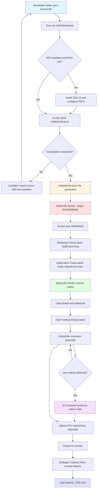
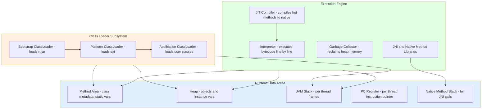
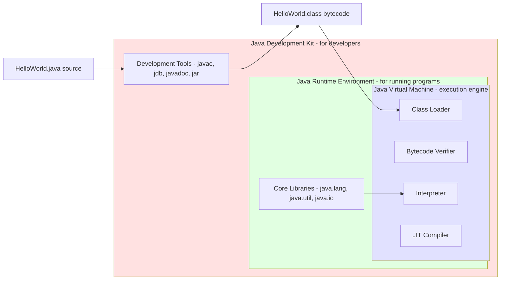
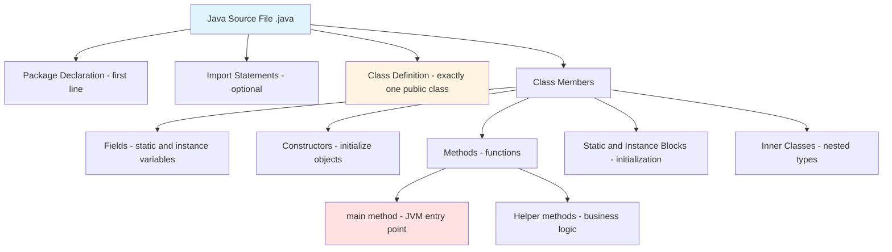
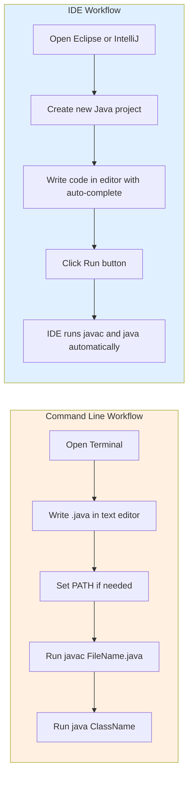

# Structure of a simple Java program, Java Environment (Command Line & IDE), Compiler, JVM

<!-- SECTION_1_START -->
# 1. Core Technical Definition & Intuitive Overview

## 1.1 Formal Academic Definition (KTU 2024 Syllabus Terminology)

A **Java Program** is a structured collection of one or more classes written in the Java programming language, compiled into platform-independent **bytecode** by the **Java Compiler (`javac`)** and executed by the **Java Virtual Machine (JVM)**, which interprets or Just-In-Time (JIT) compiles the bytecode into native machine instructions for the underlying operating system.

The **Java Development Environment** encompasses the entire toolchain required to develop, compile, debug, and execute Java applications. This environment can be accessed via two primary interfaces:
1. **Command Line Interface (CLI)** — using tools like `javac`, `java`, `javadoc`, and `jar` from a terminal.
2. **Integrated Development Environment (IDE)** — graphical tools such as **Eclipse**, **IntelliJ IDEA**, or **NetBeans** that integrate editing, compiling, debugging, and profiling in a single workspace.

> [!IMPORTANT]
> **KTU 2024 Syllabus Highlight (PBCST304 – Module 1):**
> Students must be able to **write, compile, and execute** a simple Java program using both the Command Line tools (`JDK` + `PATH` configuration) and an IDE. Familiarity with the role of the **Compiler**, **Class Loader**, **Bytecode Verifier**, and **JIT** is mandatory for ESE questions.

## 1.2 The Three Pillars of the Java Ecosystem

| Pillar | Technical Role | Output |
|---|---|---|
| **JDK (Java Development Kit)** | Provides compiler (`javac`), debugger (`jdb`), documentation tool (`javadoc`), and the JRE. Used by **developers**. | Source code $\rightarrow$ Bytecode (`.class` files) |
| **JRE (Java Runtime Environment)** | Provides the JVM and standard libraries. Used at **runtime**. | Bytecode $\rightarrow$ Native execution |
| **JVM (Java Virtual Machine)** | Abstract machine that loads, verifies, and executes bytecode. The "**Write Once, Run Anywhere**" engine. | Native machine code execution |

## 1.3 Conceptual Analogy — The Postal System

Imagine you are sending a **package (your program)** to a friend in another country:

- **Source Code (`.java` file)** is the raw content you wrote at your desk.
- **The Java Compiler (`javac`)** is the **packaging factory** — it wraps your content in a **standardized international box (bytecode `.class`)** that any postal system worldwide understands.
- **The JVM** is the **local postal service in the destination country** — it knows exactly how to deliver that standardized box to the local computer (operating system) using its native language (machine code).
- **The JRE** is the **complete postal infrastructure** (trucks, sorting offices, delivery staff) that supports the JVM.
- **The JDK** is the **factory + postal infrastructure combined** — the developer's full toolkit.

> [!NOTE]
> This is why Java's slogan **"Write Once, Run Anywhere" (WORA)** holds: the bytecode is portable, and every platform supplies its own JVM translator.

> [!VISUALIZATION CONTROL]
> **Concept:** Java Compilation + Execution Pipeline (Layered Architecture)
> **Conceptual Stack Diagram (bottom to top):**
> * **Layer 1 (Hardware):** CPU + OS (Windows / Linux / macOS)
> * **Layer 2 (JVM):** Class Loader $\rightarrow$ Bytecode Verifier $\rightarrow$ Interpreter / JIT Compiler
> * **Layer 3 (JRE):** Core Libraries (`rt.jar`, `java.lang`, `java.util`)
> * **Layer 4 (JDK Tools):** `javac`, `jdb`, `javadoc`, `jar`
> * **Layer 5 (Source):** Your `.java` file
>
> **Visual Description:** Picture a 5-tier tower. The same `.class` bytecode (Level 2.5) can sit atop any Layer 1 hardware because the JVM (Layer 2) translates it locally.

## 1.4 Why Java Uses a Two-Stage Translation

Unlike C/C++ (which compile directly to machine code and tie the program to one OS), Java performs a **two-stage translation**:

$$
\text{Source (`.java`)} \xrightarrow{\text{Compiler (`javac`)}} \text{Bytecode (`.class`)} \xrightarrow{\text{JVM (Interpreter / JIT)}} \text{Native Machine Code}
$$

This architecture makes Java:
- **Platform-Independent** (bytecode is uniform across all OSes).
- **Secure** (bytecode is verified before execution).
- **Portable** (no recompilation needed for different platforms).
<!-- SECTION_1_END -->

<!-- SECTION_2_START -->
# 2. Deep Theoretical Analysis & KTU High-Yield Formula Sheet

## 2.1 Anatomy of a Simple Java Program — Component Breakdown

A minimal valid Java program contains **five mandatory and optional sections**. Consider the canonical "Hello World" example:

```java
// File: HelloWorld.java
package com.ktu.demo;                   // (1) Package declaration — OPTIONAL

import java.util.Scanner;                // (2) Import statements — OPTIONAL
import java.lang.System;                 // (2) java.lang is auto-imported

/**
 * (3) Documentation Comment — OPTIONAL
 * Prints a greeting to the console.
 * @author KTU Student
 */
public class HelloWorld {                 // (4) Class definition — MANDATORY

    public static void main(String[] args) {   // (5) main() method — MANDATORY entry point
        System.out.println("Hello, KTU 2024!");  // (6) Executable statement
    }                                            // (7) End of main
}                                                // (8) End of class
```

### 2.1.1 Why Each Section Matters

**(1) Package Declaration**
- Used to **organize classes** into namespaces, preventing name collisions.
- Must be the **first statement** in the file (excluding comments).
- Folder structure must mirror the package name (e.g., `com.ktu.demo` $\rightarrow$ `com/ktu/demo/HelloWorld.java`).
- Default package (no declaration) is used for small programs but is **bad practice** in industry.

**(2) Import Statements**
- Allow the use of classes from **other packages** without writing their fully qualified names.
- `java.lang.*` is **automatically imported** — this is why `System` and `String` work without explicit imports.
- Two forms:
  * **Single-type import:** `import java.util.Scanner;` (preferred, faster compilation).
  * **On-demand import:** `import java.util.*;` (compiles slightly slower, may cause ambiguity).

**(3) Documentation Comment (Javadoc)**
- Begins with `/**` and ends with `*/`.
- Extracted by the `javadoc` tool to generate **HTML API documentation**.
- Recognized tags: `@author`, `@param`, `@return`, `@throws`, `@since`, `@deprecated`.

**(4) Class Definition**
- Java is a **pure object-oriented language at the class level** — all code must reside inside a class.
- The `public` modifier means the class is accessible from **any other class** in any package.
- The class name **must match the filename** (case-sensitive). `HelloWorld.java` must contain `public class HelloWorld`.
- Only **one public class** is allowed per source file (top-level).

**(5) The `main()` Method — The JVM's Entry Point**

The signature is **strictly fixed**:

```java
public static void main(String[] args)
```

| Keyword | Meaning |
|---|---|
| `public` | JVM can call it from **outside** the class. |
| `static` | Called **without creating an object** of the class. |
| `void` | Returns **no value** to the OS. |
| `main` | Reserved name — the JVM looks for this **exact identifier**. |
| `String[] args` | Receives **command-line arguments** as an array of `String`. |

> [!NOTE]
> **Valid variants accepted by JVM** (since Java 5+): `String args[]`, `String... args` (varargs). All other variations (e.g., `int args[]`, returning `int`) are **rejected** with a `Main method not found` error.

**(6) Statements & Code Blocks**
- Each executable statement ends with a **semicolon (`;`)**.
- Code blocks are enclosed in **curly braces `{}`** and define scope.
- Java is **case-sensitive**: `System` ≠ `system`.

## 2.2 The Java Environment — Command Line vs. IDE

### 2.2.1 Command Line Workflow

The **Command Line Interface (CLI)** workflow forces the student to understand **every step** explicitly — this is why KTU labs emphasize it.

| Step | Command (Windows / Linux) | Purpose |
|---|---|---|
| 1. **Write Source Code** | Use any text editor (`Notepad`, `vim`, `nano`, `gedit`) | Create `HelloWorld.java` |
| 2. **Set PATH** (one-time) | `set PATH=%PATH%;C:\Program Files\Java\jdk-21\bin` (Windows) `export PATH=$PATH:/usr/lib/jvm/java-21/bin` (Linux) | Tell OS where `javac` and `java` live |
| 3. **Compile** | `javac HelloWorld.java` | Produces `HelloWorld.class` (bytecode) |
| 4. **Execute** | `java HelloWorld` (no `.class` extension!) | JVM loads and runs bytecode |
| 5. **Pass Arguments** | `java HelloWorld KTU 2024` | `args[0]="KTU"`, `args[1]="2024"` |
| 6. **Package as JAR** | `jar cf Hello.jar HelloWorld.class` | Bundle classes for distribution |
| 7. **Run JAR** | `java -jar Hello.jar` | Execute packaged application |

### 2.2.2 IDE Workflow

An **Integrated Development Environment (IDE)** automates Steps 2–4 behind the scenes:

| IDE | Key Features |
|---|---|
| **Eclipse** | Open-source, plugin-based, heavy memory usage, popular in enterprise. |
| **IntelliJ IDEA** | Smart code completion, refactoring, free Community Edition, industry favorite. |
| **NetBeans** | Official Oracle IDE, drag-and-drop GUI builder, integrated with Java SE. |
| **VS Code** | Lightweight, requires "Extension Pack for Java" from Microsoft. |

IDE advantages: **syntax highlighting**, **real-time error detection**, **debugger breakpoints**, **refactoring tools**, **integrated version control (Git)**.

## 2.3 Deep Dive — The Compiler (`javac`)

The **Java Compiler** is implemented in Java itself and resides in `tools.jar` (Java 8) or as a module in Java 9+.

### 2.3.1 Compilation Phases

| Phase | Output | Description |
|---|---|---|
| **Lexical Analysis** | Token stream | Source text is broken into tokens (keywords, identifiers, literals, operators). |
| **Syntax Analysis (Parsing)** | Abstract Syntax Tree (AST) | Tokens are arranged into a tree reflecting the grammar. |
| **Semantic Analysis** | Annotated AST | Type checking, scope resolution, constant folding. |
| **Bytecode Generation** | `.class` file | Platform-neutral instructions for the JVM. |
| **Optimization** | Optimized `.class` | Constant inlining, dead-code elimination (limited). |

### 2.3.2 The `.class` File Format

A `.class` file is a **binary file** containing:
- **Magic Number:** `0xCAFEBABE` (4 bytes) — identifies the file as Java class.
- **Version Number:** Minor + Major version (e.g., Java 21 $\rightarrow$ major version 65).
- **Constant Pool:** All literals, class/method names, type descriptors.
- **Access Flags:** `public`, `abstract`, `final`, etc.
- **Field & Method Tables:** Definitions and bytecode.
- **Attribute Table:** Line numbers, local variable tables, source file name.

> [!TIP]
> You can inspect a `.class` file with the command: `javap -c -v HelloWorld` (the **Java Disassembler**).

## 2.4 Deep Dive — The JVM (Java Virtual Machine)

The JVM is **not a physical machine** — it is a **specification** (defined in JSR-000092) with concrete implementations (HotSpot, OpenJ9, GraalVM, Eclipse OpenJ9, Azul Zulu).

### 2.4.1 JVM Architecture (Three Major Subsystems)

**A. Class Loader Subsystem**
- **Loading:** Reads `.class` files via *Bootstrap* $\rightarrow$ *Extension (Platform)* $\rightarrow$ *Application* class loaders.
- **Linking:** Verify $\rightarrow$ Prepare (default-initialize static vars) $\rightarrow$ Resolve (symbolic refs $\rightarrow$ direct refs).
- **Initialization:** Executes static initializers and static blocks in top-to-bottom order.

**B. Runtime Data Areas (Memory)**
- **Method Area:** Class metadata, constant pool, static variables, method bytecode (shared).
- **Heap:** All objects + instance variables (shared, GC-managed).
- **Stack:** One stack per thread; each frame holds local variables, operand stack, frame data.
- **PC Register:** One per thread; holds address of current JVM instruction.
- **Native Method Stack:** Supports `native` (JNI) methods.

**C. Execution Engine**
- **Interpreter:** Reads and executes bytecode line-by-line (slow startup, fast for short code).
- **JIT (Just-In-Time) Compiler:** Detects "hot" methods (above a threshold) and compiles them to native code for blazing speed.
  * **C1 (Client) Compiler:** Quick optimization, used for lightly-used code.
  * **C2 (Server) Compiler:** Aggressive optimization, used for server-side hot paths.
  * **Tiered Compilation** (default since Java 8): Combines C1 and C2.
- **Garbage Collector (GC):** Automatic memory reclamation (G1, ZGC, Shenandoah, Parallel GC).
- **JNI + Native Method Libraries:** Interface to C/C++ code.

## 2.5 KTU High-Yield Formula Sheet (Exam Quick Reference)

| # | Concept | Key Fact | Exam Weight |
|---|---|---|---|
| 1 | File name rule | `public class` name **must match** the `.java` filename. | **3-mark favorite** |
| 2 | `main()` signature | `public static void main(String[] args)` — only this exact form is invoked. | **Frequent in 14-mark** |
| 3 | Auto-import | `java.lang.*` is **implicitly imported**. | **Direct question** |
| 4 | Case sensitivity | `String` ≠ `string`, `True` ≠ `true` (keyword is lowercase). | **Trap in MCQs** |
| 5 | Execution command | `java ClassName` (no extension). | **Confusion with `javac`** |
| 6 | Compile command | `javac FileName.java` (with extension). | **Compulsory `;` at end** |
| 7 | Bytecode | Output of compiler, input to JVM. File extension `.class`. | **Architecture question** |
| 8 | JIT | Converts "hot" bytecode to native code at runtime for speed. | **Theory question** |
| 9 | WORA | Made possible because JVM is platform-specific but bytecode is platform-neutral. | **Essay question** |
| 10 | Magic number | First 4 bytes of `.class` file = `0xCAFEBABE`. | **Surprise question** |
| 11 | `String[] args` | Receives command-line arguments; length = 0 if none passed. | **Programming question** |
| 12 | Garbage Collector | Frees unreachable objects on the **heap** automatically. | **Comparison with C++** |
| 13 | `static` in `main` | Allows JVM to call `main()` **without creating an object**. | **Why-question** |
| 14 | `void` return type | OS doesn't use any return value from `main`. | **Why-question** |
| 15 | JDK $\supset$ JRE $\supset$ JVM | Set relationship: JDK contains JRE, JRE contains JVM. | **Venn-diagram question** |

## 2.6 Real-World Engineering Utility

| Domain | Use Case |
|---|---|
| **Enterprise Backend** | Spring Boot microservices running on JVMs power banking, e-commerce, and telecom. |
| **Android Development** | Android Runtime (ART) is a JVM variant executing DEX bytecode. |
| **Big Data** | Hadoop, Apache Spark, Kafka — all JVM-based for distributed processing. |
| **Embedded Systems** | Java ME + embedded JVMs power SIM cards, smart cards, IoT devices. |
| **Scientific Computing** | Java 3D, JMol (molecular visualization), climate modeling. |
| **Web Servers** | Apache Tomcat, Jetty — servlets run inside a JVM. |
| **Financial Trading** | Low-latency JIT-compiled Java trades at microsecond speeds. |
<!-- SECTION_2_END -->

<!-- SECTION_3_START -->
# 3. Step-by-Step Derivations, Compilations & Code Implementation

## 3.1 Tracing a Java Program from Source to Execution

We will perform an **end-to-end trace** of compiling and running a Java program, examining every file generated and every transformation applied.

### 3.1.1 Source Code — `HelloKTU.java`

```java
// Source: HelloKTU.java
package com.ktu.module1;            // Step A: Declare package

import java.util.Date;             // Step B: Import Date class

public class HelloKTU {             // Step C: Public class (name = filename)
    public static void main(String[] args) {   // Step D: JVM entry point
        String name = "KTU";        // Step E: Local variable
        if (args.length > 0) {      // Step F: Check command-line arguments
            name = args[0];         // Step G: Override with CLI input
        }
        System.out.println("Hello, " + name + "!");  // Step H: Print output
        System.out.println("Today: " + new Date()); // Step I: Print current date
    }
}
```

### 3.1.2 Step-by-Step CLI Compilation & Execution

**Step 1 — Create the folder structure matching the package:**

```bash
mkdir -p com/ktu/module1
# Linux / macOS
mkdir com\ktu\module1
# Windows
```

**Step 2 — Place `HelloKTU.java` inside `com/ktu/module1/`.**

**Step 3 — Compile from the parent directory of `com`:**

```bash
javac com/ktu/module1/HelloKTU.java
# On Windows:
javac com\ktu\module1\HelloKTU.java
```

**Expected output:** A new file `com/ktu/module1/HelloKTU.class` is produced. No console message = **success**.

> [!IMPORTANT]
> If you see errors like `error: cannot find symbol`, it means a class used in your code is not on the **classpath**. Use `javac -cp . com/ktu/module1/HelloKTU.java` to set the classpath to the current directory.

**Step 4 — Execute using the fully qualified class name:**

```bash
java com.ktu.module1.HelloKTU
```

**Expected output:**

```
Hello, KTU!
Today: <current date>
```

**Step 5 — Pass a command-line argument:**

```bash
java com.ktu.module1.HelloKTU Kerala
```

**Expected output:**

```
Hello, Kerala!
Today: <current date>
```

### 3.1.3 What Happens Inside the JVM — Detailed Trace

When you type `java com.ktu.module1.HelloKTU Kerala`, the JVM performs the following sequence of operations:

| Step | JVM Action | Data Structure Involved |
|---|---|---|
| 1 | **Bootstrap Class Loader** loads core Java classes from `rt.jar` (or `java.base` module). | Method Area |
| 2 | **Extension (Platform) Class Loader** loads JDK extension classes (deprecated in Java 9+). | Method Area |
| 3 | **Application Class Loader** loads `com.ktu.module1.HelloKTU` from the classpath. | Method Area |
| 4 | **Bytecode Verifier** checks the `.class` file for valid format, type safety, and stack consistency. | — |
| 5 | **Class is linked:** Prepare (default static values) + Resolve (symbolic $\rightarrow$ direct references). | Method Area |
| 6 | **Class is initialized:** Static blocks run (none in this example). | — |
| 7 | A new **thread** is spawned; a **stack frame** for `main` is pushed onto the JVM stack. | JVM Stack |
| 8 | The **PC register** is set to point to the first bytecode of `main`. | PC Register |
| 9 | The **interpreter** begins executing bytecode instructions one by one. | Execution Engine |
| 10 | A new `String` object `"Hello, "` is created on the **heap**; `name` (in stack frame) points to it. | Heap + Stack |
| 11 | Concatenation creates a new `String` `"Hello, KTU!"`; `System.out.println` triggers a JNI call. | Native Method Stack |
| 12 | Output is flushed to the OS console. | — |
| 13 | `main` returns; the **stack frame is popped**. | JVM Stack |
| 14 | The **main thread terminates**; JVM exits (since no non-daemon threads remain). | — |

## 3.2 Demonstrating the `String[] args` Argument Flow with Code

```java
// File: ArgsDemo.java
public class ArgsDemo {
    public static void main(String[] args) {
        // args is a String array; args.length tells us how many CLI args were passed.
        System.out.println("Total arguments received: " + args.length);

        // Print all arguments using a classic for loop
        System.out.println("--- Arguments ---");
        for (int i = 0; i < args.length; i++) {
            System.out.println("args[" + i + "] = " + args[i]);
        }

        // Demonstrate that args values are ALWAYS Strings, even if numeric-looking
        if (args.length > 0) {
            String firstArg = args[0];
            System.out.println("First argument (as String): \"" + firstArg + "\"");
            System.out.println("Length of first argument: " + firstArg.length());

            // Parsing to integer (with error handling for safety)
            try {
                int numericValue = Integer.parseInt(firstArg);
                System.out.println("Parsed integer value: " + numericValue);
            } catch (NumberFormatException e) {
                System.out.println("First argument is NOT a valid integer.");
            }
        }
    }
}
```

### 3.2.1 Compilation & Execution

```bash
javac ArgsDemo.java
java ArgsDemo Hello 123 KTU
```

### 3.2.2 Expected Output

```
Total arguments received: 3
--- Arguments ---
args[0] = Hello
args[1] = 123
args[2] = KTU
First argument (as String): "Hello"
Length of first argument: 5
First argument is NOT a valid integer.
```

### 3.2.3 Key Observations

- `args.length` is **3**, confirming all three tokens were captured.
- The numeric-looking `"123"` is a **String**, not an `int` — it required `Integer.parseInt()` to convert.
- The `try-catch` block prevents a `NumberFormatException` crash — a hallmark of **robust Java code**.

## 3.3 Full Java Program — A Realistic Module-1 Lab Example

```java
// File: StudentProfile.java
package com.ktu.module1;

import java.util.Scanner;   // For reading user input from console

/**
 * StudentProfile - Demonstrates the structure of a Java program.
 * Reads student details from the console and displays them.
 *
 * Compilation:  javac com/ktu/module1/StudentProfile.java
 * Execution:    java com.ktu.module1.StudentProfile
 *
 * @author KTU 2024 Student
 * @version 1.0
 */
public class StudentProfile {

    // ---------- Class-level (static) constants ----------
    private static final String COLLEGE_NAME = "APJ Abdul Kalam Technological University";
    private static int studentCount = 0;  // Tracks number of students created

    // ---------- Instance fields ----------
    private String registerNumber;
    private String name;
    private int semester;
    private double cgpa;

    // ---------- Constructor ----------
    public StudentProfile(String registerNumber, String name, int semester, double cgpa) {
        this.registerNumber = registerNumber;
        this.name = name;
        this.semester = semester;
        this.cgpa = cgpa;
        studentCount++;   // Increment static counter on each instantiation
    }

    // ---------- Instance method ----------
    public void displayProfile() {
        System.out.println("---------------------------------------------");
        System.out.println("College: " + COLLEGE_NAME);
        System.out.println("Register No: " + this.registerNumber);
        System.out.println("Name: " + this.name);
        System.out.println("Semester: " + this.semester);
        System.out.println("CGPA: " + this.cgpa);
        System.out.println("---------------------------------------------");
    }

    // ---------- Static method ----------
    public static int getStudentCount() {
        return studentCount;
    }

    // ---------- The main() method - JVM entry point ----------
    public static void main(String[] args) {
        System.out.println("Welcome to " + COLLEGE_NAME);
        System.out.println();

        // Create a Scanner object to read from standard input (System.in)
        Scanner scanner = new Scanner(System.in);

        // Read first student
        System.out.print("Enter Register Number: ");
        String regNo1 = scanner.nextLine();

        System.out.print("Enter Name: ");
        String name1 = scanner.nextLine();

        System.out.print("Enter Semester: ");
        int sem1 = Integer.parseInt(scanner.nextLine());

        System.out.print("Enter CGPA: ");
        double cgpa1 = Double.parseDouble(scanner.nextLine());

        StudentProfile s1 = new StudentProfile(regNo1, name1, sem1, cgpa1);

        // Read second student
        System.out.println();
        System.out.print("Enter Register Number: ");
        String regNo2 = scanner.nextLine();

        System.out.print("Enter Name: ");
        String name2 = scanner.nextLine();

        System.out.print("Enter Semester: ");
        int sem2 = Integer.parseInt(scanner.nextLine());

        System.out.print("Enter CGPA: ");
        double cgpa2 = Double.parseDouble(scanner.nextLine());

        StudentProfile s2 = new StudentProfile(regNo2, name2, sem2, cgpa2);

        // Display both profiles
        System.out.println();
        System.out.println("=== Student Profiles ===");
        s1.displayProfile();
        s2.displayProfile();

        System.out.println("Total students created: " + StudentProfile.getStudentCount());

        // Clean up resources
        scanner.close();
    }
}
```

### 3.3.1 Compilation & Execution Trace

```bash
# Step 1: Create folder structure
mkdir -p com/ktu/module1

# Step 2: Place StudentProfile.java inside the package folder
mv StudentProfile.java com/ktu/module1/

# Step 3: Compile
javac com/ktu/module1/StudentProfile.java

# Step 4: Run
java com.ktu.module1.StudentProfile
```

### 3.3.2 Sample Interaction

```
Welcome to APJ Abdul Kalam Technological University

Enter Register Number: KTU2024CS001
Enter Name: Ananya Krishnan
Enter Semester: 3
Enter CGPA: 8.7

Enter Register Number: KTU2024CS002
Enter Name: Rahul Menon
Enter Semester: 3
Enter CGPA: 9.1

=== Student Profiles ===
---------------------------------------------
College: APJ Abdul Kalam Technological University
Register No: KTU2024CS001
Name: Ananya Krishnan
Semester: 3
CGPA: 8.7
---------------------------------------------
---------------------------------------------
College: APJ Abdul Kalam Technological University
Register No: KTU2024CS002
Name: Rahul Menon
Semester: 3
CGPA: 9.1
---------------------------------------------
Total students created: 2
```

## 3.4 Disassembling a `.class` File — Seeing Bytecode

To prove that the JVM really runs **bytecode**, disassemble the compiled file:

```bash
javap -c -p com/ktu/module1/StudentProfile
```

You will see output like:

```
Compiled from "StudentProfile.java"
public class com.ktu.module1.StudentProfile {
  public com.ktu.module1.StudentProfile(java.lang.String, java.lang.String, int, double);
    Code:
       0: aload_0
       1: invokespecial #1   // Method java/lang/Object."<init>":()V
       4: aload_0
       5: aload_1
       6: putfield      #2   // Field registerNumber:Ljava/lang/String;
       ...
  public static void main(java.lang.String[]);
    Code:
       0: getstatic     #3   // Field java/lang/System.out:Ljava/io/PrintStream;
       3: ldc           #4   // String Welcome to APJ Abdul Kalam Technological University
       5: invokevirtual #5   // Method java/io/PrintStream.println:(Ljava/lang/String;)V
       ...
}
```

> [!NOTE]
> `aload`, `invokespecial`, `getstatic`, `ldc`, `invokevirtual` are all **JVM opcodes** — the actual machine language of the JVM. The JIT compiler later rewrites these into native CPU instructions (e.g., x86-64 `mov`, `call`).

## 3.5 Setting the PATH Environment Variable — Full Procedure

### 3.5.1 Windows (Permanent)

1. Right-click **This PC** $\rightarrow$ **Properties** $\rightarrow$ **Advanced system settings**.
2. Click **Environment Variables**.
3. Under **System variables**, find `Path`, click **Edit** $\rightarrow$ **New**.
4. Add: `C:\Program Files\Java\jdk-21\bin` (or wherever your JDK is installed).
5. Click **OK** on all dialogs.
6. Open a **new** Command Prompt and verify:

```bash
javac -version
java -version
```

Expected output:

```
javac 21.0.2
java 21.0.2 2024-01-16 LTS
```

### 3.5.2 Linux / macOS (Temporary)

```bash
export JAVA_HOME=/usr/lib/jvm/java-21-openjdk
export PATH=$JAVA_HOME/bin:$PATH
```

### 3.5.3 Linux / macOS (Permanent — add to `~/.bashrc` or `~/.zshrc`)

```bash
echo 'export JAVA_HOME=/usr/lib/jvm/java-21-openjdk' >> ~/.bashrc
echo 'export PATH=$JAVA_HOME/bin:$PATH' >> ~/.bashrc
source ~/.bashrc
```
<!-- SECTION_3_END -->

<!-- SECTION_4_START -->
# 4. Structural Diagrams & Schematics

## 4.1 Mermaid Diagram — End-to-End Java Compilation & Execution Pipeline



## 4.2 Mermaid Diagram — JVM Internal Architecture



## 4.3 Mermaid Diagram — JDK, JRE, JVM Relationship



## 4.4 Mermaid Diagram — Anatomy of a Java Source File



## 4.5 Mermaid Diagram — Command Line vs IDE Workflow Comparison


<!-- SECTION_4_END -->

<!-- SECTION_5_START -->
# 5. KTU 2024 Scheme Examination Question Bank & Topic Recap

## 5.1 Part A — Short Answer Questions (3 Marks Each)

### Question 1: Define JVM. Explain its role in achieving platform independence. [KTU University Exam - December 2023]

**Model Answer (3 Marks):**

**JVM (Java Virtual Machine)** is an abstract computing machine — a runtime engine — that enables a computer to execute a Java program. It is the cornerstone of Java's **"Write Once, Run Anywhere" (WORA)** capability.

**Role in Platform Independence:**
1. The Java compiler converts source code (`.java`) into **bytecode** (`.class`), which is **not** native machine code of any real CPU.
2. This bytecode is the **machine language of the JVM**, an abstract processor.
3. Each operating system (Windows, Linux, macOS) provides its **own platform-specific JVM implementation**.
4. The JVM on each OS translates the same bytecode into the **native instructions of that underlying hardware**.
5. Therefore, the same `.class` file runs on any platform that has a JVM, **without recompilation**.

> **Valuation Key:** [Defining JVM: 1 Mark] [Explaining bytecode role: 1 Mark] [WORA conclusion: 1 Mark]

### Question 2: Differentiate between JDK, JRE, and JVM. [KTU University Exam - July 2024]

**Model Answer (3 Marks):**

| Aspect | JDK | JRE | JVM |
|---|---|---|---|
| **Full Form** | Java Development Kit | Java Runtime Environment | Java Virtual Machine |
| **Purpose** | Develop, compile, debug Java programs | Run compiled Java programs | Execute bytecode |
| **Contains** | JRE + development tools | JVM + core libraries | Execution engine + memory areas |
| **Users** | Developers | End users / production | Internal engine inside JRE |
| **Key Tools** | `javac`, `jdb`, `javadoc`, `jar` | None (runtime only) | None (internal) |
| **Set Relationship** | JDK $\supset$ JRE $\supset$ JVM | JRE $\supset$ JVM | Smallest unit |

> **Valuation Key:** [Correct full forms: 1 Mark] [Clear difference table: 1 Mark] [Set relationship: 1 Mark]

---

## 5.2 Part B — Long Answer Questions (14 Marks with Internal Choice)

### Question A: Structure of a Java Program, `main()` Method & Command Line Execution. [14 Marks]

**[KTU University Exam - December 2023 | CO1 | RBT: Understand + Apply]**

**(a)** Explain the general structure of a simple Java program with a suitable example. List the mandatory and optional sections. **(7 Marks)**

**(b)** Write a Java program that accepts three command-line arguments (student name, register number, and CGPA) and prints them in a formatted way. Show the exact compilation and execution commands used. **(7 Marks)**

---

#### Model Solution for (a) — 7 Marks

The structure of a Java program consists of the following sections, demonstrated with an example:

```java
// File: DemoStructure.java
package com.ktu.demo;                         // OPTIONAL: package declaration

import java.lang.Math;                        // OPTIONAL: import (java.lang is auto-imported)

/**                                           // OPTIONAL: Javadoc comment
 * DemoStructure - illustrates Java program anatomy.
 * @author KTU Student
 */
public class DemoStructure {                  // MANDATORY: class declaration (name = filename)

    static int counter = 0;                   // OPTIONAL: static field

    public static void main(String[] args) {   // MANDATORY: main method - JVM entry point
        counter++;
        System.out.println("Program executed " + counter + " time(s).");
        System.out.println("Square root of 16 = " + Math.sqrt(16));
    }                                          // End of main
}                                              // End of class
```

| Section | Mandatory? | Purpose |
|---|---|---|
| Package declaration | Optional | Namespace organization |
| Import statements | Optional | Bring in external classes |
| Documentation comment | Optional | API documentation via `javadoc` |
| Class declaration | **Mandatory** | Container for all code |
| `main()` method | **Mandatory** | JVM entry point for execution |
| Statements | Mandatory (inside main) | Actual logic to execute |

> **Valuation Key:** [Listing all 6 sections: 2 Marks] [Identifying mandatory vs optional: 2 Marks] [Correct example with filename match: 2 Marks] [Explanation of `main()`: 1 Mark]

---

#### Model Solution for (b) — 7 Marks

```java
// File: StudentDisplay.java
public class StudentDisplay {
    public static void main(String[] args) {
        // Validate that exactly 3 arguments were provided
        if (args.length != 3) {
            System.out.println("Usage: java StudentDisplay <name> <registerNumber> <cgpa>");
            System.out.println("You provided " + args.length + " argument(s).");
            return;   // Exit early if wrong number of arguments
        }

        // Read arguments from the args array
        String name = args[0];
        String registerNumber = args[1];
        double cgpa = Double.parseDouble(args[2]);  // Convert String to double

        // Print in a formatted way
        System.out.println("+--------------------------------------+");
        System.out.println("|          STUDENT PROFILE             |");
        System.out.println("+--------------------------------------+");
        System.out.println("| Name            : " + padRight(name, 18) + " |");
        System.out.println("| Register Number : " + padRight(registerNumber, 18) + " |");
        System.out.printf ("| CGPA            : %-18s |\n", String.format("%.2f", cgpa));
        System.out.println("+--------------------------------------+");
    }

    // Helper method to pad a string with spaces for alignment
    private static String padRight(String s, int n) {
        if (s.length() >= n) return s.substring(0, n);
        return s + " ".repeat(n - s.length());
    }
}
```

**Compilation Command:**

```bash
javac StudentDisplay.java
```

**Execution Commands (three scenarios):**

```bash
# Scenario 1: Correct usage
java StudentDisplay Ananya KTU2024CS001 8.75
```

**Output:**

```
+--------------------------------------+
|          STUDENT PROFILE             |
+--------------------------------------+
| Name            : Ananya             |
| Register Number : KTU2024CS001       |
| CGPA            : 8.75               |
+--------------------------------------+
```

```bash
# Scenario 2: Missing arguments
java StudentDisplay Ananya
```

**Output:**

```
Usage: java StudentDisplay <name> <registerNumber> <cgpa>
You provided 2 argument(s).
```

> **Valuation Key:** [Validating `args.length`: 1 Mark] [Correctly reading 3 args: 1 Mark] [Type conversion `parseDouble`: 1 Mark] [Formatted output: 2 Marks] [Correct compile and run commands: 1 Mark] [Helper method demonstration: 1 Mark]

---

### Question B: Java Compilation Process, Bytecode, and JVM Architecture. [14 Marks]

**[KTU University Exam - July 2024 | CO1, CO2 | RBT: Understand + Analyze]**

**(a)** Explain the step-by-step process of Java compilation and execution. How is it different from the compilation in C/C++? **(7 Marks)**

**(b)** Describe the internal architecture of the JVM with a neat diagram. Explain the role of the Class Loader, Bytecode Verifier, and JIT Compiler. **(7 Marks)**

---

#### Model Solution for (a) — 7 Marks

**Java Compilation & Execution Steps:**

1. **Source Code Creation:** The programmer writes a `.java` file using any text editor or IDE.
2. **Compilation Phase:** The Java compiler (`javac`) reads the source file and translates it into bytecode, producing one or more `.class` files. Bytecode is a set of instructions for an **abstract machine** (the JVM), not for any real CPU.
3. **Class Loading Phase:** The JVM's **Class Loader Subsystem** reads the `.class` files from disk, network, or other sources into memory. The three class loaders (Bootstrap, Platform, Application) work in a parent-delegation hierarchy.
4. **Bytecode Verification:** The **Bytecode Verifier** checks the loaded bytecode for safety — valid type usage, no stack overflow/underflow, no illegal data conversions. This is critical for security.
5. **Execution Phase:** The **Execution Engine** runs the verified bytecode. Initially, the **Interpreter** executes instructions one by one. When methods become "hot" (called many times), the **JIT (Just-In-Time) Compiler** kicks in and converts them to native machine code for faster execution.
6. **Runtime Phase:** The Garbage Collector continuously monitors the heap and reclaims memory from unreachable objects.

**Comparison with C/C++ Compilation:**

| Aspect | C / C++ | Java |
|---|---|---|
| **Output of compilation** | Native machine code (`.exe`, ELF) — platform-specific | Bytecode (`.class`) — platform-neutral |
| **Execution** | Runs directly on the hardware/OS | Runs inside the JVM, which translates to native code |
| **Portability** | Source must be recompiled for each target platform | Same bytecode runs on any platform with a JVM |
| **Memory management** | Manual (`malloc`/`free` in C, `new`/`delete` in C++) | Automatic via Garbage Collector |
| **Safety** | No bytecode verification; pointer errors possible | Strong safety checks; no pointer arithmetic |
| **Compilation speed** | Slower for large projects (full native build) | Faster incremental compilation |

> **Valuation Key:** [Listing 6 Java steps: 3 Marks] [C/C++ comparison table: 3 Marks] [WORA conclusion: 1 Mark]

---

#### Model Solution for (b) — 7 Marks

**JVM Internal Architecture Diagram:**

```
+----------------------------------------------------------+
|                      JVM                                 |
|                                                          |
|  +-----------------+   +------------------------------+  |
|  |  Class Loader   |   |   Runtime Data Areas         |  |
|  |  Subsystem      |   |                              |  |
|  |                 |   |  +------------------------+  |  |
|  |  - Bootstrap    |   |  |  Method Area           |  |  |
|  |  - Platform     |   |  |  (class metadata,      |  |  |
|  |  - Application  |   |  |   static vars,         |  |  |
|  |                 |   |  |   constant pool)       |  |  |
|  |  Functions:     |   |  +------------------------+  |  |
|  |  Loading        |   |  |  Heap                  |  |  |
|  |  Linking        |   |  |  (objects, instance    |  |  |
|  |  Initialization |   |  |   variables, GC'd)     |  |  |
|  +-----------------+   |  +------------------------+  |  |
|                        |  |  JVM Stack (per thread) |  |  |
|                        |  |  PC Register            |  |  |
|  +-----------------+   |  |  Native Method Stack   |  |  |
|  |  Execution      |   |  +------------------------+  |  |
|  |  Engine         |   +------------------------------+  |
|  |                 |                                     |
|  |  - Interpreter  |   +------------------------------+  |
|  |  - JIT Compiler |   |  Native Method Interface    |  |
|  |  - Garbage      |   |  (JNI Libraries)            |  |
|  |    Collector    |   +------------------------------+  |
|  +-----------------+                                     |
+----------------------------------------------------------+
```

**Role of Key Components:**

1. **Class Loader Subsystem** (Loading, Linking, Initialization):
   - **Loading:** Reads `.class` files using a parent-delegation model. The Bootstrap loader handles core Java classes (`java.lang.*`), the Platform loader handles extensions, and the Application loader handles user classes from the classpath.
   - **Linking:** Performs verification (correctness checks), preparation (allocating memory for static variables and default-initializing them), and resolution (replacing symbolic references in the constant pool with direct memory addresses).
   - **Initialization:** Executes static initializers and static variable assignments in the order they appear in the source code.

2. **Bytecode Verifier:**
   - Sits between the Class Loader and the Execution Engine.
   - Performs several safety checks: ensures the bytecode has the correct format (`0xCAFEBABE` magic), does not forge pointers, does not violate access control, does not cause operand stack overflow/underflow, and type-checks all instructions.
   - This is the **primary security barrier** that makes Java resistant to many common attacks (e.g., buffer overflows).

3. **JIT (Just-In-Time) Compiler:**
   - The interpreter alone is slow because it processes one bytecode instruction at a time.
   - The JIT compiler watches method invocations and identifies **"hot" methods** (methods called above a threshold, typically 10,000 times).
   - Hot methods are compiled into **native machine code** and cached in memory. Subsequent calls run at native speed.
   - **C1 (Client) compiler:** Quick, lightweight optimization — used early and for lightly-used code.
   - **C2 (Server) compiler:** Aggressive, deep optimization (inlining, loop unrolling, escape analysis) — used for heavily-used code paths.
   - **Tiered compilation** (default in Java 8+) combines C1 and C2 for the best of both worlds.

> **Valuation Key:** [Architecture diagram with 3 subsystems: 3 Marks] [Class Loader explanation (3 phases): 1.5 Marks] [Bytecode Verifier role: 1 Mark] [JIT Compiler role with hot-method detection: 1.5 Marks]

---

## 5.3 KTU Examiner's Valuation Warning & Common Pitfalls

> [!WARNING]
> **Where Students Lose Marks in This Topic:**
>
> 1. **Filename mismatch:** Writing `class HelloWorld` but saving the file as `helloworld.java` causes a `class HelloWorld is public, should be declared in a file named HelloWorld.java` compile-time error. **Always save the file with the exact case-sensitive class name + `.java`.**
>
> 2. **Forgetting the `public` keyword in `main()`:** The signature must be `public static void main(String[] args)`. Omitting `public` or writing it as `Public` (capital P) will cause a runtime `Main method not found` error — this is a **favourite 2-mark deduction** in ESE.
>
> 3. **Confusing `javac` and `java` commands:** `javac` requires the file extension (`.java`), but `java` does **not** take the extension. Writing `java HelloWorld.class` is a common mistake that yields `Could not find or load main class HelloWorld.class`.
>
> 4. **Treating command-line arguments as numeric:** `args[0]` is always a `String`. Writing `int x = args[0];` will not compile. Use `Integer.parseInt(args[0])` instead, ideally inside a `try-catch` block.
>
> 5. **Missing the classpath when running packaged classes:** If your class is in package `com.ktu.module1`, you must run `java com.ktu.module1.ClassName` from the **parent directory** of `com`, not from inside the package folder.
>
> 6. **Forgetting `static` in `main()`:** Students sometimes write `public void main(String[] args)` — this is a valid method but **JVM will not invoke it**. The `static` keyword is mandatory.
>
> 7. **Not closing the `Scanner`:** Leaving `scanner.close()` out of the code triggers a resource-leak warning. Although not a compile error, it is **marked down in lab evaluations** for not following good practices.
>
> 8. **Confusing JDK, JRE, and JVM in definitions:** Examiners often award 0.5 marks each for definitions; getting them mixed up loses all of those.

## 5.4 Topic Recap & Important Things to Remember

> [!IMPORTANT]
> **Rapid Revision Checklist — Module 1: Java Program Structure & Environment**
>
> - **Java Program Structure** consists of 6 parts: Package $\rightarrow$ Imports $\rightarrow$ Javadoc comment $\rightarrow$ Class $\rightarrow$ `main()` $\rightarrow$ Statements.
> - The **filename must exactly match** the `public class` name (case-sensitive).
> - The **mandatory `main()` signature** is `public static void main(String[] args)`.
> - `String[] args` holds **command-line arguments**; its length is `0` if no arguments are passed.
> - `args[i]` is always a `String` — convert with `Integer.parseInt()`, `Double.parseDouble()`, etc.
> - **JDK** = JRE + development tools (`javac`, `javadoc`, `jdb`, `jar`); used by **developers**.
> - **JRE** = JVM + core libraries; used at **runtime** to execute bytecode.
> - **JVM** = abstract execution engine; provides **platform independence** via bytecode.
> - **Compile** with `javac FileName.java` (extension required) $\rightarrow$ produces `.class` bytecode.
> - **Execute** with `java ClassName` (no extension) $\rightarrow$ JVM interprets/JIT-compiles bytecode.
> - The `.class` file begins with the **magic number** `0xCAFEBABE`.
> - **Java = two-stage translation:** source $\rightarrow$ bytecode (by `javac`) $\rightarrow$ native code (by JVM).
> - **C/C++ = one-stage translation:** source $\rightarrow$ native code (platform-specific).
> - **JVM architecture has 3 main subsystems:** Class Loader, Runtime Data Areas, Execution Engine.
> - **Class Loader** does Loading, Linking, and Initialization; uses **parent-delegation** model.
> - **Bytecode Verifier** checks the safety of bytecode — primary security barrier.
> - **JIT Compiler** converts "hot" bytecode to native code at runtime for speed.
> - **Method Area** stores class metadata; **Heap** stores objects; **Stack** holds per-thread frames.
> - **Garbage Collector** automatically reclaims memory from unreachable objects on the heap.
> - **WORA (Write Once, Run Anywhere)** is achieved because bytecode is platform-neutral and every OS has its own JVM.
> - **Command line** workflow: `mkdir` $\rightarrow$ `javac` $\rightarrow$ `java` (with `PATH` set).
> - **IDE** workflow: Project creation $\rightarrow$ Code $\rightarrow$ Run button (auto-handles compile + run).
> - **`java.lang.*` is auto-imported**; no need to explicitly import `System`, `String`, `Math`, etc.
> - **Java is case-sensitive**: `String` $\neq$ `string`, `true` $\neq$ `True`.
> - **Each statement ends with a semicolon** `;`; code blocks are wrapped in `{}`.
> - **Disassemble bytecode** using `javap -c -v ClassName` to see JVM opcodes.
<!-- SECTION_5_END -->
