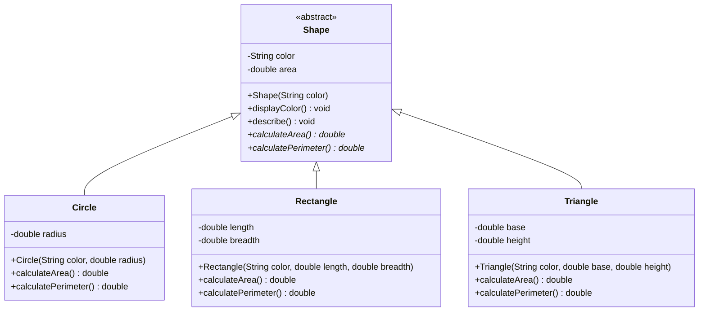
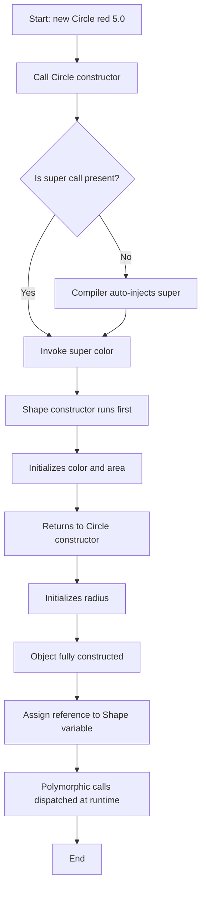
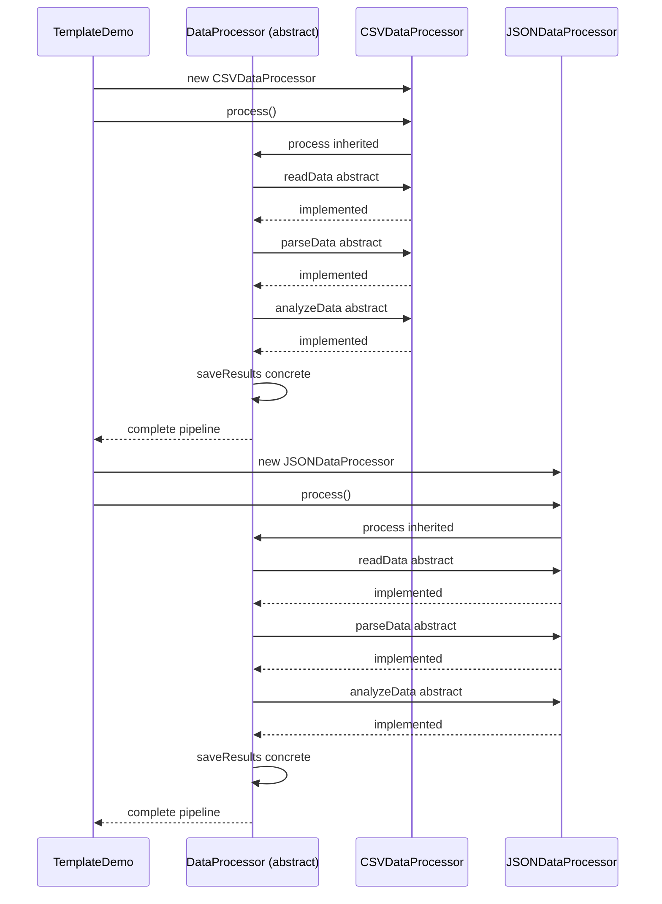
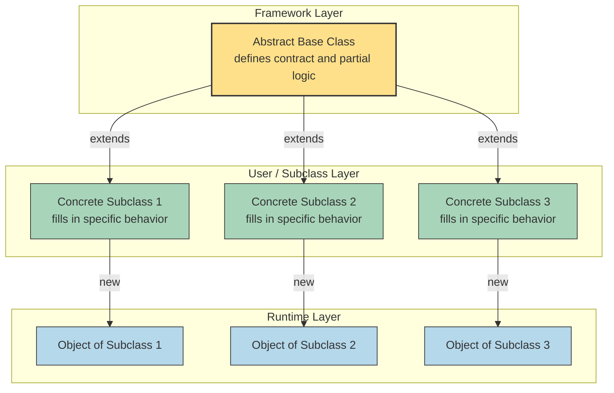
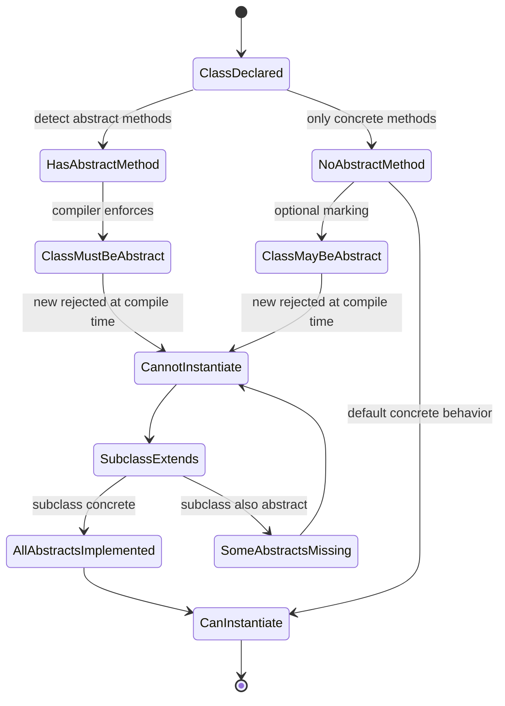

# Abstract Classes

<!-- SECTION_1_START -->
# Abstract Classes in Java — Core Definition & Intuitive Overview

## Formal Academic Definition (KTU 2024 Syllabus Terminology)

An **abstract class** in Java is a class that is declared using the `abstract` keyword and represents an *incomplete blueprint* from which *no direct objects can be instantiated*. It serves as a generic superclass that may contain a mixture of **abstract methods** (method signatures without a body) and **concrete methods** (fully implemented methods). Any concrete subclass that extends an abstract class must provide implementations for *all inherited abstract methods*, otherwise the subclass must itself be declared as `abstract`.

> [!IMPORTANT]
> **KTU 2024 Highlight:** Under the PBCST304 syllabus (Module 1 — Introduction to Java), abstract classes are classified as a *non-implementable template category* of classes. They bridge the gap between inheritance generalization and strict interface contracts.

---

## Conceptual Analogy / Intuitive Overview

Think of an **abstract class as an architectural master plan** for a housing colony.

The master plan says:
- Every house **must** have a `buildFoundation()` method (the contract).
- Every house **may** have a `paint()` method with a default white color (the concrete method).

However, the master plan itself is **not a house** — you cannot move into a "master plan." A builder must first create a *concrete blueprint* (e.g., a Villa plan, an Apartment plan) that fills in all missing details before construction (instantiation) begins.

**Mapping the analogy to Java:**

| Real-World Concept | Java Equivalent |
|---|---|
| Master plan document | `abstract class` |
| Mandatory unfinished step | `abstract method` |
| Optional pre-defined step | `concrete method` |
| A finalized house plan | Concrete subclass |
| The actual house built | Object of the subclass |

> [!NOTE]
> **Key Insight for Beginners:** If a class has even **one** abstract method, the *entire class* must be declared abstract. However, an abstract class is **not required** to have any abstract method — it can be fully concrete yet still uninstantiable (used purely to prevent direct object creation).

---

## Why Abstract Classes Exist — The Engineering Motivation

In a large software system, you often notice that several related classes share:
1. **Common state** (member variables)
2. **Common behavior** (concrete methods)
3. **Forced but customizable behavior** (abstract methods)

Without abstract classes, you would either:
- Duplicate common code across all subclasses (bad — violates **DRY**), or
- Force unrelated classes to implement irrelevant methods (bad — violates **Interface Segregation Principle**).

Abstract classes elegantly solve this by providing a **shared semi-finished template**.

> [!TIP]
> The **Liskov Substitution Principle (LSP)** of OOP states that any object of a subclass must be substitutable for an object of its superclass. Abstract classes enforce this at the design level.

---

## GeoGebra / Desmos Visualization Callout

> [!VISUALIZATION CONTROL]
> **Concept:** Visualizing class inheritance hierarchy with abstract superclass.
> **Visual Description:** Plot a tree-like hierarchy on a 2D coordinate plane. Place `Shape` (the abstract class) at the top with a dashed border (indicating non-instantiable), and `Circle`, `Rectangle`, `Triangle` below it with solid borders. Arrows from each subclass point upward to `Shape`, representing the `extends` relationship.
> **GeoGebra Input:**
> * `Polygon((0,6), (2,3), (-2,3))` — represents the abstract superclass
> * `Polygon((3,3), (4.5,0), (1.5,0))` — represents first concrete subclass
> * `Polygon((-1,3), (0.5,0), (-2.5,0))` — represents second concrete subclass
>
> **Student Observation:** The dashed parent node cannot be "clicked to instantiate" (no object), while each solid child node can. This mirrors Java's runtime behavior.

---

## Quick Reference Syntax Card

```java
// Declaring an abstract class
abstract class ClassName {
    // data members
    // concrete methods
    // abstract methods (no body)
}
```

**Mandatory rules to remember:**
- The `abstract` keyword is required both at the class level and at every abstract method level.
- Abstract methods **end with a semicolon** — they have **no curly braces**.
- You **cannot** use `final` and `abstract` together on the same class or method (they are mutually exclusive).
- A subclass that fails to implement all inherited abstract methods **must itself be abstract**.

<!-- SECTION_1_END -->

<!-- SECTION_2_START -->
# Deep Theoretical Analysis & KTU High-Yield Formula Sheet

## Structural Anatomy of an Abstract Class

An abstract class in Java can legally contain the following members:

1. **Abstract methods** — declarations without a body.
2. **Concrete methods** — fully implemented methods with a body.
3. **Static methods** — class-level methods (cannot be overridden, but can be hidden).
4. **Final methods** — methods that cannot be overridden by subclasses.
5. **Instance variables** — any access modifier allowed (`private`, `protected`, `public`, default).
6. **Static variables** — class-level shared variables.
7. **Constructors** — used to initialize state when subclass objects are created.
8. **Nested classes** — both static and non-static inner classes.

> [!NOTE]
> **Counter-intuitive fact:** Even though you cannot instantiate an abstract class, **constructors are still present and active**. They run whenever a concrete subclass object is created, allowing shared initialization logic.

---

## Rules of Abstract Classes — The Five Golden Rules

| # | Rule | Why It Matters |
|---|---|---|
| 1 | An abstract class **cannot be instantiated** using `new`. | Prevents creation of incomplete objects. |
| 2 | If a class has **at least one abstract method**, it must be declared abstract. | Compiler-enforced contract. |
| 3 | An abstract class **can have zero abstract methods** (just to block instantiation). | Used as a base template. |
| 4 | The first concrete subclass **must implement all** abstract methods, else it must also be abstract. | Maintains the LSP contract. |
| 5 | Abstract classes **can have constructors**, which are invoked via `super()` from the subclass. | Enables shared field initialization. |

---

## KTU Formula / Cheat Sheet

> [!IMPORTANT]
> **KTU 2024 High-Yield Pattern Reference Table:** Use this as a single-glance revision sheet before the exam.

| Construct | Syntax | Mandatory? | Inheritance Behavior |
|---|---|---|---|
| Abstract class declaration | `abstract class A { }` | Yes (if abstract methods exist) | Cannot be `final` |
| Abstract method | `abstract void show();` | Ends with `;` (no body) | Subclass must override |
| Concrete method | `void show() { ... }` | Optional in abstract class | Subclass may override |
| Concrete subclass | `class B extends A { }` | Must implement all abstracts | Otherwise mark it abstract |
| Accessing super constructor | `super(x, y);` | First line of subclass constructor | Initializes inherited state |
| Static method in abstract class | `static void helper() { }` | Allowed | Cannot be `abstract` |
| Final method in abstract class | `final void display() { }` | Allowed | Cannot be overridden |

---

## Real-World Engineering Use Cases

Abstract classes are not academic — they power real production systems. Here is where they are heavily used:

| Industry Domain | Concrete Use Case |
|---|---|
| **Java Collections Framework** | `AbstractList`, `AbstractMap`, `AbstractSet` — these are abstract classes that implement most of the `List`, `Map`, `Set` interface methods, leaving only 1–2 methods (like `get()`) abstract for subclass developers. |
| **Spring Framework** | `AbstractController`, `AbstractView` — base templates for custom controllers. |
| **GUI Toolkits (Swing/AWT)** | `AbstractAction` — provides default `ActionListener` plumbing. |
| **Game Development** | `AbstractEnemy`, `AbstractWeapon` — shared AI / damage logic. |
| **Template Method Design Pattern** | The pattern's superclass is typically abstract. |
| **JDBC** | `AbstractDriver` style hierarchies in connection pooling. |

> [!TIP]
> The **Template Method Design Pattern** is the most celebrated use of abstract classes. The superclass defines the *skeleton* of an algorithm, deferring specific steps to subclasses.

---

## Abstract Class vs Concrete Class vs Interface

This is a **favourite KTU 14-mark question**. Memorize this comparison:

| Feature | Concrete Class | Abstract Class | Interface (Java 8+) |
|---|---|---|---|
| Instantiated with `new`? | Yes | No | No |
| Has `abstract` keyword? | No | Yes (mandatory if any abstract method exists) | Implicit (all methods abstract unless `default`/`static`) |
| Can have constructors? | Yes | Yes | No |
| Can have instance variables? | Yes | Yes | Only `public static final` constants |
| Supports multiple inheritance? | No (single) | No (single) | Yes (multiple) |
| Can have method bodies? | Yes | Yes (concrete methods) | Yes (default & static methods, since Java 8) |
| Access modifiers for methods | All | All | `public` only (implicitly) |
| Use case | Reusable, instantiable blueprint | Incomplete template with shared code | Pure contract / capability declaration |

---

## Engineering Trade-Off: When to Choose Abstract Class Over Interface

> [!WARNING]
> **Common KTU Mistake:** Students answer *"use interface always because it's modern."* This is wrong. Each has its domain.

**Choose an abstract class when:**
- You want to share **code** (state + behavior) among closely related classes.
- You need to declare **non-public** members.
- You want to provide a **partial implementation** that subclasses customize.

**Choose an interface when:**
- Unrelated classes need to share a capability (e.g., `Serializable`, `Comparable`).
- You need **multiple inheritance of type**.
- You want a **pure contract** with no state.

> A class can extend **only one** abstract class but can implement **many** interfaces. This is the single most testable rule in this module.

<!-- SECTION_2_END -->

<!-- SECTION_3_START -->
# Step-by-Step Derivations, Code Implementation & UML Analysis

## Exhaustive Worked Example 1: The `Shape` Hierarchy

This is the **canonical KTU textbook example** — be prepared to write this in the exam.

### Step 1 — Define the Abstract Superclass

```java
// File: Shape.java
abstract class Shape {
    // Instance variables (shared state)
    protected String color;
    protected double area;

    // Constructor (runs when subclass object is created)
    public Shape(String color) {
        this.color = color;
        this.area  = 0.0;
        System.out.println("Shape constructor invoked for color: " + color);
    }

    // Concrete method — fully implemented, shared by all subclasses
    public void displayColor() {
        System.out.println("Color of shape: " + this.color);
    }

    // Concrete method with a default implementation
    public void describe() {
        System.out.println("I am a generic " + color + " shape.");
    }

    // Abstract method — NO body, ends with semicolon
    public abstract double calculateArea();

    // Abstract method for perimeter — contract for all shapes
    public abstract double calculatePerimeter();
}
```

> [!NOTE]
> **Line-by-line valuation tip:** Notice the `abstract` keyword appears in **two places**: on the class declaration and on both method declarations. Missing either loses marks.

### Step 2 — First Concrete Subclass: `Circle`

```java
// File: Circle.java
class Circle extends Shape {
    private double radius;

    // Subclass constructor — invokes super constructor first
    public Circle(String color, double radius) {
        super(color);              // MUST be the first line
        this.radius = radius;
        System.out.println("Circle constructor invoked with radius: " + radius);
    }

    // Implementing inherited abstract method
    @Override
    public double calculateArea() {
        this.area = Math.PI * radius * radius;
        return this.area;
    }

    // Implementing inherited abstract method
    @Override
    public double calculatePerimeter() {
        return 2 * Math.PI * radius;
    }
}
```

### Step 3 — Second Concrete Subclass: `Rectangle`

```java
// File: Rectangle.java
class Rectangle extends Shape {
    private double length;
    private double breadth;

    public Rectangle(String color, double length, double breadth) {
        super(color);
        this.length  = length;
        this.breadth = breadth;
    }

    @Override
    public double calculateArea() {
        this.area = length * breadth;
        return this.area;
    }

    @Override
    public double calculatePerimeter() {
        return 2 * (length + breadth);
    }
}
```

### Step 4 — Driver Class to Test Polymorphism

```java
// File: ShapeDemo.java
public class ShapeDemo {
    public static void main(String[] args) {

        // Shape s = new Shape("red");     // COMPILE ERROR — cannot instantiate abstract class
        // Compile-time check: Java refuses to compile this line.

        Shape circleRef = new Circle("Red", 5.0);
        Shape rectRef   = new Rectangle("Blue", 4.0, 6.0);

        circleRef.displayColor();
        circleRef.describe();
        System.out.println("Circle area        = " + circleRef.calculateArea());
        System.out.println("Circle perimeter   = " + circleRef.calculatePerimeter());

        System.out.println();

        rectRef.displayColor();
        rectRef.describe();
        System.out.println("Rectangle area        = " + rectRef.calculateArea());
        System.out.println("Rectangle perimeter   = " + rectRef.calculatePerimeter());

        // Polymorphic array — classic KTU question
        Shape[] shapeArray = { circleRef, rectRef };
        System.out.println("\n--- Polymorphic iteration over shape array ---");
        for (Shape s : shapeArray) {
            System.out.println("Area = " + s.calculateArea());
        }
    }
}
```

### Step 5 — Expected Output Trace

```text
Shape constructor invoked for color: Red
Circle constructor invoked with radius: 5.0
Shape constructor invoked for color: Blue
Color of shape: Red
I am a generic Red shape.
Circle area        = 78.53981633974483
Circle perimeter   = 31.41592653589793

Color of shape: Blue
I am a generic Blue shape.
Rectangle area        = 24.0
Rectangle perimeter   = 20.0

--- Polymorphic iteration over shape array ---
Area = 78.53981633974483
Area = 24.0
```

> [!TIP]
> **Why does the Shape constructor run even though we never instantiated Shape?** Because `super(color)` in the `Circle` constructor explicitly chains the call upward. This is one of the most commonly asked KTU viva questions.

---

## Exhaustive Worked Example 2: The Template Method Pattern (Engineering Realism)

This is the **Template Method pattern** — one of the GoF design patterns built on abstract classes.

```java
// Abstract superclass defining the algorithm skeleton
abstract class DataProcessor {

    // Template method — declared final to prevent overriding
    public final void process() {
        readData();
        parseData();
        analyzeData();
        saveResults();
    }

    protected abstract void readData();
    protected abstract void parseData();
    protected abstract void analyzeData();

    // Concrete method — shared by all subclasses
    private void saveResults() {
        System.out.println("Saving processed results to database.");
    }
}

// Concrete subclass for CSV files
class CSVDataProcessor extends DataProcessor {
    @Override
    protected void readData() {
        System.out.println("Reading data from CSV file.");
    }
    @Override
    protected void parseData() {
        System.out.println("Parsing CSV rows into objects.");
    }
    @Override
    protected void analyzeData() {
        System.out.println("Applying statistical analysis to CSV data.");
    }
}

// Concrete subclass for JSON files
class JSONDataProcessor extends DataProcessor {
    @Override
    protected void readData() {
        System.out.println("Reading data from JSON file.");
    }
    @Override
    protected void parseData() {
        System.out.println("Parsing JSON tree into objects.");
    }
    @Override
    protected void analyzeData() {
        System.out.println("Applying statistical analysis to JSON data.");
    }
}

// Driver
public class TemplateDemo {
    public static void main(String[] args) {
        DataProcessor csv  = new CSVDataProcessor();
        DataProcessor json = new JSONDataProcessor();
        csv.process();
        System.out.println();
        json.process();
    }
}
```

### Expected Output

```text
Reading data from CSV file.
Parsing CSV rows into objects.
Applying statistical analysis to CSV data.
Saving processed results to database.

Reading data from JSON file.
Parsing JSON tree into objects.
Applying statistical analysis to JSON data.
Saving processed results to database.
```

> [!IMPORTANT]
> **Why is `process()` declared `final`?** To prevent subclasses from altering the algorithmic skeleton. They can only customize the *individual steps*, never the *order of steps*. This enforces the Liskov Substitution Principle at the algorithm level.

---

## Mathematical / Logical Derivation — Why Abstract Methods Cannot Be `final` or `static`

Let us derive this using a logical proof-by-contradiction:

**Claim:** An abstract method cannot be marked as `final`.

**Proof:**

$$
\begin{aligned}
\text{Definition 1:} \quad & \text{A method is \texttt{final} means it cannot be overridden.} \\
\text{Definition 2:} \quad & \text{A method is \texttt{abstract} means it has no body and must be overridden.} \\
\text{Combining:} \quad & \text{\texttt{final} requires NO override, but \texttt{abstract} requires OVERRIDE.} \\
\text{Conclusion:} \quad & \text{Both conditions are mutually exclusive.} \\
& \therefore \ \text{Compiler rejects} \ \texttt{final abstract} \ \text{combination.}
\end{aligned}
$$

Similarly for `static`:

$$
\begin{aligned}
\text{Definition 3:} \quad & \text{A method is \texttt{static} means it belongs to the class, not an instance.} \\
\text{Definition 4:} \quad & \text{Abstract methods require dynamic dispatch (runtime polymorphism).} \\
\text{Conflict:} \quad & \text{\texttt{static} methods are resolved at compile-time, not runtime.} \\
& \therefore \ \text{\texttt{static abstract} \ is a compile-time contradiction.}
\end{aligned}
$$

> [!NOTE]
> The Java compiler will throw: `illegal combination of modifiers: abstract and static` or `illegal combination of modifiers: abstract and final`. Both are caught at compile-time.

---

## UML Representation of the Shape Hierarchy

A Unified Modeling Language (UML) class diagram is the standard way to document abstract class hierarchies. In UML:

- *Italic* class name = abstract
- *Italic* method name = abstract
- Solid line with hollow triangle = inheritance (`extends`)

| UML Notation | Java Equivalent |
|---|---|
| Class name in *italics* | `abstract class` |
| Method name in *italics* | `abstract void method();` |
| Hollow triangle arrow | `extends` keyword |
| Dashed arrow | `implements` keyword (for interfaces) |

<!-- SECTION_3_END -->

<!-- SECTION_4_START -->
# Structural Diagrams & Schematics

## Mermaid Class Diagram — Abstract Class Inheritance Topology



> [!NOTE]
> The `<<abstract>>` stereotype and the asterisk `*` after method names are UML conventions for marking abstract members. In Mermaid, we approximate this with the `<<abstract>>` tag and the `*` suffix.

---

## Mermaid Flowchart — Object Creation Lifecycle in Abstract Hierarchy



---

## Mermaid Sequential Diagram — Template Method Execution



---

## Mermaid Block Architecture — Why Abstract Classes Power Frameworks



> [!IMPORTANT]
> **Block Reading Order (Top-Down):** The framework ships an *abstract* contract (yellow block). End users (green blocks) write concrete subclasses. The JVM (blue blocks) instantiates those concrete subclasses. The abstract class is **never** instantiated — it lives only as a contract.

---

## Mermaid State Diagram — Compiler Rules for Abstract Methods



<!-- SECTION_4_END -->

<!-- SECTION_5_START -->
# KTU 2024 Scheme Examination Question Bank & Topic Recap

## Part A — 3 Mark Questions (Short Answer)

### Question 1
**[KTU University Exam — July 2024]** — *CO1, Remember*

**Q: Define an abstract class in Java. Why can't an abstract class be instantiated?**

**Model Answer (3 Marks):**

> An abstract class in Java is a class declared with the `abstract` keyword that may contain both abstract methods (without body) and concrete methods (with body). It serves as a generic superclass providing partial implementation and a contract for subclasses.
>
> An abstract class cannot be instantiated using the `new` keyword because it represents an *incomplete* definition — it may have abstract methods without a body. Allowing instantiation would produce objects whose methods have no executable code, leading to undefined behavior at runtime. The Java compiler enforces this restriction at compile time.
>
> **[Valuation Key — Defining abstract class: 1 Mark, Reason for non-instantiation: 1 Mark, Compile-time enforcement mention: 1 Mark]**

---

### Question 2
**[KTU University Exam — Dec 2023]** — *CO1, Understand*

**Q: Differentiate between an abstract class and an interface in Java. Mention any three points.**

**Model Answer (3 Marks):**

> | # | Abstract Class | Interface |
> |---|---|---|
> | 1 | Can have both abstract and concrete methods. | Methods are abstract by default (Java 7); can have `default` and `static` methods (Java 8+). |
> | 2 | Can have instance variables of any access modifier. | Variables are implicitly `public static final` (constants only). |
> | 3 | A class can extend only one abstract class (single inheritance). | A class can implement multiple interfaces (multiple inheritance of type). |
>
> **[Valuation Key — One point per row, 1 Mark each]**

---

## Part B — 14 Mark Questions (With Internal Choice)

### Question A — 14 Marks

**[KTU University Exam — July 2024, Module 1]** — *CO2, Understand + Apply*

**Q:**
**(a)** Explain the concept of abstract classes in Java with suitable syntax. State any four rules that must be followed when working with abstract classes. *(7 Marks)*

**(b)** Design a Java program with an abstract class `Employee` having abstract methods `calculateSalary()` and `displayDetails()`. Create two concrete subclasses `FullTimeEmployee` and `PartTimeEmployee` that implement these methods appropriately. Demonstrate polymorphism by storing both types in an `Employee` array and iterating over it. *(7 Marks)*

---

**Model Solution (a) — 7 Marks:**

**Definition (2 Marks):**
An abstract class in Java is a class declared with the `abstract` keyword that cannot be instantiated. It can contain a mix of abstract methods (method signatures without implementation) and concrete methods (fully implemented). It acts as a base template for related subclasses.

**Syntax (1 Mark):**

```java
abstract class ClassName {
    abstract returnType methodName(parameters);
    returnType concreteMethod(parameters) { ... }
}
```

**Four Rules (4 Marks — 1 each):**

1. If a class contains at least one abstract method, the class itself must be declared `abstract`.
2. Abstract classes cannot be instantiated using the `new` keyword directly.
3. The first non-abstract subclass must implement *all* inherited abstract methods, otherwise it must also be declared abstract.
4. Abstract methods cannot be combined with `final` or `static` modifiers since they are semantically contradictory.

---

**Model Solution (b) — 7 Marks:**

```java
// Abstract superclass
abstract class Employee {
    protected String name;
    protected int id;

    public Employee(String name, int id) {
        this.name = name;
        this.id   = id;
    }

    public abstract double calculateSalary();
    public abstract void displayDetails();
}

// Concrete subclass 1
class FullTimeEmployee extends Employee {
    private double monthlySalary;

    public FullTimeEmployee(String name, int id, double monthlySalary) {
        super(name, id);
        this.monthlySalary = monthlySalary;
    }

    @Override
    public double calculateSalary() {
        return monthlySalary;
    }

    @Override
    public void displayDetails() {
        System.out.println("FullTimeEmployee: ID=" + id + ", Name=" + name
                         + ", Salary=" + calculateSalary());
    }
}

// Concrete subclass 2
class PartTimeEmployee extends Employee {
    private double hoursWorked;
    private double hourlyRate;

    public PartTimeEmployee(String name, int id, double hoursWorked, double hourlyRate) {
        super(name, id);
        this.hoursWorked = hoursWorked;
        this.hourlyRate  = hourlyRate;
    }

    @Override
    public double calculateSalary() {
        return hoursWorked * hourlyRate;
    }

    @Override
    public void displayDetails() {
        System.out.println("PartTimeEmployee: ID=" + id + ", Name=" + name
                         + ", Salary=" + calculateSalary());
    }
}

// Driver
public class EmployeeDemo {
    public static void main(String[] args) {
        Employee[] employees = new Employee[2];
        employees[0] = new FullTimeEmployee("Arjun", 101, 50000.0);
        employees[1] = new PartTimeEmployee("Meera", 102, 80, 300.0);

        for (Employee emp : employees) {
            emp.displayDetails();
        }
    }
}
```

**Valuation Key for (b):**
- `[Abstract Employee class with both abstract methods: 2 Marks]`
- `[FullTimeEmployee subclass with valid override: 1.5 Marks]`
- `[PartTimeEmployee subclass with valid override: 1.5 Marks]`
- `[Polymorphic Employee array and iteration: 1 Mark]`
- `[Constructor chaining via super call: 1 Mark]`

---

### Question B — 14 Marks (Alternative Choice)

**[KTU University Exam — Dec 2023, Module 1]** — *CO2, Apply + Analyze*

**Q:**
**(a)** What is an abstract method? Explain with a code snippet how declaring a method as abstract affects the class containing it. *(7 Marks)*

**(b)** Write a Java program to model a banking system using an abstract class `Account` with abstract method `calculateInterest()`. Derive two subclasses `SavingsAccount` and `CurrentAccount` with different interest calculation logic. Show how abstract classes support runtime polymorphism through a main method test. *(7 Marks)*

---

**Model Solution (a) — 7 Marks:**

An **abstract method** is a method declared without an implementation (no body), ending with a semicolon. It serves as a *contract* that all non-abstract subclasses must fulfill by providing their own implementation.

**Effect on the enclosing class (5 Marks — code + explanation):**

```java
abstract class Vehicle {
    // Abstract method — no braces, no body, ends with semicolon
    abstract void startEngine();

    // Concrete method allowed in same class
    void stopEngine() {
        System.out.println("Engine stopped.");
    }
}
```

**Effects:**

1. The class `Vehicle` *must* be declared `abstract` because it contains an abstract method `startEngine()`. Without `abstract` on the class, the compiler reports: `Vehicle is not abstract and does not override abstract method startEngine() in Vehicle`.
2. The abstract method `startEngine()` cannot have a body — providing one would cause a compile error: `abstract methods cannot have a body`.
3. Any concrete subclass (`class Car extends Vehicle`) *must* override `startEngine()` or declare itself abstract.
4. Abstract methods *cannot* be marked `private` (subclasses would never see them) or `static` (overriding is impossible for static methods).
5. The presence of even one abstract method forces the entire class into the abstract category, blocking direct instantiation.

**[Valuation Key — Definition 1 Mark, Code 1 Mark, Five effects 1 Mark each = 5 Marks]**

---

**Model Solution (b) — 7 Marks:**

```java
// Abstract base class
abstract class Account {
    protected String accountHolder;
    protected double balance;

    public Account(String accountHolder, double balance) {
        this.accountHolder = accountHolder;
        this.balance       = balance;
    }

    public abstract double calculateInterest();
}

// SavingsAccount: 4% annual interest
class SavingsAccount extends Account {
    private static final double RATE = 0.04;

    public SavingsAccount(String holder, double balance) {
        super(holder, balance);
    }

    @Override
    public double calculateInterest() {
        return balance * RATE;
    }
}

// CurrentAccount: 2% annual interest
class CurrentAccount extends Account {
    private static final double RATE = 0.02;

    public CurrentAccount(String holder, double balance) {
        super(holder, balance);
    }

    @Override
    public double calculateInterest() {
        return balance * RATE;
    }
}

// Driver
public class BankingDemo {
    public static void main(String[] args) {
        Account a1 = new SavingsAccount("Rahul", 100000.0);
        Account a2 = new CurrentAccount("Priya", 250000.0);

        System.out.println("Savings interest   = " + a1.calculateInterest());
        System.out.println("Current interest   = " + a2.calculateInterest());

        // Polymorphic array
        Account[] accounts = { a1, a2 };
        double totalInterest = 0.0;
        for (Account acc : accounts) {
            totalInterest += acc.calculateInterest();
        }
        System.out.println("Total interest payable = " + totalInterest);
    }
}
```

**Valuation Key for (b):**
- `[Abstract Account class with constructor: 1.5 Marks]`
- `[SavingsAccount subclass with valid override: 1.5 Marks]`
- `[CurrentAccount subclass with valid override: 1.5 Marks]`
- `[Runtime polymorphism demonstrated via array iteration: 2 Marks]`
- `[Output correctness & clean compilation: 0.5 Marks]`

---

## KTU Examiner's Valuation Warning / Pitfall Callout

> [!WARNING]
> **Common Mark-Loss Traps (Examiner's Eye View):**
>
> 1. **Forgetting `abstract` on the class** when a method is abstract. The compiler will reject the code, costing you runtime as well as design marks. *Examiner's tip: Always double-check both keywords.*
> 2. **Giving a body to an abstract method** — writing `abstract void show() { }` is a *compile-time error*. The method must end with a semicolon only.
> 3. **Not invoking `super(...)` in the subclass constructor** when the abstract superclass has a parameterized constructor. This causes a *compile-time error: constructor Account cannot be applied to given types*.
> 4. **Marking an abstract class as `final`** — these modifiers are mutually exclusive. The compiler will refuse compilation.
> 5. **Failing to show polymorphic dispatch** in the main method. Showing only separate object calls loses the "Apply" mark tier; you must demonstrate *runtime dispatch* through a loop or method parameter.
> 6. **Writing `Shape s = new Shape();` in code** — even commented out, this is a *red flag* for evaluators. If you must reference it, mark it clearly as a *compile error example*; otherwise omit it.
> 7. **Confusing `abstract` with `interface`** in the comparison question. Always present at least one valid *Java 8+* feature in your answer (e.g., default methods in interfaces) to score full marks.
> 8. **Omitting `@Override` annotation** is not an error, but the examiner expects you to know its purpose (compile-time check that you are correctly overriding a parent method).

---

## Topic Recap & Important Things to Remember

> [!TIP]
> **Final rapid-revision checklist before entering the KTU exam hall:**

- An **abstract class** is declared with the `abstract` keyword and cannot be instantiated via `new`.
- It can contain **zero or more** abstract methods and **any number of** concrete methods, variables, constructors, and static members.
- The presence of **at least one abstract method** forces the class itself to be abstract.
- An abstract class **without any abstract method** is valid — it simply blocks instantiation (e.g., `java.util.AbstractList`).
- Abstract methods are **signatures only** — no braces, no body, ends with a **semicolon**.
- The first concrete subclass must **implement all** inherited abstract methods, or it too must be marked abstract.
- A Java class can **extend only one** abstract class (single inheritance of implementation), but can implement **multiple** interfaces.
- Abstract methods **cannot be** `private`, `static`, or `final` — these modifiers contradict the abstract contract.
- **Constructors are allowed** in abstract classes and are invoked via `super(...)` from subclass constructors.
- The **Template Method Design Pattern** is the canonical real-world use of abstract classes.
- Polymorphism is achieved when a **superclass reference** holds a **subclass object**, and the JVM dispatches the correct overridden method at runtime (dynamic dispatch).
- Common framework examples: `AbstractList`, `AbstractMap`, `AbstractSet`, `AbstractAction` (Swing).
- UML notation: abstract class and methods are shown in *italics*; the `<<abstract>>` stereotype can also be used.
- Always remember the **five golden rules** of abstract classes (non-instantiable, mandatory `abstract` keyword, optional abstract methods, mandatory override in first concrete subclass, allowed constructors).
- The `@Override` annotation is **optional** but recommended for compile-time safety.
- An abstract class can have a **reference variable** (`Shape s;`) but no object (`new Shape()` is illegal).
- **Anonymous inner classes** can extend abstract classes for one-off use — relevant for advanced KTU module questions.
- Runtime polymorphism combined with abstract classes is the **backbone of the Java Collections Framework**.

<!-- SECTION_5_END -->
