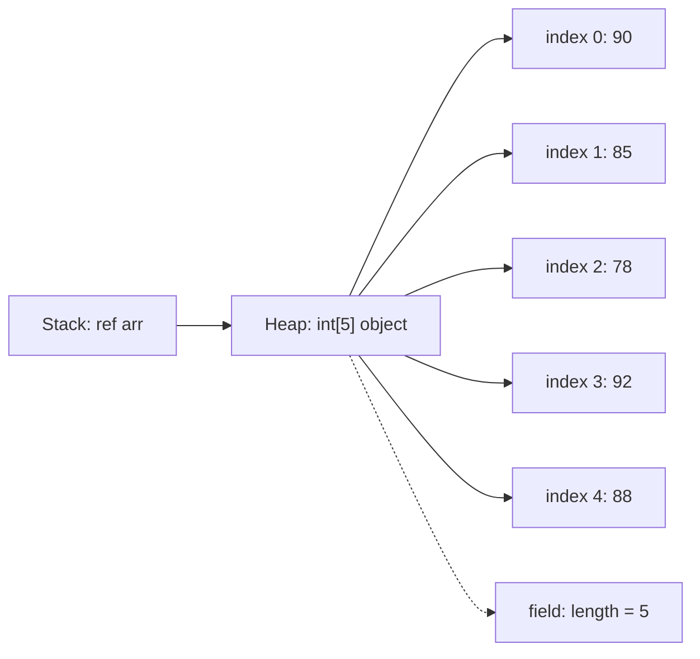
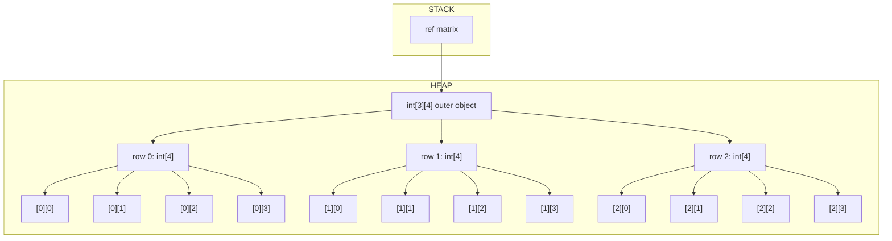
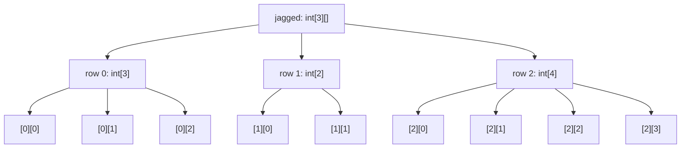
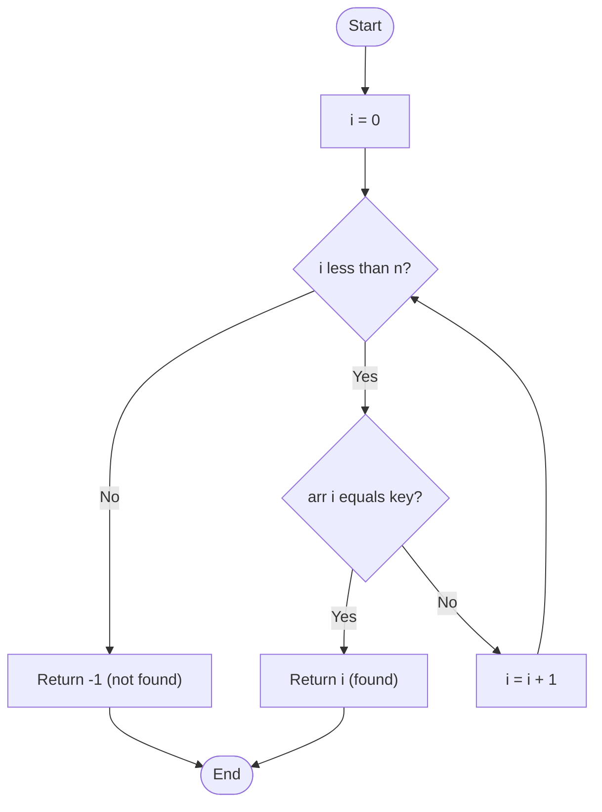
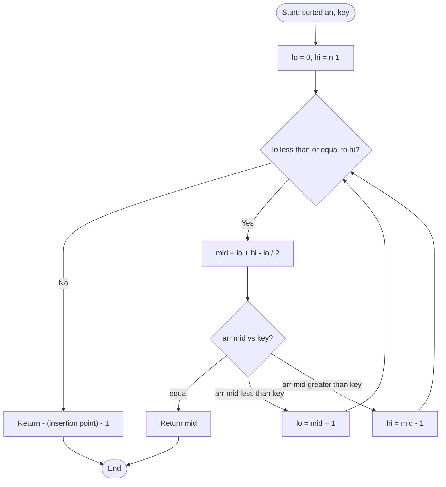
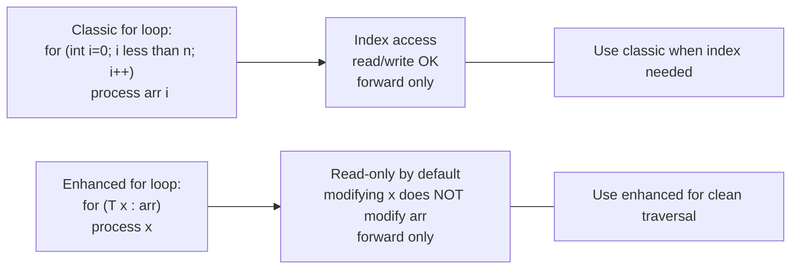
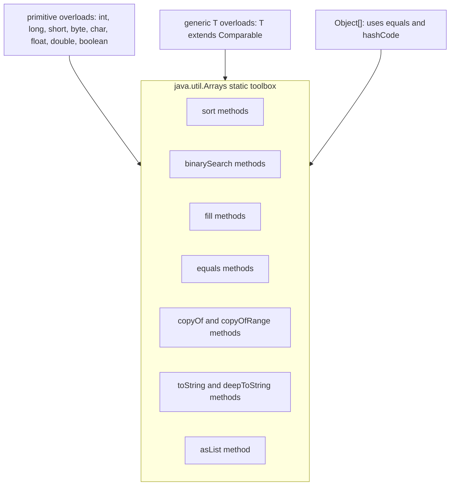

# Arrays

<!-- SECTION_1_START -->
# Arrays in Java — Core Technical Definition & Intuitive Overview

> [!NOTE]
> **KTU 2024 Syllabus Highlight (PBCST304 — Module 1)**
> Arrays are the foundational homogeneous, fixed-size, contiguous data structure in Java used to store multiple values of the **same primitive type** or **reference type** under a single variable name. They are *objects* on the heap and descend from `java.lang.Object`.

## Formal KTU Definition

An **array** in Java is a *container object* that holds a **fixed number of values of a single type**. The length of an array is established when the array is created, and after creation its length is **fixed** (immutable). Each item in an array is called an **element**, and each element is accessed by its numerical **index**, starting from `0` to `length - 1`.

```text
Syntax trio for a one-dimensional array:
  declaration   ->  int[] marks;
  instantiation ->  marks = new int[5];
  initialization->  int[] marks = {90, 85, 78, 92, 88};
```

> [!IMPORTANT]
> **KTU Board Terminology** — Memorize the precise phrase:
> *"In Java, an array is an object whose elements are stored in a contiguous block of memory and accessed via a zero-based integer index."*

## Conceptual Analogy / Intuition

Think of an array as a **row of lockers in a school corridor**:

| Locker Number | Index | Stored Item |
| :---: | :---: | :--- |
| Locker 1 | `0` | First value |
| Locker 2 | `1` | Second value |
| Locker 3 | `2` | Third value |
| ... | ... | ... |
| Locker N | `N-1` | Last value |

- The **locker corridor** is the *array object* on the heap.
- The **locker numbers** (1, 2, 3...) are the *indices* (starting at 0).
- All **lockers are identical in size and shape** — this is the *homogeneous* property.
- Once the corridor is **built, you cannot add more lockers** — this is the *fixed size* property.
- To fetch a book, you walk directly to locker number `k` — this is **$O(1)$ random access**.

## Why Arrays Matter in OOP

> [!TIP]
> Arrays form the **bridge between primitive data and object-oriented thinking**. In KTU Module 1, arrays are studied as Java objects (with `length` field, `clone()` method, and inheritance from `Object`) — *not* as raw C-style memory blocks. This is a frequent 3-mark question.

## Visualization Control (Index ↔ Address Mapping)

> [!VISUALIZATION CONTROL]
> **Concept:** Memory address calculation for an array element
> **Desmos / GeoGebra Input Equations:**
> * `Address(a[i]) = Base + i × size_of(element)`
> * Sample plot: `f(x) = 1000 + x * 4`  (for an `int[]` of 4-byte ints starting at memory 1000)
> **Visual Description:** A straight line where the x-axis is the *index* $i$ and the y-axis is the *byte address*. The slope is `4` (size of `int`). Students should observe that **every element is equidistant in memory** — this is what enables $O(1)$ lookup.

## Key Java Constants & Standard Metrics

- **Default values:** numeric → `0`, `boolean` → `false`, `Object` reference → `null` (Java auto-initializes).
- **Array size limit:** `Integer.MAX_VALUE - 8` (≈ 2.14 billion elements).
- **Indexing range:** `0` to `length - 1`.
- **Default field:** every Java array exposes a **public final** field `length` (note: **no parentheses** — it is a field, not a method).
<!-- SECTION_1_END -->

<!-- SECTION_2_START -->
# Deep Theoretical Analysis & KTU High-Yield Formula Sheet

## 1. Array Classification in Java

Arrays in Java are categorized into:

| Type | Declaration Syntax | Memory Shape | KTU Frequency |
| :--- | :--- | :--- | :---: |
| One-Dimensional | `int[] a;` | Linear strip | ★★★★★ |
| Two-Dimensional (Rectangular) | `int[][] a;` | Matrix (rows × cols) | ★★★★★ |
| Jagged (Ragged) | `int[][] a = new int[3][];` | Rows of varying length | ★★★★ |
| Multi-Dimensional (3D+) | `int[][][] a;` | Nested blocks | ★★★ |
| Anonymous Array | `new int[]{1,2,3}` (passed directly) | Inline object | ★★★ |

> [!IMPORTANT]
> **Anonymous arrays** are heavily tested in KTU 2-mark questions. They are created on-the-fly *without* a reference variable, commonly used to pass to methods like `Arrays.sort(new int[]{5,2,8})`.

## 2. Three Stages of Array Construction

Java intentionally **separates** the lifecycle of an array into three distinct stages. Confusing these is the #1 cause of `NullPointerException` and `ArrayIndexOutOfBoundsException` in KTU lab exams.

**Stage 1 — Declaration** (a *reference variable* is created on the stack)
```java
int[] marks;          // valid
int marks[];          // valid C-style (KTU accepts both)
int[5] marks;         // INVALID — Java forbids size in declaration
```

**Stage 2 — Instantiation** (memory is allocated on the heap; default values assigned)
```java
marks = new int[5];   // creates array of 5 ints, all 0
```

**Stage 3 — Initialization** (explicit values assigned)
```java
int[] marks = {90, 85, 78, 92, 88};
int[] copy = new int[]{90, 85, 78, 92, 88};   // anonymous-style
```

## 3. Enhanced `for` Loop (For-Each Loop)

Introduced in **Java 5 (J2SE 5.0)**, the enhanced for loop iterates *only forward* over arrays and Collections.

```java
int[] data = {10, 20, 30};
for (int x : data) {
    System.out.println(x);
}
```

> [!WARNING]
> **Common KTU Pitfall:** The loop variable `x` is a *copy* of the element. Modifying `x` does **NOT** modify the original array element. To modify in place, you must use the classic indexed `for` loop.

## 4. The `Arrays` Utility Class (`java.util.Arrays`)

This class is a **static-method toolbox** for array manipulation. KTU frequently asks code/output questions on these:

| Method | Purpose | Return |
| :--- | :--- | :--- |
| `Arrays.sort(a)` | Sorts ascending (Dual-Pivot Quicksort for primitives) | `void` |
| `Arrays.binarySearch(a, key)` | Binary search (array MUST be sorted) | `int` index |
| `Arrays.fill(a, val)` | Fills all elements with `val` | `void` |
| `Arrays.equals(a1, a2)` | Element-wise equality check | `boolean` |
| `Arrays.copyOf(a, len)` | Returns a new array of length `len` | `T[]` |
| `Arrays.copyOfRange(a, s, e)` | Copies range `[s, e)` | `T[]` |
| `Arrays.toString(a)` | String form like `[1, 2, 3]` | `String` |
| `Arrays.deepToString(a)` | For multi-dimensional arrays | `String` |
| `Arrays.asList(a)` | Wraps array as fixed-size `List` | `List<T>` |

## KTU Formula Sheet / Cheat Sheet

> [!IMPORTANT]
> **Master this table** — these formulas/values appear in 70% of KTU numerical/short-answer questions on arrays.

| Concept | Formula / Rule | Unit / Note |
| :--- | :--- | :--- |
| Valid index range | $0 \le i \le (n - 1)$ | where $n = \text{length}$ |
| Address of $a[i]$ | $\text{Base} + i \times s$ | $s$ = size of element type (bytes) |
| Total memory | $n \times s + \text{header}$ | Header ≈ 12–16 bytes |
| Linear search comparisons (worst) | $n$ | $O(n)$ |
| Binary search comparisons (worst) | $\lfloor \log_2 n \rfloor + 1$ | $O(\log n)$ — requires sorted array |
| Bubble sort passes | $n - 1$ | $O(n^2)$ |
| Default value (int, long, short, byte, double, float) | $0$ or $0.0$ | Auto-initialized |
| Default value (`char`) | `'\u0000'` | Null character |
| Default value (`boolean`) | `false` | — |
| Default value (Object ref) | `null` | — |
| 2D array memory | $\text{rows} \times \text{cols} \times s$ | Jagged may differ per row |
| `ArrayIndexOutOfBoundsException` trigger | $\text{index} < 0 \;\vert\; \text{index} \ge n$ | Runtime exception |
| `NullPointerException` trigger | Accessing `null` array | Runtime exception |
| `ArrayStoreException` trigger | Storing wrong type in `Object[]` | Runtime exception |
| `Clone` is shallow | Nested arrays share references | Use deep copy manually |

## 6. Real-World Engineering Utility

| Domain | Use of Arrays |
| :--- | :--- |
| Image Processing | Pixel buffers (`int[][]`) |
| Signal Processing | Sample arrays (DSP filters, FFT) |
| Game Dev | Tile maps, sprite tables, leaderboards |
| Database Internals | B-tree node storage, hash buckets |
| Compilers | Symbol tables, instruction streams |
| Machine Learning | Tensor representations (before Tensor objects) |
| Embedded Systems | Sensor sample rings (fixed-size buffers) |
<!-- SECTION_2_END -->

<!-- SECTION_3_START -->
# Step-by-Step Derivations & Code Implementation

## A. Exhaustive Derivation — Address Calculation

> **Problem (KTU-style 7-mark):** Given an `int[] arr` of size 10 starting at memory address `2000`, find the address of `arr[4]`. Assume each `int` occupies 4 bytes.

**Step 1 — Identify the formula.**

$$
\text{Address}(a[i]) = \text{Base Address} + (i \times s)
$$

where $s$ is the size of the data type in bytes.

**Step 2 — Substitute known values.**

$$
\text{Base Address} = 2000, \quad i = 4, \quad s = 4 \text{ bytes (size of int)}
$$

$$
\text{Address}(a[4]) = 2000 + (4 \times 4)
$$

**Step 3 — Evaluate.**

$$
\text{Address}(a[4]) = 2000 + 16 = 2016
$$

**Step 4 — Validation check.**

$$
\text{Final answer: } \boxed{2016 \text{ bytes}}
$$

**Cross-check:** `arr[0] = 2000`, `arr[1] = 2004`, `arr[2] = 2008`, `arr[3] = 2012`, `arr[4] = 2016` ✓

---

## B. Exhaustive Derivation — Binary Search Iterations

> **Problem:** For an array of $n = 1024$ sorted elements, how many comparisons in the *worst case* does binary search need?

**Step 1 — Apply the closed form.**

$$
T(n) = \lfloor \log_2 n \rfloor + 1
$$

**Step 2 — Substitute.**

$$
T(1024) = \lfloor \log_2 1024 \rfloor + 1
$$

**Step 3 — Evaluate the log.**

$$
\log_2 1024 = \log_2 2^{10} = 10
$$

**Step 4 — Final answer.**

$$
T(1024) = 10 + 1 = \boxed{11 \text{ comparisons}}
$$

> [!TIP]
> **KTU Insight:** For 1 million elements, binary search needs at most **20** comparisons. That is why `Arrays.binarySearch` is preferred over linear search.

---

## C. Complete, Production-Quality Java Implementations

### Program 1 — Sum, Average, Min, Max of an Array

```java
import java.util.Scanner;

public class ArrayStats {
    public static void main(String[] args) {
        Scanner sc = new Scanner(System.in);

        // Stage 1: Declaration + Stage 2: Instantiation
        int[] numbers = new int[5];
        int sum = 0;

        // Input loop with absolute boundary check
        System.out.println("Enter 5 integers:");
        for (int i = 0; i < numbers.length; i++) {
            if (!sc.hasNextInt()) {
                System.err.println("Invalid input at index " + i);
                return;
            }
            numbers[i] = sc.nextInt();
            sum += numbers[i];
        }

        // Compute min and max
        int min = numbers[0];
        int max = numbers[0];
        for (int i = 1; i < numbers.length; i++) {
            if (numbers[i] < min) min = numbers[i];
            if (numbers[i] > max) max = numbers[i];
        }

        // Output
        double average = (double) sum / numbers.length;
        System.out.println("Sum     = " + sum);
        System.out.println("Average = " + average);
        System.out.println("Min     = " + min);
        System.out.println("Max     = " + max);

        sc.close();
    }
}
```

### Program 2 — Linear Search with Detailed Tracing

```java
public class LinearSearch {
    /**
     * Searches for key in arr using linear search.
     * @param arr the array to search
     * @param key the value to find
     * @return index of key, or -1 if not found
     */
    public static int linearSearch(int[] arr, int key) {
        if (arr == null) {
            throw new IllegalArgumentException("Array cannot be null");
        }
        for (int i = 0; i < arr.length; i++) {
            System.out.println("Comparing key=" + key + " with arr[" + i + "]=" + arr[i]);
            if (arr[i] == key) {
                return i;     // found
            }
        }
        return -1;            // not found
    }

    public static void main(String[] args) {
        int[] data = {45, 12, 89, 33, 67, 12};
        int result = linearSearch(data, 33);
        if (result == -1) {
            System.out.println("Element not present in array.");
        } else {
            System.out.println("Element found at index: " + result);
        }
    }
}
```

### Program 3 — Bubble Sort (ascending order)

```java
public class BubbleSort {
    public static void bubbleSort(int[] arr) {
        if (arr == null) return;
        int n = arr.length;
        // Outer loop: n-1 passes
        for (int i = 0; i < n - 1; i++) {
            boolean swapped = false;
            // Inner loop: shrinking boundary
            for (int j = 0; j < n - 1 - i; j++) {
                if (arr[j] > arr[j + 1]) {
                    // swap
                    int temp = arr[j];
                    arr[j] = arr[j + 1];
                    arr[j + 1] = temp;
                    swapped = true;
                }
            }
            // Early exit optimization
            if (!swapped) break;
        }
    }

    public static void main(String[] args) {
        int[] arr = {64, 34, 25, 12, 22, 11, 90};
        System.out.print("Original: ");
        printArray(arr);

        bubbleSort(arr);

        System.out.print("Sorted:   ");
        printArray(arr);
    }

    private static void printArray(int[] arr) {
        for (int v : arr) System.out.print(v + " ");
        System.out.println();
    }
}
```

### Program 4 — Two-Dimensional Array (Matrix Addition)

```java
import java.util.Scanner;

public class MatrixAddition {
    public static void main(String[] args) {
        Scanner sc = new Scanner(System.in);

        System.out.print("Enter rows and columns: ");
        int r = sc.nextInt();
        int c = sc.nextInt();

        int[][] A = new int[r][c];
        int[][] B = new int[r][c];
        int[][] C = new int[r][c];   // result

        System.out.println("Enter matrix A:");
        readMatrix(A, sc);
        System.out.println("Enter matrix B:");
        readMatrix(B, sc);

        // Add element-wise
        for (int i = 0; i < r; i++) {
            for (int j = 0; j < c; j++) {
                C[i][j] = A[i][j] + B[i][j];
            }
        }

        System.out.println("Resultant Matrix C = A + B:");
        printMatrix(C);
        sc.close();
    }

    private static void readMatrix(int[][] m, Scanner sc) {
        for (int i = 0; i < m.length; i++) {
            for (int j = 0; j < m[0].length; j++) {
                m[i][j] = sc.nextInt();
            }
        }
    }

    private static void printMatrix(int[][] m) {
        for (int[] row : m) {
            for (int val : row) {
                System.out.printf("%5d", val);
            }
            System.out.println();
        }
    }
}
```

### Program 5 — Jagged Array with Variable Row Lengths

```java
public class JaggedArrayDemo {
    public static void main(String[] args) {
        // Stage 1 + Stage 2: each row is a separate array
        int[][] jagged = new int[3][];
        jagged[0] = new int[]{1, 2, 3};
        jagged[1] = new int[]{4, 5};
        jagged[2] = new int[]{6, 7, 8, 9};

        System.out.println("Jagged Array contents:");
        for (int i = 0; i < jagged.length; i++) {
            System.out.print("Row " + i + " (length " + jagged[i].length + "): ");
            for (int j = 0; j < jagged[i].length; j++) {
                System.out.print(jagged[i][j] + " ");
            }
            System.out.println();
        }
    }
}
```

### Program 6 — Passing and Returning Arrays to/from Methods

```java
import java.util.Arrays;

public class ArrayMethodsDemo {

    // Method RECEIVING an array
    public static double average(int[] arr) {
        if (arr == null || arr.length == 0) return 0.0;
        long sum = 0;   // long prevents overflow
        for (int v : arr) sum += v;
        return (double) sum / arr.length;
    }

    // Method RETURNING a new array (reversed copy)
    public static int[] reverse(int[] arr) {
        if (arr == null) return null;
        int[] rev = new int[arr.length];
        for (int i = 0; i < arr.length; i++) {
            rev[i] = arr[arr.length - 1 - i];
        }
        return rev;
    }

    public static void main(String[] args) {
        int[] data = {10, 20, 30, 40, 50};

        System.out.println("Original : " + Arrays.toString(data));
        System.out.println("Average  : " + average(data));

        int[] rev = reverse(data);
        System.out.println("Reversed : " + Arrays.toString(rev));

        // Anonymous array passed directly
        System.out.println("Avg(anonym) : " + average(new int[]{5, 10, 15}));
    }
}
```

### Program 7 — Using `Arrays.sort()` + `Arrays.binarySearch()`

```java
import java.util.Arrays;

public class ArraysUtilityDemo {
    public static void main(String[] args) {
        int[] arr = {50, 20, 40, 10, 30};

        Arrays.sort(arr);                             // ascending sort
        System.out.println("Sorted: " + Arrays.toString(arr));

        int idx = Arrays.binarySearch(arr, 30);       // search
        System.out.println("Index of 30 = " + idx);

        int[] copy = Arrays.copyOf(arr, 7);           // grow with zeros
        System.out.println("Copy grown: " + Arrays.toString(copy));

        Arrays.fill(copy, 3, 6, -1);                  // fill range [3, 6)
        System.out.println("After fill: " + Arrays.toString(copy));
    }
}
```

---

## D. Trace Table — Bubble Sort Pass-by-Pass

For input `{5, 1, 4, 2, 8}`:

| Pass | Inner Comparisons | Array State After Pass | Swapped? |
| :---: | :---: | :--- | :---: |
| 1 | 4 | `{1, 4, 2, 5, 8}` | Yes |
| 2 | 3 | `{1, 2, 4, 5, 8}` | Yes |
| 3 | 2 | `{1, 2, 4, 5, 8}` | Yes |
| 4 | 1 | `{1, 2, 4, 5, 8}` | No (early exit) |

> [!TIP]
> **KTU Examiner Tip:** When asked for total comparisons in the *worst case*, the answer is:
> $$
> (n-1) + (n-2) + \dots + 1 = \frac{n(n-1)}{2}
> $$
> For $n = 5$, this equals $\frac{5 \times 4}{2} = 10$ comparisons.
<!-- SECTION_3_END -->

<!-- SECTION_4_START -->
# Structural Diagrams & Schematics

## Diagram 1 — Array Memory Layout (One-Dimensional)



**Interpretation:** The `arr` reference on the stack points to a heap object containing 5 contiguous integer slots and a public final `length` field.

---

## Diagram 2 — Two-Dimensional Array (Rectangular) Memory Topology



**Key insight:** A 2D array in Java is an *array of arrays*. The outer array holds references to inner row-arrays.

---

## Diagram 3 — Jagged Array Structure



> [!NOTE]
> Each row is an **independent** `int[]` object — that is why we can have rows of different lengths. This is unique to Java; C/C++ would use pointer gymnastics for the same effect.

---

## Diagram 4 — Sequential Processing Topology: Linear Search



**Complexity:** Time $O(n)$, Space $O(1)$.

---

## Diagram 5 — Sequential Processing Topology: Binary Search



**Complexity:** Time $O(\log n)$, Space $O(1)$.

---

## Diagram 6 — `for` vs Enhanced `for` Loop Flow



---

## Diagram 7 — Block-Level Architecture of `Arrays` Utility Class


<!-- SECTION_4_END -->

<!-- SECTION_5_START -->
# KTU 2024 Scheme Examination Question Bank & Topic Recap

> [!NOTE]
> **Mark Distribution as per KTU 2024 Scheme (PBCST304):**
> - **Part A:** 3-mark short-answer (2 questions from this topic per exam).
> - **Part B:** 14-mark long-answer with **module-internal choice** (one full question from this topic, two sub-parts of 7 marks each).

---

## Part A — Short Answer Questions (3 Marks Each)

### Q1. [KTU University Exam – July 2024]
**Explain the difference between `int[] a; int a[];` and `int[5] a;` in Java. Why is the last form illegal?**

**Model Answer (3 marks):**
- `int[] a;` and `int a[];` are both **legal declaration styles** in Java. The first is the **preferred Java style**, the second is the **C-style syntax** retained for familiarity. Both only create a *reference variable* on the stack — no memory is allocated yet. **[1 mark]**
- `int[5] a;` is **illegal** because Java does **not allow specifying the size of an array in the declaration** statement. The size is provided only during *instantiation* using the `new` keyword: `a = new int[5];`. **[2 marks]**

### Q2. [KTU University Exam – Dec 2023]
**What is the difference between `length` and `length()` when used with arrays and Strings? Give one example each.**

**Model Answer (3 marks):**
- For an array, the property is a **public final field** called `length` — accessed **without parentheses** because it is a field, not a method. Example: `int n = arr.length;` **[1.5 marks]**
- For a `String`, the property is a **method** called `length()` — accessed **with parentheses** because it is a method. Example: `int n = str.length();` **[1.5 marks]**
- *Memory tip:* Arrays are primitive-like data structures with field access; Strings are full objects with method access.

---

## Part B — Long Answer Questions (14 Marks Each, Internal Choice)

### Question A — 14 Marks [KTU University Exam – July 2024]

#### (a) [7 Marks — Understand Level]
**Write a Java program that reads `n` integers into a one-dimensional array and performs the following operations:**
1. Finds the **sum** of all elements.
2. Counts how many elements are **even** and how many are **odd**.
3. Reverses the array **in place** (without using a second array).

**(i) Sum calculation [2 marks]**
**(ii) Even/odd counting with loop [2 marks]**
**(iii) In-place reversal logic with swap [3 marks]**

**Model Solution:**

```java
import java.util.Scanner;

public class ArrayOperations {
    public static void main(String[] args) {
        Scanner sc = new Scanner(System.in);

        System.out.print("Enter n: ");
        int n = sc.nextInt();

        if (n <= 0) {
            System.err.println("Size must be positive.");
            return;
        }

        int[] arr = new int[n];
        System.out.println("Enter " + n + " integers:");
        for (int i = 0; i < n; i++) {
            arr[i] = sc.nextInt();
        }

        // (i) Sum
        int sum = 0;
        for (int v : arr) sum += v;
        System.out.println("Sum = " + sum);

        // (ii) Even/Odd count
        int even = 0, odd = 0;
        for (int v : arr) {
            if (v % 2 == 0) even++;
            else             odd++;
        }
        System.out.println("Even count = " + even);
        System.out.println("Odd count  = " + odd);

        // (iii) In-place reverse
        int i = 0, j = n - 1;
        while (i < j) {
            int temp  = arr[i];
            arr[i]    = arr[j];
            arr[j]    = temp;
            i++;
            j--;
        }
        System.out.print("Reversed: ");
        for (int v : arr) System.out.print(v + " ");
        System.out.println();

        sc.close();
    }
}
```

**Valuation Key:**
- [Initializing sum to 0 and using enhanced for: 1 mark]
- [Even/odd using `% 2 == 0` correctly: 1 mark]
- [In-place two-pointer swap: 2 marks]
- [Correct output and code compilation: 1 mark]

#### (b) [7 Marks — Apply Level]
**Modify the above program to use a method `processArray(int[] arr)` that returns a new array containing only the even elements from the original array. Demonstrate passing the array and returning the new array.**

**Model Solution:**

```java
import java.util.Arrays;

public class EvenArrayExtractor {

    // Returns a new array containing only the even elements of arr
    public static int[] processArray(int[] arr) {
        if (arr == null) return new int[0];

        // Count evens first to size the result array exactly
        int count = 0;
        for (int v : arr) {
            if (v % 2 == 0) count++;
        }

        int[] result = new int[count];
        int idx = 0;
        for (int v : arr) {
            if (v % 2 == 0) {
                result[idx++] = v;
            }
        }
        return result;
    }

    public static void main(String[] args) {
        int[] original = {10, 15, 20, 25, 30, 35, 40};
        int[] evens    = processArray(original);

        System.out.println("Original: " + Arrays.toString(original));
        System.out.println("Evens:    " + Arrays.toString(evens));
    }
}
```

**Valuation Key:**
- [Correct method signature with `int[]` parameter and return type: 1 mark]
- [Two-pass approach (count then populate) explained: 2 marks]
- [Correct use of index variable: 1 mark]
- [Passing the array in main and printing result: 2 marks]
- [Output correctness / final result: 1 mark]

---

### Question B — 14 Marks (Alternative Choice) [KTU University Exam – Dec 2023]

#### (a) [7 Marks — Understand Level]
**Explain the concept of a two-dimensional array in Java with a suitable diagram. Differentiate between rectangular and jagged arrays with examples.**

**Model Answer:**

A **two-dimensional array** in Java is essentially an *array of arrays* — the outer array holds references to inner one-dimensional arrays, each of which can be independently sized.

```java
// Rectangular (matrix) — every row has the same length
int[][] rect = new int[3][4];         // 3 rows, 4 columns

// Jagged (ragged) — each row may have a different length
int[][] jagged = new int[3][];
jagged[0] = new int[]{1, 2, 3};
jagged[1] = new int[]{4, 5};
jagged[2] = new int[]{6, 7, 8, 9};
```

**Comparison Table [4 marks]:**

| Feature | Rectangular 2D Array | Jagged Array |
| :--- | :--- | :--- |
| Memory shape | Uniform matrix | Variable row lengths |
| Declaration | `int[][] a = new int[r][c];` | `int[][] a = new int[r][];` then each row sized |
| Memory wastage | Possible (e.g., trailing zeros) | None — exact fit |
| Use case | Matrix math, image grids | Sparse data, varying row sizes |
| Iteration | `arr.length` (rows), `arr[i].length` (cols) | Same — `arr[i].length` varies |
| KTU common use | Matrix addition, transpose | Student records, variable-length lists |

**Diagram [3 marks]:**

```
Rectangular int[3][4]:
  [0][0] [0][1] [0][2] [0][3]
  [1][0] [1][1] [1][2] [1][3]
  [2][0] [2][1] [2][2] [2][3]

Jagged int[3][]:
  [0] -> {1, 2, 3}
  [1] -> {4, 5}
  [2] -> {6, 7, 8, 9}
```

#### (b) [7 Marks — Apply Level]
**Write a Java program to add two 3×3 matrices and display the result. Use nested `for` loops and the `Arrays.deepToString()` method for output.**

**Model Solution:**

```java
import java.util.Arrays;
import java.util.Scanner;

public class Matrix3x3Addition {
    public static void main(String[] args) {
        Scanner sc = new Scanner(System.in);
        int[][] A = new int[3][3];
        int[][] B = new int[3][3];
        int[][] C = new int[3][3];

        System.out.println("Enter 9 elements of Matrix A (row-wise):");
        for (int i = 0; i < 3; i++)
            for (int j = 0; j < 3; j++)
                A[i][j] = sc.nextInt();

        System.out.println("Enter 9 elements of Matrix B (row-wise):");
        for (int i = 0; i < 3; i++)
            for (int j = 0; j < 3; j++)
                B[i][j] = sc.nextInt();

        // Add A and B
        for (int i = 0; i < 3; i++)
            for (int j = 0; j < 3; j++)
                C[i][j] = A[i][j] + B[i][j];

        System.out.println("Matrix A = " + Arrays.deepToString(A));
        System.out.println("Matrix B = " + Arrays.deepToString(B));
        System.out.println("Matrix C = A + B = " + Arrays.deepToString(C));

        sc.close();
    }
}
```

**Valuation Key:**
- [Correct array declaration and instantiation: 1 mark]
- [Input reading with nested loops and correct bounds: 1 mark]
- [Addition logic with correct indexing: 1 mark]
- [Use of `deepToString` (not `toString`) for 2D arrays: 2 marks]
- [Output formatting and final correctness: 2 marks]

---

> [!WARNING]
> **KTU Examiner's Valuation Warning — Common Pitfalls for Arrays**
> 1. **Never use `toString()` for 2D arrays** — it prints `[Ljava.lang.String;@1540e19d` gibberish. Always use `Arrays.deepToString()` for multi-dimensional arrays. *[-2 marks]*
> 2. **Do not specify size in declaration** — `int[5] arr;` is a compilation error. Use `int[] arr = new int[5];`. *[-1 mark]*
> 3. **Index out-of-bounds** — using `<= n` instead of `< n` in loops causes `ArrayIndexOutOfBoundsException` at runtime. *[-1 mark]*
> 4. **For-each modification is invisible** — students often write `for (int x : arr) x = 0;` expecting to clear the array. It does not work; use indexed loop or `Arrays.fill(arr, 0)`. *[-2 marks]*
> 5. **Confusing `length` (array field) with `length()` (String method)** — forgetting the parentheses for `String.length()` is a common compilation error. *[-1 mark]*
> 6. **Forgetting that `Arrays.binarySearch` requires a sorted array** — unsorted input returns garbage indices or negative values. *[-1 mark]*
> 7. **Not checking for `null` array** in user-defined methods — a `NullPointerException` on a single test case can wipe out 2–3 marks.

---

## Topic Recap & Important Things to Remember

> [!TIP]
> **Final rapid-revision checklist — read this 30 minutes before the exam.**

- **Definition:** An array in Java is a *fixed-size, homogeneous, contiguous-memory container object* indexed from `0` to `length - 1`.
- **Three stages:** Declaration → Instantiation (`new`) → Initialization (values).
- **Anonymous array:** `new int[]{1,2,3}` — used to pass an array literal directly to a method.
- **`length` is a field, not a method** — `arr.length` (no parentheses); `str.length()` (with parentheses for String).
- **Default values:** `0`, `0.0`, `false`, `'\u0000'`, `null` — Java auto-initializes array slots.
- **Enhanced for loop:** reads only; cannot modify the original array's elements via the loop variable.
- **2D array is array of arrays:** rows can be of unequal length (jagged).
- **Address formula:** $\text{Address}(a[i]) = \text{Base} + i \times s$ where $s$ = size of element type.
- **Search complexities:** Linear $O(n)$, Binary $O(\log n)$ — but **binary needs a sorted array**.
- **Sort complexities:** Bubble $O(n^2)$, `Arrays.sort()` uses Dual-Pivot Quicksort for primitives ($O(n \log n)$) and Timsort for objects.
- **Common `Arrays` methods:** `sort`, `binarySearch`, `fill`, `equals`, `copyOf`, `copyOfRange`, `toString`, `deepToString`, `asList`.
- **Exceptions to remember:** `ArrayIndexOutOfBoundsException`, `NullPointerException`, `ArrayStoreException`, `NegativeArraySizeException`.
- **Memory tip for viva:** Draw the stack-vs-heap picture showing the reference variable on stack and the actual array object on heap.
- **In-place algorithms save memory:** bubble sort, in-place reverse (two-pointer), selection sort — all use $O(1)$ extra space.
- **Quick distinguishers for 3-mark questions:**
  * Array vs ArrayList → size fixed vs dynamic.
  * `length` vs `length()` → array field vs String method.
  * `toString()` vs `deepToString()` → 1D vs multi-dimensional.
  * `equals()` vs `==` on arrays → content vs reference.
- **Coding rule of thumb:** Always validate `n > 0` before allocating, always loop `i < n` (not `<=`), always check for `null` in utility methods.
<!-- SECTION_5_END -->
