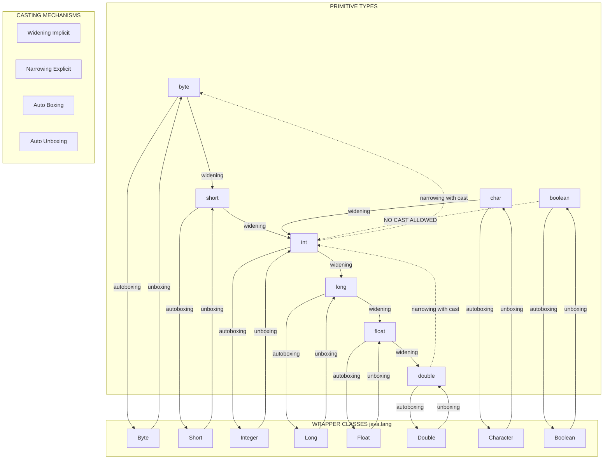
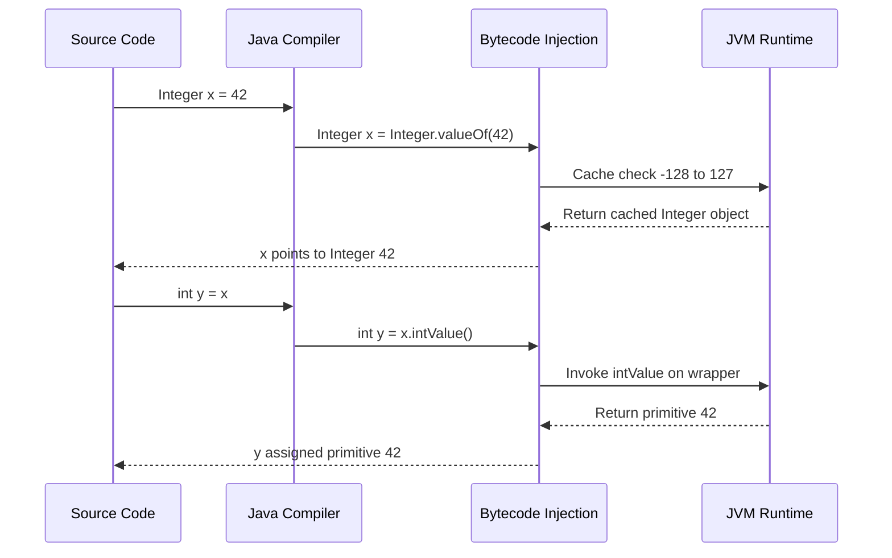
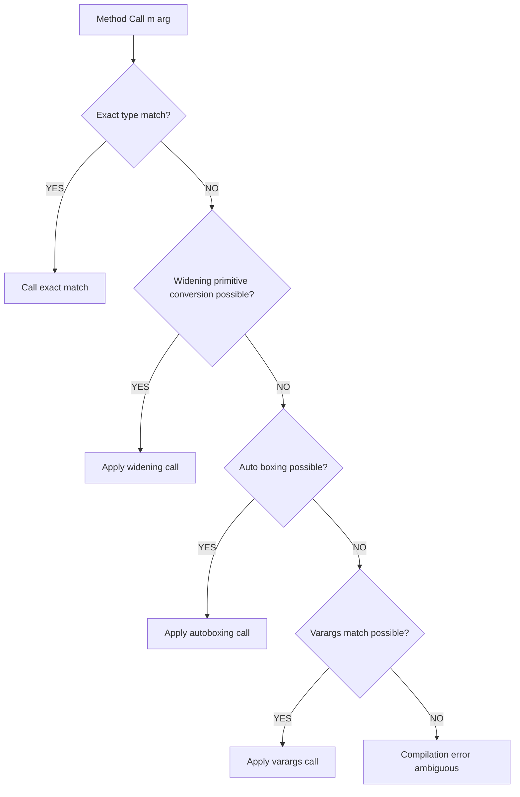

# Casting and Autoboxing

<!-- SECTION_1_START -->

# 1. Core Technical Definition & Intuitive Overview

## 1.1 Casting in Java — Formal Definition

**Type Casting** in Java is the explicit or implicit process of converting a value of one primitive data type into another data type, or converting a reference of one class type into another compatible class type. Java is a **strongly typed** language, so every variable and expression has a strictly declared type, and the compiler enforces type compatibility rules at compile time.

> [!IMPORTANT]
> **KTU 2024 Syllabus Definition (PBCST304 — Module 1):**
> *Casting* is the mechanism used to convert between compatible primitive types (numeric promotions) and between related object types (object casting). Java supports two fundamental casting strategies: **Widening (Implicit / Automatic) Conversion** and **Narrowing (Explicit) Conversion**.

> [!NOTE]
> **KTU 2024 Highlight:**
> As per the revised Bloom's Taxonomy expectations in the 2024 scheme, students must be able to **distinguish** between primitive casting and wrapper class conversion, and **apply** autoboxing/unboxing in real Java code — a frequently tested concept in both Part A (3 marks) and Part B (14 marks) questions.

---

## 1.2 Conceptual Analogy / Intuition

Imagine you have a **large transparent jar (a `double`)** filled with water (a numeric value with decimal precision). Now you have a **small cup (an `int`)**.

- **Widening (Implicit Casting):** Pouring water from the **small cup into the large jar** is easy, safe, and automatic. No information is lost because the jar is bigger. This is *Widening Conversion*.

- **Narrowing (Explicit Casting):** Pouring water from the **large jar into the small cup** is risky — water will spill! Java forces you to **explicitly confirm** this conversion by writing a cast operator `(int)`. The fractional part is *truncated* (not rounded) — that is the "spilled" water.

- **Autoboxing:** Think of a **gift box (wrapper object)** that automatically wraps a **raw item (primitive)** when handed over to a method that only accepts boxes (e.g., `ArrayList<Integer>`). The wrapping happens **behind the scenes** by the compiler.

- **Unboxing:** The reverse — Java **unwraps** the box automatically to retrieve the primitive when arithmetic or assignment to a primitive variable is required.

> [!TIP]
> **Memory Trick for KTU Exams:**
> - **Widening** = *Wider* container, *Zero* effort, *No* data loss.
> - **Narrowing** = *Narrower* container, *Explicit* `(type)` operator, *Possible* data loss.

---

## 1.3 Standard Hierarchy of Widening Conversions

Java's primitive widening follows a strict, well-defined order — this is a guaranteed KTU exam favorite:

```
byte  →  short  →  int  →  long  →  float  →  double
```

`char` is widened separately to `int`, `long`, `float`, `double` (but **not** to `byte` or `short`).

> [!NOTE]
> **Physical Constants to Remember (in bold):**
> - Java's primitive casting is governed by the **Java Language Specification (JLS) §5.1** for widening and **§5.2** for narrowing.
> - The **default integer literal type** is **`int`** and the **default floating-point literal type** is **`double`**.
> - **No casting is permitted** between `boolean` and any numeric type.

---

> [!VISUALIZATION CONTROL]
> **Concept:** Numeric Type-Promotion Ladder (Widening Path)
> **Conceptual Plot / Axis Description:**
> Imagine a horizontal X-axis representing the **memory size (in bytes)**. Each primitive type sits on this axis:
> * `byte` at 1 byte → `short` at 2 bytes → `int` at 4 bytes → `long` at 8 bytes → `float` at 4 bytes (but wider range) → `double` at 8 bytes (widest range).
> * Arrows flow strictly **left-to-right** for safe implicit conversion; any **right-to-left** arrow is an explicit (narrowing) cast and must carry a `(!)` warning symbol.
> **Visual Description:** Students should observe that the ladder is **linear and unidirectional** for implicit conversion. A reverse jump always carries the risk of *truncation* (for integers) or *precision loss* (for floating-point to integer).

---

<!-- SECTION_1_END -->

<!-- SECTION_2_START -->

# 2. Deep Theoretical Analysis & KTU High-Yield Formula Sheet

## 2.1 The Two Pillars of Type Casting

### 2.1.1 Widening Primitive Conversion (Implicit / Automatic)

- Performed **automatically by the compiler** when a smaller type is assigned to a larger type.
- **No data loss** and **no precision loss** occurs.
- Used in assignments, method calls, and arithmetic expressions (binary numeric promotion).

### 2.1.2 Narrowing Primitive Conversion (Explicit / Manual)

- Requires an **explicit cast operator** of the form `(targetType)`.
- **May result in data loss** (truncation of integer bits, or loss of fractional precision).
- Used when a larger type must be stored in a smaller type, or when the programmer knowingly accepts truncation.

### 2.1.3 Binary Numeric Promotion Rules

When an operator (like `+`, `-`, `*`, `/`) is applied to two operands of different types, Java applies the following rules **in order**:

1. If either operand is `double`, the other is promoted to `double`.
2. Else, if either operand is `float`, the other is promoted to `float`.
3. Else, if either operand is `long`, the other is promoted to `long`.
4. Else, both operands are promoted to `int`.

> [!IMPORTANT]
> **Critical KTU Insight:** Even `byte + byte` produces an `int` result! This is the most common source of compilation errors for beginners.

---

## 2.2 Autoboxing and Unboxing — The Wrapper Class Bridge

### 2.2.1 What is Autoboxing?

**Autoboxing** is the **automatic conversion** performed by the Java compiler between a primitive type and its corresponding **wrapper class object**. It was introduced in **Java 5 (J2SE 5.0)** to eliminate the tedious manual boxing of primitives.

### 2.2.2 What is Unboxing?

**Unboxing** is the reverse process: the automatic extraction of a primitive value from its wrapper object when the context requires a primitive (e.g., arithmetic, assignment to a primitive, method parameter).

### 2.2.3 The Eight Primitive–Wrapper Pairs

Every primitive type has a corresponding immutable wrapper class located in the `java.lang` package (auto-imported):

| Primitive Type | Wrapper Class   | Constructor Argument    |
| :---           | :---            | :---                    |
| `boolean`      | `Boolean`       | `boolean` or `String`   |
| `byte`         | `Byte`          | `byte`                  |
| `char`         | `Character`     | `char`                  |
| `short`        | `Short`         | `short`                 |
| `int`          | `Integer`       | `int` or `String`       |
| `long`         | `Long`          | `long` or `String`      |
| `float`        | `Float`         | `float`, `double`, or `String` |
| `double`       | `Double`        | `double` or `String`    |

> [!NOTE]
> **Exam Pitfall — Numerics Only:** Only the numeric wrappers (`Byte`, `Short`, `Integer`, `Long`, `Float`, `Double`) accept `String` in their constructors. `Character` and `Boolean` do **not** accept `String` in modern Java (except `Boolean` historically).

---

## 2.3 KTU High-Yield Formula / Cheat Sheet

| Concept                  | Syntax / Rule                                                                | Risk / Behavior                       | Exam Frequency |
| :---                     | :---                                                                         | :---                                  | :---           |
| Widening (Implicit)      | `large = small;` *(e.g., `int` → `long`)*                                    | **Safe** — no data loss               | ★★★★★          |
| Narrowing (Explicit)     | `small = (smallType) large;` *(e.g., `(int) 3.99`)*                          | **Truncation** toward zero (not round)| ★★★★★          |
| Autoboxing               | `Integer i = 25;` *(compiler inserts `Integer.valueOf(25)`)*                | Caches values from **−128 to 127**    | ★★★★☆          |
| Unboxing                 | `int n = i;` *(compiler inserts `i.intValue()`)*                             | `NullPointerException` if `i == null` | ★★★★☆          |
| Binary Numeric Promotion | Smaller operand promoted to larger type in mixed expressions                 | `byte + byte → int`                   | ★★★★★          |
| Constant Folding         | `byte b = 10;` is allowed because `10` is a compile-time `int` constant in range| Compile-time check                  | ★★★☆☆          |
| `boolean` Casting        | **Illegal** — `boolean` cannot be cast to/from any numeric type              | Compile-time error                    | ★★★☆☆          |
| Wrapper Cache Range      | `Integer.valueOf(n)` returns cached object for `−128 ≤ n ≤ 127`              | Affects `==` comparisons              | ★★★★★          |
| `Character` Range        | `char` is **unsigned 16-bit** (0 to 65535)                                   | `char + char` promotes to `int`       | ★★★☆☆          |
| `String` Conversion      | `Integer.parseInt("123")` vs `Integer.valueOf("123")`                        | `parseInt` returns primitive          | ★★★☆☆          |

---

## 2.4 Real-World Engineering Utility

| Domain                            | Use Case                                                                              |
| :---                              | :---                                                                                  |
| **Collections Framework**         | `ArrayList<Integer>` cannot store raw `int` — autoboxing bridges primitive and generic collection worlds. |
| **Database / JDBC**               | Methods like `PreparedStatement.setObject(int, Object)` require boxed values.         |
| **Reflection API**                | `Method.invoke()` requires `Object[]` arguments — autoboxing handles primitive-to-Object. |
| **JSON / Serialization (Gson, Jackson)** | Auto-boxes primitives to serialize/deserialize JSON fields.                     |
| **Generics**                      | Java generics support only reference types, not primitives — autoboxing is mandatory.  |
| **BigDecimal / BigInteger Math**  | Wrappers enable arbitrary-precision arithmetic by bridging primitives to objects.     |

> [!TIP]
> **Production Engineering Insight:** A famous performance pitfall in high-throughput systems is **autoboxing inside tight loops**. Each boxed value allocates heap memory. Modern JVMs mitigate this with the **Integer Cache** for small values (default range `-128` to `127`).

---

<!-- SECTION_2_END -->

<!-- SECTION_3_START -->

# 3. Step-by-Step Derivations & Code Implementation

## 3.1 Exhaustive Casting Examples with Step-by-Step Trace

### 3.1.1 Widening (Implicit) — Safe Conversion

```java
public class WideningDemo {
    public static void main(String[] args) {
        int     iVal = 100;
        long    lVal = iVal;        // int  -> long   (implicit, safe)
        float   fVal = lVal;        // long -> float  (implicit, safe, may lose precision for very large longs)
        double  dVal = fVal;        // float-> double (implicit, safe)

        System.out.println("int    : " + iVal);
        System.out.println("long   : " + lVal);
        System.out.println("float  : " + fVal);
        System.out.println("double : " + dVal);
    }
}
```

**Execution Trace:**

$$iVal = 100 \rightarrow lVal = 100 \rightarrow fVal = 100.0 \rightarrow dVal = 100.0$$

> **No cast operator is required.** The compiler automatically widens each variable. The output is `100`, `100`, `100.0`, `100.0`.

---

### 3.1.2 Narrowing (Explicit) — Risky Conversion

```java
public class NarrowingDemo {
    public static void main(String[] args) {
        double dVal = 9.87654321;
        int    iVal = (int) dVal;       // explicit cast, fractional part TRUNCATED (not rounded)
        long   lVal = (long) dVal;      // explicit cast to long
        byte   bVal = (byte) 130;       // 130 is out of byte range [-128, 127]; wraps around via two's complement

        System.out.println("Original double : " + dVal);
        System.out.println("After (int)      : " + iVal);  // 9
        System.out.println("After (long)     : " + lVal);  // 9
        System.out.println("After (byte) 130 : " + bVal);  // -126
    }
}
```

**Step-by-Step Derivation of `(byte) 130`:**

A `byte` holds 8 bits → range $\left[-2^7, \, 2^7 - 1\right] = \left[-128, \, 127\right]$.

$$130_{10} = 10000010_2 \quad (\text{as an 8-bit truncation of } 00000000\,10000010_2)$$

Treating `10000010_2` as a **signed** 8-bit value (two's complement):

$$\text{value} = -2^7 + 2^1 = -128 + 2 = -126$$

Therefore, `(byte) 130` evaluates to `-126`. This is the **modular wrap-around** behavior of integer narrowing.

---

### 3.1.3 Binary Numeric Promotion — The Classic Exam Trap

```java
public class PromotionTrap {
    public static void main(String[] args) {
        byte a = 10;
        byte b = 20;
        // byte c = a + b;            // COMPILE ERROR: possible lossy conversion from int to byte
        byte c = (byte) (a + b);     // Correct: explicit cast after promotion
        System.out.println("Sum = " + c);
    }
}
```

**Logical Step-by-Step Justification:**

1. The operands `a` and `b` are of type `byte`.
2. Java applies **binary numeric promotion** → both `byte` operands are promoted to `int`.
3. The result of `a + b` is of type `int` (30).
4. Assigning an `int` back to a `byte` requires an **explicit cast** because it is a narrowing conversion.
5. The explicit cast `(byte) (a + b)` truncates the upper 24 bits of the `int` value `30`, yielding `30` as a `byte`.

> **Exam Valuation Key:** Students who write `byte c = a + b;` without the cast lose **2 marks** for compilation error. Always wrap the entire expression in parentheses before casting: `(byte) (a + b)`.

---

## 3.2 Exhaustive Autoboxing and Unboxing Examples

### 3.2.1 Autoboxing — Primitive to Wrapper

```java
public class AutoboxingDemo {
    public static void main(String[] args) {
        // Direct autoboxing during assignment
        Integer intObj   = 50;        // Compiler: Integer intObj = Integer.valueOf(50);
        Double  dblObj   = 12.34;     // Compiler: Double dblObj = Double.valueOf(12.34);
        Boolean boolObj  = true;      // Compiler: Boolean boolObj = Boolean.valueOf(true);
        Character chObj  = 'A';       // Compiler: Character chObj = Character.valueOf('A');

        // Autoboxing during method call
        printValue(100);              // int 100 is autoboxed to Integer

        // Autoboxing inside an expression
        Integer sum = intObj + 25;    // intObj is unboxed, added with 25, result re-boxed into Integer

        System.out.println("intObj     : " + intObj);
        System.out.println("dblObj     : " + dblObj);
        System.out.println("boolObj    : " + boolObj);
        System.out.println("chObj      : " + chObj);
        System.out.println("sum        : " + sum);
    }

    static void printValue(Integer x) {   // Accepts a wrapper, not a primitive
        System.out.println("Auto-boxed argument: " + x);
    }
}
```

**Step-by-Step Compiler Translation:**

| Source Code              | Compiler-Generated Bytecode Equivalent            |
| :---                     | :---                                                |
| `Integer intObj = 50;`   | `Integer intObj = Integer.valueOf(50);`             |
| `Boolean boolObj = true;`| `Boolean boolObj = Boolean.valueOf(true);`          |
| `Integer sum = intObj + 25;` | `Integer sum = Integer.valueOf(intObj.intValue() + 25);` |
| `printValue(100);`       | `printValue(Integer.valueOf(100));`                 |

---

### 3.2.2 Unboxing — Wrapper to Primitive

```java
public class UnboxingDemo {
    public static void main(String[] args) {
        Integer intObj   = Integer.valueOf(75);
        Double  dblObj   = Double.valueOf(2.5);

        int     i = intObj;             // Unboxing
        double  d = dblObj;             // Unboxing
        int     result = intObj + 25;   // intObj unboxed, then result re-boxed if assigned to Integer

        System.out.println("i       = " + i);
        System.out.println("d       = " + d);
        System.out.println("result  = " + result);
    }
}
```

**Compiler Translation Table:**

| Source              | Compiler-Generated Form                       |
| :---                | :---                                           |
| `int i = intObj;`   | `int i = intObj.intValue();`                    |
| `double d = dblObj;`| `double d = dblObj.doubleValue();`             |
| `int r = intObj + 25;` | `int r = intObj.intValue() + 25;`             |

---

### 3.2.3 The Integer Cache and the `==` Trap (High-Yield KTU Concept)

```java
public class CacheTrap {
    public static void main(String[] args) {
        Integer a = 127;
        Integer b = 127;
        System.out.println("a == b (127)     : " + (a == b));   // true  — cached

        Integer c = 128;
        Integer d = 128;
        System.out.println("c == d (128)     : " + (c == d));   // false — outside cache

        Integer e = new Integer(127);
        Integer f = new Integer(127);
        System.out.println("e == f (new)     : " + (e == f));   // false — different heap objects

        System.out.println("e.equals(f)      : " + e.equals(f)); // true  — value comparison
    }
}
```

**Step-by-Step Logical Derivation:**

1. Java's `Integer.valueOf(int)` first checks if the value lies within the cache range $[-128, \, 127]$.
2. If **inside** the range, it returns a reference from a **shared pre-allocated cache** → all `127` references point to the **same object** → `a == b` is `true`.
3. If **outside** the range, a **new `Integer` object** is allocated on the heap → `c` and `d` are distinct objects → `c == d` is `false`.
4. Using `new Integer(...)` **always** allocates a new object, bypassing the cache.
5. **Always use `.equals()`** for wrapper value comparison — this is a frequently tested KTU conceptual question.

---

### 3.2.4 The `NullPointerException` Trap in Unboxing

```java
public class NullUnboxTrap {
    public static void main(String[] args) {
        Integer intObj = null;        // wrapper reference is null
        try {
            int n = intObj;           // Unboxing null → throws NullPointerException
            System.out.println("n = " + n);
        } catch (NullPointerException ex) {
            System.out.println("Caught: Cannot unbox a null wrapper.");
        }
    }
}
```

> **Compiler Translation:** `int n = intObj;` becomes `int n = intObj.intValue();` — invoking a method on a `null` reference triggers **`NullPointerException`** at runtime.

---

### 3.2.5 Method Overloading Resolution — Widening vs Autoboxing

```java
public class OverloadResolution {
    static void m(int x)        { System.out.println("int version: "        + x); }
    static void m(long x)       { System.out.println("long version: "       + x); }
    static void m(Integer x)    { System.out.println("Integer version: "    + x); }

    public static void main(String[] args) {
        m(10);       // Exact match → int version
        m(10L);      // Exact match → long version
        m('A');      // char widens to int → int version
        // m(10.0);  // AMBIGUOUS — would not compile; double cannot widen to long without precision concern AND no autoboxing matches
    }
}
```

> **Priority Order for Java Method Matching:**
> 1. **Exact match** (no conversion)
> 2. **Widening primitive conversion** (e.g., `int` → `long`)
> 3. **Autoboxing** (e.g., `int` → `Integer`)
> 4. **Widening + autoboxing** (e.g., `int` → `Object` via `Integer`)
>
> **Widening always wins over autoboxing.** This is a classic KTU Part B question.

---

<!-- SECTION_3_END -->

<!-- SECTION_4_START -->

# 4. Structural Diagrams & Schematics

## 4.1 Java Type Conversion Architecture



---

## 4.2 Autoboxing/Unboxing Lifecycle — Sequential Processing Topology



---

## 4.3 Method Overloading Decision Tree



---

<!-- SECTION_4_END -->

<!-- SECTION_5_START -->

# 5. KTU 2024 Scheme Examination Question Bank & Topic Recap

---

## 5.1 Part A — Short Answer Questions (3 Marks Each)

### Question 1
**[KTU University Exam — July 2024]** — *CO1, Remember*

What is type casting in Java? Differentiate between implicit and explicit type casting with an example.

**Model Answer (Valuation Key):**

Type casting is the process of converting a value from one data type to another.

- **Implicit (Widening) Casting:** Performed automatically by the compiler when converting a smaller type to a larger type. No data loss occurs.

$$\text{Example: } \texttt{int } x = 10; \quad \texttt{long } y = x; \quad \text{// } y \text{ holds } 10 \text{ as long}$$

- **Explicit (Narrowing) Casting:** Requires a cast operator `(type)`. May cause data loss.

$$\text{Example: } \texttt{double } d = 9.78; \quad \texttt{int } i = (\text{int})d; \quad \text{// } i \text{ holds } 9 \text{ (truncated)}$$

> **[Valuation Key: Definition 1 Mark, Implicit example 1 Mark, Explicit example 1 Mark]**

---

### Question 2
**[KTU University Exam — Dec 2023]** — *CO1, Understand*

What is autoboxing in Java? Why was it introduced in Java 5?

**Model Answer (Valuation Key):**

Autoboxing is the **automatic conversion** of a primitive type to its corresponding wrapper class object by the Java compiler.

$$\text{Example: } \texttt{Integer } obj = 50; \quad \text{// Compiler: } \texttt{Integer.valueOf(50)}$$

**Reasons for introduction:**

1. To enable primitives to be used in **Generics** and the **Collections Framework** (e.g., `ArrayList<Integer>`).
2. To eliminate the verbose **manual boxing** code (e.g., `new Integer(50)`).
3. To simplify the use of **Reflection APIs** and **method varargs** that require `Object` arguments.

> **[Valuation Key: Definition 1 Mark, Code example 1 Mark, Any 1 reason 1 Mark]**

---

## 5.2 Part B — Full-Length 14-Mark Questions (Module Internal Choice)

### Question A — Option 1 (14 Marks)

**[KTU University Exam — July 2024]** — *CO1, CO2 — Understand + Apply*

**(a)** Explain the rules of **type promotion** in Java expressions with a suitable example. Show how `byte + byte` results in an `int`. (7 Marks)

**(b)** Write a Java program to demonstrate **autoboxing and unboxing** for `Integer`, `Double`, and `Character` types. Explain the **Integer Cache** mechanism. (7 Marks)

---

#### Part (a) Model Solution — 7 Marks

**Type Promotion Rules in Java Expressions:**

When a binary operator is applied to two operands, the following promotion rules apply **in order**:

1. If either operand is `double`, the other is promoted to `double`.
2. Else, if either operand is `float`, the other is promoted to `float`.
3. Else, if either operand is `long`, the other is promoted to `long`.
4. Otherwise, both operands are promoted to `int`.

**Example Code:**

```java
public class PromotionExample {
    public static void main(String[] args) {
        byte a = 10;
        byte b = 20;
        int  c = a + b;        // byte + byte -> int (Rule 4)
        System.out.println("c = " + c);
    }
}
```

**Step-by-Step Trace:**

$$\texttt{a (byte 10)} + \texttt{b (byte 20)} \xrightarrow{\text{Rule 4: promote to int}} \texttt{int } 30$$

> **[Stating the 4 rules in correct order: 3 Marks]**
> **[Example code with byte + byte: 2 Marks]**
> **[Correct explanation of int promotion: 2 Marks]**

---

#### Part (b) Model Solution — 7 Marks

**Complete Java Program:**

```java
public class AutoBoxUnbox {
    public static void main(String[] args) {
        // Autoboxing
        Integer intObj   = 100;            // int  -> Integer
        Double  dblObj   = 55.55;          // double -> Double
        Character chObj  = 'Z';            // char -> Character

        // Unboxing
        int     i = intObj;
        double  d = dblObj;
        char    c = chObj;

        System.out.println("Integer: " + intObj + ", int: " + i);
        System.out.println("Double : " + dblObj  + ", double: " + d);
        System.out.println("Char   : " + chObj   + ", char: " + c);

        // Integer Cache Demonstration
        Integer x = 127, y = 127;
        Integer p = 128, q = 128;
        System.out.println("127 cache: " + (x == y));    // true
        System.out.println("128 cache: " + (p == q));    // false
    }
}
```

**Integer Cache Explanation:**

The `Integer.valueOf(int)` method maintains a **static cache** of pre-allocated `Integer` objects for values in the range $[-128, \, 127]$. For any value within this range, the **same cached object** is returned. Outside this range, a **new object** is allocated.

> **[Autoboxing example: 2 Marks]**
> **[Unboxing example: 2 Marks]**
> **[Integer Cache explanation: 2 Marks]**
> **[Output trace: 1 Mark]**

---

### Question B — Option 2 (14 Marks)

**[KTU University Exam — Dec 2023]** — *CO1, CO2 — Understand + Apply*

**(a)** Differentiate between **widening and narrowing** type conversion in Java. Provide one example for each and state the data loss implications. (7 Marks)

**(b)** Explain the concept of **method overloading** with respect to **widening vs autoboxing**. Given the methods `m(int)` and `m(Integer)`, what is the output of `m(5)`, `m('A')`, and `m(5L)`? Justify. (7 Marks)

---

#### Part (a) Model Solution — 7 Marks

| Aspect              | Widening (Implicit)                                  | Narrowing (Explicit)                                |
| :---                | :---                                                  | :---                                                |
| Direction           | Smaller type to larger type                           | Larger type to smaller type                         |
| Cast Operator       | Not required                                          | Mandatory `(targetType)`                            |
| Data Loss           | None                                                  | Possible (truncation / overflow)                    |
| Compiler Action     | Automatic                                             | Programmer must explicitly request                  |
| Example             | `int i = 10; long l = i;`                            | `double d = 9.99; int i = (int) d;` (i = 9)         |
| Typical Use Case    | Mixed-type arithmetic, method arguments               | Forcing truncation, controlled overflow             |

> **[Correct differentiation table: 4 Marks]**
> **[One example each with output: 2 Marks]**
> **[Data loss explanation: 1 Mark]**

---

#### Part (b) Model Solution — 7 Marks

**Code Setup:**

```java
class OverloadDemo {
    static void m(int x)     { System.out.println("int: "      + x); }
    static void m(Integer x) { System.out.println("Integer: "  + x); }
    // static void m(long x) { System.out.println("long: "    + x); }  // For analysis
}
```

**Resolution of Each Call:**

1. `m(5);`
   - `5` is an `int` literal → **exact match** to `m(int)` → calls `m(int)`.
   - **Output:** `int: 5`

2. `m('A');`
   - `'A'` is a `char` → `char` widens to `int` (exact match after widening) → calls `m(int)`.
   - **Output:** `int: 65`

3. `m(5L);`
   - `5L` is a `long` literal → **no widening** possible to `int` (long is wider), but **autoboxing** of long to `Long` is also no match to `Integer`. If `m(long)` exists, it would be picked; if only `m(int)` and `m(Integer)` exist, `m(5L)` is a **compilation error** due to ambiguous/no-match.

> **[Stating priority order — exact > widening > autoboxing: 3 Marks]**
> **[Correct outputs for m(5) and m('A'): 2 Marks]**
> **[Justification for m(5L): 2 Marks]**

---

> [!WARNING]
> **KTU Examiner's Valuation Warning / Common Pitfalls:**
> 1. **Do not** write `byte c = a + b;` without an explicit cast — this is a **compile-time error** and you will lose **2 marks**.
> 2. **Do not** confuse truncation with rounding. `(int) 9.99` is `9`, not `10`. Students who write `10` here lose a mark.
> 3. **Never** use `==` to compare wrapper objects for value equality. Always use `.equals()`. The Integer Cache trap is a favorite KTU examiner question.
> 4. **Never** unbox a `null` wrapper — it throws `NullPointerException` at runtime.
> 5. **Widening wins over autoboxing** in overload resolution. Writing autoboxing when widening applies will cost you 2 marks.
> 6. **The default type of integer literals is `int`**, not `long`. Use the `L` suffix for `long`. The default type of floating literals is `double`.
> 7. **Do not** cast `boolean` to any numeric type or vice versa — compile error guaranteed.

---

## 5.3 Topic Recap & Important Things to Remember

- **Type Casting** = Converting a value from one type to another. Java supports **primitive casting** and **object/reference casting**.
- **Widening (Implicit) Conversion** = Automatic, smaller → larger type, **safe**, no data loss. Example: `int` → `long`.
- **Narrowing (Explicit) Conversion** = Requires `(type)` operator, larger → smaller type, **may lose data**. Example: `(int) 9.99` → `9` (truncation, not rounding).
- **Java Widening Ladder:** `byte → short → int → long → float → double`. `char` widens to `int`, `long`, `float`, `double`.
- **Binary Numeric Promotion Rules:** `double` > `float` > `long` > `int` (default). Even `byte + byte` produces `int`.
- **Autoboxing** = Automatic conversion of primitive to wrapper object. Compiler injects `valueOf(...)` calls.
- **Unboxing** = Automatic conversion of wrapper to primitive. Compiler injects `xxxValue()` calls.
- **Eight Primitive–Wrapper Pairs:** `byte`–`Byte`, `short`–`Short`, `int`–`Integer`, `long`–`Long`, `float`–`Float`, `double`–`Double`, `char`–`Character`, `boolean`–`Boolean`. All in `java.lang`.
- **Integer Cache:** `Integer.valueOf(n)` returns cached objects for $n \in [-128, 127]$. Outside this range, new objects are allocated.
- **`==` vs `.equals()` for Wrappers:** Use `.equals()` for value comparison; `==` compares references (with cache caveat).
- **Null Unboxing Trap:** Unboxing a `null` wrapper throws `NullPointerException` at runtime.
- **Overload Resolution Priority:** Exact match → Widening → Autoboxing → Varargs.
- **No Casting Allowed:** `boolean` cannot be cast to/from any other primitive type.
- **Default Literal Types:** Integer literal → `int` (use `L` for `long`); Floating literal → `double` (use `f` for `float`).
- **Compiler Translation Tip:** Always remember what the compiler inserts — `Integer x = 5;` becomes `Integer x = Integer.valueOf(5);` and `int y = x;` becomes `int y = x.intValue();`.
- **Real-World Use:** Autoboxing is essential for `ArrayList<Integer>`, `HashMap<Integer, String>`, reflection, and any generic collection — generics in Java only support reference types, not primitives.

---

<!-- SECTION_5_END -->
