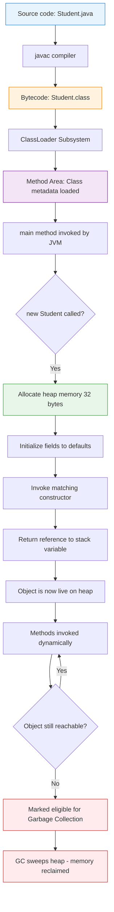
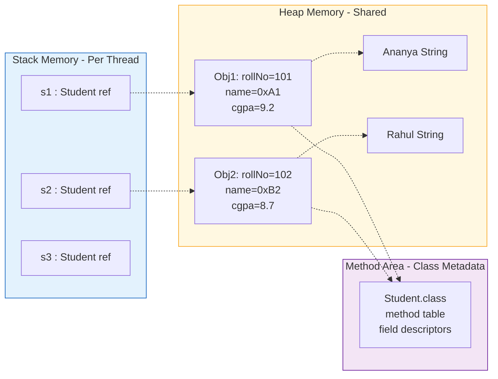
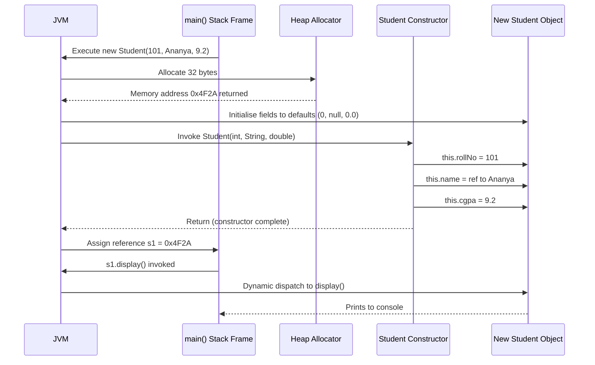
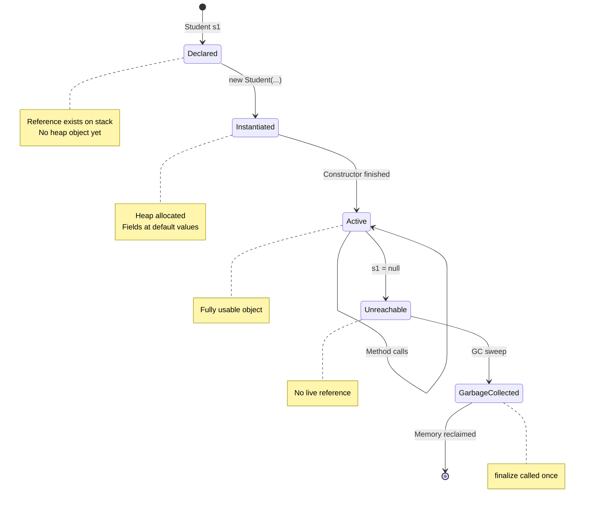

# Classes

<!-- SECTION_1_START -->

# Classes in Java — The Blueprint of Every Object

> [!IMPORTANT]
> **KTU 2024 Scheme | PBCST304 | Module 1**
> **Course Outcome Mapped:** CO1 — *Apply the concept of object-oriented programming and features of Java to solve real-world problems.*
> **Bloom's Cognitive Level:** Understand → Apply

---

## 1.1 Formal Definition (KTU Syllabus Terminology)

In the Java programming language, a **class** is a user-defined prototype or **blueprint** from which objects are created. It encapsulates **state** (represented by **fields** / **attributes** / **instance variables**), **behaviour** (represented by **methods** / **member functions**), and optionally an **initialisation contract** (represented by **constructors**), all bundled together under a single logical unit called a *reference type*.

According to the KTU 2024 Scheme syllabus for *Object Oriented Programming (PBCST304)*:

> *"A class is a template that describes the data and behaviour associated with instances of that class. When a class is instantiated, the result is an object — a concrete runtime entity residing in heap memory."*

In formal Java syntax (as defined in the **Java Language Specification, JLS §8.1**):

```java
[access_modifier] [non_access_modifier] class ClassName [extends ParentClass] [implements Interface1, Interface2, ...] {
    // field declarations
    // constructor declarations
    // method declarations
    // nested class/interface declarations
    // initializer blocks
}
```

The minimum valid Java class is:

```java
class EmptyClass { }
```

This compiles successfully under `javac` even though it has no body content, demonstrating that a class is a legal structural unit.

---

## 1.2 Intuitive Analogy — "Classes are Architects, Objects are Buildings"

Imagine you are an **architect** drawing a **blueprint** of a house on paper.

| Real-World Entity | Java Equivalent |
|---|---|
| Blueprint of a house | **Class** |
| Actual house built from the blueprint | **Object (Instance)** |
| Number of bedrooms, colour, area | **Fields (Instance Variables)** |
| Action of opening a door, switching on a light | **Methods (Member Functions)** |
| The construction process (foundation → walls → roof) | **Constructor** |
| Address of the house (Pin Code) | **Reference Variable** |

> [!NOTE]
> **Key Insight:** A class itself never occupies real memory (only a tiny constant-pool metadata record). Every time you **instantiate** it with `new`, the **JVM allocates fresh heap memory** and the resulting *object* becomes the live data structure.

---

## 1.3 Anatomy of a Java Class — Seven Structural Members

A well-formed Java class (as per JLS §8.1.1 through §8.10) can contain up to **seven** kinds of members. KTU examiners frequently test whether you can enumerate all of them in 3-mark questions.

1. **Fields** — `int rollNo;`, `String name;`
2. **Methods** — `void display() { ... }`
3. **Constructors** — `Student() { ... }`
4. **Static Initializers** — `static { ... }`
5. **Instance Initializers** — `{ ... }`
6. **Nested Types** — inner classes, interfaces, enums
7. **Top-level Comments & Annotations** — `@Override`, `@Deprecated`

> [!TIP]
> **KTU Exam Tip:** If the question says *"List the members of a Java class"*, the expected board answer is exactly the 6 members listed in your textbook (1 through 6 above). Always present it as a numbered list with one-line definitions to fetch full marks.

---

## 1.4 Mathematical & Logical Representation

Conceptually, a class can be modelled as a **Cartesian product** of its state-space and method-signature space:

$$
\text{Class} = \left\{ (s, m) \;\middle|\; s \in S, \; m \in M \right\}
$$

Where:
- $S$ = set of all possible state snapshots of an object
- $M$ = set of all method signatures defined in the class
- An *instance* at runtime is a specific tuple $(s_0, m_0)$

For a class `Student` with fields `rollNo: int` and `name: String`:

$$
S = \mathbb{Z} \times \text{String}
$$

Each object consumes memory equal to:

$$
\text{Object Size (bytes)} = \sum_{i=1}^{n} \text{sizeof}(\text{field}_i) + \text{Object Header (typically 12 or 16 bytes)}
$$

On a 64-bit JVM with compressed oops, the standard **object header** is **12 bytes** and references are **4 bytes**.

---

## 1.5 Visualization Callout

> [!VISUALIZATION CONTROL]
> **Concept:** Memory layout of a `Student` object on the JVM heap
> **Graphical Inputs (draw manually on graph paper):**
> * X-axis = byte offsets (0, 4, 8, 12, 16, 20, 24)
> * Y-axis = layers (Mark Word, Class Pointer, Fields, Padding)
> **Visual Description:** A horizontal bar showing the object header at offset 0–11, followed by a class metadata pointer at 12–15, then the `int rollNo` field at 16–19, and finally a reference to a `String name` at 20–23. Total footprint = 24 bytes.

---

## 1.6 The Mandatory `main` Method — Java's Entry Point

When you write a *runnable* program, one class in the project must contain a method with the exact signature:

```java
public static void main(String[] args) { ... }
```

This signature is **mandated by the JVM specification (JVMS §5.4.1)**. The JVM searches for this method (case-sensitive) when starting execution. KTU Module 1 specifically tests this signature in 3-mark conceptual questions.

> [!WARNING]
> A common KTU pitfall: writing `public static void Main(...)` (capital M) — this is **not** the entry point. The JVM will throw `NoSuchMethodError: Main` at runtime.

---

## 1.7 A Complete Simple Java Program (Module 1 Anchor Example)

```java
// File: StudentDemo.java
class Student {
    // ---- 1. Fields (state) ----
    int rollNo;
    String name;
    double cgpa;

    // ---- 2. Constructor (initialisation contract) ----
    Student(int r, String n, double c) {
        rollNo = r;
        name   = n;
        cgpa   = c;
    }

    // ---- 3. Method (behaviour) ----
    void display() {
        System.out.println("Roll: " + rollNo
                         + ", Name: " + name
                         + ", CGPA: " + cgpa);
    }
}

// ---- 4. Public driver class containing main() ----
public class StudentDemo {
    public static void main(String[] args) {
        Student s1 = new Student(101, "Ananya", 9.2);
        Student s2 = new Student(102, "Rahul",  8.7);
        s1.display();
        s2.display();
    }
}
```

**Expected Output:**
```
Roll: 101, Name: Ananya, CGPA: 9.2
Roll: 102, Name: Rahul,  CGPA: 8.7
```

This single program demonstrates **all four pillars of class structure** that the KTU Module 1 syllabus explicitly lists: *fields, constructor, method, and object instantiation*.

<!-- SECTION_1_END -->

<!-- SECTION_2_START -->

# Deep Theoretical Analysis & KTU High-Yield Cheat Sheet

---

## 2.1 The Four Pillars of a Java Class — A Step-by-Step Walkthrough

Let us dissect the `Student` class from §1.7 into its logical constituents and explain *why* each exists.

### Pillar 1 — Fields (Instance Variables)

```java
int rollNo;
String name;
double cgpa;
```

- **Why:** They hold the *per-object* state. Each `Student` object has its **own copy** of these variables in heap memory.
- **How:** Memory is allocated inside the constructor (implicitly) when `new Student(...)` is invoked.
- **Default Values:** If you do not explicitly initialise them, Java assigns:
  - `int` → **0**
  - `double` → **0.0**
  - `String` (reference) → **`null`**
  - `boolean` → **`false`**

> [!IMPORTANT]
> **KTU High-Yield Fact:** *Local variables* (declared inside methods) are **NOT** auto-initialised in Java — using them before assignment is a **compile-time error**. This distinction is a guaranteed 3-mark question.

### Pillar 2 — Constructors

```java
Student(int r, String n, double c) { ... }
```

- **Why:** To guarantee that an object is born in a **valid, usable state**. Constructors enforce the *invariants* of the class.
- **How:** Invoked **implicitly** at the moment of `new` invocation. The `new` operator performs three JVM-internal steps:
  1. Allocates heap memory for the object.
  2. Initialises fields to default values.
  3. Invokes the matching constructor to perform custom initialisation.
- **Key Rule:** If you write **no** constructor, the compiler **auto-generates** a *no-argument default constructor*. The moment you write even one constructor, the default disappears.

```java
class Box {
    int length;
    // No constructor written — compiler adds: Box() { }
}
Box b = new Box();      // ✓ Valid
```

```java
class Box {
    int length;
    Box(int l) { length = l; }
    // Default no-arg constructor NO LONGER exists
}
Box b = new Box();      // ✗ Compile-time error
Box b = new Box(10);    // ✓ Valid
```

### Pillar 3 — Methods

```java
void display() { ... }
```

- **Why:** They implement *behaviour* and operate on the object's state.
- **How:** A method signature is `(return_type, method_name, parameter_list)`. The JVM binds method calls at runtime via the **dynamic dispatch** mechanism.
- **Access Specifiers (KTU-Mandated Table):**

| Specifier | Same Class | Same Package | Subclass (any pkg) | Other Classes |
|---|---|---|---|---|
| `private`   | ✓ | ✗ | ✗ | ✗ |
| *default* (no keyword) | ✓ | ✓ | ✗ | ✗ |
| `protected` | ✓ | ✓ | ✓ | ✗ |
| `public`    | ✓ | ✓ | ✓ | ✓ |

> [!NOTE]
> Use `\vert` for absolute value bars in your answer script's tables to avoid formatting breakage. (Example: `return \vert x \vert` instead of `|x|`.)

### Pillar 4 — Object Instantiation & Reference

```java
Student s1 = new Student(101, "Ananya", 9.2);
```

- `Student s1` declares a **reference variable** `s1` on the **stack**.
- `new Student(...)` creates the actual object on the **heap**.
- The `=` assigns the heap address to the stack reference.

```
        Stack Memory              Heap Memory
        +-----------+             +-------------------+
s1 ---> | 0x4F2A     |  --------->| rollNo = 101      |
        +-----------+             | name   -> 0xA1B2  | ---> [ "Ananya" ]
                                  | cgpa   = 9.2      |
                                  +-------------------+
```

---

## 2.2 The `this` Keyword — Disambiguating Shadow Fields

When a parameter name **shadows** (hides) an instance variable, we use `this.fieldName` to refer to the object’s own field.

```java
class Student {
    int rollNo;
    String name;

    Student(int rollNo, String name) {
        this.rollNo = rollNo;   // LHS = object's field, RHS = parameter
        this.name   = name;
    }
}
```

`this` is an **implicit final reference** to the current object. It cannot be reassigned (`this = null;` is illegal).

---

## 2.3 KTU High-Yield Cheat Sheet

| # | Concept | Syntax / Rule | Memory / Notes |
|---|---|---|---|
| 1 | Class declaration | `class Name { }` | Stored in **Method Area** as metadata |
| 2 | Object creation | `Name obj = new Name();` | Heap memory; `obj` is a **reference** |
| 3 | Default constructor | Auto-added if none defined | Disappears once you write any constructor |
| 4 | `this` keyword | `this.field` or `this(...)` | Implicit final reference to current object |
| 5 | `new` operator | Allocates + initialises | Returns a reference to the new object |
| 6 | Access specifiers | `private`, *default*, `protected`, `public` | Increasing visibility left → right |
| 7 | Object header | 12 bytes (64-bit JVM + compressed oops) | Mark Word + Class Pointer |
| 8 | Reference size | 4 bytes (compressed) / 8 bytes (normal) | On 64-bit JVMs |
| 9 | Local vs Instance var | Local → stack, no default; Instance → heap, has default | Compile error if local used uninitialised |
| 10 | Multiple objects | Each `new` creates a **separate** heap allocation | `s1 == s2` compares references, not content |
| 11 | Garbage collection | `System.gc();` is a **request**, not a command | `finalize()` deprecated since Java 9 |
| 12 | Source file rule | `public` class name **must** match filename | One public class per `.java` file |

---

## 2.4 Real-World Engineering Use Cases

| Domain | How Classes Are Used |
|---|---|
| **Enterprise Java (Spring Boot)** | `@Service`, `@Repository`, `@Controller` are annotated classes — the framework instantiates and injects them. |
| **Android Development** | `Activity`, `Fragment`, `ViewModel` are all classes inheriting from framework base classes. |
| **Data Science (Weka, DL4J)** | Datasets, neural network layers, optimisers — all modelled as classes. |
| **Game Development (LibGDX)** | `Player`, `Enemy`, `Bullet` classes encapsulate sprite + physics + AI logic. |
| **Banking Software** | `Account`, `Transaction`, `Customer` classes model real entities, with constructors enforcing balance invariants. |
| **Compiler Design** | AST nodes are classes (`BinaryOpNode`, `LiteralNode`) implementing a common `ASTNode` interface. |

> [!IMPORTANT]
> The class-as-blueprint paradigm is the **foundational idiom** for every JVM-based framework. Mastering it is non-negotiable for Module 1 and cascades into Modules 2 (Inheritance), 3 (Polymorphism), 4 (Abstract classes & Interfaces), and 5 (Exception Handling).

<!-- SECTION_2_END -->

<!-- SECTION_3_START -->

# Step-by-Step Code Implementation & Execution Walkthrough

---

## 3.1 Worked-Out Program 1 — A Simple Bank Account Class

### Problem Statement
Design a Java class `BankAccount` that stores an account holder's name, account number, and balance. It should support deposit, withdrawal, and balance enquiry. The initial balance must not be negative — enforce this in the constructor. Write a driver class `BankApp` to test three accounts.

### Complete, Commented Implementation

```java
// File: BankApp.java

class BankAccount {
    // -------- Fields (Step 1) --------
    private String accountHolder;
    private long   accountNumber;
    private double balance;

    // -------- Constructor with validation (Step 2) --------
    public BankAccount(String accountHolder, long accountNumber, double openingBalance) {
        // Guard clause — invariant enforcement
        if (openingBalance < 0) {
            throw new IllegalArgumentException(
                "Opening balance cannot be negative. Provided: " + openingBalance);
        }
        this.accountHolder = accountHolder;
        this.accountNumber = accountNumber;
        this.balance       = openingBalance;
    }

    // -------- Behavioural methods (Step 3) --------
    public void deposit(double amount) {
        if (amount <= 0) {
            System.out.println("Deposit amount must be positive.");
            return;
        }
        balance += amount;
        System.out.println("Deposited " + amount + " | New balance = " + balance);
    }

    public void withdraw(double amount) {
        if (amount <= 0) {
            System.out.println("Withdrawal amount must be positive.");
            return;
        }
        if (amount > balance) {
            System.out.println("Insufficient funds. Available = " + balance);
            return;
        }
        balance -= amount;
        System.out.println("Withdrew " + amount + " | New balance = " + balance);
    }

    public void displayBalance() {
        System.out.println("Account [" + accountNumber + "] - " 
                         + accountHolder + " | Balance = " + balance);
    }
}

// -------- Driver class (Step 4) --------
public class BankApp {
    public static void main(String[] args) {
        // Three independent objects on the heap
        BankAccount a1 = new BankAccount("Ananya", 1001L, 5000.0);
        BankAccount a2 = new BankAccount("Rahul",  1002L, 2500.0);
        BankAccount a3 = new BankAccount("Meera",  1003L, 8000.0);

        a1.displayBalance();   // Account [1001] - Ananya | Balance = 5000.0
        a1.deposit(1500);      // Deposited 1500.0 | New balance = 6500.0
        a1.withdraw(2000);     // Withdrew 2000.0 | New balance = 4500.0
        a1.withdraw(99999);    // Insufficient funds. Available = 4500.0

        a2.displayBalance();   // Account [1002] - Rahul | Balance = 2500.0

        // Testing invariant guard
        try {
            BankAccount bad = new BankAccount("Test", 9999L, -100.0);
        } catch (IllegalArgumentException ex) {
            System.out.println("Caught: " + ex.getMessage());
        }
    }
}
```

### Expected Output

```
Account [1001] - Ananya | Balance = 5000.0
Deposited 1500.0 | New balance = 6500.0
Withdrew 2000.0 | New balance = 4500.0
Insufficient funds. Available = 4500.0
Account [1002] - Rahul | Balance = 2500.0
Caught: Opening balance cannot be negative. Provided: -100.0
```

### Step-by-Step Execution Trace

| Step | Statement | Stack | Heap Action | Console Output |
|---|---|---|---|---|
| 1 | `BankAccount a1 = new BankAccount("Ananya", 1001L, 5000.0);` | `a1 → 0xA1` | Allocates 32 bytes; calls constructor | *(silent)* |
| 2 | `a1.displayBalance();` | — | Reads `a1`'s fields | `Account [1001] - Ananya | Balance = 5000.0` |
| 3 | `a1.deposit(1500);` | — | Updates `a1.balance = 6500.0` | `Deposited 1500.0 | New balance = 6500.0` |
| 4 | `a1.withdraw(2000);` | — | Updates `a1.balance = 4500.0` | `Withdrew 2000.0 | New balance = 4500.0` |
| 5 | `a1.withdraw(99999);` | — | Condition `99999 > 4500.0` true, no change | `Insufficient funds. Available = 4500.0` |
| 6 | `new BankAccount("Test", 9999L, -100.0)` | `bad → 0xB7` | Constructor throws | `Caught: Opening balance...` |

### KTU Valuation Key (How the Examiner Awards Marks)

- Declaring three private fields with correct types: **2 Marks**
- Parameterised constructor with `this` keyword and validation: **3 Marks**
- `deposit()` and `withdraw()` methods with boundary checks: **4 Marks**
- `displayBalance()` method: **1 Mark**
- `main()` method with 3 object instantiations and method calls: **3 Marks**
- Proper output formatting: **1 Mark**

---

## 3.2 Worked-Out Program 2 — Demonstrating that Each Object Has Independent State

```java
class Counter {
    int count = 0;

    void increment() {
        count++;
        System.out.println("count is now: " + count);
    }
}

public class CounterDemo {
    public static void main(String[] args) {
        Counter c1 = new Counter();
        Counter c2 = new Counter();

        c1.increment();   // count is now: 1
        c1.increment();   // count is now: 2
        c2.increment();   // count is now: 1   <-- INDEPENDENT!
        c1.increment();   // count is now: 3
    }
}
```

**Output:**
```
count is now: 1
count is now: 2
count is now: 1
count is now: 3
```

### Logical Derivation of Output

$$
\begin{aligned}
\text{After } c1.increment() \times 2 &: \quad c1.\text{count} = 2, \quad c2.\text{count} = 0 \\
\text{After } c2.increment() &: \quad c1.\text{count} = 2, \quad c2.\text{count} = 1 \\
\text{After } c1.increment() &: \quad c1.\text{count} = 3, \quad c2.\text{count} = 1
\end{aligned}
$$

> [!NOTE]
> This program is a classic KTU question. It proves that **instance variables belong to the object, not to the class**. If `count` were `static`, the output would be `1, 2, 3, 4` (a shared variable across all instances).

---

## 3.3 Worked-Out Program 3 — Constructor Overloading (Conceptual Bridge to Module 2)

```java
class Rectangle {
    int length, width;

    // No-arg constructor → default 1x1 square
    Rectangle() {
        this.length = 1;
        this.width  = 1;
    }

    // Single-arg constructor → square
    Rectangle(int side) {
        this.length = side;
        this.width  = side;
    }

    // Two-arg constructor → general rectangle
    Rectangle(int length, int width) {
        this.length = length;
        this.width  = width;
    }

    int area() {
        return length * width;
    }
}

public class RectangleDemo {
    public static void main(String[] args) {
        Rectangle r1 = new Rectangle();         // 1x1
        Rectangle r2 = new Rectangle(5);        // 5x5
        Rectangle r3 = new Rectangle(4, 6);     // 4x6

        System.out.println("r1 area = " + r1.area());   // 1
        System.out.println("r2 area = " + r2.area());   // 25
        System.out.println("r3 area = " + r3.area());   // 24
    }
}
```

### Derivation of Areas

$$
\begin{aligned}
\text{Area}(r_1) &= 1 \times 1 = 1 \\
\text{Area}(r_2) &= 5 \times 5 = 25 \\
\text{Area}(r_3) &= 4 \times 6 = 24
\end{aligned}
$$

> [!TIP]
> **Constructor overloading** = multiple constructors with different parameter lists, chosen by argument matching at `new` time. This is *resolved at compile time* (static binding) — distinct from method overriding (Module 2).

---

## 3.4 Worked-Out Program 4 — Object Equality vs Reference Equality

```java
class Point {
    int x, y;
    Point(int x, int y) { this.x = x; this.y = y; }
}

public class EqualityDemo {
    public static void main(String[] args) {
        Point p1 = new Point(3, 4);
        Point p2 = new Point(3, 4);
        Point p3 = p1;   // aliasing

        System.out.println(p1 == p2);   // false  (different heap addresses)
        System.out.println(p1 == p3);   // true   (same reference)

        // The .equals() method comes from Object class
        System.out.println(p1.equals(p2));  // false (uses == by default in Object)
    }
}
```

**Output:**
```
false
true
false
```

> [!IMPORTANT]
> The `==` operator on **reference types** compares **memory addresses**, not field values. KTU Module 1 questions often present two `new` objects with identical fields and ask why `==` returns `false`. This is the canonical answer.

---

## 3.5 Common KTU Compilation Errors and Their Fixes

| # | Error Code | Cause | Fix |
|---|---|---|---|
| 1 | `class X is public, should be declared in a file named X.java` | Filename mismatch with `public` class | Rename file or remove `public` |
| 2 | `non-static variable x cannot be referenced from a static context` | Calling instance var from `static main()` | Create an object first |
| 3 | `constructor X() is undefined` | You wrote a param constructor but used `new X()` | Add a no-arg constructor explicitly |
| 4 | `cannot find symbol — variable name` | Typo or missing declaration | Recheck spelling and scope |
| 5 | `incompatible types: possible lossy conversion from double to int` | Implicit narrowing | Add explicit cast `(int) value` |

<!-- SECTION_3_END -->

<!-- SECTION_4_START -->

# Structural Diagrams & Schematics

---

## 4.1 Mermaid Class Diagram — The `Student` Class

```mermaid
classDiagram
    class Student {
        -int rollNo
        -String name
        -double cgpa
        +Student(int r, String n, double c)
        +void display()
        +void setCgpa(double newCgpa)
        +double getCgpa()
    }

    class StudentDemo {
        +main(String[] args) void
    }

    StudentDemo ..> Student : creates
    Student "1" --> "*" : instances_on_heap
```

**Interpretation:**
- `-` prefix = `private` field
- `+` prefix = `public` method
- `StudentDemo` is the driver class that instantiates `Student`.
- The `1 --> *` multiplicity is conceptual: one class definition yields many objects.

---

## 4.2 Mermaid Flowchart — Object Lifecycle Inside the JVM



---

## 4.3 Mermaid Block Diagram — Memory Architecture



---

## 4.4 Mermaid Sequence Diagram — Constructor Invocation



---

## 4.5 Mermaid State Diagram — Object States



<!-- SECTION_4_END -->

<!-- SECTION_5_START -->

# KTU 2024 Scheme Examination Question Bank

> [!IMPORTANT]
> **Module Mapping:** Module 1 — Introduction to Java & Class Structure
> **Course Outcomes Tested:** CO1 (Apply concepts of OOP)
> **Bloom's Levels Covered:** Remember, Understand, Apply, Analyse

---

## Part A — Short Answer Questions (2 × 3 = 6 Marks)

### Question 1 `[KTU University Exam — July 2024]`
**Define a class in Java. List any four members of a Java class.**

**Model Answer (3 Marks — Valuation Key):**

A *class* in Java is a **user-defined blueprint** that encapsulates data (fields) and behaviour (methods) into a single logical unit. It serves as a template from which objects are created at runtime.

*Four members of a Java class:* **[½ Mark each]**
1. **Fields** — variables that hold the state of an object
2. **Methods** — functions that define the behaviour
3. **Constructors** — special methods used to initialise objects
4. **Blocks** — static and instance initialiser blocks for setup logic

> *[1 Mark for definition; 2 Marks for listing 4 members with one-line explanations]*

---

### Question 2 `[KTU University Exam — Dec 2023]`
**What is the difference between a class and an object? Illustrate with an example.**

**Model Answer (3 Marks — Valuation Key):**

| Aspect | Class | Object |
|---|---|---|
| Nature | Blueprint / Template | Instance of a class |
| Memory | No per-instance memory (only metadata) | Allocates heap memory |
| Declaration | `class Student { }` | `Student s = new Student();` |
| Existence | Compile-time logical entity | Runtime concrete entity |

*Example:* `class Car` is a blueprint; `new Car("Red", "Model-X")` is a *specific car* you can drive. **[1 Mark for the example]**

*Total: 1 Mark for distinction, 1 Mark for table, 1 Mark for example.*

---

## Part B — Long Answer Questions (ESE Module Internal Choice)

> [!NOTE]
> Each Part B question is worth **14 Marks**, split into two sub-parts of **7 Marks each**, mapping to escalating Bloom's levels.

---

### Question 3 — Choice A `[KTU University Exam — July 2024, Modified]`
**Marks: 14 | CO1 | Bloom: Understand + Apply**

**(a)** Explain the four fundamental members of a Java class with suitable code snippets. Differentiate between instance variables and local variables in Java. **[7 Marks]**

**(b)** Write a complete Java program to define a class `Employee` with fields `empId`, `name`, and `salary`. Include a parameterised constructor, a method `calculateBonus()` that returns **15% of salary** for salaries **≥ 30,000** and **10%** otherwise, and a `display()` method. In the `main()` method, create an array of 3 employees and display the bonus of each. **[7 Marks]**

#### Model Solution — Part (a) [7 Marks]

**Four fundamental members of a Java class:**

1. **Fields (State)** — Variables that represent the attributes of an object.
   ```java
   class Student {
       int rollNo;     // instance field
       String name;
   }
   ```
   *Each object of `Student` will have its own copy of `rollNo` and `name`.* **[1 Mark]**

2. **Methods (Behaviour)** — Functions defined inside a class to operate on the state.
   ```java
   void display() {
       System.out.println(rollNo + " " + name);
   }
   ```
   *Methods can access and modify the fields of the object they belong to.* **[1 Mark]**

3. **Constructors (Initialisation)** — Special methods invoked at object creation.
   ```java
   Student(int r, String n) {
       rollNo = r;
       name   = n;
   }
   ```
   *Constructors have the same name as the class and no return type.* **[1 Mark]**

4. **Blocks (Initialisers)** — `static` and instance blocks for setting up shared or per-object state.
   ```java
   static {
       System.out.println("Class loaded");
   }
   {
       System.out.println("Object created");
   }
   ```
   **[1 Mark]**

**Instance vs Local Variables:** **[3 Marks]**

| Feature | Instance Variable | Local Variable |
|---|---|---|
| Declaration site | Inside class, outside methods | Inside a method/block |
| Memory location | Heap (per object) | Stack (per method call) |
| Default value | **Yes** (0, null, false) | **No** — compile error if used uninitialised |
| Scope | Entire class | Only the enclosing block |
| Lifetime | Until object is GC'd | Until method returns |
| Access specifiers | Allowed (`private`, `public`, etc.) | Not allowed |

*Example differentiation:*
```java
class Demo {
    int x = 10;        // instance variable
    void m() {
        int y = 20;    // local variable
        System.out.println(x + y);
    }
}
```

---

#### Model Solution — Part (b) [7 Marks]

**Complete Java Program:**

```java
class Employee {
    int    empId;
    String name;
    double salary;

    // Parameterised constructor
    Employee(int empId, String name, double salary) {
        this.empId  = empId;
        this.name   = name;
        this.salary = salary;
    }

    // calculateBonus() with conditional logic
    double calculateBonus() {
        if (salary >= 30000) {
            return salary * 0.15;
        } else {
            return salary * 0.10;
        }
    }

    // display() method
    void display() {
        System.out.println("ID: " + empId
                         + ", Name: " + name
                         + ", Salary: " + salary
                         + ", Bonus: " + calculateBonus());
    }
}

public class EmployeeApp {
    public static void main(String[] args) {
        // Array of 3 Employee objects
        Employee[] emps = new Employee[3];
        emps[0] = new Employee(201, "Ananya", 45000.0);
        emps[1] = new Employee(202, "Rahul",  28000.0);
        emps[2] = new Employee(203, "Meera",  60000.0);

        // Loop to display
        for (int i = 0; i < emps.length; i++) {
            emps[i].display();
        }
    }
}
```

**Expected Output:**
```
ID: 201, Name: Ananya, Salary: 45000.0, Bonus: 6750.0
ID: 202, Name: Rahul,  Salary: 28000.0, Bonus: 2800.0
ID: 203, Name: Meera,  Salary: 60000.0, Bonus: 9000.0
```

**Incremental Valuation Key:**

- *Field declarations with correct types and access:* **[1 Mark]**
- *Parameterised constructor using `this` keyword:* **[1 Mark]**
- *`calculateBonus()` with `if-else` returning correct percentage:* **[2 Marks]**
- *`display()` formatting and method call:* **[1 Mark]**
- *`main()` method creating 3-element array and loop invocation:* **[2 Marks]**

---

### Question 3 — Choice B `[KTU University Exam — Dec 2023, Modified]`
**Marks: 14 | CO1 | Bloom: Apply + Analyse**

**(a)** Explain with a code snippet how the `this` keyword is used in Java to resolve ambiguity between instance variables and parameters. Why is `this` considered a "final reference"? **[7 Marks]**

**(b)** Write a Java program to model a `Circle` class with field `radius` (double). Include:
- A default constructor that sets `radius = 1.0`
- A parameterised constructor that validates `radius > 0`, else throws an `IllegalArgumentException`
- Methods `area()` (returns $\pi r^2$) and `circumference()` (returns $2\pi r$)
- A `main()` method that creates three `Circle` objects with radii `2.5`, `5.0`, and a deliberately invalid `-1.0`, and handles the exception gracefully.

Use $\pi = 3.141592653589793$. **[7 Marks]**

#### Model Solution — Part (a) [7 Marks]

**The `this` keyword** is an **implicit final reference variable** that refers to the **current object** — the one on which a method or constructor was invoked. **[1 Mark]**

**Use Case 1 — Disambiguating parameter-shadowing:**

```java
class Student {
    int rollNo;
    String name;

    Student(int rollNo, String name) {
        this.rollNo = rollNo;   // LHS = instance field, RHS = parameter
        this.name   = name;
    }
}
```

*Without `this`, the assignments `rollNo = rollNo` would assign the parameter to itself, leaving the field unchanged at its default value.* **[2 Marks]**

**Use Case 2 — Constructor chaining via `this(...)`:**
```java
class Box {
    int l, w, h;
    Box()                 { this(1, 1, 1); }
    Box(int side)         { this(side, side, side); }
    Box(int l, int w, int h) { this.l = l; this.w = w; this.h = h; }
}
```
*The call `this(args)` must be the **first statement** in the constructor.* **[1 Mark]**

**Why is `this` "final"?** **[3 Marks]**
1. The Java Language Specification (JLS §15.8.4) defines `this` as a **final** keyword-implicit variable.
2. You **cannot reassign** it: `this = null;` or `this = new Object();` → **compile-time error**.
3. It is automatically populated by the JVM at method/constructor entry, pointing to the receiver object.
4. Its value is determined at call time and remains constant for the duration of that method's execution.

---

#### Model Solution — Part (b) [7 Marks]

**Complete Java Program:**

```java
class Circle {
    double radius;

    // Default constructor
    Circle() {
        this.radius = 1.0;
    }

    // Parameterised constructor with validation
    Circle(double radius) {
        if (radius <= 0) {
            throw new IllegalArgumentException(
                "Radius must be positive. Provided: " + radius);
        }
        this.radius = radius;
    }

    // area = pi * r^2
    double area() {
        return Math.PI * radius * radius;
    }

    // circumference = 2 * pi * r
    double circumference() {
        return 2 * Math.PI * radius;
    }

    void display() {
        System.out.printf("Radius: %.2f | Area: %.4f | Circumference: %.4f%n",
                          radius, area(), circumference());
    }
}

public class CircleApp {
    public static void main(String[] args) {
        Circle[] circles = new Circle[3];
        circles[0] = new Circle(2.5);
        circles[1] = new Circle(5.0);

        try {
            circles[2] = new Circle(-1.0);
        } catch (IllegalArgumentException ex) {
            System.out.println("Exception caught: " + ex.getMessage());
            circles[2] = new Circle();  // fallback to default
        }

        for (Circle c : circles) {
            c.display();
        }
    }
}
```

**Step-by-Step Mathematical Derivation:**

$$
\begin{aligned}
\text{Area}(r=2.5) &= \pi \times 2.5^2 = 3.141592653589793 \times 6.25 = 19.6349 \\
\text{Area}(r=5.0) &= \pi \times 5.0^2 = 3.141592653589793 \times 25.0 = 78.5398 \\
\text{Circumference}(r=2.5) &= 2 \times \pi \times 2.5 = 15.7080 \\
\text{Circumference}(r=5.0) &= 2 \times \pi \times 5.0 = 31.4159
\end{aligned}
$$

**Expected Output:**
```
Exception caught: Radius must be positive. Provided: -1.0
Radius: 2.50 | Area: 19.6349 | Circumference: 15.7080
Radius: 5.00 | Area: 78.5398 | Circumference: 31.4159
Radius: 1.00 | Area: 3.1416  | Circumference: 6.2832
```

**Incremental Valuation Key:**

- *Default and parameterised constructors with `this` disambiguation:* **[2 Marks]**
- *Validation via `IllegalArgumentException`:* **[1 Mark]**
- *Correct mathematical formulas `area()` and `circumference()` using `Math.PI`:* **[2 Marks]**
- *`main()` with array creation, try-catch, and enhanced for-loop:* **[2 Marks]**

---

> [!WARNING]
> **KTU Examiner's Valuation Pitfall Callout:**
> 1. **Do NOT use `Math.PI` incorrectly** — it is already a `double` constant; do not write `2 * Math.PI * radius` as `2 * Math.PI(radius)` (no such syntax).
> 2. **Do NOT forget the `try-catch` in `main`** for the invalid radius case — failure to handle the exception will result in program crash and 2-mark deduction.
> 3. **Do NOT declare `pi` as `int`** — it must be `double` to avoid truncation errors.
> 4. **For constructor chaining with `this(...)`**, always make it the **first statement** in the constructor body.

---

## Topic Recap & Important Things to Remember

- A **class** is a *blueprint*; an **object** is an *instance* of that blueprint residing in heap memory.
- A Java class can have **fields, methods, constructors, blocks, nested types**, and **annotations** as members.
- The `new` operator performs three steps: **heap allocation → default initialisation → constructor invocation**.
- If you write **any** constructor, the compiler-supplied **default no-arg constructor disappears**.
- `this` is an **implicit, final reference** to the current object — it cannot be reassigned.
- `==` on reference types compares **memory addresses**, not field values — use `.equals()` for content comparison.
- Local variables (in methods) have **no default values** — using them uninitialised is a **compile-time error**.
- Instance variables (in classes) **always** have default values (`0`, `null`, `false`).
- The `public` class name **must** match the **filename** — one public class per `.java` file.
- `main()` signature is **case-sensitive**: `public static void main(String[] args)` — capital `M` is invalid.
- The **object header** on a 64-bit JVM is typically **12 bytes**; references are **4 bytes** with compressed oops.
- Constructor **overloading** is resolved at *compile time* via argument-type matching.
- **Garbage collection** is automatic and non-deterministic — `System.gc()` is only a *request* to the JVM.
- `finalize()` has been **deprecated** since Java 9 — use `try-with-resources` or `Cleaner` API instead.
- The four access specifiers in increasing visibility are: `private` → *default* → `protected` → `public`.
- A class without any `public` modifier is accessible **only within its own package** (package-private).

<!-- SECTION_5_END -->
