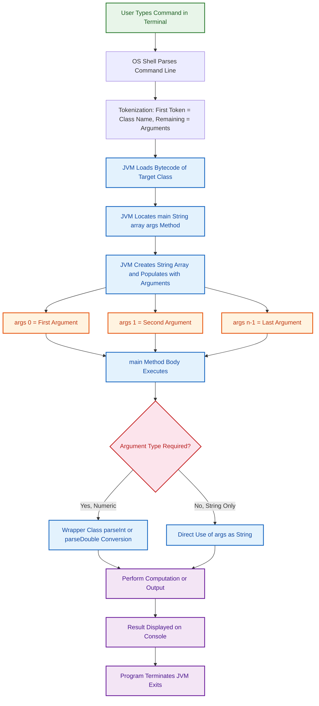
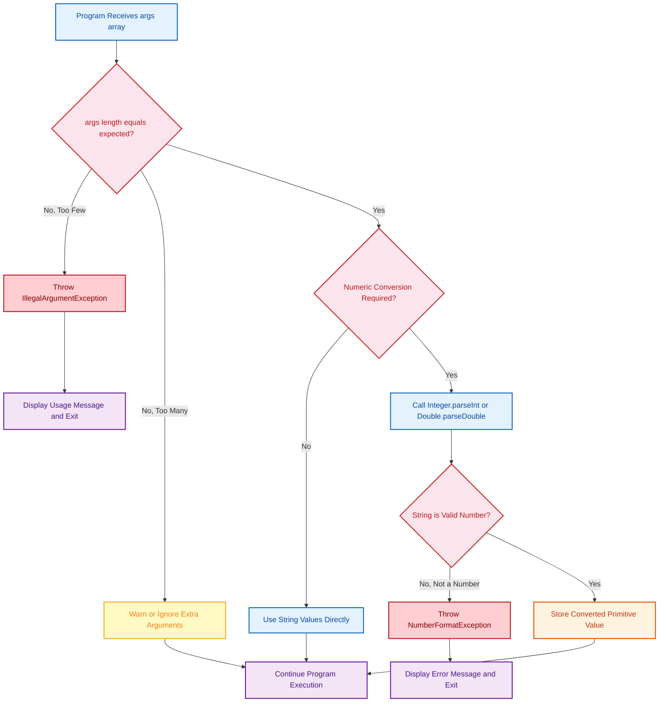
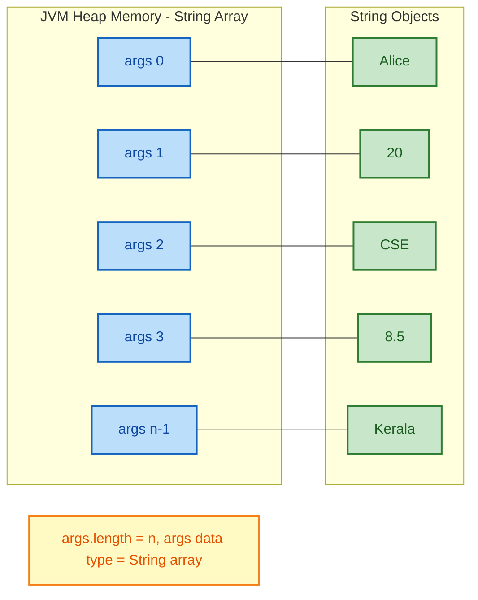

# Command Line Arguments

<!-- SECTION_1_START -->
# Command Line Arguments in Java

## 1.1 Formal Definition (KTU 2024 Syllabus Terminology)

> [!NOTE]
> **Command Line Arguments** are the **string values** passed to a Java program at the time of execution, **after the class name**, via the operating system shell/terminal. These values are automatically received by the `main()` method through its **String array parameter** `String args[]` (or `String[] args`).

The **Java Virtual Machine (JVM)** intercepts these arguments at runtime, packages them into a `String` array, and delivers them to the `main()` method as the parameter `args`. By default, all command line arguments are received as **strings**, regardless of whether they represent numeric values.

$$\text{java ClassName arg}_1 \text{ arg}_2 \text{ arg}_3 \dots \text{ arg}_n$$

These `arg_1, arg_2, ..., arg_n` are stored in the array:

$$\text{args} = \{\text{arg}_1, \text{arg}_2, \text{arg}_3, \dots, \text{arg}_n\}$$

> [!IMPORTANT]
> **KTU Syllabus Highlight (PBCST304 - Module 1):** Students must clearly understand:
> 1. The mechanism of passing arguments from the **command prompt / terminal** to the JVM.
> 2. Retrieval of arguments using the `args[]` array inside `main()`.
> 3. **Type conversion** from `String` to primitive types using wrapper class methods (`Integer.parseInt()`, `Double.parseDouble()`, etc.).
> 4. Handling exceptions like `NumberFormatException` and `ArrayIndexOutOfBoundsException`.

## 1.2 Conceptual Analogy / Intuition

Imagine you are ordering a **custom coffee** at a café. The barista (your Java program) needs to know specific details to make your drink correctly: the **type of coffee**, the **size**, and the **sugar level**. You provide these details as you place the order, **outside the main recipe book**.

In this analogy:
- The **barista's recipe** is the Java program.
- The **main() method** is the barista's workflow.
- The **order details** (type, size, sugar) are the **command line arguments** — supplied externally, after the program is invoked.
- The **notepad** where the barista jots down these order details is the **`args[]` String array**.

Another powerful intuition: Think of `args[]` as an **inbox tray** at the entrance of your program. Every time you launch the program, the OS drops a set of "letters" (strings) into this tray. Your program opens the tray, reads each letter, and processes the information. If a particular letter is missing, the program must handle that gracefully (e.g., via `ArrayIndexOutOfBoundsException` checks).

> [!TIP]
> **Quick Memory Hook:** Think **A-R-G-S = "Arguments Received as a Group of Strings"**.

## 1.3 Physical Constants / Standard Metrics

- The **maximum number of command line arguments** is limited by the operating system's command line buffer size, typically around **$2 \times 10^6$ characters** (approximately **$\sim 32,000$ to $\sim 128,000$ arguments** depending on OS).
- The separator between arguments is the **whitespace character** (space). To include spaces inside a single argument, **double quotes** `" "` are used.
- The `args.length` property returns the **count of arguments** passed.

> [!VISUALIZATION CONTROL]
> **Concept:** Visualizing the String array `args[]` populated by the JVM.
> **GeoGebra / Desmos Input Equations:**
> * `f(x) = x` for $x = 0, 1, 2, 3$ showing index positions
> * Points: $(0, \text{"10"}), (1, \text{"20"}), (2, \text{"30"}), (3, \text{"40"})$
> **Visual Description:** The x-axis represents the **index of the `args[]` array** (0, 1, 2, 3, ...), and the y-axis represents the **string value stored** at each index. The student should see a discrete set of points, each labeled with its corresponding string value, demonstrating that arguments are stored sequentially starting from index **0**.

---

<!-- SECTION_1_END -->

<!-- SECTION_2_START -->
# Deep Theoretical Analysis & KTU High-Yield Formula Sheet

## 2.1 Operational Concept Breakdown

The lifecycle of a command line argument follows a precise, four-stage pipeline:

### Stage 1: User Invocation
The user types a command in the terminal:

```bash
java Calculator 10 20 add
```

The operating system shell parses the line. The **first token** (`Calculator`) is the **class name to execute**. All **subsequent tokens** (separated by whitespace) are the **command line arguments**.

### Stage 2: JVM Reception
The **JVM** receives the invocation, loads the bytecode of the `Calculator` class, and locates the `main(String[] args)` method. It then creates a new `String` array:

$$\text{args} = \text{new String}[\text{number of arguments}]$$

Each token is placed in sequential order, starting from **index 0**:

$$\text{args}[0] = \text{"10"}, \quad \text{args}[1] = \text{"20"}, \quad \text{args}[2] = \text{"add"}$$

### Stage 3: Programmatic Access
Inside `main()`, the programmer accesses the arguments via the `args` array reference. Since all values are `String` objects, **no arithmetic can be performed directly** on them. Type conversion is required for numerical operations.

### Stage 4: Type Conversion (if needed)
Wrapper class static methods are used to convert `String` to primitives:

| Wrapper Class | Conversion Method | Resulting Type |
|---|---|---|
| `Integer` | `Integer.parseInt(String s)` | `int` |
| `Long` | `Long.parseLong(String s)` | `long` |
| `Double` | `Double.parseDouble(String s)` | `double` |
| `Float` | `Float.parseFloat(String s)` | `float` |
| `Boolean` | `Boolean.parseBoolean(String s)` | `boolean` |

## 2.2 Why Are Arguments Always Strings?

The `main()` method signature is **fixed by the JVM specification**:

```java
public static void main(String[] args)
```

The JVM has no knowledge of the programmer's intent. It cannot assume whether the user is passing integers, decimals, filenames, or arbitrary text. Therefore, the **safest universal type** — `String` — is chosen. It is the programmer's responsibility to perform **explicit type conversion** using wrapper class methods.

## 2.3 KTU Formula Sheet / Cheat Sheet

| Concept | Syntax / Formula | Description |
|---|---|---|
| Main method signature | `public static void main(String[] args)` | Fixed JVM entry point; `args` receives command line arguments |
| Accessing argument | `args[index]` | Retrieves the string at position `index` (0-based) |
| Argument count | `args.length` | Returns the total number of arguments passed |
| String to `int` | `Integer.parseInt(args[i])` | Converts string to integer; throws `NumberFormatException` if invalid |
| String to `double` | `Double.parseDouble(args[i])` | Converts string to double-precision floating point |
| String to `long` | `Long.parseLong(args[i])` | Converts string to long integer |
| String to `float` | `Float.parseFloat(args[i])` | Converts string to single-precision floating point |
| Safe access check | `if (args.length > 0)` | Prevents `ArrayIndexOutOfBoundsException` |
| Iteration | `for (int i = 0; i < args.length; i++)` | Standard loop to traverse all arguments |
| Enhanced for-loop | `for (String s : args)` | Java 5+ syntax for cleaner array traversal |
| Argument count constant | $n = \text{args.length}$ | The total number of arguments received by `main()` |
| Index range | $0 \le i \le n - 1$ | Valid index range for accessing `args[i]` |

## 2.4 Real-World Utility in Software Engineering

Command line arguments are ubiquitous in production-grade software:

- **Build Tools:** `javac -d ./build src/*.java` — the `-d` flag and target directory are command line arguments.
- **Web Servers:** `java -jar server.jar --port=8080 --context=/api` — configuration is passed via CLI.
- **Testing Frameworks:** `java -jar junit-platform-console-standalone.jar --class-path ./test --select-class MyTest` — test selection criteria are CLI arguments.
- **Data Processing:** `java DataProcessor input.csv output.json` — input/output file paths are CLI arguments.
- **Cloud Microservices:** Docker and Kubernetes pass container configuration (port numbers, environment variables, secrets) as arguments to JVM-based services.

> [!IMPORTANT]
> **Engineering Insight:** Modern Java applications use CLI argument parsing libraries like **Apache Commons CLI**, **JCommander**, or **picocli** to handle complex argument structures (flags, options, positional arguments). The fundamental `args[]` mechanism is the foundation upon which these libraries are built.

---

<!-- SECTION_2_END -->

<!-- SECTION_3_START -->
# Step-by-Step Derivations & Code Implementation

## 3.1 Example 1: Basic Argument Display

**Problem:** Write a Java program that accepts the name and age of a student as command line arguments and displays a greeting message.

**Execution Command:**
```bash
java StudentGreet Alice 20
```

**Complete Java Code:**

```java
public class StudentGreet {
    public static void main(String[] args) {
        // Stage 1: Validate argument count
        if (args.length != 2) {
            System.out.println("Usage: java StudentGreet <name> <age>");
            System.out.println("Expected 2 arguments, received " + args.length);
            return; // Exit gracefully
        }

        // Stage 2: Extract arguments
        String name = args[0]; // args[0] = "Alice"
        // Stage 3: Type conversion from String to int
        int age = Integer.parseInt(args[1]); // args[1] = "20" -> 20

        // Stage 4: Display formatted output
        System.out.println("=================================");
        System.out.println("  Student Registration System");
        System.out.println("=================================");
        System.out.println("Name : " + name);
        System.out.println("Age  : " + age + " years");
        System.out.println("Status: Registered Successfully!");
        System.out.println("=================================");
    }
}
```

**Step-by-Step Execution Trace:**

| Step | Action | Internal State |
|---|---|---|
| 1 | JVM invokes `main` with `args = {"Alice", "20"}` | `args.length = 2` |
| 2 | Check `args.length != 2` evaluates to `false` | Proceed to Stage 2 |
| 3 | `args[0]` returns `"Alice"` | `name = "Alice"` |
| 4 | `args[1]` returns `"20"` (String) | Input to `parseInt` |
| 5 | `Integer.parseInt("20")` returns `int` value `20` | `age = 20` |
| 6 | Print statements execute sequentially | Output displayed on console |

**Output:**
```
=================================
  Student Registration System
=================================
Name : Alice
Age  : 20 years
Status: Registered Successfully!
=================================
```

## 3.2 Example 2: Arithmetic Operations Using CLI Arguments

**Problem:** Write a Java program that accepts two numbers as command line arguments and displays their **sum**, **difference**, **product**, **quotient**, and **remainder**.

**Execution Command:**
```bash
java Arithmetic 45 6
```

**Complete Java Code:**

```java
public class Arithmetic {
    public static void main(String[] args) {
        // Step 1: Validate exactly 2 arguments
        if (args.length != 2) {
            System.err.println("Error: Please provide exactly 2 numbers.");
            System.err.println("Usage: java Arithmetic <num1> <num2>");
            return;
        }

        try {
            // Step 2: Parse String arguments to double
            double num1 = Double.parseDouble(args[0]); // "45" -> 45.0
            double num2 = Double.parseDouble(args[1]); // "6"  -> 6.0

            // Step 3: Perform arithmetic operations
            double sum        = num1 + num2;
            double difference = num1 - num2;
            double product    = num1 * num2;
            double quotient   = num1 / num2; // Floating point division
            double remainder  = num1 % num2; // Modulus

            // Step 4: Display results in formatted table
            System.out.println("╔══════════════════════════════════╗");
            System.out.println("║     ARITHMETIC OPERATIONS         ║");
            System.out.println("╠══════════════════════════════════╣");
            System.out.println("║ Number 1        : " + num1 + "             ║");
            System.out.println("║ Number 2        : " + num2 + "              ║");
            System.out.println("╠══════════════════════════════════╣");
            System.out.println("║ Sum             : " + sum + "           ║");
            System.out.println("║ Difference      : " + difference + "           ║");
            System.out.println("║ Product         : " + product + "          ║");
            System.out.printf ("║ Quotient        : %.4f%n", quotient);
            System.out.printf ("║ Remainder       : %.4f%n", remainder);
            System.out.println("╚══════════════════════════════════╝");

        } catch (NumberFormatException e) {
            // Step 5: Handle invalid numeric input
            System.err.println("Error: Invalid number format.");
            System.err.println("Please provide valid numeric arguments.");
            System.err.println("Details: " + e.getMessage());
        }
    }
}
```

**Detailed Step-by-Step Mathematical Derivation:**

Given: $\text{args}[0] = \text{"45"}$, $\text{args}[1] = \text{"6"}$

**Step 1 — String to Double Conversion:**

$$\text{num}_1 = \text{Double.parseDouble("45")} = 45.0$$

$$\text{num}_2 = \text{Double.parseDouble("6")} = 6.0$$

**Step 2 — Sum:**

$$\text{sum} = \text{num}_1 + \text{num}_2 = 45.0 + 6.0 = 51.0$$

**Step 3 — Difference:**

$$\text{difference} = \text{num}_1 - \text{num}_2 = 45.0 - 6.0 = 39.0$$

**Step 4 — Product:**

$$\text{product} = \text{num}_1 \times \text{num}_2 = 45.0 \times 6.0 = 270.0$$

**Step 5 — Quotient:**

$$\text{quotient} = \frac{\text{num}_1}{\text{num}_2} = \frac{45.0}{6.0} = 7.5$$

**Step 6 — Remainder:**

$$\text{remainder} = \text{num}_1 \mod \text{num}_2 = 45.0 \mod 6.0 = 3.0$$

## 3.3 Example 3: Iterating Through All Arguments

**Problem:** Write a program that accepts any number of command line arguments and displays each one with its index and character count.

**Complete Java Code:**

```java
public class ArgumentExplorer {
    public static void main(String[] args) {
        // Step 1: Check if no arguments were provided
        if (args.length == 0) {
            System.out.println("No command line arguments were provided.");
            System.out.println("Try: java ArgumentExplorer apple banana cherry");
            return;
        }

        // Step 2: Display total argument count
        System.out.println("Total arguments received: " + args.length);
        System.out.println("------------------------------------------");
        System.out.printf("%-6s %-20s %-10s%n", "Index", "Value", "Length");
        System.out.println("------------------------------------------");

        // Step 3: Iterate using traditional for loop
        for (int i = 0; i < args.length; i++) {
            System.out.printf("%-6d %-20s %-10d%n", i, args[i], args[i].length());
        }

        // Step 4: Enhanced for-loop demonstration
        System.out.println("------------------------------------------");
        System.out.println("Enhanced for-loop traversal:");
        int counter = 0;
        for (String argument : args) {
            System.out.println("  Argument " + counter + " : \"" + argument + "\"");
            counter++;
        }
    }
}
```

**Execution:**
```bash
java ArgumentExplorer Java Python C++ JavaScript
```

**Output:**
```
Total arguments received: 4
------------------------------------------
Index  Value                Length    
------------------------------------------
0      Java                 4         
1      Python               6         
2      C++                  3         
3      JavaScript           10        
------------------------------------------
Enhanced for-loop traversal:
  Argument 0 : "Java"
  Argument 1 : "Python"
  Argument 2 : "C++"
  Argument 3 : "JavaScript"
```

## 3.4 Example 4: Exception Handling for Robust CLI Programs

**Problem:** Create a program that safely handles all common CLI errors.

**Complete Java Code:**

```java
public class SafeCalculator {
    public static void main(String[] args) {
        try {
            // Validate argument count
            if (args.length < 3) {
                throw new IllegalArgumentException(
                    "Insufficient arguments. Expected: <num1> <operator> <num2>"
                );
            }

            // Parse operands
            double operand1 = Double.parseDouble(args[0]);
            double operand2 = Double.parseDouble(args[2]);
            String operator = args[1];
            double result = 0.0;
            boolean validOperation = true;

            // Perform operation based on operator
            switch (operator) {
                case "+":
                    result = operand1 + operand2;
                    break;
                case "-":
                    result = operand1 - operand2;
                    break;
                case "x":
                case "*":
                    result = operand1 * operand2;
                    break;
                case "/":
                    if (operand2 == 0) {
                        System.err.println("Error: Division by zero is undefined.");
                        return;
                    }
                    result = operand1 / operand2;
                    break;
                case "%":
                    result = operand1 % operand2;
                    break;
                default:
                    System.err.println("Error: Unknown operator '" + operator + "'");
                    validOperation = false;
            }

            // Display result
            if (validOperation) {
                System.out.printf("Result: %.2f %s %.2f = %.4f%n",
                    operand1, operator, operand2, result);
            }

        } catch (NumberFormatException e) {
            System.err.println("Error: Invalid numeric input provided.");
            System.err.println("Please ensure all numeric arguments are valid numbers.");
        } catch (IllegalArgumentException e) {
            System.err.println("Error: " + e.getMessage());
            System.err.println("Usage: java SafeCalculator <num1> <operator> <num2>");
        } catch (Exception e) {
            System.err.println("Unexpected error: " + e.getMessage());
        }
    }
}
```

---

<!-- SECTION_3_END -->

<!-- SECTION_4_START -->
# Structural Diagrams & Schematics

## 4.1 Command Line Argument Flow Architecture

The following Mermaid flowchart illustrates the complete lifecycle of command line arguments from terminal invocation to final output:



## 4.2 Exception Handling Decision Tree

This diagram shows the decision logic for handling common CLI argument errors:



## 4.3 args Array Memory Layout



## 4.4 Sequential Processing Topology

This table-based matrix maps the sequential operations performed on command line arguments:

| Phase | Component | Input | Operation | Output |
|---|---|---|---|---|
| **Phase 1** | Terminal Shell | User keystrokes | Lexical analysis and tokenization | Array of tokens |
| **Phase 2** | Class Loader | First token (class name) | Locate `.class` file, load bytecode | Loaded class in memory |
| **Phase 3** | JVM Runtime | Remaining tokens | Create `String[]` array, assign to `args` | Populated `args` array |
| **Phase 4** | `main()` method | `args` reference | Access `args[i]` and validate `args.length` | Validated data or exception |
| **Phase 5** | Wrapper classes | `String` values | `parseInt`, `parseDouble`, etc. | Primitive numeric values |
| **Phase 6** | Business logic | Primitive values | Arithmetic, comparison, or string processing | Computed result |
| **Phase 7** | `System.out` | Result data | Formatted console output | User-visible output |

---

<!-- SECTION_4_END -->

<!-- SECTION_5_START -->
# KTU 2024 Scheme Examination Question Bank & Topic Recap

## 5.1 Part A Questions (3 Marks Each)

### Question 1: [KTU University Exam - July 2024] | CO1 | Remember

**Q: What are command line arguments in Java? How are they passed to a program?**

**Model Answer (3 Marks):**

Command line arguments are the **string values** supplied to a Java program at the time of execution, **after the class name** in the command line. **[1 Mark]**

They are passed using the terminal or command prompt in the following format:

$$\text{java ClassName arg}_1 \text{ arg}_2 \text{ arg}_3$$

For example: `java MyProgram Hello World` passes `"Hello"` and `"World"` as arguments. **[1 Mark]**

These arguments are automatically received by the `main()` method through its **String array parameter** `String args[]`, where `args[0]` holds the first argument, `args[1]` holds the second, and so on. The property `args.length` gives the total number of arguments passed. **[1 Mark]**

---

### Question 2: [KTU University Exam - Dec 2023] | CO1 | Understand

**Q: Why are all command line arguments received as Strings? Explain with an example how numeric arguments are converted to integers.**

**Model Answer (3 Marks):**

All command line arguments are received as `String` objects because the **JVM has a fixed `main()` method signature** that accepts only a `String` array: `public static void main(String[] args)`. The JVM cannot predict the data type the programmer intends to use, so it uses the universal `String` type as a safe default. **[1.5 Marks]**

To perform numeric operations, the `String` must be explicitly converted using **wrapper class methods**. For example, if `args[0]` is `"45"`, it can be converted to an integer using:

```java
int number = Integer.parseInt(args[0]); // Converts "45" (String) to 45 (int)
```

Similarly, `Double.parseDouble(args[0])` converts a string to a `double`. **[1.5 Marks]**

---

## 5.2 Part B Questions (14 Marks Each — Module Internal Choice)

### Question A: [KTU University Exam - July 2024] | CO1, CO2 | Understand + Apply

**Q: Write a Java program that accepts three command line arguments: a student's name (String), roll number (integer), and marks (double). The program should display all the details in a formatted manner. Implement proper validation to handle missing or invalid arguments. [14 Marks]**

**Model Solution:**

**Sub-part (a) — Program Structure and Input Handling [7 Marks]:**

```java
public class StudentDetails {
    public static void main(String[] args) {
        // Validation: Check if exactly 3 arguments are provided
        if (args.length != 3) {
            System.out.println("==============================================");
            System.out.println("  ERROR: Invalid number of arguments");
            System.out.println("==============================================");
            System.out.println("Usage: java StudentDetails <name> <rollNo> <marks>");
            System.out.println("Example: java StudentDetails \"Rahul Kumar\" 42 87.5");
            System.out.println("Expected: 3 arguments");
            System.out.println("Received: " + args.length + " arguments");
            System.out.println("==============================================");
            return;
        }

        // Extract raw arguments
        String name = args[0];
        // Roll number and marks need type conversion (handled in part b)
        // Display header
        System.out.println("╔══════════════════════════════════════════╗");
        System.out.println("║       STUDENT INFORMATION SYSTEM         ║");
        System.out.println("╠══════════════════════════════════════════╣");
        System.out.println("║ Name      : " + name);
        System.out.println("║ Roll No   : " + args[1]);
        System.out.println("║ Marks     : " + args[2]);
        System.out.println("╚══════════════════════════════════════════╝");
    }
}
```

**Valuation Key for Sub-part (a):**
- [Correct `main` method signature with `String[] args`: 1 Mark]
- [Proper validation of `args.length`: 2 Marks]
- [Correct extraction of `args[0]`, `args[1]`, `args[2]`: 2 Marks]
- [Formatted output display: 2 Marks]

**Sub-part (b) — Type Conversion and Exception Handling [7 Marks]:**

```java
public class StudentDetails {
    public static void main(String[] args) {
        try {
            // Validation
            if (args.length != 3) {
                throw new IllegalArgumentException(
                    "Expected 3 arguments, got " + args.length
                );
            }

            // Type conversion
            String name = args[0];
            int rollNo = Integer.parseInt(args[1]);    // String -> int
            double marks = Double.parseDouble(args[2]); // String -> double

            // Determine grade category
            String grade;
            if (marks >= 90) {
                grade = "A+ (Outstanding)";
            } else if (marks >= 80) {
                grade = "A (Excellent)";
            } else if (marks >= 70) {
                grade = "B+ (Very Good)";
            } else if (marks >= 60) {
                grade = "B (Good)";
            } else if (marks >= 50) {
                grade = "C (Average)";
            } else {
                grade = "F (Fail)";
            }

            // Formatted display
            System.out.println("╔══════════════════════════════════════════╗");
            System.out.println("║       STUDENT INFORMATION SYSTEM         ║");
            System.out.println("╠══════════════════════════════════════════╣");
            System.out.printf ("║  Name      : %-27s║%n", name);
            System.out.printf ("║  Roll No   : %-27d║%n", rollNo);
            System.out.printf ("║  Marks     : %-27.2f║%n", marks);
            System.out.printf ("║  Grade     : %-27s║%n", grade);
            System.out.println("╚══════════════════════════════════════════╝");

        } catch (NumberFormatException e) {
            System.err.println("Error: Invalid number format in arguments.");
            System.err.println("Roll number must be an integer, marks must be a number.");
        } catch (IllegalArgumentException e) {
            System.err.println("Error: " + e.getMessage());
            System.err.println("Usage: java StudentDetails <name> <rollNo> <marks>");
        }
    }
}
```

**Valuation Key for Sub-part (b):**
- [Correct use of `Integer.parseInt` for roll number: 1.5 Marks]
- [Correct use of `Double.parseDouble` for marks: 1.5 Marks]
- [Implementation of `try-catch` for `NumberFormatException`: 2 Marks]
- [Grade determination logic: 1 Mark]
- [Formatted `printf` output: 1 Mark]

**Execution:** `java StudentDetails "Ananya Sharma" 47 92.5`

**Output:**
```
╔══════════════════════════════════════════╗
║       STUDENT INFORMATION SYSTEM         ║
╠══════════════════════════════════════════╣
║  Name      : Ananya Sharma               ║
║  Roll No   : 47                          ║
║  Marks     : 92.50                       ║
║  Grade     : A+ (Outstanding)            ║
╚══════════════════════════════════════════╝
```

---

### Question B: [KTU University Exam - Dec 2023] | CO1, CO2 | Understand + Apply

**Q: Explain the concept of command line arguments in Java with a suitable example. Write a program that accepts `N` numbers as command line arguments, calculates their **sum** and **average**, and displays the result. Handle all possible exceptions. [14 Marks]**

**Model Solution:**

**Sub-part (a) — Conceptual Explanation with Basic Example [7 Marks]:**

**Conceptual Explanation:**

Command line arguments enable **external parameterization** of Java programs. When a program is launched from the terminal, any values typed after the class name are captured by the JVM and stored in the `String args[]` parameter of `main()`. The arguments are separated by whitespace, and each argument becomes one element of the array at sequential indices starting from 0.

**Key Characteristics:**
1. All arguments are received as **`String` objects**. **[1 Mark]**
2. The `args.length` property gives the count of arguments. **[1 Mark]**
3. Numeric conversion requires **wrapper class methods** like `Integer.parseInt()` or `Double.parseDouble()`. **[1 Mark]**
4. Arguments containing spaces must be enclosed in **double quotes** `" "`. **[1 Mark]**

**Basic Example Program:**

```java
public class GreetUser {
    public static void main(String[] args) {
        if (args.length > 0) {
            System.out.println("Hello, " + args[0] + "!");
            System.out.println("You passed " + args.length + " argument(s).");
        } else {
            System.out.println("Hello, Guest! Please pass your name.");
        }
    }
}
```

**Execution:** `java GreetUser Priya`

**Output:**
```
Hello, Priya!
You passed 1 argument(s).
```

**Valuation Key for Sub-part (a):**
- [Clear definition of command line arguments: 2 Marks]
- [Explanation of `String[] args` parameter: 1.5 Marks]
- [Working basic example with output: 2 Marks]
- [Key characteristics listed: 1.5 Marks]

**Sub-part (b) — Sum and Average Calculator with Exception Handling [7 Marks]:**

```java
public class StatsCalculator {
    public static void main(String[] args) {
        // Step 1: Validate that at least one argument exists
        if (args.length == 0) {
            System.err.println("Error: No numbers provided.");
            System.err.println("Usage: java StatsCalculator <num1> <num2> ... <numN>");
            System.err.println("Example: java StatsCalculator 10 20 30 40 50");
            return;
        }

        double sum = 0.0;
        int validCount = 0;

        // Step 2: Process each argument with type conversion
        System.out.println("Processing " + args.length + " input value(s)...");
        System.out.println("------------------------------------------");

        for (int i = 0; i < args.length; i++) {
            try {
                double value = Double.parseDouble(args[i]);
                sum += value;
                validCount++;
                System.out.printf("  args[%d] = \"%s\" -> %.2f (valid)%n", i, args[i], value);
            } catch (NumberFormatException e) {
                System.err.printf("  args[%d] = \"%s\" -> INVALID (skipped)%n", i, args[i]);
            }
        }

        // Step 3: Calculate and display results
        System.out.println("------------------------------------------");
        if (validCount > 0) {
            double average = sum / validCount;
            System.out.println("╔══════════════════════════════════════════╗");
            System.out.printf ("║  Total valid numbers : %-17d║%n", validCount);
            System.out.printf ("║  Sum                 : %-17.4f║%n", sum);
            System.out.printf ("║  Average             : %-17.4f║%n", average);
            System.out.println("╚══════════════════════════════════════════╝");
        } else {
            System.err.println("Error: No valid numeric arguments found.");
        }
    }
}
```

**Execution:** `java StatsCalculator 10 20 abc 30 40 xyz 50`

**Output:**
```
Processing 7 input value(s)...
------------------------------------------
  args[0] = "10" -> 10.00 (valid)
  args[1] = "20" -> 20.00 (valid)
  args[2] = "abc" -> INVALID (skipped)
  args[3] = "30" -> 30.00 (valid)
  args[4] = "40" -> 40.00 (valid)
  args[5] = "xyz" -> INVALID (skipped)
  args[6] = "50" -> 50.00 (valid)
------------------------------------------
╔══════════════════════════════════════════╗
║  Total valid numbers : 5                ║
║  Sum                 : 150.0000         ║
║  Average             : 30.0000          ║
╚══════════════════════════════════════════╝
```

**Mathematical Derivation:**

Given valid values: $10, 20, 30, 40, 50$ (5 valid numbers)

$$\text{sum} = 10 + 20 + 30 + 40 + 50 = 150$$

$$\text{count} = 5$$

$$\text{average} = \frac{\text{sum}}{\text{count}} = \frac{150}{5} = 30.0$$

**Valuation Key for Sub-part (b):**
- [Correct iteration through `args` using `args.length`: 1.5 Marks]
- [`Double.parseDouble` type conversion: 1.5 Marks]
- [`try-catch` for `NumberFormatException` handling: 2 Marks]
- [Sum and average calculation logic: 1 Mark]
- [Formatted output with results: 1 Mark]

---

## 5.3 KTU Examiner's Valuation Warning / Pitfall Callout

> [!WARNING]
> **Common Mistakes That Cost Marks in KTU Exams:**
>
> 1. **Performing arithmetic directly on `args[i]` without type conversion:** This is the **#1 most common error**. Writing `int a = args[0] + args[1];` will cause a **compilation error** because `String + String` performs concatenation, not addition. Always use `Integer.parseInt(args[0])`. **[-2 Marks]**
>
> 2. **Forgetting to validate `args.length`:** Accessing `args[0]` when no arguments are passed throws `ArrayIndexOutOfBoundsException` at runtime. Always include a length check. **[-1.5 Marks]**
>
> 3. **Missing `try-catch` blocks for `NumberFormatException`:** If the user passes `"hello"` instead of a number, the program crashes. KTU expects robust exception handling. **[-2 Marks]**
>
> 4. **Forgetting the `String[]` or `String args[]` in the `main` signature:** The JVM will not recognize it as the entry point. Must be exactly: `public static void main(String[] args)`. **[-3 Marks — program won't run]**
>
> 5. **Not using double quotes for multi-word arguments:** Passing `java MyProgram John Smith` treats `"John"` and `"Smith"` as two separate arguments. Use `java MyProgram "John Smith"` for a single argument. **[-1 Mark]**
>
> 6. **Confusing `args[0]` with the class name:** The class name is consumed by the JVM; `args[0]` is always the **first user-provided argument**, not the class name. **[-1 Mark]**

---

## 5.4 Topic Recap & Important Things to Remember

> [!IMPORTANT]
> **Rapid Revision Checklist — Command Line Arguments**

- **Definition:** Command line arguments are `String` values passed to a Java program after the class name during execution. **[Core Concept]**

- **JVM Signature:** The `main` method must be declared as `public static void main(String[] args)`. The `args` parameter is the gateway for CLI input. **[Must Remember]**

- **String Nature:** All arguments are received as `String` objects regardless of their actual content. No automatic type conversion occurs. **[Critical Point]**

- **Indexing:** Arguments are indexed starting from **0**. `args[0]` is the first argument, `args[1]` is the second, and so on. `args.length` gives the total count. **[Array Mechanics]**

- **Type Conversion:** Use wrapper class static methods for conversion:
  * `Integer.parseInt(String)` → `int`
  * `Long.parseLong(String)` → `long`
  * `Double.parseDouble(String)` → `double`
  * `Float.parseFloat(String)` → `float`
  * `Boolean.parseBoolean(String)` → `boolean` **[Conversion Table]**

- **Common Exceptions:**
  * `NumberFormatException` — thrown when a non-numeric string is passed to `parseInt`/`parseDouble`.
  * `ArrayIndexOutOfBoundsException` — thrown when accessing `args[i]` where `i \ge \text{args.length}$`. **[Exception Handling]**

- **Multi-word Arguments:** Enclosed in double quotes: `java MyClass "Hello World" 42`. Without quotes, spaces act as separators. **[Quoting Rule]**

- **Iteration Methods:** Use `for (int i = 0; i < args.length; i++)` or enhanced `for (String s : args)`. **[Loop Syntax]**

- **Best Practices:**
  1. Always validate `args.length` before access.
  2. Always wrap `parseInt`/`parseDouble` in `try-catch`.
  3. Display a usage message when arguments are missing.
  4. Use `System.err.println()` for error messages and `System.out.println()` for normal output. **[Engineering Standards]**

- **Real-World Applications:** Build tools, web servers, testing frameworks, data processing pipelines, and containerized microservices all rely on CLI argument passing. **[Industry Relevance]**

- **Enhancement Libraries:** For complex CLI parsing, Java developers use **Apache Commons CLI**, **JCommander**, or **picocli** — all built on the fundamental `args[]` mechanism. **[Advanced Note]**

---

<!-- SECTION_5_END -->
