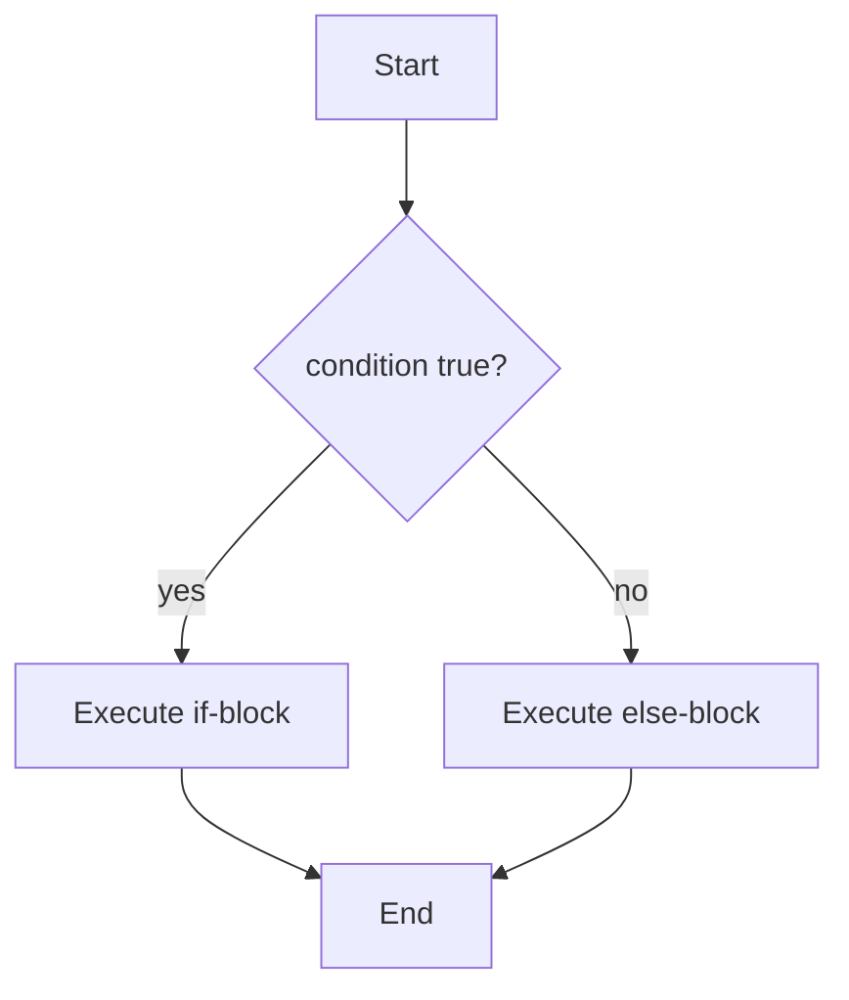
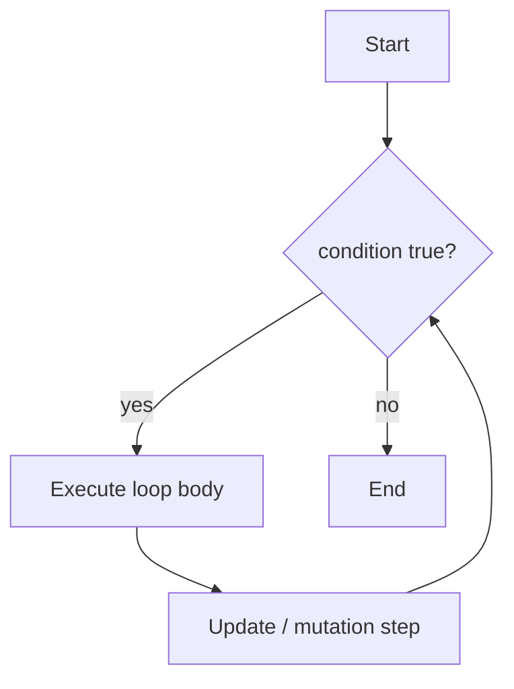
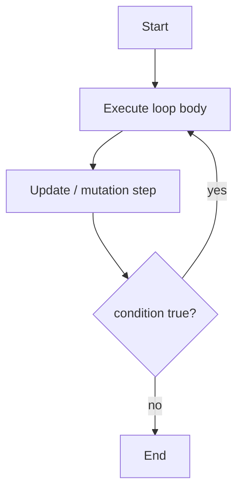
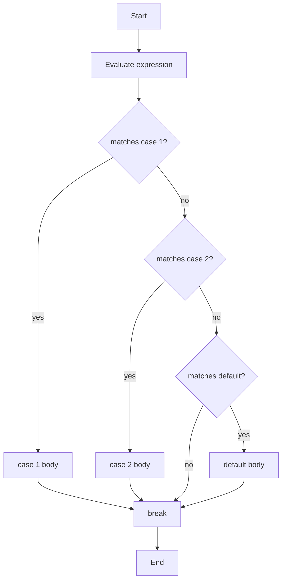
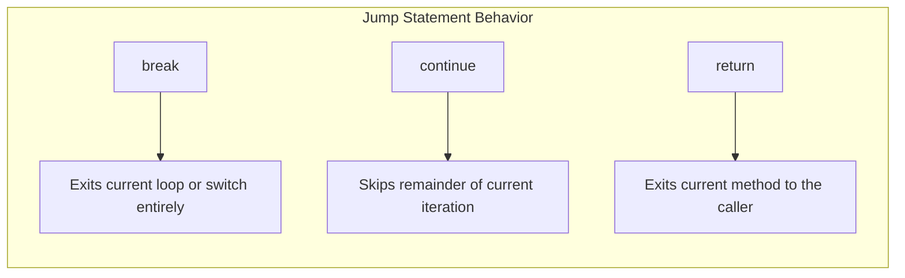
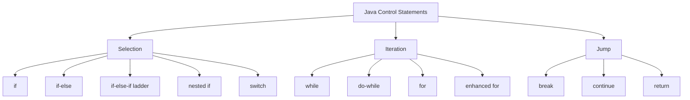

# Control Statements - Selection Statements, Iteration Statements and Jump Statements

<!-- SECTION_1_START -->
# Control Statements in Java

## 1. Core Technical Definition & Intuitive Overview

### Formal Academic Definition (KTU 2024 Syllabus Terminology)

> [!IMPORTANT]
> **Control Statements** in Java are the statements that alter the normal sequential flow of program execution. They fall into three primary categories defined by the Java Language Specification (JLS §14):
>
> 1. **Selection Statements** — Choose one of several execution paths based on a Boolean condition (`if`, `if-else`, `switch`).
> 2. **Iteration Statements** — Repeatedly execute a block of code while a condition remains `true` (`while`, `do-while`, `for`, enhanced `for`).
> 3. **Jump Statements** — Transfer control unconditionally to another part of the program (`break`, `continue`, `return`).

In the KTU 2024 Scheme, control structures are the foundation of **Module 1: Introduction to Java**, mapped to **CO1 (Apply)** of *PBCST304 – Object Oriented Programming*.

### Conceptual Analogy / Intuition

Imagine a railway track with junctions (selection), loops (iteration), and emergency exits (jump).

- **Selection** is like a **railway signal post**. The signal may show *green* (do task A) or *red* (do task B) — only one path is taken.
- **Iteration** is like a **merry-go-round**. You keep riding (executing) as long as the operator is pressing the start button (condition `true`).
- **Jump** is like an **emergency exit door**. It abruptly forces you out of the current carriage (loop) without completing the round.

> [!NOTE]
> **Key Insight:** Java's `if` and `switch` are the only constructs that produce *branching* in the Control Flow Graph (CFG). Iteration statements generate *cycles* in the CFG.

### GeoGebra / Desmos Visualization Callout

> [!VISUALIZATION CONTROL]
> **Concept:** Decision Tree / Control Flow Visualization
> **GeoGebra / Desmos Input Equations:**
> * `y = 1` for `condition == true`
> * `y = -1` for `condition == false`
> **Visual Description:** Plot a discrete step function. The x-axis represents the evaluation of the condition; the y-axis represents which branch is taken. Students should observe that the program counter moves either up (branch 1) or down (branch 2), but never both — this is *mutual exclusion*.

---

## 2. Categories of Control Statements — Quick Map

> [!IMPORTANT]
> **KTU 2024 Module 1 — Sub-topic Mapping**
> The official KTU syllabus groups control statements into three families. The table below is the canonical answer to any viva question: *"How many types of control statements does Java support?"*

| S.No. | Family              | Construct Members                                          | CFG Behavior         |
|:-----:|---------------------|------------------------------------------------------------|----------------------|
| 1     | Selection           | `if`, `if-else`, `if-else-if`, nested `if`, `switch`       | Branching (DAG)      |
| 2     | Iteration           | `while`, `do-while`, `for`, enhanced `for` (for-each)      | Cycle (Loop)         |
| 3     | Jump                | `break`, `continue`, `return`                              | Unconditional Edge   |

<!-- SECTION_1_END -->

<!-- SECTION_2_START -->
# Deep Theoretical Analysis & KTU High-Yield Formula Sheet

## 1. Selection Statements — Operative Theory

### 1.1 The `if` Statement
Executes a block of code **only if** the condition evaluates to `true`.

**Operational Logic (Step-by-Step):**
1. Evaluate the Boolean expression inside the parentheses.
2. If the result is `true`, the JVM executes the `if-body`.
3. If the result is `false`, the JVM skips the `if-body` and proceeds to the next statement after the block.
4. **Memory Cost:** Zero — uses only the operand stack and program counter (PC).

### 1.2 The `if-else` Statement
Introduces a **mutually exclusive** alternative path. Exactly one of the two blocks is executed.

### 1.3 The `if-else-if` Ladder
Used to test multiple conditions in sequence. The first condition that evaluates to `true` has its block executed; all remaining conditions are then **short-circuited** (not evaluated).

> [!NOTE]
> **Short-Circuit Evaluation:** Java uses lazy evaluation for `&&` and `||`. This means in an expression `A && B`, if `A` is `false`, `B` is never evaluated. This is a frequently tested KTU concept.

### 1.4 Nested `if`
An `if` statement placed inside another `if` (or `else`) statement. Indentation is for readability only; Java does not require it (unlike Python).

### 1.5 The `switch` Statement
A **multi-way branch** that compares a single variable (the *expression*) against a list of `case` labels.

**Operational Logic (Step-by-Step):**
1. Evaluate the *expression* once.
2. Compare the value against each `case` constant in order.
3. If a match is found, execute statements starting from that `case` label.
4. **Fall-through** continues to subsequent cases **unless** a `break` statement is encountered.
5. If no `case` matches, the optional `default` block executes.
6. **Modern Java (14+)** introduced the *arrow-syntax* (`case X -> code;`) which eliminates fall-through entirely.

> [!IMPORTANT]
> **Permitted `switch` types in Java:** `byte`, `short`, `char`, `int`, their wrapper classes, **enumerations**, and **Strings** (since Java 7). `long`, `float`, `double`, and `boolean` are **NOT** allowed.

## 2. Iteration Statements — Operative Theory

### 2.1 The `while` Loop (Entry-Controlled)
**Pre-condition loop.** The condition is tested **before** the body executes. If the condition is `false` initially, the body runs **zero times** (zero-trip property).

### 2.2 The `do-while` Loop (Exit-Controlled)
**Post-condition loop.** The body executes **at least once** before the condition is tested. The condition is at the **bottom**, terminated by a semicolon.

### 2.3 The `for` Loop (Counter-Controlled)
A compact form containing three sections: *initialization*, *condition*, and *update*. Best used when the number of iterations is known in advance.

### 2.4 The Enhanced `for` Loop (For-Each)
Introduced in **Java 5** (JLS §14.14.2). Used exclusively to iterate over arrays and `Iterable` collections without using an index variable.

> [!NOTE]
> **Limitation of Enhanced `for`:** You **cannot** modify the collection's structure (add/remove elements) during iteration, and you **cannot** access the current index. This is a KTU viva classic.

## 3. Jump Statements — Operative Theory

### 3.1 `break`
Terminates the **innermost enclosing** `switch`, `while`, `do-while`, or `for` statement. When combined with a *label*, it can exit an outer loop (this is the **labeled break** pattern).

### 3.2 `continue`
Skips the remaining statements in the current iteration and proceeds directly to the next iteration of the loop. With a *label*, it can target an outer loop (the **labeled continue** pattern).

### 3.3 `return`
Exits from the **current method**, optionally returning a value to the caller. It unconditionally transfers control back to the calling stack frame.

## 4. KTU Formula / Syntax Cheat Sheet

> [!IMPORTANT]
> **The following table is the master reference for all control statement syntaxes. Memorize the column "Default Trip Count" — it is a 3-mark favorite.**

| Construct              | General Syntax (Skeleton)                                                                                                                                  | Condition Check Position | Default Trip Count | Fall-Through Allowed? |
|------------------------|----------------------------------------------------------------------------------------------------------------------------------------------------------|--------------------------|--------------------|-----------------------|
| `if`                   | `if (cond) { ... }`                                                                                                                                       | Top                      | 0 or 1             | N/A                   |
| `if-else`              | `if (cond) { ... } else { ... }`                                                                                                                          | Top                      | exactly 1          | N/A                   |
| `if-else-if`           | `if (c1) { } else if (c2) { } else { }`                                                                                                                   | Top (chained)            | exactly 1          | N/A                   |
| `switch` (classic)     | `switch(expr){ case v1: ...; break; case v2: ...; break; default: ...; }`                                                                                  | Top                      | 0 or 1             | **Yes** (without `break`) |
| `switch` (arrow, Java 14+) | `switch(expr){ case v1 -> ...; case v2 -> ...; default -> ...; }`                                                                                      | Top                      | 0 or 1             | **No**                |
| `while`                | `while (cond) { ... }`                                                                                                                                    | Top                      | 0 or more          | N/A                   |
| `do-while`             | `do { ... } while (cond);`                                                                                                                                | **Bottom**               | 1 or more          | N/A                   |
| `for` (classic)        | `for (init; cond; update) { ... }`                                                                                                                         | Top                      | 0 or more          | N/A                   |
| Enhanced `for`         | `for (Type var : arrayOrIterable) { ... }`                                                                                                                 | Top (implicit)           | size of collection | N/A                   |
| `break`                | `break;` (or `break label;`)                                                                                                                               | N/A                      | N/A                | N/A                   |
| `continue`             | `continue;` (or `continue label;`)                                                                                                                         | N/A                      | N/A                | N/A                   |
| `return`               | `return;` or `return value;`                                                                                                                               | N/A                      | N/A                | N/A                   |

### Engineering / Production Utility

Control statements are the backbone of virtually every software system:

- **Input validation in web forms** (selection).
- **Pagination loops over database result sets** (iteration via enhanced `for`).
- **State machines in network protocol handlers** (`switch` with `enum`).
- **Search algorithms with early exit** (`break` on first match — improves worst-case time complexity).
- **Skip invalid packets in stream processing** (`continue` to filter).

<!-- SECTION_2_END -->

<!-- SECTION_3_START -->
# Step-by-Step Derivations, Trace Tables & Code Implementation

## 1. Selection Statements — Worked Code with Traces

### 1.1 The `if-else-if` Ladder — Grade Classifier

```java
import java.util.Scanner;

public class GradeClassifier {
    public static void main(String[] args) {
        Scanner scanner = new Scanner(System.in);
        System.out.print("Enter the marks (0-100): ");
        int marks = scanner.nextInt();

        String grade;
        if (marks < 0 || marks > 100) {
            grade = "INVALID";
        } else if (marks >= 90) {
            grade = "A+";
        } else if (marks >= 80) {
            grade = "A";
        } else if (marks >= 70) {
            grade = "B+";
        } else if (marks >= 60) {
            grade = "B";
        } else if (marks >= 50) {
            grade = "C";
        } else {
            grade = "F (Fail)";
        }

        System.out.println("Result: " + grade);
        scanner.close();
    }
}
```

**Trace Table for `marks = 85`:**

| Step | Expression Evaluated      | Result   | Action Taken                                |
|:----:|---------------------------|----------|---------------------------------------------|
| 1    | `85 < 0 \|\| 85 > 100`    | `false`  | Skip first block, try next.                 |
| 2    | `85 >= 90`                | `false`  | Skip.                                      |
| 3    | `85 >= 80`                | `true`   | Set `grade = "A"`, short-circuit rest.      |
| 4    | Output                    | —        | Prints `Result: A`                          |

### 1.2 The `switch` Statement — Day Name Resolver

```java
import java.util.Scanner;

public class DayNameResolver {
    public static void main(String[] args) {
        Scanner sc = new Scanner(System.in);
        System.out.print("Enter day number (1-7): ");
        int day = sc.nextInt();

        // Using the modern arrow syntax (Java 14+).
        String name = switch (day) {
            case 1 -> "Monday";
            case 2 -> "Tuesday";
            case 3 -> "Wednesday";
            case 4 -> "Thursday";
            case 5 -> "Friday";
            case 6, 7 -> "Weekend";
            default -> "Invalid";
        };

        System.out.println("Day: " + name);
        sc.close();
    }
}
```

> [!NOTE]
> Notice the **multiple labels** in `case 6, 7 -> "Weekend";`. This is a Java 14 feature — both `6` and `7` map to the same arrow body. The arrow form eliminates fall-through, making it the safest and most KTU-recommended form.

### 1.3 Demonstrating Fall-Through (Classic `switch`)

```java
public class FallThroughDemo {
    public static void main(String[] args) {
        int x = 2;

        switch (x) {
            case 1:
                System.out.println("One");
            case 2:
                System.out.println("Two");
            case 3:
                System.out.println("Three");
            default:
                System.out.println("Default");
        }
    }
}
```

**Output Trace (because no `break` is present):**

```
Two
Three
Default
```

This is the classic **fall-through behavior**. The program counter simply slides through every case label after the match until it hits the end of the `switch` block.

## 2. Iteration Statements — Worked Code with Traces

### 2.1 `while` vs `do-while` — Zero-Trip Demonstration

```java
public class LoopTripDemo {
    public static void main(String[] args) {
        int a = 10, b = 10;

        // ----- while loop -----
        System.out.println("--- while loop ---");
        while (a < 5) {            // condition false at entry
            System.out.println("a = " + a);
            a++;
        }
        System.out.println("After while, a = " + a);

        // ----- do-while loop -----
        System.out.println("--- do-while loop ---");
        do {
            System.out.println("b = " + b);
            b++;
        } while (b < 5);           // condition checked AFTER first run
        System.out.println("After do-while, b = " + b);
    }
}
```

**Output:**
```
--- while loop ---
After while, a = 10
--- do-while loop ---
b = 10
After do-while, b = 11
```

This output empirically proves the **zero-trip property** of `while` and the **at-least-once property** of `do-while`.

### 2.2 The Classic `for` Loop — Sum of First N Natural Numbers

The mathematical formula being implemented is:

$$
S_n = \sum_{i=1}^{n} i = \frac{n(n+1)}{2}
$$

The iterative code is:

```java
import java.util.Scanner;

public class SumOfNaturals {
    public static void main(String[] args) {
        Scanner sc = new Scanner(System.in);
        System.out.print("Enter N: ");
        int n = sc.nextInt();

        int iterativeSum = 0;
        for (int i = 1; i <= n; i++) {
            iterativeSum += i;
        }

        int formulaicSum = n * (n + 1) / 2;

        System.out.println("Iterative sum : " + iterativeSum);
        System.out.println("Formula sum   : " + formulaicSum);
        System.out.println("Match         : " + (iterativeSum == formulaicSum));
        sc.close();
    }
}
```

**Trace Table for `n = 4`:**

| Iteration (`i`) | `iterativeSum` before | `iterativeSum += i` | After  |
|:---------------:|:---------------------:|:-------------------:|:------:|
| 1               | 0                     | 0 + 1               | 1      |
| 2               | 1                     | 1 + 2               | 3      |
| 3               | 3                     | 3 + 3               | 6      |
| 4               | 6                     | 6 + 4               | 10     |
| Exit (i=5, condition false) | — | — | — |

Both methods yield **10**, which equals $\frac{4 \times 5}{2} = 10$. Verification complete.

### 2.3 The Enhanced `for` Loop — Iterating an Array

```java
public class EnhancedForDemo {
    public static void main(String[] args) {
        int[] primes = {2, 3, 5, 7, 11, 13};

        System.out.println("Primes in order:");
        for (int p : primes) {                 // read-only iteration
            System.out.print(p + " ");
        }
        System.out.println();
    }
}
```

**Output:**
```
Primes in order:
2 3 5 7 11 13
```

The `for (int p : primes)` syntax is **syntactic sugar** for a hidden `Iterator`-based traversal. It is **read-only** in the sense that the loop variable `p` is a copy — modifying `p` does not change the array element.

## 3. Jump Statements — Worked Code with Traces

### 3.1 `break` — Search an Array with Early Exit

```java
public class BreakSearch {
    public static void main(String[] args) {
        int[] data = {14, 7, 21, 35, 42, 56};
        int target = 35;
        int index = -1;

        for (int i = 0; i < data.length; i++) {
            if (data[i] == target) {
                index = i;
                break;                          // <-- exits loop immediately
            }
        }

        System.out.println("Target " + target + " found at index: " + index);
    }
}
```

**Output:** `Target 35 found at index: 3`

### 3.2 `continue` — Skip Even Numbers

```java
public class ContinueDemo {
    public static void main(String[] args) {
        for (int i = 1; i <= 10; i++) {
            if (i % 2 == 0) {
                continue;                       // skip print for even i
            }
            System.out.print(i + " ");
        }
    }
}
```

**Output:** `1 3 5 7 9`

### 3.3 Labeled `break` — Exiting Nested Loops

```java
public class LabeledBreakDemo {
    public static void main(String[] args) {
        int[][] matrix = {
            {1, 2, 3},
            {4, 5, 6},
            {7, 8, 9}
        };
        int searchFor = 5;
        boolean found = false;

        search:                                  // <-- label declaration
        for (int r = 0; r < matrix.length; r++) {
            for (int c = 0; c < matrix[r].length; c++) {
                if (matrix[r][c] == searchFor) {
                    found = true;
                    break search;               // <-- exits BOTH loops
                }
            }
        }

        System.out.println("Found? " + found);
    }
}
```

**Trace:**
- Iteration `r=0, c=0,1,2` → no match.
- Iteration `r=1, c=0` → no match. `c=1` → **match found**, `break search` jumps directly to the line after the outer loop.
- Output: `Found? true`

### 3.4 `return` — Terminating a Method Early

```java
public class ReturnDemo {
    public static void main(String[] args) {
        System.out.println("isPrime(7) = " + isPrime(7));
        System.out.println("isPrime(10) = " + isPrime(10));
    }

    static boolean isPrime(int n) {
        if (n < 2) return false;                // early exit
        for (int i = 2; i * i <= n; i++) {
            if (n % i == 0) return false;       // divisor found, not prime
        }
        return true;                            // survived all checks
    }
}
```

**Output:**
```
isPrime(7) = true
isPrime(10) = false
```

<!-- SECTION_3_END -->

<!-- SECTION_4_START -->
# Structural Diagrams & Schematics

## 1. Control Flow Graphs (CFG) for Each Construct

> [!NOTE]
> Mermaid `flowchart` syntax is used to render decision and loop topologies. Every node is alphanumeric and every label is double-quoted plain text — fully compliant with the Mermaid safety rules.

### 1.1 `if-else` Control Flow



### 1.2 `while` Loop Control Flow



### 1.3 `do-while` Loop Control Flow



### 1.4 Classic `switch` Control Flow



### 1.5 `break` vs `continue` vs `return` — Behavior Matrix



### 1.6 Master Family Tree of Java Control Statements



<!-- SECTION_4_END -->

<!-- SECTION_5_START -->
# KTU 2024 Scheme Examination Question Bank & Topic Recap

## Part A — 3-Mark Questions (Remember / Understand)

### Question 1
`[KTU University Exam - July 2024]`
**Differentiate between entry-controlled and exit-controlled loops in Java. Give one example for each.** **[CO1, Understand]**

**Model Answer (3 Marks):**
- An **entry-controlled loop** tests the condition **before** executing the loop body. If the condition is `false` initially, the body executes **zero times**. Example: `while` loop, `for` loop.
- An **exit-controlled loop** tests the condition **after** executing the body. The body therefore runs **at least once**. Example: `do-while` loop.
- **Validation key:** Mention "zero-trip" vs "at-least-once" explicitly to claim the third mark.

### Question 2
`[KTU University Exam - Dec 2023]`
**What is the difference between `break` and `continue` statements in Java? Provide one example each.** **[CO1, Remember]**

**Model Answer (3 Marks):**
- `break` **terminates** the current loop or `switch` and transfers control to the statement immediately following the loop.
- `continue` **skips the remaining statements** in the current iteration and proceeds to the **next iteration** of the loop.
- Example for `break`: `if (x == 5) break;` — stops the loop when `x` becomes 5.
- Example for `continue`: `if (x % 2 == 0) continue;` — skips even numbers.
- **Validation key:** A common student error is to say `break` "stops the program" — strictly state it stops the **loop**, not the JVM.

---

## Part B — 14-Mark Questions (Apply / Analyze)

> [!WARNING]
> **KTU Examiner's Valuation Warning / Pitfall Callout**
> 1. In `switch` programs, **forgetting the `break`** causes cascading output — the examiner will deduct **2 marks** for not writing it.
> 2. In `if-else-if` ladder, **writing the wrong relational operator** (`>` instead of `>=`) is the most common deduction — verify boundary values (90, 80, 70…) explicitly.
> 3. For `do-while`, students often forget the **semicolon** after `while (cond);` — this is a 0.5-mark syntax penalty.
> 4. In nested loop questions, label the loops as `outer:` and `inner:` clearly to claim full marks for the labeled `break`/`continue` logic.

### Question A — 14 Marks
`[KTU University Exam - Model Paper 2024]`
**A) [7 Marks]** Explain the different types of selection statements in Java with suitable syntax. **[CO1, Understand]**
**B) [7 Marks]** Write a Java program to read an integer `N` and print whether it is a **palindrome** using a `while` loop. **[CO1, Apply]**

#### Part A Model Solution (7 Marks)

Selection statements in Java are constructs that choose one of several execution paths based on a Boolean condition. There are three primary types:

1. **Simple `if` statement** — executes a block only if the condition is true.
   Syntax: `if (condition) { /* code */ }`
2. **`if-else` statement** — provides an alternative path if the condition is false.
   Syntax: `if (condition) { /* code A */ } else { /* code B */ }`
3. **`if-else-if` ladder** — chains multiple conditions; the first `true` condition's body executes.
   Syntax: `if (c1) { ... } else if (c2) { ... } else { ... }`
4. **`switch` statement** — multi-way branch based on value equality with `case` labels.
   Syntax: `switch(expr) { case v1: ...; break; default: ...; }`
5. **Nested `if`** — an `if` inside another `if` for hierarchical decisions.

*Valuation key:*
- *Naming all 4–5 types: 3 marks*
- *Syntax for each: 2 marks*
- *Use case: 2 marks*

#### Part B Model Solution (7 Marks) — Palindrome Checker

```java
import java.util.Scanner;

public class PalindromeChecker {
    public static void main(String[] args) {
        Scanner sc = new Scanner(System.in);
        System.out.print("Enter an integer N: ");
        int n = sc.nextInt();
        int original = n;
        int reversed = 0;

        while (n > 0) {
            int digit = n % 10;                  // extract last digit
            reversed = reversed * 10 + digit;    // build reversed number
            n = n / 10;                          // remove last digit
        }

        if (original == reversed) {
            System.out.println(original + " is a palindrome.");
        } else {
            System.out.println(original + " is NOT a palindrome.");
        }
        sc.close();
    }
}
```

**Trace for `N = 12321`:**

| Iteration | `n` | `digit = n%10` | `reversed = reversed*10 + digit` | `n = n/10` |
|:---------:|:---:|:--------------:|:---------------------------------:|:----------:|
| 1         | 12321 | 1            | 0×10+1 = 1                        | 1232       |
| 2         | 1232  | 2            | 1×10+2 = 12                       | 123        |
| 3         | 123   | 3            | 12×10+3 = 123                     | 12         |
| 4         | 12    | 2            | 123×10+2 = 1232                   | 1          |
| 5         | 1     | 1            | 1232×10+1 = 12321                 | 0          |
| Exit      | 0     | —            | —                                 | —          |

`original = 12321` and `reversed = 12321` → palindrome confirmed.

*Valuation key:*
- *Logic for digit extraction: 2 marks*
- *Reversed number construction: 2 marks*
- *Loop termination: 1 mark*
- *Comparison and output: 2 marks*

### Question B — 14 Marks (Internal Choice)
`[KTU University Exam - Model Paper 2024]`
**A) [7 Marks]** Write a Java program using a `for` loop to display the following pattern:
```
1
1 2
1 2 3
1 2 3 4
1 2 3 4 5
```
**B) [7 Marks]** Explain the working of the `switch` statement in Java. What are its limitations? **[CO1, Apply / Understand]**

#### Part A Model Solution (7 Marks) — Number Pattern

```java
public class NumberPattern {
    public static void main(String[] args) {
        int rows = 5;

        for (int i = 1; i <= rows; i++) {          // outer: row counter
            for (int j = 1; j <= i; j++) {         // inner: prints 1..i
                System.out.print(j + " ");
            }
            System.out.println();                  // newline after each row
        }
    }
}
```

*Valuation key:*
- *Correct outer loop bounds: 2 marks*
- *Correct inner loop bounds: 2 marks*
- *Print statement and newline: 2 marks*
- *Successful trace for at least 3 rows: 1 mark*

#### Part B Model Solution (7 Marks) — Switch Working & Limitations

**Working of `switch`:**
1. The expression inside `switch(expr)` is evaluated **exactly once**.
2. The result is compared with each `case` constant using the `==` operator.
3. When a match is found, execution starts at that `case` and continues **until a `break` is hit** or the `switch` block ends.
4. If no `case` matches, the optional `default` block is executed.
5. Permitted expression types: `byte`, `short`, `char`, `int`, wrapper types, `enum`, and `String`.

**Limitations:**
1. The expression **cannot** be of type `long`, `float`, `double`, or `boolean`.
2. `case` labels must be **compile-time constants**, not variables or ranges.
3. Classic `switch` suffers from unintended **fall-through** when `break` is forgotten.
4. No relational operators (`<`, `>`) are allowed — only equality comparison.

*Valuation key:*
- *Step-by-step working explanation: 4 marks*
- *Listing at least 3 limitations: 2 marks*
- *Type restrictions: 1 mark*

---

## Topic Recap & Important Things to Remember

- **Java has three families of control statements**: selection (`if`, `switch`), iteration (`while`, `do-while`, `for`, enhanced `for`), and jump (`break`, `continue`, `return`).
- The `while` loop is **entry-controlled (zero-trip)**; the `do-while` loop is **exit-controlled (at-least-once)**.
- The classic `for` loop has three sections: **initialization; condition; update**.
- The **enhanced `for`** loop (Java 5+) is used for **read-only traversal** of arrays and `Iterable` collections; you cannot modify the collection size during iteration.
- `switch` accepts only `byte`, `short`, `char`, `int`, **wrapper** types, **`enum`**, and **`String`** — never `long`, `float`, `double`, or `boolean`.
- Without a `break` in a classic `switch`, **fall-through** occurs — execution cascades to subsequent cases.
- Java 14+ supports `case X -> ...;` arrow syntax, which **eliminates fall-through** and supports multiple labels like `case 6, 7 -> ...;`.
- `break` exits the **innermost loop or switch**; with a *label*, it can exit an **outer loop** (labeled `break`).
- `continue` **skips the rest of the current iteration** and proceeds to the next; with a *label*, it targets an outer loop.
- `return` exits the **current method** entirely, optionally sending a value back to the caller.
- **Short-circuit evaluation** in `&&` and `||` means the second operand is evaluated only if necessary — frequently tested.
- The **ternary operator `? :`** is an expression-form alternative to `if-else`, useful for inline assignments.

<!-- SECTION_5_END -->
