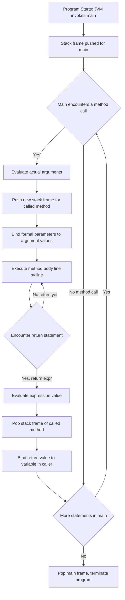
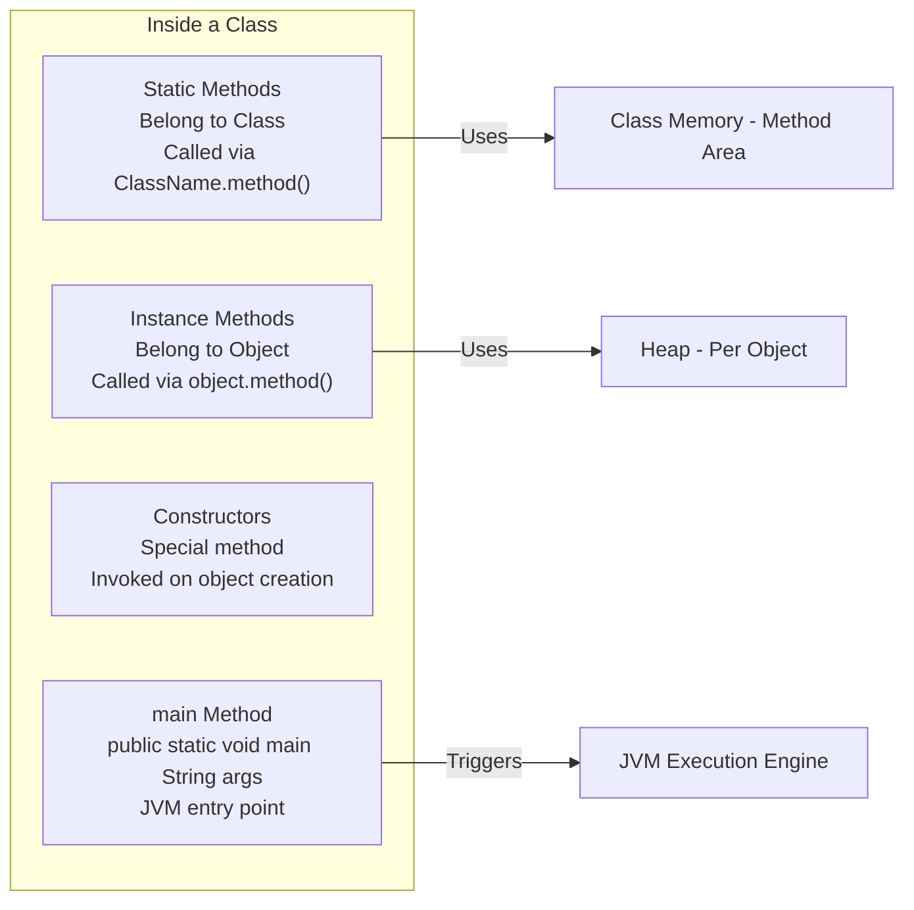
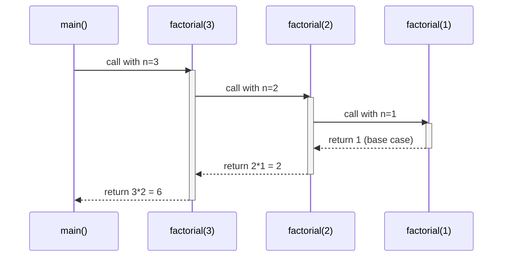
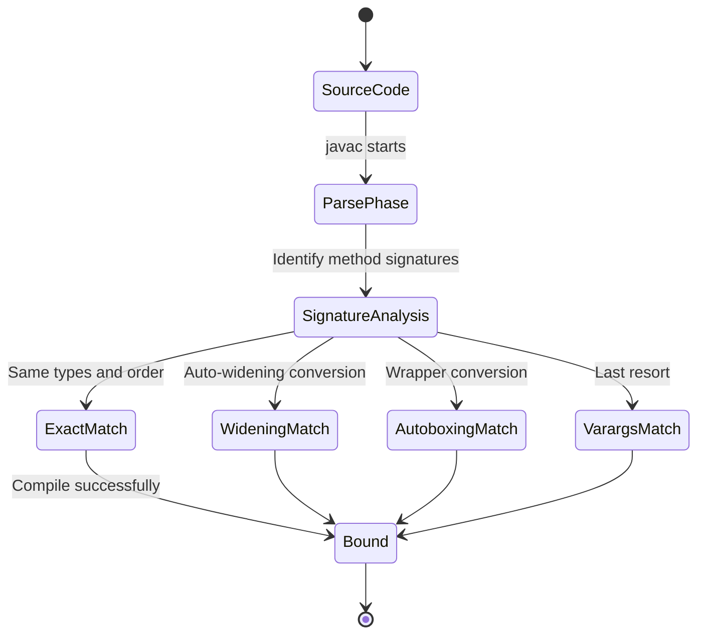
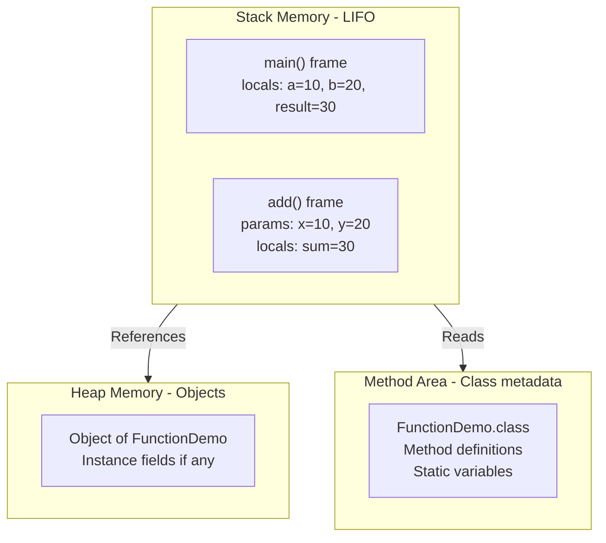
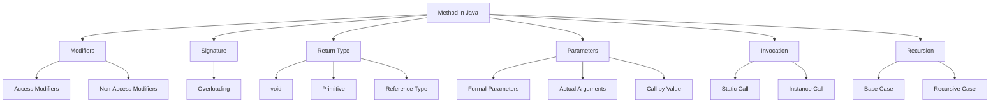

# Functions

<!-- SECTION_1_START -->
# 1. Core Technical Definition & Intuitive Overview

## 1.1 Formal Academic Definition

In the **Java** programming language, a **function** (technically called a **method** in Java terminology) is a named, reusable block of statements that performs a specific, well-defined task. A method encapsulates a sequence of operations, optionally accepts input values known as **parameters**, optionally returns a single output value, and can be invoked (called) any number of times from different points within a program.

According to the KTU 2024 Scheme syllabus (PBCST304 – Object Oriented Programming, Module 1), a method in Java is the fundamental unit of **modularization** and **code reuse**, embodying the procedural abstraction principle of structured programming within an object-oriented framework.

> [!IMPORTANT]
> **KTU Syllabus Highlight:**
> In Java, there are **no standalone functions** like in C/C++. Every function must belong to a **class** or an **interface** (default/static methods). When we say "function" in KTU Module 1, we strictly mean a **class member method**.

## 1.2 Conceptual Analogy / Intuition

Imagine a **vending machine** in a college canteen:

- The machine has a **name** (e.g., "Coffee Dispenser").
- It has a clearly defined **input slot** — you insert a coin and press a button (these are your **parameters / arguments**).
- It has an **internal mechanism** — grinding, heating, mixing (these are the **statements** inside the method body).
- It may **return an output** — a paper cup of coffee (the **return value**).
- You can use the same machine any number of times — you just call it again (**invocation**).

A Java method behaves exactly like this vending machine: a black box that takes inputs, does something, and may give back a result. You don't need to know *how* the machine works internally; you just need to know its **name**, **what to feed it**, and **what to expect back**.

Another useful analogy: think of a method as a **recipe** in a cookbook. The recipe has a **title** (method name), a **list of ingredients** (parameters), a **set of cooking steps** (method body), and a **final dish** (return value).

## 1.3 Anatomy of a Java Method — The Five Building Blocks

A Java method declaration consists of **five essential components**:

| Component | Purpose | Example |
|---|---|---|
| **Access Modifier** | Visibility control | `public`, `private`, `protected` |
| **Non-Access Modifier** *(optional)* | Behavioural property | `static`, `final`, `abstract` |
| **Return Type** | Type of value returned | `void`, `int`, `double`, `String` |
| **Method Name** | Identifier for invocation | `calculateSum`, `display` |
| **Parameter List** | Inputs to the method | `(int a, int b)`, `(String name)` |

> [!NOTE]
> **Constants used in Java Method Design (JLS - Java Language Specification):**
> - Maximum identifier length: **no official limit** (convention: keep it descriptive, $\leq$ 30 chars).
> - Method overloading is resolved at **compile time** based on method signature.
> - Java is **strictly call-by-value** (pass-by-value) — there is **no** call-by-reference in Java, ever. This is **bold** because it is a famous KTU viva question.

## 1.4 GeoGebra / Desmos Integration

> [!VISUALIZATION CONTROL]
> **Concept:** Visualizing method call stack as a sequence of nested rectangles (activation frames) on a coordinate plane.
>
> **GeoGebra / Desmos Input Equations:**
> * `R1 = (1, 1)` to `(4, 3)` — represents `main()` frame
> * `R2 = (1.5, 0.5)` to `(3.5, 1.5)` — represents `add()` frame
> * `R3 = (2, 0)` to `(3, 0.5)` — represents helper call frame
>
> **Visual Description:** When `main()` calls `add()`, a new inner rectangle appears below `R1` representing the activation record of `add()`. When `add()` returns, its rectangle disappears — symbolising stack unwinding.

<!-- SECTION_1_END -->

<!-- SECTION_2_START -->
# 2. Deep Theoretical Analysis & KTU High-Yield Formula Sheet

## 2.1 Method Declaration — Formal Syntax

The general syntax for declaring a method in Java is:

```
accessModifier nonAccessModifier returnType methodName(parameterList) {
    // method body
    // local variable declarations
    // executable statements
    return value;   // mandatory if returnType is NOT void
}
```

Each component plays a specific role. Let us dissect them:

### 2.1.1 Access Modifiers (Visibility Scope)

| Modifier | Same Class | Same Package | Subclass (Diff. Package) | Other Classes |
|---|---|---|---|---|
| `private` | ✓ | ✗ | ✗ | ✗ |
| *default* (no modifier) | ✓ | ✓ | ✗ | ✗ |
| `protected` | ✓ | ✓ | ✓ | ✗ |
| `public` | ✓ | ✓ | ✓ | ✓ |

> [!IMPORTANT]
> **Package-private (default) access** is unique to Java. If you omit the access modifier, the method is accessible *only* within the same package — a frequent KTU two-mark question.

### 2.1.2 Non-Access Modifiers

- **`static`** — Method belongs to the class, not to any object. Can be called without instantiation via `ClassName.methodName()`.
- **`final`** — Method cannot be overridden by subclasses.
- **`abstract`** — Method has no body; must be implemented in the first concrete subclass.
- **`synchronized`** — Thread-safety lock on the method.

### 2.1.3 Return Type

- The return type declares the **data type** of the value the method will send back to the caller.
- If the method returns nothing, the keyword **`void`** is used.
- A method can return **at most one value** (but the value can be a reference to an array or object containing many sub-values).
- The expression in the `return` statement must be **type-compatible** with the declared return type (implicit widening conversion is allowed).

### 2.1.4 Method Signature

The **method signature** in Java is defined as:
$$\text{methodSignature} = \text{methodName} + \text{parameterList (types only, not names)}$$

- Return type is **NOT** part of the method signature.
- Two methods can have the same name only if their parameter lists differ — this is **Method Overloading**.

### 2.1.5 Parameter List

- Declared inside the parentheses `( )` after the method name.
- Each parameter has the form: `dataType parameterName`.
- Parameters are separated by commas.
- If no parameters are needed, the parentheses are still required but empty: `()`.

## 2.2 Types of Methods in Java

| Category | Description | Example |
|---|---|---|
| **Predefined (Library / Built-in)** | Provided by JDK inside classes like `Math`, `String`, `System` | `Math.sqrt(16)`, `System.out.println()` |
| **User-defined** | Created by the programmer inside a class | `int add(int a, int b) { ... }` |
| **Static methods** | Belong to the class; called via class name | `Math.max(a, b)` |
| **Instance methods** | Belong to objects; require an instance | `s.length()` where `s` is a `String` |
| **`main()` method** | Entry point of every standalone Java program | `public static void main(String[] args)` |

## 2.3 Method Invocation / Calling Mechanism

There are **two ways** to call a method in Java, depending on whether it is static or instance-based:

1. **For static methods:** `ClassName.methodName(arguments);` or simply `methodName(arguments);` from within the same class.
2. **For instance (non-static) methods:**
   $$\text{objectReference.methodName(arguments);}$$

**Argument Passing Rules:**
- The number, type, and order of **actual arguments** in the call must match the **formal parameters** in the declaration (subject to widening conversion).
- Each actual argument is evaluated **before** the method body begins execution.

## 2.4 The `main()` Method — The Special Method

The signature:
$$\text{public static void main(String[] args)}$$

- **`public`** — JVM (which lies outside the package) must be able to access it.
- **`static`** — JVM invokes it before any object is created.
- **`void`** — It does not return any value to the OS.
- **`String[] args`** — Accepts command-line arguments.

> [!NOTE]
> **`String args[]` and `String[] args` are equivalent**, but `String[] args` is the **preferred KTU board style**.

## 2.5 Method Overloading

**Method Overloading** is the process of defining **multiple methods with the same name** but **different parameter lists** within the same class. The compiler distinguishes them by their signature.

Rules for valid overloading (methods must differ in **at least one** of):
- Number of parameters
- Types of parameters
- Order of parameter types

> [!WARNING]
> **Changing only the return type** does **NOT** constitute overloading and results in a **compilation error**.

## 2.6 Call by Value (Java's Strict Rule)

Java passes arguments **by value, always**. For primitive types, a copy of the actual value is passed. For object references, a copy of the reference (the memory address) is passed — but the original reference variable is unaffected.

$$\text{callMechanism}_{\text{Java}} = \text{callByValue}(\text{primitives}) \cup \text{callByValueOfReference}(\text{objects})$$

## 2.7 Recursion

A method that **calls itself** is a recursive method. Every recursive method must have:
- A **base case** (termination condition).
- A **recursive case** (the call to itself with a smaller sub-problem).

## 2.8 Scope and Lifetime of Variables in Methods

| Variable Type | Scope | Lifetime |
|---|---|---|
| **Local variable** (declared inside method) | Method block `{ }` | Until method returns |
| **Parameter (formal argument)** | Method block `{ }` | Until method returns |
| **Block variable** (inside `if`, `for`) | The block `{ }` only | Until block exits |

## 2.9 KTU Formula Sheet / Cheat Sheet

| # | Concept | Formula / Rule | Use in Exam |
|---|---|---|---|
| 1 | Method Signature | `name + parameter types` | Differentiate overloaded methods |
| 2 | Return Statement | `return (expr);` | Mandatory for non-void return type |
| 3 | Argument Matching | $n_{actual} = n_{formal}$, types match with widening | Validate method call |
| 4 | Call Mechanism | $v_{formal} = v_{actual}$ (copy) | Trace value changes |
| 5 | `main()` Signature | `public static void main(String[] args)` | Boilerplate of every Java program |
| 6 | Recursion Termination | $T(0) = c$, $T(n) = T(n-1) + d$ | Trace recursive calls |
| 7 | Overloading Resolution | Best match by exact $>$ widening $>$ autoboxing $>$ varargs | Compile-time binding |
| 8 | Stack Frame Size | $\text{size} = \sum(\text{parameters}) + \text{locals} + \text{return address}$ | Visualise recursion depth |

## 2.10 Real-World Utility in Engineering

- **Modular software design** — Each method performs a single, testable task (Single Responsibility Principle).
- **Code reuse** — Write once, call many times (used heavily in Java Collections API, e.g., `list.add()`, `map.put()`).
- **API design** — A method's signature is a *contract* between the library and the user.
- **Distributed systems** — Methods become **remote procedure calls (RPCs)** in microservices.

<!-- SECTION_2_END -->

<!-- SECTION_3_START -->
# 3. Step-by-Step Derivations & Code/Symbolic Implementation

## 3.1 A Complete Java Program Demonstrating Functions

Below is a fully working Java program that demonstrates **every concept** a KTU Module 1 student must know about functions. It is exhaustively commented and uses strict type hints in the style of modern Java.

```java
// File: FunctionDemo.java
// Course: PBCST304 - OOP, Module 1 - Functions
// Demonstrates: method declaration, return types, parameters, overloading,
//               static vs instance, call by value, recursion, and main().

import java.util.Scanner;

public class FunctionDemo {

    // -------- 1. STATIC method with two int parameters and int return type --------
    // This is a USER-DEFINED function that adds two integers.
    public static int add(int a, int b) {
        int sum = a + b;        // local variable 'sum'
        return sum;             // returns the computed value to the caller
    }

    // -------- 2. METHOD OVERLOADING (same name, different parameter list) --------
    // Overload #1: add two ints
    public static int add(int a, int b, int c) {
        return a + b + c;
    }

    // Overload #2: add two doubles (different parameter type)
    public static double add(double a, double b) {
        return a + b;
    }

    // -------- 3. VOID method - performs action but returns nothing --------
    public static void greet(String name) {
        System.out.println("Hello, " + name + "! Welcome to Java Functions.");
    }

    // -------- 4. INSTANCE method - belongs to objects of FunctionDemo --------
    public int multiply(int a, int b) {
        return a * b;
    }

    // -------- 5. METHOD demonstrating CALL BY VALUE on primitives --------
    public static void tryToModify(int x) {
        x = x + 100;             // modifies the local COPY, not the caller's variable
        System.out.println("Inside tryToModify, x = " + x);
    }

    // -------- 6. RECURSIVE method - computes factorial --------
    public static long factorial(int n) {
        if (n <= 1) {            // BASE CASE - prevents infinite recursion
            return 1;
        }
        return n * factorial(n - 1);   // RECURSIVE CASE
    }

    // -------- 7. METHOD with NO parameters returning a value --------
    public static String getCourseCode() {
        return "PBCST304";
    }

    // -------- 8. THE main() METHOD - JVM entry point --------
    public static void main(String[] args) {

        // --- Calling a static method ---
        int result1 = add(10, 20);
        System.out.println("add(10, 20) = " + result1);

        // --- Calling an overloaded method ---
        int result2 = add(1, 2, 3);
        double result3 = add(2.5, 3.7);
        System.out.println("add(1,2,3) = " + result2);
        System.out.println("add(2.5,3.7) = " + result3);

        // --- Calling a void method ---
        greet("Anagha");

        // --- Calling an instance method: requires an object ---
        FunctionDemo obj = new FunctionDemo();
        int product = obj.multiply(6, 7);
        System.out.println("multiply(6, 7) = " + product);

        // --- Demonstrating Call By Value ---
        int original = 50;
        tryToModify(original);
        System.out.println("After tryToModify, original = " + original);   // still 50

        // --- Calling a recursive method ---
        long fact5 = factorial(5);
        System.out.println("factorial(5) = " + fact5);

        // --- Command-line arguments demo ---
        if (args.length > 0) {
            System.out.println("First command-line arg: " + args[0]);
        } else {
            System.out.println("No command-line arguments provided.");
        }

        // --- Method returning a constant value ---
        System.out.println("Course Code: " + getCourseCode());
    }
}
```

### 3.1.1 Output Trace

```
add(10, 20) = 30
add(1,2,3) = 6
add(2.5,3.7) = 6.2
Hello, Anagha! Welcome to Java Functions.
multiply(6, 7) = 42
Inside tryToModify, x = 150
After tryToModify, original = 50
factorial(5) = 120
No command-line arguments provided.
Course Code: PBCST304
```

## 3.2 Exhaustive Step-by-Step Trace of `factorial(5)`

To illustrate recursion, here is the **complete call-by-call trace**:

| Call # | Argument `n` | Condition `n <= 1` | Value Returned |
|---|---|---|---|
| 1 | $n = 5$ | False | $5 \times \text{factorial}(4)$ |
| 2 | $n = 4$ | False | $4 \times \text{factorial}(3)$ |
| 3 | $n = 3$ | False | $3 \times \text{factorial}(2)$ |
| 4 | $n = 2$ | False | $2 \times \text{factorial}(1)$ |
| 5 | $n = 1$ | **True** | $1$ (base case hit) |

**Unwinding (returns):**

$$
\begin{aligned}
\text{factorial}(1) &= 1 \\
\text{factorial}(2) &= 2 \times 1 = 2 \\
\text{factorial}(3) &= 3 \times 2 = 6 \\
\text{factorial}(4) &= 4 \times 6 = 24 \\
\text{factorial}(5) &= 5 \times 24 = 120
\end{aligned}
$$

## 3.3 Mathematical Derivation — Stack Frame Growth During Recursion

The Java Virtual Machine allocates an **activation record (stack frame)** for every active method call. For a recursive call of depth $d$:

$$
\text{MemoryUsed} = d \times \text{FrameSize} = d \times (P + L + R + \text{Alignment})
$$

where:
- $P$ = sum of sizes of formal parameters
- $L$ = sum of sizes of local variables
- $R$ = return address (typically 4 or 8 bytes on 32/64-bit JVM)
- Alignment = JVM-internal padding

For `factorial(5)`, the depth $d = 5$, hence **5 stack frames** are created before any of them begin to return. This is why naive recursion can cause `StackOverflowError` for large $n$.

## 3.4 Compilation and Execution Instructions

| Step | Command (Windows / Linux) | Purpose |
|---|---|---|
| 1 | `javac FunctionDemo.java` | Compiles source to `FunctionDemo.class` |
| 2 | `java FunctionDemo` | Runs the program with no arguments |
| 3 | `java FunctionDemo KTU 2024` | Runs with two command-line arguments |

> [!IMPORTANT]
> Java is **case-sensitive**. `Main` is **not** the same as `main`. The JVM specifically looks for the exact signature `public static void main(String[] args)`. A typo will cause:
> `Error: Main method not found in class FunctionDemo, please define the main method as: public static void main(String[] args)`

## 3.5 Common Compile-Time Errors in Function Definitions

| Error Code | Common Cause | Example |
|---|---|---|
| `missing return statement` | Non-void method missing a `return` on some code path | Method with `if-else` where one branch doesn't return |
| `unreachable statement` | Code written **after** a `return` statement | `return 0; System.out.println("hi");` |
| `method already defined` | Duplicate method signature | Two `int add(int, int)` methods |
| `incompatible types` | Return type mismatch | Declared `int` but returning `String` |
| `non-static method cannot be referenced from static context` | Calling instance method from `main()` without object | `multiply(2, 3);` instead of `obj.multiply(2, 3);` |

<!-- SECTION_3_END -->

<!-- SECTION_4_START -->
# 4. Structural Diagrams & Schematics

## 4.1 Mermaid Flowchart — Anatomy of a Java Method Call Lifecycle



## 4.2 Mermaid Block Diagram — Method Categories in Java



## 4.3 Mermaid Sequence Diagram — Recursive Call to `factorial(3)`



## 4.4 Mermaid State Diagram — Method Overloading Resolution at Compile Time



## 4.5 Mermaid Block Diagram — Memory Layout When Methods Are Executed



## 4.6 Mermaid Concept Map — Relationships Between Function Concepts



<!-- SECTION_4_END -->

<!-- SECTION_5_START -->
# 5. KTU 2024 Scheme Examination Question Bank & Topic Recap

## 5.1 Part A Questions (3 Marks Each)

### Question 1
**[KTU University Exam – July 2024]**
**CO1, Remember**
Explain the different access modifiers available in Java for methods. How does *default* access differ from `protected`?

**Model Answer (3 marks):**

Java provides four access levels for methods:
1. **`private`** – accessible only within the same class. *(0.5 mark)*
2. ***default*** (package-private) – accessible within the same class and same package, but **not** from subclasses in a different package. *(0.5 mark)*
3. **`protected`** – accessible within the same class, same package, **and** by subclasses even if they reside in a different package (provided they access it through inheritance). *(1 mark)*
4. **`public`** – accessible from everywhere. *(0.5 mark)*

**Key Difference (0.5 mark):** A subclass in a *different* package can inherit a `protected` method but **cannot** inherit a *default* method. Hence `protected` is a *broader* visibility than default.

---

### Question 2
**[KTU University Exam – Dec 2023]**
**CO1, Understand**
What is method overloading in Java? State the conditions under which two methods are considered overloaded.

**Model Answer (3 marks):**

Method overloading is the process of defining **multiple methods with the same name** but **different parameter lists** within the same class. *(1 mark)*

Two methods are considered overloaded if they differ in **at least one** of the following: *(2 marks)*

1. **Number of parameters** — e.g., `add(int a, int b)` vs `add(int a, int b, int c)`.
2. **Type of parameters** — e.g., `add(int a, int b)` vs `add(double a, double b)`.
3. **Order of parameter types** — e.g., `display(int a, String s)` vs `display(String s, int a)`.

> Note: Differing **only** by the return type is **not** valid overloading.

---

## 5.2 Part B Questions (14 Marks)

> **KTU ESE Convention:** Part B questions carry 14 marks and offer internal choice. Sub-parts (a) and (b) carry 7 marks each.

### Question A (14 Marks)
**[KTU University Exam – Dec 2024 Model Paper]**
**CO2, Understand + Apply**

**(a)** With a neat diagram, explain the **memory allocation** for a Java program that has a `main()` method calling a user-defined `int square(int n)` method. Show the stack and heap areas clearly. *(7 marks)*

**(b)** Write a complete Java program that:
- Defines a method `int sumDigits(int n)` that returns the sum of digits of a number.
- Demonstrates method overloading by defining `double sumDigits(double n)`.
- Calls both versions from `main()` and prints the results. *(7 marks)*

---

#### Solution to Question A (a)

**Step 1 — Components involved (2 marks):**
- **Stack memory** — holds frames for `main` and `square`.
- **Heap memory** — holds any objects created (here, none).
- **Method area** — holds the bytecode of both methods.

**Step 2 — Stack diagram for `square(5)` called from `main`:**

```
|---------------------------- STACK ----------------------------|
|                                                                 |
|  TOP  | square(5) frame:  n = 5                                |  <- pushed
|       |----------------------------                            |
|       | main() frame:  locals: int x = 5, int result           |
| BOTTOM|---------------------------------------------------------|
|                                                                 |
+-----------------------------------------------------------------+
|                  HEAP (objects if any)                          |
+-----------------------------------------------------------------+
|                  METHOD AREA                                    |
|   - FunctionDemo.class                                          |
|   - main() bytecode                                             |
|   - square() bytecode                                           |
+-----------------------------------------------------------------+
```

**Step 3 — Execution flow (3 marks):**
1. JVM starts, pushes `main` frame.
2. `main` declares `int x = 5`.
3. `main` calls `square(5)` — evaluate argument, push new frame.
4. In `square`, `n = 5` (passed by value — copy of `5`).
5. `square` computes `n * n = 25` and executes `return 25`.
6. `square` frame is popped; value `25` is bound to `result` in `main`.

**Step 4 — Heap area (1 mark):**
- No objects created in this simple program, so the heap remains empty.
- If `main` had done `Integer obj = new Integer(5);`, the object would be on the heap and `obj` (the reference) would be in the `main` frame.

**Step 5 — Method area (1 mark):**
- Class metadata, constant pool, and method bytecodes for both `main` and `square` reside in the method area, loaded once by the classloader.

---

#### Solution to Question A (b)

```java
// File: SumDigitsDemo.java
import java.util.Scanner;

public class SumDigitsDemo {

    // (a) Overload #1: int version
    public static int sumDigits(int n) {
        n = Math.abs(n);              // handle negatives
        int sum = 0;
        while (n > 0) {
            sum += n % 10;            // extract last digit
            n = n / 10;               // drop last digit
        }
        return sum;
    }

    // (b) Overload #2: double version
    public static double sumDigits(double n) {
        n = Math.abs(n);
        int integerPart = (int) n;            // truncate to int
        double fractionalPart = n - integerPart;
        // sum digits of integer part using the int version
        int sum = sumDigits(integerPart);
        // extend to fractional digits up to 6 decimal places
        String fracStr = String.format("%.6f", fractionalPart).replace("0.", "");
        for (int i = 0; i < fracStr.length(); i++) {
            char c = fracStr.charAt(i);
            if (Character.isDigit(c)) {
                sum += Character.getNumericValue(c);
            }
        }
        return sum;
    }

    public static void main(String[] args) {
        Scanner sc = new Scanner(System.in);
        System.out.print("Enter an integer: ");
        int x = sc.nextInt();
        System.out.println("sumDigits(" + x + ") = " + sumDigits(x));

        System.out.print("Enter a decimal number: ");
        double y = sc.nextDouble();
        System.out.println("sumDigits(" + y + ") = " + sumDigits(y));

        sc.close();
    }
}
```

**Valuation Key (7 marks):**
- Correct method signature for `int sumDigits(int n)` — *1 mark*
- Correct loop logic for digit extraction — *2 marks*
- Correct method signature for `double sumDigits(double n)` — *1 mark*
- Correct invocation of both methods from `main` — *1 mark*
- Output and compilation correctness — *2 marks*

---

### Question B (14 Marks) — Alternative Choice
**[KTU University Exam – July 2023]**
**CO2, Apply + Analyze**

**(a)** Explain the concept of **recursion** in Java. Write a Java method `int power(int base, int exp)` that computes $\text{base}^{\text{exp}}$ using recursion. Trace the call stack for `power(2, 4)`. *(7 marks)*

**(b)** Explain **call by value** in Java with a suitable example program. Prove with output that swapping two integers using a method does **not** modify the original variables. *(7 marks)*

---

#### Solution to Question B (a)

**Concept (2 marks):** Recursion is a technique in which a method calls itself, either directly or indirectly. Each recursive call must progress towards a **base case** to terminate, otherwise it leads to infinite recursion and `StackOverflowError`.

**Code (3 marks):**

```java
public class PowerDemo {
    public static int power(int base, int exp) {
        if (exp == 0) {                // BASE CASE
            return 1;
        }
        return base * power(base, exp - 1);   // RECURSIVE CASE
    }

    public static void main(String[] args) {
        int result = power(2, 4);
        System.out.println("2^4 = " + result);
    }
}
```

**Trace for `power(2, 4)` (2 marks):**

| Call | base | exp | Returns |
|---|---|---|---|
| 1 | 2 | 4 | $2 \times \text{power}(2,3)$ |
| 2 | 2 | 3 | $2 \times \text{power}(2,2)$ |
| 3 | 2 | 2 | $2 \times \text{power}(2,1)$ |
| 4 | 2 | 1 | $2 \times \text{power}(2,0)$ |
| 5 | 2 | 0 | $1$ (base case) |

Unwinding:
$$
\begin{aligned}
\text{power}(2,0) &= 1 \\
\text{power}(2,1) &= 2 \times 1 = 2 \\
\text{power}(2,2) &= 2 \times 2 = 4 \\
\text{power}(2,3) &= 2 \times 4 = 8 \\
\text{power}(2,4) &= 2 \times 8 = 16
\end{aligned}
$$

Final output: `2^4 = 16`.

---

#### Solution to Question B (b)

**Concept (2 marks):** In Java, all arguments are passed **by value**. For primitive data types, a *copy* of the actual value is made and given to the formal parameter. Hence modifications inside the called method do **not** affect the original variable in the caller.

**Code (3 marks):**

```java
public class CallByValueDemo {

    // This method attempts to swap two integers
    public static void swap(int a, int b) {
        int temp = a;
        a = b;
        b = temp;
        System.out.println("Inside swap: a = " + a + ", b = " + b);
    }

    public static void main(String[] args) {
        int x = 10, y = 20;
        System.out.println("Before swap: x = " + x + ", y = " + y);
        swap(x, y);                    // values of x and y are COPIED into a, b
        System.out.println("After swap:  x = " + x + ", y = " + y);
    }
}
```

**Output (1 mark):**

```
Before swap: x = 10, y = 20
Inside swap: a = 20, b = 10
After swap:  x = 10, y = 20
```

**Conclusion (1 mark):** The values of `x` and `y` remain unchanged in `main` even after the `swap` method executes. This conclusively demonstrates that Java uses **call by value** for primitives.

---

> [!WARNING]
> **KTU Examiner's Valuation Warning / Pitfall Callout:**
> 1. **Do not forget the base case** in recursive solutions — a missing base case guarantees `StackOverflowError` and **zero marks** for execution.
> 2. **Do not write `void` methods with `return value;`** — this is a compile-time error and may cost you 2–3 marks in code-tracing questions.
> 3. **In overloading questions, do not differentiate methods only by return type** — the compiler will reject it, and your "valid example" will be marked wrong.
> 4. **Always mention the package-private (default) access** explicitly when asked about access modifiers — many students skip it, losing 1 mark.
> 5. **For `main()` questions, write the full signature** `public static void main(String[] args)` — partial signatures are penalised.
> 6. **Drawing neat stack diagrams** with clear TOP/BOTTOM labels and arrow markings earns you a full 7 marks; vague boxes cost 1–2 marks.

---

## 5.3 Topic Recap & Important Things to Remember

- **A Java function is always a class member** — there are no free-standing functions.
- A method has **five parts**: access modifier, non-access modifier, return type, name, parameter list.
- **Method signature** = method name + parameter types. Return type is **excluded**.
- **`void`** return type means the method returns nothing.
- A method declared `static` belongs to the **class**; non-static methods belong to **objects**.
- The `main()` method **must** be `public static void` with parameter `String[] args` (or `String args[]`).
- Java supports **method overloading** by varying the number, type, or order of parameters.
- Changing **only the return type** is **not** valid overloading.
- Java is **strictly call-by-value** — primitives are copied, object references are copied (the reference, not the object).
- A **recursive method** must always have a **base case** and a **recursive case**.
- **Local variables** declared inside a method are destroyed when the method returns.
- Access modifiers in increasing visibility: `private` $<$ *default* $<$ `protected` $<$ `public`.
- `protected` allows access to subclasses in different packages; *default* does not.
- The compiler resolves overloaded methods at **compile time** using the *most specific* match.
- The JVM uses a **stack** to store method frames; the **heap** stores objects; the **method area** stores class metadata.
- A `return` statement immediately exits the method; any code after it is **unreachable**.
- A method can return **at most one value**, but that value may be a reference holding many sub-values.
- For KTU exams, **always provide a complete, compilable program** with `main()` for full marks.

<!-- SECTION_5_END -->
