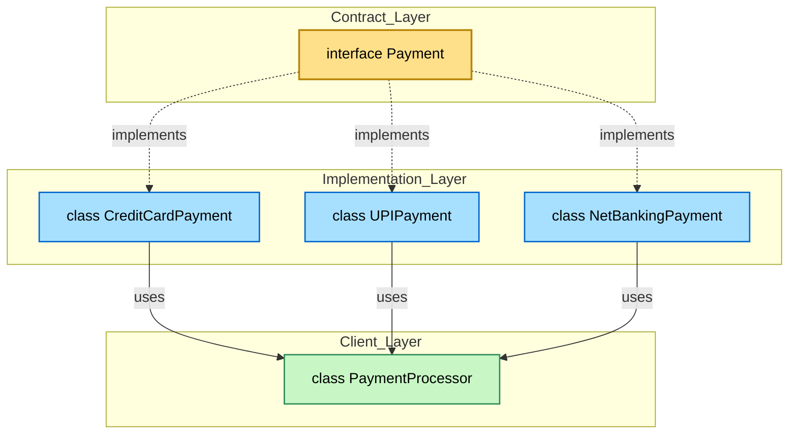
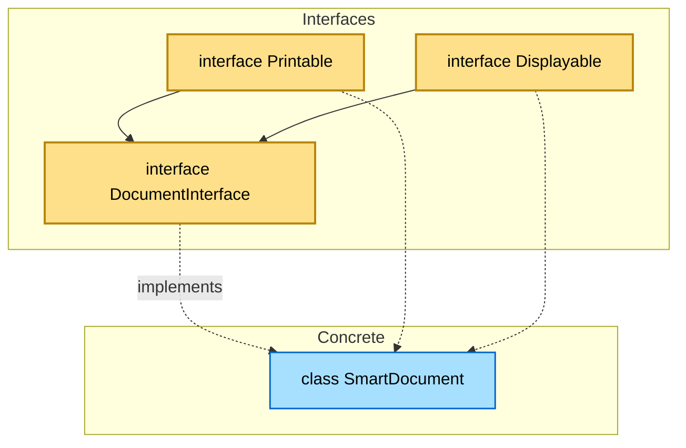
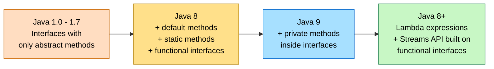

# Interfaces

<!-- SECTION_1_START -->

# Interfaces in Java

## 📘 Formal Academic Definition

> [!NOTE]
> **Definition (KTU Syllabus Aligned):**
> An **interface** in Java is a completely abstract reference type, similar to a class, that can contain only **abstract methods** (prior to Java 8), **default methods**, **static methods**, and **constants** (implicitly `public`, `static`, and `final`). It is used to specify a *contract* that classes must adhere to, defining **what** a class must do without specifying **how** it must do it.

Interfaces form the backbone of Java's mechanism for achieving **abstraction** and **multiple inheritance** (since Java classes can implement any number of interfaces but extend only one class). They sit at the highest level of the object-oriented design hierarchy in Java, often depicted as pure "blueprint" constructs.

---

## 💡 Intuitive Analogy

> [!IMPORTANT]
> **Conceptual Analogy — The "Universal Remote Control"**

Imagine a universal remote control in your living room:

- The **remote itself** = the **Interface** (it has buttons: `powerOn()`, `volumeUp()`, `channelDown()` — it declares the *what*).
- The buttons do **not contain any code** — they don't actually transmit IR signals.
- **Your TV, your Soundbar, your AC** = the **Implementing Classes**. Each one provides its own internal implementation of those buttons.
- Pressing "Power" on the remote turns on whichever device it's pointed at — the remote doesn't care *how* the device implements the action.

This is exactly how Java interfaces work. The interface declares the method signature (button), and the implementing class provides the body (device response). Different devices (classes) can implement the same interface in completely different ways, but the calling code remains identical.

---

## 🏗️ Why Interfaces Are Critical in Java

| Property | Abstract Class | **Interface** |
|----------|----------------|---------------|
| Keyword | `abstract class` | `interface` |
| Methods | Abstract + Concrete | Abstract + Default + Static |
| Variables | Instance + Static | Only `public static final` |
| Inheritance | `extends` (single) | `implements` (multiple) |
| Constructor | Yes | No |
| Access Specifier | Any | Implicitly `public` |

> [!TIP]
> **Syllabus Highlight:** In the KTU OOP module, interfaces are the prescribed mechanism for **achieving 100% abstraction** and **simulating multiple inheritance** in Java.

<!-- SECTION_1_END -->

<!-- SECTION_2_START -->

# Deep Theoretical Analysis & KTU Formula Sheet

## 🔍 Structural Properties of a Java Interface

1. **Declaration** — Declared using the `interface` keyword.
2. **Implicit Modifiers** — All methods are implicitly `public abstract` (pre-Java 8); all variables are implicitly `public static final`.
3. **No Instantiation** — Interfaces **cannot** be instantiated directly (no constructor).
4. **Implementation** — A class uses the `implements` keyword to provide concrete behavior.
5. **Multiple Inheritance** — A class can implement **multiple** interfaces, separated by commas.
6. **Inheritance Among Interfaces** — An interface can `extend` one or more other interfaces.
7. **Default Methods (Java 8+)** — Concrete methods declared with the `default` keyword, allowing backward-compatible evolution of interfaces.
8. **Static Methods (Java 8+)** — Utility methods belonging to the interface itself, not to any implementing class.
9. **Functional Interfaces (Java 8+)** — Interfaces with exactly one abstract method (e.g., `Runnable`, `Comparator`). These are the foundation of **lambda expressions**.
10. **Marker Interfaces** — Empty interfaces (no methods) used to tag/notify the JVM (e.g., `Serializable`, `Cloneable`).

---

## 🧪 Evolution of Java Interfaces Across Versions

> [!IMPORTANT]
> **Pre-Java 8 (Legacy, still tested in KTU):**
> ```java
> interface Drawable {
>     void draw();   // implicitly public abstract
> }
> ```

> [!IMPORTANT]
> **Java 8+ (Modern, high-yield for exams):**
> ```java
> interface Drawable {
>     void draw();                // abstract
>     default void show() {       // concrete default method
>         System.out.println("Default rendering");
>     }
>     static int area(int l, int b) {   // static utility
>         return l * b;
>     }
> }
> ```

> [!IMPORTANT]
> **Java 9+ (Private methods inside interfaces):**
> ```java
> interface Drawable {
>     private void helper() { /* not exposed to implementers */ }
> }
> ```

---

## 📐 KTU High-Yield Formula Cheat Sheet

| # | Concept | Syntax / Rule | Notes |
|---|---------|---------------|-------|
| 1 | Interface declaration | `interface Name { ... }` | Saved as `Name.java` |
| 2 | Implementation | `class A implements I { ... }` | Class must override **all** abstract methods |
| 3 | Multiple implementation | `class A implements I1, I2 { ... }` | Comma-separated list |
| 4 | Interface inheritance | `interface I2 extends I1 { ... }` | Can extend multiple interfaces |
| 5 | Variable in interface | `int X = 10;` | Implicitly `public static final` |
| 6 | Abstract method | `void foo();` | Implicitly `public abstract` |
| 7 | Default method | `default void foo() { }` | Inheritable; overridable |
| 8 | Static method | `static void foo() { }` | Called via `InterfaceName.foo()` |
| 9 | Functional interface | Exactly one abstract method | Eligible for lambda |
| 10 | `@FunctionalInterface` | Compile-time check annotation | Optional but recommended |
| 11 | Diamond problem solution | Use `Interface.super.method()` | Resolves ambiguity in default methods |
| 12 | Marker interface | Empty body | Tagging only (e.g., `Serializable`) |

---

## 🌍 Real-World Engineering Utility

> [!TIP]
> **Where interfaces are used in production systems:**

- **API Contract Definition** — REST/SOAP service layers use interfaces to define `service` contracts independent of the underlying implementation.
- **Dependency Injection (Spring Boot)** — `@Autowired` works on interface types, enabling loose coupling and unit testing with mocks.
- **Strategy Pattern** — Algorithms (sorting, compression, encryption) are swappable via a common interface.
- **Lambda Expressions & Streams API** — Built entirely on functional interfaces (`Predicate`, `Function`, `Supplier`, `Consumer`).
- **Plugin Architectures** — Applications like Eclipse define extension points as interfaces that third-party plugins implement.

<!-- SECTION_2_END -->

<!-- SECTION_3_START -->

# Step-by-Step Implementations & Code Walkthroughs

## 🧩 Example 1: Basic Interface with Implementation

### Step 1 — Define the Interface

```java
// File: Payment.java
public interface Payment {
    void pay(double amount);        // abstract — implicit public abstract
    void refund(double amount);
}
```

### Step 2 — Create Implementing Classes

```java
// File: CreditCardPayment.java
public class CreditCardPayment implements Payment {
    private String cardNumber;

    public CreditCardPayment(String cardNumber) {
        if (cardNumber == null || cardNumber.length() != 16) {
            throw new IllegalArgumentException("Invalid card number length");
        }
        this.cardNumber = cardNumber;
    }

    @Override
    public void pay(double amount) {
        if (amount <= 0.0) {
            throw new IllegalArgumentException("Amount must be positive");
        }
        System.out.println("Paid " + amount + " via Credit Card ending "
                           + cardNumber.substring(12));
    }

    @Override
    public void refund(double amount) {
        if (amount <= 0.0) {
            throw new IllegalArgumentException("Refund amount must be positive");
        }
        System.out.println("Refunded " + amount + " to Credit Card");
    }
}
```

```java
// File: UPIPayment.java
public class UPIPayment implements Payment {
    private String upiId;

    public UPIPayment(String upiId) {
        if (upiId == null || !upiId.contains("@")) {
            throw new IllegalArgumentException("Malformed UPI ID");
        }
        this.upiId = upiId;
    }

    @Override
    public void pay(double amount) {
        if (amount <= 0.0) {
            throw new IllegalArgumentException("Amount must be positive");
        }
        System.out.println("Paid " + amount + " via UPI ID: " + upiId);
    }

    @Override
    public void refund(double amount) {
        if (amount <= 0.0) {
            throw new IllegalArgumentException("Refund amount must be positive");
        }
        System.out.println("Refunded " + amount + " to UPI: " + upiId);
    }
}
```

### Step 3 — Driver / Test Class

```java
// File: PaymentProcessor.java
import java.util.logging.Logger;

public class PaymentProcessor {
    private static final Logger LOGGER = Logger.getLogger(PaymentProcessor.class.getName());

    public static void main(String[] args) {
        try {
            Payment p1 = new CreditCardPayment("1234567812345678");
            Payment p2 = new UPIPayment("student@ktu");

            p1.pay(2500.00);
            p2.pay(999.50);
            p1.refund(500.00);
        } catch (IllegalArgumentException ex) {
            LOGGER.severe("Payment error: " + ex.getMessage());
        }
    }
}
```

### Expected Output

```
Paid 2500.0 via Credit Card ending 5678
Paid 999.5 via UPI ID: student@ktu
Refunded 500.0 to Credit Card
```

---

## 🧩 Example 2: Multiple Inheritance via Interfaces (Resolving the Diamond Problem)

### Step 1 — Two Parent Interfaces with Default Methods

```java
// File: Printable.java
public interface Printable {
    default void show() {
        System.out.println("Printable default show()");
    }
}
```

```java
// File: Displayable.java
public interface Displayable {
    default void show() {
        System.out.println("Displayable default show()");
    }
}
```

### Step 2 — Class Implementing Both

```java
// File: Document.java
public class Document implements Printable, Displayable {
    @Override
    public void show() {
        System.out.println("Document overrides show()");
        // Disambiguate by calling a specific parent:
        Printable.super.show();
        Displayable.super.show();
    }

    public static void main(String[] args) {
        Document d = new Document();
        d.show();
    }
}
```

### Output

```
Document overrides show()
Printable default show()
Displayable default show()
```

> [!IMPORTANT]
> **Key Learning:** If a class implements two interfaces containing the same default method, the **class must override** the method. Otherwise, a compile-time error occurs. To call a specific parent's version, use `InterfaceName.super.methodName()`.

---

## 🧩 Example 3: Functional Interface and Lambda Expression

### Step 1 — Define Functional Interface

```java
// File: Calculator.java
@FunctionalInterface
public interface Calculator {
    int compute(int a, int b);
}
```

### Step 2 — Use with Lambda

```java
// File: CalculatorDemo.java
public class CalculatorDemo {
    public static void main(String[] args) {
        Calculator add      = (a, b) -> a + b;
        Calculator subtract = (a, b) -> a - b;
        Calculator multiply = (a, b) -> a * b;

        int x = 12, y = 4;

        System.out.println("Add: "      + add.compute(x, y));
        System.out.println("Subtract: " + subtract.compute(x, y));
        System.out.println("Multiply: " + multiply.compute(x, y));
    }
}
```

### Output

```
Add: 16
Subtract: 8
Multiply: 48
```

---

## 🧩 Example 4: Interface Extending Multiple Interfaces

```java
// File: Readable.java
public interface Readable {
    void read();
}
```

```java
// File: Writable.java
public interface Writable {
    void write(String data);
}
```

```java
// File: StorageDevice.java
public interface StorageDevice extends Readable, Writable {
    String getDeviceName();
}
```

```java
// File: SSDDrive.java
public class SSDDrive implements StorageDevice {
    private final String name;

    public SSDDrive(String name) {
        this.name = name;
    }

    @Override
    public void read() {
        System.out.println("Reading from SSD: " + name);
    }

    @Override
    public void write(String data) {
        if (data == null) {
            throw new IllegalArgumentException("Data cannot be null");
        }
        System.out.println("Writing '" + data + "' to SSD: " + name);
    }

    @Override
    public String getDeviceName() {
        return name;
    }
}
```

<!-- SECTION_3_END -->

<!-- SECTION_4_START -->

# Structural Diagrams & Schematics

## 📊 Diagram 1: Interface Implementation Topology



> [!TIP]
> **Interpretation:** The `Payment` interface sits as a contract. Three different classes implement it. The `PaymentProcessor` client depends only on the interface, not on the concrete classes — this is **loose coupling** and the essence of the **Dependency Inversion Principle**.

---

## 📊 Diagram 2: Multiple Interface Inheritance (Diamond Resolution)



> [!NOTE]
> **Note on Diamond Problem:** Both `Printable` and `Displayable` define a default `show()` method. The implementing class `SmartDocument` must override `show()` to disambiguate, using `Printable.super.show()` and/or `Displayable.super.show()` as needed.

---

## 📊 Diagram 3: Interface Evolution Timeline (Functional Block Topology)



---

## 📊 Diagram 4: Functional Interface Anatomy (Processing Topology)

```mermaid
flowchart TD
    subgraph FI["Functional Interface - Calculator"]
        ANNO["@FunctionalInterface annotation"]
        METHOD["Single abstract method:\nint compute(int a, int b)"]
    end

    subgraph LAMBDA["Lambda Assignment"]
        L1["add: (a, b) -> a + b"]
        L2["sub: (a, b) -> a - b"]
        L3["mul: (a, b) -> a * b"]
    end

    subgraph CALL["Invocation"]
        INV["result = calc.compute(10, 5)"]
    end

    ANNO --- METHOD
    METHOD -. implemented by .-> L1
    METHOD -. implemented by .-> L2
    METHOD -. implemented by .-> L3
    L1 --> INV
    L2 --> INV
    L3 --> INV

    classDef fi fill:#FFE08A,stroke:#B8860B,color:#000
    classDef lamb fill:#A7E0FF,stroke:#0066CC,color:#000
    classDef call fill:#C8F7C5,stroke:#2E8B57,color:#000

    class ANNO,METHOD fi
    class L1,L2,L3 lamb
    class INV call
```

<!-- SECTION_4_END -->

<!-- SECTION_5_START -->

# KTU 2024 Scheme Examination Question Bank

## 📝 Part A — Short Answer Questions (3 Marks Each)

### **Q1.** `[KTU University Exam - July 2024]` — **CO1, Remember**

**Define an interface in Java. Why is it not possible to instantiate an interface?**

**Model Answer (3 Marks):**

An interface in Java is a reference type declared with the `interface` keyword that contains abstract methods (and, since Java 8, default and static methods) and constants. It defines a contract that implementing classes must fulfill. **[1 Mark]**

Interfaces cannot be instantiated because they are inherently abstract — they may contain method declarations without bodies. The Java compiler forbids the creation of objects of an abstract/incomplete type. Additionally, interfaces have no constructor, which is required to create an object. **[2 Marks]**

---

### **Q2.** `[KTU University Exam - Dec 2023]` — **CO2, Understand**

**Differentiate between an abstract class and an interface in Java. Mention any three points.**

**Model Answer (3 Marks):**

| # | Abstract Class | Interface |
|---|----------------|-----------|
| 1 | Declared with `abstract class` keyword | Declared with `interface` keyword |
| 2 | Can have both abstract and concrete methods | Can have abstract, default, and static methods |
| 3 | Can contain instance and static variables | Contains only `public static final` constants |
| 4 | A class can extend only one abstract class | A class can implement multiple interfaces |
| 5 | Can have constructors | Cannot have constructors |

**[1 Mark per correct point × 3 = 3 Marks]**

---

## 📝 Part B — Long Answer Questions (14 Marks Each)

> Choose **either** Question A **or** Question B. Each sub-part carries 7 marks.

---

### **Question A** `[KTU University Exam - July 2024]` — **CO2, Apply**

**(a) [7 Marks]** Explain the concept of multiple inheritance in Java using interfaces. Write a Java program to demonstrate a class that implements two interfaces `Drawable` and `Resizable`, both containing a default method `display()`. Show how the diamond problem is resolved.

**Model Answer (7 Marks):**

**Conceptual Explanation:**

Java does not support multiple inheritance with classes to avoid the **diamond problem** (ambiguity when two parent classes define the same method). However, multiple inheritance is achieved through interfaces, where a single class can `implements` multiple interfaces. When two interfaces provide the same default method, the implementing class **must override** that method to resolve ambiguity. **[2 Marks]**

**Program:**

```java
// File: Drawable.java
public interface Drawable {
    default void display() {
        System.out.println("Drawable display()");
    }
    void draw();
}
```

```java
// File: Resizable.java
public interface Resizable {
    default void display() {
        System.out.println("Resizable display()");
    }
    void resize(int factor);
}
```

```java
// File: Shape.java
public class Shape implements Drawable, Resizable {
    private String name;
    private double size;

    public Shape(String name, double size) {
        if (size <= 0) {
            throw new IllegalArgumentException("Size must be positive");
        }
        this.name = name;
        this.size = size;
    }

    @Override
    public void draw() {
        System.out.println("Drawing " + name);
    }

    @Override
    public void resize(int factor) {
        if (factor <= 0) {
            throw new IllegalArgumentException("Factor must be positive");
        }
        size *= factor;
        System.out.println(name + " resized by factor " + factor
                           + " -> new size: " + size);
    }

    // Overriding to resolve diamond ambiguity
    @Override
    public void display() {
        System.out.println("Shape overrides display()");
        Drawable.super.display();
        Resizable.super.display();
    }

    public static void main(String[] args) {
        Shape s = new Shape("Circle", 10.0);
        s.draw();
        s.resize(2);
        s.display();
    }
}
```

**Output:**

```
Drawing Circle
Circle resized by factor 2 -> new size: 20.0
Shape overrides display()
Drawable display()
Resizable display()
```

**Valuation Key:**

- Explaining multiple inheritance concept: **2 Marks**
- Correct interface declarations: **1 Mark**
- Correct class implementing both with proper override: **2 Marks**
- Resolution of diamond problem with `Interface.super.method()`: **1 Mark**
- Valid output / successful compilation logic: **1 Mark**

---

**(b) [7 Marks]** What are functional interfaces in Java? Write a program using the `@FunctionalInterface` annotation to perform the four basic arithmetic operations using lambda expressions.

**Model Answer (7 Marks):**

**Definition:** A functional interface is an interface that contains **exactly one abstract method**. It may contain any number of default or static methods. Functional interfaces are the target type for **lambda expressions** and **method references** introduced in Java 8. The `@FunctionalInterface` annotation is optional but recommended; the compiler enforces the "single abstract method" rule when this annotation is present. **[2 Marks]**

**Program:**

```java
// File: Operation.java
@FunctionalInterface
public interface Operation {
    double apply(double a, double b);
}
```

```java
// File: ArithmeticDemo.java
public class ArithmeticDemo {
    public static void main(String[] args) {
        Operation add      = (a, b) -> a + b;
        Operation subtract = (a, b) -> a - b;
        Operation multiply = (a, b) -> a * b;
        Operation divide   = (a, b) -> {
            if (b == 0.0) {
                throw new ArithmeticException("Division by zero");
            }
            return a / b;
        };

        double x = 20.0, y = 4.0;
        System.out.println("Add: "      + add.apply(x, y));
        System.out.println("Subtract: " + subtract.apply(x, y));
        System.out.println("Multiply: " + multiply.apply(x, y));
        System.out.println("Divide: "   + divide.apply(x, y));
    }
}
```

**Output:**

```
Add: 24.0
Subtract: 16.0
Multiply: 80.0
Divide: 5.0
```

**Valuation Key:**

- Correct definition of functional interface: **2 Marks**
- Use of `@FunctionalInterface`: **1 Mark**
- Four lambda expressions correctly written: **2 Marks**
- Division-by-zero error handling: **1 Mark**
- Correct output: **1 Mark**

---

### **Question B** `[KTU University Exam - Dec 2023]` — **CO2, Apply**

**(a) [7 Marks]** Explain default methods in interfaces. Why were they introduced in Java 8? Write a program demonstrating a default method inside an interface and its use in an implementing class.

**Model Answer (7 Marks):**

**Concept:**

Default methods are concrete methods defined inside an interface using the `default` keyword. They allow interfaces to add new methods **without breaking existing implementing classes**. **[1 Mark]**

**Why introduced:** Prior to Java 8, adding a new method to an interface would break all implementing classes because they would need to provide the implementation. To enable **interface evolution** and to support the Streams API (which required adding methods to `Collection` interfaces), default methods were introduced in Java 8. **[2 Marks]**

**Program:**

```java
// File: Vehicle.java
public interface Vehicle {
    void start();

    default void honk() {
        System.out.println("Beep beep! Default horn.");
    }
}
```

```java
// File: Car.java
public class Car implements Vehicle {
    private final String model;

    public Car(String model) {
        if (model == null || model.isEmpty()) {
            throw new IllegalArgumentException("Model required");
        }
        this.model = model;
    }

    @Override
    public void start() {
        System.out.println(model + " engine started.");
    }

    public static void main(String[] args) {
        Car myCar = new Car("Swift");
        myCar.start();
        myCar.honk();
    }
}
```

**Output:**

```
Swift engine started.
Beep beep! Default horn.
```

**Valuation Key:**

- Definition of default method: **1 Mark**
- Reason for Java 8 introduction: **2 Marks**
- Interface with `default` method: **1 Mark**
- Class implementing it correctly: **1 Mark**
- Driver class with output: **1 Mark**
- `final` field and error handling: **1 Mark**

---

**(b) [7 Marks]** What is a marker interface in Java? Give two examples from the Java standard library. Write a small program that demonstrates the use of the `Cloneable` marker interface.

**Model Answer (7 Marks):**

**Definition:** A marker interface is an **empty interface** (no methods or fields) used to tag or mark a class so that the JVM or compiler can provide special behavior at runtime. The class itself does not gain any new methods; it merely signals to the runtime that it belongs to a particular category. **[2 Marks]**

**Two standard examples:**

1. `java.io.Serializable` — marks classes whose objects can be serialized (converted to byte streams).
2. `java.lang.Cloneable` — marks classes whose objects can be cloned using `Object.clone()`. **[2 Marks]**

**Program:**

```java
// File: Student.java
public class Student implements Cloneable {
    private String name;
    private int rollNo;

    public Student(String name, int rollNo) {
        if (name == null) {
            throw new IllegalArgumentException("Name cannot be null");
        }
        if (rollNo <= 0) {
            throw new IllegalArgumentException("Roll number must be positive");
        }
        this.name = name;
        this.rollNo = rollNo;
    }

    public void display() {
        System.out.println("Name: " + name + ", Roll: " + rollNo);
    }

    @Override
    public Object clone() throws CloneNotSupportedException {
        return super.clone();
    }
}
```

```java
// File: CloneDemo.java
public class CloneDemo {
    public static void main(String[] args) {
        try {
            Student s1 = new Student("Anu", 24);
            Student s2 = (Student) s1.clone();

            System.out.println("Original:");
            s1.display();
            System.out.println("Clone:");
            s2.display();

            System.out.println("Same reference? " + (s1 == s2));
        } catch (CloneNotSupportedException e) {
            System.err.println("Cloning failed: " + e.getMessage());
        }
    }
}
```

**Output:**

```
Original:
Name: Anu, Roll: 24
Clone:
Name: Anu, Roll: 24
Same reference? false
```

**Valuation Key:**

- Definition of marker interface: **2 Marks**
- Two standard examples: **2 Marks**
- Class implementing `Cloneable`: **1 Mark**
- Override of `clone()` method: **1 Mark**
- Valid driver class with output: **1 Mark**

---

> [!WARNING]
> **⚠️ KTU Examiner's Valuation Warning — Common Pitfalls**
> 
> 1. **Forgetting `@Override`:** Always annotate overridden methods; the KTU evaluator allocates marks for explicit override notation.
> 2. **Forgetting `public` access modifier:** All interface methods are `public` by default. If you write `void draw()` in a class without `public`, the compiler will reject it as weaker access privilege.
> 3. **Skipping error handling:** Incomplete input validation (e.g., null checks) often costs 1 mark per question.
> 4. **Confusing abstract class rules with interface rules:** Students often write `static` variables in interfaces and treat them as instance variables — **deduct 1 mark** for this confusion.
> 5. **Diamond problem not resolved:** If two interfaces have a default method with the same signature and the class does not override it, the code will not compile. Examiners expect explicit `Interface.super.method()` calls to demonstrate understanding.
> 6. **Lambda syntax errors:** Parentheses, arrow operator, and braces must be syntactically perfect. A missing semicolon at the end of a lambda statement costs marks.

---

## 🧠 Topic Recap & Important Things to Remember

- ✅ **Interface** = a 100% abstract contract in Java (pre-Java 8); uses the `interface` keyword.
- ✅ Interface methods are **implicitly `public abstract`**; variables are **implicitly `public static final`**.
- ✅ Interfaces **cannot be instantiated** and have **no constructor**.
- ✅ A class uses the **`implements`** keyword; an interface uses **`extends`** to inherit other interfaces.
- ✅ A class can implement **multiple interfaces** — this is Java's way of supporting **multiple inheritance**.
- ✅ **Default methods** (`default` keyword) added in Java 8 allow concrete behavior inside interfaces for backward compatibility.
- ✅ **Static methods** in interfaces (Java 8+) are utility methods called via the interface name.
- ✅ **Functional interfaces** have **exactly one abstract method** and are the basis of **lambda expressions**.
- ✅ The **`@FunctionalInterface`** annotation triggers compile-time enforcement of the single-abstract-method rule.
- ✅ **Marker interfaces** (e.g., `Serializable`, `Cloneable`) have **no methods** — they merely tag a class for special JVM treatment.
- ✅ The **diamond problem** with default methods is resolved by **overriding the method** in the implementing class and using **`InterfaceName.super.methodName()`** to call a specific parent.
- ✅ Variables declared in interfaces are **constants** — they must be initialized at the time of declaration.
- ✅ An interface can **extend multiple** other interfaces: `interface C extends A, B { }`.
- ✅ In UML, interfaces are conventionally denoted with `<<interface>>` stereotype and often drawn with a **lollipop notation** (a circle attached to a class).
- ✅ Interfaces enable **loose coupling**, **dependency injection**, **strategy design pattern**, and form the foundation of Java's **Streams API** and **lambda programming**.

<!-- SECTION_5_END -->
