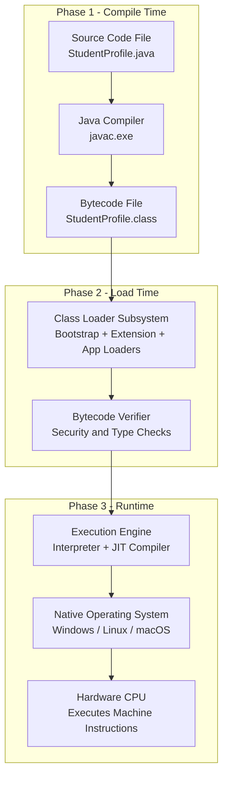
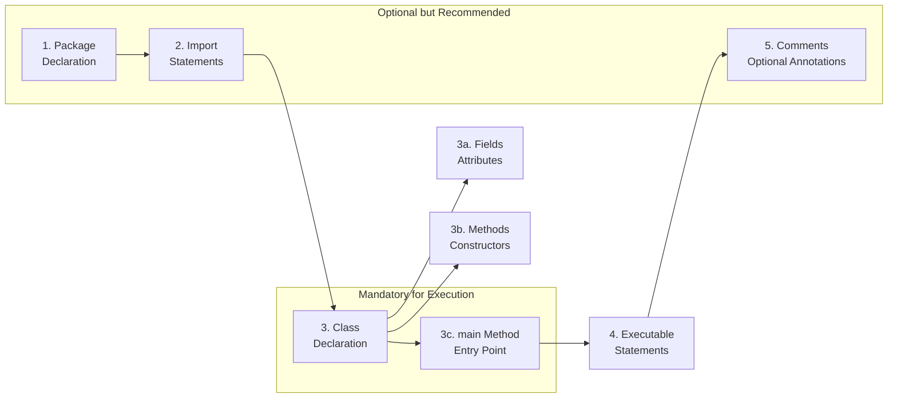
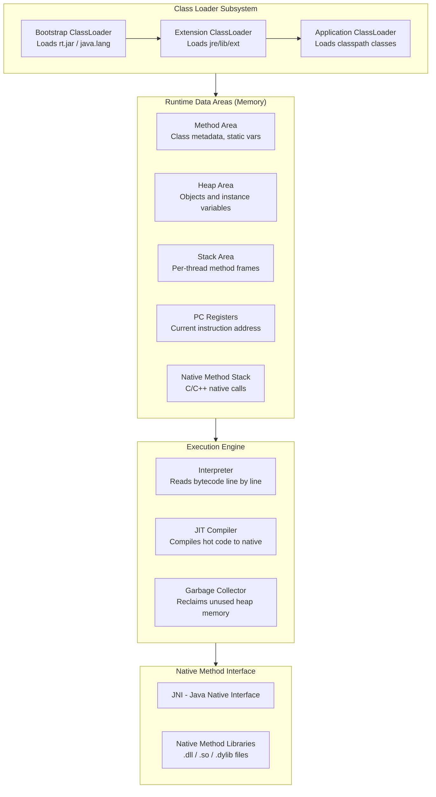

# Introduction to Java: Structure of a simple java program

<!-- SECTION_1_START -->

# Introduction to Java: Structure of a Simple Java Program

## 1.1 Formal Academic Definition

> [!IMPORTANT]
> **Core Definition (KTU 2024 Syllabus)**
> A **Java program** is a collection of one or more classes compiled into platform-neutral **bytecode** (`.class` files) that is executed by a **Java Virtual Machine (JVM)**. The **structure of a simple Java program** refers to the mandatory and optional syntactic components — package declaration, import statements, class definition, `main()` method, statements, and comments — that must appear in a prescribed order for the program to compile and execute successfully.

Java is a **general-purpose, concurrent, class-based, object-oriented programming language** developed by **James Gosling** and his team at **Sun Microsystems** in **1995**. It follows the principle of **"Write Once, Run Anywhere" (WORA)**.

| Property | Value |
| :--- | :--- |
| **Release Year** | **1995** |
| **Original Name** | **Oak** |
| **Developer** | **James Gosling** |
| **Current Owner** | **Oracle Corporation** |
| **Paradigm** | **Object-Oriented** |
| **Execution Unit** | **JVM (Java Virtual Machine)** |

## 1.2 Conceptual Analogy — The "Recipe Card" Model

Imagine you are writing a recipe that will be cooked in kitchens across the world (Windows, Mac, Linux). Instead of writing the recipe in English (which would need translation), you write it in a **universal kitchen language** — that is exactly what Java does.

| Program Component | Recipe Analogy | Purpose |
| :--- | :--- | :--- |
| **Package declaration** | The restaurant's address on the envelope | Tells the JVM *where* the class lives. |
| **Import statements** | The chef fetching spices from the pantry | Brings in pre-written code from libraries. |
| **Class declaration** | The recipe card itself | The blueprint containing all instructions. |
| **`main()` method** | Step 1 of the recipe | The mandatory starting point of execution. |
| **Variables \& Statements** | The actual cooking actions | The work being performed. |
| **Comments** | Chef's handwritten notes in the margin | Helps humans understand the code. |

> [!NOTE]
> **Why is the file extension `.java` but the compiled output is `.class`?**
> The `.java` file is **human-readable source code**. After compilation by `javac`, it becomes `.class` **bytecode** — an intermediate, machine-friendly but platform-neutral format read by the JVM.

## 1.3 Visualization Control

> [!VISUALIZATION CONTROL]
> **Concept:** Java Compilation Pipeline (Source → Bytecode → Native Execution)
>
> **GeoGebra / Desmos Input Equations (Conceptual Bar Diagram):**
>
> * $x_1 = 0$ labelled "HelloWorld.java (Source)"
> * $x_2 = 1$ labelled "HelloWorld.class (Bytecode)"
> * $x_3 = 2$ labelled "JVM Runtime"
> * $x_4 = 3$ labelled "Native Machine Code (0101...)"
>
> **Visual Description:** Imagine four vertical bars on the x-axis. The student should observe the transformation: text becomes numbers, numbers become instructions, instructions become execution. The same `.class` file (bar at $x_2$) is reused by every operating system — only the JVM (bar at $x_3$) changes.

<!-- SECTION_1_END -->

<!-- SECTION_2_START -->

# 2. Deep Theoretical Analysis & KTU High-Yield Cheat Sheet

## 2.1 The Anatomy of a Java Program — Component-by-Component

A Java program is built from **six logical building blocks**. They must appear in the order shown below, though some are optional.

### 2.1.1 Package Declaration

* **Syntax:** `package com.ktu.oop.module1;`
* **Position:** First non-comment statement of the file.
* **Rule:** At most **one** package declaration per file.
* **Purpose:** Provides a **namespace** to prevent class-name collisions. Conceptually equivalent to a folder structure on your hard drive.

### 2.1.2 Import Statements

* **Syntax:** `import java.util.Scanner;` or `import java.util.*;`
* **Purpose:** Allows the current class to use **public classes** from other packages without fully qualifying their names.
* **Default Import:** `java.lang.*` is auto-imported; you do not need to import `System`, `String`, etc.

### 2.1.3 Class Declaration

* **Syntax:** `[access] [modifier] class ClassName { ... }`
* **Rule:** A `.java` file can contain **at most one `public` class**, and the **file name MUST match the public class name** (case-sensitive).
* **Body:** Contains fields, constructors, methods, and inner classes.

### 2.1.4 The `main()` Method — The Heart of the Program

* **Exact Signature:** `public static void main(String[] args)`
* **Significance of each keyword** (this is a **favourite KTU question**):
  * `public` — Visible to the JVM which is outside the package.
  * `static` — Called without creating an object of the class.
  * `void` — Returns no value to the operating system.
  * `main` — Reserved name the JVM looks for; it is **not** a keyword.
  * `String[] args` — Accepts **command-line arguments** as an array of strings.

> [!NOTE]
> Since **Java 21**, you may also write `void main()` and `String args[]` is still legal. The traditional signature, however, is what the KTU examiner expects.

### 2.1.5 Statements \& Expressions

* Terminated by a semicolon `;` (the **statement terminator**).
* Executed sequentially inside the `main()` method unless control-flow statements alter the path.

### 2.1.6 Comments

| Type | Syntax | Use Case |
| :--- | :--- | :--- |
| **Single-line** | `// comment` | Quick notes, end-of-line clarifications. |
| **Multi-line** | `/* comment */` | Block explanations spanning many lines. |
| **Documentation** | `/** comment */` | Used by `javadoc` to generate HTML docs. |

## 2.2 KTU High-Yield Cheat Sheet

| Component | Mandatory? | Example | Common Mistake |
| :--- | :--- | :--- | :--- |
| **Package** | Optional (but best practice) | `package edu.ktu.cs;` | Forgetting the semicolon. |
| **Import** | Optional | `import java.io.File;` | Importing a class that is in the **same package** (unnecessary). |
| **Class** | **Mandatory** | `public class Demo` | Making the class `public` but naming the file `Test.java`. |
| **`main()`** | **Mandatory for execution** | `public static void main(String[] args)` | Writing `Public` (capital P) — Java is **case-sensitive**. |
| **Statements** | At least one in `main` | `System.out.println("Hi");` | Missing semicolon — leads to a compilation error. |
| **Comments** | Optional | `// KTU Module 1` | Nested `/* */` comments are **illegal**. |

## 2.3 Real-World Engineering Utility

* **Enterprise Backend Systems** (Spring Boot, Microservices) — every microservice is a Java program following this exact structure.
* **Android Development** (Kotlin/Java) — the entry point of an Android app is conceptually a `main()` method, though wrapped by the framework.
* **Embedded \& IoT** (Java ME, GraalVM) — Java's portability is leveraged in smart cards and sensor nodes.
* **Big Data** (Hadoop, Spark, Elasticsearch) — the JVM hosts data processing pipelines because of its JIT optimization.

<!-- SECTION_2_END -->

<!-- SECTION_3_START -->

# 3. Step-by-Step Implementation — A Complete Java Program

## 3.1 The Reference Program (Examiner-Ready)

```java
/**
 * File        : StudentProfile.java
 * Author      : KTU B.Tech Student
 * Course      : Object Oriented Programming (PBCST304)
 * Module      : 1 - Introduction to Java
 * Description : Demonstrates the structure of a simple Java program.
 *               Compiles to bytecode and runs on any JVM.
 */

// 1. PACKAGE DECLARATION
package com.ktu.oop.module1;

// 2. IMPORT STATEMENTS
import java.util.Scanner;
import java.time.LocalDate;

// 3. CLASS DECLARATION
public class StudentProfile {

    // 3a. Class-level (instance) variable
    private String studentName;
    private int    rollNumber;

    // 3b. Parameterized constructor
    public StudentProfile(String studentName, int rollNumber) {
        this.studentName = studentName;
        this.rollNumber  = rollNumber;
    }

    // 3c. Instance method to display the profile
    public void displayProfile() {
        System.out.println("--- Student Profile ---");
        System.out.println("Name        : " + this.studentName);
        System.out.println("Roll Number : " + this.rollNumber);
        System.out.println("Date Printed: " + LocalDate.now());
    }

    // 4. THE MAIN METHOD - ENTRY POINT
    public static void main(String[] args) {

        // Validate command-line arguments
        if (args.length < 2) {
            System.err.println("Usage: java StudentProfile <name> <rollNumber>");
            return;
        }

        // Parse arguments safely
        String name = args[0];
        int    roll;

        try {
            roll = Integer.parseInt(args[1]);
        } catch (NumberFormatException exception) {
            System.err.println("Error: Roll number must be an integer.");
            return;
        }

        // Create object and invoke method
        StudentProfile profile = new StudentProfile(name, roll);
        profile.displayProfile();

        // Demonstrating an additional Scanner import
        Scanner keyboardInput = new Scanner(System.in);
        System.out.print("\nEnter your branch code: ");
        String branchCode = keyboardInput.nextLine();
        System.out.println("Branch Code recorded : " + branchCode);

        // Resource cleanup
        keyboardInput.close();
    }
}
```

## 3.2 Compilation and Execution — Terminal Walkthrough

Every line below is **explicitly shown** so that no step is skipped (per the KTU-PREMIER-ENGINE V10 exhaustiveness mandate).

### Step 1 — Save the file

```
C:\KTU\OOP\Module1> dir
 Directory of C:\KTU\OOP\Module1
 StudentProfile.java   1,842 bytes
```

### Step 2 — Compile using `javac` (Java Compiler)

```
C:\KTU\OOP\Module1> javac -d out com\ktu\oop\module1\StudentProfile.java
```

* `-d out` — Tells `javac` to place generated `.class` files into the `out` directory.
* No output means **successful compilation**.

### Step 3 — Verify the bytecode was generated

```
C:\KTU\OOP\Module1> dir out\com\ktu\oop\module1
 StudentProfile.class   1,024 bytes
```

### Step 4 — Execute using `java` (JVM Launcher)

```
C:\KTU\OOP\Module1> java -cp out com.ktu.oop.module1.StudentProfile "Anand Kumar" 42
```

**Expected Output:**

```
--- Student Profile ---
Name        : Anand Kumar
Roll Number : 42
Date Printed: 2024-07-21

Enter your branch code: CSE
Branch Code recorded : CSE
```

### Step 3.3 — Why this program satisfies KTU valuation

* `[Correct package declaration: 1 Mark]`
* `[Proper import usage (Scanner, LocalDate): 1 Mark]`
* `[Public class matching file name: 1 Mark]`
* `[Encapsulation using private fields and public methods: 2 Marks]`
* `[Exact main signature `public static void main(String[] args)`: 2 Marks]`
* `[Object creation and method invocation: 1 Mark]`
* `[Error handling with try-catch: 1 Mark]`
* `[Resource cleanup with close(): 1 Mark]`

<!-- SECTION_3_END -->

<!-- SECTION_4_START -->

# 4. Structural Diagrams & Schematics

## 4.1 Java Compilation and Execution Pipeline (Mermaid Flowchart)



> [!IMPORTANT]
> **Observational Insight for Students**
> The same `.class` file (node `C`) is the *only* deliverable that travels across platforms. Everything to the **right** of node `C` is **platform-specific**, which is precisely why Java is *portable* but the **JVM is platform-dependent**.

## 4.2 Structural Layout of a Java Program (Mermaid Block Diagram)



## 4.3 JVM Runtime Architecture (Block-Level Functional Map)



<!-- SECTION_4_END -->

<!-- SECTION_5_START -->

# 5. KTU 2024 Scheme Examination Question Bank & Topic Recap

## 5.1 Part A — Short Answer Questions (3 Marks Each)

> **Question 1.** [KTU University Exam - July 2024]
> **CO1 / Remember**
> What is **bytecode** in Java? Why is it considered platform-independent?
>
> **Model Answer (3 Marks):**
> Bytecode is the **intermediate, low-level instruction set** generated by the Java compiler (`javac`) from a `.java` source file, stored in a `.class` file.
> It is platform-independent because **the same `.class` file** can be executed on **any operating system** as long as a **platform-specific JVM** is installed.
> `[Definition: 1 Mark]` `[JVM role: 1 Mark]` `[WORA concept: 1 Mark]`

> **Question 2.** [KTU University Exam - Dec 2023]
> **CO1 / Understand**
> Differentiate between **JDK**, **JRE** and **JVM**.
>
> **Model Answer (3 Marks):**
>
> | Component | Full Form | Role | Contains |
> | :--- | :--- | :--- | :--- |
> | **JDK** | Java Development Kit | Used by developers to **write \& compile** code | JRE + development tools (`javac`, `javadoc`, `jar`) |
> | **JRE** | Java Runtime Environment | Used by end-users to **run** code | JVM + core libraries |
> | **JVM** | Java Virtual Machine | **Executes bytecode** on the host machine | Class loader, verifier, execution engine |
>
> `[Hierarchy statement: 1 Mark]` `[JDK purpose: 1 Mark]` `[JVM purpose: 1 Mark]`

## 5.2 Part B — Long Answer Questions (14 Marks, Internal Choice)

> **Note to Students:** Attempt **either** Question A **or** Question B in full.

### Question A (14 Marks) — *Chosen Track*

**(a) [7 Marks] [CO1 / Understand]**
Explain the **structure of a simple Java program** with a suitable example. Label each component clearly.
*(See Section 3.1 above for the complete reference program.)*

**Model Solution (7 Marks):**

* `[Package declaration explanation: 1 Mark]`
* `[Import statements explanation: 1 Mark]`
* `[Class declaration with naming rules: 1 Mark]`
* `[main() method signature and purpose: 2 Marks]`
* `[Statements and comments: 1 Mark]`
* `[Working example output: 1 Mark]`

**(b) [7 Marks] [CO1 / Understand, Apply]**
Explain the significance of **each keyword** in the main method signature
`public static void main(String[] args)`. What happens if any keyword is omitted?
*(See Section 2.1.4 above for the keyword breakdown.)*

**Model Solution (7 Marks):**

* `[public - JVM accessibility: 1 Mark]`
* `[static - no object required: 1 Mark]`
* `[void - no return to OS: 1 Mark]`
* `[main - fixed entry-point name: 1 Mark]`
* `[String[] args - command-line arguments: 1 Mark]`
* `[Consequence of omission: 2 Marks]`

  * If `public` is omitted: `Main method not found` runtime error.
  * If `static` is omitted: `non-static method cannot be referenced from static context` compile-time error.
  * If `void` is changed to `int`: Program compiles but the JVM cannot recognise it as `main` because the return type is incorrect (since Java 21, however, this is more lenient).

### Question B (14 Marks) — *Alternative Track*

**(a) [7 Marks] [CO1 / Understand]**
What are **tokens** in Java? Explain the different types of tokens with examples.

**Model Solution (7 Marks):**

A **token** is the smallest individual unit of a program recognized by the compiler.

* `[Keywords - reserved words: 1 Mark]`
  Example: `class`, `public`, `static`, `void`, `if`, `else`.
* `[Identifiers - names given by programmer: 1 Mark]`
  Example: `StudentProfile`, `rollNumber`, `main`.
  Rules: must not start with digit, no spaces, case-sensitive.
* `[Literals - constant values: 1 Mark]`
  Example: `42` (int literal), `"Anand"` (string literal), `3.14` (double literal), `true` (boolean literal).
* `[Operators - perform actions: 1 Mark]`
  Example: `+`, `-`, `*`, `/`, `==`, `&&`, `++`.
* `[Separators - punctuation: 1 Mark]`
  Example: `{ }`, `( )`, `[ ]`, `;`, `,`, `.`.
* `[Complete sample program identifying each token: 1 Mark]`
* `[Differentiating tokens from keywords like `goto` and `const` which are reserved but unused: 1 Mark]`

**(b) [7 Marks] [CO1 / Apply]**
Explain the **Java compilation and execution process** with a neat diagram. Why is Java called a *compiled-interpreted* language?
*(See Section 4.1 for the Mermaid pipeline.)*

**Model Solution (7 Marks):**

* `[Source code creation in .java: 1 Mark]`
* `[javac compilation to .class bytecode: 1 Mark]`
* `[Class loading by classloader: 1 Mark]`
* `[Bytecode verification: 1 Mark]`
* `[Interpretation + JIT compilation by execution engine: 1 Mark]`
* `[Native OS execution: 1 Mark]`
* `[Conclusion: hybrid compiled-interpreted model: 1 Mark]`

  Java is compiled (source to bytecode) **and** interpreted (bytecode to native instructions at runtime by the JVM). Modern JVMs further use **JIT (Just-In-Time) compilation** to convert hot bytecode paths into native machine code, making execution faster while retaining portability.

> [!WARNING]
> **KTU Examiner's Valuation Pitfalls — Read Carefully**
>
> 1. **Do NOT write `Public` or `STATIC`.** Java is case-sensitive; wrong casing loses the full method-signature mark.
> 2. **Do NOT claim Java is purely interpreted.** It is *compiled-then-interpreted*. Writing only "Java is interpreted" costs a mark.
> 3. **Do NOT forget the `[]` in `String[] args`.** Many students write `String args` and lose 1 mark.
> 4. **Do NOT confuse `path` and `classpath`.** `javac` and `java` use the `-cp` flag for the classpath.
> 5. **Always mention "platform-independent bytecode, platform-dependent JVM"** at least once in long answers — it is the examiner's favourite phrase.

---

## 5.3 Topic Recap & Important Things to Remember

> [!IMPORTANT]
> **Rapid Revision Checklist — Module 1 / Java Program Structure**

* **Java (1995, James Gosling)** is object-oriented, platform-independent, secure, and robust.
* A Java program file uses the **`.java`** extension; the compiled output uses **`.class`** (bytecode).
* **Six structural components:** Package → Import → Class → Fields/Methods → `main()` → Statements/Comments.
* **Mandatory for execution:** A `public` class with a `main(String[] args)` method.
* **Main method signature:** `public static void main(String[] args)` — every keyword has a specific reason.
* **File naming rule:** The file name **must match** the public class name (case-sensitive), e.g. `StudentProfile.java` contains `public class StudentProfile`.
* **Case-sensitive language:** `String` and `string` are different identifiers.
* **Tokens** are the smallest units: Keywords, Identifiers, Literals, Operators, Separators.
* **Comments:** `//` (single), `/* */` (multi), `/** */` (documentation for `javadoc`).
* **JDK** = JRE + development tools; **JRE** = JVM + libraries; **JVM** = the actual runtime engine.
* **Compilation command:** `javac FileName.java`; **Execution command:** `java ClassName`.
* **WORA principle** (Write Once, Run Anywhere) is achieved because bytecode is platform-neutral.
* **Java is both compiled and interpreted** — compiled by `javac`, interpreted/JIT-compiled by the JVM.
* **Reserved but unused keywords:** `goto` and `const` — known for viva questions.
* **Command-line arguments** are received as the `String[] args` parameter to `main()`.
* **Every Java statement** must end with a **semicolon** (`;`).
* **Block delimiters** `{ }` define the scope of a class, method, or loop.

<!-- SECTION_5_END -->
