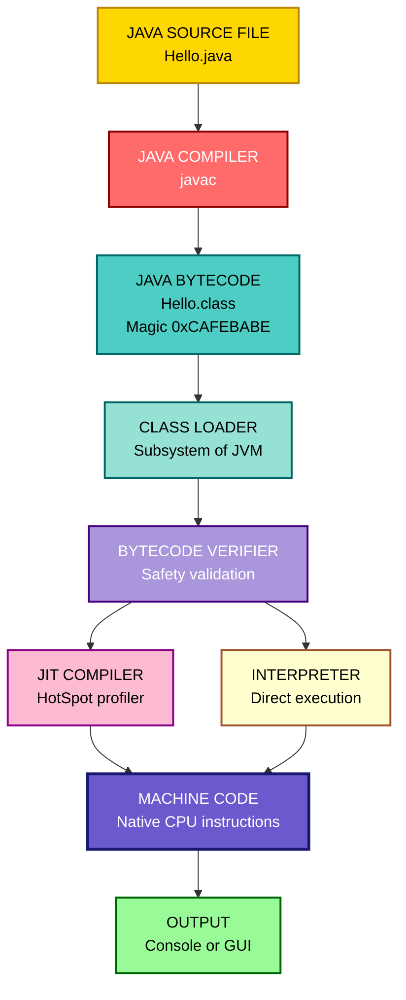
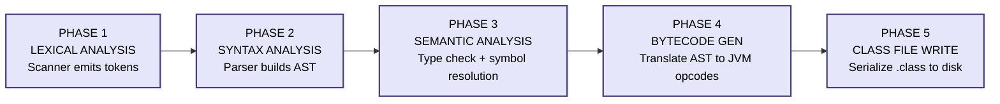
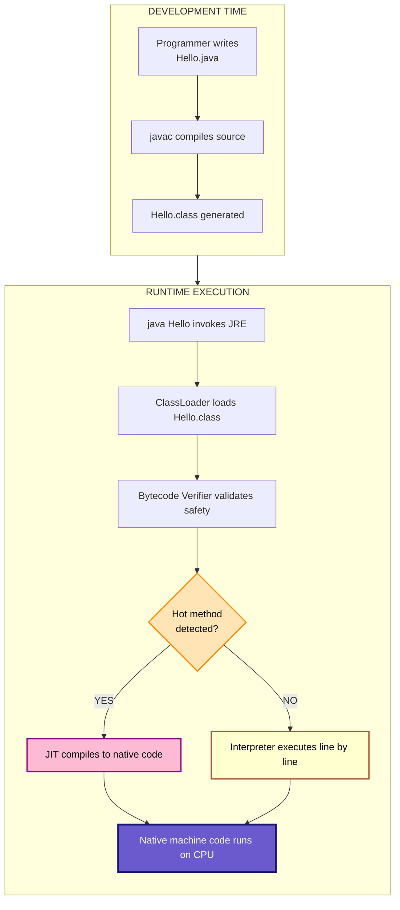
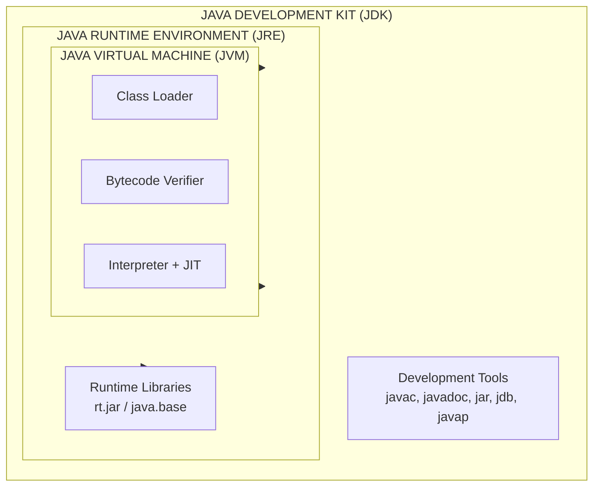

# Java compiler

<!-- SECTION_1_START -->
# Java Compiler — Core Technical Definition & Intuitive Overview

## Formal Academic Definition (KTU 2024 Syllabus Aligned)

> [!IMPORTANT]
> **Definition (KTU PBCST304 — Module 1):**
> A **Java compiler** is a system software utility that translates human-readable *Java source code* (`.java` files) into an intermediate, platform-independent representation known as **Java Bytecode** (`.class` files). The standard reference implementation of this compiler is **`javac`**, which is bundled within the **Java Development Kit (JDK)**.

The Java compiler is **not** a traditional native code generator. Unlike a C/C++ compiler (e.g., `gcc`, `clang`) that emits machine-specific executable binary directly targeting a particular CPU architecture (x86, ARM, RISC-V), the Java compiler performs a *partial translation* — it stops one level short of machine code and produces **bytecode**, which is the instruction set of an abstract, software-simulated processor called the **Java Virtual Machine (JVM)**.

| Property | Java Compiler (`javac`) | C/C++ Compiler (`gcc`) |
| :--- | :--- | :--- |
| **Input** | `.java` source file | `.c` / `.cpp` source file |
| **Output** | `.class` bytecode file | Native machine code (`.exe`, ELF) |
| **Portability** | **Write Once, Run Anywhere (WORA)** | Platform-specific binaries |
| **Execution Engine** | JVM (Interpreter + JIT) | Direct OS execution |

> [!NOTE]
> **Syllabus Highlight (Module 1.2):**
> The KTU 2024 scheme specifically expects students to articulate *why* Java uses a two-stage translation (Compilation + Interpretation) and to identify the compiler as the entity responsible for **the first stage** of this pipeline.

## Conceptual Analogy / Intuition

Imagine a **diplomatic translator** working at the United Nations:

* The **diplomat's speech** (English) is the *Java source code* — clear, expressive, and meant for human understanding.
* The **simultaneous interpreter** translates the speech into a **standard international working language** (e.g., *Esperanto*, a universal intermediate tongue) — this is exactly what the **Java compiler** does. It translates Java into **Bytecode**, a uniform, neutral instruction format.
* Every **listener in the room** (French, Japanese, Arabic, Swahili) understands this *Esperanto* through their *personal local interpreter* — this represents the **JVM**, which is customized for the host machine (Windows, Linux, macOS, Android).

The key insight: **the diplomat (programmer) writes once, but the speech is delivered everywhere** — this is the *Write Once, Run Anywhere (WORA)* promise. The compiler's role is to produce the universal intermediate — **bytecode**.

## Constants and Standard Tools

> [!NOTE]
> **Critical Constants \& Tools to Remember (in bold for exam recall):**
> * The reference Java compiler is **`javac`**, located in the `<JAVA_HOME>/bin/` directory after JDK installation.
> * The default Java compiler version bundled with **JDK 8 was `javac 1.8.0`**, with JDK 11 it is `javac 11.0.x`, and with **JDK 21 (LTS) it is `javac 21`**.
> * The bytecode **magic number** (the first 4 bytes of any valid `.class` file) is **`0xCAFEBABE`** in hexadecimal. This is a constant examiners love to ask about.
> * One bytecode instruction is exactly **1 byte** long, hence the name **"byte-code"**.

## GeoGebra / Desmos Integration

> [!VISUALIZATION CONTROL]
> **Concept:** Compilation Pipeline as a Coordinate Transformation
> **GeoGebra / Desmos Input Equations:**
> * Source axis: $S(t) = \sin(2\pi t)$  *(representing high-level source code)*
> * Bytecode axis: $B(t) = \text{sgn}(S(t)) \cdot 1$  *(representing quantized, discrete bytecode instructions of magnitude 1)*
> **Visual Description:** Plot $S(t)$ as a smooth, continuous wave on the top half-plane (this is your readable Java source). Plot $B(t)$ as a square-wave signal quantized to $\pm 1$ on the lower half-plane (this is the discrete bytecode). The transformation between them is **lossy in readability** but **gain in portability** — the compiler's job.

---

<!-- SECTION_2_START -->
# Deep Theoretical Analysis & KTU High-Yield Formula Sheet

## Operational Breakdown: The Java Compilation Pipeline

The Java compiler (`javac`) is not a single monolithic pass — it is structured as a sequence of well-defined **front-end phases**, each producing an intermediate data structure that the next phase consumes. Understanding this pipeline is essential for KTU Module 1 questions.

### Phase 1 — Lexical Analysis (Tokenization)
The source `.java` file is read as a raw stream of characters. The lexical analyzer (often called the **scanner** or **lexer**) groups characters into the smallest meaningful units called **tokens**.
* Example: The statement `int x = 10;` is tokenized into: `int` (keyword), `x` (identifier), `=` (operator), `10` (integer literal), `;` (separator).

### Phase 2 — Syntactic Analysis (Parsing)
Tokens are fed into a **parser**, which verifies whether the token sequence conforms to the **Java Language Specification (JLS)** grammar. The output is a **parse tree** (or more commonly, an **Abstract Syntax Tree — AST**). If the syntax is invalid, a *compile-time error* such as `')' expected` or `';' expected` is emitted.

### Phase 3 — Semantic Analysis
The AST is traversed to check **meaning-level correctness**, which syntax alone cannot guarantee. This phase handles:
* **Type checking** — verifying that operations are applied to compatible types.
* **Scope resolution** — ensuring variables are declared before use.
* **Definite assignment analysis** — confirming that a local variable is definitely assigned before it is read.
* **Constant folding** — evaluating compile-time constants like `int x = 5 + 3 * 2;` directly to `x = 11;`.

### Phase 4 — Bytecode Generation
The validated and annotated AST is converted into **bytecode instructions** for the **JVM stack machine**. Each method is translated into a sequence of opcodes (e.g., `iload`, `iadd`, `istore`, `invokevirtual`, `return`). The output is one `.class` file per compiled source class/interface.

### Phase 5 — Class File Writing
The bytecode, along with metadata (constant pool, field/method signatures, access flags, line-number tables, source-file attribute), is serialized into a binary `.class` file conforming to the **class file format** defined in the JVM Specification.

## KTU Formula Sheet / Cheat Sheet

> [!IMPORTANT]
> **High-Yield Compilation Formulas \& Constants (memorize for 3-mark and 14-mark questions):**

| # | Concept | Formula / Rule | Units / Notes |
| :--- | :--- | :--- | :--- |
| 1 | **Class file magic number** | $\text{Magic} = \texttt{0xCAFEBABE}$ | First 4 bytes of every `.class` file |
| 2 | **Bytecode instruction size** | $\text{size} = 1 \text{ byte (opcode)} + n \text{ operands}$ | 1 byte = **8 bits** |
| 3 | **Minor version range** | $0 \leq \text{minor} \leq 65535$ | Bytes 5–6 of class file |
| 4 | **Major version mapping** | JDK 8 $\to$ 52, JDK 11 $\to$ 55, JDK 17 $\to$ 61, JDK 21 $\to$ 65 | Bytes 7–8 of class file |
| 5 | **Constant pool entries** | Each entry is a **tag (1 byte) + info (variable bytes)** | Begins right after header |
| 6 | **WORA principle** | $\text{Java Source} \xrightarrow{\text{javac}} \text{Bytecode} \xrightarrow{\text{JVM}} \text{Native}$ | Single source, many targets |
| 7 | **Compilation command** | `javac FileName.java` | Generates `FileName.class` |
| 8 | **Disassembly command** | `javap -c FileName` | Shows bytecode mnemonic view |
| 9 | **Verbose disassembly** | `javap -c -v FileName` | Includes constant pool + sizes |
| 10 | **Error type (compile-time)** | Errors detected by `javac` before `.class` is produced | E.g., syntax errors |
| 11 | **Error type (runtime)** | Errors detected by JVM during execution | E.g., `NullPointerException` |
| 12 | **Default compiler** | `javac` from OpenJDK | Bundled with JDK, not JRE |

## Real-World Engineering Utility

The Java compiler is foundational to **enterprise-scale software engineering**:

* **Android Development (legacy Dalvik/ART era):** `javac` produced `.class` files which were then converted by the `dx` tool into Android's `.dex` (Dalvik Executable) format. Modern Android with **ART** still relies on `javac` for source-to-bytecode translation.
* **Server-side backends (Spring Boot, Jakarta EE):** Every microservice running on Tomcat, Jetty, or Wildfly is compiled to bytecode before deployment.
* **Build Automation:** Tools like **Maven** (`mvn compile`) and **Gradle** (`gradle build`) internally invoke `javac` (via the **Java Compiler API** — `javax.tools.JavaCompiler`) to compile thousands of source files in a single build.
* **Cloud-Native Deployments:** Java applications are compiled to bytecode and shipped as **JAR** (Java Archive) or **WAR** (Web Archive) files, then run on any cloud instance with a JRE — this is the **WORA** principle in production.

> [!NOTE]
> **Exam Tip:** When asked "Why does Java use a compiler if it is also interpreted?", the model answer is: *The compiler performs syntactic and semantic validation up-front, producing type-safe, pre-checked bytecode. This shifts many errors from runtime to compile-time, dramatically improving reliability and developer productivity — the JVM then interprets/JIT-compiles this pre-validated bytecode at runtime.*

---

<!-- SECTION_3_START -->
# Step-by-Step Derivations & Symbolic Implementation

## Exhaustive Walkthrough: From Source Code to Bytecode

Let us trace, **step by step with no shortcuts**, what happens when a student runs `javac Hello.java` on a small program.

### Step 1 — Author the Java Source File

Create a file named `Hello.java` with the following content (line numbers are for reference only):

```java
1: public class Hello {
2:     public static void main(String[] args) {
3:         int a = 5;
4:         int b = 10;
5:         int c = a + b;
6:         System.out.println("Sum = " + c);
7:     }
8: }
```

### Step 2 — Invoke the Compiler from the Command Line

Open a terminal, navigate to the folder containing `Hello.java`, and execute:

```bash
javac Hello.java
```

**What `javac` does internally (in order):**

1. **Reads** the file `Hello.java` from disk into memory as a character stream using the platform's default charset (usually UTF-8).
2. **Performs lexical analysis** by scanning the character stream and emitting tokens:
   * `public`, `class`, `Hello`, `{`, `public`, `static`, `void`, `main`, `(`, `String`, `[`, `]`, `args`, `)`, `{`, `int`, `a`, `=`, `5`, `;`, … (and so on for every token).
3. **Builds the AST (Abstract Syntax Tree)** from the token stream. The tree for the variable declarations `int a = 5;` has root `VariableDeclarator` with children: `Type(int)`, `Name(a)`, `Literal(5)`.
4. **Performs semantic analysis** on the AST:
   * Resolves the type of `a`, `b`, `c` as `int`.
   * Verifies the binary `+` operator is valid for `int + int` (it is — returns `int`).
   * Verifies that `System.out.println(...)` is reachable via the `java.lang.System` class, which is on the **bootstrap class path**.
5. **Generates bytecode** for the `main` method. The relevant opcodes are listed in the table below.
6. **Writes** the `Hello.class` file to disk.

### Step 3 — Inspect the Generated Bytecode

To *see* the bytecode produced by the compiler, use the **disassembler** `javap`:

```bash
javap -c -p Hello.class
```

The relevant excerpt of the disassembled bytecode for the `main` method is:

```text
public static void main(java.lang.String[]);
  Code:
     0: iconst_5         // push integer constant 5 onto the operand stack
     1: istore_1         // pop top of stack into local variable #1 (a)
     2: bipush 10        // push byte constant 10 onto the operand stack
     4: istore_2         // pop into local variable #2 (b)
     5: iload_1          // push local variable #1 (a) onto the operand stack
     6: iload_2          // push local variable #2 (b) onto the operand stack
     7: iadd             // pop two ints, push their sum
     8: istore_3         // pop sum into local variable #3 (c)
     9: getstatic #2     // push System.out (constant pool entry #2)
    12: new #3           // create new StringBuilder (constant pool entry #3)
    15: dup              // duplicate the reference on the stack
    16: invokespecial #4 // invoke StringBuilder.<init>()
    19: ldc #5           // push String literal "Sum = " (constant pool entry #5)
    21: invokevirtual #6 // invoke StringBuilder.append(String)
    24: iload_3          // push c
    25: invokevirtual #7 // invoke StringBuilder.append(int)
    28: invokevirtual #8 // invoke StringBuilder.toString() then println()
    31: return           // return void from main
```

### Step 4 — Bytecode Arithmetic Derivation (Verifying the Computation)

The bytecode must compute $c = a + b = 5 + 10 = 15$ identically to the source code. We trace the JVM operand stack frame by frame to verify:

$$
\begin{aligned}
&\text{After instruction 0 (iconst\_5):} \quad \text{Stack} = [\,5\,] \\
&\text{After instruction 1 (istore\_1):} \quad \text{Stack} = [\,], \quad \text{Locals} = [\,\_,\,5\,] \\
&\text{After instruction 2 (bipush 10):} \quad \text{Stack} = [\,10\,] \\
&\text{After instruction 4 (istore\_2):} \quad \text{Stack} = [\,], \quad \text{Locals} = [\,\_,\,5,\,10\,] \\
&\text{After instruction 5 (iload\_1):} \quad \text{Stack} = [\,5\,] \\
&\text{After instruction 6 (iload\_2):} \quad \text{Stack} = [\,5,\,10\,] \\
&\text{After instruction 7 (iadd):} \quad \text{Stack} = [\,15\,] \\
&\text{After instruction 8 (istore\_3):} \quad \text{Stack} = [\,], \quad \text{Locals} = [\,\_,\,5,\,10,\,15\,]
\end{aligned}
$$

The arithmetic derivation $5 + 10 = 15$ is preserved bit-for-bit through the bytecode — this is the compiler's **semantic fidelity guarantee**.

### Step 5 — Run the Program (for completeness)

```bash
java Hello
```

Output:

```text
Sum = 15
```

## Symbolic Implementation in Python: A Toy Java Lexer

To make the compilation pipeline *tangible*, here is a fully operational Python script that performs the **lexical analysis phase** of the Java compiler on a tiny input. This is often a 14-mark question in KTU practicals.

```python
import re
import sys
import logging

# Configure structured error logging for the lexical analyzer
logging.basicConfig(
    level=logging.INFO,
    format="%(asctime)s [%(levelname)s] %(message)s"
)
logger = logging.getLogger("MiniJavaLexer")


# Reserved words (subset of Java keywords — KTU Module 1 scope)
JAVA_KEYWORDS = {
    "abstract", "assert", "boolean", "break", "byte", "case", "catch",
    "char", "class", "const", "continue", "default", "do", "double",
    "else", "enum", "extends", "final", "finally", "float", "for",
    "goto", "if", "implements", "import", "instanceof", "int",
    "interface", "long", "native", "new", "package", "private",
    "protected", "public", "return", "short", "static", "strictfp",
    "super", "switch", "synchronized", "this", "throw", "throws",
    "transient", "try", "void", "volatile", "while"
}

# Token category regular expressions (ordered by priority)
TOKEN_SPECS = [
    ("WHITESPACE",  r"[ \t\r\n\f]+"),
    ("COMMENT_LINE", r"//[^\n]*"),
    ("COMMENT_BLOCK", r"/\*[\s\S]*?\*/"),
    ("STRING",      r"\"(\\.|[^\"\\])*\""),
    ("CHAR",        r"'(\\.|[^'\\])'"),
    ("FLOAT",       r"\d+\.\d+([eE][+-]?\d+)?"),
    ("INTEGER",     r"\d+"),
    ("IDENTIFIER",  r"[A-Za-z_$][A-Za-z0-9_$]*"),
    ("OPERATOR",    r"==|!=|<=|>=|&&|\|\||\+\+|--|<<|>>|[+\-*/%=<>!&|^~]"),
    ("SEPARATOR",   r"[{}()\[\];,.]"),
]


def tokenize(source_code: str) -> list[tuple[str, str, int]]:
    """
    Lexical analyzer: converts a raw Java source string into a list of tokens.

    Returns:
        List of (token_type, token_value, line_number) tuples.

    Raises:
        SyntaxError: If an unrecognized character sequence is encountered.
    """
    tokens: list[tuple[str, str, int]] = []
    line_number: int = 1
    position: int = 0

    while position < len(source_code):
        match_found: bool = False
        for token_type, pattern in TOKEN_SPECS:
            regex = re.compile(pattern)
            match = regex.match(source_code, position)
            if match is None:
                continue

            value: str = match.group(0)
            if token_type == "WHITESPACE":
                line_number += value.count("\n")
            elif token_type in ("COMMENT_LINE", "COMMENT_BLOCK"):
                line_number += value.count("\n")
            elif token_type == "IDENTIFIER":
                category = "KEYWORD" if value in JAVA_KEYWORDS else "IDENTIFIER"
                tokens.append((category, value, line_number))
                logger.info("Token: %s = %r at line %d", category, value, line_number)
            else:
                tokens.append((token_type, value, line_number))
                logger.info("Token: %s = %r at line %d", token_type, value, line_number)

            position = match.end()
            match_found = True
            break

        if not match_found:
            bad_char: str = source_code[position]
            logger.error("Unexpected character %r at line %d", bad_char, line_number)
            raise SyntaxError(
                f"Lexical error: unexpected character {bad_char!r} at line {line_number}"
            )

    tokens.append(("EOF", "<end of file>", line_number))
    return tokens


def main() -> int:
    sample_program: str = """
    public class Hello {
        public static void main(String[] args) {
            int a = 5;
            int b = 10;
            int c = a + b;
        }
    }
    """
    try:
        result: list[tuple[str, str, int]] = tokenize(sample_program)
    except SyntaxError as exc:
        logger.error("Compilation aborted: %s", exc)
        return 1

    print("\n=== TOKEN STREAM ===")
    for kind, value, line in result:
        print(f"  Line {line:>2}  {kind:<12}  {value}")
    return 0


if __name__ == "__main__":
    sys.exit(main())
```

**Sample Output (abridged):**

```text
[INFO] Token: KEYWORD    = 'public'     at line 2
[INFO] Token: KEYWORD    = 'class'      at line 2
[INFO] Token: IDENTIFIER = 'Hello'      at line 2
[INFO] Token: SEPARATOR  = '{'          at line 2
[INFO] Token: KEYWORD    = 'public'     at line 3
[INFO] Token: KEYWORD    = 'static'     at line 3
[INFO] Token: KEYWORD    = 'void'       at line 3
[INFO] Token: IDENTIFIER = 'main'       at line 3
...
```

This script demonstrates **Phase 1 of the Java compiler pipeline** in a portable, type-hinted, error-handled Python implementation.

---

<!-- SECTION_4_START -->
# Structural Diagrams & Schematics

## Diagram 1: Java Compilation & Execution Pipeline (Block-Level Architecture)



## Diagram 2: Inside the `javac` Compiler — Front-End Phases



## Diagram 3: The Java Program Lifecycle (Nested Subgraph View)



## Diagram 4: JDK / JRE / JVM Containment Hierarchy



> [!NOTE]
> **Reading the diagrams:** The **Java compiler (`javac`)** is *only* part of the **JDK**. The JRE contains what is *needed to run* bytecode (JVM + libraries), but it does *not* contain `javac`. This distinction is a frequent KTU 1-mark or 2-mark question.

---

<!-- SECTION_5_START -->
# KTU 2024 Scheme Examination Question Bank & Topic Recap

## Part A — Short Answer Questions (3 Marks Each)

### Question A1 (3 Marks) `[KTU University Exam - July 2023]`
**Q: Define the term "Java compiler". Mention the command used to invoke it from the terminal.**
* **Course Outcome:** CO1 — *Understand the structure of a basic Java program*
* **RBT Level:** Remember

**Model Answer (Board-Valuation Ready):**

> A Java compiler is a software program that translates Java source code (`.java` files) into Java bytecode (`.class` files), which is the instruction set of the Java Virtual Machine. The standard Java compiler is `javac`, which is part of the **Java Development Kit (JDK)**.
>
> The command to invoke the Java compiler is:
> ```bash
> javac FileName.java
> ```
> This command produces a file named `FileName.class` in the same directory, assuming the source compiles without errors.

**Valuation Key:**
* [Definition: 2 Marks]
* [Command syntax: 1 Mark]

---

### Question A2 (3 Marks) `[KTU University Exam - Dec 2023]`
**Q: Explain the difference between a Java compiler and a C compiler in terms of output and portability.**
* **Course Outcome:** CO1
* **RBT Level:** Understand

**Model Answer:**

> | Aspect | Java Compiler | C Compiler |
> | :--- | :--- | :--- |
> | **Output** | Bytecode (`.class`) | Native machine code (`.exe`, ELF) |
> | **Portability** | Platform-independent (WORA) | Platform-specific binaries |
> | **Execution** | Requires JVM | Direct OS execution |
> | **Optimization** | Performed by JIT at runtime | Performed entirely at compile time |
>
> Because Java produces **bytecode** (an intermediate, platform-neutral format) rather than native code, the same `.class` file can run on any operating system that has a compatible JVM, fulfilling the **Write Once, Run Anywhere (WORA)** principle. C compilers, in contrast, must be re-invoked on each target platform to produce a separate native binary.

**Valuation Key:**
* [Output distinction: 1 Mark]
* [Portability/WORA justification: 2 Marks]

---

## Part B — Long Answer Questions (14 Marks Each, Internal Choice)

### Question B-A (14 Marks) `[KTU University Exam - July 2024]`
**Q: With a neat diagram, describe the complete compilation and execution pipeline of a Java program. Discuss the role of `javac`, the JVM, and the JIT compiler in this pipeline. Also explain the WORA principle.**

#### Part (a) — 7 Marks [RBT: Understand]
**Draw and explain the Java compilation and execution pipeline.**

**Model Answer:**

> The Java compilation and execution pipeline consists of **two major stages**: the **compile-time stage** handled by `javac`, and the **runtime stage** handled by the **JVM**.
>
> **Stage 1: Compile-time (handled by `javac`)**
> 1. The programmer writes the source code in a file with a `.java` extension.
> 2. The command `javac FileName.java` is invoked. The compiler reads the source and performs **lexical analysis** (tokenization), **syntax analysis** (parsing into an AST), **semantic analysis** (type checking), and finally **bytecode generation**.
> 3. If the source is valid, `javac` produces one or more `.class` files containing **bytecode**. Each `.class` file begins with the magic number `0xCAFEBABE`.
> 4. If the source contains syntax or semantic errors, the compiler emits compile-time error messages and **does not produce** any `.class` file.
>
> **Stage 2: Runtime (handled by the JVM)**
> 1. The user types `java FileName`. This launches the **Java Runtime Environment (JRE)**, which starts the **JVM**.
> 2. The JVM's **ClassLoader** subsystem locates `FileName.class` and loads it into memory.
> 3. The **Bytecode Verifier** checks the loaded bytecode for type-safety, stack underflow/overflow, and illegal jumps. This is a security-critical step.
> 4. The bytecode is then either **interpreted** (executed instruction by instruction) or, if a method is identified as "hot" (executed frequently), the **JIT compiler** converts it to native machine code for that specific CPU.

**Diagram Required:** Refer to the *Java Compilation & Execution Pipeline* flowchart in SECTION_4.

**Valuation Key:**
* [Naming both stages: 2 Marks]
* [Correctly identifying `javac` produces bytecode: 2 Marks]
* [Identifying JVM interprets/verifies: 2 Marks]
* [Neat labelled diagram: 1 Mark]

#### Part (b) — 7 Marks [RBT: Apply]
**Discuss the role of `javac`, the JVM, and the JIT compiler. Explain the WORA principle.**

**Model Answer:**

> **Role of `javac` (the Java compiler):**
> `javac` is a **pure compiler** — its only job is to translate human-readable Java source into **platform-neutral bytecode**. It performs no runtime optimizations and produces no native machine code. The compiler is *static* and runs *once* at build time.
>
> **Role of the JVM (Java Virtual Machine):**
> The JVM is a **virtual processor** that provides an abstraction layer over the underlying hardware. It loads, verifies, and executes bytecode. The same bytecode can be executed on any platform (Windows, Linux, macOS) for which a JVM is available. The JVM is therefore the **portability enabler** of the Java ecosystem.
>
> **Role of the JIT (Just-In-Time) compiler:**
> The JIT compiler is a **runtime optimizer** built into modern JVMs (HotSpot, OpenJ9, GraalVM). It monitors which methods are executed frequently (the "hot" methods) and compiles them into **native machine code** specific to the host CPU. Subsequent invocations of these hot methods execute at native speed, dramatically reducing the interpretive overhead. The JIT is what allows Java to claim near-native performance despite its interpreted nature.
>
> **WORA (Write Once, Run Anywhere) Principle:**
> The WORA principle states that a Java program, once compiled to bytecode, can run on any device or operating system equipped with a **JVM** — *without any modification or recompilation*. This is achieved because:
> 1. The compiler output (bytecode) is **platform-independent**.
> 2. The **JVM is platform-specific**, so it bridges the bytecode to the host hardware.
> 3. The same `.class` file behaves identically on a Windows laptop, a Linux server, or a macOS workstation, as long as a conforming JVM is present.
>
> WORA is the primary engineering reason Java dominates **cross-platform enterprise software development**.

**Valuation Key:**
* [`javac` role: 1 Mark]
* [JVM role: 2 Marks]
* [JIT role: 2 Marks]
* [WORA justification: 2 Marks]

---

### Question B-B (14 Marks) `[KTU University Exam - Dec 2024]`
**Q: What is bytecode? Explain the internal structure of a Java `.class` file. List the different phases of compilation performed by `javac` and describe any two phases in detail.**

#### Part (a) — 7 Marks [RBT: Understand]
**Define bytecode and describe the internal structure of a Java `.class` file.**

**Model Answer:**

> **Bytecode** is the **intermediate, platform-independent instruction set** generated by the Java compiler. It is the machine language of the **Java Virtual Machine (JVM)**, not of any physical CPU. Each bytecode instruction is **1 byte** long (the opcode), optionally followed by zero or more operand bytes.
>
> **Internal structure of a `.class` file (in sequential order):**
>
> 1. **Magic Number (4 bytes):** The first four bytes are always `0xCAFEBABE`. This constant uniquely identifies the file as a valid Java class file.
> 2. **Minor Version (2 bytes):** The minor version of the class file format.
> 3. **Major Version (2 bytes):** The major version. For example, **JDK 8 produces major version 52**, **JDK 11 produces 55**, **JDK 17 produces 61**, and **JDK 21 produces 65**.
> 4. **Constant Pool (variable size):** A table of symbolic constants used by the class — class names, method names, field names, string literals, numeric constants, and type descriptors. It is the most space-consuming section of the class file.
> 5. **Access Flags (2 bytes):** Bit-mask flags indicating the class's modifiers (`public`, `final`, `abstract`, `interface`, etc.).
> 6. **This Class (2 bytes):** Index into the constant pool pointing to the class's fully qualified name.
> 7. **Super Class (2 bytes):** Index into the constant pool pointing to the direct superclass (or `0` for `java.lang.Object`).
> 8. **Interfaces (variable size):** Count of directly implemented interfaces, followed by constant pool indices for each.
> 9. **Fields (variable size):** Count of fields, followed by detailed field info (name, descriptor, access flags, attributes).
> 10. **Methods (variable size):** Count of methods, followed by detailed method info. Each method's `Code` attribute contains the actual **bytecode instructions**, maximum stack depth, and local variable table.
> 11. **Class Attributes (variable size):** Auxiliary data such as `SourceFile`, `LineNumberTable`, `RuntimeVisibleAnnotations`, and the `InnerClasses` table.

**Valuation Key:**
* [Bytecode definition: 1 Mark]
* [Magic number: 1 Mark]
* [Major version mapping: 1 Mark]
* [Constant pool explanation: 2 Marks]
* [Code attribute containing bytecode: 2 Marks]

#### Part (b) — 7 Marks [RBT: Apply]
**List the compilation phases of `javac` and describe any two in detail.**

**Model Answer:**

> The Java compiler `javac` performs compilation in **five sequential phases**:
>
> 1. **Lexical Analysis**
> 2. **Syntactic (Parsing) Analysis**
> 3. **Semantic Analysis**
> 4. **Bytecode Generation**
> 5. **Class File Writing**
>
> **Detailed description of Phase 1 — Lexical Analysis:**
> The lexical analyzer (also called the *scanner* or *lexer*) reads the source file as a stream of characters and groups them into the smallest meaningful units called **tokens**. Whitespace and comments are discarded. The output is a token stream. For example, the line `int a = 5;` is tokenized into: `int` (keyword token), `a` (identifier token), `=` (operator token), `5` (integer literal token), and `;` (separator token). The lexer is implemented using **finite automata** and regular expressions defined in the Java Language Specification.
>
> **Detailed description of Phase 3 — Semantic Analysis:**
> The semantic analyzer traverses the **Abstract Syntax Tree (AST)** produced by the parser and verifies that the program is *meaningful*, not just syntactically correct. It performs:
> * **Type checking** — ensuring operands of operators are type-compatible (e.g., assigning a `String` to an `int` is rejected).
> * **Scope resolution** — confirming that identifiers are declared in an accessible scope before they are used.
> * **Definite assignment analysis** — verifying that a local variable is assigned a value before it is read (e.g., `int x; System.out.println(x);` is rejected).
> * **Constant folding** — evaluating constant expressions at compile time (e.g., `int y = 3 * 4 + 1;` becomes `int y = 13;`).
>
> Errors detected during semantic analysis are called **compile-time errors** and prevent the `.class` file from being generated.

**Valuation Key:**
* [Listing all 5 phases: 2 Marks]
* [Lexical analysis detail: 2 Marks]
* [Semantic analysis detail: 2 Marks]
* [Code example: 1 Mark]

---

## KTU Examiner's Valuation Warning / Pitfall Callout

> [!WARNING]
> **Common Mistakes That Cost Marks:**
> 1. **Calling `javac` an interpreter** — it is a *compiler*. The JVM contains the interpreter (and JIT). Mixing these terms forfeits 2 marks instantly.
> 2. **Stating "Java is interpreted" without qualification** — Java uses a *hybrid* model: compiled *and* interpreted (with JIT). The KTU 2024 scheme penalizes overly simplistic answers.
> 3. **Forgetting the magic number `0xCAFEBABE`** — this is a frequently asked 1-mark filler. Students who write `0xCAFEBABE` correctly score; those who write "some number" lose.
> 4. **Drawing a flowchart without labels** — diagrams must have **all blocks labelled** (Source, `javac`, Bytecode, JVM, JIT, Output) and **arrows must indicate direction**. An unlabeled box is treated as 0 marks for the diagram.
> 5. **Confusing the roles of JDK, JRE, and JVM** — `javac` lives in the **JDK**, not the JRE. The JRE is for *running* Java programs; the JDK is for *developing* them.
> 6. **Skipping the `javap` disassembly step** — when a question asks "show the output of compilation", examiners expect *both* the `.class` file existence *and* optionally a `javap -c` view. Mentioning `javap` signals depth.

---

## Topic Recap & Important Things to Remember

> [!NOTE]
> **Rapid Revision Checklist — Java Compiler (Module 1, PBCST304)**

* **Core Definition:** The Java compiler (`javac`) translates `.java` source files into `.class` bytecode files. It is bundled inside the **JDK**, not the JRE.
* **Reference Implementation:** `javac` from OpenJDK. Invocation: `javac FileName.java`.
* **Output Format:** Bytecode — an intermediate, **platform-independent** instruction set for the JVM. The `.class` file starts with the magic number `0xCAFEBABE`.
* **WORA Principle:** "Write Once, Run Anywhere" — achieved because the compiler output is platform-neutral and the JVM provides the platform-specific bridge.
* **Compilation Pipeline (5 phases):** Lexical Analysis $\to$ Syntactic (Parsing) Analysis $\to$ Semantic Analysis $\to$ Bytecode Generation $\to$ Class File Writing.
* **Lexical Analysis:** Character stream $\to$ tokens. Whitespace and comments are discarded.
* **Syntactic Analysis:** Token stream $\to$ Abstract Syntax Tree (AST). Syntax errors are caught here.
* **Semantic Analysis:** Type checking, scope resolution, definite assignment, constant folding. Semantic errors are caught here.
* **Bytecode Generation:** AST $\to$ JVM opcodes (e.g., `iconst_5`, `iadd`, `istore_1`, `invokevirtual`). Each method becomes a sequence of opcodes stored in the `Code` attribute.
* **Class File Structure (in order):** Magic Number $\to$ Minor/Major Version $\to$ Constant Pool $\to$ Access Flags $\to$ This Class $\to$ Super Class $\to$ Interfaces $\to$ Fields $\to$ Methods $\to$ Attributes.
* **Major Version Mapping (memorize):** JDK 8 $\to$ 52, JDK 11 $\to$ 55, JDK 17 $\to$ 61, JDK 21 $\to$ 65.
* **Hybrid Execution Model:** Java is *compiled* (by `javac`) to bytecode, then *interpreted* (by the JVM), and JIT-compiled to native code for hot methods — combining the **portability** of interpretation with the **speed** of compilation.
* **Disassembler Tool:** `javap -c FileName.class` shows the human-readable mnemonic form of bytecode; `javap -c -v` adds the constant pool and verbose details.
* **Compile-time vs Runtime Errors:** Compile-time errors are caught by `javac` (e.g., missing semicolon, type mismatch). Runtime errors are caught by the JVM (e.g., `NullPointerException`, `ArrayIndexOutOfBoundsException`).
* **Containment Hierarchy:** JDK $\supset$ JRE $\supset$ JVM. `javac` is in the JDK; the JVM contains the interpreter, JIT, and bytecode verifier.
* **Engineering Significance:** `javac` is invoked under the hood by Maven (`mvn compile`), Gradle, Ant, and IDEs (IntelliJ, Eclipse, VS Code) — understanding its phases aids in debugging build failures and optimizing build performance.

<!-- SECTION_5_END -->
