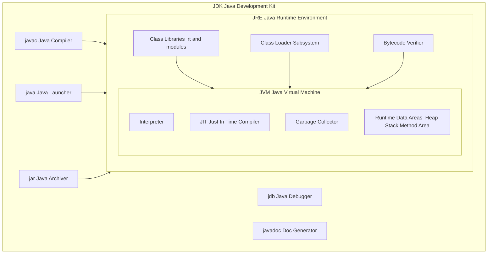
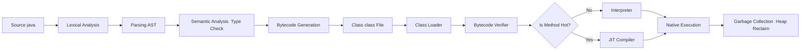
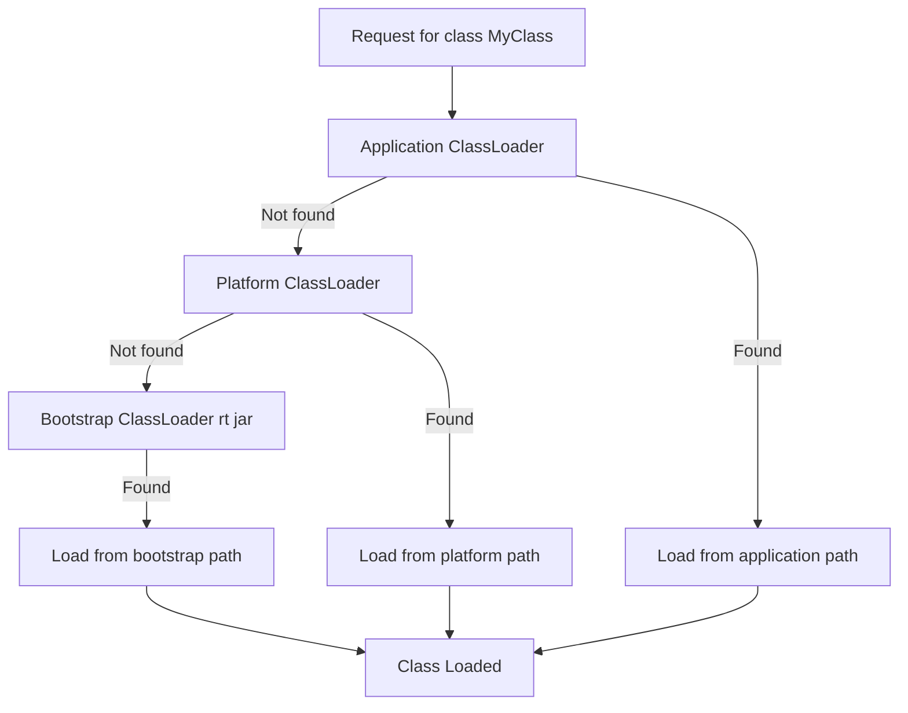

# Java programming Environment and Runtime Environment (Command Line & IDE)

<!-- SECTION_1_START -->
# Java Programming Environment and Runtime Environment

## Formal Academic Definition (KTU 2024 Syllabus Terminology)

The **Java Programming Environment** is a structured, multi-layered software ecosystem that enables developers to **write**, **compile**, **debug**, **package**, and **execute** Java applications in a platform-independent manner. As per the KTU 2024 OOP syllabus (Module 1), this environment is formally decomposed into three concentric architectural tiers: the **Java Development Kit (JDK)**, the **Java Runtime Environment (JRE)**, and the **Java Virtual Machine (JVM)**.

> [!IMPORTANT]
> **Syllabus Highlight:** The KTU 2024 OOP module explicitly expects students to **differentiate between JDK, JRE, and JVM**, and to **trace the lifecycle of a `.java` source file** from compilation to execution using both the **Command Line Interface (CLI)** and an **Integrated Development Environment (IDE)**.

### The Three Pillars of the Java Ecosystem

1. **JDK (Java Development Kit)** — A superset software bundle aimed at *programmers*. It bundles the JRE plus development tools such as the `javac` compiler, `jdb` debugger, `jar` archiver, `javadoc` documentation generator, and `javap` disassembler.
2. **JRE (Java Runtime Environment)** — A sub-bundle of the JDK aimed at *end-users*. It provides the standard library classes (`.jar` files), supporting files, and crucially, the **JVM** required to *run* (not develop) Java programs.
3. **JVM (Java Virtual Machine)** — The abstract computing machine (specified by a runtime specification) that **loads**, **verifies**, and **executes** Java bytecode. It is the engine that makes Java *“write once, run anywhere”* (WORA).

> [!NOTE]
> **Containment Rule:** $\text{JDK} \supset \text{JRE} \supset \text{JVM}$. A developer who installs the JDK automatically obtains the JRE and JVM. Installing only the JRE permits running Java applications but not compiling them.

---

## Conceptual Analogy & Intuitive Overview

Imagine you are authoring a **recipe book** that must be readable by chefs in Italy, Japan, and Brazil — each speaking a different native language.

| Role | Real-World Counterpart | Java Counterpart |
| :--- | :--- | :--- |
| **Recipe Author** | Chef who writes the recipe in a universal pictorial notation | Java Programmer writing `.java` source code |
| **Universal Notation System** | A standardised pictographic recipe format (e.g., ISO standard) | **Bytecode** (`.class` file) generated by `javac` |
| **Translator Chef** | A local chef in each country who interprets the universal notation into their native language and cooks it | **JVM** (one JVM per OS — Windows, Linux, macOS) |
| **Pantry with all spices and ovens** | The entire kitchen infrastructure used by chefs to cook | **JRE** (libraries + JVM) |
| **Author's Toolkit** | Pen, notepad, recipe template, plus the kitchen | **JDK** (compiler + JRE + tools) |

> [!TIP]
> **Intuitive takeaway:** The *source code* is universal in intent, *bytecode* is universal in transport, and the *JVM* is universal in execution. This three-stage universalisation is the secret behind Java’s platform independence.

### GeoGebra / Desmos Visualisation Callout

> [!VISUALIZATION CONTROL]
> **Concept:** Layered containment model of JDK, JRE, and JVM as concentric sets.
> **Desmos / GeoGebra Input (Circle Equations):**
> * `x^2 + y^2 = 9` &nbsp;&nbsp; *(outer circle — represents the JDK)*
> * `x^2 + y^2 = 5` &nbsp;&nbsp; *(middle circle — represents the JRE)*
> * `x^2 + y^2 = 2` &nbsp;&nbsp; *(inner circle — represents the JVM)*
> **Visual Description:** The student should observe three concentric circles. The innermost (JVM) sits *inside* the JRE, which itself sits *inside* the JDK. This visually encodes the strict subset relationship $\text{JVM} \subset \text{JRE} \subset \text{JDK}$.

---

## The Two Modes of Working

| Mode | Tooling | Best For |
| :--- | :--- | :--- |
| **Command Line Interface (CLI)** | `javac`, `java`, `jar` via terminal / PowerShell | Learning the *exact* compilation-execution pipeline; small academic programs; exam-style demonstrations |
| **Integrated Development Environment (IDE)** | Eclipse, IntelliJ IDEA, NetBeans, VS Code | Large projects, refactoring, GUI builders, version-control integration, debugging, plug-in ecosystems |

> [!WARNING]
> **Common KTU Mistake:** Students often answer *“JDK and JRE are the same.”* This is incorrect. The JDK *contains* the JRE. Always state the containment explicitly during examinations.

<!-- SECTION_1_END -->

<!-- SECTION_2_START -->
# Deep Theoretical Analysis & KTU High-Yield Formula Sheet

## 2.1 Detailed Architecture of the JDK

The JDK is **not** a single monolithic binary. It is a carefully organised collection of tools, libraries, and runtime artifacts. Below is a structured breakdown of its internal layout.

### JDK Directory Layout (Standard Distribution)

```
<JAVA_HOME>/
├── bin/         → Executable tools (javac, java, jar, jdb, javadoc)
├── conf/        → Deployment & properties configuration files
├── include/     → C/C++ header files for native-code (JNI) programming
├── jmods/       → Compiled core modules (java.base, java.sql, etc.)
├── legal/       → License documentation for each module
├── lib/         → Library files (tools.jar historically; classes & resources)
└── runtime/     → The actual JRE sub-distribution
```

### Key JDK Tools (Required Knowledge for KTU)

| Tool | Full Name | Purpose |
| :--- | :--- | :--- |
| `javac` | Java Compiler | Translates `.java` source into `.class` bytecode |
| `java` | Java Launcher | Starts the JVM, loads the main class, executes `main` |
| `jdb` | Java Debugger | Command-line debugger for bytecode-level inspection |
| `jar` | Java ARchiver | Packages multiple `.class` files into a single `.jar` archive |
| `javadoc` | Java Documentation Generator | Produces HTML API documentation from source comments |
| `javap` | Java Class Disassembler | Decompiles `.class` files back into readable bytecode instructions |
| `jlink` | Java Linker | Creates a custom, minimal runtime image for deployment |
| `jpackage` | Java Packager | Bundles a Java application as a platform-specific installer |

> [!NOTE]
> From **Java 9 onwards**, the JDK has been modularised under **Project Jigsaw** (Java Platform Module System — JPMS). The runtime and tools are organised into well-named modules such as `java.base`, `java.compiler`, `java.desktop`, `java.sql`, and `java.xml`.

---

## 2.2 JRE Internal Structure

The JRE provides the **runtime libraries** and the JVM. Its major components are:

1. **Java Class Libraries (rt.jar / jrt-fs in modular JDKs):** Pre-compiled classes such as `java.lang`, `java.util`, `java.io`, `java.net`.
2. **Class Loader Subsystem:** Responsible for dynamically loading, linking, and initialising classes at runtime.
3. **Bytecode Verifier:** Performs static analysis on `.class` files to ensure they do not violate JVM safety rules (e.g., no illegal stack manipulation).
4. **JVM Itself:** The actual execution engine.

---

## 2.3 The JVM — The Heart of Java

The JVM is a **stack-based abstract machine** that operates on an instruction set defined in the *Java Virtual Machine Specification*. Its primary subsystems are:

| Subsystem | Function |
| :--- | :--- |
| **Class Loader Subsystem** | Loads `.class` files; uses Bootstrap, Extension/Platform, and Application class loaders |
| **Runtime Data Areas** | Memory regions: **Heap** (objects), **Stack** (per-thread frames), **Method Area** (class metadata), **PC Register**, **Native Method Stack** |
| **Execution Engine** | Contains the **Interpreter**, the **JIT (Just-In-Time) Compiler**, and the **Garbage Collector (GC)** |
| **JNI (Java Native Interface)** | Bridges Java code with platform-specific native C/C++ libraries |
| **Native Method Libraries** | OS-level shared libraries (e.g., `.dll` on Windows, `.so` on Linux) |

> [!IMPORTANT]
> **JIT Compiler Concept:** Although the JVM starts as an *interpreter* (reading bytecode line by line), the **HotSpot JVM** monitors “hot” methods and compiles them into native machine code at runtime using the JIT compiler. The compiled native code is cached in the **Code Cache** memory region, so the program speeds up the longer it runs.

---

## 2.4 Java Program Lifecycle (Conceptual Flow)

$$
\text{Source (.java)} \xrightarrow{\text{javac}} \text{Bytecode (.class)} \xrightarrow{\text{ClassLoader}} \text{Verified Bytecode} \xrightarrow{\text{Interpreter/JIT}} \text{Native Execution}
$$

### Step-by-Step Pipeline

1. **Source Creation:** The programmer authors a `.java` file (plain UTF-8 text).
2. **Lexical Analysis:** `javac` tokenises the source into keywords, identifiers, literals, operators, and separators.
3. **Parsing:** Tokens are arranged into a **parse tree** representing the syntactic structure of the program.
4. **Semantic Analysis:** Type checking, scope resolution, and symbol-table lookups are performed.
5. **Bytecode Generation:** The verified parse tree is lowered into **bytecode instructions** stored in a `.class` file.
6. **Class Loading:** At runtime, the **Bootstrap ClassLoader** loads core Java classes; the **Application ClassLoader** loads user classes.
7. **Verification:** The Bytecode Verifier confirms stack, type, and control-flow integrity to prevent JVM crashes and security exploits.
8. **Interpretation / JIT Compilation:** Bytecode is executed. Hot methods are promoted to native code.
9. **Garbage Collection:** Unreferenced objects on the heap are reclaimed automatically.

---

## 2.5 Setting Up the Java Environment (CLI)

### Step 1 — Install the JDK
Download from the official Oracle site or use an open distribution such as **Adoptium (Temurin)**, **Amazon Corretto**, or **Azul Zulu**. Install under a path without spaces, e.g. `C:\Program Files\Java\jdk-21\`.

### Step 2 — Configure Environment Variables

| Variable | Typical Value (Windows) | Purpose |
| :--- | :--- | :--- |
| `JAVA_HOME` | `C:\Program Files\Java\jdk-21` | Points to the JDK root directory for tools and IDEs to discover |
| `PATH` | Append `%JAVA_HOME%\bin` | Allows `javac` and `java` to be invoked from any directory |
| `CLASSPATH` | `.` (current directory) or jar list | Tells JVM and `javac` where to search for user classes and packages |

### Step 3 — Verify the Installation

```bash
java -version
javac -version
```

> [!TIP]
> **Tip for KTU Lab Exams:** Always run `java -version` *and* `javac -version` at the start of your practical record. Examiners often award 1 mark simply for demonstrating that the environment is correctly configured.

---

## 2.6 The `java` and `javac` Tools — Key Flags

| Command | Purpose | Example |
| :--- | :--- | :--- |
| `javac FileName.java` | Compile a single source file | `javac Hello.java` |
| `javac *.java` | Compile all sources in current directory | `javac *.java` |
| `javac -d out FileName.java` | Place generated `.class` files into `out/` folder | `javac -d bin src/Hello.java` |
| `javac -classpath lib\* FileName.java` | Include external JARs during compilation | `javac -cp lib\* Hello.java` |
| `java ClassName` | Run a compiled program (no `.class` extension) | `java Hello` |
| `java -classpath .;lib\* ClassName` | Run with classpath including JARs | `java -cp .;lib\* Hello` |
| `java -ea ClassName` | Enable assertions during runtime | `java -enableassertions Hello` |
| `java -Xmx512m ClassName` | Set max heap size to **512 MB** | `java -Xmx512m Hello` |

---

## 2.7 KTU High-Yield Formula / Cheat Sheet

| Concept | Equation / Statement | Notes |
| :--- | :--- | :--- |
| Containment | $\text{JDK} \supset \text{JRE} \supset \text{JVM}$ | Strict hierarchical inclusion |
| Compilation | $\text{Source} \xrightarrow{javac} \text{Bytecode}$ | Output: `.class` file |
| Execution | $\text{Bytecode} \xrightarrow{JVM} \text{Native Code}$ | JIT may convert hot methods to native |
| Method Signature | `public static void main(String[] args)` | Exact entry-point signature (case-sensitive) |
| Entry Point Name | `main` (lowercase) | JVM searches exactly for this identifier |
| Class File | One public class per `.java` file | Filename must match public class name |
| File Extension for Source | `.java` | Compiled output is `.class` |
| File Extension for Archive | `.jar` | Created using `jar cf MyApp.jar *.class` |
| Archive Extension for Web | `.war` | Web ARchive — for servlet-based Java EE apps |
| Default Heap Size | Initial: **128 MB**, Max: **256 MB** (Java 21 defaults) | Override via `-Xms` and `-Xmx` |
| Default Classpath | Current directory (`.`) | JVM searches current folder for classes |
| Just-In-Time Trigger | Method invoked $\geq 10{,}000$ times (HotSpot default) | Method is then compiled to native code |

> [!WARNING]
> **Valuation Pitfall:** Examiners frequently deduct marks when students write `javac Hello.class` or `java Hello.java`. The correct invocation is `javac Hello.java` followed by `java Hello`. Remember: *the extension is used during compilation but not during execution.*

---

## 2.8 Real-World Engineering Utility

| Industry Domain | Why the Java Environment Matters |
| :--- | :--- |
| **Enterprise Backend (Banking, ERP)** | The JVM’s mature GC, deterministic performance, and large library ecosystem power mission-critical services like those at Goldman Sachs, JPMorgan, and TCS. |
| **Android Mobile Development** | Android’s `ART` (Android Runtime) and older `Dalvik` VMs are direct descendants of the JVM, executing a derivative of Java bytecode. |
| **Big Data (Hadoop, Spark, Kafka)** | The JVM’s multithreading and memory model underpin these frameworks, processing petabytes of data daily. |
| **Embedded & IoT (Java ME, GraalVM Native Image)** | Compact, optimisable Java runtimes enable deployment on resource-constrained devices. |
| **Scientific Computing** | Libraries such as **Apache Commons Math**, **ND4J**, and **Weka** provide JVM-based numerical and machine-learning primitives. |

<!-- SECTION_2_END -->

<!-- SECTION_3_START -->
# Step-by-Step Derivations, Compilation Pipeline & Code Implementation

## 3.1 Anatomy of a Simple Java Program

Below is the canonical *“Hello, World!”* program. Every line is annotated with its purpose — a format KTU examiners expect students to master in the early modules.

```java
// File: HelloWorld.java
// A demonstrative program illustrating the structure of a Java application.

public class HelloWorld {                          // (1) Top-level class declaration
    public static void main(String[] args) {       // (2) JVM entry-point method
        System.out.println("Hello, World!");       // (3) Statement: print to console
    }                                              // (4) End of main
}                                                  // (5) End of class
```

### Line-by-Line Logical Breakdown

| Line / Block | Element | Description |
| :--- | :--- | :--- |
| `public class HelloWorld` | **Class Declaration** | A class is the *fundamental unit of encapsulation* in Java. The `public` modifier makes it accessible from any package. The class name **must exactly match the filename** `HelloWorld.java`. |
| `public static void main(String[] args)` | **Entry-Point Method** | `public` → accessible by the JVM. `static` → callable without instantiating the class. `void` → returns no value. `String[] args` → accepts command-line arguments as an array of strings. |
| `System.out.println("Hello, World!");` | **Statement** | `System` is a final class in `java.lang`. `out` is a `static PrintStream` object. `println` writes a line followed by a newline character. |
| `{ }` | **Block Delimiters** | Group related statements and define scope of variables. |
| `//` | **Single-Line Comment** | Ignored by the compiler; used for documentation. |
| `/* ... */` | **Multi-Line Comment** | Spans multiple lines. |

> [!IMPORTANT]
> **Why `public static void main(String[] args)`?**
> The JVM specification mandates that the main method be:
> * `public` &nbsp;— so the JVM (outside the class) can invoke it.
> * `static` &nbsp;— so the JVM does not need to instantiate the class first.
> * `void` &nbsp;&nbsp;— so no return value is expected.
> * Named `main` — case-sensitive.
> * Taking a single parameter of type `String[]` (or `String... args` varargs form).

---

## 3.2 Compilation and Execution — The Exhaustive Walkthrough

### Step A — Save the Source

```bash
notepad HelloWorld.java       # On Windows
nano HelloWorld.java          # On Linux/macOS
```

### Step B — Compile with `javac`

```bash
javac HelloWorld.java
```

**What happens internally:**

1. The `javac` compiler reads `HelloWorld.java`.
2. Lexical analysis tokenises the text into a token stream.
3. The token stream is parsed into an **Abstract Syntax Tree (AST)**.
4. The AST is annotated with symbol-table information (type checking, scope resolution).
5. The annotated AST is lowered into **bytecode instructions**.
6. The bytecode is written to a new file `HelloWorld.class` in the same directory.
7. The `java` launcher command is now available to execute the bytecode.

```bash
dir                           # On Windows
# HelloWorld.class  HelloWorld.java
```

### Step C — Execute with `java`

```bash
java HelloWorld
```

**What happens internally:**

1. The `java` launcher (a thin C bootstrapper) locates the JRE in `JAVA_HOME` or the system path.
2. It instantiates the **JVM**.
3. The **Bootstrap ClassLoader** loads core classes from the JRE (`java.lang.*`, etc.).
4. The **Application ClassLoader** loads `HelloWorld.class` from the **classpath** (current directory by default).
5. The **Bytecode Verifier** validates the loaded class.
6. The JVM binds the class to runtime memory: the **Method Area** stores class metadata; the **Stack** is set up for the `main` thread.
7. The JVM invokes `HelloWorld.main(String[])`.
8. The **Interpreter** executes the `println` call, eventually calling native OS routines to write `"Hello, World!"` to standard output.
9. `main` returns; the thread terminates; the JVM performs shutdown hooks and exits.

**Console output:**
```
Hello, World!
```

---

## 3.3 Demonstration of Command-Line Arguments

The `String[] args` parameter of `main` receives any tokens passed after the class name on the command line.

```java
// File: CommandLineDemo.java
public class CommandLineDemo {
    public static void main(String[] args) {
        System.out.println("Total arguments received: " + args.length);
        System.out.println("--- Argument List ---");
        for (int i = 0; i < args.length; i++) {
            System.out.println("args[" + i + "] = " + args[i]);
        }
    }
}
```

### Compilation and Execution

```bash
javac CommandLineDemo.java
java CommandLineDemo Alice Bob 2024 "Kerala University"
```

### Expected Output

```
Total arguments received: 4
--- Argument List ---
args[0] = Alice
args[1] = Bob
args[2] = 2024
args[3] = Kerala University
```

> [!NOTE]
> **Quoting rule:** On most shells, double-quoted strings `"Kerala University"` are passed as a *single* argument containing the embedded space. Unquoted tokens are separated by whitespace.

### Numerical Conversion of Arguments

Because `args` is `String[]`, the student must convert it before performing arithmetic.

```java
// File: SumCommandLine.java
public class SumCommandLine {
    public static void main(String[] args) {
        if (args.length < 2) {
            System.err.println("Usage: java SumCommandLine <num1> <num2>");
            System.exit(1);
        }
        try {
            int a = Integer.parseInt(args[0]);
            int b = Integer.parseInt(args[1]);
            int sum = a + b;
            System.out.println("Sum = " + sum);
        } catch (NumberFormatException ex) {
            System.err.println("Both arguments must be valid integers.");
            System.exit(1);
        }
    }
}
```

**Execution:**
```bash
javac SumCommandLine.java
java SumCommandLine 25 17
# Output: Sum = 42
```

**Exhaustive logic walkthrough:**

1. `args.length < 2` checks that the user supplied at least two arguments. If not, a usage message is printed to **stderr**, and the program exits with status code `1` (non-zero indicates error).
2. `Integer.parseInt(String)` is a static factory method of the wrapper class `Integer`. It parses a decimal string into a primitive `int`.
3. If the string cannot be parsed (e.g., `"twenty"`), the method throws `NumberFormatException`, which is a subclass of `IllegalArgumentException` and an unchecked exception.
4. The `try-catch` block ensures the user receives a clean error message instead of a stack trace dump.
5. The sum is computed and printed via `System.out.println`.

---

## 3.4 Working with Packages, JARs, and Classpath (Practical Setup)

### Compiling into an Output Directory

```bash
mkdir -p out
javac -d out src/HelloWorld.java
```

The `-d out` flag tells `javac` to deposit `.class` files in the `out/` directory, mirroring the package structure of the source files.

### Running with an Explicit Classpath

```bash
java -cp out HelloWorld
```

The `-cp out` flag (alias for `-classpath`) tells the JVM to search the `out/` directory for user classes. Multiple entries are separated by `;` on Windows and `:` on Unix-like systems.

### Packaging a JAR File

```bash
# Step 1: Compile
javac HelloWorld.java

# Step 2: Create a JAR with a manifest pointing to the main class
echo Main-Class: HelloWorld > manifest.txt
jar cfm HelloWorld.jar manifest.txt HelloWorld.class

# Step 3: Run the JAR
java -jar HelloWorld.jar
```

**Output of `jar tf HelloWorld.jar` (inspection):**
```
META-INF/
META-INF/MANIFEST.MF
HelloWorld.class
```

> [!TIP]
> **For KTU practical records:** Always show the contents of `MANIFEST.MF` using `jar xf HelloWorld.jar META-INF/MANIFEST.MF` and then opening the file. Examiners appreciate the extra mile.

---

## 3.5 IDE-Based Workflow (IntelliJ IDEA / Eclipse / NetBeans)

The IDE abstracts away the manual steps above. The typical workflow is:

1. **Create New Project** — Specify the JDK to be used (Project SDK).
2. **Create Source File** — Place under `src/` directory. IDE auto-applies package layout.
3. **Write Code** — Benefit from *intellisense* (auto-complete), *refactoring*, *syntax highlighting*.
4. **Build Project** — IDE invokes `javac` on all sources and produces `.class` files in `out/` or `bin/`.
5. **Run** — IDE invokes `java` on the chosen entry-point class.
6. **Debug** — Set breakpoints, step into, inspect variables using the **Debug** perspective.

### Pros and Cons of CLI vs IDE

| Aspect | Command Line | IDE |
| :--- | :--- | :--- |
| **Setup Speed** | Instant (zero config) | Slower (download, configure) |
| **Learning Value** | High — student sees every command | Low — commands are hidden |
| **Compilation Speed** | Direct, predictable | Usually identical (delegated to `javac`) |
| **Debugging** | Manual via `jdb` | Visual, with breakpoints and variable watch |
| **Refactoring Support** | None (manual edit) | Automated, safe, type-aware |
| **Version Control Integration** | Requires `git` CLI knowledge | Built-in GUI for diffs, merges, branches |
| **Suitability for Exams** | Essential (KTU expects CLI knowledge) | Optional supplement |

> [!WARNING]
> **KTU Lab Exam Note:** Even if you develop in an IDE, the practical examination often requires you to *manually* compile and run from the command line. Always practise the `javac` / `java` cycle without IDE assistance.

---

## 3.6 What Happens When a `.class` File Is Disassembled?

Run `javap -c -p HelloWorld` to inspect the bytecode inside the class file. Example output (truncated for clarity):

```
Compiled from "HelloWorld.java"
public class HelloWorld {
  public HelloWorld();
    Code:
       0: aload_0
       1: invokespecial #1                  // Method java/lang/Object."<init>":()V
       4: return

  public static void main(java.lang.String[]);
    Code:
       0: getstatic      #2                  // Field java/lang/System.out:Ljava/io/PrintStream;
       3: ldc            #3                  // String Hello, World!
       5: invokevirtual #4                  // Method java/io/PrintStream.println:(Ljava/lang/String;)V
       8: return
}
```

**Interpretation:**

| Bytecode Mnemonic | Meaning |
| :--- | :--- |
| `aload_0` | Load the first local variable (`this`) onto the operand stack |
| `invokespecial` | Invoke an instance method (here, `Object.<init>`, the default constructor) |
| `getstatic` | Fetch the value of a static field (`System.out`) |
| `ldc` | Push a constant from the constant pool onto the operand stack |
| `invokevirtual` | Invoke a virtual (instance) method on an object (`println`) |
| `return` | Return `void` from the method |

> [!NOTE]
> This disassembly is *not* required for KTU exams, but it provides invaluable insight into how the JVM operates internally — a topic that occasionally appears in viva voce.

<!-- SECTION_3_END -->

<!-- SECTION_4_START -->
# Structural Diagrams & Schematics

## 4.1 Hierarchical Containment — JDK, JRE, JVM



**Reading the diagram:**

* The outer box represents the **JDK**, the development-tier superpackage.
* The middle box represents the **JRE**, the runtime tier.
* The innermost box represents the **JVM**, the execution engine.
* Arrows from the JDK tools point *into* the JRE because they invoke the runtime to actually run the bytecode after compilation.
* The class libraries, loader, and verifier are *children* of the JRE, which itself is a *child* of the JVM at runtime.

---

## 4.2 Java Program Execution Lifecycle



**Reading the diagram:**

* The leftmost vertical chain represents **compile-time** activities performed by `javac`.
* The rightmost region represents **runtime** activities performed by the JVM.
* The diamond decision node decides whether a method qualifies for JIT compilation (typically after **10,000+ invocations**).
* The Garbage Collector runs continuously in a separate background thread, reclaiming unreachable heap memory.

---

## 4.3 CLI Workflow vs IDE Workflow — Side-by-Side

```mermaid
flowchart TB
    subgraph CLIpath["CLI Workflow"]
        C1[Write  java in text editor] --> C2[Open terminal]
        C2 --> C3["javac HelloWorld java"]
        C3 --> C4["java HelloWorld"]
        C4 --> C5[See output in terminal]
    end
    subgraph IDEpath["IDE Workflow"]
        D1[Create new project] --> D2[Add source file in src]
        D2 --> D3[Write code in editor pane]
        D3 --> D4[Click Build  IDE runs javac internally]
        D4 --> D5[Click Run  IDE runs java internally]
        D5 --> D6[See output in Console panel]
    end
```



**Reading the diagram:**

* The two parallel subgraphs show that the **logical steps** are identical (write, compile, run, output) but the **interface** differs.
* The CLI flow exposes every command explicitly — ideal for understanding and for examinations.
* The IDE flow abstracts each command behind a button click — ideal for productivity.

---

## 4.4 Class Loading Subsystem — Delegation Model



**Reading the diagram:**

* The **delegation model** (parent-delegation) ensures that core Java classes (e.g., `java.lang.String`) cannot be overridden by user-supplied classes of the same name — a critical security feature.
* The search flows from the most specific classloader (Application) *upwards* to the most general (Bootstrap), and then *back down* to load from the first classloader that finds the class.

---

## 4.5 Sequential Processing Topology — Java Program to Running Application

| Stage | Input | Process | Output | Tool / Component |
| :---: | :--- | :--- | :--- | :--- |
| **1** | Problem requirement | Algorithmic design | Pseudocode / flowchart | Developer’s notebook |
| **2** | Pseudocode | Source code authoring | `HelloWorld.java` | Text editor / IDE |
| **3** | `HelloWorld.java` | Compilation | `HelloWorld.class` (bytecode) | `javac` |
| **4** | `HelloWorld.class` | Class loading | In-memory class object | ClassLoader subsystem |
| **5** | Class object | Bytecode verification | Verified class | Bytecode Verifier |
| **6** | Verified class | Interpretation / JIT | Native machine code | Interpreter / JIT |
| **7** | Native code | Execution | Program output | CPU + OS |

<!-- SECTION_4_END -->

<!-- SECTION_5_START -->
# KTU 2024 Scheme Examination Question Bank & Topic Recap

## Part A — Short Answer Questions (3 Marks Each)

### Question 1: Differentiate between JDK, JRE, and JVM.

`[KTU University Exam - December 2023]` &nbsp;| CO1, **Remember**

**Model Answer:**

| Aspect | JDK | JRE | JVM |
| :--- | :--- | :--- | :--- |
| **Full Form** | Java Development Kit | Java Runtime Environment | Java Virtual Machine |
| **Purpose** | Develop and compile Java programs | Run already-compiled Java programs | Execute bytecode on the host machine |
| **Contains** | JRE + development tools (`javac`, `jdb`, `jar`, `javadoc`) | JVM + class libraries | Specification + runtime engine |
| **User Type** | Java developers | End-users running Java apps | Internal runtime subsystem |
| **Includes Compiler?** | Yes (`javac`) | No | No |
| **Contains JVM?** | Yes (transitively) | Yes | It *is* the core |
| **Physical Form** | A software kit (downloadable) | A software package (subset of JDK) | A specification + a HotSpot/Custom implementation |
| **Analogy** | The entire workshop | The factory floor | The engine inside the factory |

**Containment Rule:** $\text{JDK} \supset \text{JRE} \supset \text{JVM}$. Installing the JDK automatically gives you the JRE and JVM. To run Java applications alone, you need only the JRE. To develop them, you need the JDK. **[3 Marks]**

---

### Question 2: What is Java Bytecode? Why is it considered platform-independent?

`[KTU University Exam - July 2024]` &nbsp;| CO1, **Understand**

**Model Answer:**

**Bytecode Definition:** Java bytecode is the *intermediate, low-level instruction set* generated by the `javac` compiler when it translates a `.java` source file. It is stored in `.class` files and is not directly executable by any physical processor.

**Key Properties:**

1. **Compact and Verifiable:** Each instruction occupies 1 byte (hence the name *bytecode*). The structure permits automated verification of safety properties.
2. **Stack-Based:** The JVM is a stack machine — instructions operate on an operand stack rather than registers.
3. **Platform-Neutral:** Bytecode contains no reference to any specific operating system, processor, or device.

**Why Platform-Independent:**

The bytecode is **not** executed by the hardware. Instead, a *JVM* — which is *specific* to each OS / architecture — interprets and JIT-compiles the bytecode into native machine instructions at runtime.

$$
\text{Source} \xrightarrow{javac} \text{Bytecode} \xrightarrow{JVM_{\text{OS}}} \text{Native Code}
$$

Because the bytecode is identical for all platforms, the same `HelloWorld.class` file can be transported to a Windows, Linux, macOS, or ARM machine and executed without recompilation. This is the foundation of Java’s **WORA — Write Once, Run Anywhere** philosophy. **[3 Marks]**

---

## Part B — Long Answer Questions (14 Marks Each)

> **Internal Choice Format:** *Answer ANY ONE full question. Each carries 14 marks split into 7 + 7.*

---

### Question A (14 Marks): Java Program Execution Architecture & Command Line Arguments

`[KTU University Exam - December 2023]` &nbsp;| CO1, CO2 &nbsp;|&nbsp; Part (a) **Understand**, Part (b) **Apply**

#### (a) Explain the architecture of the Java Runtime Environment with a neat diagram. Describe the role of the ClassLoader and Bytecode Verifier in detail. **[7 Marks]**

**Model Solution:**

**Step 1 — JRE High-Level Architecture** *[2 Marks]*

The Java Runtime Environment is the on-disk collection of files required to *run* a Java program. It consists of:

* **Java Virtual Machine (JVM)** — the execution engine.
* **Core Class Libraries** — bundled `.jar`/`.jmod` files containing pre-compiled classes (`java.lang`, `java.util`, `java.io`, …).
* **Supporting Files** — configuration properties, native binaries, fonts, and resources.

**Step 2 — JVM Internal Architecture** *[2 Marks]*

| Component | Function |
| :--- | :--- |
| Class Loader Subsystem | Dynamically loads, links, and initialises classes at runtime |
| Runtime Data Areas | Memory: Heap, Stack, Method Area, PC Register, Native Method Stack |
| Execution Engine | Interpreter + JIT Compiler + Garbage Collector |
| JNI (Java Native Interface) | Bridge to platform-specific C/C++ native libraries |
| Native Method Libraries | OS-specific `.dll` / `.so` files used by JNI |

**Step 3 — ClassLoader Role** *[1.5 Marks]*

The ClassLoader performs three sequential actions:

1. **Loading:** Reads the `.class` binary and creates a `Class` object in the Method Area.
2. **Linking:**
   * **Verification** — ensures bytecode validity (delegated to the Bytecode Verifier).
   * **Preparation** — allocates memory for static variables and initialises them to defaults.
   * **Resolution** — replaces symbolic references in the constant pool with direct references.
3. **Initialisation:** Executes static initialisers and assigns declared values to static variables.

**Three built-in classloaders** (parent-delegation model):
* **Bootstrap ClassLoader** — loads core Java classes from `rt.jar` / `java.base`.
* **Platform (Extension) ClassLoader** — loads extension modules.
* **Application ClassLoader** — loads user classes from the classpath.

**Step 4 — Bytecode Verifier Role** *[1.5 Marks]*

The Bytecode Verifier statically analyses the loaded class to guarantee that:

* Stack operations are well-typed (no pushing an `int` and popping a `String`).
* Local variables are accessed with the correct type.
* Method calls match the receiver object’s type.
* No illegal control flow (e.g., falling off the end of a method, jumping to invalid offsets).
* No forged object pointers or arbitrary memory access.

This prevents the JVM from executing malicious or malformed bytecode, ensuring type safety and memory safety.

**Valuation Key Points:**
* [Stating JRE components: 2 Marks]
* [Describing JVM subsystems: 2 Marks]
* [Explaining ClassLoader phases: 1.5 Marks]
* [Explaining Bytecode Verifier checks: 1.5 Marks]

#### (b) Write a Java program to accept three numbers as command-line arguments, find their sum and average, and display the results. Demonstrate its compilation and execution from the command line. **[7 Marks]**

**Model Solution:**

```java
// File: StatsCommandLine.java
public class StatsCommandLine {
    public static void main(String[] args) {
        if (args.length != 3) {
            System.err.println("Usage: java StatsCommandLine <num1> <num2> <num3>");
            System.exit(1);
        }
        try {
            double a = Double.parseDouble(args[0]);
            double b = Double.parseDouble(args[1]);
            double c = Double.parseDouble(args[2]);
            double sum = a + b + c;
            double average = sum / 3.0;
            System.out.println("Numbers entered : " + a + ", " + b + ", " + c);
            System.out.printf("Sum             : %.2f%n", sum);
            System.out.printf("Average         : %.2f%n", average);
        } catch (NumberFormatException ex) {
            System.err.println("All three arguments must be valid numbers.");
            System.exit(1);
        }
    }
}
```

**Step-by-Step Walkthrough** *[5 Marks]*

1. `args.length != 3` validates input count. If invalid, an error is printed and the program exits with status code `1`. *[0.5 Marks]*
2. `Double.parseDouble(String)` converts each string argument into a `double`. Using `double` (instead of `int`) allows decimal inputs. *[1 Mark]*
3. The sum is computed as $S = a + b + c$. *[0.5 Marks]*
4. The average is computed as $\text{avg} = \dfrac{S}{3.0}$. Note the `3.0` (not `3`) to enforce floating-point division. *[1 Mark]*
5. `System.out.printf("%.2f", value)` formats the output to two decimal places. The `%n` produces a platform-independent newline. *[0.5 Marks]*
6. The `try-catch` block guards against `NumberFormatException` thrown when a non-numeric string is supplied. *[1 Mark]*
7. Clean program termination with status `0` (default) after successful output. *[0.5 Marks]*

**Compilation and Execution** *[2 Marks]*

```bash
javac StatsCommandLine.java
java StatsCommandLine 10 20 30
```

**Expected Output:**

```
Numbers entered : 10.0, 20.0, 30.0
Sum             : 60.00
Average         : 20.00
```

```bash
java StatsCommandLine 5.5 7.25 9.75
```

**Expected Output:**

```
Numbers entered : 5.5, 7.25, 9.75
Sum             : 22.50
Average         : 7.50
```

**Valuation Key Points:**
* [Correct program structure with proper main signature: 1 Mark]
* [Proper input validation: 1 Mark]
* [Correct conversion and arithmetic: 1 Mark]
* [Output formatting: 1 Mark]
* [Exception handling: 1 Mark]
* [Compilation and execution commands: 2 Marks]

> [!WARNING]
> **Examiner’s Pitfall Alert:** Students often forget the **`%n`** newline in `printf` and produce cramped output. They also sometimes write `args.length < 3` instead of `args.length != 3` — both work, but the latter is more precise. Most importantly, do **not** hardcode the three numbers inside the source file; the entire point of this question is to demonstrate *command-line argument* processing.

---

### Question B (14 Marks): JDK Tools, IDE Setup & Environment Configuration

`[KTU University Exam - July 2024]` &nbsp;| CO1, CO2 &nbsp;|&nbsp; Part (a) **Understand**, Part (b) **Apply**

#### (a) Describe the major components of the Java Development Kit (JDK) and explain the role of each tool with an example command. **[7 Marks]**

**Model Solution:**

**Step 1 — Introduction** *[0.5 Marks]*

The JDK is the superset software bundle distributed by Oracle (and other vendors such as Adoptium, Azul, Amazon) that provides *all* the tools required to *develop*, *compile*, *debug*, *document*, *package*, and *execute* Java applications. The JDK includes the JRE and JVM, plus a suite of command-line tools located in the `bin/` directory of the JDK installation.

**Step 2 — Major JDK Tools and Their Roles** *[5.5 Marks]*

| # | Tool | Role | Example Command |
| :---: | :--- | :--- | :--- |
| 1 | `javac` | Java Compiler — translates `.java` source into `.class` bytecode | `javac HelloWorld.java` |
| 2 | `java` | Java Launcher — starts the JVM, loads main class, invokes `main` | `java HelloWorld` |
| 3 | `jar` | Java ARchiver — bundles multiple `.class` files into a single `.jar` archive | `jar cf MyApp.jar *.class` |
| 4 | `javadoc` | Documentation Generator — produces HTML API documentation from `/** ... */` comments | `javadoc -d doc HelloWorld.java` |
| 5 | `jdb` | Java Debugger — line-level and breakpoint-based debugging | `jdb HelloWorld` |
| 6 | `javap` | Class File Disassembler — prints method signatures and bytecode | `javap -c -p HelloWorld.class` |
| 7 | `jlink` | Java Linker — assembles a custom, minimal runtime image | `jlink --module-path jmods --add-modules java.base --output myruntime` |
| 8 | `jpackage` | Java Packager — produces platform-specific installers (`.exe`, `.dmg`, `.deb`) | `jpackage --input . --name MyApp --main-jar MyApp.jar` |
| 9 | `jdeps` | Java Dependency Analyzer — lists class-level module dependencies | `jdeps HelloWorld.class` |
| 10 | `jshell` | REPL (Read-Eval-Print Loop) — interactive Java snippet evaluator (Java 9+) | `jshell> System.out.println("Hi");` |

**Step 3 — Tool Grouping for Clarity** *[1 Mark]*

* **Compilation & Execution:** `javac`, `java`
* **Packaging & Distribution:** `jar`, `jlink`, `jpackage`
* **Documentation & Analysis:** `javadoc`, `javap`, `jdeps`
* **Debugging & Diagnostics:** `jdb`, `jstack`, `jmap`, `jconsole`
* **Interactive Experimentation:** `jshell`

**Valuation Key Points:**
* [Naming at least 6 tools correctly: 3 Marks]
* [Stating each tool’s role accurately: 2 Marks]
* [Providing one valid example command per tool (or for key tools): 1.5 Marks]
* [Logical grouping or summary: 0.5 Marks]

#### (b) Illustrate the step-by-step procedure to set up the Java environment on a Windows/Linux system and write a Java program that uses an external library (e.g., `gson`) by configuring the classpath correctly. **[7 Marks]**

**Model Solution:**

**Step 1 — JDK Installation** *[1.5 Marks]*

1. Visit the official Oracle JDK download page or Adoptium (Eclipse Temurin).
2. Download the installer for your OS (e.g., `jdk-21_windows-x64_bin.exe`).
3. Run the installer; the default path is `C:\Program Files\Java\jdk-21\` on Windows or `/opt/jdk-21/` on Linux.
4. Verify installation:

```bash
java -version
javac -version
```

**Expected output:**

```
java version "21.0.2" 2024-01-16 LTS
Java(TM) SE Runtime Environment (build 21.0.2+9-LTS)
Java HotSpot(TM) 64-Bit Server VM (build 21.0.2+9-LTS, mixed mode, sharing)
```

**Step 2 — Environment Variable Configuration** *[1.5 Marks]*

**On Windows (PowerShell):**

```powershell
setx JAVA_HOME "C:\Program Files\Java\jdk-21"
setx PATH "%PATH%;%JAVA_HOME%\bin"
```

**On Linux/macOS (Bash):**

```bash
export JAVA_HOME=/opt/jdk-21
export PATH=$JAVA_HOME/bin:$PATH
```

To make the settings permanent on Linux, append the above lines to `~/.bashrc` and run `source ~/.bashrc`.

**Step 3 — Download an External Library (Gson)** *[1 Mark]*

```bash
mkdir MyJavaProject
cd MyJavaProject
mkdir lib
# Download gson-2.10.1.jar from https://repo1.maven.org/maven2/com/google/code/gson/gson/2.10.1/
# Place the jar inside the lib/ folder:
mv ~/Downloads/gson-2.10.1.jar lib/
```

**Step 4 — Write the Java Program** *[1.5 Marks]*

```java
// File: GsonDemo.java
import com.google.gson.Gson;
import com.google.gson.JsonObject;

public class GsonDemo {
    public static void main(String[] args) {
        JsonObject obj = new JsonObject();
        obj.addProperty("name", "Alice");
        obj.addProperty("course", "B.Tech CSE");
        obj.addProperty("university", "KTU Kerala");

        Gson gson = new Gson();
        String json = gson.toJson(obj);
        System.out.println("Generated JSON:");
        System.out.println(json);
    }
}
```

**Step 5 — Compile and Run with Classpath** *[1.5 Marks]*

```bash
# Compile
javac -cp lib/gson-2.10.1.jar GsonDemo.java

# Run
java -cp .;lib/gson-2.10.1.jar GsonDemo
```

**On Linux/macOS, replace `;` with `:` in the classpath:**

```bash
javac -cp lib/gson-2.10.1.jar GsonDemo.java
java  -cp .:lib/gson-2.10.1.jar GsonDemo
```

**Expected Output:**

```
Generated JSON:
{"name":"Alice","course":"B.Tech CSE","university":"KTU Kerala"}
```

**Valuation Key Points:**
* [Correct installation steps: 1.5 Marks]
* [Correct environment variable configuration (JAVA_HOME and PATH): 1.5 Marks]
* [Correct import and use of external library: 1 Mark]
* [Correct classpath compilation: 1.5 Marks]
* [Correct classpath execution with platform-correct separator: 1 Mark]
* [Expected output: 0.5 Marks]

> [!WARNING]
> **Examiner’s Pitfall Alert — Common Marks Lost:**
> * Using the **wrong classpath separator** (writing `;` on Linux or `:` on Windows). Always mention the platform-specific separator.
> * Writing `java -cp lib/gson-2.10.1.jar GsonDemo` *without* including `.` (current directory) — this causes `GsonDemo` itself to be unfindable. The correct form is `-cp .:lib/gson-2.10.1.jar` or `-cp .;lib/gson-2.10.1.jar`.
> * Forgetting to set `JAVA_HOME` *before* adding it to `PATH` — a sequencing error.
> * Not verifying the installation with `java -version` — examiners may deduct 0.5 marks for skipping this sanity check.

---

## Topic Recap & Important Things to Remember

* **The three-tier architecture** of the Java environment is $\text{JDK} \supset \text{JRE} \supset \text{JVM}$. Always draw or state this containment explicitly.
* **JDK** is for *developers*; it includes the compiler (`javac`), tools (`jar`, `javadoc`, `jdb`, `javap`, `jshell`, `jlink`, `jpackage`), and the JRE.
* **JRE** is for *end-users*; it includes the JVM and the standard class libraries, but *not* the compiler.
* **JVM** is the abstract machine that loads, verifies, and executes bytecode. It is *platform-specific*, but the bytecode it consumes is *platform-independent*.
* **Bytecode** is the intermediate instruction set produced by `javac`, stored in `.class` files, and consisting of 1-byte opcodes. It is the foundation of **WORA** (Write Once, Run Anywhere).
* **Compilation command:** `javac FileName.java` (extension is **required**).
* **Execution command:** `java ClassName` (extension `.class` is **omitted**).
* The **main method signature** is *exactly* `public static void main(String[] args)` — case-sensitive, return type `void`, parameter type `String[]` (or `String... args`).
* A `.java` file may contain **at most one** `public` class, and the filename must match the public class name.
* **Command-line arguments** arrive as a `String[]` in the `args` parameter; numeric conversion requires `Integer.parseInt` or `Double.parseDouble`.
* **Classpath** (`-cp` or `-classpath`) is searched by both `javac` and `java` for user classes and external JARs. Separator is `;` on Windows, `:` on Unix.
* **JVM subsystems** include the ClassLoader (parent-delegation), Bytecode Verifier, Execution Engine (Interpreter + JIT + GC), Runtime Data Areas (Heap, Stack, Method Area, PC Register, Native Method Stack), and JNI.
* **JIT compilation** promotes “hot” methods (typically those invoked **10,000+ times**) from interpreted bytecode into native machine code, dramatically improving runtime performance.
* **Garbage Collection** automatically reclaims unreachable objects on the heap, eliminating manual `free()` calls.
* **Environment variables** `JAVA_HOME` and `PATH` must be configured for CLI development; verify with `java -version` and `javac -version`.
* **JAR files** are created with `jar cf MyApp.jar *.class` and run with `java -jar MyApp.jar` (provided a `Main-Class` entry exists in `MANIFEST.MF`).
* **CLI vs IDE:** CLI is mandatory knowledge for KTU exams; IDEs (Eclipse, IntelliJ, NetBeans) are productivity tools that internally invoke `javac` and `java`.

<!-- SECTION_5_END -->
