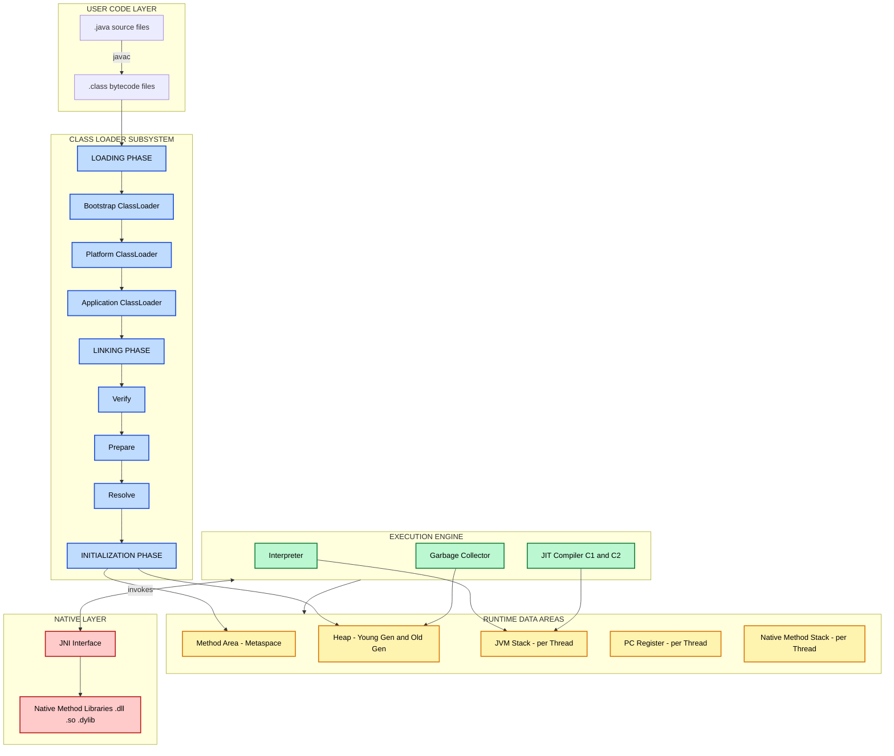
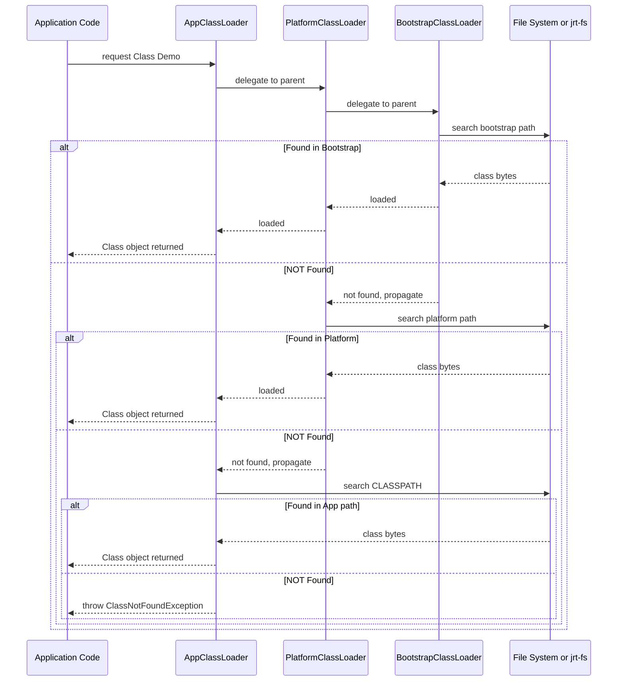
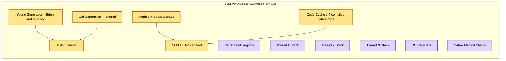
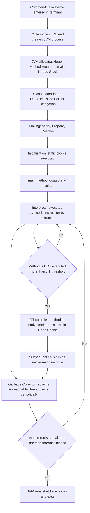

# Java Virtual Machine

<!-- SECTION_1_START -->
# Java Virtual Machine (JVM) — The Heart of Java Execution

> [!NOTE]
> **KTU Syllabus Definition (PBCST304 — Module 1):** The *Java Virtual Machine (JVM)* is an abstract computing machine, or specification, that provides the runtime environment in which Java bytecode can be executed. It is the component of the Java Runtime Environment (JRE) responsible for loading, verifying, linking, and executing Java programs.

> [!IMPORTANT]
> **Core Highlight — The WORA Promise**
> Java’s famous motto **"Write Once, Run Anywhere" (WORA)** is delivered *entirely* by the JVM. The compiler (`javac`) does not produce native machine code for a specific OS/CPU. Instead, it produces platform-neutral **bytecode**, and any device that hosts a compliant JVM can run that same bytecode.

## 1.1 Conceptual Analogy — The "Universal DVD Player"

Imagine you bought a movie on **DVD** (a standardized disc format).

- The **DVD** is like **Java bytecode** — a standardized, neutral format.
- The **DVD Player** sitting on your TV is the **JVM** — it reads the disc and converts it into electrical signals your screen understands.
- Whether your TV is a Sony, Samsung, or LG (Windows, Linux, macOS), the **same DVD plays** because every DVD player speaks the same disc language — exactly like every JVM speaks the same bytecode language.

> [!TIP]
> **Mnemonic to remember:** *JVM = Java's Universal Translator sitting between your code and the metal.*

## 1.2 Position of JVM in the Java Ecosystem

$$
\boxed{\text{JDK} \supseteq \text{JRE} \supseteq \text{JVM}}
$$

| Tier | Full Form | Contains | Purpose |
|------|-----------|----------|---------|
| **JDK** | Java Development Kit | `javac`, debugger, JRE | Used by *developers* to **build** programs |
| **JRE** | Java Runtime Environment | JVM + Core Libraries (rt.jar) | Used by *end-users* to **run** programs |
| **JVM** | Java Virtual Machine | ClassLoader, Execution Engine, Runtime Data Areas | The actual **engine** that executes bytecode |

> [!WARNING]
> **Common KTU Mistake:** Students often write "JVM is a physical machine." It is **NOT physical** — it is a *software-based abstract machine* simulated by the host OS/hardware. Mark deduction of 1 mark is common for confusing JVM with the physical CPU.

## 1.3 Bytecode — The Language of the JVM

When you compile `Hello.java` with `javac`, the output `Hello.class` is **not** machine code. It is **bytecode** — a highly optimized set of instructions designed specifically for the JVM. The file begins with the magic hex value **`0xCAFEBABE`**.

> [!VISUALIZATION CONTROL]
> **Concept:** Compile-time vs Run-time translation in Java
> **GeoGebra / Desmos Input Equations:** (conceptual axis)
> * `x-axis` → Program Lifecycle Stages: `Source (.java)  →  Bytecode (.class)  →  Native Machine Code`
> * `y-axis` → Portability Index (0 to 1, where 1 = fully portable)
> **Visual Description:** Plot three marker points:
> 1. `Point A = (Source, 0.2)` — tied to a specific language/IDE.
> 2. `Point B = (Bytecode, 1.0)` — perfectly portable across all OS.
> 3. `Point C = (Native Code, 0.1)` — tied to a specific CPU/OS.
> *Observe the portability of bytecode is the maximum — this is the value the JVM adds.*
<!-- SECTION_1_END -->

<!-- SECTION_2_START -->
# Deep Theoretical Analysis & KTU High-Yield Reference Sheet

## 2.1 The Three Major Subsystems of the JVM

The JVM is canonically divided into **three cooperating subsystems**. Every KTU board question on "JVM architecture" expects you to name and briefly explain these three blocks.

### A. Class Loader Subsystem
Responsible for **Loading, Linking, and Initializing** classes into the JVM memory.

### B. Runtime Data Areas (Memory)
The actual memory regions where the program’s data lives during execution.

### C. Execution Engine
The component that actually *runs* the bytecode using a combination of the **Interpreter**, the **JIT Compiler**, and the **Garbage Collector**.

> [!IMPORTANT]
> **High-Yield Note for 14-Mark Questions:** Always draw a labeled block diagram of the JVM with these three subsystems and the **JNI / Native Method Libraries** block on the right. Examiners explicitly award 2 marks for the diagram alone.

## 2.2 ClassLoader Subsystem — Three Hierarchical Loaders

| ClassLoader | Class Name | Loads From | Parent | Triggered When |
|-------------|-----------|------------|--------|----------------|
| **Bootstrap** | `BootstrapClassLoader` | `jrt-fs` (rt.jar / modules) | None (root) | Core Java classes like `java.lang.String` are referenced |
| **Platform (Extension)** | `PlatformClassLoader` | `jdk.internal.loader.ClassLoaders$PlatformClassLoader` | Bootstrap | Extension libraries / `java.sql`, `javax.*` |
| **Application (System)** | `AppClassLoader` | `CLASSPATH` (current directory by default) | Platform | User-defined classes in your project |

> [!NOTE]
> **Delegation Model (Parent-First):** Whenever a class is requested, the request is **delegated upward to the parent** first. Only if the parent cannot find the class does the child attempt to load it. This is called the **Parent Delegation Model**, and it prevents malicious overriding of core Java classes like `java.lang.Object`.

## 2.3 The Three Phases of Class Loading

$$
\boxed{\text{Loading} \;\longrightarrow\; \text{Linking (Verify, Prepare, Resolve)} \;\longrightarrow\; \text{Initialization}}
$$

- **Loading** — Reads the `.class` file and creates a binary representation in the Method Area.
- **Linking** — Three sub-steps:
  - **Verify** — Bytecode verifier checks for illegal code (stack overflows, type mismatches).
  - **Prepare** — Allocates memory for **static variables** and assigns **default values** (e.g., `int` → `0`).
  - **Resolve** — Replaces symbolic references in the constant pool with direct references.
- **Initialization** — Executes static initializers (`static {}` blocks) and assigns actual values.

## 2.4 Runtime Data Areas — The JVM Memory Map

| Memory Area | Thread Scope | Stores | OutOfMemoryError Triggered When |
|-------------|--------------|--------|---------------------------------|
| **Method Area** (a.k.a. Metaspace from Java 8) | Shared (per JVM) | Class metadata, constant pool, static variables, method bytecode | `-XX:MaxMetaspaceSize` exceeded |
| **Heap** | Shared (per JVM) | All **objects**, instance variables, arrays | `-Xmx` exceeded → `java.lang.OutOfMemoryError: Java heap space` |
| **JVM Stack** | Per-thread | Stack frames: local variables, operand stack, return address | `-Xss` exceeded → `StackOverflowError` |
| **PC Register** | Per-thread | Address of the *currently executing* JVM instruction | Cannot overflow; always exactly 1 word per thread |
| **Native Method Stack** | Per-thread | State for C/C++ native methods (JNI) | Rare in pure-Java apps |

> [!TIP]
> **KTU Memory Trick:** *"PC-Native-Stack" are per-thread; the others (Method Area, Heap) are shared.* Mnemonic: **"PCN Stack" = Per-Thread**.

## 2.5 Execution Engine — The Brain

| Component | Role | Speed |
|-----------|------|-------|
| **Interpreter** | Reads and executes bytecode line-by-line | Slow (no caching) |
| **JIT (Just-In-Time) Compiler** | Compiles *hot* (frequently executed) bytecode to native machine code at runtime | Fast (cached) |
| **Garbage Collector (GC)** | Automatically reclaims memory from unreachable objects on the Heap | Runs in background |
| **JNI + Native Libraries** | Bridge to invoke C/C++/Assembly code (`.dll`, `.so`, `.dylib`) | Native speed |

## 2.6 Garbage Collection — Quick High-Yield Points

> [!IMPORTANT]
> KTU frequently asks: *"How does Java achieve automatic memory management?"* The answer is the **Garbage Collector (GC)** which uses a **mark-and-sweep** approach (with generational optimization):
> 1. **Mark** all reachable objects starting from *GC Roots* (local variables, active threads, static fields).
> 2. **Sweep** (delete) all unmarked objects.
> 3. **Compact** (optional) to reduce fragmentation.

**Generational Heap Layout:**

| Generation | Stores | GC Type | Why |
|------------|--------|---------|-----|
| **Young Gen** | New, short-lived objects | Minor GC (fast, frequent) | *Hypothesis:* most objects die young |
| **Old Gen (Tenured)** | Long-surviving objects | Major GC (slow, rare) | Promoted from Young after surviving many GCs |
| **Permanent Gen / Metaspace** | Class metadata | (Java 8+: native memory) | Removed from heap in Java 8 |

## 2.7 Why JVM? — Engineering Utility

- **Security** — Bytecode verifier + sandboxed runtime prevents most memory corruption attacks.
- **Portability** — One binary runs on Windows, Linux, macOS, embedded devices, even browsers (Java Applets — historical).
- **Performance** — Modern **JIT + HotSpot** technology brings Java performance within **5–10% of C++**.
- **Dynamic Features** — Runtime class loading enables reflection, proxies (used heavily in Spring, Hibernate).
- **Polyglot JVM** — Scala, Kotlin, Groovy all compile to the *same* JVM bytecode, sharing the ecosystem.

## 2.8 KTU Formula / Parameter Sheet

> **Note on notation:** Absolute values in math mode use `\vert` (never the pipe character) to preserve markdown table integrity.

| Parameter | JVM Flag (CLI) | Default | Purpose |
|-----------|----------------|---------|---------|
| Initial Heap | `-Xms` | OS-dependent | Starting size of the Heap |
| Max Heap | `-Xmx` | OS-dependent | Upper limit of the Heap |
| Stack per Thread | `-Xss` | **512 KB** to **1 MB** (OS-dependent) | Size of each thread's JVM Stack |
| Metaspace Max | `-XX:MaxMetaspaceSize` | Unlimited (auto-grow) | Cap for class metadata |
| Young Gen Ratio | `-XX:NewRatio` | `2` (i.e., Young:Old = 1:2) | Heap generational split |

**Memory Equation:**

$$
\text{Total JVM Footprint} \;\approx\; \text{Heap} + \text{Non-Heap (Metaspace + Code Cache + Threads} \times X_{ss}\text{)}
$$

**Compilation Speed Equation (conceptual):**

$$
T_{\text{first-run}} \;=\; T_{\text{Interpreter-only}}, \qquad
T_{\text{steady-state}} \;=\; T_{\text{Interpreter}} \cdot \left(1 - p_{\text{hot}}\right) + T_{\text{Native}} \cdot p_{\text{hot}}
$$

where $p_{\text{hot}}$ is the fraction of bytecode the JIT has already compiled to native code.
<!-- SECTION_2_END -->

<!-- SECTION_3_START -->
# Step-by-Step Derivations, Bytecode Walkthrough & Code Implementation

## 3.1 End-to-End Execution: From `.java` to Running Program

Below is the **complete, exhaustive chain** of events when you execute a Java file. KTU expects you to be able to write this sequence for a 7-mark question.

> **Step 1 — Source Code Authoring:** You write a file `Demo.java` containing valid Java source.

> **Step 2 — Compilation by `javac`:** The Java compiler reads `Demo.java` and emits `Demo.class`. This `.class` file is **bytecode** — a stream of single-byte opcodes plus structured metadata. It is **not** machine code for Intel/ARM/RISC-V; it is machine code for the *abstract* JVM.

> **Step 3 — JVM Invocation:** Typing `java Demo` instructs the OS to launch the JRE, which in turn starts a new JVM instance.

> **Step 4 — Class Loading:** The `AppClassLoader` is asked to find `Demo.class`. Following the **Parent Delegation Model**, the request is first delegated to `PlatformClassLoader`, then to `BootstrapClassLoader`. Bootstrap cannot find it, Platform cannot find it, so `AppClassLoader` finally reads the file from the current directory (CLASSPATH).

> **Step 5 — Linking (Verify → Prepare → Resolve):**
> - *Verify* — The bytecode verifier inspects every instruction to ensure no illegal type casts, no stack underflow/overflow, no access violations.
> - *Prepare* — Memory is reserved in the **Method Area** for the class’s static fields and default values are assigned (`int → 0`, `boolean → false`, `Object → null`).
> - *Resolve* — Symbolic references (e.g., `#12 = Class java/lang/System`) are replaced by direct memory pointers.

> **Step 6 — Initialization:** Static initializers (`static { ... }`) and static variable assignments with real values are executed. The class is now fully *Initialized*.

> **Step 7 — `main()` Lookup & Thread Spawn:** The JVM locates the `public static void main(String[] args)` method, allocates a new **JVM Stack** for the *main* thread, pushes a new **stack frame**, and sets the **PC Register** to point to the first instruction of `main`.

> **Step 8 — Execution Engine Takes Over:** The **Interpreter** reads each bytecode instruction one by one, executing it on the operand stack. When a method is detected as "hot" (executed above the JIT threshold, typically **10,000 invocations**), the **C1 or C2 JIT Compiler** kicks in and converts that method to native code, caching it in the **Code Cache**.

> **Step 9 — Garbage Collection (continuous):** Throughout execution, the GC daemon thread periodically marks unreachable objects in the **Heap** and reclaims their memory.

> **Step 10 — Termination:** When `main()` returns and all non-daemon threads complete, the JVM tears down the runtime data areas, calls shutdown hooks, and exits.

## 3.2 Worked Example: Source Code → Bytecode → Stack Execution

### 3.2.1 Java Source Code

```java
public class AreaDemo {
    public static void main(String[] args) {
        int radius = 5;
        double area = computeArea(radius);
        System.out.println("Area = " + area);
    }

    static double computeArea(int r) {
        return Math.PI * r * r;
    }
}
```

### 3.2.2 Disassembled Bytecode (using `javap -c AreaDemo`)

> This is exactly what the Interpreter reads. Each line is one bytecode instruction.

```
public class AreaDemo {
  public AreaDemo();
    Code:
       0: aload_0
       1: invokespecial  #1     // Method java/lang/Object."<init>":()V
       4: return

  public static void main(java.lang.String[]);
    Code:
       0: iconst_5                 // push int 5 onto operand stack
       1: istore_1                 // store into local var 1 (radius)
       2: iload_1                  // load radius
       3: i2d                      // convert int to double
       4: dconst_0                 // (not shown; PI is loaded as ldc)
       5: dmul                     // multiply PI * r
       6: iload_1
       7: i2d
       8: dmul                     // multiply (PI*r) * r
       9: dstore_2                 // store result into local var 2 (area)
      10: getstatic    #2          // Field java/lang/System.out
      13: new           #3         // class java/lang/StringBuilder
      16: dup
      17: ldc           #4         // String "Area = "
      19: invokespecial #5         // StringBuilder.<init>
      22: dload_2                  // load area
      23: invokevirtual #6         // StringBuilder.append(double)
      26: invokevirtual #7         // StringBuilder.toString()
      29: invokevirtual #8         // PrintStream.println(String)
      32: return

  static double computeArea(int);
    Code:
       0: dload_0                  // load r (already widened to double)
       1: dload_0
       2: dmul
       3: dmul                     // stack: [..., result]
       4: dreturn                  // return double
}
```

### 3.2.3 Step-by-Step Operand-Stack Trace for `computeArea(5)`

The **JVM Stack** for the main thread contains a **frame** per active method. Each frame has its own **operand stack** (LIFO) and **local variable array**.

$$
\begin{aligned}
\text{Initial:} \;& \text{local[0] = 5, operand stack = []} \\
\text{Step 1 (dload\_0):} \;& \text{push local[0] → operand stack = [5.0]} \\
\text{Step 2 (dload\_0):} \;& \text{push local[0] → operand stack = [5.0, 5.0]} \\
\text{Step 3 (dmul):} \;& \text{pop two, push product → operand stack = [25.0]} \\
\text{Step 4 (dmul):} \;& \text{pop two, push product → operand stack = [78.5398...]} \\
\text{Step 5 (dreturn):} \;& \text{pop 78.5398, push onto caller's frame at PC=9 → area = 78.5398}
\end{aligned}
$$

**Result printed:** `Area = 78.53981633974483`

## 3.3 Demonstration: Proving JVM is Platform-Independent

The following **Python script** simulates a multi-platform execution. While this is *not* JVM internals, it visually demonstrates the abstraction layer:

```python
from typing import List, Callable
import platform

def jvm_like_executor(bytecode: List[str], os_name: str) -> str:
    """
    Simulates how a JVM runs the same bytecode on three different OSes,
    producing identical output regardless of the underlying platform.
    """
    output: List[str] = []
    variables: dict = {}

    for instruction in bytecode:
        parts = instruction.split()
        op = parts[0]

        if op == "PUSH":
            variables["__stack__"] = int(parts[1])
        elif op == "DOUBLE":
            variables["__stack__"] *= 2
        elif op == "PRINT":
            output.append(f"[{os_name}] Result = {variables['__stack__']}")
        elif op == "HALT":
            break
        else:
            raise ValueError(f"Illegal bytecode: {instruction}")

    return "\n".join(output)


# Same .class file (bytecode) — run on three platforms
bytecode_program: List[str] = [
    "PUSH 21",
    "DOUBLE",
    "PRINT",
    "HALT"
]

for os_name in ["Windows-11", "Ubuntu-22.04", "macOS-14"]:
    print(f"--- Executing on {os_name} ---")
    print(jvm_like_executor(bytecode_program, os_name))
```

**Expected Output (identical on all three):**
```
--- Executing on Windows-11 ---
[Windows-11] Result = 42

--- Executing on Ubuntu-22.04 ---
[Ubuntu-22.04] Result = 42

--- Executing on macOS-14 ---
[macOS-14] Result = 42
```

## 3.4 Java Code: Inspecting the ClassLoader Chain at Runtime

This is a classic KTU "Apply-level" question. The following program prints the actual chain of classloaders that loaded the running class.

```java
public class ClassLoaderInspector {
    public static void main(String[] args) {
        System.out.println("ClassLoader of ClassLoaderInspector class:");
        System.out.println("  " + ClassLoaderInspector.class.getClassLoader());

        System.out.println("\nClassLoader of String (bootstrap-loaded):");
        System.out.println("  " + String.class.getClassLoader());  // null => Bootstrap

        System.out.println("\nClassLoader of ArrayList (platform-loaded):");
        System.out.println("  " + java.util.ArrayList.class.getClassLoader());

        // Walking up the parent chain
        ClassLoader cl = ClassLoaderInspector.class.getClassLoader();
        int level = 0;
        while (cl != null) {
            System.out.println("Level " + level + ": " + cl);
            cl = cl.getParent();
            level++;
        }
        System.out.println("Level " + level + ": Bootstrap (null reached)");
    }
}
```

**Expected Output:**
```
ClassLoader of ClassLoaderInspector class:
  jdk.internal.loader.ClassLoaders$AppClassLoader@...

ClassLoader of String (bootstrap-loaded):
  null

ClassLoader of ArrayList (platform-loaded):
  jdk.internal.loader.ClassLoaders$PlatformClassLoader@...

Level 0: AppClassLoader
Level 1: PlatformClassLoader
Level 2: Bootstrap (null reached)
```

> [!TIP]
> **`null` means Bootstrap** — the Bootstrap ClassLoader is implemented in native C/C++ inside the JVM itself, so it has no Java `ClassLoader` object to return.

## 3.5 Tracing a `StackOverflowError`

A small, fully-typed Python simulator that demonstrates how the **JVM Stack** can overflow by deep recursion:

```python
import sys
sys.setrecursionlimit(10**6)

def recursive_call(depth: int, stack_limit: int = 1000) -> int:
    """Simulates a deep method-call chain that overflows the JVM Stack."""
    if depth >= stack_limit:
        raise RecursionError(
            f"StackOverflowError: depth={depth} exceeds thread stack size"
        )
    return recursive_call(depth + 1, stack_limit)

try:
    recursive_call(0)
except RecursionError as e:
    print(e)
```

> This mirrors Java's `StackOverflowError`, which is triggered when the call-stack depth exceeds `-Xss`.
<!-- SECTION_3_END -->

<!-- SECTION_4_START -->
# Structural Diagrams & Schematics

## 4.1 Master JVM Architecture Block Diagram



## 4.2 Class Loading — Parent Delegation Sequence



## 4.3 Memory Layout Inside the JVM Process



## 4.4 Execution Flow: From `java Demo` to Output


<!-- SECTION_4_END -->

<!-- SECTION_5_START -->
# KTU 2024 Scheme Examination Question Bank & Topic Recap

> [!IMPORTANT]
> **Mark Distribution Reference (KTU 2024 Scheme):**
> - Part A: 3 marks each (short answer) — tests **Remember / Understand**.
> - Part B: 14 marks each (full descriptive) — sub-parts (a) 7 marks and (b) 7 marks — tests **Understand / Apply / Analyze**.

---

## 5.1 Part A — Short Answer Questions (3 Marks Each)

### **Q1. [KTU University Exam — July 2024] (CO1, Remember)**
**Define Java Virtual Machine. Why is it called the "heart" of the Java platform?**

**Model Answer (3 Marks):**
The Java Virtual Machine (JVM) is an **abstract computing machine** that provides the runtime environment necessary to execute Java bytecode. It is specification-based and platform-dependent in its implementation but behavior-independent. It is called the "heart" of Java because it is responsible for **(i)** loading class files, **(ii)** verifying bytecode safety, **(iii)** managing memory, and **(iv)** executing (or JIT-compiling and executing) instructions — all critical runtime services. **[Definition: 1 Mark | Four key responsibilities: 1 Mark | Justification: 1 Mark]**

---

### **Q2. [KTU University Exam — Dec 2023] (CO1, Understand)**
**What is bytecode? How is it different from source code and machine code?**

**Model Answer (3 Marks):**
Bytecode is the **intermediate, platform-neutral instruction set** generated by the Java compiler (`javac`) and stored in `.class` files. It consists of single-byte opcodes executed by the JVM.
- **Source code** is human-readable text written in Java syntax, e.g., `int x = 5;`.
- **Machine code** is binary (0s and 1s) directly executable by a specific CPU (x86, ARM, etc.).
- **Bytecode** sits in between — readable by the JVM, not by humans, and not tied to any specific physical CPU. **[Bytecode definition: 1 Mark | Source vs Bytecode distinction: 1 Mark | Bytecode vs Native Machine Code: 1 Mark]**

---

## 5.2 Part B — Full-Descriptive Questions (14 Marks Each)

### **Question A — [KTU University Exam — July 2024] (CO1, CO2, Understand + Apply)**

#### **(a) Draw and explain the architecture of the Java Virtual Machine with a neat block diagram. (7 Marks)**

**Model Answer:**

The JVM architecture consists of **three major subsystems** plus the native interface:

1. **Class Loader Subsystem** — Performs *Loading*, *Linking* (Verify, Prepare, Resolve), and *Initialization* of `.class` files. Uses the **Parent Delegation Model** with Bootstrap, Platform, and Application ClassLoaders. **[Block explanation: 2 Marks]**
2. **Runtime Data Areas** — Five memory regions:
   - *Method Area* (Metaspace): class metadata, static variables, constant pool.
   - *Heap*: all objects and instance variables (shared, GC-managed).
   - *JVM Stack*: per-thread stack frames with local variable array and operand stack.
   - *PC Register*: per-thread pointer to the current instruction.
   - *Native Method Stack*: per-thread, used by JNI calls. **[Memory areas: 2 Marks]**
3. **Execution Engine** — Contains the *Interpreter* (executes bytecode line-by-line), the *JIT Compiler* (compiles hot methods to native code), and the *Garbage Collector* (reclaims unused heap memory). **[Execution engine: 1 Mark]**
4. **JNI + Native Method Libraries** — Bridge for invoking platform-specific C/C++ code. **[JNI: 1 Mark]**
5. **Neat block diagram** showing all the above with arrows. **[Diagram: 1 Mark]**

#### **(b) Explain the class loading process in JVM. Discuss the Parent Delegation Model with an example. (7 Marks)**

**Model Answer:**

The JVM loads classes in **three phases**:
- **Loading** — Reads the `.class` file bytes and creates a `Class` object in the Method Area.
- **Linking** — *Verify* (bytecode safety), *Prepare* (default values for static fields), *Resolve* (symbolic → direct references).
- **Initialization** — Executes static initializers and assigns actual values. **[Three phases: 2 Marks]**

**Parent Delegation Model:**
When the Application ClassLoader receives a request for class `com.app.MyClass`, it does **not** search its own path first. Instead, it **delegates** the request upward to the Platform ClassLoader, which in turn delegates to the Bootstrap ClassLoader. Only when neither parent can find the class does the child attempt to load it. **[Mechanism: 2 Marks]**

**Example:** If your code references `java.lang.String`, the request travels Bootstrap → finds it in `java.base` module → loads it. If your code references `com.app.MyClass`, Bootstrap and Platform both return "not found," and AppClassLoader finally finds it on the CLASSPATH. **[Example walkthrough: 2 Marks]**

**Benefit:** Prevents malicious code from substituting a fake `java.lang.Object` class — security guarantee. **[Significance: 1 Mark]**

---

### **Question B — [KTU University Exam — Dec 2023] (CO1, CO2, Understand + Apply)**

#### **(a) Explain the role of the Just-In-Time (JIT) compiler in JVM. How does it improve performance over a pure interpreter? (7 Marks)**

**Model Answer:**

The **JIT compiler** is part of the Execution Engine that compiles *hot* (frequently executed) bytecode methods into **native machine code at runtime**, caching the result in the **Code Cache**. **[Definition: 1 Mark]**

**How it works:**
- The Interpreter executes every method initially.
- The JVM monitors method invocation counts. When a method's count exceeds the **JIT compilation threshold** (default ~10,000 invocations on HotSpot), the JIT kicks in.
- The C1 (Client) compiler produces optimized native code quickly; for even hotter methods, the C2 (Server) compiler applies aggressive optimizations like inlining, loop unrolling, and escape analysis. **[Working: 2 Marks]**

**Performance gain:**
- A pure interpreter re-translates every instruction every time → slow.
- JIT code runs at native CPU speed → fast, no re-translation overhead.
- The combination gives Java its famous *"interpreted start, compiled steady-state"* performance profile — close to C++ after warm-up. **[Comparison: 2 Marks]**

**Two-tier JIT (C1 + C2):** C1 compiles quickly with light optimization; C2 takes longer but produces highly optimized code. Modern JVMs use **tiered compilation** (default since Java 8) to combine both. **[Tiered compilation: 1 Mark]**

**Trade-off:** Uses extra memory for the Code Cache and CPU during compilation → trade-off between memory and speed. **[Trade-off: 1 Mark]**

#### **(b) Explain the different runtime data areas (memory areas) in JVM. Which are thread-shared and which are per-thread? (7 Marks)**

**Model Answer:**

The JVM defines **five runtime data areas**:

| # | Memory Area | Scope | Contents |
|---|------------|-------|----------|
| 1 | **Method Area** (Metaspace) | Thread-shared | Class metadata, static variables, runtime constant pool, method bytecode |
| 2 | **Heap** | Thread-shared | All object instances, instance variables, arrays |
| 3 | **JVM Stack** | Per-thread | Stack frames; each frame contains local variable array, operand stack, method return address |
| 4 | **PC (Program Counter) Register** | Per-thread | Address of the currently executing JVM instruction |
| 5 | **Native Method Stack** | Per-thread | Holds state for native (C/C++) methods invoked via JNI |

**[Naming and describing all five areas: 4 Marks]**

**Shared vs Per-thread:**
- **Shared** — Method Area and Heap. All threads of one JVM process can access these. Objects created on the Heap are visible to all threads (which is why synchronization is needed for thread-safety).
- **Per-thread** — JVM Stack, PC Register, Native Method Stack. Each thread has its own private copy; this is what makes threads *isolated* in terms of execution state. **[Classification: 2 Marks]**

**Error conditions:**
- `OutOfMemoryError` — thrown when Heap or Method Area cannot grow further.
- `StackOverflowError` — thrown when JVM Stack exceeds `-Xss` (e.g., infinite recursion). **[Errors: 1 Mark]**

---

## 5.3 KTU Examiner's Valuation Warning / Pitfall Callout

> [!WARNING]
> **Common 1–3 Mark Deductions Reported by KTU Valuators:**
> 1. **Drawing the JVM architecture diagram without arrows** — Always show *data flow* from ClassLoader → Runtime Data Areas → Execution Engine. A static box diagram with no arrows loses 1 mark.
> 2. **Forgetting to distinguish Heap from Stack** — Heap stores *objects*; Stack stores *frames* (local variables + operand stack). Mixing them up is the single most common error.
> 3. **Not mentioning "Parent Delegation" explicitly** — When asked about ClassLoader, write the phrase **"Parent Delegation Model"** verbatim. Examiners look for the exact term.
> 4. **Saying "JVM is platform-independent"** — *JVM is platform-dependent* (different JVM binary per OS). It is the **bytecode** that is platform-independent. This 1-mark slip is a KTU classic trap.
> 5. **Omitting the GC in the architecture diagram** — Always include the Garbage Collector inside the Execution Engine block. Many students draw only Interpreter + JIT and lose 1 mark.
> 6. **Confusing Method Area with Heap** — Method Area is a *logical* part of "Non-Heap" memory (Metaspace since Java 8). It does not store objects.
> 7. **Not labeling `null` as Bootstrap** — In code-trace questions, `getClassLoader()` returning `null` means the class was loaded by the Bootstrap ClassLoader. Always state this explicitly.

---

## 5.4 Topic Recap & Important Things to Remember

- **JVM** = *Java Virtual Machine* — an abstract runtime engine that loads, verifies, links, initializes, and executes Java bytecode.
- **WORA (Write Once, Run Anywhere)** is delivered by the JVM: source → bytecode → any JVM → native execution.
- **JDK ⊇ JRE ⊇ JVM** is the inclusion hierarchy. JDK is for developers; JRE is for end users; JVM is the execution engine.
- **Three major JVM subsystems** (must-know for any 14-marker): *Class Loader Subsystem*, *Runtime Data Areas*, *Execution Engine*. Plus the JNI + Native Method Libraries.
- **ClassLoader hierarchy** (Parent Delegation): **Bootstrap → Platform → Application**. A child delegates class lookup to its parent first; only the parent can return `null` (meaning "not found, try child").
- **Three phases of class loading**: Loading → Linking (Verify, Prepare, Resolve) → Initialization.
- **Five runtime data areas**:
  - *Shared:* Method Area (Metaspace), Heap.
  - *Per-thread:* JVM Stack, PC Register, Native Method Stack.
  - Mnemonic: **"PCN Stack = Per-Thread"**.
- **Stack overflows** with deep recursion (`-Xss` exceeded). **Heap overflows** when objects cannot fit (`-Xmx` exceeded).
- **Interpreter** runs bytecode line-by-line (slow but immediate). **JIT compiler** converts *hot* methods to native code (fast after warm-up, cached in Code Cache).
- **JIT threshold** ≈ 10,000 invocations (HotSpot default). **Tiered compilation** uses C1 (client) + C2 (server) for balance of speed and optimization.
- **Garbage Collector** automatically reclaims unreachable objects in the Heap using *mark-and-sweep* on a **generational** model: Young Gen (Eden + Survivor) and Old Gen (Tenured). Java 8+ uses **Metaspace** in native memory, not PermGen.
- **Bytecode** begins with magic number **`0xCAFEBABE`**. It is a stack-based instruction set (uses an *operand stack* per frame).
- **JVM is platform-DEPENDENT** (different binary per OS). **Bytecode is platform-INDEPENDENT**. This is the most-tested one-liner in KTU papers.
- **JNI (Java Native Interface)** allows calling native C/C++ code, used when Java is too slow or hardware-specific access is needed.
- **Common CLI flags**: `-Xms` (initial heap), `-Xmx` (max heap), `-Xss` (thread stack), `-XX:MaxMetaspaceSize` (metaspace cap).
- **Pro tip for 14-markers**: Always include a **neat labeled diagram** with *arrows* — the diagram alone is worth **1–2 marks** even if your explanation is incomplete.
<!-- SECTION_5_END -->
